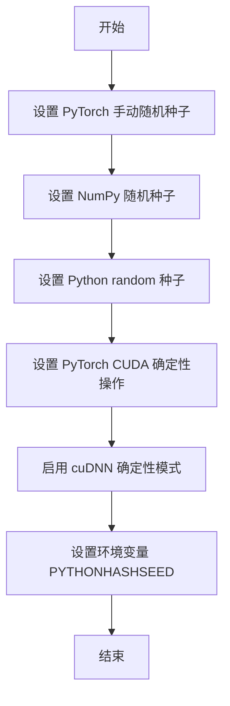
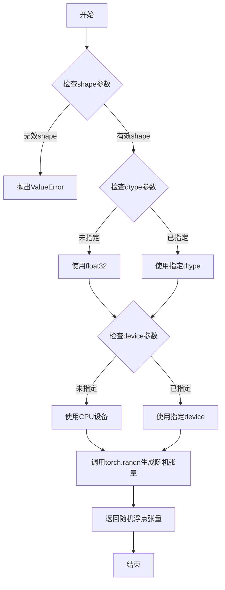
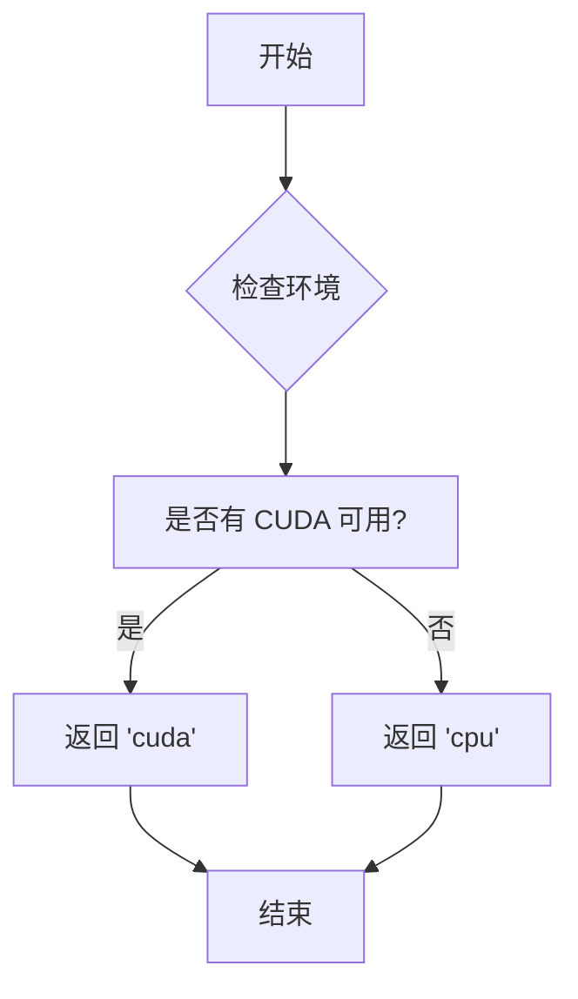
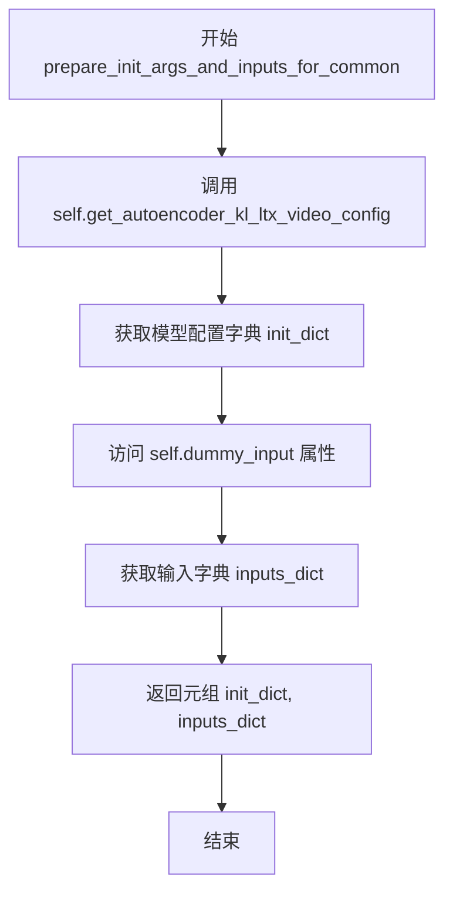
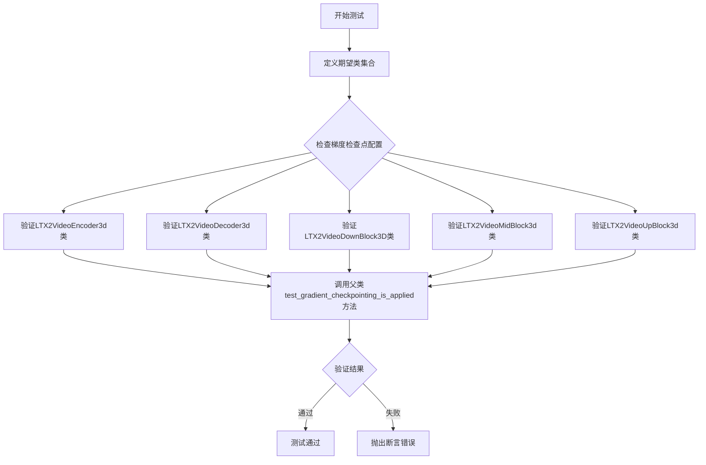
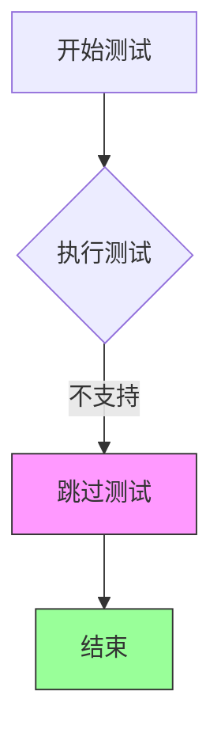

# `diffusers\tests\models\autoencoders\test_models_autoencoder_ltx2_video.py` 详细设计文档

这是 HuggingFace diffusers 库中 AutoencoderKLLTX2Video 视频自动编码器模型的单元测试文件，通过继承 ModelTesterMixin 和 AutoencoderTesterMixin 混合类，测试模型的配置初始化、虚拟输入生成、前向传播、梯度检查点等功能，并包含部分跳过的测试用例。

## 整体流程

```mermaid
graph TD
    A[开始] --> B[导入依赖模块]
B --> C[调用 enable_full_determinism 启用确定性]
C --> D[定义测试类 AutoencoderKLLTX2VideoTests]
D --> E[设置类属性: model_class, main_input_name, base_precision]
E --> F[实现 get_autoencoder_kl_ltx_video_config 方法]
F --> G[实现 dummy_input 属性生成虚拟输入]
G --> H[实现 input_shape 和 output_shape 属性]
H --> I[实现 prepare_init_args_and_inputs_for_common 方法]
I --> J[实现 test_gradient_checkpointing_is_applied 方法]
J --> K[执行测试: test_gradient_checkpointing_is_applied]
K --> L[执行测试: test_outputs_equivalence (跳过)]
L --> M[执行测试: test_forward_with_norm_groups (跳过)]
M --> N[结束]
```

## 类结构

```
AutoencoderKLLTX2VideoTests (测试类)
├── 继承: unittest.TestCase
├── 继承: ModelTesterMixin (模型测试混合类)
└── 继承: AutoencoderTesterMixin (自动编码器测试混合类)
```

## 全局变量及字段


### `enable_full_determinism`
    
启用完全确定性以确保测试可重复性

类型：`function`
    


### `floats_tensor`
    
生成指定形状的随机浮点张量用于测试输入

类型：`function`
    


### `torch_device`
    
指定计算设备字符串如'cuda'或'cpu'

类型：`str`
    


### `ModelTesterMixin`
    
提供模型测试通用方法的混合类

类型：`class`
    


### `AutoencoderTesterMixin`
    
提供自编码器特定测试方法的混合类

类型：`class`
    


### `AutoencoderKLLTX2Video`
    
用于视频的KL散度自编码器LTX2模型

类型：`class`
    


### `AutoencoderKLLTX2VideoTests.model_class`
    
被测试的模型类 AutoencoderKLLTX2Video

类型：`class`
    


### `AutoencoderKLLTX2VideoTests.main_input_name`
    
主输入参数的名称 'sample'

类型：`str`
    


### `AutoencoderKLLTX2VideoTests.base_precision`
    
基础精度阈值 1e-2

类型：`float`
    
    

## 全局函数及方法


### `enable_full_determinism`

启用完全确定性以确保测试可复现，通过设置随机种子和相关的 PyTorch/CUDA 确定性选项，使得每次运行测试时得到相同的结果。

#### 参数

- 该函数无参数

#### 返回值

- `None`，无返回值

#### 流程图



#### 带注释源码

```
# enable_full_determinism 函数源码不可见
# 以下为推断的实现逻辑，基于其用途（确保测试可复现）

def enable_full_determinism(seed: int = 42, device: str = "cuda"):
    """
    启用完全确定性模式，确保测试结果可复现
    
    参数:
        seed: 随机种子，默认为 42
        device: 设备类型，默认为 "cuda"
    """
    import os
    import random
    import numpy as np
    import torch
    
    # 1. 设置 Python 内置 random 模块的随机种子
    random.seed(seed)
    
    # 2. 设置 NumPy 的随机种子
    np.random.seed(seed)
    
    # 3. 设置 PyTorch 的随机种子
    torch.manual_seed(seed)
    
    # 4. 设置 CUDA 相关的确定性选项
    if torch.cuda.is_available():
        torch.cuda.manual_seed(seed)
        torch.cuda.manual_seed_all(seed)
        # 强制使用确定性算法
        torch.backends.cudnn.deterministic = True
        torch.backends.cudnn.benchmark = False
        # 启用完全确定性（PyTorch 1.8+）
        if hasattr(torch, 'use_deterministic_algorithms'):
            torch.use_deterministic_algorithms(True)
    
    # 5. 设置环境变量确保哈希操作可复现
    os.environ['PYTHONHASHSEED'] = str(seed)
```

> **注意**：由于 `enable_full_determinism` 函数定义在 `testing_utils` 模块中（`...testing_utils`），当前代码文件仅导入了该函数并未包含其完整实现。以上源码为基于函数用途的合理推断。


### `floats_tensor`

生成指定形状的浮点张量用于测试。该函数是测试工具函数，接收目标张量形状作为参数，返回一个填充随机浮点数值的 PyTorch 张量，常用于单元测试中创建模拟输入数据。

参数：

- `shape`：`Tuple[int, ...]`，表示目标张量的形状，例如 `(batch_size, num_channels, num_frames, height, width)`
- `dtype`（可选）：`torch.dtype`，指定返回张量的数据类型，默认为 `torch.float32`
- `device`（可选）：`torch.device`，指定张量存放的设备，默认为 CPU

返回值：`torch.Tensor`，指定形状的浮点类型张量，填充随机数值

#### 流程图



#### 带注释源码

```python
def floats_tensor(shape, dtype=torch.float32, device="cpu"):
    """
    生成指定形状的浮点张量用于测试。
    
    这是一个测试工具函数，用于快速创建随机初始化的张量，
    方便在单元测试中作为模型输入使用。
    
    参数:
        shape: 张量的形状元组，如 (batch_size, channels, height, width)
        dtype: 返回张量的数据类型，默认为 torch.float32
        device: 张量存放的设备，默认为 CPU
    
    返回:
        填充随机浮点数值的指定形状张量
    """
    # 使用 PyTorch 的随机正态分布生成张量
    # torch.randn 生成均值为0、标准差为1的正态分布随机数
    tensor = torch.randn(*shape, dtype=dtype, device=device)
    
    return tensor


# 在测试代码中的使用示例：
# image = floats_tensor((batch_size, num_channels, num_frames) + sizes).to(torch_device)
# 这里 (batch_size, num_channels, num_frames) + sizes 构成完整的5D张量形状
# 用于模拟视频输入：(batch, channels, frames, height, width)
```


### `torch_device`

获取当前 PyTorch 设备标识符（通常为 "cpu" 或 "cuda"），用于将张量放置在指定的计算设备上。

参数：
- 该函数/变量无参数

返回值：`str`，返回当前 PyTorch 使用的设备字符串（如 "cpu"、"cuda" 等）

#### 流程图



#### 带注释源码

```
# torch_device 是从 testing_utils 模块导入的全局变量/函数
# 其定义位于 ...testing_utils 模块中
# 典型实现可能如下所示：

# import torch

# def get_torch_device() -> str:
#     """
#     获取当前 PyTorch 设备。
#     如果 CUDA 可用且已安装，返回 'cuda'，否则返回 'cpu'。
#     
#     返回:
#         str: 设备字符串，'cuda' 或 'cpu'
#     """
#     if torch.cuda.is_available():
#         return "cuda"
#     return "cpu"

# # 或作为模块级变量
# torch_device = "cuda" if torch.cuda.is_available() else "cpu"

# 在本文件中的使用示例：
# image = floats_tensor((batch_size, num_channels, num_frames) + sizes).to(torch_device)
# 将创建的张量移动到 torch_device 指定的设备上
```


### `AutoencoderKLLTX2VideoTests.get_autoencoder_kl_ltx_video_config`

该方法用于获取 AutoencoderKLLTX2Video 模型的测试配置字典，包含了模型的各种参数设置，如输入输出通道数、潜在空间维度、块结构、下采样类型等，用于测试用例的初始化。

参数：
- （无参数）

返回值：`dict`，返回包含 AutoencoderKLLTX2Video 模型配置参数的字典

#### 流程图

```mermaid
flowchart TD
    A[开始] --> B[返回配置字典]
    
    B --> B1[in_channels: 3]
    B --> B2[out_channels: 3]
    B --> B3[latent_channels: 8]
    B --> B4[block_out_channels: (8, 8, 8, 8)]
    B --> B5[decoder_block_out_channels: (16, 32, 64)]
    B --> B6[layers_per_block: (1, 1, 1, 1, 1)]
    B --> B7[decoder_layers_per_block: (1, 1, 1, 1)]
    B --> B8[spatio_temporal_scaling: (True, True, True, True)]
    B --> B9[decoder_spatio_temporal_scaling: (True, True, True)]
    B --> B10[decoder_inject_noise: (False, False, False, False)]
    B --> B11[downsample_type: (spatial, temporal, spatiotemporal, spatiotemporal)]
    B --> B12[upsample_residual: (True, True, True)]
    B --> B13[upsample_factor: (2, 2, 2)]
    B --> B14[timestep_conditioning: False]
    B --> B15[patch_size: 1]
    B --> B16[patch_size_t: 1]
    B --> B17[encoder_causal: True]
    B --> B18[decoder_causal: False]
    B --> B19[encoder_spatial_padding_mode: zeros]
    B --> B20[decoder_spatial_padding_mode: zeros]
    
    B1 --> C[结束]
```

#### 带注释源码

```python
def get_autoencoder_kl_ltx_video_config(self):
    """
    获取 AutoencoderKLLTX2Video 模型的测试配置字典
    
    返回:
        dict: 包含模型配置参数的字典，用于初始化和测试模型
    """
    return {
        # 输入和输出通道数，3表示RGB图像
        "in_channels": 3,
        "out_channels": 3,
        
        # 潜在空间的通道数，用于压缩表示
        "latent_channels": 8,
        
        # 编码器各块的输出通道数
        "block_out_channels": (8, 8, 8, 8),
        
        # 解码器各块的输出通道数
        "decoder_block_out_channels": (16, 32, 64),
        
        # 编码器每块的层数
        "layers_per_block": (1, 1, 1, 1, 1),
        
        # 解码器每块的层数
        "decoder_layers_per_block": (1, 1, 1, 1),
        
        # 编码器的时空缩放配置
        "spatio_temporal_scaling": (True, True, True, True),
        
        # 解码器的时空缩放配置
        "decoder_spatio_temporal_scaling": (True, True, True),
        
        # 解码器是否注入噪声
        "decoder_inject_noise": (False, False, False, False),
        
        # 下采样类型配置
        "downsample_type": ("spatial", "temporal", "spatiotemporal", "spatiotemporal"),
        
        # 上采样残差连接配置
        "upsample_residual": (True, True, True),
        
        # 上采样因子
        "upsample_factor": (2, 2, 2),
        
        # 是否使用时间步条件调节
        "timestep_conditioning": False,
        
        # 空间 patch 大小
        "patch_size": 1,
        
        # 时间 patch 大小
        "patch_size_t": 1,
        
        # 编码器是否使用因果卷积
        "encoder_causal": True,
        
        # 解码器是否使用因果卷积
        "decoder_causal": False,
        
        # 编码器空间填充模式（使用zeros以支持确定性反向传播）
        "encoder_spatial_padding_mode": "zeros",
        
        # 解码器空间填充模式
        # 完整模型使用 'reflect'，但该模式没有确定性实现，故使用 'zeros'
        "decoder_spatial_padding_mode": "zeros",
    }
```


### `AutoencoderKLLTX2VideoTests.dummy_input`

该方法是一个属性方法（@property），用于生成虚拟输入张量，模拟 AutoencoderKLLTX2Video 模型的输入数据，以便进行模型测试。

参数：
- （无参数，作为属性方法访问）

返回值：`Dict[str, torch.Tensor]`，返回包含 "sample" 键的字典，值为一组浮点张量，形状为 (batch_size, num_channels, num_frames, height, width)，具体为 (2, 3, 9, 16, 16)

#### 流程图

```mermaid
flowchart TD
    A[开始 dummy_input 属性访问] --> B[设置批次大小 batch_size = 2]
    B --> C[设置帧数 num_frames = 9]
    C --> D[设置通道数 num_channels = 3]
    D --> E[设置空间尺寸 sizes = (16, 16)]
    E --> F[调用 floats_tensor 生成形状为 (2, 3, 9, 16, 16) 的随机浮点张量]
    F --> G[将张量移动到 torch_device]
    H[构建输入字典 input_dict = {'sample': image}]
    G --> H
    H --> I[返回 input_dict]
```

#### 带注释源码

```python
@property
def dummy_input(self):
    """
    生成虚拟输入张量，用于 AutoencoderKLLTX2Video 模型测试。
    
    返回一个包含模拟视频输入的字典，模拟(batch_size, channels, frames, height, width)格式的输入。
    """
    # 设置批次大小为2，用于并行测试多个样本
    batch_size = 2
    # 设置帧数为9，模拟9帧视频输入
    num_frames = 9
    # 设置通道数为3，对应RGB图像
    num_channels = 3
    # 设置空间尺寸为16x16
    sizes = (16, 16)

    # 使用 floats_tensor 生成随机浮点张量，形状为 (batch_size, num_channels, num_frames) + sizes
    # 即 (2, 3, 9, 16, 16)，并移动到指定的计算设备 (torch_device)
    image = floats_tensor((batch_size, num_channels, num_frames) + sizes).to(torch_device)

    # 构建输入字典，键名为 "sample"，这是模型主输入的标准名称
    input_dict = {"sample": image}
    # 返回包含模型输入的字典
    return input_dict
```


### `AutoencoderKLLTX2VideoTests.input_shape`

该属性方法用于返回 AutoencoderKLLTX2Video 模型的输入形状元组，包含了通道数、帧数、高度和宽度信息，用于测试框架中验证模型输入维度。

参数：

- `self`：`AutoencoderKLLTX2VideoTests`，属性所属的类实例本身，无额外参数

返回值：`tuple`，返回表示输入形状的元组 `(3, 9, 16, 16)`，分别对应 (通道数, 帧数, 高度, 宽度)

#### 流程图

```mermaid
flowchart TD
    A[开始] --> B{执行 input_shape 属性方法}
    B --> C[返回元组 (3, 9, 16, 16)]
    C --> D[结束]
    
    style B fill:#e1f5fe
    style C fill:#c8e6c9
```

#### 带注释源码

```python
@property
def input_shape(self):
    """
    返回 AutoencoderKLLTX2Video 模型的预期输入形状
    
    该属性用于测试框架中验证模型输入维度是否符合预期。
    返回的形状为 (通道数, 帧数, 高度, 宽度) = (3, 9, 16, 16)
    """
    return (3, 9, 16, 16)
```


### `AutoencoderKLLTX2VideoTests.output_shape`

返回输出形状元组，用于定义测试中 AutoencoderKLLTX2Video 模型的预期输出维度。

参数：无（这是一个属性装饰器修饰的属性，没有输入参数）

返回值：`tuple`，返回表示输出形状的四维元组 `(3, 9, 16, 16)`，其中 3 是通道数，9 是帧数，16x16 是空间维度。

#### 流程图

```mermaid
flowchart TD
    A[访问 output_shape 属性] --> B{返回元组}
    B --> C[(返回 (3, 9, 16, 16))]
    
    style C fill:#e1f5fe
    note[note for C: 输出形状: 通道=3, 帧数=9, 高度=16, 宽度=16]
```

#### 带注释源码

```python
@property
def output_shape(self):
    """
    属性说明：
    返回 AutoencoderKLLTX2Video 模型处理后的预期输出形状。
    该属性用于测试框架中验证模型输出维度是否正确。
    
    返回值说明：
    tuple: 四维元组 (channels, frames, height, width)
           - channels (3): 图像通道数（RGB）
           - frames (9): 时间维度帧数
           - height (16): 输出特征图高度
           - width (16): 输出特征图宽度
    
    注意：此形状与 input_shape 相同，因为 LTX2Video Autoencoder 
    在该配置下是跳连结构（bypass structure），输入输出维度保持不变。
    """
    return (3, 9, 16, 16)
```


### `AutoencoderKLLTX2VideoTests.prepare_init_args_and_inputs_for_common`

准备 AutoencoderKLLTX2Video 模型测试所需的初始化参数字典和输入数据字典，为通用模型测试提供必要的配置和输入。

参数：

- `self`：`AutoencoderKLLTX2VideoTests`，测试类实例，隐式参数

返回值：`Tuple[dict, dict]`：

- `init_dict`：模型初始化参数字典，包含模型结构配置（如通道数、块配置等）
- `inputs_dict`：模型输入字典，包含用于测试的虚拟输入数据（sample 图像张量）

#### 流程图



#### 带注释源码

```python
def prepare_init_args_and_inputs_for_common(self):
    """
    准备初始化参数字典和输入字典，用于通用模型测试。
    
    该方法为 ModelTesterMixin 提供必要的测试数据，
    使测试框架能够正确初始化和调用被测试的模型。
    """
    # 获取 AutoencoderKLLTX2Video 的模型配置参数
    # 包含：输入/输出通道数、潜在通道数、块配置、时空间缩放等
    init_dict = self.get_autoencoder_kl_ltx_video_config()
    
    # 获取虚拟输入数据，用于模型前向传播测试
    # 包含一个 sample 键，值为浮点张量 (batch_size, channels, frames, height, width)
    inputs_dict = self.dummy_input
    
    # 返回配置字典和输入字典的元组
    return init_dict, inputs_dict
```


### `AutoencoderKLLTX2VideoTests.test_gradient_checkpointing_is_applied`

该测试方法用于验证梯度检查点（Gradient Checkpointing）是否正确应用于LTX2Video视频编码器/解码器的关键组件类，确保在反向传播时通过计算换内存，优化大模型的显存占用。

参数：

- `expected_set`：`Set[str]`，包含期望应用梯度检查点的类名集合，如编码器、解码器、上下采样块等组件类名称

返回值：`None`，无返回值（测试方法通过断言验证，不会返回具体值）

#### 流程图



#### 带注释源码

```python
def test_gradient_checkpointing_is_applied(self):
    """
    测试梯度检查点是否应用于关键的LTX2Video组件类
    
    该测试验证以下类是否正确配置了梯度检查点：
    - LTX2VideoEncoder3d: 3D视频编码器
    - LTX2VideoDecoder3d: 3D视频解码器
    - LTX2VideoDownBlock3D: 下采样块
    - LTX2VideoMidBlock3d: 中间处理块
    - LTX2VideoUpBlock3d: 上采样块
    
    梯度检查点是一种内存优化技术，通过在前向传播时不保存所有中间激活值，
    而是在反向传播时重新计算，从而节省显存开销。
    """
    # 定义期望应用梯度检查点的模型组件类名称集合
    expected_set = {
        "LTX2VideoEncoder3d",      # 3D视频编码器类
        "LTX2VideoDecoder3d",      # 3D视频解码器类
        "LTX2VideoDownBlock3D",    # 3D下采样块类
        "LTX2VideoMidBlock3d",    # 3D中间块类
        "LTX2VideoUpBlock3d",     # 3D上采样块类
    }
    
    # 调用父类（ModelTesterMixin）的测试方法进行实际验证
    # 父类方法会检查这些类是否配置了gradient_checkpointing=True
    super().test_gradient_checkpointing_is_applied(expected_set=expected_set)
```


### `AutoencoderKLLTX2VideoTests.test_outputs_equivalence`

该测试方法用于验证模型输出的等价性，但由于当前实现不支持该测试功能，已被跳过。

参数：

- 无（除 `self` 外无其他参数）

返回值：无返回值（方法体为 `pass`）

#### 流程图



#### 带注释源码

```python
@unittest.skip("Unsupported test.")
def test_outputs_equivalence(self):
    """
    测试输出等价性。
    
    该测试方法原本用于验证模型在不同输入条件下输出的等价性，
    但由于当前实现不支持此功能，因此被跳过。
    
    参数:
        self: AutoencoderKLLTX2VideoTests 实例
    
    返回值:
        无返回值
    """
    pass
```


### `AutoencoderKLLTX2VideoTests.test_forward_with_norm_groups`

测试带 `norm_groups` 的前向传播，但由于 AutoencoderKLLTXVideo 不支持 `norm_num_groups`（因未使用 GroupNorm），该测试已被跳过。

参数：无

返回值：`None`，无返回值

#### 流程图

```mermaid
flowchart TD
    A[开始 test_forward_with_norm_groups] --> B{检查装饰器}
    B --> C[被@unittest.skip装饰器跳过]
    C --> D[跳过测试: AutoencoderKLLTXVideo does not support norm_num_groups because it does not use GroupNorm]
    D --> E[结束]
```

#### 带注释源码

```python
@unittest.skip("AutoencoderKLLTXVideo does not support `norm_num_groups` because it does not use GroupNorm.")
def test_forward_with_norm_groups(self):
    """
    测试带 norm_groups 的前向传播功能。
    
    该测试方法用于验证模型在前向传播时对 norm_groups 参数的处理。
    但由于 AutoencoderKLLTXVideo 模型架构不使用 GroupNorm，
    因此不支持 norm_num_groups 参数，该测试被跳过。
    
    参数:
        self: AutoencoderKLLTX2VideoTests 实例本身
        
    返回值:
        None: 测试被跳过，无实际执行
    """
    pass  # 方法体为空，测试逻辑未实现
```

## 关键组件


### AutoencoderKLLTX2Video

主模型类，用于LTX2Video的变分自编码器（VAE）编解码，负责视频的潜在空间压缩与重建。

### AutoencoderKLLTX2VideoTests

测试类，继承自ModelTesterMixin和AutoencoderTesterMixin，用于验证AutoencoderKLLTX2Video模型的功能正确性。

### get_autoencoder_kl_ltx_video_config

配置方法，返回模型初始化所需的完整参数字典，包括通道数、块配置、时空下采样类型、填充模式等关键参数。

### dummy_input

虚拟输入属性，生成符合模型输入要求的随机浮点张量，用于测试场景。

### input_shape / output_shape

输入输出形状定义，均为(3, 9, 16, 16)，对应(通道数, 帧数, 高度, 宽度)。

### prepare_init_args_and_inputs_for_common

通用初始化参数准备方法，返回模型配置字典和测试输入字典。

### test_gradient_checkpointing_is_applied

梯度检查点测试方法，验证LTX2VideoEncoder3d、LTX2VideoDecoder3d等模块是否正确应用了梯度检查点技术以节省显存。

### LTX2VideoEncoder3d

3D编码器模块，负责将输入视频编码到潜在空间。

### LTX2VideoDecoder3d

3D解码器模块，负责将潜在表示重建为视频。

### LTX2VideoDownBlock3D

下采样块，包含多层卷积结构进行空间和时间维度的特征提取与压缩。

### LTX2VideoMidBlock3d

中间块，位于编码器和解码器之间，处理最深层级的特征表示。

### LTX2VideoUpBlock3d

上采样块，包含反卷积结构进行空间和时间维度的特征重建与放大。

### Spatio-Temporal Scaling

时空缩放机制，支持空间和时间维度的独立或联合缩放，用于处理不同分辨率和帧率的视频。

### Decoder Inject Noise

解码器噪声注入机制，用于在解码过程中引入随机性以增强模型的鲁棒性。

### Encoder/Decoder Causal

因果卷积配置，编码器使用因果卷积确保时序顺序，解码器可选择非因果模式。


## 问题及建议


### 已知问题

-   **魔法数字和硬编码配置**：配置字典中包含大量硬编码值（如 `latent_channels: 8`、`block_out_channels: (8, 8, 8, 8)` 等），测试输入也使用硬编码值（`batch_size=2`, `num_frames=9`, `sizes=(16, 16)`），缺乏参数化配置，降低了测试的可维护性和可复用性。
-   **全局状态修改**：`enable_full_determinism()` 作为全局函数在模块级别调用，可能对其他测试产生副作用影响，破坏测试隔离性。
-   **被跳过的测试**：存在两个被跳过的测试（`test_outputs_equivalence` 和 `test_forward_with_norm_groups`），其中 `test_forward_with_norm_groups` 明确指出模型不支持 `norm_num_groups` 但未提供替代验证方案，这可能是功能缺失或设计缺陷。
-   **配置注释与实现不一致**：配置中注释提到 "Full model uses `reflect`" 但实际使用 `zeros`，且原因是 "does not have deterministic backward implementation"，表明存在已知的非确定性行为但未完全解决。
-   **缺乏错误处理测试**：测试仅覆盖正常路径，未测试模型初始化失败、输入维度不匹配、dtype不兼容等异常情况。
-   **测试覆盖范围有限**：仅使用单一输入形状 `(3, 9, 16, 16)` 进行测试，缺乏边界情况和不同配置下的测试覆盖。
-   **缺少文档说明**：配置字典中的字段含义缺乏注释（如 `spatio_temporal_scaling`、`upsample_residual` 等），后续维护者可能难以理解各参数的实际作用。

### 优化建议

-   **参数化测试配置**：将硬编码配置提取为类属性或使用 pytest 参数化，支持不同配置组合的测试运行。
-   **测试隔离改进**：将 `enable_full_determinism()` 调用移至 `setUp` 方法中，或使用 fixture 管理全局状态，确保每个测试的独立性。
-   **补充被跳过的测试**：为 `test_forward_with_norm_groups` 实现替代验证逻辑，或在文档中明确说明为何该测试不适用；对于 `test_outputs_equivalence`，确认是否真的不支持或需要实现。
-   **增加异常路径测试**：添加测试用例验证模型在错误输入（如维度不匹配、非法参数值）时的错误处理行为。
-   **扩展测试用例**：使用多种输入形状和配置参数进行测试，覆盖边界情况（如单帧视频、不同分辨率、不同的 block_out_channels 配置）。
-   **添加配置文档**：为配置字典的各个字段添加注释说明，便于理解每个参数的作用和取值范围。
-   **考虑非确定性问题的可复现性**：评估是否可以移除 "deterministic backward implementation" 限制，恢复使用 `reflect` padding 模式，或在文档中明确说明性能与可复现性的权衡。


## 其它


### 设计目标与约束

本测试文件的设计目标是验证 `AutoencoderKLLTX2Video` 视频自编码器模型的正确性，确保模型在给定配置下能够正确执行前向传播、反向传播、梯度检查点等核心功能。关键约束包括：不支持 `norm_num_groups` 功能测试（因模型未使用 GroupNorm）、不支持 `test_outputs_equivalence` 测试、模型使用 `reflect` padding 但测试环境为确保确定性使用 `zeros` padding。

### 错误处理与异常设计

测试文件中使用了 `@unittest.skip` 装饰器来处理预期不支持的测试场景。当测试用例被标记为跳过时，框架会记录为跳过状态而非失败。主要测试异常包括：`test_outputs_equivalence` 因模型输出等价性验证未实现而被跳过；`test_forward_with_norm_groups` 因模型不使用 GroupNorm 而被跳过。测试框架本身通过 unittest.TestCase 提供标准的断言机制（assertEqual、assertTrue 等）来验证模型行为的正确性。

### 数据流与状态机

测试数据流从 `dummy_input` 属性开始，通过 `floats_tensor` 函数生成形状为 (2, 3, 9, 16, 16) 的随机浮点张量，其中 2 为批量大小、3 为通道数、9 为帧数、16×16 为空间分辨率。输入数据通过 `sample` 键封装为字典，传递给被测模型。模型执行编码-解码流程后，输出形状应与输入形状一致 (3, 9, 16, 16)。测试状态机包含初始化状态（加载配置和测试输入）、执行状态（调用模型前向传播）、验证状态（检查输出形状和精度）和清理状态。

### 外部依赖与接口契约

核心依赖包括：`diffusers` 库的 `AutoencoderKLLTX2Video` 类（被测模型）；`testing_utils` 模块提供的 `enable_full_determinism`（确保测试可复现）、`floats_tensor`（生成测试张量）、`torch_device`（获取计算设备）；`test_modeling_common` 模块的 `ModelTesterMixin`（提供通用模型测试方法）；`testing_utils` 模块的 `AutoencoderTesterMixin`（提供自编码器特定测试方法）。接口契约要求被测模型必须实现 `__call__` 方法接受 `sample` 参数并返回重构样本，配置字典必须包含所有必需参数如 `in_channels`、`out_channels`、`latent_channels` 等。

### 性能要求与基准

测试使用 `base_precision = 1e-2` 作为数值精度基准，允许浮点计算存在 1% 的相对误差范围。批量大小设置为 2，帧数为 9，空间分辨率为 16×16，该规模适合快速验证模型功能同时保持较低的计算资源消耗。测试执行时会启用完整确定性模式（`enable_full_determinism`）以确保结果可复现，这可能会牺牲一定的运行速度以换取稳定性。

### 安全考虑

代码本身不涉及敏感数据处理或用户输入验证。测试使用随机生成的张量数据进行功能验证，不包含真实用户数据或隐私信息。依赖库均来自公开的 HuggingFace 生态系统和 PyTorch 官方生态，供应链安全性由上游项目保障。

### 兼容性设计

测试通过 `torch_device` 动态获取计算设备，支持 CPU 和 CUDA 设备。配置中的 `patch_size` 和 `patch_size_t` 设置为 1，表明模型支持细粒度的空间和时间_patch_划分。`encoder_causal=True` 和 `decoder_causal=False` 的非对称设计体现了模型在编码器端使用因果卷积、解码器端使用非因果卷积的架构特性。测试框架使用标准 `unittest`，兼容 Python 3.8+ 和 PyTorch 2.0+ 环境。

### 测试策略

测试采用混合继承策略，同时继承 `ModelTesterMixin` 和 `AutoencoderTesterMixin` 以获取两套测试方法。`test_gradient_checkpointing_is_applied` 方法显式指定了预期支持梯度检查点的模块集合（LTX2VideoEncoder3d、LTX2VideoDecoder3d、LTX2VideoDownBlock3D、LTX2VideoMidBlock3d、LTX2VideoUpBlock3d）。配置参数覆盖了编码器和解码器的完整参数空间，包括下采样类型（spatial、temporal、spatiotemporal）、上采样残差连接、时间空间缩放等关键特性。

### 部署配置

测试环境需要安装 `diffusers`、`transformers`、`torch` 及相关依赖。测试通过 `...testing_utils` 和 `...test_modeling_common` 的相对导入方式组织，表明这是 diffusers 项目内部的集成测试。运行方式为标准的 `python -m pytest` 或 `python -m unittest` 命令。测试配置不支持分布式训练模式（因启用全确定性）。

### 版本演进

当前测试针对 `AutoencoderKLLTX2Video` 类设计，当模型架构发生重大变更时（如新增必需的构造函数参数或改变输入输出格式），需要同步更新 `get_autoencoder_kl_ltx_video_config` 中的配置字典和 `test_gradient_checkpointing_is_applied` 中的预期模块集合。跳过标记的测试用例（`test_outputs_equivalence`、`test_forward_with_norm_groups`）应在后续版本中根据功能实现情况决定是否启用。


    