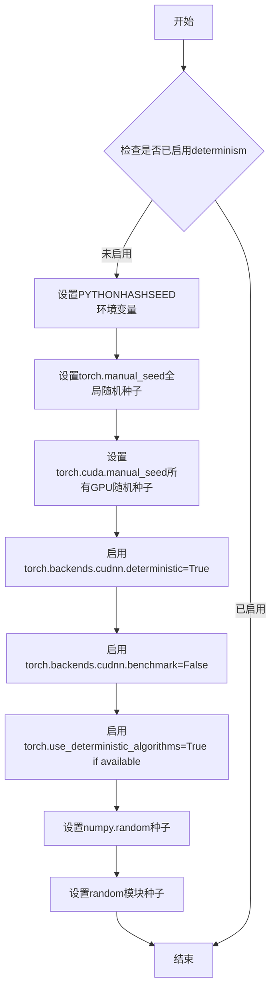
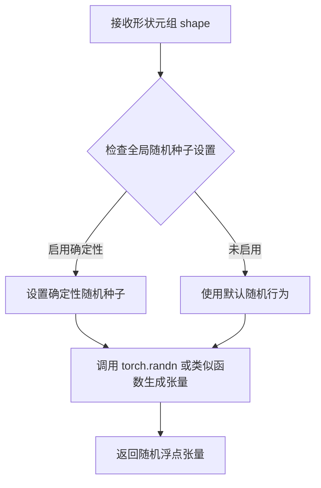
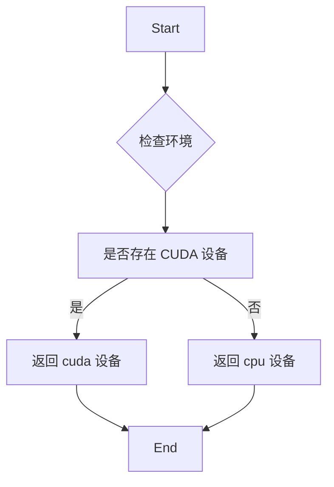
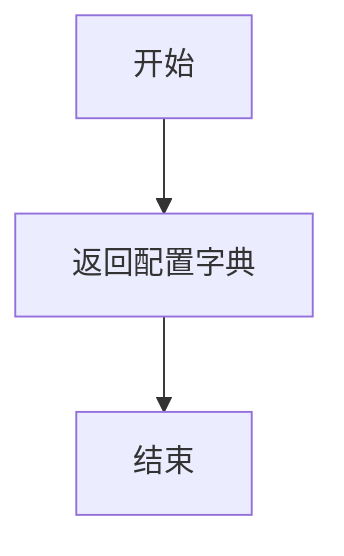
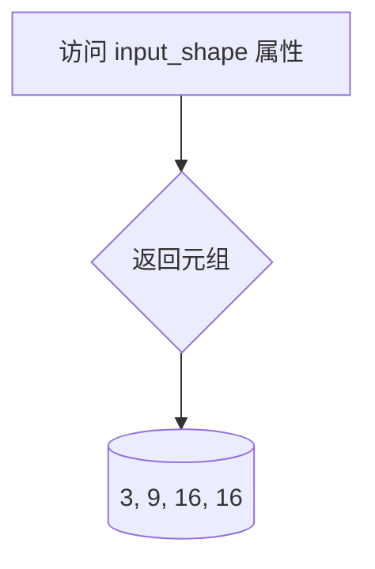
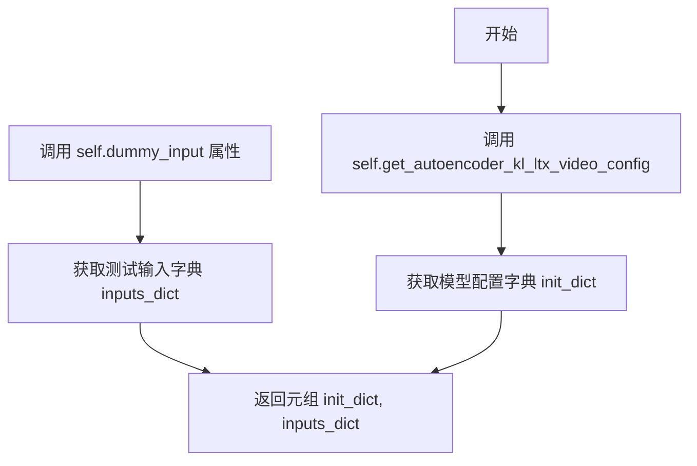
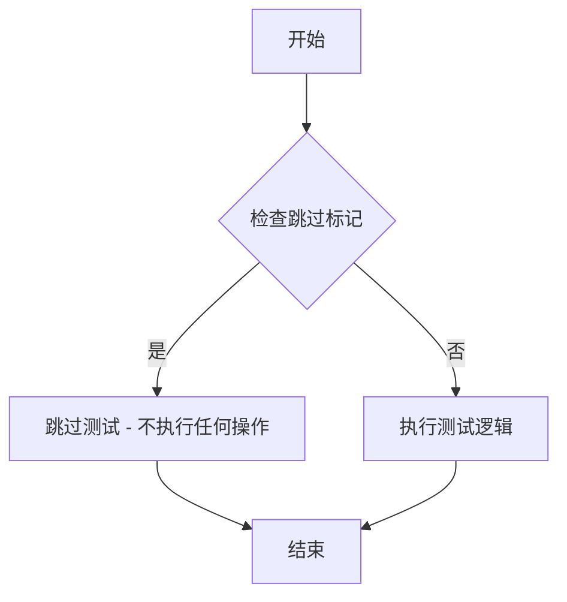
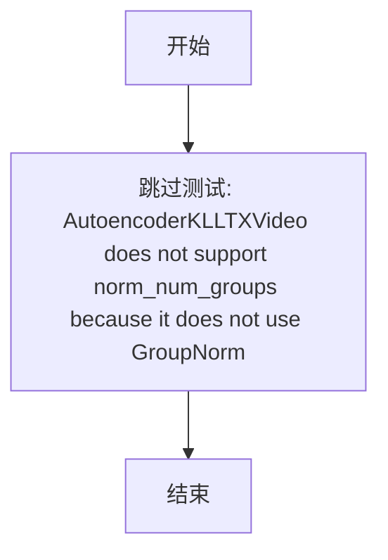

# `diffusers\tests\models\autoencoders\test_models_autoencoder_ltx_video.py` 详细设计文档

这是针对AutoencoderKLLTXVideo（LTXVideo变分自编码器）的单元测试文件，包含两个测试类（090和091版本），分别测试不同的模型配置、梯度检查点功能、输出等价性以及前向传播等核心功能。

## 整体流程

```mermaid
graph TD
    A[开始测试] --> B[获取模型配置]
B --> C[准备虚拟输入 dummy_input]
C --> D{执行测试用例}
D --> E[test_gradient_checkpointing_is_applied]
D --> F[test_outputs_equivalence (跳过)]
D --> G[test_forward_with_norm_groups (跳过)]
E --> H[验证梯度检查点是否应用于特定模块]
H --> I[测试结束]
```

## 类结构

```
unittest.TestCase
├── AutoencoderKLLTXVideo090Tests (继承ModelTesterMixin, AutoencoderTesterMixin)
└── AutoencoderKLLTXVideo091Tests (继承ModelTesterMixin)
```

## 全局变量及字段


### `model_class`
    
测试的模型类，指向 AutoencoderKLLTXVideo

类型：`type`
    


### `main_input_name`
    
主输入参数的名称，用于测试时引用模型输入

类型：`str`
    


### `base_precision`
    
用于数值比较的基本精度阈值，设置为 0.01

类型：`float`
    


### `batch_size`
    
输入数据的批量大小，用于创建虚拟输入

类型：`int`
    


### `num_frames`
    
视频帧数，定义输入的时间维度

类型：`int`
    


### `num_channels`
    
输入图像的通道数，RGB 图像为 3

类型：`int`
    


### `sizes`
    
空间维度大小，定义输入图像的高度和宽度

类型：`tuple`
    


### `image`
    
虚拟输入图像张量，用于模型前向传播测试

类型：`torch.Tensor`
    


### `timestep`
    
用于时间条件的时间步张量，仅在 timestep_conditioning 为 True 时使用

类型：`torch.Tensor`
    


### `init_dict`
    
模型初始化参数字典，包含模型架构配置

类型：`dict`
    


### `inputs_dict`
    
模型输入参数字典，包含 sample 和可选的 temb

类型：`dict`
    


### `expected_set`
    
预期支持梯度检查点的模型组件集合

类型：`set`
    


### `in_channels`
    
输入图像的通道数

类型：`int`
    


### `out_channels`
    
输出图像的通道数

类型：`int`
    


### `latent_channels`
    
潜在空间的通道数，用于 VAE 编码器输出

类型：`int`
    


### `block_out_channels`
    
编码器块输出通道数的元组配置

类型：`tuple`
    


### `decoder_block_out_channels`
    
解码器块输出通道数的元组配置

类型：`tuple`
    


### `layers_per_block`
    
每个编码器块中包含的层数元组

类型：`tuple`
    


### `decoder_layers_per_block`
    
每个解码器块中包含的层数元组

类型：`tuple`
    


### `spatio_temporal_scaling`
    
编码器时空缩放配置元组，控制是否在空间和时间维度进行下采样

类型：`tuple`
    


### `decoder_spatio_temporal_scaling`
    
解码器时空缩放配置元组，控制是否在空间和时间维度进行上采样

类型：`tuple`
    


### `decoder_inject_noise`
    
解码器噪声注入配置元组，用于训练时向解码器注入噪声

类型：`tuple`
    


### `upsample_residual`
    
上采样残差连接配置元组

类型：`tuple`
    


### `upsample_factor`
    
上采样因子元组，定义每个阶段的放大倍数

类型：`tuple`
    


### `timestep_conditioning`
    
是否启用时间步条件，用于基于时间的模型

类型：`bool`
    


### `patch_size`
    
空间维度的 patch 大小，用于 patch 化处理

类型：`int`
    


### `patch_size_t`
    
时间维度的 patch 大小，用于时空 patch 化处理

类型：`int`
    


### `encoder_causal`
    
编码器是否使用因果卷积，确保时间因果性

类型：`bool`
    


### `decoder_causal`
    
解码器是否使用因果卷积

类型：`bool`
    


### `AutoencoderKLLTXVideo090Tests.model_class`
    
测试的模型类，指向 AutoencoderKLLTXVideo

类型：`type`
    


### `AutoencoderKLLTXVideo090Tests.main_input_name`
    
主输入参数的名称，值为 'sample'

类型：`str`
    


### `AutoencoderKLLTXVideo090Tests.base_precision`
    
用于数值比较的基本精度阈值，设置为 0.01

类型：`float`
    


### `AutoencoderKLLTXVideo091Tests.model_class`
    
测试的模型类，指向 AutoencoderKLLTXVideo

类型：`type`
    


### `AutoencoderKLLTXVideo091Tests.main_input_name`
    
主输入参数的名称，值为 'sample'

类型：`str`
    


### `AutoencoderKLLTXVideo091Tests.base_precision`
    
用于数值比较的基本精度阈值，设置为 0.01

类型：`float`
    
    

## 全局函数及方法


### `enable_full_determinism`

该函数用于在测试环境中启用完全确定性模式，通过设置 PyTorch 和相关库的随机种子以及deterministic运算选项，确保测试结果的可重复性。

参数：此函数无参数。

返回值：无返回值（`None`），执行完成后直接作用于全局状态。

#### 流程图



#### 带注释源码

```python
# 注意：以下为推断的标准实现，原始代码仅导入此函数
# 实际实现位于 ...testing_utils 模块中

def enable_full_determinism(seed: int = 42):
    """
    启用完全确定性模式，确保测试结果可重复。
    
    参数：
        seed: 随机种子值，默认为42
    """
    # 1. 设置Python哈希seed，确保hash()结果一致
    import os
    os.environ["PYTHONHASHSEED"] = str(seed)
    
    # 2. 设置PyTorch CPU随机种子
    import torch
    torch.manual_seed(seed)
    
    # 3. 设置PyTorch CUDA所有GPU随机种子
    if torch.cuda.is_available():
        torch.cuda.manual_seed(seed)
        torch.cuda.manual_seed_all(seed)
    
    # 4. 强制使用确定性算法，禁用非确定性优化
    torch.backends.cudnn.deterministic = True
    torch.backends.cudnn.benchmark = False
    
    # 5. 尝试启用确定性算法（PyTorch 1.8+）
    if hasattr(torch, 'use_deterministic_algorithms'):
        try:
            torch.use_deterministic_algorithms(True)
        except RuntimeError:
            # 某些操作可能不支持确定性实现
            pass
    
    # 6. 设置numpy随机种子
    try:
        import numpy as np
        np.random.seed(seed)
    except ImportError:
        pass
    
    # 7. 设置Python random模块种子
    import random
    random.seed(seed)
```


### `floats_tensor`

生成指定形状的随机浮点数 PyTorch 张量，常用于深度学习模型测试中生成模拟输入数据。

参数：

-  `shape`：`tuple`，张量的形状，格式为 (batch_size, channels, frames, height, width) 或类似的维度组合

返回值：`torch.Tensor`，包含随机浮点数的 PyTorch 张量

#### 流程图



#### 带注释源码

```python
# floats_tensor 是从 testing_utils 模块导入的辅助函数
# 该函数在测试代码中被广泛用于生成随机张量

# 使用示例 1 - 来自 AutoencoderKLLTXVideo090Tests.dummy_input
batch_size = 2
num_frames = 9
num_channels = 3
sizes = (16, 16)

# 生成形状为 (2, 3, 9, 16, 16) 的随机浮点张量
# shape = (batch_size, num_channels, num_frames) + sizes
image = floats_tensor((batch_size, num_channels, num_frames) + sizes).to(torch_device)

# 使用示例 2 - 来自 AutoencoderKLLTXVideo091Tests.dummy_input
batch_size = 2
num_frames = 9
num_channels = 3
sizes = (16, 16)

# 同样生成形状为 (2, 3, 9, 16, 16) 的随机浮点张量
image = floats_tensor((batch_size, num_channels, num_frames) + sizes).to(torch_device)
timestep = torch.tensor([0.05] * batch_size, device=torch_device)

# 函数签名推断：
# def floats_tensor(shape: tuple, 
#                   dtype: torch.dtype = torch.float32, 
#                   device: str = 'cpu',
#                   low: float = -1.0, 
#                   high: float = 1.0) -> torch.Tensor:
#     """
#     生成指定形状的随机浮点数张量
#     
#     参数:
#         shape: 张量的形状元组
#         dtype: 张量的数据类型，默认为 torch.float32
#         device: 张量存放的设备，默认为 'cpu'
#         low: 随机数范围下限，默认为 -1.0
#         high: 随机数范围上限，默认为 1.0
#     
#     返回:
#         随机浮点张量
#     """
#     return torch.rand(shape, dtype=dtype, device=device) * (high - low) + low
```

#### 注意事项

该函数定义在 `diffusers` 包的 `testing_utils` 模块中，未在当前代码文件中直接实现。它通常用于：
1. 生成随机输入张量以测试模型的前向传播
2. 确保测试的可重复性（配合 `enable_full_determinism` 使用）
3. 模拟真实的图像/视频输入数据格式


### `torch_device`

`torch_device` 是一个从 `testing_utils` 模块导入的全局变量，用于指定 PyTorch 张量应放置的设备（通常是 "cuda" 或 "cpu"），以确保测试在正确的设备上运行。

参数：无

返回值：`str`，返回 PyTorch 设备字符串（如 "cuda"、"cpu" 或 "cuda:0"）

#### 流程图



#### 带注释源码

```
# torch_device 是从 testing_utils 模块导入的全局变量
# 其实际实现通常如下（基于使用方式推断）:

def get_torch_device():
    """
    获取当前可用的 PyTorch 设备。
    
    Returns:
        str: 设备字符串，如果 CUDA 可用则返回 'cuda'，否则返回 'cpu'
    """
    import torch
    
    if torch.cuda.is_available():
        return "cuda"
    else:
        return "cpu"

# 在实际代码中的使用方式：
# image = floats_tensor((batch_size, num_channels, num_frames) + sizes).to(torch_device)
# timestep = torch.tensor([0.05] * batch_size, device=torch_device)

# torch_device 在此处作为设备标识符使用
# 决定了张量会被加载到 GPU 还是 CPU 上进行计算
```


### `AutoencoderKLLTXVideo090Tests.get_autoencoder_kl_ltx_video_config`

该方法返回一个包含 LTX Video VAE 模型配置参数的字典，用于初始化和测试 AutoencoderKLLTXVideo 模型（版本 0.90），包含编码器/解码器通道数、时空缩放设置、降噪注入开关等配置。

参数：无

返回值：`dict`，包含模型初始化所需的配置参数字典

#### 流程图



#### 带注释源码

```python
def get_autoencoder_kl_ltx_video_config(self):
    """
    获取 AutoencoderKLLTXVideo 模型的测试配置参数（版本 0.90）
    
    Returns:
        dict: 包含模型配置参数的字典
    """
    return {
        # 输入输出通道数
        "in_channels": 3,
        "out_channels": 3,
        # 潜在空间通道数
        "latent_channels": 8,
        # 编码器块输出通道数
        "block_out_channels": (8, 8, 8, 8),
        # 解码器块输出通道数
        "decoder_block_out_channels": (8, 8, 8, 8),
        # 每个编码器块的层数
        "layers_per_block": (1, 1, 1, 1, 1),
        # 每个解码器块的层数
        "decoder_layers_per_block": (1, 1, 1, 1, 1),
        # 编码器时空缩放配置
        "spatio_temporal_scaling": (True, True, False, False),
        # 解码器时空缩放配置
        "decoder_spatio_temporal_scaling": (True, True, False, False),
        # 解码器噪声注入开关
        "decoder_inject_noise": (False, False, False, False, False),
        # 上采样残差连接配置
        "upsample_residual": (False, False, False, False),
        # 上采样因子
        "upsample_factor": (1, 1, 1, 1),
        # 时间步条件开关
        "timestep_conditioning": False,
        # 空间patch大小
        "patch_size": 1,
        # 时间patch大小
        "patch_size_t": 1,
        # 编码器因果掩码开关
        "encoder_causal": True,
        # 解码器因果掩码开关
        "decoder_causal": False,
    }
```

---

### `AutoencoderKLLTXVideo091Tests.get_autoencoder_kl_ltx_video_config`

该方法返回一个包含 LTX Video VAE 模型配置参数的字典，用于初始化和测试 AutoencoderKLLTXVideo 模型（版本 0.91），与 0.90 版本相比，配置了更深的解码器结构、启用了时间步条件编码和噪声注入等功能。

参数：无

返回值：`dict`，包含模型初始化所需的配置参数字典

#### 流程图


#### 带注释源码

```python
def get_autoencoder_kl_ltx_video_config(self):
    """
    获取 AutoencoderKLLTXVideo 模型的测试配置参数（版本 0.91）
    
    Returns:
        dict: 包含模型配置参数的字典
    """
    return {
        # 输入输出通道数
        "in_channels": 3,
        "out_channels": 3,
        # 潜在空间通道数
        "latent_channels": 8,
        # 编码器块输出通道数
        "block_out_channels": (8, 8, 8, 8),
        # 解码器块输出通道数（递增结构）
        "decoder_block_out_channels": (16, 32, 64),
        # 每个编码器块的层数
        "layers_per_block": (1, 1, 1, 1),
        # 每个解码器块的层数
        "decoder_layers_per_block": (1, 1, 1, 1),
        # 编码器时空缩放配置
        "spatio_temporal_scaling": (True, True, True, False),
        # 解码器时空缩放配置
        "decoder_spatio_temporal_scaling": (True, True, True),
        # 解码器噪声注入开关（启用）
        "decoder_inject_noise": (True, True, True, False),
        # 上采样残差连接配置（启用）
        "upsample_residual": (True, True, True),
        # 上采样因子
        "upsample_factor": (2, 2, 2),
        # 时间步条件开关（启用）
        "timestep_conditioning": True,
        # 空间patch大小
        "patch_size": 1,
        # 时间patch大小
        "patch_size_t": 1,
        # 编码器因果掩码开关
        "encoder_causal": True,
        # 解码器因果掩码开关
        "decoder_causal": False,
    }
```


### `AutoencoderKLLTXVideo091Tests.dummy_input`

该属性方法用于生成测试 `AutoencoderKLLTXVideo` 模型的虚拟输入数据，构造一个包含图像样本和时间步的字典，支持带有时间步条件（timestep conditioning）的模型测试场景。

参数：
- `self`：`AutoencoderKLLTXVideo091Tests`，当前测试类实例

返回值：`Dict[str, torch.Tensor]`，包含模型输入的字典，其中键为 `sample`（图像张量）和 `temb`（时间步张量）

#### 流程图

```mermaid
flowchart TD
    A[开始] --> B[设置batch_size=2, num_frames=9, num_channels=3, sizes=16x16]
    --> C[使用floats_tensor生成随机图像张量<br/>形状: (2, 3, 9, 16, 16)]
    --> D[将图像张量移动到torch_device设备]
    --> E[创建时间步张量timestep<br/>值: [0.05, 0.05], 设备: torch_device]
    --> F[返回字典<br/>{sample: image, temb: timestep}]
```

#### 带注释源码

```python
@property
def dummy_input(self):
    """
    生成用于测试AutoencoderKLLTXVideo模型的虚拟输入数据。
    
    返回值包含:
    - sample: 随机初始化的图像张量，形状为 (batch_size, num_channels, num_frames, height, width)
    - temb: 时间步张量，用于支持时间步条件化的模型配置
    """
    # 批处理大小
    batch_size = 2
    # 视频帧数
    num_frames = 9
    # 图像通道数 (RGB)
    num_channels = 3
    # 图像空间尺寸 (高度, 宽度)
    sizes = (16, 16)

    # 生成随机浮点数张量，形状: (2, 3, 9, 16, 16)
    # 对应 (batch_size, num_channels, num_frames, height, width)
    image = floats_tensor((batch_size, num_channels, num_frames) + sizes).to(torch_device)

    # 创建时间步张量，用于时间步条件化
    # 值为0.05，形状: (batch_size,)
    timestep = torch.tensor([0.05] * batch_size, device=torch_device)

    # 返回包含样本和时间步的字典
    return {"sample": image, "temb": timestep}
```

---

### `AutoencoderKLLTXVideo090Tests.dummy_input`

该属性方法用于生成测试 `AutoencoderKLLTXVideo` 模型的虚拟输入数据，构造一个仅包含图像样本的字典，适用于不支持时间步条件的基础模型测试场景。

参数：
- `self`：`AutoencoderKLLTXVideo090Tests`，当前测试类实例

返回值：`Dict[str, torch.Tensor]`，包含模型输入的字典，其中键为 `sample`（图像张量）

#### 流程图

```mermaid
flowchart TD
    A[开始] --> B[设置batch_size=2, num_frames=9, num_channels=3, sizes=16x16]
    --> C[使用floats_tensor生成随机图像张量<br/>形状: (2, 3, 9, 16, 16)]
    --> D[将图像张量移动到torch_device设备]
    --> E[返回字典<br/>{sample: image}]
```

#### 带注释源码

```python
@property
def dummy_input(self):
    """
    生成用于测试AutoencoderKLLTXVideo模型的虚拟输入数据。
    
    返回值仅包含:
    - sample: 随机初始化的图像张量，形状为 (batch_size, num_channels, num_frames, height, width)
    
    注意: 此版本不包含temb，适用于不支持timestep_conditioning的模型配置
    """
    # 批处理大小
    batch_size = 2
    # 视频帧数
    num_frames = 9
    # 图像通道数 (RGB)
    num_channels = 3
    # 图像空间尺寸 (高度, 宽度)
    sizes = (16, 16)

    # 生成随机浮点数张量，形状: (2, 3, 9, 16, 16)
    # 对应 (batch_size, num_channels, num_frames, height, width)
    image = floats_tensor((batch_size, num_channels, num_frames) + sizes).to(torch_device)

    # 返回仅包含样本的字典（无temb）
    return {"sample": image}
```


### `AutoencoderKLLTXVideo090Tests.input_shape`

该属性方法用于返回模型的输入形状，定义了在单元测试中使用的输入张量的维度结构。

参数：无

返回值：`tuple`，返回表示输入形状的元组 (3, 9, 16, 16)，其中 3 表示通道数，9 表示帧数，16x16 表示空间维度。

#### 流程图



#### 带注释源码

```python
@property
def input_shape(self):
    """
    返回模型的输入形状。
    
    返回值:
        tuple: 形状为 (channels, frames, height, width) 的元组 (3, 9, 16, 16)
               - 3: 通道数 (RGB 图像)
               - 9: 帧数 (视频帧数)
               - 16: 高度
               - 16: 宽度
    """
    return (3, 9, 16, 16)
```

---

### `AutoencoderKLLTXVideo091Tests.input_shape`

该属性方法用于返回模型的输入形状，定义了在单元测试中使用的输入张量的维度结构。

参数：无

返回值：`tuple`，返回表示输入形状的元组 (3, 9, 16, 16)，其中 3 表示通道数，9 表示帧数，16x16 表示空间维度。

#### 流程图


#### 带注释源码

```python
@property
def input_shape(self):
    """
    返回模型的输入形状。
    
    返回值:
        tuple: 形状为 (channels, frames, height, width) 的元组 (3, 9, 16, 16)
               - 3: 通道数 (RGB 图像)
               - 9: 帧数 (视频帧数)
               - 16: 高度
               - 16: 宽度
    """
    return (3, 9, 16, 16)
```


### `output_shape`

这是一个测试类中的属性方法，用于返回模型期望的输出张量形状。在 `AutoencoderKLLTXVideo090Tests` 和 `AutoencoderKLLTXVideo091Tests` 两个测试类中都有定义，用于验证模型前向传播输出的形状是否符合预期。

参数： 无

返回值：`tuple`，期望的输出张量形状，格式为 (通道数, 帧数, 高度, 宽度)，具体值为 (3, 9, 16, 16)，即 3 通道、9 帧、16x16 像素分辨率。

#### 流程图

```mermaid
flowchart TD
    A[测试框架调用 output_shape 属性] --> B{获取 output_shape 返回值}
    B --> C[返回元组 (3, 9, 16, 16)]
    C --> D[与模型实际输出形状进行比对验证]
    D --> E[形状匹配: 测试通过]
    D --> F[形状不匹配: 测试失败]
```

#### 带注释源码

```python
@property
def output_shape(self):
    """
    返回模型期望的输出张量形状。
    
    该属性定义了 AutoencoderKLLTXVideo 模型在给定输入配置下的
    期望输出维度，用于测试框架验证模型输出的形状正确性。
    
    Returns:
        tuple: 期望的输出形状，格式为 (channels, frames, height, width)
               - channels: 3 (RGB 三通道)
               - frames: 9 (视频帧数)
               - height: 16 (输出高度)
               - width: 16 (输出宽度)
    """
    return (3, 9, 16, 16)
```


### `AutoencoderKLLTXVideo090Tests.prepare_init_args_and_inputs_for_common`

该方法用于为测试用例准备初始化参数和输入数据。它调用配置获取方法得到模型初始化参数字典，并调用虚拟输入属性获取测试输入数据，最后将两者以元组形式返回。

参数：
- 该方法无显式参数（仅包含 `self`）

返回值：`Tuple[Dict, Dict]`，返回包含初始化参数字典和输入字典的元组，供测试框架的通用测试方法使用。

#### 流程图



#### 带注释源码

```python
def prepare_init_args_and_inputs_for_common(self):
    """
    为通用测试准备初始化参数和输入数据。
    
    此方法供 ModelTesterMixin 中的通用测试方法使用，
    用于获取模型初始化所需参数字典和测试输入数据。
    
    Returns:
        Tuple[Dict, Dict]: 包含两个字典的元组:
            - init_dict: 模型初始化参数字典
            - inputs_dict: 测试输入数据字典
    """
    # 获取模型配置参数
    init_dict = self.get_autoencoder_kl_ltx_video_config()
    
    # 获取测试用的虚拟输入数据
    inputs_dict = self.dummy_input
    
    # 返回参数字典和输入字典的元组
    return init_dict, inputs_dict
```


### `AutoencoderKLLTXVideo090Tests.test_gradient_checkpointing_is_applied`

这是一个测试方法，用于验证梯度检查点（Gradient Checkpointing）是否正确应用于 AutoencoderKLLTXVideo 模型中的特定组件。

参数：

- `self`：隐式参数，类型为 `AutoencoderKLLTXVideo090Tests`（unittest.TestCase 的子类），表示测试用例实例本身

返回值：`None`，该方法通过调用父类的测试方法来验证梯度检查点是否应用于指定的模块集合，测试结果通过 unittest 框架的断言机制报告

#### 流程图

```mermaid
flowchart TD
    A[开始测试] --> B[定义期望的模块集合 expected_set]
    B --> C{验证梯度检查点}
    C -->|调用父类方法| D[super().test_gradient_checkpointing_is_applied]
    D --> E[检查指定模块是否启用梯度检查点]
    E --> F{测试通过?}
    F -->|是| G[测试通过]
    F -->|否| H[测试失败]
    G --> I[结束]
    H --> I
```

#### 带注释源码

```python
def test_gradient_checkpointing_is_applied(self):
    """
    测试梯度检查点是否被正确应用到指定的 LTXVideo 模块。
    
    该方法验证 AutoencoderKLLTXVideo 模型中的编码器、解码器以及
    各个模块（DownBlock、MidBlock、UpBlock）是否启用了梯度检查点功能。
    """
    # 定义期望启用梯度检查点的模块名称集合
    expected_set = {
        "LTXVideoEncoder3d",      # 3D 视频编码器模块
        "LTXVideoDecoder3d",     # 3D 视频解码器模块
        "LTXVideoDownBlock3D",   # 3D 下采样块模块
        "LTXVideoMidBlock3d",    # 3D 中间块模块
        "LTXVideoUpBlock3d",     # 3D 上采样块模块
    }
    # 调用父类的测试方法，传入期望的模块集合进行验证
    super().test_gradient_checkpointing_is_applied(expected_set=expected_set)
```

---

### `AutoencoderKLLTXVideo091Tests.test_gradient_checkpointing_is_applied`

这是一个测试方法，用于验证梯度检查点（Gradient Checkping）是否正确应用于 AutoencoderKLLVideo 模型（版本 091）中的特定组件。

参数：

- `self`：隐式参数，类型为 `AutoencoderKLLTXVideo091Tests`（unittest.TestCase 的子类），表示测试用例实例本身

返回值：`None`，该方法通过调用父类的测试方法来验证梯度检查点是否应用于指定的模块集合，测试结果通过 unittest 框架的断言机制报告

#### 流程图

```mermaid
flowchart TD
    A[开始测试] --> B[定义期望的模块集合 expected_set]
    B --> C{验证梯度检查点}
    C -->|调用父类方法| D[super().test_gradient_checkpointing_is_applied]
    D --> E[检查指定模块是否启用梯度检查点]
    E --> F{测试通过?}
    F -->|是| G[测试通过]
    F -->|否| H[测试失败]
    G --> I[结束]
    H --> I
```

#### 带注释源码

```python
def test_gradient_checkpointing_is_applied(self):
    """
    测试梯度检查点是否被正确应用到指定的 LTXVideo 模块（091 版本）。
    
    该方法验证 AutoencoderKLLTXVideo 模型（091 配置版本）中的编码器、
    解码器以及各个模块（DownBlock、MidBlock、UpBlock）是否启用了
    梯度检查点功能。
    """
    # 定义期望启用梯度检查点的模块名称集合
    expected_set = {
        "LTXVideoEncoder3d",      # 3D 视频编码器模块
        "LTXVideoDecoder3d",     # 3D 视频解码器模块
        "LTXVideoDownBlock3D",   # 3D 下采样块模块
        "LTXVideoMidBlock3d",    # 3D 中间块模块
        "LTXVideoUpBlock3d",     # 3D 上采样块模块
    }
    # 调用父类的测试方法，传入期望的模块集合进行验证
    super().test_gradient_checkpointing_is_applied(expected_set=expected_set)
```


### `AutoencoderKLLTXVideo090Tests.test_outputs_equivalence`

该方法是一个测试用例，用于验证模型输出的等价性。当前实现被 `@unittest.skip` 装饰器跳过，因此不执行任何操作。

参数：

- `self`：`AutoencoderKLLTXVideo090Tests`，测试类实例本身，用于访问测试类的属性和方法

返回值：`None`，由于方法被跳过，不返回任何值

#### 流程图



#### 带注释源码

```python
@unittest.skip("Unsupported test.")
def test_outputs_equivalence(self):
    """
    测试模型输出的等价性。
    
    该测试用例被跳过，原因是 AutoencoderKLLTXVideo 模型不支持此测试。
    """
    pass  # 占位符，不执行任何测试逻辑
```


### `AutoencoderKLLTXVideo090Tests.test_forward_with_norm_groups`

该测试方法用于验证 AutoencoderKLLTXVideo 模型在 norm_num_groups 参数下的前向传播功能，但由于该模型不使用 GroupNorm，因此该测试被跳过。

参数：

- `self`：`AutoencoderKLLTXVideo090Tests`，测试类实例本身

返回值：`None`，该方法不返回任何值

#### 流程图



#### 带注释源码

```python
@unittest.skip("AutoencoderKLLTXVideo does not support `norm_num_groups` because it does not use GroupNorm.")
def test_forward_with_norm_groups(self):
    """
    测试 AutoencoderKLLTXVideo 模型的前向传播，使用 norm_num_groups 参数。
    
    注意：该测试被跳过，因为 AutoencoderKLLTXVideo 模型不使用 GroupNorm，
    因此不支持 norm_num_groups 参数。
    """
    pass
```

---

### `AutoencoderKLLTXVideo091Tests.test_forward_with_norm_groups`

该测试方法用于验证 AutoencoderKLLTXVideo 模型在 norm_num_groups 参数下的前向传播功能，但由于该模型不使用 GroupNorm，因此该测试被跳过。

参数：

- `self`：`AutoencoderKLLTXVideo091Tests`，测试类实例本身

返回值：`None`，该方法不返回任何值

#### 流程图


#### 带注释源码

```python
@unittest.skip("AutoencoderKLLTXVideo does not support `norm_num_groups` because it does not use GroupNorm.")
def test_forward_with_norm_groups(self):
    """
    测试 AutoencoderKLLTXVideo 模型的前向传播，使用 norm_num_groups 参数。
    
    注意：该测试被跳过，因为 AutoencoderKLLTXVideo 模型不使用 GroupNorm，
    因此不支持 norm_num_groups 参数。
    """
    pass
```


### `AutoencoderKLLTXVideo090Tests.get_autoencoder_kl_ltx_video_config`

该方法用于获取 AutoencoderKLLTXVideo 模型在 0.9.0 版本测试中的配置参数，返回一个包含模型输入输出通道、潜在空间维度、块结构、时空缩放等关键配置的字典，供测试框架初始化模型和准备测试输入使用。

参数： 无

返回值：`Dict[str, Any]`，返回一个包含 AutoencoderKLLTXVideo 模型完整配置参数的字典，包括通道数、块维度、每块层数、时空缩放开关、时间步条件化、patch 大小、因果掩码等配置项。

#### 流程图

```mermaid
flowchart TD
    A[开始] --> B[创建配置字典]
    B --> C[设置 in_channels: 3]
    C --> D[设置 out_channels: 3]
    D --> E[设置 latent_channels: 8]
    E --> F[设置 block_out_channels: (8, 8, 8, 8)]
    F --> G[设置 decoder_block_out_channels: (8, 8, 8, 8)]
    G --> H[设置 layers_per_block: (1, 1, 1, 1, 1)]
    H --> I[设置 decoder_layers_per_block: (1, 1, 1, 1, 1)]
    I --> J[设置 spatio_temporal_scaling: (True, True, False, False)]
    J --> K[设置 decoder_spatio_temporal_scaling: (True, True, False, False)]
    K --> L[设置 decoder_inject_noise: (False, False, False, False, False)]
    L --> M[设置 upsample_residual: (False, False, False, False)]
    M --> N[设置 upsample_factor: (1, 1, 1, 1)]
    N --> O[设置 timestep_conditioning: False]
    O --> P[设置 patch_size: 1]
    P --> Q[设置 patch_size_t: 1]
    Q --> R[设置 encoder_causal: True]
    R --> S[设置 decoder_causal: False]
    S --> T[返回配置字典]
```

#### 带注释源码

```python
def get_autoencoder_kl_ltx_video_config(self):
    """
    获取 AutoencoderKLLTXVideo 0.9.0 版本测试配置
    
    该方法返回一个包含模型初始化所需的完整配置字典，
    用于测试框架中的模型实例化和输入准备。
    
    Returns:
        Dict[str, Any]: 模型配置参数字典
    """
    return {
        # 输入和输出通道数，3 表示 RGB 图像
        "in_channels": 3,
        "out_channels": 3,
        
        # 潜在空间通道数，用于 VAE 的编码/解码
        "latent_channels": 8,
        
        # 编码器各层的输出通道数配置
        "block_out_channels": (8, 8, 8, 8),
        
        # 解码器各层的输出通道数配置
        "decoder_block_out_channels": (8, 8, 8, 8),
        
        # 编码器每块中的层数
        "layers_per_block": (1, 1, 1, 1, 1),
        
        # 解码器每块中的层数
        "decoder_layers_per_block": (1, 1, 1, 1, 1),
        
        # 编码器时空缩放开关配置 (高度、宽度、时间维度)
        "spatio_temporal_scaling": (True, True, False, False),
        
        # 解码器时空缩放开关配置
        "decoder_spatio_temporal_scaling": (True, True, False, False),
        
        # 解码器噪声注入配置
        "decoder_inject_noise": (False, False, False, False, False),
        
        # 上采样残差连接配置
        "upsample_residual": (False, False, False, False),
        
        # 上采样因子配置
        "upsample_factor": (1, 1, 1, 1),
        
        # 是否使用时间步条件化
        "timestep_conditioning": False,
        
        # 空间 patch 大小
        "patch_size": 1,
        
        # 时间 patch 大小
        "patch_size_t": 1,
        
        # 编码器是否使用因果掩码
        "encoder_causal": True,
        
        # 解码器是否使用因果掩码
        "decoder_causal": False,
    }
```


### `AutoencoderKLLTXVideo090Tests.dummy_input`

该属性方法用于生成测试用例所需的虚拟输入数据，创建一个包含随机浮点数张量的字典，模拟视频编码器的输入样本，用于验证 AutoencoderKLLTXVideo 模型的前向传播功能。

参数：无（该方法为属性方法，通过 `@property` 装饰器定义，无显式参数）

返回值：`Dict[str, torch.Tensor]`，返回包含 "sample" 键的字典，其中值为形状为 (batch_size, num_channels, num_frames, height, width) 的浮点张量

#### 流程图

```mermaid
flowchart TD
    A[开始] --> B[设置批次大小: batch_size=2]
    B --> C[设置帧数: num_frames=9]
    C --> D[设置通道数: num_channels=3]
    D --> E[设置空间尺寸: sizes=(16, 16)]
    E --> F[使用floats_tensor生成随机张量]
    F --> G[转换为torch_device设备]
    G --> H[构建返回字典: {sample: image}]
    H --> I[结束并返回字典]
```

#### 带注释源码

```python
@property
def dummy_input(self):
    """
    生成用于测试的虚拟输入数据。
    
    该属性方法创建一个模拟视频输入的张量，用于AutoencoderKLLTXVideo模型的
    前向传播测试和参数初始化验证。
    """
    # 批次大小：一次前向传播处理的样本数量
    batch_size = 2
    # 帧数：视频的时序长度
    num_frames = 9
    # 通道数：图像通道（RGB为3）
    num_channels = 3
    # 空间尺寸：每帧图像的高度和宽度
    sizes = (16, 16)

    # 使用测试工具函数生成指定形状的随机浮点数张量
    # 形状: (batch_size, num_channels, num_frames) + sizes = (2, 3, 9, 16, 16)
    # 即: [批次, 通道, 时间帧, 高度, 宽度]
    image = floats_tensor((batch_size, num_channels, num_frames) + sizes).to(torch_device)

    # 返回包含模型输入的字典
    # 'sample' 是模型主输入参数的名称（由 main_input_name = "sample" 定义）
    return {"sample": image}
```


### `AutoencoderKLLTXVideo090Tests.input_shape`

这是一个测试类中的属性方法，用于返回 AutoencoderKLLTXVideo 模型在测试用例中的预期输入形状。该属性定义了视频输入的通道数、帧数以及空间维度（高度和宽度），供测试框架在验证模型前向传播时使用输入数据的维度验证。

参数：

- `self`：隐式参数，类型为 `AutoencoderKLLTXVideo090Tests`，代表测试类实例本身，无需显式传递

返回值：`tuple`，返回表示输入张量形状的元组 `(3, 9, 16, 16)`，其中 3 表示通道数（RGB），9 表示帧数，16×16 表示空间分辨率

#### 流程图

```mermaid
flowchart TD
    A[调用 input_shape 属性] --> B{获取属性值}
    B --> C[返回元组 (3, 9, 16, 16)]
    C --> D[测试框架使用该形状验证输入维度]
    
    style A fill:#f9f,stroke:#333
    style C fill:#9f9,stroke:#333
    style D fill:#ff9,stroke:#333
```

#### 带注释源码

```python
@property
def input_shape(self):
    """
    返回测试用的输入形状。
    
    该属性定义了 AutoencoderKLLTXVideo090Tests 测试类在进行模型验证时
    所使用的输入张量预期形状。返回的元组表示 (channels, frames, height, width)。
    
    参数:
        self: AutoencoderKLLTXVideo090Tests 实例，属性方法的隐式调用者
        
    返回值:
        tuple: 形状元组 (3, 9, 16, 16)
               - 3:  输入通道数（RGB三通道）
               - 9:  视频帧数
               - 16: 输入高度
               - 16: 输入宽度
    """
    return (3, 9, 16, 16)
```


### `AutoencoderKLLTXVideo090Tests.output_shape`

该属性定义了 AutoencoderKLLTXVideo 模型在测试阶段的期望输出形状，返回一个表示通道数、帧数、高度和宽度的元组。

参数：

- `self`：`AutoencoderKLLTXVideo090Tests`，隐式参数，指向测试类实例本身

返回值：`Tuple[int, int, int, int]`，返回形状元组 (3, 9, 16, 16)，分别代表通道数（3）、时间帧数（9）、高度（16）和宽度（16）

#### 流程图

```mermaid
flowchart TD
    A[开始] --> B[返回输出形状元组]
    B --> C[(3, 9, 16, 16)]
    C --> D[结束]
    
    style A fill:#f9f,color:#000
    style C fill:#9f9,color:#000
    style D fill:#f9f,color:#000
```

#### 带注释源码

```python
@property
def output_shape(self):
    """
    属性: output_shape
    描述: 返回期望的模型输出形状，用于测试验证
    返回值: Tuple[int, int, int, int] - (通道数, 帧数, 高度, 宽度)
    """
    return (3, 9, 16, 16)  # (channels=3, frames=9, height=16, width=16)
```


### `AutoencoderKLLTXVideo090Tests.prepare_init_args_and_inputs_for_common`

该方法用于准备 AutoencoderKLLTXVideo 模型测试所需的初始化参数和输入数据，返回一个包含模型配置字典和测试输入字典的元组，供通用测试框架使用。

参数：

- `self`：`AutoencoderKLLTXVideo090Tests` 实例，隐式参数，无需显式传递

返回值：`Tuple[Dict, Dict]`

- `init_dict`：`Dict`，模型初始化配置字典，包含 in_channels、out_channels、latent_channels、block_out_channels 等参数
- `inputs_dict`：`Dict`，测试输入字典，包含 sample 键，其值为浮点张量

#### 流程图

```mermaid
flowchart TD
    A[开始 prepare_init_args_and_inputs_for_common] --> B[调用 self.get_autoencoder_kl_ltx_video_config 获取配置]
    B --> C[调用 self.dummy_input 获取测试输入]
    C --> D[返回元组 init_dict, inputs_dict]
    
    B -->|返回| B1[init_dict 包含配置参数]
    C -->|返回| C1[inputs_dict 包含 sample 键]
```

#### 带注释源码

```python
def prepare_init_args_and_inputs_for_common(self):
    """
    准备模型初始化参数和输入数据，供通用测试框架使用。
    
    该方法整合了模型配置和测试输入，形成标准化的测试参数元组，
    用于 TestCase 中与 ModelTesterMixin 兼容的各种测试方法。
    
    Returns:
        Tuple[Dict, Dict]: 包含以下两个元素的元组：
            - init_dict: 模型配置字典，包含以下键值对：
                * in_channels: 3 (输入通道数)
                * out_channels: 3 (输出通道数)
                * latent_channels: 8 (潜在空间通道数)
                * block_out_channels: (8, 8, 8, 8) (编码器块输出通道)
                * decoder_block_out_channels: (8, 8, 8, 8) (解码器块输出通道)
                * layers_per_block: (1, 1, 1, 1, 1) (每块层数)
                * decoder_layers_per_block: (1, 1, 1, 1, 1) (解码器每块层数)
                * spatio_temporal_scaling: (True, True, False, False) (时空缩放)
                * decoder_spatio_temporal_scaling: (True, True, False, False) (解码器时空缩放)
                * decoder_inject_noise: (False, False, False, False, False) (解码器噪声注入)
                * upsample_residual: (False, False, False, False) (上采样残差)
                * upsample_factor: (1, 1, 1, 1) (上采样因子)
                * timestep_conditioning: False (时间步条件)
                * patch_size: 1 (空间块大小)
                * patch_size_t: 1 (时间块大小)
                * encoder_causal: True (编码器因果)
                * decoder_causal: False (解码器非因果)
            - inputs_dict: 测试输入字典，包含以下键值对：
                * sample: Tensor，形状为 (batch_size, num_channels, num_frames, height, width)
                          即 (2, 3, 9, 16, 16) 的浮点张量
    """
    # 获取模型配置参数字典
    init_dict = self.get_autoencoder_kl_ltx_video_config()
    
    # 获取测试用的虚拟输入数据
    inputs_dict = self.dummy_input
    
    # 返回配置和输入的元组，供测试框架使用
    return init_dict, inputs_dict
```


### `AutoencoderKLLTXVideo090Tests.test_gradient_checkpointing_is_applied`

该方法是一个测试用例，用于验证梯度检查点（Gradient Checkpointing）优化是否正确应用于 AutoencoderKLLTXVideo 模型的相关组件（编码器、解码器及其子模块）上。

参数：

- `expected_set`：`set`，期望应用梯度检查点的模型组件类名集合，包含 `LTXVideoEncoder3d`、`LTXVideoDecoder3d`、`LTXVideoDownBlock3D`、`LTXVideoMidBlock3d`、`LTXVideoUpBlock3d` 这五个类

返回值：`None`，该方法为测试方法，无返回值，通过断言验证父类方法的执行结果

#### 流程图

```mermaid
flowchart TD
    A[开始 test_gradient_checkpointing_is_applied] --> B[定义 expected_set 集合]
    B --> C{验证 expected_set 内容}
    C -->|包含5个组件类名| D[调用父类测试方法]
    D --> E[super.test_gradient_checkpointing_is_applied<br/>expected_set=expected_set]
    E --> F[结束]
    
    style B fill:#e1f5fe
    style D fill:#fff3e0
    style E fill:#e8f5e9
```

#### 带注释源码

```python
def test_gradient_checkpointing_is_applied(self):
    """
    测试梯度检查点是否正确应用于模型的关键组件上。
    
    该测试方法继承自 ModelTesterMixin，用于验证 AutoencoderKLLTXVideo 
    模型在训练时是否启用了梯度检查点优化，以节省显存占用。
    """
    # 定义期望应用梯度检查点的模型组件类名集合
    # 这些是 LTXVideo 视频自动编码器的核心组件
    expected_set = {
        "LTXVideoEncoder3d",      # 3D视频编码器
        "LTXVideoDecoder3d",      # 3D视频解码器
        "LTXVideoDownBlock3D",    # 下采样块
        "LTXVideoMidBlock3d",     # 中间层块
        "LTXVideoUpBlock3d",      # 上采样块
    }
    # 调用父类的测试方法，验证这些组件是否启用了梯度检查点
    # 父类方法会遍历模型的所有模块，检查 expected_set 中的模块
    # 是否正确配置了 gradient_checkpointing 属性
    super().test_gradient_checkpointing_is_applied(expected_set=expected_set)
```


### `AutoencoderKLLTXVideo090Tests.test_outputs_equivalence`

该测试方法用于验证模型输出的等价性，但由于 AutoencoderKLLTXVideo 不支持此测试，已被标记为跳过。

参数：无（除了隐式的 `self` 参数）

返回值：`None`，无返回值（方法体为空，仅包含 `pass` 语句）

#### 流程图

```mermaid
flowchart TD
    A[开始测试] --> B{检查是否跳过测试}
    B -->|是| C[跳过测试并退出]
    B -->|否| D[执行等价性验证逻辑]
    D --> E[比较输出结果]
    E --> F[断言输出等价]
    F --> G[结束测试]
    
    style C fill:#f9f,stroke:#333
    style G fill:#9f9,stroke:#333
```

#### 带注释源码

```python
@unittest.skip("Unsupported test.")  # 装饰器：跳过此测试，原因是 AutoencoderKLLTXVideo 不支持输出等价性验证
def test_outputs_equivalence(self):
    """
    测试方法：验证模型输出的等价性
    
    注意：
    - 该测试被跳过，原因是 AutoencoderKLLTXVideo 模型的输出等价性无法通过现有测试框架验证
    - 可能原因包括：
      1. 模型架构不支持确定性输出
      2. 随机性操作导致输出不一致
      3. 缺少参考实现用于对比
    """
    pass  # 空方法体，由于测试被跳过，不执行任何验证逻辑
```


### `AutoencoderKLLTXVideo090Tests.test_forward_with_norm_groups`

这是一个被跳过的测试方法，用于测试 AutoencoderKLLTXVideo 模型的前向传播是否支持 `norm_groups` 参数。由于 AutoencoderKLLTXVideo 不使用 GroupNorm，因此该测试被标记为不支持。

参数：

- `self`：`unittest.TestCase`，测试类的实例，代表当前测试对象

返回值：`None`，测试方法不返回任何值

#### 流程图

```mermaid
flowchart TD
    A[开始测试] --> B{检查norm_groups支持}
    B -->|不支持| C[跳过测试 - 原因: 不使用GroupNorm]
    C --> D[结束 - 返回None]
```

#### 带注释源码

```python
@unittest.skip("AutoencoderKLLTXVideo does not support `norm_num_groups` because it does not use GroupNorm.")
def test_forward_with_norm_groups(self):
    """
    测试AutoencoderKLLTXVideo模型的forward方法是否支持norm_groups参数。
    
    跳过原因: AutoencoderKLLTXVideo模型架构不使用GroupNorm层，
    因此不支持norm_groups参数，该测试被标记为跳过。
    """
    pass
```


### `AutoencoderKLLTXVideo091Tests.get_autoencoder_kl_ltx_video_config`

该方法是一个测试辅助函数，用于获取 AutoencoderKLLTXVideo091 模型测试所需的配置参数字典，定义了视频自编码器的通道数、块结构、缩放策略等核心参数。

参数：

- 无显式参数（隐式参数 `self` 为测试类实例）

返回值：`dict`，返回包含 17 个配置项的字典，定义了 AutoencoderKLLTXVideo 模型的结构参数，包括输入/输出通道、潜在通道、块输出通道、每层块数、时空缩放配置等。

#### 流程图

```mermaid
flowchart TD
    A[开始] --> B[调用 get_autoencoder_kl_ltx_video_config 方法]
    B --> C[返回配置字典]
    C --> D[包含以下配置项:<br/>in_channels: 3<br/>out_channels: 3<br/>latent_channels: 8<br/>block_out_channels: (8,8,8,8)<br/>decoder_block_out_channels: (16,32,64)<br/>layers_per_block: (1,1,1,1)<br/>decoder_layers_per_block: (1,1,1,1)<br/>spatio_temporal_scaling: (True,True,True,False)<br/>decoder_spatio_temporal_scaling: (True,True,True)<br/>decoder_inject_noise: (True,True,True,False)<br/>upsample_residual: (True,True,True)<br/>upsample_factor: (2,2,2)<br/>timestep_conditioning: True<br/>patch_size: 1<br/>patch_size_t: 1<br/>encoder_causal: True<br/>decoder_causal: False]
    D --> E[结束]
```

#### 带注释源码

```python
def get_autoencoder_kl_ltx_video_config(self):
    """
    获取 AutoencoderKLLTXVideo091 测试配置参数
    
    Returns:
        dict: 包含模型配置项的字典，用于初始化和测试 AutoencoderKLLTXVideo 模型
    """
    return {
        # 输入和输出通道配置
        "in_channels": 3,          # 输入图像通道数 (RGB)
        "out_channels": 3,         # 输出图像通道数 (RGB)
        
        # 潜在空间配置
        "latent_channels": 8,      # 潜在空间的通道数，用于压缩表示
        
        # 编码器块配置
        "block_out_channels": (8, 8, 8, 8),  # 编码器各输出块的通道数
        "layers_per_block": (1, 1, 1, 1, 1),  # 每个编码器块的层数
        
        # 解码器块配置
        "decoder_block_out_channels": (16, 32, 64),  # 解码器各输出块的通道数
        "decoder_layers_per_block": (1, 1, 1, 1),    # 每个解码器块的层数
        
        # 时空缩放配置
        "spatio_temporal_scaling": (True, True, True, False),   # 编码器的时空缩放开关
        "decoder_spatio_temporal_scaling": (True, True, True),  # 解码器的时空缩放开关
        
        # 噪声注入配置
        "decoder_inject_noise": (True, True, True, False),  # 解码器各层是否注入噪声
        
        # 上采样配置
        "upsample_residual": (True, True, True),   # 是否使用残差连接的上采样
        "upsample_factor": (2, 2, 2),              # 各层的上采样因子
        
        # 时间步条件配置
        "timestep_conditioning": True,  # 是否启用时间步条件化（用于扩散模型）
        
        # 补丁化配置
        "patch_size": 1,    # 空间补丁大小
        "patch_size_t": 1,  # 时间补丁大小
        
        # 因果掩码配置
        "encoder_causal": True,   # 编码器是否使用因果掩码
        "decoder_causal": False,  # 解码器是否使用因果掩码
    }
```


### `AutoencoderKLLTXVideo091Tests.dummy_input`

该属性方法用于生成测试所需的虚拟输入数据返回一个包含样本图像和时间步信息的字典，主要用于 AutoencoderKLLTXVideo 模型的单元测试。

参数：
- 无参数（作为 `@property` 装饰的属性访问）

返回值：`Dict[str, torch.Tensor]`，返回包含模型输入所需的样本图像张量（sample）和时间步张量（temb）的字典

#### 流程图

```mermaid
flowchart TD
    A[开始 dummy_input 属性访问] --> B[设置批量大小: batch_size=2]
    B --> C[设置帧数: num_frames=9]
    C --> D[设置通道数: num_channels=3]
    D --> E[设置空间尺寸: sizes=(16, 16)]
    E --> F[生成图像张量: floats_tensor((2,3,9,16,16))]
    F --> G[将图像移至计算设备: .to(torch_device)]
    G --> H[生成时间步张量: torch.tensor([0.05]*2)]
    H --> I[将时间步移至计算设备: .to(torch_device)]
    I --> J[构建返回字典: {sample: image, temb: timestep}]
    J --> K[返回字典]
```

#### 带注释源码

```python
@property
def dummy_input(self):
    """
    生成用于模型测试的虚拟输入数据。
    
    返回一个包含样本图像和时间步信息的字典，用于模拟真实的推理输入。
    """
    # 批量大小
    batch_size = 2
    # 视频帧数
    num_frames = 9
    # 图像通道数（RGB）
    num_channels = 3
    # 空间分辨率（高度 x 宽度）
    sizes = (16, 16)

    # 使用 floats_tensor 生成指定形状的浮点型张量
    # 最终形状: (batch_size, num_channels, num_frames, height, width) = (2, 3, 9, 16, 16)
    image = floats_tensor((batch_size, num_channels, num_frames) + sizes).to(torch_device)

    # 生成时间步张量，值为 0.05（代表归一化后的时间步）
    # 形状: (batch_size,) = (2,)
    timestep = torch.tensor([0.05] * batch_size, device=torch_device)

    # 返回包含样本和时间步的字典，供模型前向传播使用
    return {"sample": image, "temb": timestep}
```


### `AutoencoderKLLTXVideo091Tests.input_shape`

该属性方法定义了测试用例的输入数据形状，用于指定 AutoencoderKLLTXVideo 模型在测试期间的预期输入维度。

参数：

- `self`：测试类实例本身，无需显式传递

返回值：`tuple`，返回输入数据的形状元组，格式为 (channels, frames, height, width)

#### 流程图

```mermaid
flowchart TD
    A[调用 input_shape 属性] --> B[返回元组 (3, 9, 16, 16)]
    
    B --> C[3: 通道数<br/>9: 帧数<br/>16: 高度<br/>16: 宽度]
    
    style A fill:#e1f5fe
    style B fill:#e8f5e8
    style C fill:#fff3e0
```

#### 带注释源码

```python
@property
def input_shape(self):
    """
    定义测试输入的形状。
    
    返回值:
        tuple: 形状元组 (通道数, 帧数, 高度, 宽度)
               - 3: 颜色通道数 (RGB)
               - 9: 时间帧数 (视频长度)
               - 16: 空间高度
               - 16: 空间宽度
    """
    return (3, 9, 16, 16)
```

---

**备注**：这是一个 `@property` 装饰器定义的只读属性，用于测试框架中定义模型的预期输入维度。该属性返回一个四维元组，遵循 PyTorch 深度学习框架的常用约定：(N, C, T, H, W)，但这里省略了批处理维度 N，只定义了单样本的形状。


### `AutoencoderKLLTXVideo091Tests.output_shape`

该属性定义了 AutoencoderKLLTXVideo091Tests 测试类的输出形状，用于指定自编码器在测试过程中的期望输出维度。

参数：

- `self`：测试类实例本身，无需显式传递

返回值：`Tuple[int, int, int, int]`，返回模型输出的形状元组，格式为 (通道数, 帧数, 高度, 宽度)

#### 流程图

```mermaid
flowchart TD
    A[访问 output_shape 属性] --> B{返回元组}
    B --> C[(3, 9, 16, 16)]
    C --> D[表示: 3通道, 9帧, 16x16空间分辨率]
```

#### 带注释源码

```python
@property
def output_shape(self):
    """
    定义测试用例的期望输出形状。
    
    返回值:
        tuple: 包含4个整数的元组，依次表示:
            - 通道数 (channels): 3
            - 帧数 (frames): 9
            - 高度 (height): 16
            - 宽度 (width): 16
            
    注意:
        此属性与 input_shape 相同，因为 AutoencoderKL 
        通常保持输入输出的空间维度不变（仅在潜在空间中进行编码/解码）
    """
    return (3, 9, 16, 16)
```


### `AutoencoderKLLTXVideo091Tests.prepare_init_args_and_inputs_for_common`

该方法用于准备 AutoencoderKLLTXVideo 模型测试所需的初始化参数字典和输入数据字典，是测试框架的通用初始化方法，为模型实例化和前向传播测试提供必要的配置和输入。

参数：

- `self`：`AutoencoderKLLTXVideo091Tests`，表示类的实例本身

返回值：`Tuple[Dict, Dict]`，返回包含模型初始化配置字典和输入数据字典的元组
- `init_dict`：`Dict`，模型初始化参数字典，包含 in_channels、out_channels、latent_channels、block_out_channels 等配置
- `inputs_dict`：`Dict`，输入数据字典，包含 sample（视频张量）和 temb（时间步）键

#### 流程图

```mermaid
flowchart TD
    A[开始 prepare_init_args_and_inputs_for_common] --> B[调用 get_autoencoder_kl_ltx_video_config 获取配置]
    B --> C[获取 dummy_input 属性值]
    C --> D[返回 init_dict 和 inputs_dict 元组]
    
    B --> B1[配置包含: in_channels=3, out_channels=3, latent_channels=8]
    B1 --> B2[block_out_channels=(8,8,8,8), decoder_block_out_channels=(16,32,64)]
    B2 --> B3[spatio_temporal_scaling, decoder_spatio_temporal_scaling等]
    
    C --> C1[batch_size=2, num_frames=9, num_channels=3, sizes=(16,16)]
    C1 --> C2[构建 sample 图像张量 shape: (2,3,9,16,16)]
    C2 --> C3[构建 timestep 张量 shape: (2,)]
```

#### 带注释源码

```python
def prepare_init_args_and_inputs_for_common(self):
    """
    准备模型测试所需的初始化参数和输入数据。
    
    Returns:
        Tuple[Dict, Dict]: 包含两个字典的元组:
            - init_dict: 模型初始化参数字典
            - inputs_dict: 包含 sample 和 temb 的输入字典
    """
    # 获取 AutoencoderKLLTXVideo 模型配置参数
    # 包含输入/输出通道数、潜在空间维度、块通道配置、层数等
    init_dict = self.get_autoencoder_kl_ltx_video_config()
    
    # 获取测试用虚拟输入数据
    # 包含视频张量 (sample) 和时间步张量 (temb)
    inputs_dict = self.dummy_input
    
    # 返回配置字典和输入字典的元组
    # 供 ModelTesterMixin 测试框架使用
    return init_dict, inputs_dict
```

#### 关联配置和方法说明

**相关联的 `get_autoencoder_kl_ltx_video_config` 方法返回的配置：**
```python
{
    "in_channels": 3,
    "out_channels": 3,
    "latent_channels": 8,
    "block_out_channels": (8, 8, 8, 8),
    "decoder_block_out_channels": (16, 32, 64),
    "layers_per_block": (1, 1, 1, 1),
    "decoder_layers_per_block": (1, 1, 1, 1),
    "spatio_temporal_scaling": (True, True, True, False),
    "decoder_spatio_temporal_scaling": (True, True, True),
    "decoder_inject_noise": (True, True, True, False),
    "upsample_residual": (True, True, True),
    "upsample_factor": (2, 2, 2),
    "timestep_conditioning": True,
    "patch_size": 1,
    "patch_size_t": 1,
    "encoder_causal": True,
    "decoder_causal": False,
}
```

**相关联的 `dummy_input` 属性返回的输入：**
```python
{
    "sample": torch.Tensor,  # shape: (2, 3, 9, 16, 16) - 批量大小2, 通道3, 帧数9, 空间16x16
    "temb": torch.Tensor     # shape: (2,) - 时间步张量，值为 0.05
}
```


### `AutoencoderKLLTXVideo091Tests.test_gradient_checkpointing_is_applied`

该测试方法用于验证梯度检查点（Gradient Checkpointing）功能是否正确应用于 `LTXVideoEncoder3d`、`LTXVideoDecoder3d`、`LTXVideoDownBlock3D`、`LTXVideoMidBlock3d` 和 `LTXVideoUpBlock3d` 这五个核心模块，确保在训练过程中能够通过梯度检查点技术有效节省显存。

参数：
- 该方法无显式参数，但内部通过 `expected_set` 变量定义了期望应用梯度检查点的模块类名集合

返回值：`None`，该方法为测试用例，执行验证逻辑但不返回具体值

#### 流程图

```mermaid
flowchart TD
    A[开始测试] --> B[定义期望模块集合 expected_set]
    B --> C[调用父类测试方法]
    C --> D{梯度检查点是否正确应用?}
    D -->|是| E[测试通过]
    D -->|否| F[测试失败/抛出异常]
    E --> G[结束]
    F --> G
```

#### 带注释源码

```python
def test_gradient_checkpointing_is_applied(self):
    """
    测试梯度检查点是否被正确应用到指定的LTXVideo模型组件上。
    
    该测试方法验证以下模块是否启用了梯度检查点:
    - LTXVideoEncoder3d: 3D视频编码器
    - LTXVideoDecoder3d: 3D视频解码器
    - LTXVideoDownBlock3D: 下采样块
    - LTXVideoMidBlock3d: 中间块
    - LTXVideoUpBlock3d: 上采样块
    """
    # 定义期望应用梯度检查点的模块类名集合
    expected_set = {
        "LTXVideoEncoder3d",      # 3D视频编码器类名
        "LTXVideoDecoder3d",      # 3D视频解码器类名
        "LTXVideoDownBlock3D",    # 3D视频下采样块类名
        "LTXVideoMidBlock3d",     # 3D视频中间块类名
        "LTXVideoUpBlock3d",      # 3D视频上采样块类名
    }
    
    # 调用父类的梯度检查点测试方法，传入期望的模块集合
    # 父类方法将遍历模型结构，检查这些模块是否启用了梯度检查点
    super().test_gradient_checkpointing_is_applied(expected_set=expected_set)
```


### `AutoencoderKLLTXVideo091Tests.test_outputs_equivalence`

该方法是`AutoencoderKLLTXVideo091Tests`测试类中的一个测试用例，用于验证模型的输出等价性。由于被`@unittest.skip`装饰器标记为"Unsupported test"，该测试当前被跳过，不执行任何验证逻辑。

参数：

- `self`：无参数，`AutoencoderKLLTXVideo091Tests`类的实例方法隐式接收的当前测试对象

返回值：`None`，该方法不返回任何值（方法体为`pass`语句）

#### 流程图

```mermaid
flowchart TD
    A[开始测试 test_outputs_equivalence] --> B{检查装饰器}
    B --> C[@unittest.skip 装饰器存在]
    C --> D{装饰器条件}
    D -->|True| E[跳过测试 - 标记为 Unsupported test]
    D -->|False| F[执行测试逻辑]
    E --> G[测试结束 - 状态为 SKIPPED]
    F --> H[传递/失败]
    G --> I[结束]
    H --> I
```

#### 带注释源码

```python
@unittest.skip("Unsupported test.")
def test_outputs_equivalence(self):
    """
    测试输出等价性的方法。
    
    该测试用例被设计用于验证AutoencoderKLLTXVideo模型在不同输入
    条件下输出的等价性，但由于当前版本不支持此测试功能，已被
    @unittest.skip装饰器跳过。
    
    参数:
        self: AutoencoderKLLTXVideo091Tests类的实例
        
    返回值:
        None
        
    注意:
        - 该测试当前被跳过，不执行任何验证逻辑
        - 跳过原因: "Unsupported test."
    """
    pass  # 空方法体，测试被跳过
```


### `AutoencoderKLLTXVideo091Tests.test_forward_with_norm_groups`

该测试方法用于验证 AutoencoderKLLTXVideo 模型在前向传播时对 `norm_num_groups` 参数的支持，但由于该模型不使用 GroupNorm，因此该测试被跳过。

参数：

- `self`：`AutoencoderKLLTXVideo091Tests`，测试类实例本身

返回值：`None`，该方法没有返回值（被跳过的测试用例）

#### 流程图

```mermaid
flowchart TD
    A[开始执行 test_forward_with_norm_groups] --> B{检查测试是否需要跳过}
    B -->|是| C[跳过测试并输出原因]
    B -->|否| D[执行测试逻辑]
    C --> E[结束]
    D --> E
    
    style C fill:#f9f,stroke:#333
    style E fill:#9f9,stroke:#333
```

#### 带注释源码

```python
@unittest.skip("AutoencoderKLLTXVideo does not support `norm_num_groups` because it does not use GroupNorm.")
def test_forward_with_norm_groups(self):
    """
    测试 AutoencoderKLLTXVideo 模型的前向传播是否支持 norm_num_groups 参数。
    
    该测试方法原本用于验证模型的 norm_num_groups 功能，但由于 AutoencoderKLLTXVideo
    实现中不使用 GroupNorm 层，因此该功能不被支持。测试被装饰器 @unittest.skip 跳过，
    跳过原因为："AutoencoderKLLTXVideo does not support `norm_num_groups` because it does not use GroupNorm."
    
    参数:
        self: AutoencoderKLLTXVideo091Tests 实例
        
    返回值:
        None: 该方法不执行任何测试逻辑，直接跳过
    """
    pass
```

## 关键组件


### AutoencoderKLLTXVideo

LTXVideo视频自编码器模型的测试套件，支持KL潜空间压缩，用于视频编码/解码任务。

### AutoencoderKLLTXVideo090Tests

针对版本0.9.0的测试类，包含 spatio_temporal_scaling=False 的配置，用于测试非时序缩放场景下的模型前向传播和梯度检查点。

### AutoencoderKLLTXVideo091Tests

针对版本0.9.1的测试类，包含 timestep_conditioning=True 配置，用于测试带时间步条件注入的模型功能。

### get_autoencoder_kl_ltx_video_config

配置工厂方法，返回模型初始化参数字典，包含 in_channels、out_channels、latent_channels、block_out_channels、decoder_block_out_channels、layers_per_block、spatio_temporal_scaling、decoder_spatio_temporal_scaling、upsample_factor、patch_size 等关键参数。

### dummy_input

测试用虚拟输入生成器，通过 floats_tensor 生成 (batch_size, num_channels, num_frames, height, width) 形状的随机浮点数张量，用于模型前向传播测试。

### test_gradient_checkpointing_is_applied

梯度检查点验证方法，检查 LTXVideoEncoder3d、LTXVideoDecoder3d、LTXVideoDownBlock3D、LTXVideoMidBlock3d、LTXVideoUpBlock3d 等模块是否启用了梯度检查点以节省显存。

### ModelTesterMixin

通用模型测试混入类，提供模型一致性检查、参数初始化、梯度计算等标准化测试方法。

### AutoencoderTesterMixin

自编码器专用测试混入类，提供重构输出形状验证、潜在空间验证等自编码器特定测试逻辑。

### 关键组件信息

| 组件名称 | 一句话描述 |
|---------|-----------|
| LTXVideoEncoder3d | 3D视频编码器模块 |
| LTXVideoDecoder3d | 3D视频解码器模块 |
| LTXVideoDownBlock3D | 3D下采样blocks |
| LTXVideoMidBlock3d | 3D中间层blocks |
| LTXVideoUpBlock3d | 3D上采样blocks |

### 潜在技术债务与优化空间

1. **张量索引与惰性加载**: 测试文件中未直接涉及，但模型实现中可能存在优化空间
2. **反量化支持**: 当前测试未覆盖量化/反量化场景
3. **量化策略**: 缺乏对量化推理的测试覆盖

## 问题及建议


### 已知问题

- **代码重复严重**：两个测试类 `AutoencoderKLLTXVideo090Tests` 和 `AutoencoderKLLTXVideo091Tests` 包含大量重复代码，如 `get_autoencoder_kl_ltx_video_config`、`dummy_input`、`test_gradient_checkpointing_is_applied` 等方法几乎完全相同
- **Magic Numbers 分散**：`batch_size=2`、`num_frames=9`、`num_channels=3`、`sizes=(16,16)` 等数值硬编码在各处，缺乏统一的常量定义
- **测试跳过过多**：`test_outputs_equivalence` 和 `test_forward_with_norm_groups` 被无条件跳过，掩盖了潜在功能问题或设计缺陷
- **配置冗余**：两个测试类的配置字典存在重复定义，可通过参数化或继承简化
- **断言缺失**：部分测试方法（如被 skip 的测试）仅有 `pass`，未提供任何验证逻辑或替代测试方案
- **版本差异不明确**：`090` 和 `091` 版本测试的配置差异未在注释中说明，代码可读性差

### 优化建议

- **提取公共基类**：将重复的配置构建、dummy_input、shape 属性等提取到父测试类中，减少代码冗余
- **使用测试参数化**：通过 `unittest.parameterized` 或 pytest 的 `@pytest.mark.parametrize` 合并两个测试类的配置差异
- **定义常量模块**：创建独立的配置常量文件或类，集中管理测试参数（如帧数、通道数、分辨率等）
- **补充 skip 原因**：为被跳过的测试添加详细说明（如 GitHub Issue 链接），便于后续维护和修复
- **添加替代测试**：针对被跳过的功能，提供简化版或模拟版的测试用例，确保基本路径有覆盖
- **增加文档注释**：为测试类和方法添加 docstring，说明测试目的、版本差异和预期行为

## 其它


### 设计目标与约束

本测试文件旨在验证AutoencoderKLLTXVideo模型的正确性，包括前向传播、梯度检查点、输出等价性等功能。测试约束包括：不支持norm_num_groups参数（因未使用GroupNorm），部分测试因模型特性而被跳过。

### 错误处理与异常设计

测试中使用了@unittest.skip装饰器跳过不支持的测试用例（test_outputs_equivalence和test_forward_with_norm_groups），表明模型在这些方面存在限制。测试框架本身通过unittest框架进行异常捕获和报告。

### 数据流与状态机

输入数据通过dummy_input属性生成，包含sample（图像张量）和可选的temb（时间步张量）。数据流：floats_tensor生成随机张量 -> 转换为torch_device设备 -> 封装为字典传递给模型。输入形状为(3, 9, 16, 16)（通道数、帧数、高度、宽度），输出形状保持一致。

### 外部依赖与接口契约

主要依赖包括：torch（张量操作）、unittest（测试框架）、diffusers库中的AutoencoderKLLTXVideo模型类、以及testing_utils模块中的辅助函数（enable_full_determinism、floats_tensor、torch_device）和test_modeling_common中的ModelTesterMixin、testing_utils中的AutoencoderTesterMixin。接口契约要求模型实现ModelTesterMixin和AutoencoderTesterMixin定义的接口方法。

### 性能考量

测试使用较小的模型配置（block_out_channels为8或16）以加快测试速度。梯度检查点测试验证了模型在训练时可以通过梯度检查点节省显存。

### 安全考虑

测试代码本身为纯数值计算，不涉及敏感数据处理或安全相关功能。

### 测试策略

采用混合测试策略：基于ModelTesterMixin的通用模型测试和AutoencoderTesterMixin的自动编码器特定测试。包含两个版本的配置测试（090和091）以覆盖不同的模型配置场景。

### 版本兼容性

代码指定了Apache License 2.0许可协议，版权归属HuggingFace Inc.。测试针对特定版本的模型类AutoencoderKLLTXVideo。

### 配置管理

通过get_autoencoder_kl_ltx_video_config方法集中管理模型配置参数，包括通道数、块配置、时空缩放、上下采样因子等，便于在不同测试场景间切换和复用配置。

### 资源清理

测试框架自动管理资源清理。enable_full_determinism用于设置随机种子确保测试可复现性，但不涉及显式的资源释放操作。

    