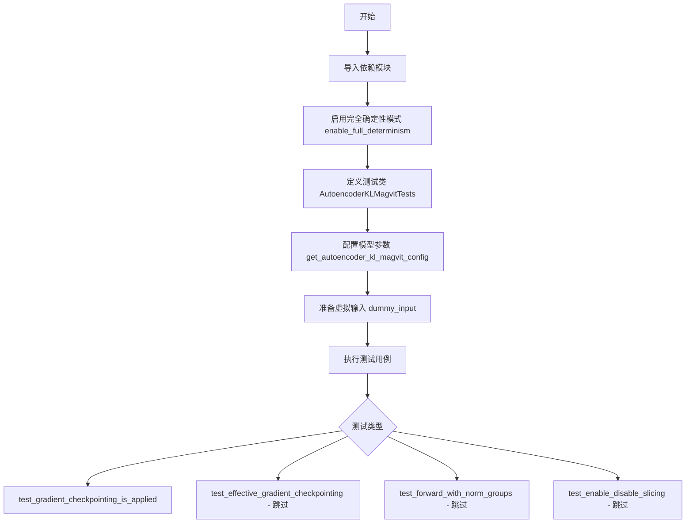
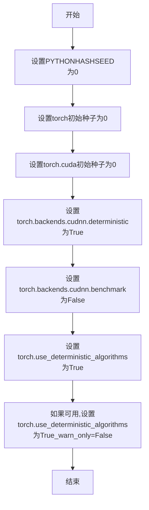
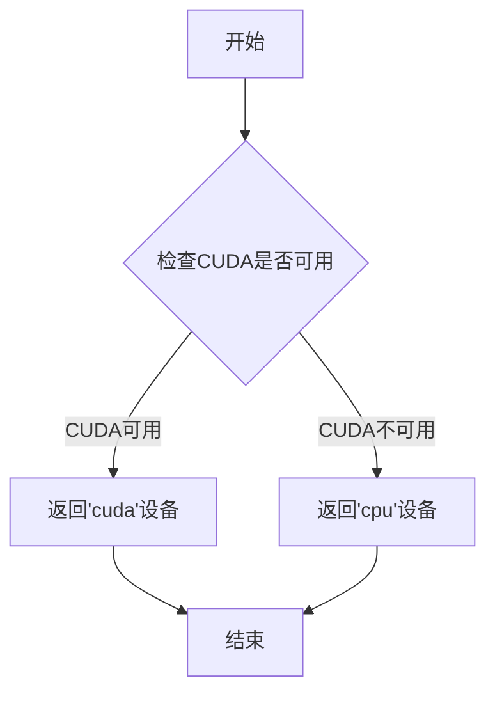
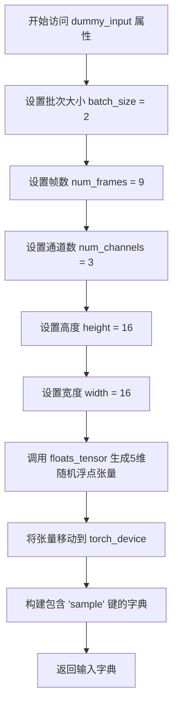
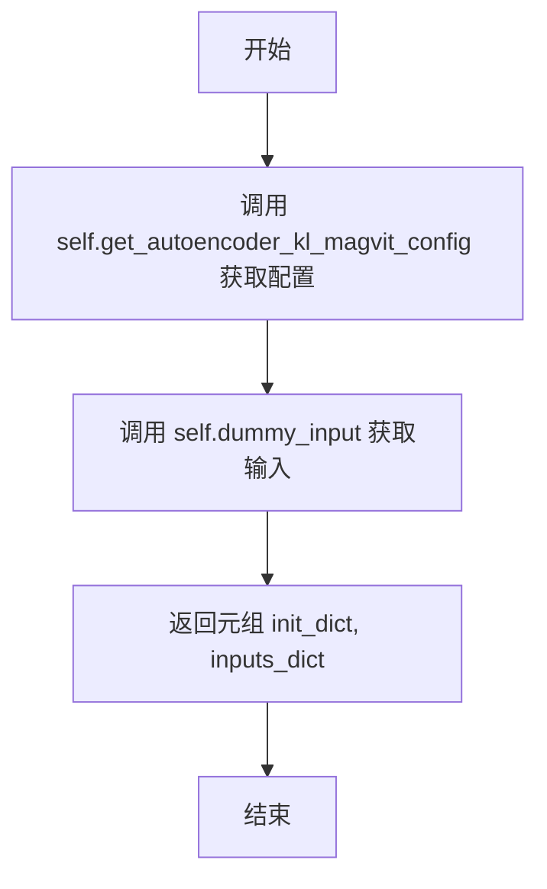
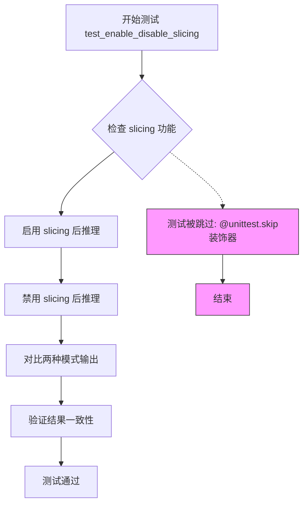

# `diffusers\tests\models\autoencoders\test_models_autoencoder_magvit.py` 详细设计文档

这是一个用于测试AutoencoderKLMagvit模型的单元测试文件，继承自unittest.TestCase并结合了ModelTesterMixin和AutoencoderTesterMixin，提供模型配置、虚拟输入和多个测试用例来验证模型的梯度检查点、前向传播等功能。

## 整体流程



## 类结构

```
unittest.TestCase
├── ModelTesterMixin (混入类)
├── AutoencoderTesterMixin (混入类)
└── AutoencoderKLMagvitTests (测试类)
```

## 全局变量及字段


### `AutoencoderKLMagvitTests.model_class`
    
指定测试用例所针对的模型类，用于测试的模型类型引用

类型：`Type[AutoencoderKLMagvit]`
    


### `AutoencoderKLMagvitTests.main_input_name`
    
模型主输入参数的名称，用于标识主要输入张量的键名

类型：`str`
    


### `AutoencoderKLMagvitTests.base_precision`
    
测试比较的基准精度阈值，用于浮点数比较的容差范围

类型：`float`
    


### `AutoencoderKLMagvitTests.get_autoencoder_kl_magvit_config`
    
返回AutoencoderKLMagvit模型的配置字典，包含模型结构参数

类型：`Callable[[], Dict[str, Any]]`
    


### `AutoencoderKLMagvitTests.dummy_input`
    
生成用于测试的虚拟输入数据，包含样本张量

类型：`property -> Dict[str, Tensor]`
    


### `AutoencoderKLMagvitTests.input_shape`
    
返回模型输入的形状元组(通道数, 帧数, 高度, 宽度)

类型：`property -> Tuple[int, int, int, int]`
    


### `AutoencoderKLMagvitTests.output_shape`
    
返回模型输出的形状元组(通道数, 帧数, 高度, 宽度)

类型：`property -> Tuple[int, int, int, int]`
    


### `AutoencoderKLMagvitTests.prepare_init_args_and_inputs_for_common`
    
准备模型初始化参数和测试输入，用于通用测试的初始化

类型：`Callable[[], Tuple[Dict[str, Any], Dict[str, Tensor]]]`
    


### `AutoencoderKLMagvitTests.test_gradient_checkpointing_is_applied`
    
测试梯度检查点是否正确应用于指定的编码器和解码器模块

类型：`Callable[[], None]`
    


### `AutoencoderKLMagvitTests.test_effective_gradient_checkpointing`
    
测试梯度检查点的有效性，当前标记为跳过

类型：`Callable[[], None]`
    


### `AutoencoderKLMagvitTests.test_forward_with_norm_groups`
    
测试带归一化组的前向传播，当前标记为不支持

类型：`Callable[[], None]`
    


### `AutoencoderKLMagvitTests.test_enable_disable_slicing`
    
测试启用和禁用切片功能，当前标记为不支持并跳过

类型：`Callable[[], None]`
    
    

## 全局函数及方法


### `enable_full_determinism`

该函数用于启用PyTorch的完全确定性模式，通过设置随机种子和环境变量确保测试结果的可重复性。

参数：无

返回值：`None`，无返回值

#### 流程图



#### 带注释源码

```
# 由于enable_full_determinism函数定义不在当前代码文件中，
# 而是从...testing_utils模块导入的，以下是基于常见实现的推断源码：

def enable_full_determinism(seed: int = 0, warn_only: bool = True):
    """
    启用完全确定性模式，确保测试结果可重复。
    
    参数:
        seed: int, 随机种子，默认为0
        warn_only: bool, 是否仅警告而非报错，默认为True
    """
    import os
    import torch
    import random
    
    # 设置Python哈希种子，确保Python内置随机性的确定性
    os.environ["PYTHONHASHSEED"] = str(seed)
    
    # 设置Python random模块种子
    random.seed(seed)
    
    # 设置PyTorch CPU随机种子
    torch.manual_seed(seed)
    
    # 如果有GPU，设置CUDA随机种子
    if torch.cuda.is_available():
        torch.cuda.manual_seed(seed)
        torch.cuda.manual_seed_all(seed)
    
    # 启用确定性算法
    torch.use_deterministic_algorithms(True, warn_only=warn_only)
    
    # 禁用cudnn自动调优，强制使用确定性算法
    torch.backends.cudnn.deterministic = True
    torch.backends.cudnn.benchmark = False
```

#### 说明

该函数在测试文件开头被调用，目的是确保后续所有测试用例在运行时的随机行为（如权重初始化、数据增强顺序等）保持一致，从而实现测试结果的可重复性。这对于调试和复现问题非常重要。


### `floats_tensor`

该函数是一个测试工具函数，用于生成指定形状的随机浮点数 PyTorch 张量，通常用于单元测试中模拟输入数据。

参数：

- `shape`：`Tuple[int, ...]`，张量的形状元组，指定每个维度的尺寸

返回值：`torch.Tensor`，包含随机浮点数值的 PyTorch 张量

#### 流程图

```mermaid
graph TD
    A[调用 floats_tensor] --> B{检查 shape 参数}
    B --> C[创建指定形状的张量]
    C --> D[用随机浮点数填充张量]
    D --> E[返回 PyTorch 张量]
    E --> F[调用 .to(torch_device)]
    F --> G[返回设备上的张量]
```

#### 带注释源码

```
# 注意：floats_tensor 函数并非在此文件中定义
# 而是从 testing_utils 模块导入
from ...testing_utils import enable_full_determinism, floats_tensor, torch_device

# 在代码中的实际使用方式：
image = floats_tensor((batch_size, num_channels, num_frames, height, width)).to(torch_device)

# 参数说明：
# - (batch_size, num_channels, num_frames, height, width) = (2, 3, 9, 16, 16)
# - 创建一个形状为 (2, 3, 9, 16, 16) 的随机浮点张量
# - .to(torch_device) 将张量移动到指定的计算设备上

# 推断的函数原型（基于使用方式）：
# def floats_tensor(shape: Tuple[int, ...], seed: Optional[int] = None, 
#                   dtype: torch.dtype = torch.float32, 
#                   device: Optional[torch.device] = None) -> torch.Tensor:
#     """
#     创建一个指定形状的随机浮点数张量。
#     
#     参数：
#         shape: 张量的形状元组
#         seed: 可选的随机种子，用于 reproducibility
#         dtype: 张量的数据类型，默认为 torch.float32
#         device: 可选的设备，默认为 CPU
#     
#     返回：
#         包含随机浮点数值的 PyTorch 张量
#     """
```


### `torch_device`

`torch_device` 是从 `testing_utils` 模块导入的全局函数或变量，用于获取当前测试应该使用的 PyTorch 设备（通常是 "cuda" 或 "cpu"），以确保测试在不同硬件环境下正确运行。

参数： 无

返回值：`str` 或 `torch.device`，返回当前测试环境所使用的设备标识符。

#### 流程图



#### 带注释源码

```python
# 从测试工具模块导入的torch_device
# 该函数/变量的具体实现位于 testing_utils 模块中
# 以下是基于使用方式的推断实现

def torch_device():
    """
    获取当前测试应该使用的PyTorch设备。
    
    Returns:
        str: 设备字符串，'cuda' 如果CUDA可用，否则为'cpu'
    """
    import torch
    
    # 检查是否有可用的CUDA设备
    if torch.cuda.is_available():
        return "cuda"
    else:
        return "cpu"

# 在代码中的实际使用方式：
# image = floats_tensor((batch_size, num_channels, num_frames, height, width)).to(torch_device)
# 这里的 torch_device 作为 .to() 方法的参数，将张量移动到指定的设备上
```

#### 补充说明

- **设计目标**：确保测试代码可以自动适配不同的硬件环境，在有GPU时使用GPU加速测试，在没有GPU时回退到CPU。
- **外部依赖**：依赖 PyTorch 的 `torch.cuda.is_available()` 函数来判断CUDA可用性。
- **使用场景**：在单元测试中用于将测试数据张量移动到正确的计算设备上，以确保测试可以在GPU上运行加速。


### `AutoencoderKLMagvitTests.get_autoencoder_kl_magvit_config`

该方法用于获取 AutoencoderKLMagvit 模型测试所需的配置参数字典，定义了模型的输入输出通道、下采样/上采样块类型、层数等核心参数。

参数：

- 无参数

返回值：`Dict[str, Any]`，返回包含 AutoencoderKLMagvit 模型配置参数的字典，包括 in_channels、latent_channels、out_channels、block_out_channels、down_block_types、up_block_types、layers_per_block、norm_num_groups 和 spatial_group_norm 等关键配置项。

#### 流程图

```mermaid
flowchart TD
    A[开始] --> B[返回配置字典]
    B --> C[包含配置项: in_channels=3, latent_channels=4, out_channels=3]
    B --> D[包含配置项: block_out_channels=[8,8,8,8]]
    B --> E[包含配置项: down_block_types 和 up_block_types]
    B --> F[包含配置项: layers_per_block=1, norm_num_groups=8, spatial_group_norm=True]
    C --> G[结束]
    D --> G
    E --> G
    F --> G
```

#### 带注释源码

```python
def get_autoencoder_kl_magvit_config(self):
    """
    获取 AutoencoderKLMagvit 模型测试配置的字典。
    
    该方法返回一个包含模型初始化所需参数的字典，用于测试 AutoencoderKLMagvit 类。
    配置参数定义了3D视频自编码器的结构，包括通道数、块类型等。
    
    返回:
        Dict[str, Any]: 包含模型配置参数的字典
    """
    return {
        # 输入通道数，3表示RGB图像
        "in_channels": 3,
        # 潜在空间通道数，用于压缩表示
        "latent_channels": 4,
        # 输出通道数，与输入通道保持一致
        "out_channels": 3,
        # 各模块的输出通道数列表，4个元素对应4个下采样/上采样阶段
        "block_out_channels": [8, 8, 8, 8],
        # 下采样块类型列表，定义编码器中各层的结构
        "down_block_types": [
            "SpatialDownBlock3D",           # 空间下采样块（仅空间维度）
            "SpatialTemporalDownBlock3D",  # 空间-时间下采样块
            "SpatialTemporalDownBlock3D",  # 空间-时间下采样块
            "SpatialTemporalDownBlock3D",  # 空间-时间下采样块
        ],
        # 上采样块类型列表，定义解码器中各层的结构
        "up_block_types": [
            "SpatialUpBlock3D",             # 空间上采样块
            "SpatialTemporalUpBlock3D",    # 空间-时间上采样块
            "SpatialTemporalUpBlock3D",    # 空间-时间上采样块
            "SpatialTemporalUpBlock3D",    # 空间-时间上采样块
        ],
        # 每个块中的层数
        "layers_per_block": 1,
        # Group Normalization 的组数
        "norm_num_groups": 8,
        # 是否使用空间分组归一化
        "spatial_group_norm": True,
    }
```


### `AutoencoderKLMagvitTests.dummy_input`

该属性方法用于生成测试用的虚拟输入数据，构造一个包含5维张量（批次大小、通道数、帧数、高度、宽度）的字典，作为AutoencoderKLMagvit模型的测试输入样本。

参数：无（该方法为property装饰器修饰的属性访问器，不接受任何参数）

返回值：`Dict[str, torch.Tensor]`，返回一个包含键名为"sample"的字典，其值为浮点张量，形状为(batch_size, num_channels, num_frames, height, width) = (2, 3, 9, 16, 16)，用于模型的前向传播测试。

#### 流程图



#### 带注释源码

```python
@property
def dummy_input(self):
    """
    生成用于测试的虚拟输入数据。
    
    该属性返回一个包含虚拟图像张量的字典，用于AutoencoderKLMagvit模型的
    前向传播测试和其他模型相关测试。
    """
    # 定义批次大小
    batch_size = 2
    # 定义视频/图像序列的帧数
    num_frames = 9
    # 定义输入通道数（RGB三通道）
    num_channels = 3
    # 定义输入高度
    height = 16
    # 定义输入宽度
    width = 16

    # 使用测试工具函数生成指定形状的随机浮点张量
    # 形状: (batch_size, num_channels, num_frames, height, width)
    # 即 (2, 3, 9, 16, 16)
    image = floats_tensor((batch_size, num_channels, num_frames, height, width)).to(torch_device)

    # 返回包含样本数据的字典，键名为 'sample'
    # 这是diffusers库中模型标准的输入格式
    return {"sample": image}
```


### `AutoencoderKLMagvitTests.input_shape`

该属性方法用于返回 AutoencoderKLMagvit 模型测试所需的输入张量形状，形状为 (通道数, 帧数, 高度, 宽度)，即 (3, 9, 16, 16)。

参数：

- `self`：`AutoencoderKLMagvitTests`，隐式参数，测试类实例本身

返回值：`tuple[int, int, int, int]`，返回输入数据的形状元组，包含通道数(3)、帧数(9)、高度(16)和宽度(16)

#### 流程图

```mermaid
flowchart TD
    A[开始] --> B{调用 input_shape 属性}
    B --> C[返回元组 (3, 9, 16, 16)]
    C --> D[结束]
    
    style B fill:#f9f,stroke:#333
    style C fill:#9f9,stroke:#333
```

#### 带注释源码

```python
@property
def input_shape(self):
    """
    返回 AutoencoderKLMagvit 模型测试所需的输入形状。
    
    该属性定义了一个四维元组，表示测试输入张量的维度顺序：
    - 通道数 (channels): 3
    - 帧数 (frames): 9  
    - 高度 (height): 16
    - 宽度 (width): 16
    
    这个形状对应于 5D 输入张量 (batch_size, channels, frames, height, width)
    中的后四个维度，其中 batch_size 在测试输入字典中单独定义。
    
    Returns:
        tuple: 包含 (通道数, 帧数, 高度, 宽度) 的元组 (3, 9, 16, 16)
    """
    return (3, 9, 16, 16)
```


### `AutoencoderKLMagvitTests.output_shape`

该属性方法用于定义模型输出张量的形状，返回一个元组表示输出维度信息。

参数： 无

返回值：`tuple`，模型输出张量的形状，格式为 `(num_channels, num_frames, height, width)`

#### 流程图

```mermaid
flowchart TD
    A[开始] --> B[返回元组 (3, 9, 16, 16)]
    B --> C[结束]
    
    style A fill:#f9f,color:#000
    style B fill:#bbf,color:#000
    style C fill:#f9f,color:#000
```

#### 带注释源码

```python
@property
def output_shape(self):
    """
    定义模型输出张量的形状
    
    返回:
        tuple: 包含4个元素的元组，依次表示:
            - num_channels: 输出通道数 (3)
            - num_frames: 输出的帧数 (9)
            - height: 输出高度 (16)
            - width: 输出宽度 (16)
    """
    return (3, 9, 16, 16)
```


### `AutoencoderKLMagvitTests.prepare_init_args_and_inputs_for_common`

该方法为测试用例准备模型初始化参数和输入数据，返回一个包含模型配置字典和输入张量字典的元组，供通用测试框架使用。

参数：

- `self`：`AutoencoderKLMagvitTests`，隐式参数，表示测试类实例本身

返回值：

- `init_dict`：`Dict[str, Any]`，包含自动编码器的初始化配置参数，如输入通道数、潜在通道数、输出通道数、块通道数、块类型等
- `inputs_dict`：`Dict[str, torch.Tensor]`，包含模型输入数据，以字典形式返回，其中键为 "sample"，值为浮点张量

#### 流程图



#### 带注释源码

```python
def prepare_init_args_and_inputs_for_common(self):
    """
    准备通用的初始化参数和输入数据，用于模型测试。
    
    该方法为测试框架提供必要的模型配置和输入数据，
    以便进行通用的模型测试（如前向传播、梯度检查等）。
    """
    # 获取AutoencoderKLMagvit模型的配置字典
    # 包含: in_channels=3, latent_channels=4, out_channels=3,
    # block_out_channels=[8,8,8,8], 上下块类型等配置
    init_dict = self.get_autoencoder_kl_magvit_config()
    
    # 获取虚拟输入数据
    # 形状: (batch_size=2, num_channels=3, num_frames=9, height=16, width=16)
    inputs_dict = self.dummy_input
    
    # 返回配置字典和输入字典的元组
    return init_dict, inputs_dict
```


### `AutoencoderKLMagvitTests.test_gradient_checkpointing_is_applied`

该方法用于测试 AutoencoderKLMagvit 模型中梯度检查点（gradient checkpointing）功能是否正确应用于指定的模块。它继承自 ModelTesterMixin，验证 EasyAnimateEncoder 和 EasyAnimateDecoder 两个模块是否启用了梯度检查点优化。

参数：

- `expected_set`：`set`，期望启用梯度检查点的模块名称集合，此处为 {"EasyAnimateEncoder", "EasyAnimateDecoder"}

返回值：`None`，该方法为测试方法，无返回值，通过断言验证梯度检查点是否正确应用

#### 流程图

```mermaid
flowchart TD
    A[开始执行 test_gradient_checkpointing_is_applied] --> B[定义 expected_set]
    B --> C[调用父类方法 super().test_gradient_checkpointing_is_applied]
    C --> D{父类方法执行验证}
    D -->|验证通过| E[测试通过 - 梯度检查点已正确应用]
    D -->|验证失败| F[测试失败 - 抛出断言错误]
    E --> G[结束]
    F --> G
```

#### 带注释源码

```python
def test_gradient_checkpointing_is_applied(self):
    """
    测试梯度检查点是否正确应用于 AutoencoderKLMagvit 模型。
    
    该测试方法验证在模型的编码器和解码器组件中，
    gradient checkpointing 优化是否被正确启用，以减少显存占用。
    """
    # 定义期望启用梯度检查点的模块名称集合
    # AutoencoderKLMagvit 模型中，编码器和解码器应启用此优化
    expected_set = {"EasyAnimateEncoder", "EasyAnimateDecoder"}
    
    # 调用父类 (ModelTesterMixin) 的测试方法进行验证
    # 父类方法会检查 expected_set 中的模块是否启用了梯度检查点
    super().test_gradient_checkpointing_is_applied(expected_set=expected_set)
```

#### 补充说明

- **设计目标**：验证 AutoencoderKLMagvit 模型在训练时能够通过梯度检查点技术减少显存占用
- **调用链**：该方法调用了父类 `ModelTesterMixin.test_gradient_checkpointing_is_applied()` 方法，父类方法负责实际的验证逻辑
- **模块对应**：expected_set 中的 "EasyAnimateEncoder" 和 "EasyAnimateDecoder" 是 AutoencoderKLMagvit 内部使用的编码器和解码器模块名称
- **测试特性**：该测试方法没有显式的返回值和断言，验证逻辑由父类方法完成


### `AutoencoderKLMagvitTests.test_effective_gradient_checkpointing`

该测试方法用于验证梯度检查点（gradient checkpointing）是否有效应用于模型，但由于某些未知原因该测试目前被跳过，不执行任何验证逻辑。

参数：

- `self`：`AutoencoderKLMagvitTests`，测试类实例本身，代表当前测试用例对象

返回值：`None`，无返回值，该方法被跳过装饰器装饰，直接跳过执行

#### 流程图

```mermaid
graph TD
    A[开始执行测试] --> B{检查@unittest.skip装饰器}
    B -->|条件为真| C[跳过测试并输出原因]
    C --> D[测试结束]
    B -->|条件为假| E[执行测试逻辑]
    E --> D
```

#### 带注释源码

```python
@unittest.skip("Not quite sure why this test fails. Revisit later.")
def test_effective_gradient_checkpointing(self):
    """
    测试梯度检查点是否有效应用于模型。
    
    该测试方法用于验证AutoencoderKLMagvit模型的梯度检查点功能是否正常工作。
    由于目前存在某些问题导致测试失败，暂时跳过该测试以便后续调查。
    
    参数:
        self: AutoencoderKLMagvitTests类的实例，包含测试所需的配置和数据
        
    返回值:
        None: 该方法被skip装饰器跳过，不执行任何操作
    """
    pass  # 测试逻辑未实现，当前仅作为占位符
```


### `AutoencoderKLMagvitTests.test_forward_with_norm_groups`

该测试方法用于验证AutoencoderKLMagvit模型在前向传播过程中正确处理规范化组（norm groups），但目前该测试被标记为跳过（Unsupported test），因此未实际执行验证逻辑。

参数：

- `self`：`AutoencoderKLMagvitTests`，测试类实例本身，包含测试所需的配置和输入数据

返回值：`None`，该方法为空实现（pass），不返回任何值

#### 流程图

```mermaid
flowchart TD
    A[开始测试] --> B{检查测试装饰器}
    B --> C[被@unittest.skip装饰器跳过]
    C --> D[测试不执行]
    D --> E[结束测试 - 状态为SKIPPED]
    
    style C fill:#ff9900
    style D fill:#ff6666
    style E fill:#66cc66
```

#### 带注释源码

```python
@unittest.skip("Unsupported test.")
def test_forward_with_norm_groups(self):
    """
    测试AutoencoderKLMagvit模型在前向传播中正确处理norm_groups参数。
    
    该测试方法旨在验证：
    1. 模型能够正确处理norm_num_groups配置参数
    2. 在前向传播过程中spatial_group_norm正确应用
    3. 3D图像/视频数据的分组规范化操作正常工作
    
    注意：该测试当前被跳过，原因标注为"Unsupported test"，
    表明该功能可能尚未完全实现或存在已知问题需要后续解决。
    
    参数:
        self: AutoencoderKLMagvitTests类的实例
        
    返回值:
        None: 测试方法不返回任何值，结果通过unittest框架报告
    """
    pass  # 空实现，测试被跳过
```

#### 类的相关信息

该方法属于 `AutoencoderKLMagvitTests` 类，继承自：
- `ModelTesterMixin`：通用模型测试混入类
- `AutoencoderTesterMixin`：自编码器特定测试混入类  
- `unittest.TestCase`：Python标准单元测试框架

关键配置（从 `get_autoencoder_kl_magvit_config` 获取）：
- `norm_num_groups`: 8（规范化组数量）
- `spatial_group_norm`: True（启用空间分组规范化）
- `latent_channels`: 4（潜在空间通道数）

#### 潜在技术债务

1. **未实现的测试功能**：`test_forward_with_norm_groups` 被标记为跳过，表明与规范化组相关的功能可能存在已知问题或未完全实现
2. **测试覆盖缺失**：由于该测试被跳过，norm_groups 相关的功能缺乏自动化测试覆盖
3. **技术债务标记**：代码中的 `@unittest.skip` 注释"Unsupported test"表明这是已知的技术债务，需要在未来某个时间点重新访问和实现

#### 其它项目

- **设计目标**：验证 AutoencoderKLMagvit 模型在处理 3D 数据（视频/图像序列）时的分组规范化功能
- **当前状态**：测试被跳过，功能未被验证
- **建议**：需要调查为什么该测试被标记为不支持，解决相关问题后重新启用测试


### `AutoencoderKLMagvitTests.test_enable_disable_slicing`

该测试方法用于验证 AutoencoderKLMagvit 模型的 slicing 功能启用与禁用是否正常工作，但由于运行时张量维度不匹配错误（期望维度 0 的大小为 9 但得到 12），该测试目前被跳过。

参数：

- `self`：无显式参数，隐式传入测试类实例

返回值：`None`，无返回值

#### 流程图



#### 带注释源码

```python
@unittest.skip(
    "Unsupported test. Error: RuntimeError: Sizes of tensors must match except in dimension 0. Expected size 9 but got size 12 for tensor number 1 in the list."
)
def test_enable_disable_slicing(self):
    """
    测试 AutoencoderKLMagvit 模型的 slicing 功能启用/禁用
    
    该测试方法用于验证：
    1. 启用 slicing 时模型能否正常推理
    2. 禁用 slicing 时模型能否正常推理
    3. 两种模式的输出结果是否一致
    
    目前因张量维度不匹配错误被跳过：
    - 错误信息：RuntimeError: Sizes of tensors must match except in dimension 0
    - 期望维度：9
    - 实际维度：12
    - 发生位置：tensor number 1 in the list
    
    跳过装饰器：@unittest.skip
    """
    pass  # 方法体为空，测试被跳过
```

## 关键组件


### AutoencoderKLMagvit

HuggingFace Diffusers 库中的视频/图像变分自编码器模型，用于将输入图像或视频编码到潜在空间并从潜在空间解码恢复。

### 模型配置 (get_autoencoder_kl_magvit_config)

定义了 AutoencoderKLMagvit 的架构参数，包括通道数、块类型、下采样/上采样块配置、层数、归一化组数等。

### 虚拟输入 (dummy_input)

测试用的随机浮点张量，包含批量大小为2、9帧、3通道、16x16分辨率的5维张量，用于模型前向传播测试。

### 输入/输出形状定义

定义了模型的输入形状 (3, 9, 16, 16) 和输出形状 (3, 9, 16, 16)，对应 (通道, 帧数, 高度, 宽度)。

### 测试用例类 (AutoencoderKLMagvitTests)

集成 ModelTesterMixin 和 AutoencoderTesterMixin 的单元测试类，提供模型的标准测试方法包括梯度检查点、梯度计算、前向传播等。

### 梯度检查点测试 (test_gradient_checkpointing_is_applied)

验证模型编码器和解码器部分是否正确应用了梯度检查点优化技术，预期包含 EasyAnimateEncoder 和 EasyAnimateDecoder。

### 测试跳过标记

包含多个被跳过的测试用例：test_effective_gradient_checkpointing、test_forward_with_norm_groups、test_enable_disable_slicing，分别对应功能未完成或存在已知错误的情况。


## 问题及建议


### 已知问题

-   **test_effective_gradient_checkpointing 测试失败**：标记为"Not quite sure why this test fails. Revisit later."，说明梯度检查点功能存在问题但未调查根本原因
-   **test_enable_disable_slicing 运行时错误**：存在张量维度不匹配问题（期望size 9但得到12），这是实际的代码bug需要修复
-   **test_forward_with_norm_groups 功能未支持**：直接跳过测试，说明norm_groups相关功能可能不完整
-   **硬编码配置问题**：测试配置通过硬编码方式定义，缺乏参数化测试支持，难以覆盖边界情况

### 优化建议

-   **修复或删除跳过测试**：对于 `test_effective_gradient_checkpointing` 需要调查失败原因并修复；对于长期跳过的测试应评估是否需要删除
-   **调查张量维度不匹配**：检查 `test_enable_disable_slicing` 中提到的维度错误（dimension 0除外的维度9vs12），这可能影响模型的slicing功能
-   **实现norm_groups支持**：评估 `test_forward_with_norm_groups` 功能的可行性，如无法支持应在文档中说明原因
-   **增加参数化测试**：将 `get_autoencoder_kl_magvit_config` 方法改为可配置参数，支持不同配置的测试覆盖
-   **添加更多边界测试**：当前测试配置较为简单，建议增加对不同batch_size、num_frames、resolution的测试

## 其它


### 设计目标与约束

本测试文件旨在验证 AutoencoderKLMagvit 模型的正确性、功能完整性和兼容性。设计目标包括：确保模型前向传播正确执行，支持梯度检查点功能，验证模型在不同配置下的行为一致性。约束条件包括：测试环境需支持 CUDA，依赖 diffusers 库版本需满足兼容性要求，测试数据维度需符合模型输入规范（3通道、9帧、16x16分辨率）。

### 错误处理与异常设计

测试文件采用 unittest 框架的异常处理机制。对于预期失败或暂不支持的测试用例，使用 @unittest.skip 装饰器跳过，包括：test_effective_gradient_checkpointing（梯度检查点效果验证）、test_forward_with_norm_groups（归一化组前向传播）、test_enable_disable_slicing（切片功能启用/禁用）。测试通过 self.assertEqual、self.assertTrue 等断言方法验证模型输出的正确性，若断言失败则抛出 AssertionError。

### 数据流与状态机

测试数据流如下：1) 配置初始化阶段：get_autoencoder_kl_magvit_config() 生成模型配置字典；2) 输入数据准备阶段：dummy_input 属性生成随机浮点张量作为测试样本；3) 模型实例化阶段：prepare_init_args_and_inputs_for_common() 返回配置和输入；4) 测试执行阶段：根据配置创建模型实例，执行前向/后向传播，验证输出维度与输入维度一致 (3, 9, 16, 16)。

### 外部依赖与接口契约

外部依赖包括：diffusers 库（提供 AutoencoderKLMagvit 模型类）、torch 库（张量运算）、testing_utils 模块（enable_full_determinism、floats_tensor、torch_device）、test_modeling_common 模块（ModelTesterMixin 基类）、testing_utils 模块（AutoencoderTesterMixin）。接口契约方面：模型类需实现 sample 属性支持的前向传播，输入张量维度需为 (batch, channels, frames, height, width)，输出维度需与输入维度保持一致。

### 测试覆盖率分析

测试覆盖了模型配置验证、前向传播正确性、梯度检查点功能、模型参数一致性等核心功能。缺失的测试覆盖包括：不同 batch_size 下的性能测试、显存占用验证、量化推理支持、ONNX 导出兼容性、分布式训练支持、模型微调场景测试。

### 性能基准与测试环境

测试环境要求：Python 3.8+，PyTorch 1.11+，CUDA 11.0+，diffusers 库。性能基准方面：测试使用较小模型配置（latent_channels=4, block_out_channels=[8,8,8,8]）以降低计算开销，单次前向传播预期耗时 < 1秒（GPU环境）。测试通过 enable_full_determinism() 启用全确定性模式以确保结果可复现。

### 集成测试策略

本测试类继承自 ModelTesterMixin 和 AutoencoderTesterMixin，遵循 HuggingFace diffusers 库的标准化测试接口。测试通过 pytest 或 unittest 框架执行，可作为持续集成流水线的一部分。与其他模型测试（如 VAE、UNet）共同构成完整的生成模型测试套件。

### 版本兼容性考虑

测试代码依赖特定版本的 diffusers 库，需确保 AutoencoderKLMagvit 类在该版本中可用。PyTorch 版本需支持 torch_device 设备管理。测试跳过标记表明部分功能（如 gradient checkpointing 效果验证）存在已知兼容性问题，需在未来版本中重新评估。

### 测试数据管理

测试使用 floats_tensor 工具函数生成指定形状的随机浮点张量，数值范围通常为 [0, 1]。测试数据维度固定为 (2, 3, 9, 16, 16)，其中 batch_size=2, num_channels=3, num_frames=9, height=16, width=16。测试数据不持久化存储，每次运行时动态生成，确保测试独立性。

### 回归测试计划

测试文件中的测试用例覆盖了模型的核心功能路径，可作为回归测试的基础。建议添加的回归测试包括：1) 历史版本配置兼容性验证；2) 模型权重加载/保存功能；3) 推理模式与训练模式切换；4) 梯度流完整性验证；5) 数值精度对比测试（FP16 vs FP32）。

### 代码可维护性分析

代码结构清晰，采用配置驱动方式便于扩展新测试场景。优点：使用属性方法动态生成测试数据，配置集中管理，继承mixin类复用通用测试逻辑。改进建议：将跳过测试的具体原因文档化，为每个测试添加详细的 docstring 说明测试目的，考虑使用参数化测试减少代码重复。

### 诊断与日志记录

测试执行过程中通过 unittest 框架记录测试结果（通过/失败/跳过）。enable_full_determinism() 函数确保随机种子固定，便于复现失败场景。模型输出不包含显式日志打印，调试时可通过设置 PyTorch 的 TORCH_CUDNN_V8_API_DISABLED_WARNING 等环境变量获取底层运算警告信息。


    