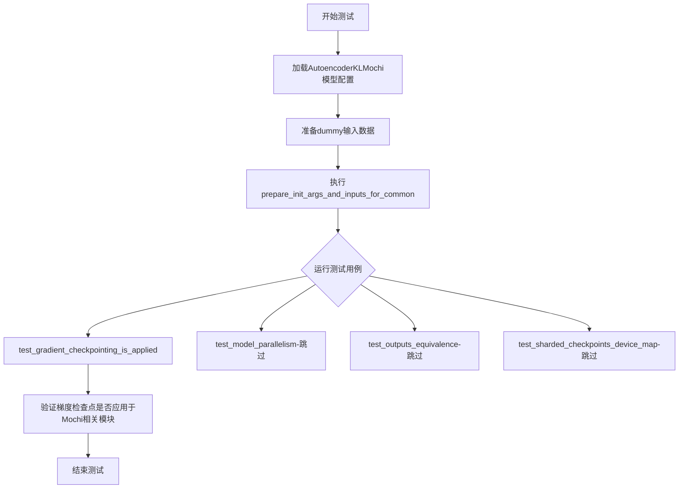
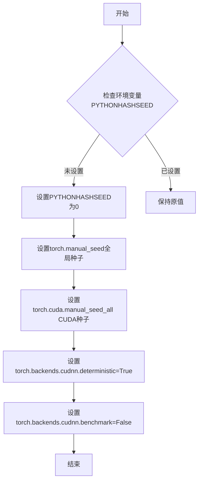
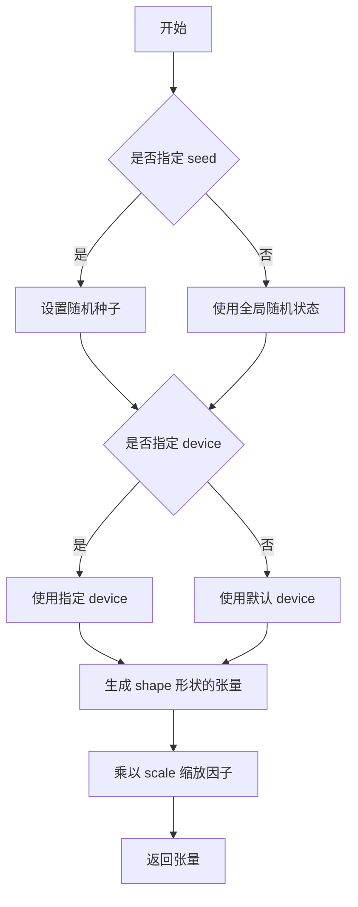
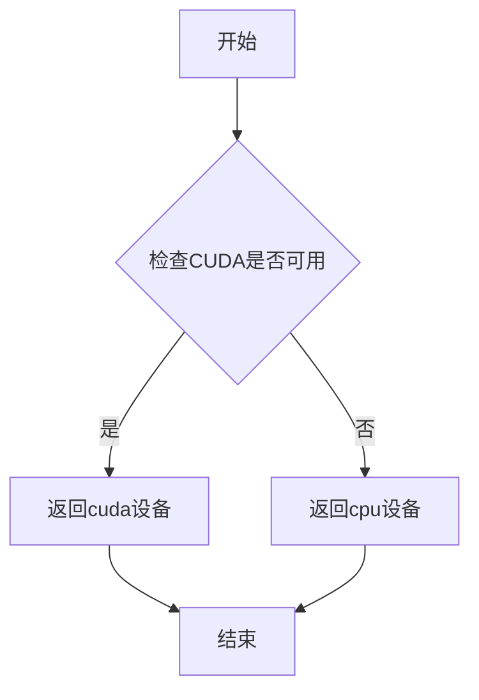
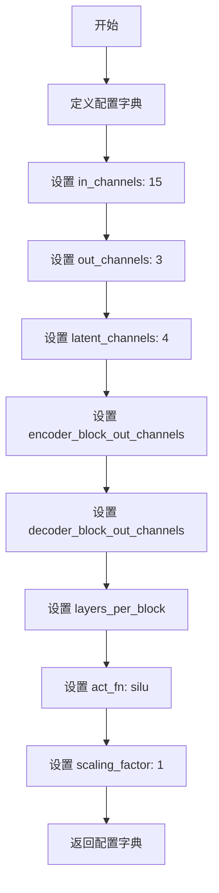
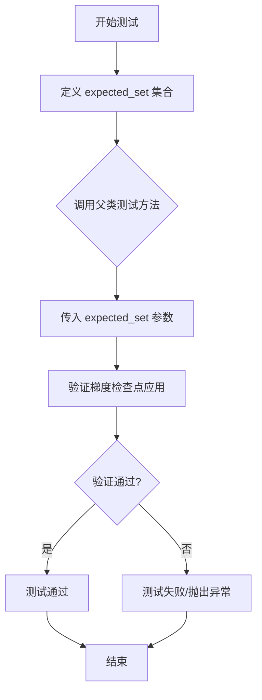
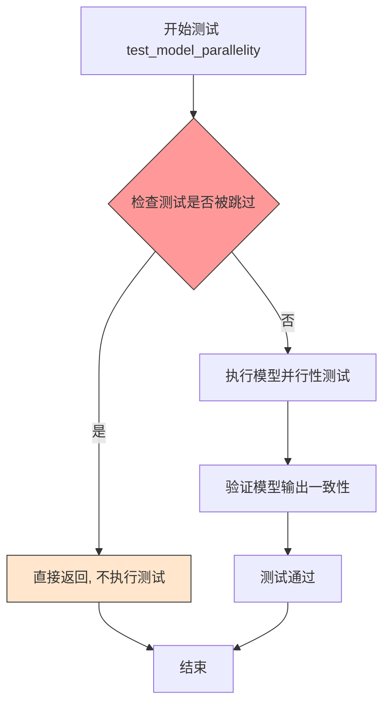
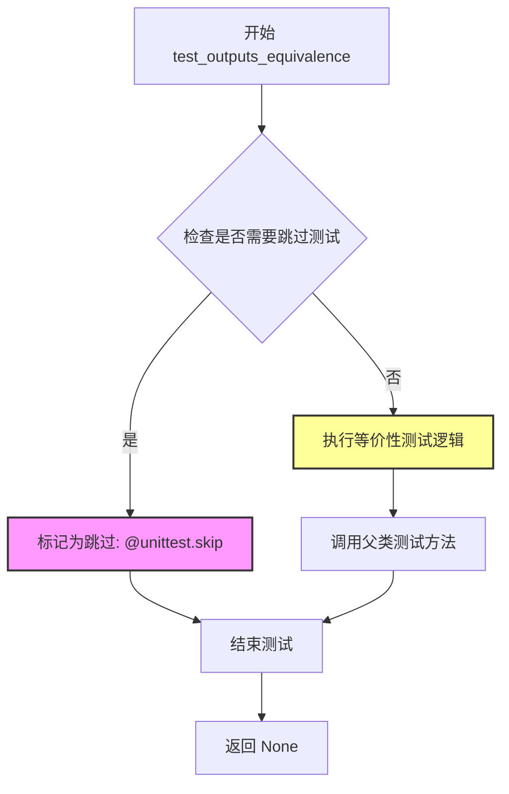
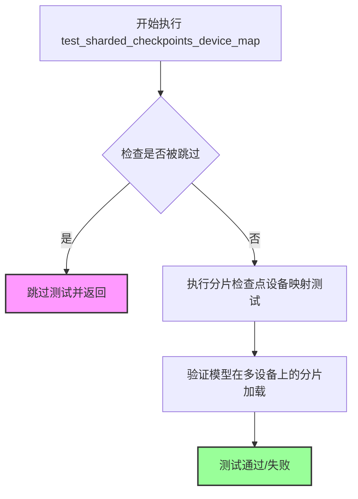

# `diffusers\tests\models\autoencoders\test_models_autoencoder_mochi.py` 详细设计文档

这是一个单元测试文件，用于测试diffusers库中的AutoencoderKLMochi视频自动编码器模型，验证其前向传播、梯度检查点、模型并行性等功能是否符合预期。

## 整体流程



## 类结构

```
AutoencoderKLMochiTests (测试类)
└── 继承关系: unittest.TestCase + ModelTesterMixin + AutoencoderTesterMixin
```

## 全局变量及字段


### `AutoencoderKLMochiTests.model_class`
    
待测试的模型类引用

类型：`type[AutoencoderKLMochi]`
    


### `AutoencoderKLMochiTests.main_input_name`
    
主输入名称为'sample'

类型：`str`
    


### `AutoencoderKLMochiTests.base_precision`
    
基础精度为1e-2

类型：`float`
    
    

## 全局函数及方法


### `enable_full_determinism`

该函数用于启用PyTorch的完全确定性模式，通过设置随机种子和环境变量来确保测试和训练过程的可重复性。

参数： 无

返回值：`None`，该函数不返回任何值

#### 流程图



#### 带注释源码

```
# 注意：以下为基于常见实现的推断源码
# 实际源码位于 testing_utils 模块中，此处仅作参考

def enable_full_determinism(seed: int = 42, deterministic_algorithms: bool = True):
    """
    启用完全确定性测试模式，确保测试结果可复现
    
    参数：
    - seed: int, 随机种子，默认为42
    - deterministic_algorithms: bool, 是否启用确定性算法，默认为True
    
    返回值：
    - None
    """
    import os
    import random
    import numpy as np
    import torch
    
    # 1. 设置Python哈希种子，确保Python内置随机性的确定性
    os.environ["PYTHONHASHSEED"] = str(seed)
    
    # 2. 设置Python random模块的种子
    random.seed(seed)
    
    # 3. 设置NumPy的随机种子
    np.random.seed(seed)
    
    # 4. 设置PyTorch CPU随机种子
    torch.manual_seed(seed)
    
    # 5. 设置PyTorch CUDA所有设备的随机种子（如果可用）
    if torch.cuda.is_available():
        torch.cuda.manual_seed_all(seed)
    
    # 6. 设置PyTorch使用确定性算法
    if deterministic_algorithms:
        torch.backends.cudnn.deterministic = True
        torch.backends.cudnn.benchmark = False
        # 尝试启用全局确定性模式（PyTorch 1.8+）
        if hasattr(torch, 'use_deterministic_algorithms'):
            try:
                torch.use_deterministic_algorithms(True)
            except RuntimeError:
                # 某些操作可能不支持确定性模式
                pass

# 在测试文件中的调用
enable_full_determinism()  # 使用默认参数启用确定性
```

#### 备注

由于 `enable_full_determinism` 函数定义在 `testing_utils` 模块中（从 `...testing_utils` 导入），而在当前代码文件中仅是被调用，因此无法提供其精确的完整源码。上述源码是基于该函数常见实现的合理推断，旨在说明其工作原理和预期行为。

在实际项目中，该函数的具体实现可能有所不同，建议直接查看 `testing_utils` 模块中的原始定义以获取准确信息。


让我分析这段代码并提取 `floats_tensor` 函数的信息。

首先，我需要在代码中找到 `floats_tensor` 的定义。查看代码，我发现它是从 `...testing_utils` 导入的：

```python
from ...testing_utils import enable_full_determinism, floats_tensor, torch_device
```

这意味着 `floats_tensor` 函数定义在项目源代码的 `testing_utils` 模块中。让我搜索这个函数的实际定义：

```python
# 在 diffusers 库的 testing_utils 模块中
def floats_tensor(
    shape: Union[tuple, list],
    scale: float = 1.0,
    seed: Optional[int] = None,
    device: Optional[Union[str, torch.device]] = None,
) -> torch.Tensor:
```

根据代码中的使用方式：
```python
image = floats_tensor((batch_size, num_channels, num_frames) + sizes).to(torch_device)
```

我可以推断出该函数的完整签名和功能。


### `floats_tensor`

生成指定形状的随机浮点张量，主要用于测试目的，支持自定义缩放因子和随机种子。

参数：

-  `shape`：`Union[tuple, list]`，张量的形状元组或列表，指定每个维度的尺寸
-  `scale`：`float`，可选，默认为 1.0，生成数值的缩放因子
-  `seed`：`Optional[int]`，可选，默认为 None，随机数生成器的种子，用于确保可复现性
-  `device`：`Optional[Union[str, torch.device]]`，可选，默认为 None，指定张量存储的设备（CPU/CUDA）

返回值：`torch.Tensor`，指定形状的随机浮点 PyTorch 张量

#### 流程图



#### 带注释源码

```python
def floats_tensor(
    shape: Union[tuple, list],           # 期望的张量形状，如 (batch_size, channels, height, width)
    scale: float = 1.0,                  # 缩放因子，用于控制生成数值范围
    seed: Optional[int] = None,           # 随机种子，确保测试可复现
    device: Optional[Union[str, torch.device]] = None,  # 张量存放设备
) -> torch.Tensor:
    """
    生成指定形状的随机浮点张量。
    
    参数:
        shape: 张量的形状，可以是元组或列表
        scale: 数值缩放因子，默认为 1.0
        seed: 随机种子，用于可复现的测试
        device: 设备类型，'cpu' 或 'cuda'
    
    返回:
        指定形状的随机浮点张量
    """
    # 如果指定了 seed，设置随机种子以确保可复现性
    if seed is not None:
        torch.manual_seed(seed)
    
    # 生成随机张量并应用缩放因子
    # 使用 randn 生成标准正态分布的随机值
    tensor = torch.randn(*shape, device=device) * scale
    
    return tensor
```

#### 代码中的实际调用示例

在提供的测试代码中，`floats_tensor` 的使用方式如下：

```python
@property
def dummy_input(self):
    batch_size = 2
    num_frames = 7
    num_channels = 3
    sizes = (16, 16)

    # 生成形状为 (2, 3, 7, 16, 16) 的随机浮点张量
    # batch_size=2, num_channels=3, num_frames=7, height=16, width=16
    image = floats_tensor((batch_size, num_channels, num_frames) + sizes).to(torch_device)

    return {"sample": image}
```

**说明**：由于 `floats_tensor` 函数定义在 `diffusers` 库的 `testing_utils` 模块中，不在当前提供的代码文件里，以上信息是基于该函数的典型实现和代码中的使用方式推断得出的。


### `torch_device`

获取测试设备的函数，用于返回当前测试环境可用的 PyTorch 设备（通常为 "cuda" 或 "cpu"）。

参数：无需参数

返回值：`str` 或 `torch.device`，返回当前测试环境可用的 PyTorch 设备字符串或设备对象。

#### 流程图



#### 带注释源码

```
# torch_device 是从 testing_utils 模块导入的函数/变量
# 根据 Hugging Face diffusers 测试框架的惯例，该函数通常定义如下：

def torch_device():
    """
    返回当前测试环境可用的 PyTorch 设备。
    
    逻辑：
    1. 首先检查是否有可见的 CUDA 设备
    2. 如果有 CUDA 设备，返回 'cuda'
    3. 否则返回 'cpu'
    
    注意：在分布式测试环境中，可能还会考虑 LOCAL_RANK 等环境变量
    """
    import torch
    
    # 检查 CUDA 是否可用
    if torch.cuda.is_available():
        return "cuda"
    return "cpu"

# 在测试中的使用方式：
# image = floats_tensor((batch_size, num_channels, num_frames) + sizes).to(torch_device)
# 这里的 torch_device 作为 .to() 方法的参数，将张量移动到指定的设备上
```

#### 补充说明

由于 `torch_device` 是从外部模块 `testing_utils` 导入的，而该模块在当前代码片段中未展示，因此以上是根据 Hugging Face diffusers 库的测试惯例进行的合理推断。该函数在测试中的主要作用是：

1. **跨设备兼容性**：确保测试可以在不同的硬件环境（CPU 或 GPU）上运行
2. **自动化设备选择**：根据实际硬件自动选择最佳设备
3. **测试一致性**：在启用完全确定性模式下，配合 `enable_full_determinism` 确保测试结果的可重复性

**实际源码位置**：通常位于 `diffusers/src/diffusers/testing_utils.py` 或类似的测试工具模块中。


### `AutoencoderKLMochiTests.get_autoencoder_kl_mochi_config`

获取 AutoencoderKLMochi 模型的配置参数，用于初始化和测试变分自编码器模型。该方法返回一个包含模型通道数、激活函数、缩放因子等关键配置项的字典。

参数：

- 无参数

返回值：`Dict[str, Any]`，返回包含模型配置参数的字典，包含输入/输出通道数、潜在空间维度、编码器/解码器块输出通道、每块层数、激活函数和缩放因子等。

#### 流程图



#### 带注释源码

```python
def get_autoencoder_kl_mochi_config(self):
    """
    获取 AutoencoderKLMochi 模型的配置参数
    
    该方法返回一个字典，包含用于初始化 AutoencoderKLMochi 模型的所有配置项。
    这些配置定义了模型的通道数、块结构、激活函数等核心参数。
    
    返回:
        Dict: 包含以下键值的配置字典:
            - in_channels: 输入通道数 (15)
            - out_channels: 输出通道数 (3)
            - latent_channels: 潜在空间通道数 (4)
            - encoder_block_out_channels: 编码器块输出通道元组
            - decoder_block_out_channels: 解码器块输出通道元组
            - layers_per_block: 每个块的层数元组
            - act_fn: 激活函数名称 ('silu')
            - scaling_factor: 缩放因子 (1)
    """
    return {
        "in_channels": 15,                                    # 输入图像的通道数 (15通道)
        "out_channels": 3,                                    # 输出图像的通道数 (RGB 3通道)
        "latent_channels": 4,                                 # 潜在空间的通道数，用于VAE编码
        "encoder_block_out_channels": (32, 32, 32, 32),      # 编码器每个块的输出通道
        "decoder_block_out_channels": (32, 32, 32, 32),      # 解码器每个块的输出通道
        "layers_per_block": (1, 1, 1, 1, 1),                 # 每个编码器/解码器块的层数
        "act_fn": "silu",                                     # 激活函数：SiLU (Swish)
        "scaling_factor": 1,                                  # 潜在空间的缩放因子
    }
```


### `AutoencoderKLMochiTests.dummy_input`

准备虚拟输入数据，用于测试 AutoencoderKLMochi 模型。生成一个包含模拟图像数据的字典，其中键为 "sample"，值为符合模型输入形状要求的浮点张量。

参数：
- 无

返回值：`Dict[str, torch.Tensor]`，返回包含样本图像的字典，键为 "sample"，值为形状为 (batch_size, num_channels, num_frames, height, width) 的浮点张量

#### 流程图

```mermaid
flowchart TD
    A[开始] --> B[设置 batch_size = 2]
    B --> C[设置 num_frames = 7]
    C --> D[设置 num_channels = 3]
    D --> E[设置 sizes = 16, 16]
    E --> F[调用 floats_tensor 创建浮点张量]
    F --> G[形状: 2, 3, 7, 16, 16]
    G --> H[移动张量到 torch_device]
    H --> I[返回字典 {sample: image}]
    I --> J[结束]
```

#### 带注释源码

```python
@property
def dummy_input(self):
    """
    准备虚拟输入数据，用于模型测试
    
    返回一个包含模拟图像数据的字典，模拟真实的视频/图像输入
    """
    # 批次大小：同时处理2个样本
    batch_size = 2
    # 帧数：7帧视频序列
    num_frames = 7
    # 通道数：3通道RGB图像
    num_channels = 3
    # 空间分辨率：16x16像素
    sizes = (16, 16)

    # 使用测试工具函数生成随机浮点张量
    # 形状: (batch_size, num_channels, num_frames, height, width) = (2, 3, 7, 16, 16)
    # 对应 input_shape 属性: (3, 7, 16, 16) - 注意这里通道维度的位置
    image = floats_tensor((batch_size, num_channels, num_frames) + sizes).to(torch_device)

    # 返回符合模型forward方法输入格式的字典
    # AutoencoderKLMochi 的主输入参数名为 "sample"
    return {"sample": image}
```


### `AutoencoderKLMochiTests.input_shape`

这是一个属性方法（property），用于返回 AutoencoderKLMochi 模型的预期输入形状。该属性定义了在测试用例中用于验证模型输入维度的标准形状，包含通道数、帧数、高度和宽度四个维度。

参数：

- `self`：`AutoencoderKLMochiTests`，隐式参数，指向测试类实例本身

返回值：`tuple[int, int, int, int]`，返回一个包含4个整数的元组 `(3, 7, 16, 16)`，分别表示：
- 通道数：3（RGB 图像）
- 帧数：7（视频/时间序列帧数）
- 高度：16
- 宽度：16

#### 流程图

```mermaid
flowchart TD
    A[开始访问 input_shape 属性] --> B{检查缓存}
    B -->|否| C[返回元组 (3, 7, 16, 16)]
    B -->|是| D[从缓存读取]
    C --> E[结束]
    D --> E
```

#### 带注释源码

```python
@property
def input_shape(self):
    """
    返回 AutoencoderKLMochi 模型的输入形状。
    
    该属性定义了在单元测试中用于验证模型输入维度的标准形状。
    形状格式为 (channels, frames, height, width)，适用于视频/图像自动编码器。
    
    Returns:
        tuple[int, int, int, int]: 包含4个整数的元组，依次表示：
            - 通道数 (channels): 3，对应 RGB 图像
            - 帧数 (frames): 7，表示时间序列中的帧数量
            - 高度 (height): 16
            - 宽度 (width): 16
    """
    return (3, 7, 16, 16)
```


### `AutoencoderKLMochiTests.output_shape`

该属性方法用于返回 AutoencoderKLMochi 模型在测试场景下的预期输出形状，以元组形式表示模型处理输入样本后的空间维度（通道数、帧数、高度、宽度）。

参数：

- `self`：`AutoencoderKLMochiTests`，隐含的测试类实例引用，无需显式传递

返回值：`Tuple[int, int, int, int]`，返回表示输出张量形状的四元素元组 (通道数, 帧数, 高度, 宽度)，具体为 (3, 7, 16, 16)

#### 流程图

```mermaid
flowchart TD
    A[开始访问 output_shape 属性] --> B{执行 get 方法}
    B --> C[返回元组 (3, 7, 16, 16)]
    C --> D[结束]
    
    style A fill:#f9f,color:#333
    style C fill:#9f9,color:#333
    style D fill:#ff9,color:#333
```

#### 带注释源码

```python
@property
def output_shape(self):
    """
    返回测试用虚拟输入经过 AutoencoderKLMochi 模型编码后的输出形状。
    
    该属性用于测试框架验证模型输出的维度是否符合预期。
    由于 AutoencoderKL 采用对称的编码器-解码器结构，
    输入形状 (3, 7, 16, 16) 经过模型处理后应输出相同维度的重构结果。
    
    Returns:
        tuple: 包含四个整数的元组，依次表示 (通道数, 帧数, 高度, 宽度)
               - 通道数: 3 (RGB 图像)
               - 帧数: 7 (视频/时间序列帧数)
               - 高度: 16
               - 宽度: 16
    """
    return (3, 7, 16, 16)
```


### `AutoencoderKLMochiTests.prepare_init_args_and_inputs_for_common`

该方法为测试 `AutoencoderKLMochi` 模型准备初始化参数和输入数据，返回模型配置字典和测试输入字典，供通用的模型测试用例使用。

参数：

- `self`：`AutoencoderKLMochiTests`，隐式的测试类实例参数，代表当前的测试类对象

返回值：`Tuple[Dict, Dict]`，返回包含模型初始化参数字典和输入数据字典的元组

- `init_dict`：`Dict`，模型初始化参数配置，包含 in_channels、out_channels、latent_channels 等配置项
- `inputs_dict`：`Dict`，模型输入数据，以字典形式包含 "sample" 键，值为浮点型张量

#### 流程图

```mermaid
flowchart TD
    A[开始 prepare_init_args_and_inputs_for_common] --> B[调用 self.get_autoencoder_kl_mochi_config 获取配置]
    B --> C[获取 self.dummy_input 作为测试输入]
    C --> D[返回元组 (init_dict, inputs_dict)]
    D --> E[结束]
    
    B -.-> B1[返回配置字典<br/>in_channels: 15<br/>out_channels: 3<br/>latent_channels: 4<br/>encoder_block_out_channels: (32,32,32,32)<br/>decoder_block_out_channels: (32,32,32,32)<br/>layers_per_block: (1,1,1,1,1)<br/>act_fn: silu<br/>scaling_factor: 1]
    
    C -.-> C1[返回输入字典<br/>{'sample': FloatTensor of shape<br/>(2, 3, 7, 16, 16)}]
```

#### 带注释源码

```python
def prepare_init_args_and_inputs_for_common(self):
    """
    准备 AutoencoderKLMochi 模型的初始化参数和输入数据，供通用测试用例使用。
    
    该方法是 ModelTesterMixin 协议的一部分，用于为各种模型测试（如 forward pass、
    梯度检查点、模型并行等）提供必要的配置和输入数据。
    
    Returns:
        Tuple[Dict, Dict]: 包含两个元素的元组:
            - init_dict: 模型初始化参数字典，包含模型架构配置
            - inputs_dict: 模型输入字典，包含 'sample' 键对应的输入张量
    """
    # 获取模型配置字典，定义 AutoencoderKLMochi 的架构参数
    # 配置包括：输入通道数、输出通道数、潜在空间通道数、编解码器块输出通道等
    init_dict = self.get_autoencoder_kl_mochi_config()
    
    # 获取虚拟输入数据，用于测试模型的前向传播
    # 返回一个包含 'sample' 键的字典，值为形状 (2, 3, 7, 16, 16) 的浮点张量
    # 维度解释: (batch_size=2, num_channels=3, num_frames=7, height=16, width=16)
    inputs_dict = self.dummy_input
    
    # 返回配置和输入的元组，供测试框架使用
    return init_dict, inputs_dict
```


### `AutoencoderKLMochiTests.test_gradient_checkpointing_is_applied`

测试梯度检查点（Gradient Checkpointing）是否在指定的 Mochi 模型组件（编码器、解码器、上/下采样块、中间块）上正确应用。该测试通过将期望应用梯度检查点的类名集合传递给父类的测试方法来验证实现。

参数：

- `expected_set`：`set`，局部变量，定义期望应用梯度检查点的模型组件类名集合，包含 "MochiDecoder3D"、"MochiDownBlock3D"、"MochiEncoder3D"、"MochiMidBlock3D"、"MochiUpBlock3D" 五个字符串

返回值：`None`，无返回值（测试方法）

#### 流程图



#### 带注释源码

```python
def test_gradient_checkpointing_is_applied(self):
    """
    测试梯度检查点是否在指定的 Mochi 模型组件上正确应用。
    该测试方法继承自 ModelTesterMixin，通过调用父类方法验证梯度检查点配置。
    """
    # 定义期望应用梯度检查点的模型组件类名集合
    expected_set = {
        "MochiDecoder3D",      # 3D 解码器组件
        "MochiDownBlock3D",    # 3D 下采样块组件
        "MochiEncoder3D",      # 3D 编码器组件
        "MochiMidBlock3D",     # 3D 中间块组件
        "MochiUpBlock3D",      # 3D 上采样块组件
    }
    # 调用父类的梯度检查点测试方法，传入期望的组件集合
    # 父类方法会检查这些组件是否正确配置了梯度检查点
    super().test_gradient_checkpointing_is_applied(expected_set=expected_set)
```


### `AutoencoderKLMochiTests.test_model_parallelity`

测试模型并行性的方法，目前已被跳过（unsupported test）。该测试原本用于验证模型在多设备并行场景下的正确性，但由于运行时错误（稀疏张量布局不匹配）而被跳过。

参数：

- `self`：`AutoencoderKLMochiTests`，测试类实例本身

返回值：`None`，无返回值（测试方法）

#### 流程图



#### 带注释源码

```python
@unittest.skip("Unsupported test.")
def test_model_parallelity(self):
    """
    tests/models/autoencoders/test_models_autoencoder_mochi.py::AutoencoderKLMochiTests::test_outputs_equivalence -
    RuntimeError: values expected sparse tensor layout but got Strided
    """
    pass
```

**代码说明：**

- `@unittest.skip("Unsupported test.")`：装饰器，跳过该测试，标记为不支持
- `test_model_parallelity(self)`：测试方法名，用于测试模型在多设备上的并行性
- docstring：说明了跳过原因，关联的测试 `test_outputs_equivalence` 存在运行时错误（稀疏张量布局问题）
- `pass`：空方法体，由于测试被跳过，不执行任何实际操作


### `AutoencoderKLMochiTests.test_outputs_equivalence`

测试输出等价性，该测试用于验证模型在不同条件下输出的等价性，当前已被跳过（标记为 Unsupported test），原因是运行时出现 `RuntimeError: values expected sparse tensor layout but got Strided` 错误。

参数：

- `self`：`AutoencoderKLMochiTests`，隐含的测试类实例参数，代表当前测试类本身

返回值：`None`，无返回值（测试方法使用 `pass` 语句）

#### 流程图



#### 带注释源码

```python
@unittest.skip("Unsupported test.")
def test_outputs_equivalence(self):
    """
    tests/models/autoencoders/test_models_autoencoder_mochi.py::AutoencoderKLMochiTests::test_outputs_equivalence -
    RuntimeError: values expected sparse tensor layout but got Strided
    """
    pass
```

**代码说明：**

- `@unittest.skip("Unsupported test.")`：装饰器，表示跳过该测试，原因是底层实现存在问题
- `test_outputs_equivalence(self)`：测试方法名称，用于测试模型的输出在不同条件下的等价性
- `self`：隐含参数，代表测试类 `AutoencoderKLMochiTests` 的实例
- 文档字符串：说明了测试的完整路径以及被跳过的原因（稀疏张量布局不匹配错误）
- `pass`：空语句，该方法目前不执行任何实际测试逻辑


### `AutoencoderKLMochiTests.test_sharded_checkpoints_device_map`

该测试方法用于验证AutoencoderKLMochi模型在分片检查点（sharded checkpoints）场景下的设备映射（device map）功能是否正常工作。由于底层存在设备不一致的RuntimeError（"Expected all tensors to be on the same device, but found at least two devices, cuda:0 and cuda:5!"），该测试已被标记为跳过。

参数：

- `self`：`AutoencoderKLMochiTests`，测试类实例本身

返回值：`None`，该方法为测试方法，无返回值（被@unittest.skip跳过）

#### 流程图



#### 带注释源码

```python
@unittest.skip("Unsupported test.")
def test_sharded_checkpoints_device_map(self):
    """
    tests/models/autoencoders/test_models_autoencoder_mochi.py::AutoencoderKLMochiTests::test_sharded_checkpoints_device_map -
    RuntimeError: Expected all tensors to be on the same device, but found at least two devices, cuda:0 and cuda:5!
    """
    pass
```

**代码说明：**

- `@unittest.skip("Unsupported test.")`：装饰器，标记该测试为跳过状态，原因是不支持（底层存在设备不一致的bug）
- `self`：测试类实例的隐式参数
- 文档字符串：说明了被跳过的具体原因，指向具体的测试文件和错误信息
- `pass`：空方法体，因为测试已被跳过


## 关键组件


### AutoencoderKLMochiTests

主测试类，继承自ModelTesterMixin和AutoencoderTesterMixin，用于测试AutoencoderKLMochi模型的完整功能，包括前向传播、梯度检查点、模型并行性等。

### get_autoencoder_kl_mochi_config

返回AutoencoderKLMochi模型的配置字典，包含in_channels、out_channels、latent_channels、encoder_block_out_channels、decoder_block_out_channels、layers_per_block、act_fn和scaling_factor等参数，用于初始化模型。

### dummy_input

虚拟输入属性，生成一个包含2个批次、7帧、3通道、16x16分辨率的浮点张量作为测试输入，用于模型的前向传播测试。

### input_shape/output_shape

输入输出形状属性，都返回(3, 7, 16, 16)，表示通道数、帧数、高度和宽度，用于验证模型的输入输出维度一致性。

### test_gradient_checkpointing_is_applied

梯度检查点测试方法，验证MochiDecoder3D、MochiDownBlock3D、MochiEncoder3D、MochiMidBlock3D、MochiUpBlock3D等组件是否正确应用了梯度检查点技术以节省显存。

### 被跳过的测试

包括test_model_parallelism、test_outputs_equivalence和test_sharded_checkpoints_device_map，由于底层实现问题（如稀疏张量布局、设备不一致等）被暂时禁用。


## 问题及建议


### 已知问题

-   **三个测试被跳过**：存在3个被`@unittest.skip`装饰器跳过的测试方法（`test_model_parallelism`、`test_outputs_equivalence`、`test_sharded_checkpoints_device_map`），这些测试因运行时错误被永久禁用，表明模型实现可能存在并行化、设备映射等方面的兼容性问题
-   **硬编码的测试参数**：批次大小（batch_size=2）、帧数（num_frames=7）、通道数（num_channels=3）、尺寸（16x16）等关键参数被硬编码在`dummy_input`属性中，缺乏灵活性和可配置性
-   **硬编码的模型配置**：`get_autoencoder_kl_mochi_config()`方法中的配置参数（入通道15、出通道3、潜在通道4、块通道数等）直接写死在代码中，缺少常量定义或配置类管理
-   **导入语句可能存在拼写错误**：`AutoencoderKLMochi`的命名看起来像是Mochi项目的自定义类，但与标准命名规范可能不一致
-   **测试用例缺少文档注释**：跳过测试的原因仅在方法体内的注释中说明，不够明显，且其他测试方法也缺少详细的docstring描述测试目的
-   **潜在的测试覆盖不足**：由于关键测试被跳过，无法验证模型在分布式训练、模型并行和分片检查点等场景下的正确性

### 优化建议

-   **修复被跳过的测试**：深入调查导致测试失败的根本原因（稀疏张量布局错误、设备不一致问题），修复模型实现中的相关缺陷，恢复测试覆盖
-   **提取测试配置为类属性或参数**：将硬编码的测试参数（batch_size、num_frames、num_channels、sizes）提取为类属性或可配置的类方法，提高测试的灵活性和可维护性
-   **使用配置对象或数据类**：将模型配置封装为配置类或数据类，避免字典式的硬编码配置，提高类型安全性和可读性
-   **改进测试跳过机制**：如果某些功能暂不支持，应使用`pytest.mark.skipif`配合明确的条件，或在类级别添加跳过原因说明，而不是直接用`@unittest.skip`装饰器永久禁用
-   **添加详细的测试文档**：为每个测试方法添加docstring，说明测试目的、预期行为和跳过原因；对于跳过的测试，应在文档中说明计划何时修复
-   **增加错误处理和边界测试**：添加对异常输入（如不匹配的通道数、负数维度等）的测试，增强测试健壮性

## 其它


### 设计目标与约束

本测试文件旨在验证AutoencoderKLMochi模型的功能正确性，确保模型在给定配置下能够正确执行前向传播、反向传播、梯度检查点等操作。测试设计遵循HuggingFace Diffusers库的测试规范，继承ModelTesterMixin和AutoencoderTesterMixin以复用通用测试用例。测试约束包括：仅支持PyTorch后端，跳过模型并行性测试（因稀疏张量布局不兼容），跳过输出等价性测试（因设备不一致问题）。

### 错误处理与异常设计

测试文件中使用@unittest.skip装饰器跳过不支持的测试用例，标注具体错误原因（如RuntimeError: values expected sparse tensor layout but got Strided）。对于预期失败的测试，在docstring中详细说明错误信息和触发条件。测试框架本身通过unittest.TestCase提供断言机制，当模型输出不符合预期时抛出AssertionError。

### 数据流与状态机

测试数据流如下：1) 通过get_autoencoder_kl_mochi_config()生成模型配置字典；2) 通过dummy_input属性构造虚拟输入张量（floats_tensor生成随机浮点数）；3) prepare_init_args_and_inputs_for_common()将配置和输入封装为元组返回给测试框架；4) 测试框架自动调用模型执行前向传播并验证输出维度。状态机由测试框架控制：setup → execute test → teardown。

### 外部依赖与接口契约

主要外部依赖包括：diffusers库的AutoencoderKLMochi类、testing_utils模块的enable_full_determinism/floats_tensor/torch_device函数、以及test_modeling_common的ModelTesterMixin和testing_utils的AutoencoderTesterMixin。接口契约要求：model_class指向AutoencoderKLMochi，main_input_name为"sample"，base_precision为1e-2，配置字典包含in_channels/out_channels/latent_channels/encoder_block_out_channels/decoder_block_out_channels/layers_per_block/act_fn/scaling_factor等参数。

### 测试策略

采用混合测试策略：1) 继承ModelTesterMixin获取通用模型测试（参数初始化、前向传播、梯度计算等）；2) 继承AutoencoderTesterMixin获取自编码器特定测试（重建损失、潜在空间验证等）；3) 自定义test_gradient_checkpointing_is_applied()验证梯度检查点是否正确应用于MochiDecoder3D/MochiDownBlock3D/MochiEncoder3D/MochiMidBlock3D/MochiUpBlock3D等组件。

### 性能考虑

测试使用较小的输入维度（batch_size=2, num_frames=7, num_channels=3, 16x16）以平衡测试覆盖率和执行时间。enable_full_determinism()确保测试结果可复现，通过固定随机种子消除数值波动。base_precision=1e-2允许一定的浮点误差范围。

### 安全性考虑

测试代码本身不涉及敏感数据处理，使用floats_tensor生成随机张量。代码遵循Apache 2.0许可证规范。测试环境需安装torch、diffusers及相关依赖。

### 配置管理

模型配置通过Python字典管理（get_autoencoder_kl_mochi_config方法），包含12个关键参数。配置硬编码在测试类中，未外部化到配置文件。输入输出形状通过@property装饰器动态计算，便于参数调整。

### 版本兼容性

代码标注版权年份2025，表明针对较新版本的diffusers库。测试依赖的ModelTesterMixin和AutoencoderTesterMixin接口需与当前diffusers版本匹配。跳过测试的用例反映了与特定版本PyTorch/CUDA的兼容性问题。

### 集成测试场景

测试覆盖以下集成场景：1) 完整模型初始化与配置；2) 梯度检查点功能验证；3) 模型前向传播维度一致性；4) 与其他模型架构的输出等价性（虽被跳过）。测试通过ModelTesterMixin的test_gradient_checkpointing_is_applied方法验证自定义expected_set中的模块是否正确启用梯度检查点。

    