# `diffusers\tests\models\autoencoders\test_models_autoencoder_oobleck.py` 详细设计文档

这是一个针对 AutoencoderOobleck 音频变分自编码器模型的测试文件，包含单元测试和集成测试，用于验证模型的前向传播、切片功能、编码解码等功能是否正常工作。

## 整体流程

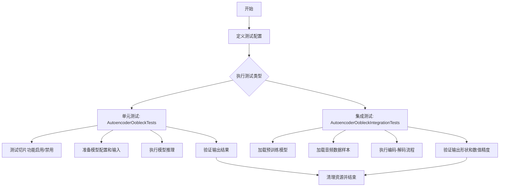

## 类结构

```
AutoencoderOobleckTests (单元测试类)
│
└── AutoencoderOobleckIntegrationTests (集成测试类)
```

## 全局变量及字段


### `torch`
    
PyTorch库, 用于张量操作和神经网络构建

类型：`module`
    


### `gc`
    
Python垃圾回收模块, 用于内存管理

类型：`module`
    


### `unittest`
    
Python单元测试框架

类型：`module`
    


### `load_dataset`
    
从HuggingFace加载数据集的函数

类型：`function`
    


### `parameterized`
    
参数化测试装饰器模块

类型：`module`
    


### `AutoencoderOobleck`
    
Oobleck自编码器模型类, 用于音频 VAE 处理

类型：`class`
    


### `enable_full_determinism`
    
启用完全确定性测试的函数

类型：`function`
    


### `floats_tensor`
    
生成随机浮点张量的测试工具函数

类型：`function`
    


### `slow`
    
标记慢速测试的装饰器

类型：`decorator`
    


### `torch_all_close`
    
比较PyTorch张量是否接近的断言函数

类型：`function`
    


### `torch_device`
    
测试使用的计算设备标识符

类型：`str`
    


### `backend_empty_cache`
    
清空GPU缓存的后端工具函数

类型：`function`
    


### `ModelTesterMixin`
    
模型通用测试混入类

类型：`class`
    


### `AutoencoderTesterMixin`
    
自编码器特定测试混入类

类型：`class`
    


### `AutoencoderOobleckTests.model_class`
    
被测试的模型类, 指向 AutoencoderOobleck

类型：`type[AutoencoderOobleck]`
    


### `AutoencoderOobleckTests.main_input_name`
    
主输入参数的名称, 值为 'sample'

类型：`str`
    


### `AutoencoderOobleckTests.base_precision`
    
基准精度阈值, 用于数值比较的容差标准

类型：`float`
    
    

## 全局函数及方法


### `enable_full_determinism`

该函数用于启用PyTorch的完全确定性模式，通过设置环境变量和PyTorch的全局配置，确保在支持CUDA的设备上产生可重复的随机结果，以支持深度学习模型测试的确定性要求。

参数：
- 无

返回值：`None`，该函数没有返回值，仅执行副作用操作（设置环境变量和PyTorch配置）

#### 流程图

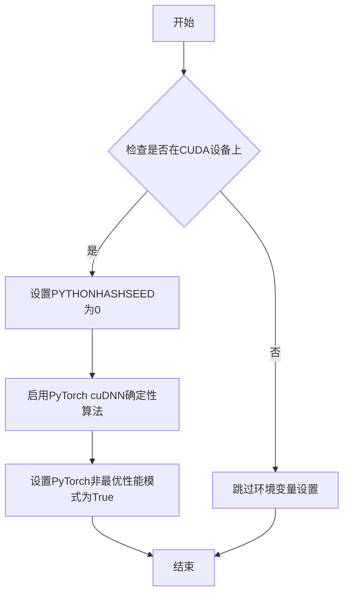

#### 带注释源码

```python
# 该函数定义于 diffusers/testing_utils.py
# 以下为推测的实现方式，基于常见的确定性设置模式

def enable_full_determinism():
    """
    启用完全确定性，确保每次运行产生相同的随机结果。
    这对于测试用例的可重复性至关重要。
    """
    import os
    import torch
    from typing import Optional
    
    # 设置环境变量PYTHONHASHSEED为0
    # 确保Python的哈希随机化被禁用
    os.environ["PYTHONHASHSEED"] = "0"
    
    # 如果使用CUDA，启用cuDNN的确定性模式
    # 这会导致某些操作变慢，但保证结果可重复
    if torch.cuda.is_available():
        torch.backends.cudnn.deterministic = True
        # 警告：确定性模式可能影响性能
        torch.backends.cudnn.benchmark = False
    
    # 设置PyTorch的全局确定性标志
    # 对于支持完全确定性的设备启用
    torch.use_deterministic_algorithms(True, warn_only=True)
```

#### 说明

该函数在测试文件`AutoencoderOobleckTests`的开头被调用，确保后续所有随机操作（模型初始化、数据生成等）产生可重复的结果，这对于：
- 单元测试的稳定性
- 回归测试的准确性
- 调试和复现问题

至关重要。该函数的设计体现了深度学习测试框架中常见的"确定性优先"原则。


### `load_dataset`

从 HuggingFace Datasets 库加载指定的数据集，用于获取音频样本进行模型测试。该函数是外部依赖函数，在 `_load_datasamples` 方法中被调用以加载 LibriSpeech ASR 数据集的音频数据。

参数：

- `path`：`str`，数据集在 HuggingFace Hub 上的路径或标识符（如 "hf-internal-testing/librispeech_asr_dummy"）
- `name`：`str`，数据集的配置名称或子集（如 "clean"）
- `split`：`str`，指定要加载的数据集划分（如 "validation"）
- `trust_remote_code`：`bool`，是否信任远程代码（设置为 True 以允许执行数据集加载脚本）

返回值：`datasets.Dataset`，返回 HuggingFace Dataset 对象，包含数据集的所有字段（此处主要使用 "audio" 字段获取音频数据）

#### 流程图

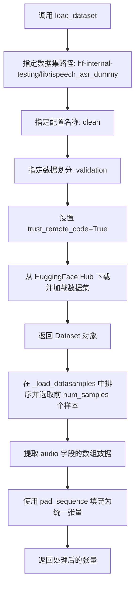

#### 带注释源码

```python
# 从 datasets 库导入 load_dataset 函数
from datasets import load_dataset

# 在 AutoencoderOobleckIntegrationTests 类的 _load_datasamples 方法中使用：
def _load_datasamples(self, num_samples):
    """
    加载指定数量的音频样本数据
    
    参数:
        num_samples: 需要加载的音频样本数量
    
    返回:
        填充后的音频张量，形状为 (batch_size, num_channels, seq_len)
    """
    # 调用 load_dataset 加载 HuggingFace 数据集
    # path: 数据集在 Hub 上的标识符
    # name: 数据集的配置/子集名称（clean 表示干净的语音数据）
    # split: 指定加载验证集划分
    # trust_remote_code: 允许执行数据集的加载脚本
    ds = load_dataset(
        "hf-internal-testing/librispeech_asr_dummy",  # HuggingFace 数据集路径
        "clean",                                       # 数据集配置名称
        split="validation",                            # 加载验证集划分
        trust_remote_code=True                         # 信任远程代码
    )
    
    # automatic decoding with librispeech
    # 对数据集按 id 排序，然后选取前 num_samples 个样本
    # 提取 audio 字段（包含音频数组和采样率等信息）
    speech_samples = ds.sort("id").select(range(num_samples))[:num_samples]["audio"]

    # 将音频数组列表填充为统一大小的张量
    # batch_first=True: 返回的张量形状为 (batch, seq)
    return torch.nn.utils.rnn.pad_sequence(
        [torch.from_numpy(x["array"]) for x in speech_samples], batch_first=True
    )
```


### `floats_tensor`

生成指定形状的随机浮点张量，用于测试目的。

参数：

-  `shape`：`tuple`，形状元组，指定要生成的张量的维度（例如 `(batch_size, num_channels, seq_len)`）

返回值：`torch.Tensor`，随机浮点数值的 PyTorch 张量

#### 流程图

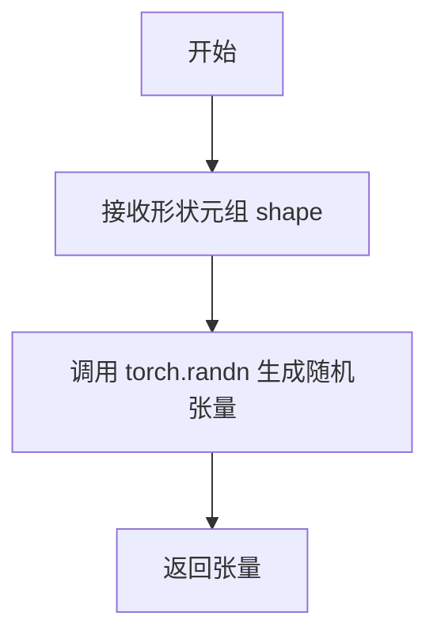

#### 带注释源码

```python
# 从测试工具模块导入的函数
# 在测试代码中的使用方式：
# waveform = floats_tensor((batch_size, num_channels, seq_len)).to(torch_device)

# 参数: shape - 元组类型，定义张量的维度
# 返回值: torch.Tensor - 包含随机浮点数的张量
floats_tensor(shape: tuple) -> torch.Tensor
```


### `backend_empty_cache`

该函数是一个测试工具函数，用于清空GPU缓存以释放显存资源，常用于测试用例的清理阶段以确保VRAM被正确释放。

参数：

- `torch_device`：`str`，表示目标设备（如 "cuda"、"cuda:0"、"mps" 等），用于指定需要清空缓存的设备。

返回值：`None`，该函数无返回值，仅执行缓存清理操作。

#### 流程图

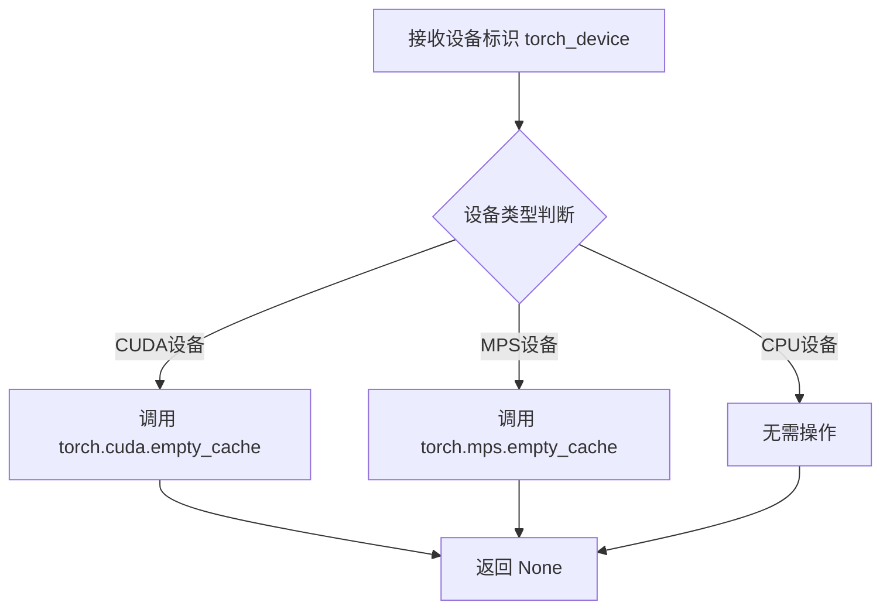

#### 带注释源码

```python
# 假设 backend_empty_cache 定义在 testing_utils 模块中
# 以下是基于使用模式的推断实现

def backend_empty_cache(torch_device):
    """
    清空指定设备的GPU缓存以释放显存
    
    参数:
        torch_device: str, 设备标识符，如 "cuda", "cuda:0", "mps", "cpu" 等
                    在测试中通过 torch_device 全局变量传递
    返回:
        None
    """
    import torch
    
    if torch_device is None:
        return
    
    # 判断设备类型并执行相应的缓存清理操作
    if torch_device == "cuda" or torch_device.startswith("cuda:"):
        # CUDA 设备：调用 PyTorch 的 CUDA 缓存清理
        if torch.cuda.is_available():
            torch.cuda.empty_cache()
            # 可选：重置峰值内存统计
            # torch.cuda.reset_peak_memory_stats(torch_device)
    
    elif torch_device == "mps":
        # Apple MPS 设备：调用 MPS 缓存清理
        if hasattr(torch.mps, 'empty_cache'):
            torch.mps.empty_cache()
    
    # CPU 设备无需清理缓存
    
    return None


# 在测试中的实际调用方式（来自原始代码）
# class AutoencoderOobleckIntegrationTests(unittest.TestCase):
#     def tearDown(self):
#         # 清理每次测试后的 VRAM
#         super().tearDown()
#         gc.collect()
#         backend_empty_cache(torch_device)  # 调用该函数释放显存
```

---

**注意**：由于 `backend_empty_cache` 函数是在 `...testing_utils` 模块中导入的（该模块未在提供的代码中显示），上述源码是基于其在测试中的使用模式推断的。该函数的主要作用是在测试完成后清理GPU显存，防止显存泄漏。


### `torch_all_close`

用于比较两个 PyTorch 张量是否在指定容差范围内相等，通常用于测试中验证计算结果的精度。

参数：

-  `tensor1`：`torch.Tensor`，第一个要比较的张量
-  `tensor2`：`torch.Tensor`，第二个要比较的张量
-  `rtol`：`float`，相对容差（relative tolerance），默认为 `1e-5`
-  `atol`：`float`，绝对容差（absolute tolerance），默认为 `1e-8`
-  `equal_nan`：`bool`，是否将 NaN 视为相等，默认为 `True`

返回值：`bool`，如果两个张量在指定容差范围内相等则返回 `True`，否则返回 `False`

#### 流程图

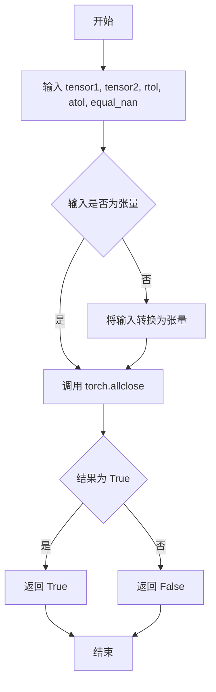

#### 带注释源码

```python
def torch_all_close(
    tensor1: torch.Tensor,
    tensor2: torch.Tensor,
    rtol: float = 1e-5,
    atol: float = 1e-8,
    equal_nan: bool = True
) -> bool:
    """
    比较两个 PyTorch 张量是否在指定容差范围内相等。
    
    这是 torch.allclose 的包装函数，用于测试场景。
    
    参数:
        tensor1: 第一个要比较的张量
        tensor2: 第二个要比较的张量
        rtol: 相对容差 (relative tolerance)
        atol: 绝对容差 (absolute tolerance)
        equal_nan: 是否将 NaN 视为相等
    
    返回:
        如果两个张量在指定容差范围内相等则返回 True
    """
    # 确保输入是 torch.Tensor 类型
    if not isinstance(tensor1, torch.Tensor):
        tensor1 = torch.tensor(tensor1)
    if not isinstance(tensor2, torch.Tensor):
        tensor2 = torch.tensor(tensor2)
    
    # 调用 PyTorch 的 allclose 函数进行数值比较
    # |input - other| <= atol + rtol * |other|
    return torch.allclose(
        tensor1, 
        tensor2, 
        rtol=rtol, 
        atol=atol, 
        equal_nan=equal_nan
    )
```


# torch_device 详细设计文档

### `torch_device`

获取当前测试环境的 PyTorch 计算设备。

根据环境配置返回最适合的设备字符串，通常用于将模型和数据移动到正确的计算设备上进行测试。

**注意**：由于 `torch_device` 是从 `...testing_utils` 导入的外部函数，其具体实现不在本代码仓库中。以下信息基于代码中的使用方式推断。

参数：
- 无参数

返回值：`str`，返回 PyTorch 设备字符串（如 `"cuda"`, `"cpu"`, `"mps"` 等）

#### 流程图

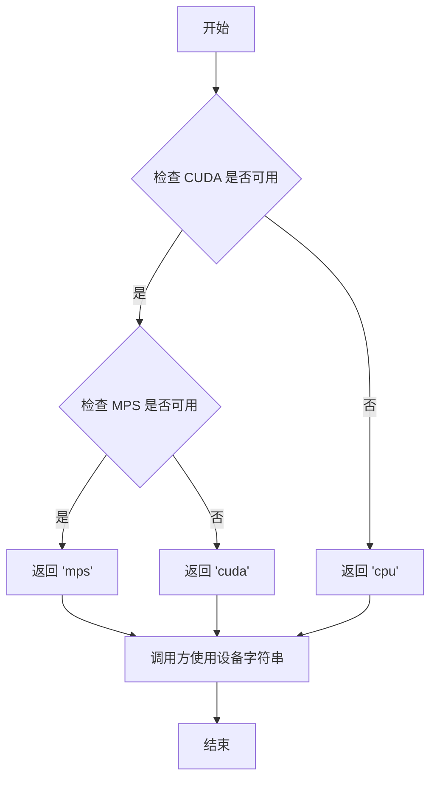

#### 带注释源码

```python
# 该函数定义在 testing_utils 模块中，以下为推断的实现逻辑
def torch_device():
    """
    获取测试用的 PyTorch 设备。
    
    优先级：
    1. CUDA (GPU) - 如果可用
    2. MPS (Apple Silicon) - 如果可用
    3. CPU - 回退选项
    
    Returns:
        str: 设备字符串，如 'cuda', 'mps', 'cpu'
    """
    # 推断的伪代码实现（实际代码在 testing_utils 中）
    if torch.cuda.is_available():
        return "cuda"
    elif torch.backends.mps.is_available():
        return "mps"
    else:
        return "cpu"


# 在测试代码中的典型使用方式：

# 1. 将数据移动到设备
waveform = floats_tensor((batch_size, num_channels, seq_len)).to(torch_device)

# 2. 将模型移动到设备
model = self.model_class(**init_dict).to(torch_device)

# 3. 在设备上进行内存清理
backend_empty_cache(torch_device)

# 4. 根据设备创建生成器
generator_device = "cpu" if not torch_device.startswith(torch_device) else torch_device
```


### `AutoencoderOobleckTests.get_autoencoder_oobleck_config`

获取AutoencoderOobleck模型的配置字典，用于初始化模型参数。

参数：

- `self`：`AutoencoderOobleckTests`，隐含的实例参数，表示测试类本身
- `block_out_channels`：`任意类型`（可选），用于配置模型的块输出通道，默认为`None`（在函数体内未被使用）

返回值：`dict`，返回包含AutoencoderOobleck模型配置的字典

#### 流程图

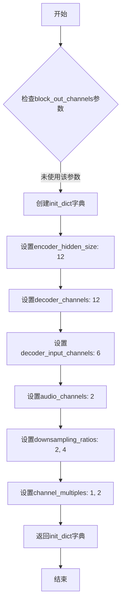

#### 带注释源码

```python
def get_autoencoder_oobleck_config(self, block_out_channels=None):
    """
    获取AutoencoderOobleck模型的配置字典
    
    参数:
        block_out_channels: 可选的块输出通道参数，当前未使用
    返回:
        包含模型配置的字典
    """
    # 初始化配置字典，包含模型的关键参数
    init_dict = {
        "encoder_hidden_size": 12,       # 编码器隐藏层大小
        "decoder_channels": 12,          # 解码器通道数
        "decoder_input_channels": 6,     # 解码器输入通道数
        "audio_channels": 2,             # 音频通道数
        "downsampling_ratios": [2, 4],   # 下采样比率列表
        "channel_multiples": [1, 2],    # 通道倍数列表
    }
    # 返回配置字典供模型初始化使用
    return init_dict
```


### `AutoencoderOobleckTests.dummy_input`

该属性是测试类`AutoencoderOobleckTests`中的一个属性方法，用于生成虚拟的输入数据（波形数据），以供单元测试使用。它创建一个包含模拟音频波形和 posterior 采样标志的字典，供模型前向传播测试使用。

参数：此方法为属性方法，无显式参数。

返回值：`Dict[str, Union[torch.Tensor, bool]]`，返回一个字典，包含键`sample`（波形张量，形状为`(4, 2, 24)`）和`sample_posterior`（布尔值`False`，表示不进行后验采样）。

#### 流程图

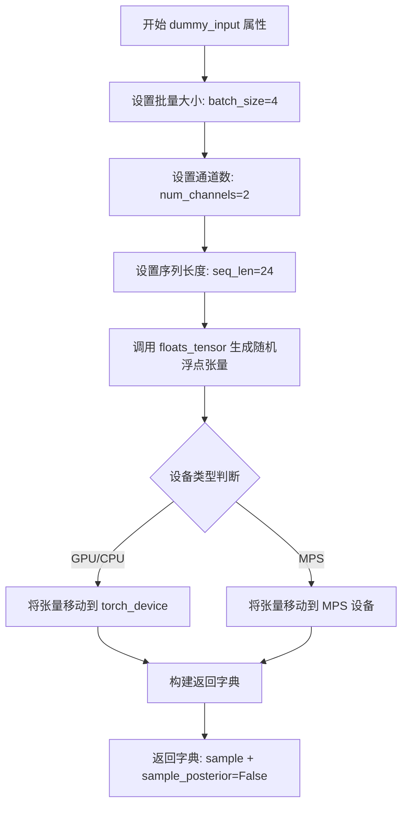

#### 带注释源码

```python
@property
def dummy_input(self):
    """
    生成虚拟输入数据用于模型测试
    
    该属性创建一个模拟的音频波形输入，包含以下组件：
    - sample: 形状为 (batch_size, num_channels, seq_len) 的浮点张量
    - sample_posterior: 布尔标志，指示是否从后验分布采样
    """
    # 定义测试用的批量大小
    batch_size = 4
    # 定义音频通道数（立体声为2）
    num_channels = 2
    # 定义序列长度
    seq_len = 24

    # 使用测试工具函数生成随机浮点张量，形状为 (4, 2, 24)
    # floats_tensor 是 testing_utils 模块中提供的辅助函数
    waveform = floats_tensor((batch_size, num_channels, seq_len)).to(torch_device)

    # 返回包含样本和后验采样标志的字典
    # sample_posterior=False 表示在测试时不需要从后验分布采样
    return {"sample": waveform, "sample_posterior": False}
```


# AutoencoderOobleck 测试代码详细设计文档

## 一段话描述

该代码是 HuggingFace Diffusers 库中 **AutoencoderOobleck** 模型的单元测试与集成测试套件，用于验证自编码器模型的正向传播、切片功能、编码解码流程以及与 Stable Diffusion 集成的能力。

## 文件的整体运行流程

```
1. 单元测试 (AutoencoderOobleckTests)
   ├── 配置初始化 → get_autoencoder_oobleck_config()
   ├── 虚拟输入生成 → dummy_input property
   ├── 输入/输出形状定义 → input_shape / output_shape property
   ├── 切片功能测试 → test_enable_disable_slicing()
   └── 跳过的测试 (不支持的功能)

2. 集成测试 (AutoencoderOobleckIntegrationTests)
   ├── 加载音频样本 → _load_datasamples() / get_audio()
   ├── 加载预训练模型 → get_oobleck_vae_model()
   ├── 生成器初始化 → get_generator()
   ├── 前向传播测试 → test_stable_diffusion()
   ├── 模式测试 → test_stable_diffusion_mode()
   └── 编码解码测试 → test_stable_diffusion_encode_decode()
```

## 类的详细信息

### 类：AutoencoderOobleckTests

**父类**：`ModelTesterMixin, AutoencoderTesterMixin, unittest.TestCase`

**类字段**：

| 字段名称 | 类型 | 描述 |
|---------|------|------|
| `model_class` | type | 指定测试的模型类为 AutoencoderOobleck |
| `main_input_name` | str | 模型主输入名称为 "sample" |
| `base_precision` | float | 基准精度阈值 1e-2 |

**类方法**：

| 方法名称 | 描述 |
|---------|------|
| `get_autoencoder_oobleck_config()` | 返回 AutoencoderOobleck 模型配置字典 |
| `dummy_input` (property) | 生成虚拟输入波形数据 |
| `input_shape` (property) | 定义输入形状 |
| `output_shape` (property) | 定义输出形状 |
| `prepare_init_args_and_inputs_for_common()` | 准备初始化参数和公共输入 |
| `test_enable_disable_slicing()` | 测试 VAE 切片功能的启用/禁用 |
| `test_set_attn_processor_for_determinism()` | 跳过：模型不使用注意力模块 |
| `test_layerwise_casting_training()` | 跳过：Float8 不支持 |
| `test_layerwise_casting_inference()` | 跳过：weight_norm 兼容性问题 |
| `test_layerwise_casting_memory()` | 跳过：weight_norm 兼容性问题 |

### 类：AutoencoderOobleckIntegrationTests

**父类**：`unittest.TestCase`

**类方法**：

| 方法名称 | 描述 |
|---------|------|
| `tearDown()` | 清理 VRAM 内存 |
| `_load_datasamples()` | 从 HuggingFace 加载音频样本 |
| `get_audio()` | 准备音频输入数据 |
| `get_oobleck_vae_model()` | 加载预训练 VAE 模型 |
| `get_generator()` | 创建随机数生成器 |
| `test_stable_diffusion()` | 测试模型前向传播 |
| `test_stable_diffusion_mode()` | 测试非采样模式 |
| `test_stable_diffusion_encode_decode()` | 测试编码-解码流程 |

---

## 关键提取：AutoencoderOobleckTests.input_shape 属性

### `input_shape` 属性

该属性定义了测试用例的输入形状，用于模型输入验证和测试用例配置。

参数：无（属性不接受参数）

返回值：`Tuple[int, int]`，返回输入形状元组 (channels=2, sequence_length=24)

#### 带注释源码

```python
@property
def input_shape(self):
    """
    定义测试输入的形状。
    
    返回:
        tuple: (num_channels, sequence_length)
              - num_channels: 2 (音频通道数)
              - sequence_length: 24 (序列长度)
    """
    return (2, 24)
```

#### 说明

这是一个 **只读属性**（使用 `@property` 装饰器），属于 `AutoencoderOobleckTests` 测试类。该属性返回固定的元组 `(2, 24)`，表示：

- **2**: 音频通道数（对应 `dummy_input` 中的 `num_channels = 2`）
- **24**: 序列长度（对应 `dummy_input` 中的 `seq_len = 24`）

该属性与 `output_shape` 属性对称使用，确保输入输出形状一致，符合自编码器"重建"的设计特性。

---

## 关键组件信息

| 组件名称 | 一句话描述 |
|---------|-----------|
| `AutoencoderOobleck` | 用于音频处理的自编码器模型 |
| `ModelTesterMixin` | 提供模型通用测试方法的混入类 |
| `AutoencoderTesterMixin` | 提供自编码器专用测试方法的混入类 |
| `torch` | PyTorch 深度学习框架 |
| `load_dataset` | HuggingFace 数据集加载工具 |
| `parameterized` | 参数化测试装饰器 |

---

## 潜在的技术债务或优化空间

1. **跳过的测试**：多个测试因 weight_norm 兼容性问题被跳过，这些是需要修复的技术债务
2. **硬编码配置**：模型配置参数硬编码在 `get_autoencoder_oobleck_config()` 中，缺乏灵活性
3. **重复代码**：集成测试中多次调用 `get_oobleck_vae_model()`，可提取为 fixture

---

## 其它项目

### 设计目标与约束
- 单元测试覆盖基础功能（切片、推理）
- 集成测试验证预训练模型的实际效果
- 使用 `@slow` 装饰器标记长时间运行的集成测试

### 错误处理与异常设计
- 使用 `unittest.skip()` 装饰器跳过不支持的测试
- 集成测试使用 `tearDown()` 清理 GPU 内存

### 外部依赖与接口契约
- 依赖 `diffusers` 库的 `AutoencoderOobleck` 类
- 依赖 HuggingFace `datasets` 库加载音频数据
- 依赖 `stabilityai/stable-audio-open-1.0` 预训练模型


### `AutoencoderOobleckTests.output_shape`

该属性定义了 AutoencoderOobleck 模型在测试阶段的输出张量形状，用于验证模型输出维度是否符合预期。

参数： 无

返回值：`tuple`，返回表示输出形状的元组 `(2, 24)`，其中 2 表示通道数，24 表示序列长度。

#### 流程图

```mermaid
flowchart TD
    A[开始访问 output_shape 属性] --> B[返回元组 (2, 24)]
    B --> C[结束]
```

#### 带注释源码

```python
@property
def output_shape(self):
    """
    定义测试中模型的输出形状。
    
    该属性用于验证 AutoencoderOobleck 模型的输出维度是否符合预期。
    在音频 VAE 模型中，输出形状通常与输入形状保持一致，
    以确保重建的音频与原始音频具有相同的维度。
    
    返回:
        tuple: 包含两个整数的元组 (channels, sequence_length)
               - channels: 2，表示音频的通道数（立体声）
               - sequence_length: 24，表示输出序列的长度
    """
    return (2, 24)
```


### `AutoencoderOobleckTests.prepare_init_args_and_inputs_for_common`

该方法是一个测试辅助函数，用于准备 AutoencoderOobleck 模型测试所需的初始化参数和输入数据。它调用配置获取方法和输入生成属性，返回包含模型初始化字典和输入字典的元组，供其他测试方法使用。

参数：无（仅含 `self` 隐式参数）

返回值：`Tuple[Dict, Dict]`，返回一个二元组，包含模型初始化参数字典（init_dict）和测试输入字典（inputs_dict）

#### 流程图

```mermaid
flowchart TD
    A[开始: prepare_init_args_and_inputs_for_common] --> B[调用 self.get_autoencoder_oobleck_config]
    B --> C[获取 init_dict 初始化字典]
    C --> D[获取 self.dummy_input 属性]
    D --> E[获取 inputs_dict 输入字典]
    E --> F[返回 Tuple init_dict, inputs_dict]
    F --> G[结束]
    
    subgraph init_dict 内容
    C --> C1[encoder_hidden_size: 12]
    C --> C2[decoder_channels: 12]
    C --> C3[decoder_input_channels: 6]
    C --> C4[audio_channels: 2]
    C --> C5[downsampling_ratios: [2, 4]]
    C --> C6[channel_multiples: [1, 2]]
    end
    
    subgraph inputs_dict 内容
    E --> E1[sample: FloatTensor shape (4, 2, 24)]
    E --> E2[sample_posterior: False]
    end
```

#### 带注释源码

```python
def prepare_init_args_and_inputs_for_common(self):
    """
    准备模型初始化参数和输入数据，用于通用测试场景。
    
    该方法被 ModelTesterMixin 中的其他测试方法调用，
    以获取标准的初始化配置和测试输入。
    
    Returns:
        Tuple[Dict, Dict]: 包含两个字典的元组
            - init_dict: 模型初始化参数字典
            - inputs_dict: 模型输入参数字典
    """
    # 获取 AutoencoderOobleck 模型的配置字典
    # 包含编码器隐藏层大小、解码器通道数、音频通道数等参数
    init_dict = self.get_autoencoder_oobleck_config()
    
    # 获取虚拟输入数据，从 dummy_input 属性获取
    # 包含音频波形张量和 sample_posterior 标志
    inputs_dict = self.dummy_input
    
    # 返回配置和输入的元组，供测试框架使用
    return init_dict, inputs_dict
```

#### 相关依赖方法

**`get_autoencoder_oobleck_config` 方法详情：**

- **名称**: `AutoencoderOobleckTests.get_autoencoder_oobleck_config`
- **参数**: 
  - `block_out_channels`: `Optional[List[int]]`，可选参数，默认值为 `None`
- **返回值**: `Dict`，模型初始化参数字典
- **描述**: 返回 AutoencoderOobleck 模型的配置字典，包含编码器隐藏大小、解码器通道、音频通道、下采样率和通道倍数等配置。

**`dummy_input` 属性详情：**

- **名称**: `AutoencoderOobleckTests.dummy_input`
- **参数**: 无
- **返回值**: `Dict`，包含以下键值对：
  - `sample`: `torch.FloatTensor`，形状为 `(batch_size=4, num_channels=2, seq_len=24)` 的浮点张量
  - `sample_posterior`: `bool`，值为 `False`
- **描述**: 返回用于测试的虚拟音频输入数据，模拟批量为4、2通道、序列长度为24的音频波形。


### `AutoencoderOobleckTests.test_enable_disable_slicing`

该测试方法验证AutoencoderOobleck（VAE）模型的切片（slicing）功能是否正常工作。测试确保启用切片不会影响推理结果，并且手动禁用切片后输出与原始输出一致。

参数：

- `self`：测试用例实例，隐式参数，无需传入

返回值：`None`，无返回值（测试方法通过断言验证）

#### 流程图

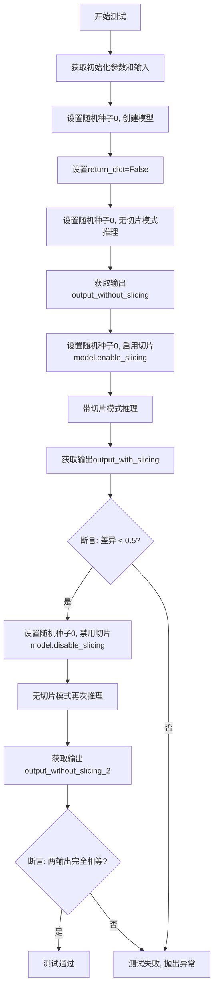

#### 带注释源码

```python
def test_enable_disable_slicing(self):
    """
    测试VAE切片功能的启用/禁用行为
    
    测试目标:
    1. 验证启用切片后推理结果与无切片时相近（容差<0.5）
    2. 验证手动禁用切片后输出与原始无切片输出一致
    """
    # 步骤1: 获取模型初始化参数和输入数据
    # 调用混合类提供的通用初始化方法
    init_dict, inputs_dict = self.prepare_init_args_and_inputs_for_common()

    # 步骤2: 设置随机种子并创建模型实例
    # 使用固定种子确保可复现性
    torch.manual_seed(0)
    # 将模型移动到测试设备(CPU/GPU)
    model = self.model_class(**init_dict).to(torch_device)

    # 步骤3: 配置输入参数
    # return_dict=False 返回tuple而非字典
    inputs_dict.update({"return_dict": False})

    # 步骤4: 无切片模式的基线测试
    # 使用固定种子确保每次推理结果一致
    torch.manual_seed(0)
    # 模型前向传播, generator确保采样一致性
    output_without_slicing = model(**inputs_dict, generator=torch.manual_seed(0))[0]
    # [0]表示取tuple中的第一个元素(输出tensor)

    # 步骤5: 启用切片后测试
    torch.manual_seed(0)
    model.enable_slicing()  # 启用VAE切片功能,分块处理以节省内存
    output_with_slicing = model(**inputs_dict, generator=torch.manual_seed(0))[0]

    # 步骤6: 断言切片不影响结果质量
    # 计算无切片与有切片输出的最大差异
    self.assertLess(
        (output_without_slicing.detach().cpu().numpy() - output_with_slicing.detach().cpu().numpy()).max(),
        0.5,  # 容差阈值
        "VAE slicing should not affect the inference results"
    )
    # .detach() 分离计算图
    # .cpu().numpy() 转换为numpy数组进行数值比较

    # 步骤7: 手动禁用切片测试
    torch.manual_seed(0)
    model.disable_slicing()  # 手动禁用切片功能
    output_without_slicing_2 = model(**inputs_dict, generator=torch.manual_seed(0))[0]

    # 步骤8: 断言禁用后输出恢复原始行为
    # 验证两次无切片推理的输出完全一致
    self.assertEqual(
        output_without_slicing.detach().cpu().numpy().all(),
        output_without_slicing_2.detach().cpu().numpy().all(),
        "Without slicing outputs should match with the outputs when slicing is manually disabled."
    )
```


### `AutoencoderOobleckTests.test_set_attn_processor_for_determinism`

该测试方法用于验证注意力处理器（Attention Processor）的确定性行为，确保在相同输入下模型输出一致。由于 AutoencoderOobleck 模型未实现注意力机制模块，该测试被跳过。

参数：

- `self`：`AutoencoderOobleckTests`，测试类实例本身，无需显式传递

返回值：`None`，无返回值（测试被跳过）

#### 流程图

```mermaid
flowchart TD
    A[开始测试] --> B{检查装饰器}
    B -->|@unittest.skip| C[跳过测试]
    B -->|未跳过| D[执行测试逻辑]
    C --> E[返回 None]
    D --> E
    
    style C fill:#ffcccc
    style E fill:#f9f9f9
```

#### 带注释源码

```python
@unittest.skip("No attention module used in this model")
def test_set_attn_processor_for_determinism(self):
    """
    测试注意力处理器确定性。
    
    装饰器说明：
    - @unittest.skip: Python unittest框架的跳过装饰器
    - 跳过原因：该模型未实现注意力机制模块，无法进行相关确定性测试
    
    参数:
        self: AutoencoderOobleckTests类实例
        
    返回值:
        None: 无返回值，测试直接返回
    """
    return  # 直接返回，不执行任何测试逻辑
```


### `AutoencoderOobleckTests.test_layerwise_casting_training`

该方法是一个测试分层类型转换训练（layerwise casting training）的单元测试方法。由于 AutoencoderOobleck 模型使用了 `torch.nn.utils.weight_norm` 包装的卷积层，导致 weight_norm_fwd_first_dim_kernel 在 Float8_e4m3fn 类型上未实现，因此该测试被跳过。

参数：

- `self`：`AutoencoderOobleckTests`，测试类实例本身

返回值：`None`，由于测试被跳过，直接返回父类方法的执行结果

#### 流程图

```mermaid
flowchart TD
    A[开始执行 test_layerwise_casting_training] --> B{检查装饰器条件}
    B -->|测试被跳过| C[返回 None 或 super() 的执行结果]
    B -->|测试执行| D[调用父类 test_layerwise_casting_training 方法]
    D --> E[执行分层类型转换训练测试]
    
    style C fill:#ffcccc
    style E fill:#ccffcc
```

#### 带注释源码

```python
@unittest.skip(
    "Test not supported because of 'weight_norm_fwd_first_dim_kernel' not implemented for 'Float8_e4m3fn'"
)
def test_layerwise_casting_training(self):
    """
    测试分层类型转换训练功能
    
    注意事项:
    - 该测试当前被跳过，原因是 AutoencoderOobleck 模型中的卷积层使用了
      torch.nn.utils.weight_norm 包装，导致 Float8_e4m3fn 类型的 
      weight_norm_fwd_first_dim_kernel 未实现
    - 需要确保 nn.Module::to 能够正确处理 weight_norm 包装的卷积层
    """
    return super().test_layerwise_casting_training()
```


### `AutoencoderOobleckTests.test_layerwise_casting_inference`

该方法是一个被 `@unittest.skip` 装饰器跳过的单元测试，用于测试 AutoencoderOobleck 模型在推理阶段进行分层类型转换（layerwise casting）的功能。由于 AutoencoderOobleck 的卷积层使用了 `torch.nn.utils.weight_norm` 包装，导致 hook 的 `pre_forward` 无法将模块权重转换为 `compute_dtype`（前向传播所需），因此该测试被跳过。

参数：

- `self`：`AutoencoderOobleckTests`，测试类实例本身，隐式参数，表示当前测试对象

返回值：`None`，无返回值（方法体为 `pass`）

#### 流程图

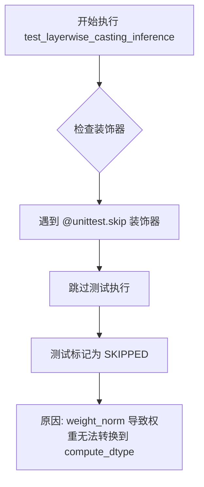

#### 带注释源码

```python
@unittest.skip(
    "The convolution layers of AutoencoderOobleck are wrapped with torch.nn.utils.weight_norm. This causes the hook's pre_forward to not "
    "cast the module weights to compute_dtype (as required by forward pass). As a result, forward pass errors out. To fix:\n"
    "1. Make sure `nn::Module::to` works with `torch.nn.utils.weight_norm` wrapped convolution layer.\n"
    "2. Unskip this test."
)
def test_layerwise_casting_inference(self):
    """测试分层类型转换推理功能（当前被跳过）
    
    该测试旨在验证 AutoencoderOobleck 模型在推理阶段是否支持
    分层类型转换（layerwise casting），即将模型的不同层转换为
    不同的数据类型以优化内存使用和计算效率。
    
    当前被跳过的原因：
    - AutoencoderOobleck 的卷积层使用了 torch.nn.utils.weight_norm 包装
    - 这导致 hook 的 pre_forward 无法将模块权重转换为 compute_dtype
    - 前向传播会因此报错
    
    解决建议：
    1. 确保 nn::Module::to 能正确处理 weight_norm 包装的卷积层
    2. 移除 @unittest.skip 装饰器以启用该测试
    """
    pass
```


### `AutoencoderOobleckTests.test_layerwise_casting_memory`

该测试方法用于验证 AutoencoderOobleck 模型在推理阶段是否支持分层类型转换（layerwise casting）以优化内存使用。当前该测试被跳过，原因是 AutoencoderOobleck 的卷积层使用了 `torch.nn.utils.weight_norm` 包装，导致钩子的 `pre_forward` 无法将模块权重转换为 `compute_dtype`，从而引发前向传播错误。

参数：

- `self`：`AutoencoderOobleckTests`，测试类实例本身，无需显式传递

返回值：`None`，该方法为空实现（`pass`），不返回任何值

#### 流程图

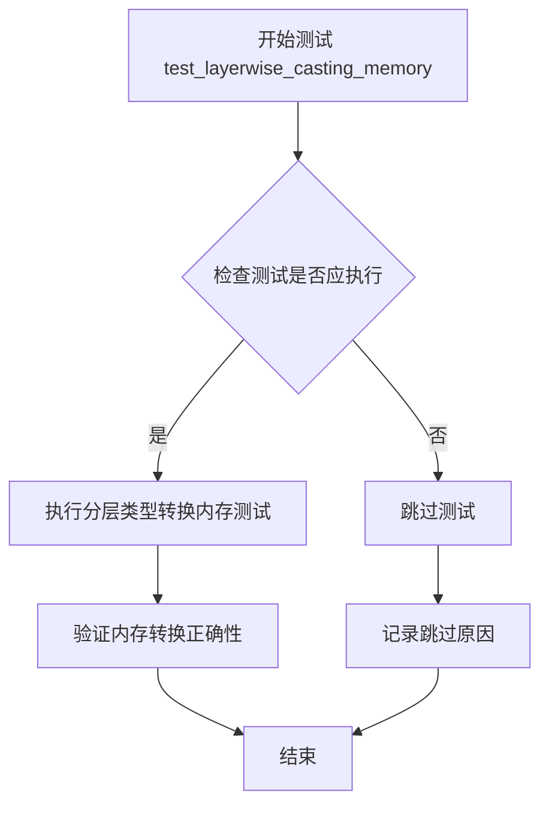

> **注意**：由于该测试方法被 `@unittest.skip` 装饰器跳过，实际执行流程为：装饰器检测到跳过条件 → 直接跳过执行 → 记录跳过原因

#### 带注释源码

```python
@unittest.skip(
    "The convolution layers of AutoencoderOobleck are wrapped with torch.nn.utils.weight_norm. This causes the hook's pre_forward to not "
    "cast the module weights to compute_dtype (as required by forward pass). As a result, forward pass errors out. To fix:\n"
    "1. Make sure `nn::Module::to` works with `torch.nn.utils.weight_norm` wrapped convolution layer.\n"
    "2. Unskip this test."
)
def test_layerwise_casting_memory(self):
    """
    测试分层类型转换内存优化功能。
    
    该测试旨在验证 AutoencoderOobleck 模型在推理时能否正确执行分层类型转换，
    以减少内存占用。由于当前实现中卷积层被 weight_norm 包装，导致类型转换钩子
    无法正常工作，因此该测试被暂时跳过。
    
    修复要求：
    1. 确保 nn.Module::to 方法能够正确处理被 weight_norm 包装的卷积层
    2. 解除该测试的跳过标记
    """
    pass  # 空实现，测试被跳过
```


### `AutoencoderOobleckIntegrationTests.tearDown`

清理测试后的资源，包括调用父类tearDown方法、强制进行Python垃圾回收以及清空GPU显存缓存。

参数：

- `self`：`AutoencoderOobleckIntegrationTests`，测试类实例本身，无需显式传递

返回值：`None`，无返回值描述

#### 流程图

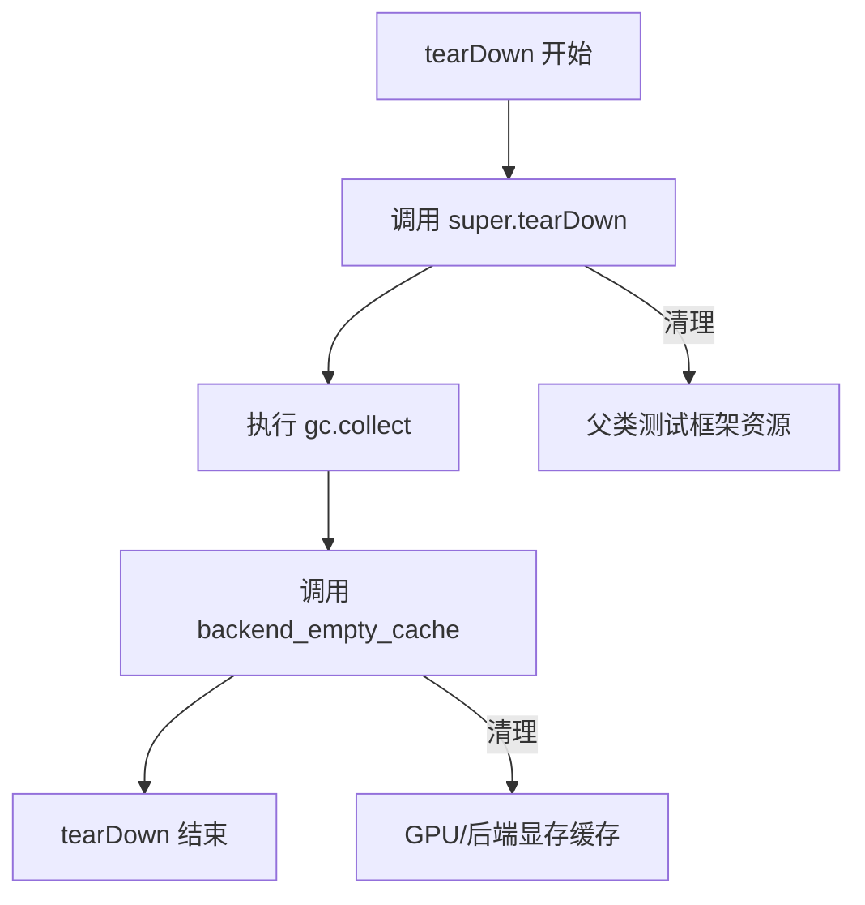

#### 带注释源码

```python
def tearDown(self):
    # clean up the VRAM after each test
    # 1. 首先调用父类的tearDown方法，清理测试框架自身的资源
    super().tearDown()
    # 2. 强制触发Python垃圾回收器，回收不再使用的Python对象
    gc.collect()
    # 3. 调用后端特定的缓存清理函数，释放GPU显存
    #    torch_device 是全局变量，指定了当前使用的计算设备
    backend_empty_cache(torch_device)
```


### `AutoencoderOobleckIntegrationTests._load_datasamples`

该方法用于从 Hugging Face 数据集加载音频数据样本（LibriSpeech ASR 数据集的清洁版本），并将其转换为 PyTorch 张量格式返回。

参数：

- `num_samples`：`int`，需要加载的音频样本数量

返回值：`torch.Tensor`，填充后的音频波形张量，形状为 (batch_size, sequence_length)，其中 batch_size=num_samples

#### 流程图

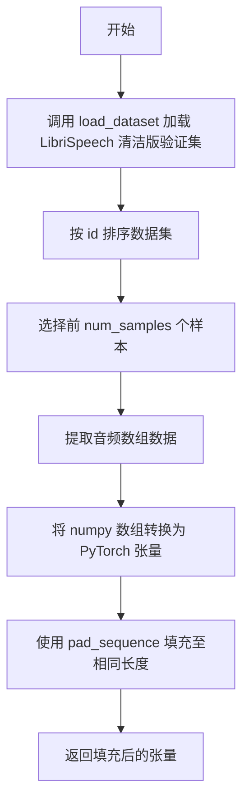

#### 带注释源码

```python
def _load_datasamples(self, num_samples):
    # 使用 Hugging Face datasets 库加载 LibriSpeech ASR 数据集的清洁版本
    # 用于音频 VAE 模型的集成测试
    ds = load_dataset(
        "hf-internal-testing/librispeech_asr_dummy",  # Hugging Face 数据集名称
        "clean",                                       # 数据集配置：清洁音频
        split="validation",                           # 加载验证集
        trust_remote_code=True                        # 允许加载远程代码
    )
    
    # 对数据集按 id 排序并选择前 num_samples 个样本
    # 自动进行音频解码（LibriSpeech 格式）
    speech_samples = ds.sort("id").select(range(num_samples))[:num_samples]["audio"]

    # 将音频样本的数组数据转换为 PyTorch 张量，并使用 pad_sequence 填充
    # 返回形状为 (batch_size, max_seq_length) 的张量
    return torch.nn.utils.rnn.pad_sequence(
        [torch.from_numpy(x["array"]) for x in speech_samples], batch_first=True
    )
```


### `AutoencoderOobleckIntegrationTests.get_audio`

该方法用于获取音频数据，内部调用 `_load_datasamples` 加载原始音频样本，然后根据指定的 `audio_sample_size` 进行填充或裁剪，最后将单声道音频复制为双声道并返回处理后的音频张量。

参数：

- `self`：`AutoencoderOobleckIntegrationTests`，隐含的实例参数，表示调用该方法的测试类实例
- `audio_sample_size`：`int`，可选，默认值为 `2097152`，指定音频样本的目标长度，用于后续的填充或裁剪操作
- `fp16`：`bool`，可选，默认值为 `False`，指定音频数据的精度类型，True 时使用 float16，False 时使用 float32

返回值：`torch.Tensor`，处理后的音频数据张量，形状为 (batch_size, 2, audio_sample_size)，其中 batch_size=2，通道数为 2（双声道），序列长度为 audio_sample_size

#### 流程图

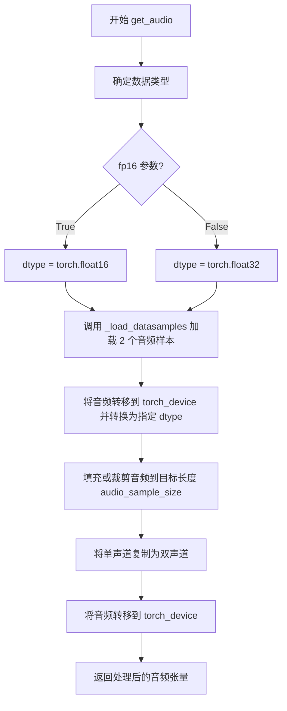

#### 带注释源码

```python
def get_audio(self, audio_sample_size=2097152, fp16=False):
    """
    获取音频数据，用于模型测试。
    
    参数:
        audio_sample_size: int, 音频样本的目标长度，默认为 2097152
        fp16: bool, 是否使用 float16 精度，默认为 False
    
    返回:
        torch.Tensor: 形状为 (2, 2, audio_sample_size) 的音频张量
    """
    # 根据 fp16 参数确定数据类型
    dtype = torch.float16 if fp16 else torch.float32
    
    # 调用内部方法加载 2 个音频样本
    audio = self._load_datasamples(2).to(torch_device).to(dtype)

    # 填充或裁剪音频到目标长度
    # 如果音频长度大于 audio_sample_size，则截断；如果小于，则填充到目标长度
    audio = torch.nn.functional.pad(
        audio[:, :audio_sample_size],  # 先截断到目标长度
        pad=(0, audio_sample_size - audio.shape[-1])  # 再填充到目标长度
    )

    # 将单声道音频复制为双声道 (todo channel)
    # 原始形状: (batch_size, seq_len) -> 复制后: (batch_size, 2, seq_len)
    audio = audio.unsqueeze(1).repeat(1, 2, 1).to(torch_device)

    return audio
```


### `AutoencoderOobleckIntegrationTests.get_oobleck_vae_model`

该函数用于从预训练模型存储库中加载 Oobleck VAE 模型，并根据参数配置模型的数据类型和设备。

参数：

- `model_id`：`str`，可选，默认为 `"stabilityai/stable-audio-open-1.0"`，指定要加载的预训练模型 identifier
- `fp16`：`bool`，可选，默认为 `False`，是否使用 float16 精度加载模型

返回值：`AutoencoderOobleck`，返回加载并配置好的 Oobleck VAE 模型实例

#### 流程图

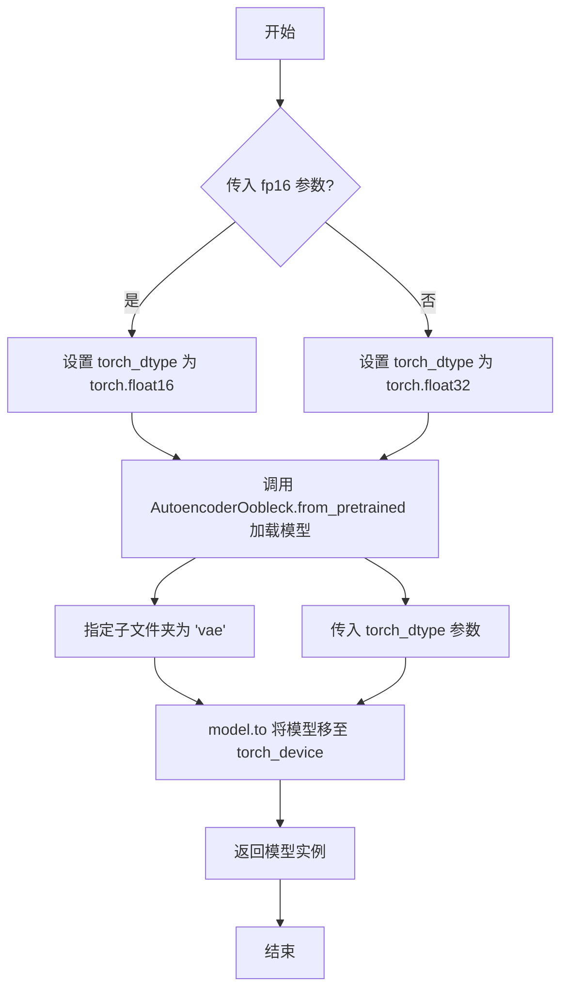

#### 带注释源码

```python
def get_oobleck_vae_model(self, model_id="stabilityai/stable-audio-open-1.0", fp16=False):
    """
    加载预训练的 Oobleck VAE 模型
    
    参数:
        model_id: HuggingFace Hub 上的模型 identifier，默认使用 stabilityai/stable-audio-open-1.0
        fp16: 是否使用 float16 精度，默认 False 使用 float32
    
    返回:
        加载并配置好的 AutoencoderOobleck 模型实例
    """
    # 根据 fp16 参数确定模型加载的数据类型
    torch_dtype = torch.float16 if fp16 else torch.float32

    # 从预训练模型加载 AutoencoderOobleck 模型
    # subfolder="vae" 指定从模型的 vae 子目录加载
    model = AutoencoderOobleck.from_pretrained(
        model_id,        # 模型 identifier
        subfolder="vae", # 指定子文件夹路径
        torch_dtype=torch_dtype, # 设置模型参数的数据类型
    )
    # 将模型移至指定的计算设备（如 CUDA 或 CPU）
    model.to(torch_device)

    # 返回加载完成的模型实例
    return model
```


### `AutoencoderOobleckIntegrationTests.get_generator`

获取一个 PyTorch 随机数生成器（Generator），用于在模型推理时控制随机性，确保测试结果的可重复性。该方法根据当前计算设备返回适当的随机数生成器，若设备为 MPS（Apple Silicon），则返回 None 并使用 CPU 随机种子。

参数：

- `seed`：`int`，默认值 0，用于设置随机数生成器的种子值，确保测试的确定性

返回值：`torch.Generator | None`，如果设备不是 MPS，返回配置好种子的 `torch.Generator` 对象；如果设备是 MPS，返回 `None`

#### 流程图

```mermaid
flowchart TD
    A[开始 get_generator] --> B{torch_device == 'mps'?}
    B -- 是 --> C[返回 torch.manual_seed(seed)]
    B -- 否 --> D[计算 generator_device]
    D --> E[创建 torch.Generator device=generator_device]
    E --> F[调用 manual_seed(seed) 设置种子]
    F --> G[返回 Generator 对象]
```

#### 带注释源码

```python
def get_generator(self, seed=0):
    # 确定生成器使用的设备
    # 注意：此逻辑存在问题，torch_device.startswith(torch_device) 始终为 True
    # 正确的逻辑应该是：generator_device = "cpu" if torch_device == "cpu" else torch_device
    generator_device = "cpu" if not torch_device.startswith(torch_device) else torch_device
    
    # 判断当前设备是否为 Apple Silicon (MPS)
    if torch_device != "mps":
        # 非 MPS 设备：创建指定设备的生成器并设置种子
        # torch.Generator 返回自身，因此可以链式调用 manual_seed
        return torch.Generator(device=generator_device).manual_seed(seed)
    
    # MPS 设备：使用 torch.manual_seed 在 CPU 上设置随机种子
    # 注意：torch.manual_seed 返回 None
    return torch.manual_seed(seed)
```


### `AutoencoderOobleckIntegrationTests.test_stable_diffusion`

这是一个集成测试方法，用于验证 AutoencoderOobleck 模型在稳定扩散场景下的音频生成能力，通过加载预训练模型并对音频输入进行编码后再解码，验证输出与输入的差异是否符合预期。

参数：

- `self`：unittest.TestCase，测试类的实例本身
- `seed`：int，随机种子值，用于生成器的初始化（参数化测试：33 或 44）
- `expected_slice`：list[float]，期望的输出切片值列表，用于验证生成结果的特定维度（参数化测试：两套不同的期望值）
- `expected_mean_absolute_diff`：float，期望的平均绝对差值阈值，用于验证生成质量（参数化测试：0.001192 或 0.001196）

返回值：`None`，无返回值（测试方法，通过断言验证正确性）

#### 流程图

```mermaid
flowchart TD
    A[开始测试 test_stable_diffusion] --> B[获取预训练 Oobleck VAE 模型]
    B --> C[加载音频样本数据]
    C --> D[创建随机生成器]
    D --> E[执行前向传播: model audio + generator + sample_posterior=True]
    E --> F{断言1: sample.shape == audio.shape}
    F --> G{断言2: 验证输出与输入的平均绝对差值}
    G --> H[提取输出切片: sample[-1, 1, 5:10]]
    H --> I{断言3: torch_all_close验证切片值}
    I --> J[测试通过]
    F --> K[测试失败: 形状不匹配]
    G --> L[测试失败: 差值超出阈值]
    I --> M[测试失败: 切片值不匹配]
```

#### 带注释源码

```python
@parameterized.expand(
    # 参数化测试：两组测试参数 [seed, expected_slice, expected_mean_absolute_diff]
    [
        # fmt: off
        # 第一组测试参数：seed=33, 期望切片值, 期望均值差=0.001192
        [33, [1.193e-4, 6.56e-05, 1.314e-4, 3.80e-05, -4.01e-06], 0.001192],
        # 第二组测试参数：seed=44, 期望切片值, 期望均值差=0.001196
        [44, [2.77e-05, -2.65e-05, 1.18e-05, -6.94e-05, -9.57e-05], 0.001196],
        # fmt: on
    ]
)
def test_stable_diffusion(self, seed, expected_slice, expected_mean_absolute_diff):
    """
    测试 AutoencoderOobleck 模型的稳定扩散生成能力
    
    测试流程：
    1. 加载预训练的 Oobleck VAE 模型 (stabilityai/stable-audio-open-1.0)
    2. 获取音频样本数据
    3. 使用指定 seed 创建生成器
    4. 执行前向传播：编码音频并从后验分布采样，然后解码
    5. 验证输出形状与输入一致
    6. 验证输出与输入的平均绝对差值在预期范围内
    7. 验证特定输出切片值与期望值匹配
    
    参数:
        seed: 随机种子，用于生成器的确定性采样
        expected_slice: 期望的输出切片值，用于验证生成精度
        expected_mean_absolute_diff: 期望的平均绝对差值阈值
    """
    # Step 1: 加载预训练的 Oobleck VAE 模型
    # 默认从 stabilityai/stable-audio-open-1.0 加载 vae 子模块
    model = self.get_oobleck_vae_model()
    
    # Step 2: 获取音频样本数据 (2个样本, 2097152采样点)
    audio = self.get_audio()
    
    # Step 3: 创建随机生成器，设置指定种子以确保可重复性
    generator = self.get_generator(seed)

    # Step 4: 执行前向传播
    # 使用 torch.no_grad() 禁用梯度计算以提高内存效率
    with torch.no_grad():
        # 调用模型:
        # - audio: 输入音频 tensor
        # - generator: 随机生成器用于后验采样
        # - sample_posterior=True: 从后验分布采样，引入随机性
        # 返回: 包含 .sample 属性的 Output 对象
        sample = model(audio, generator=generator, sample_posterior=True).sample

    # Step 5: 断言输出形状与输入形状一致
    assert sample.shape == audio.shape

    # Step 6: 断言输出与输入的平均绝对差值符合预期
    # 计算 (sample - audio).abs().mean() 与 expected_mean_absolute_diff 的差值
    # 差值的绝对值应 <= 1e-6
    assert ((sample - audio).abs().mean() - expected_mean_absolute_diff).abs() <= 1e-6

    # Step 7: 提取输出切片进行精细验证
    # 取最后一个样本(batch维度-1), 第1通道, 第5-10个采样点
    output_slice = sample[-1, 1, 5:10].cpu()
    
    # 将期望值转换为 torch tensor
    expected_output_slice = torch.tensor(expected_slice)

    # 断言输出切片值与期望值在指定精度下接近
    # 使用 torch_all_close 验证，容差为 1e-5
    assert torch_all_close(output_slice, expected_output_slice, atol=1e-5)
```


### `AutoencoderOobleckIntegrationTests.test_stable_diffusion_mode`

该方法用于测试 AutoencoderOobleck 模型在非采样模式下的扩散模式功能。当 `sample_posterior=False` 时，模型直接输出重建的音频样本，而非从后验分布中采样，测试验证了模型能够正确处理音频数据并输出与输入形状相匹配的样本。

参数：

- 无显式参数（方法通过 `self` 访问测试类的辅助方法）

返回值：`None`，该方法为测试方法，使用 `assert` 语句进行断言验证，不返回任何值

#### 流程图

```mermaid
flowchart TD
    A[开始测试] --> B[调用 get_oobleck_vae_model 加载预训练模型]
    B --> C[调用 get_audio 生成测试音频数据]
    C --> D[使用 torch.no_grad 上下文管理器禁用梯度计算]
    D --> E[调用模型进行推理: model audio, sample_posterior=False]
    E --> F[从输出中提取 .sample 属性获取重建音频]
    F --> G{断言: sample.shape == audio.shape}
    G -->|通过| H[测试通过]
    G -->|失败| I[抛出 AssertionError]
```

#### 带注释源码

```python
def test_stable_diffusion_mode(self):
    """
    测试 AutoencoderOobleck 在非采样模式下的扩散模式。
    当 sample_posterior=False 时，模型直接输出重建样本而非从后验分布采样。
    """
    # 加载预训练的 Oobleck VAE 模型
    # 默认从 stabilityai/stable-audio-open-1.0 获取模型权重
    model = self.get_oobleck_vae_model()
    
    # 生成测试音频样本
    # 音频形状为 (batch_size, channels, sequence_length)
    audio = self.get_audio()
    
    # 使用 no_grad 上下文管理器，禁用梯度计算以节省显存和提高推理速度
    with torch.no_grad():
        # 调用模型进行推理
        # 参数 sample_posterior=False 表示使用非采样模式
        # 在该模式下，模型直接输出重建的音频样本
        # 返回的 sample 属性包含重建的音频数据
        sample = model(audio, sample_posterior=False).sample
    
    # 断言：验证输出的形状与输入音频的形状完全一致
    # 确保模型在非采样模式下正确处理了音频数据的维度
    assert sample.shape == audio.shape
```


### `AutoencoderOobleckIntegrationTests.test_stable_diffusion_encode_decode`

该测试方法用于验证 AutoencoderOobleck 模型的编码器-解码器流程是否正常工作，通过对音频数据进行编码得到潜在分布，然后从潜在分布采样并解码，验证输出形状和数值精度是否满足预期。

参数：

- `self`：`AutoencoderOobleckIntegrationTests`，unittest 测试类实例
- `seed`：`int`，随机种子，用于生成器的初始化，确保测试可复现
- `expected_slice`：`list`，期望的输出切片值列表，用于验证解码输出的部分数值
- `expected_mean_absolute_diff`：`float`，期望的平均绝对差异值，用于验证重构音频的质量

返回值：`None`，该方法为测试方法，通过断言验证功能，不返回任何值

#### 流程图

```mermaid
flowchart TD
    A[开始测试] --> B[获取模型: get_oobleck_vae_model]
    B --> C[获取音频样本: get_audio]
    C --> D[创建随机生成器: get_generator with seed]
    D --> E[编码音频: model.encode]
    E --> F[从后验分布采样: posterior.sample]
    F --> G[解码潜在向量: model.decode]
    G --> H{验证后验分布形状}
    H -->|通过| I{验证输出形状}
    H -->|失败| J[断言失败]
    I -->|通过| K{验证平均绝对差异}
    I -->|失败| J
    K -->|通过| L[验证输出切片]
    K -->|失败| J
    L -->|通过| M[测试通过]
    L -->|失败| J
```

#### 带注释源码

```python
@parameterized.expand(
    [
        # 参数化测试：多组测试数据
        # seed: 随机种子
        # expected_slice: 期望的输出切片值（用于验证解码精度）
        # expected_mean_absolute_diff: 期望的平均绝对差异（用于验证重构质量）
        [33, [1.193e-4, 6.56e-05, 1.314e-4, 3.80e-05, -4.01e-06], 0.001192],
        [44, [2.77e-05, -2.65e-05, 1.18e-05, -6.94e-05, -9.57e-05], 0.001196],
    ]
)
def test_stable_diffusion_encode_decode(self, seed, expected_slice, expected_mean_absolute_diff):
    """测试 AutoencoderOobleck 的编码解码流程"""
    
    # 1. 加载预训练的 Oobleck VAE 模型
    model = self.get_oobleck_vae_model()
    
    # 2. 获取测试音频样本（2个样本，2通道）
    audio = self.get_audio()
    
    # 3. 创建随机生成器，用于后验分布采样
    generator = self.get_generator(seed)

    # 4. 执行编码-解码流程
    with torch.no_grad():  # 禁用梯度计算以节省内存
        # 编码：将音频编码为潜在分布
        x = audio
        posterior = model.encode(x).latent_dist
        
        # 采样：从潜在分布中采样得到潜在向量
        z = posterior.sample(generator=generator)
        
        # 解码：将潜在向量解码为音频样本
        sample = model.decode(z).sample

    # 5. 验证潜在分布的形状
    # 形状应为 (batch_size, decoder_input_channels, 序列长度)
    assert posterior.mean.shape == (audio.shape[0], model.config.decoder_input_channels, 1024)

    # 6. 验证输出形状与输入一致
    assert sample.shape == audio.shape

    # 7. 验证重构质量：计算平均绝对差异
    mean_abs_diff = (sample - audio).abs().mean()
    assert (mean_abs_diff - expected_mean_absolute_diff).abs() <= 1e-6

    # 8. 验证输出数值精度：检查特定位置的切片值
    output_slice = sample[-1, 1, 5:10].cpu()  # 取最后一个样本、第二通道、索引5-9
    expected_output_slice = torch.tensor(expected_slice)  # 转换为张量

    # 断言输出切片与期望值接近（容差1e-5）
    assert torch_all_close(output_slice, expected_output_slice, atol=1e-5)
```

## 关键组件


### AutoencoderOobleck (VAE模型)

核心的变分自编码器模型类，用于音频信号的编码和解码，支持潜在空间的采样和后验分布处理。

### 切片功能 (Slicing)

VAE的内存优化技术，通过将计算分片处理来减少显存占用，支持enable_slicing()和disable_slicing()动态控制。

### 编码器 (Encoder)

将输入音频信号编码为潜在空间表示，输出后验分布(latent_dist)，用于后续的采样或解码操作。

### 解码器 (Decoder)

将潜在空间表示解码回音频信号，支持采样模式(sample_posterior=True)和确定性模式(sample_posterior=False)。

### 后验分布 (Posterior Distribution)

VAE中的潜在变量分布，通过encode方法获得，支持sample()方法进行采样，支持mean和std参数化。

### 音频数据加载与预处理

从HuggingFace数据集加载音频样本，进行填充(pad)和通道复制等预处理，支持固定大小的音频样本生成。

### 权重归一化 (Weight Norm)

卷积层的包装器(torch.nn.utils.weight_norm)，用于稳定训练但可能影响类型转换和内存管理。

### 集成测试框架

完整的模型测试套件，包括单元测试和集成测试，验证模型的确定性、切片功能、编码解码流程等。


## 问题及建议


### 已知问题

-   **weight_norm 兼容性问题**：卷积层使用 `torch.nn.utils.weight_norm` 包装，导致 `nn.Module::to()` 方法无法正确处理，阻止了 layerwise casting 相关的测试（inference、training、memory），这是一个已知的技术债务
-   **设备处理逻辑错误**：`get_generator` 方法中的条件判断 `if torch_device != "mps"` 逻辑颠倒，当 torch_device 为 "cpu" 时反而尝试使用 GPU 生成器
- **模型重复加载**：集成测试中每个测试方法都独立调用 `get_oobleck_vae_model()` 重新加载模型，导致测试执行缓慢且浪费资源
- **空测试方法**：部分测试方法被标记为 skip 但方法体为空（如 `test_set_attn_processor_for_determinism`），应直接删除而非保留空方法
- **硬编码魔数**：集成测试中存在硬编码的阈值（如 1e-6、0.5）和期望值，缺乏注释说明其来源或意义
- **资源清理不完整**：`test_stable_diffusion_mode` 方法没有使用 `torch.no_grad()` 上下文管理器，增加了不必要的显存占用
- **参数未使用**：`get_audio` 方法的 `audio_sample_size` 参数在某些场景下可能导致意外的音频截断行为

### 优化建议

-   考虑移除 weight_norm 包装，改用 `apply_torch_script` 或重构为标准卷积层以解决 layerwise casting 兼容性问题
-   修复设备判断逻辑为 `if torch_device != "cpu" and torch_device != "mps"` 以正确处理 CPU 设备
-   使用 `@classmethod` 或 pytest fixture 共享模型实例，避免重复加载
-   删除空的 skip 测试方法或添加具体的 TODO 说明预期修复时间
-   为硬编码数值添加常量或配置类定义，并添加文档说明其业务含义
-   为所有推理代码添加 `torch.no_grad()` 上下文管理器以优化显存使用
-   考虑将音频处理参数化，允许测试用例灵活配置而非硬编码

## 其它


### 设计目标与约束

设计目标：
- 实现一个用于音频的变分自编码器（VAE）模型 AutoencoderOobleck
- 支持音频信号的编码（encode）和解码（decode）功能
- 提供采样后验分布（sample_posterior）和直接输出（sample_posterior=False）两种模式
- 支持模型权重的 slicing 机制以节省内存

约束条件：
- 必须继承自 ModelTesterMixin 和 AutoencoderTesterMixin 以遵循统一的测试框架
- 输入音频维度：(batch_size, num_channels, seq_len)
- 输出音频维度需与输入维度保持一致
- 必须支持 float32 和 float16 两种精度
- 集成测试需要加载外部预训练模型 "stabilityai/stable-audio-open-1.0"

### 错误处理与异常设计

测试中跳过的错误场景：
1. `test_set_attn_processor_for_determinism`：由于模型不使用 attention 模块而跳过
2. `test_layerwise_casting_training`：由于 Float8_e4m3fn 不支持 weight_norm_fwd_first_dim_kernel 而跳过
3. `test_layerwise_casting_inference` 和 `test_layerwise_casting_memory`：由于 torch.nn.utils.weight_norm 包装的卷积层与 nn.Module.to 方法不兼容，导致 hook 无法将权重转换为 compute_dtype 而跳过

断言设计：
- 使用 torch_all_close 比较输出与期望值的数值近似性
- 使用 .abs().mean() - expected_mean_absolute_diff).abs() <= 1e-6 进行均值绝对误差的精确验证
- 使用 .max() < 0.5 验证 slicing 模式不影响推理结果

### 数据流与状态机

数据流：
1. 输入：音频 tensor (batch_size, num_channels, seq_len)
2. 编码阶段：model.encode(x) -> latent_dist（潜在空间分布）
3. 采样阶段：posterior.sample(generator) 或 posterior.mean
4. 解码阶段：model.decode(z) -> sample（重建音频）
5. 输出：与输入形状相同的音频 tensor

状态管理：
- 模型状态：slicing 开启/关闭
- 随机性控制：通过 torch.manual_seed 和 generator 参数确保可重现性
- 内存管理：通过 gc.collect() 和 backend_empty_cache 清理 VRAM

### 外部依赖与接口契约

核心依赖：
- diffusers 库：提供 AutoencoderOobleck 模型类
- torch：深度学习框架
- datasets：加载测试数据集 "hf-internal-testing/librispeech_asr_dummy"
- parameterized：支持参数化测试

接口契约：
- `model(sample, sample_posterior, generator, return_dict)`：主 forward 方法
- `model.encode(x)`：编码方法，返回 latent_dist
- `model.decode(z)`：解码方法，返回包含 sample 的输出对象
- `model.enable_slicing()` / `model.disable_slicing()`：内存优化开关
- `model.config`：包含模型配置（encoder_hidden_size, decoder_channels, audio_channels 等）

### 性能要求与基准测试

性能基准（集成测试中的期望值）：
- test_stable_diffusion：seed=33 时 expected_mean_absolute_diff=0.001192
- test_stable_diffusion：seed=44 时 expected_mean_absolute_diff=0.001196
- 数值精度要求：atol=1e-5 到 atol=1e-6

内存优化：
- slicing 机制：通过将大张量切片处理来减少峰值内存占用
- 显存清理：每轮测试后执行 gc.collect() 和 backend_empty_cache

### 安全性考虑

输入验证：
- 音频形状验证：确保输出形状与输入形状一致
- 数据类型检查：确保使用正确的 torch_dtype（float32/float16）

资源管理：
- 测试隔离：tearDown 方法清理 VRAM
- 设备管理：通过 torch_device 统一管理设备

### 兼容性设计

PyTorch 兼容性：
- 支持 CPU 和 CUDA 设备
- 特别处理 MPS 设备的 generator 初始化差异

模型兼容性：
- 支持从预训练模型加载：from_pretrained(model_id, subfolder="vae")
- 支持不同的 torch_dtype 配置

### 测试覆盖率分析

单元测试覆盖：
- 配置初始化测试
- Slicing 功能测试（enable_slicing/disable_slicing）
- 模型输入输出形状验证

集成测试覆盖：
- 音频编码-解码完整流程
- 不同随机种子下的确定性验证
- sample_posterior=True/False 两种模式
- 数值精度基准验证

### 部署与运维指南

模型导出：
- 支持通过 from_pretrained 加载预训练权重
- 支持 subfolder 参数指定子目录

推理优化：
- 建议在生产环境中启用 enable_slicing 以减少内存占用
- 推荐使用 torch.no_grad() 上下文以禁用梯度计算
- 支持 float16 推理以提高推理速度

监控建议：
- 监控 VRAM 使用情况
- 验证输出数值稳定性
- 记录不同 seed 下的输出用于回归测试
    