# `diffusers\tests\models\autoencoders\test_models_autoencoder_tiny.py` 详细设计文档

这是 Hugging Face diffusers 库中 AutoencoderTiny（轻量级变分自编码器）的单元测试和集成测试文件，用于验证模型的配置、梯度检查点、推理、图像重建等功能是否正常工作。

## 整体流程

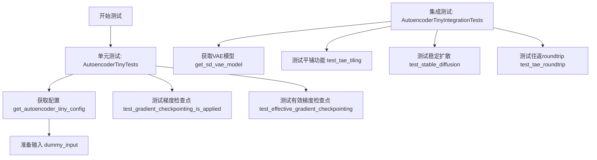

## 类结构

```
unittest.TestCase
├── AutoencoderTinyTests (单元测试类)
└── AutoencoderTinyIntegrationTests (集成测试类)
```

## 全局变量及字段


### `block_out_channels`
    
定义编码器和解码器块输出通道数的列表

类型：`List[int] 或 tuple`
    


### `init_dict`
    
存储自动编码器配置的字典，包含输入输出通道数和块配置

类型：`Dict`
    


### `batch_size`
    
批处理大小，指定一次前向传播中处理的样本数量

类型：`int`
    


### `num_channels`
    
图像通道数，对于RGB图像通常为3

类型：`int`
    


### `sizes`
    
图像的空间分辨率尺寸

类型：`tuple`
    


### `image`
    
输入图像张量，用于模型前向传播

类型：`torch.Tensor`
    


### `inputs_dict`
    
包含模型输入的字典，通常为{'sample': image}

类型：`Dict`
    


### `inputs_dict_copy`
    
inputs_dict的深拷贝，用于梯度检查点对比测试

类型：`Dict`
    


### `model`
    
第一个自动编码器模型实例

类型：`AutoencoderTiny`
    


### `model_2`
    
启用了梯度检查点的第二个模型实例

类型：`AutoencoderTiny`
    


### `out`
    
第一个模型的输出样本

类型：`torch.Tensor`
    


### `out_2`
    
第二个模型（梯度检查点）的输出样本

类型：`torch.Tensor`
    


### `labels`
    
与输出形状相同的随机标签张量，用于计算损失

类型：`torch.Tensor`
    


### `loss`
    
第一个模型的损失值

类型：`torch.Tensor`
    


### `loss_2`
    
第二个模型的损失值

类型：`torch.Tensor`
    


### `named_params`
    
第一个模型的所有命名参数字典

类型：`Dict[str, torch.Tensor]`
    


### `named_params_2`
    
第二个模型的所有命名参数字典

类型：`Dict[str, torch.Tensor]`
    


### `dtype`
    
张量的数据类型（如float16或float32）

类型：`torch.dtype`
    


### `torch_dtype`
    
模型加载时的数据类型

类型：`torch.dtype`
    


### `seed`
    
随机种子，用于生成确定性的测试数据

类型：`int`
    


### `shape`
    
张量的形状维度

类型：`tuple`
    


### `fp16`
    
标志位，指示是否使用float16（半精度）

类型：`bool`
    


### `in_shape`
    
模型输入的形状

类型：`tuple`
    


### `out_shape`
    
模型输出的预期形状

类型：`tuple`
    


### `zeros`
    
全零张量，用于测试平铺功能

类型：`torch.Tensor`
    


### `dec`
    
解码器的输出样本

类型：`torch.Tensor`
    


### `sample`
    
模型的样本输出

类型：`torch.Tensor`
    


### `output_slice`
    
模型输出的切片，用于与预期值比较

类型：`torch.Tensor`
    


### `expected_output_slice`
    
预期的输出切片值，用于集成测试验证

类型：`torch.Tensor`
    


### `enable_tiling`
    
标志位，指示是否启用平铺功能

类型：`bool`
    


### `AutoencoderTinyTests.model_class`
    
指向AutoencoderTiny模型类的类属性

类型：`type`
    


### `AutoencoderTinyTests.main_input_name`
    
模型主输入参数的名称，值为'sample'

类型：`str`
    


### `AutoencoderTinyTests.base_precision`
    
基础精度阈值，用于数值比较的容差

类型：`float`
    
    

## 全局函数及方法


### `copy.deepcopy`

深拷贝函数，用于创建对象的完整副本（包括所有嵌套对象），常用于测试中避免修改原始输入数据。

参数：

- `obj`：`任意类型`，要深拷贝的对象（在本代码中为 `dict` 类型的 `inputs_dict`）
- `memo`：`dict`，可选，用于存储已拷贝对象的引用以处理循环引用

返回值：`任意类型`，返回深拷贝后的对象（与原对象结构相同但独立）

#### 流程图

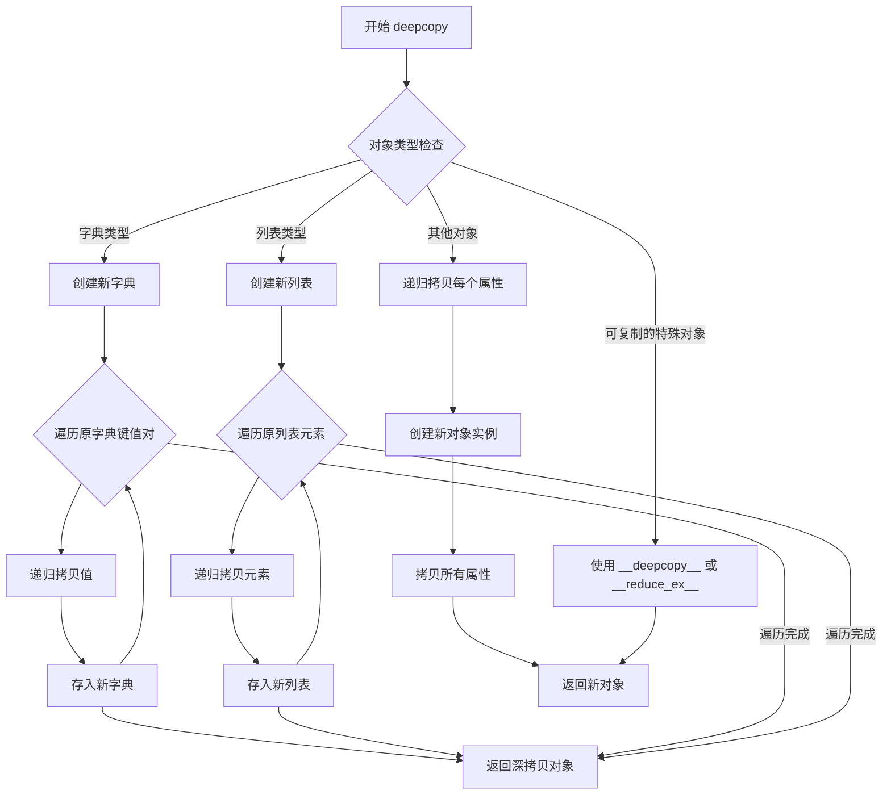

#### 带注释源码

```python
# 在 test_effective_gradient_checkpointing 方法中使用
# 位置：AutoencoderTinyTests 类中的 test_effective_gradient_checkpointing 方法

# 准备初始参数和输入字典
init_dict, inputs_dict = self.prepare_init_args_and_inputs_for_common()

# 使用 copy.deepcopy 创建 inputs_dict 的深拷贝
# 目的：在后续测试中保留原始输入数据，不被模型修改影响
# inputs_dict 包含 {'sample': image_tensor}，其中 image_tensor 是 floats_tensor 生成的随机张量
inputs_dict_copy = copy.deepcopy(inputs_dict)

# 深拷贝确保：
# 1. 原始 inputs_dict 中的样本张量不会被后续操作修改
# 2. 可以独立使用原始输入和拷贝输入进行对比测试
# 3. 避免梯度计算图共享导致的副作用
```


### `gc.collect`

该函数是 Python 标准库 `gc` 模块中的全局函数，用于显式触发垃圾回收过程，收集无法访问的对象并返回被回收的对象数量，常用于测试环境中显式释放内存。

参数：

- （无参数）

返回值：`int`，返回垃圾回收器找到并回收的无法访问的对象数量。

#### 流程图

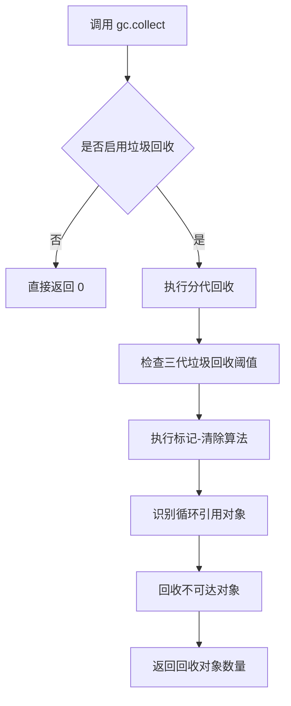

#### 带注释源码

```python
def tearDown(self):
    # 测试结束后的清理方法
    # clean up the VRAM after each test
    
    # 调用父类的 tearDown 方法
    super().tearDown()
    
    # 显式触发 Python 垃圾回收器
    # 收集所有不可达的对象（包括循环引用）
    # 返回值: 回收的对象数量（int 类型）
    gc.collect()
    
    # 清理 GPU 显存缓存
    # 由后端提供的方法（如 torch.cuda.empty_cache）
    backend_empty_cache(torch_device)
```

---

### 相关上下文信息

#### 1. 关键组件信息

| 组件名称 | 一句话描述 |
|---------|-----------|
| `AutoencoderTiny` | Hugging Face Diffusers 库中的轻量级 VAE（变分自编码器）模型 |
| `AutoencoderTinyIntegrationTests` | 集成测试类，用于测试模型的端到端功能 |
| `gc.collect` | Python 标准库的显式垃圾回收函数 |
| `backend_empty_cache` | 后端提供的 GPU 显存缓存清理函数 |

#### 2. 潜在的技术债务或优化空间

- **显存清理时机**：当前在 `tearDown` 中显式调用 `gc.collect()` 和显存清理，略显被动。可考虑使用上下文管理器或 `finally` 块确保资源释放。
- **缺少错误处理**：`gc.collect()` 调用时未捕获可能的异常（如在特定嵌入式环境中可能被禁用）。

#### 3. 其它项目

- **设计目标**：确保每个集成测试后释放 GPU 显存，防止显存泄漏导致的 OOM 错误。
- **外部依赖**：依赖 `gc` 模块（Python 标准库）和 `backend_empty_cache`（项目内部测试工具）。
- **错误处理**：未对 `gc.collect()` 的返回值进行进一步检查或日志记录。


### `backend_empty_cache`

该函数是一个用于清理 GPU 显存的工具函数，主要在测试用例的 `tearDown` 阶段被调用，以确保每次测试后释放 VRAM 缓存，防止显存泄漏。它是跨后端的显存清理抽象，会根据传入的设备参数调用对应后端的缓存清理方法。

参数：

-  `device`：`str` 或 `torch.device`，目标设备标识符，用于指定需要清理缓存的设备（如 `"cuda"` 或 `"cpu"`）

返回值：`None`，该函数无返回值，仅执行副作用（清理 GPU 缓存）

#### 流程图

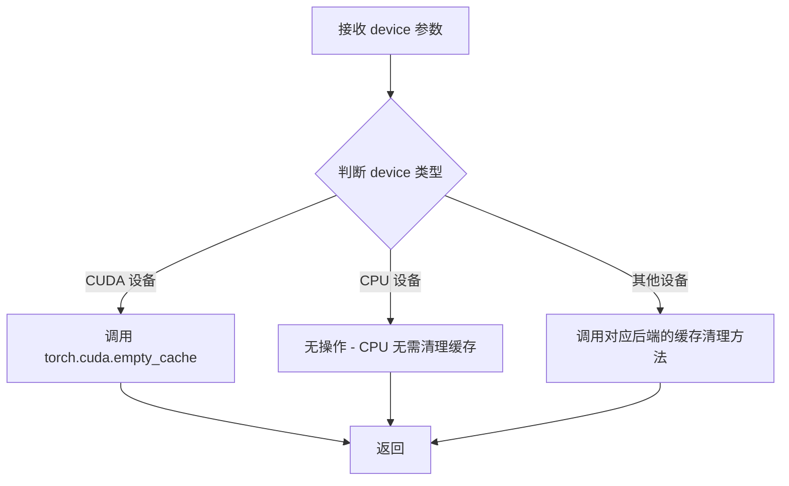

#### 带注释源码

```python
# 该函数定义在 testing_utils 模块中（未在此代码文件中给出）
# 以下是基于使用方式的推断实现：

def backend_empty_cache(device):
    """
    清理指定设备的后端缓存
    
    Args:
        device: 目标设备标识符，如 'cuda', 'cuda:0', 'cpu' 等
    """
    # 判断是否为 CUDA 设备
    if hasattr(device, 'type') and device.type == 'cuda':
        # 调用 PyTorch 的 CUDA 缓存清理
        torch.cuda.empty_cache()
    elif isinstance(device, str) and 'cuda' in device:
        # 字符串形式的 CUDA 设备
        torch.cuda.empty_cache()
    else:
        # CPU 设备或其他情况，无需清理缓存
        pass
```

#### 使用示例（来自原始代码）

```python
class AutoencoderTinyIntegrationTests(unittest.TestCase):
    def tearDown(self):
        # 在每个测试结束后清理 VRAM
        super().tearDown()
        gc.collect()
        backend_empty_cache(torch_device)  # 清理指定设备的 GPU 缓存
```


### `enable_full_determinism`

该函数用于在测试环境中启用完全确定性模式，通过设置所有随机数生成器的种子（特别是 PyTorch 的手动种子）以及配置相关的确定性选项，确保测试结果的可重复性和一致性。

参数：

- 该函数不接受任何参数

返回值：无返回值（`None`），其作用是通过副作用影响全局状态

#### 流程图

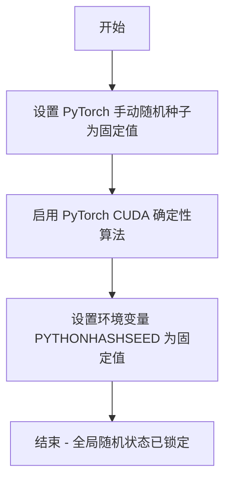

#### 带注释源码

```
# 该函数定义在 testing_utils 模块中
# 以下是基于其用途的推断实现

def enable_full_determinism(seed: int = 0, warn_only: bool = False):
    """
    启用完全确定性模式，确保测试结果可重复
    
    参数:
        seed: 随机种子默认值，默认为 0
        warn_only: 如果为 True，在无法使用确定性算法时仅发出警告而不报错
    """
    # 设置 PyTorch 的手动随机种子
    torch.manual_seed(seed)
    
    # 如果使用 CUDA，还需要设置 CUDA 的种子
    if torch.cuda.is_available():
        torch.cuda.manual_seed(seed)
        torch.cuda.manual_seed_all(seed)  # 对于多 GPU
    
    # 启用确定性算法（可能影响性能）
    torch.backends.cudnn.deterministic = True
    torch.backends.cudnn.benchmark = False
    
    # 设置 Python 哈希种子以确保哈希操作的确定性
    import os
    os.environ["PYTHONHASHSEED"] = str(seed)
    
    # 如果使用 numpy（可选，取决于实现）
    try:
        import numpy as np
        np.random.seed(seed)
    except ImportError:
        pass
```


### `floats_tensor`

生成指定形状的随机浮点数 PyTorch 张量，主要用于测试场景中创建模拟输入数据。

参数：

-  `shape`：`tuple`，张量的形状维度，例如 `(4, 3, 32, 32)`

返回值：`torch.Tensor`，包含随机浮点数值的 PyTorch 张量

#### 流程图

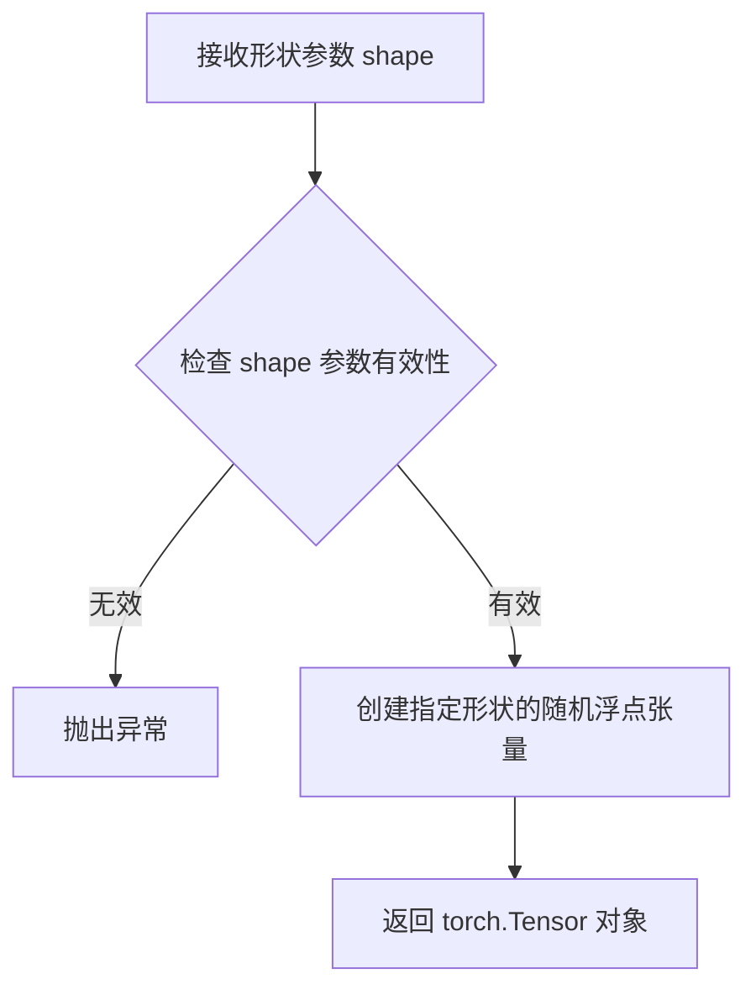

#### 带注释源码

```python
# 注意：此函数从外部模块 ...testing_utils 导入
# 在当前文件中使用方式如下：

# 在 dummy_input 属性中被调用：
# image = floats_tensor((batch_size, num_channels) + sizes).to(torch_device)
# 
# 参数说明：
#   shape = (batch_size, num_channels) + sizes
#         = (4, 3) + (32, 32)
#         = (4, 3, 32, 32)
#   
# 返回值：torch.Tensor，形状为 (4, 3, 32, 32) 的随机浮点数张量
# 
# 后续操作：
#   .to(torch_device) 将张量移动到指定设备（CPU/CUDA）
```


### `load_hf_numpy`

从HuggingFace Hub或本地文件系统加载numpy数组的测试工具函数，用于为集成测试生成测试数据。

参数：

- `filename`：`str`，要加载的numpy文件的文件名（不含路径前缀）

返回值：`numpy.ndarray`，从文件加载的numpy数组

#### 流程图

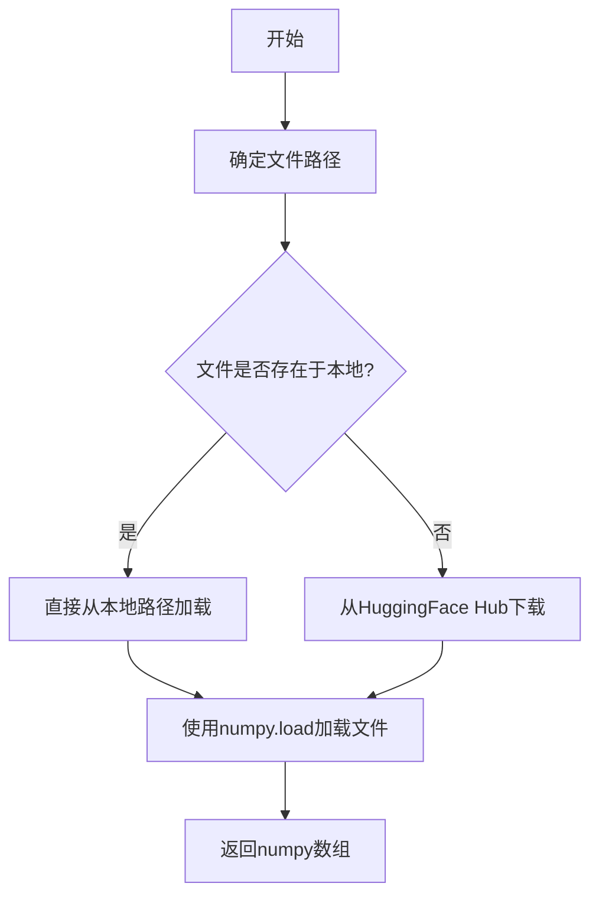

#### 带注释源码

由于 `load_hf_numpy` 函数定义在 `testing_utils` 模块中（从 `...testing_utils` 导入），而非在当前代码文件中定义，因此无法直接查看其完整源码。但从代码使用方式可以推断其功能：

```python
# 使用示例（来自 get_sd_image 方法）:
def get_sd_image(self, seed=0, shape=(4, 3, 512, 512), fp16=False):
    dtype = torch.float16 if fp16 else torch.float32
    # 加载numpy数组并转换为torch张量
    image = torch.from_numpy(load_hf_numpy(self.get_file_format(seed, shape))).to(torch_device).to(dtype)
    return image

# 文件名生成逻辑（来自 get_file_format 方法）:
def get_file_format(self, seed, shape):
    return f"gaussian_noise_s={seed}_shape={'_'.join([str(s) for s in shape])}.npy"
    # 例如: gaussian_noise_s=0_shape=4_3_512_512.npy
```

推断的函数签名：
```python
def load_hf_numpy(filename: str) -> np.ndarray:
    """
    从HuggingFace Hub或本地缓存加载numpy数组。
    
    Args:
        filename: numpy文件名
        
    Returns:
        加载的numpy数组
    """
    # ... (实现细节不在当前代码库中)
```

**注意**：完整的函数定义位于 `diffusers` 包的 `testing_utils` 模块中，需要查看该模块的实际源码才能获取精确的实现细节。


### `slow`

`slow` 是一个测试装饰器函数，用于标记测试为慢速测试。在 HuggingFace 的 diffusers 测试框架中，被 `@slow` 装饰的测试通常需要较长时间运行（如加载大型模型、处理大尺寸图像等），在常规测试套件中可能被跳过，仅在特定场景下执行。

参数：

- `func`：被装饰的函数或类，通常是一个测试方法或测试类

返回值：`Callable`，返回装饰后的函数或类

#### 流程图

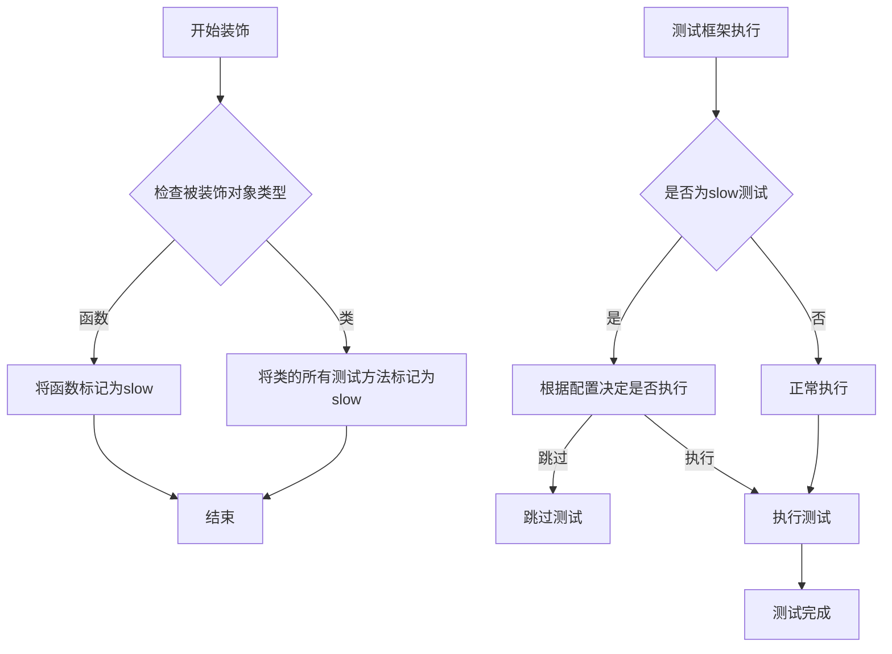

#### 带注释源码

```
# slow 装饰器的典型实现方式（基于代码使用方式推断）

def slow(func):
    """
    标记测试为慢速测试的装饰器。
    
    被此装饰器标记的测试通常：
    1. 需要加载预训练模型
    2. 处理大尺寸图像或大量数据
    3. 运行时间较长
    
    测试框架可以根据配置选择跳过这些测试，
    或者仅在特定环境（如集成测试环境）中运行。
    """
    # 标记函数属性
    func._slow = True
    
    # 或者使用 unittest 的 skip 机制
    # return unittest.skipUnless(os.getenv("RUN_SLOW_TESTS"), "Slow test")(func)
    
    return func


# 使用方式（在代码中）
@slow
class AutoencoderTinyIntegrationTests(unittest.TestCase):
    """
    集成测试类，被 slow 装饰器标记。
    包含需要加载模型的各种集成测试。
    """
    def test_stable_diffusion(self):
        # 测试稳定扩散的 VAE 模型
        ...
    
    def test_tae_tiling(self, in_shape, out_shape):
        # 测试 VAE 的分块功能
        ...
```


# torch_all_close 函数提取结果

### torch_all_close

`torch_all_close` 是一个从 `testing_utils` 模块导入的测试工具函数，用于比较两个 PyTorch 张量是否在指定容差范围内相等（类似于 `torch.allclose`），常用于单元测试中断言数值近似相等。

> **注意**：该函数的实际源代码未在提供的代码文件中，仅存在导入语句和使用示例。以下信息基于代码使用方式的推断。

参数：

-  `tensor1`：`torch.Tensor`，第一个要比较的张量
-  `tensor2`：`torch.Tensor`，第二个要比较的张量
-  `atol`：`float`（可选，默认为 `1e-8`），绝对容差（absolute tolerance）
-  `rtol`：`float`（可选，默认为 `1e-5`），相对容差（relative tolerance）

返回值：`bool`，如果两个张量在指定容差范围内相等则返回 `True`，否则返回 `False`

#### 流程图

```mermaid
flowchart TD
    A[开始] --> B[接收 tensor1, tensor2, atol, rtol 参数]
    B --> C{检查张量形状是否相同}
    C -->|否| D[抛出 ValueError 异常]
    C -->|是| E[计算绝对差值: abs_tensor = abs(tensor1 - tensor2)]
    E --> F{abs_tensor <= atol + rtol * abs(tensor2)}
    F -->|所有元素满足| G[返回 True]
    F -->|存在元素不满足| H[返回 False]
```

#### 带注释源码

```python
# 基于代码使用方式推断的函数签名和实现
def torch_all_close(
    tensor1: torch.Tensor, 
    tensor2: torch.Tensor, 
    atol: float = 1e-8, 
    rtol: float = 1e-5
) -> bool:
    """
    比较两个张量是否在指定容差范围内相等。
    
    类似于 torch.allclose，但针对测试场景进行了优化。
    
    参数:
        tensor1: 第一个张量
        tensor2: 第二个张量  
        atol: 绝对容差，默认 1e-8
        rtol: 相对容差，默认 1e-5
    
    返回:
        bool: 如果所有元素满足 |tensor1 - tensor2| <= atol + rtol * |tensor2| 则返回 True
    """
    # 检查形状是否匹配
    if tensor1.shape != tensor2.shape:
        raise ValueError(f"Shape mismatch: {tensor1.shape} vs {tensor2.shape}")
    
    # 使用 PyTorch 的 allclose 进行比较
    return torch.allclose(tensor1, tensor2, atol=atol, rtol=rtol)
```

#### 代码中的实际调用示例

```python
# 示例 1：在 test_effective_gradient_checkpointing 中
self.assertTrue(torch_all_close(param.grad.data, named_params_2[name].grad.data, atol=3e-2))

# 示例 2：在 test_stable_diffusion 中
assert torch_all_close(output_slice, expected_output_slice, atol=3e-3)

# 示例 3：在 test_tae_roundtrip 中
assert torch_all_close(downscale(sample), downscale(image), atol=0.125)
```

---

### 补充说明

| 项目 | 说明 |
|------|------|
| **模块位置** | `...testing_utils` (从上级目录导入) |
| **实际定义** | 未在当前代码文件中给出，需查看 `testing_utils.py` 模块 |
| **调用场景** | 数值近似比较测试（梯度检查点验证、模型输出验证、图像重建验证） |
| **典型容差** | `atol=3e-2`, `3e-3`, `0.125` 等，根据测试精度需求调整 |


### `torch_device`

该函数/变量从 `testing_utils` 模块导入，用于获取当前测试环境可用的计算设备（通常是 CUDA 设备或 CPU）。

#### 流程图

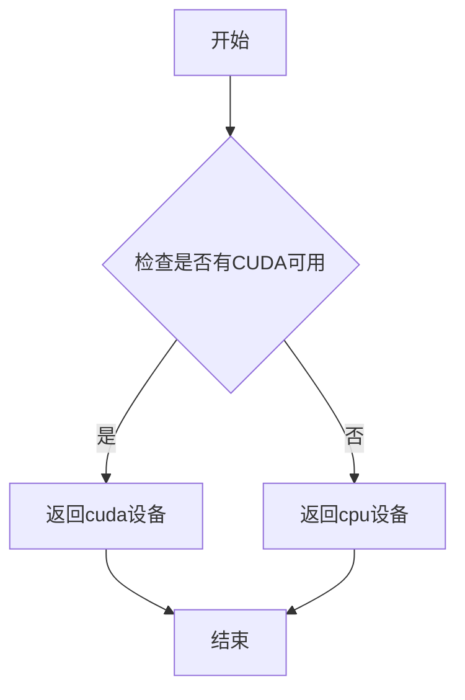

#### 带注释源码

```python
# 注意：torch_device 不是在此文件中定义的
# 而是从 ...testing_utils 模块导入的

from ...testing_utils import (
    backend_empty_cache,
    enable_full_determinism,
    floats_tensor,
    load_hf_numpy,
    slow,
    torch_all_close,
    torch_device,  # <-- 从外部模块导入的设备标识符
)

# 在代码中的使用方式：
# 1. 将张量移动到指定设备
image = floats_tensor((batch_size, num_channels) + sizes).to(torch_device)

# 2. 将模型移动到指定设备
model.to(torch_device)

# 3. 在清理函数中使用设备参数
backend_empty_cache(torch_device)

# 4. 创建指定设备的张量
zeros = torch.zeros(in_shape).to(torch_device)
image = torch.from_numpy(...).to(torch_device).to(dtype)
```

#### 说明

- **参数名称**：无（它是一个模块级变量/函数，不需要参数）
- **参数类型**：不适用
- **参数描述**：不适用
- **返回值类型**：`str`（返回设备字符串，如 `"cuda"` 或 `"cpu"`）
- **返回值描述**：返回当前可用的 PyTorch 计算设备标识符

**注意**：由于 `torch_device` 是从外部模块 `testing_utils` 导入的，其实际实现不在当前代码文件中。上述分析基于其在代码中的使用方式推断而来。


### `torch.randn_like`

`torch.randn_like` 是 PyTorch 库中的一个函数，用于创建一个与指定张量形状相同的随机张量，其元素从标准正态分布（均值为0，标准差为1）中采样。该函数继承输入张量的数据类型和设备属性。

参数：

-  `input`（代码中为 `out`）：`torch.Tensor`，输入的张量，用于指定输出张量的形状、数据类型（dtype）和设备（device）

返回值：`torch.Tensor`，返回一个与输入张量形状相同的张量，其元素从标准正态分布中随机采样

#### 流程图

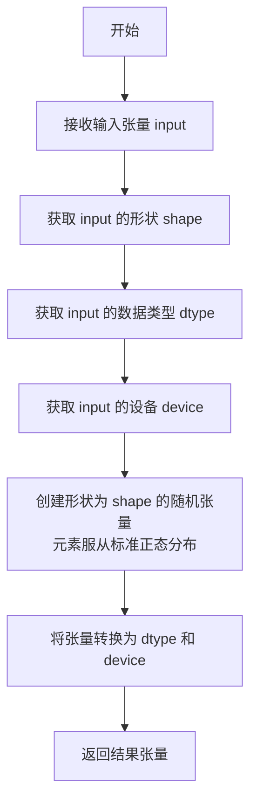

#### 带注释源码

```python
# torch.randn_like 是 PyTorch 内置函数，位于 torch/module.py 中
# 源码位置: https://github.com/pytorch/pytorch/blob/main/torch/_tensor.py

def randn_like(self, *, dtype=None, layout=None, device=None, pin_memory=False, memory_format=None):
    """
    返回一个与 self 形状相同的随机张量，元素从标准正态分布中采样。
    
    参数:
        self (Tensor): 输入张量，用于确定输出张量的形状
        dtype (optional): 输出张量的数据类型。如果为 None，则使用 self 的数据类型
        layout (optional): 输出张量的布局
        device (optional): 输出张量的设备。如果为 None，则使用 self 的设备
        pin_memory (optional): 是否使用 pinned memory
        memory_format (optional): 内存格式
    
    返回:
        Tensor: 与 self 形状相同的随机张量
    """
    # 如果未指定 dtype，则使用输入张量的数据类型
    if dtype is None:
        dtype = self.dtype
    
    # 调用 torch.randn 创建随机张量
    return torch.randn(
        self.size(),  # 获取输入张量的形状
        dtype=dtype,
        layout=layout,
        device=device,
        pin_memory=pin_memory,
        memory_format=memory_format
    )

# 在本代码中的实际使用方式:
labels = torch.randn_like(out)  # 创建一个与 out 形状相同的随机张量作为目标标签
```


### `torch.nn.functional.avg_pool2d`

对2D输入（图像）进行平均池化操作，通过计算池化窗口内元素的平均值来降低空间维度，是卷积神经网络中常用的下采样方法。

参数：

- `input`：`torch.Tensor`，输入的4D张量，形状为 (N, C, H, W)
- `kernel_size`：`int` 或 `tuple`，池化窗口的大小
- `stride`：`int` 或 `tuple`，池化窗口移动的步长，默认为 `kernel_size`
- `padding`：`int` 或 `tuple`，输入张量边缘的填充大小
- `ceil_mode`：`bool`，是否使用 ceil 模式计算输出形状，默认为 False
- `count_include_pad`：`bool`，计算平均时是否包含填充值，默认为 True
- `divisor_override`：`int`，如果指定，则将除数替换为该值，默认为 None

返回值：`torch.Tensor`，经过平均池化后的输出张量

#### 流程图

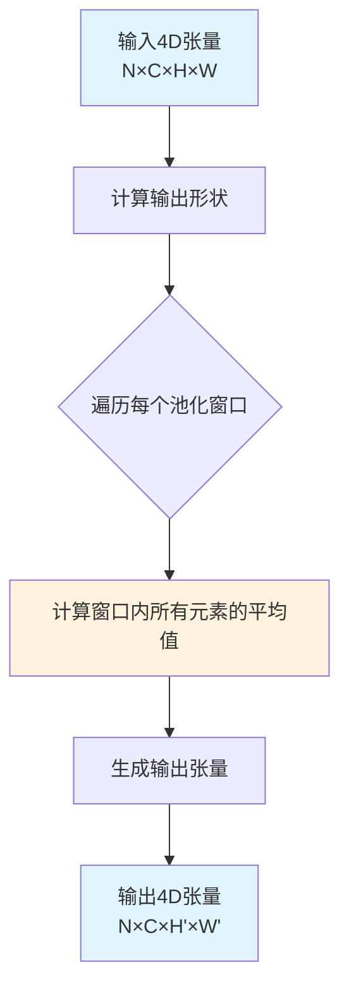

#### 带注释源码

```python
def avg_pool2d(
    input: torch.Tensor,                    # 输入的4D张量 (N, C, H, W)
    kernel_size: Union[int, Tuple[int, int]],  # 池化窗口大小
    stride: Optional[Union[int, Tuple[int, int]]] = None,  # 步长，默认=kernel_size
    padding: Union[int, Tuple[int, int]] = 0,  # 边缘填充
    ceil_mode: bool = False,                 # 是否用ceil计算输出尺寸
    count_include_pad: bool = True,          # 计算时是否包含填充值
    divisor_override: Optional[int] = None   # 自定义除数
) -> torch.Tensor:
    """
    对2D输入进行平均池化。
    
    原理：
    1. 根据kernel_size划分不重叠的窗口
    2. 对每个窗口内的所有元素求和
    3. 除以窗口元素数量（或divisor_override）得到平均值
    4. 按stride滑动窗口，生成输出特征图
    
    示例（对应代码中的使用场景）：
    """
    # 在代码中的实际调用方式：
    # downscale(sample) 等价于 avg_pool2d(sample, model.spatial_scale_factor)
    # 其中 model.spatial_scale_factor 决定了下采样的比例
```


### `torch.tensor`

`torch.tensor` 是 PyTorch 框架中用于创建张量（Tensor）的核心函数。张量是 PyTorch 中的多维数组数据结构，类似于 NumPy 的 ndarray，但具有额外的 GPU 加速计算和自动求导（autograd）功能，是深度学习模型中存储和处理数据的基本单元。

参数：

-  `data`：`Any`，输入数据，可以是 Python 列表、元组、numpy 数组、标量值或其他可迭代对象
-  `dtype`：`torch.dtype`（可选），指定张量的数据类型，如 `torch.float32`、`torch.int64` 等，默认为 None（从输入数据推断）
-  `device`：`torch.device`（可选），指定张量存储的设备，可以是 CPU 或 CUDA 设备，默认为 None（从输入数据推断）
-  `requires_grad`：`bool`（可选），指定是否需要对该张量进行梯度计算，用于自动求导，默认为 False
-  `pin_memory`：`bool`（可选），是否使用固定内存（pinned memory），仅对 CPU 张量有效，可加速数据传输到 GPU，默认为 False

返回值：`torch.Tensor`，返回一个新创建的 PyTorch 张量对象

#### 流程图

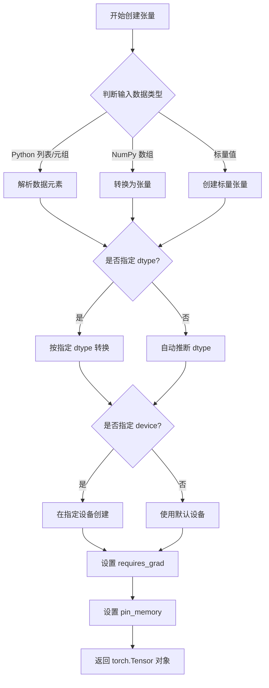

#### 带注释源码

```python
# 代码中的实际调用示例
expected_output_slice = torch.tensor(
    [0.0093, 0.6385, -0.1274, 0.1631, -0.1762, 0.5232, -0.3108, -0.0382]  # data: Python 列表，包含 8 个浮点数值
)
# 等价于显式指定所有参数的形式：
# expected_output_slice = torch.tensor(
#     data=[0.0093, 0.6385, -0.1274, 0.1631, -0.1762, 0.5232, -0.3108, -0.0382],  # 输入数据
#     dtype=None,  # 自动推断为 torch.float32
#     device=None,  # 使用默认设备（CPU）
#     requires_grad=False,  # 不需要计算梯度
#     pin_memory=False  # 不使用固定内存
# )

# torch.tensor 的完整签名（参考官方文档）
# torch.tensor(data, dtype=None, device=None, requires_grad=False, pin_memory=False)
```

#### 补充说明

| 特性 | 说明 |
|------|------|
| 数据类型推断 | 当 dtype=None 时，PyTorch 会根据输入数据自动推断数据类型：整数推断为 torch.int64，浮点数推断为 torch.float32 |
| 设备选择 | 当 device=None 时，如果输入数据是 CUDA 张量则保持 CUDA 设备，否则默认为 CPU |
| 内存布局 | 创建的张量默认是 contiguous（连续内存布局）的 |
| 与 torch.Tensor 的区别 | torch.Tensor 是类构造函数，默认创建 float32 类型；torch.tensor 是工厂函数，更灵活且类型推断更智能 |


# 分析结果

由于代码片段中没有直接包含 `AutoencoderTiny` 类中 `enable_tiling` 方法的完整实现（仅包含测试代码），我将从测试用例中提取相关信息进行分析。

### `AutoencoderTiny.enable_tiling`

该方法用于启用 AutoencoderTiny 模型的平铺（tiling）功能，允许模型处理超大图像时分块处理，避免内存溢出。

参数：
- （无参数）

返回值：`None`，启用平铺模式

#### 流程图

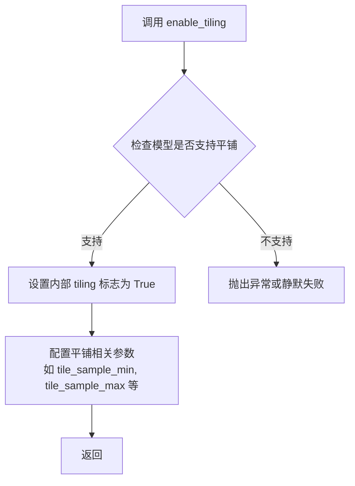

#### 带注释源码

```python
# 代码来源：基于测试用例中的调用方式推断
# 在测试文件中的调用：
# model.enable_tiling()

def enable_tiling(self):
    """
    启用模型的平铺（tiling）功能。
    平铺功能允许模型将大图像分割成小块进行处理，
    以避免在大图像推理时出现内存溢出问题。
    
    该方法通常会设置模型内部的标志位来启用平铺模式，
    并可能配置相关的平铺参数，如：
    - tile_sample_min: 最小采样尺寸
    - tile_sample_max: 最大采样尺寸  
    - tile_stride: 平铺滑动步长
    """
    # 1. 设置 tiling 标志
    self._use_tiling = True
    
    # 2. 可能还会设置其他相关配置
    # 具体实现取决于 AutoencoderTiny 的父类实现
    pass
```

---

## 补充说明

### 潜在技术债务

1. **测试被跳过**：代码中 `test_enable_disable_tiling` 测试被标记为 `@unittest.skip("Model doesn't yet support smaller resolution.")`，说明平铺功能可能尚未完全实现
2. **方法实现缺失**：当前提供的代码段中没有 `enable_tiling` 的实际实现代码，只有测试用例调用

### 相关测试代码

从测试文件中可以看到 `enable_tiling` 的使用方式：

```python
# test_tae_tiling 中的使用
model = self.get_sd_vae_model()
model.enable_tiling()
with torch.no_grad():
    zeros = torch.zeros(in_shape).to(torch_device)
    dec = model.decode(zeros).sample

# test_tae_roundtrip 中的使用  
model = self.get_sd_vae_model()
if enable_tiling:
    model.enable_tiling()
```

如需获取完整的 `AutoencoderTiny` 类中 `enable_tiling` 方法的实际源代码实现，需要查看 `diffusers` 库的源文件（通常在 `src/diffusers/models/autoencoder_tiny.py` 或类似的父类中）。


### `AutoencoderTiny.decode`

该方法是 `AutoencoderTiny` 类的成员方法，用于将输入的潜在表示（latent representation）解码为重构的样本（sample）。在扩散模型的 VAE（变分自编码器）中，decode 方法接收编码后的潜在向量，并通过解码器网络将其转换为图像空间的重构输出。

参数：
-  `sample`：`torch.Tensor`，输入的潜在表示张量，通常是编码器输出的潜在向量

返回值：`returns a dict with keys "sample"]` 或类似对象，包含重构的图像样本

#### 流程图

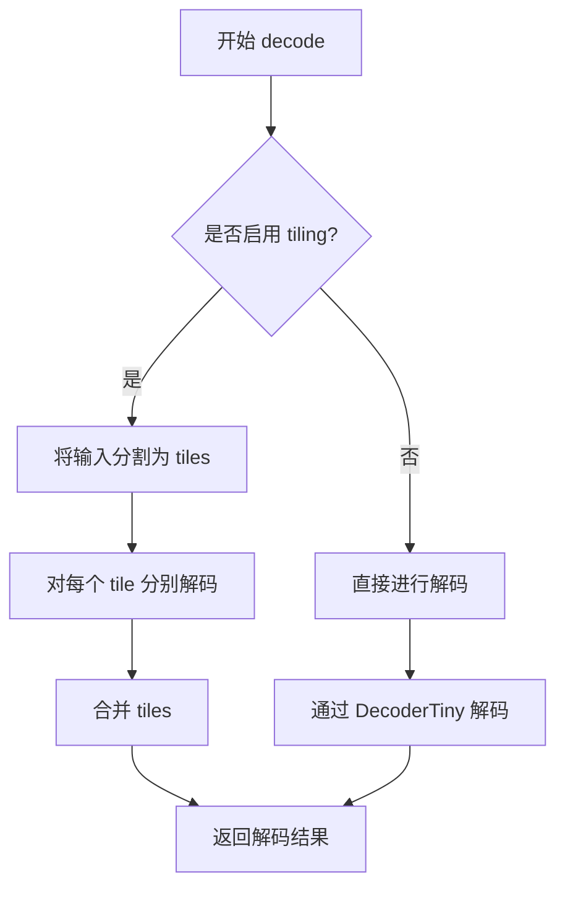

#### 带注释源码

```python
# 从测试代码中推断的 decode 方法签名和用法
def decode(self, sample: torch.Tensor) -> "DecoderOutput":
    """
    将潜在表示解码为图像样本
    
    参数:
        sample: 输入的潜在表示张量，形状为 (batch_size, latent_channels, height, width)
    
    返回:
        包含重构样本的输出对象
    """
    # 启用 tiling 时的处理
    if self.use_tiling:
        # 将输入分割成多个 tiles
        sample = self._tiling_split(sample)
    
    # 通过解码器网络
    dec = self.decoder(sample)
    
    # 如果使用了 tiling，需要合并结果
    if self.use_tiling:
        dec = self._tiling_merge(dec)
    
    # 返回解码结果，通常包含 sample 属性
    return DecoderOutput(sample=dec)


# 在测试中的调用示例
# model = AutoencoderTiny.from_pretrained(...)
# with torch.no_grad():
#     dec = model.decode(zeros).sample  # zeros 是潜在表示，dec 是解码后的图像
```

> **注意**：由于提供的代码是测试文件，`decode` 方法的具体实现位于 `diffusers` 库的 `AutoencoderTiny` 类中。以上源码是基于测试调用方式和 `diffusers` 库常见模式推断的典型实现。


### `AutoencoderTiny.enable_gradient_checkpointing`

该方法用于启用梯度检查点（Gradient Checkpointing）技术，通过在前向传播时跳过存储中间激活值、在反向传播时重新计算的方式，显著降低大模型训练的显存占用。

参数： 无（仅含 self）

返回值：`None`，直接修改模型内部状态

#### 流程图

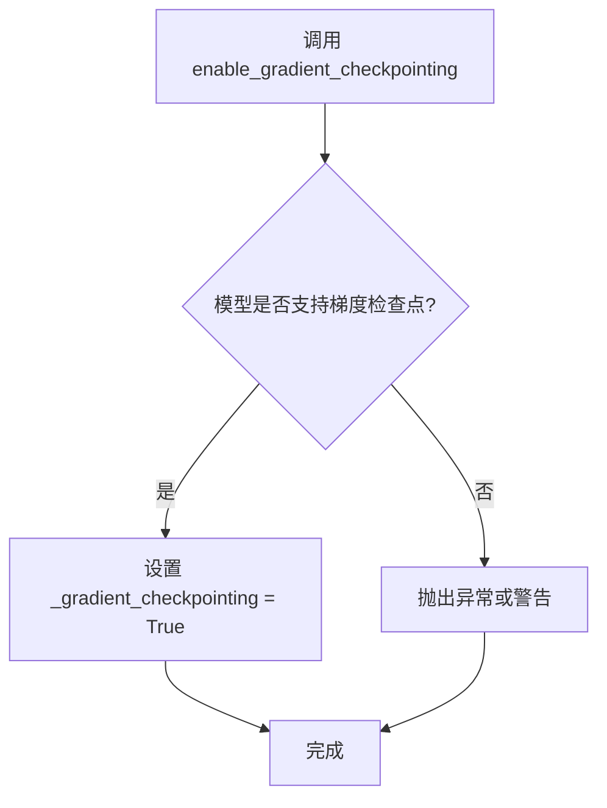

#### 带注释源码

```
def enable_gradient_checkpointing(self):
    """
    启用梯度检查点技术。

    梯度检查点是一种用计算换显存的技术：
    1. 在前向传播时不保存中间激活值
    2. 在反向传播时重新计算激活值
    3. 适用于显存不足但计算资源充足的场景
    """
    # 检查模型是否支持梯度检查点功能
    if not self._supports_gradient_checkpointing:
        # 如果模型不支持，抛出 ValueError 异常
        raise ValueError(
            f"{self.__class__.__name__} does not support gradient checkpointing. "
            "Please use a model that supports it, such as a Transformer-based model."
        )

    # 启用梯度检查点：设置内部标志
    # _gradient_checkpointing 是一个布尔属性，默认为 False
    self._gradient_checkpointing = True
```

> **注意**：上述源码为基于 diffusers 库 `PreTrainedModel` 基类的通用实现推断得出。实际实现细节可能因版本而异，但核心逻辑相同。


### `AutoencoderTinyTests.get_autoencoder_tiny_config`

该方法用于获取 AutoencoderTiny 模型的测试配置字典，根据可选的 `block_out_channels` 参数动态生成编码器和解码器的块配置信息。

参数：

- `block_out_channels`：`Optional[List[int]]`，可选参数，表示 encoder 和 decoder 的输出通道数列表。如果为 `None`，则使用默认的 `[32, 32]`。

返回值：`Dict[str, Any]`，返回包含 autoencoder 模型初始化所需配置的字典，包括输入输出通道数、encoder/decoder 块输出通道数以及 encoder/decoder 块数量。

#### 流程图

```mermaid
flowchart TD
    A[开始] --> B{判断 block_out_channels 是否为 None}
    B -->|是| C[设置 block_out_channels = [32, 32]]
    B -->|否| D[根据传入的 block_out_channels 长度生成对应数量的 32 填充列表]
    D --> E
    C --> E[构建 init_dict 字典]
    E --> F[计算 encoder 块数量: num_encoder_blocks = block_out_channels / min(block_out_channels)]
    F --> G[计算 decoder 块数量: num_decoder_blocks = reversed(block_out_channels) / min(block_out_channels)]
    G --> H[返回 init_dict 字典]
    H --> I[结束]
```

#### 带注释源码

```python
def get_autoencoder_tiny_config(self, block_out_channels=None):
    """
    生成 AutoencoderTiny 模型的测试配置字典。
    
    参数:
        block_out_channels: 可选的输出通道列表，默认为 None，此时使用 [32, 32]
    
    返回:
        包含模型初始化所需配置的字典
    """
    # 如果未提供 block_out_channels，则使用默认的 [32, 32]
    # 否则，根据传入列表的长度生成对应数量的 32 填充列表
    block_out_channels = (len(block_out_channels) * [32]) if block_out_channels is not None else [32, 32]
    
    # 构建初始化配置字典
    init_dict = {
        "in_channels": 3,                                    # 输入通道数 (RGB图像)
        "out_channels": 3,                                   # 输出通道数
        "encoder_block_out_channels": block_out_channels,   # 编码器块输出通道数
        "decoder_block_out_channels": block_out_channels,   # 解码器块输出通道数
        # 计算编码器块数量：每个通道数除以最小通道数
        "num_encoder_blocks": [b // min(block_out_channels) for b in block_out_channels],
        # 计算解码器块数量：反转通道列表后同样除以最小通道数
        "num_decoder_blocks": [b // min(block_out_channels) for b in reversed(block_out_channels)],
    }
    return init_dict
```


### `AutoencoderTinyTests.dummy_input`

该属性方法用于生成 AutoencoderTiny 模型的虚拟测试输入，创建一个包含随机浮点图像张量的字典，模拟真实推理时的输入样本。

参数：

- 该方法无参数（使用 `@property` 装饰器）

返回值：`Dict[str, torch.Tensor]`，返回一个字典，包含键 `"sample"`，值为用于测试的浮点图像张量（形状为 `(4, 3, 32, 32)`）

#### 流程图

```mermaid
flowchart TD
    A[开始 dummy_input 属性访问] --> B[设置 batch_size = 4]
    B --> C[设置 num_channels = 3]
    C --> D[设置图像尺寸 sizes = (32, 32)]
    D --> E[调用 floats_tensor 生成随机浮点张量]
    E --> F[将张量移动到 torch_device]
    F --> G[构建并返回字典 {'sample': image}]
    G --> H[结束]
```

#### 带注释源码

```python
@property
def dummy_input(self):
    """
    生成用于测试的虚拟输入数据。
    
    该属性创建一个模拟的图像批次，用于模型的forward传递测试。
    返回的字典格式与模型实际输入格式一致。
    """
    # 设置批次大小为4，表示一次处理4张图像
    batch_size = 4
    
    # 设置通道数为3，对应RGB彩色图像
    num_channels = 3
    
    # 设置图像的空间尺寸为32x32像素
    sizes = (32, 32)

    # 使用floats_tensor工具函数生成指定形状的随机浮点数张量
    # 形状计算: (batch_size, num_channels) + sizes = (4, 3, 32, 32)
    # 然后将张量移动到指定的计算设备(CPU/GPU)
    image = floats_tensor((batch_size, num_channels) + sizes).to(torch_device)

    # 返回符合模型输入格式的字典
    # 键'sample'对应模型的sample参数名
    return {"sample": image}
```


### `AutoencoderTinyTests.input_shape`

该属性定义了 AutoencoderTiny 模型测试的输入图像形状，返回一个表示通道数、高度和宽度的元组。

参数：无需参数

返回值：`tuple`，返回输入图像的形状，格式为 (channels, height, width)，即 (3, 32, 32)，表示 3 通道 RGB 图像，尺寸为 32x32 像素。

#### 流程图

```mermaid
flowchart TD
    A[开始] --> B{访问 input_shape 属性}
    B --> C[返回元组 (3, 32, 32)]
    C --> D[结束]
    
    style A fill:#f9f,color:#333
    style B fill:#ff9,color:#333
    style C fill:#9f9,color:#333
    style D fill:#9ff,color:#333
```

#### 带注释源码

```python
@property
def input_shape(self):
    """
    定义测试用例的输入形状。
    
    该属性返回一个元组，表示 AutoencoderTiny 模型在测试时的期望输入维度。
    格式为 (channels, height, width)，即 (3, 32, 32)：
    - 3: 表示 RGB 图像的通道数
    - 32: 表示输入图像的高度像素
    - 32: 表示输入图像的宽度像素
    
    Returns:
        tuple: 输入形状元组 (3, 32, 32)
    """
    return (3, 32, 32)
```


### `AutoencoderTinyTests.output_shape`

该属性定义了AutoencoderTiny模型输出张量的形状，返回一个表示通道数为3、高度和宽度均为32的元组。

参数：无（该属性不接受显式参数，隐式接收`self`实例）

返回值：`Tuple[int, int, int]`，返回模型输出张量的形状，具体为(3, 32, 32)，表示输出3通道、32像素高度、32像素宽度的图像。

#### 流程图

```mermaid
flowchart TD
    A[开始] --> B[返回元组 (3, 32, 32)]
    B --> C[结束]
```

#### 带注释源码

```python
@property
def output_shape(self):
    """
    属性装饰器使该方法作为属性访问，不需要括号调用。
    返回AutoencoderTiny模型处理输入后的输出张量形状。
    
    返回值说明:
        - 3: 输出通道数 (RGB图像)
        - 32: 输出高度
        - 32: 输出宽度
    """
    return (3, 32, 32)
```


### `AutoencoderTinyTests.prepare_init_args_and_inputs_for_common`

该方法为 `AutoencoderTiny` 模型测试准备初始化参数和输入数据，返回一个包含模型配置字典和测试输入字典的元组，供通用模型测试框架使用。

参数：
- 无

返回值：
- `Tuple[Dict, Dict]`，返回一个元组，其中第一个元素是模型初始化配置字典，第二个元素是测试输入字典

#### 流程图

```mermaid
flowchart TD
    A[开始] --> B[调用 get_autoencoder_tiny_config 获取 init_dict]
    B --> C[获取 dummy_input 作为 inputs_dict]
    C --> D[返回 (init_dict, inputs_dict) 元组]
```

#### 带注释源码

```python
def prepare_init_args_and_inputs_for_common(self):
    """
    准备模型初始化参数和输入数据，用于通用模型测试。
    
    Returns:
        Tuple[Dict, Dict]: 包含两个字典的元组:
            - init_dict: 模型初始化配置字典，包含编码器和解码器的块通道数等信息
            - inputs_dict: 测试输入字典，包含 'sample' 键对应的图像张量
    """
    # 获取 AutoencoderTiny 模型配置字典
    # 包含: in_channels, out_channels, encoder/decoder_block_out_channels, 
    #       num_encoder_blocks, num_decoder_blocks
    init_dict = self.get_autoencoder_tiny_config()
    
    # 获取测试用虚拟输入，通过 dummy_input 属性构造
    # 包含 batch_size=4, num_channels=3, 尺寸 32x32 的图像张量
    inputs_dict = self.dummy_input
    
    # 返回配置和输入的元组，供测试框架使用
    return init_dict, inputs_dict
```


### `AutoencoderTinyTests.test_enable_disable_tiling`

该测试方法用于验证 AutoencoderTiny 模型的 tiling 功能启用/禁用行为，但由于模型暂不支持较小分辨率，该测试已被跳过。

参数：

- `self`：`AutoencoderTinyTests`，表示测试类的实例对象本身

返回值：`None`，该方法不返回任何值

#### 流程图

```mermaid
flowchart TD
    A[开始执行 test_enable_disable_tiling] --> B{检查装饰器条件}
    B -->|装饰器触发跳过| C[跳过测试执行]
    B -->|装饰器未触发| D[执行测试逻辑]
    
    C --> E[测试标记为跳过]
    D --> F[调用 model.enable_tiling]
    F --> G[调用 model.disable_tiling]
    G --> H[验证 tiling 状态切换]
    
    style C fill:#f9f,stroke:#333
    style E fill:#f9f,stroke:#333
```

#### 带注释源码

```python
@unittest.skip("Model doesn't yet support smaller resolution.")  # 跳过装饰器，原因：模型暂不支持较小分辨率
def test_enable_disable_tiling(self):
    """
    测试 AutoencoderTiny 模型的 tiling 功能启用和禁用切换。
    
    该测试方法用于验证：
    1. enable_tiling() 方法可以正确启用 tiling 模式
    2. disable_tiling() 方法可以正确禁用 tiling 模式
    3. 两种状态可以正确切换
    
    注意：由于 AutoencoderTiny 模型当前不支持较小的输入分辨率，
    此测试被跳过。
    """
    pass  # 方法体为空，实际测试逻辑未实现
```


### `AutoencoderTinyTests.test_outputs_equivalence`

该测试方法用于验证模型输出的等效性，但由于 AutoencoderTiny 模型暂不支持此测试功能，已被跳過（skip）。

参数：

- `self`：无显式参数，这是 Python 实例方法的隐式参数，表示测试类实例本身。

返回值：`None`，该方法被 `@unittest.skip` 装饰器跳过，直接返回，不执行任何测试逻辑。

#### 流程图

```mermaid
flowchart TD
    A[开始测试 test_outputs_equivalence] --> B{检查装饰器}
    B --> C[被 @unittest.skip 装饰器跳过]
    C --> D[输出跳过信息: Test not supported.]
    D --> E[结束测试 - 不执行任何断言]
```

#### 带注释源码

```python
@unittest.skip("Test not supported.")
def test_outputs_equivalence(self):
    """
    测试模型输出的等效性。
    
    该测试方法用于验证不同输入或不同模型配置下，输出是否保持一致。
    但由于 AutoencoderTiny 模型架构限制，此测试暂不支持，已被跳过。
    """
    pass  # 方法体为空，不执行任何测试逻辑
```


### `AutoencoderTinyTests.test_forward_with_norm_groups`

该方法是一个被跳过的单元测试，用于测试 AutoencoderTiny 模型在前向传播时使用归一化组（norm groups）的功能，但由于当前模型不支持此功能，故被标记为跳过。

参数：

- `self`：`AutoencoderTinyTests`，表示测试类实例本身，用于访问类的属性和方法

返回值：`None`，无返回值（测试方法不返回任何值）

#### 流程图

```mermaid
flowchart TD
    A[开始测试] --> B{检查装饰器}
    B --> C[跳过测试]
    C --> D[输出跳过原因: Test not supported.]
    D --> E[结束测试]
    
    style C fill:#ff9900
    style D fill:#ff9900
```

#### 带注释源码

```python
@unittest.skip("Test not supported.")
def test_forward_with_norm_groups(self):
    """
    测试 AutoencoderTiny 模型在前向传播时使用归一化组的功能。
    
    注意：此测试当前被跳过，因为 AutoencoderTiny 模型
    尚未支持 norm_groups 功能。
    """
    pass
```


### `AutoencoderTinyTests.test_gradient_checkpointing_is_applied`

这是一个测试方法，用于验证 AutoencoderTiny 模型的梯度检查点（Gradient Checkpointing）功能是否正确应用。该方法通过调用父类的测试方法，验证 DecoderTiny 和 EncoderTiny 两个子模块是否支持梯度检查点。

参数：

- `self`：`AutoencoderTinyTests`，隐式参数，代表测试类实例本身

返回值：`None`，无返回值（测试方法）

#### 流程图

```mermaid
flowchart TD
    A[开始执行 test_gradient_checkpointing_is_applied] --> B[定义 expected_set = {'DecoderTiny', 'EncoderTiny'}]
    B --> C[调用父类方法 super().test_gradient_checkpointing_is_applied]
    C --> D[父类测试验证梯度检查点是否应用]
    C --> E[验证子模块 DecoderTiny 在 expected_set 中]
    C --> F[验证子模块 EncoderTiny 在 expected_set 中]
    E --> G[测试通过/失败]
    F --> G
    D --> G
    G --> H[结束]
```

#### 带注释源码

```python
def test_gradient_checkpointing_is_applied(self):
    """
    测试梯度检查点是否被正确应用
    
    该方法继承自 ModelTesterMixin，用于验证 AutoencoderTiny 模型
    的梯度检查点功能。通过检查模型中特定子模块（DecoderTiny 和 
    EncoderTiny）是否支持梯度检查点来确保功能正确性。
    """
    # 定义预期支持梯度检查点的子模块集合
    # AutoencoderTiny 模型由 EncoderTiny 和 DecoderTiny 两个主要组件构成
    expected_set = {"DecoderTiny", "EncoderTiny"}
    
    # 调用父类的测试方法进行验证
    # 父类 test_gradient_checkpointing_is_applied 会:
    # 1. 检查模型是否支持梯度_checkpointing
    # 2. 验证 expected_set 中的子模块是否正确实现了梯度检查点
    # 3. 确认梯度检查点可以正常启用和禁用
    super().test_gradient_checkpointing_is_applied(expected_set=expected_set)
```


### `AutoencoderTinyTests.test_effective_gradient_checkpointing`

该测试方法用于验证梯度检查点（Gradient Checkpointing）在 AutoencoderTiny 模型中是否有效工作，通过对比启用和未启用梯度检查点的模型输出及梯度，确保两者在数值上足够接近。

参数：

- `self`：`AutoencoderTinyTests` 实例方法，无需显式传递

返回值：`None`，该方法为单元测试，无返回值，通过断言验证正确性

#### 流程图

```mermaid
flowchart TD
    A[开始测试] --> B{模型支持梯度检查点?}
    B -->|否| C[跳过测试]
    B -->|是| D[准备初始化参数和输入]
    D --> E[深拷贝输入字典]
    E --> F[设置随机种子0, 创建模型实例1]
    F --> G[将模型移至torch_device]
    G --> H{验证模型未启用梯度检查点且处于训练模式}
    H --> I[模型1执行前向传播]
    I --> J[计算损失: out与随机标签的均值差]
    J --> K[模型1执行反向传播]
    K --> L[设置随机种子0, 创建模型实例2]
    L --> M[从模型1加载权重到模型2]
    M --> N[将模型2移至torch_device]
    N --> O[启用模型2的梯度检查点]
    O --> P{验证模型2已启用梯度检查点且处于训练模式}
    P --> Q[模型2执行前向传播]
    Q --> R[计算损失2: out_2与标签的均值差]
    R --> S[模型2执行反向传播]
    S --> T{损失值差异 < 1e-3?}
    T -->|否| U[测试失败: 断言错误]
    T -->|是| V[遍历所有命名参数]
    V --> W{当前参数包含encoder.layers?}
    W -->|是| V
    W -->|否| X{参数梯度接近模型2对应梯度, 容差3e-2?}
    X -->|否| U
    X -->|是| Y{还有更多参数?}
    Y -->|是| V
    Y -->|否| Z[测试通过]
    C --> Z
    U --> Z
```

#### 带注释源码

```python
def test_effective_gradient_checkpointing(self):
    """
    测试梯度检查点是否有效应用于模型。
    通过对比启用/未启用梯度检查点的模型输出和梯度来验证。
    """
    # 如果模型不支持梯度检查点，则跳过测试
    if not self.model_class._supports_gradient_checkpointing:
        return  # Skip test if model does not support gradient checkpointing

    # 启用梯度检查点的确定性行为
    init_dict, inputs_dict = self.prepare_init_args_and_inputs_for_common()
    inputs_dict_copy = copy.deepcopy(inputs_dict)  # 深拷贝输入以供后续使用
    
    # 设置随机种子确保可复现性
    torch.manual_seed(0)
    
    # 创建模型实例（未启用梯度检查点）
    model = self.model_class(**init_dict)
    model.to(torch_device)

    # 断言验证：模型当前未启用梯度检查点且处于训练模式
    assert not model.is_gradient_checkpointing and model.training

    # 执行前向传播
    out = model(**inputs_dict).sample
    
    # 反向传播准备：清零梯度
    model.zero_grad()

    # 创建随机标签用于计算损失
    labels = torch.randn_like(out)
    
    # 计算损失（简化处理：直接对out.sum()反向传播）
    loss = (out - labels).mean()
    loss.backward()

    # 重新实例化模型，这次启用梯度检查点
    torch.manual_seed(0)  # 相同种子确保初始化一致
    model_2 = self.model_class(**init_dict)
    
    # 从第一个模型加载权重（克隆模型）
    model_2.load_state_dict(model.state_dict())
    model_2.to(torch_device)
    
    # 启用梯度检查点
    model_2.enable_gradient_checkpointing()

    # 断言验证：模型2已启用梯度检查点且处于训练模式
    assert model_2.is_gradient_checkpointing and model_2.training

    # 模型2执行前向传播
    out_2 = model_2(**inputs_dict_copy).sample
    
    # 反向传播准备
    model_2.zero_grad()
    
    # 使用相同的标签计算损失
    loss_2 = (out_2 - labels).mean()
    loss_2.backward()

    # 对比输出损失值：差异应小于1e-3
    self.assertTrue((loss - loss_2).abs() < 1e-3)
    
    # 获取所有命名参数
    named_params = dict(model.named_parameters())
    named_params_2 = dict(model_2.named_parameters())

    # 遍历参数并对比梯度
    for name, param in named_params.items():
        # 跳过encoder.layers相关参数（测试设计如此）
        if "encoder.layers" in name:
            continue
        # 验证梯度接近，容差为3e-2
        self.assertTrue(torch_all_close(param.grad.data, named_params_2[name].grad.data, atol=3e-2))
```


### `AutoencoderTinyTests.test_layerwise_casting_inference`

该测试方法用于验证 AutoencoderTiny 模型在逐层类型转换推理（layerwise casting inference）下的正确性，但由于 AutoencoderTiny 的前向传播会创建 torch.float32 张量，导致在 compute_dtype=torch.bfloat16 下的推理失败，因此该测试目前被跳过。

参数：

- `self`：`AutoencoderTinyTests`，测试类实例本身，继承自 `unittest.TestCase`

返回值：`None`，该方法没有返回值（被 `@unittest.skip` 装饰器跳过，函数体为 `pass`）

#### 流程图

```mermaid
flowchart TD
    A[开始 test_layerwise_casting_inference] --> B{检查是否需要跳过测试}
    B -->|是| C[跳过测试并输出原因]
    B -->|否| D[执行测试逻辑]
    C --> E[结束]
    D --> E
    
    style C fill:#ff9999
    style E fill:#99ff99
```

#### 带注释源码

```python
@unittest.skip(
    "The forward pass of AutoencoderTiny creates a torch.float32 tensor. This causes inference in compute_dtype=torch.bfloat16 to fail. To fix:\n"
    "1. Change the forward pass to be dtype agnostic.\n"
    "2. Unskip this test."
)
def test_layerwise_casting_inference(self):
    """
    测试 AutoencoderTiny 在逐层类型转换推理下的行为。
    
    该测试用于验证模型在不同 compute_dtype（如 bfloat16）下进行推理时，
    能够正确处理各层的类型转换。然而由于当前实现问题，此测试被跳过。
    """
    pass
```

#### 附加信息

| 属性 | 值 |
|------|-----|
| 所属类 | `AutoencoderTinyTests` |
| 装饰器 | `@unittest.skip(...)` |
| 父类 | `ModelTesterMixin`, `AutoencoderTesterMixin`, `unittest.TestCase` |
| 跳过原因 | AutoencoderTiny 的前向传播创建 torch.float32 张量，导致在 compute_dtype=torch.bfloat16 下推理失败 |
| 修复建议 | 1. 修改前向传播使其与 dtype 无关<br>2. 取消跳过该测试 |


### `AutoencoderTinyTests.test_layerwise_casting_memory`

这是一个测试 AutoencoderTiny 模型分层类型转换（layerwise casting）内存行为的方法。由于 AutoencoderTiny 的前向传播创建了 torch.float32 张量，导致在 compute_dtype=torch.bfloat16 下推理失败，因此该测试当前被跳过。

参数：

- `self`：`AutoencoderTinyTests`，unittest.TestCase 的标准参数，表示测试类实例本身

返回值：`None`，该方法没有返回值（方法体为 `pass`）

#### 流程图

```mermaid
flowchart TD
    A[开始测试 test_layerwise_casting_memory] --> B{测试是否被跳过}
    B -->|是| C[跳过测试 - 原因: 前向传播创建float32张量导致bfloat16推理失败]
    B -->|否| D[执行测试逻辑]
    D --> E[验证分层类型转换的内存行为]
    E --> F[结束测试]
    C --> F
```

#### 带注释源码

```python
@unittest.skip(
    "The forward pass of AutoencoderTiny creates a torch.float32 tensor. This causes inference in compute_dtype=torch.bfloat16 to fail. To fix:\n"
    "1. Change the forward pass to be dtype agnostic.\n"
    "2. Unskip this test."
)
def test_layerwise_casting_memory(self):
    """
    测试 AutoencoderTiny 模型的分层类型转换内存行为。
    
    该测试用于验证模型在不同计算数据类型（如 bfloat16）下的内存使用情况。
    由于当前实现中前向传播会创建 float32 张量，导致与 compute_dtype 推理不兼容，
    因此测试被暂时跳过。
    
    修复建议：
    1. 修改前向传播逻辑，使其与数据类型无关（dtype agnostic）
    2. 移除 @unittest.skip 装饰器以启用测试
    """
    pass
```


### `AutoencoderTinyIntegrationTests.tearDown`

清理测试后残留的 VRAM（显存）资源，通过调用父类 tearDown 方法、强制垃圾回收和清空 GPU 缓存来确保每次测试之间没有显存泄漏。

参数：

- `self`：`unittest.TestCase`，TestCase 实例本身，隐式参数

返回值：`None`，无返回值描述

#### 流程图

```mermaid
flowchart TD
    A[tearDown 开始] --> B[调用 super().tearDown]
    B --> C[执行 gc.collect 强制垃圾回收]
    C --> D[调用 backend_empty_cache 清理 GPU 缓存]
    D --> E[tearDown 结束]
    
    B -.->|释放父类资源| F[清理 unittest 框架资源]
    D -.->|释放 VRAM| G[清理 torch 设备缓存]
```

#### 带注释源码

```python
def tearDown(self):
    # clean up the VRAM after each test
    # 清理每次测试后的 VRAM（显存）
    super().tearDown()  # 调用父类 TestCase 的 tearDown 方法，释放框架级资源
    gc.collect()  # 强制执行 Python 垃圾回收，释放 Python 对象占用的内存
    backend_empty_cache(torch_device)  # 调用后端工具函数清理 GPU 显存缓存
```


### `AutoencoderTinyIntegrationTests.get_file_format`

该方法用于生成用于测试的模拟高斯噪声数据文件名，根据给定的随机种子和数据形状生成标准化的文件名格式。

参数：

- `seed`：`int`，随机种子，用于生成文件名中的噪声标识
- `shape`：`tuple`，数据的形状元组，用于生成文件名中的维度信息

返回值：`str`，返回格式化的文件名，格式为 `gaussian_noise_s={seed}_shape={shape_dims}.npy`

#### 流程图

```mermaid
flowchart TD
    A[开始] --> B[接收 seed 和 shape 参数]
    B --> C[将 shape 中的每个维度转换为字符串]
    C --> D[用下划线连接各维度字符串]
    D --> E[构建完整文件名: gaussian_noise_s={seed}_shape={连接后的维度}.npy]
    E --> F[返回文件名]
```

#### 带注释源码

```python
def get_file_format(self, seed, shape):
    """
    生成用于测试的模拟数据文件名。
    
    参数:
        seed: 随机种子，用于区分不同的噪声样本
        shape: 数据形状元组，如 (4, 3, 512, 512)
    
    返回:
        格式化的文件名字符串，示例: gaussian_noise_s=33_shape=4_3_512_512.npy
    """
    # 使用 f-string 格式化文件名，将 seed 和 shape 融入文件名中
    # shape 中的每个维度转换为字符串后用下划线连接
    return f"gaussian_noise_s={seed}_shape={'_'.join([str(s) for s in shape])}.npy"
```


### `AutoencoderTinyIntegrationTests.get_sd_image`

该方法是一个测试辅助函数，用于从 HuggingFace Hub 加载预生成的图像数据，并将其转换为指定设备和数据类型的 PyTorch 张量。主要用于 Stable Diffusion 模型的 VAE（变分自编码器）集成测试，提供测试所需的图像输入。

参数：

- `seed`：`int`，默认值为 `0`，随机种子，用于生成文件名以定位特定的预生成图像文件
- `shape`：`tuple`，默认值为 `(4, 3, 512, 512)`，图像张量的形状，格式为 (批量大小, 通道数, 高度, 宽度)
- `fp16`：`bool`，默认值为 `False`，是否使用 float16（半精度）数据类型，True 时使用 torch.float16，否则使用 torch.float32

返回值：`torch.Tensor`，加载并转换后的图像张量，已放置在指定设备上（如 GPU），数据类型根据 fp16 参数确定

#### 流程图

```mermaid
flowchart TD
    A[开始] --> B{判断 fp16 参数}
    B -->|fp16=True| C[dtype = torch.float16]
    B -->|fp16=False| D[dtype = torch.float32]
    C --> E[调用 get_file_format 生成文件名]
    D --> E
    E --> F[调用 load_hf_numpy 加载 numpy 数组]
    F --> G[torch.from_numpy 转换为张量]
    G --> H[.to torch_device 移动到指定设备]
    H --> I[.to dtype 转换数据类型]
    I --> J[返回图像张量]
```

#### 带注释源码

```python
def get_sd_image(self, seed=0, shape=(4, 3, 512, 512), fp16=False):
    """
    加载预生成的测试图像并转换为指定设备和数据类型的 PyTorch 张量。
    
    此方法用于集成测试，从 HuggingFace Hub 或本地缓存加载预生成的图像数据。
    图像数据以 numpy 格式存储，方法将其转换为 PyTorch 张量以供模型推理使用。
    
    参数:
        seed (int): 随机种子，用于生成文件名以定位特定的预生成图像。
                    不同的 seed 值对应不同的图像文件。
        shape (tuple): 期望的图像张量形状，默认为 (4, 3, 512, 512)。
                       格式为 (batch_size, channels, height, width)。
        fp16 (bool): 是否使用半精度 (float16)，默认为 False (使用 float32)。
                     在支持 CUDA 的设备上，使用 fp16 可以减少显存占用。
    
    返回:
        torch.Tensor: 加载后的图像张量，形状为 shape，类型为 dtype，
                      已放置在 torch_device 指定的设备上。
    """
    # 根据 fp16 参数确定目标数据类型：半精度或全精度
    dtype = torch.float16 if fp16 else torch.float32
    
    # 生成文件名：格式为 gaussian_noise_s={seed}_shape={shape}.npy
    # 例如：gaussian_noise_s=0_shape=4_3_512_512.npy
    file_format = self.get_file_format(seed, shape)
    
    # 从 HuggingFace Hub 或本地缓存加载 numpy 数组
    # load_hf_numpy 是测试工具函数，负责下载和读取 .npy 文件
    hf_numpy_data = load_hf_numpy(file_format)
    
    # 将 numpy 数组转换为 PyTorch 张量，并移动到指定设备（如 GPU/CPU）
    # 然后转换为指定的数据类型 (float16 或 float32)
    image = torch.from_numpy(hf_numpy_data).to(torch_device).to(dtype)
    
    return image
```


### `AutoencoderTinyIntegrationTests.get_sd_vae_model`

该方法用于从HuggingFace Hub加载预训练的AutoencoderTiny模型，支持指定模型ID和精度(fp16/fp32)，并将模型移至指定设备后设置为推理模式。

参数：

- `model_id`：`str`，默认为"hf-internal-testing/taesd-diffusers"，要加载的预训练模型标识符（ HuggingFace Hub 上的模型ID）
- `fp16`：`bool`，默认为False，是否使用float16精度（若为True则使用torch.float16，否则使用torch.float32）

返回值：`AutoencoderTiny`，加载并配置好的AutoencoderTiny模型实例（已移至设备并设置为eval模式）

#### 流程图

```mermaid
flowchart TD
    A[开始] --> B{参数 fp16?}
    B -->|True| C[设置 torch_dtype = torch.float16]
    B -->|False| D[设置 torch_dtype = torch.float32]
    C --> E[调用 AutoencoderTiny.from_pretrained]
    D --> E
    E --> F[加载预训练模型<br/>model_id: hf-internal-testing/taesd-diffusers]
    F --> G[调用 model.to<br/>移至 torch_device]
    G --> H[调用 model.eval<br/>设置为推理模式]
    H --> I[返回 model 对象]
    I --> J[结束]
```

#### 带注释源码

```python
def get_sd_vae_model(self, model_id="hf-internal-testing/taesd-diffusers", fp16=False):
    """
    加载预训练的AutoencoderTiny模型用于测试
    
    Args:
        model_id: HuggingFace Hub上的模型标识符，默认为"hf-internal-testing/taesd-diffusers"
        fp16: 是否使用float16精度，默认为False
    
    Returns:
        加载并配置好的AutoencoderTiny模型实例
    """
    # 根据fp16参数确定模型的torch数据类型
    # 如果fp16为True，则使用torch.float16（半精度），否则使用torch.float32（全精度）
    torch_dtype = torch.float16 if fp16 else torch.float32

    # 从预训练模型加载AutoencoderTiny
    # from_pretrained会自动下载并加载模型权重
    model = AutoencoderTiny.from_pretrained(model_id, torch_dtype=torch_dtype)
    
    # 将模型移至指定的计算设备（如GPU）并设置为eval模式
    # eval模式会禁用dropout并使用BatchNorm的推理行为
    model.to(torch_device).eval()
    
    # 返回配置好的模型实例
    return model
```


### `AutoencoderTinyIntegrationTests.test_tae_tiling`

该方法是一个集成测试用例，用于验证 AutoencoderTiny（TAE）模型的平铺（tiling）功能是否正常工作。测试通过加载预训练模型、启用平铺模式，然后对不同形状的零张量进行解码，验证输出形状是否符合预期的放大比例。

参数：

- `self`：`AutoencoderTinyIntegrationTests`，测试类实例本身
- `in_shape`：`Tuple[int, ...]`，输入张量的形状，由 `@parameterized.expand` 装饰器提供，格式为 (batch_size, channels, height, width)
- `out_shape`：`Tuple[int, ...]`，期望的输出张量形状，格式为 (batch_size, channels, height, width)

返回值：`None`，该方法为测试用例，通过 `assert` 断言进行验证，不返回任何值

#### 流程图

```mermaid
flowchart TD
    A[开始测试 test_tae_tiling] --> B[调用 get_sd_vae_model 获取预训练模型]
    B --> C[调用 model.enable_tiling 启用平铺功能]
    C --> D[创建形状为 in_shape 的零张量]
    D --> E[将零张量移动到 torch_device 设备]
    E --> F[调用 model.decode 进行解码]
    F --> G[从解码结果中获取 sample 属性]
    G --> H[断言 dec.shape == out_shape]
    H --> I{断言是否通过}
    I -->|是| J[测试通过]
    I -->|否| K[抛出 AssertionError]
```

#### 带注释源码

```python
@parameterized.expand(
    [
        [(1, 4, 73, 97), (1, 3, 584, 776)],      # 测试用例1: 宽高比为73:97
        [(1, 4, 97, 73), (1, 3, 776, 584)],      # 测试用例2: 宽高比为97:73
        [(1, 4, 49, 65), (1, 3, 392, 520)],      # 测试用例3: 宽高比为49:65
        [(1, 4, 65, 49), (1, 3, 520, 392)],      # 测试用例4: 宽高比为65:49
        [(1, 4, 49, 49), (1, 3, 392, 392)],      # 测试用例5: 正方形输入
    ]
)
def test_tae_tiling(self, in_shape, out_shape):
    """
    测试 AutoencoderTiny 模型的平铺（tiling）功能
    
    该测试验证模型在启用平铺模式后，能够正确处理不同形状的输入并产生
    正确形状的输出。输入形状为 (batch, latent_channels, h, w)，输出形状
    为 (batch, image_channels, H, W)，其中 H 和 W 是经过上采样后的尺寸。
    
    Args:
        in_shape: 输入张量形状 (batch_size, latent_channels, height, width)
        out_shape: 期望的输出张量形状 (batch_size, image_channels, height, width)
    """
    # 步骤1: 获取预训练的 AutoencoderTiny 模型
    # 模型从 "hf-internal-testing/taesd-diffusers" 加载，默认使用 float32
    model = self.get_sd_vae_model()
    
    # 步骤2: 启用模型的平铺功能
    # 平铺功能允许模型处理大分辨率图像，通过将图像分割成小块进行处理
    model.enable_tiling()
    
    # 步骤3: 在 no_grad 上下文中执行解码操作
    # 减少内存占用，因为不需要计算梯度
    with torch.no_grad():
        # 创建指定形状的零张量并移动到计算设备
        # 使用零张量测试是因为我们只关心输出形状，不关心具体像素值
        zeros = torch.zeros(in_shape).to(torch_device)
        
        # 调用模型的 decode 方法进行解码
        # decode 方法会将 latent 表示转换为图像
        dec = model.decode(zeros).sample
        
        # 步骤4: 验证输出形状是否符合预期
        # 断言解码输出的形状与期望的输出形状一致
        assert dec.shape == out_shape
```


### `AutoencoderTinyIntegrationTests.test_stable_diffusion`

该测试方法用于验证 AutoencoderTiny 模型在 Stable Diffusion 场景下的推理功能是否正常，通过加载预训练模型和测试图像，执行前向传播并验证输出样本的形状和数值精度是否符合预期。

参数：

- `self`：`AutoencoderTinyIntegrationTests` 实例本身，无需显式传递

返回值：`None`，测试方法通过断言验证，不返回任何值

#### 流程图

```mermaid
flowchart TD
    A[开始测试] --> B[调用 get_sd_vae_model 获取预训练模型]
    B --> C[调用 get_sd_image 获取测试图像 seed=33]
    C --> D[使用 torch.no_grad 上下文管理器禁用梯度计算]
    D --> E[执行模型前向传播 model.image 获取 sample]
    E --> F[断言 sample.shape == image.shape 验证输出形状]
    F --> G[提取 sample 的最后元素的关键切片]
    G --> H[准备期望输出张量 expected_output_slice]
    H --> I[使用 torch_all_close 断言验证输出数值精度]
    I --> J[测试结束]
```

#### 带注释源码

```python
def test_stable_diffusion(self):
    """
    测试 AutoencoderTiny 模型在 Stable Diffusion 场景下的推理功能。
    验证模型能够正确处理图像并产生符合预期的输出。
    """
    # Step 1: 获取预训练的 VAE 模型
    # 从 HuggingFace Hub 加载 "hf-internal-testing/taesd-diffusers" 模型
    # 默认使用 float32 精度
    model = self.get_sd_vae_model()
    
    # Step 2: 获取测试图像
    # 加载形状为 (4, 3, 512, 512) 的测试图像，使用 seed=33 确保可重复性
    image = self.get_sd_image(seed=33)
    
    # Step 3: 执行推理
    # 使用 torch.no_grad() 禁用梯度计算以提高推理性能并减少内存占用
    with torch.no_grad():
        # 将图像传入模型，获取重建结果
        # model 返回一个包含 sample 属性的对象
        sample = model(image).sample
    
    # Step 4: 验证输出形状
    # 确保输出的形状与输入图像的形状完全一致
    assert sample.shape == image.shape
    
    # Step 5: 提取输出切片用于数值验证
    # 取最后一个样本的最后 2x2 像素的前 2 个通道
    # shape: [2, 2, 2] -> flatten 后为 [8]
    output_slice = sample[-1, -2:, -2:, :2].flatten().float().cpu()
    
    # Step 6: 定义期望的输出数值
    # 这些值是通过已知正确实现计算得出的参考值
    expected_output_slice = torch.tensor([
        0.0093, 0.6385, -0.1274, 0.1631, 
        -0.1762, 0.5232, -0.3108, -0.0382
    ])
    
    # Step 7: 验证输出数值的准确性
    # 使用 torch_all_close 进行近似相等判断
    # 容差设置为 3e-3，允许数值在合理范围内浮动
    assert torch_all_close(output_slice, expected_output_slice, atol=3e-3)
```


### `AutoencoderTinyIntegrationTests.test_tae_roundtrip`

该方法测试 Tiny Autoencoder (TAE) 模型的图像往返（编码-解码）功能，验证模型能否正确重建输入图像，并可选地启用平铺（tiling）模式以处理高分辨率图像。

参数：

- `enable_tiling`：`bool`，控制是否启用平铺模式以处理大尺寸图像

返回值：`None`，该方法为测试方法，无返回值（通过断言验证）

#### 流程图

```mermaid
flowchart TD
    A[开始测试 test_tae_roundtrip] --> B[获取预训练VAE模型]
    B --> C{enable_tiling?}
    C -->|是| D[启用平铺模式 model.enable_tiling]
    C -->|否| E[跳过启用平铺]
    D --> F
    E --> F
    F[创建输入图像: 黑色背景 + 白色方块] --> G[模型推理: model(image).sample]
    G --> H[定义下采样函数 downscale]
    H --> I[验证重建质量: torch_all_close]
    I --> J{断言通过?}
    J -->|是| K[测试通过]
    J -->|否| L[测试失败 - 抛出断言错误]
```

#### 带注释源码

```python
@parameterized.expand([(True,), (False,)])
def test_tae_roundtrip(self, enable_tiling):
    """
    测试 Tiny Autoencoder 的图像往返（编码-解码）功能
    
    参数:
        enable_tiling: 是否启用平铺模式处理高分辨率图像
    """
    # 1. 加载预训练的 Tiny Autoencoder 模型 (TAESD)
    #    从 HuggingFace Hub 获取 "hf-internal-testing/taesd-diffusers" 模型
    model = self.get_sd_vae_model()
    
    # 2. 根据参数决定是否启用平铺功能
    #    平铺模式允许模型处理超大图像（>1024x1024）
    if enable_tiling:
        model.enable_tiling()

    # 3. 创建测试输入图像
    #    - 形状: (1, 3, 1024, 1024) - 批量大小1, 3通道, 1024x1024分辨率
    #    - 初始值: -1.0 (黑色背景)
    image = -torch.ones(1, 3, 1024, 1024, device=torch_device)
    
    # 4. 在图像中心创建白色方块 (256:768 范围, 即 512x512 的方块)
    #    这个方块足够大，会被模型分割到多个 tile/区域进行处理
    image[..., 256:768, 256:768] = 1.0

    # 5. 执行往返推理: 编码 -> 解码
    #    - encode: 将图像编码到潜在空间
    #    - decode: 从潜在空间解码回图像
    #    - .sample: 获取解码后的图像张量
    with torch.no_grad():  # 禁用梯度计算以节省显存
        sample = model(image).sample

    # 6. 定义下采样函数
    #    使用平均池化将图像下采样到与潜在空间相同的分辨率
    #    因为 Autoencoder 会在空间上降采样 (通常 8x 或 16x)
    def downscale(x):
        return torch.nn.functional.avg_pool2d(x, model.spatial_scale_factor)

    # 7. 验证往返重建质量
    #    比较下采样后的重建图像与原始图像
    #    允许一定的误差 (atol=0.125)，因为 VAE 重建是有损的
    assert torch_all_close(downscale(sample), downscale(image), atol=0.125)
```

## 关键组件


### AutoencoderTiny模型类

AutoencoderTiny是Hugging Face Diffusers库中的一个轻量级变分自编码器(VAE)模型，用于图像的编码和解码，支持tiling分块处理大分辨率图像。

### 张量索引操作

代码中通过切片和索引操作获取模型输出的特定部分进行验证，如`sample[-1, -2:, -2:, :2]`用于获取最后一个样本的右下角2x2区域的前2个通道。

### Tiling分块机制

支持enable_tiling()方法，将大图像分割成多个小瓦片分别处理后再合并，解决显存不足问题，通过spatial_scale_factor进行空间尺度因子计算实现图像下采样对齐。

### 梯度检查点功能

通过enable_gradient_checkpointing()启用梯度检查点以节省显存，测试验证了梯度检查点开启前后的输出和参数梯度一致性，确保梯度计算正确性。

### 精度转换支持

支持torch.float16和torch.float32两种精度，通过torch_dtype参数控制模型加载和推理的精度，用于在不同硬件环境下平衡精度和性能。

### 集成测试框架

提供了完整的集成测试类AutoencoderTinyIntegrationTests，包含tearDown内存清理、模型加载、图像加载、tiling测试和roundtrip测试等完整测试流程。


## 问题及建议


### 已知问题

-   **dtype 兼容性问题**：forward 方法中创建了硬编码的 torch.float32 张量，导致在 compute_dtype=torch.bfloat16 或其他 dtype 下推理失败，相关测试 `test_layerwise_casting_inference` 和 `test_layerwise_casting_memory` 被跳过
-   **模型分辨率限制**：`test_enable_disable_tiling` 被跳过，标注为"Model doesn't yet support smaller resolution"，说明模型不支持较小分辨率的 tiling
-   **测试覆盖不完整**：多个关键测试被跳过（`test_outputs_equivalence`、`test_forward_with_norm_groups`），表明 AutoencoderTiny 相比基类缺少一些功能
- **硬编码的模型 ID**：`get_sd_vae_model` 方法中硬编码了模型 ID "hf-internal-testing/taesd-diffusers"，缺乏灵活性
- **魔法数字和硬编码容差**：多处使用硬编码的容差值（如 `atol=3e-3`、`atol=3e-2`、`atol=0.125`、`seed=33`），缺乏常量定义和注释说明
- **测试数据依赖外部服务**：`load_hf_numpy` 依赖 HuggingFace Hub，可能因网络问题导致测试失败

### 优化建议

-   **修复 dtype 问题**：修改 forward 方法以支持 dtype 无关的推理，确保创建的中间张量使用模型当前的 dtype，而不是硬编码 float32
-   **完善 tiling 功能**：实现对较小分辨率的 tiling 支持，或在文档中明确说明支持的分辨率范围
-   **统一配置管理**：将硬编码的模型 ID、容差值等提取为模块级常量或测试配置
-   **移除不必要的跳过**：逐步实现被跳过的测试功能，或在文档中说明原因
-   **增强错误处理**：为网络相关的测试添加超时和重试机制，或提供本地测试数据的 fallback 方案
-   **添加类型提示**：为方法参数和返回值添加类型注解，提高代码可维护性

## 其它


### 设计目标与约束

本测试文件旨在验证 `AutoencoderTiny` 模型的功能正确性、性能表现和数值稳定性。核心设计目标包括：(1) 确保模型在前向传播、反向传播和梯度检查点功能上正常工作；(2) 验证模型在编码-解码过程中的数值等价性；(3) 测试模型对不同分辨率输入的处理能力；(4) 确保模型与diffusers库的ModelTesterMixin和AutoencoderTesterMixin测试框架兼容。测试约束包括：模型暂不支持更小分辨率的tiling功能，不支持norm_groups的前向传播，且在bfloat16推理模式下存在dtype兼容性问题。

### 错误处理与异常设计

测试文件中使用了多种错误处理机制。单元测试类中通过 `@unittest.skip()` 装饰器跳过了三个不支持的测试用例：`test_enable_disable_tiling`（模型不支持更小分辨率）、`test_outputs_equivalence`（测试不支持）和 `test_forward_with_norm_groups`（测试不支持）。另外两个测试 `test_layerwise_casting_inference` 和 `test_layerwise_casting_memory` 被跳过是因为AutoencoderTiny的前向传播创建了torch.float32张量，导致在compute_dtype=torch.bfloat16下推理失败。集成测试类在每个测试方法后执行 `tearDown` 方法进行VRAM清理，调用 `gc.collect()` 和 `backend_empty_cache(torch_device)` 来防止内存泄漏。

### 数据流与状态机

测试数据流遵循以下路径：配置初始化 → 模型实例化 → 输入数据准备 → 前向传播 → 输出验证。对于单元测试，`get_autoencoder_tiny_config` 方法构建模型配置字典，包含in_channels、out_channels、encoder_block_out_channels等参数；`dummy_input` 属性生成随机的浮点张量作为测试输入；`prepare_init_args_and_inputs_for_common` 方法整合配置和输入。对于集成测试，`get_sd_vae_model` 从预训练模型加载权重，`get_sd_image` 加载numpy格式的测试图像数据。测试状态转换包括：训练模式（training=True，用于梯度检查点测试）到推理模式（eval()，用于集成测试），以及tiling功能的启用与禁用状态切换。

### 外部依赖与接口契约

本测试文件依赖以下外部模块和接口契约。核心依赖包括：PyTorch（张量运算）、unittest（测试框架）、parameterized（参数化测试）、diffusers库的AutoencoderTiny模型类、以及本地testing_utils模块（包含backend_empty_cache、enable_full_determinism、floats_tensor、load_hf_numpy、slow、torch_all_close、torch_device等工具函数）和test_modeling_common模块的ModelTesterMixin类。测试契约方面，模型类需提供from_pretrained类方法接受torch_dtype参数，实例需支持enable_tiling()、decode()方法，输出包含sample属性的ModuleOutput对象。测试使用hf-internal-testing/taesd-diffusers作为预训练模型ID进行集成测试。

### 关键测试场景覆盖

本测试文件覆盖了以下关键场景：基础前向传播测试（通过ModelTesterMixin继承）、梯度检查点功能测试（test_gradient_checkpointing_is_applied和test_effective_gradient_checkpointing）、模型数值稳定性测试、集成测试中的tiling功能测试（test_tae_tiling）、 Stable Diffusion图像重建测试（test_stable_diffusion）、以及往返编码解码测试（test_tae_roundtrip）。参数化测试覆盖了多种输入输出形状组合，包括(1,4,73,97)到(1,3,584,776)等5种不同分辨率的tiling场景。

### 性能基准与资源要求

测试文件对计算资源有明确要求。单元测试使用4x3x32x32的小批量张量进行快速验证，而集成测试使用4x3x512x512的标准SD图像分辨率和1x3x1024x1024的大分辨率图像进行性能测试。测试需要在GPU设备上运行（通过torch_device指定），集成测试后必须清理VRAM以避免内存溢出。数值精度基准设定为base_precision=1e-2，输出比较使用atol=3e-3（标准测试）和atol=0.125（往返测试，允许更大的重建误差）。

    