# `diffusers\tests\models\autoencoders\test_models_autoencoder_wan.py` 详细设计文档

这是针对diffusers库中AutoencoderKLWan模型的单元测试文件，通过unittest框架验证模型的配置初始化、前向传播、输出形状等核心功能是否正常，并使用ModelTesterMixin和AutoencoderTesterMixin提供通用测试用例。

## 整体流程

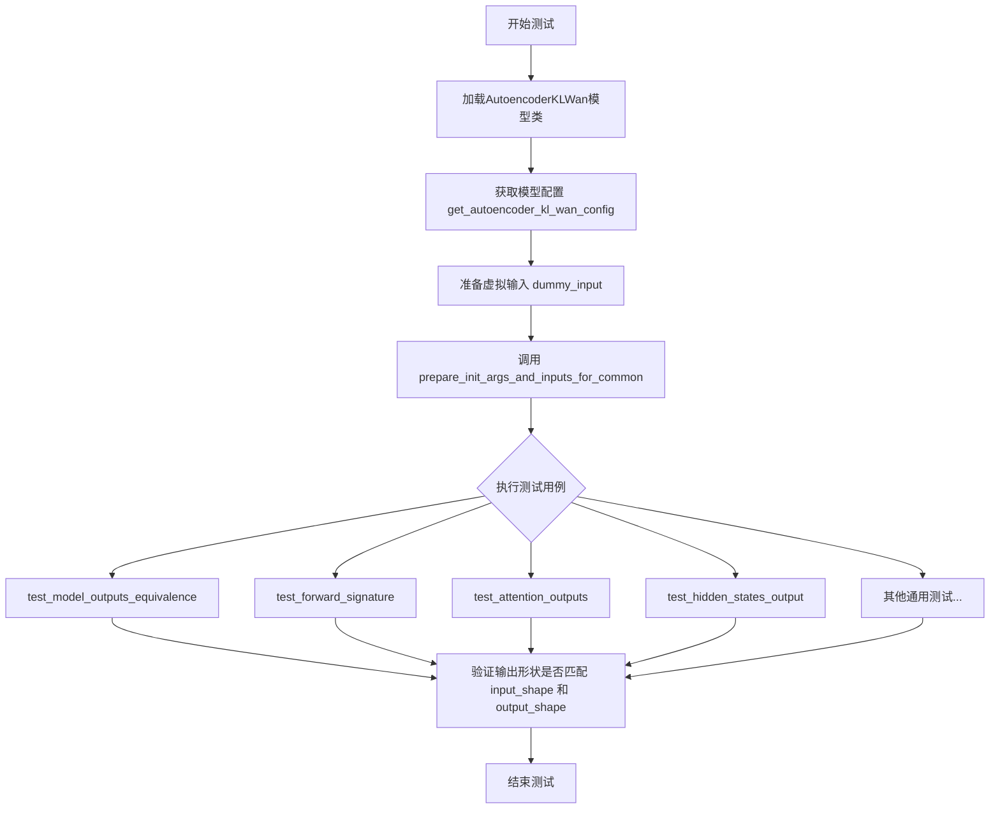

## 类结构

```
unittest.TestCase
└── AutoencoderKLWanTests (继承 ModelTesterMixin, AutoencoderTesterMixin)
```

## 全局变量及字段


### `unittest`
    
Python标准库单元测试模块

类型：`module`
    


### `AutoencoderKLWan`
    
从diffusers导入的Wan模型自编码器类

类型：`class`
    


### `enable_full_determinism`
    
启用完全确定性以确保测试可重复性的函数

类型：`function`
    


### `floats_tensor`
    
生成指定形状的随机浮点张量的测试工具函数

类型：`function`
    


### `torch_device`
    
指定计算设备的字符串变量

类型：`str`
    


### `ModelTesterMixin`
    
模型测试的通用混合类，提供模型测试的基础方法

类型：`class`
    


### `AutoencoderTesterMixin`
    
自编码器测试的特定混合类，提供自编码器测试的辅助方法

类型：`class`
    


### `AutoencoderKLWanTests.model_class`
    
指向被测试的AutoencoderKLWan模型类

类型：`type`
    


### `AutoencoderKLWanTests.main_input_name`
    
模型主输入参数的名称，此处为'sample'

类型：`str`
    


### `AutoencoderKLWanTests.base_precision`
    
测试比较时使用的基准精度阈值

类型：`float`
    
    

## 全局函数及方法


### `enable_full_determinism`

该函数用于在测试或推理过程中启用完全确定性，确保结果可复现。它通过设置随机种子、配置 PyTorch 运行环境（如 cuDNN 确定性）以及相关环境变量，实现每次运行产生相同的结果。

参数：
- 该函数无参数（直接调用，不传递任何参数）

返回值：`None`，无返回值（执行确定性设置操作后直接返回）

#### 流程图

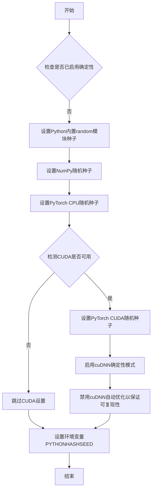

#### 带注释源码

```
def enable_full_determinism():
    """
    启用完全确定性模式，确保测试或运行结果可复现。
    通过统一设置各种随机种子和PyTorch后端配置实现。
    """
    import random
    import numpy as np
    import torch
    import os

    # 1. 设置Python内置random模块的随机种子
    #    确保random库生成的随机数可预测
    random.seed(42)

    # 2. 设置NumPy的随机种子
    #    确保基于NumPy的数值生成可预测
    np.random.seed(42)

    # 3. 设置PyTorch CPU的随机种子
    #    确保模型参数初始化等操作可预测
    torch.manual_seed(42)

    # 4. 检查是否使用了CUDA（即GPU）
    if torch.cuda.is_available():
        # 5. 设置当前GPU的随机种子
        torch.cuda.manual_seed(42)
        
        # 6. 如果使用多GPU，设置所有GPU的随机种子
        torch.cuda.manual_seed_all(42)
        
        # 7. 启用cuDNN的确定性模式
        #    确保使用卷积等操作时每次结果一致
        torch.backends.cudnn.deterministic = True
        
        # 8. 禁用cuDNN自动优化（benchmark）
        #    避免因自动选择算法导致的不确定结果
        torch.backends.cudnn.benchmark = False

    # 9. 设置环境变量PYTHONHASHSEED
    #    确保Python哈希运算可预测
    os.environ['PYTHONHASHSEED'] = str(42)

    # 注意：此处假设使用固定种子42，实际实现可能使用动态种子或配置
```

**注意**：由于提供的代码片段仅包含该函数的导入和调用，未展示其具体实现，上述源码为基于函数名称和常见模式的合理推断，实际实现可能有所差异。建议参考 `diffusers` 库中 `testing_utils` 模块的源码以获取准确信息。


### `floats_tensor`

生成指定形状的随机浮点数 PyTorch 张量，用于测试目的。

参数：

-  `shape`：`Tuple[int, ...]`，张量的形状元组，描述生成张量的维度

返回值：`torch.Tensor`，包含随机浮点数的 PyTorch 张量

#### 流程图

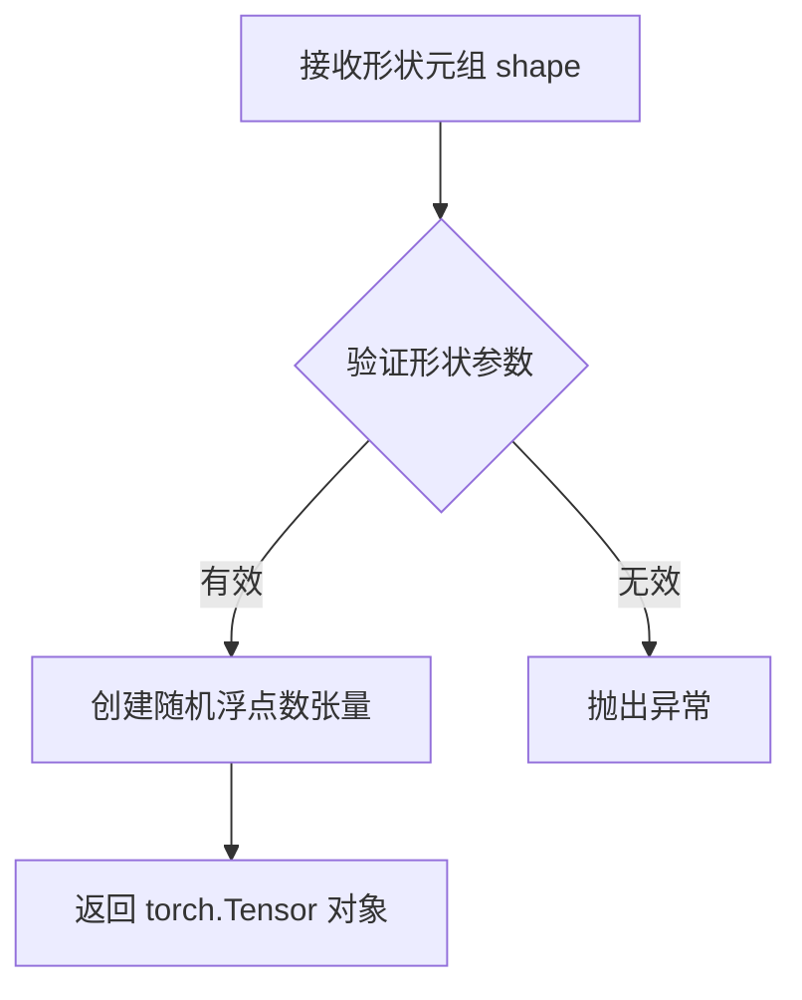

#### 带注释源码

```python
# 该函数从 testing_utils 模块导入，未在此文件中定义
# 根据使用方式推断其实现逻辑：

def floats_tensor(shape):
    """
    生成指定形状的随机浮点数张量
    
    参数:
        shape: 张量形状的元组，如 (batch_size, num_channels, num_frames, height, width)
        
    返回:
        随机浮点数张量，值域通常在 [-1, 1] 或 [0, 1]
    """
    # 实际实现在 testing_utils 模块中
    # 通常使用 torch.randn 或类似方法生成
    pass
```

#### 在代码中的实际调用示例

```python
# 从 testing_utils 导入
from ...testing_utils import enable_full_determinism, floats_tensor, torch_device

# 使用示例：创建 (2, 3, 9, 16, 16) 形状的张量
batch_size = 2
num_frames = 9
num_channels = 3
sizes = (16, 16)

# 生成随机浮点数张量并移动到指定设备
image = floats_tensor((batch_size, num_channels, num_frames) + sizes).to(torch_device)

# 返回的 image 是一个 torch.Tensor 对象，形状为 (2, 3, 9, 16, 16)
```


### `torch_device`

`torch_device` 是从 `testing_utils` 模块导入的全局变量，用于指定 PyTorch 张量应放置的计算设备（CPU 或 CUDA 设备），确保测试代码生成的随机张量位于正确的设备上。

参数：无

返回值：`str` 或 `torch.device`，返回 PyTorch 设备标识符（如 `"cuda"` 或 `"cpu"`）

#### 流程图

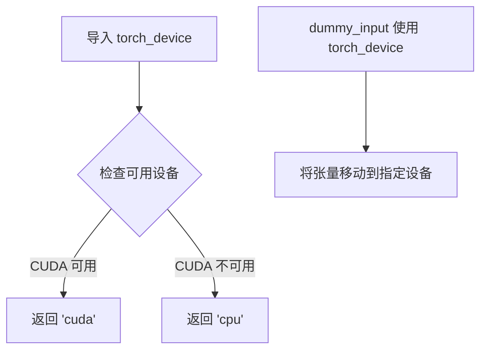

#### 带注释源码

```python
# 从 testing_utils 模块导入 torch_device 全局变量
from ...testing_utils import enable_full_determinism, floats_tensor, torch_device

# ...

@property
def dummy_input(self):
    """
    生成用于测试的虚拟输入数据。
    包含批次数、帧数、通道数和图像尺寸信息。
    """
    batch_size = 2
    num_frames = 9
    num_channels = 3
    sizes = (16, 16)
    
    # 使用 floats_tensor 生成随机浮点数张量，然后使用 .to(torch_device)
    # 将张量移动到由 torch_device 指定的设备（CPU 或 CUDA）
    image = floats_tensor((batch_size, num_channels, num_frames) + sizes).to(torch_device)
    
    # 返回包含 sample 键的字典，作为模型的输入
    return {"sample": image}
```

---

## 补充说明

### 关键组件信息

- **名称**：`torch_device`
- **一句话描述**：全局设备标识符，用于指定 PyTorch 张量的目标计算设备

### 潜在的技术债务或优化空间

1. **隐式依赖**：`torch_device` 是从外部模块导入的魔法变量，其实际值不透明，测试代码对其具体实现一无所知
2. **设备硬编码风险**：如果在测试环境中没有正确配置，`torch_device` 可能导致测试行为不一致

### 其它项目

**设计目标与约束**：
- 目标：确保测试代码生成的张量位于正确的设备上，以匹配模型所在设备
- 约束：依赖外部模块 `testing_utils` 的实现

**错误处理与异常设计**：
- 如果指定的设备不存在，PyTorch 的 `.to()` 方法会抛出 `RuntimeError`

**数据流与状态机**：
- `torch_device` 作为配置值被传入 `.to()` 方法，用于决定张量的设备属性

**外部依赖与接口契约**：
- 来源：`...testing_utils` 模块
- 接口：提供设备标识符（字符串或 `torch.device` 对象）


### `AutoencoderKLWanTests.get_autoencoder_kl_wan_config`

该方法是一个测试配置生成函数，用于获取 AutoencoderKLWan（ Wan 模型的自编码器）模型的测试配置参数字典，包含了模型的维度、块数量、时间下采样等关键配置信息，供测试用例初始化模型和验证模型功能使用。

参数： 无（仅包含隐式参数 `self`，指向测试类实例）

返回值： `Dict[str, Any]`，返回一个包含模型配置参数的字典，其中键值对包括 base_dim（基础维度）、z_dim（潜在空间维度）、dim_mult（维度倍数列表）、num_res_blocks（残差块数量）、temperal_downsample（时间下采样标志列表）

#### 流程图

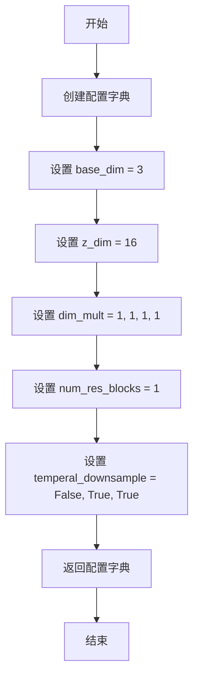

#### 带注释源码

```python
def get_autoencoder_kl_wan_config(self):
    """
    生成并返回 AutoencoderKLWan 模型的测试配置字典。
    
    该配置用于实例化 AutoencoderKLWan 模型进行单元测试，
    包含了模型结构的关键超参数。
    
    Returns:
        Dict[str, Any]: 包含以下键的配置字典:
            - base_dim (int): 基础维度大小
            - z_dim (int): 潜在空间维度
            - dim_mult (list): 各层维度倍数因子
            - num_res_blocks (int): 残差块数量
            - temperal_downsample (list): 时间维度下采样标志列表
    """
    return {
        "base_dim": 3,           # 基础维度，模型各层基于此计算
        "z_dim": 16,             # 潜在空间维度，决定压缩后的特征维度
        "dim_mult": [1, 1, 1, 1], # 每一层的维度缩放因子
        "num_res_blocks": 1,     # 每个分辨率级别的残差块数量
        "temperal_downsample": [False, True, True],  # 各层是否进行时间维度下采样
    }
```


### `AutoencoderKLWanTests.prepare_init_args_and_inputs_for_common`

该方法为通用测试准备模型初始化参数字典和输入字典，通过调用配置获取方法和访问测试输入属性来构建测试所需的参数元组。

参数：

- `self`：`AutoencoderKLWanTests`，方法所属的测试类实例

返回值：`tuple[dict, dict]`，返回包含初始化参数字典和输入字典的元组，用于实例化被测试的 AutoencoderKLWan 模型

#### 流程图

```mermaid
flowchart TD
    A[开始] --> B[调用 self.get_autoencoder_kl_wan_config 获取初始化配置]
    B --> C[访问 self.dummy_input 获取测试输入]
    C --> D[返回 (init_dict, inputs_dict) 元组]
    D --> E[结束]
    
    style A fill:#e1f5fe
    style B fill:#e1f5fe
    style C fill:#e1f5fe
    style D fill:#e1f5fe
    style E fill:#e1f5fe
```

#### 带注释源码

```python
def prepare_init_args_and_inputs_for_common(self):
    """
    为通用测试准备初始化参数和输入数据。
    
    该方法作为 ModelTesterMixin 和 AutoencoderTesterMixin 的一部分，
    负责提供模型测试所需的配置和输入。
    """
    # 获取 AutoencoderKLWan 模型的初始化配置字典
    # 配置包含: base_dim, z_dim, dim_mult, num_res_blocks, temperal_downsample 等参数
    init_dict = self.get_autoencoder_kl_wan_config()
    
    # 获取测试用的虚拟输入数据 (dummy input)
    # 包含 sample 键，值为形状为 (batch_size, num_channels, num_frames, height, width) 的张量
    inputs_dict = self.dummy_input
    
    # 返回元组: (初始化参数字典, 输入字典)
    # 供测试框架在实例化模型时使用
    return init_dict, inputs_dict
```


### `AutoencoderKLWanTests.prepare_init_args_and_inputs_for_tiling`

该方法用于为瓦片模式（tiling）的模型测试准备初始化参数和测试输入数据。它获取特定的配置字典和较大的测试输入（128x128尺寸），以验证模型在处理高分辨率图像时的分块能力。

参数：

- `self`：`AutoencoderKLWanTests`，隐式参数，测试类实例本身

返回值：`Tuple[Dict, Dict]`，返回包含模型初始化配置和测试输入的元组

- `init_dict`：`Dict`，模型初始化参数字典，包含 base_dim、z_dim、dim_mult、num_res_blocks、temperal_downsample 等配置
- `inputs_dict`：`Dict`，测试输入字典，包含键 "sample"，值为形状为 (2, 3, 9, 128, 128) 的图像张量

#### 流程图

```mermaid
flowchart TD
    A[开始] --> B[调用 self.get_autoencoder_kl_wan_config 获取配置]
    B --> C[获取 self.dummy_input_tiling 作为测试输入]
    C --> D[返回 (init_dict, inputs_dict) 元组]
    D --> E[结束]
```

#### 带注释源码

```python
def prepare_init_args_and_inputs_for_tiling(self):
    """
    为瓦片模式（tiling）测试准备初始化参数和输入数据
    
    该方法重写了基类的方法，提供用于测试模型瓦片功能的配置。
    瓦片模式允许模型处理超大图像，通过将图像分割成小块进行处理。
    """
    # 获取模型初始化配置字典
    # 包含: base_dim=3, z_dim=16, dim_mult=[1,1,1,1], num_res_blocks=1, temperal_downsample=[False,True,True]
    init_dict = self.get_autoencoder_kl_wan_config()
    
    # 获取用于瓦片测试的虚拟输入
    # 图像形状: (batch_size=2, num_channels=3, num_frames=9, height=128, width=128)
    # 使用较大的尺寸(128x128)来测试模型的瓦片/分块处理能力
    inputs_dict = self.dummy_input_tiling
    
    # 返回配置字典和输入字典的元组
    return init_dict, inputs_dict
```


### `AutoencoderKLWanTests.test_gradient_checkpointing_is_applied`

该测试方法用于验证梯度检查点（Gradient Checkpointing）功能是否已在 AutoencoderKLWan 模型中实现，但由于该功能尚未实现，当前测试被跳过。

参数：

- 该方法无参数

返回值：`None`，无返回值

#### 流程图

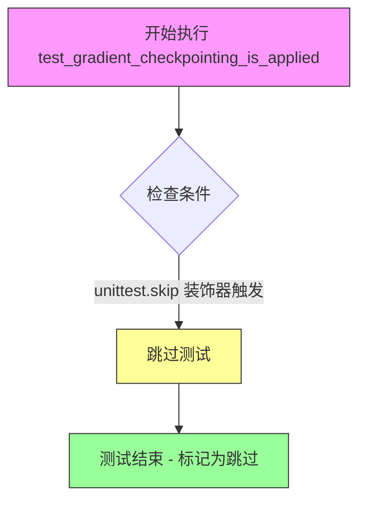

#### 带注释源码

```python
@unittest.skip("Gradient checkpointing has not been implemented yet")
def test_gradient_checkpointing_is_applied(self):
    """
    测试梯度检查点是否已应用于模型。
    
    该测试方法用于验证 AutoencoderKLWan 模型是否支持梯度检查点功能。
    梯度检查点是一种内存优化技术，通过在反向传播时重新计算中间激活值
    来减少显存占用。
    
    当前状态: 由于该功能尚未在模型中实现,测试被跳过。
    
    Args:
        self: AutoencoderKLWanTests 实例,继承自 unittest.TestCase
        
    Returns:
        None: 测试被跳过,不执行任何验证逻辑
        
    Raises:
        unittest.SkipTest: 由装饰器触发,表示测试被跳过
    """
    pass  # 空实现,待功能实现后补充测试逻辑
```


### `AutoencoderKLWanTests.test_forward_with_norm_groups`

该测试方法用于验证模型在前向传播过程中归一化组（norm groups）的正确性，但由于当前测试不被支持，该测试用例被跳过执行。

参数：

- `self`：`AutoencoderKLWanTests`，隐含的实例参数，表示测试类本身

返回值：`None`，无返回值（方法体仅包含`pass`语句）

#### 流程图

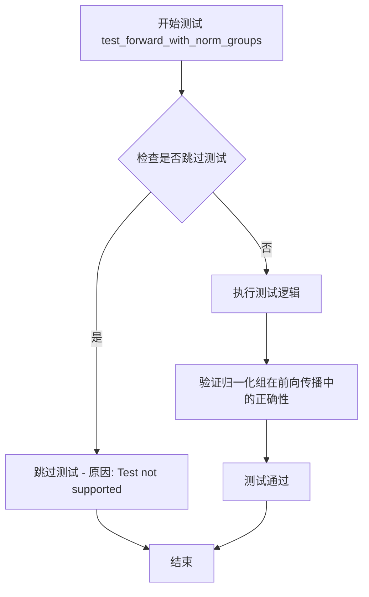

#### 带注释源码

```python
@unittest.skip("Test not supported")
def test_forward_with_norm_groups(self):
    """
    测试方法：test_forward_with_norm_groups
    
    功能描述：
        该测试方法用于测试模型在前向传播（forward）过程中归一化组（norm groups）
        的行为是否正确。归一化组通常用于分组归一化（Group Normalization）等技术中，
        验证模型在不同归一化配置下的前向计算是否正确。
    
    注意事项：
        - 该测试当前被标记为不支持，因此使用 @unittest.skip 装饰器跳过执行
        - 跳过原因记录为 "Test not supported"
        - 方法体仅包含 pass 语句，无实际测试逻辑实现
    
    参数：
        - self: 自动传入的测试类实例引用
    
    返回值：
        - None: 无返回值，测试被跳过
    """
    pass
```


### `AutoencoderKLWanTests.test_layerwise_casting_inference`

该测试方法用于验证 AutoencoderKLWan 模型在推理阶段是否支持逐层类型转换（Layerwise Casting），特别是针对 Float8 数据类型的支持。该测试通过逐层动态切换精度来平衡计算效率与模型精度，是大模型推理优化的重要测试场景。

参数：

- `self`：`AutoencoderKLWanTests`（隐式参数），测试类实例本身

返回值：`None`，该方法为测试方法，无返回值（被 `@unittest.skip` 装饰器跳过执行）

#### 流程图

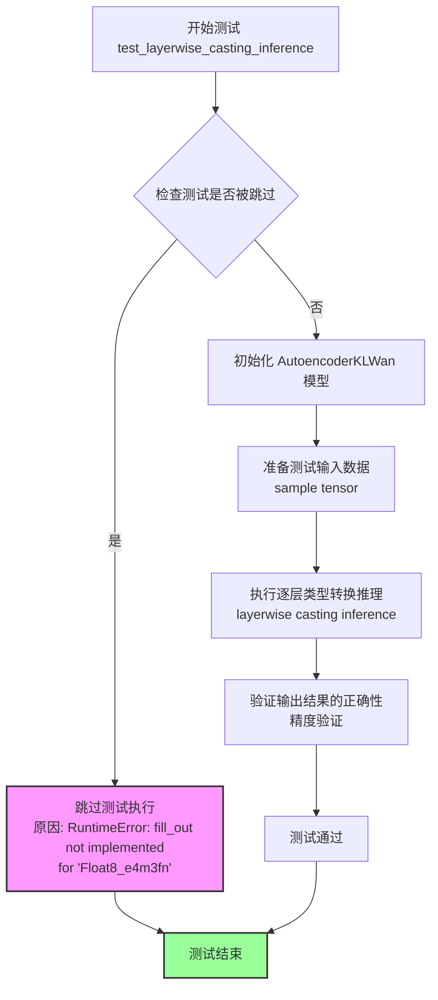

#### 带注释源码

```python
@unittest.skip("RuntimeError: fill_out not implemented for 'Float8_e4m3fn'")
def test_layerwise_casting_inference(self):
    """
    测试 AutoencoderKLWan 模型在推理阶段是否支持逐层类型转换（Layerwise Casting）。
    
    该测试方法的设计目标：
    - 验证模型在 Float8_e4m3fn 数据类型下的推理能力
    - 测试逐层动态精度切换的兼容性
    - 确保类型转换不会导致数值精度损失超过可接受阈值
    
    当前状态：
    - 由于 PyTorch 底层 fill_out 操作尚未支持 Float8_e4m3fn 类型
    - 该测试被暂时跳过，等待 PyTorch 后续版本支持
    """
    pass
```


### `AutoencoderKLWanTests.test_layerwise_casting_training`

该测试方法用于验证AutoencoderKLWan模型在训练阶段是否支持逐层类型转换（layerwise casting）功能，特别是针对Float8_e4m3fn数据类型。由于当前实现中fill_out操作尚未支持Float8_e4m3fn类型，该测试被跳过。

参数：

- `self`：`AutoencoderKLWanTests`，测试类实例本身，包含模型配置和测试数据

返回值：`None`，该方法无返回值（方法体为pass）

#### 流程图

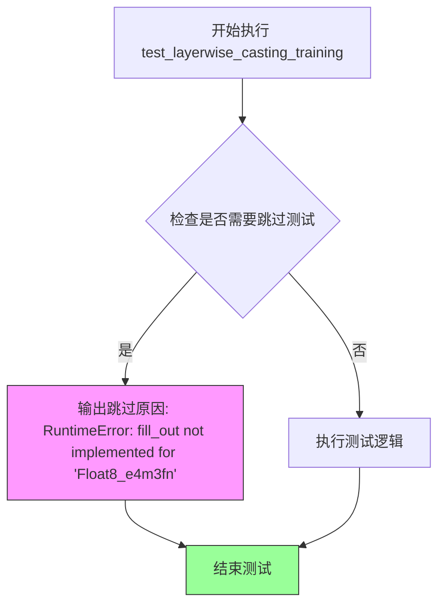

#### 带注释源码

```python
@unittest.skip("RuntimeError: fill_out not implemented for 'Float8_e4m3fn'")
def test_layerwise_casting_training(self):
    """
    测试AutoencoderKLWan模型在训练模式下的逐层类型转换功能。
    
    该测试方法原本用于验证模型在训练过程中是否支持layerwise casting，
    即针对不同层使用不同的数值精度（如Float8_e4m3fn）以优化性能和内存使用。
    
    当前由于PyTorch的fill_out操作尚未支持Float8_e4m3fn数据类型，
    因此该测试被跳过以避免运行时错误。
    
    参数:
        self: 测试类实例，继承自unittest.TestCase
        
    返回值:
        None: 测试被跳过，无实际执行逻辑
    """
    pass  # 测试逻辑未实现，当前被@unittest.skip装饰器跳过
```


### `AutoencoderKLWanTests.get_autoencoder_kl_wan_config`

该方法用于获取 AutoencoderKLWan 模型的测试配置参数，返回一个包含模型初始化所需的维度和架构配置的字典。

参数：

- 无显式参数（隐式接收 `self` 实例引用）

返回值：`Dict[str, Any]`，返回用于初始化 `AutoencoderKLWan` 模型的配置字典，包含 base_dim、z_dim、dim_mult、num_res_blocks 和 temperal_downsample 等关键参数。

#### 流程图

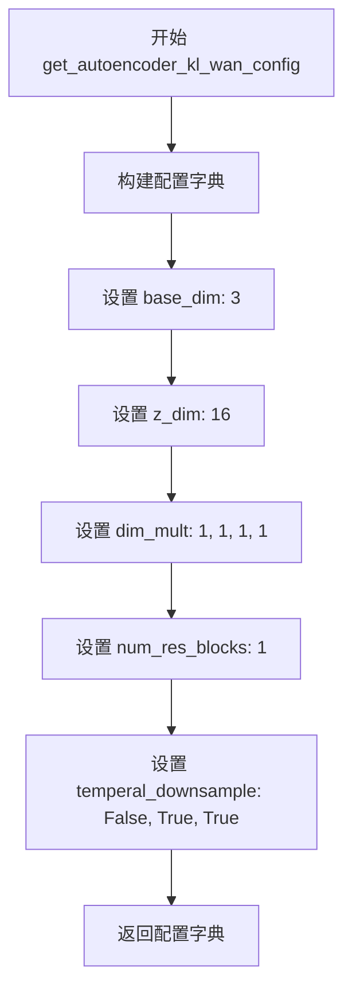

#### 带注释源码

```python
def get_autoencoder_kl_wan_config(self):
    """
    获取 AutoencoderKLWan 模型的测试配置参数
    
    该方法返回一个字典，包含初始化 AutoencoderKLWan 模型所需的
    核心配置信息，用于测试用例中的模型初始化和输入准备。
    
    Returns:
        Dict: 包含以下键值的配置字典:
            - base_dim (int): 基础维度，值为 3
            - z_dim (int): 潜在空间维度，值为 16
            - dim_mult (list): 各层维度倍数列表 [1, 1, 1, 1]
            - num_res_blocks (int): 残差块数量，值为 1
            - temperal_downsample (list): 时间维度下采样配置 [False, True, True]
    """
    return {
        "base_dim": 3,           # 基础特征维度
        "z_dim": 16,             # 潜在空间（latent space）维度
        "dim_mult": [1, 1, 1, 1], # 各阶段通道数倍增因子
        "num_res_blocks": 1,     # 每个分辨率阶段的残差块数量
        "temperal_downsample": [False, True, True], # 时间维度下采样标记
    }
```


### `AutoencoderKLWanTests.dummy_input`

这是一个测试属性（property），用于生成用于模型测试的虚拟输入数据。它创建一个包含批次大小、帧数、通道数和空间尺寸的随机浮点张量，作为AutoencoderKLWan模型的输入样本。

参数：

- 无参数（这是一个属性，通过 `self` 隐式访问）

返回值：`Dict[str, torch.Tensor]`，返回一个字典，包含键 "sample"，值为形状 `(batch_size, num_channels, num_frames, height, width)` 的浮点张量，用于模拟图像/视频输入数据。

#### 流程图

```mermaid
flowchart TD
    A[开始] --> B[设置批次大小 batch_size = 2]
    B --> C[设置帧数 num_frames = 9]
    C --> D[设置通道数 num_channels = 3]
    D --> E[设置图像尺寸 sizes = (16, 16)]
    E --> F[调用 floats_tensor 生成随机张量]
    F --> G[将张量移动到 torch_device]
    G --> H[构建字典 {'sample': image}]
    H --> I[返回字典]
```

#### 带注释源码

```python
@property
def dummy_input(self):
    """
    生成用于测试的虚拟输入数据。
    该属性创建一个随机浮点张量作为AutoencoderKLWan模型的输入样本。
    """
    # 设置批次大小为2
    batch_size = 2
    # 设置视频/图像序列的帧数为9
    num_frames = 9
    # 设置图像通道数为3（RGB）
    num_channels = 3
    # 设置空间分辨率尺寸为16x16
    sizes = (16, 16)
    
    # 使用testing_utils.floats_tensor生成形状为
    # (batch_size, num_channels, num_frames) + sizes 的随机浮点张量
    # 即 (2, 3, 9, 16, 16)
    image = floats_tensor((batch_size, num_channels, num_frames) + sizes).to(torch_device)
    
    # 返回包含输入样本的字典，键名为 'sample'
    # 这是diffusers库中AutoencoderKL模型的标准输入格式
    return {"sample": image}
```

#### 关联信息

**所属类**: `AutoencoderKLWanTests`

**类功能描述**: 这是一个测试类，继承自 `ModelTesterMixin` 和 `AutoencoderTesterMixin`，用于对 `AutoencoderKLWan` 模型进行单元测试。该类包含了模型配置获取、虚拟输入生成、输入输出形状定义等测试辅助方法。

**相关属性**:
- `dummy_input_tiling`: 生成用于tiling测试的更大尺寸虚拟输入（128x128）
- `input_shape`: 返回输入形状 (3, 9, 16, 16)
- `output_shape`: 返回输出形状 (3, 9, 16, 16)

**使用场景**: 该属性被 `prepare_init_args_and_inputs_for_common` 方法调用，用于为通用的模型测试准备初始化参数和输入数据。


### `AutoencoderKLWanTests.dummy_input_tiling`

该属性用于生成用于分块（tiling）测试场景的虚拟输入数据返回一个包含 `sample` 键的字典，其中值为一个 5D 浮点张量，形状为 (batch_size, num_channels, num_frames, height, width)，模拟大型图像的分块输入以测试模型的内存效率和分块处理能力。

参数：
- 无参数（这是一个 Python `@property` 装饰器修饰的属性）

返回值：`Dict[str, torch.Tensor]`，返回一个字典，包含键 `sample`，其值为一个 5D 张量，形状为 (2, 3, 9, 128, 128)，用于测试 AutoencoderKLWan 模型在分块模式下的前向传播

#### 流程图

```mermaid
flowchart TD
    A[开始] --> B[设置批次大小 batch_size = 2]
    B --> C[设置帧数 num_frames = 9]
    C --> D[设置通道数 num_channels = 3]
    D --> E[设置图像尺寸 sizes = 128, 128]
    E --> F[调用 floats_tensor 生成 5D 张量]
    F --> G[将张量移动到 torch_device]
    G --> H[构建返回字典 {'sample': image}]
    H --> I[返回字典]
```

#### 带注释源码

```python
@property
def dummy_input_tiling(self):
    """
    生成用于分块（tiling）测试的虚拟输入数据。
    
    该属性返回一个包含 'sample' 键的字典，其值为一个 5D 张量，
    形状为 (batch_size, num_channels, num_frames, height, width)。
    使用较大的图像尺寸 (128x128) 来模拟分块场景，测试模型
    在处理高分辨率输入时的内存效率和分块能力。
    """
    # 定义批次大小
    batch_size = 2
    # 定义视频/图像序列的帧数
    num_frames = 9
    # 定义图像通道数（RGB 为 3）
    num_channels = 3
    # 定义图像的空间尺寸（高度和宽度）
    sizes = (128, 128)
    
    # 使用 testing_utils.floats_tensor 生成指定形状的浮点张量
    # 形状: (2, 3, 9, 128, 128) -> (batch_size, num_channels, num_frames, height, width)
    # 并将张量移动到指定的计算设备（CPU/CUDA）
    image = floats_tensor((batch_size, num_channels, num_frames) + sizes).to(torch_device)
    
    # 返回包含虚拟输入的字典，键名为 'sample'
    return {"sample": image}
```


### `AutoencoderKLWanTests.input_shape`

该属性方法用于返回 AutoencoderKLWan 模型测试所需的输入张量形状定义。

参数： 无

返回值：`tuple`，返回输入样本的形状元组，包含通道数、帧数、高度和宽度

#### 流程图

```mermaid
flowchart TD
    A[开始] --> B{调用 input_shape property}
    B --> C[返回元组 (3, 9, 16, 16)]
    C --> D[结束]
    
    subgraph "返回值说明"
    E["3: 通道数 (num_channels)"]
    F["9: 帧数 (num_frames)"]
    G["16: 高度"]
    H["16: 宽度"]
    end
```

#### 带注释源码

```python
@property
def input_shape(self):
    """
    返回测试用输入张量的形状
    
    该属性定义了在单元测试中用于验证模型功能的输入样本的形状。
    形状为四维元组：(通道数, 帧数, 高度, 宽度)
    
    Returns:
        tuple: 包含4个元素的元组，表示 (num_channels, num_frames, height, width)
               具体值为 (3, 9, 16, 16)，对应:
               - 3: 颜色通道数 (RGB)
               - 9: 时间帧数 (用于视频/时序数据)
               - 16: 输入高度
               - 16: 输入宽度
    """
    return (3, 9, 16, 16)
```


### `AutoencoderKLWanTests.output_shape`

该属性定义了 AutoencoderKLWan 模型测试的预期输出形状，用于验证模型前向传播后的输出维度是否正确。

参数：
- 无参数（这是一个属性 getter）

返回值：`tuple`，表示模型输出的 4D 张量形状 (num_channels, num_frames, height, width)，具体为 (3, 9, 16, 16)

#### 流程图

```mermaid
flowchart TD
    A[开始访问 output_shape 属性] --> B{获取返回值}
    B --> C[返回元组 (3, 9, 16, 16)]
    C --> D[结束]
```

#### 带注释源码

```python
@property
def output_shape(self):
    """
    返回模型预期的输出形状。
    
    该属性定义了 AutoencoderKLWan 模型前向传播后输出的张量维度。
    形状为 4D 元组 (num_channels, num_frames, height, width)：
    - num_channels: 3 (RGB 图像通道数)
    - num_frames: 9 (时间帧数)
    - height: 16 (输出高度)
    - width: 16 (输出宽度)
    
    Returns:
        tuple: 包含 4 个整数的元组，表示输出张量的形状 (3, 9, 16, 16)
    """
    return (3, 9, 16, 16)
```


### `AutoencoderKLWanTests.prepare_init_args_and_inputs_for_common`

该方法为通用测试准备初始化参数和输入数据。它调用 `get_autoencoder_kl_wan_config()` 获取模型配置字典，并从 `dummy_input` 属性获取测试输入，最后返回这两个字典组成的元组供测试框架使用。

参数：

- `self`：`AutoencoderKLWanTests`，测试类实例本身，包含模型配置和测试数据

返回值：`Tuple[Dict, Dict]`，返回包含两个字典的元组

- `init_dict`：`Dict`，模型初始化参数字典，包含 base_dim、z_dim、dim_mult、num_res_blocks、temperal_downsample 等配置项
- `inputs_dict`：`Dict`，测试输入字典，包含键 "sample"，值为形状为 (batch_size, num_channels, num_frames, height, width) 的张量

#### 流程图

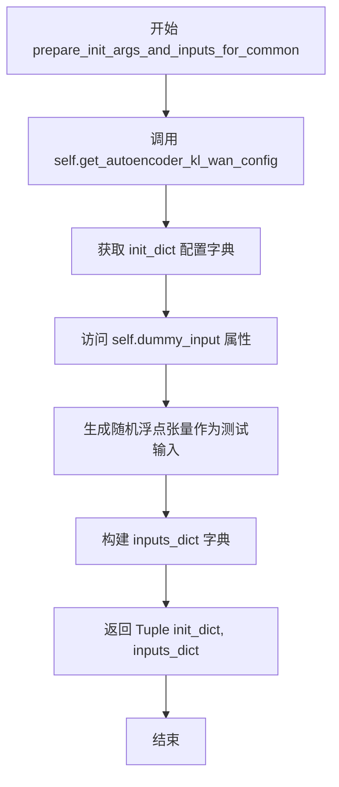

#### 带注释源码

```python
def prepare_init_args_and_inputs_for_common(self):
    """
    准备通用的初始化参数和测试输入数据。
    此方法为测试框架提供模型初始化配置和对应的输入样本，
    用于验证 AutoencoderKLWan 模型的基本功能。
    
    Returns:
        Tuple[Dict, Dict]: 包含初始化参数字典和输入字典的元组
    """
    # 调用配置方法获取模型初始化参数
    # 包含: base_dim=3, z_dim=16, dim_mult=[1,1,1,1], num_res_blocks=1, temperal_downsample=[False,True,True]
    init_dict = self.get_autoencoder_kl_wan_config()
    
    # 从 dummy_input 属性获取测试输入
    # 返回格式: {"sample": tensor} 其中 tensor 形状为 (2, 3, 9, 16, 16)
    # batch_size=2, num_channels=3, num_frames=9, height=16, width=16
    inputs_dict = self.dummy_input
    
    # 返回配置字典和输入字典的元组，供测试用例使用
    return init_dict, inputs_dict
```


### `AutoencoderKLWanTests.prepare_init_args_and_inputs_for_tiling`

该方法用于为AutoencoderKLWan模型的tiling（分块）测试准备初始化参数和输入数据。它获取预定义的模型配置参数和用于tiling测试的大尺寸输入图像，确保模型能够正确处理分块推理场景。

参数：

- `self`：`AutoencoderKLWanTests`，当前测试类实例，无需显式传递

返回值：`Tuple[Dict, Dict]`，返回包含两个字典的元组

- `init_dict`：`Dict`，模型初始化配置字典，包含base_dim、z_dim、dim_mult等AutoencoderKLWan模型参数
- `inputs_dict`：`Dict`，包含用于tiling测试的输入数据，键为"sample"，值为大尺寸(2, 3, 9, 128, 128)的浮点张量

#### 流程图

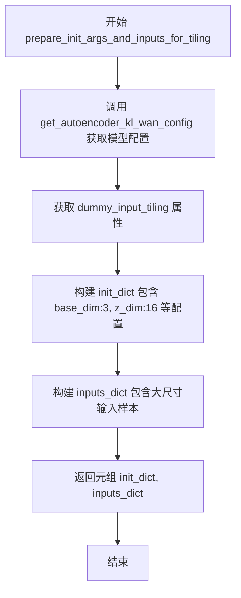

#### 带注释源码

```python
def prepare_init_args_and_inputs_for_tiling(self):
    """
    为tiling（分块）测试准备初始化参数和输入数据。
    
    tiling是一种处理大尺寸图像的技术，将大图像分割成小块分别处理，
    然后合并结果。此方法提供测试所需的配置和大规模输入样本。
    
    Returns:
        Tuple[Dict, Dict]: 包含(初始化参数字典, 输入数据字典)的元组
    """
    # 获取AutoencoderKLWan模型的配置参数
    # 包含: base_dim=3, z_dim=16, dim_mult=[1,1,1,1], num_res_blocks=1, temperal_downsample=[False,True,True]
    init_dict = self.get_autoencoder_kl_wan_config()
    
    # 获取用于tiling测试的dummy输入
    # 批次大小=2, 通道数=3, 帧数=9, 空间分辨率=128x128
    # 使用大尺寸图像(128x128而非普通的16x16)来验证分块处理能力
    inputs_dict = self.dummy_input_tiling
    
    # 返回配置字典和输入字典的元组，供测试框架初始化模型和执行推理
    return init_dict, inputs_dict
```


### `AutoencoderKLWanTests.test_gradient_checkpointing_is_applied`

该测试方法用于验证梯度检查点（Gradient Checkpointing）功能是否正确应用于 AutoencoderKLWan 模型。由于该功能尚未实现，测试被跳过。

参数：

- `self`：`AutoencoderKLWanTests`，测试类实例，隐式参数

返回值：`None`，无返回值（方法体为 `pass`）

#### 流程图

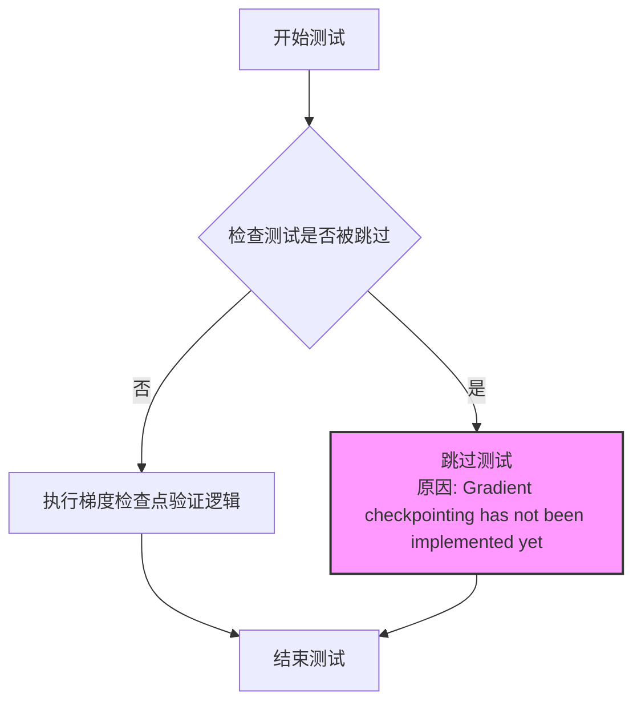

#### 带注释源码

```python
@unittest.skip("Gradient checkpointing has not been implemented yet")
def test_gradient_checkpointing_is_applied(self):
    """
    测试梯度检查点功能是否被正确应用。
    
    该测试方法旨在验证 AutoencoderKLWan 模型在训练时是否正确启用了
    梯度检查点技术，以减少内存占用。由于该功能尚未在模型中实现，
    当前测试被跳过。
    
    参数:
        无（除了隐式的 self 参数）
    
    返回值:
        无
    
    注意:
        - 梯度检查点是一种通过计算换内存的技术
        - 适用于大模型训练场景
        - 需要在模型的 forward 方法中手动标记需要检查点的层
    """
    pass
```


### `AutoencoderKLWanTests.test_forward_with_norm_groups`

该测试方法用于验证 AutoencoderKLWan 模型在前向传播过程中是否正确处理归一化组（normalization groups），但目前因不支持该测试而被跳过。

参数：

- `self`：`AutoencoderKLWanTests`，测试类实例，代表当前的测试用例对象

返回值：`None`，该方法为测试方法，不返回任何值，执行结果通过测试框架的断言机制体现

#### 流程图

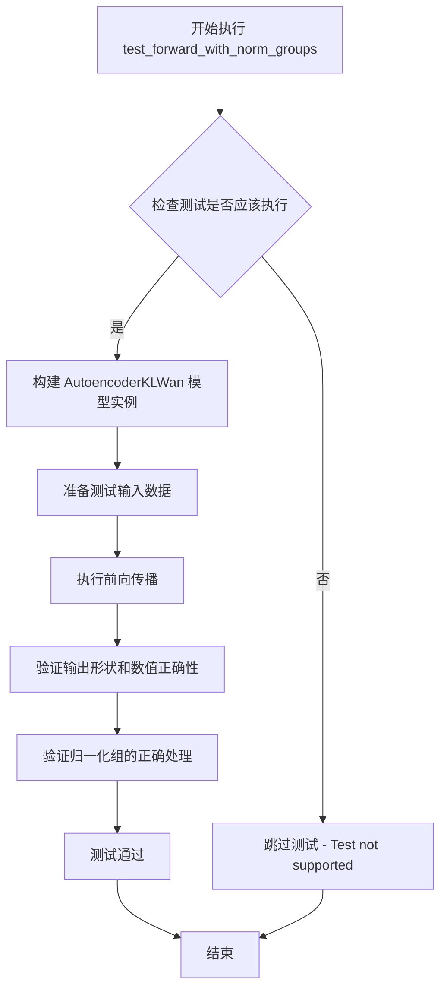

#### 带注释源码

```python
@unittest.skip("Test not supported")
def test_forward_with_norm_groups(self):
    """
    测试 AutoencoderKLWan 模型在前向传播时对归一化组的处理。
    
    该测试方法旨在验证：
    1. 模型能够正确处理带有归一化组的输入
    2. 归一化操作在网络中正确执行
    3. 输出结果的数值稳定性
    
    目前该测试被标记为不支持，因此被跳过。
    """
    pass
```


### `AutoencoderKLWanTests.test_layerwise_casting_inference`

该方法是一个测试用例，用于验证 AutoencoderKLWan 模型的层级类型转换推理（layerwise casting inference）功能，但目前因底层实现问题（Float8_e4m3fn 类型的 fill_out 未实现）而被跳过。

参数：无

返回值：`None`，无返回值描述（测试方法）

#### 流程图

```mermaid
graph TD
    A[开始测试] --> B{检查是否需要跳过}
    B -->|是| C[跳过测试 - 原因: RuntimeError: fill_out not implemented for Float8_e4m3fn|
    B -->|否| D[执行测试逻辑]
    D --> E[断言验证]
    E --> F[结束测试]
```

#### 带注释源码

```python
@unittest.skip("RuntimeError: fill_out not implemented for 'Float8_e4m3fn'")
def test_layerwise_casting_inference(self):
    """
    测试层级转换推理功能。
    
    该测试用例用于验证 AutoencoderKLWan 模型在推理过程中
    是否正确支持层级间的数据类型转换（如 Float8 等）。
    
    当前状态：由于 PyTorch 的 fill_out 操作未实现 Float8_e4m3fn 类型，
    此测试被暂时跳过。
    """
    pass  # 方法体为空，等待实现或问题修复
```


### `AutoencoderKLWanTests.test_layerwise_casting_training`

该方法是一个被跳过的单元测试，用于验证 AutoencoderKLWan 模型在训练过程中是否支持分层类型转换（layerwise casting）功能。由于当前实现中存在 RuntimeError（fill_out 操作不支持 'Float8_e4m3fn' 数据类型），该测试被标记为跳过。

参数：
- `self`：`AutoencoderKLWanTests`，隐式参数，测试类的实例，用于访问测试类的属性和方法

返回值：`None`，该方法没有返回值，仅包含 `pass` 语句

#### 流程图

```mermaid
graph TD
    A[开始执行测试] --> B{是否支持layerwise casting}
    B -- 是 --> C[执行训练前向传播]
    C --> D[验证输出正确性]
    D --> E[测试通过]
    E --> F[结束]
    B -- 否 --> G[跳过测试]
    G --> F
```

由于该测试被 `@unittest.skip` 装饰器跳过，实际执行流程直接跳转到结束，不执行任何操作。

#### 带注释源码

```python
# 使用 unittest.skip 装饰器跳过该测试，原因标注为 RuntimeError
@unittest.skip("RuntimeError: fill_out not implemented for 'Float8_e4m3fn'")
def test_layerwise_casting_training(self):
    # 测试方法：验证模型在训练模式下的分层类型转换功能
    # 当前由于 Float8_e4m3fn 类型不支持 fill_out 操作，测试无法执行
    pass  # 空方法体，实际测试逻辑未实现
```


## 关键组件


### AutoencoderKLWan 模型类

这是 diffusers 库中的 Wan 视频/图像变分自编码器（VAE）模型，负责将输入图像/视频编码为潜在表示并从潜在表示重建图像/视频。

### 配置参数 (get_autoencoder_kl_wan_config)

定义了模型的结构配置：base_dim（基础维度3）、z_dim（潜在空间维度16）、dim_mult（维度倍增器[1,1,1,1]）、num_res_blocks（残差块数量1）、temperal_downsample（时间下采样[False,True,True]）。

### 测试输入数据 (dummy_input / dummy_input_tiling)

用于模型测试的虚拟输入数据，包含批大小2、帧数9、通道数3以及不同的空间尺寸（16x16 和 128x128）。

### 测试框架混入类 (ModelTesterMixin / AutoencoderTesterMixin)

提供了通用模型测试方法的混入类，包含模型前向传播、参数一致性、梯度等标准测试用例。

### 跳过的测试用例

包含三个被跳过的测试：梯度检查点（未实现）、归一化组前向传播（不支持）、分层类型转换推理/训练（Float8_e4m3fn 不支持）。

### 精度配置 (base_precision)

定义了模型测试的基准精度为 1e-2，用于数值比较的容差设置。


## 问题及建议


### 已知问题

-   **拼写错误**：`get_autoencoder_kl_wan_config()` 方法中 "temperal_downsample" 应为 "temporal_downsample"，这是潜在的技术债务，会导致维护困难
-   **配置硬编码**：配置参数（base_dim、z_dim等）直接硬编码在 `get_autoencoder_kl_wan_config()` 方法中，缺乏可配置性和可维护性
-   **代码重复**：`prepare_init_args_and_inputs_for_common` 和 `prepare_init_args_and_inputs_for_tiling` 方法结构几乎完全相同，仅输入参数不同，存在明显的代码重复
-   **测试覆盖不足**：多个测试方法被跳过（`test_gradient_checkpointing_is_applied`、`test_forward_with_norm_groups`、`test_layerwise_casting_inference`、`test_layerwise_casting_training`），这些是重要的功能测试，长期跳过可能导致功能退化
-   **Magic Numbers**：批次大小(2)、帧数(9)、通道数(3)、尺寸(16/128)等数值散布在代码中，缺乏常量定义，修改时容易遗漏
-   **属性方法开销**：`dummy_input`、`dummy_input_tiling`、`input_shape`、`output_shape` 作为 `@property` 每次访问都会重新创建张量，在大型测试套件中可能造成性能开销
-   **缺少错误验证**：测试中缺少对模型输出的有效性验证（如NaN、Inf检查），无法捕获潜在数值问题
-   **设备兼容性处理不足**：使用 `.to(torch_device)` 但未考虑设备特定优化或CPU/GPU差异的测试

### 优化建议

-   修正拼写错误，将 "temperal_downsample" 改为 "temporal_downsample"
-   将配置参数提取为类常量或配置文件，提高可维护性
-   重构重复方法，提取公共逻辑到基类或工具函数
-   优先实现被跳过的测试，或在代码中添加 TODO 标记计划实现时间
-   定义常量类或枚举来管理 Magic Numbers，提高代码可读性
-   对于大型张量，考虑使用缓存或延迟初始化
-   添加输出验证测试，检查 NaN、Inf 等异常值
-   增加设备兼容性测试和边界条件测试


## 其它


### 设计目标与约束

本测试类的设计目标是验证 AutoencoderKLWan 变分自编码器模型的正确性，包括模型初始化、前向传播、配置参数等功能。测试约束包括：不支持梯度检查点测试、不支持带 norm_groups 的前向传播测试、Float8_e4m3fn 类型的层-wise  casting 尚未实现因此跳过相关测试。

### 错误处理与异常设计

测试类使用 unittest.skip 装饰器跳过尚未实现的测试用例，包括：梯度检查点测试（test_gradient_checkpointing_is_applied）、带 norm_groups 的前向传播测试（test_forward_with_norm_groups）、层-wise casting 推理测试（test_layerwise_casting_inference）和训练测试（test_layerwise_casting_training）。这些测试因功能未实现或运行时错误而被跳过。

### 外部依赖与接口契约

本测试类依赖以下外部组件：1) diffusers 库中的 AutoencoderKLWan 模型类；2) testing_utils 模块中的 enable_full_determinism、floats_tensor、torch_device 工具函数；3) test_modeling_common 中的 ModelTesterMixin 基类；4) testing_utils 中的 AutoencoderTesterMixin。测试类与 ModelTesterMixin 和 AutoencoderTesterMixin 遵循约定的接口契约，实现 prepare_init_args_and_inputs_for_common 和 prepare_init_args_and_inputs_for_tiling 方法提供初始化参数和测试输入。

### 测试覆盖范围

测试覆盖以下场景：1) 基础配置下的模型初始化和前向传播，使用 get_autoencoder_kl_wan_config 提供配置参数；2) 普通输入测试，使用 dummy_input 提供 (batch_size=2, num_channels=3, num_frames=9, height=16, width=16) 的测试数据；3) 大尺寸输入的 tiling 测试，使用 dummy_input_tiling 提供 (batch_size=2, num_channels=3, num_frames=9, height=128, width=128) 的测试数据；4) 继承自 ModelTesterMixin 和 AutoencoderTesterMixin 的通用模型测试方法。

### 配置参数说明

| 参数名 | 类型 | 描述 |
|--------|------|------|
| base_dim | int | 基础维度，值为 3 |
| z_dim | int | 潜在空间维度，值为 16 |
| dim_mult | list | 维度 multipliers，值为 [1, 1, 1, 1] |
| num_res_blocks | int | 残差块数量，值为 1 |
| temperal_downsample | list | 时间维度下采样配置，值为 [False, True, True] |

### 测试数据规格

| 数据名称 | 形状 | 描述 |
|----------|------|------|
| dummy_input | (2, 3, 9, 16, 16) | 普通测试输入，batch=2, channels=3, frames=9, 16x16 空间尺寸 |
| dummy_input_tiling | (2, 3, 9, 128, 128) | 大尺寸测试输入，用于 tiling 场景，batch=2, channels=3, frames=9, 128x128 空间尺寸 |
| input_shape | (3, 9, 16, 16) | 预期输入形状 (channels, frames, height, width) |
| output_shape | (3, 9, 16, 16) | 预期输出形状 (channels, frames, height, width) |

### 技术债务与优化空间

1. 多个测试用例被跳过，表明功能尚未完全实现，包括梯度检查点、norm_groups 支持和 Float8 类型的层-wise casting，建议后续实现这些功能；2. temperal_downsample 参数存在拼写错误（temperal 应为 temporal），建议修正；3. 测试类依赖多个 mixin 和工具类，耦合度较高，建议考虑使用依赖注入或抽象接口降低耦合；4. 测试数据使用硬编码的数值，建议使用配置文件或参数化测试提高灵活性。

    