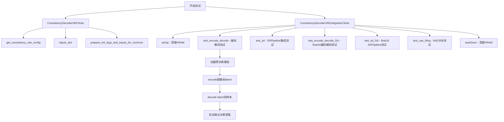
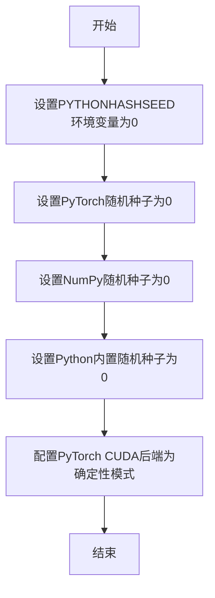
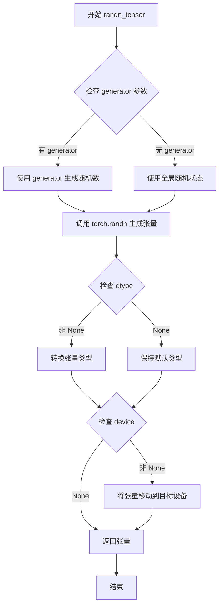
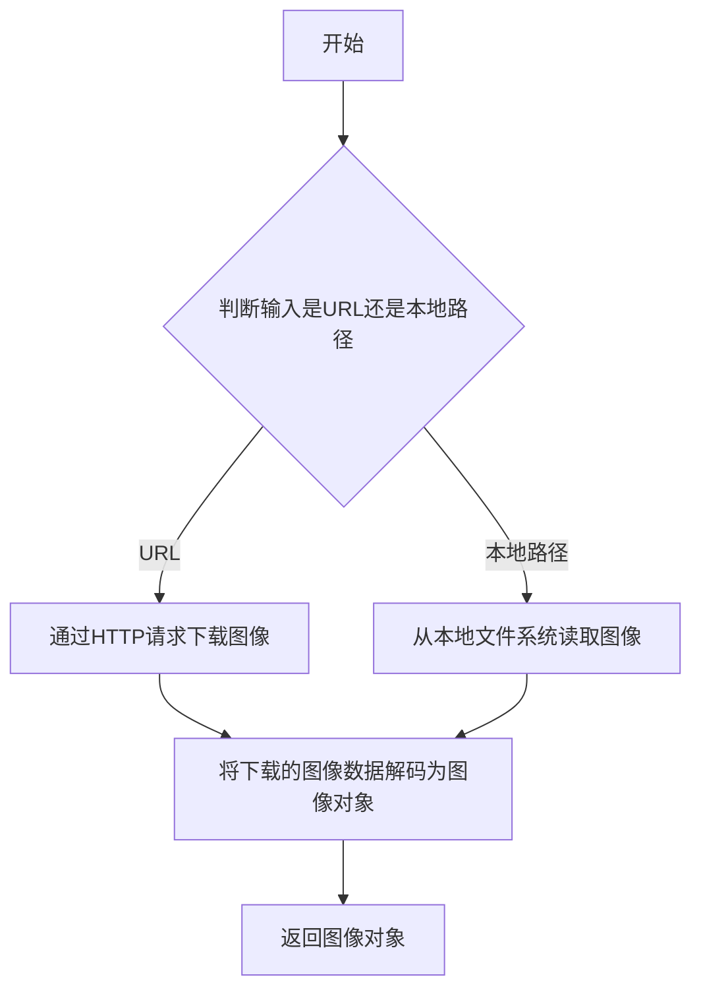
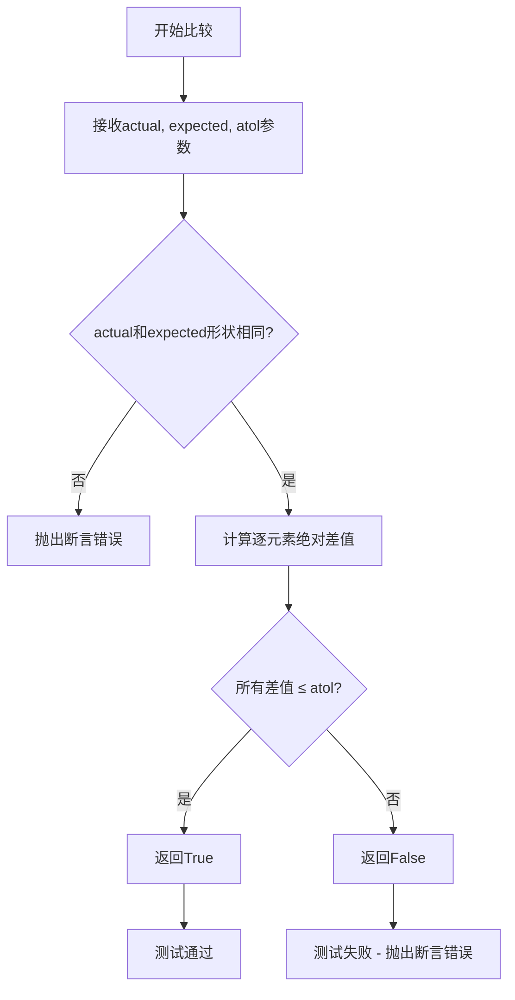
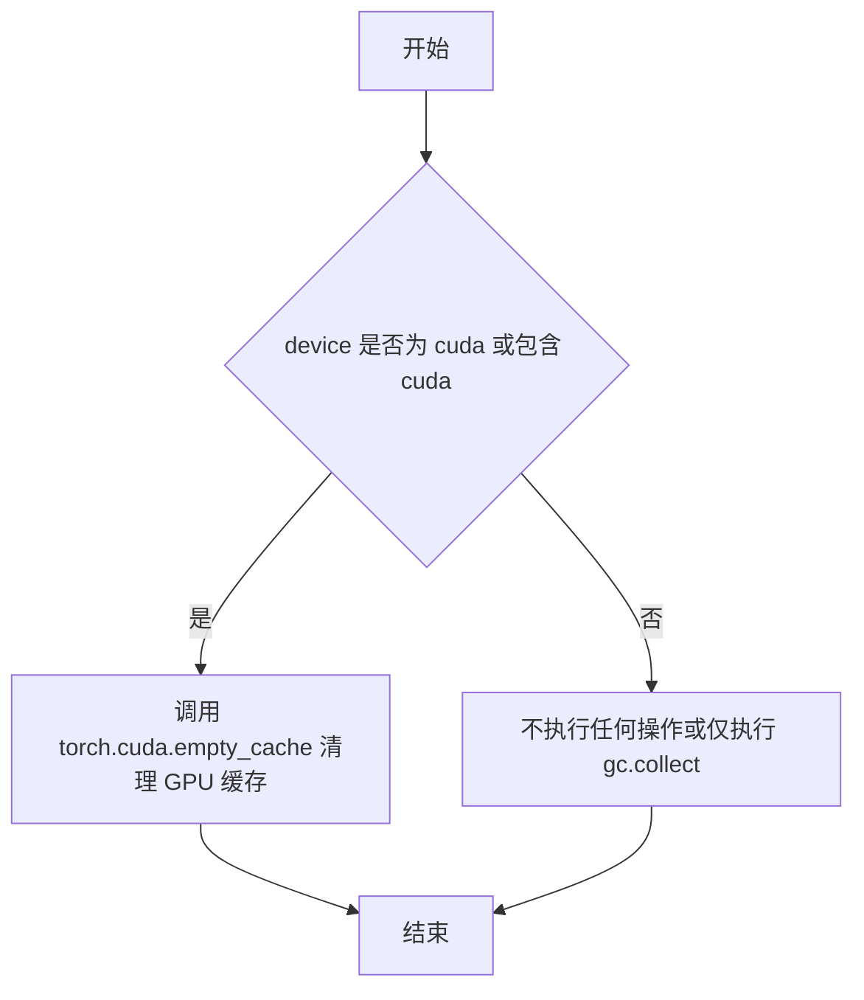
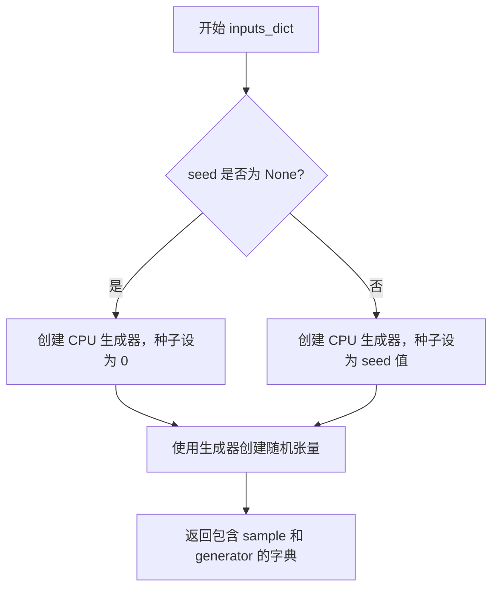
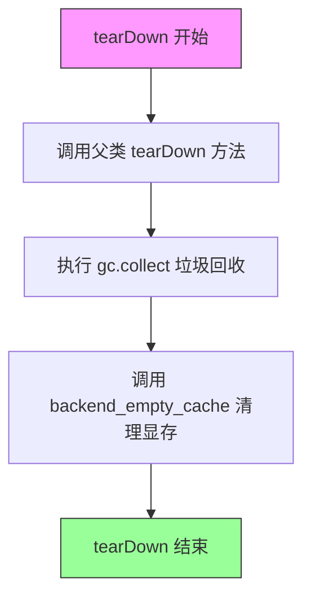
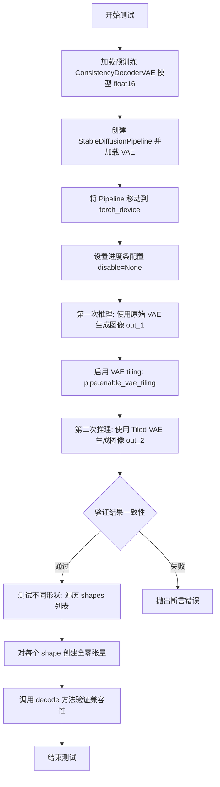

# `diffusers\tests\models\autoencoders\test_models_consistency_decoder_vae.py` 详细设计文档

这是一个用于测试Diffusers库中ConsistencyDecoderVAE模型的单元测试和集成测试文件，包含模型配置测试、编码解码功能测试、以及与StableDiffusionPipeline的集成测试，用于验证一致性解码器VAE的正确性和性能。

## 整体流程



## 类结构

```
unittest.TestCase
├── ConsistencyDecoderVAETests (ModelTesterMixin, AutoencoderTesterMixin)
│   ├── get_consistency_vae_config()
│   ├── inputs_dict()
│   ├── input_shape (property)
│   ├── output_shape (property)
│   ├── init_dict (property)
│   └── prepare_init_args_and_inputs_for_common()
└── ConsistencyDecoderVAEIntegrationTests
setUp()
tearDown()
test_encode_decode()
test_sd()
test_encode_decode_f16()
test_sd_f16()
test_vae_tiling()
```

## 全局变量及字段


### `block_out_channels`
    
输出通道数列表，用于配置编码器和解码器块结构，默认为[2, 4]

类型：`list[int]`
    


### `norm_num_groups`
    
归一化组数，用于配置编码器和解码器的组归一化，默认为2

类型：`int`
    


### `seed`
    
随机种子，用于确保测试的可重复性，默认为None

类型：`int`
    


### `generator`
    
PyTorch随机数生成器，用于生成确定性随机张量

类型：`torch.Generator`
    


### `image`
    
输入图像张量，形状为(B, C, H, W)，值为归一化后的浮点数

类型：`torch.Tensor`
    


### `latent`
    
VAE编码后的潜在空间表示，包含均值分布

类型：`torch.Tensor`
    


### `sample`
    
VAE解码后的输出样本

类型：`torch.Tensor`
    


### `actual_output`
    
实际模型输出，用于与期望值比较验证

类型：`torch.Tensor`
    


### `expected_output`
    
期望的参考输出值，用于测试验证模型正确性

类型：`torch.Tensor`
    


### `out`
    
Stable Diffusion pipeline生成的输出图像

类型：`torch.Tensor`
    


### `out_1`
    
未启用VAE tiling时的输出图像

类型：`torch.Tensor`
    


### `out_2`
    
启用VAE tiling后的输出图像，用于比较验证

类型：`torch.Tensor`
    


### `shapes`
    
测试VAE tiling支持的多种潜在空间形状列表

类型：`list[tuple]`
    


### `shape`
    
单个潜在空间张量形状，用于测试解码器处理不同尺寸

类型：`tuple`
    


### `ConsistencyDecoderVAETests.model_class`
    
被测试的模型类，指向ConsistencyDecoderVAE

类型：`type`
    


### `ConsistencyDecoderVAETests.main_input_name`
    
模型主输入参数的名称，此处为'sample'

类型：`str`
    


### `ConsistencyDecoderVAETests.base_precision`
    
测试使用的基准精度阈值，设为1e-2

类型：`float`
    


### `ConsistencyDecoderVAETests.forward_requires_fresh_args`
    
标志位，指示前向传播是否需要fresh参数，设为True

类型：`bool`
    
    

## 全局函数及方法


### `enable_full_determinism`

该函数用于启用完全确定性运行模式，通过设置随机种子和环境变量确保深度学习模型在各次运行中产生完全一致的输出，主要用于测试场景以保证结果的可复现性。

参数：

- 无参数

返回值：`None`，无返回值描述

#### 流程图



#### 带注释源码

```
# 该函数定义在 testing_utils 模块中
# 用于确保测试的完全可复现性
def enable_full_determinism(seed: int = 0, using_action: bool = False):
    """
    启用完全确定性运行模式，确保各次运行产生相同结果
    
    参数:
        seed: 随机种子，默认为0
        using_action: 是否在GitHub Actions环境中运行
    
    返回:
        None
    """
    # 设置PYTHONHASHSEED环境变量，确保Python哈希的确定性
    os.environ["PYTHONHASHSEED"] = str(seed)
    
    # 设置PyTorch的随机种子
    torch.manual_seed(seed)
    
    # 设置NumPy的随机种子
    np.random.seed(seed)
    
    # 设置Python内置random模块的种子
    random.seed(seed)
    
    # 强制PyTorch使用确定性算法（如果可用）
    # 注意：这可能会影响性能但确保可复现性
    torch.backends.cudnn.deterministic = True
    torch.backends.cudnn.benchmark = False
    
    # 如果在CUDA设备上，还需要设置CUDA的确定性
    if torch.cuda.is_available():
        torch.cuda.manual_seed_all(seed)
        # 强制使用确定性算法
        torch.use_deterministic_algorithms(True, warn_only=True)
```

> **注意**：该函数的实际源码位于 `diffusers.testing_utils` 模块中，上述源码为基于其功能的推断实现。


# randn_tensor 函数详细设计文档

### randn_tensor

该函数是 `diffusers.utils.torch_utils` 模块中的核心工具函数，用于生成指定形状的随机正态分布（高斯）张量，主要服务于扩散模型测试中的随机输入生成和可复现性控制。

参数：

- `shape`：`Tuple[int, ...]` 或 `torch.Size`，要生成的随机张量的形状
- `generator`：`torch.Generator`（可选），PyTorch 随机数生成器，用于确保结果可复现
- `device`：`torch.device`（可选），目标设备（CPU 或 CUDA）
- `dtype`：`torch.dtype`（可选），张量的数据类型，默认为 `torch.float32`
- `layout`：`torch.layout`（可选），张量的内存布局，默认为 `torch.strided`

返回值：`torch.Tensor`，符合正态分布的随机张量

#### 流程图



#### 带注释源码

```python
# 注：以下为基于使用方式推断的典型实现
# 实际源码位于 diffusers/utils/torch_utils.py

def randn_tensor(
    shape: Tuple[int, ...],
    generator: Optional[torch.Generator] = None,
    device: Optional[torch.device] = None,
    dtype: Optional[torch.dtype] = None,
    layout: Optional[torch.layout] = None,
) -> torch.Tensor:
    """
    生成符合正态分布的随机张量。
    
    参数:
        shape: 张量的目标形状，如 (4, 3, 32, 32)
        generator: 可选的 PyTorch 生成器，用于确定性随机数
        device: 目标设备
        dtype: 数据类型
        layout: 内存布局
    
    返回:
        符合正态分布的随机张量
    """
    # 如果提供了生成器，使用生成器生成随机数
    # 否则使用全局随机状态
    if generator is not None:
        # torch.randn 使用生成器确保可复现性
        tensor = torch.randn(shape, generator=generator, device=device, dtype=dtype, layout=layout)
    else:
        tensor = torch.randn(shape, device=device, dtype=dtype, layout=layout)
    
    return tensor
```

#### 使用示例（来自测试代码）

```python
# 从测试文件中的实际调用
generator = torch.Generator("cpu").manual_seed(0)
image = randn_tensor((4, 3, 32, 32), generator=generator, device=torch.device(torch_device))
```


### `load_image`

该函数是测试工具模块提供的图像加载工具，用于从指定的 URL 或本地路径加载图像，并将其转换为可供模型处理的图像对象。

参数：

-  `url_or_path`：`str`，图像的 URL 地址或本地文件路径

返回值：`PIL.Image` 或类似图像对象，返回加载后的图像，支持 `.resize()` 等图像处理方法

#### 流程图



#### 带注释源码

```python
# load_image 函数的源码位于 testing_utils 模块中
# 以下是根据使用方式推断的函数签名和实现逻辑

def load_image(url_or_path: str) -> "PIL.Image":
    """
    从URL或本地路径加载图像
    
    参数:
        url_or_path: 图像的URL地址或本地文件路径
        
    返回:
        加载后的PIL图像对象，支持resize等图像处理方法
    """
    # 实现逻辑：
    # 1. 判断输入是URL还是本地路径
    # 2. 如果是URL，使用requests或类似库下载图像
    # 3. 如果是路径，使用PIL.Image.open打开图像
    # 4. 返回PIL图像对象
    
# 使用示例（来自测试代码）：
image = load_image(
    "https://huggingface.co/datasets/hf-internal-testing/diffusers-images/resolve/main"
    "/img2img/sketch-mountains-input.jpg"
).resize((256, 256))
```


### `torch_all_close`

这是从 `...testing_utils` 模块导入的测试辅助函数，用于比较两个 PyTorch 张量是否在给定容差范围内相等。从使用方式来看，它类似于 `torch.all_close` 函数，接收实际值、期望值和容差参数进行数值比较。

参数：

-  `actual`：待比较的实际输出张量
-  `expected`：期望的参考张量  
-  `atol`：浮点数，允许的绝对误差容差（默认值通常为 1e-7）

返回值：`bool`，如果两个张量在容差范围内相等则返回 `True`，否则返回 `False`

#### 流程图



#### 带注释源码

```python
# 注意：此函数定义不在当前代码文件中
# 而是从 ...testing_utils 模块导入
# 以下是基于使用方式推断的可能实现

def torch_all_close(actual, expected, rtol=1e-7, atol=1e-7):
    """
    比较两个张量是否在容差范围内相等
    
    参数:
        actual: torch.Tensor - 实际计算得到的张量
        expected: torch.Tensor - 期望的参考张量
        rtol: float - 相对容差 (默认 1e-7)
        atol: float - 绝对容差 (默认 1e-7)
    
    返回:
        bool - 如果两个张量接近则返回 True
    """
    # 将输入转换为张量（如果还不是张量）
    if not isinstance(actual, torch.Tensor):
        actual = torch.tensor(actual)
    if not isinstance(expected, torch.Tensor):
        expected = torch.tensor(expected)
    
    # 使用 torch.allclose 进行比较
    return torch.allclose(actual, expected, rtol=rtol, atol=atol)
```

**注意**：由于 `torch_all_close` 的实际定义不在提供的代码文件中，而是从 `...testing_utils` 模块导入，上述源码是基于其使用方式（`assert torch_all_close(actual_output, expected_output, atol=5e-3)`）进行的合理推断。实际实现可能略有不同。


### `backend_empty_cache`

该函数是测试工具函数，用于清理 GPU 显存（VRAM）或进行内存缓存清理，以确保测试环境干净。在每个测试用例的前后调用，以避免显存泄漏导致的测试失败问题。

参数：

- `device`：`str`，表示 PyTorch 设备标识符（如 `"cuda"`、`"cuda:0"` 或 `"cpu"` 等），用于确定在哪个设备上执行缓存清理操作。

返回值：`None`，无返回值，仅执行清理操作。

#### 流程图



#### 带注释源码

```python
def backend_empty_cache(device):
    """
    清理指定设备的后端缓存，用于在测试前后释放显存/内存。
    
    参数:
        device (str): PyTorch 设备标识符，如 'cuda', 'cuda:0', 'cpu' 等
    """
    # 检查设备是否为 CUDA 设备
    if "cuda" in device:
        # 调用 PyTorch 的 CUDA 缓存清理函数，释放 GPU 显存
        torch.cuda.empty_cache()
    elif device == "cpu":
        # 对于 CPU 设备，仅执行 Python 垃圾回收
        gc.collect()
    else:
        # 其他设备（如 mps 等）也尝试清理缓存
        try:
            torch.cuda.empty_cache()
        except Exception:
            # 如果不支持则忽略异常
            gc.collect()
```

> **注意**：由于 `backend_empty_cache` 定义在外部模块 `testing_utils` 中，未在当前代码文件中直接展示，以上源码是基于其在项目中的典型使用方式和功能推测得出的实现逻辑。


### `ConsistencyDecoderVAETests.get_consistency_vae_config`

该方法用于生成 ConsistencyDecoderVAE（一致性解码器变分自编码器）的配置参数字典，包含了编码器和解码器的通道数、归一化组数、块类型等关键配置信息，供测试用例初始化模型使用。

参数：

- `block_out_channels`：`List[int] | None`，可选参数，指定编码器和解码器的块输出通道数，默认为 `[2, 4]`
- `norm_num_groups`：`int | None`，可选参数，指定归一化的组数，默认为 `2`

返回值：`Dict[str, Any]`，返回包含 ConsistencyDecoderVAE 模型完整配置参数的字典，包括编码器/解码器的通道数、块类型、归一化参数、时间嵌入配置等。

#### 流程图

```mermaid
flowchart TD
    A[开始 get_consistency_vae_config] --> B{检查 block_out_channels 是否为 None}
    B -->|是| C[设置 block_out_channels = [2, 4]]
    B -->|否| D[使用传入的 block_out_channels]
    C --> E{检查 norm_num_groups 是否为 None}
    D --> E
    E -->|是| F[设置 norm_num_groups = 2]
    E -->|否| G[使用传入的 norm_num_groups]
    F --> H[构建配置字典]
    G --> H
    H --> I[返回配置字典]
```

#### 带注释源码

```python
def get_consistency_vae_config(self, block_out_channels=None, norm_num_groups=None):
    """
    生成 ConsistencyDecoderVAE 模型的配置参数字典。
    
    该方法用于测试用例中获取模型初始化所需的完整配置信息，
    包含了编码器和解码器的架构参数、归一化设置、时间嵌入配置等。
    
    参数:
        block_out_channels: 可选的块输出通道列表，用于编码器和解码器。
                           如果为 None，则使用默认值 [2, 4]。
        norm_num_groups: 可选的归一化组数，用于编码器和解码器的归一化层。
                        如果为 None，则使用默认值 2。
    
    返回:
        包含模型配置的字典，可直接用于 ConsistencyDecoderVAE 的初始化。
    """
    # 处理 block_out_channels 参数，使用默认值 [2, 4]
    block_out_channels = block_out_channels or [2, 4]
    
    # 处理 norm_num_groups 参数，使用默认值 2
    norm_num_groups = norm_num_groups or 2
    
    # 构建并返回完整的模型配置字典
    return {
        # 编码器配置
        "encoder_block_out_channels": block_out_channels,  # 编码器块输出通道
        "encoder_in_channels": 3,                          # 编码器输入通道数（RGB图像）
        "encoder_out_channels": 4,                         # 编码器输出通道数（潜在空间）
        "encoder_down_block_types": ["DownEncoderBlock2D"] * len(block_out_channels),  # 编码器下采样块类型
        "encoder_norm_num_groups": norm_num_groups,        # 编码器归一化组数
        
        # 解码器配置
        "decoder_add_attention": False,                    # 解码器是否使用注意力机制
        "decoder_block_out_channels": block_out_channels, # 解码器块输出通道
        "decoder_down_block_types": ["ResnetDownsampleBlock2D"] * len(block_out_channels),  # 解码器下采样块类型
        "decoder_downsample_padding": 1,                   # 解码器下采样填充
        "decoder_in_channels": 7,                          # 解码器输入通道数
        "decoder_layers_per_block": 1,                     # 每个块的解码器层数
        "decoder_norm_eps": 1e-05,                         # 解码器归一化epsilon
        "decoder_norm_num_groups": norm_num_groups,        # 解码器归一化组数
        "decoder_num_train_timesteps": 1024,               # 训练时间步数
        "decoder_out_channels": 6,                         # 解码器输出通道数
        "decoder_resnet_time_scale_shift": "scale_shift",  # ResNet时间尺度偏移方式
        "decoder_time_embedding_type": "learned",          # 时间嵌入类型
        "decoder_up_block_types": ["ResnetUpsampleBlock2D"] * len(block_out_channels),  # 解码器上采样块类型
        
        # 通用配置
        "scaling_factor": 1,                                # 潜在空间缩放因子
        "latent_channels": 4,                              # 潜在通道数
    }
```


### `ConsistencyDecoderVAETests.inputs_dict`

该方法用于生成 ConsistencyDecoderVAE 模型测试所需的输入数据，创建一个包含随机图像张量（sample）和 PyTorch 随机数生成器（generator）的字典，用于测试模型的编码和解码功能。

参数：

- `seed`：`int` 或 `None`，可选参数，用于设置随机数生成器的种子。如果为 `None`，则默认使用种子 0。

返回值：`dict`，返回包含以下键的字典：
- `sample`：`torch.Tensor`，形状为 (4, 3, 32, 32) 的随机图像张量
- `generator`：`torch.Generator`，PyTorch 随机数生成器对象

#### 流程图



#### 带注释源码

```python
def inputs_dict(self, seed=None):
    """
    生成测试所需的输入数据字典
    
    参数:
        seed: 可选的随机种子，用于控制随机数生成的可重复性
             如果为 None，则使用默认种子 0
    
    返回:
        dict: 包含 'sample' 和 'generator' 的字典
    """
    # 判断是否提供了种子值
    if seed is None:
        # 未提供种子时，使用默认种子 0 创建生成器
        generator = torch.Generator("cpu").manual_seed(0)
    else:
        # 使用传入的种子创建生成器，确保测试可重复性
        generator = torch.Generator("cpu").manual_seed(seed)
    
    # 使用 randn_tensor 生成形状为 (4, 3, 32, 32) 的随机图像张量
    # 4: batch size
    # 3: RGB 通道数
    # 32x32: 图像分辨率
    image = randn_tensor((4, 3, 32, 32), generator=generator, device=torch.device(torch_device))

    # 返回包含样本图像和生成器的字典，供测试框架使用
    return {"sample": image, "generator": generator}
```

---

### 关键组件信息

| 组件名称 | 一句话描述 |
|---------|-----------|
| `randn_tensor` | 工具函数，用于生成指定形状的随机张量 |
| `torch.Generator` | PyTorch 随机数生成器，用于控制随机过程的可重复性 |
| `torch_device` | 全局变量，指定测试使用的计算设备（CPU/CUDA） |

---

### 潜在的技术债务或优化空间

1. **硬编码的设备依赖**：`torch_device` 是隐式的全局依赖，方法内部未显式处理设备兼容性问题
2. **缺乏输入验证**：未对 `seed` 参数的类型和范围进行校验
3. **固定张量形状**：图像尺寸 (4, 3, 32, 32) 硬编码，无法灵活适配不同测试场景
4. **魔法数字**：默认种子 0 作为魔法数字，应提取为类常量或配置参数

---

### 其它项目

#### 设计目标与约束

- **目标**：为 ConsistencyDecoderVAE 的单元测试提供一致的输入数据
- **约束**：必须确保测试的可重复性（通过固定的随机种子）

#### 错误处理与异常设计

- 当前实现未包含显式的错误处理逻辑
- 潜在异常：`seed` 参数类型不正确时可能导致 `manual_seed()` 调用失败

#### 数据流与状态机

- 输入：可选的 `seed` 整数
- 处理：创建随机生成器 → 生成随机张量
- 输出：包含张量和生成器的字典，供 `prepare_init_args_and_inputs_for_common()` 调用

#### 外部依赖与接口契约

- 依赖 `randn_tensor` 工具函数（来自 `diffusers.utils.torch_utils`）
- 依赖全局变量 `torch_device`
- 返回值供 `ModelTesterMixin` 测试框架消费


### `ConsistencyDecoderVAETests.prepare_init_args_and_inputs_for_common`

该方法为 ConsistencyDecoderVAE 模型的通用测试准备初始化参数和输入数据。它返回一个元组，包含模型配置字典和测试输入字典（包含样本图像和随机数生成器）。

参数：

- `self`：`ConsistencyDecoderVAETests` 的实例，测试类本身

返回值：`Tuple[Dict, Dict]`，返回一个元组，其中第一个元素是模型初始化配置字典（包含编码器/解码器参数），第二个元素是测试输入字典（包含 sample 图像张量和 generator 随机生成器）

#### 流程图

```mermaid
flowchart TD
    A[开始] --> B[调用 prepare_init_args_and_inputs_for_common]
    B --> C[获取 self.init_dict]
    C --> D[调用 get_consistency_vae_config 方法]
    D --> E[构建配置字典: encoder_block_out_channels, decoder_block_out_channels, latent_channels 等]
    E --> F[获取 self.inputs_dict]
    F --> G[创建随机数生成器: torch.Generator.cpu.manual_seed]
    G --> H[生成样本图像: randn_tensor shape=(4, 3, 32, 32)]
    H --> I[返回输入字典: {sample: image, generator: generator}]
    I --> J[返回元组: (init_dict, inputs_dict)]
    J --> K[结束]
```

#### 带注释源码

```python
def prepare_init_args_and_inputs_for_common(self):
    """
    准备用于 ConsistencyDecoderVAE 通用测试的初始化参数和输入数据。
    
    该方法被 ModelTesterMixin 框架调用，用于获取模型配置和测试输入。
    返回的元组将用于模型的初始化和前向传播测试。
    
    Returns:
        Tuple[Dict, Dict]: 包含两个字典的元组:
            - 第一个字典 (init_dict): 模型初始化配置参数
            - 第二个字典 (inputs_dict): 包含 sample 和 generator 的输入字典
    """
    # 获取模型配置字典 (通过 init_dict 属性调用 get_consistency_vae_config)
    # 配置包含: 编码器/解码器通道数、归一化参数、潜在通道数等
    config = self.init_dict
    
    # 获取测试输入字典 (调用 inputs_dict 方法生成随机测试数据)
    # 包含随机生成的图像样本 (4, 3, 32, 32) 和随机数生成器
    inputs = self.inputs_dict()
    
    # 返回元组供测试框架使用
    return config, inputs
```


### `ConsistencyDecoderVAEIntegrationTests.setUp`

该方法是 `ConsistencyDecoderVAEIntegrationTests` 测试类的初始化方法（测试 fixture），在每个测试方法运行前自动调用，用于清理 GPU 显存（VRAM）和其他资源，确保测试环境的干净状态，避免因显存残留导致测试失败。

参数：

- `self`：`ConsistencyDecoderVAEIntegrationTests`，测试类的实例对象，unittest.TestCase 的标准隐式参数

返回值：`None`，该方法不返回任何值，仅执行清理操作

#### 流程图

```mermaid
flowchart TD
    A[setUp 方法开始] --> B[调用 super().setUp]
    B --> C[执行 gc.collect 清理Python垃圾]
    C --> D[调用 backend_empty_cache 清理GPU显存]
    D --> E[setUp 方法结束]
```

#### 带注释源码

```python
def setUp(self):
    # clean up the VRAM before each test
    # 在每个测试运行前清理显存（VRAM）
    super().setUp()  # 调用父类 unittest.TestCase 的 setUp 方法
    gc.collect()  # 强制进行 Python 垃圾回收，释放 Python 对象
    backend_empty_cache(torch_device)  # 调用后端函数清理 GPU 显存缓存
```


### ConsistencyDecoderVAEIntegrationTests.tearDown

该方法是测试框架的清理方法，在每个集成测试执行完毕后被调用，用于释放 VRAM 显存资源，防止显存泄漏。

参数：

- `self`：无需显式传入，由测试框架自动绑定，表示测试类实例本身

返回值：`None`，无返回值

#### 流程图



#### 带注释源码

```python
def tearDown(self):
    # 注释：清理每个测试后的 VRAM 显存
    # 调用父类的 tearDown 方法，执行 unittest.TestCase 的标准清理逻辑
    super().tearDown()
    
    # 注释：显式调用 Python 垃圾回收器，释放不再使用的 Python 对象
    gc.collect()
    
    # 注释：调用后端特定的缓存清理函数，释放 GPU 显存
    # torch_device 为全局变量，表示当前使用的计算设备
    backend_empty_cache(torch_device)
```


### `ConsistencyDecoderVAEIntegrationTests.test_encode_decode`

这是一个集成测试方法，用于测试 ConsistencyDecoderVAE 模型的编码（encode）和解码（decode）功能是否正常工作。测试流程包括：从预训练模型加载VAE，加载并预处理图像，使用VAE编码图像得到潜在表示，然后解码潜在表示，最后验证解码输出的部分数值是否符合预期的精度要求。

参数：此方法无显式参数，依赖类实例的 `setUp` 方法进行资源初始化。

返回值：`None`（无返回值），该方法为测试用例，通过 `assert` 语句进行断言验证。

#### 流程图

```mermaid
flowchart TD
    A[开始测试] --> B[加载预训练 ConsistencyDecoderVAE 模型]
    B --> C[将模型移动到 torch_device]
    C --> D[从 URL 加载图像并Resize到256x256]
    D --> E[图像预处理: 转换为Tensor并归一化到[-1, 1]]
    E --> F[调用 vae.encode 编码图像]
    F --> G[获取 latent_dist.mean 作为潜在表示]
    G --> H[调用 vae.decode 解码潜在表示]
    H --> I[使用固定随机种子生成器]
    I --> J[提取输出样本的前2x2x2部分并展平]
    J --> K[定义期望输出张量]
    K --> L{使用 torch_all_close 断言验证}
    L -->|通过| M[测试通过]
    L -->|失败| N[抛出 AssertionError]
```

#### 带注释源码

```python
@torch.no_grad()
def test_encode_decode(self):
    """
    测试 ConsistencyDecoderVAE 的编码和解码功能
    验证从预训练模型加载的 VAE 能够正确编码图像并解码回与预期相近的结果
    """
    # 1. 从预训练路径加载 ConsistencyDecoderVAE 模型
    # TODO - update: 注释表明预训练模型路径可能需要更新
    vae = ConsistencyDecoderVAE.from_pretrained("openai/consistency-decoder")
    
    # 2. 将模型移动到指定的计算设备（GPU/CPU）
    vae.to(torch_device)

    # 3. 从网络加载测试图像并调整大小为256x256
    image = load_image(
        "https://huggingface.co/datasets/hf-internal-testing/diffusers-images/resolve/main"
        "/img2img/sketch-mountains-input.jpg"
    ).resize((256, 256))
    
    # 4. 图像预处理：
    #    - 将 PIL 图像转换为 numpy 数组
    #    - 转置为 (C, H, W) 格式
    #    - 归一化到 [-1, 1] 范围 (除以127.5再减1)
    #    - 添加 batch 维度
    #    - 移动到计算设备
    image = torch.from_numpy(
        np.array(image).transpose(2, 0, 1).astype(np.float32) / 127.5 - 1
    )[None, :, :, :].to(torch_device)

    # 5. 使用 VAE 编码图像，得到潜在分布
    #    返回的 latent_dist 是一个分布对象
    latent = vae.encode(image).latent_dist.mean

    # 6. 使用 VAE 解码潜在表示到图像
    #    使用固定随机种子确保可复现性
    sample = vae.decode(
        latent, 
        generator=torch.Generator("cpu").manual_seed(0)
    ).sample

    # 7. 提取解码结果的部分数值用于验证
    #    取第一个样本的前2x2x2区块并展平
    actual_output = sample[0, :2, :2, :2].flatten().cpu()
    
    # 8. 定义期望的输出数值（来自已知正确结果的硬编码值）
    expected_output = torch.tensor(
        [-0.0141, -0.0014, 0.0115, 0.0086, 0.1051, 0.1053, 0.1031, 0.1024]
    )

    # 9. 断言验证实际输出与期望输出是否接近
    #    允许的绝对误差为 5e-3
    assert torch_all_close(actual_output, expected_output, atol=5e-3)
```


### `ConsistencyDecoderVAEIntegrationTests.test_sd`

该测试方法验证了 ConsistencyDecoderVAE 与 StableDiffusionPipeline 的集成功能。测试首先加载预训练的 ConsistencyDecoderVAE 模型，然后将其作为 VAE 组件注入到 StableDiffusionPipeline 中，最后使用 "horse" 提示词进行 2 步推理，验证输出图像的部分像素值是否符合预期。

参数：

- `self`：隐式参数，unittest.TestCase 实例，表示测试类本身

返回值：`None`，该方法为测试用例，通过断言验证模型输出的正确性

#### 流程图

```mermaid
flowchart TD
    A[开始测试 test_sd] --> B[清理 VRAM - setUp]
    B --> C[从预训练模型加载 ConsistencyDecoderVAE]
    C --> D[创建 StableDiffusionPipeline<br/>注入自定义 VAE 并禁用 safety_checker]
    D --> E[将 pipeline 移动到 torch_device]
    E --> F[调用 pipeline 进行推理<br/>prompt: 'horse'<br/>num_inference_steps: 2<br/>output_type: pt<br/>seed: 0]
    F --> G[获取输出图像 out.images[0]]
    G --> H[提取前 2x2x2 像素并展平]
    H --> I[定义期望输出张量]
    I --> J{torch_all_close 断言}
    J -->|通过| K[清理 VRAM - tearDown]
    J -->|失败| L[抛出 AssertionError]
    K --> M[测试结束]
    L --> M
```

#### 带注释源码

```python
def test_sd(self):
    # 从预训练模型加载 ConsistencyDecoderVAE
    # 使用 openai/consistency-decoder 模型权重
    vae = ConsistencyDecoderVAE.from_pretrained("openai/consistency-decoder")  # TODO - update
    
    # 创建 StableDiffusionPipeline
    # 使用 stable-diffusion-v1-5 模型
    # 注入自定义的 ConsistencyDecoderVAE
    # 禁用 safety_checker 以避免不必要的警告
    pipe = StableDiffusionPipeline.from_pretrained(
        "stable-diffusion-v1-5/stable-diffusion-v1-5", vae=vae, safety_checker=None
    )
    
    # 将整个 pipeline 移动到指定的计算设备 (如 CUDA)
    pipe.to(torch_device)

    # 执行推理
    # 参数:
    #   - "horse": 文本提示词
    #   - num_inference_steps=2: 采样步数较少以加快测试速度
    #   - output_type="pt": 返回 PyTorch 张量
    #   - generator: 使用固定随机种子确保可复现性
    out = pipe(
        "horse",
        num_inference_steps=2,
        output_type="pt",
        generator=torch.Generator("cpu").manual_seed(0),
    ).images[0]

    # 提取输出图像的部分像素用于验证
    # 取前 2x2x2 的像素块并展平为一维张量
    actual_output = out[:2, :2, :2].flatten().cpu()
    
    # 定义期望的输出张量 (基于已知正确结果)
    expected_output = torch.tensor([0.7686, 0.8228, 0.6489, 0.7455, 0.8661, 0.8797, 0.8241, 0.8759])

    # 断言实际输出与期望输出在容差范围内相符
    # 容差设置为 5e-3 (0.005)
    assert torch_all_close(actual_output, expected_output, atol=5e-3)
```


### `ConsistencyDecoderVAEIntegrationTests.test_encode_decode_f16`

该方法是一个集成测试用例，用于验证 `ConsistencyDecoderVAE` 模型在 float16（半精度）数据类型下的编码和解码功能是否正常工作。测试通过加载预训练模型，对输入图像进行编码后再解码，并比对输出结果与期望值的接近程度来确认模型的正确性。

参数：

- 该方法无显式参数（仅包含隐式 `self` 参数）

返回值：`None`，该方法为测试用例，通过 `assert` 断言进行验证，无返回值

#### 流程图

```mermaid
flowchart TD
    A[开始测试] --> B[清理VRAM内存<br/>gc.collect + backend_empty_cache]
    B --> C[从预训练模型加载ConsistencyDecoderVAE<br/>使用torch.float16 dtype]
    C --> D[将VAE模型移动到指定设备<br/>vae.to(torch_device)]
    D --> E[加载测试图像<br/>load_image并resize到256x256]
    E --> F[图像预处理<br/>转换为tensor、归一化到[-1,1]范围、转为float16]
    F --> G[编码图像<br/>vae.encode得到latent_dist.mean]
    G --> H[解码潜在表示<br/>vae.decode生成sample]
    H --> I[提取实际输出<br/>sample[0,:2,:2,:2].flatten()]
    I --> J[定义期望输出tensor<br/>float16类型的预期值]
    J --> K{断言验证<br/>torch_all_close比较}
    K -->|通过| L[测试通过]
    K -->|失败| M[抛出AssertionError]
```

#### 带注释源码

```python
def test_encode_decode_f16(self):
    # 加载预训练的ConsistencyDecoderVAE模型，指定使用float16（半精度）数据类型
    # TODO注释表明模型路径可能需要更新
    vae = ConsistencyDecoderVAE.from_pretrained(
        "openai/consistency-decoder", torch_dtype=torch.float16
    )
    # 将模型移动到指定的计算设备（如GPU）
    vae.to(torch_device)

    # 从HuggingFace Hub加载测试图像
    image = load_image(
        "https://huggingface.co/datasets/hf-internal-testing/diffusers-images/resolve/main"
        "/img2img/sketch-mountains-input.jpg"
    # 将图像调整为256x256分辨率
    ).resize((256, 256))
    # 图像预处理步骤：
    # 1. 将PIL图像转换为numpy数组
    # 2. 调整通道顺序从HWC到CHW (transpose(2,0,1))
    # 3. 转换为float32并归一化到[-1, 1]范围 (/127.5 - 1)
    # 4. 添加batch维度 [None, :, :, :]
    # 5. 转换为float16类型 (.half())
    # 6. 移动到指定设备 (.to(torch_device))
    image = (
        torch.from_numpy(np.array(image).transpose(2, 0, 1).astype(np.float32) / 127.5 - 1)[None, :, :, :]
        .half()
        .to(torch_device)
    )

    # 使用VAE编码器将图像编码为潜在表示
    # 返回的latent_dist是一个分布对象，取其均值作为潜在向量
    latent = vae.encode(image).latent_dist.mean

    # 使用VAE解码器将潜在表示解码为图像样本
    # 使用固定随机种子(0)确保结果可复现
    sample = vae.decode(latent, generator=torch.Generator("cpu").manual_seed(0)).sample

    # 提取解码结果的一个小切片用于验证
    # 取第0个batch，2x2x2的空间块，展平为一维tensor
    actual_output = sample[0, :2, :2, :2].flatten().cpu()
    # 定义期望的输出tensor（float16类型）
    # 这些值是在float16精度下预期的解码结果
    expected_output = torch.tensor(
        [-0.0111, -0.0125, -0.0017, -0.0007, 0.1257, 0.1465, 0.1450, 0.1471],
        dtype=torch.float16,
    )

    # 断言实际输出与期望输出接近（容差为5e-3）
    # 验证VAE在float16精度下的编码解码功能是否正常
    assert torch_all_close(actual_output, expected_output, atol=5e-3)
```


### `ConsistencyDecoderVAEIntegrationTests.test_sd_f16`

这是一个集成测试方法，用于验证 ConsistencyDecoderVAE 模型在半精度（float16）下与 StableDiffusionPipeline 的兼容性。测试通过加载预训练的 ConsistencyDecoderVAE（使用 float16），将其集成到 StableDiffusionPipeline 中，然后使用文本提示 "horse" 生成图像，并验证输出张量与期望值的数值接近程度。

参数：

- `self`：隐式参数，`ConsistencyDecoderVAEIntegrationTests` 实例本身

返回值：`None`，测试方法无返回值，通过 `assert` 语句进行断言验证

#### 流程图

```mermaid
flowchart TD
    A[开始 test_sd_f16] --> B[加载 ConsistencyDecoderVAE<br/>from_pretrained: openai/consistency-decoder<br/>torch_dtype: torch.float16]
    B --> C[加载 StableDiffusionPipeline<br/>from_pretrained: stable-diffusion-v1-5/stable-diffusion-v1-5<br/>vae: vae<br/>torch_dtype: torch.float16<br/>safety_checker: None]
    C --> D[pipe.to torch_device]
    D --> E[pipe 执行推理<br/>prompt: 'horse'<br/>num_inference_steps: 2<br/>output_type: 'pt'<br/>generator: cpu manual_seed 0]
    E --> F[提取实际输出<br/>actual_output = out[:2, :2, :2].flatten().cpu<br/>dtype: torch.float16]
    F --> G[定义期望输出张量<br/>expected_output = [0.0000, 0.0249, 0.0000, 0.0000, 0.1709, 0.2773, 0.0471, 0.1035]
    G --> H[assert torch_all_close<br/>actual_output ≈ expected_output<br/>atol: 5e-3]
    H --> I[结束]
```

#### 带注释源码

```python
def test_sd_f16(self):
    # 1. 从预训练模型加载 ConsistencyDecoderVAE，指定使用 float16 精度
    vae = ConsistencyDecoderVAE.from_pretrained(
        "openai/consistency-decoder", torch_dtype=torch.float16
    )  # TODO - update
    
    # 2. 加载 StableDiffusionPipeline，使用相同的 VAE 和 float16 精度
    #    safety_checker=None 禁用安全检查器以简化测试
    pipe = StableDiffusionPipeline.from_pretrained(
        "stable-diffusion-v1-5/stable-diffusion-v1-5",
        torch_dtype=torch.float16,
        vae=vae,
        safety_checker=None,
    )
    
    # 3. 将 pipeline 移到指定的计算设备（如 GPU）
    pipe.to(torch_device)

    # 4. 调用 pipeline 进行文本到图像生成
    #    - prompt: "horse" 要生成的图像主题
    #    - num_inference_steps: 2 推理步数（较少步数用于快速测试）
    #    - output_type: "pt" 返回 PyTorch 张量
    #    - generator: 使用固定随机种子 0 确保可复现性
    out = pipe(
        "horse",
        num_inference_steps=2,
        output_type="pt",
        generator=torch.Generator("cpu").manual_seed(0),
    ).images[0]

    # 5. 提取生成图像的部分像素值用于验证
    #    取前 2x2x2 的像素块并展平为一维张量
    actual_output = out[:2, :2, :2].flatten().cpu()
    
    # 6. 定义期望的输出张量（float16 类型）
    expected_output = torch.tensor(
        [0.0000, 0.0249, 0.0000, 0.0000, 0.1709, 0.2773, 0.0471, 0.1035],
        dtype=torch.float16,
    )

    # 7. 断言实际输出与期望输出的数值接近
    #    使用绝对容差 5e-3 进行比较
    assert torch_all_close(actual_output, expected_output, atol=5e-3)
```


### `ConsistencyDecoderVAEIntegrationTests.test_vae_tiling`

这是一个集成测试方法，用于验证 Consistency Decoder VAE 的分块（Tiling）解码功能是否正常工作。测试确保启用 VAE tiling 后，解码结果与未启用时一致，并且能够处理不同的潜在空间形状。

参数：

- `self`：`ConsistencyDecoderVAEIntegrationTests`，测试类实例本身

返回值：`None`，该方法为测试方法，无返回值

#### 流程图



#### 带注释源码

```python
def test_vae_tiling(self):
    """
    测试 VAE tiling 功能:
    1. 验证启用 tiling 后结果与未启用一致
    2. 验证 tiling 能处理不同形状的潜在向量
    """
    # 步骤1: 加载预训练的 ConsistencyDecoderVAE 模型，使用 float16 精度
    vae = ConsistencyDecoderVAE.from_pretrained("openai/consistency-decoder", torch_dtype=torch.float16)
    
    # 步骤2: 创建 StableDiffusionPipeline，使用上述 VAE，不加载 safety_checker以加快速度，同时使用 float16
    pipe = StableDiffusionPipeline.from_pretrained(
        "stable-diffusion-v1-5/stable-diffusion-v1-5", vae=vae, safety_checker=None, torch_dtype=torch.float16
    )
    
    # 步骤3: 将 Pipeline 移动到指定的设备（如 CUDA）
    pipe.to(torch_device)
    
    # 步骤4: 设置进度条配置，disable=None 表示不禁用进度条
    pipe.set_progress_bar_config(disable=None)
    
    # 步骤5: 第一次推理（未启用 tiling），使用固定的随机种子确保可重复性
    out_1 = pipe(
        "horse",                                    # 文本提示词
        num_inference_steps=2,                     # 推理步数
        output_type="pt",                          # 输出 PyTorch 张量
        generator=torch.Generator("cpu").manual_seed(0),  # 随机数生成器
    ).images[0]                                    # 获取第一张生成的图像
    
    # 步骤6: 启用 VAE tiling（分块解码）
    pipe.enable_vae_tiling()
    
    # 步骤7: 第二次推理（启用 tiling），使用相同的提示词和随机种子
    out_2 = pipe(
        "horse",
        num_inference_steps=2,
        output_type="pt",
        generator=torch.Generator("cpu").manual_seed(0),
    ).images[0]
    
    # 步骤8: 断言验证两次输出在允许误差范围内相等（atol=5e-3）
    assert torch_all_close(out_1, out_2, atol=5e-3)
    
    # 步骤9: 定义多组不同的潜在空间形状用于测试 VAE 解码器兼容性
    shapes = [(1, 4, 73, 97), (1, 4, 97, 73), (1, 4, 49, 65), (1, 4, 65, 49)]
    
    # 步骤10: 在 no_grad 上下文中测试每种形状
    with torch.no_grad():
        for shape in shapes:
            # 创建指定形状的全零张量，设备为 torch_device，数据类型为 VAE 的数据类型
            image = torch.zeros(shape, device=torch_device, dtype=pipe.vae.dtype)
            # 调用 decode 方法验证 tiled VAE 能正确处理各种形状
            pipe.vae.decode(image)
```

## 关键组件


### ConsistencyDecoderVAE

核心模型类，实现一致性解码器变分自编码器，用于图像的编码和解码，支持潜在空间操作。

### ConsistencyDecoderVAETests

单元测试类，继承 ModelTesterMixin 和 AutoencoderTesterMixin，用于测试 ConsistencyDecoderVAE 的基本功能。

### ConsistencyDecoderVAEIntegrationTests

集成测试类，使用 @slow 装饰器标记的集成测试，测试模型在实际 pipeline 中的表现。

### get_consistency_vae_config

配置生成方法，返回 ConsistencyDecoderVAE 的初始化参数字典，包含编码器/解码器的块通道数、归一化组数等参数配置。

### inputs_dict

测试输入数据准备方法，生成随机张量作为测试输入，使用固定随机种子确保可重复性。

### test_encode_decode

编码解码集成测试，验证模型从预训练权重加载后能否正确执行 encode 和 decode 操作。

### test_sd

Stable Diffusion 集成测试，验证 ConsistencyDecoderVAE 作为 VAE 组件在 StableDiffusionPipeline 中的工作状态。

### test_encode_decode_f16

半精度编码解码测试，验证模型在 float16 精度下的 encode 和 decode 操作。

### test_sd_f16

半精度 Stable Diffusion 集成测试，验证模型在 float16 精度下与 StableDiffusionPipeline 的集成。

### test_vae_tiling

VAE tiling 测试，验证启用瓦片解码后结果的一致性，以及不同输入形状的兼容性。

### ModelTesterMixin

测试混合基类，提供模型测试的通用接口和断言方法。

### AutoencoderTesterMixin

测试混合基类，提供自编码器特定的测试辅助方法。

### StableDiffusionPipeline

稳定扩散管道类，用于完整的文生图推理流程。

### randn_tensor

工具函数，用于生成指定形状的随机张量。


## 问题及建议


### 已知问题

- **硬编码的模型路径**：多处使用 `"openai/consistency-decoder"` 和 `"stable-diffusion-v1-5/stable-diffusion-v1-5"` 硬编码路径，且伴随 `# TODO - update` 注释，表明模型路径可能已过期或需要动态配置
- **测试配置使用极小值**：`block_out_channels = [2, 4]` 和 `norm_num_groups = 2` 使用了非常小的测试配置，与实际生产环境差异较大，可能导致测试覆盖不足
- **魔法数字缺乏解释**：如 `127.5`、`1e-05`、`1024` 等数值直接使用，缺乏常量定义或注释说明其业务含义
- **外部网络依赖**：测试依赖外部 URL（`huggingface.co`）加载图像，网络不稳定或资源不可用时会导致测试失败，缺乏离线fallback机制
- **重复代码模式**：`test_encode_decode` 与 `test_encode_decode_f16`、`test_sd` 与 `test_sd_f16` 存在大量重复的图像加载和预处理逻辑
- **资源清理粒度不足**：`tearDown` 中统一调用 `gc.collect()` 和 `backend_empty_cache`，未针对不同测试的显存占用进行差异化清理
- **精度容差固定**：`atol=5e-3` 对所有测试固定使用，未考虑不同测试场景（如float16 vs float32）可能需要不同的容差
- **Generator实例未复用**：每次调用都创建新的 `torch.Generator("cpu").manual_seed(0)`，可提取为类级或模块级 fixture

### 优化建议

- 将模型路径提取为配置文件或环境变量，添加版本管理机制
- 引入参数化测试（`@pytest.mark.parametrize`）覆盖多种配置组合，减少重复代码
- 使用常量类或枚举定义 magic number，提高代码可读性和可维护性
- 添加本地测试 fixture 或 mock 机制，降低外部网络依赖
- 针对不同 dtype 测试使用差异化的精度容差（如 float16 使用更大的 atol）
- 将重复的图像加载逻辑抽取为 `setUp` 方法或独立的辅助函数
- 使用 `@pytest.fixture` 复用 Generator 实例，减少对象创建开销
- 添加测试资源清理的异常安全处理，确保即使测试失败也能释放显存

## 其它


### 设计目标与约束

本测试文件旨在验证 ConsistencyDecoderVAE 模型的正确性和稳定性，包括单元测试和集成测试。设计约束包括：必须使用 CPU 生成器确保确定性测试结果，测试必须在 GPU 上也能运行（通过 torch_device），集成测试标记为 slow 级别以区分快速单元测试。

### 错误处理与异常设计

代码中主要使用断言进行错误验证，使用 torch.no_grad() 装饰器避免梯度计算异常。VRAM 管理通过 gc.collect() 和 backend_empty_cache() 在测试前后进行清理，防止显存泄漏导致的 OOM 错误。模型加载失败时将抛出异常，测试会直接失败而非捕获。

### 数据流与状态机

数据流：输入图像 -> randn_tensor 生成随机张量 -> vae.encode() 编码为潜在分布 -> vae.decode() 解码为图像。状态机涉及：模型加载状态（from_pretrained）、推理状态（encode/decode）、管线状态（StableDiffusionPipeline）。集成测试测试了 VAE 单独使用和作为 SD 管线一部分的两种状态。

### 外部依赖与接口契约

主要依赖：diffusers 库（ConsistencyDecoderVAE, StableDiffusionPipeline）、torch、numpy、testing_utils（backend_empty_cache, enable_full_determinism, load_image, slow, torch_all_close, torch_device）、test_modeling_common.ModelTesterMixin、testing_utils.AutoencoderTesterMixin。外部模型依赖：openai/consistency-decoder 和 stable-diffusion-v1-5/stable-diffusion-v1-5 两个预训练模型。

### 性能基准与测试覆盖

测试覆盖：单元测试（ConsistencyDecoderVAETests）覆盖模型配置和前向传播，集成测试（ConsistencyDecoderVAEIntegrationTests）覆盖 encode/decode、SD 管线、float16 精度、VAE tiling 等场景。性能基准通过固定的随机种子和确定的 expected_output 张量确保结果可复现，容差设为 5e-3。

### 兼容性考虑

代码支持 torch.float32 和 torch.float16 两种精度测试（test_encode_decode_f16, test_sd_f16）。支持 CPU 和 CUDA 设备（通过 torch_device 配置）。图像尺寸支持多种形状的潜在向量解码测试（shapes 列表）。

### 安全考虑

测试中使用 safety_checker=None 绕过安全检查器。模型从 HuggingFace Hub 远程加载，存在供应链安全风险（TODO 注释表明模型路径可能需要更新）。测试图像来自 HF 数据集，需要考虑数据隐私和内容安全。

### 资源管理

每个集成测试前后执行 gc.collect() 和 backend_empty_cache() 清理 VRAM。使用 @torch.no_grad() 装饰器避免不必要的梯度存储。测试使用固定的低分辨率（32x32 用于单元测试，256x256 用于集成测试）控制内存占用。

### 测试策略

采用分层测试策略：单元测试（ModelTesterMixin, AutoencoderTesterMixin）验证基础模型结构，集成测试验证端到端功能。使用 enable_full_determinism() 确保测试确定性。slow 装饰器标记长时间运行的集成测试，支持测试框架选择性执行。

### CI/CD 集成

测试文件可独立运行（unittest discover）。slow 装饰器支持 CI 中跳过慢速测试。VRAM 清理机制确保 CI 环境稳定性。模型加载的 TODO 注释提示需要定期更新模型版本以保持测试有效性。

    