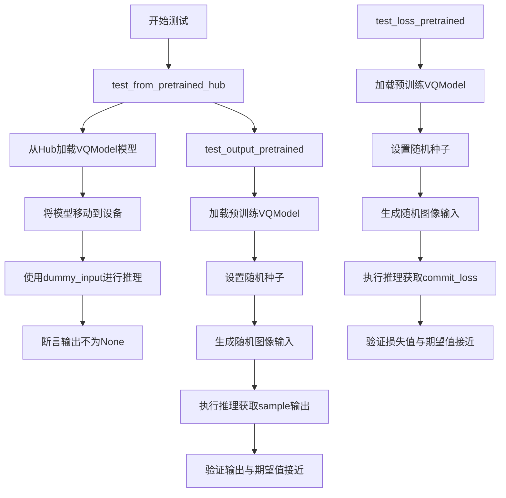
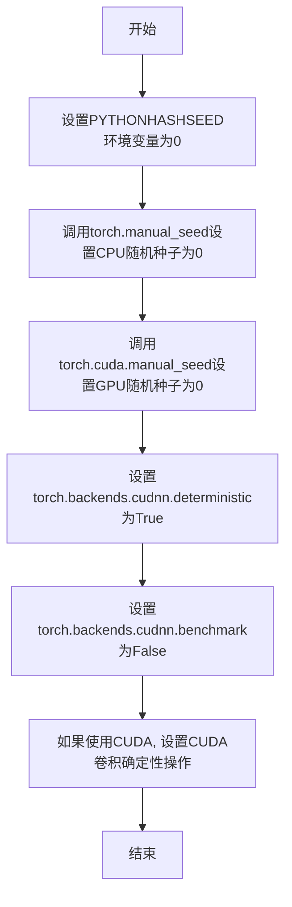
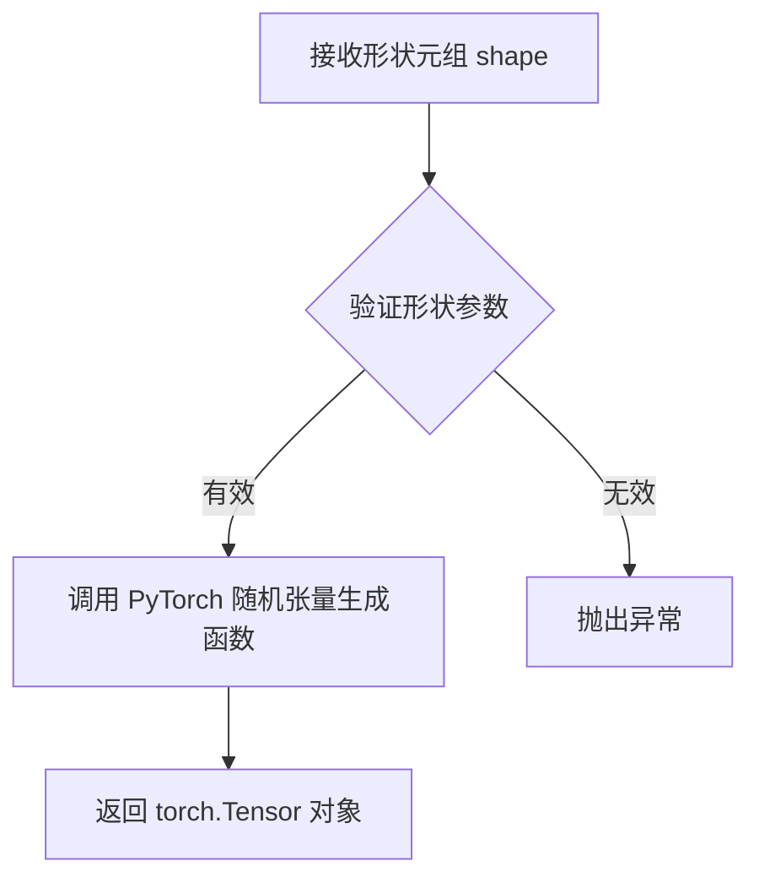
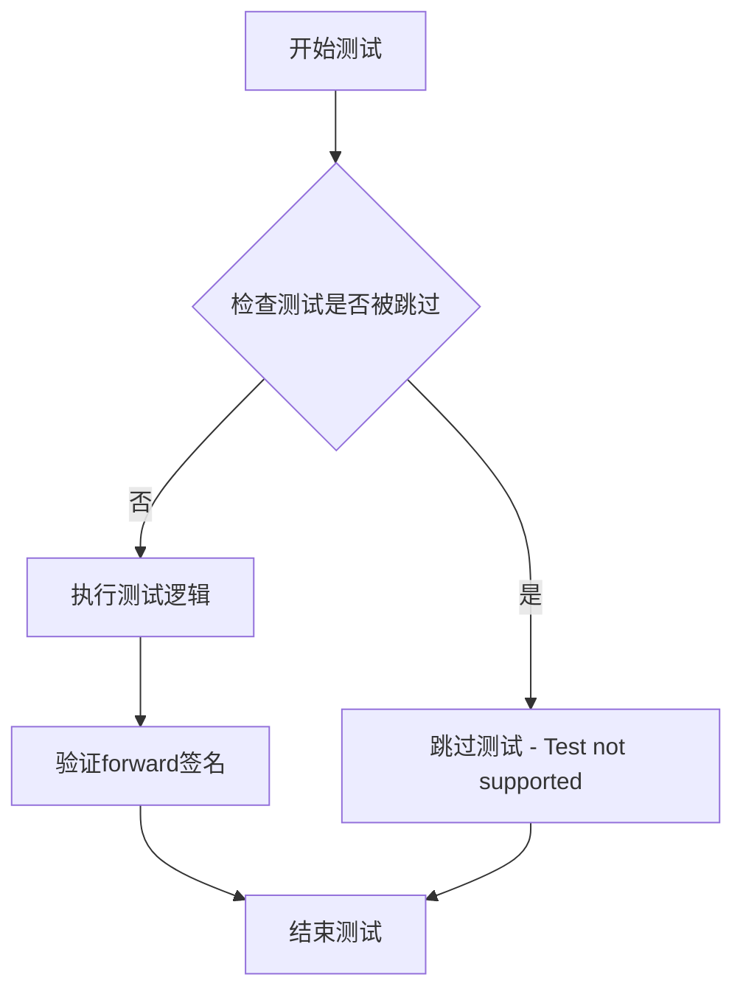
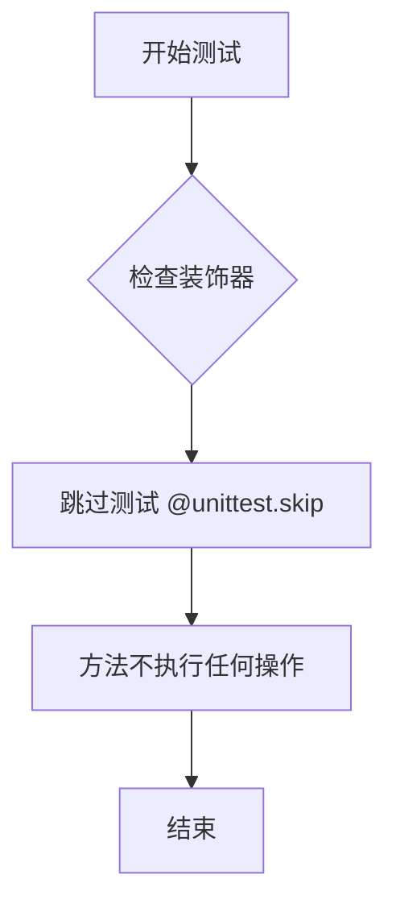

# `diffusers\tests\models\autoencoders\test_models_vq.py` 详细设计文档

这是一个针对diffusers库中VQModel（变分量化自编码器）的单元测试文件，用于验证VQModel从预训练模型加载、推理输出和损失计算的正确性。

## 整体流程



## 类结构

```
unittest.TestCase
└── VQModelTests (继承 ModelTesterMixin, AutoencoderTesterMixin)
```

## 全局变量及字段


### `torch`
    
PyTorch深度学习库模块，用于张量运算和神经网络构建

类型：`Module`
    


### `torch_device`
    
指定计算设备（通常为'cpu'或'cuda'），用于模型和数据的位置

类型：`str`
    


### `VQModelTests.model_class`
    
指定测试类使用的模型类为VQModel，用于模型实例化

类型：`Type[VQModel]`
    


### `VQModelTests.main_input_name`
    
模型主输入参数的名称，此处为'sample'，对应模型的图像输入

类型：`str`
    
    

## 全局函数及方法


### `enable_full_determinism`

该函数用于启用PyTorch的完全确定性模式，通过设置所有随机种子和环境变量确保每次运行产生完全相同的结果，以支持可重复的科学实验和调试。

参数：
- 该函数无参数

返回值：`None`，无返回值（直接修改全局状态）

#### 流程图



#### 带注释源码

```
# enable_full_determinism 函数源码（基于函数名和用途推断）
# 实际定义在 ...testing_utils 模块中

def enable_full_determinism():
    """
    启用完全确定性模式，确保每次运行产生完全相同的结果。
    
    该函数通过以下方式实现确定性：
    1. 设置PYTHONHASHSEED环境变量
    2. 设置PyTorch的随机种子（CPU和GPU）
    3. 禁用CuDNN的自动优化（benchmark=False）
    4. 强制使用确定性算法（deterministic=True）
    
    注意：这可能会导致性能下降，因为确定性算法通常比非确定性算法慢。
    """
    import os
    import torch
    
    # 设置Python哈希种子
    os.environ["PYTHONHASHSEED"] = "0"
    
    # 设置PyTorch CPU随机种子
    torch.manual_seed(0)
    
    # 设置PyTorch GPU随机种子（如果可用）
    if torch.cuda.is_available():
        torch.cuda.manual_seed(0)
        torch.cuda.manual_seed_all(0)  # 如果使用多GPU
    
    # 禁用CuDNN自动优化，强制使用确定性算法
    torch.backends.cudnn.deterministic = True
    torch.backends.cudnn.benchmark = False
    
    # 启用PyTorch 1.8+的确定性GPU操作
    if hasattr(torch, 'use_deterministic_algorithms'):
        try:
            torch.use_deterministic_algorithms(True)
        except (AttributeError, RuntimeError):
            # 某些操作可能没有确定性实现
            pass
```


### backend_manual_seed

设置指定设备上的随机种子，以确保测试的可重复性。该函数根据设备类型（CPU或CUDA）调用相应的随机种子设置方法。

参数：

- `device`：`str`，目标设备标识符（如 "cpu"、"cuda" 或 "cuda:0"）
- `seed`：`int`，要设置的随机种子值

返回值：`None`，该函数不返回任何值

#### 流程图

```mermaid
flowchart TD
    A[开始] --> B{device == 'cuda' 或以 'cuda:' 开头?}
    B -->|是| C[调用 torch.cuda.manual_seed_all(seed)]
    B -->|否| D[调用 torch.manual_seed(seed)]
    C --> E[结束]
    D --> E
```

#### 带注释源码

```python
def backend_manual_seed(device: str, seed: int) -> None:
    """
    设置指定设备上的随机种子，以确保测试的可重复性。
    
    参数:
        device: 目标设备标识符（如 "cpu"、"cuda" 或 "cuda:0"）
        seed: 要设置的随机种子值
    
    返回:
        None
    """
    # 判断是否为CUDA设备
    if device == "cuda" or device.startswith("cuda:"):
        # 对于CUDA设备，设置所有GPU的随机种子
        # 这确保了在多GPU环境下结果的一致性
        torch.cuda.manual_seed_all(seed)
    else:
        # 对于CPU设备，设置CPU的随机种子
        torch.manual_seed(seed)
```

#### 使用示例

在测试代码中的调用方式：

```python
# 在 test_output_pretrained 方法中
torch.manual_seed(0)
backend_manual_seed(torch_device, 0)  # 确保两种后端的随机种子都设置

image = torch.randn(1, model.config.in_channels, model.config.sample_size, model.config.sample_size)
image = image.to(torch_device)
with torch.no_grad():
    output = model(image).sample
```

#### 备注

该函数解决了跨设备随机数生成的兼容性问题：
- CPU 使用 `torch.manual_seed()`
- CUDA 设备使用 `torch.cuda.manual_seed_all()`（因为一个 CUDA 设备可能有多个 GPU）
- 通过统一接口简化了测试代码中种子设置的复杂性


### `floats_tensor`

该函数用于生成指定形状的随机浮点数PyTorch张量，常用于测试中生成模拟输入数据。

参数：

-  `shape`：`tuple`，张量的形状，例如 `(batch_size, num_channels, height, width)`

返回值：`torch.Tensor`，包含随机浮点数的张量

#### 流程图



#### 带注释源码

```
# 源码未在当前文件中提供
# 该函数从 diffusers.testing_utils 导入
# 基于调用方式推断的实现可能如下：

def floats_tensor(shape, device=None, dtype=torch.float32):
    """
    生成指定形状的随机浮点数张量。
    
    参数:
        shape: 张量的形状元组
        device: 张量存放的设备 (cpu/cuda)
        dtype: 张量的数据类型
    
    返回:
        随机浮点数张量
    """
    # 如果未指定设备，默认使用 cpu
    if device is None:
        device = torch.device('cpu')
    
    # 生成随机张量
    # 注意：实际实现可能使用不同的随机数生成方式
    return torch.randn(*shape, device=device, dtype=dtype)
```


### `VQModelTests.dummy_input`

这是一个测试用的属性方法，用于生成 VQModel 的虚拟输入数据。它创建一个包含随机浮点数的图像张量作为模型输入，返回一个包含 "sample" 键的字典，用于模拟实际的推理输入。

参数：

- `sizes`：`tuple`，图像的空间尺寸，默认为 (32, 32)

返回值：`dict`，包含 "sample" 键的字典，值为形状是 (batch_size, num_channels, heights, widths) 的浮点张量

#### 流程图

```mermaid
flowchart TD
    A[开始 dummy_input] --> B[设置 batch_size = 4]
    B --> C[设置 num_channels = 3]
    C --> D[调用 floats_tensor 创建随机浮点张量]
    D --> E[形状: (batch_size, num_channels) + sizes]
    E --> F[将张量移到 torch_device]
    F --> G[返回字典 {'sample': image}]
    G --> H[结束]
```

#### 带注释源码

```python
@property
def dummy_input(self, sizes=(32, 32)):
    """
    生成用于测试的虚拟输入数据。
    
    参数:
        sizes: tuple, 图像的空间尺寸，默认为 (32, 32)
    
    返回:
        dict: 包含 'sample' 键的字典，值为图像张量
    """
    # 批次大小
    batch_size = 4
    # 输入图像的通道数
    num_channels = 3

    # 使用 floats_tensor 创建形状为 (batch_size, num_channels, heights, widths) 的随机浮点张量
    # sizes 参数指定图像的高度和宽度
    image = floats_tensor((batch_size, num_channels) + sizes).to(torch_device)

    # 返回包含模型输入的字典，键名为 'sample'
    return {"sample": image}
```


### `VQModelTests.input_shape`

该属性用于返回 VQModel 的输入张量形状，以元组形式表示为 (通道数, 高度, 宽度)，在本测试类中固定返回 (3, 32, 32)，表示 3 通道 RGB 图像，尺寸为 32x32 像素。

参数：

- （无参数，该属性不接受任何输入）

返回值：`tuple`，返回模型期望的输入形状 (3, 32, 32)，其中 3 表示通道数，32 表示高度和宽度。

#### 流程图

```mermaid
flowchart TD
    A[访问 input_shape 属性] --> B{属性类型检查}
    B -->|@property 装饰器| C[执行 getter 方法]
    C --> D[返回元组 (3, 32, 32)]
    
    style A fill:#e1f5fe
    style D fill:#c8e6c9
```

#### 带注释源码

```python
@property
def input_shape(self):
    """
    返回 VQModel 的输入形状。
    
    该属性定义了测试中使用的输入张量的形状规范。
    返回值表示 (通道数, 高度, 宽度) 的维度顺序。
    
    Returns:
        tuple: 输入形状元组，固定为 (3, 32, 32)
               - 3: RGB 图像的通道数
               - 32: 输入图像的高度像素
               - 32: 输入图像的宽度像素
    """
    return (3, 32, 32)
```


### `VQModelTests.output_shape`

该属性用于定义 VQModel（向量量化生成模型）的预期输出形状，返回一个表示通道数和高宽的元组。

参数：
- 无参数（这是一个 Python `@property` 装饰器修饰的属性）

返回值：`tuple`，返回模型的输出通道数和高宽，格式为 `(channels, height, width)`

#### 流程图

```mermaid
flowchart TD
    A[访问 output_shape 属性] --> B{是否首次访问}
    B -->|是| C[返回元组 (3, 32, 32)]
    B -->|否| D[返回缓存的元组值]
    C --> E[输出形状: 3通道, 32x32像素]
    D --> E
    
    style C fill:#e1f5fe
    style E fill:#e8f5e8
```

#### 带注释源码

```python
@property
def output_shape(self):
    """
    定义 VQModel 的预期输出形状。
    
    该属性返回模型输出的通道数和高宽，用于测试和验证模型输出维度。
    在 VQModel 中，由于是自编码器结构，输入输出形状保持一致。
    
    Returns:
        tuple: 包含三个整数的元组，格式为 (channels, height, width)
               - channels: 3 (RGB 图像通道数)
               - height: 32 (输出高度)
               - width: 32 (输出宽度)
    """
    return (3, 32, 32)
```


### `VQModelTests.prepare_init_args_and_inputs_for_common`

该方法为VQModel通用测试准备初始化参数和输入数据，返回一个包含模型初始化配置字典和测试输入字典的元组，供测试框架验证VQModel的加载和前向传播功能。

参数：

- `self`：隐式参数，VQModelTests实例本身，无需显式传递

返回值：`Tuple[dict, dict]`，返回一个元组，其中第一个元素为VQModel的初始化参数字典（包含block_out_channels、norm_num_groups、in_channels、out_channels、down_block_types、up_block_types、latent_channels等配置），第二个元素为测试输入字典（通过self.dummy_input属性获取的样本图像数据）。

#### 流程图

```mermaid
flowchart TD
    A[开始 prepare_init_args_and_inputs_for_common] --> B[创建 init_dict 字典]
    B --> C[设置 block_out_channels: [8, 16]]
    C --> D[设置 norm_num_groups: 8]
    D --> E[设置 in_channels: 3]
    E --> F[设置 out_channels: 3]
    F --> G[设置 down_block_types: ['DownEncoderBlock2D', 'DownEncoderBlock2D']]
    G --> H[设置 up_block_types: ['UpDecoderBlock2D', 'UpDecoderBlock2D']]
    H --> I[设置 latent_channels: 3]
    I --> J[获取 inputs_dict = self.dummy_input]
    J --> K[返回元组 init_dict, inputs_dict]
```

#### 带注释源码

```python
def prepare_init_args_and_inputs_for_common(self):
    """
    为VQModel通用测试准备初始化参数和输入数据。
    
    该方法定义了在测试VQModel时的标准配置参数，
    用于测试模型的初始化、加载和前向传播等功能。
    
    Returns:
        Tuple[dict, dict]: 包含(初始化参数字典, 输入数据字典)的元组
    """
    # 定义VQModel的初始化参数字典，包含模型结构配置
    init_dict = {
        "block_out_channels": [8, 16],      # 编码器和解码器的输出通道数列表
        "norm_num_groups": 8,                # 归一化组数
        "in_channels": 3,                    # 输入图像通道数（RGB为3）
        "out_channels": 3,                   # 输出图像通道数
        "down_block_types": [               # 下采样编码器块类型列表
            "DownEncoderBlock2D", 
            "DownEncoderBlock2D"
        ],
        "up_block_types": [                 # 上采样解码器块类型列表
            "UpDecoderBlock2D", 
            "UpDecoderBlock2D"
        ],
        "latent_channels": 3,                # 潜在空间通道数（VQ-VAE的量化维度）
    }
    
    # 从测试类的dummy_input属性获取测试输入数据
    # dummy_input返回包含'sample'键的字典，值为浮点张量
    inputs_dict = self.dummy_input
    
    # 返回初始化参数和输入数据元组，供测试框架使用
    return init_dict, inputs_dict
```


### `VQModelTests.test_forward_signature`

该测试方法用于验证VQModel的前向传播签名是否正确，但由于测试不被支持，已被跳过。

参数：

- `self`：`VQModelTests`（继承自unittest.TestCase的测试类实例），代表测试用例本身的引用

返回值：`None`，由于方法体为pass语句，不返回任何值

#### 流程图



#### 带注释源码

```python
@unittest.skip("Test not supported.")
def test_forward_signature(self):
    """
    测试VQModel的前向传播签名是否符合预期。
    
    该测试被标记为跳过（skip），表示当前不支持此测试。
    可能是由于VQModel的forward方法签名特殊或测试场景不明确，
    因此暂时跳过该测试用例。
    
    参数:
        self: 测试类实例，包含测试所需的配置和辅助方法
        
    返回值:
        None: 由于方法体为pass，不执行任何测试逻辑
    """
    pass
```

#### 补充说明

该测试方法存在以下特点：

1. **跳过标记**：使用`@unittest.skip("Test not supported.")`装饰器明确表示该测试不被支持
2. **空实现**：方法体仅包含`pass`语句，实际上不执行任何验证逻辑
3. **测试目的**：虽然标记为`test_forward_signature`，但由于被跳过，无法验证其原本意图
4. **设计考量**：可能是因为VQModel的forward方法签名与标准模型不同，或需要特殊处理

这是一个潜在的技术债务点：如果该测试确实需要，应该实现具体的验证逻辑；如果不需要，应该完全移除而不是保留一个空的跳过的测试方法。


### VQModelTests.test_training

该方法是一个被跳过的单元测试方法，用于测试模型的训练模式功能。由于该测试被标记为不支持，因此方法体为空，不执行任何实际操作。

参数：

- 该方法没有参数

返回值：

- 该方法没有返回值（方法体为 `pass`）

#### 流程图



#### 带注释源码

```python
@unittest.skip("Test not supported.")
def test_training(self):
    """
    测试 VQModel 训练模式的单元测试方法。
    
    该测试被标记为不支持，因此方法体为空（pass），
    不会执行任何训练相关的测试逻辑。
    
    参数:
        无（继承自 unittest.TestCase，self 为隐式参数）
    
    返回值:
        无
    """
    pass
```


### VQModelTests.test_from_pretrained_hub

从 HuggingFace Hub 加载预训练的 VQModel 模型，验证模型加载成功且能够正常运行推理。

参数：

- `self`：`VQModelTests`，测试类的实例本身，包含测试所需的配置和输入数据

返回值：`None`，该方法为测试方法，通过断言验证模型加载和运行正确性，不返回具体数值

#### 流程图

```mermaid
flowchart TD
    A[开始测试 test_from_pretrained_hub] --> B[调用 VQModel.from_pretrained 加载模型]
    B --> C[获取 model 和 loading_info]
    C --> D{断言: model 不为 None}
    D -->|是| E[断言: loading_info['missing_keys'] 长度为 0]
    D -->|否| F[测试失败]
    E --> G[将模型移动到 torch_device]
    G --> H[使用 self.dummy_input 调用模型]
    H --> I[获取模型输出 image]
    I --> J{断言: image 不为 None}
    J -->|是| K[测试通过]
    J -->|否| L[测试失败]
    
    style K fill:#90EE90
    style F fill:#FFB6C1
    style L fill:#FFB6C1
```

#### 带注释源码

```python
def test_from_pretrained_hub(self):
    """
    测试从 HuggingFace Hub 加载预训练的 VQModel 模型
    验证模型能够成功加载并执行推理
    """
    # 步骤1: 从预训练模型 'fusing/vqgan-dummy' 加载 VQModel
    # output_loading_info=True 表示同时返回加载信息
    model, loading_info = VQModel.from_pretrained("fusing/vqmodel-dummy", output_loading_info=True)
    
    # 步骤2: 断言模型对象不为空，确保加载成功
    self.assertIsNotNone(model)
    
    # 步骤3: 验证没有缺失的键（配置完整性检查）
    self.assertEqual(len(loading_info["missing_keys"]), 0)
    
    # 步骤4: 将模型移动到指定的计算设备（如 GPU 或 CPU）
    model.to(torch_device)
    
    # 步骤5: 使用测试用的虚拟输入调用模型
    # self.dummy_input 返回一个包含 'sample' 键的字典，值为随机张量
    image = model(**self.dummy_input)
    
    # 步骤6: 断言模型输出不为空，确保推理过程正常
    assert image is not None, "Make sure output is not None"
```


### `VQModelTests.test_output_pretrained`

该测试方法验证VQModel从预训练模型加载后能否正确执行前向传播，并通过比对输出张量与预期值来确认模型的数值正确性。

参数：
- `self`：测试类实例，无需显式传递

返回值：`None`，该方法为测试方法，无返回值（执行断言验证）

#### 流程图

```mermaid
flowchart TD
    A[开始测试] --> B[从预训练模型加载VQModel: from_pretrained]
    B --> C[将模型移至torch_device并设置为eval模式]
    C --> D[设置随机种子: torch.manual_seed + backend_manual_seed]
    D --> E[创建随机输入图像: torch.randn]
    E --> F[使用torch.no_grad执行前向传播: model&#40;image&#41;.sample]
    F --> G[提取输出切片: output[0, -1, -3:, -3:].flatten&#40;&#41;]
    G --> H[定义预期输出张量 expected_output_slice]
    H --> I{断言: torch.allclose&#40;output_slice, expected_output_slice, atol=1e-3&#41;}
    I -->|通过| J[测试通过]
    I -->|失败| K[抛出断言错误]
```

#### 带注释源码

```python
def test_output_pretrained(self):
    """
    测试VQModel从预训练模型加载后的输出是否与预期一致
    """
    # 步骤1: 从预训练模型"fusing/vqgan-dummy"加载VQModel实例
    # 该模型是一个变分自编码器(VAE)用于图像的量化压缩
    model = VQModel.from_pretrained("fusing/vqgan-dummy")
    
    # 步骤2: 将模型移至指定计算设备(CPU/GPU)并设置为评估模式
    # eval()模式会禁用dropout和batch normalization的训练行为
    model.to(torch_device).eval()

    # 步骤3: 设置随机种子以确保测试结果的可重复性
    # 使用manual_seed确保PyTorch全局随机种子一致
    torch.manual_seed(0)
    # 使用backend_manual_seed确保特定后端的随机种子一致
    backend_manual_seed(torch_device, 0)

    # 步骤4: 创建随机输入张量
    # 形状: [batch_size=1, in_channels, sample_size, sample_size]
    # 从model.config获取模型配置的输入通道数和样本大小
    image = torch.randn(1, model.config.in_channels, model.config.sample_size, model.config.sample_size)
    
    # 将输入图像移至计算设备
    image = image.to(torch_device)
    
    # 步骤5: 执行前向传播
    # 使用torch.no_grad()禁用梯度计算以提高推理效率并减少内存占用
    # model(image)返回VQAEOutput对象，通过.sample获取重构的图像张量
    with torch.no_grad():
        output = model(image).sample

    # 步骤6: 提取输出切片用于验证
    # 取第一个样本的最后通道的右下角3x3区域并展平为一维张量
    # output[0]: 第一个batch样本
    # output[0, -1]: 最后一个通道(因为通道维度在位置1)
    # output[0, -1, -3:, -3:]: 最后3行最后3列
    output_slice = output[0, -1, -3:, -3:].flatten().cpu()

    # 步骤7: 定义预期输出值
    # 这些值是通过已知的正确模型输出预先计算得到的
    # fmt: off 和 fmt: on 用于禁用black代码格式化对此行的处理
    # fmt: off
    expected_output_slice = torch.tensor([-0.0153, -0.4044, -0.1880, -0.5161, -0.2418, -0.4072, -0.1612, -0.0633, -0.0143])
    # fmt: on

    # 步骤8: 断言验证输出与预期值的接近程度
    # torch.allclose返回True如果所有元素在指定容差范围内相对/绝对接近
    # atol=1e-3 表示绝对容差为0.001
    self.assertTrue(torch.allclose(output_slice, expected_output_slice, atol=1e-3))
```


### `VQModelTests.test_loss_pretrained`

这是一个测试方法，用于验证 VQModel 预训练模型的量化承诺损失（commitment loss）是否符合预期值。测试通过加载预训练模型、生成随机输入、执行推理并与预期输出进行对比来验证模型的正确性。

参数：

- `self`：`unittest.TestCase`，表示测试用例的实例本身

返回值：`None`，无返回值（测试方法通过断言进行验证）

#### 流程图

```mermaid
flowchart TD
    A[开始测试] --> B[从预训练模型加载VQModel]
    B --> C[将模型移至torch_device并设置为eval模式]
    C --> D[设置随机种子确保可重复性]
    D --> E[生成随机图像输入]
    E --> F[将图像移至torch_device]
    F --> G[使用torch.no_grad禁用梯度计算]
    G --> H[执行模型推理获取commit_loss]
    H --> I[将输出移至CPU]
    I --> J[定义预期输出tensor [0.1936]]
    J --> K{output是否接近expected_output}
    K -->|是| L[测试通过]
    K -->|否| M[测试失败]
```

#### 带注释源码

```python
def test_loss_pretrained(self):
    """
    测试预训练 VQModel 的 commit_loss 是否符合预期
    """
    # 1. 从预训练模型 "fusing/vqgan-dummy" 加载 VQModel
    model = VQModel.from_pretrained("fusing/vqgan-dummy")
    
    # 2. 将模型移动到指定设备并设置为评估模式
    model.to(torch_device).eval()

    # 3. 设置随机种子，确保测试结果可重复
    torch.manual_seed(0)
    backend_manual_seed(torch_device, 0)

    # 4. 生成随机图像输入，形状为 [batch, channels, height, width]
    image = torch.randn(1, model.config.in_channels, model.config.sample_size, model.config.sample_size)
    
    # 5. 将图像移动到指定设备
    image = image.to(torch_device)
    
    # 6. 使用 no_grad 上下文，禁用梯度计算以提高推理效率
    with torch.no_grad():
        # 7. 执行模型推理，获取输出并提取 commit_loss，然后移至 CPU
        output = model(image).commit_loss.cpu()
    
    # 8. 定义预期输出值
    # fmt: off
    expected_output = torch.tensor([0.1936])
    # fmt: on
    
    # 9. 断言输出与预期值的差距在容差范围内（atol=1e-3）
    self.assertTrue(torch.allclose(output, expected_output, atol=1e-3))
```

## 关键组件


### VQModel

核心被测模型类，变分量化模型（Variational Quantization Model），用于图像的矢量量化编码与解码。

### 张量索引与惰性加载

代码中通过 `output.sample` 访问模型输出，这是一种惰性加载机制，仅在访问 .sample 属性时才触发解码计算。

### 反量化支持

VQModel 包含解码器（UpDecoderBlock2D），负责将量化后的潜在表示反量化为图像输出。

### 量化策略

模型使用 latent_channels=3 的潜在空间进行矢量量化，通过 VQ 编码器（DownEncoderBlock2D）将输入图像量化到离散潜在空间。

### commit_loss（承诺损失）

测试中的 `model(image).commit_loss` 用于测量编码器输出与量化嵌入之间的重建误差，是 VQ 模型的关键训练信号。

### from_pretrained 预训练加载

使用 HuggingFace Hub 加载预训练 VQ 模型权重，支持 output_loading_info=True 以获取加载详细信息。

### 测试框架（unittest）

标准 Python unittest 框架，用于验证 VQModel 的模型加载、输出正确性和损失计算。


## 问题及建议


### 已知问题

- **测试无条件跳过**：`test_forward_signature` 和 `test_training` 方法被 `@unittest.skip("Test not supported.")` 无条件跳过，未说明具体原因，导致关键功能（forward签名验证和训练模式）未被测试覆盖。
- **重复代码**：在 `test_output_pretrained` 和 `test_loss_pretrained` 方法中存在大量重复的模型加载、设备设置、随机种子初始化和输入图像生成代码，违反了 DRY 原则。
- **硬编码的魔法数字与路径**：预训练模型路径 `"fusing/vqgan-dummy"` 在多个测试方法中硬编码；`sizes=(32, 32)`、`batch_size = 4`、`num_channels = 3` 等数值散布在代码中，缺乏统一配置。
- **缺少错误处理与资源校验**：`test_from_pretrained_hub` 方法未处理网络请求失败或模型加载异常的情况；同时未验证预训练模型是否实际存在或可访问。
- **断言信息不足**：多处使用 `assert` 和 `self.assertTrue` 但未提供有意义的错误消息，例如 `"Make sure output is not None"` 无法帮助快速定位失败原因。
- **测试数据依赖外部资源**：测试依赖 HuggingFace Hub 上的远程模型，若该模型不可用或版本变更，测试将失败，缺乏离线或 mock 机制。

### 优化建议

- 将重复的模型加载和初始化逻辑提取为测试类的 `setUpClass` 或 `setUp` 方法，或创建私有辅助方法（如 `_load_model()`、`_setup_seed()`）以提高代码复用性。
- 将硬编码的配置值（如模型路径、图像尺寸）提取为类属性或常量，并考虑使用 `pytest.fixture` 或 `unittest` 的参数化机制实现配置化管理。
- 为可能失败的外部依赖操作（模型下载、网络请求）添加 try-except 异常处理，并提供清晰的错误提示；可考虑使用 `unittest.mock` 模拟远程资源以增强测试稳定性。
- 改进断言信息，例如将 `self.assertTrue(torch.allclose(...))` 改为 `self.assertTrue(torch.allclose(...), f"Expected {expected_output_slice}, got {output_slice}")`。
- 对于跳过的测试，应在代码注释或 issue tracker 中详细记录原因，并考虑后续实现或移除这些被跳过的测试用例。

## 其它


### 设计目标与约束

本测试文件旨在验证VQModel（向量量化生成模型）的核心功能，包括模型加载、推理输出和损失计算。测试约束包括：仅支持推理测试（test_training被跳过），不测试forward签名（test_forward_signature被跳过），依赖特定的预训练模型"fusing/vqgan-dummy"，并要求输出与预期值在1e-3误差范围内匹配。

### 错误处理与异常设计

测试代码主要通过unittest框架进行异常捕获。当模型加载失败、输出为None、或数值不匹配时，会触发断言错误。测试使用了torch.no_grad()上下文管理器以确保推理过程中不计算梯度，避免不必要的内存占用和计算开销。

### 外部依赖与接口契约

主要外部依赖包括：torch（深度学习框架）、unittest（测试框架）、diffusers库中的VQModel类、以及项目内部的testing_utils模块（包含backend_manual_seed、enable_full_determinism、floats_tensor、torch_device）和test_modeling_common模块（ModelTesterMixin）、testing_utils模块（AutoencoderTesterMixin）。VQModel接口契约要求输入为(batch_size, channels, height, width)的4D张量，输出包含.sample属性和.commit_loss属性。

### 性能考量

测试使用固定的随机种子（torch.manual_seed(0)和backend_manual_seed）以确保可重复性。测试在.eval()模式下运行以启用推理优化。使用torch.no_grad()禁用梯度计算以提高性能和减少内存占用。

### 安全性考虑

测试代码本身不涉及敏感数据处理，但模型加载来自HuggingFace Hub，需要确保网络连接安全和模型来源可信。代码遵循Apache 2.0许可证。

### 可维护性与扩展性

测试类通过mixin机制（ModelTesterMixin、AutoencoderTesterMixin）实现代码复用，便于扩展到其他模型测试场景。配置通过init_dict统一管理，支持参数化测试。测试方法命名清晰，易于理解和维护。

### 测试覆盖率

当前测试覆盖了：模型加载（test_from_pretrained_hub）、推理输出数值正确性（test_output_pretrained）、损失计算正确性（test_loss_pretrained）。未覆盖内容：训练模式测试、forward签名测试、边缘情况测试、批量大小变化测试、不同的图像尺寸测试。

### 配置管理

模型配置通过prepare_init_args_and_inputs_for_common方法统一管理，包含block_out_channels、norm_num_groups、in_channels、out_channels、down_block_types、up_block_types、latent_channels等参数。测试使用固定的测试参数，便于回归测试。

### 版本兼容性

代码指定了Python编码为utf-8，并包含Apache 2.0许可证声明。需要确保diffusers库版本与VQModel类接口兼容，torch版本支持相关的张量操作。

    