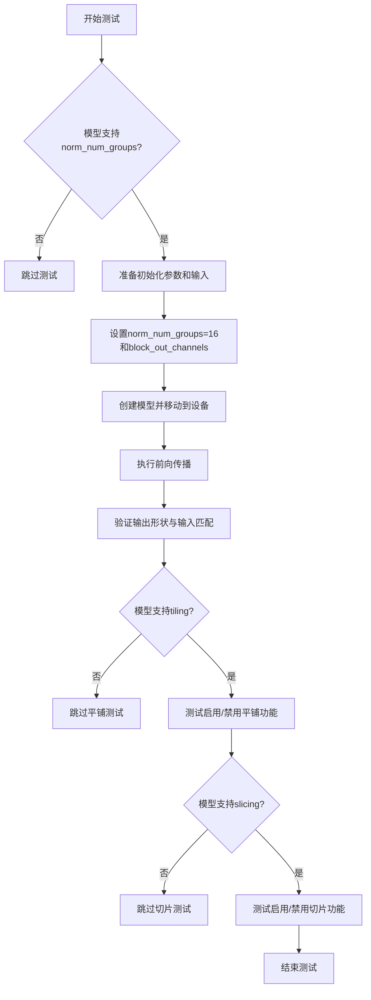
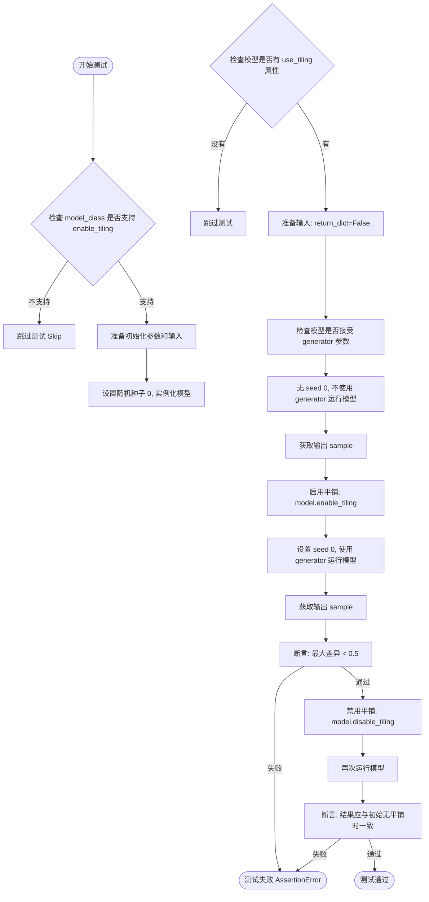
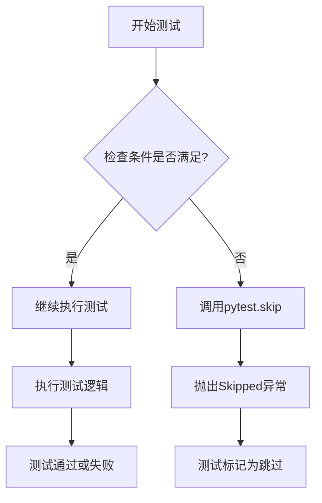
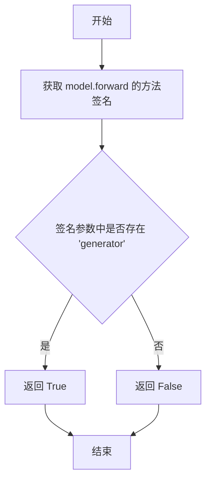
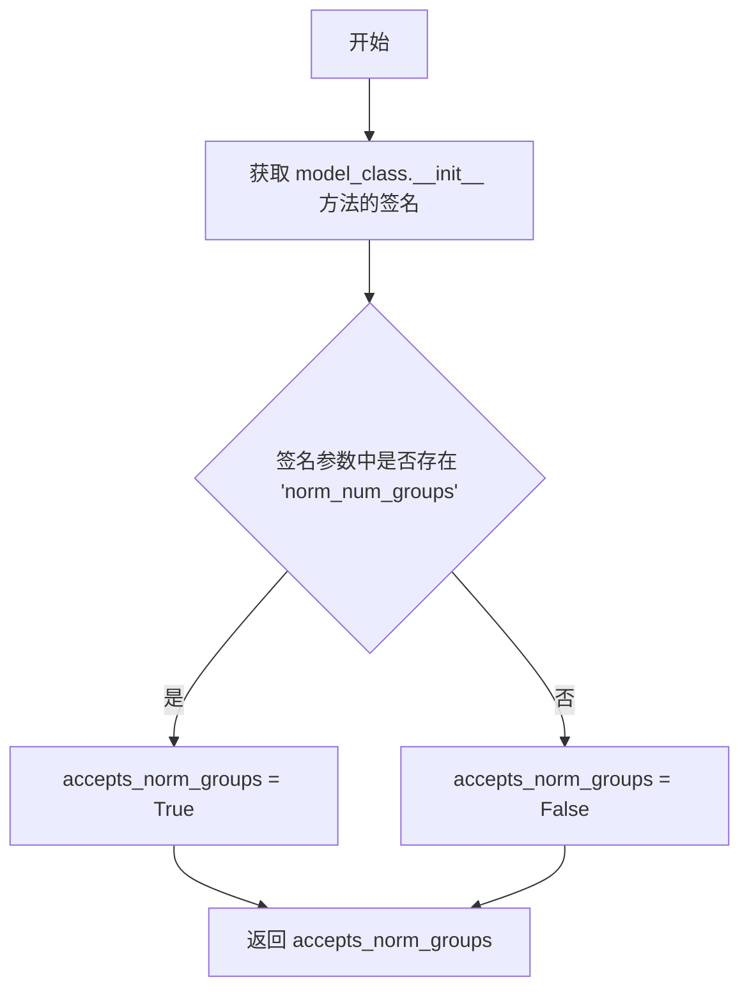
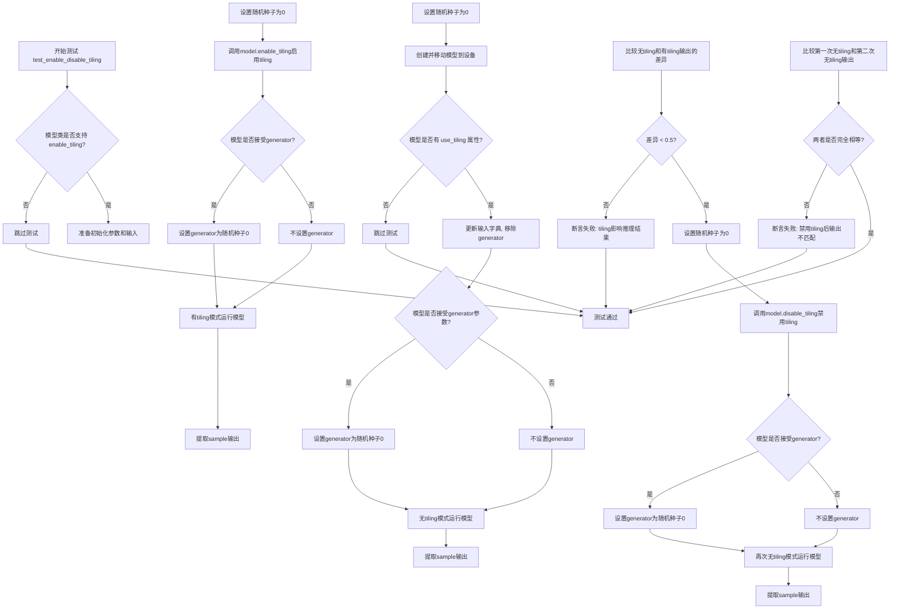

# `diffusers\tests\models\autoencoders\testing_utils.py` 详细设计文档

这是一个用于测试变分自动编码器(VAE)的切片(slicing)和平铺(tiling)功能的测试混入类(Mixin)，主要验证VAE在启用/禁用切片和平铺功能时的一致性，以及前向传播与规范组的兼容性。

## 整体流程



## 类结构

```
AutoencoderTesterMixin (测试混入类)
├── _accepts_generator (静态方法)
├── _accepts_norm_num_groups (静态方法)
├── test_forward_with_norm_groups (测试方法)
├── test_enable_disable_tiling (测试方法)
└── test_enable_disable_slicing (测试方法)
```

## 全局变量及字段


### `torch_device`
    
PyTorch设备字符串，通常为'cuda'或'cpu'，用于指定模型和数据运行的硬件设备

类型：`str`
    


### `DecoderOutput`
    
diffusers库中的VAE解码器输出类，用于封装解码器的输出结果，包含sample属性

类型：`class`
    


    

## 全局函数及方法


This is a test mixin class for Variational Autoencoders (VAEs) within the Diffusers library. It provides a suite of standardized tests to verify specific VAE functionalities—namely slicing and tiling—that are typically absent in standard diffusion network architectures. The class ensures that enabling these optimizations does not alter the model's output characteristics, which is crucial for maintaining generation quality in high-resolution scenarios.

### 1. 文件的整体运行流程

该代码定义了一个Python测试混合类（Mixin）`AutoencoderTesterMixin`。其运行流程主要分为以下几个步骤：

1.  **定义检查辅助方法**：通过静态方法 `_accepts_generator` 和 `_accepts_norm_num_groups` 利用 Python 的 `inspect.signature` 模块动态检查传入模型或模型类是否接受特定的参数（如 `generator` 和 `norm_num_groups`）。
2.  **准备测试环境**：在各个测试方法（如 `test_forward_with_norm_groups`）中，调用 `prepare_init_args_and_inputs_for_common` （该方法需由继承类提供）来获取模型初始化参数和输入数据。
3.  **执行模型推理**：使用 PyTorch 进行前向传播，测试模型在不同配置（如启用药用平铺/切片）下的输出。
4.  **验证结果一致性**：通过 NumPy 数组比较和 PyTorch 断言，验证启用/禁用平铺或切片功能后，模型的输出形状和数值结果是否符合预期（通常允许微小的数值差异）。

### 3. 类的详细信息

#### 类字段
由于该类是一个 Test Mixin（通常继承自 `unittest.TestCase` 或类似测试基类），它本身没有显式的类属性（Class Attributes）。其状态主要依赖于继承类传入的 `self.model_class` 等实例属性。

#### 类方法

*注意：以下详细分析选取了最具代表性的方法 `test_enable_disable_tiling` 进行深度解析。*

---

### `{类名}.{方法名}`

`AutoencoderTesterMixin.test_enable_disable_tiling`

#### 描述

该方法是一个标准的 pytest 测试用例，用于验证 VAE 模型的“平铺（Tiling）”功能。平铺是一种将高分辨率图像分割为小块进行处理以节省显存的技术。测试通过比较“未启用平铺”、“启用平铺”以及“手动禁用平铺”三种情况下的模型输出，确保平铺机制的开关不会导致最终生成结果的明显偏差（差异阈值设为 0.5）。

参数：

-  `self`：`AutoencoderTesterMixin`，测试类的实例对象，包含了待测试的模型类信息 (`self.model_class`)。

返回值：`None`，该方法无返回值，主要通过 `assert` 语句进行断言验证。

#### 流程图



#### 带注释源码

```python
def test_enable_disable_tiling(self):
    # 1. 前置检查：如果模型类没有实现 enable_tiling 方法，则跳过该测试
    if not hasattr(self.model_class, "enable_tiling"):
        pytest.skip(f"Skipping test as {self.model_class.__name__} doesn't support tiling.")

    # 2. 获取模型初始化参数和输入数据（需由继承类提供）
    init_dict, inputs_dict = self.prepare_init_args_and_inputs_for_common()

    # 3. 设置随机种子以确保结果可复现
    torch.manual_seed(0)
    # 4. 实例化模型并移动到指定设备（如 GPU 或 CPU）
    model = self.model_class(**init_dict).to(torch_device)

    # 5. 检查模型实例是否支持 use_tiling 属性（内部状态标志）
    if not hasattr(model, "use_tiling"):
        pytest.skip(f"Skipping test as {self.model_class.__name__} doesn't support tiling.")

    # 6. 准备输入：强制要求返回非字典形式（tuple），并移除 generator 参数（如果存在）
    inputs_dict.update({"return_dict": False})
    _ = inputs_dict.pop("generator", None)
    # 7. 动态检查模型 forward 方法是否接受 generator 参数
    accepts_generator = self._accepts_generator(model)

    # --- 测试阶段 1: 无平铺 ---
    torch.manual_seed(0)
    if accepts_generator:
        # 如果接受 generator，则传入固定的随机种子生成器以确保确定性
        inputs_dict["generator"] = torch.manual_seed(0)
    # 执行前向传播
    output_without_tiling = model(**inputs_dict)[0]
    # Mochi-1 特定处理：如果输出是 DecoderOutput 对象，则提取 sample
    if isinstance(output_without_tiling, DecoderOutput):
        output_without_tiling = output_without_tiling.sample

    # --- 测试阶段 2: 启用平铺 ---
    torch.manual_seed(0)
    model.enable_tiling() # 开启平铺模式
    if accepts_generator:
        inputs_dict["generator"] = torch.manual_seed(0)
    output_with_tiling = model(**inputs_dict)[0]
    if isinstance(output_with_tiling, DecoderOutput):
        output_with_tiling = output_with_tiling.sample

    # 断言：启用平铺后的输出应与无平铺时基本一致（最大误差 < 0.5）
    assert (
        output_without_tiling.detach().cpu().numpy() - output_with_tiling.detach().cpu().numpy()
    ).max() < 0.5, "VAE tiling should not affect the inference results"

    # --- 测试阶段 3: 手动禁用平铺 ---
    torch.manual_seed(0)
    model.disable_tiling() # 手动关闭平铺（测试 disable 方法）
    if accepts_generator:
        inputs_dict["generator"] = torch.manual_seed(0)
    output_without_tiling_2 = model(**inputs_dict)[0]
    if isinstance(output_without_tiling_2, DecoderOutput):
        output_without_tiling_2 = output_without_tiling_2.sample

    # 断言：手动禁用后的输出应与最初的输出完全一致（使用 np.allclose）
    assert np.allclose(
        output_without_tiling.detach().cpu().numpy().all(),
        output_without_tiling_2.detach().cpu().numpy().all(),
    ), "Without tiling outputs should match with the outputs when tiling is manually disabled."
```

### 6. 潜在的技术债务或优化空间

1.  **重复的种子设置逻辑**：代码中多次出现 `torch.manual_seed(0)` 和 `inputs_dict["generator"] = torch.manual_seed(0)` 的模式。虽然这确保了测试的确定性，但可以提取为一个通用的辅助方法来减少代码冗余。
2.  **硬编码的阈值**：数值比较时使用的阈值（如 0.5）是硬编码的。如果能够将这些阈值参数化，或者根据数据类型（float16/float32）动态调整，测试将更加鲁棒。
3.  **Mochi-1 特定处理**：代码中包含 `if isinstance(output, DecoderOutput)` 的特殊处理逻辑，这表明可能存在对特定模型架构的耦合。可以考虑在更通用的接口层面统一输出格式。

### 7. 其它项目

-   **设计目标与约束**：
    -   **目标**：验证 VAE 的平铺和切片功能在开启/关闭时不会影响输出质量。
    -   **约束**：测试必须具有确定性（使用固定随机种子），并且能够处理不同的模型输出类型（tuple 或 dictionary）。
-   **错误处理与异常设计**：
    -   使用 `pytest.skip` 优雅地处理不支持特定功能的模型。
    -   使用 `assert` 进行结果验证，任何不满足条件的情况都会导致测试失败。
-   **数据流与状态机**：
    -   测试本质上是一个状态机：`正常` -> `启用特性` -> `验证` -> `禁用特性` -> `验证`。模型对象在测试过程中被重复调用，其内部状态（如 `use_tiling`）被修改。
-   **外部依赖与接口契约**：
    -   依赖 `diffusers.models.autoencoders.vae.DecoderOutput`。
    -   依赖于继承类实现 `prepare_init_args_and_inputs_for_common` 方法。
    -   依赖 `torch_device` 工具函数来确定计算设备。


### `np.allclose`

`np.allclose` 是 NumPy 库中的一个函数，用于比较两个数组是否在容差范围内相等。该函数常用于数值计算中判断两个浮点数数组是否近似相等，广泛应用于测试场景以验证数值结果的正确性。

参数：

- `a`：`numpy.ndarray`，第一个输入数组，要比较的第一个数组
- `b`：`numpy.ndarray`，第二个输入数组，要比较的第二个数组
- `rtol`：`float`（可选，默认值为 `1e-05`），相对容差参数，用于控制相对误差
- `atol`：`float`（可选，默认值为 `1e-08`），绝对容差参数，用于控制绝对误差
- `equal_nan`：`bool`（可选，默认值为 `False`），是否将 NaN 值视为相等

返回值：`bool`，如果两个数组在容差范围内相等则返回 `True`，否则返回 `False`

#### 流程图

```mermaid
flowchart TD
    A[开始] --> B[接收输入数组 a 和 b]
    B --> C[接收可选参数 rtol, atol, equal_nan]
    C --> D[计算绝对差值: |a - b|]
    D --> E[计算容差上限: atol + rtol * |b|]
    E --> F{所有元素的绝对差值 <= 对应容差上限?}
    F -->|是| G[返回 True]
    F -->|否| H[返回 False]
    G --> I[结束]
    H --> I
```

#### 带注释源码

```python
# np.allclose 函数使用示例 (来自代码中的实际调用)

# 第一次调用: 验证 VAE tiling 功能
# 比较禁用 tiling 前后的输出是否在容差范围内相等
assert np.allclose(
    output_without_tiling.detach().cpu().numpy().all(),  # 第一个数组: 无 tiling 时的输出
    output_without_tiling_2.detach().cpu().numpy().all(), # 第二个数组: 手动禁用 tiling 后的输出
), "Without tiling outputs should match with the outputs when tiling is manually disabled."

# 第二次调用: 验证 VAE slicing 功能
# 比较禁用 slicing 前后的输出是否在容差范围内相等
assert np.allclose(
    output_without_slicing.detach().cpu().numpy().all(),   # 第一个数组: 无 slicing 时的输出
    output_without_slicing_2.detach().cpu().numpy().all(),  # 第二个数组: 手动禁用 slicing 后的输出
), "Without slicing outputs should match with the outputs when slicing is manually disabled."

# np.allclose 的数学判断逻辑:
# |a - b| <= (atol + rtol * |b|)
# 其中默认 rtol=1e-05, atol=1e-08
```


### `pytest.skip`

pytest.skip 是 Pytest 框架提供的内置函数，用于在测试运行时跳过某个测试用例。当满足特定条件（如功能不支持、依赖缺失或环境不适配）时，可以动态跳过测试，避免测试失败并提供清晰的跳过原因。

参数：

-  `reason`：`str`，跳过原因描述，通常为说明为何跳过测试的字符串信息

返回值：`None`，该函数通过抛出 `Skipped` 异常来跳过测试，不会返回任何值

#### 流程图



#### 带注释源码

```python
# 场景1: test_forward_with_norm_groups 方法中
if not self._accepts_norm_num_groups(self.model_class):
    # 如果模型类不接受 norm_num_groups 参数，则跳过测试
    # 原因: 并非所有 VAE 实现都支持 norm_num_groups 参数
    pytest.skip(f"Test not supported for {self.model_class.__name__}")

# 场景2: test_enable_disable_tiling 方法中
if not hasattr(self.model_class, "enable_tiling"):
    # 如果模型类不支持 tiling 功能，则跳过测试
    # 原因: 只有部分 VAE 实现支持 tiling（分块）优化技术
    pytest.skip(f"Skipping test as {self.model_class.__name__} doesn't support tiling.")

# 场景3: test_enable_disable_tiling 方法中（检查模型实例）
if not hasattr(model, "use_tiling"):
    # 如果模型实例没有 use_tiling 属性，则跳过测试
    # 原因: 模型可能支持 enable_tiling 方法但未正确实现 tiling 逻辑
    pytest.skip(f"Skipping test as {self.model_class.__name__} doesn't support tiling.")

# 场景4: test_enable_disable_slicing 方法中
if not hasattr(self.model_class, "enable_slicing"):
    # 如果模型类不支持 slicing 功能，则跳过测试
    # 原因: 只有部分 VAE 实现支持 slicing（切片）优化技术
    pytest.skip(f"Skipping test as {self.model_class.__name__} doesn't support slicing.")

# 场景5: test_enable_disable_slicing 方法中（检查模型实例）
if not hasattr(model, "use_slicing"):
    # 如果模型实例没有 use_slicing 属性，则跳过测试
    # 原因: 模型可能支持 enable_slicing 方法但未正确实现 slicing 逻辑
    pytest.skip(f"Skipping test as {self.model_class.__name__} doesn't support tiling.")
```


### `AutoencoderTesterMixin._accepts_generator`

该静态方法通过检查模型 forward 方法的签名来判断该模型是否支持 generator 参数，用于在测试 VAE 的 tiling 和 slicing 功能时决定是否传递随机数生成器。

参数：

- `model`：模型对象，要检查的 VAE 模型实例，需具有 forward 方法

返回值：`bool`，返回 True 表示模型的 forward 方法接受 generator 参数，返回 False 表示不接受

#### 流程图



#### 带注释源码

```python
@staticmethod
def _accepts_generator(model):
    """
    检查模型的 forward 方法是否接受 generator 参数。
    
    参数:
        model: 要检查的模型实例，需要具有 forward 方法
        
    返回:
        bool: 如果 forward 方法的签名中包含 'generator' 参数返回 True，否则返回 False
    """
    # 使用 inspect 模块获取模型 forward 方法的签名对象
    model_sig = inspect.signature(model.forward)
    
    # 检查参数名称字典中是否包含 'generator' 键
    accepts_generator = "generator" in model_sig.parameters
    
    # 返回布尔值结果
    return accepts_generator
```


### `AutoencoderTesterMixin._accepts_norm_num_groups`

该静态方法通过检查模型类的 `__init__` 方法签名，判断该模型是否支持 `norm_num_groups` 参数，用于适配不同版本 VAE 模型的测试需求。

参数：

- `model_class`：`type`，需要检查的模型类类型，用于获取其 `__init__` 方法的签名

返回值：`bool`，如果模型类的 `__init__` 方法接受 `norm_num_groups` 参数则返回 `True`，否则返回 `False`

#### 流程图



#### 带注释源码

```python
@staticmethod
def _accepts_norm_num_groups(model_class):
    """
    检查模型类的 __init__ 方法是否接受 norm_num_groups 参数。
    
    参数:
        model_class: type - 需要检查的模型类类型
        
    返回:
        bool - 如果模型类的 __init__ 方法接受 norm_num_groups 参数返回 True
    """
    # 获取模型类 __init__ 方法的函数签名对象
    model_sig = inspect.signature(model_class.__init__)
    
    # 检查参数名称中是否包含 'norm_num_groups'
    accepts_norm_groups = "norm_num_groups" in model_sig.parameters
    
    # 返回布尔结果
    return accepts_norm_groups
```


### `AutoencoderTesterMixin.test_forward_with_norm_groups`

该方法是一个测试用例，用于验证 VAE（变分自编码器）模型是否支持 `norm_num_groups` 参数，并在设置该参数后进行前向传播测试，确保输入输出的形状匹配。

参数：

- `self`：`AutoencoderTesterMixin`，测试mixin类的实例

返回值：`None`，该方法为测试方法，通过断言进行验证，不返回具体值

#### 流程图

```mermaid
flowchart TD
    A[开始测试] --> B{模型类是否支持<br/>norm_num_groups参数?}
    B -->|不支持| C[跳过测试 pytest.skip]
    B -->|支持| D[准备初始化参数和输入]
    D --> E[设置norm_num_groups=16]
    E --> F[设置block_out_channels=(16, 32)]
    F --> G[创建模型实例]
    G --> H[将模型移至torch_device]
    H --> I[设置模型为eval模式]
    I --> J[执行前向传播 model.forward]
    J --> K{输出是否为dict?}
    K -->|是| L[获取output.to_tuple()[0]]
    K -->|否| M[使用原始输出]
    L --> N{输出是否为None?}
    M --> N
    N -->|是| O[断言失败]
    N -->|否| P[获取输入样本形状]
    P --> Q{输出形状是否匹配<br/>输入形状?}
    Q -->|不匹配| R[断言失败]
    Q -->|匹配| S[测试通过]
```

#### 带注释源码

```python
def test_forward_with_norm_groups(self):
    """
    测试模型是否支持norm_num_groups参数，并验证前向传播的正确性
    """
    # 检查模型类是否接受norm_num_groups参数
    if not self._accepts_norm_num_groups(self.model_class):
        # 如果不支持则跳过该测试
        pytest.skip(f"Test not supported for {self.model_class.__name__}")
    
    # 准备模型初始化参数和输入数据
    init_dict, inputs_dict = self.prepare_init_args_and_inputs_for_common()

    # 设置norm_num_groups为16
    init_dict["norm_num_groups"] = 16
    # 设置block_out_channels为(16, 32)
    init_dict["block_out_channels"] = (16, 32)

    # 使用修改后的参数创建模型实例
    model = self.model_class(**init_dict)
    # 将模型移至指定设备（CPU/CUDA）
    model.to(torch_device)
    # 设置为评估模式
    model.eval()

    # 在no_grad模式下执行前向传播，节省内存
    with torch.no_grad():
        output = model(**inputs_dict)

        # 如果输出是字典类型，提取第一个元素
        if isinstance(output, dict):
            output = output.to_tuple()[0]

    # 断言输出不为None
    self.assertIsNotNone(output)
    # 获取输入样本的期望形状
    expected_shape = inputs_dict["sample"].shape
    # 验证输入和输出形状是否匹配
    self.assertEqual(output.shape, expected_shape, "Input and output shapes do not match")
```


### `AutoencoderTesterMixin.test_enable_disable_tiling`

这是一个用于测试 VAE（变分自编码器）模型的 tiling（分块）功能启用和禁用的测试方法。该方法验证启用 tiling 后模型的输出应该与不使用 tiling 时的输出保持一致（数值差异小于 0.5），并且禁用 tiling 后输出应完全恢复到原始状态。

参数：

- `self`：`AutoencoderTesterMixin`，指向测试类的实例，隐式参数，用于访问类方法和属性

返回值：`None`，测试方法不返回任何值，通过断言验证正确性

#### 流程图



#### 带注释源码

```python
def test_enable_disable_tiling(self):
    """
    测试 VAE 模型的 tiling 功能启用和禁用
    验证: 1) 启用tiling后输出与无tiling时接近 2) 禁用tiling后输出完全恢复
    """
    # 检查模型类是否支持 tiling 功能（enable_tiling 方法）
    if not hasattr(self.model_class, "enable_tiling"):
        pytest.skip(f"Skipping test as {self.model_class.__name__} doesn't support tiling.")

    # 准备模型初始化参数和输入数据
    init_dict, inputs_dict = self.prepare_init_args_and_inputs_for_common()

    # 设置随机种子确保可复现性
    torch.manual_seed(0)
    # 创建模型实例并移动到计算设备
    model = self.model_class(**init_dict).to(torch_device)

    # 检查模型实例是否支持 tiling（实例属性）
    if not hasattr(model, "use_tiling"):
        pytest.skip(f"Skipping test as {self.model_class.__name__} doesn't support tiling.")

    # 配置输入: return_dict=False 返回元组, 移除 generator 参数避免干扰
    inputs_dict.update({"return_dict": False})
    _ = inputs_dict.pop("generator", None)
    # 检查模型 forward 方法是否接受 generator 参数
    accepts_generator = self._accepts_generator(model)

    # 第一次运行: 不启用 tiling
    torch.manual_seed(0)
    if accepts_generator:
        inputs_dict["generator"] = torch.manual_seed(0)
    output_without_tiling = model(**inputs_dict)[0]  # 获取第一个输出
    
    # 处理 Mochi-1 特殊输出格式
    if isinstance(output_without_tiling, DecoderOutput):
        output_without_tiling = output_without_tiling.sample

    # 第二次运行: 启用 tiling
    torch.manual_seed(0)
    model.enable_tiling()  # 启用模型的分块功能
    if accepts_generator:
        inputs_dict["generator"] = torch.manual_seed(0)
    output_with_tiling = model(**inputs_dict)[0]
    if isinstance(output_with_tiling, DecoderOutput):
        output_with_tiling = output_with_tiling.sample

    # 断言: tiling 不应显著影响推理结果（差异应小于0.5）
    assert (
        output_without_tiling.detach().cpu().numpy() - output_with_tiling.detach().cpu().numpy()
    ).max() < 0.5, "VAE tiling should not affect the inference results"

    # 第三次运行: 禁用 tiling
    torch.manual_seed(0)
    model.disable_tiling()  # 禁用模型的分块功能
    if accepts_generator:
        inputs_dict["generator"] = torch.manual_seed(0)
    output_without_tiling_2 = model(**inputs_dict)[0]
    if isinstance(output_without_tiling_2, DecoderOutput):
        output_without_tiling_2 = output_without_tiling_2.sample

    # 断言: 禁用tiling后的输出应与最初无tiling时完全一致
    assert np.allclose(
        output_without_tiling.detach().cpu().numpy().all(),
        output_without_tiling_2.detach().cpu().numpy().all(),
    ), "Without tiling outputs should match with the outputs when tiling is manually disabled."
```


### `AutoencoderTesterMixin.test_enable_disable_slicing`

该方法是一个测试函数，用于验证 VAE 模型的切片（slicing）功能是否正常工作。它通过比较启用切片、禁用切片和默认状态下的模型输出，确保切片功能的正确性以及对推理结果的一致性影响。

参数：

- `self`：`AutoencoderTesterMixin`，测试mixin类的实例，隐式参数

返回值：`None`，该方法为测试方法，不返回任何值，通过断言验证功能正确性

#### 流程图

```mermaid
flowchart TD
    A[开始测试] --> B{模型类是否支持enable_slicing}
    B -->|否| C[跳过测试 pytest.skip]
    B -->|是| D[准备初始化参数和输入]
    D --> E[创建模型并移至设备]
    E --> F{模型是否有use_slicing属性}
    F -->|否| G[跳过测试 pytest.skip]
    F -->|是| H[更新输入参数return_dict=False]
    H --> I[移除generator参数]
    I --> J{模型forward是否接受generator}
    J -->|是| K[设置generator为torch.manual_seed(0)]
    J -->|否| L[不设置generator]
    K --> M
    L --> M[设置随机种子0]
    M --> N[运行模型获取无切片输出]
    N --> O{输出是否为DecoderOutput}
    O -->|是| P[提取sample属性]
    O -->|否| Q
    P --> Q[设置随机种子0]
    Q --> R[启用模型切片 model.enable_slicing]
    R --> S{模型接受generator}
    S -->|是| T[设置generator为torch.manual_seed(0)]
    S -->|否| U
    T --> U[运行模型获取有切片输出]
    U --> V{输出是否为DecoderOutput}
    V -->|是| W[提取sample属性]
    V -->|否| X
    W --> X[断言：无切片与有切片输出差异<0.5]
    X --> Y[设置随机种子0]
    Y --> Z[禁用模型切片 model.disable_slicing]
    Z --> AA{模型接受generator}
    AA -->|是| AB[设置generator为torch.manual_seed(0)]
    AA -->|否| AC
    AB --> AC[运行模型获取无切片输出2]
    AC --> AD{输出是否为DecoderOutput}
    AD -->|是| AE[提取sample属性]
    AD -->|否| AF
    AE --> AF[断言：无切片输出1与无切片输出2应该一致]
    AF --> G[结束测试]
```

#### 带注释源码

```python
def test_enable_disable_slicing(self):
    """
    测试VAE模型的切片启用/禁用功能
    验证切片功能不影响推理结果的正确性
    """
    # 检查模型类是否支持enable_slicing方法，不支持则跳过测试
    if not hasattr(self.model_class, "enable_slicing"):
        pytest.skip(f"Skipping test as {self.model_class.__name__} doesn't support slicing.")

    # 准备模型初始化参数和输入数据
    init_dict, inputs_dict = self.prepare_init_args_and_inputs_for_common()

    # 设置随机种子确保可重复性
    torch.manual_seed(0)
    # 创建模型实例并移至计算设备
    model = self.model_class(**init_dict).to(torch_device)
    
    # 检查模型实例是否有use_slicing属性，没有则跳过测试
    if not hasattr(model, "use_slicing"):
        pytest.skip(f"Skipping test as {self.model_class.__name__} doesn't support tiling.")

    # 更新输入字典，设置return_dict为False以获取tuple输出
    inputs_dict.update({"return_dict": False})
    # 移除generator参数，后续根据模型支持情况重新添加
    _ = inputs_dict.pop("generator", None)
    # 检查模型forward方法是否接受generator参数
    accepts_generator = self._accepts_generator(model)

    # 如果模型接受generator，则设置随机种子
    if accepts_generator:
        inputs_dict["generator"] = torch.manual_seed(0)

    # 测试1：不启用切片的情况
    torch.manual_seed(0)
    output_without_slicing = model(**inputs_dict)[0]
    # 处理Mochi-1模型的特殊输出格式
    if isinstance(output_without_slicing, DecoderOutput):
        output_without_slicing = output_without_slicing.sample

    # 测试2：启用切片的情况
    torch.manual_seed(0)
    model.enable_slicing()  # 启用切片功能
    if accepts_generator:
        inputs_dict["generator"] = torch.manual_seed(0)
    output_with_slicing = model(**inputs_dict)[0]
    if isinstance(output_with_slicing, DecoderOutput):
        output_with_slicing = output_with_slicing.sample

    # 断言：切片不应影响推理结果（允许数值误差<0.5）
    assert (
        output_without_slicing.detach().cpu().numpy() - output_with_slicing.detach().cpu().numpy()
    ).max() < 0.5, "VAE slicing should not affect the inference results"

    # 测试3：手动禁用切片后的情况
    torch.manual_seed(0)
    model.disable_slicing()  # 禁用切片功能
    if accepts_generator:
        inputs_dict["generator"] = torch.manual_seed(0)
    output_without_slicing_2 = model(**inputs_dict)[0]
    if isinstance(output_without_slicing_2, DecoderOutput):
        output_without_slicing_2 = output_without_slicing_2.sample

    # 断言：禁用切片后的输出应与原始无切片输出一致
    assert np.allclose(
        output_without_slicing.detach().cpu().numpy().all(),
        output_without_slicing_2.detach().cpu().numpy().all(),
    ), "Without slicing outputs should match with the outputs when slicing is manually disabled."
```

## 关键组件


### AutoencoderTesterMixin

测试mixin类，专门用于测试VAE（变分自编码器）的切片（slicing）和平铺（tiling）功能，继承自此类可以复用通用的VAE测试逻辑

### _accepts_generator 静态方法

检查模型forward方法是否接受generator参数，用于判断是否需要传递随机种子生成器

### _accepts_norm_num_groups 静态方法

检查模型类初始化方法是否接受norm_num_groups参数，用于判断是否支持分组归一化

### test_forward_with_norm_groups 测试方法

测试带norm_num_groups参数的模型前向传播，验证分组归一化功能是否正常工作，并检查输入输出形状一致性

### test_enable_disable_tiling 测试方法

测试VAE模型的平铺（tiling）功能开关，验证启用平铺与禁用平铺的输出差异在可接受范围内，确保平铺功能不影响推理结果

### test_enable_disable_slicing 测试方法

测试VAE模型的切片（slicing）功能开关，验证启用切片与禁用切片的输出差异在可接受范围内，确保切片功能不影响推理结果


## 问题及建议


### 已知问题

- **代码重复**：测试方法 `test_enable_disable_tiling` 和 `test_enable_disable_slicing` 包含大量重复逻辑，如模型初始化、输入处理、输出提取和断言检查，可通过提取公共辅助函数来减少冗余。
- **硬编码阈值**：数值比较使用硬编码阈值 0.5 和 `np.allclose`，缺乏灵活性，可能在不同硬件或模型上导致误报。
- **冗余的 NumPy 操作**：在 `np.allclose` 后调用 `.all()` 是多余的，因为 `np.allclose` 已返回布尔值，增加了不必要的计算开销。
- **种子管理不当**：多次使用 `torch.manual_seed(0)` 可能引入测试顺序依赖，且未考虑 CUDA 的非确定性行为，影响测试的稳定性和可重复性。
- **缺少错误处理**：测试未覆盖边界情况，如在不支持平铺/切片的模型上调用相关方法（虽然有 `pytest.skip`，但缺乏负面测试用例）。
- **魔法数字**：代码中的 0.5 和其他数值（如 16, 32）缺乏解释，可通过常量或配置提升可读性。
- **依赖外部契约**：测试依赖于 `prepare_init_args_and_inputs_for_common()` 方法，但未在当前类中定义或验证其存在，增加了脆弱性。

### 优化建议

- **提取公共逻辑**：创建辅助方法（如 `_run_tiling_slicing_test`）来封装模型运行、输出提取和断言逻辑，消除重复代码。
- **参数化阈值**：将比较阈值作为类属性或测试参数传入，允许针对不同模型或硬件调整。
- **简化 NumPy 调用**：直接使用 `np.allclose` 结果，无需额外 `.all()` 操作。
- **改进随机种子策略**：使用 `torch.manual_seed` 结合 `torch.cuda.manual_seed_all`，并考虑在测试间重置随机状态以确保独立性。
- **添加显式错误测试**：即使有 `pytest.skip`，也建议添加明确的负面测试用例来验证不支持操作时的错误处理。
- **引入常量定义**：将魔数（如 0.5、16、32）定义为类常量或测试配置常量，并添加注释说明其用途。
- **强化接口契约**：在测试开始时显式检查 `prepare_init_args_and_inputs_for_common` 的可用性，提供更清晰的错误信息。

## 其它


### 设计目标与约束

本测试类的设计目标是为VAE（变分自编码器）模型提供统一的切片（slicing）和平铺（tiling）功能测试能力，确保支持这些特性的模型在启用/禁用相关功能时行为一致。设计约束包括：1）仅针对支持相应特性的模型类进行测试；2）测试使用固定随机种子确保可重复性；3）输出差异阈值设为0.5以容忍浮点精度误差。

### 错误处理与异常设计

测试类采用pytest框架进行异常处理，主要包括：1）使用`pytest.skip()`跳过不支持特性的模型测试；2）通过`hasattr()`动态检查模型属性是否存在；3）使用`assert`语句验证输出正确性，失败时提供清晰的错误信息。

### 数据流与状态机

测试数据流为：准备初始化参数和输入数据 → 创建模型实例 → 设置随机种子 → 执行前向传播 → 验证输出形状和数值正确性。状态机转换：正常模式 → 平铺/切片启用模式 → 平铺/切片禁用模式。

### 外部依赖与接口契约

主要依赖包括：1）`inspect`模块用于检查函数签名；2）`numpy`用于数值比较；3）`pytest`用于测试框架；4）`torch`用于深度学习计算；5）`diffusers.utils.torch_utils`提供`torch_device`工具。接口契约：测试方法需调用`prepare_init_args_and_inputs_for_common()`准备测试数据，模型需实现`forward()`方法支持标准输入输出格式。

### 测试参数配置

测试配置包括：1）`norm_num_groups`设为16；2）`block_out_channels`设为(16, 32)；3）随机种子统一使用0；4）平铺/切片阈值差异容忍度<0.5；5）支持`DecoderOutput`类型输出解包。

### 边界条件与异常场景

测试覆盖的边界条件：1）模型类不支持平铺/切片功能的跳过处理；2）模型不支持`generator`参数的兼容处理；3）输出为`DecoderOutput`类型时的解包处理；4）启用/禁用功能后的输出与无功能输出的数值接近性验证。

### 性能考量

测试性能考虑：1）使用`torch.no_grad()`禁用梯度计算减少内存开销；2）使用`.detach().cpu().numpy()`转换张量避免内存泄漏；3）测试阈值设定平衡准确性与鲁棒性。

### 代码可维护性与扩展性

设计良好的可维护性：1）使用`@staticmethod`装饰器减少实例依赖；2）通过`inspect`模块动态检查方法签名提高灵活性；3）测试逻辑清晰分离便于扩展新功能。扩展方向：可添加更多功能测试如量化、剪枝等特性的测试支持。

    