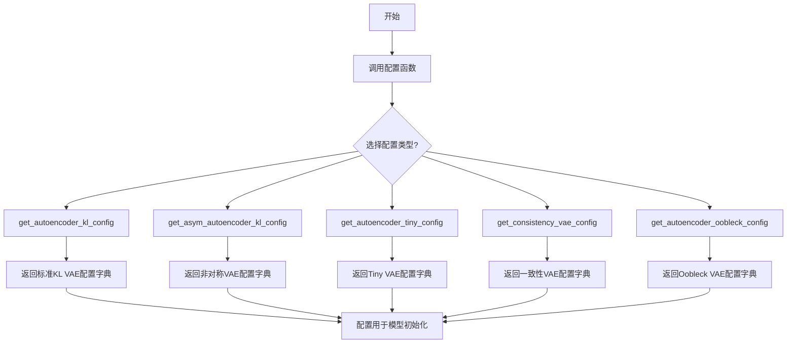
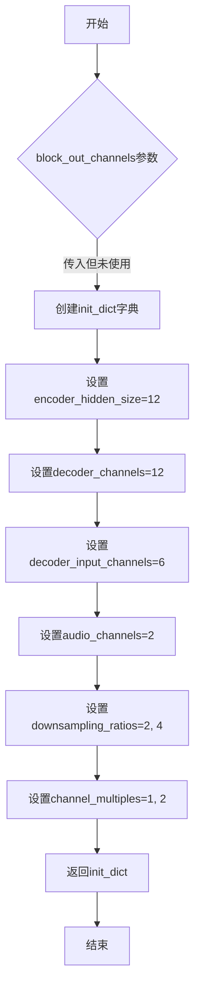

# `diffusers\tests\models\autoencoders\vae.py` 详细设计文档

该文件是一个自编码器（Autoencoder）配置生成模块，提供了5个全局配置函数，用于生成不同类型的变分自编码器（VAE）的初始化配置字典，包括标准KL散度VAE、非对称VAE、轻量级Tiny VAE、一致性VAE和Oobleck VAE的配置参数。

## 整体流程



## 类结构

```
无类层次结构（纯函数模块）
```

## 全局变量及字段


### `block_out_channels`
    
编码器和解码器块的输出通道数列表，默认为[2, 4]

类型：`List[int] | None`
    


### `norm_num_groups`
    
分组归一化的组数，用于控制特征图的归一化方式，默认为2

类型：`int | None`
    


### `init_dict`
    
存储Autoencoder模型配置参数的字典，包含通道数、块类型、层数等关键配置

类型：`Dict[str, Any]`
    


### `len(block_out_channels)`
    
block_out_channels列表的长度，表示编码器/解码器块的数量

类型：`int`
    


    

## 全局函数及方法


### `get_autoencoder_kl_config`

该函数用于生成 KL 自动编码器（VAE）的配置字典，包含编码器和解码器的通道数、块类型、潜在通道数等关键参数，用于初始化 Stable Diffusion 中的 VAE 模型。

参数：

- `block_out_channels`：`Optional[List[int]]`，块输出通道数列表，默认为 [2, 4]
- `norm_num_groups`：`Optional[int]`，归一化组数，默认为 2

返回值：`Dict[str, Any]`，包含自动编码器完整配置的字典

#### 流程图

```mermaid
flowchart TD
    A[开始] --> B{检查 block_out_channels 是否为 None}
    B -->|是| C[使用默认值 [2, 4]]
    B -->|否| D[使用传入的值]
    C --> E{检查 norm_num_groups 是否为 None}
    D --> E
    E -->|是| F[使用默认值 2]
    E -->|否| G[使用传入的值]
    F --> H[构建 init_dict 字典]
    G --> H
    H --> I[返回配置字典]
```

#### 带注释源码

```
def get_autoencoder_kl_config(block_out_channels=None, norm_num_groups=None):
    """
    获取 KL 自动编码器的配置字典
    
    参数:
        block_out_channels: 编码器/解码器各层的输出通道数列表
        norm_num_groups: 归一化组数，用于 GroupNorm
    
    返回:
        包含 VAE 配置的字典
    """
    
    # 如果未指定，则使用默认的块输出通道数 [2, 4]
    block_out_channels = block_out_channels or [2, 4]
    
    # 如果未指定，则使用默认的归一化组数 2
    norm_num_groups = norm_num_groups or 2
    
    # 构建配置字典，包含自动编码器的所有关键参数
    init_dict = {
        "block_out_channels": block_out_channels,  # 块输出通道数
        "in_channels": 3,                          # 输入通道数（RGB图像）
        "out_channels": 3,                         # 输出通道数
        "down_block_types": ["DownEncoderBlock2D"] * len(block_out_channels),  # 编码器下采样块类型
        "up_block_types": ["UpDecoderBlock2D"] * len(block_out_channels),       # 解码器上采样块类型
        "latent_channels": 4,                      # 潜在空间通道数（VAE latent）
        "norm_num_groups": norm_num_groups,       # 归一化组数
    }
    
    # 返回完整的配置字典
    return init_dict
```


### `get_asym_autoencoder_kl_config`

该函数用于生成非对称自动编码器（Asymmetric Autoencoder）的KL散度配置字典，包含编码器和解码器的结构参数，如通道数、层数、激活函数等，用于实例化变分自编码器模型。

参数：

- `block_out_channels`：`List[int] | None`，输出通道数的列表，默认为 [2, 4]，控制编码器各阶段的通道数
- `norm_num_groups`：`int | None`，归一化组数，默认为 2，用于组归一化的分组数量

返回值：`Dict[str, Any]`，返回包含自动编码器完整配置的字典，包括输入/输出通道、块类型、层数、激活函数、潜在通道数等关键参数

#### 流程图

```mermaid
flowchart TD
    A[开始] --> B{block_out_channels是否为None}
    B -->|是| C[block_out_channels = [2, 4]]
    B -->|否| D[使用传入的block_out_channels]
    C --> E{norm_num_groups是否为None}
    D --> E
    E -->|是| F[norm_num_groups = 2]
    E -->|否| G[使用传入的norm_num_groups]
    F --> H[构建init_dict字典]
    G --> H
    H --> I[返回init_dict]
    I --> J[结束]
```

#### 带注释源码

```
def get_asym_autoencoder_kl_config(block_out_channels=None, norm_num_groups=None):
    """
    生成非对称自动编码器的KL配置字典
    
    该函数返回一个包含自动编码器完整配置的字典，用于实例化
    非对称结构的变分自编码器（VAE）模型，特别适用于需要编码器
    和解码器结构不对称的场景。
    
    Args:
        block_out_channels: 输出通道数列表，控制各下采样/上采样块的输出通道
        norm_num_groups: 组归一化的分组数量，用于控制归一化参数
    
    Returns:
        包含自动编码器完整配置的字典
    """
    # 处理block_out_channels默认值，如果未提供则使用[2, 4]
    block_out_channels = block_out_channels or [2, 4]
    
    # 处理norm_num_groups默认值，如果未提供则使用2
    norm_num_groups = norm_num_groups or 2
    
    # 构建配置字典，包含编码器和解码器的完整参数
    init_dict = {
        "in_channels": 3,                                    # 输入图像通道数（RGB=3）
        "out_channels": 3,                                  # 输出图像通道数（RGB=3）
        "down_block_types": ["DownEncoderBlock2D"] * len(block_out_channels),  # 下采样编码器块类型
        "down_block_out_channels": block_out_channels,      # 编码器各块的输出通道数
        "layers_per_down_block": 1,                         # 每个下采样块包含的层数
        "up_block_types": ["UpDecoderBlock2D"] * len(block_out_channels),      # 上采样解码器块类型
        "up_block_out_channels": block_out_channels,        # 解码器各块的输出通道数
        "layers_per_up_block": 1,                           # 每个上采样块包含的层数
        "act_fn": "silu",                                   # 激活函数（SiLU/Swish）
        "latent_channels": 4,                              # 潜在空间的通道数（VAE的z维度）
        "norm_num_groups": norm_num_groups,                # 组归一化的分组数量
        "sample_size": 32,                                  # 输入样本的空间尺寸
        "scaling_factor": 0.18215,                         # VAE缩放因子（来自原版VAE）
    }
    
    # 返回完整的配置字典
    return init_dict
```


### `get_autoencoder_tiny_config`

该函数用于获取 TinyAutoEncoder（轻量级自编码器）的配置参数。它接收可选的 `block_out_channels` 参数，如果未提供则使用默认的通道数配置 [32, 32]，然后返回一个包含编码器和解码器块通道数、输入输出通道数以及每个阶段的块数量的字典，用于初始化 TinyAutoEncoder 模型。

参数：

- `block_out_channels`：`list[int]` 或 `None`，可选参数，表示编码器和解码器各层的输出通道数列表。如果为 `None`，则使用默认配置 [32, 32]。

返回值：`dict`，返回包含 TinyAutoEncoder 模型初始化所需的配置字典，包括输入输出通道数、编码器/解码器块通道数以及每个阶段的块数量。

#### 流程图

```mermaid
flowchart TD
    A[开始] --> B{检查 block_out_channels 是否为 None}
    B -->|是| C[使用默认配置 [32, 32]]
    B -->|否| D[根据 block_out_channels 长度生成通道数列表]
    C --> E[构建配置字典 init_dict]
    D --> E
    E --> F[设置 in_channels: 3]
    F --> G[设置 out_channels: 3]
    G --> H[设置 encoder_block_out_channels]
    H --> I[设置 decoder_block_out_channels]
    I --> J[计算 num_encoder_blocks 列表]
    J --> K[计算 num_decoder_blocks 列表]
    K --> L[返回配置字典 init_dict]
    L --> M[结束]
```

#### 带注释源码

```python
def get_autoencoder_tiny_config(block_out_channels=None):
    """
    获取 TinyAutoEncoder 的配置字典。
    
    参数:
        block_out_channels: 可选的通道数列表，如果为 None 则使用默认配置 [32, 32]
    
    返回:
        包含模型初始化所需的配置字典
    """
    # 如果提供了 block_out_channels，则将其转换为指定长度的 32 通道列表
    # 否则使用默认的 [32, 32] 双层通道配置
    block_out_channels = (len(block_out_channels) * [32]) if block_out_channels is not None else [32, 32]
    
    # 构建初始化配置字典
    init_dict = {
        "in_channels": 3,                                              # 输入图像的通道数（RGB 图像）
        "out_channels": 3,                                             # 输出图像的通道数
        "encoder_block_out_channels": block_out_channels,              # 编码器各层的输出通道数
        "decoder_block_out_channels": block_out_channels,              # 解码器各层的输出通道数
        # 计算编码器每层的块数量：通过各通道数除以最小通道数得到
        "num_encoder_blocks": [b // min(block_out_channels) for b in block_out_channels],
        # 计算解码器每层的块数量：反向遍历通道数并计算
        "num_decoder_blocks": [b // min(block_out_channels) for b in reversed(block_out_channels)],
    }
    
    # 返回完整的配置字典
    return init_dict
```


### `get_consistency_vae_config`

获取 Consistency VAE（一致性变分自编码器）的配置参数，用于初始化 VAE 模型的各项超参数和结构设置。

参数：

- `block_out_channels`：`List[int] | None`，编码器和解码器块输出通道数的列表，默认为 [2, 4]
- `norm_num_groups`：`int | None`，归一化组的数量，默认为 2

返回值：`Dict[str, Any]`，包含 Consistency VAE 模型完整配置信息的字典

#### 流程图

```mermaid
flowchart TD
    A[开始] --> B{检查 block_out_channels 是否为 None}
    B -->|是| C[设置默认值为 [2, 4]]
    B -->|否| D[使用传入的值]
    C --> E{检查 norm_num_groups 是否为 None}
    D --> E
    E -->|是| F[设置默认值为 2]
    E -->|否| G[使用传入的值]
    F --> H[构建配置字典 init_dict]
    G --> H
    H --> I[返回配置字典]
```

#### 带注释源码

```
def get_consistency_vae_config(block_out_channels=None, norm_num_groups=None):
    """
    获取 Consistency VAE 的配置参数
    
    参数:
        block_out_channels: 编码器/解码器块的输出通道数列表，默认为 [2, 4]
        norm_num_groups: 归一化组数量，默认为 2
    
    返回:
        包含 VAE 配置的字典
    """
    
    # 处理 block_out_channels 参数，如果为 None 则使用默认值 [2, 4]
    block_out_channels = block_out_channels or [2, 4]
    
    # 处理 norm_num_groups 参数，如果为 None 则使用默认值 2
    norm_num_groups = norm_num_groups or 2
    
    # 构建并返回配置字典，包含以下关键配置:
    # - encoder_block_out_channels: 编码器块输出通道
    # - encoder_in_channels: 编码器输入通道 (3, RGB图像)
    # - encoder_out_channels: 编码器输出通道 (4, 潜在空间维度)
    # - encoder_down_block_types: 编码器下采样块类型
    # - decoder_block_out_channels: 解码器块输出通道
    # - decoder_down_block_types: 解码器下采样块类型
    # - decoder_in_channels: 解码器输入通道 (7, 包含时间步等条件)
    # - decoder_out_channels: 解码器输出通道 (6, 双通道预测)
    # - latent_channels: 潜在空间通道数 (4)
    # - scaling_factor: 潜在空间缩放因子 (1)
    # - decoder_resnet_time_scale_shift: 时间嵌入方式
    # - decoder_time_embedding_type: 时间嵌入类型 (learned)
    # - norm_num_groups: 归一化组数量
    return {
        "encoder_block_out_channels": block_out_channels,
        "encoder_in_channels": 3,
        "encoder_out_channels": 4,
        "encoder_down_block_types": ["DownEncoderBlock2D"] * len(block_out_channels),
        "decoder_add_attention": False,
        "decoder_block_out_channels": block_out_channels,
        "decoder_down_block_types": ["ResnetDownsampleBlock2D"] * len(block_out_channels),
        "decoder_downsample_padding": 1,
        "decoder_in_channels": 7,
        "decoder_layers_per_block": 1,
        "decoder_norm_eps": 1e-05,
        "decoder_norm_num_groups": norm_num_groups,
        "encoder_norm_num_groups": norm_num_groups,
        "decoder_num_train_timesteps": 1024,
        "decoder_out_channels": 6,
        "decoder_resnet_time_scale_shift": "scale_shift",
        "decoder_time_embedding_type": "learned",
        "decoder_up_block_types": ["ResnetUpsampleBlock2D"] * len(block_out_channels),
        "scaling_factor": 1,
        "latent_channels": 4,
    }
```


### `get_autoencoder_oobleck_config`

该函数用于获取 Oobleck 自动编码器的配置参数，返回一个包含编码器隐藏层大小、解码器通道数、音频通道数、下采样率和通道倍增器等关键配置信息的字典。

参数：

- `block_out_channels`：`Optional[List[int]]`，可选参数，用于指定块输出通道数（当前函数实现中未使用，但保留接口兼容性）

返回值：`Dict[str, Any]`，返回包含 Oobleck 自动编码器配置的字典，包含以下键值对：

- `encoder_hidden_size`：编码器隐藏层大小（整型）
- `decoder_channels`：解码器通道数（整型）
- `decoder_input_channels`：解码器输入通道数（整型）
- `audio_channels`：音频通道数（整型）
- `downsampling_ratios`：下采样率列表（列表）
- `channel_multiples`：通道倍增器列表（列表）

#### 流程图



#### 带注释源码

```python
def get_autoencoder_oobleck_config(block_out_channels=None):
    """
    获取 Oobleck 自动编码器的配置字典
    
    该函数返回一个包含 Oobleck 变分自编码器（VAE）架构配置参数的字典。
    Oobleck 是一种专门用于音频处理的自动编码器架构。
    
    注意：block_out_channels 参数在此函数中未使用，
    主要是为了保持与其他 get_*_config 函数接口的一致性。
    
    参数:
        block_out_channels: 可选的通道列表参数，当前实现中未使用
        
    返回:
        包含自动编码器配置的字典，包含以下键:
            - encoder_hidden_size: 编码器隐藏层维度
            - decoder_channels: 解码器通道数
            - decoder_input_channels: 解码器输入通道数
            - audio_channels: 音频数据的通道数（立体声为2）
            - downsampling_ratios: 编码器各层的下采样比例
            - channel_multiples: 通道数的倍增因子
    """
    # 初始化配置字典，包含Oobleck VAE的核心架构参数
    init_dict = {
        "encoder_hidden_size": 12,  # 编码器隐藏层的维度大小
        "decoder_channels": 12,      # 解码器各层的通道数
        "decoder_input_channels": 6, # 解码器输入的通道数（通常为潜在空间维度的1.5倍）
        "audio_channels": 2,         # 音频通道数（2表示立体声）
        "downsampling_ratios": [2, 4], # 编码器中每次下采样的比例
        "channel_multiples": [1, 2],  # 各层通道数的倍增因子
    }
    # 返回完整的配置字典
    return init_dict
```

## 关键组件


### Autoencoder KL 配置生成器

用于生成标准 KL 散度自动编码器的配置参数，支持可配置的块输出通道和归一化组数量，返回包含编码器、解码器、潜在通道等完整配置的字典。

### 非对称自动编码器配置生成器

用于生成非对称结构的 KL 自动编码器配置，支持不同的上下采样通道配置和每块层数设置，适用于编码器和解码器通道数不对称的场景。

### 轻量级自动编码器配置生成器

用于生成精简版自动编码器配置，根据块通道数动态计算编码器和解码器块数量，支持自适应通道缩放的轻量级模型架构。

### 一致性 VAE 配置生成器

用于生成一致性变分自动编码器配置，包含完整的编码器和解码器架构定义，支持时间嵌入学习、缩放因子、残差块下采样等高级特性配置。

### Oobleck 音频自动编码器配置生成器

用于生成面向音频处理的自动编码器配置，支持音频通道数、下采样比率和通道倍增等音频特定参数配置。


## 问题及建议


### 已知问题

-   **配置参数不一致**：不同配置函数对 `block_out_channels` 和 `norm_num_groups` 参数的默认值处理方式不统一，`get_autoencoder_tiny_config` 未接受 `norm_num_groups` 参数，而其他函数均支持
-   **默认值逻辑存在缺陷**：`get_autoencoder_tiny_config` 中的 `block_out_channels = (len(block_out_channels) * [32])` 逻辑不清晰，当输入 `[2, 4]` 时会转换为 `[32, 32]`，语义不明确，容易造成误解
-   **魔法数字硬编码**：多处使用硬编码的数值如 `latent_channels=4`、`norm_num_groups=2`、`scaling_factor=0.18215` 等，这些值应该在文档或配置类中明确其含义和来源
-   **配置字典键名不一致**：不同函数返回的字典键名差异较大，例如 `block_out_channels` vs `encoder_block_out_channels`/`decoder_block_out_channels`，缺乏统一的命名规范
-   **缺乏类型注解**：所有函数均无类型注解，不利于静态分析和IDE辅助
-   **参数校验缺失**：未对输入参数进行有效性校验，如 `block_out_channels` 应为正整数列表、长度限制等均无验证
-   **配置冗余**：`get_asym_autoencoder_kl_config` 与 `get_autoencoder_kl_config` 有大量重复字段，可考虑抽象公共配置

### 优化建议

-   统一各配置函数的参数处理逻辑，使用一致的默认值策略
-   添加类型注解（PEP 484），明确参数和返回值的类型
-   抽取常量或枚举类管理魔法数字，如 `LatentChannels`、`DefaultNormNumGroups` 等
-   增加参数校验逻辑，确保 `block_out_channels` 等关键参数的有效性
-   考虑使用数据类（dataclass）或 Pydantic 模型定义配置结构，提供默认值的统一管理
-   抽象公共配置生成逻辑，减少代码冗余
-   为关键配置参数添加文档字符串说明其作用和可选值范围

## 其它


### 设计目标与约束

本代码模块的设计目标是为Diffusion模型提供统一的自动编码器配置生成接口，支持多种自动编码器架构（KL、Asymmetric KL、Tiny、Consistency VAE、Oobleck）的配置初始化。约束条件包括：block_out_channels参数必须为列表类型且长度与norm_num_groups匹配（如果提供）；所有配置函数必须返回包含必要键的字典；配置值必须符合Diffusers库的标准格式要求。

### 错误处理与异常设计

由于本模块为纯配置生成函数，不涉及复杂的业务逻辑，错误处理相对简单。主要异常场景包括：1) block_out_channels传入非列表类型时可能导致后续操作错误；2) None值与列表长度的除法运算可能引发ZeroDivisionError；3) 传入无效的自动编码器类型名称时无法匹配到对应函数。当前实现采用or运算符提供默认值，但缺乏显式的参数类型检查和详细的错误提示信息。

### 数据流与状态机

数据流为简单的单向流动：输入参数（block_out_channels、norm_num_groups） → 参数默认值处理 → 配置字典构造 → 返回配置字典。状态机不适用本模块，因为不涉及状态变更。配置字典的构造过程是确定性的，给定相同输入总是产生相同输出。

### 外部依赖与接口契约

本模块依赖Python标准库，无需外部第三方库。接口契约如下：所有函数均接受可选参数block_out_channels（类型：list[int]或None）和norm_num_groups（类型：int或None）；返回值类型均为dict；函数名为get_{type}_config的形式。调用方需要自行处理配置字典与具体Autoencoder模型类的绑定关系。

### 性能考虑

本模块性能开销极低，主要操作是字典字面量的构造和列表复制。get_autoencoder_tiny_config函数中包含列表推导式，时间复杂度为O(n)，其中n为block_out_channels的长度。在实际应用中，配置生成的开销可以忽略不计，主要性能瓶颈在于使用这些配置初始化模型时。

### 安全考虑

本模块不涉及用户输入处理、网络通信或文件操作，安全风险较低。配置值均为预定义的合法值，不存在注入攻击的风险。但需要注意：scaling_factor参数（0.18215和1.0）是Magic Number，建议提取为常量并添加注释说明其来源和用途。

### 版本兼容性

当前代码未指定Python版本要求，建议明确支持的Python版本范围（至少支持Python 3.8+）。配置字典的键名和结构遵循Diffusers库的当前实现，未来库版本更新可能导致配置键名变化，建议在文档中注明依赖的Diffusers版本要求。

### 配置管理

所有配置函数返回的字典应被视为不可变配置模板，不建议在运行时修改返回的字典。如需自定义配置，应在调用处进行字典的深拷贝后再修改。配置值采用硬编码方式，对于可能需要经常调整的参数（如block_out_channels），建议未来迁移至独立的配置文件或环境变量。

### 测试策略

建议添加以下测试用例：1) 测试各函数在None参数下的默认行为；2) 测试自定义block_out_channels参数的正确性；3) 测试返回值字典包含所有必需键；4) 测试配置字典的值类型和范围；5) 测试各函数返回的字典相互独立（深拷贝验证）。由于函数为纯函数，适合使用pytest参数化测试。

    