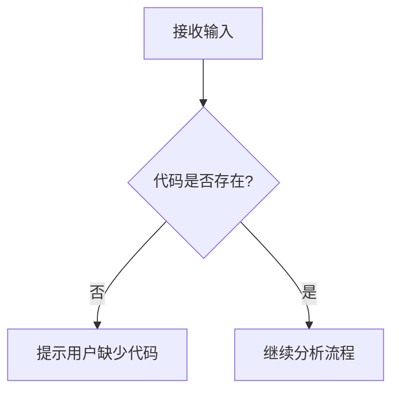

# `diffusers\tests\models\controlnets\__init__.py` 详细设计文档

未提供代码，无法生成描述

## 整体流程



## 类结构

```
无法确定 - 请提供代码
```

## 全局变量及字段


    

## 全局函数及方法


## 关键组件


## 问题及建议


### 已知问题

-   代码为空：未提供任何源代码可供分析，无法进行技术债务或优化空间的分析

### 优化建议

-   请提供需要分析的源代码，以便进行详细的技术债务识别和优化建议


## 其它


### 设计目标与约束

本文档旨在为空代码项目提供详细设计文档框架，具体内容需根据实际代码填充。

### 错误处理与异常设计

需根据实际代码分析可能的异常情况，定义异常类型、错误码和错误处理策略。

### 数据流与状态机

需分析数据输入、处理和输出流程，定义状态转换条件和状态机模型。

### 外部依赖与接口契约

需列出所有外部依赖库、模块和接口，明确接口参数、返回值和调用约定。

### 性能要求与约束

需定义性能指标，如响应时间、吞吐量、资源利用率等。

### 安全性设计

需分析安全需求，包括认证、授权、数据加密、输入验证等安全机制。

### 兼容性设计

需说明对不同环境、平台、版本的兼容性考虑和适配策略。

### 配置管理

需定义可配置参数、配置来源、配置加载方式和配置验证规则。

### 测试策略

需说明单元测试、集成测试、系统测试的策略和覆盖目标。

### 部署架构

需说明部署环境、部署流程、依赖服务和资源配置要求。

### 监控与日志

需定义需要监控的指标、日志级别、日志格式和告警策略。

### 版本管理

需说明版本号规则、版本兼容性策略和变更管理流程。

    