# `diffusers\tests\models\controlnets\test_models_controlnet_cosmos.py` 详细设计文档

这是一个针对CosmosControlNetModel的单元测试文件，测试该控制网络模型的前向传播、输出格式、条件缩放、图像上下文处理以及梯度检查点等功能，验证模型是否正确输出多个控制块样本。

## 整体流程

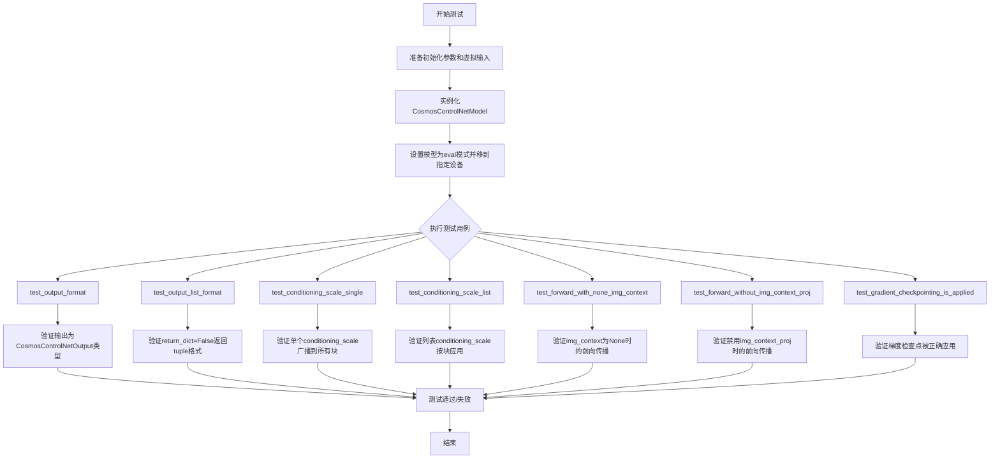

## 类结构

```
unittest.TestCase
└── CosmosControlNetModelTests (继承ModelTesterMixin)
    ├── 虚拟输入属性 (dummy_input)
    ├── 形状属性 (input_shape, output_shape)
    └── 7个测试方法 + 8个跳过的测试方法
```

## 全局变量及字段


### `torch_device`
    
PyTorch设备常量，通常为'cuda'或'cpu'

类型：`str`
    


### `batch_size`
    
批次大小，控制一次处理的样本数量

类型：`int`
    


### `num_channels`
    
通道数，表示数据的维度通道

类型：`int`
    


### `num_frames`
    
帧数，用于视频或时序数据的帧数

类型：`int`
    


### `height`
    
高度，图像或特征图的高度维度

类型：`int`
    


### `width`
    
宽度，图像或特征图的宽度维度

类型：`int`
    


### `text_embed_dim`
    
文本嵌入维度，文本特征的向量维度

类型：`int`
    


### `sequence_length`
    
序列长度，文本序列的token数量

类型：`int`
    


### `img_context_dim_in`
    
图像上下文输入维度，图像上下文输入的特征维度

类型：`int`
    


### `img_context_num_tokens`
    
图像上下文token数量，图像上下文序列的token数

类型：`int`
    


### `controls_latents`
    
控制网络的潜在变量输入

类型：`torch.Tensor`
    


### `latents`
    
基础潜在变量输入

类型：`torch.Tensor`
    


### `timestep`
    
扩散时间步

类型：`torch.Tensor`
    


### `condition_mask`
    
条件掩码，标识需要条件的区域

类型：`torch.Tensor`
    


### `padding_mask`
    
填充掩码，标识有效像素区域

类型：`torch.Tensor`
    


### `text_context`
    
文本上下文嵌入

类型：`torch.Tensor`
    


### `img_context`
    
图像上下文嵌入（Cosmos 2.5）

类型：`torch.Tensor`
    


### `encoder_hidden_states`
    
编码器隐藏状态，包含文本和图像上下文

类型：`tuple[torch.Tensor, torch.Tensor]`
    


### `conditioning_scale`
    
条件缩放因子，控制条件影响的强度

类型：`float或list[float]`
    


### `init_dict`
    
模型初始化参数字典

类型：`dict`
    


### `inputs_dict`
    
模型输入参数字典

类型：`dict`
    


### `CosmosControlNetModelTests.model_class`
    
被测试的模型类，指向CosmosControlNetModel

类型：`type`
    


### `CosmosControlNetModelTests.main_input_name`
    
主输入参数名称，为'controls_latents'

类型：`str`
    


### `CosmosControlNetModelTests.uses_custom_attn_processor`
    
是否使用自定义注意力处理器，设置为True

类型：`bool`
    
    

## 全局函数及方法


### `enable_full_determinism`

该函数是一个全局工具函数，用于在测试环境中启用完全确定性（full determinism），通过设置 PyTorch 的全局随机种子和环境变量，确保测试结果可复现。

参数：
- 无

返回值：`None`，无返回值

#### 流程图

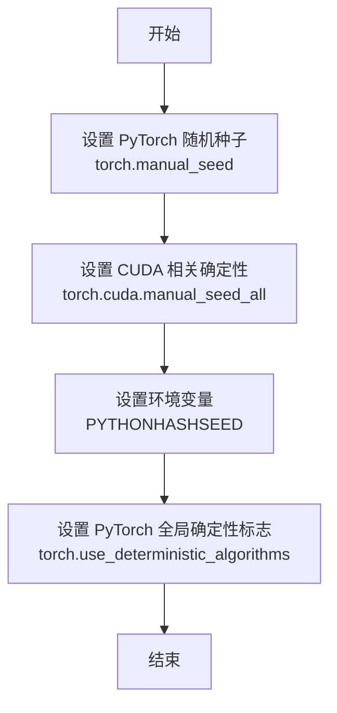

#### 带注释源码

```python
# 该函数从 testing_utils 模块导入
# 用于确保测试的可复现性
# 源代码位于 diffusers/testing_utils.py

# 使用方式：在测试模块开头调用
from ...testing_utils import enable_full_determinism

# 启用完全确定性
enable_full_determinism()


# 函数实现逻辑（推测）:
# 1. 设置 Python 随机种子 - random.seed(seed)
# 2. 设置 NumPy 随机种子 - np.random.seed(seed)  
# 3. 设置 PyTorch CPU 随机种子 - torch.manual_seed(seed)
# 4. 设置 PyTorch CUDA 随机种子 - torch.cuda.manual_seed_all(seed)
# 5. 设置环境变量 PYTHONHASHSEED
# 6. 启用 PyTorch 确定性算法 - torch.use_deterministic_algorithms(True)
# 7. 如果使用 CUDA，额外设置 - torch.backends.cudnn.deterministic = True
#                                     torch.backends.cudnn.benchmark = False

# 作用：确保每次运行测试时，随机数生成器产生相同的序列
# 用途：使单元测试结果可复现，便于调试和回归测试
```


### `CosmosControlNetModel`

Cosmos控制网络模型实现，用于从扩散模型的潜在表示中提取控制特征，支持多控制网络块、条件掩码和图像上下文处理。

参数：

- `n_controlnet_blocks`：`int`，控制网络块的数量
- `in_channels`：`int`，输入通道数（control_latent_channels + condition_mask + padding_mask）
- `latent_channels`：`int`，潜在通道数
- `model_channels`：`int`，模型通道数
- `num_attention_heads`：`int`，注意力头数量
- `attention_head_dim`：`int`，注意力头维度
- `mlp_ratio`：`int`，MLP扩展比率
- `text_embed_dim`：`int`，文本嵌入维度
- `adaln_lora_dim`：`int`，AdaLN LoRA维度
- `patch_size`：`tuple`， patch大小
- `max_size`：`tuple`，最大尺寸
- `rope_scale`：`tuple`，RoPE缩放因子
- `extra_pos_embed_type`：`str`，额外位置嵌入类型
- `img_context_dim_in`：`int`，图像上下文输入维度
- `img_context_dim_out`：`int`，图像上下文输出维度
- `use_crossattn_projection`：`bool`，是否使用交叉注意力投影

返回值：`CosmosControlNetOutput`，包含控制网络块的样本列表

#### 流程图

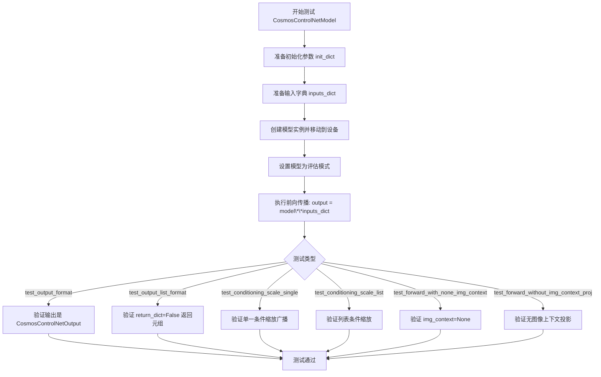

#### 带注释源码

```python
# 测试类定义，继承自 ModelTesterMixin 和 unittest.TestCase
class CosmosControlNetModelTests(ModelTesterMixin, unittest.TestCase):
    # 指定被测试的模型类
    model_class = CosmosControlNetModel
    # 主输入名称
    main_input_name = "controls_latents"
    # 使用自定义注意力处理器
    uses_custom_attn_processor = True

    # 创建虚拟输入数据
    @property
    def dummy_input(self):
        # 批大小和通道参数
        batch_size = 1
        num_channels = 16
        num_frames = 1
        height = 16
        width = 16
        text_embed_dim = 32
        sequence_length = 12
        img_context_dim_in = 32
        img_context_num_tokens = 4

        # 控制潜在表示（未分块）- controlnet 内部计算嵌入
        controls_latents = torch.randn((batch_size, num_channels, num_frames, height, width)).to(torch_device)
        # 基础潜在表示
        latents = torch.randn((batch_size, num_channels, num_frames, height, width)).to(torch_device)
        # 扩散时间步
        timestep = torch.tensor([0.5]).to(torch_device)
        # 条件掩码（全1）
        condition_mask = torch.ones(batch_size, 1, num_frames, height, width).to(torch_device)
        # 填充掩码（全0）
        padding_mask = torch.zeros(batch_size, 1, height, width).to(torch_device)

        # 文本嵌入
        text_context = torch.randn((batch_size, sequence_length, text_embed_dim)).to(torch_device)
        # Cosmos 2.5 的图像上下文
        img_context = torch.randn((batch_size, img_context_num_tokens, img_context_dim_in)).to(torch_device)
        encoder_hidden_states = (text_context, img_context)

        # 返回输入字典
        return {
            "controls_latents": controls_latents,
            "latents": latents,
            "timestep": timestep,
            "encoder_hidden_states": encoder_hidden_states,
            "condition_mask": condition_mask,
            "conditioning_scale": 1.0,
            "padding_mask": padding_mask,
        }

    # 输入形状属性
    @property
    def input_shape(self):
        return (16, 1, 16, 16)

    # 输出形状属性
    @property
    def output_shape(self):
        # 输出是 n_controlnet_blocks 个张量列表，每个形状为 (batch, num_patches, model_channels)
        # normalize_output 后: (n_blocks, batch, num_patches, model_channels)
        # 测试配置: n_blocks=2, num_patches=64 (1*8*8), model_channels=32
        return (2, 64, 32)

    # 准备初始化参数和输入
    def prepare_init_args_and_inputs_for_common(self):
        init_dict = {
            "n_controlnet_blocks": 2,
            # 输入通道 = 控制潜在通道 + 条件掩码 + 填充掩码
            "in_channels": 16 + 1 + 1,
            "latent_channels": 16 + 1 + 1,  # 基础潜在通道(16) + 条件掩码(1) + 填充掩码(1) = 18
            "model_channels": 32,
            "num_attention_heads": 2,
            "attention_head_dim": 16,
            "mlp_ratio": 2,
            "text_embed_dim": 32,
            "adaln_lora_dim": 4,
            "patch_size": (1, 2, 2),
            "max_size": (4, 32, 32),
            "rope_scale": (2.0, 1.0, 1.0),
            "extra_pos_embed_type": None,
            "img_context_dim_in": 32,
            "img_context_dim_out": 32,
            "use_crossattn_projection": False,
        }
        inputs_dict = self.dummy_input
        return init_dict, inputs_dict
```


### `CosmosControlNetOutput`

CosmosControlNetOutput 是 Cosmos 控制网络（ControlNet）的输出数据结构，用于封装模型前向传播后生成的多个控制块样本（control block samples）。该类作为模型输出的容器，使得调用者可以通过统一的接口获取所有控制网络块的计算结果。

参数：
该类通常通过模型前向调用时隐式创建，无需手动传入参数。以下为可能作为构造函数参数的字段：

- `control_block_samples`：`List[torch.Tensor]`，控制网络块输出的样本列表，每个元素对应一个控制网络块的计算结果

返回值：`CosmosControlNetOutput`，返回包含所有控制网络块样本的数据结构对象

#### 流程图

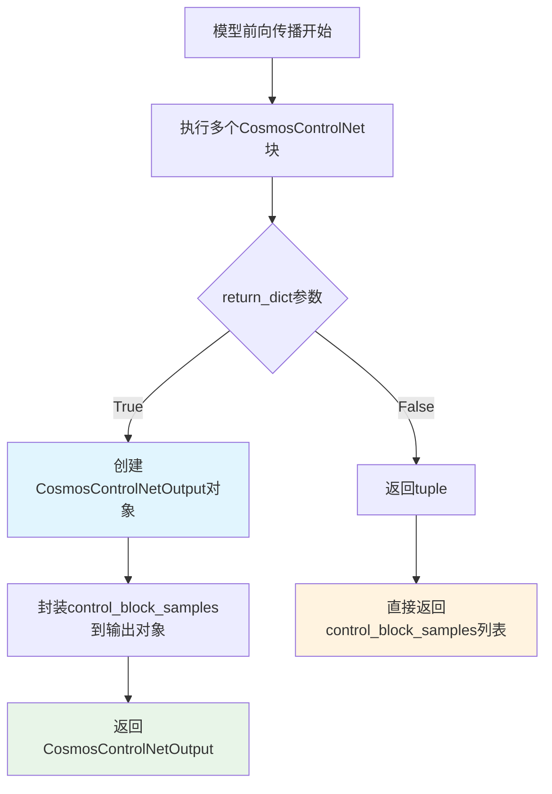

#### 带注释源码

```python
# CosmosControlNetOutput 是从 diffusers 库导入的输出数据结构类
# 源码位于: diffusers/models/controlnets/controlnet_cosmos.py
# 以下为基于测试用例推断的类结构和使用方式

# 导入语句（来自测试文件）
from diffusers.models.controlnets.controlnet_cosmos import CosmosControlNetOutput

# 使用示例（来自测试代码）
# 1. 模型输出创建
output = model(**inputs_dict)
# output 类型: CosmosControlNetOutput

# 2. 访问输出属性
# control_block_samples: List[torch.Tensor]
# - 存储所有控制网络块的输出样本
# - 列表长度等于 n_controlnet_blocks
samples = output.control_block_samples

# 3. 验证输出格式
assert isinstance(output, CosmosControlNetOutput)
assert isinstance(output.control_block_samples, list)
assert len(output.control_block_samples) == n_controlnet_blocks

# 4. 当 return_dict=False 时的返回格式
output_tuple = model(**inputs_dict, return_dict=False)
# 返回: tuple containing list (不是 CosmosControlNetOutput 对象)

# 推断的类结构（基于使用方式）:
"""
class CosmosControlNetOutput:
    # 主输出属性：控制块样本列表
    control_block_samples: List[torch.Tensor]
    
    def __init__(self, control_block_samples: List[torch.Tensor]):
        self.control_block_samples = control_block_samples
    
    # 可能支持索引访问
    def __getitem__(self, index):
        return self.control_block_samples[index]
"""
```

### 补充说明

#### 关键组件信息

| 组件名称 | 一句话描述 |
|---------|-----------|
| `control_block_samples` | 存储多个控制网络块输出张量的列表属性 |
| `CosmosControlNetModel` | Cosmos 控制网络模型类，生成 CosmosControlNetOutput 输出 |
| `n_controlnet_blocks` | 控制网络块数量，决定输出列表的长度 |

#### 潜在的技术债务或优化空间

1. **缺乏源码可见性**：当前代码仅导入 `CosmosControlNetOutput` 类，未提供其完整实现源码，建议补充原始定义文件
2. **输出格式兼容性**：测试代码显示需要特殊处理 `return_dict=False` 的情况，可能增加调用方复杂性
3. **类型注解完整性**：建议为输出类添加完整的类型注解和文档字符串

#### 其它项目

**设计目标与约束**：
- 目标：提供统一的接口封装多个控制网络块的输出结果
- 约束：输出列表长度必须与配置的 `n_controlnet_blocks` 一致

**错误处理与异常设计**：
- 测试用例验证了输出类型检查，确保返回的是 `CosmosControlNetOutput` 实例
- 列表元素类型验证：每个元素必须是 `torch.Tensor`

**数据流与状态机**：
```
Input (controls_latents, latents, timestep, encoder_hidden_states, condition_mask, padding_mask)
    ↓
CosmosControlNetModel.forward()
    ↓
多个控制网络块并行计算
    ↓
收集各块输出 → control_block_samples 列表
    ↓
封装为 CosmosControlNetOutput 对象
    ↓
Output
```

**外部依赖与接口契约**：
- 依赖：`torch` 库（张量计算）
- 依赖：`diffusers` 库（模型基类和控制网络实现）
- 接口契约：调用方可通过 `.control_block_samples` 属性访问输出列表


### `CosmosControlNetModelTests.dummy_input`

这是一个属性方法（property），用于生成模型测试所需的虚拟输入字典。它创建各种随机张量来模拟真实的模型输入，包括控制潜在变量、潜在变量、时间步、文本上下文、图像上下文、条件掩码和填充掩码等。

参数：

- 该方法无显式参数（使用类实例的内部状态）

返回值：`Dict[str, Union[torch.Tensor, float]]`，返回包含模型测试所需所有输入张量的字典

#### 流程图

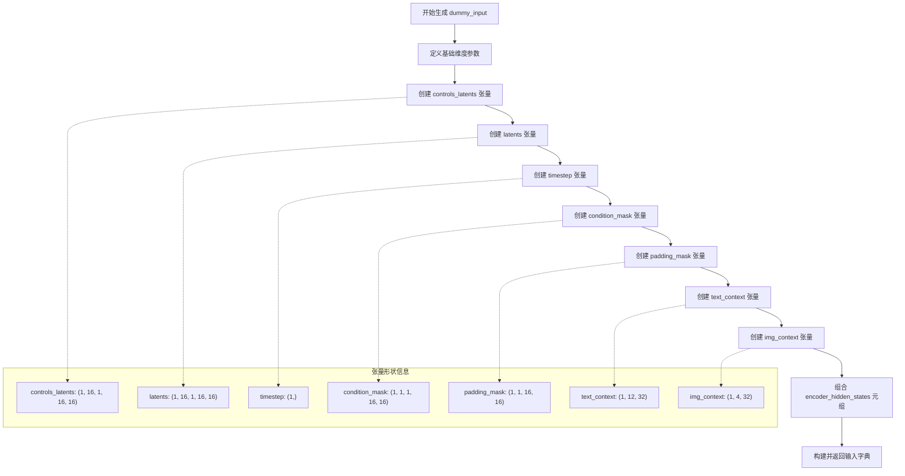

#### 带注释源码

```python
@property
def dummy_input(self):
    """
    生成用于模型测试的虚拟输入字典。
    包含模型推理所需的所有张量输入。
    """
    # ==================== 基础维度参数定义 ====================
    batch_size = 1                      # 批次大小
    num_channels = 16                   # 通道数
    num_frames = 1                      # 帧数
    height = 16                         # 高度
    width = 16                          # 宽度
    text_embed_dim = 32                 # 文本嵌入维度
    sequence_length = 12                # 序列长度
    img_context_dim_in = 32             # 图像上下文输入维度
    img_context_num_tokens = 4          # 图像上下文 token 数量

    # ==================== 核心张量创建 ====================
    
    # controls_latents: 控制网络的潜在变量输入
    # 形状: (batch_size, num_channels, num_frames, height, width)
    # 注释说明: 原始潜在变量（未分块），controlnet 内部计算嵌入
    controls_latents = torch.randn((batch_size, num_channels, num_frames, height, width)).to(torch_device)
    
    # latents: 主模型的潜在变量输入
    # 形状: (batch_size, num_channels, num_frames, height, width)
    latents = torch.randn((batch_size, num_channels, num_frames, height, width)).to(torch_device)
    
    # timestep: 扩散过程的时间步
    # 形状: (1,)
    # 注释说明: 扩散时间步，值为 0.5
    timestep = torch.tensor([0.5]).to(torch_device)
    
    # condition_mask: 条件掩码，指示哪些位置有条件输入
    # 形状: (batch_size, 1, num_frames, height, width)
    # 注释说明: 全1矩阵，表示所有位置都有条件
    condition_mask = torch.ones(batch_size, 1, num_frames, height, width).to(torch_device)
    
    # padding_mask: 填充掩码，指示哪些位置是有效的
    # 形状: (batch_size, 1, height, width)
    # 注释说明: 全0矩阵，表示所有位置有效（无填充）
    padding_mask = torch.zeros(batch_size, 1, height, width).to(torch_device)

    # ==================== 文本和图像上下文 ====================
    
    # text_context: 文本嵌入/条件
    # 形状: (batch_size, sequence_length, text_embed_dim)
    # 注释说明: 文本嵌入向量
    text_context = torch.randn((batch_size, sequence_length, text_embed_dim)).to(torch_device)
    
    # img_context: 图像上下文（用于 Cosmos 2.5）
    # 形状: (batch_size, img_context_num_tokens, img_context_dim_in)
    # 注释说明: 图像上下文向量，用于额外的视觉条件
    img_context = torch.randn((batch_size, img_context_num_tokens, img_context_dim_in)).to(torch_device)
    
    # encoder_hidden_states: 编码器隐藏状态（元组形式）
    # 包含: (text_context, img_context)
    # 注释说明: 文本和图像上下文组合作为 encoder_hidden_states
    encoder_hidden_states = (text_context, img_context)

    # ==================== 返回输入字典 ====================
    return {
        "controls_latents": controls_latents,      # 控制潜在变量
        "latents": latents,                         # 主潜在变量
        "timestep": timestep,                       # 扩散时间步
        "encoder_hidden_states": encoder_hidden_states,  # 编码器隐藏状态
        "condition_mask": condition_mask,            # 条件掩码
        "conditioning_scale": 1.0,                  # 条件缩放因子
        "padding_mask": padding_mask,               # 填充掩码
    }
```


### `CosmosControlNetModelTests.input_shape`

该属性方法用于返回 CosmosControlNetModel 的输入形状元组，定义了模型期望的输入张量的维度信息。

参数： 无

返回值：`tuple`，返回输入形状元组 `(16, 1, 16, 16)`，分别代表 (通道数, 帧数, 高度, 宽度)

#### 流程图

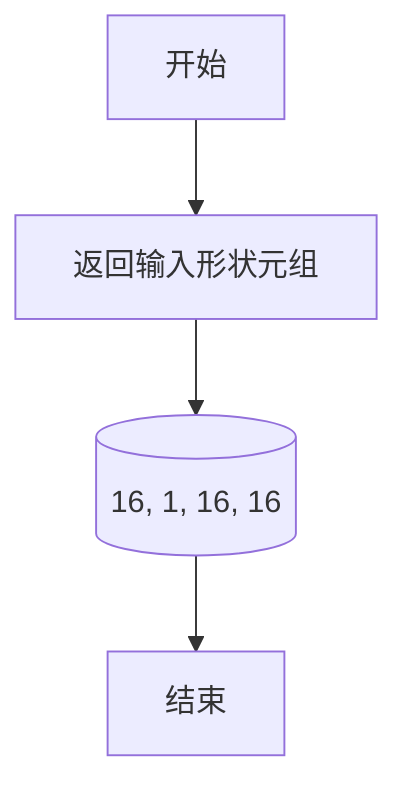

#### 带注释源码

```python
@property
def input_shape(self):
    # 返回模型输入的形状元组
    # 格式: (num_channels, num_frames, height, width)
    # 16: 通道数 (num_channels)
    # 1: 帧数 (num_frames) - 表示单帧输入
    # 16: 高度 (height)
    # 16: 宽度 (width)
    return (16, 1, 16, 16)
```


### `CosmosControlNetModelTests.output_shape`

该属性方法用于返回 CosmosControlNetModel 测试配置下的预期输出形状元组，包含了控制网络块数量、批次大小、补丁数量和模型通道数信息，主要用于测试框架中验证模型输出的形状是否符合预期。

参数：无需参数（作为属性访问）

返回值：`Tuple[int, int, int]`，返回形状元组 (2, 64, 32)，分别代表 n_controlnet_blocks（控制网络块数）、num_patches（补丁数量）、model_channels（模型通道数）

#### 流程图

```mermaid
flowchart TD
    A[开始访问 output_shape 属性] --> B{检查配置}
    B --> C[返回固定元组 (2, 64, 32)]
    C --> D[结束]
    
    style A fill:#e1f5fe
    style C fill:#c8e6c9
    style D fill:#ffcdd2
```

#### 带注释源码

```python
@property
def output_shape(self):
    # Output is tuple of n_controlnet_blocks tensors, each with shape (batch, num_patches, model_channels)
    # After stacking by normalize_output: (n_blocks, batch, num_patches, model_channels)
    # For test config: n_blocks=2, num_patches=64 (1*8*8), model_channels=32
    # output_shape is used as (batch_size,) + output_shape, so: (2, 64, 32)
    return (2, 64, 32)
```


### `CosmosControlNetModelTests.prepare_init_args_and_inputs_for_common`

该方法用于准备 CosmosControlNetModel 的测试初始化参数和输入数据。它构建了一个包含模型架构配置的字典（init_dict）和一个包含测试输入的字典（inputs_dict），并返回这两个字典的元组，供类中的其他测试方法使用。

参数：

- 该方法无显式参数（仅包含隐式参数 `self`）

返回值：`Tuple[Dict, Dict]`，返回包含初始化参数字典和输入数据字典的元组。第一个字典包含模型配置信息，第二个字典包含模型前向传播所需的输入数据。

#### 流程图

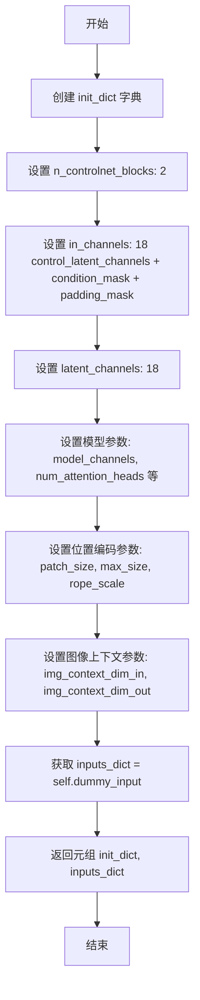

#### 带注释源码

```python
def prepare_init_args_and_inputs_for_common(self):
    """
    准备模型初始化参数和测试输入数据，用于通用测试场景。
    
    返回:
        Tuple[Dict, Dict]: 包含 (初始化参数字典, 输入数据字典) 的元组
    """
    # 定义模型初始化参数字典，包含模型架构的所有关键配置
    init_dict = {
        # 控制网络块数量，测试配置使用2个块
        "n_controlnet_blocks": 2,
        
        # 输入通道数 = 控制潜在通道(16) + 条件掩码(1) + 填充掩码(1) = 18
        "in_channels": 16 + 1 + 1,  # control_latent_channels + condition_mask + padding_mask
        
        # 潜在通道数，同样为18（基础潜在通道 + 条件掩码 + 填充掩码）
        "latent_channels": 16 + 1 + 1,  # base_latent_channels (16) + condition_mask (1) + padding_mask (1) = 18
        
        # 模型内部通道维度
        "model_channels": 32,
        
        # 注意力头的数量
        "num_attention_heads": 2,
        
        # 每个注意力头的维度
        "attention_head_dim": 16,
        
        # MLP扩展比例
        "mlp_ratio": 2,
        
        # 文本嵌入维度
        "text_embed_dim": 32,
        
        # AdaLN LoRA维度，用于自适应层归一化
        "adaln_lora_dim": 4,
        
        # 补丁大小（时间 x 高度 x 宽度）
        "patch_size": (1, 2, 2),
        
        # 最大尺寸配置（时间 x 高度 x 宽度）
        "max_size": (4, 32, 32),
        
        # 旋转位置编码缩放因子
        "rope_scale": (2.0, 1.0, 1.0),
        
        # 额外位置嵌入类型，None表示不使用
        "extra_pos_embed_type": None,
        
        # 图像上下文输入维度
        "img_context_dim_in": 32,
        
        # 图像上下文输出维度
        "img_context_dim_out": 32,
        
        # 是否使用交叉注意力投影，测试中禁用
        "use_crossattn_projection": False,  # Test doesn't need this projection
    }
    
    # 从测试类的 dummy_input 属性获取预构建的输入数据
    inputs_dict = self.dummy_input
    
    # 返回初始化参数字典和输入数据字典的元组
    return init_dict, inputs_dict
```


### `CosmosControlNetModelTests.test_output_format`

该测试方法验证 CosmosControlNetModel 的前向传播输出是否符合预期的 `CosmosControlNetOutput` 结构，包括检查输出类型、控制块样本列表的长度以及每个元素的张量类型。

参数：

- `self`：隐式参数，测试类实例本身，无类型描述

返回值：`None`，该方法为测试方法，通过断言验证输出格式，不返回任何值

#### 流程图

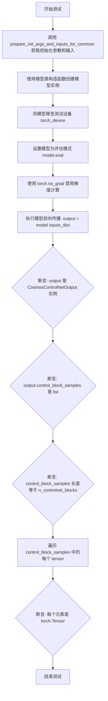

#### 带注释源码

```python
def test_output_format(self):
    """Test that the model outputs CosmosControlNetOutput with correct structure."""
    # 准备模型初始化参数和测试输入数据
    init_dict, inputs_dict = self.prepare_init_args_and_inputs_for_common()
    # 根据 init_dict 中的配置创建 CosmosControlNetModel 实例
    model = self.model_class(**init_dict)
    # 将模型移至测试设备（如 GPU 或 CPU）
    model.to(torch_device)
    # 设置模型为评估模式，禁用 dropout 等训练特有的层
    model.eval()

    # 禁用梯度计算以提高推理效率并减少内存占用
    with torch.no_grad():
        # 执行模型前向传播，获取输出
        output = model(**inputs_dict)

    # 断言1: 验证输出是 CosmosControlNetOutput 类型的实例
    self.assertIsInstance(output, CosmosControlNetOutput)
    # 断言2: 验证输出的 control_block_samples 属性是列表类型
    self.assertIsInstance(output.control_block_samples, list)
    # 断言3: 验证 control_block_samples 列表的长度等于配置的控制块数量
    self.assertEqual(len(output.control_block_samples), init_dict["n_controlnet_blocks"])
    # 断言4: 遍历验证列表中的每个元素都是 torch.Tensor 类型
    for tensor in output.control_block_samples:
        self.assertIsInstance(tensor, torch.Tensor)
```


### `CosmosControlNetModelTests.test_output_list_format`

该测试方法用于验证当 `return_dict=False` 时，`CosmosControlNetModel` 的前向传播返回格式为包含列表的元组（tuple），确保模型在两种输出格式下的行为一致性。

参数：

- `self`：隐式参数，测试类实例本身，无需额外描述

返回值：无（测试方法无返回值，通过 `assert` 语句验证输出格式）

#### 流程图

```mermaid
flowchart TD
    A[开始测试 test_output_list_format] --> B[准备初始化参数 init_dict 和输入 inputs_dict]
    B --> C[使用 init_dict 实例化 CosmosControlNetModel]
    C --> D[model.to torch_device 移至测试设备]
    D --> E[model.eval 设置为评估模式]
    E --> F[with torch.no_grad 执行前向传播]
    F --> G[model call: output = model return_dict=False]
    G --> H[assert output 是 tuple 类型]
    H --> I[assert len output == 1]
    I --> J[assert output[0] 是 list 类型]
    J --> K[assert len output[0] == n_controlnet_blocks]
    K --> L[测试通过]
    H --> M[测试失败: 输出不是 tuple]
    I --> M
    J --> M
    K --> M
```

#### 带注释源码

```python
def test_output_list_format(self):
    """Test that return_dict=False returns a tuple containing a list."""
    # 1. 准备模型初始化参数和测试输入数据
    # 从测试Mixin获取预定义的配置和输入字典
    init_dict, inputs_dict = self.prepare_init_args_and_inputs_for_common()
    
    # 2. 使用初始化参数实例化 CosmosControlNetModel 模型对象
    model = self.model_class(**init_dict)
    
    # 3. 将模型移动到指定的测试设备（如CUDA或CPU）
    model.to(torch_device)
    
    # 4. 设置模型为评估模式，禁用Dropout等训练特定操作
    model.eval()

    # 5. 在无梯度计算上下文中执行前向传播，节省内存
    #    关键点：传入 return_dict=False 参数，要求返回tuple格式而非dict
    with torch.no_grad():
        output = model(**inputs_dict, return_dict=False)

    # 6. 验证输出格式符合预期
    # 6.1 验证返回值是tuple类型（而非 CosmosControlNetOutput 对象）
    self.assertIsInstance(output, tuple)
    
    # 6.2 验证tuple中只有一个元素
    self.assertEqual(len(output), 1)
    
    # 6.3 验证该元素是list类型（包含多个control block的输出）
    self.assertIsInstance(output[0], list)
    
    # 6.4 验证list长度等于配置的n_controlnet_blocks数量（本例为2）
    self.assertEqual(len(output[0]), init_dict["n_controlnet_blocks"])
```


### `CosmosControlNetModelTests.test_conditioning_scale_single`

测试当传入单个 `conditioning_scale` 值时，该值能够被正确广播到所有的 ControlNet blocks。

参数：

- `self`：`CosmosControlNetModelTests`，测试类的实例，包含了模型测试所需的配置和方法

返回值：`None`，该方法为测试方法，不返回任何值，通过 `assertEqual` 断言验证输出

#### 流程图

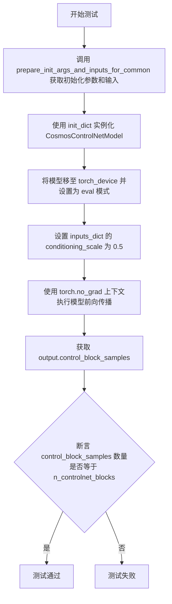

#### 带注释源码

```python
def test_conditioning_scale_single(self):
    """Test that a single conditioning scale is broadcast to all blocks."""
    # 步骤1: 获取模型初始化参数和测试输入数据
    init_dict, inputs_dict = self.prepare_init_args_and_inputs_for_common()
    
    # 步骤2: 使用初始化参数字典创建 CosmosControlNetModel 实例
    model = self.model_class(**init_dict)
    
    # 步骤3: 将模型移至指定的计算设备（如 GPU）并设置为评估模式
    model.to(torch_device)
    model.eval()

    # 步骤4: 设置条件缩放系数为单个值 0.5（测试该值能否广播到所有 blocks）
    inputs_dict["conditioning_scale"] = 0.5

    # 步骤5: 在 no_grad 上下文中执行前向传播（不计算梯度以节省内存）
    with torch.no_grad():
        output = model(**inputs_dict)

    # 步骤6: 断言验证输出的 control_block_samples 数量是否等于配置的 n_controlnet_blocks
    # 期望行为：单个 0.5 值应被广播到所有 2 个 controlnet blocks
    self.assertEqual(len(output.control_block_samples), init_dict["n_controlnet_blocks"])
```


### `CosmosControlNetModelTests.test_conditioning_scale_list`

该测试方法用于验证当传入conditioning_scale列表时，模型能够正确地将每个缩放系数应用到对应的控制块（control block）。测试创建一个包含2个控制块的CosmosControlNetModel，传入`[0.5, 1.0]`作为conditioning_scale，验证输出中包含正确数量的控制块样本。

参数：

- `self`：测试类实例本身，无需显式传递

返回值：`None`，该方法为单元测试，使用断言验证模型行为，不返回任何值

#### 流程图

```mermaid
flowchart TD
    A[开始测试 test_conditioning_scale_list] --> B[调用 prepare_init_args_and_inputs_for_common 获取初始化参数和输入]
    B --> C[创建 CosmosControlNetModel 实例]
    C --> D[将模型移动到 torch_device]
    D --> E[设置模型为评估模式 eval]
    E --> F[设置 conditioning_scale 为列表 [0.5, 1.0]]
    F --> G[使用 torch.no_grad 上下文执行前向传播]
    G --> H[获取模型输出 CosmosControlNetOutput]
    H --> I{断言: 输出控制块数量是否等于 n_controlnet_blocks}
    I -->|是| J[测试通过]
    I -->|否| K[测试失败, 抛出 AssertionError]
```

#### 带注释源码

```python
def test_conditioning_scale_list(self):
    """
    Test that a list of conditioning scales is applied per block.
    测试当conditioning_scale为列表时,是否正确地对每个控制块应用对应的缩放系数
    """
    # 准备初始化参数和测试输入
    # 获取模型初始化所需参数和默认输入字典
    init_dict, inputs_dict = self.prepare_init_args_and_inputs_for_common()
    
    # 创建CosmosControlNetModel模型实例
    # 使用init_dict中定义的配置: n_controlnet_blocks=2, model_channels=32等
    model = self.model_class(**init_dict)
    
    # 将模型移动到指定的计算设备(CPU/GPU)
    model.to(torch_device)
    
    # 设置为评估模式,禁用dropout等训练特定层
    model.eval()

    # 设置conditioning_scale为列表,每个元素对应一个控制块的缩放系数
    # 列表长度为2,对应2个控制块
    # 第一个控制块使用0.5的缩放,第二个控制块使用1.0的缩放
    inputs_dict["conditioning_scale"] = [0.5, 1.0]

    # 禁用梯度计算,减少内存占用,加速推理
    with torch.no_grad():
        # 执行前向传播,传入所有输入参数
        # 模型内部应该将conditioning_scale列表中的每个值
        # 应用于对应的控制块输出
        output = model(**inputs_dict)

    # 断言验证:输出的控制块样本数量应等于配置的控制块数量
    # 确保模型正确处理了列表形式的conditioning_scale
    self.assertEqual(len(output.control_block_samples), init_dict["n_controlnet_blocks"])
```


### `CosmosControlNetModelTests.test_forward_with_none_img_context`

测试 CosmosControlNetModel 当前向传播时 `img_context` 参数为 `None` 时的行为，验证模型能正确处理仅包含文本上下文而没有图像上下文的输入场景。

参数：

- `self`：隐式参数，测试类实例本身，无描述

返回值：`CosmosControlNetOutput`，包含控制网络块样本的输出对象，验证模型在 img_context 为 None 时仍能正常输出

#### 流程图

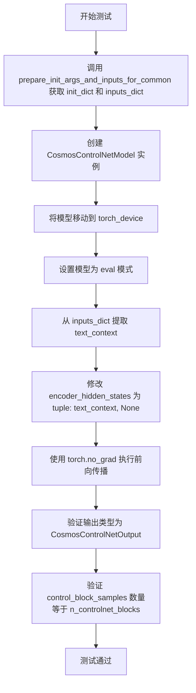

#### 带注释源码

```python
def test_forward_with_none_img_context(self):
    """Test forward pass when img_context is None."""
    # 1. 获取模型初始化参数和测试输入数据
    init_dict, inputs_dict = self.prepare_init_args_and_inputs_for_common()
    
    # 2. 使用初始参数字典创建 CosmosControlNetModel 模型实例
    model = self.model_class(**init_dict)
    
    # 3. 将模型移动到指定的计算设备（如 CUDA 或 CPU）
    model.to(torch_device)
    
    # 4. 设置模型为评估模式，禁用 dropout 等训练特定行为
    model.eval()

    # 5. 从输入字典中提取文本上下文（encoder_hidden_states 是一个元组，包含 text_context 和 img_context）
    text_context = inputs_dict["encoder_hidden_states"][0]
    
    # 6. 构造新的 encoder_hidden_states：文本上下文保持不变，图像上下文设为 None
    # 这是为了测试模型在缺少图像上下文时的容错能力
    inputs_dict["encoder_hidden_states"] = (text_context, None)

    # 7. 在不计算梯度的上下文中执行前向传播（推理模式）
    with torch.no_grad():
        output = model(**inputs_dict)

    # 8. 断言验证：确保输出是 CosmosControlNetOutput 类型的实例
    self.assertIsInstance(output, CosmosControlNetOutput)
    
    # 9. 断言验证：确保输出的控制块样本数量与配置的控制块数量一致
    self.assertEqual(len(output.control_block_samples), init_dict["n_controlnet_blocks"])
```


### `CosmosControlNetModelTests.test_forward_without_img_context_proj`

该测试方法用于验证当 `img_context_proj` 功能被禁用时（即 `img_context_dim_in` 设置为 `None`），模型的前向传播仍然能够正常工作。此时 `encoder_hidden_states` 只传递文本上下文（而非元组），测试确保模型输出 `CosmosControlNetOutput` 结构且包含正确数量的控制块样本。

参数：

- `self`：`CosmosControlNetModelTests`，测试类实例本身，无需显式传递

返回值：无（`None`），该方法为 `void` 类型，通过 `assert` 语句验证模型输出的正确性

#### 流程图

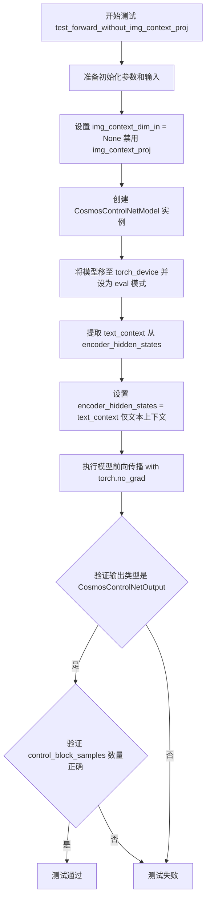

#### 带注释源码

```python
def test_forward_without_img_context_proj(self):
    """
    Test forward pass when img_context_proj is not configured.
    测试当 img_context_proj 未配置时的前向传播。
    验证模型在禁用图像上下文投影功能后仍能正常运行。
    """
    # 步骤1: 获取初始化参数和输入数据
    # prepare_init_args_and_inputs_for_common 返回包含模型配置和测试输入的字典
    init_dict, inputs_dict = self.prepare_init_args_and_inputs_for_common()
    
    # 步骤2: 禁用 img_context_proj 功能
    # 通过将 img_context_dim_in 设置为 None 来禁用图像上下文投影
    # 这模拟了不使用 Cosmos 2.5 图像上下文功能的场景
    init_dict["img_context_dim_in"] = None
    
    # 步骤3: 创建模型实例
    # 使用修改后的初始化参数创建 CosmosControlNetModel
    model = self.model_class(**init_dict)
    
    # 步骤4: 将模型移至测试设备并设为评估模式
    # torch_device 是测试工具提供的目标设备 (CPU/CUDA)
    # eval() 模式禁用 dropout 并启用 BatchNorm/InstanceNorm 的推理行为
    model.to(torch_device)
    model.eval()
    
    # 步骤5: 处理 encoder_hidden_states
    # 当 img_context 被禁用时，encoder_hidden_states 应为单一文本张量而非元组
    # 从原始输入中提取 text_context (第一个元素)
    text_context = inputs_dict["encoder_hidden_states"][0]
    
    # 将 encoder_hidden_states 设置为纯文本上下文（不是元组）
    # 这是为了模拟不使用图像上下文功能的实际场景
    inputs_dict["encoder_hidden_states"] = text_context
    
    # 步骤6: 执行前向传播
    # 使用 torch.no_grad() 禁用梯度计算，减少内存占用并加速推理
    with torch.no_grad():
        # **inputs_dict 将字典解包为关键字参数传递给模型
        output = model(**inputs_dict)
    
    # 步骤7: 验证输出结构
    # 断言1: 验证输出是 CosmosControlNetOutput 类型
    # CosmosControlNetOutput 是包含控制网络输出的 dataclass
    self.assertIsInstance(output, CosmosControlNetOutput)
    
    # 断言2: 验证 control_block_samples 列表长度正确
    # 应等于 n_controlnet_blocks 配置值（此处为 2）
    self.assertEqual(
        len(output.control_block_samples), 
        init_dict["n_controlnet_blocks"]
    )
```


### `CosmosControlNetModelTests.test_gradient_checkpointing_is_applied`

该测试方法用于验证 `CosmosControlNetModel` 模型是否正确应用了梯度检查点（Gradient Checkpointing）技术，通过调用父类的测试方法来检查指定的模型类是否启用了梯度检查点功能。

参数：

- `self`：`CosmosControlNetModelTests`，当前测试类的实例，用于访问父类方法和测试属性

返回值：`None`，该方法为测试用例，通过断言验证梯度检查点是否应用，不返回任何值

#### 流程图

```mermaid
flowchart TD
    A[开始测试] --> B[创建期望集合 expected_set = {'CosmosControlNetModel'}]
    B --> C[调用父类 test_gradient_checkpointing_is_applied 方法]
    C --> D{父类测试验证结果}
    D -->|通过| E[测试通过 - 梯度检查点已正确应用]
    D -->|失败| F[抛出 AssertionError - 梯度检查点未正确应用]
```

#### 带注释源码

```python
def test_gradient_checkpointing_is_applied(self):
    """
    测试梯度检查点是否正确应用于 CosmosControlNetModel。
    
    该测试方法继承自 ModelTesterMixin，用于验证模型在前向传播过程中
    正确使用了梯度检查点技术来节省显存。梯度检查点通过在反向传播时
    重新计算中间激活值来减少显存占用，是训练大型模型的常用优化技术。
    """
    # 定义期望启用梯度检查点的模型类集合
    # CosmosControlNetModel 是需要验证的模型类
    expected_set = {"CosmosControlNetModel"}
    
    # 调用父类 ModelTesterMixin 的测试方法
    # 父类方法会验证 expected_set 中的模型类是否正确应用了梯度检查点
    # 如果模型未正确应用梯度检查点，父类测试将抛出 AssertionError
    super().test_gradient_checkpointing_is_applied(expected_set=expected_set)
```

#### 关键信息说明

| 项目 | 描述 |
|------|------|
| **所属类** | `CosmosControlNetModelTests` |
| **继承关系** | 继承自 `ModelTesterMixin` 和 `unittest.TestCase` |
| **测试目的** | 验证 `CosmosControlNetModel` 类启用了梯度检查点功能 |
| **父类方法** | `ModelTesterMixin.test_gradient_checkpointing_is_applied(expected_set)` |
| **验证逻辑** | 父类方法会比较启用/禁用梯度检查点时的输出，确保功能一致性 |

## 关键组件


### CosmosControlNetModel

主模型类，是一个用于Diffusion模型的控制网络（ControlNet）实现，能够根据输入的controls_latents、条件掩码和文本/图像上下文生成控制块样本。

### CosmosControlNetOutput

模型输出数据结构，包含control_block_samples列表，每个元素是一个控制块的输出张量。

### controls_latents（控制潜在表示）

输入张量，形状为(batch, num_channels, num_frames, height, width)，代表原始的latents（未patchified），控制网络内部会计算其embeddings。

### latents（基础潜在表示）

输入张量，形状为(batch, num_channels, num_frames, height, width)，代表基础_latent，用于与controls_latents一起处理。

### encoder_hidden_states（元组）

编码器隐藏状态，包含(text_context, img_context)元组，其中text_context是文本嵌入，img_context是Cosmos 2.5的图像上下文。

### condition_mask（条件掩码）

输入张量，形状为(batch, 1, num_frames, height, width)，用于指示哪些区域应用条件控制。

### padding_mask（填充掩码）

输入张量，形状为(batch, 1, height, width)，用于指示有效像素区域。

### conditioning_scale（条件缩放因子）

控制参数，可以是单个浮点数（广播到所有块）或列表（每个块独立的缩放），用于调节控制效果的强度。

### n_controlnet_blocks（控制块数量）

模型参数，指定要使用的控制网络块数量，影响输出的control_block_samples列表长度。

### dummy_input（虚拟输入）

测试辅助属性，生成用于模型测试的虚拟输入数据，包括所有必需的输入张量。

### prepare_init_args_and_inputs_for_common（初始化配置方法）

测试辅助方法，返回模型初始化参数字典和输入字典，包含模型通道数、注意力头数、patch_size等配置。

### test_output_format（输出格式测试）

验证模型输出为CosmosControlNetOutput类型，且control_block_samples为列表，长度等于n_controlnet_blocks。

### test_conditioning_scale_single（单条件缩放测试）

验证单个浮点数的conditioning_scale能够正确广播到所有控制块。

### test_conditioning_scale_list（多条件缩放测试）

验证列表形式的conditioning_scale能够为每个控制块应用不同的缩放因子。

### test_forward_with_none_img_context（空图像上下文测试）

测试当img_context为None时模型的正向传播，验证图像上下文可选项的处理逻辑。

### test_forward_without_img_context_proj（无图像投影测试）

测试当禁用img_context_proj（即img_context_dim_in=None）时的模型行为，此时encoder_hidden_states只需传入文本上下文。

### test_gradient_checkpointing_is_applied（梯度检查点测试）

验证梯度检查点功能是否正确应用于CosmosControlNetModel。


## 问题及建议


### 已知问题

-   **大量测试被跳过**: 该测试类跳过了12个测试用例，包括`test_forward_with_norm_groups`、`test_effective_gradient_checkpointing`、`test_ema_training`、`test_training`、`test_output`、`test_outputs_equivalence`、`test_model_parallelism`、`test_layerwise_casting_inference`、`test_layerwise_casting_memory`、`test_layerwise_casting_training`等，表明该模型架构与基类`ModelTesterMixin`的许多通用测试假设不兼容，可能存在功能缺失或接口不一致
-   **输出格式不标准**: 控制网络输出为`CosmosControlNetOutput`对象，其中`control_block_samples`是列表而非单个张量，与Diffusers中其他模型的标准输出格式不同，导致需要跳过依赖标准输出格式的测试
-   **梯度检查点测试覆盖不完整**: 虽然启用了`test_gradient_checkpointing_is_applied`，但`test_effective_gradient_checkpointing`被跳过，表明梯度检查点的有效性验证存在缺口
-   **硬编码的配置值**: `n_controlnet_blocks=2`、`num_attention_heads=2`、`attention_head_dim=16`等参数在`prepare_init_args_and_inputs_for_inputs_for_common`中硬编码，测试灵活性不足
-   **input_shape与output_shape的描述不准确**: `input_shape`返回`(16, 1, 16, 16)`但实际输入是5D张量`(batch, channels, frames, height, width)`，注释中关于`num_patches=64`的说明与实际的patchify逻辑可能存在偏差

### 优化建议

-   **重构测试基类兼容性**: 考虑为ControlNet类型模型创建专用的测试mixin或基类，减少大量跳过测试的情况，提高测试覆盖率和模型质量保证
-   **增强输出格式验证**: 添加更详细的输出格式验证测试，包括对`control_block_samples`列表中每个张量的shape、dtype、device验证，而不仅仅验证类型
-   **参数化测试**: 将硬编码的配置值转换为测试参数或fixture，支持不同配置组合的测试，提高测试的全面性
-   **完善梯度检查点测试**: 实现`test_effective_gradient_checkpointing`测试，确保梯度检查点不仅被应用而且有效
-   **添加边缘情况测试**: 增加对`img_context`为None、`encoder_hidden_states`为单一张量而非元组等边缘情况的更全面测试覆盖
-   **文档化架构差异**: 在测试类或模型文档中明确说明`CosmosControlNetModel`与其他Diffusers模型的架构差异，便于后续维护和理解

## 其它


### 设计目标与约束

本测试文件的设计目标是验证 CosmosControlNetModel 模型的输出格式、条件缩放机制、图像上下文处理以及梯度检查点功能的正确性。约束条件包括：不支持 norm groups、不具备 .sample 属性、输出为控制块样本列表而非单一张量、不兼容递归字典检查。

### 错误处理与异常设计

测试用例覆盖了多种输入配置场景，包括 img_context 为 None、img_context_proj 未配置、conditioning_scale 为单值或列表等情况。异常设计主要通过 unittest.skip 装饰器跳过不适用的基类测试，确保测试套件不会因架构差异而产生误报。

### 数据流与状态机

输入数据流：controls_latents → 条件掩码 + 填充掩码 → 文本嵌入 + 图像上下文 → 前向传播 → 输出控制块样本列表。状态机转换：初始化模型 → 设置评估模式 → 执行前向推理 → 验证输出结构。

### 外部依赖与接口契约

主要依赖包括：torch（张量计算）、unittest（测试框架）、diffusers.CosmosControlNetModel（被测模型）、diffusers.models.controlnets.controlnet_cosmos.CosmosControlNetOutput（输出数据结构）。接口契约要求模型接受 controls_latents、latents、timestep、encoder_hidden_states、condition_mask、conditioning_scale、padding_mask 参数，并返回 CosmosControlNetOutput 对象。

### 测试覆盖范围

测试覆盖输出格式验证、返回字典模式切换、条件缩放广播机制、图像上下文可选性、梯度检查点应用等核心功能。边界情况包括：空图像上下文、禁用的图像上下文投影、多控制块条件缩放列表。

### 配置参数说明

关键配置参数包括：n_controlnet_blocks（控制块数量）、in_channels/latent_channels（通道维度）、model_channels（模型通道）、num_attention_heads 和 attention_head_dim（注意力配置）、patch_size 和 max_size（补丁处理）、rope_scale（旋转位置编码缩放）、img_context_dim_in/out（图像上下文维度）。

### 测试环境要求

需要 CUDA 或 CPU 计算设备，通过 torch_device 动态选择。依赖 diffusers 库版本需支持 CosmosControlNetModel，以及 testing_utils 中的 enable_full_determinism 函数确保测试可复现性。

### 基准性能指标

测试使用的输入shape为 (batch=1, channels=16, frames=1, height=16, width=16)，输出shape为 (n_blocks=2, num_patches=64, model_channels=32)。文本嵌入维度为 32，序列长度为 12，图像上下文 tokens 数为 4。


    