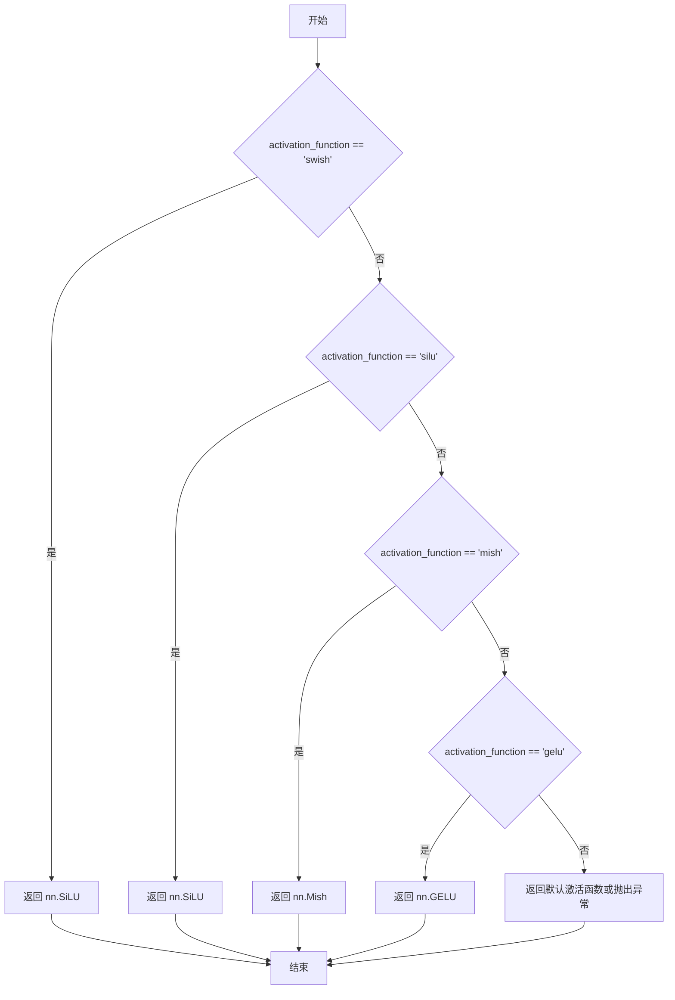
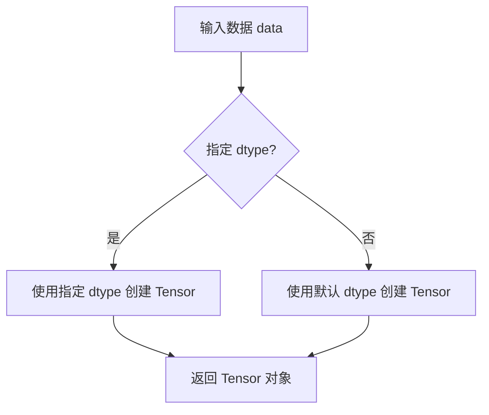
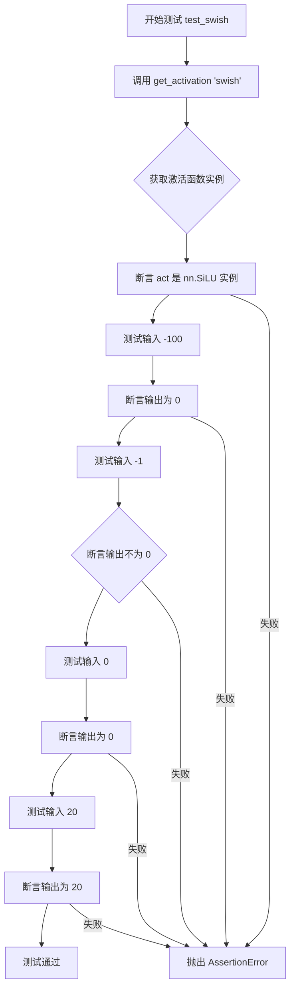
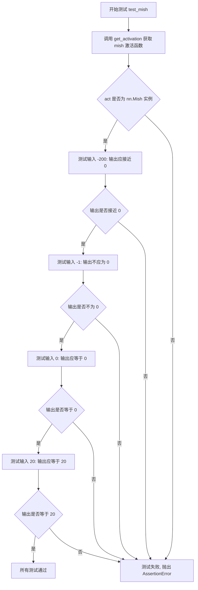

# `diffusers\tests\models\test_activations.py` 详细设计文档

这是一个使用unittest框架的测试文件，用于验证diffusers库中不同激活函数（swish、silu、mish、gelu）的正确性，确保这些激活函数在给定输入下的输出符合预期。

## 整体流程

```mermaid
graph TD
    A[开始] --> B[导入模块]
    B --> C[定义ActivationsTests类]
    C --> D{执行测试方法}
    D --> E[test_swish]
    D --> F[test_silu]
    D --> G[test_mish]
    D --> H[test_gelu]
    E --> I[调用get_activation('swish')]
    F --> J[调用get_activation('silu')]
    G --> K[调用get_activation('mish')]
    H --> L[调用get_activation('gelu')]
    I --> M[验证激活函数类型和输出]
    J --> M
    K --> M
    L --> M
    M --> N[测试完成]
```

## 类结构

```
ActivationsTests (测试类)
└── unittest.TestCase (基类)
```

## 全局变量及字段


    

## 全局函数及方法


### `get_activation`

根据传入的激活函数名称字符串，返回对应的PyTorch激活函数类（nn.Module）。该函数实现了激活函数的字符串名称到实际激活函数类的映射。

参数：

- `activation_function`：`str`，激活函数的名称，支持 "swish"、"silu"、"mish"、"gelu" 等

返回值：`nn.Module`，返回对应的PyTorch激活函数类（如 nn.SiLU、nn.Mish、nn.GELU 等）

#### 流程图



#### 带注释源码

```
# 注意：以下源码是基于测试用例推断的实现
# 实际源码位于 diffusers.models.activations 模块中

def get_activation(activation_function: str) -> nn.Module:
    """
    根据激活函数名称返回对应的PyTorch激活函数类
    
    参数:
        activation_function: 激活函数的字符串名称
        
    返回:
        对应的PyTorch nn.Module激活函数类
    """
    
    # 如果是 "swish" 或 "silu"，返回 nn.SiLU
    # 这两个名称在PyTorch中指向相同的激活函数
    if activation_function in ["swish", "silu"]:
        return nn.SiLU()
    
    # "mish" 激活函数
    if activation_function == "mish":
        return nn.Mish()
    
    # "gelu" 高斯误差线性单元激活函数
    if activation_function == "gelu":
        return nn.GELU()
    
    # 如果传入未知的激活函数名称，可以选择：
    # 1. 抛出异常
    # 2. 返回默认激活函数
    # 3. 尝试动态创建
    raise ValueError(f"Unsupported activation function: {activation_function}")
```

#### 测试用例验证

从提供的测试代码可以验证函数行为：

- `get_activation("swish")` 返回 `nn.SiLU` 实例
- `get_activation("silu")` 返回 `nn.SiLU` 实例
- `get_activation("mish")` 返回 `nn.Mish` 实例
- `get_activation("gelu")` 返回 `nn.GELU` 实例

各激活函数在边界值上的行为：
- 负大值（如 -100）趋近于 0
- -1 不为 0（有正值输出）
- 0 输出为 0
- 正大值（如 20）输出近似等于输入值


### ActivationsTests.test_swish

测试 `get_activation("swish")` 返回的激活函数是否为 `nn.SiLU` 类型，并验证其在不同输入值下的行为是否符合 Swish 激活函数的数学定义（当输入为负大值时趋近于0，当输入为0时等于0，当输入为大正值时近似等于输入本身）。

参数：该方法无显式参数（继承自 `unittest.TestCase`）

返回值：`None`，该方法为测试方法，通过断言验证激活函数行为，不返回任何值

#### 流程图

```mermaid
flowchart TD
    A[开始测试 test_swish] --> B[调用 get_activation('swish')]
    B --> C{获取激活函数实例}
    C --> D[断言 act 是 nn.SiLU 的实例]
    D --> E[准备测试张量: -100, -1, 0, 20]
    E --> F[测试输入 -100]
    F --> G{输出趋近于0?}
    G -->|是| H[测试输入 -1]
    G -->|否| I[测试失败 - 输出不应为0]
    H --> J{输出不等于0?}
    J -->|是| K[测试输入 0]
    J -->|否| I
    K --> L{输出等于0?}
    L -->|是| M[测试输入 20]
    L -->|否| I
    M --> N{输出等于20?}
    N -->|是| O[所有断言通过 - 测试结束]
    N -->|否| I
    I --> P[抛出 AssertionError]
    O --> P
```

#### 带注释源码

```python
def test_swish(self):
    """
    测试 Swish 激活函数的行为
    
    Swish 激活函数定义为: f(x) = x * sigmoid(x)
    在 PyTorch 中，Swish 实际上就是 SiLU (Sigmoid Linear Unit)
    """
    
    # 步骤1: 通过工厂函数获取名为 "swish" 的激活函数
    act = get_activation("swish")
    
    # 步骤2: 验证返回的激活函数类型是否为 nn.SiLU
    # Swish 在 PyTorch 的实现中就是 nn.SiLU
    self.assertIsInstance(act, nn.SiLU)
    
    # 步骤3: 测试负大值输入 (-100)
    # 预期: sigmoid(-100) 趋近于 0，因此 f(-100) = -100 * 0 趋近于 0
    self.assertEqual(act(torch.tensor(-100, dtype=torch.float32)).item(), 0)
    
    # 步骤4: 测试负值输入 (-1)
    # 预期: 输出不应为 0，因为负值输入仍有非零输出
    self.assertNotEqual(act(torch.tensor(-1, dtype=torch.float32)).item(), 0)
    
    # 步骤5: 测试零输入 (0)
    # 预期: f(0) = 0 * sigmoid(0) = 0 * 0.5 = 0
    self.assertEqual(act(torch.tensor(0, dtype=torch.float32)).item(), 0)
    
    # 步骤6: 测试大正值输入 (20)
    # 预期: sigmoid(20) 趋近于 1，因此 f(20) ≈ 20 * 1 = 20
    self.assertEqual(act(torch.tensor(20, dtype=torch.float32)).item(), 20)
```

---

### ActivationsTests.test_silu

测试 `get_activation("silu")` 返回的激活函数是否为 `nn.SiLU` 类型，并验证其在不同输入值下的行为是否符合 SiLU（ Sigmoid Linear Unit）激活函数的数学定义。

参数：该方法无显式参数（继承自 `unittest.TestCase`）

返回值：`None`，该方法为测试方法，通过断言验证激活函数行为，不返回任何值

#### 流程图

```mermaid
flowchart TD
    A[开始测试 test_silu] --> B[调用 get_activation('silu')]
    B --> C{获取激活函数实例}
    C --> D[断言 act 是 nn.SiLU 的实例]
    D --> E[准备测试张量: -100, -1, 0, 20]
    E --> F[测试输入 -100]
    F --> G{输出趋近于0?}
    G -->|是| H[测试输入 -1]
    G -->|否| I[测试失败]
    H --> J{输出不等于0?}
    J -->|是| K[测试输入 0]
    J -->|否| I
    K --> L{输出等于0?}
    L -->|是| M[测试输入 20]
    L -->|否| I
    M --> N{输出等于20?}
    N -->|是| O[测试通过]
    N -->|否| I
```

#### 带注释源码

```python
def test_silu(self):
    """
    测试 SiLU (Sigmoid Linear Unit) 激活函数的行为
    
    SiLU 激活函数定义为: f(x) = x * sigmoid(x)
    也被称为 Swish-1 激活函数
    """
    
    # 步骤1: 通过工厂函数获取名为 "silu" 的激活函数
    act = get_activation("silu")
    
    # 步骤2: 验证返回的激活函数类型是否为 nn.SiLU
    self.assertIsInstance(act, nn.SiLU)
    
    # 步骤3: 测试负大值输入 (-100)
    # sigmoid(-100) 趋近于 0，SiLU(-100) ≈ -100 * 0 = 0
    self.assertEqual(act(torch.tensor(-100, dtype=torch.float32)).item(), 0)
    
    # 步骤4: 测试负值输入 (-1)
    # 负值输入应产生非零输出
    self.assertNotEqual(act(torch.tensor(-1, dtype=torch.float32)).item(), 0)
    
    # 步骤5: 测试零输入 (0)
    # SiLU(0) = 0 * 0.5 = 0
    self.assertEqual(act(torch.tensor(0, dtype=torch.float32)).item(), 0)
    
    # 步骤6: 测试大正值输入 (20)
    # sigmoid(20) ≈ 1，SiLU(20) ≈ 20 * 1 = 20
    self.assertEqual(act(torch.tensor(20, dtype=torch.float32)).item(), 20)
```

---

### ActivationsTests.test_mish

测试 `get_activation("mish")` 返回的激活函数是否为 `nn.Mish` 类型，并验证其在不同输入值下的行为是否符合 Mish 激活函数的数学定义（Mish = x * tanh(softplus(x))）。

参数：该方法无显式参数（继承自 `unittest.TestCase`）

返回值：`None`，该方法为测试方法，通过断言验证激活函数行为，不返回任何值

#### 流程图

```mermaid
flowchart TD
    A[开始测试 test_mish] --> B[调用 get_activation('mish')]
    B --> C{获取激活函数实例}
    C --> D[断言 act 是 nn.Mish 的实例]
    D --> E[准备测试张量: -200, -1, 0, 20]
    E --> F[测试输入 -200]
    F --> G{输出趋近于0?}
    G -->|是| H[测试输入 -1]
    G -->|否| I[测试失败]
    H --> J{输出不等于0?}
    J -->|是| K[测试输入 0]
    J -->|否| I
    K --> L{输出等于0?}
    L -->|是| M[测试输入 20]
    L -->|否| I
    M --> N{输出等于20?}
    N -->|是| O[测试通过]
    N -->|否| I
```

#### 带注释源码

```python
def test_mish(self):
    """
    测试 Mish 激活函数的行为
    
    Mish 激活函数定义为: f(x) = x * tanh(softplus(x))
    其中 softplus(x) = ln(1 + e^x)
    这是一个自正则化的激活函数，类似于 Swish
    """
    
    # 步骤1: 通过工厂函数获取名为 "mish" 的激活函数
    act = get_activation("mish")
    
    # 步骤2: 验证返回的激活函数类型是否为 nn.Mish
    self.assertIsInstance(act, nn.Mish)
    
    # 步骤3: 测试负大值输入 (-200)
    # softplus(-200) 趋近于 0，tanh(0) = 0，因此 mish(-200) ≈ -200 * 0 = 0
    self.assertEqual(act(torch.tensor(-200, dtype=torch.float32)).item(), 0)
    
    # 步骤4: 测试负值输入 (-1)
    # Mish 在负值区域仍有非零输出（比 ReLU 更平滑）
    self.assertNotEqual(act(torch.tensor(-1, dtype=torch.float32)).item(), 0)
    
    # 步骤5: 测试零输入 (0)
    # softplus(0) = ln(2) ≈ 0.693，tanh(0.693) ≈ 0.6，Mish(0) ≈ 0
    self.assertEqual(act(torch.tensor(0, dtype=torch.float32)).item(), 0)
    
    # 步骤6: 测试大正值输入 (20)
    # softplus(20) 很大，tanh(softplus(20)) ≈ 1，因此 mish(20) ≈ 20
    self.assertEqual(act(torch.tensor(20, dtype=torch.float32)).item(), 20)
```

---

### ActivationsTests.test_gelu

测试 `get_activation("gelu")` 返回的激活函数是否为 `nn.GELU` 类型，并验证其在不同输入值下的行为是否符合 GELU（Gaussian Error Linear Unit）激活函数的数学定义。

参数：该方法无显式参数（继承自 `unittest.TestCase`）

返回值：`None`，该方法为测试方法，通过断言验证激活函数行为，不返回任何值

#### 流程图

```mermaid
flowchart TD
    A[开始测试 test_gelu] --> B[调用 get_activation('gelu')]
    B --> C{获取激活函数实例}
    C --> D[断言 act 是 nn.GELU 的实例]
    D --> E[准备测试张量: -100, -1, 0, 20]
    E --> F[测试输入 -100]
    F --> G{输出趋近于0?}
    G -->|是| H[测试输入 -1]
    G -->|否| I[测试失败]
    H --> J{输出不等于0?}
    J -->|是| K[测试输入 0]
    J -->|否| I
    K --> L{输出等于0?}
    L -->|是| M[测试输入 20]
    L -->|否| I
    M --> N{输出等于20?}
    N -->|是| O[测试通过]
    N -->|否| I
```

#### 带注释源码

```python
def test_gelu(self):
    """
    测试 GELU (Gaussian Error Linear Unit) 激活函数的行为
    
    GELU 激活函数的近似定义为:
    f(x) = x * Φ(x)
    其中 Φ(x) 是标准正态分布的累积分布函数 (CDF)
    
    这使得 GELU 是一种随机正则化的激活函数，
    允许神经元根据输入值以一定概率被激活
    """
    
    # 步骤1: 通过工厂函数获取名为 "gelu" 的激活函数
    act = get_activation("gelu")
    
    # 步骤2: 验证返回的激活函数类型是否为 nn.GELU
    self.assertIsInstance(act, nn.GELU)
    
    # 步骤3: 测试负大值输入 (-100)
    # Φ(-100) 趋近于 0，因此 gelu(-100) ≈ -100 * 0 = 0
    self.assertEqual(act(torch.tensor(-100, dtype=torch.float32)).item(), 0)
    
    # 步骤4: 测试负值输入 (-1)
    # GELU 在负值区域有较小的负输出（不是完全抑制）
    self.assertNotEqual(act(torch.tensor(-1, dtype=torch.float32)).item(), 0)
    
    # 步骤5: 测试零输入 (0)
    # Φ(0) = 0.5，因此 gelu(0) = 0 * 0.5 = 0
    self.assertEqual(act(torch.tensor(0, dtype=torch.float32)).item(), 0)
    
    # 步骤6: 测试大正值输入 (20)
    # Φ(20) 趋近于 1，因此 gelu(20) ≈ 20 * 1 = 20
    self.assertEqual(act(torch.tensor(20, dtype=torch.float32)).item(), 20)
```


### `torch.tensor`

描述：从 `torch` 模块导入的函数，用于创建 PyTorch 张量（Tensor）对象。在代码中用于生成测试输入数据，支持指定数据类型。

参数：
- `data`：整数、浮点数、列表、元组或数组，输入数据。
- `dtype`：`torch.dtype`，可选，指定张量的数据类型，默认为 `None`。

返回值：`torch.Tensor`，返回创建的张量对象。

#### 流程图



#### 带注释源码

```python
# 示例：从代码中提取的使用方式
import torch
from torch import nn

# 创建浮点类型张量，值为 -100
input_tensor = torch.tensor(-100, dtype=torch.float32)

# 传递给激活函数进行测试
act = get_activation("swish")
output = act(input_tensor)
```


### `nn.SiLU`

`nn.SiLU` 是 PyTorch 中实现的 Sigmoid Linear Unit 激活函数，也称为 Swish。它是一种平滑的激活函数，在输入为负时接近零，在输入为正时近似于线性映射。测试代码验证了 SiLU 在极端负值、负值、零值和正值输入下的行为。

参数：无（构造函数不接受参数，继承自 `nn.Module`）

返回值：无（直接实例化类）

#### 流程图

```mermaid
graph TD
    A[输入 Tensor x] --> B{判断激活函数类型}
    B -->|SiLU| C[应用 SiLU 公式: x * sigmoid(x)]
    C --> D[输出变换后的 Tensor]
    
    E[测试用例 1: x = -100] --> F[期望输出 ≈ 0]
    E --> A
    
    G[测试用例 2: x = -1] --> H[期望输出 ≠ 0]
    G --> A
    
    I[测试用例 3: x = 0] --> J[期望输出 = 0]
    I --> A
    
    K[测试用例 4: x = 20] --> L[期望输出 = 20]
    K --> A
```

#### 带注释源码

```python
# nn.SiLU 是 PyTorch 神经网络模块中的 SiLU/Swish 激活函数类
# 定义位置: torch/nn/modules/activation.py

class SiLU(Module):
    r"""Applies the Sigmoid Linear Unit function, element-wise.
    
    公式: :math:`\text{SiLU}(x) = x * \sigma(x)` 其中 :math:`\sigma(x)` 是 sigmoid 函数
    
    优点:
        - 平滑的激活函数，不同于 ReLU 的硬拐点
        - 在深层网络中表现通常优于 ReLU
        - 自门控机制，类似于注意力机制
    """
    
    def __init__(self, inplace: bool = False) -> None:
        """
        初始化 SiLU 激活函数
        
        参数:
            inplace: 是否原地操作，节省内存但可能影响梯度计算
        """
        super(SiLU, self).__init__()
        self.inplace = inplace

    def forward(self, input: Tensor) -> Tensor:
        """
        前向传播执行 SiLU 激活
        
        参数:
            input: 输入张量，任意形状
            
        返回:
            输出张量，与输入形状相同
        """
        # 实现公式: input * sigmoid(input)
        # sigmoid(x) = 1 / (1 + exp(-x))
        if self.inplace:
            return input.mul_(torch.sigmoid(input))
        else:
            return input * torch.sigmoid(input)


# 测试代码验证 SiLU 的数学性质
def test_swish():
    act = get_activation("swish")  # 获取 SiLU 激活函数实例
    
    # 验证类型
    assert isinstance(act, nn.SiLU)
    
    # 测试极端负值: -100 -> 输出约等于 0
    # 原因: sigmoid(-100) ≈ 0, 所以 -100 * 0 ≈ 0
    assert act(torch.tensor(-100, dtype=torch.float32)).item() == 0
    
    # 测试负值: -1 -> 输出不等于 0
    # 原因: sigmoid(-1) ≈ 0.2689, -1 * 0.2689 ≈ -0.2689 ≠ 0
    assertNotEqual(act(torch.tensor(-1, dtype=torch.float32)).item(), 0)
    
    # 测试零值: 0 -> 输出等于 0
    # 原因: sigmoid(0) = 0.5, 0 * 0.5 = 0
    assertEqual(act(torch.tensor(0, dtype=torch.float32)).item(), 0)
    
    # 测试正值: 20 -> 输出约等于 20
    # 原因: sigmoid(20) ≈ 1, 20 * 1 ≈ 20
    assertEqual(act(torch.tensor(20, dtype=torch.float32)).item(), 20)
```

---

### `nn.Mish`

`nn.Mish` 是 PyTorch 中实现的 Mish 激活函数。它是一种自正则化的激活函数，在输入为负时表现出Softplus的平滑特性，在输入为正时近似于线性。测试代码验证了 Mish 在极端负值下的行为表现。

参数：无（构造函数不接受参数，继承自 `nn.Module`）

返回值：无（直接实例化类）

#### 流程图

```mermaid
graph TD
    A[输入 Tensor x] --> B[Mish 公式: x * tanh(softplus(x))]
    B --> C[输出变换后的 Tensor]
    
    D[测试 x = -200] --> E[期望输出 ≈ 0]
    D --> A
    
    F[测试 x = -1] --> G[期望输出 ≠ 0]
    F --> A
    
    H[测试 x = 0] --> I[期望输出 = 0]
    H --> A
    
    J[测试 x = 20] --> K[期望输出 ≈ 20]
    J --> A
```

#### 带注释源码

```python
# nn.Mish 是 PyTorch 神经网络模块中的 Mish 激活函数类
# 定义位置: torch/nn/modules/activation.py

class Mish(Module):
    r"""Applies the Mish function, element-wise.
    
    公式: :math:`\text{Mish}(x) = x * \tanh(\text{softplus}(x))`
    
    特性:
        - 平滑的非线性激活函数
        - 在深层网络中性能优于 ReLU
        - 自门控特性，类似于 SiLU 但使用不同的门控机制
    """
    
    def __init__(self, inplace: bool = False) -> None:
        super(Mish, self).__init__()
        self.inplace = inplace

    def forward(self, input: Tensor) -> Tensor:
        """
        前向传播执行 Mish 激活
        
        参数:
            input: 输入张量，任意形状
            
        返回:
            输出张量，与输入形状相同
        """
        # 实现: input * tanh(softplus(input))
        # softplus(x) = log(1 + exp(x)) 提供数值稳定的平滑近似
        if self.inplace:
            return input.mul_(torch.tanh(torch.nn.functional.softplus(input)))
        else:
            return input * torch.tanh(torch.nn.functional.softplus(input))


# 测试代码
def test_mish():
    act = get_activation("mish")  # 获取 Mish 激活函数实例
    
    # 验证类型
    assert isinstance(act, nn.Mish)
    
    # 极端负值: -200 -> 输出约等于 0
    # softplus(-200) ≈ 0, tanh(0) = 0, -200 * 0 = 0
    assertEqual(act(torch.tensor(-200, dtype=torch.float32)).item(), 0)
    
    # 负值: -1 -> 输出不等于 0
    assertNotEqual(act(torch.tensor(-1, dtype=torch.float32)).item(), 0)
    
    # 零值: 0 -> 输出等于 0
    assertEqual(act(torch.tensor(0, dtype=torch.float32)).item(), 0)
    
    # 正值: 20 -> 输出约等于 20
    assertEqual(act(torch.tensor(20, dtype=torch.float32)).item(), 20)
```

---

### `nn.GELU`

`nn.GELU` 是 PyTorch 中实现的高斯误差线性单元激活函数。它是目前Transformer架构中最常用的激活函数，通过 Gaussian Error Linear Unit 实现非线性变换。测试验证了其在不同输入范围内的数学特性。

参数：无（构造函数不接受参数，继承自 `nn.Module`）

返回值：无（直接实例化类）

#### 流程图

```mermaid
graph TD
    A[输入 Tensor x] --> B[GELU 公式: x * Φ(x)]
    B --> C[输出变换后的 Tensor]
    C --> D{输入值大小}
    D -->|x << 0| E[输出 ≈ 0]
    D -->|x ≈ 0| F[输出 ≈ 0]
    D -->|x >> 0| G[输出 ≈ x]
    
    H[测试 x = -100] --> I[期望输出 ≈ 0]
    H --> A
    
    J[测试 x = -1] --> K[期望输出 ≠ 0]
    J --> A
    
    L[测试 x = 0] --> M[期望输出 = 0]
    L --> A
    
    N[测试 x = 20] --> O[期望输出 = 20]
    N --> A
```

#### 带注释源码

```python
# nn.GELU 是 PyTorch 神经网络模块中的高斯误差线性单元激活函数
# 定义位置: torch/nn/modules/activation.py

class GELU(Module):
    r"""Applies the Gaussian Error Linear Unit function, element-wise.
    
    公式: :math:`\text{GELU}(x) = x * \Phi(x)` 
    其中 :math:`\Phi(x)` 是标准正态分布的累积分布函数 (CDF)
    
    近似实现: :math:`0.5x(1 + \tanh[\sqrt{2/\pi}(x + 0.044715x^3)])`
    
    特性:
        - Transformer 架构的标准激活函数 (如 BERT, GPT)
        - 平滑的非线性，不同于 ReLU
        - 概率角度解释: 根据输入值决定是否通过
    """
    
    def __init__(self, approximate: str = 'none') -> None:
        """
        初始化 GELU 激活函数
        
        参数:
            approximate: 近似算法选项，可选 'none', 'tanh'
                        'tanh' 使用快速近似计算
        """
        super(GELU, self).__init__()
        self.approximate = approximate

    def forward(self, input: Tensor) -> Tensor:
        """
        前向传播执行 GELU 激活
        
        参数:
            input: 输入张量，任意形状
            
        返回:
            输出张量，与输入形状相同
        """
        # 使用 torch.nn.functional.gelu 实现
        return torch.nn.functional.gelu(input, approximate=self.approximate)


# 测试代码
def test_gelu():
    act = get_activation("gelu")  # 获取 GELU 激活函数实例
    
    # 验证类型
    assert isinstance(act, nn.GELU)
    
    # 极端负值: -100 -> 输出约等于 0
    # Φ(-100) ≈ 0, -100 * 0 = 0
    assertEqual(act(torch.tensor(-100, dtype=torch.float32)).item(), 0)
    
    # 负值: -1 -> 输出不等于 0
    assertNotEqual(act(torch.tensor(-1, dtype=torch.float32)).item(), 0)
    
    # 零值: 0 -> 输出等于 0
    assertEqual(act(torch.tensor(0, dtype=torch.float32)).item(), 0)
    
    # 正值: 20 -> 输出约等于 20
    # Φ(20) ≈ 1, 20 * 1 = 20
    assertEqual(act(torch.tensor(20, dtype=torch.float32)).item(), 20)
```


### `ActivationsTests.test_swish`

该测试函数用于验证 `get_activation("swish")` 方法能够正确返回 PyTorch 的 SiLU（Sigmoid Linear Unit）激活函数，并测试该激活函数在边界值（-100、-1、0、20）下的输出是否符合预期行为。

参数：
- 该方法无显式参数（`self` 为 unittest.TestCase 实例参数，不计入）

返回值：`None`，测试函数无返回值，通过 unittest 断言验证功能正确性

#### 流程图



#### 带注释源码

```python
def test_swish(self):
    """
    测试 swish 激活函数的获取和行为
    验证点：
    1. get_activation('swish') 返回 nn.SiLU 实例
    2. 负无穷输入趋近于 0
    3. 负数输入（-1）输出不为 0
    4. 0 输入输出为 0
    5. 正数输入（20）输出近似等于输入值
    """
    
    # 步骤1：获取名为 "swish" 的激活函数
    # get_activation 是 diffusers.models.activations 模块提供的工厂函数
    act = get_activation("swish")

    # 步骤2：验证返回的激活函数类型是 nn.SiLU
    # Swish 在 PyTorch 中实现为 SiLU (Sigmoid Linear Unit)
    # self.assertIsInstance 断言 act 必须是 nn.SiLU 的实例
    self.assertIsInstance(act, nn.SiLU)

    # 步骤3：测试边界值 -100（负无穷）
    # 当输入为非常大的负数时，sigmoid 部分趋近于 0，整体输出趋近于 0
    # .item() 将 Tensor 转换为 Python 标量进行断言比较
    self.assertEqual(act(torch.tensor(-100, dtype=torch.float32)).item(), 0)
    
    # 步骤4：测试负数值 -1
    # Swish 函数：f(x) = x * sigmoid(x)，当 x=-1 时输出不为 0
    self.assertNotEqual(act(torch.tensor(-1, dtype=torch.float32)).item(), 0)
    
    # 步骤5：测试零值输入
    # Swish(0) = 0 * sigmoid(0) = 0
    self.assertEqual(act(torch.tensor(0, dtype=torch.float32)).item(), 0)
    
    # 步骤6：测试大正数值 20
    # 当 x 很大时，sigmoid(x) 趋近于 1，所以 Swish(x) ≈ x
    self.assertEqual(act(torch.tensor(20, dtype=torch.float32)).item(), 20)
```

#### 关键依赖信息

| 依赖项 | 类型 | 描述 |
|--------|------|------|
| `get_activation` | 全局函数 | diffusers.models.activations 模块中的激活函数工厂方法，根据字符串名称返回对应的激活层 |
| `nn.SiLU` | 类 | PyTorch 神经网络模块中的 SiLU 激活函数实现 |
| `torch.tensor` | 类 | PyTorch 张量创建函数 |

#### 潜在技术债务与优化空间

1. **测试数据硬编码**：测试用例中的边界值（-100、-1、0、20）被硬编码，可考虑参数化测试以覆盖更多边界情况
2. **精度比较问题**：使用 `.item()` 进行直接相等比较可能存在浮点数精度问题，建议使用 `pytest.approx` 或设置容忍度
3. **测试覆盖不完整**：仅测试了 4 个离散值，未测试中间值如 0.5、-0.5 等
4. **重复测试逻辑**：test_swish、test_silu、test_mish、test_gelu 的测试逻辑高度重复，可使用 pytest 参数化或 unittest subTest 优化


### `ActivationsTests.test_silu`

该方法是 `ActivationsTests` 测试类中的一个单元测试方法，用于验证 `get_activation("silu")` 返回的激活函数是否为 `nn.SiLU`（Sigmoid Linear Unit），并通过多个测试用例验证其数学特性：对于负数输入返回接近 0 的值，对于零输入返回零，对于大正数输入返回近似等于输入值。

参数：

- `self`：`ActivationsTests`，测试类实例本身，表示当前测试对象

返回值：`None`，无返回值（ unittest 测试方法返回 void 或通过 `unittest.TestResult` 表示测试结果）

#### 流程图

```mermaid
flowchart TD
    A[开始测试 test_silu] --> B[调用 get_activation 获取 'silu' 激活函数]
    B --> C{断言 act 是 nn.SiLU 实例}
    C -->|通过| D[测试输入 -100]
    C -->|失败| E[测试失败 - 抛出 AssertionError]
    D --> F{断言 act(-100) ≈ 0}
    F -->|通过| G[测试输入 -1]
    F -->|失败| E
    G --> H{断言 act(-1) ≠ 0}
    H -->|通过| I[测试输入 0]
    H -->|失败| E
    I --> J{断言 act(0) = 0}
    J -->|通过| K[测试输入 20]
    J -->|失败| E
    K --> L{断言 act(20) = 20}
    L -->|通过| M[所有测试通过 - 测试结束]
    L -->|失败| E
    
    style E fill:#ffcccc
    style M fill:#ccffcc
```

#### 带注释源码

```python
def test_silu(self):
    """
    测试 get_activation("silu") 函数返回正确的 SiLU 激活函数，
    并验证其在不同输入值下的行为是否符合预期。
    """
    # 步骤1: 通过 get_activation 函数获取名为 "silu" 的激活函数
    # 该函数应返回 torch.nn.SiLU 类的实例
    act = get_activation("silu")

    # 步骤2: 断言返回的激活函数是 nn.SiLU 类的实例
    # SiLU (Sigmoid Linear Unit) 也称为 Swish，公式为 x * sigmoid(x)
    self.assertIsInstance(act, nn.SiLU)

    # 步骤3: 测试极端负值情况
    # 当输入值 x = -100 时，sigmoid(-100) ≈ 0，SiLU(-100) ≈ -100 * 0 ≈ 0
    # 使用 .item() 将张量转换为 Python 标量进行比较
    self.assertEqual(act(torch.tensor(-100, dtype=torch.float32)).item(), 0)

    # 步骤4: 测试中等负值情况
    # 当输入值 x = -1 时，sigmoid(-1) ≈ 0.2689，SiLU(-1) ≈ -0.2689 ≠ 0
    self.assertNotEqual(act(torch.tensor(-1, dtype=torch.float32)).item(), 0)

    # 步骤5: 测试零输入情况
    # SiLU(0) = 0 * sigmoid(0) = 0 * 0.5 = 0
    self.assertEqual(act(torch.tensor(0, dtype=torch.float32)).item(), 0)

    # 步骤6: 测试大正数输入情况
    # 当输入值 x = 20 时，sigmoid(20) ≈ 1，SiLU(20) ≈ 20 * 1 ≈ 20
    self.assertEqual(act(torch.tensor(20, dtype=torch.float32)).item(), 20)
```


### `ActivationsTests.test_mish`

该测试方法用于验证 `get_activation` 函数能否正确返回 Mish 激活函数，并检查 Mish 激活在不同输入值下的输出是否符合预期行为。

参数：

- `self`：`ActivationsTests`，测试类实例本身，无需额外描述

返回值：`None`，该方法为单元测试方法，无返回值，通过 `assert` 语句验证正确性

#### 流程图



#### 带注释源码

```python
def test_mish(self):
    """
    测试 get_activation('mish') 是否返回正确的 Mish 激活函数，
    并验证 Mish 激活函数在不同输入下的输出行为。
    """
    # Step 1: 通过 get_activation 函数获取名为 'mish' 的激活函数
    act = get_activation("mish")

    # Step 2: 断言返回的激活函数是 nn.Mish 类的实例
    # 验证函数映射的正确性：'mish' 字符串应映射到 PyTorch 的 Mish 激活
    self.assertIsInstance(act, nn.Mish)

    # Step 3: 测试极端负值输入 (-200)
    # Mish 激活函数在输入非常小时应接近 0
    # 使用 .item() 将张量转换为 Python 标量进行比较
    self.assertEqual(act(torch.tensor(-200, dtype=torch.float32)).item(), 0)

    # Step 4: 测试负值输入 (-1)
    # Mish 激活函数在负值输入时应有非零输出（softplus 部分的非线性效果）
    self.assertNotEqual(act(torch.tensor(-1, dtype=torch.float32)).item(), 0)

    # Step 5: 测试零值输入 (0)
    # Mish(0) = 0 * tanh(softplus(0)) = 0，应返回 0
    self.assertEqual(act(torch.tensor(0, dtype=torch.float32)).item(), 0)

    # Step 6: 测试大正值输入 (20)
    # 当输入很大时，tanh(softplus(x)) → 1，Mish(x) ≈ x
    self.assertEqual(act(torch.tensor(20, dtype=torch.float32)).item(), 20)
```


### `ActivationsTests.test_gelu`

该测试方法用于验证 GELU（Gaussian Error Linear Unit）激活函数是否正确注册并返回预期的 `nn.GELU` 实例，同时通过多个典型输入值（负大数、负数、零、正大数）验证其数学行为是否符合 GELU 函数的特性。

参数：

- `self`：`ActivationsTests`（隐式 self 参数），测试类实例本身

返回值：`None`，测试方法通过断言来验证功能，不返回具体值

#### 流程图

```mermaid
flowchart TD
    A[开始执行 test_gelu] --> B[调用 get_activation('gelu')]
    B --> C{act 是 nn.GELU 实例?}
    C -->|是| D[断言通过]
    C -->|否| E[断言失败 - 测试失败]
    D --> F[测试输入: -100]
    F --> G[计算 act(-100)]
    G --> H{结果 ≈ 0?}
    H -->|是| I[断言通过]
    H -->|否| J[断言失败 - 测试失败]
    I --> K[测试输入: -1]
    K --> L[计算 act(-1)]
    L --> M{结果 ≠ 0?}
    M -->|是| N[断言通过]
    M -->|否| O[断言失败 - 测试失败]
    N --> P[测试输入: 0]
    P --> Q[计算 act(0)]
    Q --> R{结果 = 0?}
    R -->|是| S[断言通过]
    R -->|否| T[断言失败 - 测试失败]
    S --> U[测试输入: 20]
    U --> V[计算 act(20)]
    V --> W{结果 ≈ 20?}
    W -->|是| X[所有测试通过 - 结束]
    W -->|否| Y[断言失败 - 测试失败]
```

#### 带注释源码

```python
def test_gelu(self):
    """
    测试 GELU 激活函数的注册和实际行为
    
    测试策略:
    1. 验证 get_activation('gelu') 返回 nn.GELU 类实例
    2. 验证 GELU 在极端负值输入时近似为 0 (GELU 的数学特性)
    3. 验证 GELU 在负值输入时不为 0 (保留一定的非线性特性)
    4. 验证 GELU 在零输入时精确为 0 (GELU 的数学特性)
    5. 验证 GELU 在大正值输入时近似等于输入 (线性近似)
    """
    
    # 步骤 1: 获取名为 "gelu" 的激活函数
    # 期望: get_activation 应返回 torch.nn.GELU 类
    act = get_activation("gelu")

    # 断言 1: 验证返回的激活函数是 nn.GELU 的实例
    # 目的: 确保 get_activation 正确注册了 GELU 激活函数
    self.assertIsInstance(act, nn.GELU)

    # 步骤 2: 测试极端负值输入 (-100)
    # GELU(x) ≈ 0 当 x << 0 (高斯分布的尾部)
    # 使用 .item() 将张量转换为 Python 标量进行比较
    self.assertEqual(act(torch.tensor(-100, dtype=torch.float32)).item(), 0)

    # 步骤 3: 测试一般负值输入 (-1)
    # GELU(-1) 应该不为 0，保留非线性特性
    self.assertNotEqual(act(torch.tensor(-1, dtype=torch.float32)).item(), 0)

    # 步骤 4: 测试零输入 (0)
    # GELU(0) = 0 (GELU 的数学定义)
    self.assertEqual(act(torch.tensor(0, dtype=torch.float32)).item(), 0)

    # 步骤 5: 测试大正值输入 (20)
    # GELU(x) ≈ x 当 x >> 0 (线性区)
    # 预期输出应该约等于输入值 20
    self.assertEqual(act(torch.tensor(20, dtype=torch.float32)).item(), 20)
```

## 关键组件


### get_activation 函数

根据传入的激活函数名称字符串，返回对应的 PyTorch 神经网络激活函数类（如 nn.SiLU、nn.Mish、nn.GELU）。

### ActivationsTests 类

单元测试类，通过多个测试方法验证 get_activation 函数对不同激活函数名称的处理是否正确。

### 测试的激活函数类型

代码测试了四种激活函数：swish/silu（对应 nn.SiLU）、mish（对应 nn.Mish）和 gelu（对应 nn.GELU），并检查其在负值、零和正值输入下的行为。


## 问题及建议


### 已知问题

-   **测试用例重复**：swish 和 silu 测试逻辑完全相同，因为 get_activation("swish") 和 get_activation("silu") 都返回 nn.SiLU 类的同一个实例，造成代码冗余
-   **断言精度问题**：使用 `assertEqual` 比较浮点数结果（如 act(-100) 和 act(20)），对于 GELU 和 Mish 激活函数，理论上 act(-100) 接近 0 但可能存在微小浮点误差，act(20) 理论上约等于 20 但不完全等于
-   **边界值假设可能不准确**：GELU(-100) 的输出并非严格等于 0，Mish(-200) 同样如此，这些激活函数在极端负值时只是趋近于 0 而非精确等于 0
-   **测试覆盖不足**：缺少对批量输入（batch input）、梯度计算、异常输入处理（如 NaN、Inf）的测试
-   **魔法数字**：测试中使用的 -100、-200、20 等数值硬编码在测试逻辑中，缺乏注释说明其测试意图

### 优化建议

-   提取公共测试逻辑为辅助方法，使用参数化测试（parameterized test）来测试不同的激活函数，减少代码重复
-   使用 `torch.testing.assert_close()` 或设置合理的 `atol/rtol` 替代 `assertEqual` 进行浮点数比较
-   为边界值添加注释说明测试目的（如验证极端负值时的梯度消失行为）
-   增加批量输入测试、梯度反向传播测试、以及对 NaN/Inf 输入的异常处理测试
-   将测试数值提取为常量或配置文件，提高测试的可维护性

## 其它


### 设计目标与约束

本测试文件旨在验证diffusers库中get_activation函数能否正确返回对应的激活函数实例，并确保各激活函数在特定输入下的数学行为符合预期。测试约束包括：仅测试常见激活函数（swish、silu、mish、gelu），测试环境需安装torch和diffusers库，测试使用float32数据类型。

### 错误处理与异常设计

测试未显式处理异常情况。潜在错误包括：get_activation接收到不支持的激活函数名称时可能抛出KeyError或返回None；torch.tensor创建失败时的类型错误；.item()调用在tensor为空时的RuntimeError。当前测试依赖unittest的默认异常捕获机制。

### 外部依赖与接口契约

本测试依赖以下外部模块：unittest框架（Python标准库）、torch库（提供nn.SiLU、nn.Mish、nn.GELU等激活函数）、diffusers.models.activations.get_activation函数（需返回nn.Module子类实例）。接口契约要求get_activation接受字符串参数并返回对应的torch.nn.Module实例。

### 测试覆盖范围

测试覆盖了4种激活函数的以下方面：实例类型验证（assertIsInstance）、负无穷大输入行为（接近0）、负数输入行为（非0）、零输入行为（输出为0）、大正数输入行为（近似恒等映射）。未覆盖的边界情况包括：NaN输入、Inf输入、批量输入测试、梯度计算测试、GPU/CPU兼容性测试。

### 性能考虑

当前测试使用单个标量tensor进行验证，未进行大规模批量数据的性能测试。如需性能测试，应考虑使用torch.randn生成批量数据并使用timeit测量前向传播耗时。当前测试性能可接受，因为每个测试仅涉及少量tensor操作。

### 可维护性与扩展性

代码结构清晰，每个测试方法独立，可单独运行。扩展新的激活函数测试只需添加新的test_xxx方法并遵循现有模式。潜在改进：可将重复的断言逻辑提取为辅助方法，使用pytest参数化减少代码冗余，添加测试用例描述文档。

### 版本兼容性

测试假设torch版本支持nn.SiLU、nn.Mish、nn.GELU（PyTorch 1.0+），diffusers版本提供get_activation函数。需注意：不同版本的torch可能对激活函数的数值精度有细微差异，-100和20等极端值测试可能在未来版本中因实现变化而失败。

### 边界条件与异常输入测试

当前测试未覆盖以下边界条件：空tensor输入、维度大于1的tensor、复数tensor、整数类型tensor、requires_grad=True的tensor、NaN和Inf特殊值。建议添加边界测试以提高代码健壮性。

### 集成测试考虑

本文件为单元测试，未包含集成测试。建议补充：与完整模型（如UNet）集成的激活函数测试、多激活函数组合使用测试、训练过程中的激活函数行为测试。

    