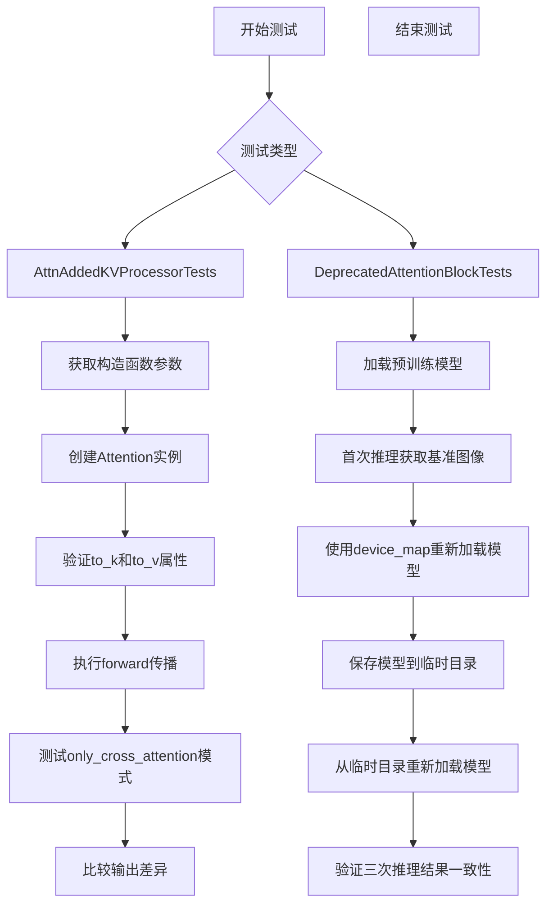
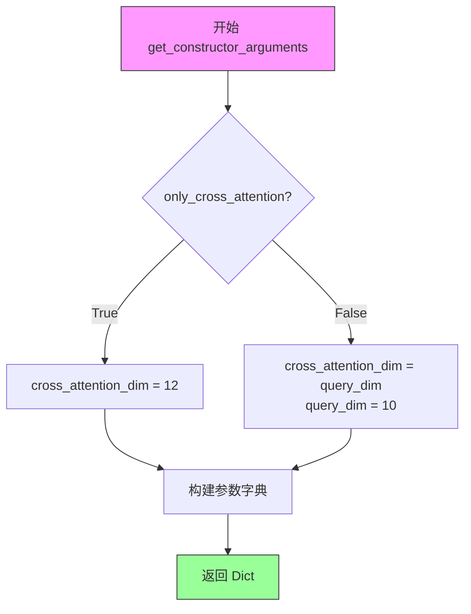
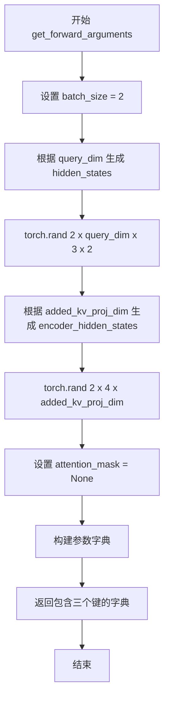
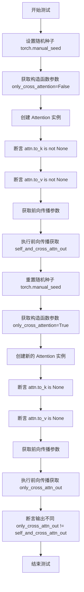
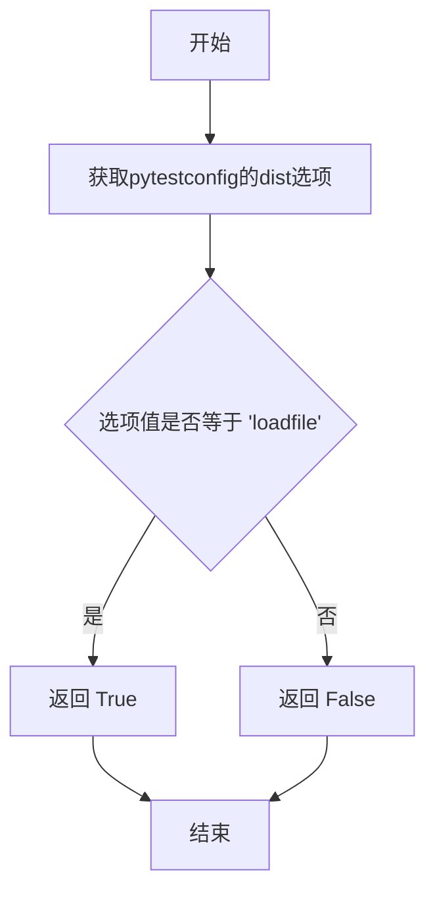
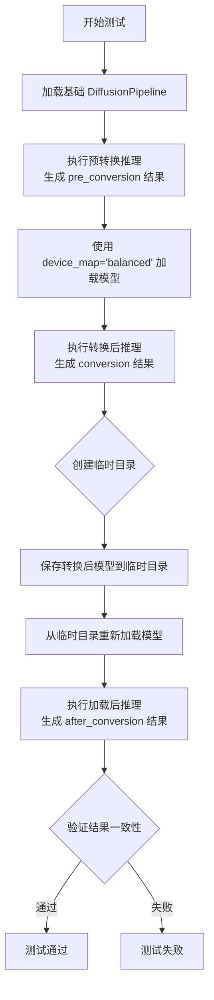

# `diffusers\tests\models\test_attention_processor.py` 详细设计文档

这是一个针对diffusers库中Attention处理器和DeprecatedAttentionBlock的单元测试文件，主要测试了AttnAddedKVProcessor的self-attention和cross-attention功能，以及在使用device_map时旧版AttentionBlock的模型转换兼容性。

## 整体流程



## 类结构

```
AttnAddedKVProcessorTests (unittest.TestCase)
├── get_constructor_arguments() - 获取Attention构造函数参数
├── get_forward_arguments() - 获取forward传播参数
└── test_only_cross_attention() - 测试cross-attention模式

DeprecatedAttentionBlockTests (unittest.TestCase)
├── is_dist_enabled() - pytest fixture检测分布式测试
└── test_conversion_when_using_device_map() - 测试device_map转换
```

## 全局变量及字段


### `tempfile`
    
Python标准库模块，用于创建和管理临时目录和文件

类型：`module`
    


### `unittest`
    
Python标准库模块，提供单元测试框架

类型：`module`
    


### `np`
    
NumPy库别名，用于数值计算和数组操作

类型：`module`
    


### `pytest`
    
Python测试框架，用于编写和运行测试

类型：`module`
    


### `torch`
    
PyTorch深度学习库，用于张量计算和神经网络构建

类型：`module`
    


### `DiffusionPipeline`
    
Diffusers库中的扩散管道类，用于加载和运行扩散模型

类型：`class`
    


### `Attention`
    
注意力机制实现类，用于Transformer中的注意力计算

类型：`class`
    


### `AttnAddedKVProcessor`
    
添加KV的注意力处理器，用于处理交叉注意力中的额外键值对

类型：`class`
    


### `torch_device`
    
测试工具中定义的PyTorch设备配置，指定计算设备（如CPU或CUDA）

类型：`variable`
    


### `DeprecatedAttentionBlockTests.is_dist_enabled`
    
Pytest fixture，检查是否启用了分布式加载模式

类型：`function`
    


### `AttnAddedKVProcessorTests.get_constructor_arguments`
    
获取Attention类的构造函数参数配置

类型：`function`
    


### `AttnAddedKVProcessorTests.get_forward_arguments`
    
获取Attention类前向传播的输入参数

类型：`function`
    


### `AttnAddedKVProcessorTests.test_only_cross_attention`
    
测试仅交叉注意力模式的输出是否与自注意力+交叉注意力模式不同

类型：`function`
    


### `DeprecatedAttentionBlockTests.test_conversion_when_using_device_map`
    
测试使用device_map时 DiffusionPipeline的转换和保存加载功能

类型：`function`
    
    

## 全局函数及方法


### `AttnAddedKVProcessorTests.get_constructor_arguments`

该方法用于获取构造 `Attention` 对象所需的参数字典，根据 `only_cross_attention` 标志动态设置交叉注意力维度，并返回包含查询维度、交叉注意力维度、注意力头数、维度头、添加的 KV 投影维度、规范组数、交叉注意力标志和注意力处理器的完整参数字典。

参数：

- `self`：隐含的实例参数（`AttnAddedKVProcessorTests`），代表测试类实例本身
- `only_cross_attention`：`bool`，可选参数，默认为 `False`。当设置为 `True` 时，表示仅使用交叉注意力模式；当设置为 `False` 时，表示同时使用自注意力和交叉注意力

返回值：`Dict[str, Any]`，返回包含构造 `Attention` 对象所需参数的字典，包含以下键值对：

- `query_dim`：查询维度，固定为 10
- `cross_attention_dim`：交叉注意力维度，根据 `only_cross_attention` 值动态确定（为 12 或等于 query_dim）
- `heads`：注意力头数，固定为 2
- `dim_head`：每个头的维度，固定为 4
- `added_kv_proj_dim`：添加的 KV 投影维度，固定为 6
- `norm_num_groups`：规范组数，固定为 1
- `only_cross_attention`：交叉注意力标志，传递输入参数值
- `processor`：注意力处理器实例，固定为 `AttnAddedKVProcessor()` 新实例

#### 流程图



#### 带注释源码

```python
def get_constructor_arguments(self, only_cross_attention: bool = False):
    """
    获取构造 Attention 对象所需的参数字典。
    
    Args:
        only_cross_attention: 布尔标志，指示是否仅使用交叉注意力。
                            当为 True 时，cross_attention_dim 设为 12；
                            当为 False 时，cross_attention_dim 必须等于 query_dim。
    
    Returns:
        包含构造 Attention 所需参数的字典。
    """
    # 定义查询维度，固定为 10
    query_dim = 10

    # 根据 only_cross_attention 标志动态确定交叉注意力维度
    if only_cross_attention:
        # 当仅使用交叉注意力时，交叉注意力维度设为 12
        cross_attention_dim = 12
    else:
        # 当不是仅使用交叉注意力时，交叉注意力维度必须与查询维度相同
        # when only cross attention is not set, the cross attention dim must be the same as the query dim
        cross_attention_dim = query_dim

    # 返回包含完整构造参数的字典
    return {
        "query_dim": query_dim,                     # 查询维度
        "cross_attention_dim": cross_attention_dim, # 交叉注意力维度
        "heads": 2,                                  # 注意力头数
        "dim_head": 4,                               # 每个头的维度
        "added_kv_proj_dim": 6,                      # 添加的 KV 投影维度
        "norm_num_groups": 1,                        # 规范组数
        "only_cross_attention": only_cross_attention, # 交叉注意力标志
        "processor": AttnAddedKVProcessor(),         # 注意力处理器实例
    }
```


### `AttnAddedKVProcessorTests.get_forward_arguments`

该方法是一个测试辅助函数，用于生成 `AttnAddedKVProcessor` 的 `forward` 方法所需的参数。它根据传入的 `query_dim` 和 `added_kv_proj_dim` 维度参数，构造符合 Attention 层输入格式的随机张量（hidden_states、encoder_hidden_states 和 attention_mask），并以字典形式返回这些参数供单元测试使用。

参数：

- `self`：隐式参数，测试类实例本身
- `query_dim`：`int`，查询维度，用于确定 hidden_states 的特征维度
- `added_kv_proj_dim`：`int`，添加的键值投影维度，用于确定 encoder_hidden_states 的特征维度

返回值：`Dict[str, torch.Tensor]`，包含三个键的字典：
- `hidden_states`：`torch.Tensor`，形状为 (batch_size, query_dim, 3, 2) 的随机隐藏状态
- `encoder_hidden_states`：`torch.Tensor`，形状为 (batch_size, 4, added_kv_proj_dim) 的随机编码器隐藏状态
- `attention_mask`：`torch.Tensor` 或 `None`，注意力掩码（当前为 None）

#### 流程图



#### 带注释源码

```python
def get_forward_arguments(self, query_dim, added_kv_proj_dim):
    """
    生成 Attention 层 forward 方法所需的测试参数。
    
    该方法为单元测试创建符合维度要求的随机张量，用于验证
    AttnAddedKVProcessor 在不同配置下的前向传播行为。
    
    参数:
        query_dim (int): 查询维度，决定 hidden_states 的特征维度
        added_kv_proj_dim (int): 添加的键值投影维度，决定 encoder_hidden_states 的特征维度
    
    返回:
        dict: 包含 forward 方法参数的字典，包括:
            - hidden_states: torch.Tensor, 形状 (batch_size, query_dim, 3, 2)
            - encoder_hidden_states: torch.Tensor, 形状 (batch_size, 4, added_kv_proj_dim)
            - attention_mask: torch.Tensor or None, 注意力掩码
    """
    # 固定批次大小为 2，用于测试
    batch_size = 2

    # 生成随机 hidden_states 张量
    # 形状: (batch_size, query_dim, 3, 2) = (2, query_dim, 3, 2)
    # 其中 query_dim 由参数传入，用于测试不同的查询维度
    hidden_states = torch.rand(batch_size, query_dim, 3, 2)
    
    # 生成随机 encoder_hidden_states 张量
    # 形状: (batch_size, 4, added_kv_proj_dim) = (2, 4, added_kv_proj_dim)
    # 4 表示 4 个 token/位置，added_kv_proj_dim 由参数传入
    encoder_hidden_states = torch.rand(batch_size, 4, added_kv_proj_dim)
    
    # 设置 attention_mask 为 None，表示不使用注意力掩码
    # 测试用例中暂时不测试带掩码的情况
    attention_mask = None

    # 返回包含所有 forward 参数的字典
    return {
        "hidden_states": hidden_states,           # 主要输入的隐藏状态
        "encoder_hidden_states": encoder_hidden_states,  # 编码器的隐藏状态（用于 cross attention）
        "attention_mask": attention_mask,         # 注意力掩码（可选）
    }
```


### `AttnAddedKVProcessorTests.test_only_cross_attention`

该测试方法用于验证 `Attention` 类在仅使用交叉注意力（only_cross_attention）模式下的行为是否正确，包括检查 `to_k` 和 `to_v` 属性在仅交叉注意力模式下是否为 None，以及输出是否与同时使用自注意力和交叉注意力时的输出不同。

参数：此方法无显式参数（使用 `self` 作为实例方法）

返回值：`None`，该方法为单元测试，使用断言验证行为，不返回具体值

#### 流程图



#### 带注释源码

```python
def test_only_cross_attention(self):
    """
    测试 Attention 类在仅交叉注意力模式下的行为
    
    场景1：同时使用自注意力和交叉注意力（only_cross_attention=False）
    场景2：仅使用交叉注意力（only_cross_attention=True）
    
    验证两种模式下：
    - to_k 和 to_v 属性的存在性
    - 输出结果的差异性
    """
    
    # ==================== 场景1：自注意力 + 交叉注意力 ====================
    
    # 设置随机种子以确保结果可复现
    torch.manual_seed(0)

    # 获取构造函数参数，only_cross_attention=False 表示同时支持自注意力和交叉注意力
    constructor_args = self.get_constructor_arguments(only_cross_attention=False)
    
    # 创建 Attention 实例，使用 AttnAddedKVProcessor 处理器
    attn = Attention(**constructor_args)

    # 验证在同时支持两种注意力模式下，to_k 和 to_v 模块应该存在
    self.assertTrue(attn.to_k is not None)
    self.assertTrue(attn.to_v is not None)

    # 准备前向传播所需的参数
    forward_args = self.get_forward_arguments(
        query_dim=constructor_args["query_dim"], 
        added_kv_proj_dim=constructor_args["added_kv_proj_dim"]
    )

    # 执行前向传播，获取同时包含自注意力和交叉注意力的输出
    self_and_cross_attn_out = attn(**forward_args)

    # ==================== 场景2：仅交叉注意力 ====================
    
    # 重置随机种子以确保测试条件一致
    torch.manual_seed(0)

    # 获取构造函数参数，only_cross_attention=True 表示仅支持交叉注意力
    constructor_args = self.get_constructor_arguments(only_cross_attention=True)
    
    # 创建新的 Attention 实例
    attn = Attention(**constructor_args)

    # 验证在仅交叉注意力模式下，to_k 和 to_v 模块应该为 None（因为不需要）
    self.assertTrue(attn.to_k is None)
    self.assertTrue(attn.to_v is None)

    # 准备前向传播参数
    forward_args = self.get_forward_arguments(
        query_dim=constructor_args["query_dim"], 
        added_kv_proj_dim=constructor_args["added_kv_proj_dim"]
    )

    # 执行前向传播，获取仅交叉注意力的输出
    only_cross_attn_out = attn(**forward_args)

    # 验证两种模式的输出应该不同（因为一个是同时使用两种注意力，一个是仅使用交叉注意力）
    self.assertTrue((only_cross_attn_out != self_and_cross_attn_out).all())
```


### `DeprecatedAttentionBlockTests.is_dist_enabled`

这是一个pytest fixture方法，用于检查是否通过pytest的`--dist`选项启用了分布式测试（loadfile模式）。该方法通常与`@pytest.mark.xfail`装饰器结合使用，以标记在特定分布式环境下会失败的测试。

参数：

- `pytestconfig`：`pytest.config`，pytest配置对象，用于访问命令行选项和配置文件

返回值：`bool`，如果`--dist`选项设置为`"loadfile"`则返回`True`，否则返回`False`

#### 流程图



#### 带注释源码

```python
@pytest.fixture(scope="session")
def is_dist_enabled(pytestconfig):
    """
    pytest fixture: 检查分布式测试是否启用
    
    参数:
        pytestconfig: pytest配置对象，用于访问命令行选项
        
    返回值:
        bool: 如果pytest的--dist选项设置为'loadfile'则返回True，
             表示分布式测试已启用；否则返回False
    """
    # 获取pytest配置中的"dist"选项
    # 当运行 pytest --dist=loadfile 时，此选项值为"loadfile"
    return pytestconfig.getoption("dist") == "loadfile"
```


### `DeprecatedAttentionBlockTests.test_conversion_when_using_device_map`

该测试方法验证了DiffusionPipeline在使用device_map进行模型转换时的功能正确性，确保转换前后的推理结果保持一致（数值误差在1e-3以内），同时验证了转换后模型的保存和加载功能是否正常。

参数：

- `self`：`DeprecatedAttentionBlockTests`（ unittest.TestCase 实例），测试类实例本身，用于调用断言方法
- `pytestconfig`：（隐式参数）pytest 配置对象，通过 `is_dist_enabled` fixture 注入，用于判断是否为分布式测试环境

返回值：`None`，该方法为测试用例，通过 unittest 的断言来验证逻辑正确性，无显式返回值

#### 流程图



#### 带注释源码

```python
def test_conversion_when_using_device_map(self):
    """
    测试 DiffusionPipeline 在使用 device_map 时的模型转换功能。
    
    该测试验证：
    1. 使用 device_map 加载模型后推理结果与原始模型一致
    2. 转换后的模型可以正确保存
    3. 保存后重新加载的模型推理结果仍然一致
    """
    # 第一步：加载基础模型（不使用 device_map）
    # 使用 hf-internal-testing/tiny-stable-diffusion-torch 预训练模型
    # safety_checker=None 禁用安全检查器以简化测试
    pipe = DiffusionPipeline.from_pretrained(
        "hf-internal-testing/tiny-stable-diffusion-torch", safety_checker=None
    )

    # 执行预转换推理
    # 参数说明：
    #   "foo": 输入提示词
    #   num_inference_steps=2: 推理步数
    #   generator=torch.Generator("cpu").manual_seed(0): 固定随机种子确保可复现性
    #   output_type="np": 输出 numpy 数组格式
    pre_conversion = pipe(
        "foo",
        num_inference_steps=2,
        generator=torch.Generator("cpu").manual_seed(0),
        output_type="np",
    ).images

    # 第二步：使用 device_map="balanced" 加载模型
    # balanced 策略会自动将模型层分配到多个设备
    # the initial conversion succeeds - 注释表明初始转换成功
    pipe = DiffusionPipeline.from_pretrained(
        "hf-internal-testing/tiny-stable-diffusion-torch", device_map="balanced", safety_checker=None
    )

    # 执行转换后推理，使用相同参数确保可比性
    conversion = pipe(
        "foo",
        num_inference_steps=2,
        generator=torch.Generator("cpu").manual_seed(0),
        output_type="np",
    ).images

    # 第三步：测试模型保存和加载功能
    # 使用 tempfile.TemporaryDirectory() 创建临时目录
    # 测试结束后自动清理
    with tempfile.TemporaryDirectory() as tmpdir:
        # save the converted model - 保存转换后的模型到临时目录
        pipe.save_pretrained(tmpdir)

        # can also load the converted weights - 从临时目录重新加载模型
        # 使用相同的 device_map 配置
        pipe = DiffusionPipeline.from_pretrained(tmpdir, device_map="balanced", safety_checker=None)
    
    # 执行加载后推理
    after_conversion = pipe(
        "foo",
        num_inference_steps=2,
        generator=torch.Generator("cpu").manual_seed(0),
        output_type="np",
    ).images

    # 第四步：验证结果一致性
    # 断言预转换结果与转换后结果相近（误差容忍度 1e-3）
    self.assertTrue(np.allclose(pre_conversion, conversion, atol=1e-3))
    # 断言转换后结果与加载后结果相近
    self.assertTrue(np.allclose(conversion, after_conversion, atol=1e-3))
```

## 关键组件


### AttnAddedKVProcessor

处理注意力计算中的额外键值投影的处理器，用于支持 cross-attention 机制中的额外 KV 投影功能。

### Attention 类

核心注意力机制类，支持自注意力和交叉注意力模式，可通过 only_cross_attention 参数切换注意力模式。

### AttnAddedKVProcessorTests

测试类，用于验证 AttnAddedKVProcessor 和 Attention 类在不同注意力模式下的正确性。

### get_constructor_arguments 方法

构建 Attention 构造参数的辅助方法，根据 only_cross_attention 参数设置不同的 cross_attention_dim。

### get_forward_arguments 方法

构建 forward 传播参数的辅助方法，生成测试用的 hidden_states、encoder_hidden_states 和 attention_mask。

### test_only_cross_attention 测试方法

验证自注意力和交叉注意力模式的行为差异，包括检查 to_k 和 to_v 投影层在不同模式下的存在性。

### DeprecatedAttentionBlockTests

测试类，验证使用 device_map 时注意力块的转换兼容性。

### test_conversion_when_using_device_map 测试方法

验证 DiffusionPipeline 在使用 device_map 加载并保存转换后的模型时，推理结果的一致性。

### DiffusionPipeline.from_pretrained

从预训练模型加载 DiffusionPipeline 的方法，支持 device_map 参数进行设备映射。

### query_dim, cross_attention_dim, heads, dim_head, added_kv_proj_dim, norm_num_groups, only_cross_attention

Attention 类的核心构造参数，分别表示查询维度、交叉注意力维度、注意力头数、每头维度、额外 KV 投影维度、归一化组数和是否仅使用交叉注意力。

### hidden_states, encoder_hidden_states, attention_mask

forward 方法的核心输入参数，分别表示输入隐藏状态、编码器隐藏状态和注意力掩码。


## 问题及建议


### 已知问题

-   **Magic Numbers 缺乏解释**：代码中存在大量硬编码数值（如 `query_dim=10`、`heads=2`、`dim_head=4`、`batch_size=2`、`hidden_states` 形状中的 `3, 2` 等），缺乏常量定义或注释说明，降低了代码可读性和可维护性
-   **重复代码未提取**：`get_constructor_arguments` 和 `get_forward_arguments` 方法的调用逻辑在 `test_only_cross_attention` 中重复出现两次，可通过提取公共逻辑减少冗余
-   **随机种子管理不当**：`torch.manual_seed(0)` 在测试内部设置，可能对其他测试产生副作用，缺乏测试隔离机制
-   **测试参数未参数化**：测试用例使用硬编码参数，缺少参数化测试支持，无法验证不同配置下的行为，覆盖面有限
-   **网络依赖未隔离**：`DeprecatedAttentionBlockTests` 依赖从 Hugging Face Hub 下载模型（"hf-internal-testing/tiny-stable-diffusion-torch"），测试运行依赖网络连接且速度慢，模型路径应支持本地缓存或 mock
-   **类型注解缺失**：方法参数和返回值缺乏类型注解，影响代码可读性和静态分析工具的检测能力
-   **断言信息不明确**：使用 `self.assertTrue()` 而未提供自定义错误消息，测试失败时难以快速定位问题
-   **异常处理缺失**：模型加载和推理过程未捕获可能发生的异常（如网络超时、模型损坏等），测试失败时缺乏明确的错误提示
-   **fixture 使用不规范**：`is_dist_enabled` fixture 定义在测试方法中但作用域为 `session`，且仅用于 xfail 条件判断，逻辑复杂且难以维护
-   **资源清理不完善**：临时文件目录虽使用 `with` 语句管理，但整个测试流程未考虑中断情况下的资源泄露风险

### 优化建议

-   将 Magic Numbers 提取为类级别或模块级别的常量，并添加注释说明其含义和来源
-   重构 `test_only_cross_attention`，将重复的构造和调用逻辑抽取为私有方法或使用参数化测试框架（如 `pytest.mark.parametrize`）
-   使用 `setUp` 方法设置随机种子，并在 `tearDown` 中重置，确保测试间相互独立
-   引入类型注解，使用 `typing` 模块明确参数和返回值的类型
-   为断言添加详细错误信息，例如 `self.assertTrue(attn.to_k is not None, "to_k should be initialized")`
-   添加网络异常处理，使用 `pytest.raises` 或 try-except 块捕获并提供有意义的错误提示
-   将模型路径提取为配置项或环境变量，支持本地模型缓存目录，减少网络依赖
-   简化 xfail 条件判断逻辑，或将复杂的条件封装为更清晰的辅助函数
-   考虑添加 `setUpClass` 和 `tearDownClass` 类方法进行全局资源管理，确保测试套件级别的资源清理

## 其它


### 设计目标与约束

本代码的测试目标是验证 `diffusers` 库中 `Attention` 类的 `AttnAddedKVProcessor` 处理器在处理自注意力和交叉注意力时的正确行为，以及 `DiffusionPipeline` 在使用设备映射(device_map)进行模型转换时的兼容性。约束条件包括：测试必须在 CPU 上运行，使用固定的随机种子(0)确保可复现性，且 `DeprecatedAttentionBlockTests` 中的测试在 CUDA 设备配合 `loadfile` 分布式模式时会预期失败。

### 错误处理与异常设计

测试代码中使用了 pytest 的 `@pytest.mark.xfail` 装饰器来处理已知的环境相关失败情况：当 `torch_device` 为 CUDA 且分布式测试模式为 `loadfile` 时，测试被标记为预期失败(strict=True)。断言使用 `assertTrue` 验证条件，使用 `np.allclose` 进行浮点数近似比较(容差 `atol=1e-3`)，使用 `.all()` 检查张量差异。`tempfile.TemporaryDirectory()` 用于安全地创建临时目录存储模型权重，测试结束后自动清理。

### 数据流与状态机

**AttnAddedKVProcessorTests 数据流**：构造阶段接收 `query_dim`、`cross_attention_dim`、`heads`、`dim_head`、`added_kv_proj_dim`、`norm_num_groups`、`only_cross_attention` 和 `processor` 参数；前向传播阶段接收 `hidden_states`、`encoder_hidden_states` 和 `attention_mask`，输出注意力计算结果。状态转换取决于 `only_cross_attention` 标志：当为 `False` 时，`Attention` 实例包含 `to_k` 和 `to_v` 投影层；当为 `True` 时，这些层被设置为 `None`。

**DeprecatedAttentionBlockTests 数据流**：首先加载预训练模型并执行推理获取基准输出，然后使用 `device_map="balanced"` 重新加载模型并再次推理，接着保存模型到临时目录，重新加载保存的模型进行第三次推理，最后比较三次输出的数值差异。

### 外部依赖与接口契约

主要依赖包括：`tempfile`(标准库)用于临时文件管理，`unittest`(标准库)作为测试框架，`numpy` 用于数值比较，`pytest` 提供测试装饰器和配置访问，`torch` 用于张量操作和设备管理，`diffusers` 库提供 `DiffusionPipeline`、Attention 类和 `AttnAddedKVProcessor` 处理器，以及项目内部的 `testing_utils` 模块提供 `torch_device` 设备标识。

接口契约方面：`Attention` 类的构造函数接受包含上述字段的字典参数，`forward` 方法接受 `hidden_states`、`encoder_hidden_states` 和 `attention_mask` 参数并返回张量输出；`DiffusionPipeline.from_pretrained` 接受模型路径和 `device_map` 参数，`pipe()` 接受提示词、推理步数、生成器和输出类型参数。

### 性能考虑

测试中使用了小规模参数配置：query_dim=10、heads=2、dim_head=4、added_kv_proj_dim=6、batch_size=2，以降低计算开销。使用 `torch.manual_seed(0)` 固定随机种子确保测试可复现的同时避免引入额外的性能变体。测试模型 "hf-internal-testing/tiny-stable-diffusion-torch" 是一个极小的测试模型，用于快速验证功能而非性能基准。

### 测试策略

采用单元测试(unittest.TestCase)和集成测试相结合的策略。`AttnAddedKVProcessorTests` 属于单元测试级别，专注于验证 Attention 类在两种注意力模式下的内部状态和行为差异。`DeprecatedAttentionBlockTests` 属于集成测试级别，验证完整的扩散 pipeline 在设备映射转换场景下的端到端功能。使用 pytest 的 fixture(`is_dist_enabled`)和环境标记(xfail)处理跨平台测试的不确定性。

### 兼容性考虑

代码考虑了以下兼容性场景：CUDA vs CPU 设备兼容性(通过 `torch_device` 获取当前设备)、分布式与非分布式测试的兼容性(通过 pytestconfig 检查 `dist` 选项)、PyTorch 版本兼容性(使用 torch.rand 等基础 API)、以及 NumPy 数值比较的容差处理(使用 `atol=1e-3` 允许浮点误差)。

### 安全考虑

使用 `tempfile.TemporaryDirectory()` 确保临时文件在测试结束后自动清理，防止磁盘空间泄漏。测试中未涉及敏感数据处理，所有模型均为公开的测试模型。

### 配置管理

测试配置通过 pytest 的 `pytestconfig` 对象访问，使用 `getoption("dist")` 获取分布式模式参数。模型路径使用硬编码的 Hugging Face 测试模型标识符 "hf-internal-testing/tiny-stable-diffusion-torch"。

### 版本历史与兼容性说明

该代码位于 `diffusers` 项目的测试模块中，属于 `attention_processor` 相关的测试套件。`DeprecatedAttentionBlockTests` 类名中的 "Deprecated" 表明其测试的功能可能已在后续版本中被弃用或重构。


    