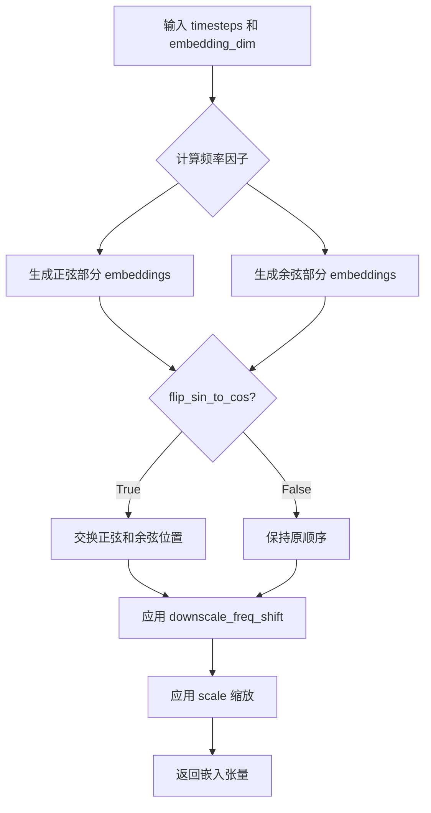
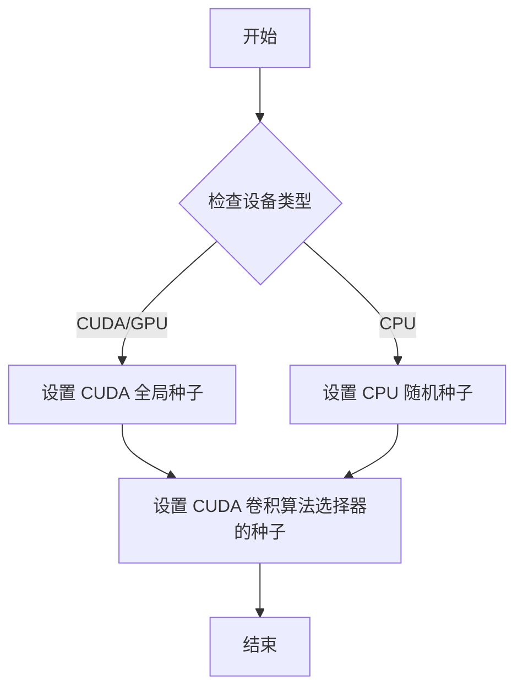
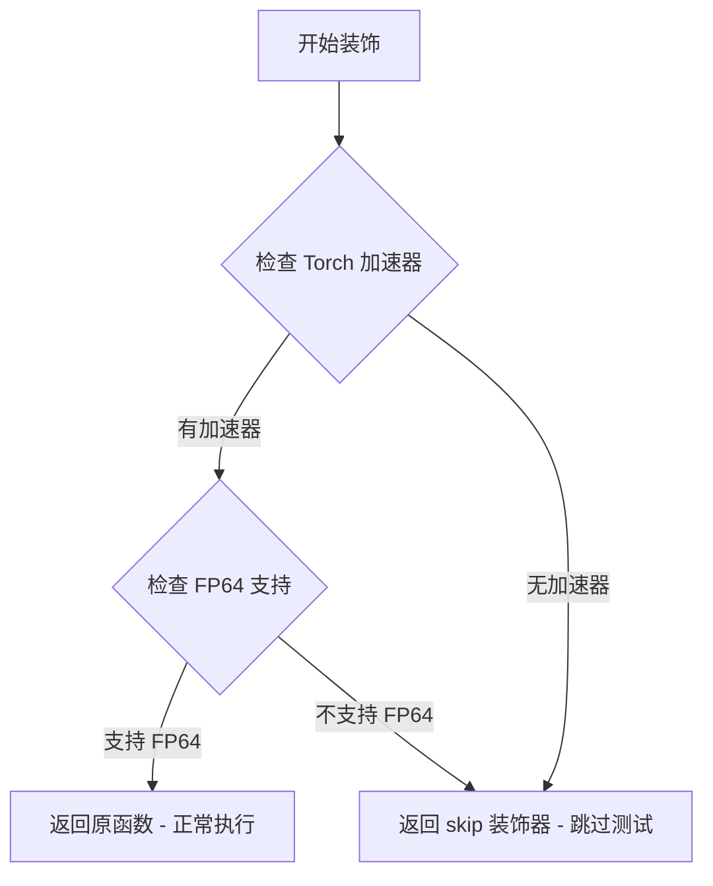
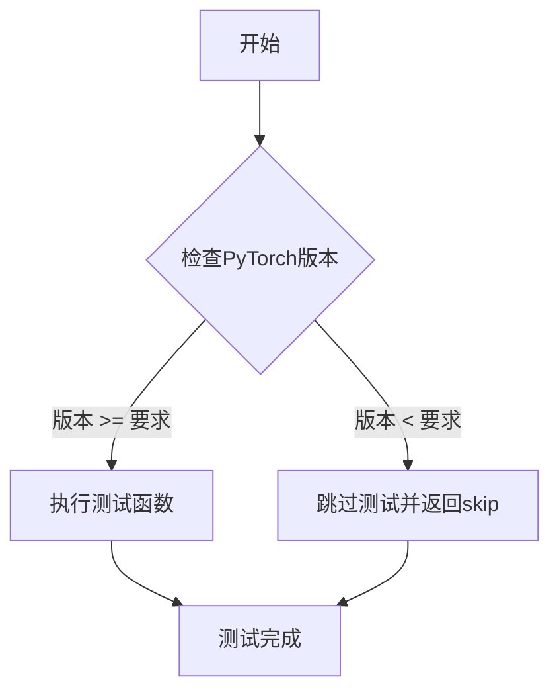
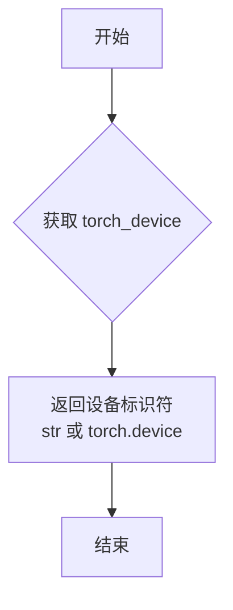
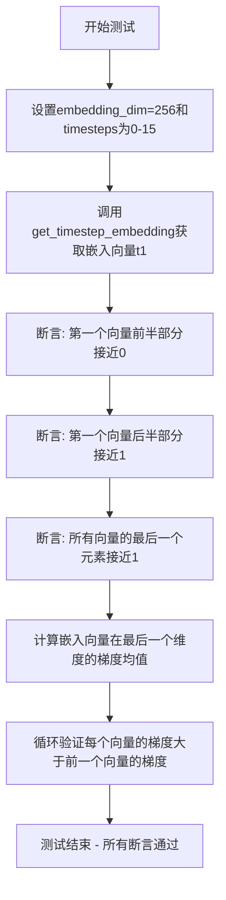

# `diffusers\tests\models\test_layers_utils.py` 详细设计文档

该文件是diffusers库的单元测试文件，专注于测试扩散模型的核心组件，包括时间步嵌入(Timestep Embeddings)、上采样块(Upsample2D)、下采样块(Downsample2D)、残差块(ResnetBlock2D)和2D变换器模型(Transformer2DModel)，验证这些组件在不同配置下的前向传播正确性、数值精度和梯度特性。

## 整体流程

```mermaid
graph TD
    A[开始测试] --> B[EmbeddingsTests]
    B --> B1[test_timestep_embeddings]
    B --> B2[test_timestep_flip_sin_cos]
    B --> B3[test_timestep_downscale_freq_shift]
    B --> B4[test_sinoid_embeddings_hardcoded]
    A --> C[Upsample2DBlockTests]
    C --> C1[test_upsample_default]
    C --> C2[test_upsample_bfloat16]
    C --> C3[test_upsample_with_conv]
    C --> C4[test_upsample_with_conv_out_dim]
    C --> C5[test_upsample_with_transpose]
    A --> D[Downsample2DBlockTests]
    D --> D1[test_downsample_default]
    D --> D2[test_downsample_with_conv]
    D --> D3[test_downsample_with_conv_pad1]
    D --> D4[test_downsample_with_conv_out_dim]
    A --> E[ResnetBlock2DTests]
    E --> E1[test_resnet_default]
    E --> E2[test_restnet_with_use_in_shortcut]
    E --> E3[test_resnet_up]
    E --> E4[test_resnet_down]
    E --> E5[test_restnet_with_kernel_fir]
    E --> E6[test_restnet_with_kernel_sde_vp]
    A --> F[Transformer2DModelTests]
    F --> F1[test_spatial_transformer_default]
    F --> F2[test_spatial_transformer_cross_attention_dim]
    F --> F3[test_spatial_transformer_timestep]
    F --> F4[test_spatial_transformer_dropout]
    F --> F5[test_spatial_transformer_discrete]
    F --> F6[test_spatial_transformer_default_norm_layers]
    F --> F7[test_spatial_transformer_ada_norm_layers]
    F --> F8[test_spatial_transformer_default_ff_layers]
    F --> F9[test_spatial_transformer_geglu_approx_ff_layers]
    F --> F10[test_spatial_transformer_attention_bias]
```



## 类结构

```
unittest.TestCase (Python标准库)
└── EmbeddingsTests
    └── test_timestep_embeddings / test_timestep_flip_sin_cos / test_timestep_downscale_freq_shift / test_sinoid_embeddings_hardcoded
└── Upsample2DBlockTests
    └── test_upsample_default / test_upsample_bfloat16 / test_upsample_with_conv / test_upsample_with_conv_out_dim / test_upsample_with_transpose
└── Downsample2DBlockTests
    └── test_downsample_default / test_downsample_with_conv / test_downsample_with_conv_pad1 / test_downsample_with_conv_out_dim
└── ResnetBlock2DTests
    └── test_resnet_default / test_restnet_with_use_in_shortcut / test_resnet_up / test_resnet_down / test_restnet_with_kernel_fir / test_restnet_with_kernel_sde_vp
└── Transformer2DModelTests
    └── test_spatial_transformer_default / test_spatial_transformer_cross_attention_dim / test_spatial_transformer_timestep / test_spatial_transformer_dropout / test_spatial_transformer_discrete / test_spatial_transformer_default_norm_layers / test_spatial_transformer_ada_norm_layers / test_spatial_transformer_default_ff_layers / test_spatial_transformer_geglu_approx_ff_layers / test_spatial_transformer_attention_bias
```

## 全局变量及字段


### `unittest`
    
Python标准单元测试框架，提供TestCase基类和各种断言方法

类型：`module`
    


### `np (numpy)`
    
Python数值计算库，用于数组操作和数学计算

类型：`module`
    


### `torch`
    
PyTorch深度学习框架核心模块

类型：`module`
    


### `nn (torch.nn)`
    
PyTorch神经网络模块，包含各种层和损失函数

类型：`module`
    


### `GEGLU`
    
门控线性单元激活函数变体，用于Transformer前馈网络

类型：`class`
    


### `AdaLayerNorm`
    
自适应层归一化，根据时间步调整归一化参数

类型：`class`
    


### `ApproximateGELU`
    
近似高斯误差线性单元激活函数

类型：`class`
    


### `get_timestep_embedding`
    
将时间步转换为正弦余弦嵌入向量的函数

类型：`function`
    


### `Downsample2D`
    
2D下采样模块，支持卷积和非卷积方式降低特征图分辨率

类型：`class`
    


### `ResnetBlock2D`
    
2D残差网络块，包含时间嵌入支持的条件归一化

类型：`class`
    


### `Upsample2D`
    
2D上采样模块，支持转置卷积和普通卷积方式提升分辨率

类型：`class`
    


### `Transformer2DModel`
    
2D空间Transformer模型，包含自注意力和交叉注意力机制

类型：`class`
    


### `backend_manual_seed`
    
为特定后端设置随机种子的工具函数

类型：`function`
    


### `require_torch_accelerator_with_fp64`
    
装饰器，标记需要FP64支持的加速器测试

类型：`decorator`
    


### `require_torch_version_greater_equal`
    
装饰器，标记需要特定PyTorch版本以上的测试

类型：`decorator`
    


### `torch_device`
    
指定测试运行的设备（如cuda或cpu）

类型：`variable`
    


    

## 全局函数及方法


### `get_timestep_embedding`

该函数用于将时间步（timesteps）转换为高维向量嵌入表示，通过正弦和余弦函数的不同频率组合来编码时间信息，支持多种配置选项以适应不同的模型架构需求。

参数：

-  `timesteps`：`torch.Tensor`，时间步输入，通常为一维张量，包含要嵌入的时间步值
-  `embedding_dim`：`int`，嵌入向量的维度，决定输出张量的最后一个维度的大小
-  `flip_sin_to_cos`：`bool`（可选，默认为 `False`），是否将正弦和余弦部分交换位置
-  `downscale_freq_shift`：`float`（可选，默认为 `1`），频率下移参数，用于调整余弦部分的频率
-  `scale`：`float`（可选，默认为 `1`），时间步的缩放因子

返回值：`torch.Tensor`，形状为 `(len(timesteps), embedding_dim)` 的嵌入张量，每一行对应一个时间步的嵌入向量

#### 流程图



#### 带注释源码

```python
# 由于提供的代码文件中没有 get_timestep_embedding 的实现源码，
# 只有从 diffusers.models.embeddings 导入的语句和测试用例，
# 因此无法直接提供该函数的完整源代码实现。
# 该函数通常在 diffusers 库的 embeddings.py 文件中定义。

# 以下为测试用例中对该函数的调用方式：

# 基本调用
t1 = get_timestep_embedding(timesteps, embedding_dim)

# 使用 flip_sin_to_cos 参数
t1 = get_timestep_embedding(timesteps, embedding_dim, flip_sin_to_cos=True)
t2 = get_timestep_embedding(timesteps, embedding_dim, flip_sin_to_cos=False)

# 使用 downscale_freq_shift 参数
t1 = get_timestep_embedding(timesteps, embedding_dim, downscale_freq_shift=0)
t2 = get_timestep_embedding(timesteps, embedding_dim, downscale_freq_shift=1)

# 使用 scale 参数（如在 grad-tts 中使用）
t3 = get_timestep_embedding(timesteps, embedding_dim, scale=1000)
```


### `backend_manual_seed`

设置随机种子以确保测试的可重复性，支持多种计算后端（CPU/CUDA）。

参数：

- `device`：`str`，计算设备标识符（如 "cpu"、"cuda:0" 等）
- `seed`：`int`，要设置的随机种子值

返回值：`None`，该函数不返回任何值

#### 流程图



#### 带注释源码

```python
# 注意：此函数定义在 diffusers.testing_utils 模块中，
# 当前代码文件仅导入并使用该函数，而非定义它。
# 根据函数名和调用方式，推断其完整签名和功能如下：

def backend_manual_seed(device: str, seed: int) -> None:
    """
    在指定的后端设备上设置随机种子，以确保测试的可重复性。
    
    参数:
        device: 计算设备标识符，如 "cpu"、"cuda:0" 等
        seed: 随机种子值，用于初始化随机数生成器
    
    返回值:
        无
    
    实现推测:
        - 若 device 包含 "cuda"，则调用 torch.cuda.manual_seed_all(seed)
        - 同时设置 torch.manual_seed(seed) 以确保 CPU 侧的一致性
        - 可能还包含对 CUDA cudnn 算法选择器的确定性设置
    """
    # 导入语句（在测试文件中）:
    # from ..testing_utils import backend_manual_seed, torch_device
    
    # 调用示例:
    # backend_manual_seed(torch_device, 0)
    
    # 实际实现位于: diffusers/testing_utils.py
    pass
```


### `require_torch_accelerator_with_fp64`

这是一个测试装饰器，用于标记需要 GPU/加速器且支持 FP64（双精度浮点数）的测试用例。如果测试环境不满足条件（例如没有 GPU 或不支持 FP64），则跳过该测试。

参数：

- `func`：被装饰的函数（通常是测试方法），`Callable`，需要装饰的函数对象

返回值：`Callable`，装饰后的函数，如果环境不满足要求则返回 `unittest.skip` 装饰器

#### 流程图



#### 带注释源码

```python
# 该函数为外部导入的测试工具函数，位于 testing_utils 模块中
# 代码中从 ..testing_utils 导入，作为装饰器使用
# 示例用法：
# @require_torch_accelerator_with_fp64
# def test_spatial_transformer_discrete(self):
#     # 测试代码...
#
# 装饰器作用：
# 1. 检查当前环境是否有 torch 加速器（GPU/CUDA 等）
# 2. 检查当前环境是否支持 FP64 双精度计算
# 3. 如果任一条件不满足，测试将被跳过
# 4. 确保需要高精度计算的测试在合适的环境中运行

# 此函数定义在 testing_utils.py 中，当前代码仅导入使用
# 具体实现需要查看 testing_utils 模块的源码
```


### `require_torch_version_greater_equal`

该函数是一个测试工具装饰器，用于检查 PyTorch 版本是否满足最低要求，如果不满足则跳过测试。

参数：

- `version`：字符串，表示最低要求的 PyTorch 版本号

返回值：无（装饰器函数）

#### 流程图



#### 带注释源码

```
# 该函数在当前代码文件中未被定义，仅从 ..testing_utils 模块导入
# 以下为使用示例

from ..testing_utils import require_torch_version_greater_equal

# 作为装饰器使用，限制测试仅在 PyTorch >= 2.1 时运行
@require_torch_version_greater_equal("2.1")
def test_upsample_bfloat16(self):
    torch.manual_seed(0)
    sample = torch.randn(1, 32, 32, 32).to(torch.bfloat16)
    upsample = Upsample2D(channels=32, use_conv=False)
    with torch.no_grad():
        upsampled = upsample(sample)

    assert upsampled.shape == (1, 32, 64, 64)
    # ... 更多断言
```

---

**注意**：在提供的代码文件中，`require_torch_version_greater_equal` 函数仅被导入和使用作为测试装饰器，其实际实现位于 `..testing_utils` 模块中，未包含在当前代码片段内。


### `torch_device`

`torch_device` 是从 `testing_utils` 模块导入的全局变量，用于指定 PyTorch 张量和模型的默认计算设备。在测试代码中，通过 `.to(torch_device)` 方法将张量移动到指定的设备上（如 CPU 或 CUDA 设备）。

参数： 无

返回值：`str` 或 `torch.device`，返回当前配置的 PyTorch 设备标识符（如 "cpu"、"cuda" 等）

#### 流程图



#### 带注释源码

```python
# 注意：torch_device 的实际定义不在本文件中
# 它是从 testing_utils 模块导入的全局变量/函数

# 以下是代码中 torch_device 的典型使用方式：

# 1. 将张量移动到指定设备
sample = torch.randn(1, 32, 64, 64).to(torch_device)

# 2. 将模型移动到指定设备
resnet_block = ResnetBlock2D(in_channels=32, temb_channels=128).to(torch_device)

# 3. 在设备上创建张量
expected_slice = torch.tensor(
    [-1.9010, -0.2974, -0.8245, -1.3533, 0.8742, -0.9645, -2.0584, 1.3387, -0.4746], 
    device=torch_device
)

# torch_device 的可能定义（位于 testing_utils 模块中）:
# 方式1: 全局变量
# torch_device = "cuda" if torch.cuda.is_available() else "cpu"

# 方式2: 函数
# def torch_device():
#     return "cuda" if torch.cuda.is_available() else "cpu"

# 方式3: torch.device 对象
# torch_device = torch.device("cuda" if torch.cuda.is_available() else "cpu")
```

---

### 补充说明

#### 关键组件信息

| 名称 | 一句话描述 |
|------|------------|
| `torch_device` | 指定 PyTorch 计算设备的全局变量/函数，用于测试中张量和模型的设备分配 |

#### 潜在的技术债务或优化空间

1. **隐式设备依赖**：代码中多处硬编码使用 `torch_device`，如果设备不可用可能导致测试失败
2. **设备检测逻辑重复**：每个测试都需要调用 `.to(torch_device)`，可以考虑封装辅助函数简化代码

#### 其它项目

- **设计目标与约束**：确保测试可以在不同设备（CPU/CUDA）上运行，设备选择自动化
- **错误处理**：当指定设备不可用时，PyTorch 会自动回退到 CPU 或抛出错误
- **外部依赖**：依赖 `torch` 库和 `testing_utils` 模块中的设备检测逻辑


### `EmbeddingsTests.test_timestep_embeddings`

该测试方法用于验证 `get_timestep_embedding` 函数生成的时间步嵌入向量的正确性，包括验证嵌入向量的结构（前半部分为0、后半部分为1）、最后一个元素为1，以及梯度单调递增的特性。

参数：
- `self`：EmbeddingsTests，当前测试类的实例，无需显式传递

返回值：`None`，该方法为单元测试方法，通过断言验证嵌入向量的正确性，不返回任何值

#### 流程图



#### 带注释源码

```python
def test_timestep_embeddings(self):
    """
    测试时间步嵌入向量的正确性
    
    该测试验证 get_timestep_embedding 函数生成的嵌入向量满足以下条件：
    1. 第一个向量前半部分元素接近0，后半部分元素接近1
    2. 所有向量的最后一个元素接近1
    3. 随着索引增加，嵌入向量的频率（即梯度）单调递增
    """
    # 定义嵌入维度为256
    embedding_dim = 256
    # 创建从0到15的16个时间步
    timesteps = torch.arange(16)

    # 调用待测试的 get_timestep_embedding 函数生成嵌入向量
    t1 = get_timestep_embedding(timesteps, embedding_dim)

    # 断言1: 第一个向量前半部分应由0组成
    # embedding_dim // 2 = 128，取前128个元素，验证其接近0
    assert (t1[0, : embedding_dim // 2] - 0).abs().sum() < 1e-5
    
    # 断言2: 第一个向量后半部分应由1组成
    # 取后128个元素，验证其接近1
    assert (t1[0, embedding_dim // 2 :] - 1).abs().sum() < 1e-5

    # 断言3: 所有向量的最后一个元素应为1
    # 验证每个向量的最后一个维度元素接近1
    assert (t1[:, -1] - 1).abs().sum() < 1e-5

    # 断言4: 验证嵌入向量的梯度单调性
    # 对于较大的嵌入（如128），每个向量的频率高于前一个向量
    # 这意味着后续向量的梯度始终高于前一个向量的梯度
    # 使用numpy的gradient计算在最后一个维度的梯度，取绝对值后计算均值
    grad_mean = np.abs(np.gradient(t1, axis=-1)).mean(axis=1)

    # 遍历每个向量的梯度均值，验证其严格递增
    prev_grad = 0.0
    for grad in grad_mean:
        assert grad > prev_grad  # 当前梯度必须大于前一个梯度
        prev_grad = grad
```


### `EmbeddingsTests.test_timestep_flip_sin_cos`

验证 `get_timestep_embedding` 函数在 `flip_sin_to_cos=True` 时手动拼接半部分与 `flip_sin_to_cos=False` 时直接生成的嵌入向量是否等价，确保正弦/余弦相位翻转逻辑的正确性。

参数：

- `self`：隐式参数，`EmbeddingsTests` 实例本身，无需额外描述

返回值：`None`，该方法为单元测试，使用断言验证逻辑，不返回实际数据

#### 流程图

```mermaid
flowchart TD
    A[开始测试] --> B[设置 embedding_dim=16, timesteps=torch.arange(10)]
    B --> C[调用 get_timestep_embedding 并设置 flip_sin_to_cos=True]
    C --> D[手动拼接: torch.cat [后half, 前half] 实现翻转]
    E[并行调用 get_timestep_embedding 并设置 flip_sin_to_cos=False] --> F[获取标准嵌入]
    D --> G[使用 torch.allclose 比较两者是否近似相等]
    G --> H[断言通过则测试通过, 否则失败]
```

#### 带注释源码

```python
def test_timestep_flip_sin_cos(self):
    """测试时间步嵌入在 flip_sin_to_cos 参数下的等价性"""
    
    # 1. 定义测试参数: 嵌入维度和时间步序列
    embedding_dim = 16
    timesteps = torch.arange(10)  # 生成 0 到 9 的时间步
    
    # 2. 获取 flip_sin_to_cos=True 的嵌入向量
    #    此时嵌入顺序为 [cos(0), cos(1), ..., sin(0), sin(1), ...]
    t1 = get_timestep_embedding(timesteps, embedding_dim, flip_sin_to_cos=True)
    
    # 3. 手动拼接: 将后 half (即 cos 部分) 拼接到前面
    #    实现效果等价于 flip_sin_to_cos=False 的原始顺序
    #    原始: [cos_0, cos_1, ..., sin_0, sin_1, ...]
    #    拼接后: [sin_0, sin_1, ..., cos_0, cos_1, ...]
    t1 = torch.cat([t1[:, embedding_dim // 2 :], t1[:, : embedding_dim // 2]], dim=-1)
    
    # 4. 获取 flip_sin_to_cos=False (默认) 的嵌入向量作为基准
    t2 = get_timestep_embedding(timesteps, embedding_dim, flip_sin_to_cos=False)
    
    # 5. 断言两种方式生成的嵌入向量在 1e-3 误差范围内相等
    #    验证 flip_sin_to_cos 逻辑的正确性
    assert torch.allclose(t1.cpu(), t2.cpu(), 1e-3)
```


### `EmbeddingsTests.test_timestep_downscale_freq_shift`

该测试方法用于验证 `get_timestep_embedding` 函数在不同 `downscale_freq_shift` 参数值下的行为，确保余弦半部分的嵌入值为负数。

参数：

- `self`：`EmbeddingsTests` 类实例，隐式参数，表示测试类本身

返回值：`None`，该方法为单元测试方法，无返回值，通过断言验证正确性

#### 流程图

```mermaid
flowchart TD
    A[开始测试] --> B[设置参数: embedding_dim=16, timesteps=0到9]
    B --> C[调用get_timestep_embedding with downscale_freq_shift=0]
    C --> D[调用get_timestep_embedding with downscale_freq_shift=1]
    D --> E[计算差值并提取余弦半部分: cosine_half = (t1 - t2)[:, embedding_dim // 2:]]
    E --> F{验证余弦值为负数}
    F -->|通过| G[测试通过]
    F -->|失败| H[抛出断言错误]
```

#### 带注释源码

```python
def test_timestep_downscale_freq_shift(self):
    """
    测试 get_timestep_embedding 函数在不同 downscale_freq_shift 参数下的行为
    
    该测试验证:
    1. 当 downscale_freq_shift=0 和 downscale_freq_shift=1 时的嵌入差异
    2. 余弦半部分的嵌入值应该为负数
    """
    # 定义嵌入维度为 16
    embedding_dim = 16
    # 创建时间步序列 [0, 1, 2, ..., 9]
    timesteps = torch.arange(10)

    # 使用 downscale_freq_shift=0 获取时间步嵌入
    # 这对应于标准的时间步嵌入计算
    t1 = get_timestep_embedding(timesteps, embedding_dim, downscale_freq_shift=0)
    
    # 使用 downscale_freq_shift=1 获取时间步嵌入
    # 这会对频率进行下移操作
    t2 = get_timestep_embedding(timesteps, embedding_dim, downscale_freq_shift=1)

    # 获取余弦半部分（被包裹到余弦函数中的向量）
    # 嵌入向量前半部分为正弦，后半部分为余弦
    cosine_half = (t1 - t2)[:, embedding_dim // 2 :]

    # 断言：余弦部分的值必须为负数
    # 验证 (cosine_half <= 0) 的结果取绝对值后与1的差异小于1e-5
    # 实际上就是确保 cosine_half 中的所有值都小于等于0
    assert (np.abs((cosine_half <= 0).numpy()) - 1).sum() < 1e-5
```


### `EmbeddingsTests.test_sinoid_embeddings_hardcoded`

该测试方法验证了 `get_timestep_embedding` 函数在不同配置下（标准UNet/SD-VDE、GLIDE/LDM、Grad-TTs）的正确性，通过硬编码的期望数值确保实现的数值精度。

参数：

- `self`：`EmbeddingsTests`（隐式），测试类的实例本身

返回值：`None`，该方法为测试方法，无返回值（通过断言验证正确性）

#### 流程图

```mermaid
flowchart TD
    A[开始测试] --> B[设置 embedding_dim=64, timesteps=0-127]
    B --> C[调用get_timestep_embedding<br/>标准UNet配置<br/>downscale_freq_shift=1<br/>flip_sin_to_cos=False]
    C --> D[调用get_timestep_embedding<br/>GLIDE/LDM配置<br/>downscale_freq_shift=0<br/>flip_sin_to_cos=True]
    D --> E[调用get_timestep_embedding<br/>Grad-TTs配置<br/>scale=1000]
    E --> F{验证t1[23:26, 47:50]的<br/>硬编码数值精度}
    F --> G{验证t2[23:26, 47:50]的<br/>硬编码数值精度}
    G --> H{验证t3[23:26, 47:50]的<br/>硬编码数值精度}
    H --> I[测试通过]
    
    style F fill:#ffcccc
    style G fill:#ffcccc
    style H fill:#ffcccc
```

#### 带注释源码

```python
def test_sinoid_embeddings_hardcoded(self):
    """
    测试 get_timestep_embedding 函数在不同配置下的数值正确性
    通过硬编码的期望值验证实现的精度
    """
    # 设置嵌入维度和时间步
    embedding_dim = 64
    timesteps = torch.arange(128)  # 生成0到127的时间步

    # 配置1: 标准UNet/SD-VDE配置
    # downscale_freq_shift=1: 降低频率偏移
    # flip_sin_to_cos=False: 不翻转sin到cos
    t1 = get_timestep_embedding(timesteps, embedding_dim, downscale_freq_shift=1, flip_sin_to_cos=False)
    
    # 配置2: GLIDE/LDM配置
    # downscale_freq_shift=0: 无频率偏移
    # flip_sin_to_cos=True: 翻转sin到cos
    t2 = get_timestep_embedding(timesteps, embedding_dim, downscale_freq_shift=0, flip_sin_to_cos=True)
    
    # 配置3: Grad-TTs配置
    # scale=1000: 较大的缩放因子
    t3 = get_timestep_embedding(timesteps, embedding_dim, scale=1000)

    # 验证配置1的输出数值 (标准UNet/SD-VDE)
    # 提取特定切片 [23:26, 47:50] 共9个元素进行验证
    assert torch.allclose(
        t1[23:26, 47:50].flatten().cpu(),
        torch.tensor([0.9646, 0.9804, 0.9892, 0.9615, 0.9787, 0.9882, 0.9582, 0.9769, 0.9872]),
        1e-3,  # 精度容差
    )

    # 验证配置2的输出数值 (GLIDE/LDM)
    assert torch.allclose(
        t2[23:26, 47:50].flatten().cpu(),
        torch.tensor([0.3019, 0.2280, 0.1716, 0.3146, 0.2377, 0.1790, 0.3272, 0.2474, 0.1864]),
        1e-3,
    )

    # 验证配置3的输出数值 (Grad-TTs)
    assert torch.allclose(
        t3[23:26, 47:50].flatten().cpu(),
        torch.tensor([-0.9801, -0.9464, -0.9349, -0.3952, 0.8887, -0.9709, 0.5299, -0.2853, -0.9927]),
        1e-3,
    )
```


### `Upsample2DBlockTests.test_upsample_default`

该测试函数验证了 Upsample2D 模块在使用默认参数（不使用卷积）时的基本功能，包括创建上采样层、对输入进行 2 倍空间上采样、验证输出形状和数值正确性。

参数：

- `self`：`unittest.TestCase`，表示测试类实例本身

返回值：`None`，测试函数无显式返回值，通过 assert 语句进行验证

#### 流程图

```mermaid
flowchart TD
    A[开始测试] --> B[设置随机种子: torch.manual_seed(0)]
    B --> C[创建输入张量: sample = torch.randn(1, 32, 32, 32)]
    C --> D[实例化Upsample2D: channels=32, use_conv=False]
    D --> E[执行上采样: upsample(sample)]
    E --> F{验证输出形状}
    F -->|通过| G[提取输出切片: output_slice = upsampled[0, -1, -3:, -3:]]
    F -->|失败| H[抛出AssertionError]
    G --> I[创建期望切片: expected_slice]
    I --> J{验证数值接近度}
    J -->|通过| K[测试通过]
    J -->|失败| H
```

#### 带注释源码

```python
def test_upsample_default(self):
    """测试 Upsample2D 模块的默认上采样功能（不使用卷积）"""
    # 设置随机种子以确保结果可复现
    torch.manual_seed(0)
    
    # 创建输入样本：batch_size=1, channels=32, height=32, width=32
    sample = torch.randn(1, 32, 32, 32)
    
    # 创建上采样层：通道数为32，不使用卷积上采样
    # 这将使用默认的插值方法进行2倍上采样
    upsample = Upsample2D(channels=32, use_conv=False)
    
    # 在推理模式下执行上采样（禁用梯度计算以提高性能）
    with torch.no_grad():
        # 执行上采样：将 (1, 32, 32, 32) -> (1, 32, 64, 64)
        upsampled = upsample(sample)
    
    # 断言1：验证输出形状是否正确（空间维度翻倍）
    assert upsampled.shape == (1, 32, 64, 64)
    
    # 提取输出张量的最后一个通道的最后3x3区域
    # 用于与期望值进行精确比较
    output_slice = upsampled[0, -1, -3:, -3:]
    
    # 定义期望的输出切片数值（预先计算的标准答案）
    expected_slice = torch.tensor(
        [-0.2173, -1.2079, -1.2079, 0.2952, 1.1254, 1.1254, 0.2952, 1.1254, 1.1254]
    )
    
    # 断言2：验证输出数值与期望值的接近程度
    # 使用 torch.allclose 进行浮点数近似比较，允许绝对误差为 1e-3
    assert torch.allclose(output_slice.flatten(), expected_slice, atol=1e-3)
```


### `Upsample2DBlockTests.test_upsample_bfloat16`

测试方法，用于验证 `Upsample2D` 模块在 `bfloat16` 数据类型下进行上采样时的输出形状和数值正确性。

参数：
- `self`：`Upsample2DBlockTests`，测试类实例本身，用于访问类属性和方法。

返回值：`None`，测试方法不返回任何值，仅通过断言验证正确性。

#### 流程图

```mermaid
flowchart TD
    A[开始测试] --> B[设置随机种子 torch.manual_seed(0)]
    B --> C[创建输入样本 sample: torch.randn(1, 32, 32, 32).to(torch.bfloat16)]
    C --> D[创建Upsample2D模型 upsample: Upsample2D(channels=32, use_conv=False)]
    D --> E[执行前向传播 with torch.no_grad(): upsampled = upsample(sample)]
    E --> F[断言输出形状 assert upsampled.shape == (1, 32, 64, 64)]
    F --> G[提取输出切片 output_slice = upsampled[0, -1, -3:, -3:]]
    G --> H[创建期望切片 expected_slice: torch.tensor([...], dtype=torch.bfloat16)]
    H --> I[断言数值接近 assert torch.allclose(output_slice.flatten(), expected_slice, atol=1e-3)]
    I --> J[结束测试]
```

#### 带注释源码

```python
@require_torch_version_greater_equal("2.1")  # 装饰器：要求PyTorch版本>=2.1
def test_upsample_bfloat16(self):
    """
    测试Upsample2D模块在bfloat16数据类型下的上采样功能。
    验证输出形状为(1, 32, 64, 64)且数值与预期接近。
    """
    torch.manual_seed(0)  # 设置随机种子以确保结果可复现
    # 创建输入样本：形状(1, 32, 32, 32)，数据类型为bfloat16
    sample = torch.randn(1, 32, 32, 32).to(torch.bfloat16)
    # 创建Upsample2D模型：通道数为32，不使用卷积
    upsample = Upsample2D(channels=32, use_conv=False)
    # 禁用梯度计算以提高推理效率
    with torch.no_grad():
        # 执行上采样操作
        upsampled = upsample(sample)

    # 断言：验证输出形状为(1, 32, 64, 64)
    assert upsampled.shape == (1, 32, 64, 64)
    # 提取输出切片：取最后一个通道的最后3x3区域
    output_slice = upsampled[0, -1, -3:, -3:]
    # 定义期望输出切片：基于bfloat16类型的预期数值
    expected_slice = torch.tensor(
        [-0.2173, -1.2079, -1.2079, 0.2952, 1.1254, 1.1254, 0.2952, 1.1254, 1.1254], dtype=torch.bfloat16
    )
    # 断言：验证输出数值与期望数值在容差1e-3内接近
    assert torch.allclose(output_slice.flatten(), expected_slice, atol=1e-3)
```


### `Upsample2DBlockTests.test_upsample_with_conv`

该函数是一个单元测试方法，用于测试 `Upsample2D` 类在使用卷积（`use_conv=True`）进行上采样时的功能正确性。测试验证了上采样后的输出形状是否正确以及数值是否符合预期。

参数：

- `self`：`Upsample2DBlockTests`，测试类的实例本身

返回值：`None`，该方法为测试方法，无显式返回值，通过断言验证功能

#### 流程图

```mermaid
graph TD
    A[开始测试] --> B[设置随机种子: torch.manual_seed(0)]
    B --> C[创建输入张量: sample = torch.randn(1, 32, 32, 32)]
    C --> D[创建Upsample2D模块: use_conv=True]
    D --> E[执行前向传播: upsample(sample)]
    E --> F[断言输出形状: (1, 32, 64, 64)]
    F --> G[提取输出切片: upsampled[0, -1, -3:, -3:]]
    G --> H[定义期望切片: expected_slice]
    H --> I[断言数值接近: torch.allclose]
    I --> J[测试结束]
```

#### 带注释源码

```python
def test_upsample_with_conv(self):
    """
    测试 Upsample2D 在使用卷积模式下的上采样功能
    
    该测试验证：
    1. 上采样模块能正确处理输入并输出正确的形状
    2. 卷积模式下的数值输出符合预期
    """
    # 设置随机种子以确保结果可复现
    torch.manual_seed(0)
    
    # 创建输入样本：张量形状为 (batch=1, channels=32, height=32, width=32)
    sample = torch.randn(1, 32, 32, 32)
    
    # 创建上采样模块：
    # - channels=32: 输入通道数
    # - use_conv=True: 使用卷积进行上采样（而非简单的插值）
    upsample = Upsample2D(channels=32, use_conv=True)
    
    # 执行前向传播，使用 torch.no_grad() 禁用梯度计算以提升性能
    with torch.no_grad():
        upsampled = upsample(sample)

    # 断言1：验证输出形状
    # 输入 32x32 经过 2x 上采样后应为 64x64
    assert upsampled.shape == (1, 32, 64, 64)
    
    # 提取输出切片用于数值验证
    # 取最后一个通道的最后 3x3 区域
    output_slice = upsampled[0, -1, -3:, -3:]
    
    # 定义期望的输出切片数值（通过先前测试确定的标准值）
    expected_slice = torch.tensor([0.7145, 1.3773, 0.3492, 0.8448, 1.0839, -0.3341, 0.5956, 0.1250, -0.4841])
    
    # 断言2：验证输出数值是否接近期望值
    # 容差为 1e-3
    assert torch.allclose(output_slice.flatten(), expected_slice, atol=1e-3)
```


### `Upsample2DBlockTests.test_upsample_with_conv_out_dim`

该测试函数验证了 `Upsample2D` 模块在使用卷积（use_conv=True）且指定输出通道数（out_channels=64）时的前向传播正确性，包括输出形状是否为 (1, 64, 64, 64) 以及输出数值是否与预期值在允许的误差范围内匹配。

参数：

- `self`：隐式参数，测试类实例本身

返回值：`None`，无返回值（测试函数）

#### 流程图

```mermaid
flowchart TD
    A[开始测试] --> B[设置随机种子 torch.manual_seed(0)]
    B --> C[创建输入张量 sample: (1, 32, 32, 32)]
    C --> D[创建 Upsample2D 上采样模块<br/>channels=32, use_conv=True, out_channels=64]
    D --> E[使用 torch.no_grad() 禁用梯度计算]
    E --> F[执行前向传播: upsampled = upsample(sample)]
    F --> G{断言检查}
    G --> H[断言输出形状 == (1, 64, 64, 64)]
    H --> I[提取输出切片: output_slice = upsampled[0, -1, -3:, -3:]]
    I --> J[创建期望张量 expected_slice]
    J --> K[断言张量数值近似相等<br/>torch.allclose(output_slice, expected_slice, atol=1e-3)]
    K --> L[测试通过]
```

#### 带注释源码

```python
def test_upsample_with_conv_out_dim(self):
    """
    测试 Upsample2D 模块在使用卷积且指定输出通道数时的正确性。
    验证输出形状为 (batch, channels, height*2, width*2) 且数值正确。
    """
    # 设置随机种子以确保结果可复现
    torch.manual_seed(0)
    
    # 创建输入张量：batch_size=1, channels=32, height=32, width=32
    sample = torch.randn(1, 32, 32, 32)
    
    # 创建 Upsample2D 上采样模块
    # channels=32: 输入通道数
    # use_conv=True: 使用卷积进行上采样
    # out_channels=64: 输出通道数（不同于输入通道数）
    upsample = Upsample2D(channels=32, use_conv=True, out_channels=64)
    
    # 禁用梯度计算以提高推理性能并减少内存占用
    with torch.no_grad():
        # 执行上采样前向传播
        # 输入: (1, 32, 32, 32) -> 输出: (1, 64, 64, 64)
        upsampled = upsample(sample)

    # 断言1: 验证输出形状正确
    # 高度和宽度应放大2倍，通道数应变为64
    assert upsampled.shape == (1, 64, 64, 64)
    
    # 提取输出切片用于数值验证
    # 取最后一个通道的右下角 3x3 区域
    output_slice = upsampled[0, -1, -3:, -3:]
    
    # 创建期望的输出切片值（预先计算的正确结果）
    expected_slice = torch.tensor([0.2703, 0.1656, -0.2538, -0.0553, -0.2984, 0.1044, 0.1155, 0.2579, 0.7755])
    
    # 断言2: 验证输出数值与期望值在允许误差范围内匹配
    # atol=1e-3 表示绝对容差为 0.001
    assert torch.allclose(output_slice.flatten(), expected_slice, atol=1e-3)
```


### `Upsample2DBlockTests.test_upsample_with_transpose`

该测试方法用于验证 Upsample2D 模块在使用转置卷积（use_conv_transpose=True）进行上采样时的正确性。测试创建一个 4D 输入张量，经过 Upsample2D 模块上采样后，验证输出形状是否为 (1, 32, 64, 64) 以及输出数值是否与预期值匹配。

参数：

- `self`：测试类实例本身，无额外参数

返回值：无明确的返回值（测试函数通过断言验证，测试通过则无输出，失败则抛出 AssertionError）

#### 流程图

```mermaid
flowchart TD
    A[开始测试] --> B[设置随机种子: torch.manual_seed(0)]
    B --> C[创建输入张量: sample = torch.randn(1, 32, 32, 32)]
    C --> D[创建Upsample2D模块: use_conv=False, use_conv_transpose=True]
    D --> E[执行前向传播: upsample(sample)]
    E --> F[断言输出形状: (1, 32, 64, 64)]
    F --> G[提取输出切片: output_slice = upsampled[0, -1, -3:, -3:]]
    G --> H[定义期望切片: expected_slice]
    H --> I[断言数值匹配: torch.allclose]
    I --> J{验证结果}
    J -->|通过| K[测试通过]
    J -->|失败| L[抛出AssertionError]
```

#### 带注释源码

```python
def test_upsample_with_transpose(self):
    # 设置随机种子以确保结果可复现
    torch.manual_seed(0)
    
    # 创建形状为 (batch=1, channels=32, height=32, width=32) 的随机输入张量
    sample = torch.randn(1, 32, 32, 32)
    
    # 创建 Upsample2D 上采样模块
    # 参数说明:
    #   - channels=32: 输入通道数
    #   - use_conv=False: 不使用常规卷积进行上采样
    #   - use_conv_transpose=True: 使用转置卷积（反卷积）进行上采样
    upsample = Upsample2D(channels=32, use_conv=False, use_conv_transpose=True)
    
    # 在 inference 模式下执行前向传播，禁用梯度计算以提高性能
    with torch.no_grad():
        upsampled = upsample(sample)
    
    # 断言1: 验证输出形状正确
    # 转置卷积应将空间维度从 32x32 上采样到 64x64
    assert upsampled.shape == (1, 32, 64, 64)
    
    # 提取输出张量的最后一层通道的右下角 3x3 区域
    # 用于与期望值进行精确比较
    output_slice = upsampled[0, -1, -3:, -3:]
    
    # 定义期望的输出切片数值（预先计算的标准值）
    expected_slice = torch.tensor([-0.3028, -0.1582, 0.0071, 0.0350, -0.4799, -0.1139, 0.1056, -0.1153, -0.1046])
    
    # 断言2: 验证输出数值与期望值匹配
    # 使用 torch.allclose 进行浮点数近似比较，允许绝对误差 1e-3
    assert torch.allclose(output_slice.flatten(), expected_slice, atol=1e-3)
```


### `Downsample2DBlockTests.test_downsample_default`

这是一个单元测试方法，用于验证 `Downsample2D` 类在使用默认配置（不使用卷积）时的下采样功能。测试通过创建特定形状的输入张量，执行下采样操作，并验证输出张量的形状和数值是否符合预期。

参数：

- `self`：`Downsample2DBlockTests`，测试类实例本身，无需显式传递

返回值：`None`，该方法为测试方法，无返回值，通过断言验证正确性

#### 流程图

```mermaid
flowchart TD
    A[开始测试] --> B[设置随机种子 torch.manual_seed(0)]
    B --> C[创建输入张量 sample: shape (1, 32, 64, 64)]
    C --> D[创建 Downsample2D 对象: channels=32, use_conv=False]
    D --> E[执行下采样: downsampled = downsample(sample)]
    E --> F[断言输出形状为 (1, 32, 32, 32)]
    F --> G[提取输出切片: output_slice = downsampled[0, -1, -3:, -3:]]
    G --> H[定义期望切片 expected_slice]
    H --> I[计算最大差值 max_diff]
    I --> J{max_diff <= 1e-3?}
    J -->|是| K[测试通过]
    J -->|否| L[测试失败]
```

#### 带注释源码

```python
def test_downsample_default(self):
    """
    测试 Downsample2D 类在默认配置（不使用卷积）下的下采样功能。
    验证输出形状正确且数值在容差范围内。
    """
    # 设置随机种子以确保测试结果可复现
    torch.manual_seed(0)
    
    # 创建输入张量：batch=1, channels=32, height=64, width=64
    sample = torch.randn(1, 32, 64, 64)
    
    # 创建 Downsample2D 下采样层：
    # - channels=32: 输入输出通道数
    # - use_conv=False: 使用简单的空间下采样（而非卷积）
    downsample = Downsample2D(channels=32, use_conv=False)
    
    # 执行下采样操作，使用 no_grad 上下文避免计算梯度
    with torch.no_grad():
        downsampled = downsample(sample)

    # 断言1: 验证输出形状
    # 空间维度应从 64x64 下采样至 32x32（2倍下采样）
    assert downsampled.shape == (1, 32, 32, 32)
    
    # 提取输出张量的最后一个通道的右下角 3x3 区域
    output_slice = downsampled[0, -1, -3:, -3:]
    
    # 定义期望的输出切片数值（基于预先计算的参考值）
    expected_slice = torch.tensor([-0.0513, -0.3889, 0.0640, 0.0836, -0.5460, -0.0341, -0.0169, -0.6967, 0.1179])
    
    # 计算实际输出与期望输出的最大绝对差值
    max_diff = (output_slice.flatten() - expected_slice).abs().sum().item()
    
    # 断言2: 验证数值精度
    # 最大差值应不超过 1e-3（0.001）
    assert max_diff <= 1e-3
    
    # 注释掉的备选断言：使用 torch.allclose 进行更简洁的数值比较
    # assert torch.allclose(output_slice.flatten(), expected_slice, atol=1e-1)
```


### `Downsample2DBlockTests.test_downsample_with_conv`

该测试函数验证了 `Downsample2D` 模块在使用卷积（`use_conv=True`）进行 2D 下采样时的正确性，通过对比实际输出与预期张量来确保模块功能符合预期。

参数：

- `self`：`unittest.TestCase`，测试类实例本身

返回值：`None`，该测试函数无返回值，通过断言验证正确性

#### 流程图

```mermaid
flowchart TD
    A[开始测试] --> B[设置随机种子 torch.manual_seed]
    B --> C[创建随机输入张量 sample shape=(1, 32, 64, 64)]
    C --> D[创建 Downsample2D 模型 use_conv=True]
    D --> E[在 no_grad 模式下执行下采样]
    E --> F[断言输出形状为 (1, 32, 32, 32)]
    F --> G[提取输出张量的最后部分]
    G --> H[定义期望输出张量 expected_slice]
    H --> I[断言实际输出与期望值接近 atol=1e-3]
    I --> J[测试通过]
```

#### 带注释源码

```python
def test_downsample_with_conv(self):
    """测试 Downsample2D 使用卷积进行下采样的功能"""
    # 设置随机种子以确保结果可复现
    torch.manual_seed(0)
    
    # 创建随机输入张量：batch=1, channels=32, height=64, width=64
    sample = torch.randn(1, 32, 64, 64)
    
    # 创建 Downsample2D 下采样层，channels=32 表示输入通道数，use_conv=True 表示使用卷积进行下采样
    downsample = Downsample2D(channels=32, use_conv=True)
    
    # 在 no_grad 模式下执行前向传播，避免计算梯度以提高性能和内存效率
    with torch.no_grad():
        downsampled = downsample(sample)
    
    # 断言输出形状：batch=1, channels=32, height=32, width=32（空间维度减半）
    assert downsampled.shape == (1, 32, 32, 32)
    
    # 提取输出张量最后一个通道的右下角 3x3 区域
    output_slice = downsampled[0, -1, -3:, -3:]
    
    # 定义期望的输出张量值（通过预先计算得出）
    expected_slice = torch.tensor(
        [0.9267, 0.5878, 0.3337, 1.2321, -0.1191, -0.3984, -0.7532, -0.0715, -0.3913],
    )
    
    # 断言实际输出与期望值在容差 1e-3 范围内接近
    assert torch.allclose(output_slice.flatten(), expected_slice, atol=1e-3)
```


### `Downsample2DBlockTests.test_downsample_with_conv_pad1`

该测试方法验证了 Downsample2D 类在使用卷积进行下采样且填充值为1时的正确性，确保输出形状和数值符合预期。

参数：

- `self`：`unittest.TestCase`，测试类实例本身

返回值：`None`，该方法为单元测试，无返回值，通过 assert 语句验证结果

#### 流程图

```mermaid
flowchart TD
    A[开始测试] --> B[设置随机种子 torch.manual_seed(0)]
    B --> C[创建输入样本 tensor: shape=(1, 32, 64, 64)]
    C --> D[创建 Downsample2D 下采样层: channels=32, use_conv=True, padding=1]
    D --> E[执行下采样: downsampled = downsample(sample)]
    E --> F[验证输出形状: assert downsampled.shape == (1, 32, 32, 32)]
    F --> G[提取输出切片: output_slice = downsampled[0, -1, -3:, -3:]]
    G --> H[定义期望切片: expected_slice = tensor([0.9267, 0.5878, ...])]
    H --> I[验证数值一致性: assert torch.allclose(output_slice.flatten(), expected_slice, atol=1e-3)]
    I --> J[测试通过]
```

#### 带注释源码

```python
def test_downsample_with_conv_pad1(self):
    """
    测试 Downsample2D 使用卷积下采样且填充为1的情况
    
    验证点:
    1. 输出形状正确 (batch=1, channels=32, height=32, width=32)
    2. 下采样后的数值与预期值匹配
    """
    # 设置随机种子以确保结果可复现
    torch.manual_seed(0)
    
    # 创建输入样本: batch_size=1, channels=32, height=64, width=64
    sample = torch.randn(1, 32, 64, 64)
    
    # 创建下采样层: 使用卷积进行下采样，padding=1
    # channels=32: 输入输出通道数
    # use_conv=True: 使用卷积层进行下采样而非简单的像素重排
    # padding=1: 在卷积前对输入进行1像素的边界填充
    downsample = Downsample2D(channels=32, use_conv=True, padding=1)
    
    # 执行下采样操作，禁用梯度计算以提高性能
    with torch.no_grad():
        downsampled = downsample(sample)
    
    # 验证输出形状: 下采样后高宽变为原来的一半 (64 -> 32)
    assert downsampled.shape == (1, 32, 32, 32)
    
    # 提取输出切片的最后3x3区域用于数值验证
    # 取最后一个通道的右下角3x3区域
    output_slice = downsampled[0, -1, -3:, -3:]
    
    # 定义期望的输出切片数值（预先计算的正确结果）
    expected_slice = torch.tensor(
        [0.9267, 0.5878, 0.3337, 1.2321, -0.1191, -0.3984, -0.7532, -0.0715, -0.3913]
    )
    
    # 验证输出数值与期望值的接近程度
    # atol=1e-3: 允许的最大绝对误差
    assert torch.allclose(output_slice.flatten(), expected_slice, atol=1e-3)
```


### `Downsample2DBlockTests.test_downsample_with_conv_out_dim`

该方法是 `Downsample2DBlockTests` 测试类中的一个测试用例，用于验证 Downsample2D 模块在使用卷积进行下采样且指定输出通道数时的功能正确性。具体来说，该测试创建了一个形状为 (1, 32, 64, 64) 的输入张量，通过设置 `out_channels=16` 将通道数从 32 降至 16，同时将空间分辨率从 64x64 降至 32x32，并验证输出形状和数值是否符合预期。

参数：

- `self`：`Downsample2DBlockTests` 类的实例，代表测试用例本身，无需显式传递

返回值：`None`，该方法为测试用例，无返回值，通过断言验证功能正确性

#### 流程图

```mermaid
flowchart TD
    A[开始测试] --> B[设置随机种子 torch.manual_seed(0)]
    B --> C[创建输入张量 sample: torch.randn(1, 32, 64, 64)]
    C --> D[创建 Downsample2D 下采样层: channels=32, use_conv=True, out_channels=16]
    D --> E[执行下采样: downsampled = downsample(sample)]
    E --> F[断言输出形状: assert downsampled.shape == (1, 16, 32, 32)]
    F --> G[提取输出切片: output_slice = downsampled[0, -1, -3:, -3:]]
    G --> H[定义期望切片: expected_slice = torch.tensor([-0.6586, 0.5985, 0.0721, 0.1256, -0.1492, 0.4436, -0.2544, 0.5021, 1.1522])]
    H --> I[断言数值接近: assert torch.allclose(output_slice.flatten(), expected_slice, atol=1e-3)]
    I --> J[测试结束]
```

#### 带注释源码

```python
def test_downsample_with_conv_out_dim(self):
    """
    测试 Downsample2D 模块在使用卷积下采样时,
    能够正确处理 out_channels 参数将输出通道数从 32 降至 16。
    同时验证空间维度从 64x64 正确降至 32x32。
    """
    # 设置随机种子以确保测试结果可复现
    torch.manual_seed(0)
    
    # 创建形状为 (batch=1, channels=32, height=64, width=64) 的随机输入张量
    sample = torch.randn(1, 32, 64, 64)
    
    # 创建 Downsample2D 下采样层:
    # - channels=32: 输入通道数
    # - use_conv=True: 使用卷积进行下采样而非简单插值
    # - out_channels=16: 指定输出通道数为 16（不同于输入通道数）
    downsample = Downsample2D(channels=32, use_conv=True, out_channels=16)
    
    # 在 no_grad 模式下执行下采样,减少内存占用
    with torch.no_grad():
        downsampled = downsample(sample)

    # 断言输出形状为 (batch=1, channels=16, height=32, width=32)
    # 验证通道数从 32 降至 16,空间尺寸减半
    assert downsampled.shape == (1, 16, 32, 32)
    
    # 提取输出张量最后一层的右下角 3x3 区域
    output_slice = downsampled[0, -1, -3:, -3:]
    
    # 定义期望的输出切片数值（预先计算的标准答案）
    expected_slice = torch.tensor(
        [-0.6586, 0.5985, 0.0721, 0.1256, -0.1492, 0.4436, -0.2544, 0.5021, 1.1522]
    )
    
    # 断言实际输出与期望值的差异在容差范围内
    assert torch.allclose(output_slice.flatten(), expected_slice, atol=1e-3)
```


### `ResnetBlock2DTests.test_resnet_default`

该测试方法用于验证 `ResnetBlock2D` 类在默认配置下的前向传播功能。测试创建一个随机初始化的输入样本和时间嵌入向量，通过 ResNet 块进行前向传播，并验证输出张量的形状和数值是否符合预期。

参数：

- `self`：`unittest.TestCase`，测试类实例本身，包含测试所需的上下文和方法

返回值：`None`，该方法为测试用例，通过断言验证结果，不返回任何值

#### 流程图

```mermaid
flowchart TD
    A[开始测试] --> B[设置随机种子 torch.manual_seed 0]
    B --> C[创建输入样本 tensor shape=(1, 32, 64, 64)]
    C --> D[创建时间嵌入 temb shape=(1, 128)]
    D --> E[创建 ResnetBlock2D in_channels=32, temb_channels=128]
    E --> F[使用 torch.no_grad() 禁用梯度计算]
    F --> G[执行前向传播 output = resnet_block(sample, temb)]
    G --> H{验证输出形状是否为 (1, 32, 64, 64)?}
    H -->|是| I[提取输出切片 output_slice]
    I --> J[定义期望切片 expected_slice]
    J --> K{验证输出值与期望值是否接近?}
    K -->|是| L[测试通过]
    K -->|否| M[测试失败抛出 AssertionError]
    H -->|否| M
```

#### 带注释源码

```python
def test_resnet_default(self):
    """
    测试 ResnetBlock2D 在默认配置下的前向传播功能。
    验证输出形状和输出数值是否符合预期。
    """
    # 设置随机种子以确保测试结果的可重复性
    torch.manual_seed(0)
    
    # 创建输入样本张量：batch_size=1, channels=32, height=64, width=64
    # 移动到指定的计算设备（如 CUDA 或 CPU）
    sample = torch.randn(1, 32, 64, 64).to(torch_device)
    
    # 创建时间嵌入张量：batch_size=1, embedding_dim=128
    # 时间嵌入用于实现自适应归一化（Adaptive Normalization）
    temb = torch.randn(1, 128).to(torch_device)
    
    # 创建 ResnetBlock2D 实例
    # in_channels: 输入通道数 = 32
    # temb_channels: 时间嵌入通道数 = 128
    # 默认不使用上采样/下采样（up=False, down=False）
    resnet_block = ResnetBlock2D(in_channels=32, temb_channels=128).to(torch_device)
    
    # 禁用梯度计算以提高推理效率并减少内存占用
    with torch.no_grad():
        # 执行前向传播
        # 输入: sample (1, 32, 64, 64), temb (1, 128)
        # 输出: output_tensor (1, 32, 64, 64)
        output_tensor = resnet_block(sample, temb)

    # ============ 断言验证部分 ============
    
    # 验证输出张量的形状是否正确
    # 应该保持与输入相同的空间维度
    assert output_tensor.shape == (1, 32, 64, 64)
    
    # 提取输出张量的最后一个通道的右下角 3x3 区域
    # 用于与期望值进行对比验证
    output_slice = output_tensor[0, -1, -3:, -3:]
    
    # 定义期望的输出切片数值
    # 这些数值是在特定随机种子下通过参考实现得到的预期结果
    expected_slice = torch.tensor(
        [-1.9010, -0.2974, -0.8245, -1.3533, 0.8742, -0.9645, -2.0584, 1.3387, -0.4746],
        device=torch_device
    )
    
    # 验证实际输出与期望值的接近程度
    # 使用 torch.allclose 进行浮点数近似比较
    # atol=1e-3 表示允许的最大绝对误差为 0.001
    assert torch.allclose(output_slice.flatten(), expected_slice, atol=1e-3)
```


### `ResnetBlock2DTests.test_restnet_with_use_in_shortcut`

这是一个单元测试方法，用于验证 `ResnetBlock2D` 类在启用 `use_in_shortcut` 参数时的前向传播功能是否正确。该测试通过构造特定输入并与预期输出进行比较，确保残差块在_shortcut路径中使用输入通道的能力符合预期。

参数：

- `self`：`ResnetBlock2DTests` 类的实例，隐式参数，用于访问测试类的属性和方法

返回值：`None`，该方法为测试方法，无返回值，通过断言验证功能正确性

#### 流程图

```mermaid
flowchart TD
    A[开始测试] --> B[设置随机种子 torch.manual_seed]
    B --> C[创建输入样本 sample: torch.randn]
    C --> D[创建时间嵌入 temb: torch.randn]
    D --> E[创建 ResnetBlock2D 实例<br/>use_in_shortcut=True]
    E --> F[禁用梯度计算 torch.no_grad]
    F --> G[执行前向传播 output_tensor = resnet_block]
    G --> H{断言输出形状}
    H -->|通过| I[提取输出切片 output_slice]
    I --> J[构造期望切片 expected_slice]
    J --> K{断言输出与期望值接近}
    K -->|通过| L[测试通过]
    K -->|失败| M[测试失败]
    H -->|失败| M
```

#### 带注释源码

```python
def test_restnet_with_use_in_shortcut(self):
    """
    测试 ResnetBlock2D 在 use_in_shortcut=True 时的前向传播
    
    该测试验证当 use_in_shortcut=True 时，残差块能够在shortcut连接中
    正确使用输入通道进行处理。
    """
    # 1. 设置随机种子以确保测试结果的可重复性
    torch.manual_seed(0)
    
    # 2. 创建输入样本张量
    # 形状: (batch=1, channels=32, height=64, width=64)
    sample = torch.randn(1, 32, 64, 64).to(torch_device)
    
    # 3. 创建时间嵌入张量
    # 形状: (batch=1, temb_channels=128)
    temb = torch.randn(1, 128).to(torch_device)
    
    # 4. 创建 ResnetBlock2D 实例
    # 参数说明:
    #   - in_channels=32: 输入通道数
    #   - temb_channels=128: 时间嵌入通道数
    #   - use_in_shortcut=True: 启用在shortcut路径中使用输入通道
    resnet_block = ResnetBlock2D(
        in_channels=32, 
        temb_channels=128, 
        use_in_shortcut=True
    ).to(torch_device)
    
    # 5. 禁用梯度计算以提高测试效率
    with torch.no_grad():
        # 6. 执行前向传播
        output_tensor = resnet_block(sample, temb)
    
    # 7. 验证输出形状保持不变
    # 期望形状: (1, 32, 64, 64)
    assert output_tensor.shape == (1, 32, 64, 64)
    
    # 8. 提取输出切片用于精确验证
    # 取最后一个通道的右下角 3x3 区域
    output_slice = output_tensor[0, -1, -3:, -3:]
    
    # 9. 构造期望的输出切片
    # 这些值是在特定随机种子下使用 use_in_shortcut=True 的预期输出
    expected_slice = torch.tensor(
        [0.2226, -1.0791, -0.1629, 0.3659, -0.2889, -1.2376, 0.0582, 0.9206, 0.0044], 
        device=torch_device
    )
    
    # 10. 验证输出与期望值的接近程度
    # 使用 atol=1e-3 作为绝对容差
    assert torch.allclose(output_slice.flatten(), expected_slice, atol=1e-3)
```


### `ResnetBlock2DTests.test_resnet_up`

该测试方法验证 ResnetBlock2D 在启用上采样（up=True）模式下的前向传播功能是否正确，包括输出张量形状的正确性以及数值精度是否符合预期。

参数：

- `self`：`ResnetBlock2DTests`，测试类实例本身

返回值：`None`，该测试方法无返回值，通过断言验证正确性

#### 流程图

```mermaid
flowchart TD
    A[开始测试] --> B[设置随机种子 torch.manual_seed]
    B --> C[创建输入张量 sample: 1x32x64x64]
    C --> D[创建时间嵌入张量 temb: 1x128]
    D --> E[创建 ResnetBlock2D, 启用 up=True]
    E --> F[执行前向传播 output_tensor = resnet_block.sample, temb]
    F --> G{验证输出形状}
    G -->|形状为 1x32x128x128| H[提取输出切片]
    G -->|形状不符| I[断言失败]
    H --> J[与期望值比较]
    J -->|数值接近| K[测试通过]
    J -->|数值差异大| L[断言失败]
```

#### 带注释源码

```python
def test_resnet_up(self):
    """
    测试 ResnetBlock2D 在上采样模式下的前向传播功能
    
    验证要点:
    1. 输出张量的空间维度从 64x64 上采样到 128x128
    2. 通道数保持不变 (32)
    3. 输出数值精度符合预期
    """
    # 设置随机种子以确保测试结果可复现
    torch.manual_seed(0)
    
    # 创建输入样本张量: batch_size=1, channels=32, height=64, width=64
    sample = torch.randn(1, 32, 64, 64).to(torch_device)
    
    # 创建时间嵌入向量: batch_size=1, embedding_dim=128
    temb = torch.randn(1, 128).to(torch_device)
    
    # 创建 ResnetBlock2D 模块，启用上采样功能 (up=True)
    # 参数: in_channels=32, temb_channels=128, up=True
    resnet_block = ResnetBlock2D(in_channels=32, temb_channels=128, up=True).to(torch_device)
    
    # 在推理模式下执行前向传播，不计算梯度
    with torch.no_grad():
        output_tensor = resnet_block(sample, temb)

    # ==== 断言验证开始 ====
    
    # 验证1: 检查输出张量形状
    # 上采样后，空间维度应从 64x64 变为 128x128
    assert output_tensor.shape == (1, 32, 128, 128)
    
    # 提取输出张量最后一个通道的右下角 3x3 区域
    output_slice = output_tensor[0, -1, -3:, -3:]
    
    # 期望的输出切片数值（基于参考实现）
    expected_slice = torch.tensor(
        [1.2130, -0.8753, -0.9027, 1.5783, -0.5362, -0.5001, 1.0726, -0.7732, -0.4182], 
        device=torch_device
    )
    
    # 验证2: 检查输出数值精度
    # 允许的绝对误差为 1e-3
    assert torch.allclose(output_slice.flatten(), expected_slice, atol=1e-3)
    
    # ==== 断言验证结束 ====
```


### `ResnetBlock2DTests.test_resnet_down`

该测试方法用于验证 `ResnetBlock2D` 类在下采样模式（down=True）时的正确性。测试创建一个下采样残差网络块，输入形状为 (1, 32, 64, 64) 的张量，经过块处理后输出形状应为 (1, 32, 32, 32)，同时验证输出张量的具体数值是否符合预期。

参数：

- `self`：无类型，测试类实例本身

返回值：`None`，该方法为测试用例，通过断言验证功能正确性，不返回任何值

#### 流程图

```mermaid
flowchart TD
    A[开始测试] --> B[设置随机种子 torch.manual_seed]
    C[创建输入样本] --> D[创建时间嵌入张量]
    E[实例化 ResnetBlock2D] --> F[调用 resnet_block执行前向传播]
    G[验证输出形状] --> H[提取输出切片]
    I[定义期望输出张量] --> J[断言验证输出数值]
    K[结束测试]
```

#### 带注释源码

```python
def test_resnet_down(self):
    """
    测试 ResnetBlock2D 在下采样模式下的功能。
    验证当 down=True 时，输入的空间维度会减半。
    """
    # 设置随机种子以确保结果可复现
    torch.manual_seed(0)
    
    # 创建输入样本张量，形状为 (batch_size=1, channels=32, height=64, width=64)
    sample = torch.randn(1, 32, 64, 64).to(torch_device)
    
    # 创建时间嵌入张量，形状为 (batch_size=1, temb_channels=128)
    temb = torch.randn(1, 128).to(torch_device)
    
    # 实例化下采样残差网络块
    # in_channels=32: 输入通道数
    # temb_channels=128: 时间嵌入通道数
    # down=True: 启用下采样功能
    resnet_block = ResnetBlock2D(in_channels=32, temb_channels=128, down=True).to(torch_device)
    
    # 执行前向传播，禁用梯度计算以加速测试
    with torch.no_grad():
        output_tensor = resnet_block(sample, temb)
    
    # 断言验证输出形状：空间维度应从 64x64 降至 32x32
    assert output_tensor.shape == (1, 32, 32, 32)
    
    # 提取输出张量的最后一个通道的右下角 3x3 区域用于数值验证
    output_slice = output_tensor[0, -1, -3:, -3:]
    
    # 定义期望的输出切片数值（用于回归测试）
    expected_slice = torch.tensor(
        [-0.3002, -0.7135, 0.1359, 0.0561, -0.7935, 0.0113, -0.1766, -0.6714, -0.0436], 
        device=torch_device
    )
    
    # 断言验证输出数值是否在允许的误差范围内
    assert torch.allclose(output_slice.flatten(), expected_slice, atol=1e-3)
```


### `ResnetBlock2DTests.test_restnet_with_kernel_fir`

该测试方法用于验证 `ResnetBlock2D` 类在使用 FIR（有限脉冲响应）内核进行下采样时的功能正确性。测试创建带有 `kernel="fir"` 和 `down=True` 参数的残差块，验证其输出形状为 (1, 32, 32, 32)，并检查输出数值的准确性。

参数：

- `self`：`unittest.TestCase`，测试用例的实例对象

返回值：无（`None`），该方法为测试方法，通过断言验证功能，不返回任何值

#### 流程图

```mermaid
flowchart TD
    A[开始测试] --> B[设置随机种子 torch.manual_seed(0)]
    B --> C[创建输入张量 sample: shape=(1, 32, 64, 64)]
    C --> D[创建时间嵌入张量 temb: shape=(1, 128)]
    D --> E[创建 ResnetBlock2D 实例<br/>参数: in_channels=32, temb_channels=128<br/>kernel='fir', down=True]
    E --> F[执行前向传播 output_tensor = resnet_block(sample, temb)]
    F --> G{断言检查}
    G --> H[检查输出形状是否为 (1, 32, 32, 32)]
    H --> I[提取输出切片 output_slice = output_tensor[0, -1, -3:, -3:]]
    I --> J[定义期望切片 expected_slice]
    J --> K[断言输出切片与期望切片是否接近<br/>atol=1e-3]
    K --> L[测试结束]
```

#### 带注释源码

```python
def test_restnet_with_kernel_fir(self):
    """
    测试 ResnetBlock2D 在使用 FIR 内核下采样时的功能
    
    该测试验证:
    1. FIR 内核下采样能够正确处理输入
    2. 输出形状符合预期 (batch, channels, height, width)
    3. 输出数值与期望值匹配
    """
    # 设置随机种子以确保结果可复现
    torch.manual_seed(0)
    
    # 创建输入样本张量: batch_size=1, channels=32, height=64, width=64
    sample = torch.randn(1, 32, 64, 64).to(torch_device)
    
    # 创建时间嵌入张量: batch_size=1, embedding_dim=128
    temb = torch.randn(1, 128).to(torch_device)
    
    # 创建 ResnetBlock2D 实例
    # 参数说明:
    #   - in_channels=32: 输入通道数
    #   - temb_channels=128: 时间嵌入通道数
    #   - kernel="fir": 使用 FIR（有限脉冲响应）内核
    #   - down=True: 启用下采样功能
    resnet_block = ResnetBlock2D(
        in_channels=32, 
        temb_channels=128, 
        kernel="fir", 
        down=True
    ).to(torch_device)
    
    # 禁用梯度计算以提高测试性能
    with torch.no_grad():
        # 执行前向传播
        output_tensor = resnet_block(sample, temb)

    # 断言: 验证输出形状为 (1, 32, 32, 32)
    # 由于 down=True，空间维度从 64x64 降至 32x32
    assert output_tensor.shape == (1, 32, 32, 32)
    
    # 提取输出切片的最后 3x3 区域用于数值验证
    output_slice = output_tensor[0, -1, -3:, -3:]
    
    # 定义期望的输出切片数值（通过预先计算得出）
    expected_slice = torch.tensor(
        [-0.0934, -0.5729, 0.0909, -0.2710, -0.5044, 0.0243, -0.0665, -0.5267, -0.3136], 
        device=torch_device
    )
    
    # 断言: 验证输出数值与期望值的接近程度
    # 使用绝对容差 1e-3 进行比较
    assert torch.allclose(output_slice.flatten(), expected_slice, atol=1e-3)
```


### `ResnetBlock2DTests.test_restnet_with_kernel_sde_vp`

该测试方法用于验证 `ResnetBlock2D` 类在使用 `sde_vp`（Stochastic Differential Equation - Variance Preserving）内核且执行下采样操作时的功能正确性。测试通过构建特定输入、执行前向传播、验证输出形状及数值精度来确保 ResNet 块的正确实现。

参数：

- `self`：`unittest.TestCase`，测试类的实例本身，包含测试上下文和断言方法

返回值：`None`，该方法为测试用例，通过断言验证功能，不返回任何值

#### 流程图

```mermaid
flowchart TD
    A[开始测试] --> B[设置随机种子 torch.manual_seed(0)]
    B --> C[创建输入张量 sample: shape=(1, 32, 64, 64)]
    C --> D[创建时间嵌入 temb: shape=(1, 128)]
    D --> E[创建 ResnetBlock2D 实例<br/>kernel='sde_vp', down=True]
    E --> F[执行前向传播 output_tensor = resnet_block(sample, temb)]
    F --> G[验证输出形状为 (1, 32, 32, 32)]
    G --> H[提取输出切片 output_slice]
    I[创建期望张量 expected_slice] --> J[断言数值接近]
    J --> K[测试结束]
```

#### 带注释源码

```python
def test_restnet_with_kernel_sde_vp(self):
    """
    测试 ResnetBlock2D 使用 sde_vp 内核并执行下采样时的正确性。
    验证输出形状和数值精度符合预期。
    """
    # 固定随机种子以确保测试结果可重现
    torch.manual_seed(0)
    
    # 创建输入样本张量：batch_size=1, channels=32, height=64, width=64
    sample = torch.randn(1, 32, 64, 64).to(torch_device)
    
    # 创建时间嵌入向量：batch_size=1, embedding_dim=128
    temb = torch.randn(1, 128).to(torch_device)
    
    # 创建 ResnetBlock2D 实例
    # 参数说明：
    #   - in_channels=32: 输入通道数
    #   - temb_channels=128: 时间嵌入通道数
    #   - kernel="sde_vp": 使用 SDE VP 内核（随机微分方程-方差保持）
    #   - down=True: 执行下采样操作（空间尺寸减半）
    resnet_block = ResnetBlock2D(
        in_channels=32, 
        temb_channels=128, 
        kernel="sde_vp", 
        down=True
    ).to(torch_device)
    
    # 执行前向传播，禁用梯度计算以提高性能
    with torch.no_grad():
        output_tensor = resnet_block(sample, temb)
    
    # 断言：验证输出形状为 (1, 32, 32, 32)
    # 下采样将 64x64 变为 32x32，通道数保持为 32
    assert output_tensor.shape == (1, 32, 32, 32)
    
    # 提取输出张量的最后一个通道的最后 3x3 区域
    output_slice = output_tensor[0, -1, -3:, -3:]
    
    # 定义期望的输出切片数值（预先计算的标准答案）
    expected_slice = torch.tensor(
        [-0.3002, -0.7135, 0.1359, 0.0561, -0.7935, 0.0113, -0.1766, -0.6714, -0.0436], 
        device=torch_device
    )
    
    # 断言：验证输出数值与期望值的接近程度
    # 使用 atol=1e-3（绝对容差）作为判断标准
    assert torch.allclose(output_slice.flatten(), expected_slice, atol=1e-3)
```


### `Transformer2DModelTests.test_spatial_transformer_default`

该测试方法用于验证 `Transformer2DModel` 在默认配置下的前向传播功能是否正确，通过创建随机输入、执行模型推理并比对输出形状及数值来确保模型核心逻辑的准确性。

参数：

- `self`：`Transformer2DModelTests`，测试类实例本身，无需显式传递

返回值：`None`，测试方法无返回值，通过 `assert` 语句进行断言验证

#### 流程图

```mermaid
flowchart TD
    A[开始测试] --> B[设置随机种子 torch.manual_seed]
    B --> C[设置后端随机种子 backend_manual_seed]
    C --> D[创建随机输入样本 sample: (1, 32, 64, 64)]
    D --> E[实例化 Transformer2DModel]
    E --> F[调用 forward 方法执行推理]
    F --> G[提取输出 attention_scores.sample]
    G --> H{验证输出形状}
    H -->|通过| I[提取输出切片]
    I --> J[定义期望值张量]
    J --> K{数值精度断言}
    K -->|通过| L[测试通过]
    K -->|失败| M[抛出 AssertionError]
    H -->|失败| M
```

#### 带注释源码

```python
def test_spatial_transformer_default(self):
    """
    测试 Transformer2DModel 在默认配置下的前向传播功能。
    验证模型能够正确处理输入并产生预期形状和精度的输出。
    """
    # 设置 PyTorch 全局随机种子，确保测试结果可复现
    torch.manual_seed(0)
    
    # 设置特定后端的随机种子，确保跨设备测试一致性
    backend_manual_seed(torch_device, 0)

    # 创建随机输入张量，形状为 (batch=1, channels=32, height=64, width=64)
    # 模拟典型的图像/特征图输入
    sample = torch.randn(1, 32, 64, 64).to(torch_device)
    
    # 实例化空间变换器块，使用默认参数配置
    # 参数说明：
    #   - in_channels=32: 输入通道数
    #   - num_attention_heads=1: 注意力头数量
    #   - attention_head_dim=32: 每个注意力头的维度
    #   - dropout=0.0: 训练时 dropout 概率，0 表示不使用 dropout
    #   - cross_attention_dim=None: 不使用跨注意力机制
    spatial_transformer_block = Transformer2DModel(
        in_channels=32,
        num_attention_heads=1,
        attention_head_dim=32,
        dropout=0.0,
        cross_attention_dim=None,
    ).to(torch_device)
    
    # 使用 no_grad 上下文执行推理，减少内存占用并提升性能
    # 返回值为包含 sample 属性的对象，提取其 sample 属性得到输出张量
    with torch.no_grad():
        attention_scores = spatial_transformer_block(sample).sample

    # 断言验证输出张量的形状是否符合预期
    # 形状应为 (batch=1, channels=32, height=64, width=64)，与输入形状相同
    assert attention_scores.shape == (1, 32, 64, 64)
    
    # 提取输出张量的最后一个通道的右下角 3x3 区域
    # 用于与期望值进行数值比较
    output_slice = attention_scores[0, -1, -3:, -3:]

    # 定义期望的输出切片数值（通过参考实现预先计算得出）
    # 这些数值是在特定随机种子下模型应该产生的标准输出
    expected_slice = torch.tensor(
        [-1.9455, -0.0066, -1.3933, -1.5878, 0.5325, -0.6486, -1.8648, 0.7515, -0.9689], 
        device=torch_device
    )
    
    # 使用 torch.allclose 进行数值精度断言
    # atol=1e-3 表示绝对容差为 0.001，允许浮点数计算的微小误差
    assert torch.allclose(output_slice.flatten(), expected_slice, atol=1e-3)
```


### `Transformer2DModelTests.test_spatial_transformer_cross_attention_dim`

该测试方法用于验证 Transformer2DModel 在配置 `cross_attention_dim` 参数时能否正确处理交叉注意力机制。测试创建带有交叉注意力支持的 Spatial Transformer 块，使用随机输入和上下文向量进行前向传播，并验证输出张量的形状和数值符合预期。

参数：

- `self`：隐式参数，`unittest.TestCase` 的实例方法

返回值：无返回值（`None`），该方法为单元测试，通过断言验证功能正确性

#### 流程图

```mermaid
flowchart TD
    A[开始测试] --> B[设置随机种子]
    B --> C[创建输入样本 sample: torch.randn 1x64x64x64]
    C --> D[创建 Transformer2DModel 实例]
    D --> E[设置 cross_attention_dim=64]
    E --> F[创建上下文 context: torch.randn 1x4x64]
    F --> G[执行前向传播: spatial_transformer_blocksample, context]
    G --> H[获取输出 .sample]
    H --> I{断言输出形状 == 1x64x64x64}
    I -->|是| J[提取输出切片]
    J --> K{断言切片数值 close to 预期}
    K -->|是| L[测试通过]
    K -->|否| M[测试失败]
    I -->|否| M
```

#### 带注释源码

```python
def test_spatial_transformer_cross_attention_dim(self):
    """
    测试 Transformer2DModel 在配置 cross_attention_dim 参数时的功能。
    验证模型能够正确处理交叉注意力机制，包括：
    - 接受上下文向量作为额外的输入
    - 输出正确的形状 (1, 64, 64, 64)
    - 输出数值在容差范围内匹配预期结果
    """
    # 设置随机种子以确保测试结果可复现
    torch.manual_seed(0)
    backend_manual_seed(torch_device, 0)

    # 创建输入样本：batch_size=1, channels=64, height=64, width=64
    sample = torch.randn(1, 64, 64, 64).to(torch_device)
    
    # 创建 Transformer2DModel 实例
    # 参数说明：
    # - in_channels=64: 输入通道数
    # - num_attention_heads=2: 注意力头数量
    # - attention_head_dim=32: 每个注意力头的维度
    # - dropout=0.0: Dropout 概率
    # - cross_attention_dim=64: 交叉注意力的上下文向量维度
    spatial_transformer_block = Transformer2DModel(
        in_channels=64,
        num_attention_heads=2,
        attention_head_dim=32,
        dropout=0.0,
        cross_attention_dim=64,
    ).to(torch_device)
    
    # 在推理模式下执行前向传播（不计算梯度）
    with torch.no_grad():
        # 创建上下文向量：batch_size=1, seq_len=4, cross_attention_dim=64
        context = torch.randn(1, 4, 64).to(torch_device)
        # 执行前向传播，传入样本和上下文向量
        # 返回包含 .sample 属性的输出对象
        attention_scores = spatial_transformer_block(sample, context).sample

    # 断言：验证输出形状正确
    assert attention_scores.shape == (1, 64, 64, 64)
    
    # 提取输出切片的特定区域用于数值验证
    output_slice = attention_scores[0, -1, -3:, -3:]
    
    # 预期的输出切片数值（预先计算并硬编码）
    expected_slice = torch.tensor(
        [0.0143, -0.6909, -2.1547, -1.8893, 1.4097, 0.1359, -0.2521, -1.3359, 0.2598], 
        device=torch_device
    )
    
    # 断言：验证输出数值在容差范围内匹配预期
    assert torch.allclose(output_slice.flatten(), expected_slice, atol=1e-3)
```


### `Transformer2DModelTests.test_spatial_transformer_timestep`

该测试方法用于验证 `Transformer2DModel` 在不同时 timestep 条件下的前向传播功能，确保模型能够正确接收 timestep 参数并产生符合预期的输出。

参数：

- `self`：`Transformer2DModelTests`，测试类实例本身，unittest.TestCase 的子类

返回值：`None`，该方法为测试方法，无显式返回值，通过 assert 语句进行验证

#### 流程图

```mermaid
flowchart TD
    A[开始测试] --> B[设置随机种子: torch.manual_seed + backend_manual_seed]
    B --> C[定义 num_embeds_ada_norm = 5]
    C --> D[创建输入样本: torch.randn 1x64x64x64]
    D --> E[创建 Transformer2DModel 实例]
    E --> F[定义 timestep_1 = torch.tensor(1)]
    F --> G[定义 timestep_2 = torch.tensor(2)]
    G --> H[前向传播: sample, timestep=timestep_1]
    H --> I[前向传播: sample, timestep=timestep_2]
    I --> J[验证 attention_scores_1.shape == 1x64x64x64]
    J --> K[验证 attention_scores_2.shape == 1x64x64x64]
    K --> L[提取输出切片并验证数值]
    L --> M[结束测试]
```

#### 带注释源码

```python
def test_spatial_transformer_timestep(self):
    """
    测试 Transformer2DModel 在接收 timestep 参数时的前向传播功能
    验证模型能够根据不同的 timestep 产生不同的输出
    """
    # 设置随机种子以确保结果可复现
    torch.manual_seed(0)
    backend_manual_seed(torch_device, 0)

    # 定义 AdaLayerNorm 的嵌入数量
    num_embeds_ada_norm = 5

    # 创建输入样本: batch_size=1, channels=64, height=64, width=64
    sample = torch.randn(1, 64, 64, 64).to(torch_device)
    
    # 创建 Transformer2DModel 实例
    # 参数: 64输入通道, 2个注意力头, 每个头维度32, dropout=0.0, cross_attention_dim=64
    # num_embeds_ada_norm=5 启用 AdaLayerNorm 层
    spatial_transformer_block = Transformer2DModel(
        in_channels=64,
        num_attention_heads=2,
        attention_head_dim=32,
        dropout=0.0,
        cross_attention_dim=64,
        num_embeds_ada_norm=num_embeds_ada_norm,
    ).to(torch_device)
    
    with torch.no_grad():
        # 定义两个不同的 timestep 值
        timestep_1 = torch.tensor(1, dtype=torch.long).to(torch_device)
        timestep_2 = torch.tensor(2, dtype=torch.long).to(torch_device)
        
        # 使用 timestep_1 进行前向传播
        attention_scores_1 = spatial_transformer_block(sample, timestep=timestep_1).sample
        
        # 使用 timestep_2 进行前向传播
        attention_scores_2 = spatial_transformer_block(sample, timestep=timestep_2).sample

    # 验证输出形状: (batch, channels, height, width)
    assert attention_scores_1.shape == (1, 64, 64, 64)
    assert attention_scores_2.shape == (1, 64, 64, 64)

    # 提取最后一个通道的最后3x3区域进行数值验证
    output_slice_1 = attention_scores_1[0, -1, -3:, -3:]
    output_slice_2 = attention_scores_2[0, -1, -3:, -3:]

    # 预期输出数值 (timestep=1)
    expected_slice = torch.tensor(
        [-0.3923, -1.0923, -1.7144, -1.5570, 1.4154, 0.1738, -0.1157, -1.2998, -0.1703], 
        device=torch_device
    )
    
    # 预期输出数值 (timestep=2)
    expected_slice_2 = torch.tensor(
        [-0.4311, -1.1376, -1.7732, -1.5997, 1.3450, 0.0964, -0.1569, -1.3590, -0.2348], 
        device=torch_device
    )

    # 验证输出数值与预期值的近似程度 (atol=1e-3)
    assert torch.allclose(output_slice_1.flatten(), expected_slice, atol=1e-3)
    assert torch.allclose(output_slice_2.flatten(), expected_slice_2, atol=1e-3)
```


### `Transformer2DModelTests.test_spatial_transformer_dropout`

该测试函数用于验证 `Transformer2DModel` 在启用 dropout（dropout=0.3）时的前向传播行为是否正确，确保模型在随机 dropout 情况下仍能产生稳定且符合预期的输出。

参数：

- `self`：`Transformer2DModelTests`，测试类实例本身，无需显式传递

返回值：`None`，该函数为单元测试方法，通过断言验证模型输出，不返回任何值

#### 流程图

```mermaid
flowchart TD
    A[开始测试 test_spatial_transformer_dropout] --> B[设置随机种子: torch.manual_seed(0)]
    B --> C[设置后端随机种子: backend_manual_seed]
    C --> D[创建随机输入样本: torch.randn(1, 32, 64, 64)]
    D --> E[实例化 Transformer2DModel
        - in_channels=32
        - num_attention_heads=2
        - attention_head_dim=16
        - dropout=0.3
        - cross_attention_dim=None]
    E --> F[将模型移至目标设备并设置为 eval 模式]
    F --> G[使用 torch.no_grad() 禁用梯度计算]
    G --> H[执行前向传播: spatial_transformer_block(sample)]
    H --> I[提取输出: .sample 获取注意力分数]
    I --> J[断言输出形状: (1, 32, 64, 64)]
    J --> K[提取输出切片: attention_scores[0, -1, -3:, -3:]]
    K --> L[定义期望输出张量]
    L --> M{断言: torch.allclose}
    M -->|通过| N[测试通过]
    M -->|失败| O[抛出 AssertionError]
```

#### 带注释源码

```python
def test_spatial_transformer_dropout(self):
    """
    测试 Transformer2DModel 在启用 dropout 时的前向传播行为。
    验证模型在 dropout=0.3 的情况下能产生预期的输出。
    """
    # 设置 PyTorch 全局随机种子，确保测试结果可复现
    torch.manual_seed(0)
    # 设置特定后端的随机种子，确保跨设备一致性
    backend_manual_seed(torch_device, 0)

    # 创建随机输入样本: batch_size=1, channels=32, height=64, width=64
    sample = torch.randn(1, 32, 64, 64).to(torch_device)
    
    # 实例化 Transformer2DModel，配置如下:
    # - in_channels=32: 输入通道数
    # - num_attention_heads=2: 注意力头数量
    # - attention_head_dim=16: 每个注意力头的维度
    # - dropout=0.3: Dropout 概率设为 0.3
    # - cross_attention_dim=None: 不使用跨注意力机制
    spatial_transformer_block = (
        Transformer2DModel(
            in_channels=32,
            num_attention_heads=2,
            attention_head_dim=16,
            dropout=0.3,
            cross_attention_dim=None,
        )
        .to(torch_device)  # 将模型参数移至目标计算设备
        .eval()             # 设置模型为评估模式，禁用 dropout
    )
    
    # 使用 no_grad 上下文管理器，禁用梯度计算以提高推理性能
    with torch.no_grad():
        # 执行前向传播并获取输出样本
        # Transformer2DModel 返回一个对象，其 .sample 属性包含输出张量
        attention_scores = spatial_transformer_block(sample).sample

    # 断言输出形状是否符合预期: (batch, channels, height, width)
    assert attention_scores.shape == (1, 32, 64, 64)
    
    # 提取输出张量的特定切片进行数值验证
    # 获取最后一个通道的最后 3x3 区域
    output_slice = attention_scores[0, -1, -3:, -3:]

    # 定义期望的输出切片值（预先计算的标准答案）
    expected_slice = torch.tensor(
        [-1.9380, -0.0083, -1.3771, -1.5819, 0.5209, -0.6441, -1.8545, 0.7563, -0.9615], 
        device=torch_device
    )
    
    # 断言实际输出与期望值的接近程度
    # 使用 torch.allclose 进行浮点数近似比较，允许一定的误差 (atol=1e-3)
    assert torch.allclose(output_slice.flatten(), expected_slice, atol=1e-3)
```


### `Transformer2DModelTests.test_spatial_transformer_discrete`

这是一个测试方法，用于验证 `Transformer2DModel` 在离散输入模式下的空间变换器功能。该测试通过创建具有离散向量嵌入配置的模型，处理整数类型的输入张量，并验证输出的形状和数值是否与预期相符。

参数：

- `self`：`Transformer2DModelTests` 类实例，代表测试类本身

返回值：`None`，测试方法不返回任何值

#### 流程图

```mermaid
flowchart TD
    A[开始测试] --> B[设置随机种子: torch.manual_seed 和 backend_manual_seed]
    B --> C[定义 num_embed = 5]
    C --> D[生成随机整数输入: torch.randint 0 到 num_embed-1, 形状 1x32]
    D --> E[创建 Transformer2DModel 实例]
    E --> F[配置模型参数: num_attention_heads=1, attention_head_dim=32, num_vector_embeds=5, sample_size=16]
    F --> G[将模型移到 torch_device 并设置为 eval 模式]
    G --> H[执行前向传播: spatial_transformer_block(sample).sample]
    H --> I[验证输出形状: 1 x (num_embed-1) x 32 = 1 x 4 x 32]
    I --> J[提取输出切片: attention_scores[0, -2:, -3:]]
    J --> K[定义期望的张量值]
    K --> L[使用 torch.allclose 验证输出与期望值的接近程度]
    L --> M{验证通过?}
    M -->|是| N[测试通过]
    M -->|否| O[测试失败, 抛出 AssertionError]
```

#### 带注释源码

```python
# 使用 pytest 的装饰器，要求 torch 加速器支持 fp64
@require_torch_accelerator_with_fp64
def test_spatial_transformer_discrete(self):
    """
    测试离散输入模式下 Transformer2DModel 的空间变换器功能
    
    该测试验证模型能够正确处理离散（整数）类型的输入，
    并输出正确的形状和数值结果。
    """
    
    # 设置随机种子以确保结果可复现
    torch.manual_seed(0)
    backend_manual_seed(torch_device, 0)

    # 定义离散嵌入的数量（类别数）
    num_embed = 5

    # 生成随机整数输入，范围 [0, num_embed)，形状 (1, 32)
    # 这是离散/类别型的输入数据
    sample = torch.randint(0, num_embed, (1, 32)).to(torch_device)
    
    # 创建 Transformer2DModel 实例，配置为离散输入模式
    spatial_transformer_block = (
        Transformer2DModel(
            num_attention_heads=1,       # 注意力头数量
            attention_head_dim=32,       # 每个注意力头的维度
            num_vector_embeds=num_embed, # 离散向量嵌入的数量（类别数）
            sample_size=16,              # 样本的空间尺寸
        )
        .to(torch_device)                # 将模型移到指定设备
        .eval()                          # 设置为评估模式
    )

    # 执行前向传播，使用 torch.no_grad() 禁用梯度计算
    with torch.no_grad():
        # 对输入进行前向传播，获取输出样本
        attention_scores = spatial_transformer_block(sample).sample

    # 验证输出形状：应为 (1, num_embed-1, 32)
    # 注意：输出通道数是 num_embed-1，因为使用了离散嵌入
    assert attention_scores.shape == (1, num_embed - 1, 32)

    # 提取输出的最后两个通道和最后三个位置的值
    output_slice = attention_scores[0, -2:, -3:]

    # 定义期望的输出张量值（用于验证模型输出的正确性）
    expected_slice = torch.tensor(
        [-1.7648, -1.0241, -2.0985, -1.8035, -1.6404, -1.2098], 
        device=torch_device
    )
    
    # 验证输出值是否与期望值接近（容差为 1e-3）
    assert torch.allclose(output_slice.flatten(), expected_slice, atol=1e-3)
```


### `Transformer2DModelTests.test_spatial_transformer_default_norm_layers`

该测试方法用于验证 `Transformer2DModel` 在默认配置下使用标准 `nn.LayerNorm` 作为归一化层。通过实例化模型并检查 `transformer_blocks` 中第一个块的 `norm1` 和 `norm3` 属性的类类型，确认默认使用 PyTorch 的 LayerNorm 实现。

参数：

- `self`：`Transformer2DModelTests` 类实例，测试框架自动传入

返回值：`None`，该测试方法通过断言（assert）验证归一化层类型，若验证失败则抛出 `AssertionError`

#### 流程图

```mermaid
flowchart TD
    A[开始测试] --> B[创建 Transformer2DModel 实例]
    B --> C[设置参数: num_attention_heads=1, attention_head_dim=32, in_channels=32]
    C --> D[获取第一个 transformer_blocks 的 norm1 层类型]
    D --> E{类型是否为 nn.LayerNorm?}
    E -->|是| F[获取第一个 transformer_blocks 的 norm3 层类型]
    E -->|否| G[断言失败, 抛出 AssertionError]
    F --> H{类型是否为 nn.LayerNorm?}
    H -->|是| I[测试通过]
    H -->|否| J[断言失败, 抛出 AssertionError]
```

#### 带注释源码

```python
def test_spatial_transformer_default_norm_layers(self):
    """
    测试 Transformer2DModel 默认配置的归一化层类型。
    
    验证在未指定 num_embeds_ada_norm 参数时，
    transformer_blocks 中的 norm1 和 norm3 使用标准 nn.LayerNorm。
    """
    # 使用默认参数创建 Transformer2DModel 实例
    # 参数说明:
    # - num_attention_heads=1: 注意力头数量为1
    # - attention_head_dim=32: 每个注意力头的维度为32
    # - in_channels=32: 输入通道数为32
    spatial_transformer_block = Transformer2DModel(
        num_attention_heads=1, 
        attention_head_dim=32, 
        in_channels=32
    )

    # 验证第一个 transformer block 的 norm1 层类型为 nn.LayerNorm
    # norm1 是第一个归一化层，通常位于注意力机制之前
    assert spatial_transformer_block.transformer_blocks[0].norm1.__class__ == nn.LayerNorm
    
    # 验证第一个 transformer block 的 norm3 层类型为 nn.LayerNorm
    # norm3 是第三个归一化层，通常位于前馈网络之后
    assert spatial_transformer_block.transformer_blocks[0].norm3.__class__ == nn.LayerNorm
```


### `Transformer2DModelTests.test_spatial_transformer_ada_norm_layers`

验证当使用 `num_embeds_ada_norm` 参数时，Transformer2DModel 的 transformer_blocks 中的 norm1 层正确使用 AdaLayerNorm，而 norm3 层保持使用 nn.LayerNorm。

参数：

- 无

返回值：无返回值，该方法通过断言验证层类型

#### 流程图

```mermaid
flowchart TD
    A[开始测试] --> B[创建 Transformer2DModel 实例]
    B --> C[设置 num_attention_heads=1]
    B --> D[设置 attention_head_dim=32]
    B --> E[设置 in_channels=32]
    B --> F[设置 num_embeds_ada_norm=5]
    C --> G[实例化模型]
    D --> G
    E --> G
    F --> G
    G --> H[断言: norm1.__class__ == AdaLayerNorm]
    H --> I[断言: norm3.__class__ == nn.LayerNorm]
    I --> J[测试通过]
```

#### 带注释源码

```python
def test_spatial_transformer_ada_norm_layers(self):
    """
    测试 Transformer2DModel 在使用 num_embeds_ada_norm 参数时，
    norm1 层使用 AdaLayerNorm，norm3 层保持 nn.LayerNorm
    """
    # 创建 Transformer2DModel 实例，配置 AdaLayerNorm 参数
    spatial_transformer_block = Transformer2DModel(
        num_attention_heads=1,       # 设置注意力头数量为1
        attention_head_dim=32,       # 设置每个注意力头的维度为32
        in_channels=32,              # 设置输入通道数为32
        num_embeds_ada_norm=5,       # 启用 AdaNorm，传入5个嵌入数量
    )

    # 断言验证 transformer_blocks[0] 的 norm1 层类型为 AdaLayerNorm
    assert spatial_transformer_block.transformer_blocks[0].norm1.__class__ == AdaLayerNorm
    
    # 断言验证 transformer_blocks[0] 的 norm3 层类型仍为 nn.LayerNorm
    assert spatial_transformer_block.transformer_blocks[0].norm3.__class__ == nn.LayerNorm
```


### `Transformer2DModelTests.test_spatial_transformer_default_ff_layers`

该测试方法用于验证 `Transformer2DModel` 默认配置下前馈网络（Feedforward Network）的层结构是否符合预期，包括激活函数使用 GEGLU、Dropout 层和线性层的顺序及维度配置。

参数：

- `self`：`unittest.TestCase`，测试类实例本身，无需显式传递

返回值：`None`，该方法为单元测试，通过断言验证，不返回任何值

#### 流程图

```mermaid
flowchart TD
    A[开始] --> B[创建Transformer2DModel实例<br/>num_attention_heads=1<br/>attention_head_dim=32<br/>in_channels=32]
    B --> C[断言ff.net[0]类型为GEGLU]
    C --> D[断言ff.net[1]类型为nn.Dropout]
    D --> E[断言ff.net[2]类型为nn.Linear]
    E --> F[设置dim=32, inner_dim=128]
    F --> G[断言GEGLU proj输入维度=32]
    G --> H[断言GEGLU proj输出维度=256<br/>inner_dim*2因GEGLU特性]
    H --> I[断言Linear输入维度=128]
    I --> J[断言Linear输出维度=32]
    J --> K[结束测试]
```

#### 带注释源码

```python
def test_spatial_transformer_default_ff_layers(self):
    """
    测试 Transformer2DModel 默认前馈网络层的结构配置。
    验证 FFN 由 GEGLU 激活函数、Dropout 和 Linear 层按顺序组成，
    并检查各层的输入输出维度是否符合预期。
    """
    # 创建 Transformer2DModel 实例，使用默认配置
    # num_attention_heads=1: 单注意力头
    # attention_head_dim=32: 注意力头维度为32
    # in_channels=32: 输入通道数为32
    spatial_transformer_block = Transformer2DModel(
        num_attention_heads=1,
        attention_head_dim=32,
        in_channels=32,
    )

    # 验证前馈网络第一层为 GEGLU 激活函数
    assert spatial_transformer_block.transformer_blocks[0].ff.net[0].__class__ == GEGLU
    # 验证前馈网络第二层为 Dropout 层
    assert spatial_transformer_block.transformer_blocks[0].ff.net[1].__class__ == nn.Dropout
    # 验证前馈网络第三层为线性变换层
    assert spatial_transformer_block.transformer_blocks[0].ff.net[2].__class__ == nn.Linear

    # 定义维度变量
    dim = 32              # 原始模型维度（等于 in_channels）
    inner_dim = 128       # FFN 内部隐藏层维度（默认配置）

    # 验证 GEGLU 投影层输入特征维度等于模型维度
    assert spatial_transformer_block.transformer_blocks[0].ff.net[0].proj.in_features == dim
    
    # 验证 GEGLU 投影层输出特征维度
    # 注意：inner_dim * 2 是因为 GEGLU 会将输入 split 为两部分
    # 一部分作为激活门控，另一部分作为输入，输出维度翻倍
    assert spatial_transformer_block.transformer_blocks[0].ff.net[0].proj.out_features == inner_dim * 2

    # 验证最后一个 Linear 层的输入特征维度等于 inner_dim
    assert spatial_transformer_block.transformer_blocks[0].ff.net[2].in_features == inner_dim
    # 验证最后一个 Linear 层的输出特征维度等于原始模型维度 dim
    assert spatial_transformer_block.transformer_blocks[0].ff.net[2].out_features == dim
```


### `Transformer2DModelTests.test_spatial_transformer_geglu_approx_ff_layers`

该测试方法用于验证当 `Transformer2DModel` 的激活函数设置为 "geglu-approximate" 时，其前馈网络（Feed Forward）层正确使用 `ApproximateGELU` 激活函数，并且网络层的维度和类型配置符合预期。

参数：

- `self`：隐式参数，`Transformer2DModelTests` 类的实例，无需显式传递

返回值：`None`，该方法为单元测试方法，通过断言验证功能，不返回任何值

#### 流程图

```mermaid
flowchart TD
    A[开始测试] --> B[创建 Transformer2DModel 实例]
    B --> C[设置激活函数为 geglu-approximate]
    C --> D[断言 ff.net.0 为 ApproximateGELU 类]
    D --> E[断言 ff.net.1 为 nn.Dropout 类]
    E --> F[断言 ff.net.2 为 nn.Linear 类]
    F --> G[定义维度参数: dim=32, inner_dim=128]
    G --> H[断言第一层 proj.in_features == 32]
    H --> I[断言第一层 proj.out_features == 128]
    I --> J[断言第二层 in_features == 128]
    J --> K[断言第二层 out_features == 32]
    K --> L[测试通过]
```

#### 带注释源码

```python
def test_spatial_transformer_geglu_approx_ff_layers(self):
    """
    测试空间变换器使用近似 GEGLU 前馈层的情况。
    验证激活函数为 'geglu-approximate' 时的网络层配置。
    """
    # 创建一个 Transformer2DModel 实例，使用近似 GEGLU 激活函数
    spatial_transformer_block = Transformer2DModel(
        num_attention_heads=1,      # 注意力头数量
        attention_head_dim=32,      # 每个注意力头的维度
        in_channels=32,             # 输入通道数
        activation_fn="geglu-approximate",  # 使用近似 GEGLU 激活函数
    )

    # 断言：验证第一层是 ApproximateGELU 激活层
    assert spatial_transformer_block.transformer_blocks[0].ff.net[0].__class__ == ApproximateGELU
    
    # 断言：验证第二层是 Dropout 层
    assert spatial_transformer_block.transformer_blocks[0].ff.net[1].__class__ == nn.Dropout
    
    # 断言：验证第三层是线性层
    assert spatial_transformer_block.transformer_blocks[0].ff.net[2].__class__ == nn.Linear

    # 定义模型的维度参数
    dim = 32           # 原始特征维度（与 in_channels 相同）
    inner_dim = 128    # 前馈网络内部维度（通常是 dim 的 4 倍）

    # 断言：验证第一层（ApproximateGELU 的投影层）的输入特征数
    # 第一层将输入从 dim 维度映射到 inner_dim 维度
    assert spatial_transformer_block.transformer_blocks[0].ff.net[0].proj.in_features == dim
    
    # 注意：ApproximateGELU 不像 GEGLU 那样需要 * 2 的输出维度
    # 因此输出维度直接是 inner_dim，而不是 inner_dim * 2
    assert spatial_transformer_block.transformer_blocks[0].ff.net[0].proj.out_features == inner_dim

    # 断言：验证第三层（输出投影层）的输入特征数
    assert spatial_transformer_block.transformer_blocks[0].ff.net[2].in_features == inner_dim
    
    # 断言：验证第三层的输出特征数，将其映射回原始维度
    assert spatial_transformer_block.transformer_blocks[0].ff.net[2].out_features == dim
```


### `Transformer2DModelTests.test_spatial_transformer_attention_bias`

该测试方法验证当 `Transformer2DModel` 的 `attention_bias` 参数设置为 `True` 时，注意力机制会正确初始化 Query（to_q）、Key（to_k）和 Value（to_v）投影层的偏置（bias）参数。

参数：

-  `self`：`Transformer2DModelTests`，unittest.TestCase 的实例，表示当前测试对象

返回值：`None`，该方法为测试方法，通过断言验证行为，不返回任何值

#### 流程图

```mermaid
flowchart TD
    A[开始测试] --> B[创建 Transformer2DModel 实例]
    B --> C[设置 attention_bias=True]
    B --> D[设置 num_attention_heads=1]
    B --> E[设置 attention_head_dim=32]
    B --> F[设置 in_channels=32]
    C --> G[验证 attn1.to_q.bias 不为 None]
    G --> H[验证 attn1.to_k.bias 不为 None]
    H --> I[验证 attn1.to_v.bias 不为 None]
    I --> J[测试通过]
    G --> K[断言失败: to_q.bias 为 None]
    H --> L[断言失败: to_k.bias 为 None]
    I --> M[断言失败: to_v.bias 为 None]
```

#### 带注释源码

```python
def test_spatial_transformer_attention_bias(self):
    """
    测试验证当 attention_bias=True 时，Transformer2DModel 会正确初始化
    注意力机制的偏置参数（bias）用于 Query、Key、Value 投影层。
    """
    # 创建一个 Transformer2DModel 实例，配置如下：
    # - num_attention_heads=1: 使用1个注意力头
    # - attention_head_dim=32: 每个注意力头的维度为32
    # - in_channels=32: 输入通道数为32
    # - attention_bias=True: 启用注意力偏置
    spatial_transformer_block = Transformer2DModel(
        num_attention_heads=1, attention_head_dim=32, in_channels=32, attention_bias=True
    )

    # 验证 Query 投影层 (to_q) 的偏置参数已正确初始化
    # 当 attention_bias=True 时，to_q 层应包含 bias 参数
    assert spatial_transformer_block.transformer_blocks[0].attn1.to_q.bias is not None

    # 验证 Key 投影层 (to_k) 的偏置参数已正确初始化
    # 当 attention_bias=True 时，to_k 层应包含 bias 参数
    assert spatial_transformer_block.transformer_blocks[0].attn1.to_k.bias is not None

    # 验证 Value 投影层 (to_v) 的偏置参数已正确初始化
    # 当 attention_bias=True 时，to_v 层应包含 bias 参数
    assert spatial_transformer_block.transformer_blocks[0].attn1.to_v.bias is not None
```

## 关键组件


### Embeddings（时间步嵌入）

用于生成时间步的sinusoidal嵌入向量，支持flip_sin_to_cos和downscale_freq_shift等参数配置，用于扩散模型的时间条件化。

### Upsample2D（上采样块）

2D图像上采样模块，支持三种模式：默认插值、卷积上采样、转置卷积上采样，可指定输出通道数。

### Downsample2D（下采样块）

2D图像下采样模块，支持默认插值和卷积下采样模式，可配置padding和输出通道数。

### ResnetBlock2D（残差块）

带时间条件嵌入的2D残差网络块，支持上采样、下采样、shortcut连接，可选FIR或SDE_VP卷积核。

### Transformer2DModel（2D变换器）

空间变换器模型，包含自注意力和交叉注意力机制，支持AdaLayerNorm条件归一化，可配置GEGLU或近似GELU前馈网络，支持注意力偏置。

### GEGLU / ApproximateGELU（激活函数）

GEGLU门控线性单元和近似GELU激活函数，用于变换器的前馈网络层。

### AdaLayerNorm（自适应层归一化）

条件化的层归一化，支持通过timestep或embeddings进行动态调整。

### 张量索引与惰性加载

测试中使用torch.no_grad()上下文管理器实现惰性加载，避免不必要的梯度计算，提高测试效率。

### bfloat16精度支持

验证模型在bfloat16混合精度下的正确性，确保与FP32的一致性。


## 问题及建议


### 已知问题

- **硬编码测试数据缺乏文档说明**: 大量测试用例中硬编码了`expected_slice`等预期输出数值（如`torch.tensor([-0.2173, -1.2079, ...])`），这些数值没有注释说明来源、计算依据或为何选择这些特定值，导致维护困难且难以验证正确性。
- **代码重复**: 多个测试方法中重复出现相同的样板代码（`torch.manual_seed(0)`、`sample = torch.randn(...)`等），违反了DRY原则，可通过pytest fixtures或setUp方法提取。
- **测试覆盖不足**: 缺少边界情况测试（空张量、NaN/Inf输入、极端参数值等），也缺少梯度流验证和性能基准测试。
- **断言错误信息不明确**: 大多数使用`assert torch.allclose(...)`的断言在失败时仅返回布尔值，缺乏有意义的错误信息（如打印实际值vs预期值），难以快速定位问题。
- **魔法数字缺乏解释**: 代码中大量使用如`32, 64, 128, 256`等维度和`1e-3, 1e-5`等阈值，但未解释为何选择这些特定值。
- **测试隔离性问题**: 随机种子在每个测试内部设置，但未考虑测试执行顺序可能带来的隐式依赖；同时缺少显式的资源清理（如`torch.cuda.empty_cache()`）。
- **设备兼容性问题**: 依赖全局变量`torch_device`但未在测试开始时验证其有效性，不同硬件平台可能导致数值精度差异。
- **部分测试仅验证类型而非行为**: 如`test_spatial_transformer_default_norm_layers`仅检查`__class__`是否为`nn.LayerNorm`，未验证实际归一化效果。

### 优化建议

- 将硬编码的测试数据提取为常量或配置文件，并为关键数值添加注释说明其来源或验证逻辑。
- 使用pytest的`@pytest.fixture`或`setUp`方法重构重复的测试设置代码。
- 添加边界值测试、梯度检查测试，并考虑引入性能基准测试（使用`timeit`或`pytest-benchmark`）。
- 改进断言方式，使用自定义错误消息（如`assert torch.allclose(..., atol=1e-3), f"Expected {expected}, got {actual}"`）。
- 将魔法数字提取为命名常量，并添加文档说明各参数的业务含义。
- 在测试类中实现`setUp`和`tearDown`方法确保环境一致性，必要时在tearDown中清理GPU缓存。
- 为设备兼容性添加显式检查和跳过逻辑，确保测试在目标平台上稳定运行。
- 补充更多功能性验证测试，不仅检查对象类型，还应验证实际计算结果是否符合预期。


## 其它


### 设计目标与约束

本测试文件旨在验证diffusers库中核心模型组件的正确性，包括Embedding、Upsample2D、Downsample2D、ResnetBlock2D和Transformer2DModel。测试约束包括：使用PyTorch框架，要求torch>=2.1版本以支持bfloat16测试，使用固定随机种子确保测试可复现性，精度容差设置为1e-3至1e-5。

### 错误处理与异常设计

测试代码主要使用assert语句进行断言验证，包括形状验证(shape)、数值接近度验证(torch.allclose)和数值范围验证。测试未显式捕获异常，但依赖unittest框架的测试 runner 捕获断言错误并报告。数值计算中未进行输入类型校验，假设调用者传入合法的torch.Tensor对象。

### 数据流与状态机

测试数据流为：准备输入张量(sample, temb, timestep, context) → 实例化待测模型 → 调用模型前向传播 → 验证输出张量形状 → 验证输出张量数值。无显式状态机，模型内部状态由PyTorch参数管理。

### 外部依赖与接口契约

本文件依赖以下外部模块：unittest框架、numpy、torch、diffusers.models.attention(GEGLU, AdaLayerNorm, ApproximateGELU)、diffusers.models.embeddings(get_timestep_embedding)、diffusers.models.resnet(Downsample2D, ResnetBlock2D, Upsample2D)、diffusers.models.transformers.transformer_2d(Transformer2DModel)以及testing_utils中的辅助函数。

### 配置与参数说明

关键配置参数包括：embedding_dim(嵌入维度)、timesteps(时间步)、channels(通道数)、num_attention_heads(注意力头数)、attention_head_dim(注意力头维度)、dropout( dropout 比率)、cross_attention_dim(跨注意力维度)、num_embeds_ada_norm(自适应层归一化嵌入数)、use_conv(是否使用卷积)、use_conv_transpose(是否使用转置卷积)、padding(填充大小)、out_channels(输出通道数)、up/down(上采样/下采样标志)、kernel(卷积核类型)、use_in_shortcut(快捷连接中使用in分支)。

### 测试覆盖范围

测试覆盖了默认配置、卷积选项、转置卷积、输出通道转换、bfloat16精度、多种kernel类型(sde_vp, fir)、残差连接选项、dropout、自适应归一化层、注意力偏置、离散输入等场景。核心数值正确性通过硬编码的期望值切片进行验证。

### 假设与前置条件

测试假设运行环境已安装PyTorch和diffusers库，GPU可用时使用torch_device指定的设备，torch版本>=2.1时运行bfloat16测试。输入张量维度需与模型配置匹配，timestep值需在有效范围内。

    