# `diffusers\tests\models\test_modeling_common.py` 详细设计文档

这是diffusers库的模型工具测试文件，涵盖了模型加载、保存、推理、LoRA适配器、模型分片、梯度检查点、内存管理、模型编译等核心功能的测试。

## 整体流程

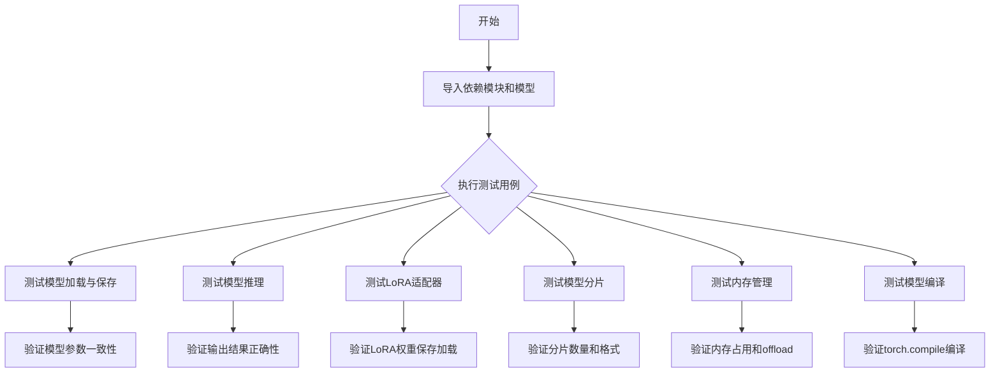

## 类结构

```
ModelUtilsTest (unittest.TestCase)
├── test_missing_key_loading_warning_message
├── test_variant_sharded_ckpt_legacy_format_raises_warning
├── test_variant_sharded_ckpt_loads_from_hub
├── test_cached_files_are_used_when_no_internet
├── test_local_files_only_with_sharded_checkpoint
├── test_one_request_upon_cached
├── test_weight_overwrite
└── test_keep_modules_in_fp32
UNetTesterMixin
├── _accepts_norm_num_groups
└── test_forward_with_norm_groups
ModelTesterMixin
├── check_device_map_is_respected
├── test_from_save_pretrained
├── test_getattr_is_correct
├── test_set_torch_npu_flash_attn_processor_determinism
├── test_set_xformers_attn_processor_for_determinism
├── test_set_attn_processor_for_determinism
├── test_from_save_pretrained_variant
├── test_from_save_pretrained_dynamo
├── test_from_save_pretrained_dtype
├── test_determinism
├── test_output
├── test_model_from_pretrained
├── test_training
├── test_ema_training
├── test_outputs_equivalence
├── test_enable_disable_gradient_checkpointing
├── test_effective_gradient_checkpointing
├── test_gradient_checkpointing_is_applied
├── test_deprecated_kwargs
├── test_save_load_lora_adapter
├── test_lora_wrong_adapter_name_raises_error
├── test_lora_adapter_metadata_is_loaded_correctly
├── test_lora_adapter_wrong_metadata_raises_error
├── test_cpu_offload
├── test_disk_offload_without_safetensors
├── test_disk_offload_with_safetensors
├── test_model_parallelism
├── test_sharded_checkpoints
├── test_sharded_checkpoints_with_variant
├── test_sharded_checkpoints_with_parallel_loading
├── test_sharded_checkpoints_device_map
├── test_variant_sharded_ckpt_right_format
├── test_layerwise_casting_training
├── test_layerwise_casting_inference
├── test_layerwise_casting_memory
├── test_group_offloading
├── test_group_offloading_with_layerwise_casting
├── test_group_offloading_with_disk
├── test_auto_model
├── test_wrong_device_map_raises_error
├── test_passing_non_dict_device_map_works
└── test_passing_dict_device_map_works
ModelPushToHubTester (unittest.TestCase)
├── test_push_to_hub
├── test_push_to_hub_in_organization
└── test_push_to_hub_library_name
TorchCompileTesterMixin
├── test_torch_compile_recompilation_and_graph_break
├── test_torch_compile_repeated_blocks
├── test_compile_with_group_offloading
├── test_compile_on_different_shapes
└── test_compile_works_with_aot
LoraHotSwappingForModelTesterMixin
├── get_lora_config
├── get_linear_module_name_other_than_attn
├── check_model_hotswap
├── test_hotswapping_model
├── test_hotswapping_compiled_model_linear
├── test_hotswapping_compiled_model_conv2d
├── test_hotswapping_compiled_model_both_linear_and_conv2d
├── test_hotswapping_compiled_model_both_linear_and_other
├── test_enable_lora_hotswap_called_after_adapter_added_raises
├── test_enable_lora_hotswap_called_after_adapter_added_warning
├── test_enable_lora_hotswap_called_after_adapter_added_ignore
├── test_enable_lora_hotswap_wrong_check_compiled_argument_raises
├── test_hotswap_second_adapter_targets_more_layers_raises
└── test_hotswapping_compile_on_different_shapes
```

## 全局变量及字段


### `TOKEN`
    
Authentication token for HuggingFace Hub testing

类型：`str`
    


### `USER`
    
Username for HuggingFace Hub testing

类型：`str`
    


### `is_staging_test`
    
Flag indicating if running staging tests

类型：`bool`
    


### `CaptureLogger`
    
Context manager for capturing logging output during tests

类型：`class`
    


### `_check_safetensors_serialization`
    
Validates safetensors serialization format for offloaded models

类型：`function`
    


### `backend_empty_cache`
    
Clears backend memory cache (CUDA/NPU)

类型：`function`
    


### `backend_max_memory_allocated`
    
Gets peak memory allocation from backend

类型：`function`
    


### `backend_reset_peak_memory_stats`
    
Resets peak memory statistics for backend

类型：`function`
    


### `backend_synchronize`
    
Synchronizes backend device operations

类型：`function`
    


### `check_if_dicts_are_equal`
    
Compares two dictionaries for equality in tests

类型：`function`
    


### `get_python_version`
    
Returns current Python version tuple

类型：`function`
    


### `is_torch_compile`
    
Flag indicating if torch.compile is available

类型：`bool`
    


### `numpy_cosine_similarity_distance`
    
Computes cosine similarity distance between numpy arrays

类型：`function`
    


### `require_peft_backend`
    
Decorator skipping test if PEFT backend not available

类型：`function`
    


### `require_peft_version_greater`
    
Decorator requiring minimum PEFT version

类型：`function`
    


### `require_torch_2`
    
Decorator requiring PyTorch 2.x

类型：`function`
    


### `require_torch_accelerator`
    
Decorator requiring GPU/NPU accelerator

类型：`function`
    


### `require_torch_accelerator_with_training`
    
Decorator requiring accelerator with training support

类型：`function`
    


### `require_torch_multi_accelerator`
    
Decorator requiring multiple accelerators

类型：`function`
    


### `require_torch_version_greater`
    
Decorator requiring minimum PyTorch version

类型：`function`
    


### `run_test_in_subprocess`
    
Runs test function in separate subprocess

类型：`function`
    


### `slow`
    
Decorator marking test as slow running

类型：`function`
    


### `torch_all_close`
    
Checks if torch tensors are close within tolerance

类型：`function`
    


### `torch_device`
    
Default torch device for testing (cuda/npu/cpu)

类型：`str`
    


### `SAFE_WEIGHTS_INDEX_NAME`
    
Filename for safetensors weights index file

类型：`str`
    


### `WEIGHTS_INDEX_NAME`
    
Filename for PyTorch weights index file

类型：`str`
    


### `is_peft_available`
    
Flag indicating if PEFT library is installed

类型：`bool`
    


### `is_torch_npu_available`
    
Flag indicating if NPU backend is available

类型：`bool`
    


### `is_xformers_available`
    
Flag indicating if xformers is installed

类型：`bool`
    


### `ModelTesterMixin.main_input_name`
    
Name of main input tensor for model testing

类型：`str or None`
    


### `ModelTesterMixin.base_precision`
    
Base tolerance for floating point comparisons in tests (default 1e-3)

类型：`float`
    


### `ModelTesterMixin.forward_requires_fresh_args`
    
Flag indicating if forward pass requires fresh arguments each time

类型：`bool`
    


### `ModelTesterMixin.model_split_percents`
    
Percentage splits for testing model parallelism and offloading

类型：`list[float]`
    


### `ModelTesterMixin.uses_custom_attn_processor`
    
Flag indicating if model uses custom attention processor

类型：`bool`
    


### `ModelPushToHubTester.identifier`
    
Unique identifier for test repository

类型：`uuid.UUID`
    


### `ModelPushToHubTester.repo_id`
    
HuggingFace Hub repository ID for testing

类型：`str`
    


### `ModelPushToHubTester.org_repo_id`
    
Organization repository ID for testing

类型：`str`
    


### `TorchCompileTesterMixin.different_shapes_for_compilation`
    
List of (height, width) tuples for testing torch.compile with dynamic shapes

类型：`list[tuple] or None`
    


### `LoraHotSwappingForModelTesterMixin.different_shapes_for_compilation`
    
List of (height, width) tuples for testing LoRA hotswap with dynamic shapes

类型：`list[tuple] or None`
    
    

## 全局函数及方法


### `caculate_expected_num_shards`

该函数用于从模型检查点的索引映射文件（JSON格式）中解析权重文件名，并提取预期存在的分片数量。它通过解析第一个权重文件的文件名（格式如 `diffusion_pytorch_model-00001-of-00002.safetensors`）来获取总分片数。

参数：

- `index_map_path`：`str`，索引映射文件的路径，指向包含权重映射关系的 JSON 文件

返回值：`int`，预期的分片数量

#### 流程图

```mermaid
flowchart TD
    A[开始] --> B[打开 index_map_path 指定的 JSON 文件]
    B --> C[读取 JSON 并获取 weight_map 字典]
    C --> D[获取 weight_map 的第一个键]
    D --> E[获取第一个键对应的值<br>例如: diffusion_pytorch_model-00001-of-00002.safetensors]
    E --> F[使用 split 提取分片编号<br>split('-')[-1].split('.')[0]]
    F --> G[将分片编号转换为整数]
    G --> H[返回预期的分片数量]
```

#### 带注释源码

```python
def caculate_expected_num_shards(index_map_path):
    """
    从索引映射文件中计算预期的分片数量。
    
    该函数通过解析权重文件名来提取分片总数。文件名遵循以下格式：
    diffusion_pytorch_model-XXXXX-of-YYYYY.safetensors
    其中 YYYYY 表示总分片数。
    
    Args:
        index_map_path (str): 索引映射文件的路径，通常为 weights_index.json 或 
                            safetensors weights 索引文件。
    
    Returns:
        int: 预期的分片数量，从文件名中提取。
    
    Example:
        >>> caculate_expected_num_shards('/path/to/model/safetensors.index.json')
        2
    """
    # 打开并读取索引映射 JSON 文件
    with open(index_map_path) as f:
        # 从 JSON 中提取 weight_map 字典，包含权重文件与参数的映射关系
        weight_map_dict = json.load(f)["weight_map"]
    
    # 获取 weight_map 中的第一个键（任意一个权重文件的键）
    first_key = list(weight_map_dict.keys())[0]
    
    # 获取第一个键对应的值，即权重文件名
    # 示例: diffusion_pytorch_model-00001-of-00002.safetensors
    weight_loc = weight_map_dict[first_key]
    
    # 提取分片总数:
    # 1. split("-")[-1] -> "00002.safetensors"
    # 2. split(".")[0] -> "00002"
    # 3. int() 转换为整数 -> 2
    expected_num_shards = int(weight_loc.split("-")[-1].split(".")[0])
    
    # 返回计算得到的预期分片数量
    return expected_num_shards
```


### `check_if_lora_correctly_set`

该函数用于检查模型中的 LoRA（Low-Rank Adaptation）层是否正确配置。它通过遍历模型的所有模块，检查是否存在 `BaseTunerLayer` 类型的模块来判断 LoRA 是否已正确设置。

参数：

- `model`：`torch.nn.Module`，需要检查的 PyTorch 模型实例

返回值：`bool`，如果模型中正确配置了 LoRA 层则返回 `True`，否则返回 `False`

#### 流程图

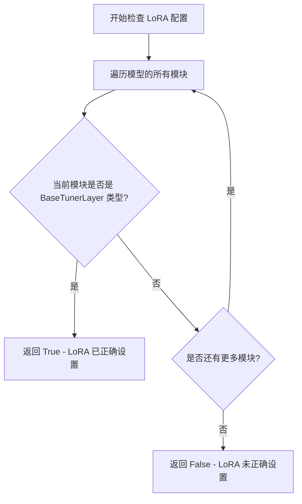

#### 带注释源码

```python
def check_if_lora_correctly_set(model) -> bool:
    """
    Checks if the LoRA layers are correctly set with peft
    
    该函数通过检查模型中是否存在 PEFT 库的 BaseTunerLayer 类型模块
    来验证 LoRA 适配器是否已被正确添加到模型中。
    
    Args:
        model (torch.nn.Module): 要检查的 PyTorch 模型
        
    Returns:
        bool: 如果模型中包含 LoRA 适配器层则返回 True，否则返回 False
    """
    # 遍历模型的所有模块（包括自身和所有子模块）
    for module in model.modules():
        # 检查当前模块是否是 PEFT 库中的 BaseTunerLayer 类型
        # BaseTunerLayer 是 PEFT 库中所有 LoRA 层的基类
        if isinstance(module, BaseTunerLayer):
            # 找到 LoRA 层，返回 True
            return True
    # 遍历完所有模块都没有找到 LoRA 层，返回 False
    return False
```


### `normalize_output`

该函数用于标准化模型输出，将不同格式（BaseOutput、tuple、list）的输出统一转换为 PyTorch Tensor 格式，以便于后续的数值比较操作。

参数：

- `out`：`任意类型`，模型的输出，可以是 BaseOutput 对象、tuple、list 或单个 Tensor

返回值：`torch.Tensor`，标准化后的 PyTorch 张量

#### 流程图

```mermaid
flowchart TD
    A[开始: normalize_output] --> B{判断 out 类型}
    B --> C{isinstance(out, BaseOutput 或 tuple)?}
    C -->|是| D[out0 = out[0]]
    C -->|否| E[out0 = out]
    D --> F{isinstance(out0, list)?}
    E --> F
    F -->|是| G[return torch.stack(out0)]
    F -->|否| H[return out0]
    G --> I[结束]
    H --> I
```

#### 带注释源码

```python
def normalize_output(out):
    """
    标准化模型输出，将其转换为统一的 PyTorch Tensor 格式。
    
    该函数处理模型输出的多种可能格式：
    - BaseOutput 对象（如 dict 输出）
    - tuple（元组）
    - list（列表）
    - 直接的 Tensor
    
    这样做是为了在测试中能够统一比较不同格式的输出。
    """
    # 如果输出是 BaseOutput 或 tuple 类型，取第一个元素
    # 这是因为许多 diffusers 模型的输出是 (output, extra_dict) 形式
    out0 = out[0] if isinstance(out, (BaseOutput, tuple)) else out
    
    # 如果处理后的结果是 list，则使用 torch.stack 堆叠成 Tensor
    # 否则直接返回（已经是 Tensor）
    return torch.stack(out0) if isinstance(out0, list) else out0
```


### `_test_from_save_pretrained_dynamo`

该函数是一个测试辅助函数，运行在子进程中，用于验证使用 `torch.compile`（Dynamo 编译）后的模型能否正确执行保存（`save_pretrained`）和加载（`from_pretrained`）操作，并确保加载后的模型类与原始类一致。

参数：

- `in_queue`：`Queue`，输入队列，用于从主进程接收包含模型初始化参数字典（`init_dict`）和模型类（`model_class`）的元组
- `out_queue`：`Queue`，输出队列，用于将测试结果（包含错误信息的字典）返回给主进程
- `timeout`：`int`，队列操作的超时时间（秒）

返回值：无直接返回值，结果通过 `out_queue` 返回，格式为 `{"error": error}`，其中 `error` 为 `None` 表示成功，否则为错误信息字符串

#### 流程图

```mermaid
flowchart TD
    A[开始] --> B[从in_queue获取init_dict和model_class]
    B --> C[使用model_class创建模型实例]
    C --> D[将模型移动到torch_device]
    D --> E[使用torch.compile编译模型]
    E --> F[创建临时目录]
    F --> G[调用model.save_pretrained保存模型]
    G --> H[调用model_class.from_pretrained加载模型]
    H --> I[将加载的模型移动到torch_device]
    I --> J{new_model.__class__ == model_class?}
    J -->|是| K[断言通过]
    J -->|否| L[抛出AssertionError]
    K --> M[构建结果字典: {error: None}]
    L --> N[捕获异常并构建错误信息]
    N --> M
    M --> O[将结果放入out_queue]
    O --> P[调用out_queue.join阻塞等待]
    P --> Q[结束]
```

#### 带注释源码

```python
def _test_from_save_pretrained_dynamo(in_queue, out_queue, timeout):
    """
    在子进程中运行的测试函数，用于验证torch.compile编译后的模型保存和加载功能。
    
    该函数被设计为通过run_test_in_subprocess在子进程中执行，以测试在使用
    torch.compile (Dynamo)进行模型编译的场景下，模型的save_pretrained和
    from_pretrained方法是否正常工作。
    
    Args:
        in_queue: multiprocessing.Queue，包含(init_dict, model_class)元组
        out_queue: multiprocessing.Queue，用于返回测试结果
        timeout: 超时时间（秒）
    """
    error = None  # 初始化错误信息为None
    try:
        # 从输入队列获取模型初始化参数和模型类
        # timeout参数确保测试不会无限等待
        init_dict, model_class = in_queue.get(timeout=timeout)

        # 使用模型类根据初始化参数字典创建模型实例
        model = model_class(**init_dict)
        
        # 将模型移动到指定的计算设备（如CUDA）
        model.to(torch_device)
        
        # 使用torch.compile对模型进行Dynamo编译优化
        model = torch.compile(model)

        # 创建临时目录用于保存和加载模型
        with tempfile.TemporaryDirectory() as tmpdirname:
            # 使用不安全序列化方式保存模型（.bin格式而非.safetensors）
            model.save_pretrained(tmpdirname, safe_serialization=False)
            
            # 从保存的目录重新加载模型
            new_model = model_class.from_pretrained(tmpdirname)
            
            # 将加载的模型也移动到指定设备
            new_model.to(torch_device)

        # 断言验证加载后的模型类与原始模型类完全一致
        assert new_model.__class__ == model_class
        
    except Exception:
        # 捕获任何异常并将其格式化为错误信息字符串
        error = f"{traceback.format_exc()}"

    # 构建结果字典，包含错误信息（如果有）
    results = {"error": error}
    
    # 将结果放入输出队列并返回给主进程
    out_queue.put(results, timeout=timeout)
    
    # 阻塞等待，确保结果被主进程接收
    out_queue.join()
```


### `named_persistent_module_tensors`

该函数是一个辅助函数，用于收集给定模块的所有张量（参数 + 持久缓冲区）。它首先 yield 所有命名参数，然后遍历命名缓冲区，过滤掉非持久化的缓冲区（如训练过程中不需要保存的缓冲区），只返回持久化的缓冲区。

参数：

- `module`：`nn.Module`，要获取张量的模块
- `recurse`：`bool`，可选，默认值为 `False`，是否递归遍历所有子模块，仅当为 `True` 时才会遍历子模块中的参数和缓冲区

返回值：`Generator`，生成器，yield 元组 `(name, tensor)`，其中 name 是张量的名称，tensor 是对应的参数或持久缓冲区

#### 流程图

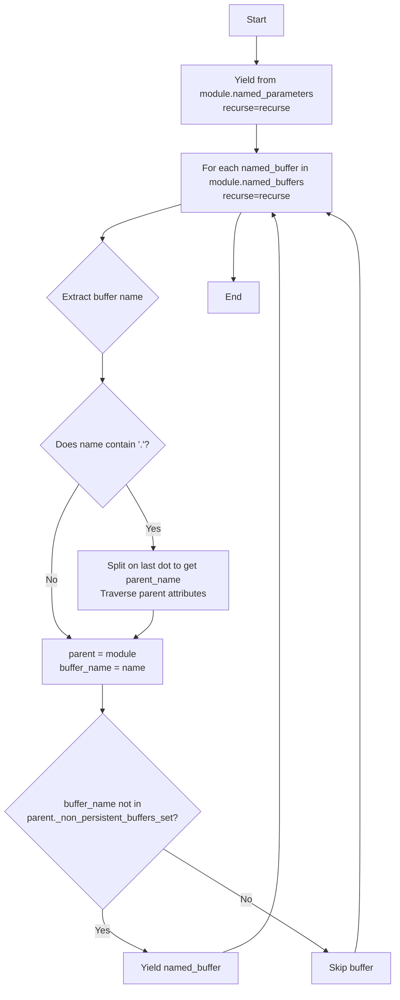

#### 带注释源码

```python
def named_persistent_module_tensors(
    module: nn.Module,
    recurse: bool = False,
):
    """
    A helper function that gathers all the tensors (parameters + persistent buffers) of a given module.

    Args:
        module (`torch.nn.Module`):
            The module we want the tensors on.
        recurse (`bool`, *optional`, defaults to `False`):
            Whether or not to go look in every submodule or just return the direct parameters and buffers.
    """
    # 首先 yield 模块的所有命名参数，根据 recurse 参数决定是否递归
    yield from module.named_parameters(recurse=recurse)

    # 遍历模块的所有命名缓冲区
    for named_buffer in module.named_buffers(recurse=recurse):
        name, _ = named_buffer
        # 通过按点分割并遍历模型来获取父模块
        parent = module
        if "." in name:
            # 如果缓冲区名称包含点，说明它是嵌套的，需要获取父模块
            parent_name = name.rsplit(".", 1)[0]
            for part in parent_name.split("."):
                parent = getattr(parent, part)
            # 获取缓冲区名称的最后一部分
            name = name.split(".")[-1]
        # 检查缓冲区是否不在非持久化缓冲区集合中
        # 只有持久化的缓冲区才会被 yield
        if name not in parent._non_persistent_buffers_set:
            yield named_buffer
```


### `compute_module_persistent_sizes`

该函数用于计算模型中每个子模块的持久化张量（参数 + 持久化缓冲区）大小，支持自定义数据类型和特殊数据类型映射，返回从叶子节点到根节点的累积大小字典。

参数：

- `model`：`nn.Module`，需要计算大小的 PyTorch 模型
- `dtype`：`str | torch.device | None`，全局目标数据类型，用于计算大小时进行类型转换模拟
- `special_dtypes`：`dict[str, str | torch.device] | None`，特殊数据类型映射，指定某些特定参数的自定义数据类型

返回值：`defaultdict(int)`，键为模块名称（从叶子到根节点的累积路径），值为对应模块的字节大小

#### 流程图

```mermaid
flowchart TD
    A[开始 compute_module_persistent_sizes] --> B{检查 dtype 是否为 None}
    B -->|否| C[调用 _get_proper_dtype 转换 dtype]
    C --> D[计算 dtype_size = dtype_byte_size(dtype)]
    B -->|是| E{检查 special_dtypes 是否为 None}
    
    E -->|否| F[转换 special_dtypes 中的所有 dtype]
    F --> G[计算 special_dtypes_size 字典]
    E -->|是| H[创建空的 module_sizes defaultdict]
    
    H --> I[获取模型的持久化张量列表 named_persistent_module_tensors]
    I --> J{遍历每个 name, tensor}
    
    J --> K{检查 special_dtypes}
    K -->|是且 name 在 special_dtypes 中| L[size = tensor.numel × special_dtypes_size[name]]
    K -->|否| M{检查 dtype 是否为 None}
    
    M -->|是| N[size = tensor.numel × dtype_byte_size(tensor.dtype)]
    M -->|否| O{检查 tensor.dtype 类型}
    
    O -->|uint/int/bool| N
    O -->|其他| P[size = tensor.numel × min(dtype_size, dtype_byte_size(tensor.dtype))]
    
    N --> Q[拆分 name 为 name_parts]
    Q --> R[遍历 idx 从 0 到 len(name_parts)]
    R --> S[累积大小到 module_sizes]
    S --> J
    
    L --> Q
    P --> Q
    
    J -->|遍历结束| T[返回 module_sizes]
```

#### 带注释源码

```python
def compute_module_persistent_sizes(
    model: nn.Module,
    dtype: str | torch.device | None = None,
    special_dtypes: dict[str, str | torch.device] | None = None,
):
    """
    Compute the size of each submodule of a given model (parameters + persistent buffers).
    """
    # 如果指定了全局 dtype，则转换为正确的 dtype 并计算其字节大小
    if dtype is not None:
        dtype = _get_proper_dtype(dtype)
        dtype_size = dtype_byte_size(dtype)
    
    # 如果指定了特殊 dtype 映射，则转换所有特殊 dtype 并计算其字节大小
    if special_dtypes is not None:
        special_dtypes = {key: _get_proper_dtype(dtyp) for key, dtyp in special_dtypes.items()}
        special_dtypes_size = {key: dtype_byte_size(dtyp) for key, dtyp in special_dtypes.items()}
    
    # 存储每个模块的累积大小
    module_sizes = defaultdict(int)

    # 获取模型的所有持久化张量（参数 + 持久化缓冲区）
    module_list = []
    module_list = named_persistent_module_tensors(model, recurse=True)

    # 遍历每个张量并计算大小
    for name, tensor in module_list:
        # 情况1：特殊 dtype 映射中存在该参数名，使用特殊 dtype 计算大小
        if special_dtypes is not None and name in special_dtypes:
            size = tensor.numel() * special_dtypes_size[name]
        # 情况2：未指定全局 dtype，使用张量原始 dtype 计算大小
        elif dtype is None:
            size = tensor.numel() * dtype_byte_size(tensor.dtype)
        # 情况3：张量类型为无符号整数/有符号整数/布尔类型
        # 根据 set_module_tensor_to_device，这些类型不会被转换，使用原始大小
        elif str(tensor.dtype).startswith(("torch.uint", "torch.int", "torch.bool")):
            size = tensor.numel() * dtype_byte_size(tensor.dtype)
        # 情况4：其他类型，使用全局 dtype 和原始 dtype 的较小值
        else:
            size = tensor.numel() * min(dtype_size, dtype_byte_size(tensor.dtype))
        
        # 将大小累积到所有父模块中
        # 例如：name = "block1.linear.weight"，则累积到：
        # "block1", "block1.linear", "block1.linear.weight", ""
        name_parts = name.split(".")
        for idx in range(len(name_parts) + 1):
            module_sizes[".".join(name_parts[:idx])] += size

    return module_sizes
```


### `cast_maybe_tensor_dtype`

该函数用于将张量、字典或列表中的数据从当前数据类型转换到目标数据类型，仅在数据类型匹配时进行转换，以避免不必要的类型转换开销。

参数：

- `maybe_tensor`：任意类型，输入可以是 torch.Tensor、dict、list 或其他类型。当为 Tensor 时检查并转换 dtype，为 dict 或 list 时递归处理其中的元素，其他类型直接返回。
- `current_dtype`：`torch.dtype`，原始数据类型，用于判断 Tensor 是否需要转换。
- `target_dtype`：`torch.dtype`，目标数据类型，当 Tensor 的 dtype 等于 current_dtype 时转换为此类型。

返回值：`任意类型`，返回与输入类型相同的对象。若输入是 Tensor，则返回转换后的 Tensor；若输入是 dict 或 list，则返回递归处理后的同类型对象；其他类型直接返回原对象。

#### 流程图

```mermaid
flowchart TD
    A[开始: cast_maybe_tensor_dtype] --> B{isinstance maybe_tensor, torch.Tensor?}
    B -->|Yes| C{maybe_tensor.dtype == current_dtype?}
    C -->|Yes| D[返回 maybe_tensor.to(target_dtype)]
    C -->|No| E[返回原 maybe_tensor]
    B -->|No| F{isinstance maybe_tensor, dict?}
    F -->|Yes| G[遍历dict, 递归调用cast_maybe_tensor_dtype]
    G --> H[返回新dict]
    F -->|No| I{isinstance maybe_tensor, list?}
    I -->|Yes| J[遍历list, 递归调用cast_maybe_tensor_dtype]
    J --> K[返回新list]
    I -->|No| L[返回原 maybe_tensor]
```

#### 带注释源码

```python
def cast_maybe_tensor_dtype(maybe_tensor, current_dtype, target_dtype):
    """
    将张量、字典或列表中的数据从当前数据类型转换到目标数据类型。
    
    仅在 Tensor 的 dtype 等于 current_dtype 时才进行转换，否则保持原样。
    对于 dict 和 list，会递归处理其中的元素。
    
    Args:
        maybe_tensor: 输入数据，可以是 torch.Tensor、dict、list 或其他类型
        current_dtype: torch.dtype，原始数据类型
        target_dtype: torch.dtype，目标数据类型
    
    Returns:
        转换后的数据，类型与输入相同
    """
    # 检查输入是否为 PyTorch Tensor
    if torch.is_tensor(maybe_tensor):
        # 仅当 Tensor 的当前 dtype 等于 current_dtype 时才进行转换
        return maybe_tensor.to(target_dtype) if maybe_tensor.dtype == current_dtype else maybe_tensor
    
    # 如果是字典，递归处理字典中的每个值
    if isinstance(maybe_tensor, dict):
        return {k: cast_maybe_tensor_dtype(v, current_dtype, target_dtype) for k, v in maybe_tensor.items()}
    
    # 如果是列表，递归处理列表中的每个元素
    if isinstance(maybe_tensor, list):
        return [cast_maybe_tensor_dtype(v, current_dtype, target_dtype) for v in maybe_tensor]
    
    # 对于其他类型，直接返回原对象
    return maybe_tensor
```


### `ModelUtilsTest.tearDown`

这是一个测试用例的 teardown 方法，用于在每个测试方法执行完成后进行清理工作。当前实现仅调用父类的 tearDown 方法，以确保 unittest 框架的标准清理流程能够正确执行。

参数：
- 无参数

返回值：`None`，无返回值

#### 流程图

```mermaid
flowchart TD
    A[开始 tearDown] --> B[调用 super().tearDown]
    B --> C[结束]
```

#### 带注释源码

```python
def tearDown(self):
    """
    测试用例的 teardown 方法，在每个测试方法执行完成后被调用。
    当前实现仅调用父类的 tearDown 方法以确保正确的测试框架清理流程。
    """
    super().tearDown()  # 调用父类的 tearDown 方法，执行 unittest 框架的标准清理
```


### `ModelUtilsTest.test_missing_key_loading_warning_message`

该测试方法用于验证在加载具有缺失键的预训练模型时，系统是否正确记录了包含缺失键名称（例如 "conv_out.bias"）的警告消息。

参数：

- `self`：隐式参数，`ModelUtilsTest` 类的实例本身，无需显式传递

返回值：`None`，测试方法无返回值

#### 流程图

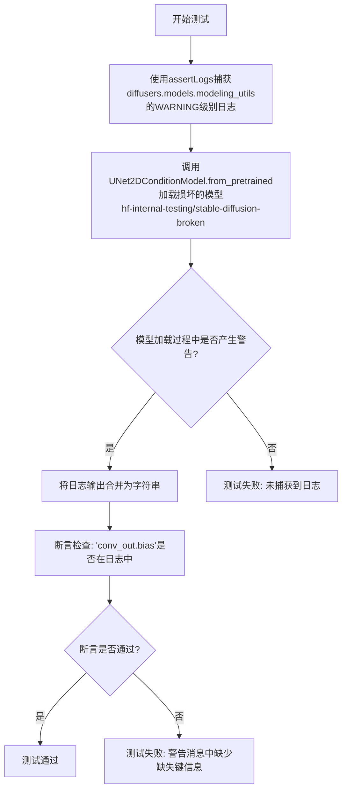

#### 带注释源码

```python
def test_missing_key_loading_warning_message(self):
    """
    测试当模型权重文件缺少某些键时，加载过程是否产生包含缺失键名称的警告消息。
    该测试确保用户能够通过警告信息了解具体是哪些键缺失。
    """
    # 使用assertLogs上下文管理器捕获指定logger的WARNING级别日志输出
    # 尝试加载一个故意损坏的模型（包含缺失的权重键）
    with self.assertLogs("diffusers.models.modeling_utils", level="WARNING") as logs:
        # 加载一个预训练的UNet2DConditionModel，该模型缺少某些权重键
        UNet2DConditionModel.from_pretrained(
            "hf-internal-testing/stable-diffusion-broken", 
            subfolder="unet"
        )

    # 确保错误消息中明确指出了缺失的键名
    # 将所有日志输出合并为一个字符串进行检查
    assert "conv_out.bias" in " ".join(logs.output)
```


### `ModelUtilsTest.test_variant_sharded_ckpt_legacy_format_raises_warning`

该方法是一个测试用例，用于验证当使用旧版分片检查点格式（legacy format）加载模型时，系统是否正确发出 FutureWarning 警告。测试覆盖了从 HuggingFace Hub 加载和本地加载两种场景，并检查警告消息中包含预期的弃用说明文本。

参数：

- `self`：测试类实例本身（ModelUtilsTest），无需显式传递
- `repo_id`：字符串（str），HuggingFace Hub 上的模型仓库 ID，例如 "hf-internal-testing/tiny-stable-diffusion-pipe-variants-all-kinds"
- `subfolder`：字符串或 None（str | None），模型在仓库中的子文件夹路径，如果为 None 则表示模型在根目录
- `use_local`：布尔值（bool），指示是否从本地缓存加载模型，True 表示先下载到本地再加载，False 表示直接从 Hub 加载

返回值：无（None），该方法为测试用例，使用 `assertWarns` 上下文管理器验证警告，不返回任何值

#### 流程图

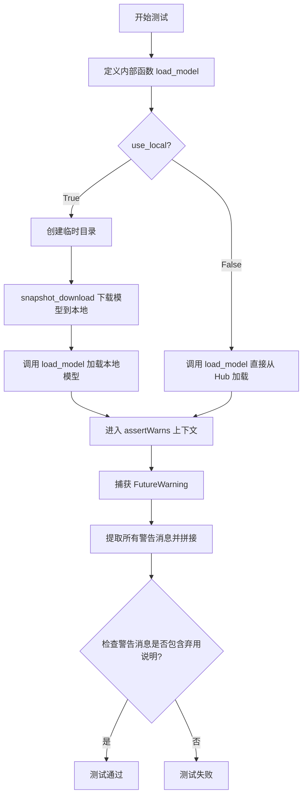

#### 带注释源码

```python
@parameterized.expand(
    [
        # 参数化测试：四个测试用例组合
        # 场景1: tiny-stable-diffusion-pipe-variants-all-kinds 模型, unet子文件夹, 远程加载
        ("hf-internal-testing/tiny-stable-diffusion-pipe-variants-all-kinds", "unet", False),
        # 场景2: tiny-stable-diffusion-pipe-variants-all-kinds 模型, unet子文件夹, 本地加载
        ("hf-internal-testing/tiny-stable-diffusion-pipe-variants-all-kinds", "unet", True),
        # 场景3: tiny-sd-unet-with-sharded-ckpt 模型, 无子文件夹, 远程加载
        ("hf-internal-testing/tiny-sd-unet-with-sharded-ckpt", None, False),
        # 场景4: tiny-sd-unet-with-sharded-ckpt 模型, 无子文件夹, 本地加载
        ("hf-internal-testing/tiny-sd-unet-with-sharded-ckpt", None, True),
    ]
)
def test_variant_sharded_ckpt_legacy_format_raises_warning(self, repo_id, subfolder, use_local):
    """
    测试当使用旧版分片检查点格式加载模型时是否产生 FutureWarning。
    
    该测试验证 diffusers 库在加载已弃用的分片检查点格式时能够正确发出警告，
    以引导用户迁移到新的标准化序列化格式。
    """
    
    def load_model(path):
        """
        内部辅助函数：加载 UNet2DConditionModel 模型
        
        Args:
            path: 模型路径（本地目录或 HuggingFace Hub 仓库 ID）
        
        Returns:
            加载的 UNet2DConditionModel 实例
        """
        # 设定使用 fp16 变体进行加载
        kwargs = {"variant": "fp16"}
        # 如果指定了子文件夹，则添加到加载参数中
        if subfolder:
            kwargs["subfolder"] = subfolder
        # 从预训练路径加载模型
        return UNet2DConditionModel.from_pretrained(path, **kwargs)

    # 使用 assertWarns 上下文管理器捕获 FutureWarning 类型的警告
    with self.assertWarns(FutureWarning) as warning:
        if use_local:
            # 需要先下载模型到本地临时目录
            with tempfile.TemporaryDirectory() as tmpdirname:
                # 从 HuggingFace Hub 下载模型到本地缓存
                tmpdirname = snapshot_download(repo_id=repo_id)
                # 从本地路径加载模型
                _ = load_model(tmpdirname)
        else:
            # 直接从 HuggingFace Hub 加载模型（可能使用缓存）
            _ = load_model(repo_id)

    # 将所有警告消息对象转换为字符串并拼接成一个字符串
    warning_messages = " ".join(str(w.message) for w in warning.warnings)
    
    # 断言警告消息中包含预期的弃用说明文本
    # 验证用户能够看到关于序列化格式已弃用的提示信息
    self.assertIn(
        "This serialization format is now deprecated to standardize the serialization", 
        warning_messages
    )
```


### `ModelUtilsTest.test_variant_sharded_ckpt_loads_from_hub`

该测试方法用于验证分片检查点（sharded checkpoint）能够正确从 HuggingFace Hub 加载，支持不同的变体（variant）和子文件夹配置。通过参数化测试覆盖 4 种场景：无子文件夹带 fp16 变体、有子文件夹带 fp16 变体、无变体无子文件夹、以及无变体有子文件夹。

参数：

- `self`：`unittest.TestCase`，测试类实例本身
- `repo_id`：`str`，HuggingFace Hub 上的模型仓库 ID，例如 "hf-internal-testing/tiny-sd-unet-sharded-latest-format"
- `subfolder`：`str | None`，模型在仓库中的子文件夹路径，例如 "unet" 或 None
- `variant`：`str | None`，模型变体标识，例如 "fp16" 或 None

返回值：`None`，该方法为测试用例，通过 `assert` 语句验证模型加载成功，不返回具体值

#### 流程图

```mermaid
flowchart TD
    A[开始测试] --> B{获取参数化配置}
    B --> C[定义内部函数 load_model]
    C --> D{检查 variant 是否存在}
    D -->|是| E[kwargs['variant'] = variant]
    D -->|否| F{检查 subfolder 是否存在}
    E --> F
    F -->|是| G[kwargs['subfolder'] = subfolder]
    F -->|否| H[调用 UNet2DConditionModel.from_pretrained]
    G --> H
    H --> I[assert load_model 返回模型对象]
    I --> J[测试通过]
    
    style A fill:#f9f,stroke:#333
    style J fill:#9f9,stroke:#333
```

#### 带注释源码

```python
@parameterized.expand(
    [
        # 测试用例1: 无子文件夹，使用 fp16 变体
        ("hf-internal-testing/tiny-sd-unet-sharded-latest-format", None, "fp16"),
        # 测试用例2: 有子文件夹，使用 fp16 变体
        ("hf-internal-testing/tiny-sd-unet-sharded-latest-format-subfolder", "unet", "fp16"),
        # 测试用例3: 无子文件夹，无变体
        ("hf-internal-testing/tiny-sd-unet-sharded-no-variants", None, None),
        # 测试用例4: 有子文件夹，无变体
        ("hf-internal-testing/tiny-sd-unet-sharded-no-variants-subfolder", "unet", None),
    ]
)
def test_variant_sharded_ckpt_loads_from_hub(self, repo_id, subfolder, variant=None):
    """
    测试分片检查点能否从 HuggingFace Hub 正确加载。
    
    参数化测试覆盖了不同的仓库配置组合：
    - 有无子文件夹 (subfolder)
    - 有无变体 (variant)
    
    Args:
        repo_id: HuggingFace Hub 仓库 ID
        subfolder: 模型子文件夹路径，可为 None
        variant: 模型变体，可为 None
    """
    # 定义内部加载函数，用于构建 from_pretrained 参数
    def load_model():
        # 初始化空参数字典
        kwargs = {}
        # 如果提供了 variant 参数，则添加到 kwargs
        if variant:
            kwargs["variant"] = variant
        # 如果提供了 subfolder 参数，则添加到 kwargs
        if subfolder:
            kwargs["subfolder"] = subfolder
        # 调用 UNet2DConditionModel 的 from_pretrained 方法加载模型
        return UNet2DConditionModel.from_pretrained(repo_id, **kwargs)

    # 断言模型加载成功，确保返回非 None 的模型对象
    assert load_model()
```


### ModelUtilsTest.test_cached_files_are_used_when_no_internet

该测试方法用于验证当网络不可用时，系统能够正确使用本地缓存的模型文件。它通过模拟 HTTP 500 错误来模拟服务器宕机情况，确保 `from_pretrained` 在 `local_files_only=True` 参数下能够成功从本地缓存加载模型，并且模型参数与原始下载的模型完全一致。

参数：

- `self`：`ModelUtilsTest` 实例，测试类本身，无额外参数

返回值：`None`，该方法为单元测试方法，通过断言验证缓存机制是否正常工作，无显式返回值

#### 流程图

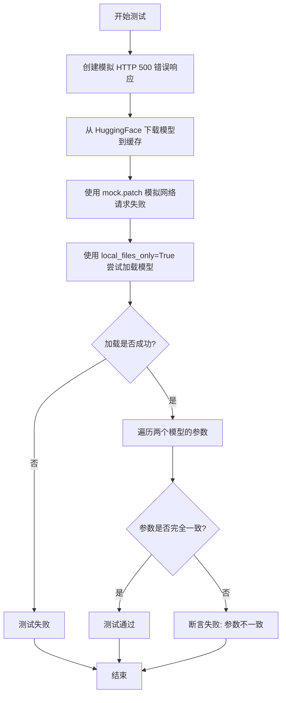

#### 带注释源码

```python
def test_cached_files_are_used_when_no_internet(self):
    """
    测试当网络不可用时，系统能够使用本地缓存的模型文件。
    
    测试场景：
    1. 首先下载模型到本地缓存
    2. 模拟网络请求失败（HTTP 500 错误）
    3. 尝试使用 local_files_only=True 从缓存加载模型
    4. 验证缓存加载的模型参数与原始模型完全一致
    """
    
    # 创建一个模拟的 HTTP 响应对象，用于模拟服务器错误
    # 状态码 500 表示服务器内部错误
    response_mock = mock.Mock()
    response_mock.status_code = 500
    response_mock.headers = {}
    # 配置 raise_for_status 方法抛出 HfHubHTTPError 异常
    response_mock.raise_for_status.side_effect = HfHubHTTPError("Server down", response=mock.Mock())
    # 配置 json() 方法返回空字典
    response_mock.json.return_value = {}

    # 第一步：正常从 HuggingFace 下载模型
    # 这会将模型文件保存到本地缓存目录
    # "hf-internal-testing/tiny-stable-diffusion-torch" 是测试用的小型模型
    # subfolder="unet" 指定加载 unet 子模块
    orig_model = UNet2DConditionModel.from_pretrained(
        "hf-internal-testing/tiny-stable-diffusion-torch", subfolder="unet"
    )

    # 第二步：使用 mock.patch 拦截所有 requests.request 调用
    # 使其返回我们预先创建的模拟错误响应
    # 这样模拟了网络请求失败/服务器宕机的情况
    with mock.patch("requests.request", return_value=response_mock):
        # 第三步：尝试从本地缓存加载模型
        # local_files_only=True 参数强制只从本地缓存读取，不发起网络请求
        # 如果缓存中不存在该模型，这里会抛出异常
        # 在我们的场景中，由于第一步已经下载，缓存中应该有模型文件
        model = UNet2DConditionModel.from_pretrained(
            "hf-internal-testing/tiny-stable-diffusion-torch", 
            subfolder="unet", 
            local_files_only=True
        )

    # 第四步：验证从缓存加载的模型与原始下载的模型参数完全一致
    # 使用 zip 同时遍历两个模型的参数迭代器
    for p1, p2 in zip(orig_model.parameters(), model.parameters()):
        # 比较参数值是否不同
        # .ne() 计算元素不相等的数量
        if p1.data.ne(p2.data).sum() > 0:
            # 如果有任何参数不一致，测试失败
            assert False, "Parameters not the same!"
    
    # 如果所有参数都一致，测试通过（无异常则测试成功）
```


### ModelUtilsTest.test_local_files_only_with_sharded_checkpoint

该测试方法验证了在使用分片检查点（sharded checkpoint）时，`FluxTransformer2DModel` 能否正确处理 `local_files_only` 参数。具体来说，它测试了：
1. 当 `local_files_only=False` 时，即使网络请求失败，也应该抛出 OSError（因为需要网络请求获取模型信息）
2. 当 `local_files_only=True` 时，应该从本地缓存加载模型，跳过网络请求
3. 当缓存的分片文件被删除后，再次尝试从本地加载应该抛出包含缺失分片信息的 OSError

参数：

-  `self`：`unittest.TestCase`，测试用例实例本身

返回值：`None`，该方法为测试方法，不返回值，通过断言进行验证

#### 流程图

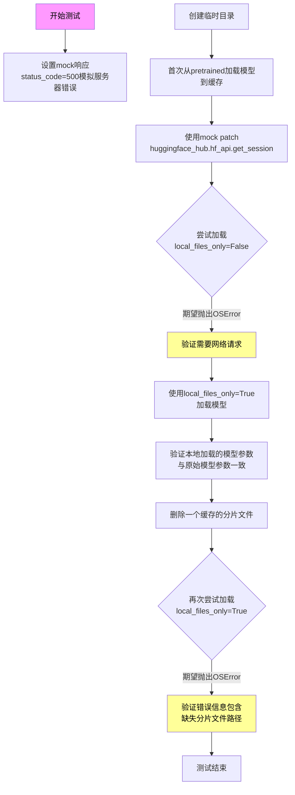

#### 带注释源码

```python
def test_local_files_only_with_sharded_checkpoint(self):
    """
    测试当使用分片检查点时，local_files_only参数的正确行为。
    验证:
    1. local_files_only=False需要网络请求
    2. local_files_only=True从缓存加载
    3. 缺失分片文件时抛出正确错误
    """
    # 1. 定义测试用的repo_id (HuggingFace Hub上的测试仓库)
    repo_id = "hf-internal-testing/tiny-flux-sharded"
    
    # 2. 创建一个模拟的错误响应，用于模拟网络请求失败
    # HTTP 500错误表示服务器内部错误
    error_response = mock.Mock(
        status_code=500,  # HTTP 500 内部服务器错误
        headers={},
        # 设置raise_for_status抛出HfHubHTTPError异常
        raise_for_status=mock.Mock(side_effect=HfHubHTTPError("Server down", response=mock.Mock())),
        json=mock.Mock(return_value={}),
    )
    
    # 3. 创建mock客户端，get方法返回模拟的错误响应
    client_mock = mock.Mock()
    client_mock.get.return_value = error_response

    # 4. 创建临时目录用于缓存模型
    with tempfile.TemporaryDirectory() as tmpdir:
        # 5. 首次加载模型（正常加载，会下载到缓存目录）
        # 这会将模型下载到tmpdir缓存目录
        model = FluxTransformer2DModel.from_pretrained(
            repo_id, 
            subfolder="transformer", 
            cache_dir=tmpdir
        )

        # 6. 使用mock patch拦截huggingface_hub的get_session调用
        with mock.patch("huggingface_hub.hf_api.get_session", return_value=client_mock):
            # ===== 测试点1: local_files_only=False 需要网络 =====
            # 期望抛出OSError，因为需要网络请求model_info
            with self.assertRaises(OSError):
                FluxTransformer2DModel.from_pretrained(
                    repo_id, 
                    subfolder="transformer", 
                    cache_dir=tmpdir, 
                    local_files_only=False  # 明确要求不使用本地文件
                )

            # ===== 测试点2: local_files_only=True 使用缓存 =====
            # 成功加载，因为使用缓存不需网络请求
            local_model = FluxTransformer2DModel.from_pretrained(
                repo_id, 
                subfolder="transformer", 
                cache_dir=tmpdir, 
                local_files_only=True  # 只使用本地文件
            )

        # 7. 验证加载的模型参数与原始模型一致
        assert all(torch.equal(p1, p2) for p1, p2 in zip(model.parameters(), local_model.parameters())), (
            "Model parameters don't match!"
        )

        # ===== 测试点3: 缺失分片文件的错误处理 =====
        # 8. 获取缓存的分片文件路径
        cached_shard_file = try_to_load_from_cache(
            repo_id, 
            filename="transformer/diffusion_pytorch_model-00001-of-00002.safetensors", 
            cache_dir=tmpdir
        )
        
        # 9. 删除该分片文件，模拟文件损坏/缺失
        os.remove(cached_shard_file)

        # 10. 再次尝试从本地加载，应该抛出错误
        with self.assertRaises(OSError) as context:
            FluxTransformer2DModel.from_pretrained(
                repo_id, 
                subfolder="transformer", 
                cache_dir=tmpdir, 
                local_files_only=True
            )

        # 11. 验证错误信息包含缺失分片的相关信息
        error_msg = str(context.exception)
        assert cached_shard_file in error_msg or "required according to the checkpoint index" in error_msg, (
            f"Expected error about missing shard, got: {error_msg}"
        )
```


### `ModelUtilsTest.test_one_request_upon_cached`

该测试方法验证当模型已缓存时，后续加载应仅发起少量HTTP请求（仅检查模型信息），而非重新下载整个模型，以确认缓存机制正确工作。

参数：

- `self`：`ModelUtilsTest`，测试类实例本身，无需显式传递

返回值：`None`，该方法为测试用例，通过assert语句验证行为，不返回任何值

#### 流程图

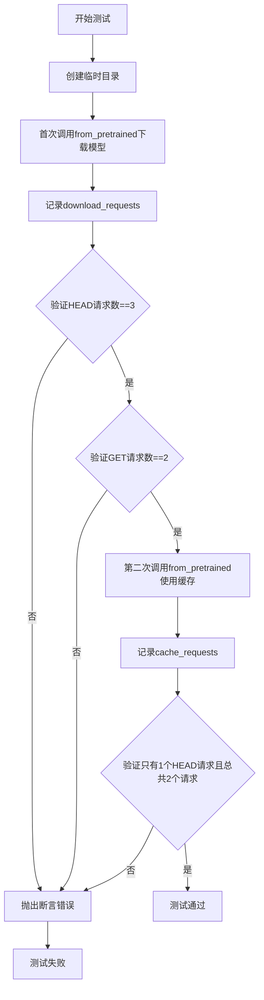

#### 带注释源码

```python
@unittest.skip("Flaky behaviour on CI. Re-enable after migrating to new runners")
@unittest.skipIf(torch_device == "mps", reason="Test not supported for MPS.")
def test_one_request_upon_cached(self):
    """
    测试当模型已缓存时，后续加载应只发起最少请求。
    首次下载应发起3个HEAD请求和2个GET请求。
    缓存命中后应只发起1个HEAD请求用于检查commit hash和shard index。
    """
    use_safetensors = False

    # 创建临时目录用于缓存模型
    with tempfile.TemporaryDirectory() as tmpdirname:
        # 第一次：模拟网络请求，下载模型到缓存目录
        with requests_mock.mock(real_http=True) as m:
            UNet2DConditionModel.from_pretrained(
                "hf-internal-testing/tiny-stable-diffusion-torch",
                subfolder="unet",
                cache_dir=tmpdirname,
                use_safetensors=use_safetensors,
            )

        # 收集所有下载请求的方法类型
        download_requests = [r.method for r in m.request_history]
        # 验证：首次下载应产生3个HEAD请求
        # 分别用于：config、model、shard index file
        assert download_requests.count("HEAD") == 3, (
            "3 HEAD requests one for config, one for model, and one for shard index file."
        )
        # 验证：首次下载应产生2个GET请求
        # 分别用于：config、model
        assert download_requests.count("GET") == 2, "2 GET requests one for config, one for model"

        # 第二次：使用已填充的缓存目录加载模型
        with requests_mock.mock(real_http=True) as m:
            UNet2DConditionModel.from_pretrained(
                "hf-internal-testing/tiny-stable-diffusion-torch",
                subfolder="unet",
                cache_dir=tmpdirname,
                use_safetensors=use_safetensors,
            )

        # 收集缓存加载时的请求
        cache_requests = [r.method for r in m.request_history]
        # 验证：缓存命中后应只发起1个HEAD请求（model_info）来检查commit hash
        # 以及1个HEAD请求用于确认shard index是否存在
        assert "HEAD" == cache_requests[0] and len(cache_requests) == 2, (
            "We should call only `model_info` to check for commit hash and knowing if shard index is present."
        )
```


### `ModelUtilsTest.test_weight_overwrite`

该测试方法用于验证在使用不匹配的 `in_channels` 参数加载模型时的行为，包括错误处理和通过 `ignore_mismatched_sizes` 参数成功覆盖权重的场景。

参数：

- `self`：`ModelUtilsTest` 实例，测试类本身，无需显式传递

返回值：`None`，无返回值（测试方法）

#### 流程图

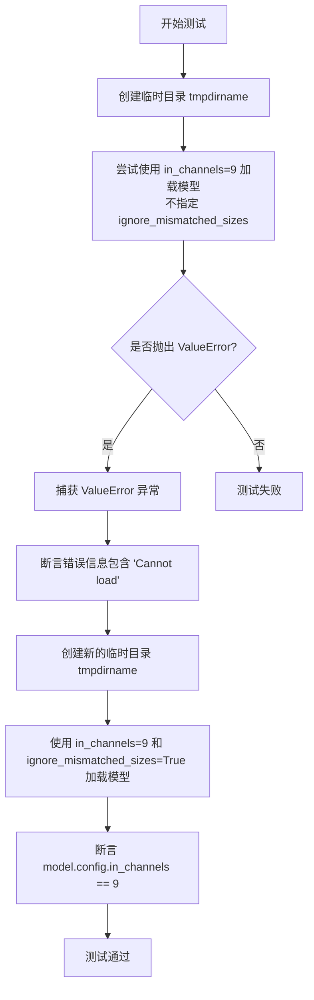

#### 带注释源码

```python
def test_weight_overwrite(self):
    """
    测试权重覆盖功能：验证当模型配置的 in_channels 与预训练权重不匹配时的行为。
    第一部分：验证默认情况下会抛出 ValueError。
    第二部分：验证使用 ignore_mismatched_sizes=True 可以成功加载并覆盖权重。
    """
    # 第一部分：测试不带 ignore_mismatched_sizes 时会抛出 ValueError
    with tempfile.TemporaryDirectory() as tmpdirname, self.assertRaises(ValueError) as error_context:
        # 尝试使用不匹配的 in_channels=9 加载模型
        # 预训练模型默认 in_channels=3，因此会因形状不匹配而失败
        UNet2DConditionModel.from_pretrained(
            "hf-internal-testing/tiny-stable-diffusion-torch",
            subfolder="unet",
            cache_dir=tmpdirname,
            in_channels=9,
        )

    # 验证错误消息中包含 'Cannot load'，确保错误原因正确
    assert "Cannot load" in str(error_context.exception)

    # 第二部分：测试使用 ignore_mismatched_sizes=True 可以成功加载
    with tempfile.TemporaryDirectory() as tmpdirname:
        # 使用 ignore_mismatched_sizes=True 忽略大小不匹配的权重
        # 这允许加载模型并用新的 in_channels 配置覆盖
        model = UNet2DConditionModel.from_pretrained(
            "hf-internal-testing/tiny-stable-diffusion-torch",
            subfolder="unet",
            cache_dir=tmpdirname,
            in_channels=9,
            low_cpu_mem_usage=False,
            ignore_mismatched_sizes=True,
        )

    # 验证模型的配置已成功更新为 in_channels=9
    assert model.config.in_channels == 9
```


### `ModelUtilsTest.test_keep_modules_in_fp32`

该测试方法验证了当以 fp16/bf16 精度加载模型时，`_keep_in_fp32_modules` 中指定的模块是否被正确保留在 fp32 精度中，同时确保推理功能正常工作。

参数：

- `self`：`ModelUtilsTest`，测试类的实例，无需显式传递

返回值：`None`，该方法为单元测试方法，通过断言验证行为，不返回任何值

#### 流程图

```mermaid
flowchart TD
    A[开始测试] --> B[保存原始 _keep_in_fp32_modules]
    B --> C{遍历精度类型: bfloat16, float16}
    C -->|bfloat16| D[设置 _keep_in_fp32_modules = ['proj_out']]
    D --> E[从预训练模型加载 SD3Transformer2DModel]
    E --> F[移动模型到设备]
    F --> G[遍历所有模块]
    G --> H{检查 Linear 层}
    H -->|是| I{该模块名称在 _keep_in_fp32_modules 中}
    I -->|是| J[断言: weight.dtype == float32]
    I -->|否| K[断言: weight.dtype == torch_dtype]
    H -->|否| L[继续下一个模块]
    J --> M[遍历完成]
    K --> M
    L --> M
    M --> C
    C -->|float16| D
    C --> N[准备虚拟输入]
    N --> O[执行推理]
    O --> P[恢复原始 _keep_in_fp32_modules]
    P --> Q[结束测试]
```

#### 带注释源码

```python
@require_torch_accelerator  # 装饰器：仅在有加速器（GPU/NPU）时运行
def test_keep_modules_in_fp32(self):
    r"""
    测试检查当以 fp16/bf16 精度加载模型时，`_keep_in_fp32_modules` 中指定的模块
    是否被正确保留在 fp32 精度中。同时确保推理功能正常工作。
    """
    # 保存模型类原始的 _keep_in_fp32_modules 配置，以便测试后恢复
    fp32_modules = SD3Transformer2DModel._keep_in_fp32_modules

    # 遍历两种低精度类型：bfloat16 和 float16
    for torch_dtype in [torch.bfloat16, torch.float16]:
        # 设置需要保持为 fp32 的模块列表为 ["proj_out"]
        SD3Transformer2DModel._keep_in_fp32_modules = ["proj_out"]

        # 从预训练模型加载 SD3Transformer2DModel，指定加载精度为当前测试的精度
        model = SD3Transformer2DModel.from_pretrained(
            "hf-internal-testing/tiny-sd3-pipe", subfolder="transformer", torch_dtype=torch_dtype
        ).to(torch_device)  # 将模型移动到测试设备

        # 遍历模型中的所有模块，检查 Linear 层的精度
        for name, module in model.named_modules():
            if isinstance(module, torch.nn.Linear):
                # 如果模块名称在 _keep_in_fp32_modules 中，验证其保持为 float32
                if name in model._keep_in_fp32_modules:
                    self.assertTrue(module.weight.dtype == torch.float32)
                else:  # 其他模块应转换为指定的低精度
                    self.assertTrue(module.weight.dtype == torch_dtype)

    # 定义辅助函数：生成用于推理测试的虚拟输入数据
    def get_dummy_inputs():
        batch_size = 2
        num_channels = 4
        height = width = embedding_dim = 32
        pooled_embedding_dim = embedding_dim * 2
        sequence_length = 154

        # 创建随机张量作为输入
        hidden_states = torch.randn((batch_size, num_channels, height, width)).to(torch_device)
        encoder_hidden_states = torch.randn((batch_size, sequence_length, embedding_dim)).to(torch_device)
        pooled_prompt_embeds = torch.randn((batch_size, pooled_embedding_dim)).to(torch_device)
        timestep = torch.randint(0, 1000, size=(batch_size,)).to(torch_device)

        return {
            "hidden_states": hidden_states,
            "encoder_hidden_states": encoder_hidden_states,
            "pooled_projections": pooled_prompt_embeds,
            "timestep": timestep,
        }

    # 测试推理功能：在 autocast 上下文中执行前向传播
    with torch.no_grad() and torch.amp.autocast(torch_device, dtype=torch_dtype):
        input_dict_for_transformer = get_dummy_inputs()
        # 将输入移动到测试设备
        model_inputs = {
            k: v.to(device=torch_device) for k, v in input_dict_for_transformer.items() if not isinstance(v, bool)
        }
        model_inputs.update({k: v for k, v in input_dict_for_transformer.items() if k not in model_inputs})
        # 执行推理
        _ = model(**model_inputs)

    # 恢复模型类原始的 _keep_in_fp32_modules 配置
    SD3Transformer2DModel._keep_in_fp32_modules = fp32_modules
```


### `UNetTesterMixin._accepts_norm_num_groups`

该方法是一个静态工具函数，用于检查给定的模型类（model_class）的 `__init__` 方法是否接受 `norm_num_groups` 参数。它通过检查模型类的构造函数签名来判断该模型是否支持 `norm_num_groups` 功能，常用于条件跳过不支持该特性的模型测试。

参数：

- `model_class`：`type`，需要检查的模型类，用于获取其 `__init__` 方法的签名

返回值：`bool`，如果模型类的构造函数接受 `norm_num_groups` 参数则返回 `True`，否则返回 `False`

#### 流程图

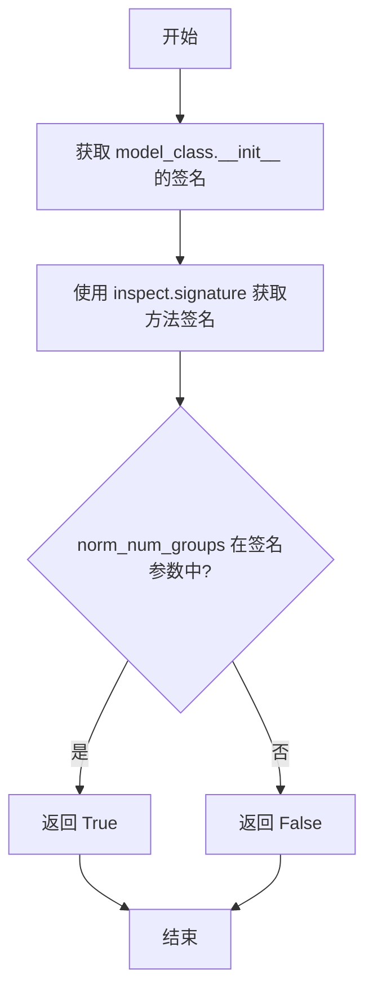

#### 带注释源码

```python
@staticmethod
def _accepts_norm_num_groups(model_class):
    """
    检查模型类的 __init__ 方法是否接受 norm_num_groups 参数。
    
    Args:
        model_class: 需要检查的模型类
        
    Returns:
        bool: 如果模型类接受 norm_num_groups 参数返回 True，否则返回 False
    """
    # 使用 inspect 模块获取模型类 __init__ 方法的签名对象
    model_sig = inspect.signature(model_class.__init__)
    
    # 检查签名参数中是否包含 "norm_num_groups"
    accepts_norm_groups = "norm_num_groups" in model_sig.parameters
    
    # 返回布尔结果
    return accepts_norm_groups
```


### `UNetTesterMixin.test_forward_with_norm_groups`

该方法用于测试模型是否支持 `norm_num_groups` 参数，并在支持的情况下验证模型前向传播的正确性，检验输出形状与输入形状是否匹配。

参数： 该方法无显式参数，依赖于 `self`（测试类实例）上的属性和方法。

- `self.model_class`：类型：`type`，模型类，用于检查是否支持 `norm_num_groups` 参数
- `self.prepare_init_args_and_inputs_for_common`：类型：`method`，提供模型初始化参数和输入字典的函数

返回值：`None`，该方法为单元测试，通过 `self.assertEqual` 等断言来验证正确性，若测试失败则抛出异常。

#### 流程图

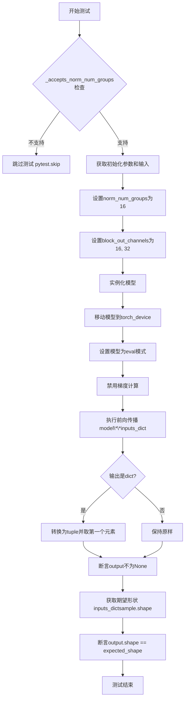

#### 带注释源码

```python
def test_forward_with_norm_groups(self):
    """
    测试模型是否支持 norm_num_groups 参数，并验证前向传播的正确性。
    """
    # 检查模型类是否接受 norm_num_groups 参数
    if not self._accepts_norm_num_groups(self.model_class):
        # 如果不支持，则跳过该测试
        pytest.skip(f"Test not supported for {self.model_class.__name__}")
    
    # 获取模型初始化参数和输入数据字典
    # 这些方法由继承该Mixin的测试类提供
    init_dict, inputs_dict = self.prepare_init_args_and_inputs_for_common()

    # 在初始化参数字典中设置特定的参数值
    init_dict["norm_num_groups"] = 16          # 设置归一化组数为16
    init_dict["block_out_channels"] = (16, 32) # 设置模块输出通道数

    # 使用修改后的参数实例化模型
    model = self.model_class(**init_dict)
    model.to(torch_device)                      # 将模型移动到指定设备
    model.eval()                                # 设置为评估模式

    # 执行前向传播，禁用梯度计算以提高性能
    with torch.no_grad():
        output = model(**inputs_dict)

        # 处理输出格式：如果输出是字典，则转换为tuple并取第一个元素
        if isinstance(output, dict):
            output = output.to_tuple()[0]

    # 断言输出不为空
    self.assertIsNotNone(output)
    
    # 从输入中获取期望的输出形状（基于sample张量）
    expected_shape = inputs_dict["sample"].shape
    
    # 验证输出形状与输入形状是否匹配
    self.assertEqual(output.shape, expected_shape, "Input and output shapes do not match")
```


### `ModelTesterMixin.check_device_map_is_respected`

该方法用于验证模型参数是否按照给定的设备映射（device_map）正确地放置在相应的设备上。它通过遍历模型的所有参数，检查每个参数的实际设备是否与 device_map 中指定的设备相匹配。如果设备映射不完整或参数设备放置不正确，该方法会抛出断言错误。

参数：

- `model`：`torch.nn.Module`，需要检查的模型实例
- `device_map`：`Dict[str, str]`，设备映射字典，键为参数名称（可能包含模块层级结构），值为目标设备（如 "cuda:0"、"cpu"、"disk" 或 "meta"）

返回值：`None`，该方法通过断言验证设备放置，不返回任何值

#### 流程图

```mermaid
flowchart TD
    A[开始检查 device_map] --> B{遍历模型所有参数}
    B --> C[获取当前参数名称 param_name]
    D{param_name 在 device_map 中?}
    D -->|否| E[回溯到父模块层级]
    E --> D
    D -->|是| F{获取 param_device}
    F --> G{param_device 是 'cpu' 或 'disk'?}
    G -->|是| H[验证 param.device == torch.device('meta')]
    G -->|否| I[验证 param.device == torch.device(param_device)]
    H --> J{断言通过?}
    I --> J
    J -->|否| K[抛出 AssertionError]
    J -->|是| L[继续下一个参数]
    K --> M[结束并报告错误]
    L --> B
    B --> N[所有参数检查完成]
    N --> O[结束]
```

#### 带注释源码

```python
def check_device_map_is_respected(self, model, device_map):
    """
    检查模型参数是否按照 device_map 正确放置在相应设备上。
    
    该方法验证当使用 accelerate 库的 device_map 进行模型分片时，
    每个参数是否被正确放置在指定的设备上。
    
    Args:
        model: 要检查的 PyTorch 模型
        device_map: 设备映射字典，键为参数名，值为目标设备
    """
    # 遍历模型中的所有参数
    for param_name, param in model.named_parameters():
        # 在 device_map 中查找设备信息
        # 由于参数名可能是完整路径（如 'model.layer.weight'），
        # 需要逐层向上查找直到找到匹配的键
        while len(param_name) > 0 and param_name not in device_map:
            # 将参数名按 '.' 分割，去掉最后一部分，尝试匹配父模块
            param_name = ".".join(param_name.split(".")[:-1])
        
        # 如果遍历完所有层级仍未找到匹配的设备映射，抛出错误
        if param_name not in device_map:
            raise ValueError(
                "device map is incomplete, it does not contain any device for `param_name`."
            )

        # 获取该参数应该放置的设备
        param_device = device_map[param_name]
        
        # 对于 CPU 或 Disk offload 的情况，参数实际存放在 meta 设备上
        if param_device in ["cpu", "disk"]:
            # 验证参数确实在 meta 设备上
            self.assertEqual(param.device, torch.device("meta"))
        else:
            # 对于其他设备（如 cuda:0, cuda:1 等），验证参数在实际设备上
            self.assertEqual(param.device, torch.device(param_device))
```


### `ModelTesterMixin.test_from_save_pretrained`

该方法用于测试模型的 `save_pretrained` 和 `from_pretrained` 功能是否正常工作，通过比较模型在保存前后的前向传播输出差异来验证序列化/反序列化流程的正确性。

参数：

- `expected_max_diff`：`float`，默认值 `5e-5`，允许的最大差异阈值，用于判断模型保存前后输出是否一致

返回值：`None`，该方法为测试方法，通过断言验证模型保存加载的正确性

#### 流程图

```mermaid
flowchart TD
    A[开始] --> B{forward_requires_fresh_args?}
    B -->|True| C[使用 self.init_dict 创建模型]
    B -->|False| D[调用 prepare_init_args_and_inputs_for_common 获取 init_dict 和 inputs_dict]
    C --> E[创建模型实例]
    D --> E
    E --> F{模型有 set_default_attn_processor?}
    F -->|Yes| G[调用 set_default_attn_processor]
    F -->|No| H[跳过]
    G --> I[将模型移动到 torch_device 并设为 eval 模式]
    H --> I
    I --> J[创建临时目录]
    J --> K[调用 model.save_pretrained 保存模型]
    K --> L[调用 model_class.from_pretrained 加载模型]
    L --> M{加载的模型有 set_default_attn_processor?}
    M -->|Yes| N[调用 set_default_attn_processor]
    M -->|No| O[跳过]
    N --> P[将新模型移动到 torch_device]
    O --> P
    P --> Q[使用 torch.no_grad 上下文]
    Q --> R{forward_requires_fresh_args?}
    R -->|True| S[使用 self.inputs_dict 获取输入]
    R -->|False| T[使用 inputs_dict 获取输入]
    S --> U[原始模型前向传播]
    T --> U
    U --> V{输出是 dict?}
    V -->|Yes| W[转换为 tuple 并取第一个元素]
    V -->|No| X[继续]
    W --> Y[调用 normalize_output]
    X --> Y
    Y --> Z[加载模型前向传播]
    Z --> AA{输出是 dict?}
    AA -->|Yes| AB[转换为 tuple 并取第一个元素]
    AA -->|No| AC[继续]
    AB --> AD[调用 normalize_output]
    AC --> AD
    AD --> AE[计算 max_diff = image - new_image 的绝对值最大值]
    AE --> AF{max_diff <= expected_max_diff?}
    AF -->|Yes| AG[断言通过 - 测试成功]
    AF -->|No| AH[断言失败 - 抛出异常]
    AG --> AI[结束]
    AH --> AI
```

#### 带注释源码

```python
def test_from_save_pretrained(self, expected_max_diff=5e-5):
    """
    测试模型的 save_pretrained 和 from_pretrained 功能。
    
    参数:
        expected_max_diff: float，默认值 5e-5
            允许的最大差异阈值，用于判断模型保存前后输出是否一致
    
    返回:
        None - 通过断言验证正确性
    """
    
    # 根据 forward_requires_fresh_args 标志决定如何初始化模型
    # 如果为 True，表示每次前向传播需要新的参数，使用 self.init_dict
    # 否则使用 prepare_init_args_and_inputs_for_common 方法获取初始化参数
    if self.forward_requires_fresh_args:
        model = self.model_class(**self.init_dict)
    else:
        init_dict, inputs_dict = self.prepare_init_args_and_inputs_for_common()
        model = self.model_class(**init_dict)

    # 如果模型有 set_default_attn_processor 方法，调用它设置默认的注意力处理器
    if hasattr(model, "set_default_attn_processor"):
        model.set_default_attn_processor()
    
    # 将模型移动到指定的计算设备并设置为评估模式
    model.to(torch_device)
    model.eval()

    # 使用临时目录保存和加载模型
    with tempfile.TemporaryDirectory() as tmpdirname:
        # 使用 save_pretrained 保存模型，safe_serialization=False 表示不使用安全序列化
        model.save_pretrained(tmpdirname, safe_serialization=False)
        
        # 使用 from_pretrained 重新加载模型
        new_model = self.model_class.from_pretrained(tmpdirname)
        
        # 如果加载的模型有 set_default_attn_processor 方法，也调用它
        if hasattr(new_model, "set_default_attn_processor"):
            new_model.set_default_attn_processor()
        
        # 将新加载的模型移动到指定的计算设备
        new_model.to(torch_device)

    # 在 no_grad 上下文中进行前向传播测试，不计算梯度
    with torch.no_grad():
        # 获取原始模型的输出
        if self.forward_requires_fresh_args:
            image = model(**self.inputs_dict(0))
        else:
            image = model(**inputs_dict)

        # 如果输出是字典，转换为 tuple 并取第一个元素
        if isinstance(image, dict):
            image = image.to_tuple()[0]

        # 获取重新加载模型的输出
        if self.forward_requires_fresh_args:
            new_image = new_model(**self.inputs_dict(0))
        else:
            new_image = new_model(**inputs_dict)

        # 如果输出是字典，转换为 tuple 并取第一个元素
        if isinstance(new_image, dict):
            new_image = new_image.to_tuple()[0]

        # 规范化输出，确保格式一致
        image = normalize_output(image)
        new_image = normalize_output(new_image)

    # 计算两个输出之间的最大绝对差异
    max_diff = (image - new_image).abs().max().item()
    
    # 断言最大差异不超过预期阈值
    # 如果超过阈值，抛出 AssertionError 并显示错误信息
    self.assertLessEqual(max_diff, expected_max_diff, "Models give different forward passes")
```


### `ModelTesterMixin.test_getattr_is_correct`

该方法用于测试模型的 `__getattr__` 和 `__getattribute__` 方法是否正确工作，包括对自定义属性、配置属性和不存在属性的访问处理。

参数：

- 无显式参数（继承自 `unittest.TestCase` 的 `self` 参数）

返回值：`None`，该方法为测试用例，无返回值

#### 流程图

```mermaid
flowchart TD
    A[开始测试] --> B[准备模型初始化参数和输入]
    C[创建模型实例] --> D[设置自定义属性 dummy_attribute=5]
    D --> E[通过 register_to_config 注册 test_attribute=5]
    E --> F[测试 dummy_attribute 访问 - 应无警告]
    F --> G{hasattr 和 getattr 是否正确?}
    G -->|是| H[验证无警告输出]
    G -->|否| I[测试失败]
    H --> J[测试 save_pretrained 方法访问 - 应无警告]
    J --> K[验证方法引用一致性]
    K --> L[测试 test_attribute 访问 - 应触发 FutureWarning]
    L --> M{是否触发警告?}
    M -->|是| N[测试 getattr(model, 'test_attribute')]
    M -->|否| I
    N --> O[测试访问不存在属性 - 应触发 AttributeError]
    O --> P[验证错误消息格式]
    P --> Q[结束测试]
```

#### 带注释源码

```python
def test_getattr_is_correct(self):
    """
    测试模型的 __getattr__ 和 __getattribute__ 方法是否正确工作。
    验证：
    1. 自定义属性（dummy_attribute）的访问不触发警告
    2. 已注册到配置的属性（test_attribute）访问触发 FutureWarning
    3. 不存在的属性访问触发 AttributeError
    """
    # 准备模型初始化参数和输入字典
    init_dict, inputs_dict = self.prepare_init_args_and_inputs_for_common()
    # 使用模型类创建模型实例
    model = self.model_class(**init_dict)

    # 设置一个自定义属性用于测试
    model.dummy_attribute = 5
    # 将测试属性注册到模型配置中
    model.register_to_config(test_attribute=5)

    # 获取 diffusers.models.modeling_utils 的 logger
    logger = logging.get_logger("diffusers.models.modeling_utils")
    # 设置日志级别为 30（WARNING 级别）
    logger.setLevel(30)
    # 使用 CaptureLogger 捕获日志输出
    with CaptureLogger(logger) as cap_logger:
        # 断言模型具有 dummy_attribute 属性
        assert hasattr(model, "dummy_attribute")
        # 使用 getattr 获取属性值
        assert getattr(model, "dummy_attribute") == 5
        # 直接访问属性
        assert model.dummy_attribute == 5

    # 验证没有警告输出
    assert cap_logger.out == ""

    # 重新获取 logger 并设置相同级别
    logger = logging.get_logger("diffusers.models.modeling_utils")
    logger.setLevel(30)
    with CaptureLogger(logger) as cap_logger:
        # 检查模型是否有 save_pretrained 方法
        assert hasattr(model, "save_pretrained")
        # 直接获取方法
        fn = model.save_pretrained
        # 通过 getattr 获取方法
        fn_1 = getattr(model, "save_pretrained")
        # 验证两个方法引用相同
        assert fn == fn_1
    # 验证没有警告输出
    assert cap_logger.out == ""

    # 测试访问注册到配置的属性，应该触发 FutureWarning
    with self.assertWarns(FutureWarning):
        assert model.test_attribute == 5

    # 通过 getattr 访问，也应该触发警告
    with self.assertWarns(FutureWarning):
        assert getattr(model, "test_attribute") == 5

    # 测试访问不存在的属性，应该抛出 AttributeError
    with self.assertRaises(AttributeError) as error:
        model.does_not_exist

    # 验证错误消息格式正确
    assert str(error.exception) == f"'{type(model).__name__}' object has no attribute 'does_not_exist'"
```


### `ModelTesterMixin.test_set_torch_npu_flash_attn_processor_determinism`

该方法用于测试在NPU（华为昇腾芯片）上使用Flash Attention处理器时的确定性行为。通过设置默认处理器、启用NPU Flash Attention和手动设置处理器三种方式，验证模型输出的数值一致性。

参数：

- `self`：`ModelTesterMixin`实例，表示测试类的实例本身

返回值：`None`，该方法为测试方法，通过assert语句验证结果

#### 流程图

```mermaid
flowchart TD
    A[开始测试] --> B{检查设备是否为NPU且torch_npu可用}
    B -->|否| C[跳过测试]
    B -->|是| D[禁用确定性算法]
    E{forward_requires_fresh_args} -->|True| F[使用init_dict创建模型]
    E -->|False| G[获取init_dict和inputs_dict]
    F --> H[移动模型到torch_device]
    G --> H
    H --> I{模型是否有set_attn_processor方法}
    I -->|否| J[返回,跳过测试]
    I -->|是| K[设置默认注意力处理器]
    K --> L[验证处理器类型为AttnProcessorNPU]
    L --> M[执行前向传播获取output]
    M --> N[启用NPU Flash Attention]
    N --> O[验证处理器类型为AttnProcessorNPU]
    O --> P[执行前向传播获取output_2]
    P --> Q[手动设置AttnProcessorNPU处理器]
    Q --> R[验证处理器类型为AttnProcessorNPU]
    R --> S[执行前向传播获取output_3]
    S --> T[启用确定性算法]
    T --> U[验证output与output_2接近]
    U --> V[验证output与output_3接近]
    V --> W[验证output_2与output_3接近]
    W --> X[测试结束]
```

#### 带注释源码

```python
@unittest.skipIf(
    torch_device != "npu" or not is_torch_npu_available(),
    reason="torch npu flash attention is only available with NPU and `torch_npu` installed",
)
def test_set_torch_npu_flash_attn_processor_determinism(self):
    """
    测试NPU Flash Attention处理器的确定性行为
    
    该测试验证以下三种情况下模型输出的一致性：
    1. 使用set_default_attn_processor()设置默认处理器
    2. 使用enable_npu_flash_attention()启用NPU Flash Attention
    3. 手动设置AttnProcessorNPU()处理器
    """
    # 禁用确定性算法，确保使用NPU的Flash Attention实现
    torch.use_deterministic_algorithms(False)
    
    # 根据forward_requires_fresh_args标志决定如何初始化模型
    if self.forward_requires_fresh_args:
        # 如果需要新鲜参数，使用self.init_dict创建模型
        model = self.model_class(**self.init_dict)
    else:
        # 否则获取标准的init_dict和inputs_dict
        init_dict, inputs_dict = self.prepare_init_args_and_inputs_for_common()
        model = self.model_class(**init_dict)
    
    # 将模型移动到指定的设备（如NPU）
    model.to(torch_device)

    # 如果模型没有set_attn_processor方法，则跳过测试
    if not hasattr(model, "set_attn_processor"):
        # If not has `set_attn_processor`, skip test
        return

    # 步骤1：设置默认注意力处理器
    model.set_default_attn_processor()
    # 验证所有注意力处理器都是AttnProcessorNPU类型
    assert all(type(proc) == AttnProcessorNPU for proc in model.attn_processors.values())
    
    # 执行第一次前向传播
    with torch.no_grad():
        if self.forward_requires_fresh_args:
            output = model(**self.inputs_dict(0))[0]
        else:
            output = model(**inputs_dict)[0]

    # 步骤2：启用NPU Flash Attention
    model.enable_npu_flash_attention()
    # 再次验证处理器类型
    assert all(type(proc) == AttnProcessorNPU for proc in model.attn_processors.values())
    
    # 执行第二次前向传播
    with torch.no_grad():
        if self.forward_requires_fresh_args:
            output_2 = model(**self.inputs_dict(0))[0]
        else:
            output_2 = model(**inputs_dict)[0]

    # 步骤3：手动设置AttnProcessorNPU处理器
    model.set_attn_processor(AttnProcessorNPU())
    # 验证处理器类型
    assert all(type(proc) == AttnProcessorNPU for proc in model.attn_processors.values())
    
    # 执行第三次前向传播
    with torch.no_grad():
        if self.forward_requires_fresh_args:
            output_3 = model(**self.inputs_dict(0))[0]
        else:
            output_3 = model(**inputs_dict)[0]

    # 启用确定性算法（测试结束后恢复）
    torch.use_deterministic_algorithms(True)

    # 验证三种情况下的输出在base_precision精度内一致
    assert torch.allclose(output, output_2, atol=self.base_precision)
    assert torch.allclose(output, output_3, atol=self.base_precision)
    assert torch.allclose(output_2, output_3, atol=self.base_precision)
```


### `ModelTesterMixin.test_set_xformers_attn_processor_for_determinism`

该方法用于测试在使用 xFormers 注意力处理器时，模型的输出是否具有确定性（determinism）。它通过比较默认注意力处理器、启用 xFormers 内存高效注意力以及手动设置 xFormers 处理器三种情况下的输出，验证它们在给定精度范围内是否一致。

参数：

- 无显式参数（继承自 `unittest.TestCase` 的测试方法，隐式接收 `self`）

返回值：`None`，该方法为单元测试方法，通过断言验证输出一致性，不返回任何值

#### 流程图

```mermaid
flowchart TD
    A[开始测试] --> B{检查条件: CUDA可用且xFormers已安装}
    B -->|不满足| C[跳过测试]
    B -->|满足| D[设置确定性算法为False]
    D --> E{forward_requires_fresh_args}
    E -->|True| F[使用self.init_dict创建模型]
    E -->|False| G[获取init_dict和inputs_dict并创建模型]
    F --> H[将模型移到torch_device]
    G --> H
    H --> I{模型有set_attn_processor方法?}
    I -->|无| J[返回并跳过]
    I -->|有| K{模型有set_default_attn_processor方法?}
    K -->|无| J
    K -->|有| L[调用set_default_attn_processor]
    L --> M[断言: 所有处理器为AttnProcessor]
    M --> N[运行前向传播获取output]
    O[调用enable_xformers_memory_efficient_attention]
    M --> O
    O --> P[断言: 所有处理器为XFormersAttnProcessor]
    P --> Q[运行前向传播获取output_2]
    Q --> R[调用set_attn_processor设置XFormersAttnProcessor]
    R --> S[断言: 所有处理器为XFormersAttnProcessor]
    S --> T[运行前向传播获取output_3]
    T --> U[设置确定性算法为True]
    U --> V[断言: output ≈ output_2 ≈ output_3]
    V --> W[结束测试]
    J --> W
```

#### 带注释源码

```python
@unittest.skipIf(
    torch_device != "cuda" or not is_xformers_available(),
    reason="XFormers attention is only available with CUDA and `xformers` installed",
)
def test_set_xformers_attn_processor_for_determinism(self):
    """
    测试在使用 xFormers 注意力处理器时，模型的输出是否具有确定性。
    该测试验证：
    1. 默认注意力处理器 (AttnProcessor) 的输出
    2. 启用 xFormers 内存高效注意力 (enable_xformers_memory_efficient_attention) 的输出
    3. 手动设置 XFormersAttnProcessor 的输出
    这三种情况下的输出应该在给定的精度范围内一致。
    """
    # 禁用确定性算法，以确保测试可以在非确定性模式下运行
    torch.use_deterministic_algorithms(False)
    
    # 根据 forward_requires_fresh_args 属性决定如何初始化模型
    if self.forward_requires_fresh_args:
        model = self.model_class(**self.init_dict)
    else:
        init_dict, inputs_dict = self.prepare_init_args_and_inputs_for_common()
        model = self.model_class(**init_dict)
    
    # 将模型移动到指定的设备
    model.to(torch_device)

    # 如果模型没有 set_attn_processor 方法，则跳过测试
    if not hasattr(model, "set_attn_processor"):
        return

    # 如果模型没有 set_default_attn_processor 方法，则跳过测试
    if not hasattr(model, "set_default_attn_processor"):
        return

    # 设置默认的注意力处理器
    model.set_default_attn_processor()
    
    # 验证所有注意力处理器都是 AttnProcessor 类型
    assert all(type(proc) == AttnProcessor for proc in model.attn_processors.values())
    
    # 在 no_grad 模式下运行前向传播，获取默认处理器的输出
    with torch.no_grad():
        if self.forward_requires_fresh_args:
            output = model(**self.inputs_dict(0))[0]
        else:
            output = model(**inputs_dict)[0]

    # 启用 xFormers 内存高效注意力
    model.enable_xformers_memory_efficient_attention()
    
    # 验证所有注意力处理器都变成了 XFormersAttnProcessor 类型
    assert all(type(proc) == XFormersAttnProcessor for proc in model.attn_processors.values())
    
    # 在 no_grad 模式下运行前向传播，获取 xFormers 处理器的输出
    with torch.no_grad():
        if self.forward_requires_fresh_args:
            output_2 = model(**self.inputs_dict(0))[0]
        else:
            output_2 = model(**inputs_dict)[0]

    # 手动设置 XFormersAttnProcessor 处理器
    model.set_attn_processor(XFormersAttnProcessor())
    
    # 再次验证所有注意力处理器都是 XFormersAttnProcessor 类型
    assert all(type(proc) == XFormersAttnProcessor for proc in model.attn_processors.values())
    
    # 在 no_grad 模式下运行前向传播，获取手动设置的处理器的输出
    with torch.no_grad():
        if self.forward_requires_fresh_args:
            output_3 = model(**self.inputs_dict(0))[0]
        else:
            output_3 = model(**inputs_dict)[0]

    # 重新启用确定性算法
    torch.use_deterministic_algorithms(True)

    # 验证三种情况下的输出在 base_precision 精度范围内相等
    assert torch.allclose(output, output_2, atol=self.base_precision)
    assert torch.allclose(output, output_3, atol=self.base_precision)
    assert torch.allclose(output_2, output_3, atol=self.base_precision)
```


### `ModelTesterMixin.test_set_attn_processor_for_determinism`

该方法是一个测试用例，用于验证在切换不同的注意力处理器（Attention Processor）时，模型的输出是否保持确定性（deterministic）。测试通过比较使用 `AttnProcessor`、`AttnProcessor2_0` 等不同处理器时的前向传播输出，确保它们在给定的精度阈值内保持一致。

参数：

- `self`：`ModelTesterMixin` 实例本身，无需显式传递

返回值：`None`，该方法为测试用例，执行断言验证，不返回任何值

#### 流程图

```mermaid
flowchart TD
    A[开始测试] --> B{uses_custom_attn_processor?}
    B -->|是| C[直接返回]
    B -->|否| D[关闭确定性算法]
    D --> E{forward_requires_fresh_args?}
    E -->|是| F[使用self.init_dict创建模型]
    E -->|否| G[调用prepare_init_args_and_inputs_for_common获取参数]
    F --> H[模型移到torch_device]
    G --> H
    H --> I{模型有set_attn_processor属性?}
    I -->|否| J[直接返回]
    I -->|是| K[断言当前处理器为AttnProcessor2_0]
    K --> L[前向传播得到output_1]
    L --> M[设置默认处理器AttnProcessor]
    M --> N[断言处理器已更改为AttnProcessor]
    N --> O[前向传播得到output_2]
    O --> P[设置处理器为AttnProcessor2_0]
    P --> Q[断言处理器已更改为AttnProcessor2_0]
    Q --> R[前向传播得到output_4]
    R --> S[设置处理器为AttnProcessor]
    S --> T[断言处理器已更改为AttnProcessor]
    T --> U[前向传播得到output_5]
    U --> V[开启确定性算法]
    V --> W[断言output_2与output_1相近]
    W --> X[断言output_2与output_4相近]
    X --> Y[断言output_2与output_5相近]
    Y --> Z[测试结束]
```

#### 带注释源码

```python
@require_torch_accelerator
def test_set_attn_processor_for_determinism(self):
    """
    测试函数：验证切换注意力处理器时模型输出的确定性
    
    该测试确保在使用不同注意力处理器（AttnProcessor、AttnProcessor2_0等）
    时，模型的输出在给定的精度阈值内保持一致，从而验证处理器的确定性行为。
    """
    # 如果模型使用自定义注意力处理器，则跳过此测试
    if self.uses_custom_attn_processor:
        return

    # 关闭确定性算法模式，以确保测试能够捕获非确定性行为
    torch.use_deterministic_algorithms(False)
    
    # 根据模型类别的需求，决定是否需要fresh参数来初始化模型
    if self.forward_requires_fresh_args:
        model = self.model_class(**self.init_dict)
    else:
        # 获取标准的初始化参数和输入
        init_dict, inputs_dict = self.prepare_init_args_and_inputs_for_common()
        model = self.model_class(**init_dict)

    # 将模型移动到指定的计算设备
    model.to(torch_device)

    # 如果模型没有set_attn_processor方法，则跳过测试
    if not hasattr(model, "set_attn_processor"):
        # If not has `set_attn_processor`, skip test
        return

    # 验证初始状态下所有注意力处理器都是AttnProcessor2_0类型
    assert all(type(proc) == AttnProcessor2_0 for proc in model.attn_processors.values())
    
    # 在no_grad模式下进行前向传播，获取基准输出
    with torch.no_grad():
        if self.forward_requires_fresh_args:
            output_1 = model(**self.inputs_dict(0))[0]
        else:
            output_1 = model(**inputs_dict)[0]

    # 设置默认的注意力处理器为AttnProcessor
    model.set_default_attn_processor()
    
    # 验证处理器已成功更改
    assert all(type(proc) == AttnProcessor for proc in model.attn_processors.values())
    
    # 再次进行前向传播
    with torch.no_grad():
        if self.forward_requires_fresh_args:
            output_2 = model(**self.inputs_dict(0))[0]
        else:
            output_2 = model(**inputs_dict)[0]

    # 设置注意力处理器为AttnProcessor2_0
    model.set_attn_processor(AttnProcessor2_0())
    
    # 验证处理器已更改为AttnProcessor2_0
    assert all(type(proc) == AttnProcessor2_0 for proc in model.attn_processors.values())
    
    # 进行前向传播
    with torch.no_grad():
        if self.forward_requires_fresh_args:
            output_4 = model(**self.inputs_dict(0))[0]
        else:
            output_4 = model(**inputs_dict)[0]

    # 再次设置回AttnProcessor
    model.set_attn_processor(AttnProcessor())
    
    # 验证处理器类型
    assert all(type(proc) == AttnProcessor for proc in model.attn_processors.values())
    
    # 进行前向传播
    with torch.no_grad():
        if self.forward_requires_fresh_args:
            output_5 = model(**self.inputs_dict(0))[0]
        else:
            output_5 = model(**inputs_dict)[0]

    # 恢复确定性算法设置
    torch.use_deterministic_algorithms(True)

    # 验证输出的一致性：确保使用不同处理器时，输出在base_precision精度内相同
    # make sure that outputs match
    assert torch.allclose(output_2, output_1, atol=self.base_precision)
    assert torch.allclose(output_2, output_4, atol=self.base_precision)
    assert torch.allclose(output_2, output_5, atol=self.base_precision)
```


### `ModelTesterMixin.test_from_save_pretrained_variant`

该方法用于测试模型的保存和加载功能，特别是针对带有变体（variant）的检查点。它确保在使用特定变体（如fp16）保存模型后，能够正确加载该变体，并且加载的模型与原始模型在前向传播时产生一致的输出。

参数：

- `expected_max_diff`：`float`，可选参数，默认值为 `5e-5`，表示原始模型和加载模型之间允许的最大差异

返回值：`None`，该方法为测试方法，通过断言验证模型正确性，不返回任何值

#### 流程图

```mermaid
flowchart TD
    A[开始测试] --> B{forward_requires_fresh_args?}
    B -->|True| C[使用self.init_dict创建模型]
    B -->|False| D[获取init_dict和inputs_dict]
    C --> E
    D --> E
    E[设置默认注意力处理器] --> F[将模型移至torch_device并设为eval模式]
    F --> G[创建临时目录]
    G --> H[保存模型到临时目录<br/>使用variant='fp16'和safe_serialization=False]
    H --> I[从临时目录加载模型<br/>指定variant='fp16']
    I --> J[设置新模型的默认注意力处理器]
    J --> K[尝试加载不带variant的模型<br/>预期抛出OSError]
    K --> L{是否抛出OSError?}
    L -->|Yes| M[验证错误信息包含特定字符串]
    L -->|No| N[测试失败]
    M --> O[将新模型移至torch_device]
    O --> P[使用torch.no_grad上下文]
    P --> Q{forward_requires_fresh_args?}
    Q -->|True| R[使用self.inputs_dict获取输入]
    Q -->|False| S[使用inputs_dict]
    R --> T
    S --> T
    T[运行原始模型前向传播] --> U[处理输出格式]
    U --> V[运行加载模型前向传播]
    V --> W[处理输出格式]
    W --> X[规范化输出]
    X --> Y[计算输出差异的最大值]
    Y --> Z{差异 <= expected_max_diff?}
    Z -->|Yes| AA[测试通过]
    Z -->|No| AB[测试失败]
```

#### 带注释源码

```python
def test_from_save_pretrained_variant(self, expected_max_diff=5e-5):
    """
    测试模型的保存和加载功能，特别针对带有变体(variant)的检查点。
    
    该测试验证以下场景:
    1. 模型可以使用特定变体(如fp16)保存
    2. 可以使用相同的变体加载模型
    3. 不带变体加载时会失败
    4. 加载的模型与原始模型产生一致的输出
    
    参数:
        expected_max_diff: float, 默认为5e-5, 原始模型和加载模型之间允许的最大差异
    """
    # 根据forward_requires_fresh_args决定如何创建模型
    if self.forward_requires_fresh_args:
        # 如果需要新鲜参数，使用self.init_dict创建模型
        model = self.model_class(**self.init_dict)
    else:
        # 否则使用prepare_init_args_and_inputs_for_common获取初始化参数和输入
        init_dict, inputs_dict = self.prepare_init_args_and_inputs_for_common()
        model = self.model_class(**init_dict)

    # 如果模型有set_default_attn_processor方法，设置默认的注意力处理器
    if hasattr(model, "set_default_attn_processor"):
        model.set_default_attn_processor()

    # 将模型移动到torch_device并设置为评估模式
    model.to(torch_device)
    model.eval()

    # 使用临时目录进行测试
    with tempfile.TemporaryDirectory() as tmpdirname:
        # 使用variant='fp16'保存模型，不使用安全序列化
        model.save_pretrained(tmpdirname, variant="fp16", safe_serialization=False)
        
        # 使用variant='fp16'加载模型
        new_model = self.model_class.from_pretrained(tmpdirname, variant="fp16")
        
        # 如果加载的模型有set_default_attn_processor方法，设置它
        if hasattr(new_model, "set_default_attn_processor"):
            new_model.set_default_attn_processor()

        # 尝试不带variant加载，应该抛出OSError
        with self.assertRaises(OSError) as error_context:
            self.model_class.from_pretrained(tmpdirname)

        # 验证错误信息包含预期的内容
        assert "Error no file named diffusion_pytorch_model.bin found in directory" in str(error_context.exception)

        # 将新模型移动到torch_device
        new_model.to(torch_device)

    # 在no_grad上下文中进行前向传播测试
    with torch.no_grad():
        # 获取原始模型的输出
        if self.forward_requires_fresh_args:
            image = model(**self.inputs_dict(0))
        else:
            image = model(**inputs_dict)
        
        # 如果输出是字典，转换为元组
        if isinstance(image, dict):
            image = image.to_tuple()[0]

        # 获取加载模型的输出
        if self.forward_requires_fresh_args:
            new_image = new_model(**self.inputs_dict(0))
        else:
            new_image = new_model(**inputs_dict)

        # 如果输出是字典，转换为元组
        if isinstance(new_image, dict):
            new_image = new_image.to_tuple()[0]

        # 规范化输出
        image = normalize_output(image)
        new_image = normalize_output(new_image)

    # 计算两个输出之间的最大差异
    max_diff = (image - new_image).abs().max().item()
    
    # 断言差异在允许范围内
    self.assertLessEqual(max_diff, expected_max_diff, "Models give different forward passes")
```


### `ModelTesterMixin.test_from_save_pretrained_dynamo`

这是一个测试方法，用于验证使用 PyTorch Dynamo (torch.compile) 编译后的模型能否正确执行保存和从预训练模型加载的操作。该测试通过子进程运行以确保编译环境与主测试进程隔离，并确保编译后的模型在序列化（save_pretrained）和反序列化（from_pretrained）过程中保持功能一致性。

参数：

- `self`：`ModelTesterMixin` 实例，测试类本身

返回值：`None`，无返回值（测试方法）

#### 流程图

```mermaid
flowchart TD
    A[开始测试 test_from_save_pretrained_dynamo] --> B[调用 prepare_init_args_and_inputs_for_common 获取初始化参数]
    B --> C[提取 init_dict 和 model_class]
    C --> D[构建输入列表 inputs = [init_dict, model_class]]
    D --> E[调用 run_test_in_subprocess 在子进程中执行]
    E --> F[子进程中执行 _test_from_save_pretrained_dynamo]
    F --> G[创建模型实例并移动到设备]
    G --> H[使用 torch.compile 编译模型]
    H --> I[创建临时目录]
    I --> J[调用 save_pretrained 保存模型到临时目录]
    J --> K[调用 from_pretrained 从临时目录加载模型]
    K --> L[验证加载的模型类型正确]
    L --> M{是否有错误}
    M -->|是| N[将错误信息放入结果队列]
    M -->|否| O[将成功结果放入结果队列]
    N --> P[主进程接收结果]
    O --> P
    P --> Q[测试完成]
```

#### 带注释源码

```python
@is_torch_compile  # 装饰器：标记该测试需要 torch.compile 支持
@require_torch_2    # 装饰器：要求 PyTorch 2.0 以上版本
@unittest.skipIf(
    get_python_version == (3, 12),
    reason="Torch Dynamo isn't yet supported for Python 3.12.",
)
def test_from_save_pretrained_dynamo(self):
    """
    测试使用 Dynamo 编译的模型的保存和加载功能。
    
    该测试方法验证以下流程：
    1. 准备模型的初始化参数
    2. 在子进程中运行保存/加载测试
    3. 使用 torch.compile 编译模型
    4. 保存模型到磁盘
    5. 从磁盘加载模型
    6. 验证加载的模型类型是否正确
    """
    # 获取模型的初始化字典和输入参数
    # prepare_init_args_and_inputs_for_common 是子类需要实现的方法
    init_dict, _ = self.prepare_init_args_and_inputs_for_common()
    
    # 将初始化字典和模型类打包为输入列表
    # 这些将被传递给子进程中的测试函数
    inputs = [init_dict, self.model_class]
    
    # 在子进程中运行测试
    # run_test_in_subprocess 确保编译环境与主测试进程隔离
    # 这是必要的，因为 torch.compile 的状态可能在进程间共享导致问题
    run_test_in_subprocess(test_case=self, target_func=_test_from_save_pretrained_dynamo, inputs=inputs)
```

#### 相关底层函数 `_test_from_save_pretrained_dynamo`

```python
# Will be run via run_test_in_subprocess
def _test_from_save_pretrained_dynamo(in_queue, out_queue, timeout):
    """
    在子进程中执行的测试函数。
    
    参数:
        in_queue: 输入队列，用于接收主进程传递的数据
        out_queue: 输出队列，用于返回测试结果
        timeout: 超时时间
    """
    error = None
    try:
        # 从队列中获取初始化字典和模型类
        init_dict, model_class = in_queue.get(timeout=timeout)

        # 创建模型实例
        model = model_class(**init_dict)
        # 移动模型到指定的计算设备（如 CUDA）
        model.to(torch_device)
        # 使用 torch.compile 编译模型（启用 Dynamo 优化）
        model = torch.compile(model)

        # 创建临时目录用于保存模型
        with tempfile.TemporaryDirectory() as tmpdirname:
            # 保存模型到临时目录（不使用安全序列化）
            model.save_pretrained(tmpdirname, safe_serialization=False)
            # 从临时目录加载模型
            new_model = model_class.from_pretrained(tmpdirname)
            # 将加载的模型移动到指定设备
            new_model.to(torch_device)

        # 断言：验证加载的模型类与原始模型类相同
        assert new_model.__class__ == model_class
    except Exception:
        # 捕获任何异常并记录错误信息
        error = f"{traceback.format_exc()}"

    # 构建结果字典
    results = {"error": error}
    # 将结果放入输出队列
    out_queue.put(results, timeout=timeout)
    # 等待确认
    out_queue.join()
```


### `ModelTesterMixin.test_from_save_pretrained_dtype`

该方法是一个单元测试，用于验证模型在保存为指定数据类型（dtype）后能否正确加载，并确保加载后的模型数据类型与预期一致。它遍历多种数据类型（float32、float16、bfloat16），测试模型的序列化和反序列化流程。

参数：

- `self`：隐式参数，`ModelTesterMixin` 类的实例方法，无需显式传递

返回值：`None`，该方法为测试方法，通过 `assert` 语句验证正确性，不返回任何值

#### 流程图

```mermaid
flowchart TD
    A[开始测试] --> B[获取初始化参数和输入字典]
    B --> C[创建模型实例并移至设备]
    C --> D[设置模型为评估模式]
    D --> E{遍历数据类型: float32, float16, bfloat16}
    E --> F{当前设备是MPS且数据类型是bfloat16?}
    F -->|是| G[跳过该数据类型]
    F -->|否| H[将模型转换为当前数据类型]
    H --> I[创建临时目录]
    I --> J[保存模型到临时目录]
    J --> K[从临时目录加载模型, 指定torch_dtype]
    K --> L{验证: new_model.dtype == dtype?}
    L -->|是| M[检查模型是否有_keep_in_fp32_modules属性且为None]
    M --> N[使用low_cpu_mem_usage=False重新加载]
    N --> O[再次验证数据类型]
    O --> P[断言验证成功]
    L -->|否| Q[测试失败]
    P --> R[遍历结束或继续下一数据类型]
    G --> R
    R --> S[测试完成]
```

#### 带注释源码

```python
def test_from_save_pretrained_dtype(self):
    """
    测试模型在不同数据类型下保存和加载的正确性。
    验证模型保存为指定dtype后，从pretrained加载时能够保持相同的dtype。
    """
    # 获取模型初始化参数和输入字典（由子类实现）
    init_dict, inputs_dict = self.prepare_init_args_and_inputs_for_common()

    # 使用初始化参数字典创建模型实例
    model = self.model_class(**init_dict)
    # 将模型移动到指定的计算设备（如cuda, cpu, mps等）
    model.to(torch_device)
    # 设置模型为评估模式，关闭dropout等训练特定行为
    model.eval()

    # 遍历测试数据类型列表：float32, float16, bfloat16
    for dtype in [torch.float32, torch.float16, torch.bfloat16]:
        # MPS设备不支持bfloat16，跳过该组合
        if torch_device == "mps" and dtype == torch.bfloat16:
            continue
        # 创建临时目录用于保存和加载模型
        with tempfile.TemporaryDirectory() as tmpdirname:
            # 将模型参数转换为当前测试的数据类型
            model.to(dtype)
            # 保存模型到临时目录，不使用安全序列化（.bin格式）
            model.save_pretrained(tmpdirname, safe_serialization=False)
            # 从临时目录加载模型，指定torch_dtype为期望的数据类型
            # low_cpu_mem_usage=True 使用低内存加载方式
            new_model = self.model_class.from_pretrained(
                tmpdirname, low_cpu_mem_usage=True, torch_dtype=dtype
            )
            # 断言：验证加载后的模型数据类型与预期dtype一致
            assert new_model.dtype == dtype
            
            # 如果模型类定义了_keep_in_fp32_modules属性且为None
            # 则使用low_cpu_mem_usage=False再次测试加载
            if (
                hasattr(self.model_class, "_keep_in_fp32_modules")
                and self.model_class._keep_in_fp32_modules is None
            ):
                new_model = self.model_class.from_pretrained(
                    tmpdirname, low_cpu_mem_usage=False, torch_dtype=dtype
                )
                # 再次验证数据类型正确性
                assert new_model.dtype == dtype
```


### `ModelTesterMixin.test_determinism`

该方法用于测试模型的确定性（determinism），通过连续两次运行模型并比较输出差异来验证模型是否产生一致的推理结果。

参数：

- `self`：`ModelTesterMixin`，测试类的实例本身
- `expected_max_diff`：`float`，默认值 `1e-5`，期望的最大差异阈值

返回值：`None`，该方法为测试用例，使用断言验证模型确定性

#### 流程图

```mermaid
flowchart TD
    A[开始] --> B{forward_requires_fresh_args?}
    B -->|True| C[使用 self.init_dict 创建模型]
    B -->|False| D[调用 prepare_init_args_and_inputs_for_common 获取 init_dict 和 inputs_dict]
    C --> E
    D --> E
    E[模型移动到 torch_device]
    E --> F[模型设置为评估模式 eval()]
    F --> G[第一次前向传播]
    G --> H{输出是 dict?}
    H -->|Yes| I[转换为 tuple 并取第一个元素]
    H -->|No| J
    I --> J
    J[第二次前向传播]
    J --> K{输出是 dict?}
    K -->|Yes| L[转换为 tuple 并取第一个元素]
    K -->|No| M
    L --> M
    M[规范化第一次输出 normalize_output]
    M --> N[规范化第二次输出 normalize_output]
    N --> O[转换为 numpy 并移除 NaN]
    O --> P[计算最大差异 max_diff]
    P --> Q{max_diff <= expected_max_diff?}
    Q -->|Yes| R[测试通过]
    Q -->|No| S[测试失败]
    R --> T[结束]
    S --> T
```

#### 带注释源码

```python
def test_determinism(self, expected_max_diff=1e-5):
    """
    测试模型的确定性：确保相同输入连续两次推理产生相同输出
    
    参数:
        expected_max_diff: 允许的最大差异阈值，默认为 1e-5
    """
    # 根据 forward_requires_fresh_args 决定模型初始化方式
    if self.forward_requires_fresh_args:
        model = self.model_class(**self.init_dict)
    else:
        # 获取模型初始化参数字典和输入字典
        init_dict, inputs_dict = self.prepare_init_args_and_inputs_for_common()
        model = self.model_class(**init_dict)
    
    # 将模型移动到指定设备（CPU/CUDA等）
    model.to(torch_device)
    # 设置为评估模式，关闭 dropout 等训练特有层
    model.eval()

    # 禁用梯度计算以提高推理效率
    with torch.no_grad():
        # 第一次前向传播
        if self.forward_requires_fresh_args:
            first = model(**self.inputs_dict(0))
        else:
            first = model(**inputs_dict)
        
        # 如果输出是字典，转换为元组并取第一个元素
        if isinstance(first, dict):
            first = first.to_tuple()[0]

        # 第二次前向传播
        if self.forward_requires_fresh_args:
            second = model(**self.inputs_dict(0))
        else:
            second = model(**inputs_dict)
        
        # 如果输出是字典，转换为元组并取第一个元素
        if isinstance(second, dict):
            second = second.to_tuple()[0]

        # 规范化输出格式
        first = normalize_output(first)
        second = normalize_output(second)

    # 转换为 numpy 数组进行比较
    out_1 = first.cpu().numpy()
    out_2 = second.cpu().numpy()
    
    # 移除 NaN 值
    out_1 = out_1[~np.isnan(out_1)]
    out_2 = out_2[~np.isnan(out_2)]
    
    # 计算最大绝对差异
    max_diff = np.amax(np.abs(out_1 - out_2))
    
    # 断言差异在允许范围内
    self.assertLessEqual(max_diff, expected_max_diff)
```


### `ModelTesterMixin.test_output`

该方法用于测试模型是否能根据给定输入产生输出，并验证输入与输出的形状是否匹配。

参数：

- `self`：`ModelTesterMixin` 实例本身
- `expected_output_shape`：`Optional[Tuple[int, ...]]`，期望的输出形状，默认为 `None`

返回值：`None`（测试方法无返回值，通过断言验证）

#### 流程图

```mermaid
flowchart TD
    A[开始测试] --> B[调用 prepare_init_args_and_inputs_for_common 获取初始化参数和输入]
    B --> C[使用 model_class 创建模型实例]
    C --> D[将模型移动到 torch_device 并设置为 eval 模式]
    D --> E[在 torch.no_grad 上下文中执行模型前向传播]
    E --> F{输出类型判断}
    F -->|dict| G[调用 to_tuple 获取第一项]
    F -->|list| H[使用 torch.stack 堆叠]
    F -->|其他| I[直接使用输出]
    G --> J
    H --> J
    I --> J
    J[断言输出不为 None]
    J --> K[获取主输入张量 main_input_name]
    K --> L{输入是否为 list}
    L -->|是| M[堆叠输入张量]
    L -->|否| N[直接使用]
    M --> O
    N --> O
    O{expected_output_shape 是否为 None}
    O -->|是| P[使用输入张量的形状作为期望形状]
    O -->|否| Q[使用传入的 expected_output_shape]
    P --> R[断言输出形状与期望形状匹配]
    Q --> R
    R --> S[结束测试]
```

#### 带注释源码

```python
def test_output(self, expected_output_shape=None):
    """
    测试模型前向传播并验证输出形状
    
    参数:
        expected_output_shape: 期望的输出形状，如果为 None 则默认与输入形状相同
    """
    # 1. 获取模型初始化参数和输入数据
    init_dict, inputs_dict = self.prepare_init_args_and_inputs_for_common()
    
    # 2. 使用模型类创建模型实例
    model = self.model_class(**init_dict)
    
    # 3. 将模型移动到指定设备并设置为评估模式
    model.to(torch_device)
    model.eval()

    # 4. 在 no_grad 上下文中执行前向传播（不计算梯度）
    with torch.no_grad():
        output = model(**inputs_dict)

        # 5. 处理不同类型的输出格式
        # 如果输出是字典，转换为元组并取第一个元素
        if isinstance(output, dict):
            output = output.to_tuple()[0]
        # 如果输出是列表，堆叠成张量
        if isinstance(output, list):
            output = torch.stack(output)

    # 6. 断言输出不为空
    self.assertIsNotNone(output)

    # 7. 获取主输入张量（用于形状比较）
    input_tensor = inputs_dict[self.main_input_name]
    # 如果主输入是列表，也需要堆叠
    if isinstance(input_tensor, list):
        input_tensor = torch.stack(input_tensor)

    # 8. 根据 expected_output_shape 参数确定期望形状并进行断言
    if expected_output_shape is None:
        # 默认期望输出形状与输入形状相同
        expected_shape = input_tensor.shape
        self.assertEqual(output.shape, expected_shape, "Input and output shapes do not match")
    else:
        # 使用传入的期望形状
        self.assertEqual(output.shape, expected_output_shape, "Input and output shapes do not match")
```


### `ModelTesterMixin.test_model_from_pretrained`

该方法用于测试模型是否能够正确地从预训练配置（通过 `save_pretrained` 保存的模型）加载，并验证保存和加载后的模型参数形状一致、前向传播输出形状一致。

参数：

- `self`：`ModelTesterMixin` 实例本身，包含模型类 `model_class`、初始化字典 `init_dict` 或通过 `prepare_init_args_and_inputs_for_common()` 获取的初始化字典和输入字典。

返回值：`None`（该方法为 `unittest.TestCase` 的测试方法，通过 `self.assertEqual` 等断言验证，不返回具体值）

#### 流程图

```mermaid
flowchart TD
    A[开始] --> B[获取初始化字典和输入字典]
    B --> C[使用 model_class 实例化模型]
    C --> D[将模型移至 torch_device 并设置为 eval 模式]
    E[创建临时目录 tmpdirname] --> F[保存模型至 tmpdirname]
    F --> G[从 tmpdirname 加载模型 new_model]
    G --> H[将 new_model 移至 torch_device 并设置为 eval 模式]
    H --> I{遍历模型参数字典}
    I -->|对于每个参数名| J[比较原模型与新模型参数形状]
    J --> I
    I -->|形状不一致| K[抛出 AssertionError]
    I -->|形状一致| L[使用 torch.no_grad 执行前向传播]
    L --> M[获取原模型输出 output_1]
    M --> N[获取新模型输出 output_2]
    N --> O{检查输出类型}
    O -->|dict| P[转换为元组并取第一个元素]
    O -->|list| Q[转换为张量堆叠]
    O -->|其他| R[直接使用]
    P --> S[比较 output_1 和 output_2 的形状]
    Q --> S
    R --> S
    S --> T{形状是否相等}
    T -->|否| U[抛出 AssertionError]
    T -->|是| V[测试通过]
    V --> W[结束]
```

#### 带注释源码

```python
def test_model_from_pretrained(self):
    """
    测试模型能否从预训练配置正确加载，并验证参数和输出的一致性。
    """
    # 1. 获取模型初始化所需的参数字典和测试输入字典
    #    该方法由子类具体实现，返回 init_dict 和 inputs_dict
    init_dict, inputs_dict = self.prepare_init_args_and_inputs_for_common()

    # 2. 使用获取的初始化字典实例化模型
    model = self.model_class(**init_dict)
    
    # 3. 将模型移动到指定的计算设备（如 CUDA），并设置为评估模式
    model.to(torch_device)
    model.eval()

    # 4. 测试模型是否可以从配置正确加载并具有预期的形状
    #    使用临时目录来保存和加载模型，避免污染文件系统
    with tempfile.TemporaryDirectory() as tmpdirname:
        # 保存模型到临时目录，使用不安全序列化（.bin 格式）
        model.save_pretrained(tmpdirname, safe_serialization=False)
        
        # 从临时目录加载模型
        new_model = self.model_class.from_pretrained(tmpdirname)
        
        # 将加载的模型移动到计算设备并设置为评估模式
        new_model.to(torch_device)
        new_model.eval()

    # 5. 检查所有参数的形状是否相同
    #    遍历原模型的状态字典，对比每个参数在新模型中的形状
    for param_name in model.state_dict().keys():
        param_1 = model.state_dict()[param_name]
        param_2 = new_model.state_dict()[param_name]
        # 断言两个模型对应参数的形状完全一致
        self.assertEqual(param_1.shape, param_2.shape)

    # 6. 执行前向传播并比较输出形状
    #    使用 torch.no_grad() 禁用梯度计算以提高测试效率并节省内存
    with torch.no_grad():
        # 原模型的前向传播
        output_1 = model(**inputs_dict)

        # 处理可能为字典或列表的输出格式
        if isinstance(output_1, dict):
            # 如果输出是字典，转换为元组并取第一个元素（通常为主要的输出张量）
            output_1 = output_1.to_tuple()[0]
        if isinstance(output_1, list):
            # 如果输出是列表，堆叠为张量
            output_1 = torch.stack(output_1)

        # 加载模型的前向传播
        output_2 = new_model(**inputs_dict)

        # 同样处理加载模型输出的格式
        if isinstance(output_2, dict):
            output_2 = output_2.to_tuple()[0]
        if isinstance(output_2, list):
            output_2 = torch.stack(output_2)

    # 7. 断言原模型和加载模型的输出形状一致
    self.assertEqual(output_1.shape, output_2.shape)
```


### `ModelTesterMixin.test_training`

该方法用于测试模型的训练功能，验证模型在训练模式下能否正确执行前向传播、损失计算和反向传播。

参数：

- `self`：隐式参数，`ModelTesterMixin` 类的实例方法，无需显式传递

返回值：`无`（`None`），该方法为 `unittest.TestCase` 的测试方法，不返回任何值，仅通过断言验证模型训练流程的正确性

#### 流程图

```mermaid
flowchart TD
    A[开始 test_training 测试] --> B[调用 prepare_init_args_and_inputs_for_common 获取初始化参数和输入]
    B --> C[使用 model_class 和初始化参数创建模型实例]
    C --> D[将模型移动到 torch_device 指定设备]
    D --> E[调用 model.train 设置模型为训练模式]
    E --> F[执行前向传播: output = model(inputs_dict)]
    F --> G{输出是否为字典?}
    G -->|是| H[将字典输出转换为元组并取第一个元素]
    G -->|否| I[直接使用输出]
    H --> J
    I --> J[从 inputs_dict 获取主输入张量 main_input_name]
    J --> K[生成与输出形状相同的随机噪声]
    K --> L[计算 MSE 损失: loss = mse_loss(output, noise)]
    L --> M[执行反向传播: loss.backward]
    M --> N[结束测试]
```

#### 带注释源码

```python
@require_torch_accelerator_with_training  # 装饰器：仅在支持训练的环境下运行
def test_training(self):
    """
    测试模型的训练功能。
    
    该测试方法验证：
    1. 模型能够在训练模式下正确执行前向传播
    2. 损失计算（MSE损失）能够正常进行
    3. 反向传播能够正确执行并计算梯度
    """
    # 获取模型初始化参数和输入数据
    # prepare_init_args_and_inputs_for_common 需要在子类中实现
    init_dict, inputs_dict = self.prepare_init_args_and_inputs_for_common()

    # 使用模型类（self.model_class）和初始化参数字典创建模型实例
    model = self.model_class(**init_dict)
    
    # 将模型移动到指定的计算设备（GPU/CPU等）
    model.to(torch_device)
    
    # 设置模型为训练模式，启用 dropout 等训练特定层
    model.train()
    
    # 执行前向传播，获取模型输出
    output = model(**inputs_dict)

    # 如果输出是字典类型，转换为元组并获取第一个元素
    if isinstance(output, dict):
        output = output.to_tuple()[0]

    # 从输入字典中获取主输入张量（由 main_input_name 指定）
    input_tensor = inputs_dict[self.main_input_name]
    
    # 生成与输出形状相同的随机噪声作为目标值
    # output_shape 是类属性，定义在子类测试中
    noise = torch.randn((input_tensor.shape[0],) + self.output_shape).to(torch_device)
    
    # 计算预测输出与噪声之间的 MSE 损失
    loss = torch.nn.functional.mse_loss(output, noise)
    
    # 执行反向传播，计算模型参数的梯度
    loss.backward()
```


### `ModelTesterMixin.test_ema_training`

这是一个测试方法，用于验证模型的 EMA（指数移动平均）训练功能是否正常工作。该方法会创建一个模型实例，初始化 EMA 跟踪器，执行前向传播，计算 MSE 损失，执行反向传播，并更新 EMA 模型参数。

参数：

- `self`：`ModelTesterMixin` 实例，测试类本身的引用

返回值：`None`，测试方法无返回值，通过断言验证 EMA 训练的正确性

#### 流程图

```mermaid
flowchart TD
    A[开始 test_ema_training] --> B[调用 prepare_init_args_and_inputs_for_common 获取初始化参数和输入]
    B --> C[使用 model_class 创建模型实例]
    C --> D[将模型移动到 torch_device]
    D --> E[设置模型为训练模式 model.train]
    E --> F[创建 EMAModel 追踪模型参数]
    F --> G[执行前向传播 model.forward]
    G --> H{输出是字典?}
    H -->|是| I[提取 output.to_tuple][0]
    H -->|否| J[直接使用 output]
    I --> K[获取输入张量 input_tensor]
    J --> K
    K --> L[生成与输出形状相同的噪声]
    L --> M[计算 MSE 损失: loss = MSE(output, noise)]
    M --> N[执行反向传播 loss.backward]
    N --> O[更新 EMA 模型: ema_model.step]
    O --> P[结束]
```

#### 带注释源码

```python
@require_torch_accelerator_with_training
def test_ema_training(self):
    """
    测试 EMA (Exponential Moving Average) 训练功能
    该测试方法验证模型在训练过程中 EMA 权重更新是否正确
    """
    # 获取模型初始化参数字典和输入数据字典
    init_dict, inputs_dict = self.prepare_init_args_and_inputs_for_common()

    # 使用模型类构造函数创建模型实例，传入初始化参数
    model = self.model_class(**init_dict)
    
    # 将模型移动到指定的计算设备（GPU/NPU等）
    model.to(torch_device)
    
    # 设置模型为训练模式，启用 dropout 等训练特定层
    model.train()
    
    # 创建 EMA 模型，传入模型参数用于跟踪
    # EMAModel 会维护模型参数的指数移动平均
    ema_model = EMAModel(model.parameters())

    # 执行前向传播，将输入传入模型获取输出
    output = model(**inputs_dict)

    # 如果输出是字典格式，提取第一个元素（通常是张量）
    if isinstance(output, dict):
        output = output.to_tuple()[0]

    # 从输入字典中获取主输入张量（由 main_input_name 指定）
    input_tensor = inputs_dict[self.main_input_name]
    
    # 生成与目标输出形状相同的随机噪声用于计算损失
    # 形状: (batch_size,) + output_shape
    noise = torch.randn((input_tensor.shape[0],) + self.output_shape).to(torch_device)
    
    # 计算预测输出与噪声之间的 MSE 损失
    loss = torch.nn.functional.mse_loss(output, noise)
    
    # 执行反向传播，计算梯度
    loss.backward()
    
    # 执行 EMA 一步更新，使用当前模型参数更新 EMA 权重
    ema_model.step(model.parameters())
```


### `ModelTesterMixin.test_outputs_equivalence`

该方法用于测试模型在返回元组（tuple）和字典（dict）两种形式时的输出等价性，确保模型的前向传播无论使用 `return_dict=False` 还是 `return_dict=True`（默认）都能产生数值一致的结果。

参数：
- `self`：`ModelTesterMixin` 类实例本身，无需显式传递

返回值：`None`，该方法通过 `unittest` 断言验证输出等价性

#### 流程图

```mermaid
flowchart TD
    A[开始 test_outputs_equivalence] --> B{forward_requires_fresh_args?}
    B -->|True| C[使用 self.init_dict 创建模型]
    B -->|False| D[调用 prepare_init_args_and_inputs_for_inputs_for_common 获取 init_dict 和 inputs_dict]
    C --> E[将模型移到 torch_device]
    D --> E
    E --> F[设置模型为 eval 模式]
    F --> G[进入 torch.no_grad 上下文]
    G --> H{forward_requires_fresh_args?}
    H -->|True| I[分别调用 model return_dict=False 和 return_dict=True]
    H -->|False| J[分别调用 model return_dict=False 和 return_dict=True]
    I --> K[调用 recursive_check 验证输出等价]
    J --> K
    K --> L[断言通过或抛出 AssertionError]
    L --> M[结束]
    
    subgraph "set_nan_tensor_to_zero 内部流程"
        N[接收张量 t] --> O{设备类型是 mps?}
        O -->|是| P[将张量移到 CPU]
        O -->|否| Q[保持原设备]
        P --> R[将 NaN 值替换为 0]
        Q --> R
        R --> S[将张量移回原设备]
    end
    
    subgraph "recursive_check 内部流程"
        T[接收 tuple_object 和 dict_object] --> U{类型判断}
        U -->|List 或 Tuple| V[逐元素递归检查]
        U -->|Dict| W[按值递归检查]
        U -->|None| X[直接返回]
        U -->|其他| Y[使用 torch.allclose 比较并断言]
    end
```

#### 带注释源码

```python
def test_outputs_equivalence(self):
    """
    测试模型输出在 return_dict=False (元组) 和 return_dict=True (字典) 两种模式下的等价性。
    这确保了模型的前向传播在不同输出格式下产生数值一致的结果。
    """
    
    def set_nan_tensor_to_zero(t):
        """
        将张量中的 NaN 值替换为 0。
        
        原因：MPS (Apple Silicon) 设备上的某些操作尚未实现，需要临时将张量移到 CPU 进行处理。
        追踪问题：https://github.com/pytorch/pytorch/issues/77764
        
        参数:
            t: 输入的张量
        
        返回:
            处理后的张量，NaN 值被替换为 0
        """
        # 获取张量当前设备
        device = t.device
        # 如果是 MPS 设备，先移到 CPU 处理（临时方案）
        if device.type == "mps":
            t = t.to("cpu")
        # 将 NaN 值替换为 0（NaN != NaN 为 True）
        t[t != t] = 0
        # 将处理后的张量移回原设备
        return t.to(device)

    def recursive_check(tuple_object, dict_object):
        """
        递归检查元组和字典输出是否等价。
        
        参数:
            tuple_object: 模型以 return_dict=False 返回的输出（通常是元组）
            dict_object: 模型以 return_dict=True 返回的输出（通常是字典）
        """
        # 如果两者都是 List 或 Tuple，按索引逐元素递归检查
        if isinstance(tuple_object, (List, Tuple)):
            for tuple_iterable_value, dict_iterable_value in zip(tuple_object, dict_object.values()):
                recursive_check(tuple_iterable_value, dict_iterable_value)
        # 如果两者都是 Dict，按值逐元素递归检查
        elif isinstance(tuple_object, Dict):
            for tuple_iterable_value, dict_iterable_value in zip(tuple_object.values(), dict_object.values()):
                recursive_check(tuple_iterable_value, dict_iterable_value)
        # 如果是 None，直接返回
        elif tuple_object is None:
            return
        else:
            # 否则，使用 torch.allclose 比较数值差异，允许 1e-5 的绝对误差
            self.assertTrue(
                torch.allclose(
                    set_nan_tensor_to_zero(tuple_object), set_nan_tensor_to_zero(dict_object), atol=1e-5
                ),
                msg=(
                    "Tuple and dict output are not equal. Difference:"
                    f" {torch.max(torch.abs(tuple_object - dict_object))}. Tuple has `nan`:"
                    f" {torch.isnan(tuple_object).any()} and `inf`: {torch.isinf(tuple_object)}. Dict has"
                    f" `nan`: {torch.isnan(dict_object).any()} and `inf`: {torch.isinf(dict_object)}."
                ),
            )

    # 根据 forward_requires_fresh_args 标志决定如何初始化模型
    if self.forward_requires_fresh_args:
        model = self.model_class(**self.init_dict)
    else:
        init_dict, inputs_dict = self.prepare_init_args_and_inputs_for_common()
        model = self.model_class(**init_dict)

    # 将模型移到测试设备并设置为评估模式
    model.to(torch_device)
    model.eval()

    # 在不计算梯度的上下文中进行前向传播
    with torch.no_grad():
        if self.forward_requires_fresh_args:
            # 获取字典格式输出（return_dict=True 是默认值）
            outputs_dict = model(**self.inputs_dict(0))
            # 获取元组格式输出（return_dict=False）
            outputs_tuple = model(**self.inputs_dict(0), return_dict=False)
        else:
            outputs_dict = model(**inputs_dict)
            outputs_tuple = model(**inputs_dict, return_dict=False)

    # 递归检查两种输出格式是否等价
    recursive_check(outputs_tuple, outputs_dict)
```


### `ModelTesterMixin.test_enable_disable_gradient_checkpointing`

该测试方法用于验证模型的梯度检查点（Gradient Checkpointing）功能是否正常工作，包括启用和禁用两个操作。它通过检查模型在不同状态下的 `is_gradient_checkpointing` 属性来确认功能是否按预期工作。

参数：

- `self`：`ModelTesterMixin`（或子类）实例，代表测试类本身，无需显式传递

返回值：`None`，该方法为测试方法，无返回值，通过 `assert` 语句验证逻辑正确性

#### 流程图

```mermaid
flowchart TD
    A[开始测试] --> B{模型是否支持梯度检查点?}
    B -->|不支持| C[跳过测试 pytest.skip]
    B -->|支持| D[获取模型初始化参数 init_dict]
    D --> E[创建模型实例 model]
    E --> F{检查初始状态}
    F --> G[断言 model.is_gradient_checkpointing == False]
    G --> H[调用 model.enable_gradient_checkpointing]
    H --> I[断言 model.is_gradient_checkpointing == True]
    I --> J[调用 model.disable_gradient_checkpointing]
    J --> K[断言 model.is_gradient_checkpointing == False]
    K --> L[测试结束]
```

#### 带注释源码

```python
@require_torch_accelerator_with_training  # 装饰器：仅在有训练能力的加速器上运行
def test_enable_disable_gradient_checkpointing(self):
    """
    测试模型的梯度检查点（Gradient Checkpointing）启用和禁用功能。
    
    验证流程：
    1. 检查模型是否支持梯度检查点，不支持则跳过
    2. 验证初始状态下梯度检查点为禁用状态
    3. 调用 enable_gradient_checkpointing() 后验证已启用
    4. 调用 disable_gradient_checkpointing() 后验证已禁用
    """
    
    # 检查模型类是否支持梯度检查点功能
    # 通过类属性 _supports_gradient_checkpointing 判断
    if not self.model_class._supports_gradient_checkpointing:
        # 如果不支持，则跳过该测试用例
        pytest.skip("Gradient checkpointing is not supported.")

    # 获取模型初始化所需的参数字典
    # _ 表示我们不需要 inputs_dict，只关心模型初始化
    init_dict, _ = self.prepare_init_args_and_inputs_for_common()

    # ===== 步骤1: 验证初始状态 =====
    # 在模型初始化时，梯度检查点应该默认处于禁用状态
    model = self.model_class(**init_dict)  # 创建模型实例
    self.assertFalse(model.is_gradient_checkpointing)  # 断言初始为 False

    # ===== 步骤2: 测试启用功能 =====
    # 调用模型的 enable_gradient_checkpointing 方法
    model.enable_gradient_checkpointing()
    self.assertTrue(model.is_gradient_checkpointing)  # 断言启用后为 True

    # ===== 步骤3: 测试禁用功能 =====
    # 调用模型的 disable_gradient_checkpointing 方法
    model.disable_gradient_checkpointing()
    self.assertFalse(model.is_gradient_checkpointing)  # 断言禁用后为 False
```


### `ModelTesterMixin.test_effective_gradient_checkpointing`

该方法用于测试梯度检查点（Gradient Checkpointing）的有效性。它通过对比未启用梯度检查点和启用梯度检查点两种情况下的模型输出和梯度，验证启用梯度检查点后模型训练结果的一致性。

参数：

- `self`：`ModelTesterMixin`，测试类的实例本身
- `loss_tolerance`：`float`，默认值 `1e-5`，允许的损失值差异容忍度
- `param_grad_tol`：`float`，默认值 `5e-5`，允许的参数梯度差异容忍度
- `skip`：`set[str]`，默认值 `{}`，需要跳过的参数名称集合

返回值：`None`，该方法为测试方法，无返回值，通过断言验证梯度检查点的有效性

#### 流程图

```mermaid
flowchart TD
    A[开始测试] --> B{模型支持梯度检查点?}
    B -->|否| C[跳过测试]
    B -->|是| D[准备初始化参数和输入]
    E[深拷贝输入数据<br/>设置随机种子0] --> F[实例化模型model]
    F --> G[将模型移到设备]
    H[断言: model未启用梯度检查点<br/>且处于训练模式] --> I[执行前向传播<br/>获取sample输出]
    I --> J[清零梯度<br/>生成随机标签]
    K[计算损失: mean(out - labels)<br/>执行反向传播] --> L[重新实例化模型model_2]
    M[设置随机种子0<br/>加载model的状态字典] --> N[将model_2移到设备]
    O[启用梯度检查点] --> P[断言: model_2已启用梯度检查点<br/>且处于训练模式]
    P --> Q[执行前向传播<br/>获取sample输出]
    Q --> R[清零梯度<br/>计算损失并反向传播]
    R --> S{损失差异 < loss_tolerance?}
    S -->|否| T[测试失败 - 抛出断言错误]
    S -->|是| U[遍历所有命名参数]
    U --> V{当前参数需要跳过?}
    V -->|是| U
    V -->|否| W{梯度为None?}
    W -->|是| U
    W -->|否| X{梯度差异 < param_grad_tol?}
    X -->|否| T
    X -->|是| Y{还有更多参数?}
    Y -->|是| U
    Y -->|否| Z[测试通过]
```

#### 带注释源码

```python
@require_torch_accelerator_with_training
def test_effective_gradient_checkpointing(self, loss_tolerance=1e-5, param_grad_tol=5e-5, skip: set[str] = {}):
    """
    测试梯度检查点的有效性。
    
    该测试通过对比未启用和启用梯度检查点两种情况下的：
    1. 模型输出的损失值
    2. 模型参数的梯度
    
    来验证梯度检查点是否正确实现，确保训练结果的一致性。
    """
    
    # 如果模型不支持梯度检查点，则跳过测试
    if not self.model_class._supports_gradient_checkpointing:
        pytest.skip("Gradient checkpointing is not supported.")

    # 准备模型初始化参数和输入数据
    init_dict, inputs_dict = self.prepare_init_args_and_inputs_for_common()
    
    # 深拷贝输入数据，确保两次前向传播使用相同的输入
    inputs_dict_copy = copy.deepcopy(inputs_dict)
    
    # 设置随机种子以确保可重复性
    torch.manual_seed(0)
    
    # 实例化模型（不启用梯度检查点）
    model = self.model_class(**init_dict)
    model.to(torch_device)

    # 断言：初始状态下模型未启用梯度检查点且处于训练模式
    assert not model.is_gradient_checkpointing and model.training

    # 第一次前向传播
    out = model(**inputs_dict).sample
    
    # 清零梯度
    model.zero_grad()

    # 生成与输出相同形状的随机标签
    labels = torch.randn_like(out)
    
    # 计算损失并执行反向传播
    loss = (out - labels).mean()
    loss.backward()

    # 重新实例化模型（启用梯度检查点）
    torch.manual_seed(0)
    model_2 = self.model_class(**init_dict)
    
    # 克隆模型参数（从model复制到model_2）
    model_2.load_state_dict(model.state_dict())
    model_2.to(torch_device)
    
    # 启用梯度检查点
    model_2.enable_gradient_checkpointing()

    # 断言：model_2已启用梯度检查点且处于训练模式
    assert model_2.is_gradient_checkpointing and model_2.training

    # 第二次前向传播（使用相同的输入）
    out_2 = model_2(**inputs_dict_copy).sample
    
    # 清零梯度
    model_2.zero_grad()
    
    # 使用相同的标签计算损失并反向传播
    loss_2 = (out_2 - labels).mean()
    loss_2.backward()

    # 比较输出损失值：允许一定的数值误差
    self.assertTrue((loss - loss_2).abs() < loss_tolerance)
    
    # 获取两个模型的参数字典
    named_params = dict(model.named_parameters())
    named_params_2 = dict(model_2.named_parameters())

    # 遍历所有参数，比较梯度
    for name, param in named_params.items():
        # 跳过post_quant_conv层
        if "post_quant_conv" in name:
            continue
        
        # 跳过用户指定跳过的参数
        if name in skip:
            continue
            
        # 跳过梯度为None的参数（某些层可能没有梯度）
        if param.grad is None:
            continue
            
        # 比较对应参数的梯度差异
        self.assertTrue(torch_all_close(param.grad.data, named_params_2[name].grad.data, atol=param_grad_tol))
```


### `ModelTesterMixin.test_gradient_checkpointing_is_applied`

该方法用于验证模型在启用梯度检查点（gradient checkpointing）后，所有子模块的 `gradient_checkpointing` 属性是否都被正确设置为 `True`。它检查模型类是否支持梯度检查点，然后遍历模型的所有子模块，确认预期支持的模块类别都已启用梯度检查点功能。

参数：

- `self`：`ModelTesterMixin` 实例，测试用例的上下文对象
- `expected_set`：`Optional[set]`，期望启用梯度检查点的模块类名称集合，默认为 `None`
- `attention_head_dim`：`Optional[int]`，注意力头维度，可选配置参数
- `num_attention_heads`：`Optional[int]`，注意力头数量，可选配置参数
- `block_out_channels`：`Optional[Tuple[int, ...]]`，模块输出通道数，可选配置参数

返回值：`None`，该方法为测试用例，通过 `assert` 语句进行断言验证，不返回具体值

#### 流程图

```mermaid
flowchart TD
    A[开始测试] --> B{检查设备是否为MPS}
    B -->|是| C[跳过测试]
    B -->|否| D{模型类支持梯度检查点?}
    D -->|否| E[跳过测试]
    D -->|是| F[获取模型初始化参数和输入数据]
    F --> G[根据传入参数更新init_dict]
    G --> H[复制模型类并实例化模型]
    H --> I[启用模型的梯度检查点功能]
    I --> J[遍历模型所有子模块]
    J --> K{子模块是否有gradient_checkpointing属性?}
    K -->|否| J
    K -->|是| L[断言子模块的gradient_checkpointing为True]
    L --> M[记录启用的模块类名到modules_with_gc_enabled]
    M --> N{是否还有更多子模块?}
    N -->|是| J
    N -->|否| O[断言启用的模块集合等于预期集合]
    O --> P[断言所有模块都已启用]
    P --> Q[测试结束]
```

#### 带注释源码

```python
@unittest.skipIf(torch_device == "mps", "This test is not supported for MPS devices.")
def test_gradient_checkpointing_is_applied(
    self, expected_set=None, attention_head_dim=None, num_attention_heads=None, block_out_channels=None
):
    # 如果模型类不支持梯度检查点功能，则跳过此测试
    if not self.model_class._supports_gradient_checkpointing:
        pytest.skip("Gradient checkpointing is not supported.")

    # 获取模型初始化参数字典和输入数据字典
    init_dict, inputs_dict = self.prepare_init_args_and_inputs_for_common()

    # 根据传入的可选参数更新初始化参数字典
    if attention_head_dim is not None:
        init_dict["attention_head_dim"] = attention_head_dim
    if num_attention_heads is not None:
        init_dict["num_attention_heads"] = num_attention_heads
    if block_out_channels is not None:
        init_dict["block_out_channels"] = block_out_channels

    # 复制模型类并使用更新后的参数实例化模型
    model_class_copy = copy.copy(self.model_class)
    model = model_class_copy(**init_dict)
    
    # 启用模型的梯度检查点功能
    model.enable_gradient_checkpointing()

    # 用于存储已启用梯度检查点的模块类名
    modules_with_gc_enabled = {}
    
    # 遍历模型的所有子模块
    for submodule in model.modules():
        # 检查子模块是否具有gradient_checkpointing属性
        if hasattr(submodule, "gradient_checkpointing"):
            # 断言该属性的值为True，确保梯度检查点已启用
            self.assertTrue(submodule.gradient_checkpointing)
            # 记录启用了梯度检查点的模块类名
            modules_with_gc_enabled[submodule.__class__.__name__] = True

    # 断言实际启用的模块集合与预期集合完全匹配
    assert set(modules_with_gc_enabled.keys()) == expected_set
    # 断言所有记录的模块都已启用（值为True）
    assert all(modules_with_gc_enabled.values()), "All modules should be enabled"
```


### `ModelTesterMixin.test_deprecated_kwargs`

该方法是一个单元测试，用于验证模型类的 `__init__` 方法与 `_deprecated_kwargs` 类属性之间的声明一致性，确保当存在废弃参数时，`__init__` 方法必须接受 `**kwargs`，反之亦然。

参数：

- `self`：隐式参数，`ModelTesterMixin` 实例本身

返回值：`None`，该方法无返回值，仅通过断言验证模型类的声明正确性

#### 流程图

```mermaid
flowchart TD
    A[开始: test_deprecated_kwargs] --> B{检查 __init__ 是否包含 **kwargs}
    B -->|是| C{检查 _deprecated_kwargs 是否为空}
    B -->|否| D{检查 _deprecated_kwargs 是否非空}
    
    C -->|为空| E[抛出 ValueError: 有 **kwargs 但无废弃参数定义]
    C -->|非空| F[通过检查]
    
    D -->|非空| G[抛出 ValueError: 无 **kwargs 但有废弃参数定义]
    D -->|为空| F
    
    F --> H[结束: 测试通过]
    E --> I[结束: 测试失败]
    G --> I
```

#### 带注释源码

```python
def test_deprecated_kwargs(self):
    """
    测试模型类的 __init__ 方法与 _deprecated_kwargs 类属性之间的声明一致性。
    
    该测试确保：
    1. 如果 __init__ 方法接受 **kwargs，则必须定义 _deprecated_kwargs 类属性
    2. 如果定义了 _deprecated_kwargs 类属性，则 __init__ 方法必须接受 **kwargs
    """
    # 使用 inspect 模块检查模型类的 __init__ 方法签名
    # 获取 __init__ 方法的所有参数名
    has_kwarg_in_model_class = "kwargs" in inspect.signature(self.model_class.__init__).parameters
    
    # 检查模型类是否定义了 _deprecated_kwargs 属性且长度大于 0
    has_deprecated_kwarg = len(self.model_class._deprecated_kwargs) > 0

    # 情况1: 有 **kwargs 但没有定义 _deprecated_kwargs
    if has_kwarg_in_model_class and not has_deprecated_kwarg:
        raise ValueError(
            f"{self.model_class} has `**kwargs` in its __init__ method but has not defined any deprecated kwargs"
            " under the `_deprecated_kwargs` class attribute. Make sure to either remove `**kwargs` if there are"
            " no deprecated arguments or add the deprecated argument with `_deprecated_kwargs ="
            " [<deprecated_argument>]`"
        )

    # 情况2: 没有 **kwargs 但定义了 _deprecated_kwargs
    if not has_kwarg_in_model_class and has_deprecated_kwarg:
        raise ValueError(
            f"{self.model_class} doesn't have `**kwargs` in its __init__ method but has defined deprecated kwargs"
            " under the `_deprecated_kwargs` class attribute. Make sure to either add the `**kwargs` argument to"
            f" {self.model_class}.__init__ if there are deprecated arguments or remove the deprecated argument"
            " from `_deprecated_kwargs = [<deprecated_argument>]`"
        )
```


### `ModelTesterMixin.test_save_load_lora_adapter`

该方法是一个测试函数，用于验证 LoRA 适配器（LoRA Adapter）的保存和加载功能是否正常工作。测试流程包括：初始化模型并获取无 LoRA 时的输出 → 添加 LoRA 适配器 → 验证 LoRA 已正确设置 → 保存 LoRA 权重到临时目录 → 卸载 LoRA → 重新加载 LoRA → 验证加载后的权重与保存时一致 → 验证加载后的模型输出与保存前一致。

参数：

- `self`：`ModelTesterMixin`，测试类的实例本身
- `rank`：`int`，LoRA 配置中的秩（rank）参数，决定 LoRA 矩阵的维度
- `lora_alpha`：`int`，LoRA 配置中的 alpha 参数，用于缩放 LoRA 权重
- `use_dora`：`bool`，可选参数（默认为 `False`），是否使用 DoRA（Decomposed Rank-1 Adaptation）方法

返回值：`None`，该方法为测试方法，没有返回值，通过断言来验证正确性

#### 流程图

```mermaid
flowchart TD
    A[开始测试] --> B{检查 PEFT 是否可用}
    B -->|不可用| C[跳过测试]
    B -->|可用| D[准备模型初始化参数和输入]
    E[创建模型并移动到设备] --> F{模型是否支持 PeftAdapterMixin}
    F -->|不支持| G[跳过测试]
    F -->|支持| H[设置随机种子为 0]
    H --> I[获取无 LoRA 时的模型输出]
    I --> J[创建 LoraConfig 配置对象]
    J --> K[为模型添加 LoRA 适配器]
    K --> L{验证 LoRA 层是否正确设置}
    L -->|未正确设置| M[断言失败]
    L -->|正确设置| N[设置随机种子为 0]
    N --> O[获取带 LoRA 时的模型输出]
    O --> P{验证无 LoRA 输出与带 LoRA 输出不同}
    P -->|相同| Q[断言失败]
    P -->|不同| R[创建临时目录]
    R --> S[保存 LoRA 适配器到临时目录]
    S --> T{验证 safetensors 文件是否生成}
    T -->|未生成| U[断言失败]
    T -->|已生成| V[加载 safetensors 文件获取保存的权重]
    V --> W[卸载 LoRA 适配器]
    W --> X{验证 LoRA 层已卸载}
    X -->|未卸载| Y[断言失败]
    X -->|已卸载| Z[从临时目录重新加载 LoRA 适配器]
    Z --> AA[获取加载后的模型状态字典]
    AA --> AB{比较保存与加载的权重是否一致}
    AB -->|不一致| AC[断言失败]
    AB -->|一致| AD{验证 LoRA 层已正确加载}
    AD -->|不正确| AE[断言失败]
    AD -->|正确| AF[设置随机种子为 0]
    AF --> AG[再次获取模型输出]
    AG --> AH{验证输出与之前带 LoRA 时一致}
    AH -->|不一致| AI[断言失败]
    AH -->|一致| AJ[验证无 LoRA 输出与新输出不同]
    AJ -->|相同| AK[断言失败]
    AJ -->|不同| AL[测试通过]
```

#### 带注释源码

```python
@parameterized.expand([(4, 4, True), (4, 8, False), (8, 4, False)])  # 参数化测试：rank=4/8, lora_alpha=4/8, use_dora=True/False
@torch.no_grad()  # 禁用梯度计算以节省内存
@unittest.skipIf(not is_peft_available(), "Only with PEFT")  # 仅在 PEFT 可用时运行
def test_save_load_lora_adapter(self, rank, lora_alpha, use_dora=False):
    """
    测试 LoRA 适配器的保存和加载功能
    
    测试流程：
    1. 初始化模型，获取无 LoRA 时的输出
    2. 添加 LoRA 适配器，获取带 LoRA 时的输出
    3. 保存 LoRA 适配器到磁盘
    4. 卸载 LoRA 适配器
    5. 从磁盘加载 LoRA 适配器
    6. 验证加载后的权重与保存时一致
    7. 验证加载后的输出与保存前一致
    """
    from peft import LoraConfig  # 导入 PEFT 的 LoraConfig
    from peft.utils import get_peft_model_state_dict  # 导入获取 PEFT 模型状态字典的工具函数

    from diffusers.loaders.peft import PeftAdapterMixin  # 导入 Diffusers 的 PeftAdapterMixin

    # 准备模型初始化参数和输入数据
    init_dict, inputs_dict = self.prepare_init_args_and_inputs_for_common()
    # 创建模型实例并移动到指定设备
    model = self.model_class(**init_dict).to(torch_device)

    # 检查模型是否支持 PEFT 适配器混合
    if not issubclass(model.__class__, PeftAdapterMixin):
        pytest.skip(f"PEFT is not supported for this model ({model.__class__.__name__}).")

    # 设置随机种子以确保可重复性
    torch.manual_seed(0)
    # 执行前向传播获取无 LoRA 时的输出
    output_no_lora = model(**inputs_dict, return_dict=False)[0]
    # 如果输出是列表，则堆叠成张量
    if isinstance(output_no_lora, list):
        output_no_lora = torch.stack(output_no_lora)

    # 创建 LoRA 配置对象
    denoiser_lora_config = LoraConfig(
        r=rank,  # LoRA 秩
        lora_alpha=lora_alpha,  # LoRA alpha 缩放因子
        target_modules=["to_q", "to_k", "to_v", "to_out.0"],  # 目标模块
        init_lora_weights=False,  # 不初始化 LoRA 权重
        use_dora=use_dora,  # 是否使用 DoRA
    )
    # 为模型添加 LoRA 适配器
    model.add_adapter(denoiser_lora_config)
    # 断言 LoRA 层已正确设置
    self.assertTrue(check_if_lora_correctly_set(model), "LoRA layers not set correctly")

    # 重新设置随机种子
    torch.manual_seed(0)
    # 获取带 LoRA 时的模型输出
    outputs_with_lora = model(**inputs_dict, return_dict=False)[0]
    # 如果输出是列表，则堆叠成张量
    if isinstance(outputs_with_lora, list):
        outputs_with_lora = torch.stack(outputs_with_lora)

    # 断言添加 LoRA 后输出确实发生了变化
    self.assertFalse(torch.allclose(output_no_lora, outputs_with_lora, atol=1e-4, rtol=1e-4))

    # 创建临时目录用于保存
    with tempfile.TemporaryDirectory() as tmpdir:
        # 保存 LoRA 适配器到临时目录
        model.save_lora_adapter(tmpdir)
        # 验证 safetensors 文件已生成
        self.assertTrue(os.path.isfile(os.path.join(tmpdir, "pytorch_lora_weights.safetensors")))

        # 从文件加载保存的权重
        state_dict_loaded = safetensors.torch.load_file(os.path.join(tmpdir, "pytorch_lora_weights.safetensors"))

        # 卸载 LoRA 适配器
        model.unload_lora()
        # 断言 LoRA 已卸载
        self.assertFalse(check_if_lora_correctly_set(model), "LoRA layers not set correctly")

        # 重新加载 LoRA 适配器
        model.load_lora_adapter(tmpdir, prefix=None, use_safetensors=True)
        # 获取加载后的模型状态字典
        state_dict_retrieved = get_peft_model_state_dict(model, adapter_name="default_0")

        # 逐键比较保存的权重与加载的权重
        for k in state_dict_loaded:
            loaded_v = state_dict_loaded[k]
            retrieved_v = state_dict_retrieved[k].to(loaded_v.device)
            self.assertTrue(torch.allclose(loaded_v, retrieved_v))

        # 断言 LoRA 已正确加载
        self.assertTrue(check_if_lora_correctly_set(model), "LoRA layers not set correctly")

    # 重新设置随机种子
    torch.manual_seed(0)
    # 再次获取模型输出
    outputs_with_lora_2 = model(**inputs_dict, return_dict=False)[0]
    # 如果输出是列表，则堆叠成张量
    if isinstance(outputs_with_lora_2, list):
        outputs_with_lora_2 = torch.stack(outputs_with_lora_2)

    # 断言无 LoRA 输出与新输出仍然不同
    self.assertFalse(torch.allclose(output_no_lora, outputs_with_lora_2, atol=1e-4, rtol=1e-4))
    # 断言加载后的输出与之前带 LoRA 时一致
    self.assertTrue(torch.allclose(outputs_with_lora, outputs_with_lora_2, atol=1e-4, rtol=1e-4))
```


### `ModelTesterMixin.test_lora_wrong_adapter_name_raises_error`

该方法用于测试当尝试保存一个不存在的 LoRA adapter 名称时，系统是否会正确抛出 ValueError 异常。测试流程为：准备模型初始化参数 -> 实例化模型并移动到目标设备 -> 检查模型是否支持 PEFT -> 添加一个有效的 LoRA adapter -> 尝试使用错误的 adapter 名称保存 adapter -> 验证是否抛出包含特定错误信息的 ValueError。

参数：

- `self`：`ModelTesterMixin`，测试类的实例本身，包含模型类和其他测试配置

返回值：`None`，该方法为单元测试方法，不返回任何值，主要通过断言验证行为

#### 流程图

```mermaid
flowchart TD
    A[开始测试] --> B[获取模型初始化参数 init_dict]
    B --> C[使用 model_class 实例化模型并移动到 torch_device]
    C --> D{检查模型是否继承自 PeftAdapterMixin}
    D -->|否| E[跳过测试 - PEFT 不支持此模型]
    D -->|是| F[创建 LoraConfig 配置对象]
    F --> G[调用 model.add_adapter 添加 LoRA adapter]
    G --> H[断言 LoRA 层已正确设置]
    H --> I[创建临时目录 tmpdir]
    I --> J[设置错误的 adapter 名称为 'foo']
    J --> K[调用 model.save_lora_adapter 保存 adapter]
    K --> L{验证是否抛出 ValueError}
    L -->|否| M[测试失败]
    L -->|是| N[检查错误消息包含 'Adapter name foo not found in the model.']
    N --> O{错误消息正确}
    O -->|是| P[测试通过]
    O -->|否| M
```

#### 带注释源码

```python
@unittest.skipIf(not is_peft_available(), "Only with PEFT")
def test_lora_wrong_adapter_name_raises_error(self):
    """
    测试当使用错误的 adapter 名称保存 LoRA adapter 时是否正确抛出错误。
    该测试仅在 PEFT 库可用时运行。
    """
    # 导入 LoraConfig 用于配置 LoRA 参数
    from peft import LoraConfig

    # 导入 PeftAdapterMixin 用于检查模型是否支持 PEFT
    from diffusers.loaders.peft import PeftAdapterMixin

    # 获取模型初始化参数和输入字典
    init_dict, _ = self.prepare_init_args_and_inputs_for_common()
    
    # 使用模型类创建模型实例并移动到指定的计算设备
    model = self.model_class(**init_dict).to(torch_device)

    # 检查模型是否支持 PEFT，如果不支持则跳过测试
    if not issubclass(model.__class__, PeftAdapterMixin):
        pytest.skip(f"PEFT is not supported for this model ({model.__class__.__name__}).")

    # 创建 LoRA 配置：rank=4, alpha=4, 目标模块为注意力相关层
    denoiser_lora_config = LoraConfig(
        r=4,
        lora_alpha=4,
        target_modules=["to_q", "to_k", "to_v", "to_out.0"],
        init_lora_weights=False,
        use_dora=False,
    )
    
    # 向模型添加 LoRA adapter
    model.add_adapter(denoiser_lora_config)
    
    # 验证 LoRA 层已正确设置
    self.assertTrue(check_if_lora_correctly_set(model), "LoRA layers not set correctly")

    # 使用临时目录进行测试
    with tempfile.TemporaryDirectory() as tmpdir:
        # 定义一个不存在的 adapter 名称
        wrong_name = "foo"
        
        # 尝试使用错误的 adapter 名称保存 LoRA adapter，期望抛出 ValueError
        with self.assertRaises(ValueError) as err_context:
            model.save_lora_adapter(tmpdir, adapter_name=wrong_name)

        # 验证错误消息中包含预期的错误信息
        self.assertTrue(f"Adapter name {wrong_name} not found in the model." in str(err_context.exception))
```


### `ModelTesterMixin.test_lora_adapter_metadata_is_loaded_correctly`

该方法用于测试 LoRA适配器的元数据（metadata）在保存（save_lora_adapter）和加载（load_lora_adapter）过程中是否被正确保留和解析。它通过比对原始元数据与加载后的元数据来验证功能的正确性。

参数：

-  `self`：`ModelTesterMixin` 实例，测试类的实例对象
-  `rank`：`int`，LoRA适配器的秩（rank），决定低秩矩阵的维度
-  `lora_alpha`：`int`，LoRA适配器的缩放因子，用于调整adapter的影响程度
-  `use_dora`：`bool`，是否使用DoRA（Decomposed Rank-Adaptive）方法

返回值：无返回值（`None`），该方法为单元测试方法，通过断言验证正确性

#### 流程图

```mermaid
flowchart TD
    A[开始测试] --> B{PEFT是否可用}
    B -- 否 --> C[跳过测试]
    B -- 是 --> D[准备模型初始化参数]
    D --> E[创建模型并移动到设备]
    E --> F{模型是否支持PeftAdapterMixin}
    F -- 否 --> C
    F -- 是 --> G[创建LoraConfig配置]
    G --> H[向模型添加LoRA适配器]
    H --> I[获取原始元数据 metadata]
    I --> J[断言LoRA层正确设置]
    J --> K[创建临时目录]
    K --> L[保存LoRA适配器到目录]
    L --> M[断言safetensors文件存在]
    M --> N[卸载LoRA适配器]
    N --> O[断言LoRA层已卸载]
    O --> P[重新加载LoRA适配器]
    P --> Q[获取加载后的元数据 parsed_metadata]
    Q --> R[比对元数据是否一致]
    R --> S{元数据是否相等}
    S -- 是 --> T[测试通过]
    S -- 否 --> U[测试失败]
    T --> V[结束测试]
    U --> V
```

#### 带注释源码

```python
@parameterized.expand([(4, 4, True), (4, 8, False), (8, 4, False)])  # 参数化测试：不同rank、alpha和是否使用DoRA的组合
@torch.no_grad()  # 禁用梯度计算以节省内存
@unittest.skipIf(not is_peft_available(), "Only with PEFT")  # 依赖PEFT库，若不可用则跳过
def test_lora_adapter_metadata_is_loaded_correctly(self, rank, lora_alpha, use_dora):
    """
    测试LoRA适配器的元数据在保存和加载后是否被正确保留和解析。
    通过比对原始元数据与加载后的元数据来验证功能正确性。
    """
    from peft import LoraConfig  # 导入PEFT的LoraConfig配置类
    from diffusers.loaders.peft import PeftAdapterMixin  # 导入Diffusers的PeftAdapterMixin混入类

    # 准备模型初始化参数字典（由子类实现）
    init_dict, _ = self.prepare_init_args_and_inputs_for_common()
    # 创建模型实例并移动到指定设备（CPU/GPU等）
    model = self.model_class(**init_dict).to(torch_device)

    # 检查模型是否支持PEFT适配器混合类
    if not issubclass(model.__class__, PeftAdapterMixin):
        pytest.skip(f"PEFT is not supported for this model ({model.__class__.__name__}).")

    # 创建LoRA配置对象
    # 参数说明：
    # - r: LoRA秩，决定低秩矩阵的维度
    # - lora_alpha: 缩放因子
    # - target_modules: 要应用LoRA的目标模块列表
    # - init_lora_weights: 是否初始化LoRA权重（False表示手动初始化）
    # - use_dora: 是否使用DoRA方法
    denoiser_lora_config = LoraConfig(
        r=rank,
        lora_alpha=lora_alpha,
        target_modules=["to_q", "to_k", "to_v", "to_out.0"],
        init_lora_weights=False,
        use_dora=use_dora,
    )
    # 向模型添加LoRA适配器
    model.add_adapter(denoiser_lora_config)
    # 将PEFT配置转换为字典格式，作为原始参考元数据
    metadata = model.peft_config["default"].to_dict()
    # 断言验证LoRA层已正确设置
    self.assertTrue(check_if_lora_correctly_set(model), "LoRA layers not set correctly")

    # 使用临时目录进行测试
    with tempfile.TemporaryDirectory() as tmpdir:
        # 将LoRA适配器保存到指定目录
        model.save_lora_adapter(tmpdir)
        # 构建权重文件路径
        model_file = os.path.join(tmpdir, "pytorch_lora_weights.safetensors")
        # 断言safetensors文件已正确创建
        self.assertTrue(os.path.isfile(model_file))

        # 卸载LoRA适配器，使模型恢复原始状态
        model.unload_lora()
        # 断言LoRA层已被正确卸载
        self.assertFalse(check_if_lora_correctly_set(model), "LoRA layers not set correctly")

        # 从保存的目录重新加载LoRA适配器
        # 参数说明：
        # - tmpdir: 加载路径
        # - prefix: 权重前缀（None表示无前缀）
        # - use_safetensors: 是否使用safetensors格式
        model.load_lora_adapter(tmpdir, prefix=None, use_safetensors=True)
        # 获取加载后的元数据（注意：加载后默认适配器名称为 "default_0"）
        parsed_metadata = model.peft_config["default_0"].to_dict()
        # 使用工具函数比对原始元数据与加载后的元数据是否完全一致
        check_if_dicts_are_equal(metadata, parsed_metadata)
```


### `ModelTesterMixin.test_lora_adapter_wrong_metadata_raises_error`

该测试方法用于验证当加载的 LoRA 适配器元数据格式错误时，系统能够正确抛出 TypeError 异常。测试通过故意修改保存的适配器元数据（如添加非法字段、修改必要字段），来验证加载流程中的元数据解析和 LoraConfig 实例化能够正确检测并报告错误。

参数：

- `self`：`ModelTesterMixin` 类型，测试类的实例本身，用于访问测试框架的断言方法和类属性

返回值：`None`，该方法为测试方法，通过 `self.assertRaises` 断言异常，不返回任何值

#### 流程图

```mermaid
flowchart TD
    A[开始测试] --> B{检查PEFT是否可用}
    B -->|不可用| C[跳过测试]
    B -->|可用| D[准备模型初始化参数和输入]
    D --> E[实例化模型并移至设备]
    E --> F{检查模型是否支持PeftAdapterMixin}
    F -->|不支持| G[跳过测试]
    F -->|支持| H[创建LoraConfig配置]
    H --> I[为模型添加LoRA适配器]
    I --> J[断言LoRA层正确设置]
    J --> K[创建临时目录]
    K --> L[保存LoRA适配器到临时目录]
    L --> M[加载保存的状态字典]
    M --> N[构建包含错误元数据的测试数据]
    N --> O[向元数据添加非法字段foo和bar]
    O --> P[将错误元数据序列化为JSON并写入模型文件]
    P --> Q[卸载模型中的LoRA适配器]
    Q --> R[断言LoRA层已正确卸载]
    R --> S{尝试加载带有错误元数据的适配器}
    S -->|抛出TypeError| T[断言异常消息包含LoraConfig实例化失败信息]
    S -->|未抛出异常| U[测试失败]
    T --> V[结束测试]
    U --> V
```

#### 带注释源码

```python
@torch.no_grad()  # 禁用梯度计算，减少内存开销
@unittest.skipIf(not is_peft_available(), "Only with PEFT")  # PEFT不可用时跳过测试
def test_lora_adapter_wrong_metadata_raises_error(self):
    """
    测试当LoRA适配器元数据格式错误时，加载过程能否正确抛出异常。
    
    测试流程：
    1. 创建并配置模型，添加LoRA适配器
    2. 保存适配器到临时目录
    3. 故意修改保存的元数据（添加非法字段）
    4. 尝试重新加载适配器，验证是否抛出TypeError
    """
    # 导入必要的类：LoraConfig用于配置LoRA，PeftAdapterMixin用于检查模型兼容性
    from peft import LoraConfig

    # 导入diffusers中的LoRA适配器元数据键和混合类
    from diffusers.loaders.lora_base import LORA_ADAPTER_METADATA_KEY
    from diffusers.loaders.peft import PeftAdapterMixin

    # 准备模型初始化参数，_表示忽略返回的inputs_dict
    init_dict, _ = self.prepare_init_args_and_inputs_for_common()
    # 实例化模型并移至测试设备（如CUDA）
    model = self.model_class(**init_dict).to(torch_device)

    # 检查模型类是否继承自PeftAdapterMixin，若否则跳过测试
    if not issubclass(model.__class__, PeftAdapterMixin):
        pytest.skip(f"PEFT is not supported for this model ({model.__class__.__name__}).")

    # 创建LoRA配置：rank=4, alpha=4, 目标模块为注意力相关层
    denoiser_lora_config = LoraConfig(
        r=4,  # LoRA rank维度
        lora_alpha=4,  # LoRA缩放系数
        target_modules=["to_q", "to_k", "to_v", "to_out.0"],  # 应用LoRA的目标层
        init_lora_weights=False,  # 不初始化LoRA权重
        use_dora=False,  # 不使用DoRA
    )
    
    # 为模型添加LoRA适配器
    model.add_adapter(denoiser_lora_config)
    # 验证LoRA层已正确设置
    self.assertTrue(check_if_lora_correctly_set(model), "LoRA layers not set correctly")

    # 创建临时目录用于保存适配器
    with tempfile.TemporaryDirectory() as tmpdir:
        # 保存LoRA适配器到指定目录
        model.save_lora_adapter(tmpdir)
        # 构建模型文件路径
        model_file = os.path.join(tmpdir, "pytorch_lora_weights.safetensors")
        # 验证模型文件已成功创建
        self.assertTrue(os.path.isfile(model_file))

        # 加载保存的模型状态字典
        loaded_state_dict = safetensors.torch.load_file(model_file)
        
        # 构建基础元数据，仅包含格式标识
        metadata = {"format": "pt"}
        
        # 将LoraConfig转换为字典形式
        lora_adapter_metadata = denoiser_lora_config.to_dict()
        
        # 故意添加非法字段，模拟损坏的元数据
        lora_adapter_metadata.update({"foo": 1, "bar": 2})
        
        # 处理set类型，将其转换为list（因为JSON不支持set）
        for key, value in lora_adapter_metadata.items():
            if isinstance(value, set):
                lora_adapter_metadata[key] = list(value)
        
        # 将元数据序列化为JSON字符串
        metadata[LORA_ADAPTER_METADATA_KEY] = json.dumps(lora_adapter_metadata, indent=2, sort_keys=True)
        
        # 重新保存模型文件，包含修改后的错误元数据
        safetensors.torch.save_file(loaded_state_dict, model_file, metadata=metadata)

        # 卸载模型中的LoRA适配器
        model.unload_lora()
        # 验证LoRA已成功卸载
        self.assertFalse(check_if_lora_correctly_set(model), "LoRA layers not set correctly")

        # 尝试加载带有错误元数据的适配器，预期抛出TypeError
        with self.assertRaises(TypeError) as err_context:
            model.load_lora_adapter(tmpdir, prefix=None, use_safetensors=True)
        
        # 验证错误消息包含预期的内容
        self.assertTrue("`LoraConfig` class could not be instantiated" in str(err_context.exception))
```


### `ModelTesterMixin.test_cpu_offload`

该测试方法用于验证模型的 CPU 卸载（offload）功能是否正常工作。它通过将部分模型层卸载到 CPU 并在 GPU 上执行剩余部分，确保模型仍然能够正确运行并且输出结果与基准输出在给定误差范围内一致。

参数：
- `self`：指向测试类实例本身，包含模型类和配置信息

返回值：`None`，该方法为单元测试方法，通过断言验证功能正确性，不返回任何值

#### 流程图

```mermaid
flowchart TD
    A[开始测试] --> B{检查模型是否支持模块分割}
    B -->|不支持| C[跳过测试]
    B -->|支持| D[准备模型配置和输入数据]
    D --> E[创建模型并移至设备]
    E --> F[设置随机种子并获取基准输出]
    F --> G[计算模型大小]
    G --> H[创建临时目录并保存模型到CPU]
    H --> I{遍历所有GPU内存限制}
    I -->|每次迭代| J[设置最大内存限制]
    J --> K[使用device_map='auto'加载模型]
    K --> L[验证设备映射包含GPU和CPU]
    L --> M[检查设备映射是否被正确遵守]
    M --> N[获取新模型输出并标准化]
    N --> O{验证输出与基准输出匹配}
    O -->|匹配| I
    O -->|不匹配| P[测试失败]
    I -->|完成所有限制| Q[结束测试]
```

#### 带注释源码

```python
@require_torch_accelerator
def test_cpu_offload(self):
    """
    测试模型的 CPU 卸载功能。
    验证模型能够将部分层卸载到 CPU，同时在 GPU 上保留其余部分，
    并且前向传播结果与完整在 GPU 上的结果一致。
    """
    # 检查模型是否支持模块分割（_no_split_modules 必须不为 None）
    if self.model_class._no_split_modules is None:
        pytest.skip("Test not supported for this model as `_no_split_modules` is not set.")

    # 准备模型初始化参数和测试输入数据
    config, inputs_dict = self.prepare_init_args_and_inputs_for_common()
    
    # 创建模型实例并设置为评估模式
    model = self.model_class(**config).eval()
    
    # 将模型移至测试设备（GPU）
    model = model.to(torch_device)

    # 设置随机种子以确保可重复性
    torch.manual_seed(0)
    
    # 获取基准输出（完整模型在 GPU 上）
    base_output = model(**inputs_dict)
    # 标准化输出格式（处理元组、字典、列表等不同格式）
    base_normalized_output = normalize_output(base_output)

    # 计算模型的总大小（参数数量 × 数据类型字节数）
    model_size = compute_module_sizes(model)[""]
    
    # 从 model_split_percents 获取要测试的 GPU 内存百分比
    max_gpu_sizes = [int(p * model_size) for p in self.model_split_percents[1:]]

    # 创建临时目录保存模型
    with tempfile.TemporaryDirectory() as tmp_dir:
        # 将模型移至 CPU 并保存到临时目录
        model.cpu().save_pretrained(tmp_dir)

        # 遍历不同的 GPU 内存限制
        for max_size in max_gpu_sizes:
            # 设置最大内存限制：GPU 使用 max_size 字节，CPU 使用 2 倍模型大小
            max_memory = {0: max_size, "cpu": model_size * 2}
            
            # 使用 device_map='auto' 自动分配模型层到不同设备
            new_model = self.model_class.from_pretrained(tmp_dir, device_map="auto", max_memory=max_memory)

            # 验证设备映射包含 GPU (0) 和 CPU
            # 确保部分模型确实被卸载到 CPU
            self.assertSetEqual(set(new_model.hf_device_map.values()), {0, "cpu"})

            # 检查模型是否遵守设备映射（每个参数是否在正确的设备上）
            self.check_device_map_is_respected(new_model, new_model.hf_device_map)

            # 再次设置随机种子以确保输入一致
            torch.manual_seed(0)
            
            # 获取卸载后的模型输出
            new_output = new_model(**inputs_dict)
            new_normalized_output = normalize_output(new_output)

            # 验证输出与基准输出在给定误差范围内匹配
            self.assertTrue(torch.allclose(base_normalized_output, new_normalized_output, atol=1e-5))
```


### `ModelTesterMixin.test_disk_offload_without_safetensors`

该方法用于测试模型在不使用 safetensors 序列化格式的情况下，将模型从内存卸载到磁盘（disk offload）的功能是否正常工作。测试通过比较磁盘卸载前后模型的输出，确保模型在设备映射和分块加载场景下行为一致。

参数：

- `self`：`ModelTesterMixin` 实例，隐式参数，测试用例的 self 对象

返回值：`None`，该方法为测试用例，直接通过断言验证，不返回任何值

#### 流程图

```mermaid
flowchart TD
    A[开始测试] --> B{检查 _no_split_modules 是否为 None}
    B -->|是| C[跳过测试]
    B -->|否| D[获取模型配置和输入数据]
    D --> E[创建模型并设置为 eval 模式]
    E --> F[将模型移到目标设备 torch_device]
    F --> G[设置随机种子并获取基准输出]
    G --> H[计算模型大小并设置最大内存限制]
    H --> I[创建临时目录保存模型]
    I --> J[使用非 safetensors 格式保存模型到磁盘]
    J --> K{尝试不指定 offload_folder 加载}
    K -->|应抛出 ValueError| L[使用 offload_folder 重新加载模型]
    L --> M[验证设备映射是否正确]
    M --> N[使用相同输入获取新模型输出]
    N --> O{比较输出是否接近}
    O -->|是| P[测试通过]
    O -->|否| Q[测试失败]
```

#### 带注释源码

```python
@require_torch_accelerator
def test_disk_offload_without_safetensors(self):
    # 检查模型类是否支持分块（_no_split_modules 必须不为 None）
    if self.model_class._no_split_modules is None:
        pytest.skip("Test not supported for this model as `_no_split_modules` is not set.")
    
    # 获取模型初始化配置和测试输入数据
    config, inputs_dict = self.prepare_init_args_and_inputs_for_common()
    
    # 使用配置创建模型并设置为评估模式
    model = self.model_class(**config).eval()
    
    # 将模型移动到指定的计算设备（如 CUDA）
    model = model.to(torch_device)
    
    # 设置随机种子以确保可重复性，获取基准输出
    torch.manual_seed(0)
    base_output = model(**inputs_dict)
    # 标准化输出格式（处理 BaseOutput 或 tuple 类型）
    base_normalized_output = normalize_output(base_output)
    
    # 计算模型的总大小
    model_size = compute_module_sizes(model)[""]
    # 根据预设的分割百分比计算 GPU 显存大小
    max_size = int(self.model_split_percents[0] * model_size)
    
    # 强制磁盘卸载：设置非常小的 CPU 内存，迫使部分模型卸载到磁盘
    max_memory = {0: max_size, "cpu": int(0.1 * max_size)}
    
    # 创建临时目录用于保存模型
    with tempfile.TemporaryDirectory() as tmp_dir:
        # 将模型保存到临时目录，不使用 safetensors 序列化格式
        model.cpu().save_pretrained(tmp_dir, safe_serialization=False)
        
        # 验证当缺少 offload_folder 时会抛出 ValueError 异常
        with self.assertRaises(ValueError):
            # 尝试加载模型时不指定 offload_folder，应该报错
            new_model = self.model_class.from_pretrained(
                tmp_dir, 
                device_map="auto", 
                max_memory=max_memory
            )
        
        # 正确加载模型：指定 offload_folder 参数
        new_model = self.model_class.from_pretrained(
            tmp_dir, 
            device_map="auto", 
            max_memory=max_memory, 
            offload_folder=tmp_dir
        )
        
        # 验证设备映射是否正确遵守
        self.check_device_map_is_respected(new_model, new_model.hf_device_map)
        
        # 使用相同输入获取新模型输出
        torch.manual_seed(0)
        new_output = new_model(**inputs_dict)
        new_normalized_output = normalize_output(new_output)
        
        # 验证磁盘卸载后模型的输出与原始输出在允许误差范围内一致
        self.assertTrue(
            torch.allclose(base_normalized_output, new_normalized_output, atol=1e-5)
        )
```


### `ModelTesterMixin.test_disk_offload_with_safetensors`

该方法用于测试模型磁盘卸载功能（disk offload），使用 safetensors 格式保存和加载模型权重。测试会创建临时目录，将模型保存到磁盘（使用 safetensors 格式），然后使用 device_map="auto" 重新加载模型，验证磁盘卸载后的模型输出与原始模型输出一致。

参数：

- `self`：ModelTesterMixin 实例，调用该方法的测试类实例

返回值：`None`，该方法为单元测试方法，通过断言验证模型功能，不返回任何值

#### 流程图

```mermaid
flowchart TD
    A[开始测试] --> B{检查 model_class._no_split_modules 是否为 None}
    B -->|是| C[跳过测试 - 模型不支持分割模块]
    B -->|否| D[准备初始化参数和输入]
    E[创建模型并设置为 eval 模式] --> F[将模型移动到 torch_device]
    F --> G[设置随机种子为 0]
    G --> H[执行前向传播获取基准输出]
    H --> I[归一化基准输出]
    I --> J[计算模型大小]
    J --> K[创建临时目录 tmp_dir]
    K --> L[将模型保存到临时目录 - 使用 safetensors 格式]
    L --> M[计算最大内存限制 max_size]
    M --> N[从预训练模型加载 - device_map=auto, offload_folder=tmp_dir, max_memory=max_size]
    N --> O{检查 device_map 是否被正确遵循}
    O -->|否| P[抛出断言错误]
    O -->|是| Q[设置随机种子为 0]
    Q --> R[执行前向传播获取新输出]
    R --> S[归一化新输出]
    S --> T{比较基准输出和新输出是否接近}
    T -->|否| U[测试失败]
    T -->|是| V[测试通过]
    C --> V
    P --> V
    U --> V
```

#### 带注释源码

```python
@require_torch_accelerator
def test_disk_offload_with_safetensors(self):
    """
    测试使用 safetensors 格式的模型磁盘卸载功能。
    验证模型可以保存到磁盘并通过 device_map 重新加载到不同设备。
    """
    # 检查模型是否支持模块分割，如果不支持则跳过测试
    if self.model_class._no_split_modules is None:
        pytest.skip("Test not supported for this model as `_no_split_modules` is not set.")
    
    # 准备模型初始化参数和输入数据
    config, inputs_dict = self.prepare_init_args_and_inputs_for_common()
    
    # 创建模型实例并设置为评估模式
    model = self.model_class(**config).eval()

    # 将模型移动到指定的计算设备（GPU）
    model = model.to(torch_device)

    # 设置随机种子以确保可重复性
    torch.manual_seed(0)
    
    # 执行前向传播，获取基准输出
    base_output = model(**inputs_dict)
    # 归一化输出，处理元组或列表格式
    base_normalized_output = normalize_output(base_output)

    # 计算模型的总大小
    model_size = compute_module_sizes(model)[""]
    
    # 创建临时目录用于保存模型
    with tempfile.TemporaryDirectory() as tmp_dir:
        # 将模型保存到临时目录（使用 CPU，safetensors 格式）
        model.cpu().save_pretrained(tmp_dir)

        # 计算设备最大内存：GPU 内存设为模型大小的 50%
        max_size = int(self.model_split_percents[0] * model_size)
        # 设置内存限制：GPU 和 CPU 各分配 max_size
        max_memory = {0: max_size, "cpu": max_size}
        
        # 从预训练模型加载，使用自动设备映射和磁盘卸载
        new_model = self.model_class.from_pretrained(
            tmp_dir, 
            device_map="auto",  # 自动分配设备
            offload_folder=tmp_dir,  # 卸载文件夹路径
            max_memory=max_memory  # 内存限制
        )

        # 验证设备映射是否正确
        self.check_device_map_is_respected(new_model, new_model.hf_device_map)
        
        # 再次设置随机种子确保一致性
        torch.manual_seed(0)
        
        # 执行前向传播，获取卸载后的模型输出
        new_output = new_model(**inputs_dict)
        # 归一化输出
        new_normalized_output = normalize_output(new_output)

        # 验证基准输出和新输出是否在容差范围内接近
        self.assertTrue(torch.allclose(base_normalized_output, new_normalized_output, atol=1e-5))
```


### `ModelTesterMixin.test_model_parallelism`

该方法是 `ModelTesterMixin` 类中的一个测试用例，用于验证模型在多 GPU 环境下使用 `device_map="auto"` 进行模型并行（模型分片）的功能是否正常工作。它首先在单个设备上运行模型获取基准输出，然后将模型保存并重新加载到多个 GPU 上，验证模型输出的数值一致性。

参数：

- `self`：`ModelTesterMixin` 类实例本身，代表当前测试类的上下文

返回值：`None`，该方法为测试用例，通过 `assert` 语句验证模型并行加载的正确性，无显式返回值

#### 流程图

```mermaid
flowchart TD
    A[开始 test_model_parallelism] --> B{检查 _no_split_modules 是否为 None}
    B -->|是| C[跳过测试]
    B -->|否| D[准备模型配置和输入数据]
    D --> E[创建模型实例并设置为 eval 模式]
    E --> F[将模型移到 torch_device]
    F --> G[设置随机种子为 0]
    G --> H[执行前向传播获取 base_output]
    H --> I[计算模型大小 compute_module_sizes]
    I --> J[根据 model_split_percents 计算 GPU 最大内存分配]
    J --> K[创建临时目录]
    K --> L[将模型保存到临时目录]
    L --> M{遍历每个 max_size}
    M -->|循环开始| N[设置 max_memory 字典]
    N --> O[使用 device_map='auto' 重新加载模型]
    O --> P[验证 hf_device_map 包含设备 0 和 1]
    P --> Q[调用 check_device_map_is_respected 验证设备映射]
    Q --> R[设置随机种子为 0]
    R --> S[执行前向传播获取 new_output]
    S --> T{验证输出是否接近}
    T -->|是| M
    T -->|否| U[抛出断言错误]
    M -->|循环结束| V[结束测试]
    C --> V
    U --> V
```

#### 带注释源码

```python
@require_torch_multi_accelerator  # 装饰器：仅在具有多个加速器（多GPU）时运行
def test_model_parallelism(self):
    """
    测试模型在多GPU环境下的并行加载能力。
    验证使用 device_map="auto" 加载模型时，模型能够正确分布在多个设备上，
    并且输出结果与单设备加载时保持一致。
    """
    # 检查模型是否支持分片（_no_split_modules 必须不为 None）
    if self.model_class._no_split_modules is None:
        pytest.skip("Test not supported for this model as `_no_split_modules` is not set.")
    
    # 准备模型初始化参数和输入数据
    config, inputs_dict = self.prepare_init_args_and_inputs_for_common()
    
    # 创建模型实例并设置为评估模式
    model = self.model_class(**config).eval()

    # 将模型移动到测试设备（GPU）
    model = model.to(torch_device)

    # 设置随机种子以确保可重复性
    torch.manual_seed(0)
    
    # 在单设备上执行前向传播，获取基准输出
    base_output = model(**inputs_dict)

    # 计算模型的总大小（以字节为单位）
    model_size = compute_module_sizes(model)[""]
    
    # 根据 model_split_percents 计算要测试的多个 GPU 内存分配大小
    # 例如 [0.5, 0.7, 0.9] -> 取 [0.7, 0.9] 部分
    max_gpu_sizes = [int(p * model_size) for p in self.model_split_percents[1:]]
    
    # 创建临时目录用于保存模型
    with tempfile.TemporaryDirectory() as tmp_dir:
        # 将模型保存到临时目录（CPU 格式）
        model.cpu().save_pretrained(tmp_dir)

        # 遍历不同的 GPU 内存分配策略
        for max_size in max_gpu_sizes:
            # 设置内存分配：GPU 0 有 max_size 显存，GPU 1 和 CPU 有 model_size*2
            max_memory = {0: max_size, 1: model_size * 2, "cpu": model_size * 2}
            
            # 使用自动设备映射加载模型，模型会自动分配到多个设备
            new_model = self.model_class.from_pretrained(tmp_dir, device_map="auto", max_memory=max_memory)
            
            # 验证模型确实被分配到了多个设备（0 和 1）
            self.assertSetEqual(set(new_model.hf_device_map.values()), {0, 1})

            # 检查设备映射是否被正确遵守
            self.check_device_map_is_respected(new_model, new_model.hf_device_map)

            # 再次设置随机种子以确保可重复性
            torch.manual_seed(0)
            
            # 在多设备模型上执行前向传播
            new_output = new_model(**inputs_dict)

            # 验证多设备输出与单设备基准输出的数值一致性（容差 1e-5）
            self.assertTrue(torch.allclose(base_output[0], new_output[0], atol=1e-5))
```


### `ModelTesterMixin.test_sharded_checkpoints`

该方法用于测试分片检查点（sharded checkpoints）的保存和加载功能，确保模型在保存为分片格式后能够正确加载并且前向传播结果保持一致。

参数：

- `self`：`ModelTesterMixin` 实例，测试类的实例本身

返回值：`None`，该方法为单元测试方法，没有返回值，通过 `assert` 语句验证测试结果

#### 流程图

```mermaid
flowchart TD
    A[开始] --> B[设置随机种子 torch.manual_seed]
    B --> C[获取模型配置和输入数据 prepare_init_args_and_inputs_for_common]
    C --> D[创建模型并设置.eval]
    D --> E[将模型移到目标设备 torch_device]
    E --> F[执行前向传播获取基准输出 base_output]
    F --> G[归一化输出 normalize_output]
    G --> H[计算模型大小 compute_module_persistent_sizes]
    H --> I[计算最大分片大小 max_shard_size]
    I --> J[创建临时目录保存分片检查点 save_pretrained with max_shard_size]
    J --> K{检查 safetensors 索引文件是否存在}
    K -->|是| L[计算预期的分片数量 caculate_expected_num_shards]
    K -->|否| M[测试失败]
    L --> N[统计实际分片数量]
    N --> O{actual_num_shards == expected_num_shards}
    O -->|是| P[从分片检查点加载模型 from_pretrained]
    O -->|否| M
    P --> Q[设置模型为.eval并移到设备]
    Q --> R[重新准备输入数据]
    R --> S[执行前向传播获取新输出]
    S --> T[归一化新输出]
    T --> U{torch.allclose比较输出}
    U -->|是| V[测试通过]
    U -->|否| M
```

#### 带注释源码

```python
@require_torch_accelerator
def test_sharded_checkpoints(self):
    """
    测试分片检查点的保存和加载功能。
    
    该测试执行以下步骤：
    1. 创建模型并执行前向传播获取基准输出
    2. 将模型保存为分片检查点格式（使用 safetensors）
    3. 从分片检查点加载模型
    4. 验证加载后的模型输出与基准输出一致
    """
    # 设置随机种子以确保可重复性
    torch.manual_seed(0)
    
    # 获取模型配置和输入数据
    config, inputs_dict = self.prepare_init_args_and_inputs_for_common()
    
    # 创建模型实例并设置为评估模式
    model = self.model_class(**config).eval()
    
    # 将模型移到目标计算设备
    model = model.to(torch_device)

    # 执行前向传播获取基准输出
    base_output = model(**inputs_dict)
    # 归一化输出以处理不同格式（dict/tuple/list）
    base_normalized_output = normalize_output(base_output)

    # 计算模型的持久化大小（参数 + 持久缓冲区）
    model_size = compute_module_persistent_sizes(model)[""]
    
    # 计算最大分片大小：模型大小的75%，转换为KB（因为测试模型很小）
    max_shard_size = int((model_size * 0.75) / (2**10))
    
    # 创建临时目录用于保存检查点
    with tempfile.TemporaryDirectory() as tmp_dir:
        # 将模型保存为分片检查点，设置最大分片大小
        model.cpu().save_pretrained(tmp_dir, max_shard_size=f"{max_shard_size}KB")
        
        # 验证 safetensors 索引文件存在
        self.assertTrue(os.path.exists(os.path.join(tmp_dir, SAFE_WEIGHTS_INDEX_NAME)))

        # 计算预期的分片数量（从索引文件中解析）
        expected_num_shards = caculate_expected_num_shards(os.path.join(tmp_dir, SAFE_WEIGHTS_INDEX_NAME))
        
        # 统计实际创建的分片文件数量
        actual_num_shards = len([file for file in os.listdir(tmp_dir) if file.endswith(".safetensors")])
        
        # 验证分片数量是否符合预期
        self.assertTrue(actual_num_shards == expected_num_shards)

        # 从分片检查点加载模型
        new_model = self.model_class.from_pretrained(tmp_dir).eval()
        new_model = new_model.to(torch_device)

        # 重新设置随机种子确保输入一致性
        torch.manual_seed(0)
        
        # 如果输入包含 generator 参数，需要重新准备输入
        if "generator" in inputs_dict:
            _, inputs_dict = self.prepare_init_args_and_inputs_for_common()
        
        # 执行前向传播获取新输出
        new_output = new_model(**inputs_dict)
        new_normalized_output = normalize_output(new_output)

        # 验证输出在容差范围内一致
        self.assertTrue(torch.allclose(base_normalized_output, new_normalized_output, atol=1e-5))
```


### `ModelTesterMixin.test_sharded_checkpoints_with_variant`

该方法用于测试分片检查点（sharded checkpoints）与模型变体（variant）的保存和加载功能是否正常工作，验证在分片存储时指定 fp16 等变体后能否正确加载模型权重。

参数：

- `self`：调用此方法的实例对象，类型为 `ModelTesterMixin` 的子类实例

返回值：`None`，该方法为单元测试方法，通过 `assert` 语句验证预期行为，不返回任何值

#### 流程图

```mermaid
flowchart TD
    A[开始] --> B[设置随机种子 torch.manual_seed]
    B --> C[获取模型配置和输入数据]
    C --> D[创建模型并设置.eval]
    D --> E[将模型移至目标设备 torch_device]
    E --> F[执行前向传播获取基准输出]
    F --> G[归一化基准输出 normalize_output]
    G --> H[计算模型持久化大小]
    H --> I[计算最大分片大小 KB]
    I --> J[创建临时目录]
    J --> K[保存模型至临时目录<br/>指定max_shard_size和variant='fp16']
    K --> L[构造变体索引文件名]
    L --> M[断言索引文件存在]
    M --> N[计算预期的分片数量]
    N --> O[统计实际safetensors文件数量]
    O --> P[断言分片数量匹配]
    P --> Q[从预训练目录加载模型<br/>指定variant='fp16']
    Q --> R[设置.eval并移至目标设备]
    R --> S[重新设置随机种子]
    S --> T{inputs_dict包含generator?}
    T -->|是| U[重新准备输入数据]
    T -->|否| V[继续使用原输入]
    U --> W
    V --> W
    W --> X[执行前向传播获取新输出]
    X --> Y[归一化新输出]
    Y --> Z[断言基准输出与新输出接近<br/>atol=1e-5]
    Z --> AA[结束]
```

#### 带注释源码

```python
@require_torch_accelerator
def test_sharded_checkpoints_with_variant(self):
    """
    测试分片检查点与变体（variant）的保存和加载功能。
    
    该测试验证：
    1. 模型可以保存为分片检查点（sharded checkpoints）
    2. 保存时可以指定变体（如 fp16）
    3. 加载时能够正确读取带变体的分片检查点
    4. 加载后的模型输出与原始模型输出一致
    """
    # 设置随机种子以确保可重复性
    torch.manual_seed(0)
    
    # 获取模型初始化配置和输入数据
    # prepare_init_args_and_inputs_for_common 是子类必须实现的方法
    config, inputs_dict = self.prepare_init_args_and_inputs_for_common()
    
    # 使用配置创建模型并设置为评估模式
    model = self.model_class(**config).eval()
    
    # 将模型移至测试设备（GPU/CPU等）
    model = model.to(torch_device)

    # 执行前向传播获取基准输出（原始模型的输出）
    base_output = model(**inputs_dict)
    
    # 归一化输出以便于比较
    # normalize_output 处理 BaseOutput、tuple、list 等不同输出格式
    base_normalized_output = normalize_output(base_output)

    # 计算模型的持久化大小（参数 + 持久缓冲区）
    model_size = compute_module_persistent_sizes(model)[""]
    
    # 计算最大分片大小：模型大小的75%，转换为KB（因为测试模型较小）
    max_shard_size = int((model_size * 0.75) / (2**10))
    
    # 定义变体类型为 fp16
    variant = "fp16"
    
    # 创建临时目录用于保存检查点
    with tempfile.TemporaryDirectory() as tmp_dir:
        # 将模型保存为分片检查点
        # 参数：
        #   - max_shard_size: 每个分片的最大大小
        #   - variant: 模型变体（此处为 fp16）
        # 注意：实际模型是否为 fp16 并不重要，只需测试加载功能
        model.cpu().save_pretrained(tmp_dir, max_shard_size=f"{max_shard_size}KB", variant=variant)

        # 根据变体生成索引文件名
        # 如 model.safetensors -> model.fp16.safetensors
        index_filename = _add_variant(SAFE_WEIGHTS_INDEX_NAME, variant)
        
        # 验证带变体的索引文件确实存在
        self.assertTrue(os.path.exists(os.path.join(tmp_dir, index_filename)))

        # 计算预期的分片数量
        # 该方法从索引文件中读取 weight_map，计算第一个权重对应的分片编号
        expected_num_shards = caculate_expected_num_shards(os.path.join(tmp_dir, index_filename))
        
        # 统计实际存在的 .safetensors 文件数量
        actual_num_shards = len([file for file in os.listdir(tmp_dir) if file.endswith(".safetensors")])
        
        # 验证分片数量符合预期
        self.assertTrue(actual_num_shards == expected_num_shards)

        # 从保存的目录加载模型，指定 variant 参数
        new_model = self.model_class.from_pretrained(tmp_dir, variant=variant).eval()
        
        # 将加载的模型移至测试设备
        new_model = new_model.to(torch_device)

        # 重置随机种子以确保可重复性
        torch.manual_seed(0)
        
        # 如果输入包含 generator（用于随机生成），需要重新准备输入
        if "generator" in inputs_dict:
            _, inputs_dict = self.prepare_init_args_and_inputs_for_common()
        
        # 使用加载的模型执行前向传播
        new_output = new_model(**inputs_dict)
        
        # 归一化新输出
        new_normalized_output = normalize_output(new_output)

        # 验证加载后的模型输出与原始模型输出在数值上接近
        # 允许的绝对误差为 1e-5
        self.assertTrue(torch.allclose(base_normalized_output, new_normalized_output, atol=1e-5))
```


### `ModelTesterMixin.test_sharded_checkpoints_with_parallel_loading`

该方法用于测试分片检查点（sharded checkpoints）的并行加载功能。它首先保存模型为分片检查点格式，然后通过设置环境变量 `HF_ENABLE_PARALLEL_LOADING=yes` 启用并行加载，最后验证加载后的模型输出与原始模型输出一致，以确保并行加载不会影响模型的正确性。

参数：

- `self`：隐式参数，`ModelTesterMixin` 类的实例方法，无需显式传递

返回值：`None`，该方法为测试方法，通过 `assert` 语句进行断言，不返回任何值

#### 流程图

```mermaid
flowchart TD
    A[开始测试] --> B[设置随机种子 torch.manual_seed]
    B --> C[获取模型配置和输入数据 prepare_init_args_and_inputs_for_common]
    C --> D[创建模型并设置eval模式]
    D --> E[将模型移动到设备 torch_device]
    E --> F[执行前向传播获取基准输出]
    F --> G[计算模型持久化大小]
    G --> H[计算最大分片大小 KB]
    H --> I[创建临时目录保存分片检查点]
    I --> J[调用save_pretrained保存模型]
    J --> K{检查SAFE_WEIGHTS_INDEX_NAME文件是否存在}
    K -->|是| L[计算预期的分片数量]
    K -->|否| M[抛出断言错误]
    L --> N[统计实际safetensors文件数量]
    N --> O{验证分片数量是否匹配}
    O -->|是| P[设置环境变量HF_ENABLE_PARALLEL_LOADING=yes]
    O -->|否| M
    P --> Q[从预训练目录加载模型 使用并行加载]
    Q --> R[将新模型设置为eval模式]
    R --> S[将新模型移动到设备]
    S --> T[重置随机种子]
    T --> U{检查inputs_dict中是否有generator}
    U -->|是| V[重新准备输入数据]
    U -->|否| W[使用原有输入数据]
    V --> X
    W --> X[执行新模型的前向传播]
    X --> Y[标准化输出]
    Y --> Z{验证输出是否接近基准输出}
    Z -->|是| AA[设置环境变量HF_ENABLE_PARALLEL_LOADING=no]
    Z -->|否| AB[测试失败]
    AA --> AC[测试通过]
    AC --> AD[结束测试]
    M --> AD
    AB --> AD
```

#### 带注释源码

```python
@require_torch_accelerator  # 装饰器：要求torch加速器可用
def test_sharded_checkpoints_with_parallel_loading(self):
    """
    测试分片检查点的并行加载功能
    验证启用HF_ENABLE_PARALLEL_LOADING后模型加载的正确性
    """
    # 设置随机种子以确保可重复性
    torch.manual_seed(0)
    
    # 获取模型初始化配置和输入数据
    # 子类需要实现prepare_init_args_and_inputs_for_common方法
    config, inputs_dict = self.prepare_init_args_and_inputs_for_common()
    
    # 使用配置创建模型并设置为评估模式
    model = self.model_class(**config).eval()
    
    # 将模型移动到计算设备（GPU/CPU等）
    model = model.to(torch_device)

    # 执行前向传播获取基准输出
    base_output = model(**inputs_dict)
    
    # 标准化输出格式（处理BaseOutput或tuple类型）
    base_normalized_output = normalize_output(base_output)

    # 计算模型的持久化大小（参数+持久缓冲区）
    model_size = compute_module_persistent_sizes(model)[""]
    
    # 计算最大分片大小：模型大小的75%，转换为KB（测试模型较小）
    max_shard_size = int((model_size * 0.75) / (2**10))
    
    # 使用临时目录进行测试
    with tempfile.TemporaryDirectory() as tmp_dir:
        # 将模型保存为分片检查点格式，指定最大分片大小
        model.cpu().save_pretrained(tmp_dir, max_shard_size=f"{max_shard_size}KB")
        
        # 断言：验证分片索引文件存在
        self.assertTrue(os.path.exists(os.path.join(tmp_dir, SAFE_WEIGHTS_INDEX_NAME)))

        # 计算预期的分片数量
        # 通过读取索引文件获取weight_map中的第一个权重文件
        expected_num_shards = caculate_expected_num_shards(os.path.join(tmp_dir, SAFE_WEIGHTS_INDEX_NAME))
        
        # 统计实际存在的safetensors文件数量
        actual_num_shards = len([file for file in os.listdir(tmp_dir) if file.endswith(".safetensors")])
        
        # 验证分片数量是否符合预期
        self.assertTrue(actual_num_shards == expected_num_shards)

        # 启用并行加载功能
        os.environ["HF_ENABLE_PARALLEL_LOADING"] = "yes"
        
        # 从保存的目录加载模型（使用并行加载）
        new_model = self.model_class.from_pretrained(tmp_dir).eval()
        
        # 将新加载的模型移动到设备
        new_model = new_model.to(torch_device)

        # 重置随机种子以确保可重复性
        torch.manual_seed(0)
        
        # 如果输入数据中包含generator，则重新准备输入
        if "generator" in inputs_dict:
            _, inputs_dict = self.prepare_init_args_and_inputs_for_common()
        
        # 执行新模型的前向传播
        new_output = new_model(**inputs_dict)
        
        # 标准化输出
        new_normalized_output = normalize_output(new_output)

        # 验证并行加载后的模型输出与基准输出是否接近
        # 容差为1e-5
        self.assertTrue(torch.allclose(base_normalized_output, new_normalized_output, atol=1e-5))
        
        # 测试完成后禁用并行加载，恢复环境状态
        os.environ["HF_ENABLE_PARALLEL_LOADING"] = "no"
```


### `ModelTesterMixin.test_sharded_checkpoints_device_map`

该方法用于测试分片检查点（sharded checkpoints）在使用 `device_map="auto"` 时的正确性，包括验证分片数量、模型加载以及输出与原始模型的一致性。

参数：

- `self`：`ModelTesterMixin` 实例，测试用例的 `self`

返回值：`None`，该方法为单元测试方法，通过断言验证功能，不返回具体值

#### 流程图

```mermaid
flowchart TD
    A[开始测试] --> B{检查 _no_split_modules 是否为 None}
    B -->|是| C[跳过测试: 模型不支持]
    B -->|否| D[获取模型配置和输入数据]
    D --> E[创建模型并设置为 eval 模式]
    E --> F[将模型移至 torch_device]
    F --> G[设置随机种子, 执行前向传播获取基准输出]
    G --> H[计算模型大小并确定分片大小]
    H --> I[创建临时目录, 保存分片检查点]
    I --> J{检查 safetensors 索引文件是否存在}
    J -->|否| K[断言失败: 索引文件不存在]
    J -->|是| L[计算预期的分片数量]
    L --> M[获取实际分片数量]
    M --> N{比较预期与实际分片数量}
    N -->|不相等| O[断言失败: 分片数量不匹配]
    N -->|相等| P[使用 device_map='auto' 加载模型]
    P --> Q[重新准备输入数据]
    Q --> R[设置随机种子, 执行前向传播]
    R --> S[规范化输出]
    S --> T{比较基准输出与新模型输出}
    T -->|不一致| U[断言失败: 输出不匹配]
    T -->|一致| V[测试通过]
```

#### 带注释源码

```python
@require_torch_accelerator  # 装饰器: 仅在有 accelerator (GPU/NPU) 时运行
def test_sharded_checkpoints_device_map(self):
    """
    测试分片检查点在使用 device_map='auto' 时的正确性
    """
    # 检查模型是否支持分模块 (用于 device_map)
    if self.model_class._no_split_modules is None:
        pytest.skip("Test not supported for this model as `_no_split_modules` is not set.")
    
    # 获取模型配置和输入数据
    config, inputs_dict = self.prepare_init_args_and_inputs_for_common()
    
    # 创建模型实例并设置为评估模式
    model = self.model_class(**config).eval()
    
    # 将模型移至指定的计算设备 (如 GPU)
    model = model.to(torch_device)

    # 设置随机种子确保可重复性，获取基准输出
    torch.manual_seed(0)
    base_output = model(**inputs_dict)
    base_normalized_output = normalize_output(base_output)

    # 计算模型持久化参数的大小
    model_size = compute_module_persistent_sizes(model)[""]
    # 计算最大分片大小 (转换为 KB，因为测试模型很小)
    max_shard_size = int((model_size * 0.75) / (2**10))
    
    # 创建临时目录用于保存分片检查点
    with tempfile.TemporaryDirectory() as tmp_dir:
        # 将模型保存为分片格式，最大分片大小为 max_shard_size KB
        model.cpu().save_pretrained(tmp_dir, max_shard_size=f"{max_shard_size}KB")
        
        # 验证 safetensors 索引文件存在
        self.assertTrue(os.path.exists(os.path.join(tmp_dir, SAFE_WEIGHTS_INDEX_NAME)))

        # 计算预期的分片数量 (根据索引文件)
        expected_num_shards = caculate_expected_num_shards(os.path.join(tmp_dir, SAFE_WEIGHTS_INDEX_NAME))
        
        # 统计实际的分片文件数量
        actual_num_shards = len([file for file in os.listdir(tmp_dir) if file.endswith(".safetensors")])
        
        # 验证分片数量正确
        self.assertTrue(actual_num_shards == expected_num_shards)

        # 使用 device_map="auto" 加载模型 (自动设备分配)
        new_model = self.model_class.from_pretrained(tmp_dir, device_map="auto")

        # 重新准备输入数据 (如果输入包含 generator)
        torch.manual_seed(0)
        if "generator" in inputs_dict:
            _, inputs_dict = self.prepare_init_args_and_inputs_for_common()
        
        # 执行前向传播获取新模型输出
        new_output = new_model(**inputs_dict)
        new_normalized_output = normalize_output(new_output)

        # 验证输出与基准输出一致 (允许 1e-5 的误差)
        self.assertTrue(torch.allclose(base_normalized_output, new_normalized_output, atol=1e-5))
```


### `ModelTesterMixin.test_variant_sharded_ckpt_right_format`

该方法用于测试分片检查点（sharded checkpoint）的正确格式，确保在使用 `save_pretrained` 保存模型时生成分片检查点的数量、文件命名和变体（variant）都符合预期格式。

参数：

- `self`：`ModelTesterMixin`，测试类的实例本身

返回值：`None`，该方法为测试方法，不返回任何值

#### 流程图

```mermaid
flowchart TD
    A[开始测试] --> B[遍历 use_safe: True/False]
    B --> C[根据 use_safe 确定文件扩展名 .safetensors 或 .bin]
    C --> D[获取模型配置和初始化模型]
    E[计算模型大小] --> F[计算最大分片大小 KB]
    F --> G[创建临时目录]
    G --> H[保存模型到临时目录 with variant=max_shard_size]
    H --> I[构建带 variant 的索引文件名]
    I --> J{检查索引文件是否存在}
    J -->|是| K[计算期望的分片数量]
    J -->|否| L[测试失败]
    K --> M[统计实际分片数量]
    M --> N{验证分片数量是否匹配}
    N -->|是| O[获取所有分片文件和索引文件]
    O --> P{检查所有文件是否包含 variant}
    P -->|是| Q[验证分片文件命名格式]
    P -->|否| L
    Q -->|格式正确| R[测试通过]
    Q -->|格式错误| L
```

#### 带注释源码

```python
def test_variant_sharded_ckpt_right_format(self):
    """
    测试分片检查点的正确格式，确保变体分片检查点按照预期格式序列化
    
    测试内容包括：
    1. 检查索引文件是否正确生成
    2. 验证分片数量是否符合预期
    3. 验证分片文件中包含正确的变体名称
    4. 验证分片文件的命名格式是否正确
    """
    # 遍历两种序列化方式：安全序列化(safetensors)和普通序列化(bin)
    for use_safe in [True, False]:
        # 根据序列化方式确定文件扩展名
        extension = ".safetensors" if use_safe else ".bin"
        
        # 获取模型配置和输入数据（只使用配置，不使用输入数据）
        config, _ = self.prepare_init_args_and_inputs_for_common()
        # 使用配置创建模型并设置为评估模式
        model = self.model_class(**config).eval()

        # 计算模型的持久化大小（参数 + 持久缓冲区）
        model_size = compute_module_persistent_sizes(model)[""]
        # 计算最大分片大小：模型大小的75%，转换为KB（测试模型较小）
        max_shard_size = int((model_size * 0.75) / (2**10))
        # 设置变体为 fp16
        variant = "fp16"
        
        # 创建临时目录用于保存模型
        with tempfile.TemporaryDirectory() as tmp_dir:
            # 将模型保存到临时目录，包含变体和分片大小设置
            model.cpu().save_pretrained(
                tmp_dir, 
                variant=variant, 
                max_shard_size=f"{max_shard_size}KB", 
                safe_serialization=use_safe
            )
            
            # 根据序列化方式确定索引文件名，并添加变体后缀
            index_variant = _add_variant(
                SAFE_WEIGHTS_INDEX_NAME if use_safe else WEIGHTS_INDEX_NAME, 
                variant
            )
            # 断言索引文件存在
            self.assertTrue(os.path.exists(os.path.join(tmp_dir, index_variant)))

            # 计算期望的分片数量
            # 由于分片数量可能因模型而异，需要动态计算而不是硬编码
            expected_num_shards = caculate_expected_num_shards(
                os.path.join(tmp_dir, index_variant)
            )
            # 统计实际的分片文件数量
            actual_num_shards = len([
                file for file in os.listdir(tmp_dir) 
                if file.endswith(extension)
            ])
            # 断言分片数量匹配
            self.assertTrue(actual_num_shards == expected_num_shards)

            # 检查变体是否作为子字符串出现在检查点文件中
            # 获取所有分片文件和索引文件
            shard_files = [
                file
                for file in os.listdir(tmp_dir)
                if file.endswith(extension) or ("index" in file and "json" in file)
            ]
            # 断言所有文件都包含变体名称
            assert all(variant in f for f in shard_files)

            # 检查分片检查点是否按照正确的格式序列化
            # 示例格式: diffusion_pytorch_model.fp16-00001-of-00002.safetensors
            shard_files = [file for file in os.listdir(tmp_dir) if file.endswith(extension)]
            # 验证文件名的第二部分（变体部分）是否等于variant
            assert all(f.split(".")[1].split("-")[0] == variant for f in shard_files)
```


### `ModelTesterMixin.test_layerwise_casting_training`

该方法是一个测试函数，用于验证模型在训练过程中逐层类型转换（layerwise casting）的功能是否正确。它通过不同的存储数据类型（storage_dtype）和计算数据类型（compute_dtype）组合来测试模型的训练行为，包括前向传播、损失计算和反向传播。

参数：

- `self`：`ModelTesterMixin` 类实例，隐式参数，表示测试类的实例本身

返回值：`None`，无返回值（测试方法）

#### 流程图

```mermaid
flowchart TD
    A[开始 test_layerwise_casting_training] --> B[定义内部测试函数 test_fn]
    B --> C{检查设备和数据类型组合}
    C -->|CPU + bfloat16| D[跳过测试]
    C -->|其他组合| E[获取初始化参数和输入数据]
    E --> F[创建模型并转换为指定设备和数据类型]
    F --> G[启用 layerwise_casting]
    G --> H[设置模型为训练模式]
    H --> I[将输入数据转换为计算数据类型]
    I --> J[使用 autocast 进行前向传播]
    J --> K[计算 MSE 损失]
    K --> L[执行反向传播]
    L --> M[调用 test_fn 使用 float16/float32]
    M --> N[调用 test_fn 使用 float8_e4m3fn/float32]
    N --> O[调用 test_fn 使用 float8_e5m2/float32]
    O --> P[调用 test_fn 使用 float8_e4m3fn/bfloat16]
    P --> Q[结束]
```

#### 带注释源码

```python
def test_layerwise_casting_training(self):
    """
    测试模型在训练过程中逐层类型转换（layerwise casting）的功能。
    该测试通过不同的存储数据类型和计算数据类型组合来验证模型训练行为。
    """
    
    def test_fn(storage_dtype, compute_dtype):
        """
        内部测试函数，用于测试特定的存储/计算数据类型组合。
        
        参数:
            storage_dtype: 模型参数在内存中存储的数据类型
            compute_dtype: 模型在计算时使用的数据类型
        """
        # 如果在 CPU 设备上且计算数据类型为 bfloat16，则跳过测试
        # 因为 CPU 不支持 bfloat16
        if torch.device(torch_device).type == "cpu" and compute_dtype == torch.bfloat16:
            pytest.skip("Skipping test because CPU doesn't go well with bfloat16.")
        
        # 获取模型初始化参数和输入数据
        init_dict, inputs_dict = self.prepare_init_args_and_inputs_for_common()

        # 创建模型并将其移动到指定设备，使用计算数据类型
        model = self.model_class(**init_dict)
        model = model.to(torch_device, dtype=compute_dtype)
        
        # 启用逐层类型转换功能
        model.enable_layerwise_casting(storage_dtype=storage_dtype, compute_dtype=compute_dtype)
        
        # 设置模型为训练模式
        model.train()

        # 将输入数据从 float32 转换为计算数据类型
        inputs_dict = cast_maybe_tensor_dtype(inputs_dict, torch.float32, compute_dtype)
        
        # 使用自动混合精度进行前向传播
        with torch.amp.autocast(device_type=torch.device(torch_device).type):
            output = model(**inputs_dict)

            # 如果输出是字典，转换为元组
            if isinstance(output, dict):
                output = output.to_tuple()[0]

            # 获取输入张量并生成随机噪声
            input_tensor = inputs_dict[self.main_input_name]
            noise = torch.randn((input_tensor.shape[0],) + self.output_shape).to(torch_device)
            noise = cast_maybe_tensor_dtype(noise, torch.float32, compute_dtype)
            
            # 计算 MSE 损失
            loss = torch.nn.functional.mse_loss(output, noise)

        # 执行反向传播
        loss.backward()

    # 测试不同的数据类型组合
    # 存储类型为 float16，计算类型为 float32
    test_fn(torch.float16, torch.float32)
    
    # 存储类型为 float8_e4m3fn，计算类型为 float32
    test_fn(torch.float8_e4m3fn, torch.float32)
    
    # 存储类型为 float8_e5m2，计算类型为 float32
    test_fn(torch.float8_e5m2, torch.float32)
    
    # 存储类型为 float8_e4m3fn，计算类型为 bfloat16
    test_fn(torch.float8_e4m3fn, torch.bfloat16)
```


### ModelTesterMixin.test_layerwise_casting_inference

该方法是一个测试函数，用于验证模型在推理（inference）模式下启用层wise类型转换（layerwise casting）功能时的正确性。它通过创建基准输出并与启用层wise casting后的输出进行对比，确保类型转换不会导致模型行为异常，同时验证不同存储数据类型（storage dtype）和计算数据类型（compute dtype）组合下线性层权重的数据类型是否符合预期。

参数：

- `self`：ModelTesterMixin 实例本身，表示测试类的上下文

返回值：`None`，该方法为测试函数，不返回任何值

#### 流程图

```mermaid
flowchart TD
    A[开始测试 test_layerwise_casting_inference] --> B[设置随机种子为0]
    B --> C[获取模型配置和输入数据]
    C --> D[创建模型并设置为eval模式]
    D --> E[将模型移到到计算设备]
    E --> F[运行基准推理获取base_output]
    F --> G[定义check_linear_dtype函数]
    G --> H[定义test_layerwise_casting内部函数]
    H --> I[测试多种dtype组合]
    I --> J[组合1: storage=float16, compute=float32]
    J --> K[组合2: storage=float8_e4m3fn, compute=float32]
    K --> L[组合3: storage=float8_e5m2, compute=float32]
    L --> M[组合4: storage=float8_e4m3fn, compute=bfloat16]
    M --> N[结束测试]
    
    subgraph "test_layerwise_casting内部逻辑"
        H1[设置随机种子] --> H2[准备配置和输入]
        H2 --> H3[转换输入数据类型]
        H3 --> H4[创建模型并启用layerwise_casting]
        H4 --> H5[调用check_linear_dtype检查权重类型]
        H5 --> H6[运行推理获取输出]
        H6 --> H7[归一化输出并转换为numpy]
        H7 --> H8[使用余弦相似度验证输出正确性]
    end
    
    H --> I
```

#### 带注释源码

```python
@torch.no_grad()
def test_layerwise_casting_inference(self):
    """
    测试模型在推理模式下启用层wise类型转换的功能。
    
    该测试验证：
    1. 启用layerwise casting后，模型的线性层权重数据类型正确
    2. 不同storage_dtype和compute_dtype组合下模型输出与基准输出保持合理的一致性
    """
    # 从diffusers.hooks._common导入支持的PyTorch层类型
    from diffusers.hooks._common import _GO_LC_SUPPORTED_PYTORCH_LAYERS
    # 从diffusers.hooks.layerwise_casting导入默认跳过模块的模式
    from diffusers.hooks.layerwise_casting import DEFAULT_SKIP_MODULES_PATTERN

    # 设置随机种子以确保结果可复现
    torch.manual_seed(0)
    # 获取模型初始化配置和输入数据字典
    config, inputs_dict = self.prepare_init_args_and_inputs_for_common()
    # 使用配置创建模型实例
    model = self.model_class(**config)
    # 设置模型为评估模式
    model.eval()
    # 将模型移到指定的计算设备（如cuda、cpu等）
    model.to(torch_device)
    # 运行基准推理，获取第一个输出元素
    base_slice = model(**inputs_dict)[0]
    # 标准化输出格式
    base_slice = normalize_output(base_slice)
    # 分离计算图并展平为numpy数组，用于后续比较
    base_slice = base_slice.detach().flatten().cpu().numpy()

    def check_linear_dtype(module, storage_dtype, compute_dtype):
        """
        内部函数：检查模型的线性层权重数据类型是否符合预期
        
        Args:
            module: 要检查的模型模块
            storage_dtype: 期望的存储数据类型
            compute_dtype: 期望的计算数据类型
        """
        # 获取默认要跳过的模块模式
        patterns_to_check = DEFAULT_SKIP_MODULES_PATTERN
        # 如果模块有自定义的跳过模式，则添加到检查列表中
        if getattr(module, "_skip_layerwise_casting_patterns", None) is not None:
            patterns_to_check += tuple(module._skip_layerwise_casting_patterns)
        
        # 遍历模型中的所有子模块
        for name, submodule in module.named_modules():
            # 只检查支持的PyTorch层类型
            if not isinstance(submodule, _GO_LC_SUPPORTED_PYTORCH_LAYERS):
                continue
            # 默认检查storage_dtype
            dtype_to_check = storage_dtype
            # 如果模块名匹配任何跳过模式，则检查compute_dtype
            if any(re.search(pattern, name) for pattern in patterns_to_check):
                dtype_to_check = compute_dtype
            # 检查权重的数据类型
            if getattr(submodule, "weight", None) is not None:
                self.assertEqual(submodule.weight.dtype, dtype_to_check)
            # 检查偏置的数据类型
            if getattr(submodule, "bias", None) is not None:
                self.assertEqual(submodule.bias.dtype, dtype_to_check)

    def test_layerwise_casting(storage_dtype, compute_dtype):
        """
        内部函数：测试特定的storage_dtype和compute_dtype组合
        
        Args:
            storage_dtype: 存储数据类型，用于保存模型权重
            compute_dtype: 计算数据类型，用于推理时的计算
        """
        # 重置随机种子
        torch.manual_seed(0)
        # 重新获取配置和输入
        config, inputs_dict = self.prepare_init_args_and_inputs_for_common()
        # 将输入数据转换为compute_dtype
        inputs_dict = cast_maybe_tensor_dtype(inputs_dict, torch.float32, compute_dtype)
        # 创建新模型并设置为评估模式
        model = self.model_class(**config).eval()
        # 将模型移到设备并转换为compute_dtype
        model = model.to(torch_device, dtype=compute_dtype)
        # 启用层wise类型转换
        model.enable_layerwise_casting(storage_dtype=storage_dtype, compute_dtype=compute_dtype)

        # 检查线性层权重数据类型是否正确
        check_linear_dtype(model, storage_dtype, compute_dtype)
        # 运行推理
        output = model(**inputs_dict)[0]
        # 标准化输出
        output = normalize_output(output)
        # 转换为float类型并展平为numpy数组
        output = output.float().flatten().detach().cpu().numpy()

        # 使用余弦相似度距离验证输出正确性
        # 注意：对于快速测试，精度测试不是很重要，大多数情况下输出不会完全相同
        # 主要是确保layerwise casting按预期工作
        self.assertTrue(numpy_cosine_similarity_distance(base_slice, output) < 1.0)

    # 测试多种存储和计算数据类型组合
    test_layerwise_casting(torch.float16, torch.float32)
    test_layerwise_casting(torch.float8_e4m3fn, torch.float32)
    test_layerwise_casting(torch.float8_e5m2, torch.float32)
    test_layerwise_casting(torch.float8_e4m3fn, torch.bfloat16)
```


### `ModelTesterMixin.test_layerwise_casting_memory`

该测试方法用于验证分层类型转换（layerwise casting）在推理过程中的内存优化效果，通过比较不同存储精度（storage dtype）和计算精度（compute dtype）组合下的内存占用情况，确保使用更低精度的存储格式能够显著降低模型内存占用。

参数：

- `self`：无显式参数，测试类的实例方法，隐式接收测试类实例

返回值：`None`，测试方法无返回值，通过断言验证内存占用关系

#### 流程图

```mermaid
flowchart TD
    A[开始测试] --> B[定义reset_memory_stats函数]
    B --> C[定义get_memory_usage函数]
    C --> D[获取FP32内存占用基准]
    E[调用get_memory_usage<br/>storage_dtype=torch.float32<br/>compute_dtype=torch.float32] --> D
    D --> F[获取FP8 E4M3+FP32内存占用]
    E --> G[调用get_memory_usage<br/>storage_dtype=torch.float8_e4m3fn<br/>compute_dtype=torch.float32]
    G --> F
    F --> H[获取FP8 E4M3+BF16内存占用]
    G --> I[调用get_memory_usage<br/>storage_dtype=torch.float8_e4m3fn<br/>compute_dtype=torch.bfloat16]
    I --> H
    H --> J[验证内存占用关系]
    J --> K{compute_capability<br/>>= 8.0?}
    K -->|是| L[验证FP8 E4M3+BF16<br/>峰值内存<FP8 E4M3+FP32]
    K -->|否| M[跳过该验证]
    L --> N[验证FP8 E4M3+FP32<br/>峰值内存<=FP32或差异在容差内]
    M --> N
    N --> O[结束测试]
    
    style A fill:#f9f,stroke:#333
    style O fill:#9f9,stroke:#333
    style J fill:#ff9,stroke:#333
    style K fill:#ff9,stroke:#333
```

#### 带注释源码

```python
@require_torch_accelerator  # 仅在有GPU加速器时运行
@torch.no_grad()  # 推理时禁用梯度计算
def test_layerwise_casting_memory(self):
    """
    测试分层类型转换的内存占用情况。
    验证使用不同存储/计算精度的组合能够降低模型内存占用。
    """
    MB_TOLERANCE = 0.2  # 内存差异容差，单位MB
    LEAST_COMPUTE_CAPABILITY = 8.0  # 最低计算能力要求（CUDA compute capability）

    def reset_memory_stats():
        """重置内存统计状态"""
        gc.collect()  # 强制垃圾回收
        backend_synchronize(torch_device)  # 同步设备操作
        backend_empty_cache(torch_device)  # 清空设备缓存
        backend_reset_peak_memory_stats(torch_device)  # 重置峰值内存统计

    def get_memory_usage(storage_dtype, compute_dtype):
        """
        获取特定数据类型组合下的内存占用
        
        Args:
            storage_dtype: 存储精度（如torch.float16, torch.float8_e4m3fn）
            compute_dtype: 计算精度（如torch.float32, torch.bfloat16）
            
        Returns:
            tuple: (model_memory_footprint, peak_inference_memory_allocated_mb)
        """
        torch.manual_seed(0)  # 设置随机种子确保可复现性
        config, inputs_dict = self.prepare_init_args_and_inputs_for_common()  # 获取模型配置和输入
        
        # 将输入数据转换为目标计算精度
        inputs_dict = cast_maybe_tensor_dtype(inputs_dict, torch.float32, compute_dtype)
        
        # 创建模型并设置为评估模式
        model = self.model_class(**config).eval()
        model = model.to(torch_device, dtype=compute_dtype)
        
        # 启用分层类型转换
        model.enable_layerwise_casting(storage_dtype=storage_dtype, compute_dtype=compute_dtype)

        # 重置内存统计后运行推理
        reset_memory_stats()
        model(**inputs_dict)
        
        # 获取模型内存占用和峰值推理内存
        model_memory_footprint = model.get_memory_footprint()
        peak_inference_memory_allocated_mb = backend_max_memory_allocated(torch_device) / 1024**2

        return model_memory_footprint, peak_inference_memory_allocated_mb

    # 测试不同数据类型组合的内存占用
    fp32_memory_footprint, fp32_max_memory = get_memory_usage(torch.float32, torch.float32)
    fp8_e4m3_fp32_memory_footprint, fp8_e4m3_fp32_max_memory = get_memory_usage(torch.float8_e4m3fn, torch.float32)
    fp8_e4m3_bf16_memory_footprint, fp8_e4m3_bf16_max_memory = get_memory_usage(
        torch.float8_e4m3fn, torch.bfloat16
    )

    # 获取设备计算能力
    compute_capability = get_torch_cuda_device_capability() if torch_device == "cuda" else None
    
    # 验证模型内存占用关系：fp8_e4m3_bf16 < fp8_e4m3_fp32 < fp32
    self.assertTrue(fp8_e4m3_bf16_memory_footprint < fp8_e4m3_fp32_memory_footprint < fp32_memory_footprint)
    
    # 仅在计算能力>=8.0时验证峰值内存（Tesla T4等老设备bf16反而占用更多内存）
    if compute_capability and compute_capability >= LEAST_COMPUTE_CAPABILITY:
        self.assertTrue(fp8_e4m3_bf16_max_memory < fp8_e4m3_fp32_max_memory)
    
    # 允许小量字节差异的容差处理
    self.assertTrue(
        fp8_e4m3_fp32_max_memory < fp32_max_memory
        or abs(fp8_e4m3_fp32_max_memory - fp32_max_memory) < MB_TOLERANCE
    )
```


### `ModelTesterMixin.test_group_offloading`

该测试方法用于验证模型的组卸载（group offloading）功能是否正常工作。测试通过比较启用不同组卸载配置（block_level、leaf_level、非阻塞模式等）时的模型输出与未启用组卸载时的输出是否一致，来确保组卸载功能的正确性。

参数：

- `self`：`ModelTesterMixin`，测试类的实例，包含模型类信息和测试配置
- `record_stream`：`bool`，控制是否记录CUDA流，用于测试组卸载时的流管理功能

返回值：`None`，该方法为测试方法，无返回值，通过断言验证组卸载功能的正确性

#### 流程图

```mermaid
flowchart TD
    A[开始测试] --> B{检查测试是否被子类覆盖}
    B -->|是| C[跳过测试]
    B --> D{模型支持组卸载}
    D -->|否| E[跳过测试]
    D --> F[准备模型初始化参数和输入]
    F --> G[创建模型并禁用梯度]
    G --> H[运行前向传播<br/>无组卸载]
    H --> I[归一化输出]
    I --> J[创建模型并启用block_level组卸载<br/>num_blocks_per_group=1]
    J --> K[运行前向传播]
    K --> L[归一化输出]
    L --> M[创建模型并启用block_level组卸载<br/>non_blocking=True]
    M --> N[运行前向传播]
    N --> O[归一化输出]
    O --> P[创建模型并启用leaf_level组卸载]
    P --> Q[运行前向传播]
    Q --> R[归一化输出]
    R --> S[创建模型并启用leaf_level组卸载<br/>use_stream和record_stream]
    S --> T[运行前向传播]
    T --> U[归一化输出]
    U --> V{比较所有输出与无组卸载输出}
    V -->|一致| W[测试通过]
    V -->|不一致| X[测试失败]
```

#### 带注释源码

```python
@parameterized.expand([False, True])  # 参数化测试，record_stream分别为False和True
@require_torch_accelerator  # 需要GPU加速器
def test_group_offloading(self, record_stream):
    """
    测试模型的组卸载（group offloading）功能。
    
    组卸载是一种内存优化技术，允许将模型的某些部分卸载到CPU或磁盘，
    以支持在内存受限的环境中运行大型模型。此测试验证不同组卸载配置下
    模型的输出是否与未启用组卸载时一致。
    
    参数:
        record_stream: bool, 控制是否记录CUDA流
    """
    # 遍历类的MRO（方法解析顺序），检查测试是否在子类中被覆盖
    # 这是因为parameterized会在调用时实例化测试方法，无法被普通override覆盖
    for cls in inspect.getmro(self.__class__):
        if "test_group_offloading" in cls.__dict__ and cls is not ModelTesterMixin:
            pytest.skip("Model does not support group offloading.")

    # 检查模型类是否支持组卸载功能
    if not self.model_class._supports_group_offloading:
        pytest.skip("Model does not support group offloading.")

    # 准备模型初始化参数和输入数据
    init_dict, inputs_dict = self.prepare_init_args_and_inputs_for_common()
    torch.manual_seed(0)  # 设置随机种子以确保可重复性

    @torch.no_grad()  # 禁用梯度计算以节省内存
    def run_forward(model):
        """
        运行模型前向传播的辅助函数
        
        验证所有模块都已正确注册组卸载hook
        """
        # 验证模型的所有模块都已正确配置组卸载hook
        self.assertTrue(
            all(
                module._diffusers_hook.get_hook("group_offloading") is not None
                for module in model.modules()
                if hasattr(module, "_diffusers_hook")
            )
        )
        model.eval()  # 设置为评估模式
        return model(**inputs_dict)[0]  # 返回第一个输出

    # ===== 测试1: 无组卸载的基线输出 =====
    model = self.model_class(**init_dict)  # 创建模型
    model.to(torch_device)  # 移动到设备
    output_without_group_offloading = run_forward(model)  # 运行前向传播
    output_without_group_offloading = normalize_output(output_without_group_offloading)

    # ===== 测试2: block_level组卸载，num_blocks_per_group=1 =====
    torch.manual_seed(0)
    model = self.model_class(**init_dict)
    # 启用块级组卸载，每个块单独作为一个组
    model.enable_group_offload(torch_device, offload_type="block_level", num_blocks_per_group=1)
    output_with_group_offloading1 = run_forward(model)
    output_with_group_offloading1 = normalize_output(output_with_group_offloading1)

    # ===== 测试3: block_level组卸载，非阻塞模式 =====
    torch.manual_seed(0)
    model = self.model_class(**init_dict)
    # 启用非阻塞模式，允许异步数据传输
    model.enable_group_offload(torch_device, offload_type="block_level", num_blocks_per_group=1, non_blocking=True)
    output_with_group_offloading2 = run_forward(model)
    output_with_group_offloading2 = normalize_output(output_with_group_offloading2)

    # ===== 测试4: leaf_level组卸载 =====
    torch.manual_seed(0)
    model = self.model_class(**init_dict)
    # 启用叶子级组卸载
    model.enable_group_offload(torch_device, offload_type="leaf_level")
    output_with_group_offloading3 = run_forward(model)
    output_with_group_offloading3 = normalize_output(output_with_group_offloading3)

    # ===== 测试5: leaf_level组卸载，使用stream和record_stream =====
    torch.manual_seed(0)
    model = self.model_class(**init_dict)
    # 启用叶子级组卸载，使用CUDA流并记录流信息
    model.enable_group_offload(
        torch_device, offload_type="leaf_level", use_stream=True, record_stream=record_stream
    )
    output_with_group_offloading4 = run_forward(model)
    output_with_group_offloading4 = normalize_output(output_with_group_offloading4)

    # ===== 验证所有输出与基线输出一致 =====
    self.assertTrue(torch.allclose(output_without_group_offloading, output_with_group_offloading1, atol=1e-5))
    self.assertTrue(torch.allclose(output_without_group_offloading, output_with_group_offloading2, atol=1e-5))
    self.assertTrue(torch.allclose(output_without_group_offloading, output_with_group_offloading3, atol=1e-5))
    self.assertTrue(torch.allclose(output_without_group_offloading, output_with_group_offloading4, atol=1e-5))
```


### `ModelTesterMixin.test_group_offloading_with_layerwise_casting`

该方法是一个单元测试，用于验证在同时启用分组卸载（group offloading）和分层类型转换（layerwise casting）时模型前向传播的正确性。测试会比较未启用这些特性时的基准输出与启用这些特性后的输出，确保数值结果一致（通过 `torch.allclose` 验证）。

参数：

-  `self`：`ModelTesterMixin`，测试类的实例本身
-  `record_stream`：`bool`，参数化扩展生成的布尔值，控制是否记录 CUDA stream，用于测试异步卸载
-  `offload_type`：`str`，参数化扩展生成的字符串，取值为 `"block_level"` 或 `"leaf_level"`，表示分组卸载的类型

返回值：`None`，该方法为单元测试方法，没有返回值，通过 `assert` 语句验证正确性

#### 流程图

```mermaid
flowchart TD
    A[开始测试] --> B{模型是否支持分组卸载?}
    B -- 否 --> C[跳过测试 pytest.skip]
    B -- 是 --> D[设置随机种子 torch.manual_seed]
    E[准备初始化参数和输入] --> F[创建模型实例]
    F --> G[将模型移到设备并设为eval模式]
    G --> H[执行前向传播获取基准输出]
    I[重新准备参数和输入] --> J[设置storage_dtype和compute_dtype]
    J --> K[创建新模型实例并设为eval]
    K --> L{offload_type == 'leaf_level'?}
    L -- 是 --> M[additional_kwargs = {}]
    L -- 否 --> N[additional_kwargs = {num_blocks_per_group: 1}]
    M --> O[启用分组卸载 enable_group_offload]
    N --> O
    O --> P[启用分层类型转换 enable_layerwise_casting]
    P --> Q[执行前向传播]
    Q --> R[验证输出与基准输出一致]
    R --> S[结束测试]
```

#### 带注释源码

```python
@parameterized.expand([(False, "block_level"), (True, "leaf_level")])
@require_torch_accelerator
@torch.no_grad()
def test_group_offloading_with_layerwise_casting(self, record_stream, offload_type):
    """
    测试分组卸载与分层类型转换结合的功能。
    
    参数:
        record_stream: bool, 控制是否记录CUDA stream用于异步卸载测试
        offload_type: str, 分组卸载类型，'block_level'或'leaf_level'
    """
    # 检查模型是否支持分组卸载，不支持则跳过测试
    if not self.model_class._supports_group_offloading:
        pytest.skip("Model does not support group offloading.")

    # 设置随机种子确保可重复性
    torch.manual_seed(0)
    
    # 准备模型初始化参数和输入数据
    init_dict, inputs_dict = self.prepare_init_args_and_inputs_for_common()
    
    # 创建模型实例并移到指定设备
    model = self.model_class(**init_dict)
    model.to(torch_device)
    model.eval()
    
    # 执行一次前向传播，获取基准输出（未启用任何优化）
    _ = model(**inputs_dict)[0]

    # 重新设置随机种子，准备测试启用优化后的场景
    torch.manual_seed(0)
    init_dict, inputs_dict = self.prepare_init_args_and_inputs_for_common()
    
    # 设置存储数据类型和计算数据类型
    # storage_dtype: 模型参数实际存储的数据类型
    # compute_dtype: 模型计算时使用的数据类型
    storage_dtype, compute_dtype = torch.float16, torch.float32
    
    # 将输入数据转换为计算数据类型
    inputs_dict = cast_maybe_tensor_dtype(inputs_dict, torch.float32, compute_dtype)
    
    # 创建新模型实例用于测试优化功能
    model = self.model_class(**init_dict)
    model.eval()
    
    # 根据offload_type设置不同的参数
    # leaf_level不需要num_blocks_per_group参数
    # block_level需要指定num_blocks_per_group
    additional_kwargs = {} if offload_type == "leaf_level" else {"num_blocks_per_group": 1}
    
    # 启用分组卸载功能
    # torch_device: 卸载目标设备
    # offload_type: 卸载类型
    # use_stream: 使用CUDA stream进行异步卸载
    # record_stream: 是否记录stream
    model.enable_group_offload(
        torch_device, offload_type=offload_type, use_stream=True, record_stream=record_stream, **additional_kwargs
    )
    
    # 启用分层类型转换功能
    # storage_dtype: 参数存储类型
    # compute_dtype: 参数计算类型
    model.enable_layerwise_casting(storage_dtype=storage_dtype, compute_dtype=compute_dtype)
    
    # 执行前向传播，验证优化功能正常工作
    _ = model(**inputs_dict)[0]
```


### `ModelTesterMixin.test_group_offloading_with_disk`

该方法用于测试模型的分块卸载（group offloading）功能是否支持将权重卸载到磁盘（disk），通过比较启用磁盘卸载前后的模型输出是否一致来验证功能的正确性，同时还会验证 safetensors 序列化格式的正确性。

参数：

- `self`：`ModelTesterMixin`，测试类的实例本身
- `offload_type`：`str`，卸载类型，可选值为 `"block_level"`（块级卸载）或 `"leaf_level"`（叶子级卸载）
- `record_stream`：`bool`，是否记录 CUDA stream，用于异步数据传输
- `atol`：`float`，容差值，用于比较模型输出的差异容忍度，默认为 `1e-5`

返回值：`None`，该方法为测试方法，没有返回值，通过断言验证正确性

#### 流程图

```mermaid
flowchart TD
    A[开始测试] --> B{检查测试是否被子类重写}
    B -->|是| C[跳过测试]
    B -->|否| D{模型是否支持组卸载}
    D -->|否| C
    D -->|是| E[准备模型初始化参数和输入]
    E --> F[设置随机种子为0]
    F --> G[创建模型实例并设置为eval模式]
    G --> H[将模型移到目标设备]
    H --> I[运行前向传播获取基准输出]
    I --> J[归一化基准输出]
    J --> K[重新创建模型实例]
    K --> L[设置eval模式]
    L --> M[根据offload_type确定num_blocks_per_group]
    M --> N[创建临时目录]
    N --> O[调用enable_group_offload启用磁盘卸载]
    O --> P{检查safetensors文件是否存在}
    P -->|否| Q[抛出断言错误]
    P -->|是| R{offload_type是否为leaf_level}
    R -->|是| S[跳过序列化检查]
    R -->|否| T[验证safetensors序列化正确性]
    T --> U[运行带卸载的前向传播]
    U --> V[归一化输出]
    V --> W{比较基准输出和卸载后输出是否接近}
    W -->|是| X[测试通过]
    W -->|否| Y[抛出断言错误]
```

#### 带注释源码

```python
@parameterized.expand([("block_level", False), ("leaf_level", True)])
@require_torch_accelerator
@torch.no_grad()
@torch.inference_mode()
def test_group_offloading_with_disk(self, offload_type, record_stream, atol=1e-5):
    """
    测试模型的组卸载功能是否支持磁盘卸载。
    
    该测试验证：
    1. 模型能够在启用组卸载的情况下正确运行
    2. 磁盘卸载能够正确保存和加载权重
    3. 输出结果与未启用卸载时保持一致（误差在atol范围内）
    
    参数:
        offload_type: 卸载类型，"block_level"或"leaf_level"
        record_stream: 是否记录CUDA stream
        atol: 输出比较的绝对容差，默认1e-5
    """
    # 检查测试是否被子类覆盖，如果是则跳过
    # 这是因为parameterized会实例化测试方法，需要在运行时检查
    for cls in inspect.getmro(self.__class__):
        if "test_group_offloading_with_disk" in cls.__dict__ and cls is not ModelTesterMixin:
            pytest.skip("Model does not support group offloading with disk yet.")

    # 如果模型不支持组卸载，则跳过测试
    if not self.model_class._supports_group_offloading:
        pytest.skip("Model does not support group offloading.")

    # 内部函数：检查模型forward方法是否接受generator参数
    def _has_generator_arg(model):
        sig = inspect.signature(model.forward)
        params = sig.parameters
        return "generator" in params

    # 内部函数：运行模型前向传播
    def _run_forward(model, inputs_dict):
        accepts_generator = _has_generator_arg(model)
        if accepts_generator:
            inputs_dict["generator"] = torch.manual_seed(0)
        torch.manual_seed(0)
        return model(**inputs_dict)[0]

    # 准备模型初始化参数和输入数据
    init_dict, inputs_dict = self.prepare_init_args_and_inputs_for_common()
    torch.manual_seed(0)
    
    # 创建模型并获取基准输出（不启用卸载）
    model = self.model_class(**init_dict)
    model.eval()
    model.to(torch_device)
    output_without_group_offloading = _run_forward(model, inputs_dict)
    output_without_group_offloading = normalize_output(output_without_group_offloading)

    # 重新创建模型用于测试磁盘卸载
    torch.manual_seed(0)
    model = self.model_class(**init_dict)
    model.eval()

    # 根据卸载类型确定每组的块数
    # leaf_level: 无需指定块数
    # block_level: 每组1个块
    num_blocks_per_group = None if offload_type == "leaf_level" else 1
    additional_kwargs = {} if offload_type == "leaf_level" else {"num_blocks_per_group": num_blocks_per_group}
    
    with tempfile.TemporaryDirectory() as tmpdir:
        # 启用组卸载并卸载到磁盘
        model.enable_group_offload(
            torch_device,
            offload_type=offload_type,
            offload_to_disk_path=tmpdir,
            use_stream=True,
            record_stream=record_stream,
            **additional_kwargs,
        )
        
        # 验证safetensors文件是否被创建
        has_safetensors = glob.glob(f"{tmpdir}/*.safetensors")
        self.assertTrue(has_safetensors, "No safetensors found in the directory.")

        # 对于非leaf-level类型，验证序列化格式的正确性
        # leaf-level有预取钩子，检查结果可能不确定
        if offload_type != "leaf_level":
            is_correct, extra_files, missing_files = _check_safetensors_serialization(
                module=model,
                offload_to_disk_path=tmpdir,
                offload_type=offload_type,
                num_blocks_per_group=num_blocks_per_group,
                block_modules=model._group_offload_block_modules
                if hasattr(model, "_group_offload_block_modules")
                else None,
            )
            if not is_correct:
                if extra_files:
                    raise ValueError(f"Found extra files: {', '.join(extra_files)}")
                elif missing_files:
                    raise ValueError(f"Following files are missing: {', '.join(missing_files)}")

        # 运行带磁盘卸载的模型前向传播
        output_with_group_offloading = _run_forward(model, inputs_dict)
        output_with_group_offloading = normalize_output(output_with_group_offloading)
        
        # 验证输出与基准输出是否一致
        self.assertTrue(torch.allclose(output_without_group_offloading, output_with_group_offloading, atol=atol))
```


### `ModelTesterMixin.test_auto_model`

该方法用于测试使用 `AutoModel` 从预训练模型加载的模型与原始模型在前向传播过程中的输出是否一致，确保 `AutoModel` 能正确加载和运行模型。

参数：

- `expected_max_diff`：`float`，默认值 `5e-5`，允许的最大输出差异阈值

返回值：无（`None`），通过断言验证模型输出一致性

#### 流程图

```mermaid
flowchart TD
    A[开始测试] --> B{forward_requires_fresh_args?}
    B -- 是 --> C[使用 self.init_dict 创建模型]
    B -- 否 --> D[调用 prepare_init_args_and_inputs_for_common 获取 init_dict 和 inputs_dict]
    C --> E[设置模型为 eval 模式并移动到 torch_device]
    D --> E
    E --> F{模型有 set_default_attn_processor?}
    F -- 是 --> G[调用 set_default_attn_processor]
    F -- 否 --> H
    G --> H[创建临时目录]
    H --> I[保存模型到临时目录]
    I --> J[使用 AutoModel.from_pretrained 加载模型]
    J --> K{AutoModel 有 set_default_attn_processor?}
    K -- 是 --> L[调用 set_default_attn_processor]
    K -- 否 --> M
    L --> M[设置 auto_model 为 eval 模式并移动到 torch_device]
    M --> N{forward_requires_fresh_args?}
    N -- 是 --> O[使用 self.inputs_dict 获取输入]
    N -- 否 --> P[使用 inputs_dict 获取输入]
    O --> Q[执行前向传播获取 output_original 和 output_auto]
    P --> Q
    Q --> R[将输出转换为元组如果需要]
    R --> S{输出是列表?}
    S -- 是 --> T[堆叠输出为张量]
    S -- 否 --> U
    T --> U[将输出转换为 float 类型]
    U --> V[计算最大差异]
    V --> W{最大差异 <= expected_max_diff?}
    W -- 是 --> X[测试通过]
    W -- 否 --> Y[抛出断言错误]
```

#### 带注释源码

```python
def test_auto_model(self, expected_max_diff=5e-5):
    """
    测试 AutoModel 是否能正确加载并运行模型，确保与原始模型输出一致
    
    Args:
        expected_max_diff: 允许的最大输出差异，默认 5e-5
    """
    # 根据 forward_requires_fresh_args 决定如何初始化模型
    if self.forward_requires_fresh_args:
        model = self.model_class(**self.init_dict)
    else:
        init_dict, inputs_dict = self.prepare_init_args_and_inputs_for_common()
        model = self.model_class(**init_dict)

    # 设置模型为评估模式并移动到指定设备
    model = model.eval()
    model = model.to(torch_device)

    # 如果模型有 set_default_attn_processor 方法，调用它
    if hasattr(model, "set_default_attn_processor"):
        model.set_default_attn_processor()

    # 创建临时目录保存模型
    with tempfile.TemporaryDirectory(ignore_cleanup_errors=True) as tmpdirname:
        # 保存模型到临时目录（不使用安全序列化）
        model.save_pretrained(tmpdirname, safe_serialization=False)

        # 使用 AutoModel 从预训练路径加载模型
        auto_model = AutoModel.from_pretrained(tmpdirname)
        if hasattr(auto_model, "set_default_attn_processor"):
            auto_model.set_default_attn_processor()

    # 设置自动加载的模型为评估模式并移动到指定设备
    auto_model = auto_model.eval()
    auto_model = auto_model.to(torch_device)

    # 禁用梯度计算，执行前向传播
    with torch.no_grad():
        if self.forward_requires_fresh_args:
            # 使用 self.inputs_dict 获取输入
            output_original = model(**self.inputs_dict(0))
            output_auto = auto_model(**self.inputs_dict(0))
        else:
            # 使用之前准备的 inputs_dict
            output_original = model(**inputs_dict)
            output_auto = auto_model(**inputs_dict)

    # 如果输出是字典，转换为元组并取第一个元素
    if isinstance(output_original, dict):
        output_original = output_original.to_tuple()[0]
    if isinstance(output_auto, dict):
        output_auto = output_auto.to_tuple()[0]

    # 如果输出是列表，堆叠成张量
    if isinstance(output_original, list):
        output_original = torch.stack(output_original)
    if isinstance(output_auto, list):
        output_auto = torch.stack(output_auto)

    # 将输出转换为 float 类型
    output_original, output_auto = output_original.float(), output_auto.float()

    # 计算两个输出之间的最大绝对差异
    max_diff = (output_original - output_auto).abs().max().item()
    
    # 断言最大差异在允许范围内
    self.assertLessEqual(
        max_diff,
        expected_max_diff,
        f"AutoModel forward pass diff: {max_diff} exceeds threshold {expected_max_diff}",
    )
```


### `ModelTesterMixin.test_wrong_device_map_raises_error`

该测试方法用于验证当向 `from_pretrained` 方法传递无效的 `device_map` 参数时，系统能否正确抛出 `ValueError` 异常，并通过检查异常消息确认错误原因与预期相符。

参数：

- `self`：测试类的实例对象，隐式参数
- `device_map`：传递给 `from_pretrained` 的错误设备映射参数，类型为 `int | str`，用于测试错误输入的处理
- `msg_substring`：期望在异常消息中出现的子字符串，类型为 `str`，用于验证异常消息内容

返回值：`None`，该方法为测试方法，不返回任何值

#### 流程图

```mermaid
flowchart TD
    A[开始测试] --> B[调用 prepare_init_args_and_inputs_for_common 获取初始化参数]
    B --> C[使用模型类初始化模型实例]
    C --> D[创建临时目录]
    D --> E[保存模型到临时目录]
    E --> F[尝试使用错误的 device_map 加载模型]
    F --> G{是否抛出 ValueError?}
    G -->|是| H[捕获异常并检查消息子字符串]
    G -->|否| I[测试失败: 未抛出预期异常]
    H --> J{msg_substring 在异常消息中?}
    J -->|是| K[测试通过]
    J -->|否| L[测试失败: 消息不匹配]
```

#### 带注释源码

```python
@parameterized.expand(
    [
        # 参数化测试用例：测试两种无效的 device_map 输入
        (-1, "You can't pass device_map as a negative int"),           # 负整数应报错
        ("foo", "When passing device_map as a string, the value needs to be a device name"),  # 非法的字符串应报错
    ]
)
def test_wrong_device_map_raises_error(self, device_map, msg_substring):
    """
    测试当传入无效的 device_map 参数时，from_pretrained 是否能正确抛出 ValueError。
    
    参数:
        device_map: 传递给 from_pretrained 的无效 device_map 值
        msg_substring: 期望在错误消息中出现的子字符串
    """
    # 获取模型初始化所需的参数字典
    init_dict, _ = self.prepare_init_args_and_inputs_for_common()
    
    # 使用模型类创建模型实例
    model = self.model_class(**init_dict)
    
    # 创建临时目录用于保存模型
    with tempfile.TemporaryDirectory() as tmpdir:
        # 将模型保存到临时目录
        model.save_pretrained(tmpdir)
        
        # 尝试使用错误的 device_map 加载模型，预期会抛出 ValueError
        with self.assertRaises(ValueError) as err_ctx:
            _ = self.model_class.from_pretrained(tmpdir, device_map=device_map)

    # 验证异常消息中包含预期的错误描述
    assert msg_substring in str(err_ctx.exception)
```


### `ModelTesterMixin.test_passing_non_dict_device_map_works`

该方法测试在使用非字典类型的 `device_map`（如整数 0、字符串设备名或 torch.device 对象）加载模型时，模型能够正确加载并执行前向传播。

参数：

- `self`：`ModelTesterMixin`，测试mixin类的实例，继承自unittest.TestCase
- `device_map`：`int | str | torch.device`，设备映射参数，支持三种非字典形式：整数设备索引（如0）、字符串设备名（如"cuda"）、或torch.device对象

返回值：`None`，该方法为单元测试，通过断言验证模型加载和执行成功，不返回任何值

#### 流程图

```mermaid
flowchart TD
    A[开始测试] --> B[获取初始化参数和输入数据]
    B --> C[创建模型实例并设置为eval模式]
    C --> D{参数化: device_map取值}
    D -->|0| E[device_map=0]
    D -->|torch_device| F[device_map=torch_device]
    D -->|torch.device| G[device_map=torch.device]
    E --> H[创建临时目录]
    F --> H
    G --> H
    H --> I[保存模型到临时目录]
    I --> J[使用device_map加载模型]
    J --> K[执行模型前向传播]
    K --> L{验证成功}
    L -->|是| M[测试通过]
    L -->|否| N[抛出断言错误]
```

#### 带注释源码

```python
@parameterized.expand([0, torch_device, torch.device(torch_device)])
@require_torch_accelerator
def test_passing_non_dict_device_map_works(self, device_map):
    """
    测试非字典类型的device_map参数能够正确工作。
    
    参数化测试三种非字典device_map形式:
    - 整数设备索引 (如 0)
    - 字符串设备名 (如 torch_device = "cuda")
    - torch.device 对象
    """
    # 准备模型初始化参数字典和输入数据字典
    init_dict, inputs_dict = self.prepare_init_args_and_inputs_for_common()
    
    # 根据初始化参数字典创建模型实例，并设置为评估模式
    model = self.model_class(**init_dict).eval()
    
    # 创建临时目录用于保存和加载模型
    with tempfile.TemporaryDirectory() as tmpdir:
        # 将模型保存到临时目录
        model.save_pretrained(tmpdir)
        
        # 使用指定的device_map从预训练目录加载模型
        # 这里测试非字典形式的device_map是否能正确工作
        loaded_model = self.model_class.from_pretrained(tmpdir, device_map=device_map)
        
        # 执行模型的前向传播，验证加载后的模型可以正常运行
        _ = loaded_model(**inputs_dict)
```


### `ModelTesterMixin.test_passing_dict_device_map_works`

测试使用字典形式的 device_map 加载模型的功能，验证模型能够在指定设备上正确运行。

参数：

- `self`：`ModelTesterMixin`，测试类实例
- `name`：`str`，设备映射的键名（空字符串表示整个模型）
- `device`：`torch.device`，设备映射的值（目标设备，如 "cuda" 或 `torch.device("cuda")`）

返回值：无返回值（`None`），测试方法不返回任何内容

#### 流程图

```mermaid
flowchart TD
    A[开始] --> B[获取模型初始化参数和输入数据]
    B --> C[使用初始化参数创建模型并设置为 eval 模式]
    C --> D[构建 device_map 字典: {name: device}]
    D --> E[创建临时目录]
    E --> F[保存模型到临时目录]
    F --> G[从临时目录加载模型, 传入 device_map 参数]
    G --> H[使用加载的模型进行前向传播]
    H --> I{验证成功}
    I -->|是| J[测试通过]
    I -->|否| K[抛出断言错误]
    J --> L[结束]
    K --> L
```

#### 带注释源码

```python
@parameterized.expand([("", torch_device), ("", torch.device(torch_device))])
@require_torch_accelerator
def test_passing_dict_device_map_works(self, name, device):
    # There are other valid dict-based `device_map` values too. It's best to refer to
    # the docs for those: https://huggingface.co/docs/accelerate/en/concept_guides/big_model_inference#the-devicemap.
    
    # 获取模型初始化所需的参数字典和测试输入数据
    init_dict, inputs_dict = self.prepare_init_args_and_inputs_for_common()
    
    # 使用初始化参数创建模型实例
    model = self.model_class(**init_dict).eval()
    
    # 构建设备映射字典，将空字符串键映射到指定设备
    # 这会将整个模型加载到指定设备上
    device_map = {name: device}
    
    # 使用临时目录保存和加载模型
    with tempfile.TemporaryDirectory() as tmpdir:
        # 首先保存模型到临时目录
        model.save_pretrained(tmpdir)
        
        # 从保存的目录加载模型，并应用 device_map
        # 这会使用 Accelerate 的设备映射功能来分配模型
        loaded_model = self.model_class.from_pretrained(tmpdir, device_map=device_map)
        
        # 执行前向传播以验证模型可以正常工作
        _ = loaded_model(**inputs_dict)
```


### ModelPushToHubTester.test_push_to_hub

该方法是一个单元测试用例，用于测试将diffusers模型推送（push）到HuggingFace Hub的功能。它首先创建一个UNet2DConditionModel模型，然后通过两种方式推送到Hub：直接使用`push_to_hub`方法和通过`save_pretrained`方法，每次推送后都会从Hub下载模型并验证参数一致性，最后清理创建的仓库。

参数：

- `self`：隐式参数，类型为`ModelPushToHubTester`，表示测试类实例本身

返回值：`None`，该方法为测试用例，无返回值，通过assert语句验证推送功能的正确性

#### 流程图

```mermaid
flowchart TD
    A[开始测试] --> B[创建UNet2DConditionModel模型]
    B --> C[使用push_to_hub推送到Hub]
    C --> D[从Hub下载模型new_model]
    D --> E[验证model和new_model参数一致]
    E --> F[删除Hub仓库]
    F --> G[使用save_pretrained+push_to_hub推送]
    G --> H[从Hub下载模型new_model]
    H --> I[再次验证参数一致性]
    I --> J[删除Hub仓库]
    J --> K[结束测试]
```

#### 带注释源码

```python
@is_staging_test  # 装饰器：标记为staging测试，仅在特定环境运行
class ModelPushToHubTester(unittest.TestCase):
    identifier = uuid.uuid4()  # 类字段：生成唯一标识符
    repo_id = f"test-model-{identifier}"  # 类字段：测试仓库ID
    org_repo_id = f"valid_org/{repo_id}-org"  # 类字段：组织仓库ID

    def test_push_to_hub(self):
        """
        测试将模型推送到HuggingFace Hub的功能
        验证两种推送方式：直接push_to_hub和通过save_pretrained
        """
        # 步骤1：创建UNet2DConditionModel模型实例
        model = UNet2DConditionModel(
            block_out_channels=(32, 64),
            layers_per_block=2,
            sample_size=32,
            in_channels=4,
            out_channels=4,
            down_block_types=("DownBlock2D", "CrossAttnDownBlock2D"),
            up_block_types=("CrossAttnUpBlock2D", "UpBlock2D"),
            cross_attention_dim=32,
        )
        
        # 步骤2：使用push_to_hub方法直接推送模型到Hub
        model.push_to_hub(self.repo_id, token=TOKEN)

        # 步骤3：从Hub下载刚推送的模型
        new_model = UNet2DConditionModel.from_pretrained(f"{USER}/{self.repo_id}")
        
        # 步骤4：验证原始模型和下载模型的参数完全一致
        for p1, p2 in zip(model.parameters(), new_model.parameters()):
            self.assertTrue(torch.equal(p1, p2))

        # 步骤5：清理仓库，删除Hub上的测试仓库
        # Reset repo
        delete_repo(token=TOKEN, repo_id=self.repo_id)

        # 步骤6：使用第二种方式推送 - 通过save_pretrained
        # Push to hub via save_pretrained
        with tempfile.TemporaryDirectory() as tmp_dir:
            model.save_pretrained(tmp_dir, repo_id=self.repo_id, push_to_hub=True, token=TOKEN)

        # 步骤7：再次从Hub下载模型验证
        new_model = UNet2DConditionModel.from_pretrained(f"{USER}/{self.repo_id}")
        for p1, p2 in zip(model.parameters(), new_model.parameters()):
            self.assertTrue(torch.equal(p1, p2))

        # 步骤8：最终清理，删除测试仓库
        # Reset repo
        delete_repo(self.repo_id, token=TOKEN)
```


### `ModelPushToHubTester.test_push_to_hub_in_organization`

该方法测试将模型推送到组织（organization）仓库的功能，验证通过 `push_to_hub` 方法和 `save_pretrained` 方法两种方式推送到组织仓库后，模型参数能够正确保存和加载。

参数：

- 无显式参数（继承自 `unittest.TestCase`）

返回值：无返回值（`None`），该方法为测试方法，通过断言验证功能正确性

#### 流程图

```mermaid
flowchart TD
    A[开始] --> B[创建 UNet2DConditionModel 实例]
    B --> C[使用 push_to_hub 方法推送到组织仓库]
    C --> D[使用 from_pretrained 加载模型]
    D --> E[验证参数是否一致]
    E --> F[删除组织仓库]
    F --> G[使用 save_pretrained 方式推送]
    G --> H[再次加载模型验证]
    H --> I[再次删除仓库]
    I --> J[结束]
```

#### 带注释源码

```python
def test_push_to_hub_in_organization(self):
    """
    测试将模型推送到组织仓库的功能。
    验证两种推送方式：push_to_hub 和 save_pretrained(push_to_hub=True)
    """
    # 1. 创建 UNet2DConditionModel 模型实例
    # 配置参数：双通道输出、每块2层、32x32样本、4通道输入输出、CrossAttn结构
    model = UNet2DConditionModel(
        block_out_channels=(32, 64),
        layers_per_block=2,
        sample_size=32,
        in_channels=4,
        out_channels=4,
        down_block_types=("DownBlock2D", "CrossAttnDownBlock2D"),
        up_block_types=("CrossAttnUpBlock2D", "UpBlock2D"),
        cross_attention_dim=32,
    )
    
    # 2. 使用 push_to_hub 方法推送到组织仓库
    # self.org_repo_id 格式为 "valid_org/test-model-{uuid}-org"
    model.push_to_hub(self.org_repo_id, token=TOKEN)

    # 3. 从组织仓库加载模型
    new_model = UNet2DConditionModel.from_pretrained(self.org_repo_id)
    
    # 4. 验证原模型和新加载模型的参数完全一致
    for p1, p2 in zip(model.parameters(), new_model.parameters()):
        self.assertTrue(torch.equal(p1, p2))

    # 5. 重置仓库：删除已推送的组织仓库
    delete_repo(token=TOKEN, repo_id=self.org_repo_id)

    # 6. 通过 save_pretrained 方式推送到 Hub
    # 使用临时目录保存模型，然后设置 push_to_hub=True 推送
    with tempfile.TemporaryDirectory() as tmp_dir:
        model.save_pretrained(tmp_dir, push_to_hub=True, token=TOKEN, repo_id=self.org_repo_id)

    # 7. 再次从组织仓库加载模型进行验证
    new_model = UNet2DConditionModel.from_pretrained(self.org_repo_id)
    for p1, p2 in zip(model.parameters(), new_model.parameters()):
        self.assertTrue(torch.equal(p1, p2))

    # 8. 最终清理：删除组织仓库
    delete_repo(self.org_repo_id, token=TOKEN)
```


### `ModelPushToHubTester.test_push_to_hub_library_name`

该方法用于测试将模型推送到 HuggingFace Hub 后，ModelCard 中的 `library_name` 字段是否正确设置为 "diffusers"。该测试确保模型发布时元数据正确包含库名称信息。

参数：

- `self`：`ModelPushToHubTester` 实例，unittest 测试方法的标准参数

返回值：`None`，该方法通过断言验证，不返回任何值

#### 流程图

```mermaid
flowchart TD
    A[开始测试 test_push_to_hub_library_name] --> B{检查 Jinja 是否可用}
    B -->|不可用| C[跳过测试]
    B -->|可用| D[创建 UNet2DConditionModel 实例]
    D --> E[设置模型参数: block_out_channels, layers_per_block, sample_size 等]
    E --> F[调用 model.push_to_hub 推送到 Hub]
    F --> G[使用 ModelCard.load 加载模型卡片数据]
    H[断言 model_card.library_name == 'diffusers']
    G --> H
    H -->|断言成功| I[调用 delete_repo 清理测试仓库]
    H -->|断言失败| J[抛出 AssertionError]
    I --> K[测试结束]
    J --> K
```

#### 带注释源码

```python
@unittest.skipIf(
    not is_jinja_available(),
    reason="Model card tests cannot be performed without Jinja installed.",
)
def test_push_to_hub_library_name(self):
    """
    测试模型推送到 Hub 后，ModelCard 中的 library_name 是否正确设置为 "diffusers"。
    
    该测试验证以下流程：
    1. 创建一个 UNet2DConditionModel 实例
    2. 将模型推送到 HuggingFace Hub
    3. 加载模型的 ModelCard 并检查 library_name 字段
    4. 验证 library_name == "diffusers"
    5. 清理测试仓库
    """
    # 创建 UNet2DConditionModel 实例，设置特定的模型参数
    model = UNet2DConditionModel(
        block_out_channels=(32, 64),       # 输出通道数：[32, 64]
        layers_per_block=2,                 # 每个块的层数：2
        sample_size=32,                      # 样本尺寸：32
        in_channels=4,                       # 输入通道数：4
        out_channels=4,                      # 输出通道数：4
        down_block_types=("DownBlock2D", "CrossAttnDownBlock2D"),  # 下采样块类型
        up_block_types=("CrossAttnUpBlock2D", "UpBlock2D"),       # 上采样块类型
        cross_attention_dim=32,              # 交叉注意力维度：32
    )
    
    # 将模型推送到 HuggingFace Hub，使用 TOKEN 进行认证
    # 推送目标：{USER}/{self.repo_id}
    model.push_to_hub(self.repo_id, token=TOKEN)

    # 从 Hub 加载模型的 ModelCard 数据
    # ModelCard 包含模型的元数据信息，如 library_name
    model_card = ModelCard.load(f"{USER}/{self.repo_id}", token=TOKEN).data
    
    # 断言：验证 ModelCard 中的 library_name 字段是否等于 "diffusers"
    # 这是为了确保模型发布时正确标记所使用的库
    assert model_card.library_name == "diffusers"

    # 清理：删除测试仓库，避免污染 Hub
    # 使用 self.repo_id 进行清理
    delete_repo(self.repo_id, token=TOKEN)
```

---

### 补充信息

#### 关键组件信息

| 组件名称 | 一句话描述 |
|---------|-----------|
| `UNet2DConditionModel` | Diffusers 库中的条件式 2D U-Net 模型，用于图像生成任务 |
| `ModelCard` | HuggingFace Hub 的模型卡片对象，包含模型的元数据信息 |
| `push_to_hub` | 模型方法，将模型权重和配置推送到 HuggingFace Hub |
| `delete_repo` | Hub 工具函数，用于删除指定的仓库 |

#### 潜在技术债务或优化空间

1. **测试隔离性**：该测试依赖于外部的 HuggingFace Hub 服务，网络不稳定时可能导致测试失败
2. **资源清理**：虽然有 `delete_repo` 调用，但如果断言失败，清理代码可能不会执行，导致测试仓库残留
3. **硬编码值**：模型配置参数（如 `block_out_channels=(32, 64)`）硬编码在测试中，缺乏灵活性

#### 外部依赖与接口契约

- **依赖项**：
  - `is_jinja_available()`：检查 Jinja2 是否可用（ModelCard 渲染需要）
  - `UNet2DConditionModel`：来自 `diffusers.models`
  - `ModelCard`：来自 `huggingface_hub`
  - `delete_repo`：来自 `huggingface_hub`
  - `TOKEN`：测试用的 HuggingFace 访问令牌

- **接口契约**：
  - `model.push_to_hub(repo_id, token)`：将模型推送到指定仓库
  - `ModelCard.load(repo_id, token).data`：加载模型卡片数据
  - `delete_repo(repo_id, token)`：删除指定仓库


### `TorchCompileTesterMixin.setUp`

该方法是 `TorchCompileTesterMixin` 类的初始化方法，用于在每个测试用例运行前清理 VRAM 缓存、重置 PyTorch 编译器并执行垃圾回收，以确保测试环境干净，避免因显存或缓存导致的测试错误。

参数： 无显式参数（`self` 为隐式参数，表示类的实例）

返回值：`None`，该方法不返回任何值，仅执行清理操作

#### 流程图

```mermaid
flowchart TD
    A[开始 setUp] --> B[调用父类 setUp 方法<br/>super().setUp]
    B --> C[重置 PyTorch 编译器<br/>torch.compiler.reset]
    C --> D[执行垃圾回收<br/>gc.collect]
    D --> E[清理后端显存缓存<br/>backend_empty_cache]
    E --> F[结束 setUp]
    
    style A fill:#f9f,stroke:#333
    style F fill:#9f9,stroke:#333
```

#### 带注释源码

```python
def setUp(self):
    """
    设置测试环境，清理 VRAM 和编译器缓存。
    
    该方法在每个测试用例运行前被调用，确保测试环境处于干净状态。
    主要执行以下操作：
    1. 调用父类的 setUp 方法
    2. 重置 torch.compile 的编译缓存
    3. 强制进行 Python 垃圾回收
    4. 清理 GPU/NPU 等后端的显存缓存
    """
    # clean up the VRAM before each test
    # 调用父类 unittest.TestCase 的 setUp 方法
    super().setUp()
    # 重置 PyTorch torch.compiler 的内部状态和缓存
    # 这确保了每次测试都从干净的编译环境开始
    torch.compiler.reset()
    # 强制调用 Python 垃圾回收器
    # 这有助于释放不再使用的 Python 对象
    gc.collect()
    # 清理指定设备的后端显存缓存
    # torch_device 是全局变量，通常为 'cuda', 'npu' 或 'cpu'
    backend_empty_cache(torch_device)
```


### `TorchCompileTesterMixin.tearDown`

该方法是 `TorchCompileTesterMixin` 类的清理方法，在每个测试用例执行完毕后被调用，用于清理 VRAM 以避免 CUDA 运行时错误。它通过调用父类的 `tearDown` 方法、重置 torch 编译器、强制垃圾回收以及清空后端缓存来确保测试环境被正确清理。

参数：

- `self`：`TorchCompileTesterMixin` 实例，隐式参数，代表当前测试用例对象本身

返回值：`None`，该方法不返回任何值，仅执行清理操作

#### 流程图

```mermaid
flowchart TD
    A[tearDown 方法开始] --> B[调用 super().tearDown]
    B --> C[调用 torch.compiler.reset]
    C --> D[调用 gc.collect]
    D --> E[调用 backend_empty_cache]
    E --> F[tearDown 方法结束]
```

#### 带注释源码

```python
def tearDown(self):
    """
    清理测试后的 VRAM，以避免 CUDA 运行时错误。
    
    该方法在每个测试用例执行完毕后被调用，执行以下清理操作：
    1. 调用父类的 tearDown 方法
    2. 重置 torch 编译器（清除编译缓存）
    3. 强制进行垃圾回收
    4. 清空后端设备缓存（如 GPU 显存）
    """
    # 调用父类的 tearDown 方法，确保 unittest 框架的清理逻辑被执行
    super().tearDown()
    
    # 重置 torch 编译器，清除 torch.compile 的编译缓存
    # 这对于避免测试之间的编译状态干扰很重要
    torch.compiler.reset()
    
    # 强制进行 Python 垃圾回收，释放不再使用的对象
    gc.collect()
    
    # 清空后端设备缓存（如 CUDA 显存）
    # torch_device 是全局变量，表示当前测试使用的设备（如 'cuda', 'cpu', 'npu' 等）
    backend_empty_cache(torch_device)
```


### `TorchCompileTesterMixin.test_torch_compile_recompilation_and_graph_break`

该测试方法用于验证 PyTorch 编译（torch.compile）在 fullgraph 模式下是否正确工作，特别是检测是否会发生不必要的重新编译（recompilation）或图中断（graph break）情况。

参数：

- `self`：`TorchCompileTesterMixin`，测试类的实例本身，包含模型类和其他测试配置

返回值：`None`，该方法为测试方法，无返回值，通过断言验证行为

#### 流程图

```mermaid
flowchart TD
    A[开始] --> B[获取模型初始化参数和输入数据]
    B --> C[创建模型实例并移动到设备]
    C --> D[设置模型为评估模式 eval()]
    D --> E[使用 torch.compile 编译模型 fullgraph=True]
    E --> F[创建fresh_inductor_cache上下文]
    F --> G[配置 error_on_recompile=True]
    G --> H[进入 torch.no_grad 上下文]
    H --> I[第一次前向传播]
    I --> J[第二次前向传播]
    J --> K{检测到重新编译?}
    K -->|是| L[抛出异常]
    K -->|否| M[测试通过]
    L --> N[测试失败]
    M --> O[结束]
    N --> O
```

#### 带注释源码

```python
def test_torch_compile_recompilation_and_graph_break(self):
    """
    测试 torch.compile 在 fullgraph 模式下是否会触发重新编译或图中断。
    
    该测试验证：
    1. 模型可以成功使用 torch.compile 编译
    2. 编译后的模型在相同输入下连续执行两次前向传播不会触发重新编译
    3. fullgraph=True 模式下不应存在图中断（graph break）
    """
    # 获取模型初始化所需的参数字典和输入数据
    # 这些数据由具体的模型测试类通过 prepare_init_args_and_inputs_for_common 提供
    init_dict, inputs_dict = self.prepare_init_args_and_inputs_for_common()

    # 创建模型实例并将模型移动到指定的计算设备（如 CUDA）
    model = self.model_class(**init_dict).to(torch_device)
    
    # 设置模型为评估模式，关闭 dropout 等训练特定的行为
    model.eval()
    
    # 使用 torch.compile 编译模型，fullgraph=True 强制要求完整图编译
    # 如果存在不支持的操作导致图中断，会抛出错误
    model = torch.compile(model, fullgraph=True)

    # 使用上下文管理器配置测试环境
    with (
        # fresh_inductor_cache(): 清除 Inductor 编译缓存，确保每次测试从干净状态开始
        torch._inductor.utils.fresh_inductor_cache(),
        
        # error_on_recompile=True: 配置 Dynamo，当检测到重新编译时抛出错误
        # 这确保测试可以捕获任何意外的重新编译行为
        torch._dynamo.config.patch(error_on_recompile=True),
        
        # torch.no_grad(): 禁用梯度计算，减少内存占用并提高推理性能
        torch.no_grad(),
    ):
        # 第一次前向传播，会触发模型编译
        _ = model(**inputs_dict)
        
        # 第二次前向传播，验证在相同输入下不会触发重新编译
        # 如果 error_on_recompile=True 配置生效，任何重新编译都会导致测试失败
        _ = model(**inputs_dict)
```


### `TorchCompileTesterMixin.test_torch_compile_repeated_blocks`

该测试方法用于验证模型在使用 `compile_repeated_blocks` 方法编译后，重复块的编译行为是否符合预期，特别是检查在给定重新编译次数限制下模型能否正确执行两次前向传播。

#### 参数

- `self`：`TorchCompileTesterMixin`，测试类实例本身，包含以下关键属性：
  - `model_class`：要测试的模型类
  - `torch_device`：测试使用的设备

#### 返回值

无显式返回值（`None`），该方法为 `unittest.TestCase` 测试方法，通过断言验证模型行为。

#### 流程图

```mermaid
flowchart TD
    A[开始测试] --> B{检查 _repeated_blocks 是否为 None}
    B -->|是| C[跳过测试]
    B -->|否| D[准备模型初始化参数和输入]
    E[创建模型实例并移至设备] --> F[设置模型为评估模式]
    F --> G[调用 compile_repeated_blocks 编译模型]
    G --> H{根据模型类设置 recompile_limit}
    H -->|UNet2DConditionModel| I[recompile_limit = 2]
    H -->|ZImageTransformer2DModel| J[recompile_limit = 3]
    H -->|其他| K[recompile_limit = 1]
    I --> L
    J --> L
    K --> L[使用 fresh_inductor_cache 和 recompile_limit 配置执行两次前向传播]
    L --> M[验证模型编译和推理正确性]
    M --> N[结束测试]
```

#### 带注释源码

```python
def test_torch_compile_repeated_blocks(self):
    """
    测试模型使用 compile_repeated_blocks 编译后的行为。
    验证在指定的 recompile_limit 下，模型能够正确执行两次前向传播。
    """
    # 1. 检查模型类是否支持 repeated_blocks
    if self.model_class._repeated_blocks is None:
        # 如果模型没有设置 _repeated_blocks，则跳过此测试
        pytest.skip("Skipping test as the model class doesn't have `_repeated_blocks` set.")

    # 2. 准备模型初始化参数和输入数据
    # prepare_init_args_and_inputs_for_common 是 ModelTesterMixin 提供的方法
    init_dict, inputs_dict = self.prepare_init_args_and_inputs_for_common()

    # 3. 创建模型实例并移至测试设备
    model = self.model_class(**init_dict).to(torch_device)
    
    # 4. 设置模型为评估模式（禁用 dropout 等训练特定行为）
    model.eval()
    
    # 5. 使用 compile_repeated_blocks 编译模型
    # 这是一种特殊的编译方式，针对模型中重复的块结构进行优化
    model.compile_repeated_blocks(fullgraph=True)

    # 6. 根据不同模型类型设置重新编译次数限制
    recompile_limit = 1  # 默认限制
    if self.model_class.__name__ == "UNet2DConditionModel":
        recompile_limit = 2  # UNet 模型需要更高的限制
    elif self.model_class.__name__ == "ZImageTransformer2DModel":
        recompile_limit = 3  # ZImage 模型需要更高的限制

    # 7. 在受控环境下执行两次前向传播
    with (
        # fresh_inductor_cache: 清空 Inductor 编译缓存，确保干净的编译环境
        torch._inductor.utils.fresh_inductor_cache(),
        # recompile_limit: 设置动态图重新编译次数限制
        torch._dynamo.config.patch(recompile_limit=recompile_limit),
        # no_grad: 禁用梯度计算，减少内存使用
        torch.no_grad(),
    ):
        # 第一次前向传播
        _ = model(**inputs_dict)
        # 第二次前向传播，验证编译后的模型能稳定运行
        _ = model(**inputs_dict)
```


### `TorchCompileTesterMixin.test_compile_with_group_offloading`

该方法是一个集成测试，用于验证在使用 `torch.compile()` 编译模型时，组卸载（group offloading）功能能否正常工作。它首先检查模型是否支持组卸载，然后配置组卸载参数，编译模型，并执行两次前向传播以验证编译后的功能正确性。

参数：

- `self`：隐式参数，`TorchCompileTesterMixin` 类的实例方法调用

返回值：无返回值（`None`），该方法为测试用例，通过 `pytest` 断言验证功能

#### 流程图

```mermaid
flowchart TD
    A[开始测试] --> B{模型是否支持组卸载?}
    B -->|否| C[跳过测试 pytest.skip]
    B -->|是| D[设置 torch._dynamo.config.cache_size_limit = 10000]
    D --> E[获取初始化参数字典和输入字典 prepare_init_args_and_inputs_for_common]
    E --> F[创建模型实例 model = model_class(**init_dict)]
    F --> G[设置模型为评估模式 model.eval]
    G --> H[定义组卸载参数 group_offload_kwargs]
    H --> I[启用组卸载 model.enable_group_offload(**group_offload_kwargs)]
    I --> J[编译模型 model.compile]
    J --> K[第一次前向传播 with torch.no_grad: model(**inputs_dict)]
    K --> L[第二次前向传播 model(**inputs_dict)]
    L --> M[测试结束]
```

#### 带注释源码

```python
def test_compile_with_group_offloading(self):
    """
    测试在使用 torch.compile 编译模型时，组卸载（group offloading）功能是否正常工作。
    该测试用例验证了以下场景：
    1. 模型支持组卸载
    2. 使用 torch.compile 编译带有组卸载的模型
    3. 编译后的模型能够正确执行前向传播
    """
    
    # 检查模型类是否支持组卸载功能
    # _supports_group_offloading 是模型类的类属性，用于标识是否支持组卸载
    if not self.model_class._supports_group_offloading:
        # 如果不支持组卸载，则跳过该测试
        pytest.skip("Model does not support group offloading.")

    # 设置 torch dynamo 的缓存大小限制为 10000
    # 这是为了确保测试过程中有足够的缓存空间来支持编译
    torch._dynamo.config.cache_size_limit = 10000

    # 获取模型初始化参数字典和输入字典
    # prepare_init_args_and_inputs_for_common 是测试Mixin提供的方法
    # 返回模型的初始化参数和测试输入数据
    init_dict, inputs_dict = self.prepare_init_args_and_inputs_for_common()
    
    # 使用初始化参数字典创建模型实例
    model = self.model_class(**init_dict)
    
    # 将模型设置为评估模式
    # 评估模式下不会进行梯度计算和参数更新
    model.eval()
    
    # 定义组卸载（group offloading）的配置参数
    # onload_device: 模型加载到哪个设备（当前测试设备）
    # offload_device: 模型卸载到哪个设备（CPU）
    # offload_type: 卸载类型，block_level 表示按块级别卸载
    # num_blocks_per_group: 每个组包含的块数量
    # use_stream: 是否使用流进行异步数据传输
    # non_blocking: 是否使用非阻塞模式进行数据传输
    group_offload_kwargs = {
        "onload_device": torch_device,
        "offload_device": "cpu",
        "offload_type": "block_level",
        "num_blocks_per_group": 1,
        "use_stream": True,
        "non_blocking": True,
    }
    
    # 启用组卸载功能
    # 该方法会将模型的某些部分卸载到CPU以节省GPU显存
    model.enable_group_offload(**group_offload_kwargs)
    
    # 使用 torch.compile 编译模型
    # 这会触发torch的编译优化，将模型转换为优化的执行图
    model.compile()

    # 在no_grad上下文中执行两次前向传播
    # 第一次：编译并执行模型
    # 第二次：验证编译后的模型可以重复执行且结果一致
    with torch.no_grad():
        # 第一次前向传播
        _ = model(**inputs_dict)
        # 第二次前向传播（验证可重复性）
        _ = model(**inputs_dict)
```


### `TorchCompileTesterMixin.test_compile_on_different_shapes`

该方法用于测试模型在使用 `torch.compile` 编译后，在不同输入形状下是否能正确运行而不触发重新编译。它通过禁用 Duck Shaping 机制，验证动态形状编译功能。

参数：

- `self`：`TorchCompileTesterMixin` 的实例，测试类的上下文，包含模型类信息和测试配置

返回值：`None`，该方法为测试方法，通过断言验证模型在不同输入形状下的行为，若失败则抛出异常

#### 流程图

```mermaid
flowchart TD
    A[开始测试] --> B{检查 different_shapes_for_compilation 是否为 None}
    B -->|是| C[跳过测试 pytest.skip]
    B -->|否| D[设置 torch.fx.experimental._config.use_duck_shape = False]
    D --> E[调用 prepare_init_args_and_inputs_for_common 获取初始化参数字典]
    E --> F[实例化模型并移至 torch_device]
    F --> G[设置模型为 eval 模式]
    G --> H[使用 torch.compile 编译模型 fullgraph=True, dynamic=True]
    H --> I[遍历 different_shapes_for_compilation 中的每个 height, width 组合]
    I --> J[使用 error_on_recompile 上下文管理器]
    J --> K[调用 prepare_dummy_input 准备当前形状的输入]
    K --> L[执行模型前向传播]
    L --> M{是否还有更多形状}
    M -->|是| I
    M -->|否| N[测试结束]
```

#### 带注释源码

```python
def test_compile_on_different_shapes(self):
    """
    测试模型在使用 torch.compile 编译后，在不同输入形状下是否能正确运行。
    
    该测试验证动态形状编译功能，确保在处理不同尺寸的输入时不会触发重新编译。
    通过禁用 Duck Shaping 机制，强制编译器为不同形状生成兼容的代码。
    """
    # 如果未设置不同形状列表，则跳过此测试
    if self.different_shapes_for_compilation is None:
        pytest.skip(f"Skipping as `different_shapes_for_compilation` is not set for {self.__class__.__name__}.")
    
    # 禁用 Duck Shaping：Duck Shaping 会将相同符号变量用于表示相同大小的输入，
    # 设置为 False 后，编译器会为不同形状生成更通用的代码
    torch.fx.experimental._config.use_duck_shape = False

    # 获取模型初始化参数字典
    init_dict, _ = self.prepare_init_args_and_inputs_for_common()
    
    # 创建模型实例并移至指定设备
    model = self.model_class(**init_dict).to(torch_device)
    
    # 设置为评估模式，禁用 dropout 等训练特性和梯度计算
    model.eval()
    
    # 使用 torch.compile 编译模型：
    # - fullgraph=True: 强制完整图编译，若存在无法编译的图结构则报错
    # - dynamic=True: 启用动态形状支持，允许输入形状在运行时变化
    model = torch.compile(model, fullgraph=True, dynamic=True)

    # 遍历预定义的不同输入形状组合
    for height, width in self.different_shapes_for_compilation:
        # 使用 error_on_recompile 上下文管理器：
        # 若触发重新编译则抛出异常，确保编译后的模型能处理所有形状
        with torch._dynamo.config.patch(error_on_recompile=True), torch.no_grad():
            # 为当前形状准备虚拟输入数据
            inputs_dict = self.prepare_dummy_input(height=height, width=width)
            # 执行模型前向传播，验证输出正确性
            _ = model(**inputs_dict)
```


### `TorchCompileTesterMixin.test_compile_works_with_aot`

该方法用于测试使用 PyTorch AOT (Ahead-of-Time) 编译的模型是否能够在推理时正常工作。它通过 `torch.export.export` 导出模型，使用 `torch._inductor.aoti_compile_and_package` 进行 AOT 编译和打包，然后加载编译后的二进制文件并执行两次前向传播以验证编译后的模型功能正常。

参数：

- `self`：`TorchCompileTesterMixin` 类实例，隐式参数，表示测试类本身

返回值：无返回值（`None`），该方法为测试方法，直接通过断言验证功能

#### 流程图

```mermaid
flowchart TD
    A[开始 test_compile_works_with_aot] --> B[导入 load_package]
    B --> C[调用 prepare_init_args_and_inputs_for_common 获取 init_dict 和 inputs_dict]
    C --> D[实例化模型并移动到 torch_device]
    D --> E[使用 torch.export.export 导出模型为 ExportedProgram]
    E --> F[创建临时目录 tmpdir]
    F --> G[构建 package_path 路径]
    G --> H[调用 torch._inductor.aoti_compile_and_package 进行 AOT 编译并打包]
    H --> I{检查 package_path 是否存在}
    I -->|是| J[使用 load_package 加载编译后的二进制文件]
    I -->|否| K[抛出断言错误]
    J --> L[将模型 forward 方法替换为加载的二进制文件]
    L --> M[进入 torch.no_grad 上下文]
    M --> N[执行第一次前向传播]
    N --> O[执行第二次前向传播]
    O --> P[结束测试]
```

#### 带注释源码

```python
def test_compile_works_with_aot(self):
    """
    测试使用 AOT (Ahead-of-Time) 编译的模型是否能够正常工作。
    
    该测试方法：
    1. 准备模型的初始化参数和输入数据
    2. 使用 torch.export.export 导出模型为 ExportedProgram
    3. 使用 torch._inductor.aoti_compile_and_package 进行 AOT 编译和打包
    4. 加载编译后的二进制文件
    5. 用编译后的模型执行两次前向传播以验证功能
    
    注意：需要 PyTorch 2.0+ 和支持 AOT 编译的环境。
    """
    # 从 torch._inductor.package 导入用于加载编译后包的函数
    from torch._inductor.package import load_package

    # 获取模型的初始化字典和输入字典（由测试框架提供）
    init_dict, inputs_dict = self.prepare_init_args_and_inputs_for_common()

    # 创建模型实例并移动到指定的设备（如 CUDA）
    model = self.model_class(**init_dict).to(torch_device)
    
    # 使用 torch.export.export 导出模型
    # args=() 表示没有位置参数，kwargs=inputs_dict 表示使用输入字典作为关键字参数
    exported_model = torch.export.export(model, args=(), kwargs=inputs_dict)

    # 创建临时目录用于保存编译后的包
    with tempfile.TemporaryDirectory() as tmpdir:
        # 构建包文件的路径，使用模型类名命名
        package_path = os.path.join(tmpdir, f"{self.model_class.__name__}.pt2")
        
        # 调用 AOT 编译和打包函数
        # 这会：1) 使用 Inductor 编译导出的模型 2) 将编译结果打包成文件
        _ = torch._inductor.aoti_compile_and_package(exported_model, package_path=package_path)
        
        # 验证包文件已成功创建
        assert os.path.exists(package_path)
        
        # 加载编译后的二进制文件
        # run_single_threaded=True 表示以单线程模式运行
        loaded_binary = load_package(package_path, run_single_threaded=True)

    # 将原始模型的 forward 方法替换为加载的编译后二进制函数
    model.forward = loaded_binary

    # 在 no_grad 上下文中执行前向传播（推理模式，不计算梯度）
    with torch.no_grad():
        # 第一次前向传播
        _ = model(**inputs_dict)
        # 第二次前向传播（验证可重复执行）
        _ = model(**inputs_dict)
```


### `LoraHotSwappingForModelTesterMixin.tearDown`

清理测试环境，重置 torch 编译器缓存，回收垃圾，并释放后端内存，以防止 CUDA 运行时错误并确保测试之间的隔离性。

参数：

- `self`：`LoraHotSwappingForModelTesterMixin`，调用此方法的类实例本身

返回值：`None`，无显式返回值

#### 流程图

```mermaid
flowchart TD
    A[开始 tearDown] --> B[调用父类 tearDown: super().tearDown()]
    B --> C[重置 torch 编译器缓存: torch.compiler.reset()]
    C --> D[执行垃圾回收: gc.collect()]
    D --> E[清空后端内存缓存: backend_empty_cache]
    E --> F[结束]
```

#### 带注释源码

```python
def tearDown(self):
    # 关键：必须为每个测试重置 dynamo 缓存。否则，如果测试重新使用相同的模型，
    # 将出现重新编译错误，因为 torch 在同一进程中运行时会缓存模型。
    super().tearDown()
    
    # 重置 torch 编译器状态，清除所有编译缓存
    torch.compiler.reset()
    
    # 强制运行垃圾回收器，释放未引用的对象
    gc.collect()
    
    # 清空设备内存缓存（如 CUDA 内存），防止内存泄漏
    backend_empty_cache(torch_device)
```


### `LoraHotSwappingForModelTesterMixin.get_lora_config`

该方法用于创建一个PEFT库的LoRA配置对象，用于在模型测试中初始化LoRA适配器。它接受LoRA的rank、alpha和目标模块作为参数，并返回一个配置对象。

参数：

- `lora_rank`：int，LoRA配置的rank值，决定LoRA矩阵的维度
- `lora_alpha`：int，LoRA配置的alpha缩放参数
- `target_modules`：list[str]，要应用LoRA的目标模块名称列表

返回值：`LoraConfig`，PEFT库的LoRA配置对象

#### 流程图

```mermaid
flowchart TD
    A[开始 get_lora_config] --> B[导入 LoraConfig from peft]
    B --> C[创建 LoraConfig 对象]
    C --> D[设置 r=lora_rank]
    D --> E[设置 lora_alpha=lora_alpha]
    E --> F[设置 target_modules=target_modules]
    F --> G[设置 init_lora_weights=False]
    G --> H[设置 use_dora=False]
    H --> I[返回 LoraConfig 对象]
    I --> J[结束]
```

#### 带注释源码

```python
def get_lora_config(self, lora_rank, lora_alpha, target_modules):
    """
    创建一个PEFT库的LoraConfig对象，用于配置LoRA适配器参数。
    
    参数:
        lora_rank: LoRA的rank值，控制低秩矩阵的维度
        lora_alpha: LoRA的alpha缩放因子
        target_modules: 要应用LoRA的模块名称列表，如["to_q", "to_k", "to_v", "to_out.0"]
    
    返回:
        LoraConfig: PEFT库的LoRA配置对象
    """
    # 从peft库导入LoraConfig类
    from peft import LoraConfig

    # 创建LoraConfig配置对象
    lora_config = LoraConfig(
        r=lora_rank,              # 设置LoRA的rank维度
        lora_alpha=lora_alpha,    # 设置alpha缩放参数
        target_modules=target_modules,  # 设置目标模块
        init_lora_weights=False,  # 不初始化LoRA权重为0
        use_dora=False,           # 不使用DoRA（Decomposed Rank-Adaptive）
    )
    return lora_config  # 返回配置对象
```


### `LoraHotSwappingForModelTesterMixin.get_linear_module_name_other_than_attn`

该方法用于从模型中获取一个非注意力（attention）相关的线性层模块名称。它通过遍历模型的所有命名模块，过滤出 `nn.Linear` 类型的模块，并排除名称中包含 "to_" 的模块（通常这些是注意力相关的模块如 to_q, to_k, to_v, to_out 等），然后返回第一个符合条件的模块名称。

参数：

- `model`：`torch.nn.Module`，需要查找线性层的目标模型

返回值：`str`，返回第一个非注意力相关的线性层模块的名称

#### 流程图

```mermaid
flowchart TD
    A[开始] --> B[获取模型所有命名模块]
    B --> C[遍历每个模块]
    C --> D{模块类型是否为 nn.Linear?}
    D -->|否| F[跳过当前模块]
    D -->|是| E{模块名称是否包含 'to_'?}
    E -->|是| F
    E -->|否| G[将模块名称加入列表]
    F --> H{是否还有更多模块?}
    H -->|是| C
    H -->|否| I{线性模块列表是否为空?}
    I -->|是| J[返回空或抛出异常]
    I -->|否| K[返回列表第一个元素]
    K --> L[结束]
    G --> H
```

#### 带注释源码

```python
def get_linear_module_name_other_than_attn(self, model):
    """
    获取模型中第一个非注意力相关的线性层模块名称。
    
    该方法用于在测试中查找一个非注意力模块（例如 mlp、fc 层），
    以便测试可以同时针对注意力模块和非注意力模块进行 LoRA 热交换。
    
    Args:
        model: 目标模型，通常是 UNet 或 Transformer 模型
        
    Returns:
        str: 第一个非注意力相关的线性层模块的完整名称
    """
    # 遍历模型的所有命名模块，过滤出 nn.Linear 类型且名称中不包含 "to_" 的模块
    # "to_" 前缀通常用于注意力机制的 query/key/value/output 投影层
    linear_names = [
        name for name, module in model.named_modules() 
        if isinstance(module, nn.Linear) and "to_" not in name
    ]
    # 返回找到的第一个非注意力线性层模块名称
    return linear_names[0]
```


### `LoraHotSwappingForModelTesterMixin.check_model_hotswap`

该方法用于检查 LoRA 适配器热切换（hotswapping）功能是否正常工作。它创建两个不同 rank 的 LoRA 适配器，保存后重新加载，验证热切换过程中模型输出的正确性，并可选地测试 torch.compile 编译后的模型在热切换时是否会发生重新编译。

参数：

- `self`：`LoraHotSwappingForModelTesterMixin`，类的实例自身
- `do_compile`：`bool`，是否使用 torch.compile 编译模型
- `rank0`：`int`，第一个 LoRA 适配器的 rank 值
- `rank1`：`int`，第二个 LoRA 适配器的 rank 值
- `target_modules0`：`List[str]`，第一个适配器要应用的模块名称列表
- `target_modules1`：`List[str] | None`，第二个适配器要应用的模块名称列表，默认为 None（与 target_modules0 相同）

返回值：`None`，该方法为测试方法，通过断言验证结果，不返回任何值

#### 流程图

```mermaid
flowchart TD
    A[开始热切换测试] --> B[设置随机种子为0]
    B --> C[准备模型初始化参数和输入]
    C --> D[创建模型并移动到设备]
    D --> E[设置 alpha0 = rank0, alpha1 = rank1]
    E --> F[计算 max_rank = max(rank0, rank1)]
    F --> G{target_modules1 是否为 None?}
    G -->|是| H[target_modules1 = target_modules0 副本]
    G -->|否| I[使用给定的 target_modules1]
    H --> J[创建 lora_config0 和 lora_config1]
    I --> J
    J --> K[为模型添加 adapter0]
    K --> L[使用 adapter0 运行推理获取 output0_before]
    L --> M[为模型添加 adapter1]
    M --> N[设置当前适配器为 adapter1]
    N --> O[使用 adapter1 运行推理获取 output1_before]
    O --> P[执行合理性检查: output0_before != output1_before]
    P --> Q[创建临时目录保存适配器]
    Q --> R[保存 adapter0 到临时目录]
    R --> S[保存 adapter1 到临时目录]
    S --> T[删除模型释放内存]
    T --> U[重新创建模型]
    U --> V{do_compile 或 rank0 != rank1?}
    V -->|是| W[启用 LoRA 热切换, 设置 target_rank=max_rank]
    V -->|否| X[不启用热切换准备]
    W --> X
    X --> Y[加载第一个适配器文件]
    Y --> Z{do_compile 为 true?}
    Z -->|是| AA[使用 torch.compile 编译模型]
    Z -->|否| AB[跳过编译]
    AA --> AB
    AB --> AC[使用不同形状输入进行推理测试]
    AC --> AD[热切换到第二个适配器]
    AD --> AE[再次运行推理验证输出]
    AE --> AF{adapter_name 有效?}
    AF -->|否| AG[抛出 ValueError 异常]
    AF -->|是| AH[测试完成]
    AG --> AH
```

#### 带注释源码

```python
def check_model_hotswap(self, do_compile, rank0, rank1, target_modules0, target_modules1=None):
    """
    Check that hotswapping works on a small unet.

    Steps:
    - create 2 LoRA adapters and save them
    - load the first adapter
    - hotswap the second adapter
    - check that the outputs are correct
    - optionally compile the model
    - optionally check if recompilations happen on different shapes

    Note: We set rank == alpha here because save_lora_adapter does not save the alpha scalings, thus the test would
    fail if the values are different. Since rank != alpha does not matter for the purpose of this test, this is
    fine.
    """
    # 获取用于测试不同形状编译的输入数据
    different_shapes = self.different_shapes_for_compilation
    
    # 创建2个不同rank和alpha的适配器，设置随机种子确保可复现性
    torch.manual_seed(0)
    init_dict, inputs_dict = self.prepare_init_args_and_inputs_for_common()
    model = self.model_class(**init_dict).to(torch_device)

    # 由于 save_lora_adapter 不保存 alpha 缩放，这里设置 alpha == rank 以确保测试通过
    alpha0, alpha1 = rank0, rank1
    
    # 计算最大rank，用于热切换准备
    max_rank = max([rank0, rank1])
    
    # 如果未指定第二个适配器的目标模块，则使用与第一个相同的模块
    if target_modules1 is None:
        target_modules1 = target_modules0[:]
    
    # 创建两个LoRA配置对象
    lora_config0 = self.get_lora_config(rank0, alpha0, target_modules0)
    lora_config1 = self.get_lora_config(rank1, alpha1, target_modules1)

    # 添加第一个适配器并获取输出
    model.add_adapter(lora_config0, adapter_name="adapter0")
    with torch.inference_mode():
        torch.manual_seed(0)
        output0_before = model(**inputs_dict)["sample"]

    # 添加第二个适配器并切换到该适配器
    model.add_adapter(lora_config1, adapter_name="adapter1")
    model.set_adapter("adapter1")
    with torch.inference_mode():
        torch.manual_seed(0)
        output1_before = model(**inputs_dict)["sample"]

    # 合理性检查：确保两个适配器产生不同的输出，且输出不全为零
    tol = 5e-3
    assert not torch.allclose(output0_before, output1_before, atol=tol, rtol=tol)
    assert not (output0_before == 0).all()
    assert not (output1_before == 0).all()

    # 创建临时目录保存适配器检查点
    with tempfile.TemporaryDirectory() as tmp_dirname:
        # 保存两个适配器到磁盘
        model.save_lora_adapter(os.path.join(tmp_dirname, "0"), safe_serialization=True, adapter_name="adapter0")
        model.save_lora_adapter(os.path.join(tmp_dirname, "1"), safe_serialization=True, adapter_name="adapter1")
        
        # 删除模型以释放内存
        del model

        # 重新创建模型用于加载适配器
        torch.manual_seed(0)
        init_dict, _ = self.prepare_init_args_and_inputs_for_common()
        model = self.model_class(**init_dict).to(torch_device)

        # 如果需要编译或rank不同，需要启用LoRA热切换功能
        if do_compile or (rank0 != rank1):
            # no need to prepare if the model is not compiled or if the ranks are identical
            model.enable_lora_hotswap(target_rank=max_rank)

        # 构建适配器文件路径
        file_name0 = os.path.join(os.path.join(tmp_dirname, "0"), "pytorch_lora_weights.safetensors")
        file_name1 = os.path.join(os.path.join(tmp_dirname, "1"), "pytorch_lora_weights.safetensors")
        
        # 加载第一个适配器
        model.load_lora_adapter(file_name0, safe_serialization=True, adapter_name="adapter0", prefix=None)

        # 如果需要编译，使用torch.compile编译模型
        if do_compile:
            model = torch.compile(model, mode="reduce-overhead", dynamic=different_shapes is not None)

        with torch.inference_mode():
            # 额外检查动态编译是否正常工作
            if different_shapes is not None:
                for height, width in different_shapes:
                    new_inputs_dict = self.prepare_dummy_input(height=height, width=width)
                    _ = model(**new_inputs_dict)
            else:
                # 验证加载第一个适配器后的输出与之前一致
                output0_after = model(**inputs_dict)["sample"]
                assert torch.allclose(output0_before, output0_after, atol=tol, rtol=tol)

        # 热切换到第二个适配器
        model.load_lora_adapter(file_name1, adapter_name="adapter0", hotswap=True, prefix=None)

        # 需要调用forward来可能触发重新编译
        with torch.inference_mode():
            if different_shapes is not None:
                for height, width in different_shapes:
                    new_inputs_dict = self.prepare_dummy_input(height=height, width=width)
                    _ = model(**new_inputs_dict)
            else:
                # 验证热切换后的输出与之前一致
                output1_after = model(**inputs_dict)["sample"]
                assert torch.allclose(output1_before, output1_after, atol=tol, rtol=tol)

        # 检查传入无效适配器名称时是否抛出错误
        name = "does-not-exist"
        msg = f"Trying to hotswap LoRA adapter '{name}' but there is no existing adapter by that name"
        with self.assertRaisesRegex(ValueError, msg):
            model.load_lora_adapter(file_name1, adapter_name=name, hotswap=True, prefix=None)
```


### `LoraHotSwappingForModelTesterMixin.test_hotswapping_model`

该函数是LoRA热交换测试套件中的核心测试方法，用于验证在不触发模型重新编译的情况下，能够动态切换不同秩（rank）的LoRA适配器。该测试通过参数化扩展支持多种秩组合（小到大、大到小、相同秩），确保热交换功能的正确性和兼容性。

参数：

- `self`：`LoraHotSwappingForModelTesterMixin`，测试类实例本身
- `rank0`：`int`，第一个LoRA适配器的秩（rank），决定LoRA矩阵的维度
- `rank1`：`int`，第二个LoRA适配器的秩（rank），用于热交换后的验证

返回值：`None`，该方法为测试方法，通过内部断言验证功能，不返回任何值

#### 流程图

```mermaid
flowchart TD
    A[开始 test_hotswapping_model] --> B[接收参数 rank0, rank1]
    B --> C[调用 check_model_hotswap 方法]
    C --> D[设置 do_compile=False, 不启用torch.compile]
    D --> E[设置 target_modules0=['to_q', 'to_k', 'to_v', 'to_out.0']]
    E --> F[在 check_model_hotswap 内部:]
    F --> G[创建两个不同秩的LoRA配置]
    G --> H[添加 adapter0 和 adapter1]
    H --> I[保存两个适配器到临时目录]
    I --> J[加载第一个适配器]
    J --> K[执行前向传播获取输出]
    K --> L[热交换加载第二个适配器]
    L --> M[执行前向传播验证输出]
    M --> N{输出是否匹配?}
    N -->|是| O[测试通过]
    N -->|否| P[测试失败 - 抛出断言错误]
    O --> Q[结束]
    P --> Q
```

#### 带注释源码

```python
@parameterized.expand([(11, 11), (7, 13), (13, 7)])  # 参数化扩展：测试小→大、大→小、相同秩三种组合
def test_hotswapping_model(self, rank0, rank1):
    """
    测试LoRA适配器的热交换功能。
    
    该测试验证在不触发torch.compile重新编译的情况下，
    可以在运行时动态切换不同配置的LoRA适配器。
    
    Args:
        rank0: 第一个LoRA适配器的秩
        rank1: 第二个LoRA适配器的秩
        
    Returns:
        None: 通过内部断言验证，测试失败时抛出异常
    """
    # 调用内部方法 check_model_hotswap 执行实际测试逻辑
    # do_compile=False 表示不启用torch.compile，专注于基础热交换功能测试
    # target_modules0指定要应用LoRA的注意力模块：query、key、value和输出投影
    self.check_model_hotswap(
        do_compile=False, 
        rank0=rank0, 
        rank1=rank1, 
        target_modules0=["to_q", "to_k", "to_v", "to_out.0"]
    )
```


### `LoraHotSwappingForModelTesterMixin.test_hotswapping_compiled_model_linear`

该方法是一个参数化测试，用于验证在使用 `torch.compile()` 编译模型后，LoRA 适配器的热交换（hotswapping）功能能否正常工作且不触发模型重新编译。测试特别关注线性层（Linear）的 LoRA 适配器热交换场景。

参数：

-  `self`：`LoraHotSwappingForModelTesterMixin`，测试类实例，隐式参数
-  `rank0`：`int`，第一个 LoRA 适配器的 rank（秩）值，用于确定 LoRA 矩阵的维度
-  `rank1`：`int`，第二个 LoRA 适配器的 rank（秩）值，用于热交换后的适配器

返回值：`None`，该方法为测试方法，通过 `assert` 断言验证行为，不返回具体值

#### 流程图

```mermaid
flowchart TD
    A[开始测试 test_hotswapping_compiled_model_linear] --> B[定义目标模块列表 target_modules]
    B --> C[设置 torch._dynamo 错误触发配置]
    C --> D[创建 fresh_inductor_cache 上下文]
    D --> E[调用 check_model_hotswap 方法]
    E --> F{验证结果}
    F --> |通过| G[测试通过]
    F --> |失败| H[抛出 AssertionError]
    G --> I[结束]
    H --> I
```

#### 带注释源码

```python
@parameterized.expand([(11, 11), (7, 13), (13, 7)])  # 参数化测试：测试小rank到大rank和大rank到小rank的情况
def test_hotswapping_compiled_model_linear(self, rank0, rank1):
    """
    测试使用 torch.compile() 编译模型后，LoRA 适配器在线性层上的热交换功能。
    
    该测试确保在编译后的模型上进行 LoRA 适配器热交换时，不会触发模型的重新编译（recompilation）。
    通过设置 error_on_recompile=True，任何重新编译都会导致测试失败。
    
    Args:
        rank0 (int): 第一个 LoRA 适配器的 rank 值
        rank1 (int): 第二个 LoRA 适配器的 rank 值（热交换后的适配器）
    """
    # 定义要应用 LoRA 的目标模块（注意力机制的线性层）
    target_modules = ["to_q", "to_k", "to_v", "to_out.0"]
    
    # 使用 torch._dynamo.config.patch 上下文管理器，设置 error_on_recompile=True
    # 这确保如果在热交换过程中发生了重新编译，会立即抛出错误而不是静默处理
    # torch._inductor.utils.fresh_inductor_cache() 清空 Inductor 缓存，确保干净的编译环境
    with torch._dynamo.config.patch(error_on_recompile=True), torch._inductor.utils.fresh_inductor_cache():
        # 调用 check_model_hotswap 方法执行实际的热交换测试
        # do_compile=True 表示模型需要使用 torch.compile() 进行编译
        # rank0, rank1 是两个不同 rank 的 LoRA 适配器
        # target_modules0 指定了 LoRA 应用的模块
        self.check_model_hotswap(do_compile=True, rank0=rank0, rank1=rank1, target_modules0=target_modules)
```


### `LoraHotSwappingForModelTesterMixin.test_hotswapping_compiled_model_conv2d`

该方法是 `LoraHotSwappingForModelTesterMixin` 类中的一个测试方法，用于测试在已编译的 UNet 模型上进行 LoRA（Low-Rank Adaptation）热交换（hotswapping）功能，且专门针对卷积层（conv、conv1、conv2）。该测试确保在使用 `torch.compile()` 编译模型后，动态切换不同的 LoRA 适配器时不会触发模型重新编译（recompilation）。

参数：

- `self`：`LoraHotSwappingForModelTesterMixin` 类实例，测试类的实例本身
- `rank0`：`int`，第一个 LoRA 适配器的 rank 值（维度），测试参数化提供 (11, 11), (7, 13), (13, 7)
- `rank1`：`int`，第二个 LoRA 适配器的 rank 值（维度），测试参数化提供 (11, 11), (7, 13), (13, 7)

返回值：`None`，该方法是一个 `unittest.TestCase` 测试方法，通过 `self.assert*` 方法进行断言验证，不返回具体值

#### 流程图

```mermaid
flowchart TD
    A[开始测试 test_hotswapping_compiled_model_conv2d] --> B{模型类名是否包含 'unet'}
    B -- 否 --> C[跳过测试 pytest.skip]
    B -- 是 --> D[设置目标模块为 conv 类型的层]
    D --> E[配置 torch._dynamo 错误重编译策略和 fresh inductor cache]
    E --> F[调用 check_model_hotswap 方法]
    F --> G[内部流程: 创建并保存两个不同 rank 的 LoRA 适配器]
    G --> H[内部流程: 加载第一个适配器并编译模型]
    H --> I[内部流程: 验证输出正确性]
    I --> J[内部流程: 热交换第二个适配器]
    J --> K[内部流程: 验证热交换后输出正确性]
    K --> L[结束测试]
```

#### 带注释源码

```python
@parameterized.expand([(11, 11), (7, 13), (13, 7)])  # 参数化测试: 小rank到大rank和大rank到小rank
def test_hotswapping_compiled_model_conv2d(self, rank0, rank1):
    """
    测试在已编译的UNet模型上热交换针对卷积层的LoRA适配器
    
    参数:
        rank0: 第一个LoRA适配器的rank值
        rank1: 第二个LoRA适配器的rank值
    """
    # 仅对UNet模型运行此测试
    if "unet" not in self.model_class.__name__.lower():
        pytest.skip("Test only applies to UNet.")

    # 定义目标模块为卷积层类型: conv, conv1, conv2
    target_modules = ["conv", "conv1", "conv2"]
    
    # 使用torch._dynamo配置来确保在重编译时抛出错误
    # 使用fresh_inductor_cache确保每次测试使用新的缓存
    with torch._dynamo.config.patch(error_on_recompile=True), torch._inductor.utils.fresh_inductor_cache():
        # 调用通用检查方法，传入do_compile=True表示编译模型
        self.check_model_hotswap(do_compile=True, rank0=rank0, rank1=rank1, target_modules0=target_modules)
```


### `LoraHotSwappingForModelTesterMixin.test_hotswapping_compiled_model_both_linear_and_conv2d`

该方法用于测试在同时包含 Linear 层和 Conv2d 层的目标模块下，使用 torch.compile 编译模型后进行 LoRA 热交换（hotswapping）时是否会触发重新编译（recompilation）。该测试确保热交换机制在混合层类型的场景下正常工作。

参数：

- `self`：`LoraHotSwappingForModelTesterMixin`，测试mixin类实例，包含模型测试所需的配置和方法
- `rank0`：`int`，第一个LoRA适配器的秩（rank），用于控制LoRA矩阵的维度
- `rank1`：`int`，第二个LoRA适配器的秩，用于测试不同秩之间的热交换

返回值：`None`，该方法为测试方法，无返回值，通过断言验证热交换的正确性

#### 流程图

```mermaid
flowchart TD
    A[开始测试 test_hotswapping_compiled_model_both_linear_and_conv2d] --> B{检查模型类型是否为UNet}
    B -->|不是UNet| C[跳过测试 pytest.skip]
    B -->|是UNet| D[设置目标模块为 to_q 和 conv]
    D --> E[配置torch._dynamo 在发生重新编译时抛出错误]
    E --> F[调用 check_model_hotswap 方法]
    F --> G[执行LoRA适配器热交换测试]
    G --> H{验证输出是否一致且无重新编译}
    H -->|通过| I[测试通过]
    H -->|失败| J[抛出断言错误或重新编译错误]
```

#### 带注释源码

```python
@parameterized.expand([(11, 11), (7, 13), (13, 7)])  # 参数化测试：测试小到大和大到小的秩组合
def test_hotswapping_compiled_model_both_linear_and_conv2d(self, rank0, rank1):
    """
    测试在同时包含Linear层和Conv2d层的情况下，使用torch.compile编译后的模型
    进行LoRA热交换时是否会触发重新编译。
    
    该测试确保hotswapping功能在同时 targeting 线性层和卷积层时也能正常工作。
    """
    # 检查模型类名是否包含'unet'，如果不是则跳过测试
    # 因为该测试仅适用于UNet模型
    if "unet" not in self.model_class.__name__.lower():
        pytest.skip("Test only applies to UNet.")

    # 定义目标模块：同时包含注意力机制的线性层(to_q)和卷积层(conv)
    # to_q: 注意力机制中的查询线性层
    # conv: UNet中的卷积层
    target_modules = ["to_q", "conv"]
    
    # 使用torch._dynamo.config.patch设置error_on_recompile=True
    # 这确保如果在热交换过程中发生重新编译，会抛出错误
    # 使用torch._inductor.utils.fresh_inductor_cache()清空 inductor 缓存
    # 确保测试环境干净
    with torch._dynamo.config.patch(error_on_recompile=True), torch._inductor.utils.fresh_inductor_cache():
        # 调用check_model_hotswap执行实际的热交换测试
        # do_compile=True 表示模型需要经过torch.compile编译
        # rank0, rank1 是两个适配器的秩
        # target_modules0 是要应用LoRA的目标模块列表
        self.check_model_hotswap(do_compile=True, rank0=rank0, rank1=rank1, target_modules0=target_modules)
```


### `LoraHotSwappingForModelTesterMixin.test_hotswapping_compiled_model_both_linear_and_other`

这是一个测试方法，用于验证在使用 `torch.compile()` 编译模型后，可以在同时包含注意力层线性模块和非注意力层线性模块的情况下成功进行 LoRA 热交换（hotswapping），且不会触发模型重新编译。

参数：

- `self`：`LoraHotSwappingForModelTesterMixin`，测试类实例
- `rank0`：`int`，第一个 LoRA 适配器的 rank 值（参数化测试用例：11, 7, 13）
- `rank1`：`int`，第二个 LoRA 适配器的 rank 值（参数化测试用例：11, 13, 7）

返回值：无返回值（测试方法，使用 `assert` 验证正确性）

#### 流程图

```mermaid
flowchart TD
    A[开始测试] --> B[定义目标模块列表: ['to_q']]
    B --> C[调用 prepare_init_args_and_inputs_for_common 获取模型初始化参数]
    C --> D[实例化模型: model = model_class(**init_dict)]
    D --> E[获取非注意力层的线性模块名称]
    E --> F[将非注意力层模块名称添加到 target_modules]
    F --> G[删除模型实例释放内存]
    G --> H[使用 torch._dynamo.config.patch 启用 recompile 错误检测]
    H --> I[调用 check_model_hotswap 方法执行核心测试]
    I --> J{测试是否通过}
    J -->|通过| K[测试通过]
    J -->|失败| L[抛出断言错误]
```

#### 带注释源码

```python
@parameterized.expand([(11, 11), (7, 13), (13, 7)])  # 参数化测试：覆盖从小到大、从大到小、相同rank等多种场景
def test_hotswapping_compiled_model_both_linear_and_other(self, rank0, rank1):
    # 测试目的：
    # 在 test_hotswapping_compiled_model_both_linear_and_conv2d() 中，我们验证了同时包含
    # linear 和 conv2d 层的模型可以进行热交换。本测试进一步验证：
    # 可以针对 transformer 块中的线性层（如 to_q）以及非注意力块中的另一个线性层进行热交换
    
    # 第一步：定义要应用 LoRA 的目标模块
    target_modules = ["to_q"]  # 从注意力机制的 query 投影开始
    
    # 第二步：准备模型初始化参数
    init_dict, _ = self.prepare_init_args_and_inputs_for_common()
    
    # 第三步：实例化模型以获取模块结构信息
    model = self.model_class(**init_dict)
    
    # 第四步：获取一个非注意力层的线性模块名称
    # 这是为了测试可以同时对注意力层和非注意力层应用 LoRA
    target_modules.append(self.get_linear_module_name_other_than_attn(model))
    
    # 第五步：删除模型实例，释放内存供后续测试使用
    del model
    
    # 第六步：配置 torch.compile 相关的错误检测
    # 添加此上下文管理器是为了在发生重新编译时立即抛出错误
    # 这确保了 hotswapping 不会触发模型的重新编译
    with torch._dynamo.config.patch(error_on_recompile=True):
        # 调用核心的 hotswap 测试逻辑
        # do_compile=True 表示使用 torch.compile 编译模型
        # rank0, rank1 定义了两个不同 LoRA 适配器的 rank
        # target_modules0 指定了要应用 LoRA 的目标模块
        self.check_model_hotswap(
            do_compile=True, 
            rank0=rank0, 
            rank1=rank1, 
            target_modules0=target_modules
        )
```


### `LoraHotSwappingForModelTesterMixin.test_enable_lora_hotswap_called_after_adapter_added_raises`

该测试方法用于验证当在添加 adapter 之后调用 `enable_lora_hotswap` 时，系统会正确抛出 RuntimeError 异常。这确保了用户必须在加载第一个 adapter 之前调用 `enable_lora_hotswap`。

参数：无需显式参数（使用 `self` 调用）

返回值：`None`，该方法为测试方法，无返回值，通过断言验证异常行为

#### 流程图

```mermaid
flowchart TD
    A[开始测试] --> B[创建 LoraConfig: rank=8, alpha=8, target_modules=['to_q']]
    B --> C[调用 prepare_init_args_and_inputs_for_common 获取模型初始化参数和输入]
    C --> D[使用 model_class 初始化模型并移动到 torch_device]
    D --> E[调用 model.add_adapter 添加 LoRA adapter]
    E --> F[定义期望的错误消息: 'Call enable_lora_hotswap before loading the first adapter.']
    F --> G[使用 assertRaisesRegex 捕获 RuntimeError]
    G --> H[调用 model.enable_lora_hotswap target_rank=32]
    H --> I{是否抛出 RuntimeError?}
    I -->|是| J[验证错误消息匹配]
    I -->|否| K[测试失败]
    J --> L[结束测试]
```

#### 带注释源码

```python
def test_enable_lora_hotswap_called_after_adapter_added_raises(self):
    """
    确保 enable_lora_hotswap 在加载第一个 adapter 之前被调用。
    如果在添加 adapter 之后才调用，应抛出 RuntimeError。
    """
    # 步骤1: 创建 LoRA 配置，使用 rank=8, alpha=8, 针对 to_q 模块
    lora_config = self.get_lora_config(8, 8, target_modules=["to_q"])
    
    # 步骤2: 获取模型初始化参数和输入数据
    # prepare_init_args_and_inputs_for_common 是子类必须实现的方法
    init_dict, inputs_dict = self.prepare_init_args_and_inputs_for_common()
    
    # 步骤3: 初始化模型并移动到指定设备（CPU/CUDA）
    model = self.model_class(**init_dict).to(torch_device)
    
    # 步骤4: 先添加 adapter，然后再尝试调用 enable_lora_hotswap
    # 这是一个错误的顺序，应该触发异常
    model.add_adapter(lora_config)
    
    # 步骤5: 定义期望的错误消息（使用 re.escape 转义特殊字符）
    msg = re.escape("Call `enable_lora_hotswap` before loading the first adapter.")
    
    # 步骤6: 使用 assertRaisesRegex 捕获并验证 RuntimeError
    # 期望抛出 RuntimeError，且错误消息包含上述 msg
    with self.assertRaisesRegex(RuntimeError, msg):
        # 这个调用应该失败，因为 enable_lora_hotswap 应该在 add_adapter 之前调用
        model.enable_lora_hotswap(target_rank=32)
```


### `LoraHotSwappingForModelTesterMixin.test_enable_lora_hotswap_called_after_adapter_added_warning`

该测试方法用于验证当 `enable_lora_hotswap` 在加载第一个适配器之后被调用时，是否会发出正确的警告日志。

参数：

- `self`：`LoraHotSwappingForModelTesterMixin`，测试类的实例，隐含参数

返回值：`None`，测试方法无返回值，通过断言验证警告日志

#### 流程图

```mermaid
flowchart TD
    A[开始测试] --> B[导入 logger]
    B --> C[获取 LoRA 配置: rank=8, alpha=8, target_modules=['to_q']]
    C --> D[准备模型初始化参数和输入]
    D --> E[创建模型并移动到设备]
    E --> F[向模型添加适配器]
    F --> G[定义预期警告消息]
    G --> H[使用 assertLogs 捕获日志]
    H --> I[调用 enable_lora_hotswap with check_compiled='warn']
    I --> J{是否产生预期警告?}
    J -->|是| K[断言通过 - 测试成功]
    J -->|否| L[断言失败 - 测试失败]
    
    style K fill:#90EE90
    style L fill:#FFB6C1
```

#### 带注释源码

```python
def test_enable_lora_hotswap_called_after_adapter_added_warning(self):
    """
    测试当 enable_lora_hotswap 在加载第一个适配器之后调用时，
    是否会发出警告日志。
    
    该测试用于验证 check_compiled='warn' 参数的行为，
    确保在错误的时间调用 enable_lora_hotswap 时会发出警告。
    """
    # 从 diffusers.loaders.peft 导入日志记录器
    from diffusers.loaders.peft import logger

    # 获取 LoRA 配置：rank=8, alpha=8, 目标模块为 ["to_q"]
    lora_config = self.get_lora_config(8, 8, target_modules=["to_q"])
    
    # 准备模型初始化参数和输入数据
    init_dict, inputs_dict = self.prepare_init_args_and_inputs_for_common()
    
    # 创建模型实例并移动到计算设备
    model = self.model_class(**init_dict).to(torch_device)
    
    # 向模型添加 LoRA 适配器
    # 此时已经加载了适配器，之后再调用 enable_lora_hotswap 会触发警告
    model.add_adapter(lora_config)
    
    # 定义预期的警告消息内容
    msg = (
        "It is recommended to call `enable_lora_hotswap` before loading the first adapter to avoid recompilation."
    )
    
    # 使用 assertLogs 捕获 WARNING 级别的日志
    # check_compiled="warn" 参数使方法在适配器已加载后调用时发出警告而非异常
    with self.assertLogs(logger=logger, level="WARNING") as cm:
        model.enable_lora_hotswap(target_rank=32, check_compiled="warn")
        
        # 断言：验证日志输出中包含预期的警告消息
        assert any(msg in log for log in cm.output)
```


### `LoraHotSwappingForModelTesterMixin.test_enable_lora_hotswap_called_after_adapter_added_ignore`

该测试方法用于验证在已经添加适配器的情况下调用 `enable_lora_hotswap` 方法时，可以通过设置 `check_compiled="ignore"` 参数来忽略错误/警告，而不会触发任何警告日志。

参数：

- `self`：隐式参数，`LoraHotSwappingForModelTesterMixin` 类的实例，用于访问类方法和属性

返回值：`None`，该测试方法无返回值，仅执行测试逻辑

#### 流程图

```mermaid
flowchart TD
    A[开始测试] --> B[获取LoRA配置: rank=8, alpha=8, target_modules=['to_q']]
    B --> C[准备模型初始化参数和输入数据]
    C --> D[创建模型实例并移至torch_device]
    D --> E[调用model.add_adapter添加适配器]
    E --> F[使用assertNoLogs上下文管理器, 捕获WARNING级别日志]
    F --> G[调用model.enable_lora_hotswap target_rank=32, check_compiled='ignore']
    G --> H{是否有WARNING日志?}
    H -->|有| I[测试失败 - 抛出断言错误]
    H -->|无| J[测试通过]
```

#### 带注释源码

```python
def test_enable_lora_hotswap_called_after_adapter_added_ignore(self):
    """
    Test that enables ignoring the error/warning when enable_lora_hotswap is called 
    after an adapter has already been added.
    
    This test verifies that by passing check_compiled='ignore', we can bypass the 
    warning that normally occurs when enable_lora_hotswap is called after adding 
    an adapter.
    """
    # 导入logger用于后续的日志断言
    from diffusers.loaders.peft import logger

    # 创建LoRA配置: rank=8, alpha=8, 目标模块为['to_q']
    lora_config = self.get_lora_config(8, 8, target_modules=["to_q"])
    
    # 准备模型初始化参数和输入数据
    init_dict, inputs_dict = self.prepare_init_args_and_inputs_for_common()
    
    # 创建模型实例并移至指定设备
    model = self.model_class(**init_dict).to(torch_device)
    
    # 向模型添加适配器
    model.add_adapter(lora_config)
    
    # 注意: assertNoLogs需要Python 3.10+
    # 使用assertNoLogs来确保调用enable_lora_hotswap时不会产生任何WARNING日志
    # 当check_compiled='ignore'时,应该静默处理而不会记录警告
    with self.assertNoLogs(logger, level="WARNING"):
        # 调用enable_lora_hotswap,传入check_compiled='ignore'参数
        # 这应该不会触发任何警告日志
        model.enable_lora_hotswap(target_rank=32, check_compiled="ignore")
```


### `LoraHotSwappingForModelTesterMixin.test_enable_lora_hotswap_wrong_check_compiled_argument_raises`

这是一个测试函数，用于验证当 `enable_lora_hotswap` 方法的 `check_compiled` 参数传入无效值时，是否会正确抛出 `ValueError` 异常。

参数：

- `self`：`LoraHotSwappingForModelTesterMixin`，测试类的实例，用于访问继承的辅助方法

返回值：`None`，该测试函数不返回任何值，仅通过断言验证行为

#### 流程图

```mermaid
flowchart TD
    A[开始测试] --> B[创建 LoRA 配置: rank=8, alpha=8, target_modules=['to_q']]
    --> C[获取模型初始化参数和输入数据]
    --> D[初始化模型并移动到 torch_device]
    --> E[向模型添加 LoRA 适配器]
    --> F[定义期望的错误消息]
    --> G[使用 assertRaisesRegex 捕获 ValueError]
    --> H[调用 enable_lora_hotswap 并传入 check_compiled='wrong-argument']
    --> I{是否抛出 ValueError?}
    -->|是| J[验证错误消息是否匹配]
    --> K[测试通过]
    --> L[结束]
    -->|否| M[测试失败]
```

#### 带注释源码

```python
def test_enable_lora_hotswap_wrong_check_compiled_argument_raises(self):
    # 这是一个负面测试用例，用于验证当传入无效的 check_compiled 参数时
    # enable_lora_hotswap 方法能够正确地抛出 ValueError 异常
    
    # 步骤1: 创建一个 LoRA 配置对象
    # 使用 rank=8, alpha=8, 目标模块为 ['to_q']
    lora_config = self.get_lora_config(8, 8, target_modules=["to_q"])
    
    # 步骤2: 获取模型初始化所需的参数字典和输入数据
    # prepare_init_args_and_inputs_for_common 是测试Mixin提供的标准方法
    init_dict, inputs_dict = self.prepare_init_args_and_inputs_for_common()
    
    # 步骤3: 使用模型类创建模型实例并移动到指定的计算设备
    # self.model_class 是测试Mixin中定义的模型类
    model = self.model_class(**init_dict).to(torch_device)
    
    # 步骤4: 向模型添加 LoRA 适配器
    # 这会在模型中创建对应的 LoRA 权重
    model.add_adapter(lora_config)
    
    # 步骤5: 定义期望的错误消息
    # 使用 re.escape 确保特殊字符被正确转义
    msg = re.escape("check_compiles should be one of 'error', 'warn', or 'ignore', got 'wrong-argument' instead.")
    
    # 步骤6: 使用 assertRaisesRegex 上下文管理器来捕获并验证异常
    # 如果 enable_lora_hotswap 没有抛出 ValueError，测试将失败
    # 如果抛出了 ValueError 但消息不匹配，测试也将失败
    with self.assertRaisesRegex(ValueError, msg):
        # 步骤7: 调用 enable_lora_hotswap 方法并传入无效的 check_compiled 参数
        # 应该抛出 ValueError 并包含预定义的错误消息
        model.enable_lora_hotswap(target_rank=32, check_compiled="wrong-argument")
```


### `LoraHotSwappingForModelTesterMixin.test_hotswap_second_adapter_targets_more_layers_raises`

这是一个测试方法，用于验证当第二个LoRA适配器的`target_modules`包含比第一个适配器更多的层时，系统是否会正确抛出`RuntimeError`并记录相应的错误日志。

参数：

- `self`：`LoraHotSwappingForModelTesterMixin`（隐式），测试用例的实例对象

返回值：`None`，测试方法不返回任何值

#### 流程图

```mermaid
flowchart TD
    A[开始测试] --> B[导入logger]
    B --> C[设置target_modules0 = to_q]
    C --> D[设置target_modules1 = to_q, to_k]
    D --> E[断言抛出RuntimeError]
    E --> F[捕获日志输出]
    F --> G{检查日志包含错误信息}
    G -->|是| H[测试通过]
    G -->|否| I[测试失败]
    
    style A fill:#f9f,color:#000
    style E fill:#ff9,color:#000
    style H fill:#9f9,color:#000
    style I fill:#f99,color:#000
```

#### 带注释源码

```python
def test_hotswap_second_adapter_targets_more_layers_raises(self):
    """
    测试当第二个适配器target更多层时是否会抛出错误。
    
    该测试验证PEFT要求第二个适配器的target_modules必须是第一个适配器的
    target_modules的相同或子集，否则会抛出RuntimeError。
    """
    # 导入logger用于后续日志检查
    from diffusers.loaders.peft import logger

    # 第一个适配器只包含to_q层
    target_modules0 = ["to_q"]
    # 第二个适配器包含to_q和to_k层，比第一个多
    target_modules1 = ["to_q", "to_k"]
    
    # 断言会抛出RuntimeError（因为PEFT要求第二个适配器的层是第一个的子集）
    with self.assertRaises(RuntimeError):  # peft raises RuntimeError
        # 同时捕获日志输出
        with self.assertLogs(logger=logger, level="ERROR") as cm:
            # 调用check_model_hotswap方法进行热交换测试
            # 传入compile=True，以及两个不同的target_modules配置
            self.check_model_hotswap(
                do_compile=True, 
                rank0=8, 
                rank1=8, 
                target_modules0=target_modules0, 
                target_modules1=target_modules1
            )
            # 断言日志中包含错误信息"Hotswapping adapter0 was unsuccessful"
            assert any("Hotswapping adapter0 was unsuccessful" in log for log in cm.output)
```


### LoraHotSwappingForModelTesterMixin.test_hotswapping_compile_on_different_shapes

该方法用于测试在使用torch.compile编译模型时，LoRA适配器的热交换（hotswap）功能是否能在不同输入形状下正常工作，而不会触发模型重新编译（recompilation）。

参数：

- `self`：`LoraHotSwappingForModelTesterMixin`，测试mixin类实例本身
- `rank0`：`int`，第一个LoRA适配器的rank值，参数化测试用例为11、7、13
- `rank1`：`int`，第二个LoRA适配器的rank值，参数化测试用例为11、7、13

返回值：`None`，该方法为单元测试方法，无返回值，通过断言验证功能正确性

#### 流程图

```mermaid
flowchart TD
    A[开始测试 test_hotswapping_compile_on_different_shapes] --> B{检查 different_shapes_for_compilation}
    B -->|为 None| C[跳过测试]
    B -->|不为 None| D[设置 torch.fx.experimental._config.use_duck_shape = False]
    D --> E[定义 target_modules = ['to_q', 'to_k', 'to_v', 'to_out.0']]
    E --> F[使用 torch._dynamo.config.patch error_on_recompile=True]
    F --> G[调用 check_model_hotswap 方法]
    G --> H[创建两个不同rank的LoRA适配器]
    H --> I[保存并加载适配器]
    I --> J[使用torch.compile编译模型]
    J --> K[在不同输入形状下执行前向传播]
    K --> L{检测是否发生重新编译}
    L -->|是| M[抛出错误]
    L -->|否| N[验证输出正确性]
    N --> O[结束测试]
```

#### 带注释源码

```python
@parameterized.expand([(11, 11), (7, 13), (13, 7)])  # 参数化测试: 小rank到大rank, 同rank, 大rank到小rank
@require_torch_version_greater("2.7.1")  # 要求PyTorch版本大于2.7.1
def test_hotswapping_compile_on_different_shapes(self, rank0, rank1):
    """
    测试在使用torch.compile编译模型时，LoRA适配器热交换在不同输入形状下是否不会触发重新编译。
    
    该测试验证diffusers与PEFT的LoRA热交换功能集成是否正确，特别是确保在使用torch.compile
    编译模型后，动态切换LoRA适配器时不会导致模型重新编译。
    """
    # 获取类属性 different_shapes_for_compilation，用于指定不同的输入形状组合
    different_shapes_for_compilation = self.different_shapes_for_compilation
    
    # 如果模型类未设置 different_shapes_for_compilation，则跳过测试
    if different_shapes_for_compilation is None:
        pytest.skip(f"Skipping as `different_shapes_for_compilation` is not set for {self.__class__.__name__}.")
    
    # 设置 use_duck_shape=False，指示编译器不为相同大小的输入使用相同的符号变量
    # 这确保编译器为不同输入形状生成不同的编译图，从而测试动态形状支持
    # 更多细节参考: https://github.com/huggingface/diffusers/pull/11327#discussion_r2047659790
    torch.fx.experimental._config.use_duck_shape = False

    # 定义要测试的LoRA目标模块：注意力机制的query、key、value和输出层
    target_modules = ["to_q", "to_k", "to_v", "to_out.0"]
    
    # 使用error_on_recompile上下文管理器，如果在执行过程中发生重新编译则抛出错误
    # 这确保热交换不会触发不必要的模型重新编译
    with torch._dynamo.config.patch(error_on_recompile=True):
        # 调用核心测试方法 check_model_hotswap，验证LoRA热交换功能
        self.check_model_hotswap(
            do_compile=True,           # 启用torch.compile编译模型
            rank0=rank0,               # 第一个适配器的rank
            rank1=rank1,               # 第二个适配器的rank
            target_modules0=target_modules,  # LoRA目标模块
        )
```

## 关键组件


### 模型分片检查点 (Sharded Checkpoints)

支持将大型模型权重分割为多个分片文件进行保存和加载，包括安全张量格式支持，以及通过索引文件进行分片管理。

### 量化与类型转换 (Quantization & Type Casting)

支持多种数值类型转换，包括FP16、BF16、FP8(e4m3fn/e5m2)等，提供分层类型转换机制实现存储类型与计算类型的分离，以降低显存占用。

### LoRA适配器与热替换 (LoRA Adapter & Hot Swapping)

集成PEFT库实现LoRA权重动态加载、保存和热替换功能，支持DoRA和多种目标模块配置。

### 设备映射与卸载 (Device Map & Offloading)

支持自动设备映射、CPU/GPU/磁盘三级卸载机制，以及分组卸载(Block-level/Leaf-level)策略。

### 注意力处理器 (Attention Processors)

支持多种注意力实现：标准AttnProcessor、AttnProcessor2.0、XFormers和NPU Flash Attention，可动态切换。

### 梯度检查点与模型编译 (Gradient Checkpointing & Torch Compile)

支持梯度检查点以降低显存占用，以及PyTorch 2.0+的torch.compile编译优化和重复块编译。

### 缓存文件与本地加载 (Cached Files & Local Loading)

支持离线模式加载，检查点验证和缺失分片错误处理，以及缓存管理。

## 问题及建议


### 已知问题

-   **函数命名拼写错误**：`caculate_expected_num_shards` 函数名拼写错误，应为 `calculate_expected_num_shards`
-   **魔法数字和硬编码值**：代码中存在大量硬编码的阈值、路径、配置值（如 `5e-5`、`1e-3`、`torch.float32` 等），难以维护和调整
-   **测试隔离性问题**：部分测试修改全局状态（如 `SD3Transformer2DModel._keep_in_fp32_modules`），可能影响其他测试的执行
-   **环境变量管理不当**：`HF_ENABLE_PARALLEL_LOADING` 环境变量的设置和恢复未在所有代码路径中保证，可能导致测试间相互影响
-   **重复代码模式**：多个测试方法中存在相似的模型保存/加载逻辑、输出检查逻辑，未进行有效抽象
- **测试用例覆盖不完整**：部分测试使用了 `@unittest.skip` 跳过，某些边界条件和错误情况未被验证
- **资源清理风险**：`tempfile.TemporaryDirectory` 的清理依赖上下文管理器，但在异常情况下可能存在清理不完全的情况
- **类型提示不完善**：部分函数参数和返回值缺少详细的类型注解，影响代码可读性和静态分析

### 优化建议

-   **修复拼写错误**：将 `caculate_expected_num_shards` 重命名为 `calculate_expected_num_shards`
-   **提取配置常量**：将测试中使用的阈值、路径、超时值等提取为类或模块级别的配置常量，便于统一管理和调整
-   **增强测试隔离**：使用 `unittest.mock.patch` 包装全局状态修改操作，确保测试执行后状态恢复；或使用测试夹具（fixtures）管理状态
-   **提取公共方法**：将重复的模型保存/加载、输出规范化、参数比较等逻辑封装为测试基类的公共方法
-   **完善环境变量管理**：使用上下文管理器或 pytest 的 `monkeypatch`  fixture 管理环境变量，确保测试结束后恢复原状态
-   **添加更多边界测试**：对分片检查点加载失败、LoRA适配器不匹配、设备映射错误等情况添加更多测试覆盖
-   **改进错误消息**：在断言和异常中添加更详细的上下文信息，便于调试定位问题
-   **添加类型注解**：为关键函数添加完整的类型注解，提升代码质量和可维护性
-   **优化测试执行效率**：对耗时测试使用 `@pytest.mark.slow` 标记，并提供快速运行子集的能力


## 其它


### 设计目标与约束

本代码是 diffusers 库的模型测试套件，旨在验证扩散模型（UNet2DConditionModel、FluxTransformer2DModel、SD3Transformer2DModel 等）的核心功能，包括模型加载与保存、推理、训练、LoRA 适配器管理、分片检查点处理、设备映射、梯度检查点、torch.compile 编译等。测试需在 PyTorch 2.0+ 环境下运行，部分测试需要 GPU 或多accelerator支持。

### 错误处理与异常设计

代码采用 pytest 和 unittest 两种测试框架。异常处理主要通过 `self.assertRaises`、`self.assertWarns`、`self.assertLogs` 捕获预期异常（如 OSError、ValueError、TypeError、RuntimeError），并验证错误信息内容。测试用例使用 `@unittest.skipIf` 和 `@unittest.skip` 跳过不支持的场景（如 MPS 设备、Python 3.12、无 PEFT 库等）。网络请求使用 `requests_mock` 模拟，HF Hub 错误使用 `HfHubHTTPError` 模拟。

### 数据流与状态机

测试数据流分为两类：初始化数据（init_dict）和输入数据（inputs_dict），通过 `prepare_init_args_and_inputs_for_common` 方法准备。模型状态在训练/推理模式间切换（`model.train()` / `model.eval()`），LoRA 适配器通过 `add_adapter`、`save_lora_adapter`、`load_lora_adapter`、`unload_lora` 管理生命周期。分片检查点通过 `max_shard_size` 参数控制分割，设备映射通过 `device_map` 和 `max_memory` 管理模型在不同设备间的分布。

### 外部依赖与接口契约

主要外部依赖包括：PyTorch（张量计算）、numpy（数值操作）、pytest/unittest（测试框架）、huggingface_hub（模型下载/上传）、safetensors（安全张量序列化）、accelerate（设备映射）、peft（LoRA 适配器）、requests_mock（HTTP 模拟）。核心接口契约：`from_pretrained()` 加载模型、`save_pretrained()` 保存模型、`forward()` 执行推理、`add_adapter()` / `load_lora_adapter()` 管理 LoRA、`enable_group_offload()` / `enable_layerwise_casting()` 管理内存。

### 配置与初始化参数

模型初始化通过 `init_dict` 传递关键参数：`block_out_channels`（输出通道数）、`layers_per_block`（每块层数）、`sample_size`（样本尺寸）、`in_channels` / `out_channels`（输入输出通道）、`down_block_types` / `up_block_types`（块类型）、`cross_attention_dim`（交叉注意力维度）、`attention_head_dim`（注意力头维度）、`num_attention_heads`（注意力头数量）等。测试配置通过类属性控制：`base_precision`（精度阈值）、`forward_requires_fresh_args`（是否需要新参数）、`model_split_percents`（模型分割比例）、`uses_custom_attn_processor`（自定义注意力处理器）。

### 测试覆盖范围

测试覆盖以下场景：模型加载与保存（单文件/分片检查点）、模型推理（ dtype 转换、确定性）、模型训练与 EMA、LoRA 适配器（保存/加载/热插拔/元数据）、设备卸载（CPU/GPU/磁盘/多卡）、梯度检查点、分片检查点格式与并行加载、torch.compile 编译（动态形状/AOT/分组卸载）、模型推送到 HuggingFace Hub。关键测试类包括 `ModelTesterMixin`（通用测试）、`TorchCompileTesterMixin`（编译测试）、`LoraHotSwappingForModelTesterMixin`（LoRA 热插拔测试）。

### 性能基准与优化空间

性能测试包括：内存占用测试（`test_layerwise_casting_memory` 计算模型内存足迹和峰值显存）、分片数量验证（`caculate_expected_num_shards`）、推理时间对比（通过 `torch.allclose` 验证输出一致性）。优化建议：部分测试标记为 `@slow` 或 flaky（如 `test_one_request_upon_cached`），建议迁移到新 runner 后重新启用；部分 GPU 测试对计算能力有要求（如 Ampere+），需条件检查；可增加更多动态形状编译测试以覆盖更多场景。

### 版本兼容性与条件跳过

代码通过装饰器实现版本/环境兼容性检查：`@require_torch_2`、`@require_torch_accelerator`、`@require_torch_multi_accelerator`、`@require_peft_backend`、`@is_torch_compile`、`@slow` 等。设备支持检查：`torch_device`（CUDA/NPU/CPU/MPS）、`is_xformers_available()`、`is_peft_available()`、`is_torch_npu_available()`。Python 版本检查：`get_python_version` 用于跳过 Python 3.12 的 torch.compile 测试。

### 测试数据生成与管理

测试使用临时目录（`tempfile.TemporaryDirectory`）存储模型权重，避免污染本地环境。随机种子通过 `torch.manual_seed(0)` 控制以确保可复现性。输入数据通过 `prepare_init_args_and_inputs_for_common` 和 `prepare_dummy_input` 生成，包含 `hidden_states`、`encoder_hidden_states`、`timestep`、`pooled_prompt_embeds` 等。噪声通过 `torch.randn` 生成用于训练测试的 MSE Loss 计算。

### 并发与并行特性

支持并行加载分片检查点（通过 `HF_ENABLE_PARALLEL_LOADING` 环境变量控制）。多卡测试通过 `device_map="auto"` 和 `max_memory` 参数实现设备映射。分组卸载（group offloading）支持 `block_level` 和 `leaf_level` 两种粒度，支持流式卸载（`use_stream`）和非阻塞模式（`non_blocking`）。torch.compile 支持动态形状（`dynamic=True`）和 AOT 编译。

### 关键组件信息

- **ModelTesterMixin**: 通用模型测试基类，包含 30+ 测试方法
- **TorchCompileTesterMixin**: torch.compile 编译优化测试
- **LoraHotSwappingForModelTesterMixin**: LoRA 适配器热插拔测试
- **compute_module_persistent_sizes**: 计算模型持久化存储大小
- **cast_maybe_tensor_dtype**: 递归转换张量 dtype
- **normalize_output**: 规范化模型输出格式
- **check_if_lora_correctly_set**: 验证 LoRA 层配置正确性
- **ModelPushToHubTester**: HuggingFace Hub 推送功能测试
- **EMAModel**: 指数移动平均训练工具（来自 diffusers.training_utils）

### 潜在技术债务与优化空间

1. **测试稳定性**: `test_one_request_upon_cached` 标记为 flaky，建议重新启用
2. **Python 3.12 支持**: torch.compile 尚未完全支持 Python 3.12，需持续跟进
3. **MPS 设备支持**: 部分功能（如 `set_nan_tensor_to_zero` 的 fallback）在 MPS 上有限制
4. **测试覆盖**: 可增加更多针对特定模型（如 SD3、Flux）的专属测试
5. **内存测试容差**: `test_layerwise_casting_memory` 中的 MB_TOLERANCE 表明内存计算可能存在平台差异
6. **文档缺失**: 部分复杂功能（如 group offloading 与 layerwise casting 组合）缺少详细注释

    