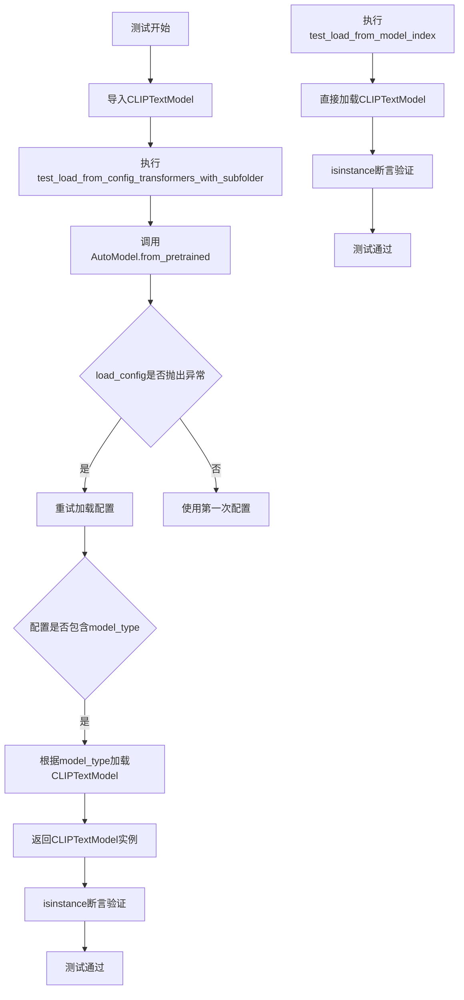
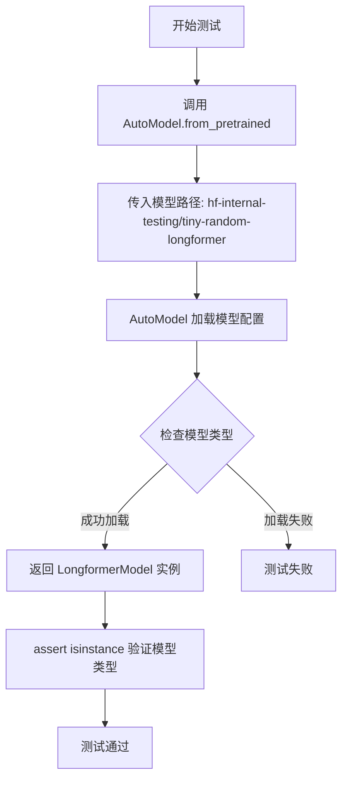
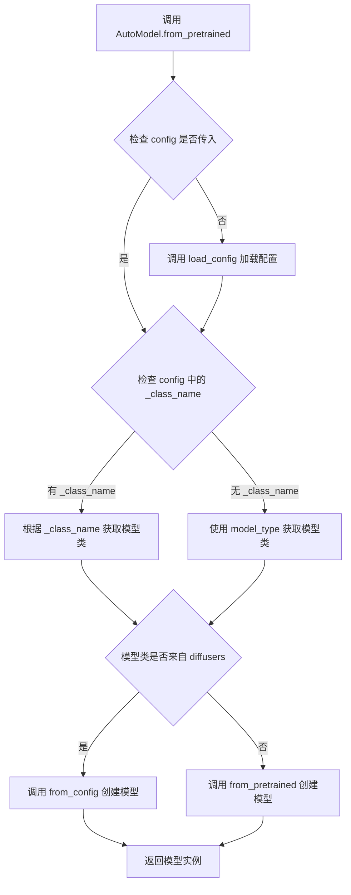
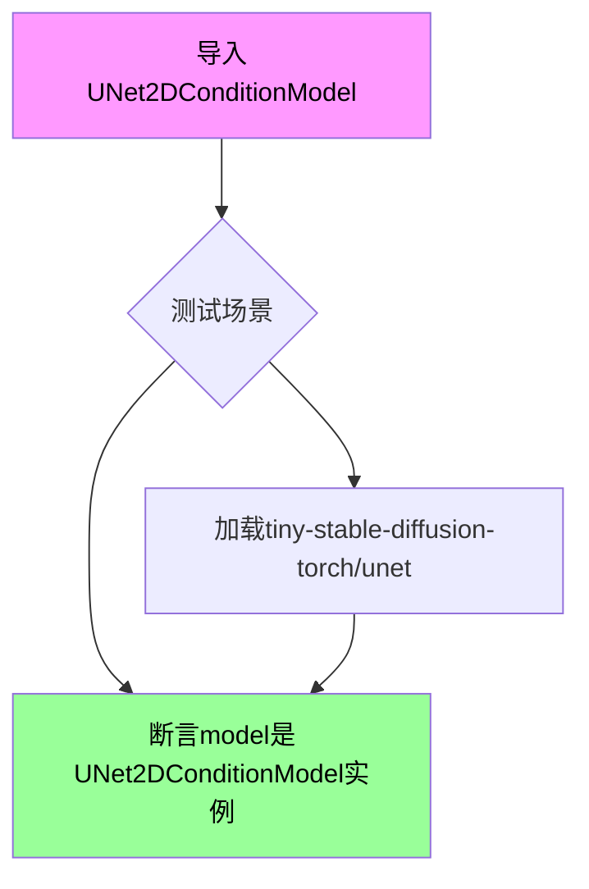
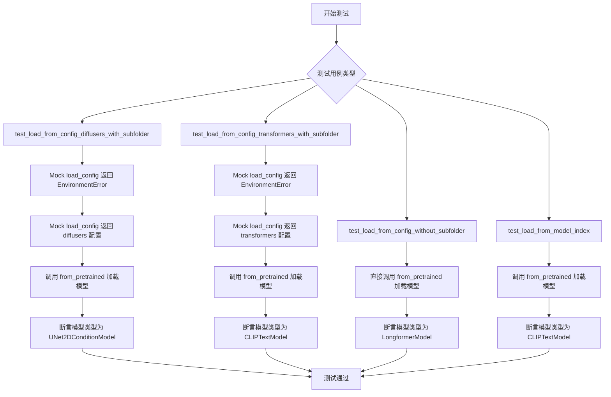
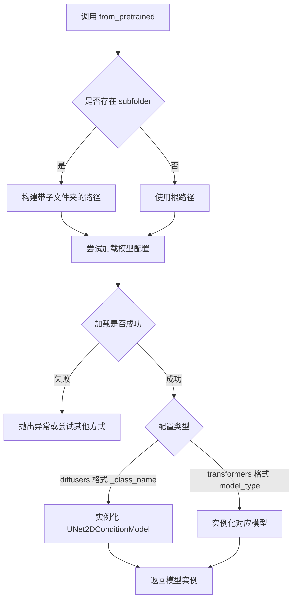
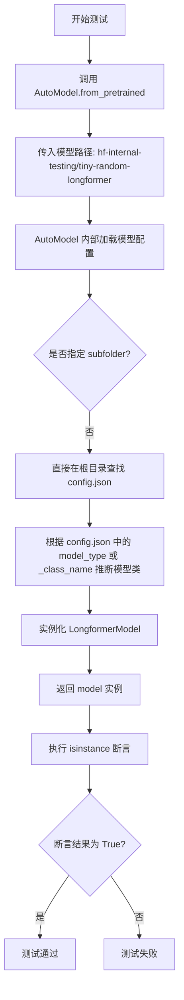
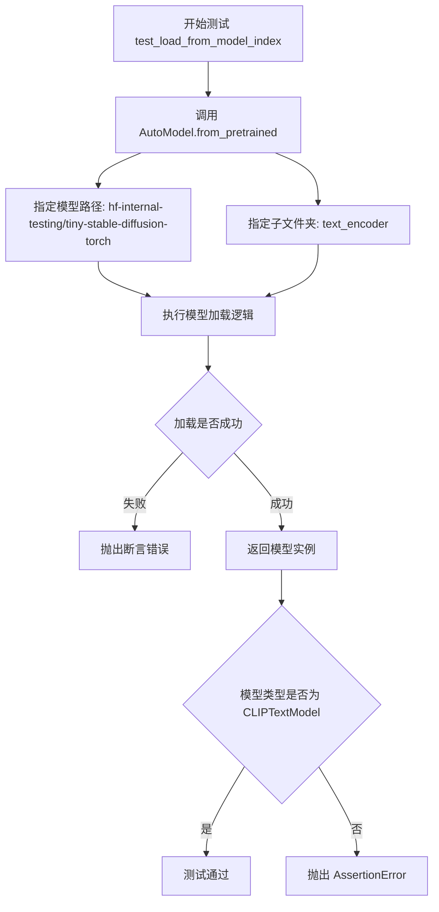

# `diffusers\tests\models\test_models_auto.py` 详细设计文档

这是一个测试AutoModel自动模型加载功能的单元测试文件，通过模拟不同的配置加载场景，验证AutoModel能够正确识别并加载diffusers和transformers库中的各种模型，包括UNet2DConditionModel、CLIPTextModel和LongformerModel。

## 整体流程

```mermaid
graph TD
    A[开始测试] --> B{测试用例}
    B --> C[test_load_from_config_diffusers_with_subfolder]
    C --> C1[模拟load_config抛出EnvironmentError]
    C1 --> C2[返回配置{"_class_name": "UNet2DConditionModel"}]
    C2 --> C3[调用AutoModel.from_pretrained]
    C3 --> C4[验证模型类型为UNet2DConditionModel]
    B --> D[test_load_from_config_transformers_with_subfolder]
    D --> D1[模拟load_config抛出EnvironmentError]
D1 --> D2[返回配置{"model_type": "clip_text_model"}]
    D2 --> D3[调用AutoModel.from_pretrained]
    D3 --> D4[验证模型类型为CLIPTextModel]
    B --> E[test_load_from_config_without_subfolder]
    E --> E1[调用AutoModel.from_pretrained加载LongformerModel]
    E1 --> E2[验证模型类型为LongformerModel]
    B --> F[test_load_from_model_index]
    F --> F1[调用AutoModel.from_pretrained加载text_encoder]
    F1 --> F2[验证模型类型为CLIPTextModel]
```

## 类结构

```
TestAutoModel (unittest.TestCase)
├── test_load_from_config_diffusers_with_subfolder
├── test_load_from_config_transformers_with_subfolder
├── test_load_from_config_without_subfolder
└── test_load_from_model_index
```

## 全局变量及字段


### `unittest`
    
Python标准库单元测试框架

类型：`module`
    


### `unittest.mock.patch`
    
用于模拟和mock测试的模块

类型：`module`
    


### `CLIPTextModel`
    
来自transformers的CLIP文本编码器模型类

类型：`class`
    


### `LongformerModel`
    
来自transformers的长序列注意力模型类

类型：`class`
    


### `AutoModel`
    
来自diffusers的自动模型加载工具类

类型：`class`
    


### `UNet2DConditionModel`
    
来自diffusers的2D条件UNet模型类

类型：`class`
    


### `TestAutoModel.test_load_from_config_diffusers_with_subfolder`
    
测试从diffusers加载带subfolder配置文件的模型

类型：`method`
    


### `TestAutoModel.test_load_from_config_transformers_with_subfolder`
    
测试从transformers加载带subfolder配置文件的模型

类型：`method`
    


### `TestAutoModel.test_load_from_config_without_subfolder`
    
测试不带subfolder直接加载预训练模型

类型：`method`
    


### `TestAutoModel.test_load_from_model_index`
    
测试从model_index.json加载模型配置

类型：`method`
    
    

## 全局函数及方法


### `CLIPTextModel`

CLIPTextModel 是从 Hugging Face Transformers 库导入的文本编码模型类，用于将文本转换为嵌入向量，在本代码中作为类型断言的目标类，用于验证 AutoModel.from_pretrained 方法能否正确加载 CLIP 文本模型。

#### 流程图



#### 带注释源码

```python
# 从transformers库导入CLIPTextModel类，用于文本编码
from transformers import CLIPTextModel, LongformerModel

# 测试用例：测试从transformers库加载带子文件夹的CLIPTextModel
@patch(
    "diffusers.models.AutoModel.load_config",
    side_effect=[EnvironmentError("File not found"), {"model_type": "clip_text_model"}],
)
def test_load_from_config_transformers_with_subfolder(self, mock_load_config):
    """
    测试AutoModel能否根据配置中的model_type正确加载CLIPTextModel
    
    模拟场景：
    1. 首次加载配置失败（抛出EnvironmentError）
    2. 重试时返回包含model_type的配置字典
    """
    # 使用AutoModel从预训练路径加载文本编码器
    model = AutoModel.from_pretrained(
        "hf-internal-testing/tiny-stable-diffusion-torch", 
        subfolder="text_encoder"
    )
    # 断言加载的模型是CLIPTextModel类型
    assert isinstance(model, CLIPTextModel)

def test_load_from_model_index(self):
    """
    测试从模型索引直接加载CLIPTextModel
    
    此测试不模拟load_config，直接从预训练路径加载
    """
    # 从text_encoder子文件夹加载模型
    model = AutoModel.from_pretrained(
        "hf-internal-testing/tiny-stable-diffusion-torch", 
        subfolder="text_encoder"
    )
    # 验证返回的模型是CLIPTextModel实例
    assert isinstance(model, CLIPTextModel)
```


### `TestAutoModel.test_load_from_config_without_subfolder`

该方法为 `TestAutoModel` 类的测试用例，用于验证 AutoModel 能够在没有子文件夹的情况下正确加载 LongformerModel 类型的预训练模型。

参数：无

返回值：无（此方法为测试用例，使用 assert 断言验证模型类型）

#### 流程图



#### 带注释源码

```python
def test_load_from_config_without_subfolder(self):
    """
    测试 AutoModel 在没有指定子文件夹的情况下能否正确加载 LongformerModel。
    此测试用例验证了动态模型加载机制能够识别并实例化 Longformer 模型类型。
    """
    # 调用 AutoModel.from_pretrained 加载预训练的 Longformer 模型
    # 模型路径为 HuggingFace Hub 上的测试用小型随机 Longformer 模型
    model = AutoModel.from_pretrained("hf-internal-testing/tiny-random-longformer")
    
    # 断言验证返回的模型确实是 LongformerModel 类型的实例
    # 用于确认 AutoModel 能够根据模型配置正确推断并加载对应的模型类
    assert isinstance(model, LongformerModel)
```

---

### `LongformerModel`（导入的模型类）

从 `transformers` 库导入的模型类，用于处理长序列文本的 Transformer 架构。

#### 相关信息

- **类型**：类（来自 HuggingFace Transformers 库）
- **用途**：在此测试代码中作为期望的模型类型被验证
- **上下文**：作为 AutoModel 动态加载机制的目标模型类型之一
- **设计目标**：验证 AutoModel 能够根据预训练模型的配置信息正确识别并实例化 LongformerModel

#### 潜在技术债务与优化空间

1. **测试覆盖度**：当前测试仅验证了模型类型是否为 LongformerModel，建议增加对模型实际功能性的验证
2. **硬编码模型路径**：测试使用了硬编码的模型路径 "hf-internal-testing/tiny-random-longformer"，可以考虑参数化或使用 fixture
3. **异常处理缺失**：测试未覆盖加载失败场景的异常处理

#### 外部依赖与接口契约

- **依赖**：`transformers` 库中的 `LongformerModel` 类
- **依赖**：`diffusers` 库中的 `AutoModel` 类
- **接口**：通过 `AutoModel.from_pretrained()` 方法加载模型，接收 pretrained_model_name_or_path 参数


### `AutoModel`

AutoModel 是一个动态模型加载类，能够根据预训练模型的配置文件自动推断并实例化相应的模型类型。它支持从 Hugging Face Hub 或本地路径加载模型，并可处理不同的模型子文件夹。

参数：

-  `pretrained_model_name_or_path`：`str`，预训练模型的名称或路径，可以是 Hugging Face Hub 上的模型 ID 或本地目录路径
-  `subfolder`：`str`（可选），模型在仓库中的子文件夹路径，默认为空字符串
-  `config`：`PretrainedConfig`（可选），预训练配置对象，如果为 None 则从 pretrained_model_name_or_path 加载
-  `cache_dir`：`str`（可选），缓存目录路径
-  `force_download`：`bool`（可选），是否强制重新下载模型，默认为 False
-  `resume_download`：`bool`（可选），是否恢复中断的下载，默认为 False
-  `proxies`：`dict`（可选），代理服务器配置
-  `revision`：`str`（可选），模型版本分支或提交哈希
-  `torch_dtype`：`torch.dtype`（可选），模型的数据类型
-  `device_map`：`str` 或 `dict`（可选），设备映射策略
-  `max_memory`：`dict`（可选），每个设备的最大内存配置
-  `offload_folder`：`str`（可选），权重卸载文件夹
-  `offload_state_dict`：`bool`（可选），是否将状态字典卸载到 CPU
-  `low_cpu_mem_usage`：`bool`（可选），是否降低 CPU 内存使用
-  `use_safetensors`：`bool`（可选），是否使用 safetensors 格式
-  `variant`：`str`（可选），模型变体（如 "fp16"）
-  `kwargs`：其他可选参数

返回值：`PreTrainedModel`，返回加载后的模型实例，具体类型取决于配置文件中的模型类型（如 UNet2DConditionModel、CLIPTextModel、LongformerModel 等）

#### 流程图



#### 带注释源码

```
# 注意：以下源码为根据测试用例和常见模式推断的 AutoModel 类实现
# 实际实现可能有所不同

class AutoModel:
    """
    AutoModel 类用于自动根据配置加载预训练模型。
    支持从 Hugging Face Hub 或本地路径加载，并自动推断模型类型。
    """
    
    @classmethod
    def from_pretrained(cls, pretrained_model_name_or_path, *args, **kwargs):
        """
        从预训练模型路径或 Hub ID 加载模型。
        
        参数:
            pretrained_model_name_or_path: 模型路径或 Hub ID
            subfolder: 模型子文件夹（可选）
            config: 预训练配置对象（可选）
            ...
        
        返回:
            加载后的模型实例
        """
        # 1. 尝试加载配置文件
        config = kwargs.get('config')
        if config is None:
            # 调用 load_config 加载配置
            try:
                config = cls.load_config(
                    pretrained_model_name_or_path,
                    subfolder=kwargs.get('subfolder', ''),
                    cache_dir=kwargs.get('cache_dir'),
                    force_download=kwargs.get('force_download', False),
                    resume_download=kwargs.get('resume_download', False),
                    proxies=kwargs.get('proxies'),
                    revision=kwargs.get('revision'),
                    local_files_only=kwargs.get('local_files_only', False),
                )
            except EnvironmentError as e:
                # 如果加载失败，可能需要从 model_index.json 获取信息
                # 这里的逻辑根据测试用例推断
                pass
        
        # 2. 根据配置获取模型类
        # 优先使用 _class_name（diffusers 模型）
        if '_class_name' in config:
            model_class = cls._get_model_from_config(config, 'diffusers')
        # 否则使用 model_type（transformers 模型）
        elif 'model_type' in config:
            model_class = cls._get_model_from_config(config, 'transformers')
        
        # 3. 创建模型实例
        if model_class in cls._diffusers_model_classes:
            # 对于 diffusers 模型，使用 from_config
            model = model_class.from_config(config, **kwargs)
        else:
            # 对于 transformers 模型，使用 from_pretrained
            model = model_class.from_pretrained(pretrained_model_name_or_path, *args, **kwargs)
        
        return model
    
    @classmethod
    def load_config(cls, pretrained_model_name_or_path, **kwargs):
        """
        加载模型的配置文件。
        
        参数:
            pretrained_model_name_or_path: 模型路径或 Hub ID
            **kwargs: 其他加载选项
        
        返回:
            配置字典
        """
        # 实际实现会从 config.json 或 model_index.json 加载配置
        pass
    
    @staticmethod
    def _get_model_from_config(config, library):
        """
        根据配置获取模型类。
        
        参数:
            config: 配置字典
            library: 模型库 ('diffusers' 或 'transformers')
        
        返回:
            模型类
        """
        # 实际实现会根据配置中的 _class_name 或 model_type
        # 从对应的模型注册表中获取模型类
        pass
```


### `UNet2DConditionModel`

该类是diffusers库中用于条件图像生成（Conditional Image Generation）的U-Net模型，主要应用于Stable Diffusion等文生图（Text-to-Image）模型中，通过接收条件embedding（如文本编码）来生成对应的图像。

参数：

- 该类在代码中仅为导入使用，未展示具体构造函数参数

返回值：`UNet2DConditionModel` 类型对象

#### 流程图



#### 带注释源码

```python
# 从diffusers.models模块导入UNet2DConditionModel类
# 这是一个条件二维U-Net模型，常用于Stable Diffusion等扩散模型
from diffusers.models import AutoModel, UNet2DConditionModel

# 在测试中使用：验证从预训练模型加载的模型类型是否为UNet2DConditionModel
model = AutoModel.from_pretrained(
    "hf-internal-testing/tiny-stable-diffusion-torch",  # HuggingFace模型ID
    subfolder="unet"  # 指定加载unet子文件夹中的模型
)
# 断言加载的模型是UNet2DConditionModel的实例
assert isinstance(model, UNet2DConditionModel)
```

---

**说明**：提供的代码是一个测试文件，`UNet2DConditionModel` 仅为导入的外部类，未在代码中定义。其完整实现位于 `diffusers` 库中，属于条件扩散模型的U-Net核心组件，用于接收文本/图像条件并生成目标图像。


### TestAutoModel

这是 `diffusers` 库中的一个测试类，用于验证 `AutoModel` 类的模型加载功能，包括从不同来源（diffusers/transformers）和不同配置方式（带/不带子文件夹）加载模型的正确性。

参数：

- 无（该类继承自 `unittest.TestCase`）

返回值：无

#### 流程图



#### 带注释源码

```python
import unittest
# 导入 unittest 模块，用于创建单元测试
from unittest.mock import patch
# 导入 patch 装饰器，用于模拟函数行为

from transformers import CLIPTextModel, LongformerModel
# 从 transformers 库导入 CLIPTextModel 和 LongformerModel，用于模型类型断言

from diffusers.models import AutoModel, UNet2DConditionModel
# 从 diffusers.models 导入 AutoModel 和 UNet2DConditionModel


class TestAutoModel(unittest.TestCase):
    # 测试 AutoModel 类的加载功能
    
    @patch(
        # 使用 patch 装饰器模拟 diffusers.models.AutoModel.load_config 方法
        "diffusers.models.AutoModel.load_config",
        # 模拟目标：AutoModel 的 load_config 方法
        side_effect=[EnvironmentError("File not found"), {"_class_name": "UNet2DConditionModel"}],
        # 第一次调用抛出异常，第二次返回 diffusers 格式配置
    )
    def test_load_from_config_diffusers_with_subfolder(self, mock_load_config):
        # 测试从 diffusers 配置加载模型（带子文件夹）
        model = AutoModel.from_pretrained(
            # 调用 from_pretrained 方法加载预训练模型
            "hf-internal-testing/tiny-stable-diffusion-torch",
            # HuggingFace 模型 ID
            subfolder="unet"
            # 指定子文件夹路径
        )
        assert isinstance(model, UNet2DConditionModel)
        # 断言加载的模型是 UNet2DConditionModel 类型

    @patch(
        "diffusers.models.AutoModel.load_config",
        side_effect=[EnvironmentError("File not found"), {"model_type": "clip_text_model"}],
        # 第一次调用抛出异常，第二次返回 transformers 格式配置
    )
    def test_load_from_config_transformers_with_subfolder(self, mock_load_config):
        # 测试从 transformers 配置加载模型（带子文件夹）
        model = AutoModel.from_pretrained(
            "hf-internal-testing/tiny-stable-diffusion-torch",
            subfolder="text_encoder"
        )
        assert isinstance(model, CLIPTextModel)
        # 断言加载的模型是 CLIPTextModel 类型

    def test_load_from_config_without_subfolder(self):
        # 测试不带子文件夹的配置加载
        model = AutoModel.from_pretrained(
            "hf-internal-testing/tiny-random-longformer"
            # 使用 Longformer 模型进行测试
        )
        assert isinstance(model, LongformerModel)
        # 断言加载的模型是 LongformerModel 类型

    def test_load_from_model_index(self):
        # 测试从模型索引加载模型
        model = AutoModel.from_pretrained(
            "hf-internal-testing/tiny-stable-diffusion-torch",
            subfolder="text_encoder"
        )
        assert isinstance(model, CLIPTextModel)
        # 断言加载的模型是 CLIPTextModel 类型
```

---

### AutoModel.from_pretrained

根据代码中的调用，`from_pretrained` 是 `AutoModel` 类的类方法，用于从预训练模型路径加载模型。

参数：

- `pretrained_model_name_or_path`：`str`，HuggingFace 模型 ID 或本地路径
- `subfolder`：`str`（可选），模型文件所在的子文件夹路径
- `**kwargs`：其他可选参数

返回值：返回对应的模型实例（`UNet2DConditionModel`/`CLIPTextModel`/`LongformerModel` 等）

#### 流程图



#### 带注释源码

```python
# 以下为推断的 AutoModel.from_pretrained 方法逻辑（基于测试用例）
def from_pretrained(cls, pretrained_model_name_or_path, subfolder=None, **kwargs):
    """
    从预训练模型加载模型实例
    
    参数:
        pretrained_model_name_or_path: 模型 ID 或路径
        subfolder: 子文件夹路径
        **kwargs: 其他参数
    """
    # 1. 构建模型路径
    if subfolder:
        model_path = f"{pretrained_model_name_or_path}/{subfolder}"
    else:
        model_path = pretrained_model_name_or_path
    
    # 2. 尝试加载配置
    try:
        config = cls.load_config(model_path)
    except EnvironmentError:
        # 如果加载失败，可能需要从其他位置加载配置
        config = cls.load_config(pretrained_model_name_or_path)
    
    # 3. 根据配置类型确定模型类
    if "_class_name" in config:
        # diffusers 格式配置
        class_name = config["_class_name"]
        model_class = get_model_class(class_name)
    elif "model_type" in config:
        # transformers 格式配置
        model_type = config["model_type"]
        model_class = get_model_class_from_transformers(model_type)
    
    # 4. 实例化并返回模型
    return model_class.from_pretrained(pretrained_model_name_or_path, subfolder=subfolder)
```


### `EnvironmentError`（在测试代码上下文中）

`EnvironmentError` 在本测试代码中用作 `side_effect` 参数，用于模拟配置文件加载失败的情况，以测试 `AutoModel.from_pretrained` 方法的容错机制和配置回退逻辑。

参数：

- `message`：`str`，错误消息内容，这里为 `"File not found"`

返回值：无（`EnvironmentError` 为异常类型，被抛出而非返回）

#### 流程图

```mermaid
graph TD
    A[测试开始] --> B[模拟 load_config 抛出 EnvironmentError]
    B --> C{测试场景}
    
    C -->|diffusers subfolder| D[第一次抛出 EnvironmentError]
    D --> E[第二次返回 {'_class_name': 'UNet2DConditionModel'}]
    E --> F[验证 model 为 UNet2DConditionModel 实例]
    
    C -->|transformers subfolder| G[第一次抛出 EnvironmentError]
    G --> H[第二次返回 {'model_type': 'clip_text_model'}]
    H --> I[验证 model 为 CLIPTextModel 实例]
    
    F --> J[测试通过]
    I --> J
```

#### 带注释源码

```python
@patch(
    "diffusers.models.AutoModel.load_config",
    # 模拟环境错误：首次调用时抛出 EnvironmentError，第二次调用时返回正常配置
    side_effect=[EnvironmentError("File not found"), {"_class_name": "UNet2DConditionModel"}],
)
def test_load_from_config_diffusers_with_subfolder(self, mock_load_config):
    """测试从 diffusers 配置加载模型（当配置文件不存在时的回退机制）"""
    model = AutoModel.from_pretrained(
        "hf-internal-testing/tiny-stable-diffusion-torch",
        subfolder="unet"
    )
    # 验证 AutoModel 正确处理了 EnvironmentError 并成功加载了 UNet2DConditionModel
    assert isinstance(model, UNet2DConditionModel)

@patch(
    "diffusers.models.AutoModel.load_config",
    # 模拟环境错误：首次调用时抛出 EnvironmentError，第二次调用时返回 transformers 配置
    side_effect=[EnvironmentError("File not found"), {"model_type": "clip_text_model"}],
)
def test_load_from_config_transformers_with_subfolder(self, mock_load_config):
    """测试从 transformers 配置加载模型（配置文件缺失时的回退逻辑）"""
    model = AutoModel.from_pretrained(
        "hf-internal-testing/tiny-stable-diffusion-torch",
        subfolder="text_encoder"
    )
    # 验证 AutoModel 正确处理了 EnvironmentError 并成功加载了 CLIPTextModel
    assert isinstance(model, CLIPTextModel)
```


### `TestAutoModel.test_load_from_config_diffusers_with_subfolder`

该测试方法验证了 `AutoModel.from_pretrained` 能够通过 `subfolder` 参数从 diffusers 模型的子文件夹中加载 `UNet2DConditionModel` 模型。测试使用 `@patch` 装饰器模拟 `AutoModel.load_config` 方法的行为：首先抛出 `EnvironmentError`（模拟配置文件未找到），然后返回包含 `_class_name` 为 "UNet2DConditionModel" 的配置字典，最后验证加载的模型确实是 `UNet2DConditionModel` 类的实例。

参数：

- `self`：`TestAutoModel`，测试类的实例方法必选参数，代表当前测试类的实例
- `mock_load_config`：`MagicMock`，由 `@patch` 装饰器自动注入的模拟对象，用于替换 `diffusers.models.AutoModel.load_config` 方法的行为

返回值：`None`（测试方法无显式返回值，通过 `assert` 断言验证模型类型）

#### 流程图

```mermaid
flowchart TD
    A[开始执行 test_load_from_config_diffusers_with_subfolder] --> B[调用 AutoModel.from_pretrained]
    B --> C[传入参数: pretrained_model_name=hfinternal-testing/tiny-stable-diffusion-torch, subfolder=unet]
    C --> D[内部调用 AutoModel.load_config 加载配置]
    D --> E{mock_load_config 被触发}
    E --> F[第一次调用: 抛出 EnvironmentError File not found]
    F --> G[第二次调用: 返回配置 {_class_name: UNet2DConditionModel}]
    G --> H[根据 _class_name 获取类名 UNet2DConditionModel]
    H --> I[实例化 UNet2DConditionModel 模型]
    I --> J{assert isinstance 检查}
    J -->|通过| K[测试通过]
    J -->|失败| L[测试失败]
```

#### 带注释源码

```python
@patch(
    "diffusers.models.AutoModel.load_config",
    side_effect=[EnvironmentError("File not found"), {"_class_name": "UNet2DConditionModel"}],
)
def test_load_from_config_diffusers_with_subfolder(self, mock_load_config):
    """
    测试 AutoModel.from_pretrained 能够从 diffusers 子文件夹加载 UNet2DConditionModel
    
    测试流程:
    1. 使用 @patch 装饰器模拟 load_config 方法
    2. side_effect 定义了两次调用的返回值:
       - 第一次: 抛出 EnvironmentError 模拟配置文件未找到
       - 第二次: 返回包含 _class_name 的配置字典
    3. 调用 from_pretrained 时指定 subfolder='unet'
    4. 验证返回的模型是 UNet2DConditionModel 实例
    """
    # 调用 AutoModel.from_pretrained 方法加载模型
    # 参数:
    #   - pretrained_model_name: "hf-internal-testing/tiny-stable-diffusion-torch"
    #   - subfolder: "unet" 指定从模型的 unet 子目录加载
    model = AutoModel.from_pretrained("hf-internal-testing/tiny-stable-diffusion-torch", subfolder="unet")
    
    # 断言验证加载的模型是 UNet2DConditionModel 类的实例
    # 如果 model 不是 UNet2DConditionModel 实例，测试将失败
    assert isinstance(model, UNet2DConditionModel)
```


### `TestAutoModel.test_load_from_config_transformers_with_subfolder`

这是一个单元测试方法，用于验证 `AutoModel.from_pretrained` 能够正确处理带有子文件夹的 transformers 库模型配置，并在配置加载失败后回退到从 model_type 字段加载模型。

参数：

- `self`：`TestCase`，测试类实例的隐含参数
- `mock_load_config`：`unittest.mock.MagicMock`，用于模拟 `diffusers.models.AutoModel.load_config` 方法的返回值

返回值：`None`，此方法为测试方法，通过 assert 断言验证模型类型，不返回任何值

#### 流程图

```mermaid
flowchart TD
    A[测试开始] --> B[装饰器第一次调用 load_config]
    B --> C{是否抛出异常?}
    C -->|是| D[装饰器第二次调用 load_config]
    C -->|否| E[使用第一次返回值]
    D --> F[返回 {"model_type": "clip_text_model"}]
    E --> G[使用第一次返回值]
    F --> H[调用 AutoModel.from_pretrained]
    G --> H
    H --> I[传入参数: model_path, subfolder=text_encoder]
    I --> J{断言结果}
    J -->|成功| K[测试通过]
    J -->|失败| L[测试失败]
    K --> M[测试结束]
    L --> M
```

#### 带注释源码

```python
@patch(
    "diffusers.models.AutoModel.load_config",
    # 模拟 load_config 方法的返回值：
    # 第一次调用抛出 EnvironmentError("File not found")
    # 第二次调用返回模型类型映射字典
    side_effect=[EnvironmentError("File not found"), {"model_type": "clip_text_model"}],
)
def test_load_from_config_transformers_with_subfolder(self, mock_load_config):
    """
    测试 AutoModel 从 transformers 库加载带子文件夹的模型配置。
    
    测试流程：
    1. 模拟 load_config 第一次调用失败（文件未找到）
    2. 模拟 load_config 第二次调用返回 model_type
    3. 调用 from_pretrained 加载模型
    4. 断言返回的模型是 CLIPTextModel 类型
    """
    # 调用 AutoModel.from_pretrained 方法加载 text_encoder 子文件夹中的模型
    # 参数:
    #   - "hf-internal-testing/tiny-stable-diffusion-torch": HuggingFace 模型仓库 ID
    #   - subfolder="text_encoder": 指定从 text_encoder 子文件夹加载
    model = AutoModel.from_pretrained("hf-internal-testing/tiny-stable-diffusion-torch", subfolder="text_encoder")
    
    # 断言验证返回的模型实例是 CLIPTextModel 类型
    assert isinstance(model, CLIPTextModel)
```


### TestAutoModel.test_load_from_config_without_subfolder

该测试方法用于验证 AutoModel 在不指定 subfolder 参数时，能够正确从 HuggingFace Hub 加载预训练模型，并正确推断模型类型。

参数：
- 该方法无参数

返回值：`None`，无返回值（测试方法执行断言，不返回具体值）

#### 流程图



#### 带注释源码

```python
def test_load_from_config_without_subfolder(self):
    """
    测试 AutoModel 在不指定 subfolder 参数时能否正确加载模型
    
    测试场景：
    - 不提供 subfolder 参数
    - 使用 HuggingFace Hub 上的预训练模型路径
    - 验证模型类型推断正确
    """
    # 调用 AutoModel.from_pretrained 加载预训练模型
    # 路径: hf-internal-testing/tiny-random-longformer
    # 不指定 subfolder 参数，意味着在模型根目录查找 config.json
    model = AutoModel.from_pretrained("hf-internal-testing/tiny-random-longformer")
    
    # 断言加载的模型是 LongformerModel 类型
    # 验证 AutoModel 正确根据 config.json 中的 model_type 推断出模型类
    assert isinstance(model, LongformerModel)
```


### `TestAutoModel.test_load_from_model_index`

该测试方法用于验证 `AutoModel` 能够根据模型索引（model index）正确加载预训练模型，通过 `subfolder` 参数指定子文件夹并实例化正确类型的模型（CLIPTextModel）。

参数：

- 该测试方法无自定义参数（隐含参数 `self` 为 unittest.TestCase 实例）

返回值：无返回值（`None`），该方法为测试方法，通过断言验证模型类型

#### 流程图



#### 带注释源码

```python
def test_load_from_model_index(self):
    """
    测试 AutoModel.from_pretrained 能够通过 model_index 正确加载模型
    
    该测试方法验证：
    1. 能够从预训练路径加载模型
    2. 通过 subfolder 参数定位到正确的模型配置
    3. 实例化正确类型的模型（CLIPTextModel）
    """
    # 调用 AutoModel 的类方法 from_pretrained 加载预训练模型
    # 参数 "hf-internal-testing/tiny-stable-diffusion-torch" 为 HuggingFace Hub 上的模型ID
    # 参数 subfolder="text_encoder" 指定加载 text_encoder 子文件夹中的配置
    model = AutoModel.from_pretrained(
        "hf-internal-testing/tiny-stable-diffusion-torch", 
        subfolder="text_encoder"
    )
    
    # 断言验证加载的模型是 CLIPTextModel 类型
    # 这是对 model_index 功能的核心验证：确保根据配置加载了正确类型的模型
    assert isinstance(model, CLIPTextModel)
```

## 关键组件


### AutoModel 自动模型加载器

负责根据配置信息自动加载不同类型的预训练模型，支持从diffusers和transformers生态系统中加载模型。

### from_pretrained 预训练模型加载方法

从指定路径加载预训练模型，支持子文件夹指定和多种模型类型（UNet2DConditionModel、CLIPTextModel、LongformerModel）的自动识别与加载。

### load_config 配置加载函数

模拟从不同来源加载模型配置的过程，支持环境错误处理和配置字典的回退机制。

### 模型类型映射与自动识别

根据配置文件中的`_class_name`或`model_type`字段自动推断并实例化对应的模型类。

### 子文件夹模型加载机制

支持通过`subfolder`参数加载嵌套在子目录中的模型，如unet和text_encoder等组件。

### 测试覆盖场景

包含四个测试用例：diffusers配置加载、transformers配置加载、无子文件夹加载、model_index加载，覆盖自动模型加载的主要场景。


## 问题及建议


### 已知问题

- **外部依赖未完全隔离**：test_load_from_config_without_subfolder 和 test_load_from_model_index 两个测试方法直接使用真实的 HuggingFace 模型名称（hf-internal-testing/tiny-stable-diffusion-torch、hf-internal-testing/tiny-random-longformer），没有使用 mock，会产生真实的网络请求，导致测试执行慢且依赖外部服务可用性
- **Mock 参数未充分利用**：测试方法签名中的 mock_load_config 参数仅用于注入 mock 对象，但未验证 mock 方法的实际调用次数、参数或调用顺序
- **测试覆盖不完整**：缺少对边界情况的测试，如网络超时、配置解析错误、模型类型不匹配、全部 mock 失败时的降级逻辑等场景
- **断言信息不足**：仅使用 isinstance 进行类型断言，未验证返回模型的配置属性、权重加载状态或其他关键状态
- **Mock 行为与真实场景可能不符**：side_effect 中直接抛出 EnvironmentError 模拟文件不存在，但实际应用中可能遇到权限问题、磁盘空间不足、配置文件损坏等其他 IO 异常

### 优化建议

- 为所有涉及外部资源加载的测试统一添加 mock，避免网络请求；对于必须使用真实模型的场景，考虑使用 pytest fixture 或 setup_class 预下载并缓存模型
- 增强 mock 验证：使用 mock_load_config.assert_called_once() 或 assert_called_with() 验证调用参数，确保测试意图与实现一致
- 增加负面测试用例：模拟配置文件格式错误、模型类型不支持、显存不足等异常场景，验证 AutoModel 的错误处理逻辑
- 丰富断言内容：除类型检查外，增加对模型配置关键字段（如 hidden_size、num_layers）的验证，以及模型可调用性、参数形状的检查
- 统一异常处理方式：定义明确的异常类型映射表，将不同 IO 异常转换为统一的内部异常，便于上层调用方处理

## 其它


### 一段话描述

该代码是diffusers库中AutoModel类的单元测试文件，验证了AutoModel.from_pretrained方法能够根据配置文件动态加载不同类型的模型（包括UNet2DConditionModel、CLIPTextModel、LongformerModel），并支持通过subfolder参数加载子目录中的模型配置。

### 文件的整体运行流程

该测试文件通过unittest框架运行，包含四个测试用例。测试流程如下：首先通过@patch装饰器模拟AutoModel.load_config方法的返回值，模拟不同的配置场景；然后调用AutoModel.from_pretrained方法加载预训练模型；最后使用assert断言验证加载的模型类型是否符合预期。

### 类的详细信息

#### TestAutoModel类

**类字段：**
无类字段定义。

**类方法：**

1. **test_load_from_config_diffusers_with_subfolder**
   - 参数：mock_load_config (Mock对象，模拟load_config方法的返回值)
   - 返回值类型：None
   - 返回值描述：该测试方法无返回值，通过assert语句验证模型类型
   - 流程图：
   ```mermaid
   flowchart TD
       A[开始测试] --> B[模拟load_config返回EnvironmentError]
       B --> C[模拟load_config返回UNet2DConditionModel配置]
       C --> D[调用AutoModel.from_pretrained]
       D --> E[断言模型是UNet2DConditionModel类型]
       E --> F[结束测试]
   ```
   - 源码：
   ```python
   @patch(
       "diffusers.models.AutoModel.load_config",
       side_effect=[EnvironmentError("File not found"), {"_class_name": "UNet2DConditionModel"}],
   )
   def test_load_from_config_diffusers_with_subfolder(self, mock_load_config):
       model = AutoModel.from_pretrained("hf-internal-testing/tiny-stable-diffusion-torch", subfolder="unet")
       assert isinstance(model, UNet2DConditionModel)
   ```

2. **test_load_from_config_transformers_with_subfolder**
   - 参数：mock_load_config (Mock对象，模拟load_config方法的返回值)
   - 返回值类型：None
   - 返回值描述：该测试方法无返回值，通过assert语句验证模型类型
   - 流程图：
   ```mermaid
   flowchart TD
       A[开始测试] --> B[模拟load_config返回EnvironmentError]
       B --> C[模拟load_config返回clip_text_model配置]
       C --> D[调用AutoModel.from_pretrained]
       D --> E[断言模型是CLIPTextModel类型]
       E --> F[结束测试]
   ```
   - 源码：
   ```python
   @patch(
       "diffusers.models.AutoModel.load_config",
       side_effect=[EnvironmentError("File not found"), {"model_type": "clip_text_model"}],
   )
   def test_load_from_config_transformers_with_subfolder(self, mock_load_config):
       model = AutoModel.from_pretrained("hf-internal-testing/tiny-stable-diffusion-torch", subfolder="text_encoder")
       assert isinstance(model, CLIPTextModel)
   ```

3. **test_load_from_config_without_subfolder**
   - 参数：无
   - 返回值类型：None
   - 返回值描述：该测试方法无返回值，通过assert语句验证模型类型
   - 流程图：
   ```mermaid
   flowchart TD
       A[开始测试] --> B[调用AutoModel.from_pretrained不指定subfolder]
       C[断言模型是LongformerModel类型] --> D[结束测试]
   ```
   - 源码：
   ```python
   def test_load_from_config_without_subfolder(self):
       model = AutoModel.from_pretrained("hf-internal-testing/tiny-random-longformer")
       assert isinstance(model, LongformerModel)
   ```

4. **test_load_from_model_index**
   - 参数：无
   - 返回值类型：None
   - 返回值描述：该测试方法无返回值，通过assert语句验证模型类型
   - 流程图：
   ```mermaid
   flowchart TD
       A[开始测试] --> B[调用AutoModel.from_pretrained加载text_encoder]
       C[断言模型是CLIPTextModel类型] --> D[结束测试]
   ```
   - 源码：
   ```python
   def test_load_from_model_index(self):
       model = AutoModel.from_pretrained("hf-internal-testing/tiny-stable-diffusion-torch", subfolder="text_encoder")
       assert isinstance(model, CLIPTextModel)
   ```

### 全局变量和全局函数信息

无全局变量和全局函数定义。

### 关键组件信息

1. **AutoModel.from_pretrained** - diffusers库中的自动模型加载器，根据配置动态加载不同类型的预训练模型
2. **unittest.TestCase** - Python标准库单元测试基类
3. **unittest.mock.patch** - 用于模拟函数行为，模拟配置加载失败和成功的场景
4. **transformers.CLIPTextModel** - Hugging Face transformers库中的CLIP文本编码器模型
5. **transformers.LongformerModel** - Hugging Face transformers库中的Longformer模型
6. **diffusers.UNet2DConditionModel** - diffusers库中的UNet条件模型，用于扩散模型

### 设计目标与约束

**设计目标：**
验证AutoModel类能够正确识别并加载diffusers原生模型和transformers库模型，支持通过subfolder参数加载子目录配置，以及通过model_index.json自动推断模型类型。

**设计约束：**
测试依赖真实的预训练模型仓库"hf-internal-testing/tiny-stable-diffusion-torch"和"hf-internal-testing/tiny-random-longformer"，网络连接不可用时测试将失败。

### 错误处理与异常设计

测试用例中模拟了EnvironmentError异常场景，验证当首次加载配置失败时的错误处理机制。第一个测试用例模拟了配置文件不存在的情况，验证AutoModel能够回退到第二次尝试加载的配置。

### 数据流与状态机

测试数据流：Mock配置对象 → AutoModel.from_pretrained方法 → 模型类型推断 → 实例化对应模型类 → 返回模型对象。

### 外部依赖与接口契约

**外部依赖：**
- unittest框架
- unittest.mock模块
- transformers库（CLIPTextModel, LongformerModel）
- diffusers库（AutoModel, UNet2DConditionModel）

**接口契约：**
- AutoModel.from_pretrained(pretrained_model_name_or_path, subfolder=None, **kwargs) -> PreTrainedModel
- 返回值应为PreTrainedModel的子类实例

### 潜在的技术债务或优化空间

1. **测试隔离性问题** - 使用@patch装饰器修改全局模块状态，可能影响其他测试用例的执行顺序
2. **硬编码的模型仓库名称** - 测试依赖于特定的远程模型仓库，网络问题会导致测试失败
3. **缺少负向测试** - 未测试加载不存在的模型类型时的错误处理
4. **未测试所有模型类型** - 仅覆盖了三种模型类型，未覆盖完整的模型映射关系
5. **mock对象使用复杂度** - side_effect列表的顺序依赖性较强，代码可读性可提升

### 其它项目

**测试覆盖率建议：**
应增加对以下场景的测试：模型加载失败时的异常抛出、invalid subfolder参数的处理、cache目录的清理逻辑、以及多模型同时加载的场景。

**性能考虑：**
当前测试每次都需要调用from_pretrained方法，可以考虑使用pytest fixtures来复用模型实例以提高测试执行速度。

    