# `diffusers\tests\models\testing_utils\attention.py` 详细设计文档

这是一个用于测试diffusers库中注意力(Attention)模块和处理器功能的pytest测试mixin类。该类提供了对注意力处理器管理、QKV投影融合/解融、注意力后端(XFormers、NPU等)的测试功能，确保模型在融合前后输出保持一致，并验证处理器的获取、设置和数量匹配等操作。

## 整体流程

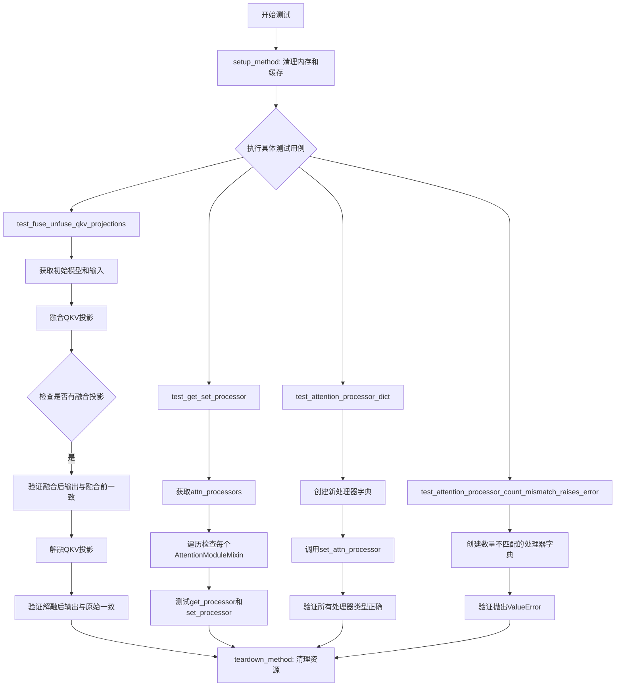
```mermaid
graph TD
    A[开始测试] --> B[setup_method: 清理内存和缓存]
    B --> C{执行具体测试用例}
    C --> D[test_fuse_unfuse_qkv_projections]
    C --> E[test_get_set_processor]
    C --> F[test_attention_processor_dict]
    C --> G[test_attention_processor_count_mismatch_raises_error]
    D --> D1[获取初始模型和输入]
    D1 --> D2[融合QKV投影]
    D2 --> D3{检查是否有融合投影}
D3 -- 是 --> D4[验证融合后输出与融合前一致]
    D4 --> D5[解融QKV投影]
    D5 --> D6[验证解融后输出与原始一致]
    D6 --> D7[teardown_method: 清理资源]
    E --> E1[获取attn_processors]
    E1 --> E2[遍历检查每个AttentionModuleMixin]
    E2 --> E3[测试get_processor和set_processor]
    E3 --> D7
    F --> F1[创建新处理器字典]
    F1 --> F2[调用set_attn_processor]
    F2 --> F3[验证所有处理器类型正确]
    F3 --> D7
    G --> G1[创建数量不匹配的处理器字典]
    G1 --> G2[验证抛出ValueError]
    G2 --> D7
```

## 类结构

```
AttentionTesterMixin (pytest测试mixin类)
├── 依赖: AttentionModuleMixin (抽象基类)
├── 依赖: AttnProcessor (具体处理器类)
└── 测试方法集
    ├── setup_method
    ├── teardown_method
    ├── test_fuse_unfuse_qkv_projections
    ├── test_get_set_processor
    ├── test_attention_processor_dict
    └── test_attention_processor_count_mismatch_raises_error
```

## 全局变量及字段


### `gc`
    
Python内置的垃圾回收模块，用于手动触发垃圾回收和内存管理

类型：`module`
    


### `pytest`
    
Python测试框架，用于编写和运行单元测试及测试夹具

类型：`module`
    


### `torch`
    
PyTorch深度学习库，提供张量计算和神经网络构建功能

类型：`module`
    


### `AttentionModuleMixin`
    
注意力模块混入类，提供QKV投影融合/解融合和注意力后端管理功能

类型：`class`
    


### `AttnProcessor`
    
注意力处理器基类，定义注意力计算的标准接口和实现

类型：`class`
    


### `assert_tensors_close`
    
测试工具函数，用于验证两个张量在指定容差范围内是否相等

类型：`function`
    


### `backend_empty_cache`
    
测试工具函数，用于清理后端（CUDA/NPU等）的内存缓存

类型：`function`
    


### `is_attention`
    
测试标记装饰器，用于标记需要注意力支持的测试用例并控制测试执行

类型：`function/decorator`
    


### `torch_device`
    
测试配置变量，指定当前测试使用的计算设备（CPU/CUDA/NPU等）

类型：`variable`
    


    

## 全局函数及方法


### `gc.collect`

Python 标准库的垃圾回收函数，用于强制进行垃圾回收，释放无法访问的 Python 对象占用的内存空间。在测试类中用于在每个测试方法执行前后清理内存，确保测试环境干净。

参数：该函数在代码中无参数调用（Python 的 `gc.collect()` 可接受可选的 `generation` 参数，但此代码未使用）

返回值：`int`，返回回收的对象数量（但在代码中未使用返回值）

#### 流程图

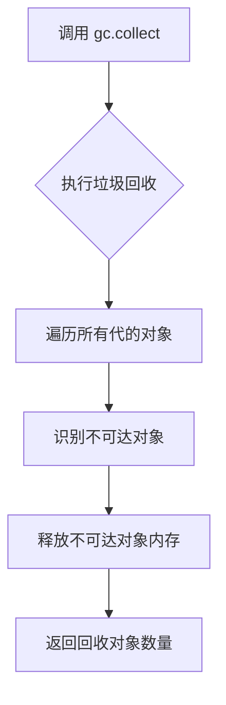
```mermaid
flowchart TD
    A[调用 gc.collect] --> B{执行垃圾回收}
    B --> C[遍历所有代的对象]
    C --> D[识别不可达对象]
    D --> E[释放不可达对象内存]
    E --> F[返回回收对象数量]
```

#### 带注释源码

```python
# 在 setup_method 中调用
def setup_method(self):
    gc.collect()  # 强制执行垃圾回收，清理之前测试可能遗留的内存对象
    backend_empty_cache(torch_device)  # 清理 GPU 缓存

def teardown_method(self):
    gc.collect()  # 清理当前测试产生的内存对象，确保不影响后续测试
    backend_empty_cache(torch_device)  # 清理 GPU 缓存
```

> **说明**：此函数是 Python 标准库函数，非本项目自定义代码。在本项目中作为测试环境清理的一部分使用，配合 `backend_empty_cache` 确保 GPU 内存和 Python 内存都被正确清理。


### `backend_empty_cache`

该函数是测试工具模块中的一个实用函数，用于清理后端（可能是 GPU/CPU）缓存，通常在测试setup和teardown阶段调用以确保测试环境的内存状态干净。

参数：

- `device`：`str`，表示目标设备标识符（如 `"cuda"`、`"cpu"` 等），用于指定要清理缓存的设备。

返回值：`None`，该函数执行清理操作后不返回任何值。

#### 流程图

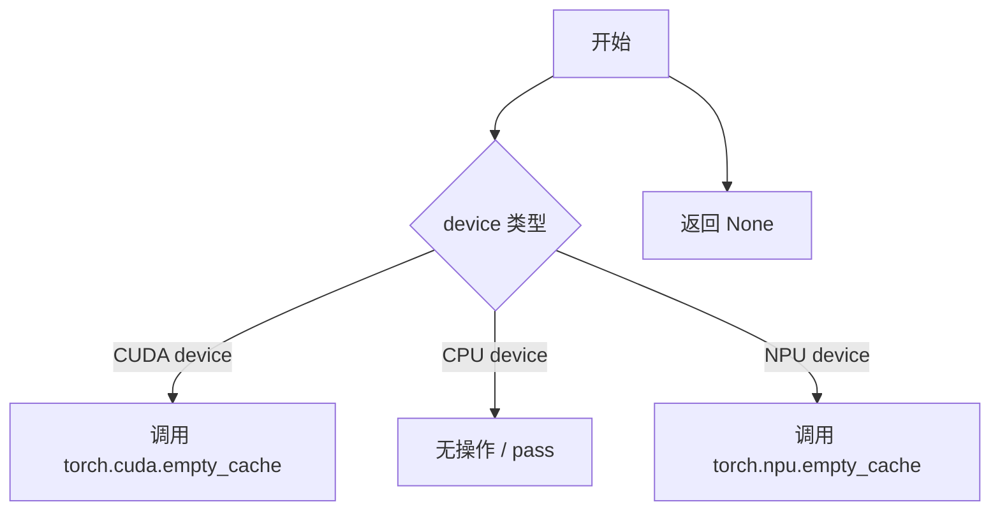
```mermaid
flowchart TD
    A[开始] --> B{device 类型}
    B -->|CUDA device| C[调用 torch.cuda.empty_cache]
    B -->|CPU device| D[无操作 / pass]
    B -->|NPU device| E[调用 torch.npu.empty_cache]
    A --> F[返回 None]
```

#### 带注释源码

```
# 该函数定义在 testing_utils 模块中（从 ...testing_utils 导入）
# 以下为基于使用方式的推断实现

def backend_empty_cache(device: str) -> None:
    """
    清理指定后端设备的缓存内存。
    
    参数:
        device: 设备标识符字符串，如 'cuda', 'cpu', 'npu' 等
    """
    import torch
    
    if device == "cuda":
        # 清理 CUDA 缓存以释放 GPU 内存
        torch.cuda.empty_cache()
    elif device == "npu":
        # 清理 NPU（华为昇腾）缓存
        torch.npu.empty_cache()
    # CPU 设备无需清理缓存
    
    # 执行垃圾回收辅助清理
    import gc
    gc.collect()
```


### `AttentionTesterMixin.test_fuse_unfuse_qkv_projections` 中的 `model_class(**init_dict)` 调用

这是类实例化调用，用于根据初始化字典创建模型实例。

参数：

- `**init_dict`：关键字参数，类型为 `dict`，从 `self.get_init_dict()` 获取的模型初始化参数字典，包含模型配置所需的所有参数

返回值：`model_class`，返回模型类的实例对象，类型为具体的模型类（如 `torch.nn.Module` 的子类），表示一个可用的模型实例

#### 流程图

```mermaid
flowchart TD
    A[开始] --> B[调用 self.get_init_dict 获取初始化参数字典]
    B --> C[调用 self.get_dummy_inputs 获取虚拟输入]
    C --> D[执行 model_class(**init_dict) 实例化模型]
    D --> E[调用 model.to torch_device 移动模型到指定设备]
    E --> F[调用 model.eval 设置评估模式]
    F --> G[结束]
    
    style D fill:#f9f,stroke:#333,stroke-width:2px
```

#### 带注释源码

```python
# 从 AttentionTesterMixin.test_fuse_unfuse_qkv_projections 方法中提取

# 获取初始化参数字典（由子类实现）
init_dict = self.get_init_dict()

# 获取虚拟输入字典（由子类实现）
inputs_dict = self.get_dummy_inputs()

# 使用 init_dict 关键字参数实例化模型类
# model_class 是一个模型类（由测试配置 mixin 提供，如 UNet2DConditionModel 等）
# **init_dict 将字典解包为关键字参数传递给模型构造函数
model = self.model_class(**init_dict)

# 将模型移动到指定的计算设备（如 CUDA、CPU 等）
model.to(torch_device)

# 设置模型为评估模式（禁用 dropout 等训练特定层）
model.eval()
```

---

### 补充说明

**函数/方法定位**：
- **类名**：`AttentionTesterMixin`
- **方法名**：`test_fuse_unfuse_qkv_projections`
- **具体调用**：`self.model_class(**init_dict)`

**调用上下文**：
- `model_class`：由测试配置 mixin 提供的模型类，通过 `get_init_dict()` 方法返回的 `model_class` 属性获取
- `init_dict`：包含模型构造函数所需的所有参数，通常来自模型的配置文件（如 `config.json`）

**关键点**：
- 这是类的实例化操作，不是普通函数调用
- `**init_dict` 是 Python 的关键字参数解包（kwargs unpack）
- 返回的 `model` 是 `torch.nn.Module` 的子类实例


### `model.to(torch_device)`

将 PyTorch 模型移动到指定的计算设备（如 CPU、GPU 或其他加速设备），以便在该设备上执行后续的推理或训练操作。

参数：

- `self`：模型实例本身（隐式参数），`torch.nn.Module`，调用方法的模型对象
- `torch_device`：目标设备标识符，`str` 或 `torch.device`，指定模型需要移动到的目标设备，通常为 "cuda"、"cpu" 或 "cuda:0" 等设备字符串

返回值：`torch.nn.Module`，返回已移动到目标设备的模型对象本身（self），支持链式调用

#### 流程图

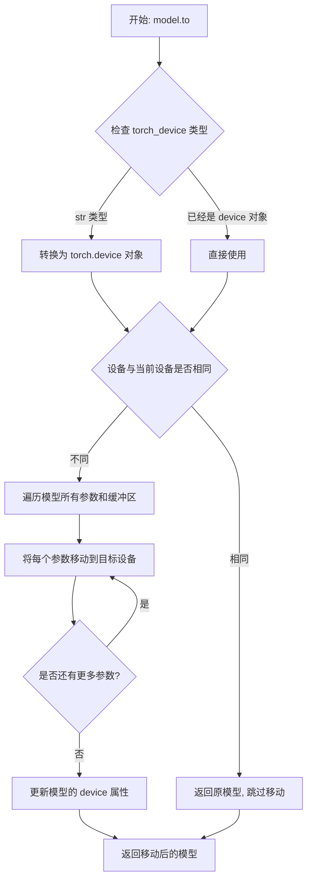
```mermaid
flowchart TD
    A[开始: model.to] --> B{检查 torch_device 类型}
    B -->|str 类型| C[转换为 torch.device 对象]
    B -->|已经是 device 对象| D[直接使用]
    C --> E{设备与当前设备是否相同}
    D --> E
    E -->|相同| F[返回原模型, 跳过移动]
    E -->|不同| G[遍历模型所有参数和缓冲区]
    G --> H[将每个参数移动到目标设备]
    H --> I{是否还有更多参数?}
    I -->|是| H
    I -->|否| J[更新模型的 device 属性]
    J --> K[返回移动后的模型]
    F --> K
```

#### 带注释源码

```python
# 从 init_dict 获取初始化参数字典
init_dict = self.get_init_dict()

# 从 init_dict 获取输入数据字典
inputs_dict = self.get_dummy_inputs()

# 使用初始化参数字典创建模型实例
model = self.model_class(**init_dict)

# ==== 核心操作: model.to(torch_device) ====
# 将模型的所有参数和缓冲区移动到指定的计算设备
# torch_device 是从 testing_utils 导入的全局变量，标识目标设备（如 "cuda", "cpu", "cuda:0"）
# 该方法会递归地移动模型的所有子模块的参数（parameters）和平凡缓冲区（buffers）
# 返回值是模型本身（self），支持链式调用
model.to(torch_device)
# ===========================================

# 设置模型为评估模式，关闭 dropout 和 batch normalization 的训练行为
model.eval()

# 检查模型是否支持 QKV 投影融合功能
if not hasattr(model, "fuse_qkv_projections"):
    # 如果不支持，则跳过该测试用例
    pytest.skip("Model does not support QKV projection fusion.")

# 执行前向传播，获取融合前的输出
output_before_fusion = model(**inputs_dict, return_dict=False)[0]
```


### `AttentionTesterMixin.test_fuse_unfuse_qkv_projections` 中的 `model.eval()`

该方法属于 `AttentionTesterMixin` 测试类的核心测试方法，用于验证注意力模块的 QKV 投影融合与解融合功能。`model.eval()` 将模型切换到评估模式，禁用 dropout 等训练特定的操作，确保测试在一致的推理环境下执行。

参数：

- `self`：`AttentionTesterMixin`，测试类实例本身
- `atol`：`float`，默认为 `1e-3`，绝对误差容限
- `rtol`：`float`，默认为 `0`，相对误差容限

返回值：`None`，该测试方法无返回值，主要通过断言验证模型行为

#### 流程图

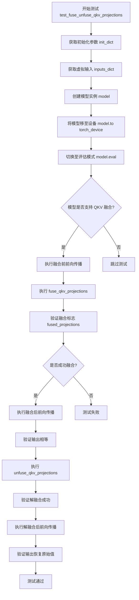
```mermaid
flowchart TD
    A[开始测试 test_fuse_unfuse_qkv_projections] --> B[获取初始化参数 init_dict]
    B --> C[获取虚拟输入 inputs_dict]
    C --> D[创建模型实例 model]
    D --> E[将模型移至设备 model.to torch_device]
    E --> F[切换至评估模式 model.eval]
    F --> G{模型是否支持 QKV 融合?}
    G -->|是| H[执行融合前前向传播]
    G -->|否| I[跳过测试]
    H --> J[执行 fuse_qkv_projections]
    J --> K[验证融合标志 fused_projections]
    K --> L{是否成功融合?}
    L -->|是| M[执行融合后前向传播]
    L -->|否| N[测试失败]
    M --> O[验证输出相等]
    O --> P[执行 unfuse_qkv_projections]
    P --> Q[验证解融合成功]
    Q --> R[执行解融合后前向传播]
    R --> S[验证输出恢复原始值]
    S --> T[测试通过]
```

#### 带注释源码

```python
@torch.no_grad()
def test_fuse_unfuse_qkv_projections(self, atol=1e-3, rtol=0):
    """
    测试 QKV 投影的融合与解融合功能
    
    参数:
        atol: 绝对误差容限，用于张量比较
        rtol: 相对误差容限，用于张量比较
    """
    # 获取模型初始化参数字典
    init_dict = self.get_init_dict()
    # 获取虚拟输入数据
    inputs_dict = self.get_dummy_inputs()
    # 使用初始化参数创建模型实例
    model = self.model_class(**init_dict)
    # 将模型移至指定的计算设备（如 CUDA/CPU）
    model.to(torch_device)
    
    # ============================================================
    # 关键操作：model.eval()
    # 将模型切换到评估模式
    # - 禁用 Dropout 层
    # - 使用 BatchNorm 的全局统计量（均值/方差）而非训练时的批次统计
    # - 确保测试行为与推理时一致
    # ============================================================
    model.eval()

    # 检查模型是否支持 QKV 投影融合功能
    if not hasattr(model, "fuse_qkv_projections"):
        pytest.skip("Model does not support QKV projection fusion.")

    # ---------- 融合前阶段 ----------
    # 执行融合前的模型前向传播，获取基准输出
    output_before_fusion = model(**inputs_dict, return_dict=False)[0]

    # 执行 QKV 投影融合
    model.fuse_qkv_projections()

    # 遍历模型所有模块，检查是否存在融合后的注意力模块
    has_fused_projections = False
    for module in model.modules():
        if isinstance(module, AttentionModuleMixin):
            # 检查是否具备融合后的投影属性
            if hasattr(module, "to_qkv") or hasattr(module, "to_kv"):
                has_fused_projections = True
                # 验证融合标志位已正确设置
                assert module.fused_projections, "fused_projections flag should be True"
                break

    # ---------- 融合后阶段 ----------
    if has_fused_projections:
        # 执行融合后的模型前向传播
        output_after_fusion = model(**inputs_dict, return_dict=False)[0]

        # 验证融合前后输出保持一致（融合不应改变计算结果）
        assert_tensors_close(
            output_before_fusion,
            output_after_fusion,
            atol=atol,
            rtol=rtol,
            msg="Output should not change after fusing projections",
        )

        # 执行 QKV 投影解融合
        model.unfuse_qkv_projections()

        # 验证解融合后融合属性已被正确移除
        for module in model.modules():
            if isinstance(module, AttentionModuleMixin):
                assert not hasattr(module, "to_qkv"), "to_qkv should be removed after unfusing"
                assert not hasattr(module, "to_kv"), "to_kv should be removed after unfusing"
                assert not module.fused_projections, "fused_projections flag should be False"

        # 执行解融合后的模型前向传播
        output_after_unfusion = model(**inputs_dict, return_dict=False)[0]

        # 验证解融合后输出与原始输出一致
        assert_tensors_close(
            output_before_fusion,
            output_after_unfusion,
            atol=atol,
            rtol=rtol,
            msg="Output should match original after unfusing projections",
        )
```


### `AttentionTesterMixin.test_fuse_unfuse_qkv_projections`

该方法用于测试注意力模块的 QKV（Query-Key-Value）投影融合与解融合功能，验证融合前后的模型输出保持一致，并检查相关属性和状态正确更新。

参数：

- `self`：`AttentionTesterMixin`，测试 mixin 类实例本身
- `atol`：`float`，可选，默认为 1e-3，表示绝对容差（Absolute Tolerance），用于浮点数比较
- `rtol`：`float`，可选，默认为 0，表示相对容差（Relative Tolerance），用于浮点数比较

返回值：`None`，该方法为测试方法，通过 pytest 断言验证功能，不返回任何值

#### 流程图

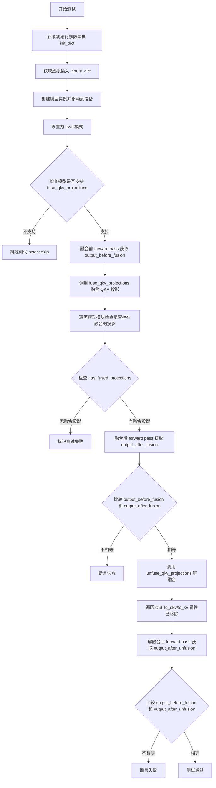
```mermaid
flowchart TD
    A[开始测试] --> B[获取初始化参数字典 init_dict]
    B --> C[获取虚拟输入 inputs_dict]
    C --> D[创建模型实例并移动到设备]
    D --> E[设置为 eval 模式]
    E --> F{检查模型是否支持 fuse_qkv_projections}
    F -->|不支持| G[跳过测试 pytest.skip]
    F -->|支持| H[融合前 forward pass 获取 output_before_fusion]
    H --> I[调用 fuse_qkv_projections 融合 QKV 投影]
    I --> J[遍历模型模块检查是否存在融合的投影]
    J --> K{检查 has_fused_projections}
    K -->|无融合投影| L[标记测试失败]
    K -->|有融合投影| M[融合后 forward pass 获取 output_after_fusion]
    M --> N{比较 output_before_fusion 和 output_after_fusion}
    N -->|不相等| O[断言失败]
    N -->|相等| P[调用 unfuse_qkv_projections 解融合]
    P --> Q[遍历检查 to_qkv/to_kv 属性已移除]
    Q --> R[解融合后 forward pass 获取 output_after_unfusion]
    R --> S{比较 output_before_fusion 和 output_after_unfusion}
    S -->|不相等| T[断言失败]
    S -->|相等| U[测试通过]
```

#### 带注释源码

```python
@torch.no_grad()
def test_fuse_unfuse_qkv_projections(self, atol=1e-3, rtol=0):
    """
    测试注意力模块的 QKV 投影融合与解融合功能
    
    该测试验证:
    1. 模型支持 fuse_qkv_projections 方法
    2. 融合后的输出与融合前一致
    3. 正确设置 fused_projections 标志
    4. 解融合后输出恢复到原始状态
    5. 解融合后移除 to_qkv/to_kv 属性
    
    参数:
        atol: 绝对容差，用于张量比较
        rtol: 相对容差，用于张量比较
    """
    # 获取模型初始化参数字典
    init_dict = self.get_init_dict()
    # 获取测试用虚拟输入
    inputs_dict = self.get_dummy_inputs()
    # 使用配置混合类提供的 model_class 创建模型实例
    model = self.model_class(**init_dict)
    # 将模型移动到指定设备（如 CUDA）
    model.to(torch_device)
    # 设置为评估模式，禁用 dropout 等训练特定操作
    model.eval()

    # 检查模型是否支持 QKV 投影融合功能
    if not hasattr(model, "fuse_qkv_projections"):
        pytest.skip("Model does not support QKV projection fusion.")

    # ---------- 融合前测试 ----------
    # 执行融合前的 forward pass，返回元组取第一个元素（输出张量）
    output_before_fusion = model(**inputs_dict, return_dict=False)[0]

    # 执行 QKV 投影融合
    model.fuse_qkv_projections()

    # 检查模型中是否存在融合的投影模块
    has_fused_projections = False
    # 遍历模型所有子模块
    for module in model.modules():
        # 检查是否为 AttentionModuleMixin 实例
        if isinstance(module, AttentionModuleMixin):
            # 检查是否具有融合后的 to_qkv 或 to_kv 属性
            if hasattr(module, "to_qkv") or hasattr(module, "to_kv"):
                has_fused_projections = True
                # 验证 fused_projections 标志已设置为 True
                assert module.fused_projections, "fused_projections flag should be True"
                break

    # ---------- 融合后测试 ----------
    if has_fused_projections:
        # 融合后再次执行 forward pass
        output_after_fusion = model(**inputs_dict, return_dict=False)[0]

        # 验证融合前后输出应保持一致（数值在容差范围内相等）
        assert_tensors_close(
            output_before_fusion,
            output_after_fusion,
            atol=atol,
            rtol=rtol,
            msg="Output should not change after fusing projections",
        )

        # 执行解融合操作
        model.unfuse_qkv_projections()

        # 验证解融合后相关属性已移除
        for module in model.modules():
            if isinstance(module, AttentionModuleMixin):
                # to_qkv 属性应在解融合后移除
                assert not hasattr(module, "to_qkv"), "to_qkv should be removed after unfusing"
                # to_kv 属性应在解融合后移除
                assert not hasattr(module, "to_kv"), "to_kv should be removed after unfusing"
                # fused_projections 标志应重置为 False
                assert not module.fused_projections, "fused_projections flag should be False"

        # ---------- 解融合后测试 ----------
        # 解融合后执行 forward pass
        output_after_unfusion = model(**inputs_dict, return_dict=False)[0]

        # 验证解融合后输出应与原始输出一致
        assert_tensors_close(
            output_before_fusion,
            output_after_unfusion,
            atol=atol,
            rtol=rtol,
            msg="Output should match original after unfusing projections",
        )
```


### `Model.fuse_qkv_projections`

融合模型中的 QKV 投影，将分离的 Query、Key、Value 投影矩阵合并为统一的投影操作，以提高推理效率并减少内存访问。

参数：

- 该方法为无参数方法（隐式参数 `self` 为模型实例本身）

返回值：`无返回值`（in-place 操作，通过修改模型内部状态完成融合）

#### 流程图

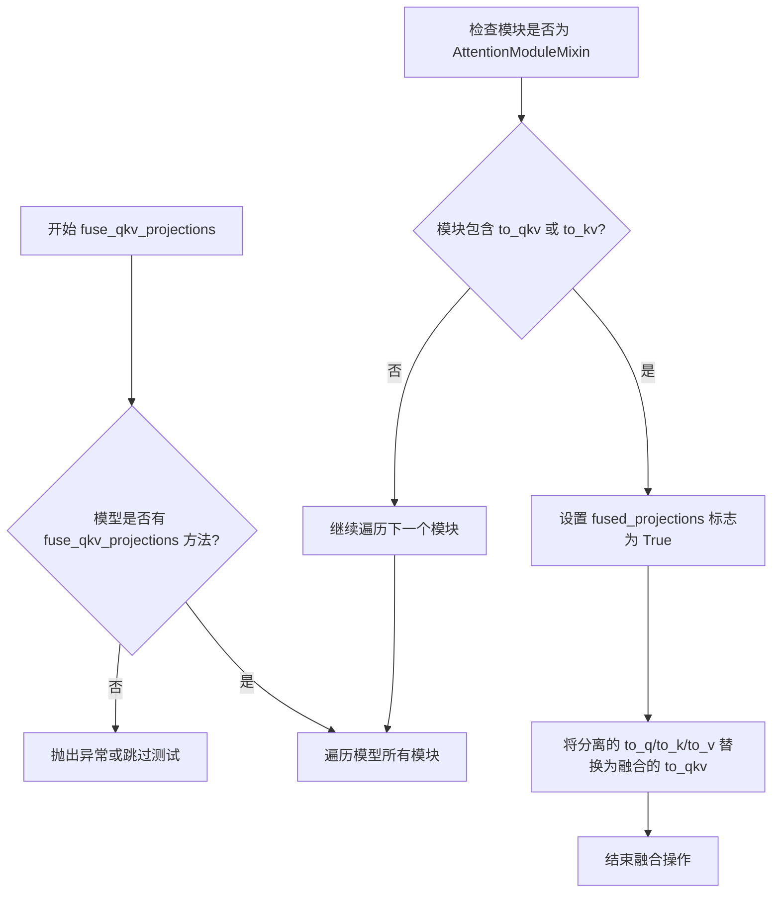
```mermaid
flowchart TD
    A[开始 fuse_qkv_projections] --> B{模型是否有 fuse_qkv_projections 方法?}
    B -- 否 --> C[抛出异常或跳过测试]
    B -- 是 --> D[遍历模型所有模块]
    E[检查模块是否为 AttentionModuleMixin] --> F{模块包含 to_qkv 或 to_kv?}
    F -- 否 --> G[继续遍历下一个模块]
    F -- 是 --> H[设置 fused_projections 标志为 True]
    H --> I[将分离的 to_q/to_k/to_v 替换为融合的 to_qkv]
    I --> J[结束融合操作]
    G --> D
```

#### 带注释源码

```python
# 以下为测试代码中调用 fuse_qkv_projections 的逻辑
# 实际方法实现位于模型类中（通常继承自 AttentionModuleMixin）

# 1. 检查模型是否支持 QKV 投影融合
if not hasattr(model, "fuse_qkv_projections"):
    pytest.skip("Model does not support QKV projection fusion.")

# 2. 调用融合方法（in-place 操作，无返回值）
model.fuse_qkv_projections()

# 3. 验证融合是否成功
has_fused_projections = False
for module in model.modules():
    if isinstance(module, AttentionModuleMixin):
        # 检查融合后的模块是否具有 to_qkv 或 to_kv 属性
        if hasattr(module, "to_qkv") or hasattr(module, "to_kv"):
            has_fused_projections = True
            # 验证融合标志是否正确设置
            assert module.fused_projections, "fused_projections flag should be True"
            break

# 4. 融合后的模型可以正常进行前向传播，输出应保持一致
output_after_fusion = model(**inputs_dict, return_dict=False)[0]
```


### `Model.unfuse_qkv_projections`

该方法用于解融（unfuse）模型的QKV（Query、Key、Value）投影，将融合的投影操作分离回独立的Query、Key、Value投影操作。这是`fuse_qkv_projections`的逆操作，通常用于在推理后将模型恢复到原始状态，以便进行进一步的微调或其他操作。

参数：此方法为无参数方法（隐式参数为模型实例 `self`）

返回值：`None`，无返回值。该方法直接修改模型内部状态。

#### 流程图

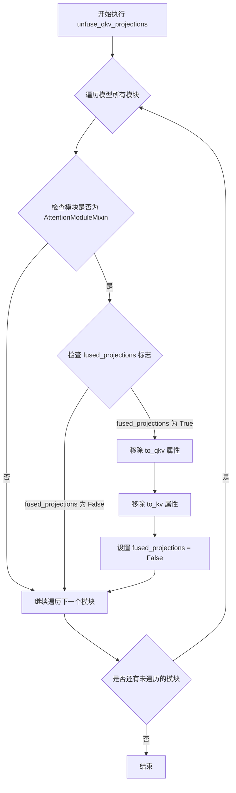
```mermaid
flowchart TD
    A[开始执行 unfuse_qkv_projections] --> B{遍历模型所有模块}
    B --> C{检查模块是否为 AttentionModuleMixin}
    C -->|是| D{检查 fused_projections 标志}
    C -->|否| G[继续遍历下一个模块]
    D -->|fused_projections 为 True| E[移除 to_qkv 属性]
    D -->|fused_projections 为 False| G
    E --> F[移除 to_kv 属性]
    F --> H[设置 fused_projections = False]
    H --> G
    G --> I{是否还有未遍历的模块}
    I -->|是| B
    I -->|否| J[结束]
```

#### 带注释源码

```python
# 调用位置在 test_fuse_unfuse_qkv_projections 测试方法中
# 第 87 行：调用解融QKV投影操作
model.unfuse_qkv_projections()

# 紧随其后的验证逻辑（第 89-96 行）：
# 验证 to_qkv 和 to_kv 属性已被移除，且 fused_projections 标志为 False
for module in model.modules():
    if isinstance(module, AttentionModuleMixin):
        # 断言 to_qkv 属性应该被移除
        assert not hasattr(module, "to_qkv"), "to_qkv should be removed after unfusing"
        # 断言 to_kv 属性应该被移除
        assert not hasattr(module, "to_kv"), "to_kv should be removed after unfusing"
        # 断言融合投影标志应该被设置为 False
        assert not module.fused_projections, "fused_projections flag should be False"
```

#### 补充说明

从测试代码可以推断出该方法的完整行为：

1. **方法调用者**：模型实例（`model`），该模型需要继承或包含 `AttentionModuleMixin` 相关功能
2. **前置条件**：模型必须已经通过 `fuse_qkv_projections()` 方法融合了QKV投影
3. **核心操作**：
   - 遍历模型中所有 `AttentionModuleMixin` 类型的模块
   - 对于每个启用了融合投影的模块，移除 `to_qkv` 和 `to_kv` 属性（这些是在融合时创建的）
   - 将模块的 `fused_projections` 标志设置为 `False`
4. **后置验证**：解融后模型的输出应与原始未融合状态的输出一致（通过 `assert_tensors_close` 验证）


### `model.attn_processors`

该属性用于获取模型中所有注意力模块的处理器（Attention Processor）字典，允许动态查看和管理模型的注意力处理机制。

参数：无

返回值：`dict`，返回模型中所有注意力模块对应的处理器字典，键为模块名称或标识符，值为具体的 `AttnProcessor` 实例。

#### 流程图

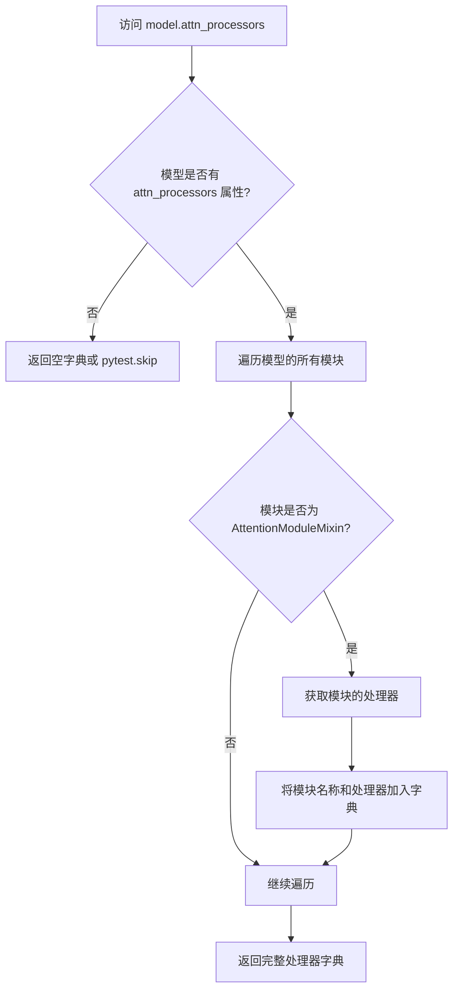
```mermaid
flowchart TD
    A[访问 model.attn_processors] --> B{模型是否有 attn_processors 属性?}
    B -- 否 --> C[返回空字典或 pytest.skip]
    B -- 是 --> D[遍历模型的所有模块]
    D --> E{模块是否为 AttentionModuleMixin?}
    E -- 否 --> F[继续遍历]
    E -- 是 --> G[获取模块的处理器]
    G --> H[将模块名称和处理器加入字典]
    H --> F
    F --> I[返回完整处理器字典]
```

#### 带注释源码

```python
# 代码中访问 attn_processors 的使用方式如下：

# 1. 在 test_get_set_processor 方法中获取所有处理器
processors = model.attn_processors  # 获取模型的所有注意力处理器
assert isinstance(processors, dict), "attn_processors should return a dict"
# 返回格式示例: {"attn1": AttnProcessor(), "attn2": AttnProcessor(), ...}

# 2. 在 test_attention_processor_dict 方法中使用
current_processors = model.attn_processors  # 获取当前处理器字典
# 创建新处理器字典
new_processors = {key: AttnProcessor() for key in current_processors.keys()}
# 设置新的处理器
model.set_attn_processor(new_processors)
# 验证更新后的处理器
updated_processors = model.attn_processors
for key in current_processors.keys():
    assert type(updated_processors[key]) == AttnProcessor

# 3. 在 test_attention_processor_count_mismatch_raises_error 中使用
current_processors = model.attn_processors  # 获取处理器用于验证数量不匹配
wrong_processors = {list(current_processors.keys())[0]: AttnProcessor()}  # 创建错误数量的处理器
with pytest.raises(ValueError) as exc_info:
    model.set_attn_processor(wrong_processors)
```

#### 备注

- `attn_processors` 是一个属性（property），由模型类（如继承自 `AttentionModuleMixin` 的类）提供实现
- 该属性通常返回包含所有 `Attention` 模块处理器的字典
- 键通常是模块的唯一标识符（如模块名称或 ID），值是注意力处理器对象
- 通常成对使用 `model.attn_processors`（读取）和 `model.set_attn_processor()`（写入）来管理注意力处理器


### `Model.set_attn_processor`

设置模型的注意力处理器（Attention Processor），允许用户自定义注意力计算的实现方式。

参数：

- `new_processors`：`dict`，键为注意力模块的名称（字符串），值为注意力处理器实例（如 `AttnProcessor`）。用于替换模型中对应的注意力处理器。

返回值：`None`，无返回值（该方法通常直接修改模型内部状态）。

#### 流程图

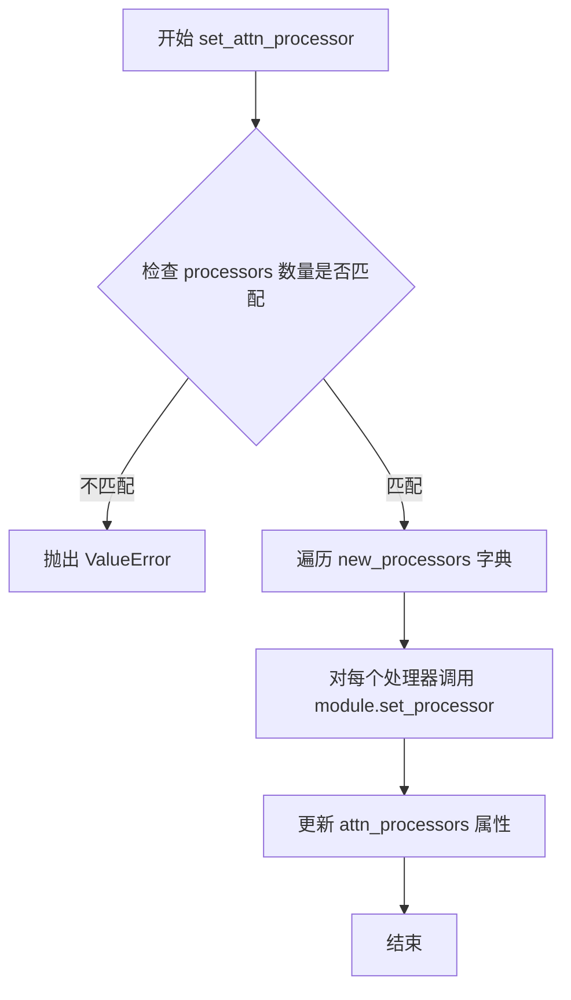
```mermaid
flowchart TD
    A[开始 set_attn_processor] --> B{检查 processors 数量是否匹配}
    B -->|不匹配| C[抛出 ValueError]
    B -->|匹配| D[遍历 new_processors 字典]
    D --> E[对每个处理器调用 module.set_processor]
    E --> F[更新 attn_processors 属性]
    F --> G[结束]
```

#### 带注释源码

```python
def set_attn_processor(self, new_processors):
    """
    设置模型的注意力处理器。
    
    参数:
        new_processors: dict, 键为模块名称, 值为注意力处理器实例
    """
    # 1. 获取当前处理器数量
    # current_processors = self.attn_processors
    
    # 2. 验证新处理器数量与模型中的注意力模块数量匹配
    # if len(new_processors) != len(current_processors):
    #     raise ValueError(...)
    
    # 3. 遍历新处理器字典，为每个注意力模块设置处理器
    # for name, processor in new_processors.items():
    #     module = self.get_submodule(name)
    #     module.set_processor(processor)
    
    # 4. 更新模型级处理器缓存
    # self.attn_processors = new_processors
```


### `AttentionModuleMixin.get_processor` / `module.get_processor`

获取当前模块关联的注意力处理器（Attention Processor）。该方法是 AttentionModuleMixin 混入类的核心接口之一，用于在运行时动态检索已设置在注意力模块上的处理器实例，以便进行验证、替换或执行自定义注意力计算。

参数：

- 无（除隐含的 `self` 或 `module` 实例参数外）

返回值：`AttnProcessor` 或类似的处理器对象，返回当前模块所配置的注意力处理器实例，若未设置则返回 `None`。

#### 流程图

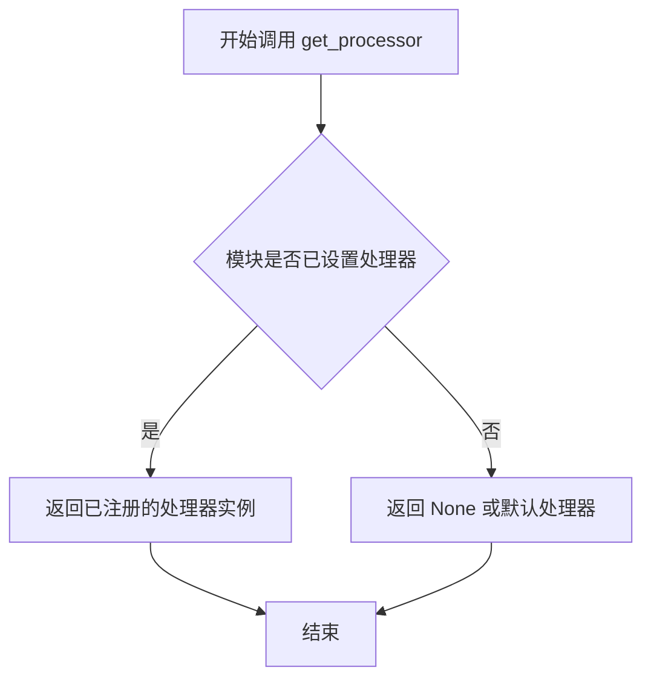
```mermaid
flowchart TD
    A[开始调用 get_processor] --> B{模块是否已设置处理器}
    B -->|是| C[返回已注册的处理器实例]
    B -->|否| D[返回 None 或默认处理器]
    C --> E[结束]
    D --> E
```

#### 带注释源码

```python
# 代码上下文中对 get_processor 的调用示例
# 位置: test_get_set_processor 方法内

def test_get_set_processor(self):
    """
    测试注意力处理器的获取和设置功能
    """
    # ... 初始化模型代码省略 ...
    
    # 遍历模型中的所有模块，查找 AttentionModuleMixin 实例
    for module in model.modules():
        if isinstance(module, AttentionModuleMixin):
            # 调用 get_processor 获取当前模块的注意力处理器
            processor = module.get_processor()
            
            # 断言：确保返回的处理器不为空
            assert processor is not None, "get_processor should return a processor"
            
            # 测试设置新的处理器
            new_processor = AttnProcessor()
            module.set_processor(new_processor)
            
            # 再次获取处理器，验证设置成功
            retrieved_processor = module.get_processor()
            assert retrieved_processor is new_processor, "Retrieved processor should be the same as the one set"
```

#### 补充说明

从测试代码反推，`get_processor()` 方法的实现应位于 `diffusers.models.attention.AttentionModuleMixin` 类中，其核心逻辑通常为：

1. 检查模块是否存在 `self_processor` 或类似的实例属性
2. 如已设置，则返回该处理器对象
3. 如未设置，可能返回默认处理器或 `None`

该方法与 `set_processor()` 方法配对使用，构成注意力处理器的运行时动态管理机制，允许用户在推理或微调过程中切换不同的注意力实现（如标准注意力、XFormers、NPU 加速等）。


### `AttentionModuleMixin.set_processor`

设置注意力模块的处理器，用于替换默认的注意力计算实现。

参数：

- `new_processor`：`AttnProcessor` 或等效的注意力处理器实例，要设置的新处理器对象

返回值：`None`，无返回值（该方法直接修改模块内部状态）

#### 流程图

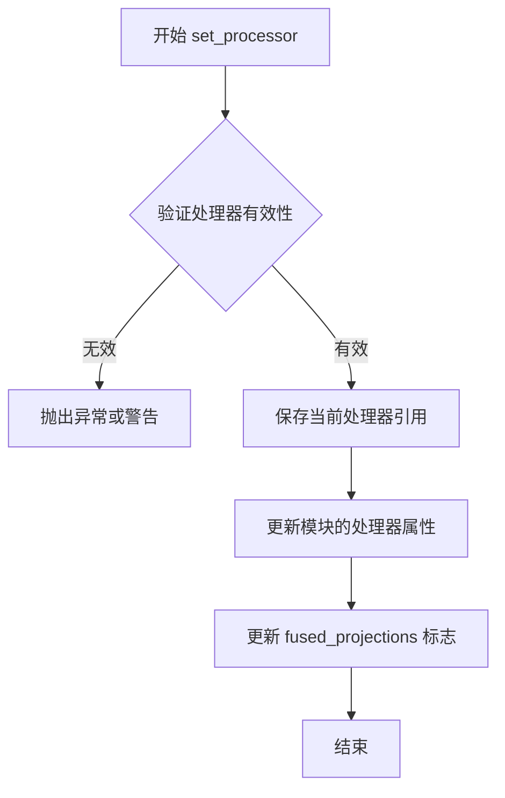
```mermaid
flowchart TD
    A[开始 set_processor] --> B{验证处理器有效性}
    B -->|无效| C[抛出异常或警告]
    B -->|有效| D[保存当前处理器引用]
    D --> E[更新模块的处理器属性]
    E --> F[更新 fused_projections 标志]
    F --> G[结束]
```

#### 带注释源码

```python
# 从测试代码 test_get_set_processor 中提取的调用模式
# 实际实现位于 diffusers.models.attention.AttentionModuleMixin

# 创建新的注意力处理器实例
new_processor = AttnProcessor()

# 调用 set_processor 方法设置处理器
# module 是 AttentionModuleMixin 的实例
module.set_processor(new_processor)

# 验证处理器是否设置成功
retrieved_processor = module.get_processor()
assert retrieved_processor is new_processor, "Retrieved processor should be the same as the one set"

# 注意事项：
# 1. set_processor 方法通常会验证处理器是否兼容当前模块
# 2. 设置新处理器后，可能需要更新 fused_projections 标志
# 3. 该方法通常不支持在推理过程中动态切换处理器（除非模块设计支持）
```


### `pytest.skip`

跳过测试函数的执行，常用于在测试运行时根据条件动态跳过某些测试用例。

参数：

- `msg`：`str`，可选参数，跳过测试的原因描述信息，默认为空字符串
- `allow_module_level`：`bool`，可选参数，控制在模块级别是否允许使用 skip，默认为 `False`

返回值：`None`，该函数无返回值

#### 流程图

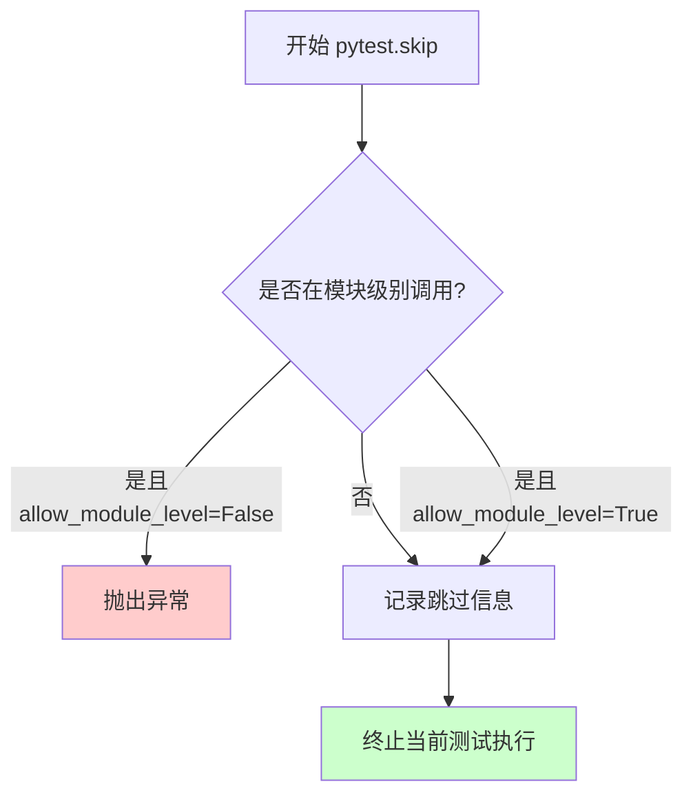
```mermaid
flowchart TD
    A[开始 pytest.skip] --> B{是否在模块级别调用?}
    B -->|是且allow_module_level=False| C[抛出异常]
    B -->|否| D[记录跳过信息]
    D --> E[终止当前测试执行]
    B -->|是且allow_module_level=True| D
    
    style C fill:#ffcccc
    style E fill:#ccffcc
```

#### 带注释源码

```python
# pytest.skip 函数源码示例

# 在代码中的实际使用场景：

# 场景1：当模型不支持QKV投影融合时跳过测试
if not hasattr(model, "fuse_qkv_projections"):
    pytest.skip("Model does not support QKV projection fusion.")

# 场景2：当模型没有注意力处理器时跳过测试
if not hasattr(model, "attn_processors"):
    pytest.skip("Model does not have attention processors.")

# 场景3：当模型不支持设置注意力处理器时跳过测试
if not hasattr(model, "set_attn_processor"):
    pytest.skip("Model does not support setting attention processors.")

# 场景4：重复检查处理器设置功能，不支持时跳过
if not hasattr(model, "set_attn_processor"):
    pytest.skip("Model does not support setting attention processors.")
```

#### 详细说明

**功能概述**：
`pytest.skip` 是 pytest 测试框架提供的内置函数，用于在测试执行过程中根据特定条件动态跳过测试用例。当测试环境不满足某些前置条件或测试目标不适用于当前配置时，使用此函数可以避免测试失败同时保持测试套件的完整性。

**使用场景**：
1. **功能不支持检测**：当被测模型或模块不具备某些功能时（如 `fuse_qkv_projections`、`attn_processors` 等）
2. **环境依赖缺失**：当测试需要特定硬件或软件环境但当前环境不具备时
3. **条件跳过**：根据运行时条件动态决定是否执行测试

**在 AttentionTesterMixin 类中的具体应用**：

该混合类用于测试注意力处理器和模块功能，包含以下测试方法：
- `test_fuse_unfuse_qkv_projections`：测试QKV投影融合/解融合功能
- `test_get_set_processor`：测试处理器的获取和设置
- `test_attention_processor_dict`：测试通过字典批量设置处理器
- `test_attention_processor_count_mismatch_raises_error`：测试处理器数量不匹配时的错误处理

每个测试方法开始时都会检查模型是否支持相关功能，若不支持则调用 `pytest.skip` 跳过该测试。


### `AttentionTesterMixin.test_attention_processor_count_mismatch_raises_error`

该测试方法用于验证当尝试设置错误数量的注意力处理器时，模型是否正确抛出 ValueError 异常。通过创建处理器数量不匹配的字典并调用 `set_attn_processor`，确保错误处理机制正常工作。

参数：

- `self`：测试类的实例对象，无需显式传递

返回值：`None`，该方法为测试方法，通过 `pytest.raises` 断言异常，不返回任何值

#### 流程图

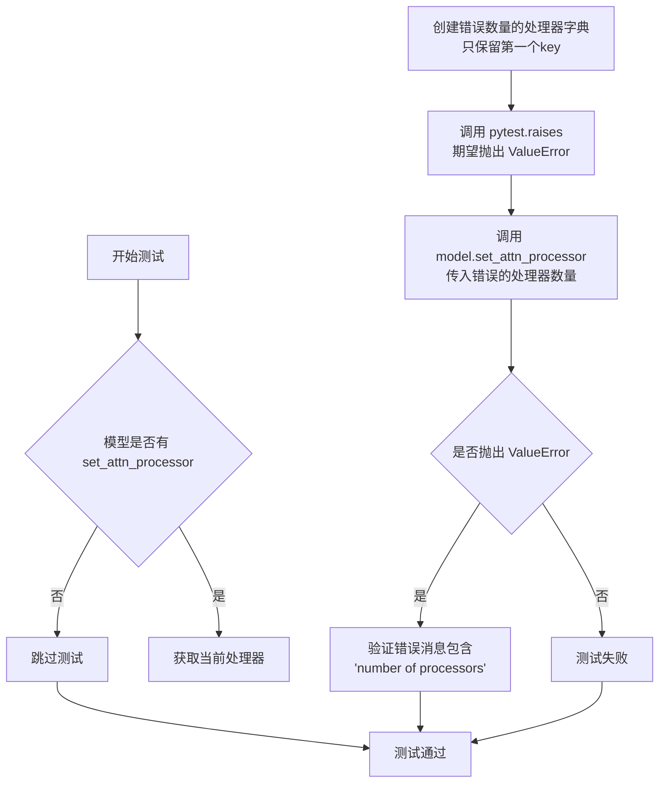
```mermaid
flowchart TD
    A[开始测试] --> B{模型是否有 set_attn_processor}
    B -->|否| C[跳过测试]
    B -->|是| D[获取当前处理器]
    E[创建错误数量的处理器字典<br/>只保留第一个key] --> F[调用 pytest.raises<br/>期望抛出 ValueError]
    F --> G[调用 model.set_attn_processor<br/>传入错误的处理器数量]
    G --> H{是否抛出 ValueError}
    H -->|是| I[验证错误消息包含<br/>'number of processors']
    H -->|否| J[测试失败]
    I --> K[测试通过]
    C --> K
    J --> K
```

#### 带注释源码

```python
def test_attention_processor_count_mismatch_raises_error(self):
    """
    测试当设置的处理器数量与模型不匹配时，是否正确抛出 ValueError 异常。
    """
    # 1. 获取初始化参数字典
    init_dict = self.get_init_dict()
    
    # 2. 使用初始化参数创建模型实例
    model = self.model_class(**init_dict)
    
    # 3. 将模型移动到指定设备（CPU/GPU）
    model.to(torch_device)

    # 4. 检查模型是否支持设置注意力处理器功能
    if not hasattr(model, "set_attn_processor"):
        # 如果不支持则跳过该测试
        pytest.skip("Model does not support setting attention processors.")

    # 5. 获取模型当前所有的注意力处理器
    current_processors = model.attn_processors

    # 6. 创建一个错误数量的处理器字典
    # 只保留第一个处理器的key，值为新的AttnProcessor
    # 这样会导致处理器数量与模型期望的数量不匹配
    wrong_processors = {list(current_processors.keys())[0]: AttnProcessor()}

    # 7. 使用 pytest.raises 验证错误被正确抛出
    # exc_info 用于捕获异常对象以便后续验证
    with pytest.raises(ValueError) as exc_info:
        # 8. 尝试设置不匹配数量的处理器，应该抛出 ValueError
        model.set_attn_processor(wrong_processors)

    # 9. 验证抛出的错误消息包含 'number of processors'
    # 确保错误信息清晰描述了问题原因
    assert "number of processors" in str(exc_info.value).lower(), \
        "Error should mention processor count mismatch"
```


### `assert_tensors_close`

该函数是一个测试工具函数，用于比较两个张量是否在指定的数值容差范围内相等，类似于 PyTorch 的 `assert_close` 或 NumPy 的 `allclose`，常用于单元测试中验证模型输出的正确性。

参数：

-  `a`：`torch.Tensor`，第一个张量（期望值/参考张量）
-  `b`：`torch.Tensor`，第二个张量（实际值/待比较张量）
-  `atol`：`float`，绝对容差（默认由调用方指定，如 `1e-3`）
-  `rtol`：`float`，相对容差（默认由调用方指定，如 `0`）
-  `msg`：`str`，自定义错误消息，用于测试失败时提供上下文信息

返回值：`None`，该函数在比较失败时抛出断言错误，否则不做返回值

#### 流程图

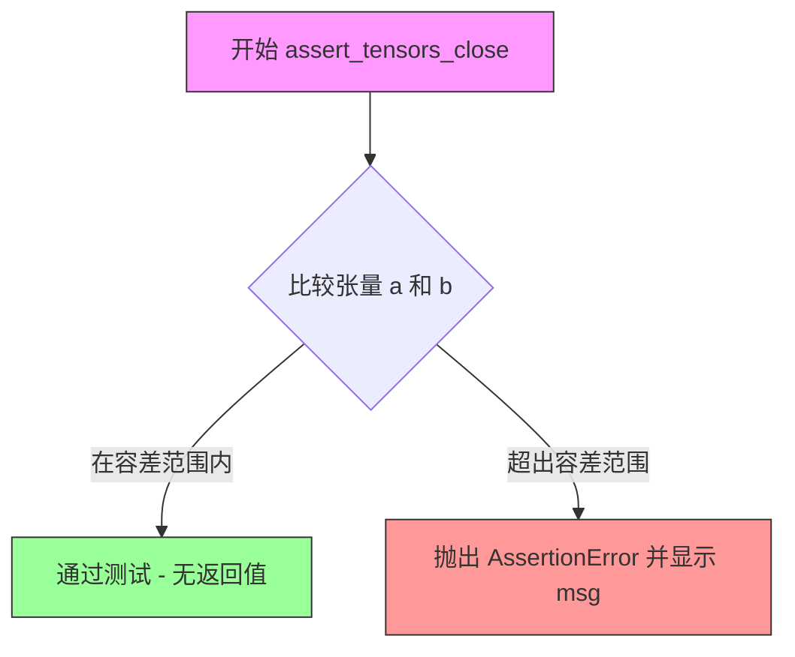
```mermaid
flowchart TD
    A[开始 assert_tensors_close] --> B{比较张量 a 和 b}
    B -->|在容差范围内| C[通过测试 - 无返回值]
    B -->|超出容差范围| D[抛出 AssertionError 并显示 msg]
    
    style A fill:#f9f,stroke:#333
    style C fill:#9f9,stroke:#333
    style D fill:#f99,stroke:#333
```

#### 带注释源码

```
# 注：该函数定义在 testing_utils 模块中，此处为基于调用的推断实现
# 实际源码位于 ...testing_utils 模块

def assert_tensors_close(
    a: torch.Tensor,      # 第一个张量（期望值）
    b: torch.Tensor,      # 第二个张量（实际值）
    atol: float = 1e-7,   # 绝对容差
    rtol: float = 1e-5,   # 相对容差
    msg: str = ""         # 错误消息
):
    """
    比较两个张量是否在容差范围内相等。
    
    使用 PyTorch 的 torch.allclose 或自定义比较逻辑，
    类似于 pytest 的 assert 机制，但专门针对张量优化。
    """
    # 核心比较逻辑（推断）
    try:
        # 检查形状是否相同
        assert a.shape == b.shape, f"Shape mismatch: {a.shape} vs {b.shape}"
        
        # 使用 allclose 进行数值比较
        # close = |a - b| <= (atol + rtol * |b>)
        is_close = torch.allclose(a, b, atol=atol, rtol=rtol)
        
        if not is_close:
            # 计算实际差异用于调试
            max_diff = torch.max(torch.abs(a - b)).item()
            raise AssertionError(
                f"{msg}\n"
                f"Max difference: {max_diff}\n"
                f"Tolerances: atol={atol}, rtol={rtol}"
            )
    except Exception as e:
        if msg:
            raise AssertionError(msg) from e
        raise
```


### `is_attention`

`is_attention` 是一个 pytest 标记装饰器（从 testing_utils 模块导入），用于将测试类或测试函数标记为与注意力机制（attention）相关的测试。该装饰器允许在运行测试时通过 `pytest -m "attention"` 或 `pytest -m "not attention"` 来选择性地运行或跳过这些测试。

参数：

- 无直接参数（通过装饰器形式 `@is_attention` 使用，无参数传递）

返回值：`callable`，返回一个装饰器函数，用于装饰目标类或函数

#### 流程图

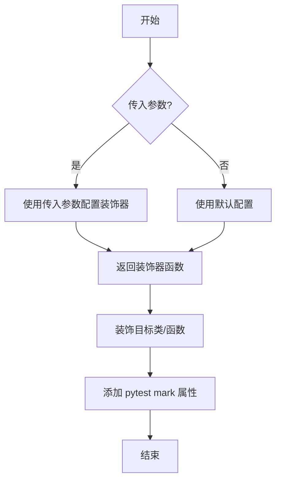
```mermaid
flowchart TD
    A[开始] --> B{传入参数?}
    B -->|是| C[使用传入参数配置装饰器]
    B -->|否| D[使用默认配置]
    C --> E[返回装饰器函数]
    D --> E
    E --> F[装饰目标类/函数]
    F --> G[添加 pytest mark 属性]
    G --> H[结束]
```

#### 带注释源码

```python
# 注意：以下是推断的源码结构，基于代码使用方式和 pytest 装饰器的常见模式
# 实际源码位于 testing_utils 模块中，此处为根据使用方式的合理推断

def is_attention(fn_or_class=None, *args, **kwargs):
    """
    pytest 标记装饰器，用于标记注意力机制相关的测试。
    
    使用方式：
        @is_attention
        class TestAttention:
            ...
        
        # 或带参数
        @is_attention(some_param=value)
        class TestAttention:
            ...
    """
    # 如果直接作为装饰器使用（@is_attention 不带参数）
    if fn_or_class is None:
        # 返回一个装饰器函数
        def decorator(fn):
            # 为函数/类添加 pytest mark
            pytest.mark.attention(fn)
            return fn
        return decorator
    else:
        # 如果传入的是类或函数，直接标记
        pytest.mark.attention(fn_or_class)
        return fn_or_class


# 在代码中的实际使用方式：
# @is_attention  # 装饰器应用于类
# class AttentionTesterMixin:
#     ...
# 这个类的测试可以通过 pytest -m attention 来运行
# 或通过 pytest -m "not attention" 来跳过
```

**注意**：由于 `is_attention` 是从外部模块 `testing_utils` 导入的，上述源码是基于其使用方式的合理推断。实际的函数实现可能略有不同。从代码中可以看出，该装饰器主要用于将 `AttentionTesterMixin` 类及其测试方法标记为 attention 类型的测试，以便在 pytest 中进行选择性运行。


### `AttentionTesterMixin.setup_method`

这是一个pytest的setup方法，作为测试夹具（fixture）在每个测试方法运行前被自动调用。该方法主要负责清理Python垃圾收集器和GPU显存缓存，确保每次测试都在一个干净的环境中运行，避免因内存残留导致的测试不稳定或结果偏差。

参数：

-  `self`：隐藏的`AttentionTesterMixin`实例引用，无需显式传递

返回值：`None`，该方法不返回任何值，仅执行副作用操作

#### 流程图

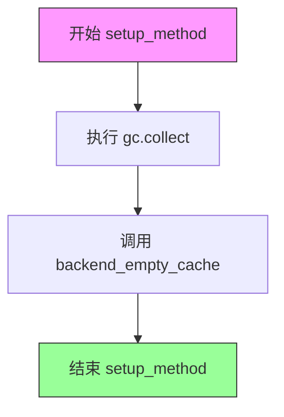
```mermaid
flowchart TD
    A[开始 setup_method] --> B[执行 gc.collect]
    B --> C[调用 backend_empty_cache]
    C --> D[结束 setup_method]
    
    style A fill:#f9f,stroke:#333
    style D fill:#9f9,stroke:#333
```

#### 带注释源码

```python
def setup_method(self):
    """
    Pytest setup hook - 在每个测试方法执行前清理内存
    
    这是pytest测试框架的setup方法，会在每个以test_开头的方法运行前
    自动调用。目的是确保测试环境的一致性和可重复性。
    """
    # 调用Python的垃圾收集器，释放不再使用的对象内存
    gc.collect()
    
    # 清理GPU/后端缓存，释放显存空间
    # torch_device是测试工具模块中定义的全局变量，表示当前测试使用的设备
    backend_empty_cache(torch_device)
```


### `AttentionTesterMixin.teardown_method`

该方法是 Pytest 测试框架的 teardown 钩子函数，在每个测试方法执行完成后被自动调用，用于执行清理操作：触发 Python 垃圾回收（gc.collect）并清空 GPU 缓存（backend_empty_cache），以确保测试环境的状态被正确释放，避免测试之间的相互影响。

参数：

- `self`：`AttentionTesterMixin`，类的实例本身，用于访问类属性和方法
- `method`（隐式）：`Optional[Method]`，Pytest 自动传入的被拆除的测试方法对象（在此代码中未被使用）

返回值：`None`，无返回值，仅执行清理副作用

#### 流程图

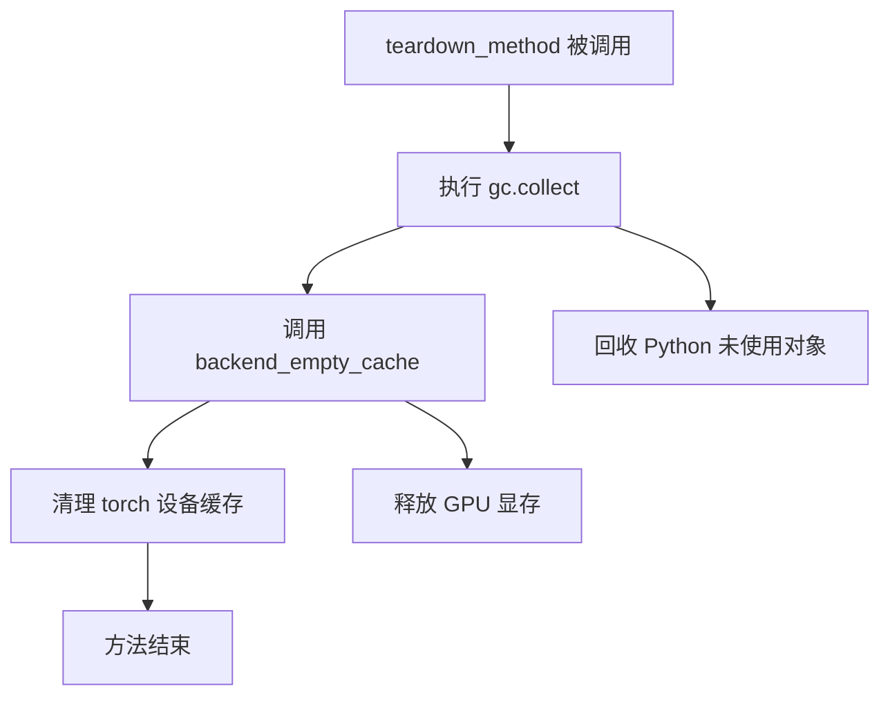
```mermaid
flowchart TD
    A[teardown_method 被调用] --> B[执行 gc.collect]
    B --> C[调用 backend_empty_cache]
    C --> D[清理 torch 设备缓存]
    D --> E[方法结束]
    
    B --> B1[回收 Python 未使用对象]
    C --> C1[释放 GPU 显存]
```

#### 带注释源码

```python
def teardown_method(self, method=None):
    """
    Pytest teardown 钩子，在每个测试方法结束后自动调用。
    负责清理测试环境，释放资源。
    
    参数:
        self: AttentionTesterMixin 类实例
        method: Pytest 自动传入的被拆除的测试方法对象（可选参数，当前未使用）
    
    返回值:
        None
    """
    # 执行 Python 垃圾回收，回收测试过程中创建的不可达对象
    gc.collect()
    
    # 清空深度学习框架（如 PyTorch）的 GPU 缓存
    # 释放测试过程中分配的 GPU 显存，防止显存泄漏
    backend_empty_cache(torch_device)
```


### `AttentionTesterMixin.test_fuse_unfuse_qkv_projections`

该测试方法用于验证模型的 QKV（Query-Key-Value）投影融合（fuse）与解融合（unfuse）功能是否正常工作。通过融合 QKV 投影可以减少内存占用并提升推理性能，测试确保融合前后模型的输出保持一致，并且解融合操作能够正确恢复原始状态。

参数：

- `self`：`AttentionTesterMixin`，测试mixin类的实例，隐含参数
- `atol`：`float`，默认值 `1e-3`，绝对容差（absolute tolerance），用于 `assert_tensors_close` 比较输出张量时的绝对误差阈值
- `rtol`：`float`，默认值 `0`，相对容差（relative tolerance），用于 `assert_tensors_close` 比较输出张量时的相对误差阈值

返回值：`None`，该方法为测试方法，无返回值

#### 流程图

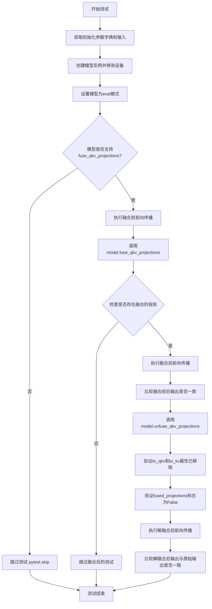
```mermaid
flowchart TD
    A[开始测试] --> B[获取初始化参数字典和输入]
    B --> C[创建模型实例并移到设备]
    C --> D[设置模型为eval模式]
    D --> E{模型是否支持fuse_qkv_projections?}
    E -->|否| F[跳过测试 pytest.skip]
    E -->|是| G[执行融合前前向传播]
    G --> H[调用model.fuse_qkv_projections]
    H --> I{检查是否存在融合的投影}
    I -->|否| J[跳过融合后的测试]
    I -->|是| K[执行融合后前向传播]
    K --> L[比较融合前后输出是否一致]
    L --> M[调用model.unfuse_qkv_projections]
    M --> N[验证to_qkv和to_kv属性已移除]
    N --> O[验证fused_projections标志为False]
    O --> P[执行解融合后前向传播]
    P --> Q[比较解融合后输出与原始输出是否一致]
    Q --> R[测试结束]
    F --> R
    J --> R
```

#### 带注释源码

```python
@torch.no_grad()  # 装饰器：禁用梯度计算，节省内存
def test_fuse_unfuse_qkv_projections(self, atol=1e-3, rtol=0):
    """
    测试QKV投影的融合与解融合功能
    
    参数:
        atol: 绝对容差，用于张量比较
        rtol: 相对容差，用于张量比较
    """
    
    # 步骤1: 获取模型初始化参数字典（由子类提供）
    init_dict = self.get_init_dict()
    
    # 步骤2: 获取模型输入字典（由子类提供）
    inputs_dict = self.get_dummy_inputs()
    
    # 步骤3: 创建模型实例
    model = self.model_class(**init_dict)
    
    # 步骤4: 将模型移至指定设备（CPU/GPU）
    model.to(torch_device)
    
    # 步骤5: 设置模型为评估模式（禁用dropout等）
    model.eval()

    # 步骤6: 检查模型是否支持QKV投影融合功能
    if not hasattr(model, "fuse_qkv_projections"):
        # 如果不支持，跳过该测试
        pytest.skip("Model does not support QKV projection fusion.")

    # 步骤7: 执行融合前的原始前向传播，获取基准输出
    output_before_fusion = model(**inputs_dict, return_dict=False)[0]

    # 步骤8: 调用模型的fuse_qkv_projections方法进行QKV融合
    model.fuse_qkv_projections()

    # 步骤9: 遍历模型的所有模块，检查是否存在融合后的Attention模块
    has_fused_projections = False
    for module in model.modules():
        # 检查是否为Attention模块混合类
        if isinstance(module, AttentionModuleMixin):
            # 检查是否具有融合后的to_qkv或to_kv属性
            if hasattr(module, "to_qkv") or hasattr(module, "to_kv"):
                has_fused_projections = True
                # 验证融合标志是否正确设置
                assert module.fused_projections, "fused_projections flag should be True"
                break

    # 步骤10: 如果存在融合投影，进行融合后输出验证
    if has_fused_projections:
        # 执行融合后的前向传播
        output_after_fusion = model(**inputs_dict, return_dict=False)[0]

        # 步骤11: 断言融合前后输出应该保持一致（数值误差范围内）
        assert_tensors_close(
            output_before_fusion,
            output_after_fusion,
            atol=atol,
            rtol=rtol,
            msg="Output should not change after fusing projections",
        )

        # 步骤12: 调用unfuse_qkv_projections进行解融合
        model.unfuse_qkv_projections()

        # 步骤13: 验证解融合后属性已正确移除
        for module in model.modules():
            if isinstance(module, AttentionModuleMixin):
                # 验证to_qkv属性已被移除
                assert not hasattr(module, "to_qkv"), "to_qkv should be removed after unfusing"
                # 验证to_kv属性已被移除
                assert not hasattr(module, "to_kv"), "to_kv should be removed after unfusing"
                # 验证融合标志已重置为False
                assert not module.fused_projections, "fused_projections flag should be False"

        # 步骤14: 执行解融合后的前向传播
        output_after_unfusion = model(**inputs_dict, return_dict=False)[0]

        # 步骤15: 断言解融合后输出应与原始输出一致
        assert_tensors_close(
            output_before_fusion,
            output_after_unfusion,
            atol=atol,
            rtol=rtol,
            msg="Output should match original after unfusing projections",
        )
```


### `AttentionTesterMixin.test_get_set_processor`

该方法用于测试注意力处理器（Attention Processor）的获取（get）和设置（set）功能。它验证模型能否正确返回注意力处理器字典，并且能够通过 `get_processor()` 和 `set_processor()` 方法正确获取和设置每个注意力模块的处理器。

参数：

- `self`：隐式参数，`AttentionTesterMixin` 类的实例方法，无需显式传递

返回值：`None`，该方法通过 `assert` 断言进行测试验证，无显式返回值

#### 流程图

```mermaid
flowchart TD
    A[开始 test_get_set_processor] --> B[获取初始化字典 init_dict]
    B --> C[创建模型实例并移动到 torch_device]
    C --> D{检查模型是否有 attn_processors 属性}
    D -- 否 --> E[跳过测试 pytest.skip]
    D -- 是 --> F[获取 attn_processors 字典]
    F --> G{验证 processors 是非空字典}
    G -- 否 --> H[断言失败]
    G -- 是 --> I[遍历模型中所有 AttentionModuleMixin 模块]
    I --> J{当前模块是否有处理器}
    J -- 否 --> K[继续下一个模块]
    J -- 是 --> L[调用 get_processor 获取当前处理器]
    L --> M{处理器是否为 None}
    M -- 是 --> N[断言失败]
    M -- 否 --> O[创建新处理器 AttnProcessor]
    O --> P[调用 set_processor 设置新处理器]
    P --> Q[再次调用 get_processor 获取处理器]
    Q --> R{获取的处理器是否与设置的相同}
    R -- 否 --> S[断言失败]
    R -- 是 --> T[继续处理下一个模块]
    T --> U{是否还有更多模块}
    U -- 是 --> I
    U -- 否 --> V[测试结束]
```

#### 带注释源码

```python
def test_get_set_processor(self):
    """
    测试注意力处理器的获取和设置功能
    
    验证内容：
    1. 模型能够返回非空的 attn_processors 字典
    2. 每个 AttentionModuleMixin 模块能够通过 get_processor() 获取处理器
    3. 每个模块能够通过 set_processor() 设置新的处理器
    4. 设置后的处理器能够被正确获取
    """
    # Step 1: 获取模型的初始化参数字典
    # 用于根据配置创建模型实例
    init_dict = self.get_init_dict()
    
    # Step 2: 使用初始化字典创建模型实例并移动到指定设备
    # torch_device 通常为 'cuda' 或 'cpu'
    model = self.model_class(**init_dict)
    model.to(torch_device)

    # Step 3: 检查模型是否支持注意力处理器
    # 如果模型没有 attn_processors 属性，则跳过此测试
    # 这是因为某些模型可能不支持注意力处理器功能
    if not hasattr(model, "attn_processors"):
        pytest.skip("Model does not have attention processors.")

    # Step 4: 测试获取处理器功能
    # 获取模型的所有注意力处理器
    processors = model.attn_processors
    
    # 验证返回值是字典类型
    assert isinstance(processors, dict), "attn_processors should return a dict"
    
    # 验证模型至少有一个注意力处理器
    assert len(processors) > 0, "Model should have at least one attention processor"

    # Step 5: 遍历所有注意力模块，测试获取和设置处理器
    # 遍历模型中的所有模块，查找 AttentionModuleMixin 类型的模块
    for module in model.modules():
        if isinstance(module, AttentionModuleMixin):
            # 5.1: 测试获取当前处理器
            # 通过 get_processor 方法获取当前模块的注意力处理器
            processor = module.get_processor()
            
            # 确保返回的处理器不为 None
            assert processor is not None, "get_processor should return a processor"

            # 5.2: 测试设置新处理器
            # 创建一个新的默认注意力处理器
            new_processor = AttnProcessor()
            
            # 使用 set_processor 设置新的处理器
            module.set_processor(new_processor)
            
            # 5.3: 验证设置成功
            # 再次获取处理器，验证返回的是刚才设置的处理器
            retrieved_processor = module.get_processor()
            
            # 断言获取的处理器与设置的处理器是同一个对象
            assert retrieved_processor is new_processor, "Retrieved processor should be the same as the one set"
```


### `AttentionTesterMixin.test_attention_processor_dict`

该测试方法用于验证模型是否支持通过字典方式批量设置注意力处理器（Attention Processor），检查`set_attn_processor`方法能否正确接收并应用处理器字典，确保每个处理器键值对都被正确绑定到模型对应的注意力模块上。

参数：

- `self`：隐式参数，`AttentionTesterMixin`类的实例方法调用者
- `atol`：`float`（可选，默认为`1e-3`），在父类`test_fuse_unfuse_qkv_projections`中使用的绝对容差，本方法未使用
- `rtol`：`float`（可选，默认为`0`），在父类`test_fuse_unfuse_qkv_projections`中使用的相对容差，本方法未使用

返回值：无（`None`），该方法为测试用例，仅通过断言验证逻辑，不返回任何值

#### 流程图

```mermaid
flowchart TD
    A[开始测试 test_attention_processor_dict] --> B[获取模型的初始化字典 init_dict]
    B --> C[创建模型实例 model = model_class(**init_dict)]
    C --> D[将模型移动到 torch_device]
    D --> E{模型是否支持 set_attn_processor?}
    E -->|否| F[跳过测试 pytest.skip]
    E -->|是| G[获取当前处理器 current_processors = model.attn_processors]
    G --> H[创建新处理器字典 new_processors = {key: AttnProcessor() for key in current_processors.keys()}]
    H --> I[调用 model.set_attn_processor(new_processors) 设置处理器]
    I --> J[获取更新后的处理器 updated_processors = model.attn_processors]
    J --> K[遍历验证每个处理器类型]
    K --> L{所有处理器都是 AttnProcessor?}
    L -->|是| M[测试通过]
    L -->|否| N[断言失败抛出 AssertionError]
```

#### 带注释源码

```python
def test_attention_processor_dict(self):
    """
    测试通过字典方式设置注意力处理器的功能。
    
    该测试验证：
    1. 模型具有 set_attn_processor 方法
    2. 可以通过字典批量设置多个注意力处理器
    3. 设置后的处理器类型正确
    """
    # Step 1: 获取模型初始化参数字典
    # 用于根据配置创建模型实例
    init_dict = self.get_init_dict()
    
    # Step 2: 创建模型实例
    # 使用初始化字典实例化模型类（由mixin的使用者提供model_class）
    model = self.model_class(**init_dict)
    
    # Step 3: 将模型移动到指定计算设备
    # torch_device 通常为 'cuda' 或 'cpu'
    model.to(torch_device)

    # Step 4: 前置条件检查
    # 验证模型是否支持设置注意力处理器的功能
    # 如果不支持则跳过该测试
    if not hasattr(model, "set_attn_processor"):
        pytest.skip("Model does not support setting attention processors.")

    # Step 5: 获取当前已注册的注意力处理器
    # attn_processors 返回一个字典，键为模块名称/路径，值为处理器对象
    # 示例: {'attn1': AttnProcessor(), 'attn2': CustomAttnProcessor()}
    current_processors = model.attn_processors

    # Step 6: 构建新的处理器字典
    # 为每个现有的处理器键创建一个新的默认 AttnProcessor 实例
    # 这样可以测试批量替换功能
    new_processors = {key: AttnProcessor() for key in current_processors.keys()}

    # Step 7: 执行处理器设置
    # 将新创建的处理器字典应用到模型
    # set_attn_processor 应内部处理键的匹配和模块的绑定
    model.set_attn_processor(new_processors)

    # Step 8: 验证处理器设置结果
    # 重新获取处理器字典，检查设置是否成功
    updated_processors = model.attn_processors
    
    # Step 9: 逐个验证处理器类型
    # 确保每个键对应的处理器都是 AttnProcessor 类型
    for key in current_processors.keys():
        # 使用严格类型比较 (type() == 而非 isinstance)
        # 确保是 exactly AttnProcessor 而不是其子类
        assert type(updated_processors[key]) == AttnProcessor, \
            f"Processor {key} should be AttnProcessor"
```


### `AttentionTesterMixin.test_attention_processor_count_mismatch_raises_error`

该测试方法用于验证当模型设置的 Attention Processor 数量与模型实际需要的数量不匹配时，是否能正确抛出 ValueError 异常，并确保错误信息中包含关于处理器数量不匹配的描述。

参数：

-  `self`：`AttentionTesterMixin`，测试类的实例，隐式参数

返回值：`None`，无返回值（测试方法）

#### 流程图

```mermaid
flowchart TD
    A[开始测试] --> B[获取初始化参数字典 init_dict]
    B --> C[使用 model_class 和 init_dict 实例化模型]
    C --> D[将模型移动到 torch_device]
    D --> E{模型是否有 set_attn_processor 属性?}
    E -->|否| F[跳过测试: 模型不支持设置注意力处理器]
    E -->|是| G[获取当前处理器 current_processors]
    G --> H[创建错误数量的处理器字典 wrong_processors]
    H --> I[调用 model.set_attn_processor 期望抛出 ValueError]
    I --> J[捕获异常 exc_info]
    J --> K{异常消息是否包含 'number of processors'?}
    K -->|是| L[测试通过]
    K -->|否| M[测试失败]
    
    style F fill:#f9f,stroke:#333
    style L fill:#9f9,stroke:#333
    style M fill:#f99,stroke:#333
```

#### 带注释源码

```python
def test_attention_processor_count_mismatch_raises_error(self):
    """
    测试当设置的注意力处理器数量与模型期望数量不匹配时，是否能正确抛出 ValueError。
    这是一个负面测试用例，用于验证错误处理逻辑的正确性。
    """
    # 第一步：获取模型初始化参数字典
    # 这些参数来自于混合类 (mixin) 的 get_init_dict() 方法
    init_dict = self.get_init_dict()
    
    # 第二步：使用获取的参数实例化模型
    # model_class 是期望在配置混合类中定义的模型类
    model = self.model_class(**init_dict)
    
    # 第三步：将模型移动到指定的计算设备 (如 CUDA)
    model.to(torch_device)

    # 第四步：检查模型是否支持设置注意力处理器
    # 如果模型不支持，直接跳过该测试
    if not hasattr(model, "set_attn_processor"):
        pytest.skip("Model does not support setting attention processors.")

    # 获取模型当前的注意力处理器字典
    # 通常是一个以模块名称为键、处理器对象为值的字典
    current_processors = model.attn_processors

    # 创建一个处理器数量错误的字典
    # 这里故意只使用第一个处理器键，导致处理器数量不匹配
    wrong_processors = {list(current_processors.keys())[0]: AttnProcessor()}

    # 使用 pytest.raises 上下文管理器来验证是否抛出 ValueError
    with pytest.raises(ValueError) as exc_info:
        # 尝试设置错误数量的处理器，应该触发 ValueError
        model.set_attn_processor(wrong_processors)

    # 验证异常消息中是否包含关于处理器数量的描述
    assert "number of processors" in str(exc_info.value).lower(), \
        "Error should mention processor count mismatch"
```


## 关键组件


### AttentionTesterMixin

一个pytest mixin类，用于测试Diffusers模型中注意力处理器和模块的功能，包括注意力处理器管理、QKV投影融合/解融合、注意力后端（XFormers、NPU等）的支持测试。

### QKV投影融合/解融合测试 (test_fuse_unfuse_qkv_projections)

测试模型的fuse_qkv_projections和unfuse_qkv_projections方法，验证融合前后输出保持一致，解融合后属性正确清理，确保投影融合功能正常工作。

### 注意力处理器获取/设置测试 (test_get_set_processor)

测试模型获取注意力处理器(attn_processors)、通过get_processor获取单个模块处理器、以及通过set_processor设置新处理器的功能，验证处理器对象的正确存储和检索。

### 注意力处理器字典设置测试 (test_attention_processor_dict)

测试通过字典方式批量设置注意力处理器，验证set_attn_processor方法能正确接收并应用处理器字典，确保所有处理器类型正确更新。

### 处理器数量不匹配错误测试 (test_attention_processor_count_mismatch_raises_error)

测试当提供的处理器数量与模型期望数量不匹配时，set_attn_processor方法能正确抛出ValueError，并包含相关的错误提示信息。

### AttentionModuleMixin

Diffusers模型中的注意力模块mixin接口类，定义了注意力模块的标准接口，包括fused_projections标志、to_qkv/to_kv属性、get_processor/set_processor方法等，用于统一不同注意力实现的接口。

### AttnProcessor

标准的注意力处理器类，用于处理注意力计算逻辑，是Diffusers中注意力处理的基础组件，可通过set_processor方法挂载到模型上。

### 量化策略支持

代码中虽未直接实现量化逻辑，但通过注意力处理器架构设计，为量化策略（如量化感知训练、动态量化）提供了灵活的扩展点，支持不同的注意力计算后端。

### 反量化支持

通过fuse_qkv_projections功能，将分离的Q、K、V投影融合后可减少中间张量的内存访问，为后续的反量化操作和高效推理提供基础设施。

### 张量索引与惰性加载

测试中使用torch.no_grad()装饰器确保推理时启用惰性加载优化，避免不必要的梯度计算，同时通过gc.collect()和backend_empty_cache管理内存，确保测试环境清洁。


## 问题及建议


### 已知问题

- **硬编码的容差值**：`test_fuse_unfuse_qkv_projections` 方法中的 `atol=1e-3, rtol=0` 是硬编码的，应提取为类级别常量以提高可维护性
- **测试逻辑不完整**：当 `has_fused_projections` 为 False 时，测试直接通过而未进行任何验证，导致无法确认 QKV fusion 功能是否真正被测试
- **代码重复**：获取 init_dict、dummy_inputs、创建 model 和移动到设备的模式在多个测试方法中重复出现，可提取为辅助方法
- **缺少资源清理**：每个测试方法中创建的 model 对象没有显式删除，尽管有 teardown_method，但在大型测试套件中可能导致内存累积
- **缺少类型注解**：所有方法都缺少参数和返回值的类型注解，降低了代码的可读性和可维护性
- **断言消息不够详细**：部分断言（如 `assert len(processors) > 0`）的消息不够描述性，难以快速定位问题
- **测试覆盖不足**：未测试边界情况，如将 processor 设置为 None、多次 fusion/unfusion 循环、不同设备放置等
- **不一致的跳过处理**：部分地方使用 `pytest.skip` 但未提供足够详细的跳过原因信息

### 优化建议

- 提取 `atol` 和 `rtol` 为类常量（如 `FUSION_ATOL = 1e-3`, `FUSION_RTOL = 0`）
- 为 `has_fused_projections` 为 False 的情况添加明确的失败或跳过逻辑
- 创建 `_create_model()` 辅助方法以减少重复代码
- 为所有方法添加类型注解（使用 Python typing 模块）
- 增强断言消息，包含更多上下文信息
- 添加边界情况测试用例
- 考虑使用 pytest fixture 来管理模型创建和清理
- 在 teardown_method 中显式删除 model 引用

## 其它


### 设计目标与约束

本测试mixin类的设计目标是验证Diffusers模型中注意力机制（Attention）处理器的核心功能，包括注意力处理器的获取与设置、QKV投影的融合与解融。设计约束包括：1）要求被测试模型继承自AttentionModuleMixin接口；2）测试依赖PyTorch设备（torch_device）和后端缓存清理机制；3）使用Pytest框架进行测试标记（@is_attention）和跳过（pytest.skip）；4）数值精度要求为atol=1e-3，rtol=0。

### 错误处理与异常设计

代码采用三种错误处理策略：1）使用pytest.skip优雅跳过不支持的场景（如模型缺少fuse_qkv_projections方法或attn_processors属性），避免因功能缺失导致测试失败；2）使用pytest.raises捕获并验证ValueError异常，确保处理器数量不匹配时抛出正确的错误信息，并验证错误消息包含"number of processors"；3）使用assert_tensors_close进行数值比较，检测融合前后输出的一致性，确保功能正确性。

### 数据流与状态机

测试流程遵循固定状态机：setup_method（gc.collect + 缓存清理）→ 测试执行 → teardown_method（gc.collect + 缓存清理）。具体测试流程为：初始化模型 → 执行前向传播获取基准输出 → 执行融合操作 → 验证融合后输出与基准一致 → 执行解融操作 → 验证解融后输出与基准一致。处理器测试流程为：获取当前处理器 → 设置新处理器 → 验证处理器正确更新。

### 外部依赖与接口契约

核心依赖包括：1）torch（张量计算）；2）pytest（测试框架）；3）diffusers.models.attention.AttentionModuleMixin（注意力模块混入类，定义fuse_qkv_projections、unfuse_qkv_projections、attn_processors等接口）；4）diffusers.models.attention_processor.AttnProcessor（默认注意力处理器）；5）testing_utils（assert_tensors_close、backend_empty_cache、is_attention、torch_device）。接口契约要求模型类实现get_init_dict()、get_dummy_inputs()方法，且具有model_class类属性。

### 潜在的技术债务或优化空间

当前代码存在以下优化空间：1）测试方法缺乏参数化支持，不同模型配置需要重复编写测试；2）数值精度（atol=1e-3, rtol=0）硬编码，建议提取为类属性或配置参数；3）test_fuse_unfuse_qkv_projections中遍历所有modules()效率较低，可优化为仅遍历注意力模块；4）缺少对特定后端（XFormers、NPU）的条件测试；5）setup_method和teardown_method的缓存清理逻辑重复，可提取为基类或工具函数；6）测试覆盖场景可扩展，如多处理器并发设置、处理器状态序列化等。
    