# `diffusers\tests\models\testing_utils\cache.py` 详细设计文档

这是一个测试套件，用于测试diffusers库中各种缓存实现（PyramidAttentionBroadcast、FirstBlockCache、FasterCache）的功能。它提供了一组mixin类，用于验证缓存的启用/禁用状态、钩子注册、推理功能、上下文管理器和有状态缓存的重置能力。

## 整体流程

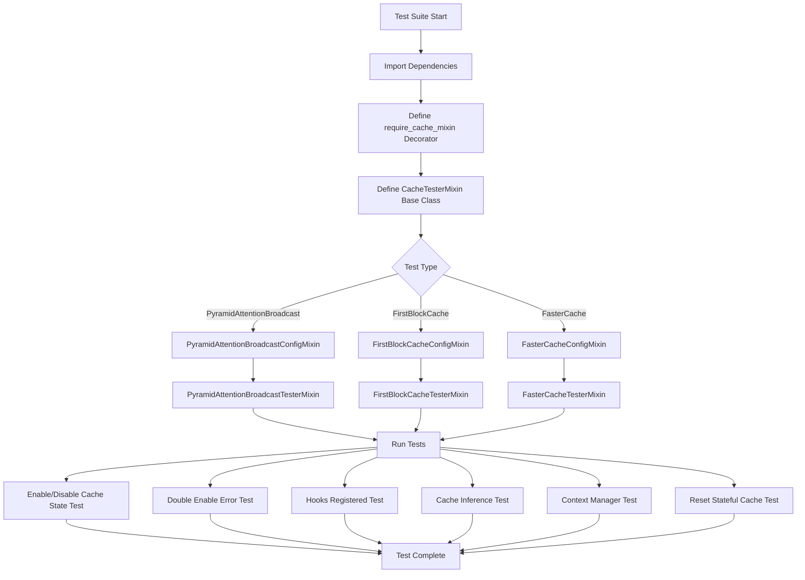

## 类结构

```
CacheTesterMixin (基础测试mixin)
├── PyramidAttentionBroadcastTesterMixin
│   └── 继承自: PyramidAttentionBroadcastConfigMixin + CacheTesterMixin
├── FirstBlockCacheTesterMixin
│   └── 继承自: FirstBlockCacheConfigMixin + CacheTesterMixin
└── FasterCacheTesterMixin
    └── 继承自: FasterCacheConfigMixin + CacheTesterMixin

Config Mixins (配置mixin):
├── PyramidAttentionBroadcastConfigMixin
├── FirstBlockCacheConfigMixin
└── FasterCacheConfigMixin

Decorators:
└── require_cache_mixin
```

## 全局变量及字段


### `_FASTER_CACHE_BLOCK_HOOK`
    
Hook name constant for FasterCache block-level caching, imported from diffusers.hooks.faster_cache

类型：`str`
    


### `_FASTER_CACHE_DENOISER_HOOK`
    
Hook name constant for FasterCache denoiser-level caching, imported from diffusers.hooks.faster_cache

类型：`str`
    


### `_FBC_BLOCK_HOOK`
    
Hook name constant for FirstBlockCache block-level caching, imported from diffusers.hooks.first_block_cache

类型：`str`
    


### `_FBC_LEADER_BLOCK_HOOK`
    
Hook name constant for FirstBlockCache leader block caching, imported from diffusers.hooks.first_block_cache

类型：`str`
    


### `_PYRAMID_ATTENTION_BROADCAST_HOOK`
    
Hook name constant for PyramidAttentionBroadcast caching, imported from diffusers.hooks.pyramid_attention_broadcast

类型：`str`
    


### `PyramidAttentionBroadcastConfigMixin.PAB_CONFIG`
    
Default configuration dictionary for PyramidAttentionBroadcast cache, containing spatial_attention_block_skip_range setting

类型：`dict`
    


### `PyramidAttentionBroadcastConfigMixin._current_timestep`
    
Store current timestep value for callback, used to determine when to skip attention computation in PyramidAttentionBroadcast

类型：`int`
    


### `FirstBlockCacheConfigMixin.FBC_CONFIG`
    
Default configuration dictionary for FirstBlockCache, containing threshold setting that controls caching aggressiveness

类型：`dict`
    


### `FasterCacheConfigMixin.FASTER_CACHE_CONFIG`
    
Default configuration dictionary for FasterCache, containing spatial_attention_block_skip_range, spatial_attention_timestep_skip_range, and tensor_format settings

类型：`dict`
    
    

## 全局函数及方法


### `require_cache_mixin`

该装饰器用于在测试执行前检查测试类的模型类是否继承自 `CacheMixin`，如果模型类未使用 `CacheMixin`，则跳过该测试。

参数：

- `func`：`Callable`，被装饰的函数（通常是测试方法）

返回值：`Callable`，返回包装后的函数对象

#### 流程图

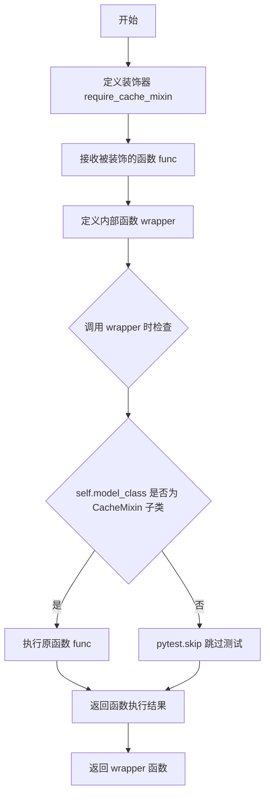

#### 带注释源码

```python
def require_cache_mixin(func):
    """Decorator to skip tests if model doesn't use CacheMixin."""

    def wrapper(self, *args, **kwargs):
        # 检查测试类的 model_class 是否继承自 CacheMixin
        if not issubclass(self.model_class, CacheMixin):
            # 如果模型类未使用 CacheMixin，则跳过该测试
            pytest.skip(f"{self.model_class.__name__} does not use CacheMixin.")
        # 否则正常执行被装饰的测试函数
        return func(self, *args, **kwargs)

    return wrapper
```


### `gc.collect`

`gc.collect` 是 Python 标准库中的垃圾回收函数，用于显式触发垃圾回收过程，释放无法访问的内存对象。在该代码中，它被用于测试方法的setup和teardown阶段，以确保在每个测试前后清理内存，防止测试间的内存污染。

参数： 无参数（调用时不传递任何参数）

返回值： `int`，返回已回收的对象数量

#### 流程图

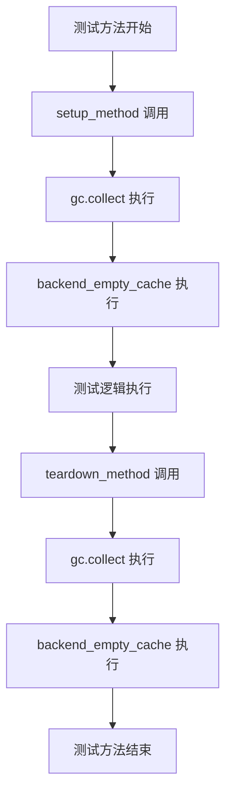

#### 带注释源码

```python
# coding=utf-8
# Copyright 2025 HuggingFace Inc.
#
# Licensed under the Apache License, Version 2.0 (the "License");
# you may not use this file except in compliance with the License.
# You may obtain a copy of the License at
#
#     http://www.apache.org/licenses/LICENSE-2.0
#
# Unless required by applicable law or agreed to in writing, software
# distributed under the License is distributed on an "AS IS" BASIS,
# WITHOUT WARRANTIES OR CONDITIONS OF ANY KIND, either express or implied.
# See the License for the specific language governing permissions and
# limitations under the License.

import gc  # 导入 Python 标准库的垃圾回收模块

import pytest
import torch

from diffusers.hooks import FasterCacheConfig, FirstBlockCacheConfig, PyramidAttentionBroadcastConfig
from diffusers.hooks.faster_cache import _FASTER_CACHE_BLOCK_HOOK, _FASTER_CACHE_DENOISER_HOOK
from diffusers.hooks.first_block_cache import _FBC_BLOCK_HOOK, _FBC_LEADER_BLOCK_HOOK
from diffusers.hooks.pyramid_attention_broadcast import _PYRAMID_ATTENTION_BROADCAST_HOOK
from diffusers.models.cache_utils import CacheMixin

from ...testing_utils import assert_tensors_close, backend_empty_cache, is_cache, torch_device


class CacheTesterMixin:
    """
    Base mixin class providing common test implementations for cache testing.
    
    此类提供了缓存测试的通用测试实现基类。
    """

    @property
    def cache_input_key(self):
        return "hidden_states"

    def setup_method(self):
        """
        测试方法 setup 阶段：清理内存
        
        在每个测试方法执行前调用，清理 Python 垃圾回收和 GPU 缓存
        """
        gc.collect()  # 显式触发 Python 垃圾回收，释放无法访问的对象内存
        backend_empty_cache(torch_device)  # 清理 GPU 缓存

    def teardown_method(self):
        """
        测试方法 teardown 阶段：清理内存
        
        在每个测试方法执行后调用，确保测试间的内存隔离
        """
        gc.collect()  # 显式触发 Python 垃圾回收，清理测试过程中产生的临时对象
        backend_empty_cache(torch_device)  # 清理 GPU 缓存
```


### `require_cache_mixin`

装饰器函数，用于在测试中跳过不支持 CacheMixin 的模型测试。

参数：

-  `func`：`Callable`，需要装饰的测试函数

返回值：`Callable`，装饰后的函数，如果模型不支持 CacheMixin 则跳过测试

#### 流程图

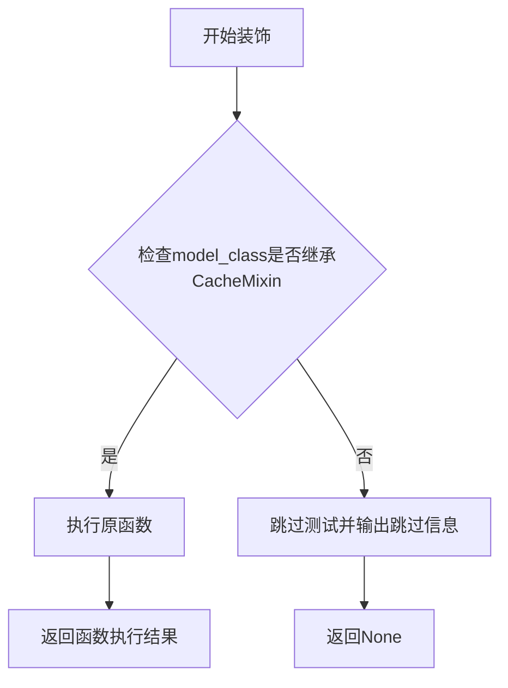

#### 带注释源码

```python
def require_cache_mixin(func):
    """Decorator to skip tests if model doesn't use CacheMixin."""

    def wrapper(self, *args, **kwargs):
        # 检查测试类的 model_class 是否继承自 CacheMixin
        if not issubclass(self.model_class, CacheMixin):
            # 如果不继承，则跳过测试并显示跳过原因
            pytest.skip(f"{self.model_class.__name__} does not use CacheMixin.")
        # 如果继承，则正常执行测试函数
        return func(self, *args, **kwargs)

    return wrapper
```

---

### `CacheTesterMixin._test_cache_double_enable_raises_error`

测试方法，验证缓存启用两次时会抛出 ValueError 异常。

参数：无（使用 self 中的模型类和相关配置）

返回值：`None`，通过 assert 验证行为

#### 流程图

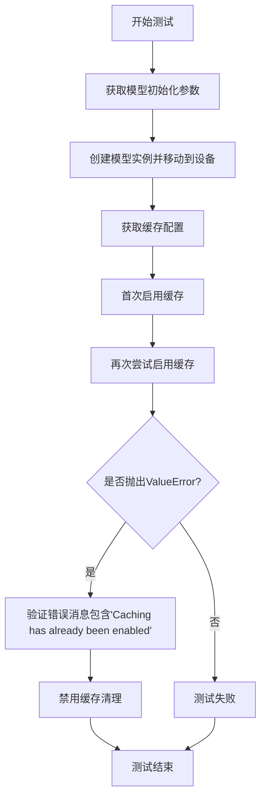

#### 带注释源码

```python
def _test_cache_double_enable_raises_error(self):
    """Test that enabling cache twice raises an error."""
    # 获取模型初始化参数字典
    init_dict = self.get_init_dict()
    # 创建模型实例并移动到指定设备
    model = self.model_class(**init_dict).to(torch_device)

    # 获取缓存配置
    config = self._get_cache_config()

    # 第一次启用缓存
    model.enable_cache(config)

    # 尝试第二次启用缓存，应该抛出 ValueError 异常
    with pytest.raises(ValueError, match="Caching has already been enabled"):
        model.enable_cache(config)

    # 清理：禁用缓存
    model.disable_cache()
```

---

### `CacheTesterMixin._test_cache_enable_disable_state`

测试方法，验证缓存启用和禁用状态正确更新。

参数：无

返回值：`None`，通过 assert 验证状态

#### 流程图

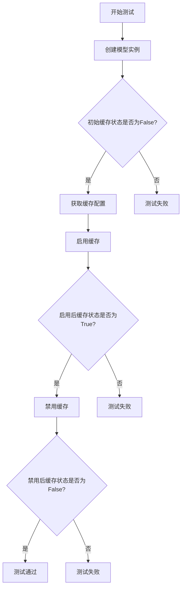

#### 带注释源码

```python
def _test_cache_enable_disable_state(self):
    """Test that cache enable/disable updates the is_cache_enabled state correctly."""
    # 获取初始化参数并创建模型
    init_dict = self.get_init_dict()
    model = self.model_class(**init_dict).to(torch_device)

    # 验证初始状态：缓存未启用
    assert not model.is_cache_enabled, "Cache should not be enabled initially."

    # 获取缓存配置
    config = self._get_cache_config()

    # 启用缓存
    model.enable_cache(config)
    assert model.is_cache_enabled, "Cache should be enabled after enable_cache()."

    # 禁用缓存
    model.disable_cache()
    assert not model.is_cache_enabled, "Cache should not be enabled after disable_cache()."
```

---

### `CacheTesterMixin._test_cache_hooks_registered`

测试方法，验证缓存钩子正确注册和移除。

参数：无

返回值：`None`，通过 assert 验证钩子注册情况

#### 流程图

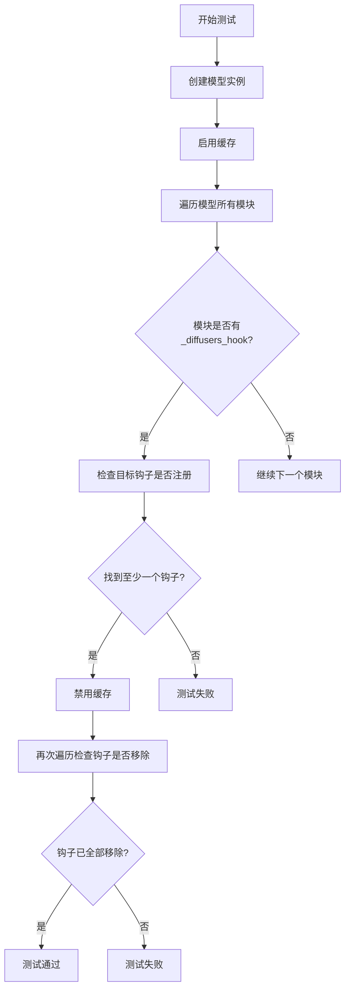

#### 带注释源码

```python
def _test_cache_hooks_registered(self):
    """Test that cache hooks are properly registered and removed."""
    # 创建模型实例
    init_dict = self.get_init_dict()
    model = self.model_class(**init_dict).to(torch_device)

    # 获取配置和钩子名称
    config = self._get_cache_config()
    hook_names = self._get_hook_names()

    # 启用缓存
    model.enable_cache(config)

    # 检查至少一个钩子被注册
    hook_count = 0
    for module in model.modules():
        if hasattr(module, "_diffusers_hook"):
            for hook_name in hook_names:
                hook = module._diffusers_hook.get_hook(hook_name)
                if hook is not None:
                    hook_count += 1

    assert hook_count > 0, f"At least one cache hook should be registered. Hook names: {hook_names}"

    # 禁用缓存并验证钩子被移除
    model.disable_cache()

    hook_count_after = 0
    for module in model.modules():
        if hasattr(module, "_diffusers_hook"):
            for hook_name in hook_names:
                hook = module._diffusers_hook.get_hook(hook_name)
                if hook is not None:
                    hook_count_after += 1

    assert hook_count_after == 0, "Cache hooks should be removed after disable_cache()."
```


# 设计文档：torch 导入分析

## 概述

本设计文档分析代码中的 `torch` 导入语句，该语句导入了 PyTorch 深度学习框架，是 diffusers 库进行张量计算和模型推理的基础依赖。

> **注意**：由于 `import torch` 是一个导入语句而非函数或方法，以下信息按照文档要求的格式进行了适配调整。

---

### `import torch`

将 PyTorch 框架导入当前命名空间，使其核心功能可用。

#### 流程图

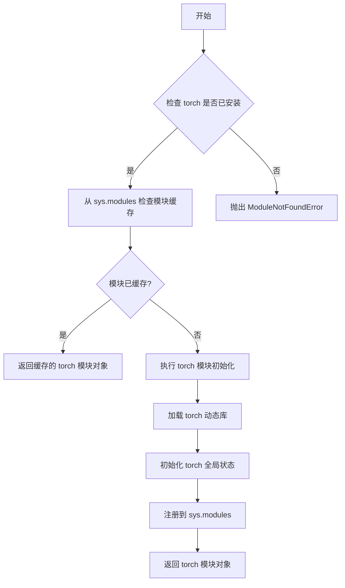

#### 源码位置

代码文件中的位置：
```python
# coding=utf-8
# Copyright 2025 HuggingFace Inc.
#
# Licensed under the Apache License, Version 2.0 (the "License");
# you may not use this file except in compliance with the License.
# You may obtain a copy of the License at
#
#     http://www.apache.org/licenses/LICENSE-2.0
#
# Unless required by applicable law or agreed to in writing, software
# distributed under the License is distributed on an "AS IS" BASIS,
# WITHOUT WARRANTIES OR CONDITIONS OF ANY KIND, either express or implied.
# See the License for the specific language governing permissions and
# limitations under the License.

import gc

import pytest
import torch  # <-- 目标导入语句

from diffusers.hooks import FasterCacheConfig, FirstBlockCacheConfig, PyramidAttentionBroadcastConfig
# ... 后续代码
```

---

## 依赖信息

| 依赖项 | 类型 | 描述 |
|--------|------|------|
| `gc` | 标准库 | Python 垃圾回收模块 |
| `pytest` | 第三方测试框架 | 用于单元测试 |
| `torch` | 第三方深度学习框架 | PyTorch 核心库 |
| `diffusers.hooks` | 项目内部模块 | 缓存配置和钩子 |
| `diffusers.models.cache_utils` | 项目内部模块 | 缓存混入类 |
| `testing_utils` | 项目内部测试工具 | 测试辅助函数 |

---

## 技术债务与优化空间

1. **隐式依赖**：代码中多处使用 `torch` 但未明确标注所需的具体版本或功能子集
2. **设备管理分散**：`torch_device` 的使用分散在各处，建议统一管理
3. **缓存测试重复**：三个缓存测试 mixin 中存在大量重复的测试方法，可考虑提取公共基类

---

## 外部接口契约

- **torch 版本要求**：≥ 1.0.0（建议查看项目 requirements.txt 获取确切版本）
- **设备支持**：通过 `torch_device` 变量支持 CPU/CUDA/MPS 等多种设备


### `require_cache_mixin.wrapper`

该函数是 `require_cache_mixin` 装饰器返回的内部包装函数，用于在测试执行前检查测试类所使用的模型类是否继承了 `CacheMixin`。如果模型类未使用 `CacheMixin`，则跳过该测试；否则正常执行被装饰的测试方法。

参数：

- `self`：`self`，测试类实例，用于访问 `self.model_class` 属性以判断模型是否使用 CacheMixin
- `*args`：可变位置参数，传递给被装饰测试函数的额外位置参数
- `**kwargs`：可变关键字参数，传递给被装饰测试函数的额外关键字参数

返回值：返回被装饰函数 `func` 的执行结果；如果模型类未使用 CacheMixin，则返回 `pytest.skip()` 的结果（测试跳过）

#### 流程图

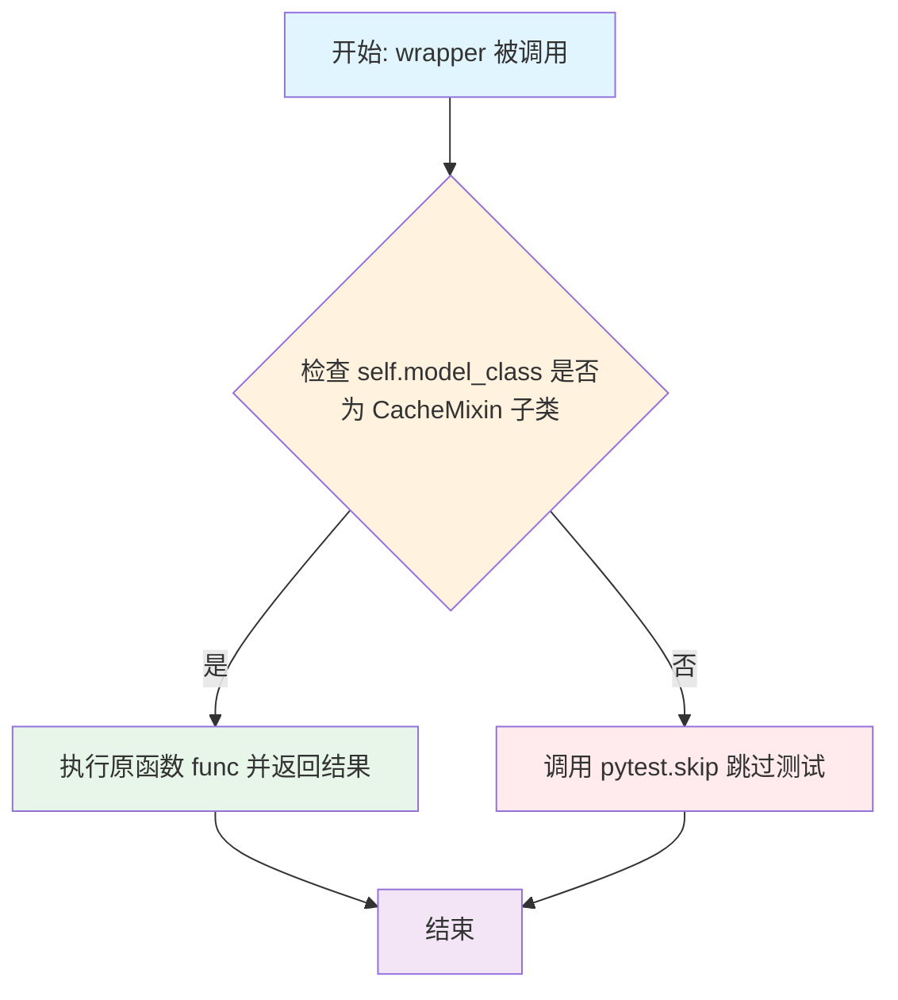

#### 带注释源码

```python
def require_cache_mixin(func):
    """
    装饰器：跳过不使用 CacheMixin 的模型的测试。
    
    该装饰器用于确保测试仅在模型类继承自 CacheMixin 时运行，
    因为缓存功能仅在实现 CacheMixin 的模型上可用。
    """

    def wrapper(self, *args, **kwargs):
        """
        包装函数：检查模型类是否使用 CacheMixin。
        
        参数:
            self: 测试类实例，必须包含 model_class 属性
            *args: 传递给被装饰函数的位置参数
            **kwargs: 传递给被装饰函数的关键字参数
        
        返回:
            如果模型使用 CacheMixin，返回原函数执行结果；
            否则跳过测试。
        """
        # 检查测试类的 model_class 是否是 CacheMixin 的子类
        if not issubclass(self.model_class, CacheMixin):
            # 如果不是 CacheMixin 子类，跳过该测试并显示原因
            pytest.skip(f"{self.model_class.__name__} does not use CacheMixin.")
        # 如果是 CacheMixin 子类，正常执行被装饰的测试函数
        return func(self, *args, **kwargs)

    return wrapper
```


### `CacheTesterMixin.cache_input_key`

这是一个属性方法，返回缓存输入键的名称。该属性用于指定在缓存测试中需要变化的输入张量键，以便在多次前向传播中模拟去噪过程。默认情况下，它返回 "hidden_states"，这对应于大多数扩散模型的主要输入张量。

参数：无

返回值：`str`，返回缓存输入键的名称，用于在测试中修改输入以验证缓存功能

#### 流程图

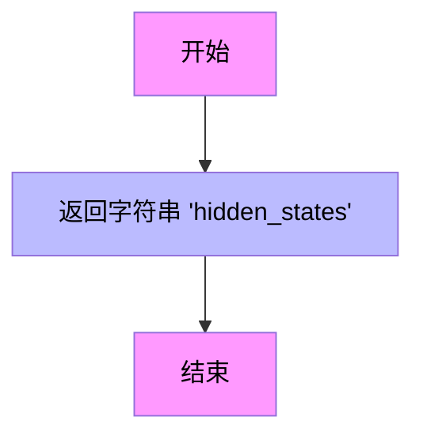

#### 带注释源码

```python
@property
def cache_input_key(self):
    """
    返回缓存输入键的属性方法。
    
    该属性指定了在缓存测试中需要变化的输入张量键名。
    在测试中，会对该键对应的张量添加噪声，以模拟不同去噪步骤的输入，
    从而验证缓存机制是否能正确处理变化的输入。
    
    Returns:
        str: 输入张量的键名，默认为 'hidden_states'，对应大多数扩散模型的主要输入
    """
    return "hidden_states"
```


### `CacheTesterMixin.setup_method`

该方法是 pytest 测试框架的钩子方法，在每个测试方法执行前自动调用，用于清理 Python 垃圾回收和 GPU 内存缓存，确保每次测试都在干净的环境中运行，避免因缓存残留导致的测试污染或内存溢出。

参数：无显式参数（`self` 为隐式实例参数）

返回值：`None`，无返回值

#### 流程图

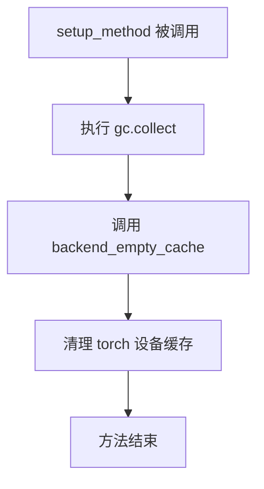

#### 带注释源码

```python
def setup_method(self):
    """
    pytest 钩子方法，在每个测试方法执行前调用。
    清理 Python 垃圾回收和 GPU 内存缓存，确保测试环境干净。
    """
    # 触发 Python 垃圾回收，释放未使用的 Python 对象内存
    gc.collect()
    
    # 清空 GPU/后端设备的 CUDA 缓存，防止显存泄漏
    backend_empty_cache(torch_device)
```


### `CacheTesterMixin.teardown_method`

用于在每个测试方法执行完成后进行资源清理，触发垃圾回收并清空GPU内存缓存。

参数：

- `self`：`CacheTesterMixin`，方法的隐式参数，代表类的实例本身

返回值：`None`，该方法不返回任何值，仅执行清理操作

#### 流程图

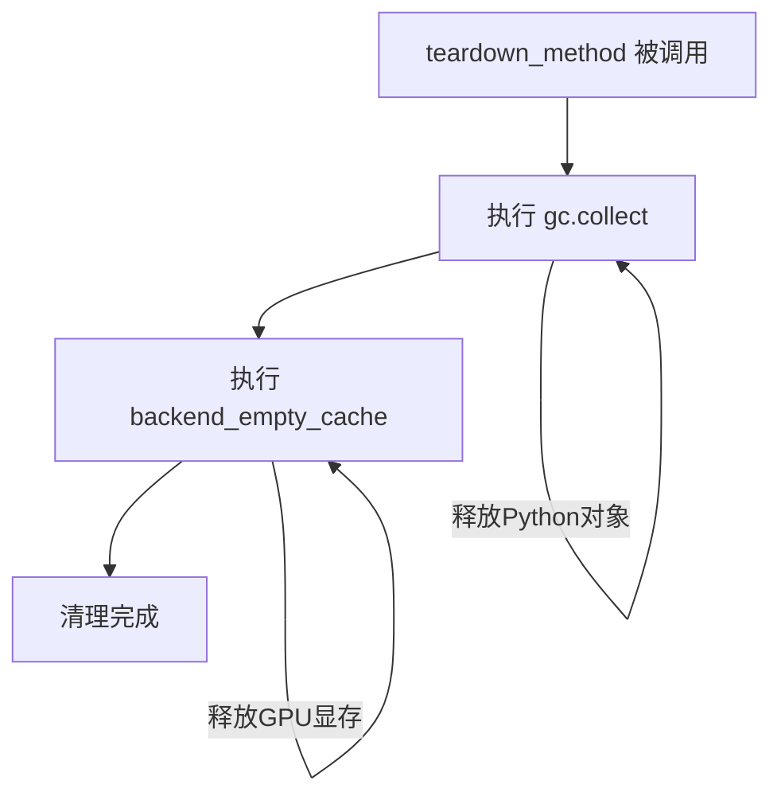

#### 带注释源码

```python
def teardown_method(self):
    """
    在每个测试方法执行完成后进行清理工作。
    
    该方法作为 pytest 的 teardown 机制的一部分，在每个测试方法运行结束后自动调用。
    负责清理可能残留的 Python 对象和 GPU 显存，防止测试之间的相互影响。
    """
    gc.collect()                          # 触发 Python 垃圾回收，清理无法访问的对象
    backend_empty_cache(torch_device)    # 清空当前 GPU 设备的显存缓存
```


### `CacheTesterMixin._get_cache_config`

获取缓存配置的方法，用于为测试提供缓存配置。该方法为抽象方法，由子类实现具体逻辑以返回不同的缓存配置对象（如 PyramidAttentionBroadcastConfig、FirstBlockCacheConfig 或 FasterCacheConfig）。

参数： 无（仅包含 `self` 参数）

返回值：`Any`（具体类型取决于子类实现），返回缓存配置对象，供 `enable_cache()` 方法使用

#### 流程图

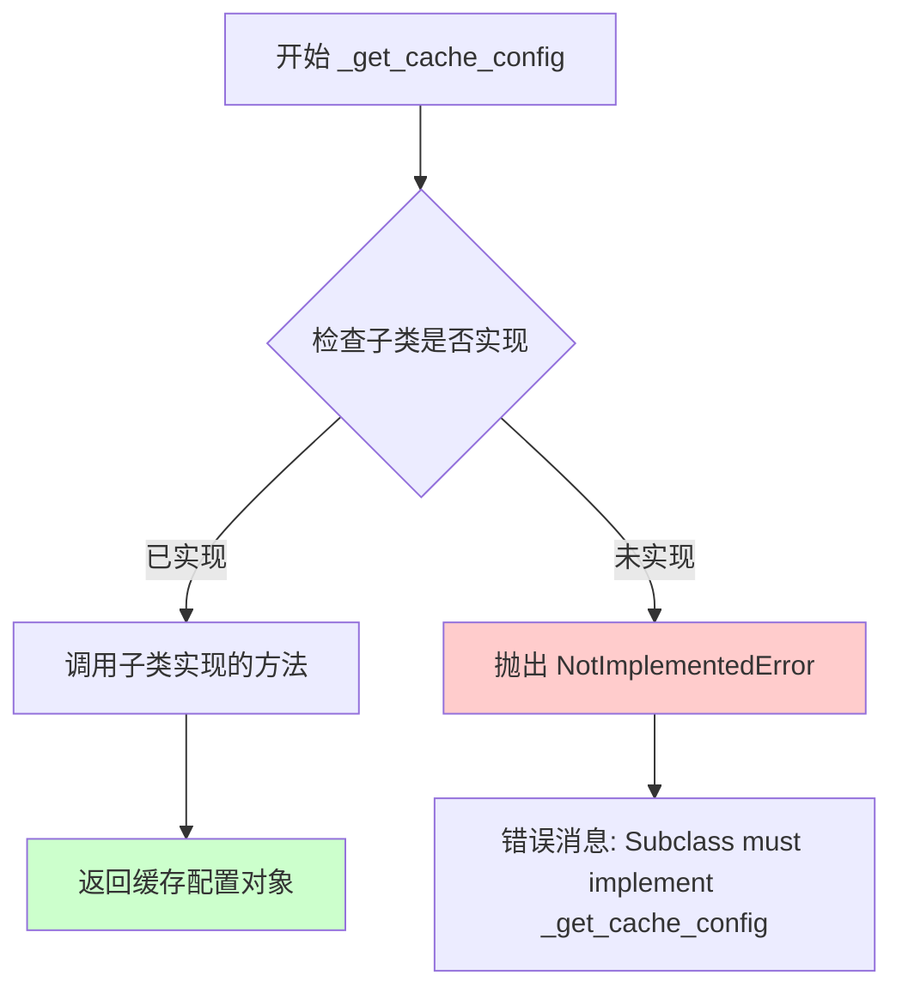

#### 带注释源码

```python
def _get_cache_config(self):
    """
    Get the cache config for testing.
    Should be implemented by subclasses.
    """
    # 抽象方法设计：基类不提供具体实现
    # 要求子类必须重写此方法以提供具体的缓存配置
    # 否则抛出 NotImplementedError 提示开发者实现
    raise NotImplementedError("Subclass must implement _get_cache_config")
```

---

### 子类实现示例（补充说明）

由于基类 `CacheTesterMixin._get_cache_config` 是抽象方法，实际使用时由子类重写。以下是三个主要子类的实现示例：

#### 1. `PyramidAttentionBroadcastConfigMixin._get_cache_config`

```python
def _get_cache_config(self):
    # 复制默认的 PAB 配置参数
    config_kwargs = self.PAB_CONFIG.copy()
    # 添加时间步回调函数，用于动态获取当前时间步
    config_kwargs["current_timestep_callback"] = lambda: self._current_timestep
    # 创建并返回 PyramidAttentionBroadcastConfig 对象
    return PyramidAttentionBroadcastConfig(**config_kwargs)
```

#### 2. `FirstBlockCacheConfigMixin._get_cache_config`

```python
def _get_cache_config(self):
    # 直接使用默认的 FBC 配置创建 FirstBlockCacheConfig 对象
    return FirstBlockCacheConfig(**self.FBC_CONFIG)
```

#### 3. `FasterCacheConfigMixin._get_cache_config`

```python
def _get_cache_config(self, current_timestep_callback=None):
    # 复制默认的 FasterCache 配置参数
    config_kwargs = self.FASTER_CACHE_CONFIG.copy()
    # 如果未提供时间步回调，则使用默认的返回 1000 的回调
    if current_timestep_callback is None:
        current_timestep_callback = lambda: 1000  # noqa: E731
    config_kwargs["current_timestep_callback"] = current_timestep_callback
    # 创建并返回 FasterCacheConfig 对象
    return FasterCacheConfig(**config_kwargs)
```


### `CacheTesterMixin._get_hook_names`

获取该缓存类型需要检查的钩子名称。是一个抽象方法，需要由子类实现。

参数：

- 无（除 `self` 外无显式参数）

返回值：`List[str]`，返回钩子名称字符串列表，用于后续验证缓存钩子是否正确注册。

#### 流程图

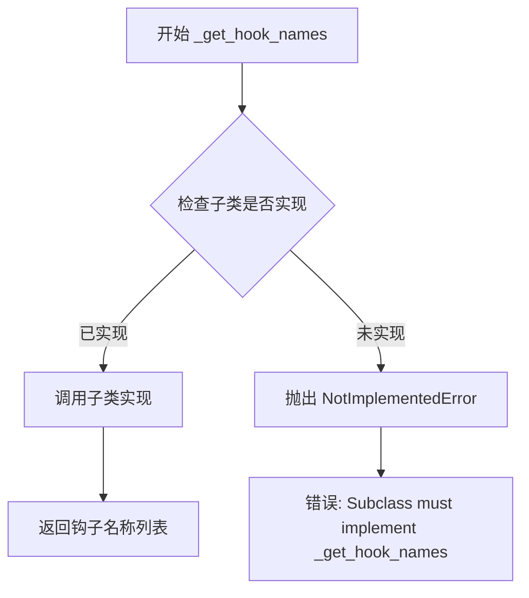

#### 带注释源码

```python
def _get_hook_names(self):
    """
    Get the hook names to check for this cache type.
    Should be implemented by subclasses.
    Returns a list of hook name strings.
    """
    # 这是一个抽象方法设计，要求子类必须实现此方法
    # 子类应根据不同的缓存类型返回对应的钩子名称列表
    # 例如：
    # - PyramidAttentionBroadcast 返回 [_PYRAMID_ATTENTION_BROADCAST_HOOK]
    # - FirstBlockCache 返回 [_FBC_LEADER_BLOCK_HOOK, _FBC_BLOCK_HOOK]
    # - FasterCache 返回 [_FASTER_CACHE_DENOISER_HOOK, _FASTER_CACHE_BLOCK_HOOK]
    raise NotImplementedError("Subclass must implement _get_hook_names")
```


### `CacheTesterMixin._test_cache_enable_disable_state`

该方法用于测试模型的缓存启用/禁用状态是否正确更新。它首先验证缓存初始处于禁用状态，然后启用缓存并检查状态，随后禁用缓存再次验证状态。

参数：

- `self`：调用该方法的实例对象隐式传入

返回值：`None`，该方法为测试方法，仅通过断言验证状态，不返回任何值

#### 流程图

```mermaid
flowchart TD
    A[开始测试] --> B[获取模型初始化参数字典 init_dict]
    B --> C[使用 init_dict 实例化模型并移动到设备]
    C --> D{assert: model.is_cache_enabled == False}
    D -->|通过| E[获取缓存配置 config]
    E --> F[调用 model.enable_cache(config)]
    F --> G{assert: model.is_cache_enabled == True}
    G -->|通过| H[调用 model.disable_cache()]
    H --> I{assert: model.is_cache_enabled == False}
    I -->|通过| J[测试通过]
    D -->|失败| K[抛出 AssertionError: Cache should not be enabled initially]
    G -->|失败| L[抛出 AssertionError: Cache should be enabled after enable_cache]
    I -->|失败| M[抛出 AssertionError: Cache should not be enabled after disable_cache]
```

#### 带注释源码

```python
def _test_cache_enable_disable_state(self):
    """Test that cache enable/disable updates the is_cache_enabled state correctly."""
    # 获取模型的初始化参数字典，由子类实现提供
    init_dict = self.get_init_dict()
    # 使用初始化参数实例化模型，并将其移动到指定的计算设备
    model = self.model_class(**init_dict).to(torch_device)

    # 初始状态验证：缓存应该处于禁用状态
    assert not model.is_cache_enabled, "Cache should not be enabled initially."

    # 获取缓存配置，由子类实现提供（如 PyramidAttentionBroadcastConfig、FirstBlockCacheConfig 等）
    config = self._get_cache_config()

    # 启用缓存功能
    model.enable_cache(config)
    # 验证启用后 is_cache_enabled 状态为 True
    assert model.is_cache_enabled, "Cache should be enabled after enable_cache()."

    # 禁用缓存功能
    model.disable_cache()
    # 验证禁用后 is_cache_enabled 状态恢复为 False
    assert not model.is_cache_enabled, "Cache should not be enabled after disable_cache()."
```


### `CacheTesterMixin._test_cache_double_enable_raises_error`

测试当缓存被重复启用时是否正确抛出错误。

参数：

- `self`：`CacheTesterMixin`，隐式参数，测试mixin类实例本身

返回值：`None`，无返回值，该方法为测试方法，通过pytest断言验证行为

#### 流程图

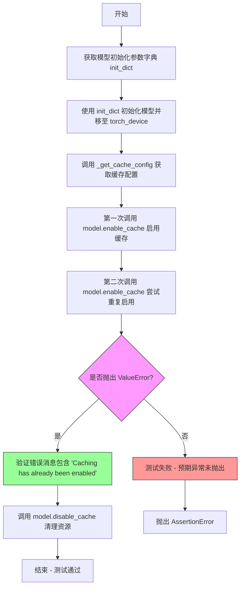

#### 带注释源码

```python
def _test_cache_double_enable_raises_error(self):
    """Test that enabling cache twice raises an error."""
    # 获取模型初始化所需的参数字典
    # 由子类实现，返回模型构造所需的配置字典
    init_dict = self.get_init_dict()
    
    # 使用初始化字典实例化模型，并将其移至指定的计算设备
    # torch_device 是模块级别的全局变量，表示目标设备（如 'cuda' 或 'cpu'）
    model = self.model_class(**init_dict).to(torch_device)

    # 获取缓存配置，该方法由子类具体实现
    # 根据不同的缓存类型（PAB、FBC、FasterCache）返回对应的配置对象
    config = self._get_cache_config()

    # 第一次启用缓存，使模型进入缓存模式
    # 此后模型的推理将使用缓存机制来加速
    model.enable_cache(config)

    # 尝试第二次启用缓存，根据设计应抛出 ValueError
    # 使用 pytest.raises 上下文管理器捕获并验证异常
    # match 参数指定期望在异常消息中出现的字符串
    with pytest.raises(ValueError, match="Caching has already been enabled"):
        model.enable_cache(config)

    # 清理：禁用缓存以释放资源
    # 这是测试后的标准清理操作，确保不污染后续测试
    model.disable_cache()
```


### `CacheTesterMixin._test_cache_hooks_registered`

该方法用于测试缓存钩子是否正确注册和移除。它通过启用缓存配置后遍历模型的所有模块，检查指定的钩子是否已注册，然后禁用缓存并验证钩子是否被正确移除。

参数： 无显式参数（方法只使用 `self` 隐式参数）

返回值：`None`，该方法通过断言进行验证，不返回任何值

#### 流程图

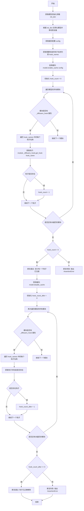

#### 带注释源码

```python
def _test_cache_hooks_registered(self):
    """Test that cache hooks are properly registered and removed."""
    # 获取模型初始化参数字典
    init_dict = self.get_init_dict()
    # 使用初始化参数创建模型实例，并移动到指定设备
    model = self.model_class(**init_dict).to(torch_device)

    # 获取缓存配置（由子类实现）
    config = self._get_cache_config()
    # 获取需要检查的钩子名称列表（由子类实现）
    hook_names = self._get_hook_names()

    # 启用缓存，传入配置
    model.enable_cache(config)

    # 检查至少有一个钩子被注册
    hook_count = 0
    # 遍历模型的所有模块
    for module in model.modules():
        # 检查模块是否有 _diffusers_hook 属性（钩子管理器）
        if hasattr(module, "_diffusers_hook"):
            # 遍历需要检查的钩子名称
            for hook_name in hook_names:
                # 从模块的钩子管理器中获取指定名称的钩子
                hook = module._diffusers_hook.get_hook(hook_name)
                # 如果钩子存在，则计数加一
                if hook is not None:
                    hook_count += 1

    # 断言：至少应该有一个钩子被注册
    assert hook_count > 0, f"At least one cache hook should be registered. Hook names: {hook_names}"

    # 禁用缓存并验证钩子被移除
    model.disable_cache()

    hook_count_after = 0
    # 再次遍历模型的所有模块
    for module in model.modules():
        if hasattr(module, "_diffusers_hook"):
            for hook_name in hook_names:
                hook = module._diffusers_hook.get_hook(hook_name)
                if hook is not None:
                    hook_count_after += 1

    # 断言：禁用缓存后，所有钩子都应该被移除
    assert hook_count_after == 0, "Cache hooks should be removed after disable_cache()."
```


### `CacheTesterMixin._test_cache_inference`

该方法用于测试模型在启用缓存功能后能否正常运行推理，验证缓存机制能够正确保存和复用注意力信息，并与非缓存模式的输出存在差异（由于缓存的近似计算特性）。

参数：

- `self`：`CacheTesterMixin` 类的实例，隐式参数，无需手动传入

返回值：`None`，该方法为测试方法，通过断言验证缓存功能，不返回任何值

#### 流程图

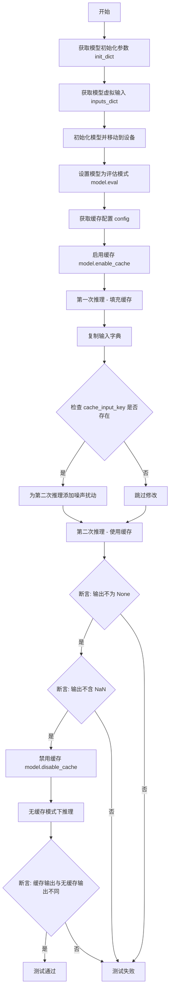

#### 带注释源码

```python
@torch.no_grad()
def _test_cache_inference(self):
    """
    测试模型在启用缓存时能否正常运行推理。
    验证缓存机制能够正确保存和复用注意力信息，
    并确保缓存输出与非缓存输出存在差异（由于近似计算）。
    """
    # 1. 获取模型初始化参数（由子类实现）
    init_dict = self.get_init_dict()
    
    # 2. 获取模型虚拟输入（由子类实现）
    inputs_dict = self.get_dummy_inputs()
    
    # 3. 初始化模型并移动到测试设备
    model = self.model_class(**init_dict).to(torch_device)
    # 4. 设置为评估模式（禁用 dropout 等训练层）
    model.eval()

    # 5. 获取缓存配置（由子类实现）
    config = self._get_cache_config()

    # 6. 启用缓存功能
    model.enable_cache(config)

    # 7. 第一次推理：填充缓存
    #    此时模型会计算并保存注意力信息到缓存中
    _ = model(**inputs_dict, return_dict=False)[0]

    # 8. 创建第二次推理的输入（修改输入以模拟去噪过程）
    inputs_dict_step2 = inputs_dict.copy()
    #    检查是否存在可变的输入键（默认为 "hidden_states"）
    if self.cache_input_key in inputs_dict_step2:
        #    对输入添加随机噪声，模拟不同去噪步骤的输入
        inputs_dict_step2[self.cache_input_key] = inputs_dict_step2[self.cache_input_key] + torch.randn_like(
            inputs_dict_step2[self.cache_input_key]
        )

    # 9. 第二次推理：使用缓存的注意力信息
    #    此时模型应使用之前缓存的注意力进行近似计算
    output_with_cache = model(**inputs_dict_step2, return_dict=False)[0]

    # 10. 断言：输出不为空
    assert output_with_cache is not None, "Model output should not be None with cache enabled."
    
    # 11. 断言：输出不含 NaN（验证数值稳定性）
    assert not torch.isnan(output_with_cache).any(), "Model output contains NaN with cache enabled."

    # 12. 禁用缓存，以便进行对比测试
    model.disable_cache()
    
    # 13. 使用相同输入在无缓存模式下推理
    output_without_cache = model(**inputs_dict_step2, return_dict=False)[0]

    # 14. 断言：缓存输出应与非缓存输出不同
    #      由于缓存使用近似计算，输出应该存在差异
    assert not torch.allclose(output_without_cache, output_with_cache, atol=1e-5), (
        "Cached output should be different from non-cached output due to cache approximation."
    )
```


### `CacheTesterMixin._test_cache_context_manager`

测试 cache_context 上下文管理器是否正确隔离缓存状态，确保在不同缓存上下文中第一次推理产生相同的输出。

参数：

- `self`：`CacheTesterMixin`，测试类的实例，包含模型类和测试方法
- `atol`：`float`，绝对容差，默认为 `1e-5`，用于张量比较
- `rtol`：`float`，相对容差，默认为 `0`，用于张量比较

返回值：`None`，该方法通过断言验证缓存上下文行为，不返回任何值

#### 流程图

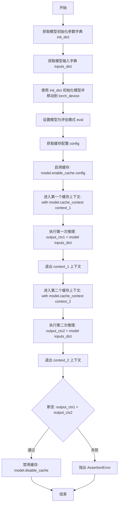

#### 带注释源码

```python
@torch.no_grad()
def _test_cache_context_manager(self, atol=1e-5, rtol=0):
    """Test the cache_context context manager properly isolates cache state."""
    # 获取模型初始化参数字典 - 由子类实现
    init_dict = self.get_init_dict()
    # 获取模型输入字典 - 由子类实现
    inputs_dict = self.get_dummy_inputs()
    # 使用初始化参数创建模型实例并移至指定设备
    model = self.model_class(**init_dict).to(torch_device)
    # 设置为评估模式，禁用 dropout 等训练特定行为
    model.eval()

    # 获取缓存配置，由子类实现返回具体配置
    config = self._get_cache_config()
    # 启用缓存功能
    model.enable_cache(config)

    # 在第一个缓存上下文中运行推理
    # cache_context 应该隔离缓存状态，每次进入都是新的缓存
    with model.cache_context("context_1"):
        # 执行第一次推理，缓存上下文会自动重置缓存
        output_ctx1 = model(**inputs_dict, return_dict=False)[0]

    # 在第二个缓存上下文中运行推理
    # 由于缓存被重置，应该产生与第一个上下文相同的结果
    with model.cache_context("context_2"):
        output_ctx2 = model(**inputs_dict, return_dict=False)[0]

    # 断言：两个不同缓存上下文中的第一次推理应该产生相同的输出
    # 因为缓存每次进入上下文时都会被重置
    assert_tensors_close(
        output_ctx1,
        output_ctx2,
        atol=atol,
        rtol=rtol,
        msg="First pass in different cache contexts should produce the same output.",
    )

    # 清理：禁用缓存
    model.disable_cache()
```


### `CacheTesterMixin._test_reset_stateful_cache`

该方法是一个测试用的实例方法，用于验证模型的 `_reset_stateful_cache` 方法能够正确重置有状态缓存。通过创建模型实例、启用缓存、执行一次前向传播、调用重置方法，最后禁用缓存来完成测试流程。

参数：

- `self`：`CacheTesterMixin`，测试mixin类的实例，隐式参数，用于访问类属性和方法

返回值：`None`，该方法为测试方法，不返回任何值，仅通过断言验证内部状态

#### 流程图

```mermaid
flowchart TD
    A[开始] --> B[获取模型初始化参数字典: init_dict = self.get_init_dict]
    B --> C[获取模型虚拟输入: inputs_dict = self.get_dummy_inputs]
    C --> D[创建模型实例并移动到设备: model = self.model_class(**init_dict).totorch_device]
    D --> E[设置模型为评估模式: model.eval]
    E --> F[获取缓存配置: config = self._get_cache_config]
    F --> G[启用缓存: model.enable_cacheconfig]
    G --> H[执行前向传播填充缓存: _ = model\*\*inputs_dict, return_dict=False[0]]
    H --> I[调用_reset_stateful_cache重置缓存: model._reset_stateful_cache]
    I --> J[禁用缓存: model.disable_cache]
    J --> K[结束]
```

#### 带注释源码

```python
@torch.no_grad()
def _test_reset_stateful_cache(self):
    """Test that _reset_stateful_cache resets the cache state."""
    # 获取模型初始化参数字典，由子类实现提供
    init_dict = self.get_init_dict()
    # 获取模型虚拟输入数据，由子类实现提供
    inputs_dict = self.get_dummy_inputs()
    # 实例化模型并移动到指定设备
    model = self.model_class(**init_dict).to(torch_device)
    # 设置模型为评估模式，禁用dropout等训练特定层
    model.eval()

    # 获取缓存配置，由子类实现提供
    config = self._get_cache_config()

    # 启用指定配置的缓存
    model.enable_cache(config)

    # 执行第一次前向传播，填充缓存状态
    # 不使用return_dict，索引获取第一个输出张量
    _ = model(**inputs_dict, return_dict=False)[0]

    # 调用待测试的_reset_stateful_cache方法，重置有状态缓存
    model._reset_stateful_cache()

    # 清理：禁用缓存
    model.disable_cache()
```


### `PyramidAttentionBroadcastConfigMixin._get_cache_config`

该方法用于获取 PyramidAttentionBroadcast 缓存测试配置。它通过复制默认的 PAB 配置，并添加一个时间步回调函数来创建并返回 `PyramidAttentionBroadcastConfig` 对象。

参数：

- `self`：`PyramidAttentionBroadcastConfigMixin` 实例，隐式参数，表示当前mixin类的实例

返回值：`PyramidAttentionBroadcastConfig`，返回配置好的 PyramidAttentionBroadcast 缓存配置对象，包含空间注意力块跳过范围和时间步回调函数。

#### 流程图

```mermaid
flowchart TD
    A[开始] --> B[复制 PAB_CONFIG 字典]
    B --> C[创建时间步回调函数: lambda: self._current_timestep]
    C --> D[将回调函数添加到 config_kwargs]
    D --> E[使用 config_kwargs 实例化 PyramidAttentionBroadcastConfig]
    E --> F[返回配置对象]
```

#### 带注释源码

```python
def _get_cache_config(self):
    """
    Get the cache config for testing.
    Should be implemented by subclasses.
    """
    # 复制默认的 PAB_CONFIG 字典，避免修改类属性
    config_kwargs = self.PAB_CONFIG.copy()
    
    # 添加当前时间步回调函数，用于在推理时动态获取时间步
    # 默认时间步为 500（在类属性 _current_timestep 中定义）
    # 该时间步需要落在默认范围 (100, 800) 内才能触发跳过机制
    config_kwargs["current_timestep_callback"] = lambda: self._current_timestep
    
    # 使用配置参数创建 PyramidAttentionBroadcastConfig 对象并返回
    return PyramidAttentionBroadcastConfig(**config_kwargs)
```


### `PyramidAttentionBroadcastConfigMixin._get_hook_names`

获取 PyramidAttentionBroadcast 缓存类型对应的 hook 名称列表，用于验证缓存 hooks 是否正确注册。

参数：无

返回值：`list[str]`，返回包含 PyramidAttentionBroadcast hook 名称的列表，用于测试中验证缓存 hooks 是否正确注册和移除。

#### 流程图

```mermaid
flowchart TD
    A[开始 _get_hook_names] --> B[返回列表 [_PYRAMID_ATTENTION_BROADCAST_HOOK]]
    B --> C[结束]
```

#### 带注释源码

```python
def _get_hook_names(self):
    """
    Get the hook names to check for this cache type.
    Should be implemented by subclasses.
    Returns a list of hook name strings.
    """
    # 返回 PyramidAttentionBroadcast 缓存类型对应的 hook 名称列表
    # 该 hook 名称在 diffusers.hooks.pyramid_attention_broadcast 模块中定义
    return [_PYRAMID_ATTENTION_BROADCAST_HOOK]
```


### `PyramidAttentionBroadcastTesterMixin.test_pab_cache_enable_disable_state`

该方法是一个测试用例，用于验证 PyramidAttentionBroadcast 缓存的启用和禁用状态是否正确更新。它首先检查初始状态下缓存未启用，然后启用缓存并验证状态变为已启用，最后禁用缓存并验证状态恢复为未启用。

参数：

- `self`：`PyramidAttentionBroadcastTesterMixin` 实例，测试类的实例本身，用于调用父类方法获取模型初始化参数和缓存配置

返回值：`None`，该方法为测试方法，不返回任何值，仅通过断言验证缓存状态

#### 流程图

```mermaid
flowchart TD
    A[开始测试] --> B[获取模型初始化参数 get_init_dict]
    B --> C[使用模型类初始化模型并移动到设备]
    C --> D{断言: is_cache_enabled == False}
    D -->|通过| E[获取缓存配置 _get_cache_config]
    D -->|失败| F[测试失败: 初始状态缓存应禁用]
    E --> G[调用 model.enable_cache启用缓存]
    G --> H{断言: is_cache_enabled == True}
    H -->|通过| I[调用 model.disable_cache禁用缓存]
    H -->|失败| J[测试失败: 启用缓存后状态应为True]
    I --> K{断言: is_cache_enabled == False}
    K -->|通过| L[测试通过]
    K -->|失败| M[测试失败: 禁用缓存后状态应为False]
```

#### 带注释源码

```python
@require_cache_mixin  # 装饰器：检查模型是否使用CacheMixin，未使用则跳过测试
def test_pab_cache_enable_disable_state(self):
    """
    测试PyramidAttentionBroadcast缓存的启用/禁用状态是否正确更新。
    
    该测试方法验证：
    1. 初始状态下缓存未启用
    2. 调用enable_cache后，is_cache_enabled变为True
    3. 调用disable_cache后，is_cache_enabled变为False
    """
    # 调用父类CacheTesterMixin的测试方法
    # 父类方法实现了完整的缓存状态测试逻辑
    self._test_cache_enable_disable_state()
```

---

**关联的父类方法详情** (`CacheTesterMixin._test_cache_enable_disable_state`):

```python
def _test_cache_enable_disable_state(self):
    """Test that cache enable/disable updates the is_cache_enabled state correctly."""
    # 步骤1: 获取模型初始化参数字典
    init_dict = self.get_init_dict()
    
    # 步骤2: 初始化模型并移动到指定设备
    model = self.model_class(**init_dict).to(torch_device)

    # 步骤3: 验证初始状态缓存未启用
    # Initially cache should not be enabled
    assert not model.is_cache_enabled, "Cache should not be enabled initially."

    # 步骤4: 获取缓存配置
    config = self._get_cache_config()

    # 步骤5: 启用缓存
    # Enable cache
    model.enable_cache(config)
    # 验证启用后状态
    assert model.is_cache_enabled, "Cache should be enabled after enable_cache()."

    # 步骤6: 禁用缓存
    # Disable cache
    model.disable_cache()
    # 验证禁用后状态
    assert not model.is_cache_enabled, "Cache should not be enabled after disable_cache()."
```


### `PyramidAttentionBroadcastTesterMixin.test_pab_cache_double_enable_raises_error`

该测试方法用于验证在缓存已启用的情况下，再次调用 `enable_cache` 方法时会抛出 `ValueError` 异常。它通过调用父类 `CacheTesterMixin` 中实现的 `_test_cache_double_enable_raises_error` 方法来完成测试逻辑。

参数：

- `self`：`PyramidAttentionBroadcastTesterMixin`，测试类的实例，包含模型类 `model_class`、初始化字典方法 `get_init_dict()` 和缓存配置方法 `_get_cache_config()`

返回值：`None`，该方法为测试方法，不返回任何值，仅通过 `pytest.raises` 验证异常抛出

#### 流程图

```mermaid
flowchart TD
    A[开始测试] --> B[调用 get_init_dict 获取模型初始化参数]
    B --> C[使用 model_class 实例化模型并移动到 torch_device]
    C --> D[调用 _get_cache_config 获取缓存配置]
    D --> E[调用 model.enable_cache 首次启用缓存]
    E --> F[再次调用 model.enable_cache 尝试重复启用缓存]
    F --> G{是否抛出 ValueError}
    G -->|是| H[验证错误消息包含 'Caching has already been enabled']
    H --> I[调用 model.disable_cache 清理资源]
    I --> J[测试通过]
    G -->|否| K[测试失败 - 未抛出预期异常]
```

#### 带注释源码

```python
@require_cache_mixin
def test_pab_cache_double_enable_raises_error(self):
    """
    测试在缓存已启用时，再次启用缓存会抛出 ValueError。
    
    该方法是一个测试用例，使用 @require_cache_mixin 装饰器确保
    被测试的模型类使用了 CacheMixin。
    """
    # 调用父类 CacheTesterMixin 中实现的测试逻辑
    self._test_cache_double_enable_raises_error()


# 下面是 _test_cache_double_enable_raises_error 方法（在 CacheTesterMixin 中定义）
def _test_cache_double_enable_raises_error(self):
    """Test that enabling cache twice raises an error."""
    # 1. 获取模型初始化参数字典
    init_dict = self.get_init_dict()
    # 2. 实例化模型并移动到指定设备
    model = self.model_class(**init_dict).to(torch_device)

    # 3. 获取缓存配置
    config = self._get_cache_config()

    # 4. 第一次启用缓存
    model.enable_cache(config)

    # 5. 尝试第二次启用缓存，预期抛出 ValueError
    # pytest.raises 上下文管理器验证是否抛出指定异常及错误消息
    with pytest.raises(ValueError, match="Caching has already been enabled"):
        model.enable_cache(config)

    # 6. 清理：禁用缓存
    model.disable_cache()
```


### `PyramidAttentionBroadcastTesterMixin.test_pab_cache_hooks_registered`

该方法用于测试 PyramidAttentionBroadcast 缓存的钩子是否正确注册和移除。它调用了父类 `CacheTesterMixin` 中的 `_test_cache_hooks_registered` 方法，验证在启用缓存后钩子被正确注册，在禁用缓存后钩子被正确移除。

参数：此方法无显式参数（继承自 `unittest.TestCase`，隐式参数 `self` 表示测试用例实例）。

返回值：无返回值（`None`），该方法为测试方法，通过断言进行验证。

#### 流程图

```mermaid
flowchart TD
    A[开始测试] --> B[获取模型初始化参数字典]
    B --> C[使用模型类初始化模型并移动到设备]
    C --> D[获取缓存配置和钩子名称列表]
    D --> E[调用 model.enable_cache 启用缓存]
    E --> F[遍历模型所有模块]
    F --> G{模块有 _diffusers_hook?}
    G -->|是| H[检查指定钩子是否注册]
    G -->|否| I[继续下一个模块]
    H --> J{找到钩子?}
    J -->|是| K[hook_count + 1]
    J -->|否| I
    K --> I
    I --> L{还有模块未遍历?}
    L -->|是| F
    L -->|否| M{hook_count > 0?}
    M -->|是| N[断言通过]
    M -->|否| O[抛出 AssertionError]
    N --> P[调用 model.disable_cache 禁用缓存]
    P --> Q[再次遍历模型检查钩子是否移除]
    Q --> R{hook_count_after == 0?}
    R -->|是| S[测试通过]
    R -->|否| T[抛出 AssertionError: 钩子未移除]
    O --> U[测试失败]
    T --> U
    S --> U
```

#### 带注释源码

```python
@require_cache_mixin
def test_pab_cache_hooks_registered(self):
    """
    测试 PyramidAttentionBroadcast 缓存钩子是否正确注册和移除。
    
    该方法是一个测试入口点，使用 @require_cache_mixin 装饰器确保
    被测试的模型类继承自 CacheMixin。
    """
    # 调用父类 CacheTesterMixin 中的实际测试实现
    self._test_cache_hooks_registered()
```

---

### `CacheTesterMixin._test_cache_hooks_registered`

该方法是实际的测试实现逻辑，被 `PyramidAttentionBroadcastTesterMixin.test_pab_cache_hooks_registered` 调用。用于验证缓存钩子在启用缓存时被正确注册，在禁用缓存时被完全移除。

参数：此方法无显式参数（隐式参数 `self` 表示测试用例实例）。

返回值：无返回值（`None`），通过 `assert` 断言进行验证。

#### 流程图

```mermaid
flowchart TD
    A[开始] --> B[获取 init_dict]
    B --> C[初始化模型并移动到设备]
    C --> D[获取缓存配置 config]
    D --> E[获取钩子名称列表 hook_names]
    E --> F[model.enable_cache 启用缓存]
    F --> G[初始化 hook_count = 0]
    G --> H[遍历 model.modules]
    H --> I{模块有 _diffusers_hook?}
    I -->|是| J[遍历 hook_names]
    J --> K[获取钩子 hook]
    K --> L{hook 不为 None?}
    L -->|是| M[hook_count++]
    L -->|否| N[继续下一个 hook_name]
    I -->|否| O[继续下一个模块]
    M --> N
    N --> O
    O --> P{遍历完所有模块?}
    P -->|否| H
    P -->|是| Q{hook_count > 0?}
    Q -->|是| R[断言通过]
    Q -->|否| S[抛出 AssertionError]
    R --> T[model.disable_cache 禁用缓存]
    T --> U[hook_count_after = 0]
    U --> V[遍历模型检查钩子]
    V --> W{找到钩子?}
    W -->|是| X[hook_count_after++]
    W -->|否| Y[继续]
    X --> Y
    Y --> Z{遍历完所有模块?}
    Z -->|否| V
    Z -->|是| AA{hook_count_after == 0?}
    AA -->|是| BB[测试通过]
    AA -->|否| CC[抛出 AssertionError: 钩子未移除]
```

#### 带注释源码

```python
def _test_cache_hooks_registered(self):
    """Test that cache hooks are properly registered and removed."""
    # 获取模型初始化参数字典（由子类实现）
    init_dict = self.get_init_dict()
    # 初始化模型并移动到指定设备（如 CUDA）
    model = self.model_class(**init_dict).to(torch_device)

    # 获取缓存配置（子类实现，如 PyramidAttentionBroadcastConfig）
    config = self._get_cache_config()
    # 获取要检查的钩子名称列表
    hook_names = self._get_hook_names()

    # 启用缓存，触发钩子注册
    model.enable_cache(config)

    # 检查至少有一个钩子被注册
    hook_count = 0
    # 遍历模型的所有模块
    for module in model.modules():
        # 检查模块是否有 _diffusers_hook 属性
        if hasattr(module, "_diffusers_hook"):
            # 遍历要检查的钩子名称
            for hook_name in hook_names:
                # 获取钩子实例
                hook = module._diffusers_hook.get_hook(hook_name)
                if hook is not None:
                    # 找到注册的钩子，计数加一
                    hook_count += 1

    # 断言至少注册了一个钩子
    assert hook_count > 0, f"At least one cache hook should be registered. Hook names: {hook_names}"

    # 禁用缓存，触发钩子移除
    model.disable_cache()

    # 验证钩子已被移除
    hook_count_after = 0
    for module in model.modules():
        if hasattr(module, "_diffusers_hook"):
            for hook_name in hook_names:
                hook = module._diffusers_hook.get_hook(hook_name)
                if hook is not None:
                    hook_count_after += 1

    # 断言所有钩子已被移除
    assert hook_count_after == 0, "Cache hooks should be removed after disable_cache()."
```

---

### 相关辅助方法

#### `PyramidAttentionBroadcastConfigMixin._get_hook_names`

返回 PyramidAttentionBroadcast 需要检查的钩子名称列表。

参数：无

返回值：`list`，包含钩子名称的列表 `[_PYRAMID_ATTENTION_BROADCAST_HOOK]`

```python
def _get_hook_names(self):
    return [_PYRAMID_ATTENTION_BROADCAST_HOOK]
```


### `PyramidAttentionBroadcastTesterMixin.test_pab_cache_inference`

该方法用于测试在启用 PyramidAttentionBroadcast 缓存的情况下，模型能否正确执行推理。它首先启用缓存，运行第一次前向传播填充缓存，然后使用修改后的输入运行第二次前向传播，最后验证缓存输出与无缓存输出的差异，以确认缓存近似机制正常工作。

参数：

- `self`：隐式参数，指向测试类实例本身

返回值：`None`，该方法为测试方法，无返回值，通过断言验证行为

#### 流程图

```mermaid
flowchart TD
    A[开始测试] --> B[获取模型初始化参数 get_init_dict]
    B --> C[获取模型输入 get_dummy_inputs]
    C --> D[初始化模型并移至设备]
    D --> E[获取 PyramidAttentionBroadcast 缓存配置]
    E --> F[启用缓存 model.enable_cache]
    F --> G[第一次前向传播: model&#40;\*\*inputs_dict&#41;]
    G --> H[复制输入并添加噪声模拟去噪步骤]
    H --> I[第二次前向传播: model&#40;\*\*inputs_dict_step2&#41;]
    I --> J{输出是否为 None?}
    J -->|是| K[断言失败: 输出为 None]
    J -->|否| L{输出是否包含 NaN?}
    L -->|是| K
    L -->|否| M[禁用缓存 model.disable_cache]
    M --> N[无缓存前向传播: model&#40;\*\*inputs_dict_step2&#41;]
    N --> O{缓存输出与无缓存输出是否相等?}
    O -->|是| P[断言失败: 缓存未生效]
    O -->|否| Q[测试通过]
```

#### 带注释源码

```python
@require_cache_mixin
def test_pab_cache_inference(self):
    """
    测试 PyramidAttentionBroadcast 缓存推理功能。
    
    该测试方法继承自 CacheTesterMixin，调用 _test_cache_inference 实现。
    仅在模型类使用 CacheMixin 时运行。
    """
    # 调用父类实现的通用缓存推理测试
    self._test_cache_inference()
```


### `PyramidAttentionBroadcastTesterMixin.test_pab_cache_context_manager`

该方法用于测试 `cache_context` 上下文管理器是否正确隔离不同缓存上下文之间的状态，确保每个缓存上下文都有独立的缓存空间，从而在每个上下文中首次推理时都能产生相同的结果。

参数：

- `self`：隐式参数，测试类实例本身

返回值：`None`，该方法为测试方法，无返回值

#### 流程图

```mermaid
flowchart TD
    A[开始测试] --> B[获取模型初始化参数 get_init_dict]
    B --> C[获取模型输入 get_dummy_inputs]
    C --> D[创建模型实例并移至设备]
    D --> E[获取缓存配置 _get_cache_config]
    E --> F[启用缓存 model.enable_cache]
    F --> G[进入第一个缓存上下文 'context_1']
    G --> H[执行第一次推理 model]
    H --> I[退出上下文1]
    I --> J[进入第二个缓存上下文 'context_2']
    J --> K[执行第二次推理 model]
    K --> L[退出上下文2]
    L --> M{断言: 两次输出是否接近}
    M -->|是| N[禁用缓存 model.disable_cache]
    M -->|否| O[抛出断言错误]
    O --> P[测试失败]
    N --> Q[测试通过]
```

#### 带注释源码

```python
@require_cache_mixin
def test_pab_cache_context_manager(self):
    """
    测试 PyramidAttentionBroadcast 缓存的 cache_context 上下文管理器功能。
    
    该测试方法验证 cache_context 上下文管理器能够正确隔离不同缓存
    上下文之间的状态，确保每个上下文都有独立的缓存空间。
    """
    # 调用父类 CacheTesterMixin 中的 _test_cache_context_manager 方法
    # 传递默认参数 atol=1e-5, rtol=0
    self._test_cache_context_manager()


# 以下为父类 CacheTesterMixin._test_cache_context_manager 的实现：

@torch.no_grad()
def _test_cache_context_manager(self, atol=1e-5, rtol=0):
    """
    Test the cache_context context manager properly isolates cache state.
    
    测试 cache_context 上下文管理器是否正确隔离缓存状态。
    
    参数:
        atol: 浮点数，绝对容差，用于张量比较
        rtol: 浮点数，相对容差，用于张量比较
    """
    # 1. 获取模型初始化参数字典
    init_dict = self.get_init_dict()
    # 2. 获取模型输入
    inputs_dict = self.get_dummy_inputs()
    # 3. 创建模型实例并移至指定设备
    model = self.model_class(**init_dict).to(torch_device)
    # 4. 设置模型为评估模式
    model.eval()

    # 5. 获取缓存配置
    config = self._get_cache_config()
    # 6. 启用缓存
    model.enable_cache(config)

    # 7. 在第一个缓存上下文中运行推理
    # 缓存会在此上下文中累积状态
    with model.cache_context("context_1"):
        output_ctx1 = model(**inputs_dict, return_dict=False)[0]

    # 8. 在第二个缓存上下文中运行推理
    # 缓存状态应该被重置，因此产生与第一个上下文相同的结果
    with model.cache_context("context_2"):
        output_ctx2 = model(**inputs_dict, return_dict=False)[0]

    # 9. 断言：两个上下文产生的输出应该相同
    # 因为每个上下文都是首次推理，缓存状态被隔离
    assert_tensors_close(
        output_ctx1,
        output_ctx2,
        atol=atol,
        rtol=rtol,
        msg="First pass in different cache contexts should produce the same output.",
    )

    # 10. 禁用缓存，清理资源
    model.disable_cache()
```


### `PyramidAttentionBroadcastTesterMixin.test_pab_reset_stateful_cache`

该测试方法用于验证 PyramidAttentionBroadcast 缓存的 `_reset_stateful_cache` 方法能够正确重置缓存状态。测试流程为：初始化模型 → 启用缓存 → 执行一次推理以填充缓存 → 调用 `_reset_stateful_cache` 重置缓存 → 禁用缓存。

参数：
-  无显式参数（除了 `self` 隐式参数）

返回值：`None`，该方法为测试方法，不返回任何值

#### 流程图

```mermaid
flowchart TD
    A[开始: test_pab_reset_stateful_cache] --> B[调用 self._test_reset_stateful_cache]
    B --> C[获取模型初始化参数字典 get_init_dict]
    D[获取模型输入 get_dummy_inputs]
    C --> E[初始化模型并移动到设备]
    D --> E
    E --> F[获取缓存配置 _get_cache_config]
    F --> G[启用缓存 enable_cache]
    G --> H[执行模型推理填充缓存]
    H --> I[调用 _reset_stateful_cache 重置缓存]
    I --> J[禁用缓存 disable_cache]
    J --> K[结束]
```

#### 带注释源码

```python
@require_cache_mixin
def test_pab_reset_stateful_cache(self):
    """
    Test that _reset_stateful_cache resets the PyramidAttentionBroadcast cache state.
    
    This test method:
    1. Initializes a model with dummy inputs
    2. Enables the PyramidAttentionBroadcast cache
    3. Runs one forward pass to populate the cache
    4. Calls _reset_stateful_cache to reset the cache
    5. Disables the cache
    
    The test verifies that the _reset_stateful_cache method can be called
    without errors after cache has been populated.
    """
    # 委托给父类 CacheTesterMixin 的 _test_reset_stateful_cache 方法执行具体测试逻辑
    self._test_reset_stateful_cache()
```


### `FirstBlockCacheConfigMixin._get_cache_config`

该方法是一个缓存配置获取方法，属于 FirstBlockCache 测试 Mixin 类的核心功能。它负责构建并返回 FirstBlockCache 的配置对象，使用类属性 `FBC_CONFIG` 中定义的默认参数（当前设置为 threshold=1.0），使子类能够获得用于启用缓存的配置。

参数： 无（仅包含隐式参数 `self`）

返回值：`FirstBlockCacheConfig`，返回配置对象，包含 FirstBlockCache 的所有配置参数，用于启用和管理 First Block Cache 行为。

#### 流程图

```mermaid
flowchart TD
    A[开始] --> B[读取类属性 FBC_CONFIG]
    B --> C{是否需要自定义配置?}
    C -->|是| D[合并自定义配置参数]
    C -->|否| E[使用默认 FBC_CONFIG]
    D --> F[创建 FirstBlockCacheConfig 实例]
    E --> F
    F --> G[返回配置对象]
    G --> H[结束]
```

#### 带注释源码

```python
def _get_cache_config(self):
    """
    Get the cache config for FirstBlockCache.
    Uses the default FBC_CONFIG class attribute to create a FirstBlockCacheConfig instance.
    
    Returns:
        FirstBlockCacheConfig: Configuration object for FirstBlockCache with default threshold=1.0
    """
    # FBC_CONFIG is a class attribute defined as: {"threshold": 1.0}
    # threshold controls how aggressive the caching behavior is (higher = more aggressive)
    return FirstBlockCacheConfig(**self.FBC_CONFIG)
```


### `FirstBlockCacheConfigMixin._get_hook_names`

该方法返回 FirstBlockCache 需要检查的 hook 名称列表，用于测试验证缓存 hook 是否正确注册。

参数：无（仅含隐式参数 `self`）

返回值：`list`，返回包含 FirstBlockCache 相关的 hook 名称列表

#### 流程图

```mermaid
flowchart TD
    A[开始] --> B[直接返回列表]
    B --> C[返回 _FBC_LEADER_BLOCK_HOOK]
    C --> D[返回 _FBC_BLOCK_HOOK]
    D --> E[结束]
```

#### 带注释源码

```python
def _get_hook_names(self):
    """
    Get the hook names to check for this cache type.
    Should be implemented by subclasses.
    Returns a list of hook name strings.
    """
    # 返回 FirstBlockCache 相关的两个 hook 名称：
    # 1. _FBC_LEADER_BLOCK_HOOK - 领导块（首个执行块）的 hook
    # 2. _FBC_BLOCK_HOOK - 常规块的 hook
    # 这些 hook 名称用于测试中验证缓存 hooks 是否正确注册和移除
    return [_FBC_LEADER_BLOCK_HOOK, _FBC_BLOCK_HOOK]
```


### `FirstBlockCacheTesterMixin._test_cache_inference`

该方法用于测试模型在启用 FirstBlockCache (FBC) 缓存的情况下的推理能力，特别验证了 FBC 缓存需要配合 `cache_context` 才能正常工作，并通过两次推理对比验证缓存近似的有效性。

参数：
- `self`：隐式参数，类型为 `FirstBlockCacheTesterMixin` 实例，表示测试 mixin 类的当前实例

返回值：`None`，该方法通过断言进行验证，不返回任何值

#### 流程图

```mermaid
flowchart TD
    A[开始] --> B[获取模型初始化参数字典 init_dict]
    B --> C[获取虚拟输入 inputs_dict]
    C --> D[初始化模型并移至 torch_device]
    D --> E[设置模型为评估模式 eval]
    E --> F[获取 FBC 缓存配置 config]
    F --> G[启用缓存 model.enable_cache config]
    G --> H[创建 cache_context fbc_test]
    H --> I[第一次推理 - 填充缓存]
    I --> J[复制输入并修改 hidden_states]
    J --> K[第二次推理 - 使用缓存]
    K --> L{输出是否为 None?}
    L -->|是| M[断言失败]
    L -->|否| N{输出包含 NaN?}
    N -->|是| O[断言失败]
    N -->|否| P[禁用缓存]
    P --> Q[不使用缓存的推理]
    Q --> R{缓存输出与无缓存输出不同?}
    R -->|否| S[断言失败]
    R -->|是| T[测试通过]
```

#### 带注释源码

```python
@torch.no_grad()
def _test_cache_inference(self):
    """Test that model can run inference with FBC cache enabled (requires cache_context)."""
    # 获取模型初始化参数字典，由子类实现提供
    init_dict = self.get_init_dict()
    # 获取虚拟输入数据，由子类实现提供
    inputs_dict = self.get_dummy_inputs()
    # 使用初始化字典实例化模型并移至指定设备
    model = self.model_class(**init_dict).to(torch_device)
    # 设置模型为评估模式，禁用 dropout 等训练特定操作
    model.eval()

    # 获取 FirstBlockCache 配置
    config = self._get_cache_config()
    # 启用缓存功能
    model.enable_cache(config)

    # FBC requires cache_context to be set for inference
    # FBC 缓存必须在 cache_context 上下文中运行
    with model.cache_context("fbc_test"):
        # First pass populates the cache
        # 第一次推理执行完整的模型计算并填充缓存
        _ = model(**inputs_dict, return_dict=False)[0]

        # Create modified inputs for second pass
        # 复制输入字典并修改输入张量以模拟去噪过程的不同步骤
        inputs_dict_step2 = inputs_dict.copy()
        if self.cache_input_key in inputs_dict_step2:
            # 向 hidden_states 添加随机噪声以产生不同的输入
            inputs_dict_step2[self.cache_input_key] = inputs_dict_step2[self.cache_input_key] + torch.randn_like(
                inputs_dict_step2[self.cache_input_key]
            )

        # Second pass - FBC should skip remaining blocks and use cached residuals
        # 第二次推理应该跳过大部分计算块并使用缓存的残差
        output_with_cache = model(**inputs_dict_step2, return_dict=False)[0]

    # 验证启用缓存时模型输出不为 None
    assert output_with_cache is not None, "Model output should not be None with cache enabled."
    # 验证启用缓存时模型输出不包含 NaN
    assert not torch.isnan(output_with_cache).any(), "Model output contains NaN with cache enabled."

    # Run same inputs without cache to compare
    # 禁用缓存后使用相同输入进行推理以进行对比
    model.disable_cache()
    output_without_cache = model(**inputs_dict_step2, return_dict=False)[0]

    # Cached output should be different from non-cached output (due to approximation)
    # 验证缓存输出与无缓存输出不同（由于缓存的近似特性）
    assert not torch.allclose(output_without_cache, output_with_cache, atol=1e-5), (
        "Cached output should be different from non-cached output due to cache approximation."
    )
```


### `FirstBlockCacheTesterMixin._test_reset_stateful_cache`

测试 `_reset_stateful_cache` 方法能否正确重置 FirstBlockCache 的缓存状态。该测试通过启用缓存、执行一次前向传播、调用重置方法、最后禁用缓存来验证缓存状态是否被正确清空。

参数：

- `self`：`FirstBlockCacheTesterMixin` 实例，测试mixin类实例本身

返回值：`None`，该方法为测试方法，无返回值，通过断言验证行为

#### 流程图

```mermaid
flowchart TD
    A[开始] --> B[获取模型初始化参数字典 init_dict]
    B --> C[获取模型输入 inputs_dict]
    C --> D[使用 init_dict 初始化模型并移至 torch_device]
    D --> E[设置模型为评估模式 eval]
    E --> F[获取 FirstBlockCache 配置 config]
    F --> G[启用缓存 model.enable_cache config]
    G --> H[创建缓存上下文 with model.cache_context]
    H --> I[执行第一次前向传播 model inputs_dict]
    I --> J[退出缓存上下文]
    J --> K[调用 _reset_stateful_cache 重置缓存]
    K --> L[禁用缓存 model.disable_cache]
    L --> M[结束]
```

#### 带注释源码

```python
@torch.no_grad()  # 禁用梯度计算以节省内存
def _test_reset_stateful_cache(self):
    """Test that _reset_stateful_cache resets the FBC cache state (requires cache_context)."""
    # 获取模型初始化参数字典（由子类实现）
    init_dict = self.get_init_dict()
    # 获取模型输入（由子类实现）
    inputs_dict = self.get_dummy_inputs()
    # 使用初始化参数创建模型实例并移至指定设备
    model = self.model_class(**init_dict).to(torch_device)
    # 设置模型为评估模式
    model.eval()

    # 获取 FirstBlockCache 配置
    config = self._get_cache_config()
    # 启用缓存功能
    model.enable_cache(config)

    # 使用缓存上下文（FBC 需要上下文来管理缓存）
    with model.cache_context("fbc_test"):
        # 执行第一次前向传播，填充缓存
        _ = model(**inputs_dict, return_dict=False)[0]

    # 调用 _reset_stateful_cache 重置缓存状态
    model._reset_stateful_cache()

    # 禁用缓存
    model.disable_cache()
```


### `FirstBlockCacheTesterMixin.test_fbc_cache_enable_disable_state`

该测试方法验证 FirstBlockCache 缓存在启用和禁用时正确更新模型的 `is_cache_enabled` 状态，通过检查初始状态、启用缓存后状态和禁用缓存后状态是否符合预期。

参数：

- `self`：`FirstBlockCacheTesterMixin` 实例，测试类的实例本身，包含模型类和测试所需的方法

返回值：`None`，该方法为测试方法，通过断言验证状态，不返回任何值

#### 流程图

```mermaid
flowchart TD
    A[开始测试] --> B{检查模型是否使用 CacheMixin}
    B -->|是| C[获取模型初始化参数 get_init_dict]
    B -->|否| D[跳过测试]
    C --> E[实例化模型并移动到设备]
    E --> F{断言: is_cache_enabled == False}
    F -->|通过| G[获取 FirstBlockCacheConfig]
    G --> H[调用 model.enable_cache config]
    H --> I{断言: is_cache_enabled == True}
    I -->|通过| J[调用 model.disable_cache]
    J --> K{断言: is_cache_enabled == False}
    K -->|通过| L[测试通过]
    K -->|失败| M[抛出 AssertionError]
    I -->|失败| M
    F -->|失败| M
```

#### 带注释源码

```python
@require_cache_mixin  # 装饰器：检查模型类是否继承自 CacheMixin，若不是则跳过测试
def test_fbc_cache_enable_disable_state(self):
    """
    测试 FirstBlockCache 缓存启用/禁用状态是否正确更新。
    
    该测试继承自 CacheTesterMixin，调用其 _test_cache_enable_disable_state 方法
    来验证缓存在启用和禁用时 is_cache_enabled 属性的状态变化是否符合预期。
    """
    # 调用父类 CacheTesterMixin 实现的测试方法
    self._test_cache_enable_disable_state()


# 下面是 _test_cache_enable_disable_state 的实现（位于 CacheTesterMixin 类中）：

def _test_cache_enable_disable_state(self):
    """Test that cache enable/disable updates the is_cache_enabled state correctly."""
    
    # 步骤1：获取模型初始化参数字典
    # 子类必须实现 get_init_dict 方法，返回模型构造函数所需参数
    init_dict = self.get_init_dict()
    
    # 步骤2：实例化模型并移动到指定设备（CPU/GPU）
    model = self.model_class(**init_dict).to(torch_device)

    # 步骤3：验证初始状态 - 缓存默认不应启用
    # 断言说明：模型刚创建时 is_cache_enabled 应为 False
    assert not model.is_cache_enabled, "Cache should not be enabled initially."

    # 步骤4：获取缓存配置
    # 子类通过 _get_cache_config 方法提供具体缓存配置
    # FirstBlockCacheTesterMixin 返回 FirstBlockCacheConfig
    config = self._get_cache_config()

    # 步骤5：启用缓存
    # 调用模型的 enable_cache 方法，传入配置对象
    # 该方法会设置 is_cache_enabled = True 并注册相关 hooks
    model.enable_cache(config)
    
    # 步骤6：验证启用后状态
    # 断言说明：调用 enable_cache 后 is_cache_enabled 应为 True
    assert model.is_cache_enabled, "Cache should be enabled after enable_cache()."

    # 步骤7：禁用缓存
    # 调用模型的 disable_cache 方法，移除所有缓存 hooks
    model.disable_cache()
    
    # 步骤8：验证禁用后状态
    # 断言说明：调用 disable_cache 后 is_cache_enabled 应为 False
    assert not model.is_cache_enabled, "Cache should not be enabled after disable_cache()."
```


### `FirstBlockCacheTesterMixin.test_fbc_cache_double_enable_raises_error`

该方法用于测试当缓存已被启用后，再次尝试启用缓存时是否正确抛出 `ValueError` 异常，确保缓存状态管理的正确性。

参数：

- `self`：隐式参数，`FirstBlockCacheTesterMixin` 实例，测试类的实例本身

返回值：`None`，无返回值（测试方法）

#### 流程图

```mermaid
flowchart TD
    A[开始测试] --> B[获取模型初始化参数字典]
    B --> C[实例化模型并移动到设备]
    C --> D[获取缓存配置]
    D --> E[首次启用缓存: model.enable_cache config]
    E --> F[再次尝试启用缓存: model.enable_cache config]
    F --> G{是否抛出ValueError?}
    G -->|是| H[验证错误消息包含'Caching has already been enabled']
    G -->|否| I[测试失败]
    H --> J[清理: 禁用缓存]
    J --> K[结束测试]
    I --> K
```

#### 带注释源码

```python
@require_cache_mixin
def test_fbc_cache_double_enable_raises_error(self):
    """
    测试缓存重复启用时是否抛出错误。
    
    该测试方法继承自FirstBlockCacheTesterMixin，通过@require_cache_mixin装饰器
    确保测试类的model_class使用了CacheMixin。实际逻辑调用父类CacheTesterMixin的
    _test_cache_double_enable_raises_error方法。
    """
    # 调用父类的实际测试实现
    self._test_cache_double_enable_raises_error()


# 以下为被调用的父类方法 _test_cache_double_enable_raises_error 的实现

def _test_cache_double_enable_raises_error(self):
    """Test that enabling cache twice raises an error."""
    # 1. 获取模型初始化参数字典（由子类实现）
    init_dict = self.get_init_dict()
    
    # 2. 实例化模型并移动到指定设备（CPU/GPU）
    model = self.model_class(**init_dict).to(torch_device)

    # 3. 获取缓存配置（由子类实现，FirstBlockCache使用FirstBlockCacheConfig）
    config = self._get_cache_config()

    # 4. 第一次启用缓存
    model.enable_cache(config)

    # 5. 再次尝试启用缓存，应该抛出ValueError异常
    # 使用pytest.raises验证异常类型和错误消息
    with pytest.raises(ValueError, match="Caching has already been enabled"):
        model.enable_cache(config)

    # 6. 清理：禁用缓存，释放资源
    model.disable_cache()
```


### `FirstBlockCacheTesterMixin.test_fbc_cache_hooks_registered`

测试 FirstBlockCache 的钩子是否正确注册并在禁用后被移除。

参数：

- `self`：当前测试类实例，无需显式传递，由 pytest 自动注入

返回值：`None`，无返回值（测试方法）

#### 流程图

```mermaid
flowchart TD
    A[开始测试] --> B[获取模型初始化参数字典]
    B --> C[实例化模型并移至torch_device]
    C --> D[获取FirstBlockCache配置]
    D --> E[获取待检查的钩子名称列表]
    E --> F[调用model.enable_cache启用缓存]
    F --> G[遍历模型所有模块]
    G --> H{模块有_diffusers_hook属性?}
    H -->|是| I[遍历钩子名称列表]
    H -->|否| L[检查下一个模块]
    I --> J{获取到钩子对象?}
    J -->|是| K[hook_count加1]
    J -->|否| I
    K --> I
    L --> M[断言hook_count大于0]
    M --> N[调用model.disable_cache禁用缓存]
    N --> O[重新遍历模型所有模块]
    O --> P[检查钩子是否已移除]
    P --> Q[断言hook_count_after等于0]
    Q --> R[结束测试]
```

#### 带注释源码

```python
@require_cache_mixin
def test_fbc_cache_hooks_registered(self):
    """
    测试FirstBlockCache的钩子是否正确注册并在禁用后被移除。
    
    该测试方法使用@require_cache_mixin装饰器，确保被测试的模型类继承自CacheMixin。
    实际测试逻辑委托给父类CacheTesterMixin的_test_cache_hooks_registered方法。
    """
    self._test_cache_hooks_registered()


# 以下是_test_cache_hooks_registered方法（在CacheTesterMixin类中定义）
# FirstBlockCacheTesterMixin继承自CacheTesterMixin，因此使用该方法

def _test_cache_hooks_registered(self):
    """Test that cache hooks are properly registered and removed."""
    # 1. 获取模型初始化参数字典（由子类实现）
    init_dict = self.get_init_dict()
    # 2. 实例化模型并移至指定设备
    model = self.model_class(**init_dict).to(torch_device)

    # 3. 获取缓存配置（FirstBlockCacheConfig由FirstBlockCacheConfigMixin提供）
    config = self._get_cache_config()
    # 4. 获取待检查的钩子名称（对于FBC是_FBC_LEADER_BLOCK_HOOK和_FBC_BLOCK_HOOK）
    hook_names = self._get_hook_names()

    # 5. 启用缓存，注册钩子
    model.enable_cache(config)

    # 6. 检查至少有一个钩子被注册
    hook_count = 0
    for module in model.modules():  # 遍历模型所有模块
        if hasattr(module, "_diffusers_hook"):  # 检查模块是否有钩子属性
            for hook_name in hook_names:  # 遍历待检查的钩子名称
                hook = module._diffusers_hook.get_hook(hook_name)  # 获取钩子对象
                if hook is not None:
                    hook_count += 1  # 计数加1

    # 断言：至少有一个缓存钩子被注册
    assert hook_count > 0, f"At least one cache hook should be registered. Hook names: {hook_names}"

    # 7. 禁用缓存，移除钩子
    model.disable_cache()

    # 8. 验证钩子已被完全移除
    hook_count_after = 0
    for module in model.modules():
        if hasattr(module, "_diffusers_hook"):
            for hook_name in hook_names:
                hook = module._diffusers_hook.get_hook(hook_name)
                if hook is not None:
                    hook_count_after += 1

    # 断言：禁用后钩子数量应为0
    assert hook_count_after == 0, "Cache hooks should be removed after disable_cache()."
```


### `FirstBlockCacheTesterMixin.test_fbc_cache_inference`

该方法是 `FirstBlockCacheTesterMixin` 类的测试方法，用于验证模型在启用 FirstBlockCache 缓存的情况下能够正确运行推理。该测试方法需要配合 `cache_context` 上下文管理器使用，通过两次前向传播来验证缓存机制：第一次填充缓存，第二次使用缓存的残差进行近似计算，并确保缓存输出与非缓存输出存在差异（由于近似导致）。

参数：无（`self` 是隐式参数，表示测试类实例）

返回值：无（`None`），该方法为 `void` 类型，通过断言验证缓存行为

#### 流程图

```mermaid
flowchart TD
    A[开始 test_fbc_cache_inference] --> B[获取模型初始化参数 init_dict]
    B --> C[获取模型输入 inputs_dict]
    C --> D[创建模型实例并移至 torch_device]
    D --> E[设置模型为评估模式 eval]
    E --> F[获取 FirstBlockCache 配置]
    F --> G[启用缓存 model.enable_cache]
    G --> H[进入 cache_context 上下文]
    H --> I[第一次前向传播 - 填充缓存]
    I --> J[复制输入并添加噪声模拟第二步]
    J --> K[第二次前向传播 - 使用缓存的残差]
    K --> L{断言: output_with_cache is not None}
    L -->|是| M{断言: output 不含 NaN}
    L -->|否| N[测试失败]
    M -->|是| O[退出 cache_context]
    M -->|否| N
    O --> P[禁用缓存 model.disable_cache]
    P --> Q[不使用缓存运行模型获取基准输出]
    Q --> R{断言: 缓存输出 ≠ 基准输出}
    R -->|是| S[测试通过]
    R -->|否| N
```

#### 带注释源码

```python
@require_cache_mixin  # 装饰器：检查模型是否使用 CacheMixin，未使用则跳过测试
def test_fbc_cache_inference(self):
    """
    测试方法：验证 FirstBlockCache 缓存推理功能
    
    该测试方法是一个测试入口，实际逻辑委托给 _test_cache_inference 方法。
    """
    self._test_cache_inference()  # 调用内部的测试实现

@torch.no_grad()  # 装饰器：禁用梯度计算，节省内存
def _test_cache_inference(self):
    """Test that model can run inference with FBC cache enabled (requires cache_context)."""
    # 1. 获取模型初始化参数
    init_dict = self.get_init_dict()
    # 2. 获取模型输入
    inputs_dict = self.get_dummy_inputs()
    # 3. 创建模型实例并移至指定设备
    model = self.model_class(**init_dict).to(torch_device)
    # 4. 设置为评估模式
    model.eval()

    # 5. 获取 FirstBlockCache 配置
    config = self._get_cache_config()
    # 6. 启用缓存
    model.enable_cache(config)

    # FBC 需要 cache_context 上下文管理器
    with model.cache_context("fbc_test"):
        # 第一次前向传播：填充缓存
        _ = model(**inputs_dict, return_dict=False)[0]

        # 为第二次前向传播创建修改后的输入
        inputs_dict_step2 = inputs_dict.copy()
        if self.cache_input_key in inputs_dict_step2:
            # 向 hidden_states 添加随机噪声来模拟去噪过程的第二步
            inputs_dict_step2[self.cache_input_key] = inputs_dict_step2[self.cache_input_key] + torch.randn_like(
                inputs_dict_step2[self.cache_input_key]
            )

        # 第二次前向传播：FBC 应该跳过剩余的 block 并使用缓存的残差
        output_with_cache = model(**inputs_dict_step2, return_dict=False)[0]

    # 断言：验证缓存启用时模型输出不为 None
    assert output_with_cache is not None, "Model output should not be None with cache enabled."
    # 断言：验证缓存启用时模型输出不含 NaN
    assert not torch.isnan(output_with_cache).any(), "Model output contains NaN with cache enabled."

    # 禁用缓存，使用相同输入运行模型以获取基准输出
    model.disable_cache()
    output_without_cache = model(**inputs_dict_step2, return_dict=False)[0]

    # 断言：缓存输出应该与非缓存输出不同（由于缓存的近似特性）
    assert not torch.allclose(output_without_cache, output_with_cache, atol=1e-5), (
        "Cached output should be different from non-cached output due to cache approximation."
    )
```


### `FirstBlockCacheTesterMixin.test_fbc_cache_context_manager`

该方法测试 FirstBlockCache 的 `cache_context` 上下文管理器是否正确隔离缓存状态。在不同的缓存上下文中运行推理时，每个上下文应该独立重置缓存，使得第一次前向传播产生相同的结果。

参数：

- `self`：隐式参数，类型为 `FirstBlockCacheTesterMixin` 实例，调用该测试方法的类实例本身

返回值：`None`，该方法为 pytest 测试方法，通过断言验证行为，不返回任何值

#### 流程图

```mermaid
flowchart TD
    A[开始测试] --> B[获取模型初始化参数字典]
    B --> C[获取模型输入字典]
    C --> D[初始化模型并移至设备]
    D --> E[设置模型为评估模式]
    E --> F[获取缓存配置]
    F --> G[启用缓存]
    G --> H[进入第一个缓存上下文 'context_1']
    H --> I[执行第一次前向传播]
    I --> J[获取输出 output_ctx1]
    J --> K[进入第二个缓存上下文 'context_2']
    K --> L[执行第二次前向传播]
    L --> M[获取输出 output_ctx2]
    M --> N{验证两个输出是否接近}
    N -->|是| O[禁用缓存]
    N -->|否| P[测试失败]
    O --> Q[结束测试]
    P --> Q
```

#### 带注释源码

```python
@require_cache_mixin
def test_fbc_cache_context_manager(self):
    """
    pytest测试方法：验证FirstBlockCache的cache_context上下文管理器功能
    
    该方法是一个测试入口，调用父类CacheTesterMixin中实现的
    _test_cache_context_manager方法来完成实际的测试逻辑。
    
    使用@require_cache_mixin装饰器确保被测试的模型类使用了CacheMixin。
    """
    # 调用父类实现的实际测试逻辑
    self._test_cache_context_manager()


# 以下是父类CacheTesterMixin中的实际实现

@torch.no_grad()
def _test_cache_context_manager(self, atol=1e-5, rtol=0):
    """
    测试cache_context上下文管理器正确隔离缓存状态。
    
    参数:
        atol: float, 绝对容差，用于比较输出张量是否相等
        rtol: float, 相对容差，用于比较输出张量是否相等
    
    验证逻辑:
        1. 在第一个缓存上下文('context_1')中执行前向传播
        2. 在第二个缓存上下文('context_2')中执行前向传播
        3. 验证两个上下文产生相同的输出（因为都是第一次使用缓存）
    """
    # 获取模型初始化参数字典
    init_dict = self.get_init_dict()
    
    # 获取模型输入字典（虚拟输入）
    inputs_dict = self.get_dummy_inputs()
    
    # 初始化模型并移至指定设备
    model = self.model_class(**init_dict).to(torch_device)
    
    # 设置模型为评估模式
    model.eval()

    # 获取缓存配置（由子类FirstBlockCacheConfigMixin实现）
    config = self._get_cache_config()
    
    # 启用缓存
    model.enable_cache(config)

    # === 第一个缓存上下文 ===
    # 进入名为"context_1"的缓存上下文
    with model.cache_context("context_1"):
        # 执行第一次前向传播，填充缓存
        output_ctx1 = model(**inputs_dict, return_dict=False)[0]

    # === 第二个缓存上下文 ===
    # 进入名为"context_2"的缓存上下文
    # cache_context应该重置缓存状态，所以这是新的第一次前向传播
    with model.cache_context("context_2"):
        # 执行第二次前向传播
        output_ctx2 = model(**inputs_dict, return_dict=False)[0]

    # 验证：两个上下文的第一遍输出应该相同
    # 因为cache_context会重置缓存，每个上下文都是新的第一次推理
    assert_tensors_close(
        output_ctx1,
        output_ctx2,
        atol=atol,
        rtol=rtol,
        msg="First pass in different cache contexts should produce the same output.",
    )

    # 清理：禁用缓存
    model.disable_cache()
```


### `FirstBlockCacheTesterMixin.test_fbc_reset_stateful_cache`

该方法是 FirstBlockCacheTesterMixin 类中的测试方法，用于测试 _reset_stateful_cache 方法能否正确重置 FirstBlockCache 的缓存状态。测试流程包括：初始化模型和输入数据、启用缓存、在缓存上下文中执行一次前向传播、调用模型的 _reset_stateful_cache 方法重置缓存、最后禁用缓存。

参数：

- `self`：FirstBlockCacheTesterMixin 实例，调用该方法的测试类实例本身

返回值：`None`，该方法为测试方法，通过断言验证行为，不返回任何值

#### 流程图

```mermaid
flowchart TD
    A[开始] --> B[获取模型初始化参数 get_init_dict]
    B --> C[获取测试输入 get_dummy_inputs]
    C --> D[创建模型实例并移动到设备]
    D --> E[设置模型为评估模式 eval]
    E --> F[获取 FirstBlockCache 配置]
    F --> G[启用缓存 enable_cache]
    G --> H[创建缓存上下文 cache_context]
    H --> I[执行第一次前向传播]
    I --> J[退出缓存上下文]
    J --> K[调用 _reset_stateful_cache 重置缓存状态]
    K --> L[禁用缓存 disable_cache]
    L --> M[结束]
```

#### 带注释源码

```python
@require_cache_mixin
def test_fbc_reset_stateful_cache(self):
    """
    测试 FirstBlockCache 的状态重置功能。
    
    该方法是公开的测试接口，由 pytest 调用。
    使用 @require_cache_mixin 装饰器确保模型类使用了 CacheMixin。
    实际测试逻辑委托给 _test_reset_stateful_cache 私有方法。
    """
    # 调用内部测试方法执行实际的测试逻辑
    self._test_reset_stateful_cache()


@torch.no_grad()
def _test_reset_stateful_cache(self):
    """
    测试 _reset_stateful_cache 方法能否正确重置 FBC 缓存状态。
    
    该方法包含实际的测试实现逻辑：
    1. 初始化模型和输入数据
    2. 启用 FirstBlockCache 缓存
    3. 在缓存上下文中执行一次前向传播以填充缓存
    4. 调用模型的 _reset_stateful_cache 方法重置缓存
    5. 禁用缓存完成测试
    
    注意：FirstBlockCache 需要在 cache_context 上下文中运行推理。
    """
    # Step 1: 获取模型初始化参数字典
    # 由子类实现，返回初始化模型所需的参数
    init_dict = self.get_init_dict()
    
    # Step 2: 获取测试用的虚拟输入数据
    # 由子类实现，返回模型前向传播所需的输入
    inputs_dict = self.get_dummy_inputs()
    
    # Step 3: 创建模型实例并移动到指定设备
    # 使用 torch_device 确保在不同设备上运行
    model = self.model_class(**init_dict).to(torch_device)
    
    # Step 4: 设置模型为评估模式
    # 评估模式会禁用 dropout 等训练特定的操作
    model.eval()
    
    # Step 5: 获取 FirstBlockCache 配置
    # 从配置混合类中获取缓存配置
    config = self._get_cache_config()
    
    # Step 6: 启用缓存系统
    # 这会注册必要的缓存钩子并设置缓存状态
    model.enable_cache(config)
    
    # Step 7: 在缓存上下文中执行前向传播
    # FBC 需要 cache_context 来正确管理缓存状态
    # 这次前向传播会填充缓存
    with model.cache_context("fbc_test"):
        # 执行模型前向传播，return_dict=False 返回元组
        # [0] 获取第一个输出（通常是 logits 或 hidden states）
        _ = model(**inputs_dict, return_dict=False)[0]
    
    # Step 8: 调用 _reset_stateful_cache 重置缓存状态
    # 这应该清空所有缓存的状态数据
    model._reset_stateful_cache()
    
    # Step 9: 禁用缓存
    # 清理缓存钩子和相关状态
    model.disable_cache()
```


### `FasterCacheConfigMixin._get_cache_config`

获取 FasterCache 的配置对象，用于缓存测试。该方法从类属性 `FASTER_CACHE_CONFIG` 复制配置，并根据需要添加或覆盖 `current_timestep_callback` 参数，最终返回一个 `FasterCacheConfig` 实例。

参数：

- `self`：`FasterCacheConfigMixin`，类的实例，隐式参数
- `current_timestep_callback`：`Optional[Callable[[], int]]`，可选的时间步回调函数，用于在推理时获取当前时间步以决定是否跳过注意力计算，默认为 `None`（若为 `None`，则使用默认回调 lambda: 1000）

返回值：`FasterCacheConfig`，返回配置好的 FasterCache 配置对象

#### 流程图

```mermaid
flowchart TD
    A[开始 _get_cache_config] --> B{current_timestep_callback is None?}
    B -->|是| C[使用默认回调 lambda: 1000]
    B -->|否| D[使用传入的 current_timestep_callback]
    C --> E[复制 FASTER_CACHE_CONFIG 到 config_kwargs]
    D --> E
    E --> F[将 current_timestep_callback 添加到 config_kwargs]
    F --> G[创建 FasterCacheConfig 实例]
    G --> H[返回 FasterCacheConfig 对象]
```

#### 带注释源码

```python
def _get_cache_config(self, current_timestep_callback=None):
    """
    Get the cache config for FasterCache.
    
    Args:
        current_timestep_callback: Optional callback function that returns the current timestep.
                                   If None, defaults to a lambda returning 1000 (outside skip range).
    
    Returns:
        FasterCacheConfig: Configured FasterCache configuration object.
    """
    # 复制类属性中的默认配置
    config_kwargs = self.FASTER_CACHE_CONFIG.copy()
    
    # 如果没有提供回调函数，使用默认的 lambda 返回 1000
    # 1000 超出默认的跳过范围 (-1, 901)，确保首次调用不使用缓存
    if current_timestep_callback is None:
        current_timestep_callback = lambda: 1000  # noqa: E731
    
    # 将时间步回调添加到配置参数中
    config_kwargs["current_timestep_callback"] = current_timestep_callback
    
    # 创建并返回 FasterCacheConfig 实例
    return FasterCacheConfig(**config_kwargs)
```


### `FasterCacheConfigMixin._get_hook_names`

该方法返回 FasterCache 缓存类型需要检查的钩子名称列表，用于验证缓存钩子是否正确注册和移除。

参数： 无

返回值：`list[str]`，返回包含 FasterCache 钩子名称的列表，其中包含 `_FASTER_CACHE_DENOISER_HOOK` 和 `_FASTER_CACHE_BLOCK_HOOK` 两个钩子名称。

#### 流程图

```mermaid
flowchart TD
    A[开始 _get_hook_names] --> B[创建列表包含两个钩子名称]
    B --> C[_FASTER_CACHE_DENOISER_HOOK]
    B --> D[_FASTER_CACHE_BLOCK_HOOK]
    C --> E[返回钩子名称列表]
    D --> E
```

#### 带注释源码

```python
def _get_hook_names(self):
    """
    Get the hook names to check for this cache type.
    Should be implemented by subclasses.
    Returns a list of hook name strings.
    """
    # 返回 FasterCache 所需的两个钩子名称：
    # - _FASTER_CACHE_DENOISER_HOOK: 用于去噪器级别的缓存钩子
    # - _FASTER_CACHE_BLOCK_HOOK: 用于模型块级别的缓存钩子
    return [_FASTER_CACHE_DENOISER_HOOK, _FASTER_CACHE_BLOCK_HOOK]
```


### `FasterCacheTesterMixin._test_cache_inference`

该方法用于测试模型在 FasterCache 加速模式下能否正常执行推理，验证缓存机制能够正确填充并利用缓存的注意力计算结果来近似推理结果。

参数：
- `self`：隐式参数，类型为 `FasterCacheTesterMixin` 实例，表示测试类的实例本身

返回值：`None`，该方法通过断言验证缓存推理的正确性，不返回任何值

#### 流程图

```mermaid
flowchart TD
    A[开始] --> B[获取模型初始化参数 init_dict]
    B --> C[获取测试输入 inputs_dict]
    C --> D[初始化模型并移至计算设备]
    D --> E[设置当前时间步为 1000]
    E --> F[获取 FasterCacheConfig 配置]
    F --> G[启用缓存]
    G --> H[第一次推理 - 填充缓存]
    H --> I[设置当前时间步为 500 进入跳过范围]
    I --> J[创建第二步输入 - 添加随机噪声]
    J --> K[第二次推理 - 使用缓存]
    K --> L{输出不为空且无NaN?}
    L -->|是| M[禁用缓存]
    L -->|否| Z[断言失败]
    M --> N[无缓存推理获取基准输出]
    N --> O{缓存输出与基准输出不同?}
    O -->|是| P[测试通过]
    O -->|否| Q[断言失败 - 缓存输出应不同于基准]
    Z --> R[测试失败]
    Q --> R
    P --> R
```

#### 带注释源码

```python
@torch.no_grad()  # 禁用梯度计算以节省内存和提高性能
def _test_cache_inference(self):
    """Test that model can run inference with FasterCache enabled."""
    # 获取模型初始化参数字典
    init_dict = self.get_init_dict()
    # 获取测试用的虚拟输入
    inputs_dict = self.get_dummy_inputs()
    # 使用初始化参数创建模型实例并移至指定计算设备
    model = self.model_class(**init_dict).to(torch_device)
    # 设置模型为评估模式
    model.eval()

    # 使用列表封装时间步值，以便在闭包中修改
    current_timestep = [1000]
    # 获取 FasterCache 配置，传入时间步回调函数
    config = self._get_cache_config(current_timestep_callback=lambda: current_timestep[0])

    # 启用缓存功能
    model.enable_cache(config)

    # ========== 第一次推理 - 填充缓存 ==========
    # 设置时间步为 1000（位于跳过范围外，强制计算）
    current_timestep[0] = 1000
    # 执行第一次推理，此调用会填充缓存
    _ = model(**inputs_dict, return_dict=False)[0]

    # ========== 准备第二次推理 ==========
    # 将时间步改为 500（位于跳过范围内，后续推理将使用缓存）
    current_timestep[0] = 500

    # 创建修改后的输入用于第二步（模拟去噪过程）
    inputs_dict_step2 = inputs_dict.copy()
    if self.cache_input_key in inputs_dict_step2:
        # 在缓存输入键对应的张量上添加随机噪声
        inputs_dict_step2[self.cache_input_key] = inputs_dict_step2[self.cache_input_key] + torch.randn_like(
            inputs_dict_step2[self.cache_input_key]
        )

    # ========== 第二次推理 - 使用缓存 ==========
    # 执行第二次推理，此时应使用缓存的注意力计算结果
    output_with_cache = model(**inputs_dict_step2, return_dict=False)[0]

    # ========== 验证缓存推理结果 ==========
    # 断言输出不为空
    assert output_with_cache is not None, "Model output should not be None with cache enabled."
    # 断言输出中不包含 NaN 值
    assert not torch.isnan(output_with_cache).any(), "Model output contains NaN with cache enabled."

    # ========== 对比基准推理 ==========
    # 禁用缓存以进行基准推理
    model.disable_cache()
    # 使用相同的输入（带噪声的）进行无缓存推理
    output_without_cache = model(**inputs_dict_step2, return_dict=False)[0]

    # 断言缓存输出应与无缓存输出不同（由于缓存的近似特性）
    assert not torch.allclose(output_without_cache, output_with_cache, atol=1e-5), (
        "Cached output should be different from non-cached output due to cache approximation."
    )
```


### `FasterCacheTesterMixin._test_reset_stateful_cache`

该方法用于测试模型的 `_reset_stateful_cache` 方法是否能正确重置 FasterCache 缓存状态。测试流程包括：启用缓存、执行一次推理调用（填充缓存）、调用 `_reset_stateful_cache` 重置缓存、最后禁用缓存。

参数：此方法无显式参数（仅包含 `self`）

返回值：`None`，该方法为测试方法，不返回任何值

#### 流程图

```mermaid
flowchart TD
    A[开始] --> B[获取模型初始化参数 init_dict]
    B --> C[获取测试输入 inputs_dict]
    C --> D[创建模型实例并移至设备]
    D --> E[设置模型为评估模式 eval]
    E --> F[获取 FasterCache 配置]
    F --> G[启用缓存 model.enable_cache config]
    G --> H[执行推理填充缓存 model inputs_dict]
    H --> I[调用 model._reset_stateful_cache 重置缓存]
    I --> J[禁用缓存 model.disable_cache]
    J --> K[结束]
```

#### 带注释源码

```python
@torch.no_grad()
def _test_reset_stateful_cache(self):
    """Test that _reset_stateful_cache resets the FasterCache state."""
    # 获取模型初始化参数字典
    init_dict = self.get_init_dict()
    
    # 获取测试用的虚拟输入
    inputs_dict = self.get_dummy_inputs()
    
    # 使用初始化参数创建模型实例，并移至指定设备
    model = self.model_class(**init_dict).to(torch_device)
    
    # 设置模型为评估模式（关闭 dropout 等训练特定行为）
    model.eval()

    # 获取 FasterCache 配置
    config = self._get_cache_config()
    
    # 启用缓存功能
    model.enable_cache(config)

    # 执行第一次推理，填充缓存状态
    # _ 表示忽略返回的输出张量
    _ = model(**inputs_dict, return_dict=False)[0]

    # 调用模型内部方法重置有状态缓存
    # 验证此操作能够正确清除缓存状态
    model._reset_stateful_cache()

    # 禁用缓存，清理资源
    model.disable_cache()
```


### `FasterCacheTesterMixin.test_faster_cache_enable_disable_state`

验证 FasterCache 缓存启用/禁用状态转换是否正确，通过调用基类的 `_test_cache_enable_disable_state` 方法测试缓存在启用和禁用后 `is_cache_enabled` 属性的状态是否符合预期。

参数：

- 无显式参数（`self` 为隐式参数，表示测试类实例）

返回值：无（`None`），测试方法不返回任何值

#### 流程图

```mermaid
flowchart TD
    A[开始测试] --> B[获取模型初始化参数 init_dict]
    B --> C[使用 init_dict 初始化模型并移动到设备]
    C --> D{检查初始状态: is_cache_enabled 应为 False}
    D -->|通过| E[获取缓存配置 config]
    E --> F[调用 model.enable_cache(config 启用缓存]
    F --> G{检查启用后状态: is_cache_enabled 应为 True}
    G -->|通过| H[调用 model.disable_cache 禁用缓存]
    H --> I{检查禁用后状态: is_cache_enabled 应为 False}
    I -->|通过| J[测试通过]
    D -->|失败| K[断言失败: 初始状态错误]
    G -->|失败| L[断言失败: 启用后状态错误]
    I -->|失败| M[断言失败: 禁用后状态错误]
```

#### 带注释源码

```python
@require_cache_mixin
def test_faster_cache_enable_disable_state(self):
    """
    测试 FasterCache 缓存启用/禁用状态是否正确更新。
    
    该方法是一个测试用例，使用 @require_cache_mixin 装饰器确保
    只有继承自 CacheMixin 的模型类才会执行此测试。
    本质上是对基类 _test_cache_enable_disable_state 方法的委托调用。
    """
    # 调用基类 CacheTesterMixin 中实现的核心测试逻辑
    self._test_cache_enable_disable_state()
```

---

### `CacheTesterMixin._test_cache_enable_disable_state`

该方法是实际的测试逻辑实现，被 `FasterCacheTesterMixin.test_faster_cache_enable_disable_state` 委托调用。

参数：

- 无显式参数（`self` 为隐式参数，表示测试类实例）

返回值：无（`None`），测试方法不返回任何值

#### 流程图

```mermaid
flowchart TD
    A[开始] --> B[调用 get_init_dict 获取模型初始化参数字典]
    B --> C[根据 init_dict 实例化模型并移到 torch_device]
    C --> D{断言: model.is_cache_enabled == False}
    D -->|是| E[调用 _get_cache_config 获取缓存配置]
    D -->|否| F[抛出 AssertionError: 缓存初始应该禁用]
    E --> G[调用 model.enable_cache 启用缓存]
    G --> H{断言: model.is_cache_enabled == True}
    H -->|是| I[调用 model.disable_cache 禁用缓存]
    H -->|否| J[AssertionError: 启用后应启用缓存]
    I --> K{断言: model.is_cache_enabled == False}
    K -->|是| L[测试通过]
    K -->|否| M[AssertionError: 禁用后应禁用缓存]
```

#### 带注释源码

```python
def _test_cache_enable_disable_state(self):
    """Test that cache enable/disable updates the is_cache_enabled state correctly."""
    # 步骤1: 获取模型初始化参数字典
    # 由子类实现，返回用于实例化模型类的参数字典
    init_dict = self.get_init_dict()
    
    # 步骤2: 实例化模型并移动到指定设备
    # torch_device 是测试工具函数，返回当前测试设备（如 'cuda' 或 'cpu'）
    model = self.model_class(**init_dict).to(torch_device)

    # 步骤3: 验证初始状态 - 缓存应该默认禁用
    assert not model.is_cache_enabled, "Cache should not be enabled initially."

    # 步骤4: 获取缓存配置
    # 由子类实现，返回对应的缓存配置对象
    # FasterCache 返回 FasterCacheConfig
    config = self._get_cache_config()

    # 步骤5: 启用缓存
    model.enable_cache(config)
    
    # 步骤6: 验证启用后状态
    assert model.is_cache_enabled, "Cache should be enabled after enable_cache()."

    # 步骤7: 禁用缓存
    model.disable_cache()
    
    # 步骤8: 验证禁用后状态
    assert not model.is_cache_enabled, "Cache should not be enabled after disable_cache()."
```


### `FasterCacheTesterMixin.test_faster_cache_double_enable_raises_error`

该测试方法用于验证 FasterCache 缓存在已经启用后，再次调用 `enable_cache` 方法会抛出 `ValueError` 异常，确保缓存不会重复启用。

参数：

- `self`：无额外参数，继承自测试类的实例本身

返回值：`None`，该方法为测试方法，不返回任何值

#### 流程图

```mermaid
flowchart TD
    A[开始测试] --> B[获取模型初始化参数字典]
    B --> C[创建模型实例并移至设备]
    C --> D[获取缓存配置]
    D --> E[首次启用缓存: model.enable_cache]
    E --> F[再次尝试启用缓存: model.enable_cache]
    F --> G{是否抛出ValueError?}
    G -->|是| H[测试通过]
    G -->|否| I[测试失败]
    H --> J[清理: 禁用缓存]
    I --> J
    J --> K[结束测试]
```

#### 带注释源码

```python
@require_cache_mixin  # 装饰器：检查模型是否使用 CacheMixin，未使用则跳过测试
def test_faster_cache_double_enable_raises_error(self):
    """
    测试 FasterCache 缓存重复启用时是否正确抛出异常。
    
    该测试继承自 CacheTesterMixin 的 _test_cache_double_enable_raises_error 方法，
    验证在缓存已经启用的情况下，再次调用 enable_cache 会抛出 ValueError。
    """
    # 调用父类的测试实现
    self._test_cache_double_enable_raises_error()


# 以下为被调用的 _test_cache_double_enable_raises_error 方法（位于 CacheTesterMixin）：

def _test_cache_double_enable_raises_error(self):
    """Test that enabling cache twice raises an error."""
    # 1. 获取模型初始化参数字典
    init_dict = self.get_init_dict()
    
    # 2. 创建模型实例并移至测试设备
    model = self.model_class(**init_dict).to(torch_device)

    # 3. 获取缓存配置
    config = self._get_cache_config()

    # 4. 首次启用缓存（应该成功）
    model.enable_cache(config)

    # 5. 再次尝试启用缓存，应该抛出 ValueError
    # 使用 pytest.raises 捕获异常并验证错误消息
    with pytest.raises(ValueError, match="Caching has already been enabled"):
        model.enable_cache(config)

    # 6. 清理：禁用缓存
    model.disable_cache()
```


### `FasterCacheTesterMixin.test_faster_cache_hooks_registered`

该方法测试 FasterCache 的钩子是否正确注册和移除，继承自父类的 `_test_cache_hooks_registered` 方法，通过启用缓存后检查钩子是否存在，然后禁用缓存验证钩子是否被正确移除。

参数：

- `self`：隐式参数，类型为 `FasterCacheTesterMixin` 实例，表示测试类的实例本身

返回值：`None`，无返回值（pytest 测试方法）

#### 流程图

```mermaid
flowchart TD
    A[开始测试] --> B[获取模型初始化参数字典]
    B --> C[根据初始化参数创建模型实例并移动到设备]
    C --> D[获取缓存配置 FasterCacheConfig]
    D --> E[获取要检查的钩子名称列表: _FASTER_CACHE_DENOISER_HOOK, _FASTER_CACHE_BLOCK_HOOK]
    E --> F[调用 model.enable_cache 启用缓存]
    F --> G[遍历模型所有模块]
    G --> H{模块有 _diffusers_hook 属性?}
    H -->|是| I[遍历目标钩子名称]
    H -->|否| L[检查下一个模块]
    I --> J{获取到钩子?}
    J -->|是| K[hook_count + 1]
    J -->|否| I
    K --> L
    L --> M[断言 hook_count > 0]
    M --> N[调用 model.disable_cache 禁用缓存]
    N --> O[再次遍历模型模块检查钩子]
    O --> P[断言 hook_count_after == 0]
    P --> Q[结束测试]
```

#### 带注释源码

```python
@require_cache_mixin
def test_faster_cache_hooks_registered(self):
    """
    测试 FasterCache 的钩子是否正确注册和移除。
    
    该方法是 pytest 测试方法，使用 @require_cache_mixin 装饰器确保
    被测试的模型类继承自 CacheMixin。
    
    测试流程：
    1. 创建模型实例并启用 FasterCache
    2. 检查缓存钩子是否已注册到模型的模块中
    3. 禁用缓存并验证钩子已被完全移除
    """
    # 调用父类 CacheTesterMixin 的 _test_cache_hooks_registered 方法
    # 该方法实现了通用的缓存钩子注册/移除测试逻辑
    self._test_cache_hooks_registered()
```

#### 调用的底层方法 `_test_cache_hooks_registered` 源码

```python
def _test_cache_hooks_registered(self):
    """Test that cache hooks are properly registered and removed."""
    # 步骤1: 获取模型初始化参数字典（由子类实现）
    init_dict = self.get_init_dict()
    
    # 步骤2: 创建模型实例并移动到测试设备
    model = self.model_class(**init_dict).to(torch_device)

    # 步骤3: 获取缓存配置（由 FasterCacheConfigMixin._get_cache_config 实现）
    config = self._get_cache_config()
    
    # 步骤4: 获取要检查的钩子名称（由 FasterCacheConfigMixin._get_hook_names 实现）
    # 对于 FasterCache，返回 [_FASTER_CACHE_DENOISER_HOOK, _FASTER_CACHE_BLOCK_HOOK]
    hook_names = self._get_hook_names()

    # 步骤5: 启用缓存，注册钩子
    model.enable_cache(config)

    # 步骤6: 检查至少一个钩子已被注册
    hook_count = 0
    for module in model.modules():  # 遍历模型的所有模块
        if hasattr(module, "_diffusers_hook"):  # 检查模块是否有钩子属性
            for hook_name in hook_names:  # 遍历目标钩子名称
                hook = module._diffusers_hook.get_hook(hook_name)
                if hook is not None:
                    hook_count += 1

    # 断言：至少注册了一个缓存钩子
    assert hook_count > 0, f"At least one cache hook should be registered. Hook names: {hook_names}"

    # 步骤7: 禁用缓存，移除钩子
    model.disable_cache()

    # 步骤8: 验证钩子已被完全移除
    hook_count_after = 0
    for module in model.modules():
        if hasattr(module, "_diffusers_hook"):
            for hook_name in hook_names:
                hook = module._diffusers_hook.get_hook(hook_name)
                if hook is not None:
                    hook_count_after += 1

    # 断言：所有钩子都已被移除
    assert hook_count_after == 0, "Cache hooks should be removed after disable_cache()."
```


### `FasterCacheTesterMixin.test_faster_cache_inference`

该方法是一个测试用例，用于验证 FasterCache 缓存在模型推理中是否正常工作。它首先启用缓存，执行第一次推理来填充缓存，然后使用不同的输入执行第二次推理以验证缓存机制是否生效，最后对比有缓存和无缓存的输出差异。

参数：

- `self`：调用该方法的实例对象，类型为 `FasterCacheTesterMixin` 或其子类实例，描述测试类的自身实例

返回值：`None`，该方法为测试方法，没有返回值，通过断言验证缓存功能

#### 流程图

```mermaid
flowchart TD
    A[开始测试 test_faster_cache_inference] --> B[获取模型初始化参数字典 init_dict]
    B --> C[获取测试输入 inputs_dict]
    C --> D[创建模型实例并移动到设备]
    D --> E[设置当前时间步为1000]
    E --> F[创建 FasterCache 配置 config]
    F --> G[启用模型缓存 config]
    G --> H[第一次推理: model.forward - 填充缓存]
    H --> I[设置当前时间步为500 进入缓存跳过范围]
    I --> J[创建第二次推理的输入 inputs_dict_step2]
    J --> K[第二次推理: model.forward - 使用缓存]
    K --> L{输出是否为 None?}
    L -->|是| M[抛出断言错误]
    L -->|否| N{输出是否包含 NaN?}
    N -->|是| O[抛出断言错误]
    N -->|否| P[禁用模型缓存]
    P --> Q[不使用缓存执行推理]
    Q --> R{缓存输出与无缓存输出差异大于1e-5?}
    R -->|否| S[抛出断言错误]
    R -->|是| T[测试通过]
    M --> T
    O --> T
    S --> T
```

#### 带注释源码

```python
@require_cache_mixin  # 装饰器：检查模型是否使用 CacheMixin，未使用则跳过测试
def test_faster_cache_inference(self):
    """
    测试 FasterCache 缓存推理功能.
    
    该测试方法执行以下步骤:
    1. 创建模型实例并启用 FasterCache
    2. 执行第一次推理（时间步在跳过范围外）以填充缓存
    3. 修改输入并执行第二次推理（时间步在跳过范围内）使用缓存
    4. 禁用缓存执行相同输入的推理
    5. 验证缓存输出与非缓存输出存在差异（由于缓存近似）
    """
    self._test_cache_inference()  # 调用内部测试方法执行实际测试逻辑
```

#### 实际执行的测试逻辑 `_test_cache_inference`

```python
@torch.no_grad()  # 装饰器：禁用梯度计算以提高性能并减少内存使用
def _test_cache_inference(self):
    """Test that model can run inference with FasterCache enabled."""
    # 获取模型初始化参数字典（由子类实现）
    init_dict = self.get_init_dict()
    # 获取测试用的虚拟输入（由子类实现）
    inputs_dict = self.get_dummy_inputs()
    # 创建模型实例并移动到指定设备（如 CUDA）
    model = self.model_class(**init_dict).to(torch_device)
    # 设置模型为评估模式
    model.eval()

    # 创建可变的当前时间步列表（用于回调函数）
    current_timestep = [1000]
    # 获取 FasterCache 配置，传入时间步回调函数
    config = self._get_cache_config(current_timestep_callback=lambda: current_timestep[0])

    # 启用模型缓存
    model.enable_cache(config)

    # ===== 第一次推理 =====
    # 设置时间步为 1000（在跳过范围 -1 到 901 之外）
    # 这将执行完整的注意力计算并填充缓存
    current_timestep[0] = 1000
    _ = model(**inputs_dict, return_dict=False)[0]  # 执行第一次推理

    # ===== 准备第二次推理 =====
    # 修改时间步到缓存跳过范围内（500 在 0-900 之间）
    # 这样后续推理将使用缓存的注意力结果
    current_timestep[0] = 500

    # 创建第二次推理的输入（修改 hidden_states 以模拟去噪过程）
    inputs_dict_step2 = inputs_dict.copy()
    if self.cache_input_key in inputs_dict_step2:
        # 向 hidden_states 添加随机噪声以产生不同的输入
        inputs_dict_step2[self.cache_input_key] = inputs_dict_step2[self.cache_input_key] + torch.randn_like(
            inputs_dict_step2[self.cache_input_key]
        )

    # ===== 第二次推理（使用缓存） =====
    # 这次推理应该使用之前缓存的注意力结果
    output_with_cache = model(**inputs_dict_step2, return_dict=False)[0]

    # ===== 验证输出 =====
    # 确保输出不为 None
    assert output_with_cache is not None, "Model output should not be None with cache enabled."
    # 确保输出不包含 NaN 值
    assert not torch.isnan(output_with_cache).any(), "Model output contains NaN with cache enabled."

    # ===== 对比无缓存输出 =====
    # 禁用缓存
    model.disable_cache()
    # 使用相同输入但不使用缓存执行推理
    output_without_cache = model(**inputs_dict_step2, return_dict=False)[0]

    # 验证缓存输出与无缓存输出存在差异
    # 由于缓存使用的是近似注意力结果，输出应该不同
    assert not torch.allclose(output_without_cache, output_with_cache, atol=1e-5), (
        "Cached output should be different from non-cached output due to cache approximation."
    )
```


### `FasterCacheTesterMixin.test_faster_cache_context_manager`

该测试方法用于验证 FasterCache 的 `cache_context` 上下文管理器能否正确隔离不同上下文间的缓存状态，确保每个上下文首次推理时产生相同输出。

参数：此方法无显式参数（继承自 `unittest.TestCase` 的 `self`）

返回值：`None`，测试通过时无返回值，失败时抛出断言异常

#### 流程图

```mermaid
flowchart TD
    A[开始测试] --> B[获取模型初始化参数字典]
    B --> C[获取模型输入字典]
    C --> D[创建模型实例并移至设备]
    D --> E[设置模型为评估模式]
    E --> F[获取FasterCache配置]
    F --> G[启用缓存]
    G --> H[进入context_1上下文]
    H --> I[执行第一次推理 output_ctx1]
    I --> J[离开context_1上下文]
    J --> K[进入context_2上下文]
    K --> L[执行第二次推理 output_ctx2]
    L --> M[离开context_2上下文]
    M --> N{output_ctx1 ≈ output_ctx2?}
    N -->|是| O[断言通过]
    N -->|否| P[抛出AssertionError]
    O --> Q[禁用缓存]
    P --> Q
    Q --> R[结束测试]
```

#### 带注释源码

```python
@require_cache_mixin  # 装饰器：检查模型是否使用CacheMixin，未使用则跳过测试
def test_faster_cache_context_manager(self):
    """
    测试FasterCache的cache_context上下文管理器能否正确隔离缓存状态。
    
    测试逻辑：
    1. 在context_1中执行推理（首次使用缓存，应计算并缓存）
    2. 在context_2中执行推理（上下文切换应重置缓存，也是首次使用）
    3. 验证两个上下文的首次输出相同（因为都是首次使用缓存，无历史依赖）
    """
    self._test_cache_context_manager()  # 调用父类CacheTesterMixin的通用实现
```

---

### `CacheTesterMixin._test_cache_context_manager`

该方法是实际执行测试的底层方法，被各缓存类型的测试类（FasterCache、FirstBlockCache等）调用。

参数：

- `self`：`CacheTesterMixin` 子类实例（测试类实例）
- `atol`：`float`，绝对容差默认值 `1e-5`，用于 `assert_tensors_close` 的比较
- `rtol`：`float`，相对容差默认值 `0`，用于 `assert_tensors_close` 的比较

返回值：`None`，测试通过时无返回值，失败时抛出断言异常

#### 流程图

```mermaid
flowchart TD
    A[开始] --> B[调用get_init_dict获取模型参数字典]
    B --> C[调用get_dummy_inputs获取输入字典]
    C --> D[实例化模型并移至torch_device]
    D --> E[设置model.eval]
    E --> F[调用_get_cache_config获取缓存配置]
    F --> G[调用model.enable_cache启用缓存]
    G --> H[使用cache_context进入context_1]
    H --> I[执行模型推理获取output_ctx1]
    I --> J[离开cache_context块]
    J --> K[使用cache_context进入context_2]
    K --> L[执行模型推理获取output_ctx2]
    L --> M[离开cache_context块]
    M --> N[调用assert_tensors_close比较两个输出]
    N --> O{比较是否通过?}
    O -->|通过| P[调用model.disable_cache禁用缓存]
    O -->|失败| Q[抛出AssertionError]
    P --> R[结束]
    Q --> R
```

#### 带注释源码

```python
@torch.no_grad()  # 禁用梯度计算以节省内存和提高性能
def _test_cache_context_manager(self, atol=1e-5, rtol=0):
    """
    测试cache_context上下文管理器正确隔离缓存状态。
    
    核心验证点：
    - 不同cache_context之间的缓存状态应相互隔离
    - 每个上下文的首次推理应产生相同结果（因为都是首次使用缓存）
    
    参数:
        atol: 绝对容差，用于张量比较
        rtol: 相对容差，用于张量比较
    """
    # 1. 获取模型初始化参数和输入
    init_dict = self.get_init_dict()          # 获取模型参数字典（子类必须实现）
    inputs_dict = self.get_dummy_inputs()     # 获取模型输入字典（子类必须实现）
    
    # 2. 创建模型实例并移至指定设备
    model = self.model_class(**init_dict).to(torch_device)
    model.eval()  # 设置为评估模式，禁用dropout等训练专用层
    
    # 3. 获取缓存配置并启用缓存
    config = self._get_cache_config()  # 子类实现，返回具体缓存配置
    model.enable_cache(config)         # 启用缓存，注册相关hooks
    
    # 4. 在第一个缓存上下文中执行推理
    # cache_context应确保该上下文内的缓存与外部隔离
    with model.cache_context("context_1"):
        # 执行推理，return_dict=False返回tuple (output,)，取第一个元素
        output_ctx1 = model(**inputs_dict, return_dict=False)[0]
    
    # 5. 在第二个缓存上下文中执行推理
    # 上下文切换后，缓存应被重置，因此首次推理结果应与context_1相同
    with model.cache_context("context_2"):
        output_ctx2 = model(**inputs_dict, return_dict=False)[0]
    
    # 6. 验证两个上下文的首个输出是否相等
    # 由于都是各自上下文中的首次推理，输出应相同
    assert_tensors_close(
        output_ctx1,
        output_ctx2,
        atol=atol,
        rtol=rtol,
        msg="First pass in different cache contexts should produce the same output.",
    )
    
    # 7. 清理：禁用缓存
    model.disable_cache()
```


### `FasterCacheTesterMixin.test_faster_cache_reset_stateful_cache`

测试 FasterCache 的 `_reset_stateful_cache` 方法能够正确重置缓存状态。

参数：

- `self`：测试类实例，测试框架自动传入

返回值：`None`，无返回值，仅执行测试逻辑

#### 流程图

```mermaid
flowchart TD
    A[开始测试] --> B[获取模型初始化参数 init_dict]
    B --> C[获取模型输入 inputs_dict]
    C --> D[创建模型实例并移动到设备]
    D --> E[设置模型为评估模式 eval]
    E --> F[获取 FasterCache 配置]
    F --> G[启用缓存 model.enable_cache]
    G --> H[执行第一次前向传播 - 填充缓存]
    H --> I[调用 model._reset_stateful_cache 重置缓存]
    I --> J[禁用缓存 model.disable_cache]
    J --> K[测试结束]
```

#### 带注释源码

```python
@require_cache_mixin  # 装饰器：检查模型是否使用 CacheMixin，未使用则跳过测试
def test_faster_cache_reset_stateful_cache(self):
    """
    测试 FasterCache 的 _reset_stateful_cache 方法能够正确重置缓存状态。
    
    测试流程：
    1. 初始化模型并启用 FasterCache
    2. 执行一次前向传播以填充缓存
    3. 调用 _reset_stateful_cache 重置缓存
    4. 禁用缓存，清理测试环境
    """
    self._test_reset_stateful_cache()  # 调用基类实现
```

## 关键组件


### CacheTesterMixin

基础缓存测试混入类，提供通用的缓存测试实现，包括缓存启用/禁用状态测试、重复启用错误测试、钩子注册测试、推理测试、缓存上下文管理器测试和状态重置测试。

### PyramidAttentionBroadcastConfigMixin

提供PyramidAttentionBroadcast缓存配置的测试混入类，定义了默认的PAB配置参数（spatial_attention_block_skip_range=2）和时间步回调机制。

### PyramidAttentionBroadcastTesterMixin

PyramidAttentionBroadcast缓存功能的测试混入类，继承自配置混入和基础测试混入，提供了针对PAB缓存机制的专项测试用例。

### FirstBlockCacheConfigMixin

提供FirstBlockCache缓存配置的测试混入类，定义了FBC的阈值配置参数（threshold=1.0），控制缓存的激进程度。

### FirstBlockCacheTesterMixin

FirstBlockCache缓存功能的测试混入类，专注于测试首块缓存机制，需要配合cache_context上下文管理器使用，验证缓存跳过和残差复用功能。

### FasterCacheConfigMixin

提供FasterCache缓存配置的测试混入类，定义了空间注意力跳过范围、时间步跳过范围和张量格式等配置参数。

### FasterCacheCacheTesterMixin

FasterCache缓存功能的测试混入类，专门用于管道级别的推理测试，包含时间步管理和CFG批处理支持，模型级别的推理测试会被跳过。

### require_cache_mixin

装饰器函数，用于跳过不支持CacheMixin的模型的测试，确保测试只在采用缓存混入的模型上执行。

### 缓存上下文管理器 (cache_context)

模型提供的上下文管理器，用于隔离不同的缓存状态，确保在不同缓存上下文中的首次推理产生相同的输出。

### 缓存钩子系统

基于_diffusers_hook的钩子注册机制，支持动态注册和移除缓存相关的钩子，包括_PYRAMID_ATTENTION_BROADCAST_HOOK、_FBC_BLOCK_HOOK、_FBC_LEADER_BLOCK_HOOK、_FASTER_CACHE_DENOISER_HOOK和_FASTER_CACHE_BLOCK_HOOK。


## 问题及建议


### 已知问题

-   **代码重复严重**：三个测试Mixin类（PyramidAttentionBroadcastTesterMixin、FirstBlockCacheTesterMixin、FasterCacheTesterMixin）中存在大量重复的测试方法，如`test_*_cache_enable_disable_state`、`test_*_cache_double_enable_raises_error`等，仅名称前缀不同，核心逻辑完全相同。
-   **Magic Numbers散落各处**：代码中包含多处硬编码的数值，如`atol=1e-5`、`spatial_attention_block_skip_range=2`、`spatial_attention_timestep_skip_range=(-1, 901)`、`threshold=1.0`、`torch.randn_like`生成随机噪声等，应提取为类常量或配置参数以提高可维护性。
-   **Lambda函数过度使用**：使用`lambda: self._current_timestep`和`lambda: 1000`等匿名函数，降低了代码可读性和可调试性，建议封装为具名函数或静态方法。
-   **模型遍历效率低**：在`_test_cache_hooks_registered`方法中多次遍历`model.modules()`，每次都触发完整的模型图遍历，对于大型模型性能开销较大，应缓存遍历结果。
-   **缺少参数化测试**：相同的测试逻辑被手动复制多次，未使用`@pytest.mark.parametrize`或模板方法模式进行重构，导致维护成本高。
-   **输入数据直接修改**：在测试方法中直接修改`inputs_dict`字典（如`inputs_dict_step2 = inputs_dict.copy()`后再次修改），若复制逻辑有误可能导致原始数据被污染。
-   **测试隔离性不足**：多个测试方法共享`setup_method`和`teardown_method`，且模型实例在测试间未显式销毁，可能存在隐式依赖。

### 优化建议

-   **提取公共基类测试逻辑**：将重复的测试方法合并到`CacheTesterMixin`中，通过参数化或抽象方法区分不同缓存类型的特定行为，而非为每种缓存类型复制完整的测试方法集。
-   **集中管理配置常量**：为每个测试Mixin类定义类常量（如`DEFAULT_ATOL`、`DEFAULT_BLOCK_SKIP_RANGE`等），将硬编码数值统一管理，便于后续调整和理解。
-   **重构Lambda为具名函数**：将`current_timestep_callback`等lambda改为类方法或静态方法，如`def _get_current_timestep(self)`，提升可读性和可测试性。
-   **优化模块遍历**：在`_test_cache_hooks_registered`中先获取模型的所有模块列表，缓存后复用，避免重复遍历。
-   **采用参数化测试**：使用`@pytest.mark.parametrize`装饰器或在Mixin中定义抽象工厂方法，生成针对不同缓存类型的测试用例，减少代码冗余。
-   **强化不可变性意识**：在测试中使用`copy.deepcopy`或确保输入字典的完全独立，避免任何形式的原始数据修改。
-   **增强测试独立性**：每个测试方法中显式创建独立的模型实例，或在`teardown_method`中强制垃圾回收和显存清理，确保测试间无隐式状态共享。

## 其它


### 设计目标与约束

本代码库旨在为diffusers模型提供统一的缓存测试框架，支持多种缓存策略（PyramidAttentionBroadcast、FirstBlockCache、FasterCache）的功能验证。设计约束包括：1）测试类必须继承CacheMixin以确保缓存机制可用；2）缓存测试需在模型禁用状态下进行对比验证；3）FBC和FasterCache需要特定的cache_context上下文管理；4）所有测试必须处理设备内存清理以避免CUDA OOM。

### 错误处理与异常设计

1. **缓存重复启用错误**：当模型已启用缓存时再次调用enable_cache()，抛出ValueError异常，错误信息为"Caching has already been enabled"。2. **未实现方法错误**：子类的_get_cache_config()和_get_hook_names()未实现时抛出NotImplementedError。3. **CacheMixin依赖错误**：使用@require_cache_mixin装饰器跳过不继承CacheMixin的模型测试。4. **内存管理错误**：通过gc.collect()和backend_empty_cache()处理测试后的GPU内存释放。

### 数据流与状态机

缓存状态机包含三个主要状态：**禁用状态（Disabled）** → **启用状态（Enabled）** → **上下文隔离状态（Context Isolated）**。数据流路径：1）enable_cache(config)注册hooks并设置is_cache_enabled=True；2）model(**inputs)执行前向传播，hooks根据配置决定是否使用缓存；3）cache_context("name")创建独立缓存上下文用于隔离多阶段推理；4）disable_cache()移除所有hooks并重置状态；5）_reset_stateful_cache()仅重置缓存数据保留hooks。

### 外部依赖与接口契约

1. **diffusers.hooks模块**：依赖FasterCacheConfig、FirstBlockCacheConfig、PyramidAttentionBroadcastConfig三个配置类。2. **diffusers.hooks.faster_cache**：使用_FASTER_CACHE_BLOCK_HOOK和_FASTER_CACHE_DENOISER_HOOK。3. **diffusers.hooks.first_block_cache**：使用_FBC_BLOCK_HOOK和_FBC_LEADER_BLOCK_HOOK。4. **diffusers.hooks.pyramid_attention_broadcast**：使用_PYRAMID_ATTENTION_BROADCAST_HOOK。5. **diffusers.models.cache_utils**：依赖CacheMixin基类提供is_cache_enabled、enable_cache、disable_cache、cache_context等接口。6. **测试框架依赖**：pytest、torch、testing_utils模块（assert_tensors_close、backend_empty_cache、is_cache、torch_device）。

### 配置参数说明

| 配置类型 | 关键参数 | 说明 |
|---------|---------|------|
| PAB_CONFIG | spatial_attention_block_skip_range | 空间注意力块跳过范围，默认为2 |
| FBC_CONFIG | threshold | FBC阈值，1.0为最激进缓存策略 |
| FASTER_CACHE_CONFIG | spatial_attention_block_skip_range、spatial_attention_timestep_skip_range、tensor_format | 块跳过范围、时间步跳过范围、tensor格式(BCHW) |

### 测试覆盖范围

测试覆盖五个核心场景：1）缓存启用/禁用状态转换；2）重复启用抛出异常；3）hooks正确注册与移除；4）带缓存的推理输出有效性（无NaN、非空）；5）缓存输出与无缓存输出的差异性验证（确保缓存产生近似结果而非精确复制）。PAB和FBC额外覆盖cache_context上下文隔离和_reset_stateful_cache状态重置功能。

### 并发与线程安全性

当前设计为单线程同步执行，不支持并发缓存操作。cache_context使用字符串标识符区分不同上下文，属于逻辑隔离而非线程安全隔离。多线程场景下需外部同步机制保护缓存状态。

### 内存管理与资源释放

1. **测试前清理**：setup_method调用gc.collect()和backend_empty_cache()确保干净环境。2. **测试后清理**：teardown_method执行相同清理操作。3. **模型资源**：测试结束后调用model.disable_cache()确保hooks卸载。4. **FBC特殊处理**：必须在cache_context块内完成推理，块外自动释放缓存资源。

    