# `diffusers\tests\models\testing_utils\common.py` 详细设计文档

这是一个模型测试框架，提供了一组通用的测试方法用于验证深度学习模型（包括保存/加载、精度转换、输出确定性、多设备并行、分片检查等），通过混入类的方式为具体模型测试提供标准化的测试流程。

## 整体流程

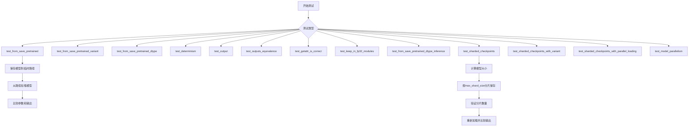

## 类结构

```
BaseModelTesterConfig (抽象基类)
└── ModelTesterMixin (测试混入类)
    ├── test_from_save_pretrained
    ├── test_from_save_pretrained_variant
    ├── test_from_save_pretrained_dtype
    ├── test_determinism
    ├── test_output
    ├── test_outputs_equivalence
    ├── test_getattr_is_correct
    ├── test_keep_in_fp32_modules
    ├── test_from_save_pretrained_dtype_inference
    ├── test_sharded_checkpoints
    ├── test_sharded_checkpoints_with_variant
    ├── test_sharded_checkpoints_with_parallel_loading
    └── test_model_parallelism
```

## 全局变量及字段


### `torch_device`
    
测试设备

类型：`str`
    


### `SAFE_WEIGHTS_INDEX_NAME`
    
安全权重索引文件名常量

类型：`str`
    


### `atol`
    
绝对误差容限

类型：`float`
    


### `rtol`
    
相对误差容限

类型：`float`
    


### `BaseModelTesterConfig.model_class`
    
需要测试的模型类

类型：`Type[nn.Module]`
    


### `BaseModelTesterConfig.pretrained_model_name_or_path`
    
预训练模型路径

类型：`Optional[str]`
    


### `BaseModelTesterConfig.pretrained_model_kwargs`
    
额外的模型参数字典

类型：`Dict[str, Any]`
    


### `BaseModelTesterConfig.output_shape`
    
期望的输出形状

类型：`Optional[tuple]`
    


### `BaseModelTesterConfig.model_split_percents`
    
模型并行测试的百分比

类型：`list`
    
    

## 全局函数及方法


### `named_persistent_module_tensors`

该函数是一个生成器函数，用于遍历给定 PyTorch 模块的所有参数（parameters）和持久缓冲区（persistent buffers），并以键值对的形式 yield 返回。它首先 yield 模块的所有参数，然后遍历模块的所有缓冲区，过滤掉非持久化的缓冲区，仅返回持久化的缓冲区。

参数：

- `module`：`nn.Module`，需要获取张量的目标模块
- `recurse`：`bool`，可选，默认为 `False`，是否递归遍历所有子模块；若为 `False`，则仅返回当前模块的直接参数和缓冲区

返回值：`Generator[tuple[str, Union[nn.Parameter, torch.Tensor]]]`，生成器，产出形如 `(名称, 张量)` 的元组，其中名称为字符串，张量为 `nn.Parameter` 或 `torch.Tensor` 对象

#### 流程图

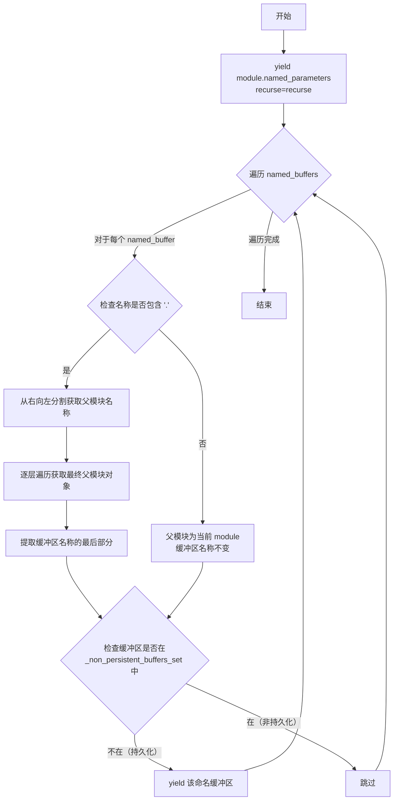

#### 带注释源码

```python
def named_persistent_module_tensors(
    module: nn.Module,
    recurse: bool = False,
):
    """
    A helper function that gathers all the tensors (parameters + persistent buffers) of a given module.

    Args:
        module (`torch.nn.Module`):
            The module we want the tensors on.
        recurse (`bool`, *optional`, defaults to `False`):
            Whether or not to go look in every submodule or just return the direct parameters and buffers.
    """
    # 第一步：yield 模块的所有参数（parameters）
    # 参数是 nn.Parameter 对象，是可学习的张量
    # recurse 参数决定是否递归遍历子模块
    yield from module.named_parameters(recurse=recurse)

    # 第二步：遍历模块的所有缓冲区（buffers）
    # 缓冲区通常用于存储非可学习的张量，如 BatchNorm 的 running_mean/running_var
    for named_buffer in module.named_buffers(recurse=recurse):
        name, _ = named_buffer
        
        # 获取父模块的逻辑：处理嵌套模块的名称
        # 例如：'block1.linear2.weight' -> 父模块为 block1.linear2，缓冲区名称为 weight
        parent = module
        if "." in name:
            # 提取除了最后一个部分之外的父模块名称
            parent_name = name.rsplit(".", 1)[0]
            # 逐层遍历获取最终的父模块对象
            for part in parent_name.split("."):
                parent = getattr(parent, part)
            # 只保留缓冲区名称的最后一部分
            name = name.split(".")[-1]
        
        # 检查该缓冲区是否为持久化缓冲区
        # _non_persistent_buffers_set 记录了哪些缓冲区不应被保存到检查点
        # 只有不在这个集合中的缓冲区才是持久化的，需要 yield
        if name not in parent._non_persistent_buffers_set:
            yield named_buffer
```


### `compute_module_persistent_sizes`

计算模型的持久化张量大小（包括参数和持久化缓冲区），返回一个字典，包含模型各子模块的内存占用字节数。

参数：

- `model`：`nn.Module`，输入的 PyTorch 模型
- `dtype`：`str | torch.device | None`，可选参数，用于计算大小的目标数据类型，若为 `None` 则使用张量原始类型
- `special_dtypes`：`dict[str, str | torch.device] | None`，可选参数，指定特定参数的自定义数据类型字典

返回值：`defaultdict(int)`，键为子模块名称（如 "block1.conv1"），值为该模块及其所有子模块的持久化张量总大小（字节数）

#### 流程图

```mermaid
flowchart TD
    A[开始: compute_module_persistent_sizes] --> B{dtype is not None?}
    B -->|Yes| C[_get_proper_dtype 并获取 dtype_size]
    B -->|No| D[special_dtypes is not None?]
    C --> D
    D -->|Yes| E[将 special_dtypes 转换为 proper_dtype 并获取 special_dtypes_size]
    D -->|No| F[初始化 module_sizes defaultdict]
    F --> G[调用 named_persistent_module_tensors 获取所有持久化张量]
    G --> H{遍历每个 name, tensor}
    H -->|special_dtypes 中存在| I[使用 special_dtypes_size 计算大小]
    H -->|dtype is None| J[使用 tensor.dtype 计算大小]
    H -->|dtype 是 uint/int/bool| K[使用 tensor.dtype 计算原始大小]
    H -->|其他情况| L[使用 min dtype_size 和 tensor.dtype 计算大小]
    I --> M[累加大小到模块路径]
    J --> M
    K --> M
    L --> M
    M --> N{处理 name_parts 路径}
    N --> O[module_sizes[子模块路径] += size]
    O --> H
    H --> P[返回 module_sizes]
```

#### 带注释源码

```python
def compute_module_persistent_sizes(
    model: nn.Module,
    dtype: str | torch.device | None = None,
    special_dtypes: dict[str, str | torch.device] | None = None,
):
    """
    Compute the size of each submodule of a given model (parameters + persistent buffers).
    """
    # 如果指定了目标 dtype，则转换为合适的 dtype 并获取其字节大小
    if dtype is not None:
        dtype = _get_proper_dtype(dtype)
        dtype_size = dtype_byte_size(dtype)
    
    # 如果指定了特殊 dtype 映射，则为每个特殊类型转换并计算字节大小
    if special_dtypes is not None:
        special_dtypes = {key: _get_proper_dtype(dtyp) for key, dtyp in special_dtypes.items()}
        special_dtypes_size = {key: dtype_byte_size(dtyp) for key, dtyp in special_dtypes.items()}
    
    # 初始化模块大小累加器
    module_sizes = defaultdict(int)

    # 获取模型的所有持久化张量（参数 + 持久化缓冲区）
    module_list = named_persistent_module_tensors(model, recurse=True)

    # 遍历每个持久化张量并计算大小
    for name, tensor in module_list:
        # 优先使用 special_dtypes 中定义的大小
        if special_dtypes is not None and name in special_dtypes:
            size = tensor.numel() * special_dtypes_size[name]
        # 如果没有指定 dtype，则使用张量原始类型的大小
        elif dtype is None:
            size = tensor.numel() * dtype_byte_size(tensor.dtype)
        # 对于无符号整数、整数和布尔类型，不进行转换，使用原始大小
        elif str(tensor.dtype).startswith(("torch.uint", "torch.int", "torch.bool")):
            # According to the code in set_module_tensor_to_device, these types won't be converted
            # so use their original size here
            size = tensor.numel() * dtype_byte_size(tensor.dtype)
        # 其他情况取目标 dtype 和原始 dtype 中较小的那个
        else:
            size = tensor.numel() * min(dtype_size, dtype_byte_size(tensor.dtype))
        
        # 将大小累加到所有父模块路径上
        # 例如 "block1.conv1.weight" 会累加到 ""、"block1"、"block1.conv1"、"block1.conv1.weight"
        name_parts = name.split(".")
        for idx in range(len(name_parts) + 1):
            module_sizes[".".join(name_parts[:idx])] += size

    return module_sizes
```


### `calculate_expected_num_shards`

该函数用于从分片检查点的索引文件中解析并计算预期的分片数量，通过读取索引文件的 weight_map，获取第一个权重文件路径，并从中提取分片编号（例如从 `diffusion_pytorch_model-00001-of-00002.safetensors` 提取出 `2`）。

参数：

- `index_map_path`：`str`，分片检查点索引文件的路径（JSON 格式）

返回值：`int`，预期的分片数量

#### 流程图

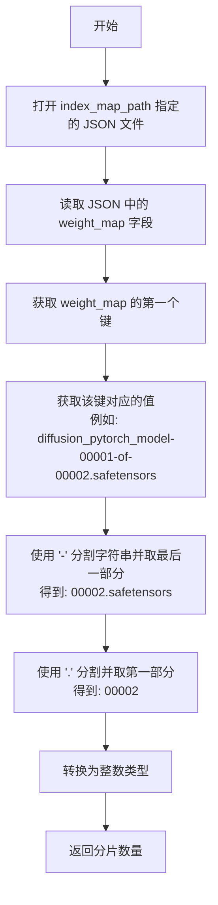

#### 带注释源码

```python
def calculate_expected_num_shards(index_map_path):
    """
    Calculate expected number of shards from index file.

    Args:
        index_map_path: Path to the sharded checkpoint index file

    Returns:
        int: Expected number of shards
    """
    # 打开索引文件（JSON格式），读取 weight_map 字典
    # weight_map 结构示例: {"model.safetensors": "diffusion_pytorch_model-00001-of-00002.safetensors", ...}
    with open(index_map_path) as f:
        weight_map_dict = json.load(f)["weight_map"]
    
    # 获取 weight_map 中的第一个键（任意一个权重文件的键名）
    first_key = list(weight_map_dict.keys())[0]
    
    # 获取第一个键对应的值，即权重文件的文件名
    # 示例值: diffusion_pytorch_model-00001-of-00002.safetensors
    weight_loc = weight_map_dict[first_key]
    
    # 从文件名中提取分片数量：
    # 1. 使用 '-' 分割，取最后一部分: "00002.safetensors"
    # 2. 使用 '.' 分割，取第一部分: "00002"
    # 3. 转换为整数: 2
    expected_num_shards = int(weight_loc.split("-")[-1].split(".")[0])
    
    return expected_num_shards
```


### `check_device_map_is_respected`

验证给定的 device_map 是否正确应用到模型的所有参数。该函数遍历模型的所有参数，查找 device_map 中对应的设备映射，并断言参数实际所在的设备与 device_map 指定的设备一致，以确保模型并行化时设备分配正确。

参数：

- `model`：`torch.nn.Module`，要检查的 PyTorch 模型
- `device_map`：`Dict[str, Union[str, int, torch.device]]`，设备映射字典，键为参数名（如 "model.layer1.weight"），值为目标设备（如 "cuda:0"、"cpu"、"meta"、"disk"）

返回值：`None`，该函数通过断言验证设备映射，不返回任何值

#### 流程图

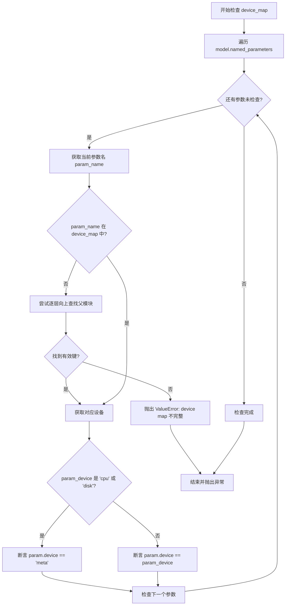

#### 带注释源码

```python
def check_device_map_is_respected(model, device_map):
    """
    验证 device_map 是否正确应用到模型参数
    
    该函数检查模型的所有参数是否位于 device_map 指定的设备上。
    对于 'cpu' 或 'disk' 设备，参数应位于 'meta' 设备上；
    对于其他设备（如 'cuda:0'），参数应位于对应的实际设备上。
    
    Args:
        model: 要检查的 PyTorch 模型
        device_map: 设备映射字典，键为参数名，值为目标设备
    """
    # 遍历模型的所有命名参数
    for param_name, param in model.named_parameters():
        # 在 device_map 中查找设备的初始键
        original_param_name = param_name
        current_param_name = param_name
        
        # 尝试通过逐层向上查找父模块来找到 device_map 中的键
        # 例如：参数名 "model.layer1.weight" 可能映射到 "model.layer1"
        while len(current_param_name) > 0 and current_param_name not in device_map:
            # 移除最后一层，逐层向上查找
            current_param_name = ".".join(current_param_name.split(".")[:-1])
        
        # 如果遍历完所有层级仍未找到对应键，抛出错误
        if current_param_name not in device_map:
            raise ValueError(
                f"device map 不完整，未能为参数 '{original_param_name}' 找到任何设备映射。"
            )

        # 获取该参数应该所在的设备
        param_device = device_map[current_param_name]
        
        # 如果目标设备是 cpu 或 disk，参数应该在 meta 设备上（未实际加载）
        if param_device in ["cpu", "disk"]:
            assert param.device == torch.device("meta"), (
                f"参数 '{original_param_name}' 应在 'meta' 设备上，但实际在 {param.device} 设备上"
            )
        else:
            # 对于其他设备（如 cuda:0），验证参数确实在指定设备上
            assert param.device == torch.device(param_device), (
                f"参数 '{original_param_name}' 应在设备 {param_device} 上，但实际在 {param.device} 设备上"
            )
```


### `cast_inputs_to_dtype`

该函数是一个递归的_dtype转换工具，用于将输入数据（支持张量、字典、列表等嵌套结构）从当前数据类型转换为目标数据类型，仅在数据类型匹配时执行转换以避免不必要的操作。

参数：

- `inputs`：任意类型，输入数据，可以是张量、字典、列表或任意其他类型
- `current_dtype`：`torch.dtype`，输入数据的当前数据类型，用于判断是否需要转换
- `target_dtype`：`torch.dtype`，目标数据类型，转换后的数据类型

返回值：`任意类型`，返回转换后的输入数据，类型与输入类型相同

#### 流程图

```mermaid
flowchart TD
    A[开始: cast_inputs_to_dtype] --> B{inputs是否是Tensor?}
    B -->|是| C{inputs.dtype == current_dtype?}
    C -->|是| D[返回 inputs.to(target_dtype)]
    C -->|否| E[返回原inputs]
    B -->|否| F{inputs是否是dict?}
    F -->|是| G[遍历dict中每个key-value]
    G --> H[递归调用cast_inputs_to_dtype]
    H --> I[返回新dict]
    F -->|否| J{inputs是否是list?}
    J -->|是| K[遍历list中每个元素]
    K --> L[递归调用cast_inputs_to_dtype]
    L --> M[返回新list]
    J -->|否| N[返回原始inputs]
    
    D --> O[结束]
    E --> O
    I --> O
    M --> O
    N --> O
```

#### 带注释源码

```python
def cast_inputs_to_dtype(inputs, current_dtype, target_dtype):
    """
    递归将输入数据转换为指定数据类型。
    
    该函数处理四种情况：
    1. torch.Tensor: 只有当dtype等于current_dtype时才转换
    2. dict: 递归处理字典中的每个值
    3. list: 递归处理列表中的每个元素
    4. 其他类型: 直接返回原值
    
    Args:
        inputs: 输入数据，支持张量、字典、列表等嵌套结构
        current_dtype: 当前数据类型，用于判断是否需要转换
        target_dtype: 目标数据类型
        
    Returns:
        转换后的数据，类型与输入类型相同
    """
    # 如果输入是张量，检查dtype是否匹配，匹配则转换，否则保持不变
    if torch.is_tensor(inputs):
        return inputs.to(target_dtype) if inputs.dtype == current_dtype else inputs
    
    # 如果输入是字典，递归处理每个值
    if isinstance(inputs, dict):
        return {k: cast_inputs_to_dtype(v, current_dtype, target_dtype) for k, v in inputs.items()}
    
    # 如果输入是列表，递归处理每个元素
    if isinstance(inputs, list):
        return [cast_inputs_to_dtype(v, current_dtype, target_dtype) for v in inputs]

    # 对于其他类型，直接返回原值（不进行任何转换）
    return inputs
```

#### 关键组件信息

- **torch.is_tensor()**: 用于判断输入是否为PyTorch张量
- **tensor.to()**: PyTorch张量方法，用于执行数据类型转换

#### 潜在的技术债务或优化空间

1. **缺少元组支持**：当前仅支持 dict 和 list，未处理元组 (tuple) 类型，可能导致嵌套元组数据无法正确转换
2. **类型检查效率**：使用 `isinstance` 多次检查类型，在深层嵌套时可能影响性能，可考虑使用单一的类型分发机制
3. **缺少深度控制**：无法指定递归深度，可能在极端嵌套情况下导致栈溢出风险

#### 其它项目

**使用场景**：
- 在模型加载和推理时，将输入数据从一种精度（如 float32）转换为另一种精度（如 float16）
- 确保模型输入 dtype 与模型参数 dtype 匹配

**设计约束**：
- 仅在 `inputs.dtype == current_dtype` 时才执行转换，避免不必要的张量复制
- 保持输入数据的结构不变（dict 的键、list 的顺序）

**错误处理**：
- 该函数不抛出异常，对于不支持的类型直接返回原值
- 假设调用者已验证 current_dtype 和 target_dtype 为有效的 torch.dtype


我需要说明的是，在提供的代码文件中，`assert_tensors_close` 是从 `...testing_utils` 模块导入的，并没有在当前文件中直接定义。让我搜索一下这个函数可能在的位置，并基于其使用方式来推断其功能。

由于 `assert_tensors_close` 是在 `...testing_utils` 模块中定义的，而当前代码只显示了导入语句，我无法直接获取其源码。不过，基于代码中的使用方式，我可以提供该函数的详细信息。

### `assert_tensors_close`

该函数用于断言两个张量在容差范围内相等，常用于测试中验证模型输出的数值一致性。

参数：

-  `a`：`torch.Tensor`，第一个要比较的张量
-  `b`：`torch.Tensor`，第二个要比较的张量
-  `atol`：`float`，绝对容差（可选，默认值通常为 0）
-  `rtol`：`float`，相对容差（可选，默认值通常为 0）
-  `msg`：`str`，当断言失败时显示的错误消息（可选）

返回值：`None`，该函数在比较失败时抛出 `AssertionError` 或 `torch.assert`

#### 流程图

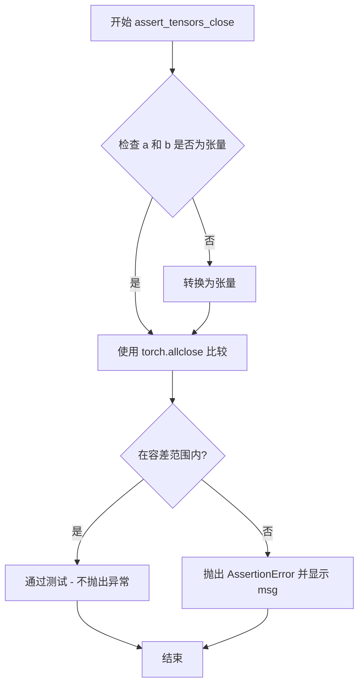

#### 带注释源码

由于该函数定义在 `...testing_utils` 模块中（当前代码未展示其实现），以下是基于使用方式的推断代码：

```python
# 这是一个推断的实现，实际源码可能在 testing_utils 模块中
def assert_tensors_close(
    a: torch.Tensor,
    b: torch.Tensor,
    atol: float = 0,
    rtol: float = 0,
    msg: str = ""
):
    """
    断言两个张量在容差范围内相等。
    
    参数:
        a: 第一个张量
        b: 第二个张量  
        atol: 绝对容差
        rtol: 相对容差
        msg: 错误消息
    """
    # 使用 PyTorch 的 allclose 进行比较
    # torch.allclose(a, b, atol, rtol) 等价于:
    # all(atol + rtol * abs(b) > abs(a - b))
    is_close = torch.allclose(a, b, atol=atol, rtol=rtol)
    
    if not is_close:
        # 计算实际差异用于调试
        max_diff = (a - b).abs().max()
        raise AssertionError(
            f"{msg}\n"
            f"Tensor difference max: {max_diff}\n"
            f"atol={atol}, rtol={rtol}"
        )
```

---

**注意**：实际的 `assert_tensors_close` 函数源码位于 `testing_utils` 模块中（可能是 `testing_utils.py` 或类似文件），该模块被导入为 `from ...testing_utils import assert_tensors_close, torch_device`。如需查看完整源码，需要查看该模块文件。


### `BaseModelTesterConfig.get_init_dict`

返回模型初始化参数字典，供测试框架使用。该方法是抽象方法，要求子类必须实现具体逻辑以返回模型构造函数所需的参数字典。

参数：无（仅包含隐式参数 `self`）

返回值：`Dict[str, Any]`，包含用于初始化模型构造函数的参数字典

#### 流程图

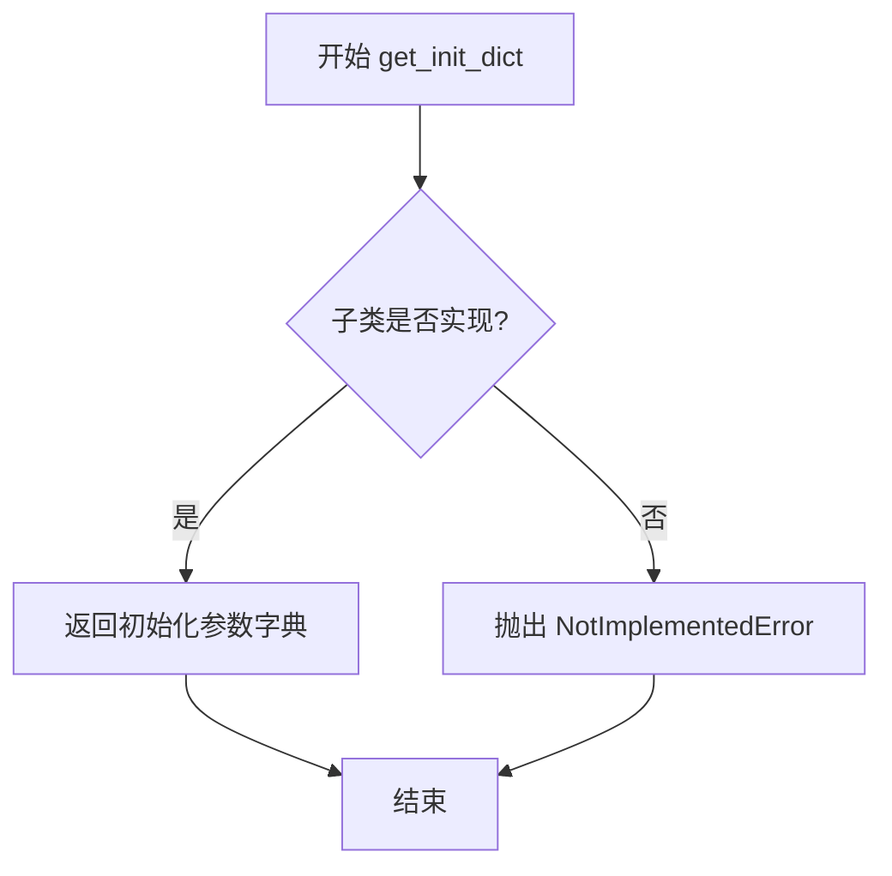

#### 带注释源码

```python
def get_init_dict(self) -> Dict[str, Any]:
    """
    Returns dict of arguments to initialize the model.

    Returns:
        Dict[str, Any]: Initialization arguments for the model constructor.

    Example:
        return {
            "in_channels": 3,
            "out_channels": 3,
            "sample_size": 32,
        }
    """
    # 抽象方法接口，子类必须重写此方法
    # 若未重写则抛出 NotImplementedError 提示子类实现
    raise NotImplementedError("Subclasses must implement `get_init_dict()`.")
```


### `BaseModelTesterConfig.get_dummy_inputs`

该方法是一个抽象方法，定义模型测试所需的虚拟输入接口。子类必须实现此方法以返回模型前向传播所需的输入字典（如样本张量、时间步等），供测试框架在各种测试场景中使用。

参数：
- 无（仅含隐式参数 `self`）

返回值：`Dict[str, Any]`，包含模型 forward 方法所需的输入张量或值的字典。

#### 流程图

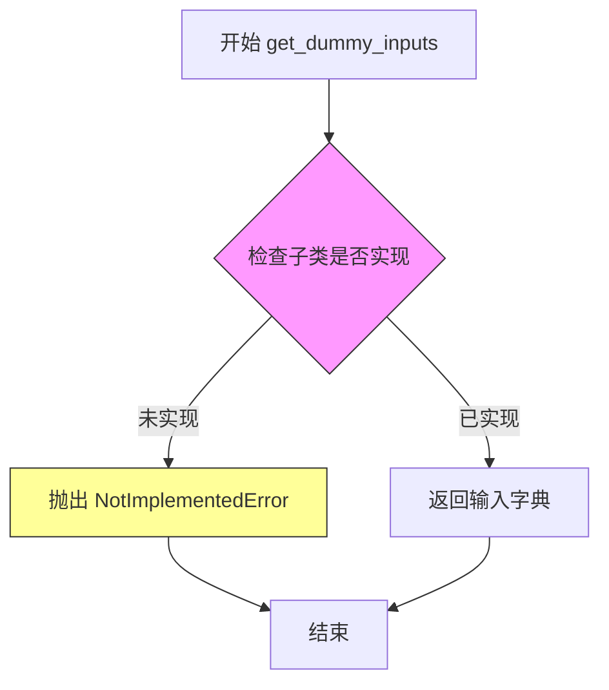

#### 带注释源码

```python
def get_dummy_inputs(self) -> Dict[str, Any]:
    """
    Returns dict of inputs to pass to the model forward pass.

    Returns:
        Dict[str, Any]: Input tensors/values for model.forward().

    Example:
        return {
            "sample": torch.randn(1, 3, 32, 32, device=torch_device),
            "timestep": torch.tensor([1], device=torch_device),
        }
    """
    # 抽象方法，子类必须重写此方法
    # 否则抛出 NotImplementedError 提示实现者
    raise NotImplementedError("Subclasses must implement `get_dummy_inputs()`.")
```


### `ModelTesterMixin.test_from_save_pretrained`

该方法用于测试模型的保存（save_pretrained）和加载（from_pretrained）功能是否正常工作，通过比较保存前后模型的参数形状和前向传播输出是否一致来验证模型的序列化与反序列化流程。

参数：

- `self`：`ModelTesterMixin`，测试混入类实例，继承自 `ModelTesterMixin`，用于访问 `model_class`、`get_init_dict()` 和 `get_dummy_inputs()` 等配置方法
- `tmp_path`：`pytest.fixture.Path`，pytest 提供的临时目录路径，用于保存模型检查点
- `atol`：`float`，可选，默认值为 `5e-5`，绝对误差容限（absolute tolerance），用于 `assert_tensors_close` 比较输出张量时的绝对误差阈值
- `rtol`：`float`，可选，默认值为 `5e-5`，相对误差容限（relative tolerance），用于 `assert_tensors_close` 比较输出张量时的相对误差阈值

返回值：`None`，该方法为测试方法，无返回值，通过断言（assert）来验证保存和加载功能的正确性；若测试失败则抛出异常

#### 流程图

```mermaid
flowchart TD
    A[开始测试 test_from_save_pretrained] --> B[设置随机种子 torch.manual_seed(0)]
    B --> C[使用 model_class 和 get_init_dict 初始化模型 model]
    C --> D[将模型移动到 torch_device 并设置为 eval 模式]
    D --> E[调用 model.save_pretrained 保存模型到 tmp_path]
    E --> F[调用 model_class.from_pretrained 从 tmp_path 加载模型 new_model]
    F --> G[将 new_model 移动到 torch_device]
    G --> H[遍历 model.state_dict 中的所有参数名]
    H --> I{参数形状是否一致?}
    I -->|是| J[获取下一个参数]
    I -->|否| K[抛出 AssertionError 报告形状不匹配]
    J --> H
    H --> L[使用 get_dummy_inputs 获取输入数据]
    L --> M[执行 model 前向传播得到 image]
    M --> N[执行 new_model 前向传播得到 new_image]
    N --> O{image 和 new_image 在 atol/rtol 范围内是否相等?}
    O -->|是| P[测试通过]
    O -->|否| Q[抛出 AssertionError 报告输出不匹配]
    P --> R[结束测试]
    Q --> R
```

#### 带注释源码

```python
@torch.no_grad()  # 禁用梯度计算以减少内存占用，提升测试性能
def test_from_save_pretrained(self, tmp_path, atol=5e-5, rtol=5e-5):
    """
    测试模型的保存和加载功能是否正常。
    
    该测试方法执行以下步骤：
    1. 初始化模型并保存到临时目录
    2. 从临时目录加载模型
    3. 验证保存前后模型参数形状一致
    4. 验证保存前后模型前向输出在给定误差容限内一致
    
    Args:
        tmp_path: pytest 提供的临时目录路径，用于保存模型检查点
        atol: 绝对误差容限，用于张量比较
        rtol: 相对误差容限，用于张量比较
    """
    torch.manual_seed(0)  # 设置随机种子以确保结果可复现
    model = self.model_class(**self.get_init_dict())  # 根据配置初始化模型
    model.to(torch_device)  # 将模型移动到指定设备（CPU/CUDA等）
    model.eval()  # 设置为评估模式，禁用 dropout 等训练特定操作

    model.save_pretrained(tmp_path)  # 将模型保存到临时目录
    new_model = self.model_class.from_pretrained(tmp_path)  # 从临时目录加载模型
    new_model.to(torch_device)  # 将加载的模型移动到相同设备

    # 验证所有参数的形状是否一致
    for param_name in model.state_dict().keys():
        param_1 = model.state_dict()[param_name]
        param_2 = new_model.state_dict()[param_name]
        assert param_1.shape == param_2.shape, (
            f"Parameter shape mismatch for {param_name}. Original: {param_1.shape}, loaded: {param_2.shape}"
        )

    # 执行前向传播并比较输出
    image = model(**self.get_dummy_inputs(), return_dict=False)[0]  # 原始模型的前向输出
    new_image = new_model(**self.get_dummy_inputs(), return_dict=False)[0]  # 加载模型的前向输出

    # 验证输出张量在误差容限内相等
    assert_tensors_close(image, new_image, atol=atol, rtol=rtol, msg="Models give different forward passes.")
```


### `ModelTesterMixin.test_from_save_pretrained_variant`

测试带变体（如 fp16）的模型保存和加载功能，验证模型可以使用特定变体保存和加载，并在未指定变体时正确抛出异常，同时确保加载后的模型输出与原始模型一致。

参数：

- `tmp_path`：`pytest.fixture`（临时目录路径），用于保存和加载模型的临时路径
- `atol`：`float`，默认 `5e-5`，张量比较的绝对容差
- `rtol`：`float`，默认 `0`，张量比较的相对容差

返回值：`None`（无返回值，通过断言验证正确性）

#### 流程图

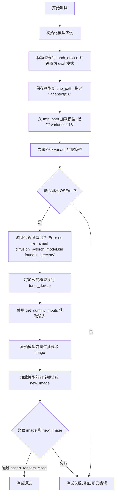

#### 带注释源码

```python
@torch.no_grad()
def test_from_save_pretrained_variant(self, tmp_path, atol=5e-5, rtol=0):
    """
    测试带变体（variant）的模型保存和加载功能。
    
    该测试验证：
    1. 模型可以使用特定变体（如 fp16）保存
    2. 模型可以使用相同变体加载
    3. 不指定变体时加载会失败并抛出 OSError
    4. 加载后的模型输出与原始模型一致
    
    Args:
        tmp_path: pytest 临时目录路径，用于保存和加载模型
        atol: float, 默认 5e-5，张量比较的绝对容差
        rtol: float, 默认 0，张量比较的相对容差
    """
    # 使用测试配置中的初始化字典创建模型实例
    model = self.model_class(**self.get_init_dict())
    
    # 将模型移到测试设备（如 cuda, cpu, mps 等）并设置为评估模式
    model.to(torch_device)
    model.eval()

    # 使用 variant="fp16" 保存模型到临时路径
    # 这会在文件名中添加 .fp16 后缀（如 diffusion_pytorch_model.fp16.safetensors）
    model.save_pretrained(tmp_path, variant="fp16")
    
    # 使用相同的 variant 加载模型
    new_model = self.model_class.from_pretrained(tmp_path, variant="fp16")

    # 尝试不带 variant 参数加载模型，应该失败
    # 因为默认的 diffusion_pytorch_model.bin 文件不存在（只有 fp16 变体文件）
    with pytest.raises(OSError) as exc_info:
        self.model_class.from_pretrained(tmp_path)

    # 验证错误消息包含预期的内容
    assert "Error no file named diffusion_pytorch_model.bin found in directory" in str(exc_info.value)

    # 将加载的模型移到测试设备
    new_model.to(torch_device)

    # 获取测试输入
    dummy_inputs = self.get_dummy_inputs()
    
    # 原始模型前向传播
    image = model(**dummy_inputs, return_dict=False)[0]
    
    # 加载的模型前向传播
    new_image = new_model(**dummy_inputs, return_dict=False)[0]

    # 验证两个模型的输出在容差范围内一致
    assert_tensors_close(image, new_image, atol=atol, rtol=rtol, msg="Models give different forward passes.")
```


### `ModelTesterMixin.test_from_save_pretrained_dtype`

测试指定数据类型的模型保存和加载功能，验证模型在不同数据类型（fp32/fp16/bf16）下保存后能否正确加载并保持预期 dtype。

参数：

- `self`：隐式参数，测试类实例自身
- `tmp_path`：`Path`（pytest fixture），临时目录路径，用于保存和加载模型
- `dtype`：`torch.dtype`，目标数据类型，参数化为 `torch.float32`、`torch.float16`、`torch.bfloat16`

返回值：`None`，无返回值（测试方法，通过断言验证）

#### 流程图

```mermaid
flowchart TD
    A[开始] --> B[根据配置初始化模型]
    B --> C[将模型移动到测试设备]
    C --> D[设置模型为评估模式 eval()]
    D --> E{设备是 MPS 且 dtype 是 bfloat16?}
    E -->|是| F[跳过测试 pytest.skip]
    E -->|否| G[将模型转换为指定 dtype]
    G --> H[保存模型到 tmp_path]
    H --> I[从 tmp_path 加载模型<br/>low_cpu_mem_usage=True<br/>torch_dtype=dtype]
    I --> J{断言: new_model.dtype == dtype?}
    J -->|否| K[测试失败]
    J -->|是| L{模型有 _keep_in_fp32_modules 属性<br/>且值为 None?}
    L -->|是| M[从 tmp_path 重新加载模型<br/>low_cpu_mem_usage=False<br/>torch_dtype=dtype]
    L -->|否| N[结束]
    M --> O{断言: new_model.dtype == dtype?}
    O -->|否| P[测试失败]
    O -->|是| N
```

#### 带注释源码

```python
@pytest.mark.parametrize("dtype", [torch.float32, torch.float16, torch.bfloat16], ids=["fp32", "fp16", "bf16"])
def test_from_save_pretrained_dtype(self, tmp_path, dtype):
    """
    测试指定数据类型的保存/加载功能
    
    参数:
        tmp_path: pytest 提供的临时目录路径，用于保存和加载模型
        dtype: 目标 torch 数据类型 (float32, float16, bfloat16)
    """
    # 1. 根据配置初始化模型
    model = self.model_class(**self.get_init_dict())
    
    # 2. 将模型移动到测试设备 (如 cuda, cpu, mps 等)
    model.to(torch_device)
    
    # 3. 设置为评估模式，禁用 dropout 等训练特定行为
    model.eval()

    # 4. MPS 设备不支持 bfloat16，跳过该组合
    if torch_device == "mps" and dtype == torch.bfloat16:
        pytest.skip(reason=f"{dtype} is not supported on {torch_device}")

    # 5. 将模型参数转换为目标 dtype
    model.to(dtype)
    
    # 6. 保存模型到临时路径
    model.save_pretrained(tmp_path)
    
    # 7. 使用 low_cpu_mem_usage=True 方式加载模型，指定目标 dtype
    new_model = self.model_class.from_pretrained(tmp_path, low_cpu_mem_usage=True, torch_dtype=dtype)
    
    # 8. 断言：验证加载后的模型 dtype 与预期一致
    assert new_model.dtype == dtype
    
    # 9. 特殊逻辑：当模型有 _keep_in_fp32_modules 属性且为 None 时
    #    再次测试 low_cpu_mem_usage=False 的加载方式
    if hasattr(self.model_class, "_keep_in_fp32_modules") and self.model_class._keep_in_fp32_modules is None:
        # 当不使用 accelerate 加载时，如果 _keep_in_fp32_modules 不为 None，
        # dtype 会保持为 torch.float32
        new_model = self.model_class.from_pretrained(tmp_path, low_cpu_mem_usage=False, torch_dtype=dtype)
        assert new_model.dtype == dtype
```


### `ModelTesterMixin.test_determinism`

测试模型输出的确定性（Determinism），即使用相同的输入运行模型两次，验证两次输出是否一致，以确保模型在相同条件下产生可重复的结果。

参数：

- `self`：`ModelTesterMixin`，测试 mixin 类实例（隐含参数）
- `atol`：`float`，绝对误差容忍度，默认值为 `1e-5`
- `rtol`：`float`，相对误差容忍度，默认值为 `0`

返回值：`None`，无返回值（通过断言验证一致性）

#### 流程图

```mermaid
flowchart TD
    A[开始测试] --> B[创建模型实例: model = model_class(**get_init_dict)]
    B --> C[将模型移动到测试设备: model.to torch_device]
    C --> D[设置模型为评估模式: model.eval]
    D --> E[第一次前向传播: first = model(**get_dummy_inputs, return_dict=False)[0]
    E --> F[第二次前向传播: second = model(**get_dummy_inputs, return_dict=False)[0]
    F --> G[展平输出: first_flat, second_flat = first.flatten, second.flatten]
    G --> H[创建有效值掩码: mask = NOT isnan(first_flat OR second_flat)]
    H --> I[过滤NaN值: first_filtered, second_filtered = first_flat[mask], second_flat[mask]
    I --> J{assert_tensors_close<br/>first_filtered == second_filtered}
    J -->|通过| K[测试通过 - 模型具有确定性]
    J -->|失败| L[测试失败 - 模型输出非确定性]
```

#### 带注释源码

```python
@torch.no_grad()  # 禁用梯度计算以节省内存
def test_determinism(self, atol=1e-5, rtol=0):
    """
    测试模型输出的确定性。
    
    Args:
        atol (float, optional): 绝对误差容忍度，默认 1e-5
        rtol (float, optional): 相对误差容忍度，默认 0
    """
    # 1. 使用配置中的初始化参数创建模型实例
    model = self.model_class(**self.get_init_dict())
    
    # 2. 将模型移动到测试设备（如 CPU/CUDA）
    model.to(torch_device)
    
    # 3. 设置为评估模式，禁用 dropout 等训练特定行为
    model.eval()

    # 4. 第一次前向传播，使用相同的虚拟输入
    first = model(**self.get_dummy_inputs(), return_dict=False)[0]
    
    # 5. 第二次前向传播，使用完全相同的虚拟输入
    second = model(**self.get_dummy_inputs(), return_dict=False)[0]

    # 6. 将输出展平为一维张量，便于比较
    first_flat = first.flatten()
    second_flat = second.flatten()
    
    # 7. 创建掩码，排除 NaN 值（可能由数值不稳定产生）
    mask = ~(torch.isnan(first_flat) | torch.isnan(second_flat))
    first_filtered = first_flat[mask]
    second_filtered = second_flat[mask]

    # 8. 断言两次输出在给定误差容忍度内相等
    assert_tensors_close(
        first_filtered, second_filtered, atol=atol, rtol=rtol, 
        msg="Model outputs are not deterministic"
    )
```


### `ModelTesterMixin.test_output`

测试模型输出的形状是否符合预期，验证模型前向传播能正确生成指定形状的输出。

参数：

- `expected_output_shape`：`Optional[tuple]`，可选参数，指定模型输出的期望形状。如果为 `None`，则使用类属性 `self.output_shape` 作为期望形状。

返回值：`None`，该方法通过断言验证输出形状，不返回任何值。

#### 流程图

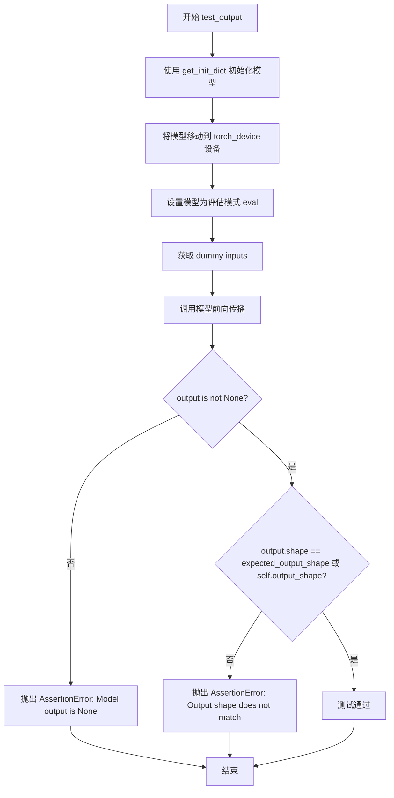

#### 带注释源码

```python
@torch.no_grad()  # 装饰器：禁用梯度计算以节省内存和计算资源
def test_output(self, expected_output_shape=None):
    """
    测试模型输出的形状是否符合预期。
    
    该方法执行以下步骤：
    1. 使用配置类提供的初始化参数创建模型实例
    2. 将模型移动到指定的计算设备（torch_device）
    3. 设置模型为评估模式（eval mode）
    4. 获取测试用的虚拟输入（dummy inputs）
    5. 执行模型前向传播，获取输出
    6. 验证输出不为 None
    7. 验证输出形状与期望形状匹配
    
    Args:
        expected_output_shape (Optional[tuple]): 期望的输出形状。
                                                 如果为 None，则使用 self.output_shape。
    
    Returns:
        None: 该方法通过断言验证，不返回任何值。
    
    Raises:
        AssertionError: 如果模型输出为 None 或形状不匹配。
    """
    # 使用配置类提供的初始化字典创建模型实例
    # self.model_class 由继承 BaseModelTesterConfig 的测试配置类提供
    # self.get_init_dict() 返回模型初始化所需的参数字典
    model = self.model_class(**self.get_init_dict())
    
    # 将模型移动到指定的计算设备（CPU/CUDA/XPU等）
    model.to(torch_device)
    
    # 设置模型为评估模式，禁用 dropout 和 batch normalization 的训练行为
    model.eval()

    # 获取测试用的虚拟输入，由配置类的 get_dummy_inputs() 方法提供
    inputs_dict = self.get_dummy_inputs()
    
    # 执行模型前向传播，return_dict=False 返回元组而非字典
    # 取 [0] 获取第一个输出（通常是图像/张量）
    output = model(**inputs_dict, return_dict=False)[0]

    # 断言验证：确保模型输出不是 None
    assert output is not None, "Model output is None"
    
    # 断言验证：检查输出形状是否与期望形状匹配
    # 优先使用传入的 expected_output_shape，否则使用类属性 self.output_shape
    assert output.shape == expected_output_shape or self.output_shape, (
        f"Output shape does not match expected. Expected {expected_output_shape}, got {output.shape}"
    )
```


### `ModelTesterMixin.test_outputs_equivalence`

测试元组和字典输出的等价性，验证模型在使用 `return_dict=False`（返回元组）和 `return_dict=True`（返回字典）时产生的输出是否一致。

参数：

- `self`：`ModelTesterMixin`，测试混合类实例（隐式参数）
- `atol`：`float`，可选，绝对容差，默认为 `1e-5`，用于张量比较的绝对误差容忍度
- `rtol`：`float`，可选，相对容差，默认为 `0`，用于张量比较的相对误差容忍度

返回值：`None`，该方法为测试方法，通过断言验证输出等价性，不返回任何值

#### 流程图

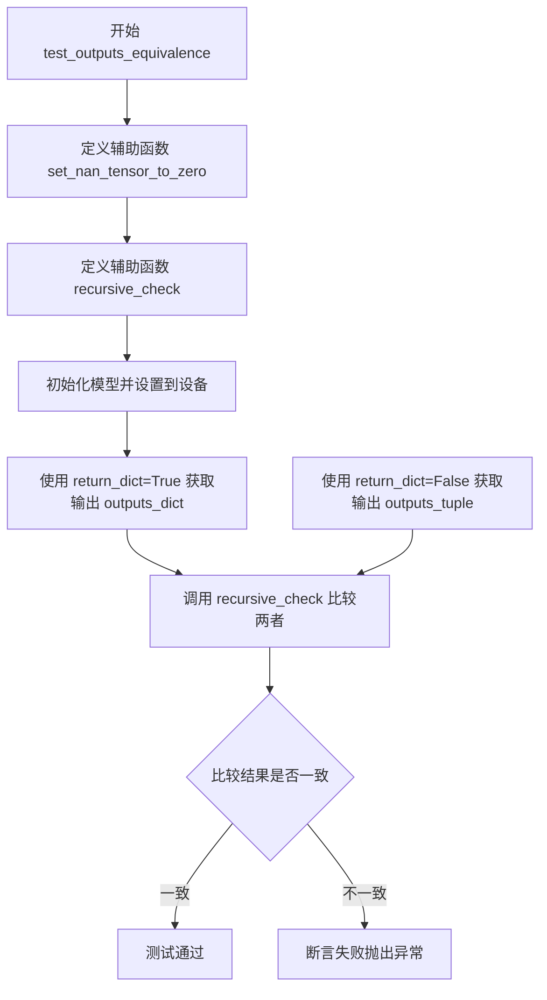

#### 带注释源码

```python
@torch.no_grad()
def test_outputs_equivalence(self, atol=1e-5, rtol=0):
    """
    测试元组和字典输出的等价性。
    
    验证模型在 return_dict=False 时返回的元组与 return_dict=True 时返回的字典
    中的数值内容是否一致（考虑数值误差）。
    
    参数:
        atol: 绝对容差，默认 1e-5
        rtol: 相对容差，默认 0
    """
    
    def set_nan_tensor_to_zero(t):
        """将张量中的 NaN 值替换为 0，处理 MPS 设备特殊需求"""
        device = t.device
        # MPS 设备需要先转到 CPU 处理
        if device.type == "mps":
            t = t.to("cpu")
        # NaN 不等于自身，使用此特性找到 NaN 位置
        t[t != t] = 0
        return t.to(device)

    def recursive_check(tuple_object, dict_object):
        """
        递归比较元组/列表/字典和字典的输出内容。
        
        支持嵌套结构的逐层比较，处理:
        - list/tuple: 逐元素递归比较
        - dict: 逐值递归比较
        - None: 直接返回
        - 其他张量: 使用 assert_tensors_close 比较
        """
        if isinstance(tuple_object, (list, tuple)):
            # 对于列表或元组，与字典的 values() 逐个比较
            for tuple_iterable_value, dict_iterable_value in zip(tuple_object, dict_object.values()):
                recursive_check(tuple_iterable_value, dict_iterable_value)
        elif isinstance(tuple_object, dict):
            # 字典与字典的 values() 逐个比较
            for tuple_iterable_value, dict_iterable_value in zip(tuple_object.values(), dict_object.values()):
                recursive_check(tuple_iterable_value, dict_iterable_value)
        elif tuple_object is None:
            # None 值直接返回
            return
        else:
            # 张量比较：将 NaN 置零后比较
            assert_tensors_close(
                set_nan_tensor_to_zero(tuple_object),
                set_nan_tensor_to_zero(dict_object),
                atol=atol,
                rtol=rtol,
                msg="Tuple and dict output are not equal",
            )

    # 创建模型实例并移动到测试设备
    model = self.model_class(**self.get_init_dict())
    model.to(torch_device)
    model.eval()

    # 获取两种返回形式的输出
    outputs_dict = model(**self.get_dummy_inputs())  # return_dict=True (默认)
    outputs_tuple = model(**self.get_dummy_inputs(), return_dict=False)  # return_dict=False

    # 递归比较输出
    recursive_check(outputs_tuple, outputs_dict)
```


### `ModelTesterMixin.test_getattr_is_correct`

测试模型属性访问的正确性，验证 hasattr、getattr 和直接属性访问的行为是否符合预期，包括普通属性、模型方法、注册到配置的属性的访问，以及对不存在属性的错误处理。

参数：

- `caplog`：`pytest.PytestAssertRewriteWarning`，pytest 的 caplog fixture，用于捕获日志输出

返回值：`None`，测试方法无返回值，通过断言验证属性访问行为

#### 流程图

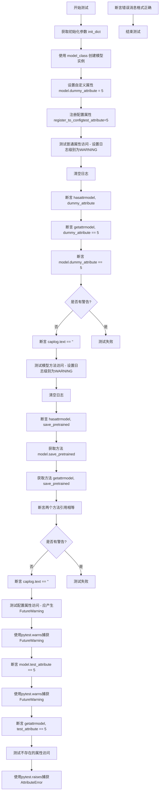

#### 带注释源码

```python
def test_getattr_is_correct(self, caplog):
    """
    测试模型属性访问的正确性。
    
    验证:
    1. 自定义属性可以通过 hasattr、getattr 和直接访问获取
    2. 模型方法可以通过属性方式获取且无警告
    3. 注册到 config 的属性访问会产生 FutureWarning
    4. 不存在的属性访问会抛出 AttributeError
    """
    # 1. 获取模型初始化参数
    init_dict = self.get_init_dict()
    # 2. 使用 model_class 创建模型实例（由子类提供）
    model = self.model_class(**init_dict)

    # 3. 设置一个自定义属性用于测试
    model.dummy_attribute = 5
    # 4. 注册一个配置属性到模型（这是 diffusers 模型的标准做法）
    model.register_to_config(test_attribute=5)

    # 5. 测试普通属性的访问（不应该产生警告）
    logger_name = "diffusers.models.modeling_utils"
    with caplog.at_level(logging.WARNING, logger=logger_name):
        caplog.clear()
        # 6. 使用 hasattr 检查属性存在
        assert hasattr(model, "dummy_attribute")
        # 7. 使用 getattr 获取属性值
        assert getattr(model, "dummy_attribute") == 5
        # 8. 使用直接访问方式获取属性值
        assert model.dummy_attribute == 5

    # 9. 确认没有产生任何警告
    assert caplog.text == ""

    # 10. 测试模型方法的访问（不应该产生警告）
    with caplog.at_level(logging.WARNING, logger=logger_name):
        caplog.clear()
        # 11. 检查模型方法存在
        assert hasattr(model, "save_pretrained")
        # 12. 通过属性方式获取方法
        fn = model.save_pretrained
        # 13. 通过 getattr 获取方法
        fn_1 = getattr(model, "save_pretrained")

        # 14. 验证两种方式获取的方法是同一个对象
        assert fn == fn_1

    # 15. 确认没有产生任何警告
    assert caplog.text == ""

    # 16. 测试配置属性的访问（应该产生 FutureWarning）
    # 注册到 config 的属性通过模型直接访问时会触发 FutureWarning
    with pytest.warns(FutureWarning):
        assert model.test_attribute == 5

    # 17. 测试 getattr 访问配置属性也应该产生 FutureWarning
    with pytest.warns(FutureWarning):
        assert getattr(model, "test_attribute") == 5

    # 18. 测试访问不存在的属性应该抛出 AttributeError
    with pytest.raises(AttributeError) as error:
        model.does_not_exist

    # 19. 验证错误消息格式正确
    assert str(error.value) == f"'{type(model).__name__}' object has no attribute 'does_not_exist'"
```


### `ModelTesterMixin.test_keep_in_fp32_modules`

该方法用于测试模型的 `_keep_in_fp32_modules` 功能。当模型定义了需要保持为 FP32 的模块时，加载模型为 FP16，验证指定模块的参数确实保持在 FP32，而其他模块为 FP16。

参数：

-  `tmp_path`：`py.path.local` 或 `str`，pytest 临时目录 fixture，用于保存和加载模型检查点

返回值：`None`，该方法为测试方法，通过断言验证参数数据类型

#### 流程图

```mermaid
flowchart TD
    A[开始测试 test_keep_in_fp32_modules] --> B[获取模型实例 model = model_class(**get_init_dict)]
    B --> C[获取 fp32_modules = model._keep_in_fp32_modules]
    C --> D{检查 fp32_modules 是否存在}
    D -->|为空或None| E[跳过测试 pytest.skip]
    D -->|有效| F[保存模型到 tmp_path]
    F --> G[以 torch_dtype=torch.float16 加载模型]
    G --> H[遍历模型所有参数]
    H --> I{参数名包含 fp32_modules 中的模块}
    I -->|是| J[断言 param.dtype == torch.float32]
    I -->|否| K[断言 param.dtype == torch.float16]
    J --> L[测试通过]
    K --> L
```

#### 带注释源码

```python
@require_accelerator
@pytest.mark.skipif(
    torch_device not in ["cuda", "xpu"],
    reason="float16 and bfloat16 can only be used with an accelerator",
)
def test_keep_in_fp32_modules(self, tmp_path):
    """
    测试 FP32 模块保持功能。
    
    验证当模型定义了 _keep_in_fp32_modules 时，使用 float16 加载模型后，
    指定模块的参数保持为 float32，其他模块为 float16。
    """
    # 使用测试配置初始化模型实例
    model = self.model_class(**self.get_init_dict())
    # 获取模型定义的需保持 FP32 的模块列表
    fp32_modules = model._keep_in_fp32_modules

    # 如果模型未定义 _keep_in_fp32_modules 或为空，则跳过测试
    if fp32_modules is None or len(fp32_modules) == 0:
        pytest.skip("Model does not have _keep_in_fp32_modules defined.")

    # 保存模型到临时路径（FP32格式）
    # _keep_in_fp32_modules 仅在 from_pretrained 加载时强制执行
    model.save_pretrained(tmp_path)
    # 以 float16 数据类型加载模型
    model = self.model_class.from_pretrained(tmp_path, torch_dtype=torch.float16).to(torch_device)

    # 遍历模型所有参数，验证数据类型
    for name, param in model.named_parameters():
        # 检查参数名是否包含需保持 FP32 的模块名
        if any(module_to_keep_in_fp32 in name.split(".") for module_to_keep_in_fp32 in fp32_modules):
            # 断言：指定模块应为 float32
            assert param.dtype == torch.float32, f"Parameter {name} should be float32 but got {param.dtype}"
        else:
            # 断言：其他模块应为 float16
            assert param.dtype == torch.float16, f"Parameter {name} should be float16 but got {param.dtype}"
```


### `ModelTesterMixin.test_from_save_pretrained_dtype_inference`

测试推理时数据类型转换功能，验证在使用 float16 或 bfloat16 精度保存并加载模型后，模型输出与原始模型保持一致，同时确保需要保持 FP32 的模块不被转换为目标 dtype。

参数：

- `self`：`ModelTesterMixin`，测试mixin类实例，提供了 `model_class`、`get_init_dict()`、`get_dummy_inputs()` 等接口
- `tmp_path`：`pytest.fixture` (py.path.local)，pytest 提供的临时目录路径，用于保存和加载模型
- `dtype`：`torch.dtype` (torch.float16 或 torch.bfloat16)，目标数据类型，通过 `@pytest.mark.parametrize` 参数化
- `atol`：`float`，默认为 `1e-4`，绝对误差容差，用于比较模型输出
- `rtol`：`float`，默认为 `0`，相对误差容差，用于比较模型输出

返回值：`None`，该方法为测试函数，通过 `assert` 语句和 `assert_tensors_close` 断言验证正确性

#### 流程图

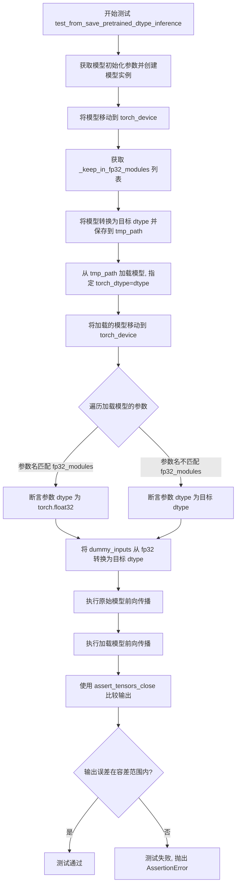

#### 带注释源码

```python
@require_accelerator  # 要求使用 accelerator (CUDA/XPU)
@pytest.mark.skipif(
    torch_device not in ["cuda", "xpu"],  # 仅在 CUDA 或 XPU 上运行
    reason="float16 and bfloat16 can only be use for inference with an accelerator",
)
@pytest.mark.parametrize("dtype", [torch.float16, torch.bfloat16], ids=["fp16", "bf16"])  # 参数化测试两种 dtype
@torch.no_grad()  # 禁用梯度计算，节省显存
def test_from_save_pretrained_dtype_inference(self, tmp_path, dtype, atol=1e-4, rtol=0):
    """
    测试推理时数据类型转换。
    
    验证流程:
    1. 创建模型并转换为目标 dtype 后保存
    2. 重新加载模型,验证参数 dtype 正确
    3. 比较原始模型和加载模型的输出是否一致
    """
    # 1. 创建模型实例并初始化
    model = self.model_class(**self.get_init_dict())
    model.to(torch_device)  # 移动到测试设备
    
    # 获取需要保持 FP32 的模块列表 (如某些敏感层)
    fp32_modules = model._keep_in_fp32_modules or []
    
    # 2. 将模型转换为目标 dtype 并保存到临时目录
    model.to(dtype).save_pretrained(tmp_path)
    
    # 3. 从保存的路径加载模型,指定目标 dtype
    model_loaded = self.model_class.from_pretrained(tmp_path, torch_dtype=dtype).to(torch_device)
    
    # 4. 验证加载模型的参数 dtype 正确
    for name, param in model_loaded.named_parameters():
        if fp32_modules and any(
            module_to_keep_in_fp32 in name.split(".") for module_to_keep_in_fp32 in fp32_modules
        ):
            # 如果参数属于需要保持 FP32 的模块,验证其为 float32
            assert param.data.dtype == torch.float32
        else:
            # 否则验证其为目标 dtype
            assert param.data.dtype == dtype
    
    # 5. 准备测试输入:将 dummy inputs 从 fp32 转换为目标 dtype
    inputs = cast_inputs_to_dtype(self.get_dummy_inputs(), torch.float32, dtype)
    
    # 6. 执行前向传播并比较输出
    output = model(**inputs, return_dict=False)[0]
    output_loaded = model_loaded(**inputs, return_dict=False)[0]
    
    # 7. 断言两个输出在容差范围内相等
    assert_tensors_close(
        output, output_loaded, atol=atol, rtol=rtol, msg=f"Loaded model output differs for {dtype}"
    )
```


### `ModelTesterMixin.test_sharded_checkpoints`

测试分片检查点（sharded checkpoints）的保存和加载功能是否正确工作。该测试方法会创建模型、计算模型大小、按照指定的 max_shard_size 保存为分片检查点、验证分片数量、然后重新加载模型并确保输出与原始模型一致。

参数：

- `self`：`ModelTesterMixin`，测试类的实例，隐式参数
- `tmp_path`：`py.path.local` 或 `Path`，pytest 提供的临时目录路径，用于保存和加载检查点
- `atol`：`float`，默认为 `1e-5`，张量比较的绝对容差（absolute tolerance）
- `rtol`：`float`，默认为 `0`，张量比较的相对容差（relative tolerance）

返回值：`None`，该方法为测试方法，不返回任何值，通过断言验证正确性

#### 流程图

```mermaid
flowchart TD
    A[开始测试] --> B[设置随机种子 torch.manual_seed(0)]
    B --> C[获取模型初始化参数 config = self.get_init_dict]
    C --> D[获取模型输入 inputs_dict = self.get_dummy_inputs]
    D --> E[创建模型实例并 eval]
    E --> F[将模型移动到 torch_device]
    F --> G[获取基准输出 base_output = model(inputs_dict)]
    G --> H[计算模型持久化大小 compute_module_persistent_sizes]
    H --> I[计算最大分片大小 max_shard_size = model_size * 0.75 / 2^10]
    I --> J[将模型移到 CPU 并保存到 tmp_path]
    J --> K{检查 SAFE_WEIGHTS_INDEX_NAME 是否存在}
    K -->|是| L[计算预期的分片数量]
    K -->|否| M[断言失败]
    L --> N[获取实际分片数量]
    N --> O{actual_num_shards == expected_num_shards}
    O -->|是| P[从 tmp_path 加载新模型]
    O -->|否| M
    P --> Q[将新模型移动到 torch_device]
    Q --> R[设置随机种子并获取新输入]
    R --> S[获取新模型输出 new_output]
    S --> T{比较 base_output 与 new_output}
    T -->|匹配| U[测试通过]
    T -->|不匹配| V[断言失败]
```

#### 带注释源码

```python
@require_accelerator  # 仅在有 accelerator（GPU/XPU）时运行
@torch.no_grad()      # 禁用梯度计算以节省内存
def test_sharded_checkpoints(self, tmp_path, atol=1e-5, rtol=0):
    """
    测试分片检查点的保存和加载功能。
    
    该测试会：
    1. 创建一个模型并获取基准输出
    2. 将模型保存为分片检查点（根据 max_shard_size 分割）
    3. 验证分片数量正确
    4. 重新加载模型并验证输出与原始模型一致
    """
    # 设置随机种子以确保可重复性
    torch.manual_seed(0)
    
    # 获取模型初始化参数字典
    config = self.get_init_dict()
    
    # 获取模型的虚拟输入
    inputs_dict = self.get_dummy_inputs()
    
    # 创建模型实例并设置为评估模式
    model = self.model_class(**config).eval()
    
    # 将模型移动到测试设备（GPU/CPU）
    model = model.to(torch_device)

    # 获取基准输出（原始模型的前向传播结果）
    base_output = model(**inputs_dict, return_dict=False)[0]

    # 计算模型的所有持久化tensor的大小（参数 + 持久 buffers）
    model_size = compute_module_persistent_sizes(model)[""]
    
    # 计算最大分片大小：
    # 使用模型大小的 75% 作为每个分片的限制
    # 除以 2^10 转换为 KB（因为测试模型很小）
    max_shard_size = int((model_size * 0.75) / (2**10))

    # 将模型移回 CPU 并保存为分片检查点
    # max_shard_size 指定每个分片的最大大小
    model.cpu().save_pretrained(tmp_path, max_shard_size=f"{max_shard_size}KB")
    
    # 断言：检查分片索引文件是否存在
    assert os.path.exists(os.path.join(tmp_path, SAFE_WEIGHTS_INDEX_NAME)), "Index file should exist"

    # 计算预期的分片数量（从索引文件中解析）
    expected_num_shards = calculate_expected_num_shards(os.path.join(tmp_path, SAFE_WEIGHTS_INDEX_NAME))
    
    # 统计实际的分片文件数量（.safetensors 文件）
    actual_num_shards = len([file for file in os.listdir(tmp_path) if file.endswith(".safetensors")])
    
    # 断言：验证分片数量是否匹配
    assert actual_num_shards == expected_num_shards, (
        f"Expected {expected_num_shards} shards, got {actual_num_shards}"
    )

    # 从保存的检查点加载模型
    new_model = self.model_class.from_pretrained(tmp_path).eval()
    
    # 将新模型移动到测试设备
    new_model = new_model.to(torch_device)

    # 重新设置随机种子并获取新的输入
    torch.manual_seed(0)
    inputs_dict_new = self.get_dummy_inputs()
    
    # 获取新模型的前向传播输出
    new_output = new_model(**inputs_dict_new, return_dict=False)[0]

    # 断言：比较原始模型输出与加载后模型的输出是否一致
    assert_tensors_close(
        base_output, new_output, atol=atol, rtol=rtol, 
        msg="Output should match after sharded save/load"
    )
```


### `ModelTesterMixin.test_sharded_checkpoints_with_variant`

该测试方法验证带有变体（如 fp16）的分片检查点保存和加载功能是否正确工作，确保模型在分片保存并以特定变体加载后输出与原始模型一致。

参数：

-  `self`：`ModelTesterMixin`，测试mixin类实例，提供了模型测试的基础设施
-  `tmp_path`：`pytest.fixture` (py.path.local)，Pytest提供的临时目录路径，用于存放保存的检查点文件
-  `atol`：`float`，可选，默认值为 `1e-5`，绝对误差容限，用于比较张量差异
-  `rtol`：`float`，可选，默认值为 `0`，相对误差容限，用于比较张量差异

返回值：`None`，该方法为测试用例，通过断言验证正确性，若失败则抛出异常

#### 流程图

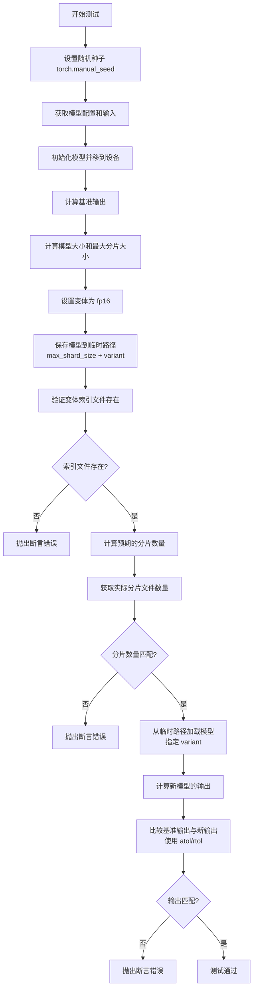

#### 带注释源码

```python
@require_accelerator  # 需要加速器环境（CUDA/XPU）
@torch.no_grad()      # 禁用梯度计算以节省内存
def test_sharded_checkpoints_with_variant(self, tmp_path, atol=1e-5, rtol=0):
    """
    测试带变体的分片检查点保存和加载功能。
    
    该测试验证：
    1. 模型可以按照指定的 max_shard_size 分片保存
    2. 保存时可以使用 variant 参数（如 fp16）
    3. 带变体的分片检查点可以正确加载
    4. 加载后的模型输出与原始模型一致
    
    Args:
        tmp_path: Pytest 提供的临时目录，用于保存检查点
        atol: 绝对误差容限，默认 1e-5
        rtol: 相对误差容限，默认 0
    
    Returns:
        None，通过断言验证正确性
    """
    # 设置随机种子以确保可重复性
    torch.manual_seed(0)
    
    # 获取模型初始化参数和测试输入
    config = self.get_init_dict()          # 从测试配置获取模型初始化参数字典
    inputs_dict = self.get_dummy_inputs()  # 获取测试用的虚拟输入
    
    # 初始化模型并设置为评估模式
    model = self.model_class(**config).eval()
    model = model.to(torch_device)          # 移动模型到测试设备（cuda/xpu/cpu）
    
    # 计算基准输出：原始模型在前向传播后的输出结果
    base_output = model(**inputs_dict, return_dict=False)[0]
    
    # 计算模型大小（参数 + 持久化缓冲区）
    model_size = compute_module_persistent_sizes(model)[""]
    # 计算最大分片大小：模型大小的75%，转换为KB单位
    max_shard_size = int((model_size * 0.75) / (2**10))
    
    # 设置变体类型为 fp16（半精度浮点）
    variant = "fp16"
    
    # 将模型移到CPU后保存为分片检查点
    # 参数:
    #   - max_shard_size: 每个分片的最大大小
    #   - variant: 保存的权重变体类型
    model.cpu().save_pretrained(tmp_path, max_shard_size=f"{max_shard_size}KB", variant=variant)
    
    # 生成带变体的索引文件名（如原本是 model.safetensors.index.json，添加变体后）
    index_filename = _add_variant(SAFE_WEIGHTS_INDEX_NAME, variant)
    # 验证带变体的索引文件是否存在
    assert os.path.exists(os.path.join(tmp_path, index_filename)), (
        f"Variant index file {index_filename} should exist"
    )
    
    # 计算预期的分片数量（从索引文件中解析）
    expected_num_shards = calculate_expected_num_shards(os.path.join(tmp_path, index_filename))
    # 统计实际存在的 .safetensors 分片文件数量
    actual_num_shards = len([file for file in os.listdir(tmp_path) if file.endswith(".safetensors")])
    # 验证分片数量是否符合预期
    assert actual_num_shards == expected_num_shards, (
        f"Expected {expected_num_shards} shards, got {actual_num_shards}"
    )
    
    # 从保存的检查点加载模型，指定要加载的变体
    new_model = self.model_class.from_pretrained(tmp_path, variant=variant).eval()
    new_model = new_model.to(torch_device)
    
    # 重新设置随机种子以确保输入一致性
    torch.manual_seed(0)
    inputs_dict_new = self.get_dummy_inputs()
    # 计算加载模型后的输出
    new_output = new_model(**inputs_dict_new, return_dict=False)[0]
    
    # 验证基准输出与加载模型输出是否匹配
    # 使用 assert_tensors_close 进行张量比较，允许一定的数值误差
    assert_tensors_close(
        base_output, new_output, atol=atol, rtol=rtol, 
        msg="Output should match after variant sharded save/load"
    )
```


### `ModelTesterMixin.test_sharded_checkpoints_with_parallel_loading`

该方法用于测试并行加载分片检查点的功能，验证模型在启用并行加载时能够正确加载分片权重，并且输出结果与顺序加载一致。

参数：

- `tmp_path`：`pytest.fixture` (Path/str)，pytest 提供的临时目录路径，用于保存和加载模型检查点
- `atol`：`float`，默认值 `1e-5`，张量比较的绝对容差，用于验证输出数值精度
- `rtol`：`float`，默认值 `0`，张量比较的相对容差

返回值：`None`，该方法为测试方法，不返回任何值

#### 流程图

```mermaid
flowchart TD
    A[开始] --> B[保存原始常量<br/>HF_ENABLE_PARALLEL_LOADING<br/>HF_PARALLEL_WORKERS]
    B --> C[初始化模型并设置随机种子]
    C --> D[获取基础输出<br/>base_output]
    D --> E[计算模型大小和最大分片大小<br/>max_shard_size]
    E --> F[保存模型到临时路径<br/>使用分片检查点]
    F --> G{检查索引文件是否存在}
    G -->|是| H[计算预期分片数量]
    G -->|否| M[抛出断言错误]
    H --> I[验证实际分片数量]
    I --> J[禁用并行加载<br/>HF_ENABLE_PARALLEL_LOADING = False]
    J --> K[顺序加载模型<br/>model_sequential]
    K --> L[启用并行加载<br/>HF_ENABLE_PARALLEL_LOADING = True<br/>DEFAULT_HF_PARALLEL_LOADING_WORKERS = 2]
    L --> N[并行加载模型<br/>model_parallel]
    N --> O[获取并行加载输出<br/>output_parallel]
    O --> P[比较输出<br/>assert_tensors_close]
    P --> Q[恢复原始常量]
    Q --> R[结束]
    
    style M fill:#ffcccc
    style P fill:#ccffcc
```

#### 带注释源码

```python
@torch.no_grad()
def test_sharded_checkpoints_with_parallel_loading(self, tmp_path, atol=1e-5, rtol=0):
    """
    测试并行加载分片检查点的功能。
    
    该测试验证：
    1. 模型可以正确保存为分片检查点
    2. 顺序加载和并行加载都能正确恢复模型
    3. 两种加载方式的输出结果一致
    
    Args:
        tmp_path: pytest 临时目录 fixture
        atol: 绝对容差，用于输出张量比较
        rtol: 相对容差，用于输出张量比较
    """
    # 导入 diffusers 常量模块，用于控制并行加载行为
    from diffusers.utils import constants

    # 设置随机种子确保可重复性
    torch.manual_seed(0)
    
    # 获取模型初始化配置和虚拟输入
    config = self.get_init_dict()
    inputs_dict = self.get_dummy_inputs()
    
    # 创建模型并设置为评估模式，移至目标设备
    model = self.model_class(**config).eval()
    model = model.to(torch_device)

    # 获取基准输出，用于后续比较
    base_output = model(**inputs_dict, return_dict=False)[0]

    # 计算模型大小，确定分片策略
    model_size = compute_module_persistent_sizes(model)[""]
    # 将模型大小的 75% 转换为 KB 单位（测试模型较小）
    max_shard_size = int((model_size * 0.75) / (2**10))

    # 保存原始常量值，以便测试后恢复
    original_parallel_loading = constants.HF_ENABLE_PARALLEL_LOADING
    original_parallel_workers = getattr(constants, "HF_PARALLEL_WORKERS", None)

    try:
        # 将模型移至 CPU 并保存为分片检查点
        model.cpu().save_pretrained(tmp_path, max_shard_size=f"{max_shard_size}KB")
        
        # 验证安全权重索引文件存在
        assert os.path.exists(os.path.join(tmp_path, SAFE_WEIGHTS_INDEX_NAME)), "Index file should exist"

        # 检查分片数量是否正确
        expected_num_shards = calculate_expected_num_shards(os.path.join(tmp_path, SAFE_WEIGHTS_INDEX_NAME))
        actual_num_shards = len([file for file in os.listdir(tmp_path) if file.endswith(".safetensors")])
        assert actual_num_shards == expected_num_shards, (
            f"Expected {expected_num_shards} shards, got {actual_num_shards}"
        )

        # ========== 顺序加载（禁用并行）==========
        constants.HF_ENABLE_PARALLEL_LOADING = False
        model_sequential = self.model_class.from_pretrained(tmp_path).eval()
        model_sequential = model_sequential.to(torch_device)

        # ========== 并行加载（启用并行）==========
        constants.HF_ENABLE_PARALLEL_LOADING = True
        constants.DEFAULT_HF_PARALLEL_LOADING_WORKERS = 2

        torch.manual_seed(0)  # 重新设置种子确保一致性
        model_parallel = self.model_class.from_pretrained(tmp_path).eval()
        model_parallel = model_parallel.to(torch_device)

        # 获取并行加载模型的输出
        torch.manual_seed(0)
        inputs_dict_parallel = self.get_dummy_inputs()
        output_parallel = model_parallel(**inputs_dict_parallel, return_dict=False)[0]

        # 验证并行加载的输出与基准输出匹配
        assert_tensors_close(
            base_output, output_parallel, atol=atol, rtol=rtol, 
            msg="Output should match with parallel loading"
        )

    finally:
        # ========== 恢复原始常量值 ==========
        # 确保测试不会影响其他测试的运行环境
        constants.HF_ENABLE_PARALLEL_LOADING = original_parallel_loading
        if original_parallel_workers is not None:
            constants.HF_PARALLEL_WORKERS = original_parallel_workers
```


### `ModelTesterMixin.test_model_parallelism`

测试模型在多GPU并行环境下的功能正确性，验证模型能够正确分割到多个GPU上并且输出结果与单设备运行时一致。

参数：

- `tmp_path`：`pytest.fixture`（str），pytest提供的临时目录路径，用于保存和加载模型检查点
- `atol`：`float`，绝对误差容忍度，默认为 `1e-5`，用于比较输出张量的差异
- `rtol`：`float`，相对误差容忍度，默认为 `0`，用于比较输出张量的差异

返回值：`None`，测试方法无返回值，通过断言验证正确性

#### 流程图

```mermaid
flowchart TD
    A[开始测试] --> B{检查_no_split_modules是否为空}
    B -->|为空| C[跳过测试]
    B -->|不为空| D[获取模型初始化参数和输入]
    D --> E[创建模型并设置eval模式]
    E --> F[将模型移动到torch_device]
    F --> G[设置随机种子为0]
    G --> H[执行前向传播获取base_output]
    H --> I[计算模型大小model_size]
    I --> J[计算每个GPU的最大内存大小列表]
    J --> K[保存模型到tmp_path]
    K --> L[遍历max_gpu_sizes列表]
    L --> M[构建max_memory字典]
    M --> N[使用device_map=auto加载模型]
    N --> O{验证hf_device_map包含GPU 0和1}
    O -->|验证失败| P[抛出断言错误]
    O -->|验证成功| Q[检查device_map是否被正确遵守]
    Q --> R[设置随机种子为0]
    R --> S[执行前向传播获取new_output]
    S --> T{比较base_output和new_output]
    T -->|不匹配| U[抛出断言错误]
    T -->|匹配| V[继续下一个max_size]
    V --> L
    L --> W[测试完成]
```

#### 带注释源码

```python
@require_torch_multi_accelerator  # 装饰器：要求多个加速器（多GPU）环境
@torch.no_grad()  # 装饰器：禁用梯度计算以节省内存
def test_model_parallelism(self, tmp_path, atol=1e-5, rtol=0):
    """
    测试模型多卡并行功能。
    
    该测试验证模型能够正确地在多个GPU之间分割（基于model_split_percent配置），
    并且在分割后的输出与单设备原始输出保持一致。
    
    Args:
        tmp_path: pytest提供的临时目录路径，用于保存模型检查点
        atol: 绝对误差容忍度，默认1e-5
        rtol: 相对误差容忍度，默认0
    """
    
    # 检查模型是否支持分割（_no_split_modules必须非空）
    if self.model_class._no_split_modules is None:
        pytest.skip("Test not supported for this model as `_no_split_modules` is not set.")

    # 获取模型初始化参数和测试输入
    config = self.get_init_dict()
    inputs_dict = self.get_dummy_inputs()
    
    # 创建模型并设置为评估模式
    model = self.model_class(**config).eval()

    # 将模型移动到测试设备（GPU）
    model = model.to(torch_device)

    # 设置随机种子确保可重复性
    torch.manual_seed(0)
    
    # 获取基准输出（单设备运行结果）
    base_output = model(**inputs_dict, return_dict=False)[0]

    # 计算模型总大小（包含所有参数）
    model_size = compute_module_sizes(model)[""]
    
    # 根据model_split_percent计算每个GPU的最大内存
    # 例如：如果model_split_percents = [0.5, 0.7]，则max_gpu_sizes = [0.5*model_size, 0.7*model_size]
    max_gpu_sizes = [int(p * model_size) for p in self.model_split_percents]

    # 将模型保存到临时路径
    model.cpu().save_pretrained(tmp_path)

    # 遍历不同的GPU内存配置进行测试
    for max_size in max_gpu_sizes:
        # 配置内存限制：GPU 0使用max_size，GPU 1使用model_size*2，CPU使用model_size*2
        max_memory = {0: max_size, 1: model_size * 2, "cpu": model_size * 2}
        
        # 使用accelerate的device_map自动分配模型到多个设备
        new_model = self.model_class.from_pretrained(tmp_path, device_map="auto", max_memory=max_memory)
        
        # 验证模型是否正确分割到GPU 0和GPU 1
        # assert set(new_model.hf_device_map.values()) == {0, 1}
        assert set(new_model.hf_device_map.values()) == {0, 1}, "Model should be split across GPUs"

        # 验证设备映射是否被正确遵守（即模型参数确实在指定的设备上）
        check_device_map_is_respected(new_model, new_model.hf_device_map)

        # 再次设置随机种子确保可重复性
        torch.manual_seed(0)
        
        # 在多GPU环境下执行前向传播
        new_output = new_model(**inputs_dict, return_dict=False)[0]

        # 验证多GPU输出与单设备基准输出是否一致
        assert_tensors_close(
            base_output, new_output, atol=atol, rtol=rtol, msg="Output should match with model parallelism"
        )
```

## 关键组件


### named_persistent_module_tensors

用于获取模块的所有持久化tensor（参数+缓冲区）的生成器函数，支持递归遍历子模块。这是实现分片检查点和模型大小计算的基础组件。

### compute_module_persistent_sizes

计算模型各层级模块的持久化存储大小（参数+持久缓冲区），支持自定义dtype和特殊类型处理，用于模型并行和分片策略规划。

### calculate_expected_num_shards

从safetensors索引文件解析预期的分片数量，用于验证分片检查点的完整性。

### check_device_map_is_respected

验证模型参数是否正确部署在device_map指定的设备上，确保模型并行加载的正确性。

### cast_inputs_to_dtype

递归地将输入张量或输入字典转换为目标dtype，支持模型量化推理时的类型转换。

### BaseModelTesterConfig

定义模型测试配置接口的抽象基类，规定了模型类、初始化参数、测试输入等必须实现的方法契约，是测试框架的标准化接口层。

### ModelTesterMixin

模型测试mixin类，聚合了模型保存加载、dtype转换、确定性验证、输出等价性、检查点分片、设备映射、模型并行等核心测试能力。

### 张量索引与持久化机制

通过named_persistent_module_tensors和compute_module_persistent_sizes的配合，实现了对模型参数和持久缓冲区的精确索引与大小计算，支持惰性加载场景下的内存管理。

### 反量化支持

通过cast_inputs_to_dtype函数和test_from_save_pretrained_dtype系列测试，实现了模型在float32/float16/bfloat16之间的转换验证，确保量化推理时类型处理的正确性。

### 量化策略测试

test_keep_in_fp32_modules和test_from_save_pretrained_dtype_inference验证了模型的_keep_in_fp32_modules机制，确保特定模块在量化时保持fp32精度。

### 分片检查点处理

test_sharded_checkpoints、test_sharded_checkpoints_with_variant和test_sharded_checkpoints_with_parallel_loading分别测试了基础分片、带variant分片和并行加载场景下的检查点完整性。

### 模型并行支持

test_model_parallelism验证了模型在多GPU间的分割策略，通过_no_split_modules和device_map实现模型并行推理。

### 设备映射验证

check_device_map_is_respected确保device_map中定义的设备分配被正确遵守，防止模型参数错配到错误设备。


## 问题及建议


### 已知问题

- **Magic Numbers 硬编码**：多处使用硬编码数值如 `0.75` (shard size 系数)、`5e-5`/`5e-5` (atol/rtol)、`1e-5`/`0` 等，缺乏配置化，修改时需要遍历多处代码
- **代码重复**：三个分片检查点测试方法 (`test_sharded_checkpoints`、`test_sharded_checkpoints_with_variant`、`test_sharded_checkpoints_with_parallel_loading`) 存在大量重复的保存/加载/验证逻辑
- **过长方法**：`test_outputs_equivalence` 中定义了嵌套函数 `set_nan_tensor_to_zero` 和 `recursive_check`，增加了方法复杂度
- **缺少默认值处理**：`calculate_expected_num_shards` 假设 index 文件中 `weight_map` 永远非空，未处理空字典或缺失字段的情况，可能导致 `IndexError`
- **类型提示不够精确**：多处使用 `Any` 类型如 `pretrained_model_kwargs: Dict[str, Any]`，降低了类型安全和代码可读性
- **测试隔离性问题**：修改全局状态 (`constants.HF_ENABLE_PARALLEL_LOADING`) 依赖 `try-finally` 恢复，如果测试中途失败可能污染全局状态
- **弃用警告处理不一致**：`test_getattr_is_correct` 中混用了 `pytest.warns` 和 `pytest.raises`，部分地方捕获 `FutureWarning` 但未验证警告内容

### 优化建议

- 提取公共常量到配置类或模块级变量，将 tolerance 值、shard size 系数等改为可配置参数
- 抽取分片检查点测试的公共逻辑到私有方法，如 `_save_and_validate_sharded_model`、`_compare_outputs` 等
- 将嵌套函数 `set_nan_tensor_to_zero` 和 `recursive_check` 提升为模块级辅助函数或使用 `@staticmethod`
- 在 `calculate_expected_num_shards` 中增加空值检查和默认值处理
- 改进类型提示，使用 `Protocol` 或泛型定义更精确的类型约束
- 考虑使用 pytest fixture 管理全局状态，或使用 `mock.patch` 替代直接修改全局变量
- 统一错误和警告处理方式，明确验证警告内容而非仅验证是否抛出异常

## 其它


### 设计目标与约束

本模块的设计目标是为diffusers库中的模型测试提供一个统一、可扩展的测试框架。主要约束包括：1) 必须与BaseModelTesterConfig配置类配合使用；2) 测试方法依赖pytest框架；3) 需要torchDevice配置支持；4) 部分测试需要accelerator支持（GPU/XPU）；5) 模型类必须实现特定的接口方法（get_init_dict、get_dummy_inputs等）。

### 错误处理与异常设计

代码中的错误处理主要体现在：1) device_map不完整时抛出ValueError；2) 模型属性访问不存在属性时抛出AttributeError；3) 使用pytest.raises验证异常场景；4) 使用assert_tensors_close进行数值精度验证。设计采用了防御式编程，参数形状不匹配、精度超限等情况都会触发明确的错误信息。

### 数据流与状态机

测试流程主要经历以下状态：模型初始化 -> 模型保存(-> 分片保存) -> 模型加载 -> 前向传播 -> 输出验证。测试方法覆盖的状态转换包括：fp32/bf16/fp16 dtype切换、checkpoint分片与合并、模型并行加载与推理、device_map设备映射等关键场景。

### 外部依赖与接口契约

主要依赖包括：1) torch及torch.nn模块；2) pytest测试框架；3) diffusers.utils中的工具函数（SAFE_WEIGHTS_INDEX_NAME、_add_variant、logging等）；4) accelerate.utils.modeling中的模型操作工具；5) testing_utils中的断言工具。接口契约要求测试类必须实现BaseModelTesterConfig定义的model_class属性、get_init_dict()和get_dummy_inputs()方法。

### 性能考虑

测试中包含内存使用估算（compute_module_persistent_sizes计算模型大小）、分片checkpoint测试（验证合理分片数量）、并行加载测试（HF_ENABLE_PARALLEL_LOADING）等性能相关验证。max_shard_size计算使用0.75系数确保测试模型使用较小分片。

### 安全性考虑

代码本身为测试框架，安全性考虑主要集中在：1) 模型保存时正确处理dtype转换；2) safe weights格式使用防止pickle安全风险；3) device_map验证确保参数放置在正确设备；4) fp32模块保持机制防止关键参数精度损失。

### 兼容性考虑

兼容性设计包括：1) 多dtype支持（float32/float16/bfloat16）；2) 多设备支持（cpu/cuda/xpu/mps）；3) 多accelerator支持（通过require_accelerator和require_torch_multi_accelerator装饰器）；4) variant变体支持（fp16等）；5) 并行加载配置兼容性。

### 测试覆盖范围

本测试框架覆盖的场景包括：模型序列化与反序列化（save_pretrained/from_pretrained）、dtype转换与保持、输出确定性验证、tuple/dict输出等价性、属性访问行为、分片checkpoint保存与加载、variant变体支持、并行加载、模型并行（多GPU分片）等核心功能。

### 常见问题排查

常见问题包括：1) MPS设备不支持bfloat16会导致跳过；2) device_map不完整会抛出明确错误；3) 分片数量不匹配会给出详细数值对比；4) 输出不匹配时提供atol/rtol阈值和差异信息；5) _keep_in_fp32_modules相关测试需要在GPU环境执行。

### 使用示例与扩展指南

要使用此测试框架，开发者需要：1) 创建继承自BaseModelTesterConfig的配置类；2) 实现model_class属性指向待测试模型；3) 实现get_init_dict()返回模型初始化参数字典；4) 实现get_dummy_inputs()返回测试输入；5) 可选覆盖output_shape、model_split_percents等属性；6) 创建测试类继承配置类和ModelTesterMixin；7) 可选添加自定义测试方法或覆盖现有方法。


    