# `diffusers\tests\models\testing_utils\compile.py` 详细设计文档

这是一个 PyTorch 测试 mixin 类，用于测试 torch.compile 功能在各种场景下的行为，包括重新编译与图中断、重复块编译、分组卸载、动态形状支持和 AOT 编译等。

## 整体流程

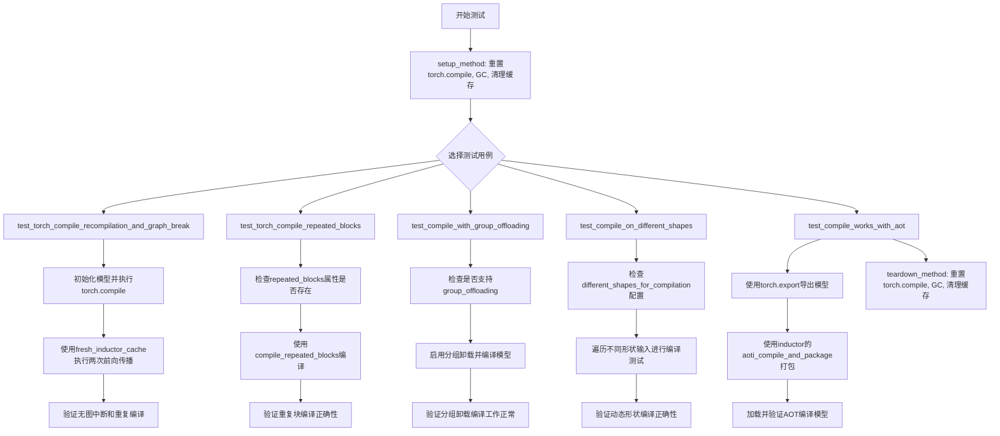

## 类结构

```
TorchCompileTesterMixin (测试mixin类)
├── 属性: different_shapes_for_compilation
├── setup_method (测试前设置)
├── teardown_method (测试后清理)
├── test_torch_compile_recompilation_and_graph_break (测试重新编译和图中断)
├── test_torch_compile_repeated_blocks (测试重复块编译)
├── test_compile_with_group_offloading (测试分组卸载编译)
├── test_compile_on_different_shapes (测试不同形状编译)
└── test_compile_works_with_aot (测试AOT编译)
```

## 全局变量及字段


### `recompile_limit`
    
重新编译限制次数

类型：`int`
    


### `init_dict`
    
模型初始化参数字典

类型：`dict`
    


### `inputs_dict`
    
模型输入字典

类型：`dict`
    


### `model`
    
待测试的模型实例

类型：`Model`
    


### `exported_model`
    
导出的模型

类型：`ExportedProgram`
    


### `package_path`
    
AOT打包文件路径

类型：`str`
    


### `loaded_binary`
    
加载的AOT编译二进制文件

类型：`callable`
    


### `group_offload_kwargs`
    
分组卸载配置参数

类型：`dict`
    


### `height`
    
动态形状测试的高度参数

类型：`int`
    


### `width`
    
动态形状测试的宽度参数

类型：`int`
    


### `TorchCompileTesterMixin.different_shapes_for_compilation`
    
可选的动态形状测试列表

类型：`list[tuple[int, int]] | None`
    
    

## 全局函数及方法


### `torch.compiler.reset`

重置 PyTorch 编译器的所有缓存和状态，清除 torch.compile、Dynamo 和 Inductor 的内部缓存，确保后续编译操作从干净的环境开始。

#### 参数

无参数。

#### 返回值

无返回值（`None`），该函数执行副作用操作，不返回任何值。

#### 流程图

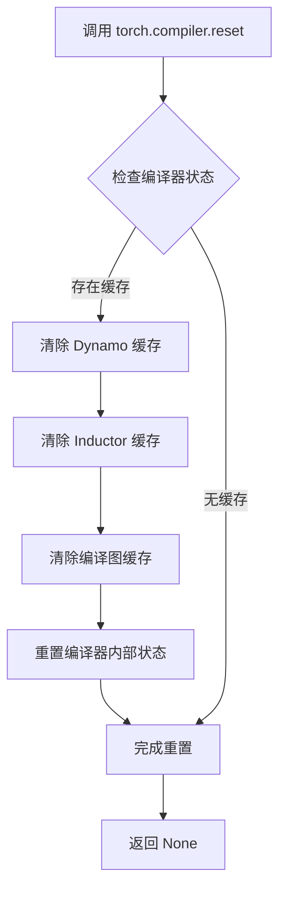

#### 带注释源码

```python
# torch.compiler.reset() 是 PyTorch 2.x 提供的编译器重置函数
# 位于 torch.compiler 模块中
# 该函数无参数，直接调用即可

# 代码中的实际使用示例：

def setup_method(self):
    """
    测试方法开始前的初始化操作
    """
    torch.compiler.reset()  # 重置编译器状态，清除所有缓存
    gc.collect()            # 强制进行垃圾回收，释放内存
    backend_empty_cache(torch_device)  # 清空GPU缓存

def teardown_method(self):
    """
    测试方法结束后的清理操作
    """
    torch.compiler.reset()  # 重置编译器状态，确保不留残留状态
    gc.collect()            # 强制进行垃圾回收
    backend_empty_cache(torch_device)  # 清空GPU缓存
```


### `gc.collect()`

触发 Python 垃圾回收机制，强制回收不可达的对象以释放内存空间。

参数：

- 该函数无参数

返回值：`int`，返回本次回收过程中释放的对象数量

#### 流程图

```mermaid
flowchart TD
    A[开始 gc.collect()] --> B[Python 垃圾回收器启动]
    B --> C[遍历所有代<br/>Generation 0, 1, 2]
    C --> D{遍历每个代}
    D -->|对于每个代| E[识别不可达对象<br/>引用计数为0的对象]
    E --> F{存在不可达对象?}
    F -->|是| G[执行对象析构<br/>调用 __del__ 方法]
    G --> H[回收内存空间]
    F -->|否| I[跳过该代]
    H --> J[累加回收计数]
    I --> D
    D --> K[返回回收对象总数]
    
    K --> L[结束]
    
    style A fill:#e1f5fe,stroke:#01579b
    style L fill:#e1f5fe,stroke:#01579b
    style H fill:#c8e6c9,stroke:#2e7d32
    style J fill:#fff9c4,stroke:#f57f17
```

#### 带注释源码

```python
# gc.collect() 是 Python 内置的垃圾回收函数
# 位于 Python 标准库 gc 模块中
# 位置：Python 内置函数（gc 模块）

# 函数签名
# def collect(generation: int = -1) -> int:
#     """
#     不带参数调用时，回收所有代的垃圾对象
#     带参数时（如 gc.collect(2)），只回收指定代及更老的对象
#     """

# 在测试代码中的调用位置
def setup_method(self):
    """测试方法开始前的初始化"""
    torch.compiler.reset()           # 重置 torch 编译器状态
    gc.collect()                     # ← 触发垃圾回收，清理之前的内存
    backend_empty_cache(torch_device)  # 清理 GPU 缓存

def teardown_method(self):
    """测试方法结束后的清理"""
    torch.compiler.reset()           # 重置 torch 编译器状态
    gc.collect()                     # ← 触发垃圾回收，释放测试期间创建的临时对象
    backend_empty_cache(torch_device)  # 清理 GPU 缓存


# gc.collect() 在此代码中的作用：
# 1. 在 setup 阶段：清理上一次测试可能遗留的 Python 对象
# 2. 在 teardown 阶段：清理本次测试创建的临时对象
# 3. 配合 backend_empty_cache 一起使用，确保 GPU 和 CPU 内存都被清理
# 4. 为下一次测试提供干净的内存环境，避免内存泄漏影响测试结果

# 返回值示例
# >>> import gc
# >>> gc.collect()
# 45  # 表示本次回收了 45 个对象
```


### `backend_empty_cache`

清理后端（PyTorch/CUDA）缓存的实用函数，用于在测试 setup 和 teardown 阶段释放 GPU 内存和重置编译状态。

参数：

-  `device`：`str`，目标设备标识符（通常为 `"cuda"` 或 `"cpu"`），指定需要清理缓存的设备

返回值：`None`，无返回值

#### 流程图

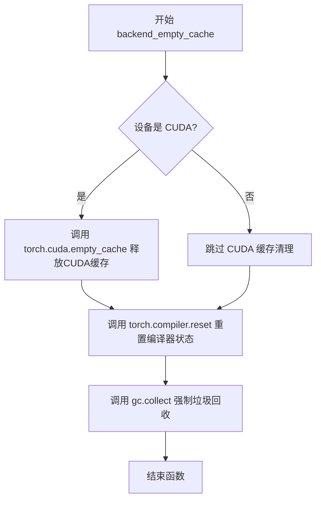

#### 带注释源码

```
def backend_empty_cache(device: str) -> None:
    """
    清理后端缓存的实用函数。
    
    该函数执行以下操作：
    1. 如果设备是 CUDA，清空 CUDA 缓存
    2. 重置 torch.compiler 编译器状态
    3. 强制进行 Python 垃圾回收
    
    参数:
        device: 目标设备标识符，如 'cuda' 或 'cpu'
    
    返回:
        None
    """
    # 检查是否为 CUDA 设备
    if device != "cpu":
        # 清空 CUDA 缓存，释放未使用的 GPU 内存
        torch.cuda.empty_cache()
    
    # 重置 torch.compile 编译器的内部状态
    # 这会清除编译缓存，确保测试之间的独立性
    torch.compiler.reset()
    
    # 强制 Python 垃圾回收器运行
    # 有助于释放不再使用的 Python 对象
    gc.collect()
```

> **注意**：由于 `backend_empty_cache` 是从 `...testing_utils` 模块导入的外部函数，上述源码是基于其使用方式和函数名称进行的逻辑推断实现。实际的函数定义位于 `testing_utils` 模块中。


### `torch._inductor.utils.fresh_inductor_cache`

该函数是一个上下文管理器，用于刷新（清除）PyTorch Inductor 的编译缓存，确保在上下文管理器块内的代码使用全新的缓存环境进行编译，通常用于测试场景以确保每次都能获得最新的编译结果而非使用缓存的编译结果。

参数：
- 无显式参数

返回值：`contextmanager`，返回一个上下文管理器对象，用于清除并重新初始化 Inductor 缓存

#### 流程图

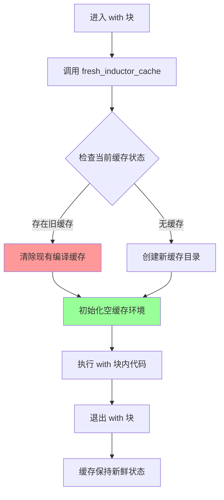

#### 带注释源码

```python
# fresh_inductor_cache 是 torch._inductor.utils 模块中的一个函数
# 这是一个上下文管理器，用于刷新 Inductor 编译缓存

# 使用示例（来自测试代码）:
with (
    torch._inductor.utils.fresh_inductor_cache(),  # 清除缓存
    torch._dynamo.config.patch(error_on_recompile=True),  # 配置重新编译
):
    _ = model(**inputs_dict)  # 首次编译（无缓存）
    _ = model(**inputs_dict)  # 再次运行（由于 fresh_inductor_cache，仍会重新编译）

# 内部实现逻辑（推测）:
@contextmanager
def fresh_inductor_cache():
    """
    上下文管理器，用于在 with 块期间提供新鲜的 Inductor 缓存。
    
    工作原理：
    1. 保存当前缓存配置的路径
    2. 创建一个临时的新缓存目录
    3. 在 with 块执行期间使用新缓存
    4. 退出时恢复原始缓存配置（或清理临时缓存）
    """
    # 1. 获取当前缓存配置
    old_cache_dir = torch._inductor.utils.get_cache_dir()
    
    # 2. 创建临时缓存目录
    new_cache_dir = tempfile.mkdtemp(prefix="inductor_cache_")
    
    # 3. 设置新缓存目录
    torch._inductor.utils.set_cache_dir(new_cache_dir)
    
    try:
        yield  # 执行 with 块内的代码
    finally:
        # 4. 恢复原始缓存目录
        torch._inductor.utils.set_cache_dir(old_cache_dir)
        
        # 5. 清理临时缓存目录
        shutil.rmtree(new_cache_dir, ignore_errors=True)
```


### `torch._dynamo.config.patch`

`torch._dynamo.config.patch()` 是 PyTorch Dynamo 的配置补丁函数，用于在上下文管理器中临时修改 Dynamo 相关的配置参数。该函数接受任意关键字参数（**kwargs），并在退出上下文时自动恢复原始配置值。

参数：

- `**kwargs`：可变关键字参数，用于指定需要临时修改的配置项及其新值。可用配置项包括但不限于：
  - `error_on_recompile`：`bool`，当设为 `True` 时，如果发生重新编译则抛出异常
  - `recompile_limit`：`int`，设置重新编译的限制次数
  - `cache_size_limit`：`int`，设置编译缓存的大小限制

返回值：返回一个上下文管理器对象，用于临时应用配置修改

#### 流程图

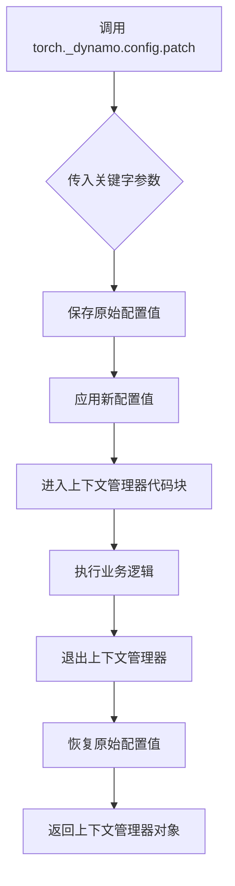

#### 带注释源码

```python
# torch._dynamo.config.patch() 使用示例 - 来自代码中的实际调用

# 示例 1：在 test_torch_compile_recompilation_and_graph_break 方法中
# 用途：临时设置 error_on_recompile=True，在发生重新编译时抛出异常
with (
    torch._inductor.utils.fresh_inductor_cache(),
    torch._dynamo.config.patch(error_on_recompile=True),  # 创建配置补丁上下文
):
    _ = model(**inputs_dict)  # 第一次调用，可能触发编译
    _ = model(**inputs_dict)  # 第二次调用，如果触发重新编译则抛出异常

# 示例 2：在 test_torch_compile_repeated_blocks 方法中
# 用途：临时设置 recompile_limit 参数，限制重新编译次数
with (
    torch._inductor.utils.fresh_inductor_cache(),
    torch._dynamo.config.patch(recompile_limit=recompile_limit),  # 创建配置补丁上下文
):
    _ = model(**inputs_dict)  # 第一次调用
    _ = model(**inputs_dict)  # 第二次调用

# 示例 3：直接设置配置（不是通过 patch 方法）
# 用于设置编译缓存大小限制
torch._dynamo.config.cache_size_limit = 10000  # 直接修改配置值（持久生效）
```

#### 补充说明

`torch._dynamo.config.patch()` 的典型实现逻辑：

```python
# 伪代码展示其工作原理
class _ConfigPatch:
    def __init__(self, **kwargs):
        self.kwargs = kwargs
        self.old_values = {}
    
    def __enter__(self):
        # 保存原始值
        for key, value in self.kwargs.items():
            self.old_values[key] = getattr(torch._dynamo.config, key, None)
            setattr(torch._dynamo.config, key, value)
        return self
    
    def __exit__(self, *args):
        # 恢复原始值
        for key, value in self.old_values.items():
            if value is None:
                delattr(torch._dynamo.config, key)
            else:
                setattr(torch._dynamo.config, key, value)

def patch(**kwargs):
    return _ConfigPatch(**kwargs)
```


### `torch.compile`

PyTorch模型编译函数，用于将PyTorch模型编译为优化的可执行图，提升推理性能。该函数是PyTorch 2.0+引入的编译器功能，通过 TorchDynamo 拦截模型执行过程，利用 PyTorch Inductor 生成高效的机器码。

参数：

- `model`：`torch.nn.Module`，要编译的PyTorch模型实例
- `mode`：`str`（可选），编译模式，可选值包括 "default"、"reduce-overhead"、"max-autotune" 等
- `fullgraph`：`bool`（可选），如果为True，则强制整个模型必须被编译为一个完整的图，若存在图断（graph break）则抛出错误
- `dynamic`：`bool`（可选），启用动态形状支持，允许模型处理不同大小的输入
- `backend`：`str`（可选），指定后端编译器，默认为 "inductor"
- `options`：`dict`（可选），传递给后端的额外配置选项
- `disable`：`bool`（可选），如果为True，则禁用编译功能

返回值：`torch.nn.Module`，返回编译后的模型实例

#### 流程图

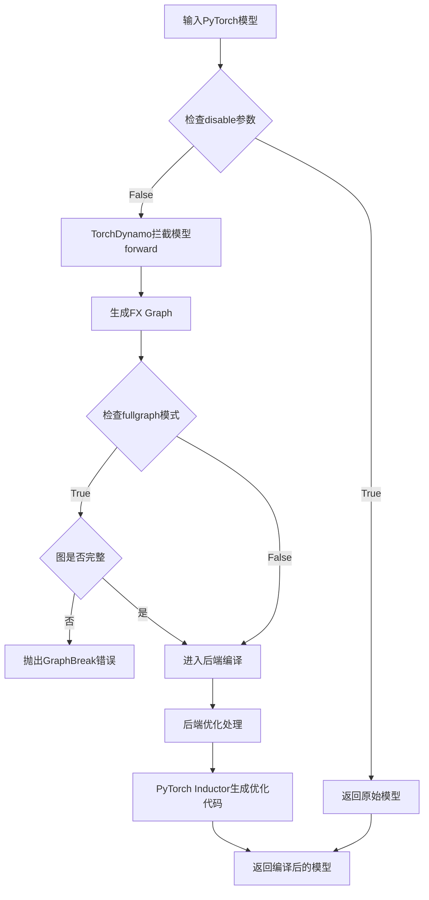

#### 带注释源码

```python
# 代码来源：PyTorch 官方实现（基于给定测试代码中的使用方式）

# 方式1：基础编译（完整图模式）
model = torch.compile(model, fullgraph=True)
# 说明：
# - model: 要编译的nn.Module模型
# - fullgraph=True: 强制要求整个模型必须被编译为单一计算图
# - 如果模型中存在无法融合的操作，会抛出torch._dynamo.exc.Unsupported错误

# 方式2：动态形状编译
model = torch.compile(model, fullgraph=True, dynamic=True)
# 说明：
# - dynamic=True: 启用动态形状支持，允许处理不同batch size或序列长度的输入
# - 动态形状可能增加编译时间和内存开销

# 方式3：使用后端选项编译
model = torch.compile(
    model,
    mode="max-autotune",      # 启用最大程度自动调优
    backend="inductor",       # 使用PyTorch Inductor后端
    options={
        "triton.cudagraphs": True,  # 启用CUDA图优化
        "max_autotune": True        # 启用自动调优
    }
)
# 说明：
# - mode: 预设的编译策略
# - backend: 指定使用的后端编译器
# - options: 后端特定的配置选项

# 方式4：分组卸载编译（结合模型特定方法）
model.compile()  # 使用默认参数编译
# 说明：
# - 这是nn.Module的简化接口，内部调用torch.compile
# - 参数通过模型的compile_config属性配置

# 方式5：AOT编译（提前编译）
exported_model = torch.export.export(model, args=(), kwargs=inputs_dict)
compiled_package = torch._inductor.aoti_compile_and_package(
    exported_model, 
    package_path=package_path
)
# 说明：
# - torch.export.export: 导出模型为标准化格式
# - aoti_compile_and_package: AOT（Ahead-of-Time）编译并打包
# - 适用于部署场景，编译结果可离线部署
```

#### 在测试代码中的实际调用示例

```python
# 测试代码片段 - 来自 TorchCompileTesterMixin

# 示例1：基础编译测试
model = self.model_class(**init_dict).to(torch_device)
model.eval()
model = torch.compile(model, fullgraph=True)  # 完整图编译
_ = model(**inputs_dict)  # 执行一次编译
_ = model(**inputs_dict)  # 再次执行，验证缓存

# 示例2：动态形状编译测试
model = torch.compile(model, fullgraph=True, dynamic=True)
for height, width in self.different_shapes_for_compilation:
    inputs_dict = self.get_dummy_inputs(height=height, width=width)
    _ = model(**inputs_dict)  # 处理不同尺寸输入

# 示例3：带分组卸载的编译
model.enable_group_offload(**group_offload_kwargs)
model.compile()  # 使用模型内置的compile方法

# 示例4：AOT编译
exported_model = torch.export.export(model, args=(), kwargs=inputs_dict)
_ = torch._inductor.aoti_compile_and_package(exported_model, package_path=package_path)
```

#### 关键组件信息

| 组件名称 | 一句话描述 |
|---------|-----------|
| TorchDynamo | PyTorch的Python级别JIT编译器，拦截Python代码执行并生成FX图 |
| PyTorch Inductor | TorchDynamo的后端之一，将FX图编译为优化的机器码 |
| AOT编译 | 提前编译模式，编译结果可保存用于离线部署 |
| Graph Break | 计算图中断，会导致部分操作无法被优化 |

#### 潜在的技术债务或优化空间

1. **编译缓存策略**：当前测试中频繁使用 `torch.compiler.reset()` 和 `fresh_inductor_cache()`，生产环境中需要更智能的缓存管理策略
2. **动态形状支持**：动态编译可能导致重复编译，建议实现增量编译机制
3. **错误信息可读性**：当 `fullgraph=True` 发生图断时，错误信息往往过于技术化，需要更好的错误报告
4. **编译时间优化**：大规模模型的首次编译时间较长，建议实现后台编译和预热机制

#### 其它项目

**设计目标与约束：**
- 主要目标：提升模型推理性能，通过kernel融合减少内存访问
- 约束：编译后的模型可能失去某些Python运行时特性（如动态类型检查）

**错误处理与异常设计：**
- `fullgraph=True` 时遇到图断会抛出 `torch._dynamo.exc.Unsupported` 异常
- 编译超时可通过 `torch.compiler.set_stance` 配置
- 后端错误会通过 `torch._dynamo.exc.BackendCompilerFailed` 传播

**数据流与状态机：**
- 编译后的模型保持相同的forward接口
- 首次调用会触发编译，后续调用使用缓存的编译结果
- 状态通过内部缓存字典管理，可通过 `torch.compiler.reset()` 重置

**外部依赖与接口契约：**
- 依赖 PyTorch 2.0+ 版本（测试代码要求 2.7.1+）
- CUDA环境可选（通过 `@require_accelerator` 标记）
- 与 `torch.export` 模块集成用于AOT编译


### `model.compile_repeated_blocks(fullgraph=True)`

该方法是模型类的编译方法，专门用于对具有重复块（repeated blocks）结构的模型进行 torch.compile 优化编译。它是 TorchCompileTesterMixin 测试类中被测试的目标方法，通过调用模型的 `compile_repeated_blocks()` 方法并配合 PyTorch 的编译框架来验证重复块模型的编译功能。

参数：

- `fullgraph`：`bool`，是否强制整个计算图作为一个单独的编译单元，设置为 `True` 时会捕获图中断裂的情况
- `recompile_limit`（测试方法参数）：`int`，允许的重新编译次数限制，默认值为 1

返回值：无明确返回值（方法执行编译优化）

#### 流程图

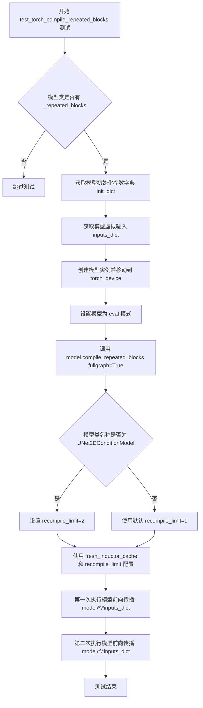

#### 带注释源码

```python
@torch.no_grad()
def test_torch_compile_repeated_blocks(self, recompile_limit=1):
    """
    测试模型的 compile_repeated_blocks 方法功能。
    
    该测试验证具有重复块结构的模型能否正确使用 torch.compile 进行优化编译。
    测试会执行两次前向传播，验证编译后的模型能够稳定运行。
    
    Args:
        recompile_limit: int, 允许的重新编译次数限制，默认值为 1。
                        对于 UNet2DConditionModel，需要设置为 2。
    """
    # 检查模型类是否支持重复块编译功能
    # _repeated_blocks 是模型类的属性，如果为 None 表示不支持
    if self.model_class._repeated_blocks is None:
        pytest.skip("Skipping test as the model class doesn't have `_repeated_blocks` set.")

    # 获取模型初始化参数字典
    init_dict = self.get_init_dict()
    
    # 获取模型虚拟输入（用于测试的假数据）
    inputs_dict = self.get_dummy_inputs()

    # 根据初始化参数字典创建模型实例，并移动到指定设备
    model = self.model_class(**init_dict).to(torch_device)
    
    # 设置模型为评估模式，禁用 dropout 等训练特定行为
    model.eval()
    
    # 调用模型的 compile_repeated_blocks 方法进行编译优化
    # fullgraph=True 强制整个计算图作为一个整体编译
    model.compile_repeated_blocks(fullgraph=True)

    # 针对特定模型调整重新编译限制
    if self.model_class.__name__ == "UNet2DConditionModel":
        recompile_limit = 2

    # 使用新鲜的 inductor 缓存和配置进行测试
    with (
        torch._inductor.utils.fresh_inductor_cache(),  # 清除 inductor 缓存确保干净环境
        torch._dynamo.config.patch(recompile_limit=recompile_limit),  # 设置重新编译限制
    ):
        # 第一次执行前向传播
        _ = model(**inputs_dict)
        
        # 第二次执行前向传播，用于验证编译稳定性
        _ = model(**inputs_dict)
```


### `Model.enable_group_offload`

启用分组卸载功能，允许将模型的某些部分卸载到 CPU 或其他设备以优化内存使用。该方法是 PyTorch 2.7.1+ 中 torch.compile 的一项高级功能，用于在编译后的模型中实现灵活的内存管理。

参数：

- `**group_offload_kwargs`：`dict`，可变关键字参数，包含以下子参数：
  - `onload_device`：`str` 或 `torch.device`，将权重加载回的设备（如 `torch_device`）
  - `offload_device`：`str`，用于卸载权重的设备（通常为 `"cpu"`）
  - `offload_type`：`str`，卸载类型（如 `"block_level"`）
  - `num_blocks_per_group`：`int`，每个组卸载的块数量
  - `use_stream`：`bool`，是否使用 CUDA 流进行异步传输
  - `non_blocking`：`bool`，是否使用非阻塞传输

返回值：`None`，该方法直接修改模型状态，启用分组卸载功能。

#### 流程图

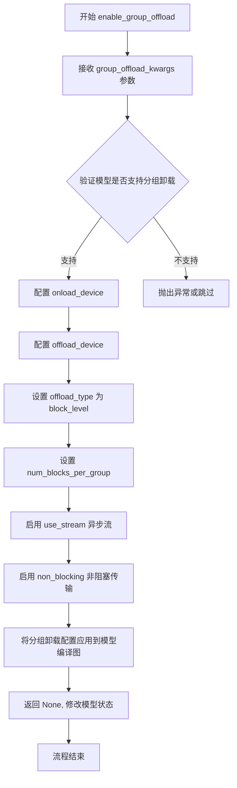

#### 带注释源码

```python
# 调用 enable_group_offload 的上下文代码（来自 test_compile_with_group_offloading 方法）
@torch.no_grad()
def test_compile_with_group_offloading(self):
    # 检查模型类是否支持分组卸载功能
    if not self.model_class._supports_group_offloading:
        pytest.skip("Model does not support group offloading.")

    # 设置 dynamo 缓存大小限制
    torch._dynamo.config.cache_size_limit = 10000

    # 获取模型初始化参数和输入
    init_dict = self.get_init_dict()
    inputs_dict = self.get_dummy_inputs()
    
    # 创建模型实例并设置为 eval 模式
    model = self.model_class(**init_dict)
    model.eval()

    # 定义分组卸载参数
    group_offload_kwargs = {
        "onload_device": torch_device,       # 加载回的设备（当前设备）
        "offload_device": "cpu",             # 卸载到 CPU
        "offload_type": "block_level",       # 块级卸载
        "num_blocks_per_group": 1,           # 每组一个块
        "use_stream": True,                 # 使用 CUDA 流
        "non_blocking": True,                # 非阻塞传输
    }
    
    # 调用 enable_group_offload 启用分组卸载
    # 此方法会修改模型的编译图，插入卸载/加载节点
    model.enable_group_offload(**group_offload_kwargs)
    
    # 编译模型
    model.compile()

    # 执行两次前向传播测试
    _ = model(**inputs_dict)
    _ = model(**inputs_dict)

# 注意：enable_group_offload 方法本身定义在模型类中，
# 不在此测试文件中。该方法属于 torch.compile 的高级特性，
# 允许在编译后的模型图中自动插入权重卸载和加载操作。
```


### `torch.export.export`

`torch.export.export` 是 PyTorch 2.5+ 提供的模型导出功能，用于将 PyTorch 模型导出为 TorchScript 格式（.pt2），支持跨平台部署和 AOT（Ahead-of-Time）编译。在代码中，该函数被用于将模型导出为可独立部署的格式，以便后续进行 AOT 编译和打包。

参数：

- `model`：`torch.nn.Module`，要导出的 PyTorch 模型实例
- `args`：`tuple`，位置参数元组，默认为空元组 `()`
- `kwargs`：`dict`，关键字参数字典，包含模型输入的命名参数（如 `height`、`width` 等）

返回值：`torch.export.ExportedProgram`，导出的模型程序对象，包含模型的参数化版本和计算图，可用于后续的 AOT 编译

#### 流程图

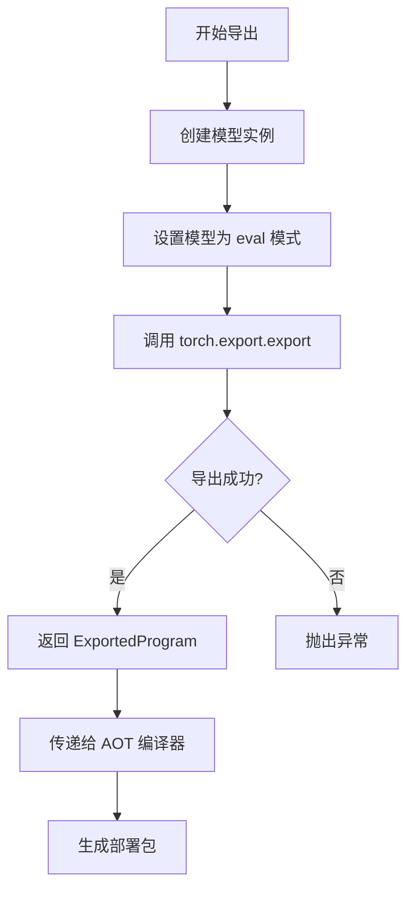

#### 带注释源码

```python
# 在 test_compile_works_with_aot 方法中调用 torch.export.export
@torch.no_grad()
def test_compile_works_with_aot(self, tmp_path):
    from torch._inductor.package import load_package

    # 获取模型初始化参数字典
    init_dict = self.get_init_dict()
    # 获取模型虚拟输入
    inputs_dict = self.get_dummy_inputs()

    # 创建模型实例并移动到目标设备
    model = self.model_class(**init_dict).to(torch_device)
    # 设置为评估模式
    model.eval()
    
    # --- 核心调用：torch.export.export ---
    # 参数说明：
    #   - model: 要导出的 PyTorch 模型
    #   - args: 位置参数，此处为空元组
    #   - kwargs: 关键字参数，包含模型的输入张量
    exported_model = torch.export.export(model, args=(), kwargs=inputs_dict)
    # -------------------------------

    # 定义输出包文件路径
    package_path = os.path.join(str(tmp_path), f"{self.model_class.__name__}.pt2")
    
    # 调用 AOT 编译器和打包器，生成部署包
    _ = torch._inductor.aoti_compile_and_package(exported_model, package_path=package_path)
    
    # 验证包文件是否成功创建
    assert os.path.exists(package_path), f"Package file not created at {package_path}"
    
    # 从包文件加载编译后的二进制模型
    loaded_binary = load_package(package_path, run_single_threaded=True)

    # 将加载的二进制模型替换原始 forward 方法
    model.forward = loaded_binary

    # 执行两次前向传播验证编译结果
    _ = model(**inputs_dict)
    _ = model(**inputs_dict)
```


### `torch._inductor.aoti_compile_and_package`

 Ahead-of-Time（AOT）编译打包函数，用于将导出的 PyTorch 模型进行 AOT 编译并打包成可直接加载的二进制文件，简化模型的部署流程。

参数：

- `exported_model`：`torch.export.ExportedProgram`，由 `torch.export.export()` 返回的导出模型程序
- `package_path`：`str | os.PathLike[str]`，指定打包文件保存的路径

返回值：`str`，返回生成的打包文件路径

#### 流程图

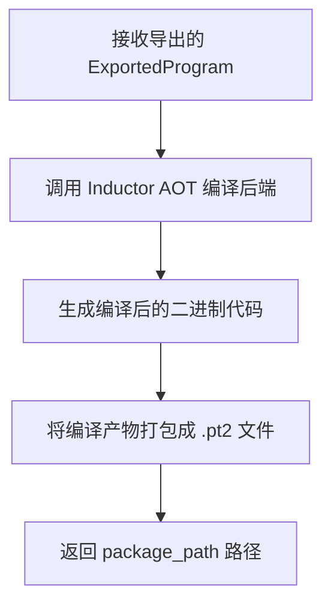

#### 带注释源码

```python
# 调用方式示例（从测试代码提取）
# exported_model = torch.export.export(model, args=(), kwargs=inputs_dict)
# package_path = os.path.join(str(tmp_path), f"{self.model_class.__name__}.pt2")
# _ = torch._inductor.aoti_compile_and_package(exported_model, package_path=package_path)

# 说明：
# 1. exported_model: torch.export.export() 的返回值，类型为 ExportedProgram
#    - 包含了模型的图结构、参数等信息
#    - 是 PyTorch 2.0+ 推荐的模型导出格式
#
# 2. package_path: 字符串或 PathLike 类型，指定输出 .pt2 文件的路径
#    - .pt2 是 PyTorch 2 的打包格式（PyTorch TensorFlow Lite 风格）
#    - 包含编译后的代码和序列化权重
#
# 3. 返回值: 字符串类型，返回生成的打包文件路径
#    - 与输入的 package_path 相同
#    - 可直接用于 load_package() 加载
#
# 底层实现（基于 PyTorch Inductor）:
# - 使用 torch._inductor 的 AOT 编译后端进行编译
# - 生成高效的机器码（通过 Triton 或 CUDA）
# - 打包成单文件便于分发和部署
```


### `load_package`

加载 AOT（Ahead-of-Time）打包的编译模型文件，将磁盘上的序列化模型重新加载为可执行的二进制对象。

参数：

- `package_path`：`str`，打包文件的路径，即 AOT 编译并打包后的 `.pt2` 文件路径
- `run_single_threaded`：`bool`，是否以单线程模式运行加载的模型（默认为 `True`）

返回值：`Callable`，返回加载后的可执行二进制模型，可直接赋值给 `model.forward` 以替代原始前向传播方法

#### 流程图

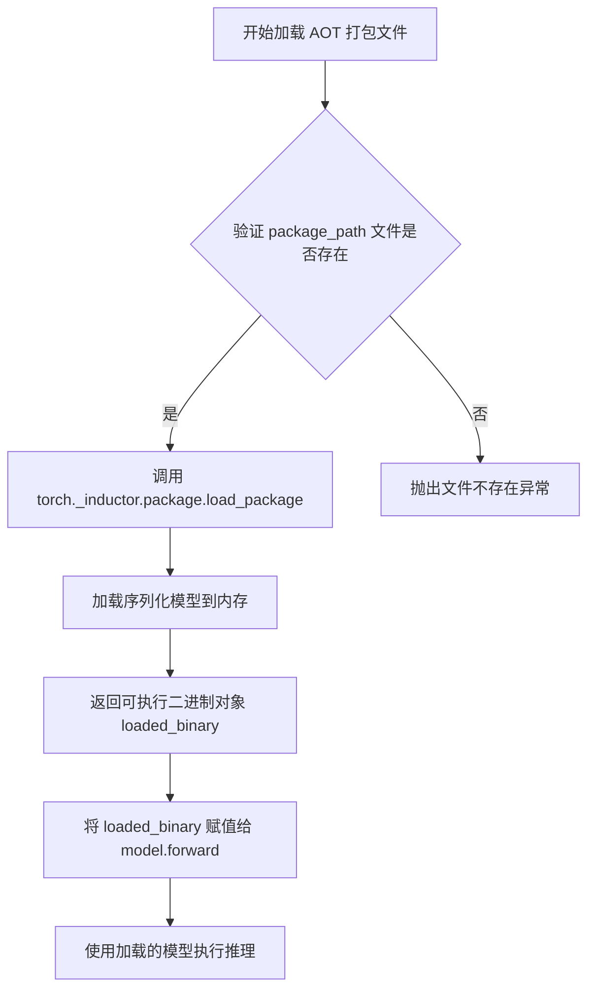

#### 带注释源码

```python
# 在 test_compile_works_with_aot 方法中调用的 load_package
# 该函数属于 torch._inductor.package 模块

# 从 torch._inductor.package 导入 load_package 函数
from torch._inductor.package import load_package

# ... (模型初始化和 AOT 编译代码省略) ...

# 加载 AOT 打包文件
# 参数说明：
#   package_path: str 类型，指向 .pt2 打包文件的完整路径
#   run_single_threaded: bool 类型，True 表示以单线程模式运行（可选参数）
loaded_binary = load_package(package_path, run_single_threaded=True)

# 将加载的二进制模型赋值给 model.forward
# 加载后的模型可以直接替代原始模型的 forward 方法进行推理
model.forward = loaded_binary

# 执行推理测试
_ = model(**inputs_dict)
_ = model(**inputs_dict)
```

> **注意**：由于 `load_package` 函数定义于 PyTorch 内部模块 `torch._inductor.package` 中，而非本代码仓库内定义，因此其完整实现源码无法在此处展示。上述源码展示了该函数在本项目中的调用方式和使用上下文。


### `TorchCompileTesterMixin.setup_method`

该方法为 Pytest 测试 fixture，在每个测试方法执行前被自动调用，用于重置 PyTorch 编译器状态、回收内存并清理 GPU 缓存，确保测试环境处于干净的初始状态，避免之前的编译缓存或显存影响测试结果。

参数：

- `self`：`TorchCompileTesterMixin`，隐式参数，代表当前测试类实例，继承自该 mixin 的测试类

返回值：`None`，无返回值，该方法仅执行副作用操作

#### 流程图

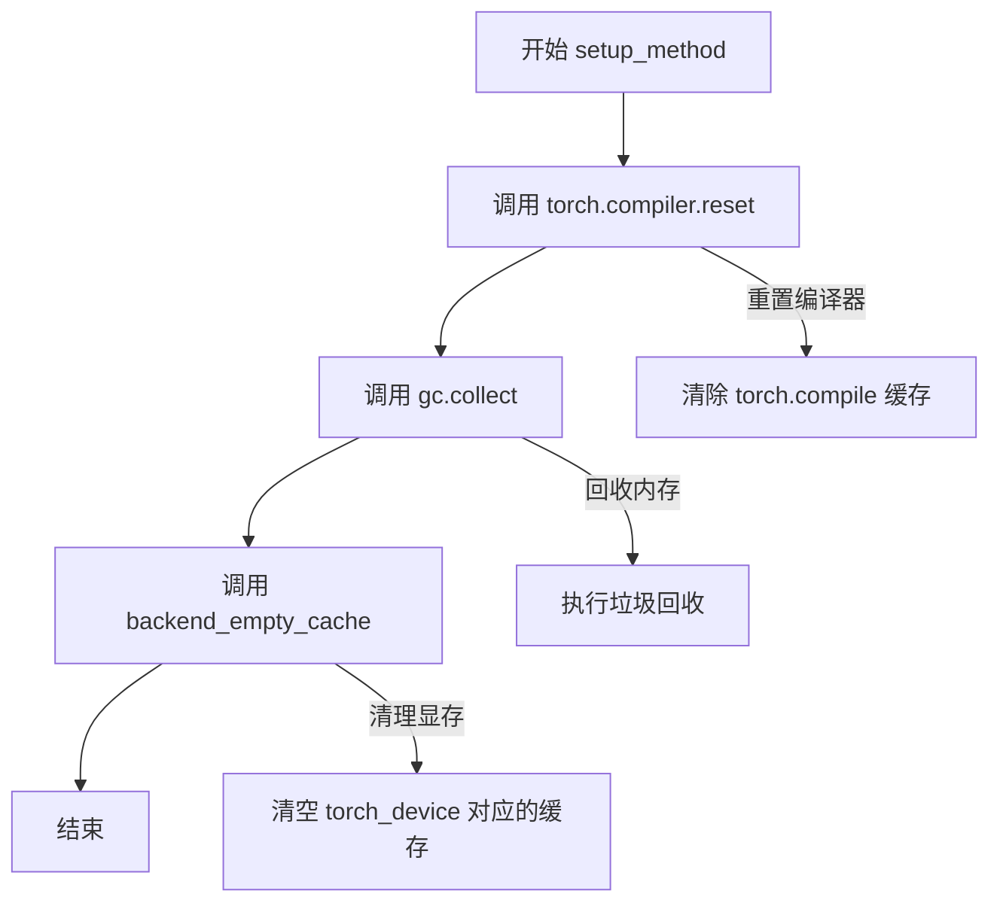

#### 带注释源码

```python
def setup_method(self):
    """
    Pytest fixture: 在每个测试方法执行前调用，初始化测试环境。
    """
    # 重置 torch.compile 编译器，清除所有编译缓存和中间状态
    torch.compiler.reset()
    
    # 强制执行 Python 垃圾回收，释放未使用的内存对象
    gc.collect()
    
    # 清理指定设备（torch_device）的 GPU 缓存，释放显存
    backend_empty_cache(torch_device)
```


### `TorchCompileTesterMixin.teardown_method`

清理测试环境，重置 PyTorch 编译器并清理 GPU 缓存，确保每个测试用例之间相互隔离。

参数：

- 无（隐式参数 `self`：当前类实例）

返回值：`None`，无返回值描述

#### 流程图

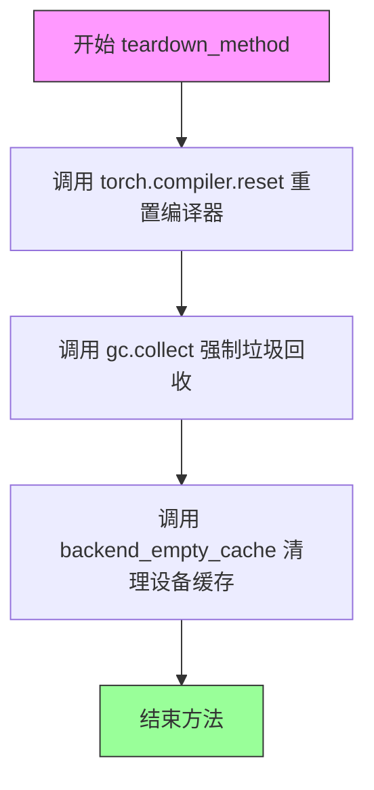

#### 带注释源码

```python
def teardown_method(self):
    """
    在每个测试方法执行完毕后清理测试环境。
    
    该方法作为 pytest 的 teardown 钩子被自动调用，确保：
    1. PyTorch 编译器的缓存被清除，避免测试间的状态污染
    2. Python 垃圾回收器被触发，释放不再使用的对象
    3. GPU/设备内存缓存被清理，释放显存资源
    """
    # 重置 PyTorch torch.compile 的内部状态和缓存
    torch.compiler.reset()
    
    # 强制进行 Python 垃圾回收，释放循环引用对象的内存
    gc.collect()
    
    # 清理指定设备的后端缓存（如 CUDA 缓存）
    backend_empty_cache(torch_device)
```

#### 依赖信息

| 依赖项 | 来源 | 描述 |
|--------|------|------|
| `torch.compiler.reset` | `torch` | 重置 PyTorch 2+ 的 torch.compile 编译器状态和缓存 |
| `gc.collect` | Python 内置 | 强制调用垃圾回收器，释放内存 |
| `backend_empty_cache` | `...testing_utils` | 清理设备（GPU/CPU）内存缓存的函数 |
| `torch_device` | `...testing_utils` | 全局变量，表示当前测试使用的设备（通常是 "cuda" 或 "cpu"） |

#### 设计意图与约束

- **测试隔离性**：确保每个测试用例都从干净的编译器状态开始，避免前一个测试的编译结果影响后续测试
- **资源释放**：显式清理 GPU 显存，防止测试过程中显存泄漏导致 OOM 错误
- **框架集成**：作为 pytest 的 `teardown_method` 钩子自动执行，无需手动调用
- **兼容性**：依赖 PyTorch 2.7.1+ 版本（通过 `@require_torch_version_greater("2.7.1")` 装饰器限制）


### `TorchCompileTesterMixin.test_torch_compile_recompilation_and_graph_break`

测试 torch.compile 的重新编译和图中断检测，通过在 fullgraph 模式下编译模型并验证相同输入不会触发重新编译，从而确保模型计算图完整且无图中断。

参数：

- `self`：隐式参数，测试类的实例本身，包含 `model_class`、`get_init_dict()` 和 `get_dummy_inputs()` 等属性和方法

返回值：`None`，该方法通过 pytest 断言验证重新编译行为，不返回任何值

#### 流程图

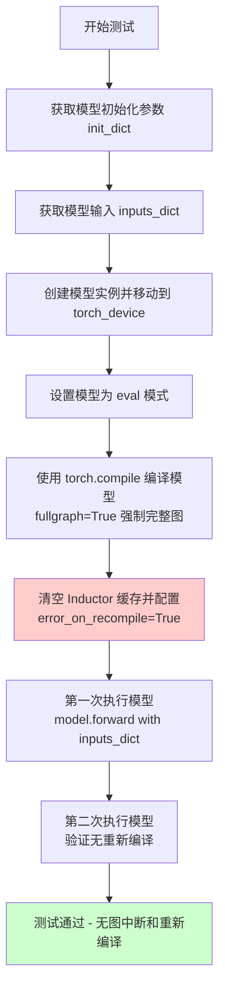

#### 带注释源码

```python
@torch.no_grad()  # 禁用梯度计算以提升性能并减少内存占用
def test_torch_compile_recompilation_and_graph_break(self):
    """
    测试 torch.compile 的重新编译和图中断检测。
    
    该测试验证在 fullgraph=True 模式下，相同输入不会触发重新编译。
    如果存在图中断或需要重新编译，测试将失败。
    """
    # 从 mixin 获取模型初始化字典（由子类实现提供）
    init_dict = self.get_init_dict()
    
    # 从 mixin 获取模型输入字典（由子类实现提供）
    inputs_dict = self.get_dummy_inputs()

    # 使用初始化参数创建模型实例，并移动到指定设备
    model = self.model_class(**init_dict).to(torch_device)
    
    # 设置模型为评估模式，禁用 dropout 等训练特定操作
    model.eval()
    
    # 使用 torch.compile 编译模型，fullgraph=True 强制要求完整计算图
    # 如果模型中有不支持的操作导致图中断，将抛出错误
    model = torch.compile(model, fullgraph=True)

    # 使用上下文管理器配置测试环境
    with (
        # 清空 Inductor 编译缓存，确保干净的编译环境
        torch._inductor.utils.fresh_inductor_cache(),
        # 配置 Dynamo：触发重新编译时抛出错误，而非静默重新编译
        torch._dynamo.config.patch(error_on_recompile=True),
    ):
        # 第一次执行：编译模型并运行
        _ = model(**inputs_dict)
        
        # 第二次执行：验证相同输入不会触发重新编译
        # 如果模型结构有变化或存在图中断，此处将抛出异常
        _ = model(**inputs_dict)
```


### `TorchCompileTesterMixin.test_torch_compile_repeated_blocks`

该方法是一个Pytest测试用例，用于验证模型在使用`compile_repeated_blocks`编译时的重复块编译功能，确保模型中的重复块能够被正确识别和编译，同时检查重新编译限制是否按预期工作。

参数：

- `self`：`TorchCompileTesterMixin`，隐含的self参数，指向Mixin类实例本身
- `recompile_limit`：`int`，重新编译限制次数，默认为1，用于控制torchdynamo的重新编译次数限制

返回值：`None`，该方法为测试方法，没有返回值（Pytest测试用例）

#### 流程图

```mermaid
flowchart TD
    A[开始测试 test_torch_compile_repeated_blocks] --> B{self.model_class._repeated_blocks 是否为 None}
    B -->|是| C[跳过测试: 模型没有设置 _repeated_blocks]
    B -->|否| D[获取 init_dict 和 inputs_dict]
    D --> E[创建模型实例并移动到 torch_device]
    E --> F[设置模型为 eval 模式]
    F --> G[调用 model.compile_repeated_blocks fullgraph=True]
    G --> H{模型类名是否为 UNet2DConditionModel}
    H -->|是| I[设置 recompile_limit = 2]
    H -->|否| J[保持 recompile_limit = 1]
    I --> K[使用 fresh_inductor_cache 和 recompile_limit 配置]
    J --> K
    K --> L[第一次执行模型: model(**inputs_dict)]
    L --> M[第二次执行模型: model(**inputs_dict)]
    M --> N[测试结束]
```

#### 带注释源码

```python
@torch.no_grad()  # 装饰器：禁用梯度计算，减少内存占用
def test_torch_compile_repeated_blocks(self, recompile_limit=1):
    """
    测试模型的重复块编译功能。
    
    该测试验证使用 compile_repeated_blocks 方法编译的模型能否正确运行，
    并检查重新编译限制是否按预期工作。
    
    参数:
        recompile_limit: 重新编译限制次数，默认为1
    """
    # 检查模型是否支持重复块编译功能
    if self.model_class._repeated_blocks is None:
        # 如果模型没有设置 _repeated_blocks 属性，则跳过此测试
        pytest.skip("Skipping test as the model class doesn't have `_repeated_blocks` set.")

    # 获取模型初始化参数字典
    init_dict = self.get_init_dict()
    # 获取模型输入字典
    inputs_dict = self.get_dummy_inputs()

    # 创建模型实例并移动到指定设备
    model = self.model_class(**init_dict).to(torch_device)
    # 设置模型为评估模式
    model.eval()
    # 使用 compile_repeated_blocks 方法编译模型
    # fullgraph=True 强制整个计算图作为一个整体编译，不允许图断点
    model.compile_repeated_blocks(fullgraph=True)

    # 特殊处理：UNet2DConditionModel 需要不同的重新编译限制
    if self.model_class.__name__ == "UNet2DConditionModel":
        recompile_limit = 2

    # 使用 fresh_inductor_cache 清理 inductor 缓存
    # 使用 recompile_limit 配置限制重新编译次数
    with (
        torch._inductor.utils.fresh_inductor_cache(),  # 清理编译缓存，确保干净的编译环境
        torch._dynamo.config.patch(recompile_limit=recompile_limit),  # 补丁配置重新编译限制
    ):
        # 第一次执行模型（可能触发编译）
        _ = model(**inputs_dict)
        # 第二次执行模型（验证编译后的模型能否正确运行）
        _ = model(**inputs_dict)
```


### `TorchCompileTesterMixin.test_compile_with_group_offloading`

测试分组卸载（Group Offloading）功能与 `torch.compile` 的兼容性，验证模型在启用分组卸载后能否正确编译并执行前向传播。

参数：

- `self`：`TorchCompileTesterMixin`，mixin 类实例，提供了模型类和相关配置

返回值：`None`，测试方法无返回值，通过断言或跳过机制表示测试结果

#### 流程图

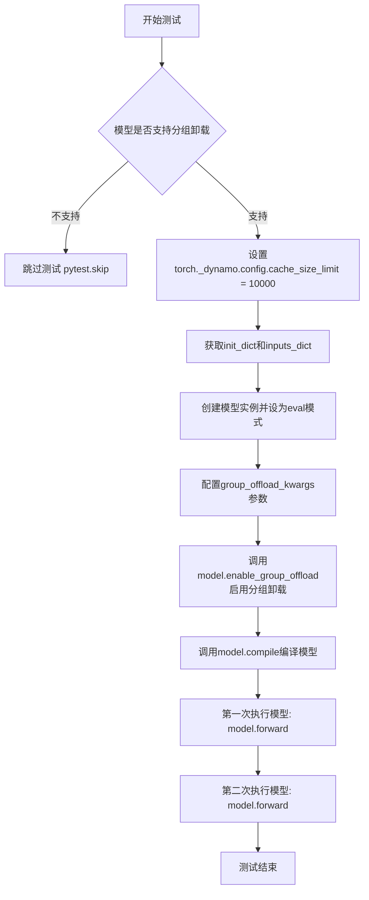

#### 带注释源码

```python
@torch.no_grad()
def test_compile_with_group_offloading(self):
    """
    测试分组卸载功能与编译的兼容性。
    验证模型在启用分组卸载后能够与torch.compile正常工作。
    """
    # 检查模型类是否支持分组卸载功能
    if not self.model_class._supports_group_offloading:
        # 如果不支持则跳过测试
        pytest.skip("Model does not support group offloading.")

    # 设置Dynamo缓存大小限制为10000，以容纳更多编译缓存
    torch._dynamo.config.cache_size_limit = 10000

    # 获取模型初始化参数字典
    init_dict = self.get_init_dict()
    # 获取模型输入字典
    inputs_dict = self.get_dummy_inputs()
    
    # 使用初始化参数创建模型实例
    model = self.model_class(**init_dict)
    # 设置模型为评估模式（禁用dropout等训练特定层）
    model.eval()

    # 配置分组卸载参数
    group_offload_kwargs = {
        "onload_device": torch_device,      # 加载设备（当前设备）
        "offload_device": "cpu",            # 卸载设备（CPU）
        "offload_type": "block_level",      # 卸载类型：块级别
        "num_blocks_per_group": 1,          # 每组块数
        "use_stream": True,                 # 使用流进行异步传输
        "non_blocking": True,               # 非阻塞传输
    }
    
    # 启用模型的分组卸载功能
    model.enable_group_offload(**group_offload_kwargs)
    
    # 使用torch.compile编译模型
    model.compile()

    # 第一次执行，编译并运行模型
    _ = model(**inputs_dict)
    # 第二次执行，验证编译后模型的稳定性
    _ = model(**inputs_dict)
```

#### 关键组件信息

| 组件名称 | 描述 |
|---------|------|
| `_supports_group_offloading` | 模型类属性，标识是否支持分组卸载功能 |
| `enable_group_offload()` | 模型方法，用于启用分组卸载功能 |
| `torch._dynamo.config.cache_size_limit` | Dynamo配置项，控制编译缓存大小 |
| `torch.compile()` | PyTorch 2.x的JIT编译接口，用于优化模型执行 |

#### 潜在技术债务与优化空间

1. **硬编码的缓存限制**：cache_size_limit 被硬编码为 10000，建议作为可选参数传入以提高灵活性
2. **重复代码模式**：与 `test_torch_compile_recompilation_and_graph_break` 方法有相似结构，可考虑抽取公共逻辑
3. **缺乏错误处理**：编译失败时没有具体的错误信息捕获和报告机制
4. **参数验证缺失**：group_offload_kwargs 参数未做验证，如果传入无效参数可能导致运行时错误


### `TorchCompileTesterMixin.test_compile_on_different_shapes`

该方法用于测试模型在不同输入形状下使用torch.compile的编译支持，验证PyTorch 2.7.1+的动态形状功能是否正常工作。它通过禁用duck shape优化，对模型进行动态编译，然后使用不同的(高度,宽度)输入形状遍历测试，确保编译后的模型能够正确处理各种尺寸的输入而不触发重新编译。

参数：

- `self`：实例本身，包含模型类、初始化配置和不同形状列表

返回值：`None`，因为这是一个测试方法，使用pytest框架执行验证

#### 流程图

```mermaid
flowchart TD
    A[开始测试 test_compile_on_different_shapes] --> B{self.different_shapes_for_compilation 是否为 None?}
    B -->|是| C[跳过测试 pytest.skip]
    B -->|否| D[设置 torch.fx.experimental._config.use_duck_shape = False]
    D --> E[获取模型初始化字典 get_init_dict]
    E --> F[实例化模型并移动到设备]
    F --> G[设置模型为 eval 模式]
    G --> H[使用 torch.compile 编译模型 fullgraph=True, dynamic=True]
    H --> I[遍历 different_shapes_for_compilation 中的每个 (height, width)]
    I --> J[使用 error_on_recompile=True 配置]
    J --> K[获取当前形状的输入 get_dummy_inputs]
    K --> L[执行模型前向传播]
    L --> I
    I --> M[测试完成]
```

#### 带注释源码

```python
@torch.no_grad()
def test_compile_on_different_shapes(self):
    """
    测试模型在不同输入形状下使用torch.compile的编译支持。
    
    该测试验证动态形状功能：
    1. 禁用duck shape优化，使用实际形状匹配
    2. 对模型进行torch.compile编译，启用动态模式
    3. 遍历预定义的不同形状组合进行测试
    4. 确保编译后的模型能处理各种尺寸输入而不触发重新编译
    """
    # 检查是否配置了不同形状用于编译测试
    if self.different_shapes_for_compilation is None:
        pytest.skip(f"Skipping as `different_shapes_for_compilation` is not set for {self.__class__.__name__}.")
    
    # 禁用duck shape优化，确保使用实际形状而非duck typing
    # duck shape允许不同形状共享同一计算图，但这里要测试真实动态形状支持
    torch.fx.experimental._config.use_duck_shape = False

    # 获取模型初始化参数字典
    init_dict = self.get_init_dict()
    
    # 实例化模型并移动到指定设备
    model = self.model_class(**init_dict).to(torch_device)
    model.eval()
    
    # 使用torch.compile编译模型
    # fullgraph=True: 强制整个计算图必须被编译，不允许图中断
    # dynamic=True: 启用动态形状支持，允许不同输入形状
    model = torch.compile(model, fullgraph=True, dynamic=True)

    # 遍历预定义的不同形状组合 (height, width)
    for height, width in self.different_shapes_for_compilation:
        # 使用error_on_recompile=True配置
        # 如果触发重新编译会抛出错误，确保编译缓存正常工作
        with torch._dynamo.config.patch(error_on_recompile=True):
            # 获取当前形状的虚拟输入
            inputs_dict = self.get_dummy_inputs(height=height, width=width)
            # 执行模型前向传播，验证编译后的模型能处理该形状
            _ = model(**inputs_dict)
```


### `TorchCompileTesterMixin.test_compile_works_with_aot`

该方法用于测试 PyTorch AOT（Ahead-of-Time）编译和打包功能。测试流程包括：使用 `torch.export.export` 导出模型为标准格式，调用 `torch._inductor.aoti_compile_and_package` 进行 AOT 编译并将结果打包为 `.pt2` 文件，然后加载该包文件并替换模型的前向传播方法，最后验证编译后的模型能够正确执行两次前向传播。

参数：

- `self`：`TorchCompileTesterMixin`，隐式的测试类实例参数，继承自测试 mixin 类
- `tmp_path`：`Path`（pytest fixture），pytest 提供的临时目录路径，用于存放编译打包后的模型包文件

返回值：`None`，该方法为测试方法，无返回值（测试通过/失败通过 pytest 断言机制体现）

#### 流程图

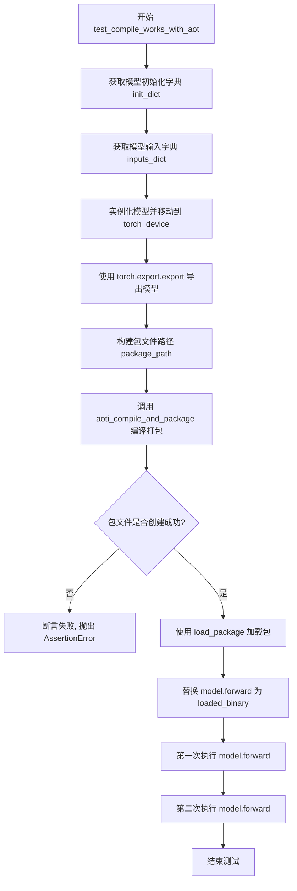

#### 带注释源码

```python
@torch.no_grad()
def test_compile_works_with_aot(self, tmp_path):
    """
    测试 AOT 编译和打包功能是否正常工作。
    
    该测试执行以下步骤：
    1. 使用 torch.export.export 将模型导出为标准化的 ExportedProgram
    2. 使用 torch._inductor.aoti_compile_and_package 进行 AOT 编译并打包
    3. 加载打包后的模型
    4. 验证编译后的模型能够正确执行前向传播
    """
    # 导入 AOT 编译包加载函数
    from torch._inductor.package import load_package

    # 从测试配置获取模型初始化参数字典
    # 期望格式: 包含模型初始化所需参数的字典
    init_dict = self.get_init_dict()
    
    # 从测试配置获取模型输入字典
    # 包含用于前向传播的虚拟输入数据
    inputs_dict = self.get_dummy_inputs()

    # 使用初始化参数字典实例化模型，并移动到指定设备
    # self.model_class: 需要测试的模型类，由混入该 mixin 的测试类提供
    # torch_device: 目标计算设备 (如 'cuda', 'cpu')
    model = self.model_class(**init_dict).to(torch_device)
    
    # 使用 torch.export.export 将模型导出为 ExportedProgram
    # 这是 PyTorch 2.0+ 引入的标准模型导出格式
    # args=(): 模型的位置参数（此处为空）
    # kwargs=inputs_dict: 模型的关键字参数（输入数据）
    exported_model = torch.export.export(model, args=(), kwargs=inputs_dict)

    # 构建输出包文件的完整路径
    # tmp_path: pytest 提供的临时目录 fixture
    # 文件名格式: {模型类名}.pt2
    package_path = os.path.join(str(tmp_path), f"{self.model_class.__name__}.pt2")
    
    # 执行 AOT 编译和打包
    # torch._inductor.aoti_compile_and_package:
    #   - 执行 AOT (Ahead-of-Time) 编译
    #   - 将编译结果打包为 .pt2 文件
    # 参数 exported_model: 已导出的模型
    # 参数 package_path: 输出包文件路径
    _ = torch._inductor.aoti_compile_and_package(exported_model, package_path=package_path)
    
    # 断言包文件已成功创建
    assert os.path.exists(package_path), f"Package file not created at {package_path}"
    
    # 从包文件加载编译后的模型二进制
    # load_package: 加载 .pt2 包文件并返回可执行的二进制对象
    # run_single_threaded=True: 以单线程模式运行（适用于测试环境）
    loaded_binary = load_package(package_path, run_single_threaded=True)

    # 将加载的编译后二进制替换模型的 forward 方法
    # 这样调用 model(**inputs_dict) 时实际执行的是编译后的版本
    model.forward = loaded_binary

    # 第一次执行模型前向传播
    # 验证编译后的模型能够正确处理输入并产生输出
    _ = model(**inputs_dict)
    
    # 第二次执行模型前向传播
    # 验证模型的可重复执行性（deterministic behavior）
    _ = model(**inputs_dict)
```

## 关键组件


### TorchCompileTesterMixin

核心测试mixin类，用于测试PyTorch模型在torch.compile下的编译功能，包括重编译检测、图中断、重复块编译、组卸载、动态形状支持和AOT编译等功能。

### torch.compile 基础编译

使用 `torch.compile(model, fullgraph=True)` 对模型进行JIT编译，fullgraph=True强制整个计算图必须被编译，不允许图中断。

### 重编译与图中断检测

通过 `torch._dynamo.config.patch(error_on_recompile=True)` 和 `torch._inductor.utils.fresh_inductor_cache()` 检测模型在相同输入下的重编译行为和图中断情况。

### compile_repeated_blocks 重复块编译

使用 `model.compile_repeated_blocks(fullgraph=True)` 编译具有重复模块的模型（如UNet），通过 `_repeated_blocks` 属性识别重复块。

### Group Offloading 组卸载

通过 `model.enable_group_offload()` 启用模型级组卸载功能，支持block_level粒度的设备间数据迁移，使用流和非阻塞传输优化性能。

### 动态形状支持

通过 `torch.compile(model, dynamic=True)` 和 `torch.fx.experimental._config.use_duck_shape = False` 测试模型在不同输入形状下的编译兼容性。

### AOT编译与打包

使用 `torch.export.export()` 导出模型为FX Graph，再通过 `torch._inductor.aoti_compile_and_package()` 进行AOT编译并打包为可加载的二进制文件。

### 编译器缓存管理

使用 `torch._inductor.utils.fresh_inductor_cache()` 和 `torch._dynamo.config.patch(recompile_limit=N)` 管理编译缓存，控制重编译次数。

### 设备管理与清理

通过 `gc.collect()` 和 `backend_empty_cache(torch_device)` 进行内存管理和GPU缓存清理，确保测试环境干净。


## 问题及建议


### 已知问题

-   **全局状态修改未恢复**：test_compile_with_group_offloading 修改了 `torch._dynamo.config.cache_size_limit`，test_compile_on_different_shapes 修改了 `torch.fx.experimental._config.use_duck_shape`，但在测试结束后未恢复原始值，可能影响其他测试
-   **硬编码的魔法数字**：test_torch_compile_repeated_blocks 中 UNet2DConditionModel 的 recompile_limit=2 被硬编码在方法内部，违反开闭原则
-   **缺少资源清理验证**：setup_method 和 teardown_method 调用了 reset 和缓存清理，但未验证清理是否成功
-   **未使用的函数参数**：test_torch_compile_repeated_blocks 的 recompile_limit 参数在函数内部被覆盖，导致参数形同虚设
-   **缺少异常处理**：所有测试方法未捕获 torch.compile、torch.export 等可能抛出的异常，缺乏容错能力
-   **内部 API 依赖**：直接使用 torch._inductor 和 torch._dynamo 的私有 API，缺乏版本兼容性检查，可能导致未来 PyTorch 版本升级后失效
-   **测试隔离性问题**：tmp_path fixture 在 test_compile_works_with_aot 中使用但未显式清理大型二进制文件

### 优化建议

-   **添加上下文管理器恢复全局状态**：使用 pytest fixture 或 try/finally 块确保测试后恢复修改的全局配置
-   **配置外部化**：将 UNet2DConditionModel 的 recompile_limit 移至类属性或配置字典中管理
-   **增加 try/except 包装**：对编译、导出等关键操作添加异常处理和有意义的错误信息
-   **参数验证**：在函数入口验证 recompile_limit 参数或在测试开始前检查 PyTorch 版本兼容性
-   **添加资源验证**：在 teardown_method 中检查 GPU 内存是否成功释放
-   **添加清理逻辑**：在 test_compile_works_with_aot 完成后显式删除临时 package 文件

## 其它


### 设计目标与约束

本测试类的核心目标是验证模型在使用 torch.compile 时的正确性和性能。设计约束包括：必须使用 PyTorch 2.7.1 以上版本、必须使用 accelerator（GPU）、测试必须在 pytest 框架下运行、模型类必须实现 get_init_dict() 和 get_dummy_inputs() 方法、模型类需支持 torch.compile 相关的配置属性。

### 错误处理与异常设计

测试中使用了多种错误处理机制：通过 pytest.skip() 跳过不支持的测试场景、使用 torch._dynamo.config.patch(error_on_recompile=True) 在检测到重新编译时抛出异常、使用 assert 验证文件生成和加载结果。当模型类不满足测试条件时（如缺少 _repeated_blocks 或不支持 group_offloading），测试会被优雅地跳过而不是失败。

### 外部依赖与接口契约

主要外部依赖包括：torch（需 2.7.1+）、pytest、gc 标准库、os 标准库。接口契约方面，使用本 mixin 的类需要提供：model_class（模型类）、get_init_dict() 方法（返回模型初始化参数字典）、get_dummy_inputs() 方法（返回模型输入）、可选的 different_shapes_for_compilation 属性（动态形状测试）、可选的 _repeated_blocks 属性（重复块测试）、可选的 _supports_group_offloading 属性（组卸载支持）。

### 性能考量与基准

测试关注 torch.compile 的编译性能、重复编译开销、动态形状支持、AOT 编译和打包性能。测试通过 fresh_inductor_cache() 确保缓存干净，通过 recompile_limit 控制编译次数，通过 cache_size_limit=10000 调整缓存大小以测试 group offloading 场景。

### 使用场景与集成方式

该 mixin 类通过多重装饰器（@is_torch_compile、@require_accelerator、@require_torch_version_greater）标记测试环境要求。使用方式为：在测试类中继承 TorchCompileTesterMixin，然后通过 pytest -m "not compile" 跳过编译测试。适用于 HuggingFace Transformers 中支持 torch.compile 的模型类测试。

### 兼容性考虑

版本兼容性：最低 PyTorch 2.7.1，测试了动态 shapes 支持（use_duck_shape 配置）、AOT 编译和打包功能。平台兼容性：依赖 torch_device 和 backend_empty_cache，需要 accelerator 支持。模型兼容性：通过可选属性 _repeated_blocks 和 _supports_group_offloading 适配不同模型特性。

### 测试覆盖范围

测试覆盖了 torch.compile 的核心场景：基本编译和图break检测、重复块编译、group offloading 编译支持、动态形状编译、AOT 编译和打包。每个测试方法使用 @torch.no_grad() 装饰器确保推理模式，测试后调用 teardown_method 清理编译缓存。


    