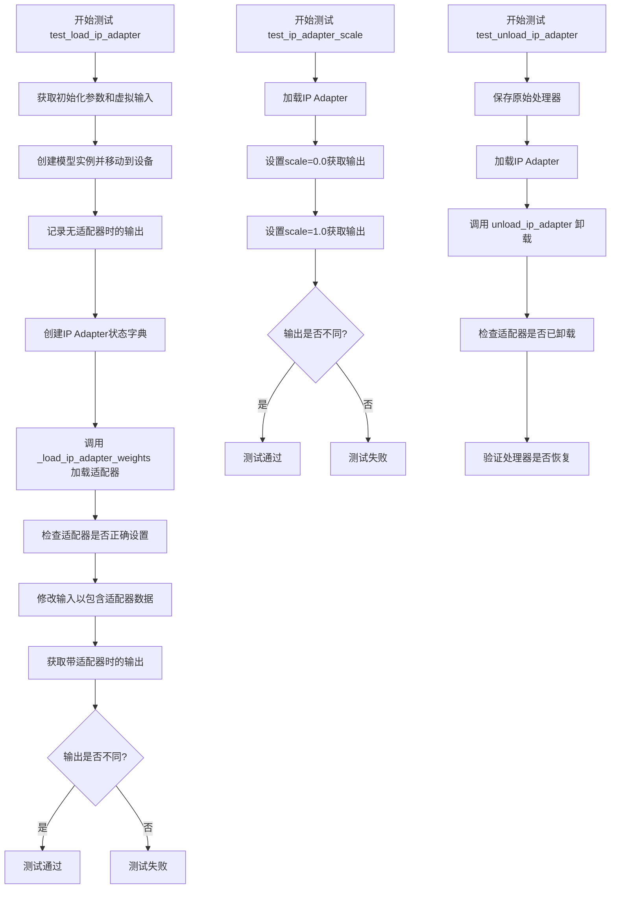
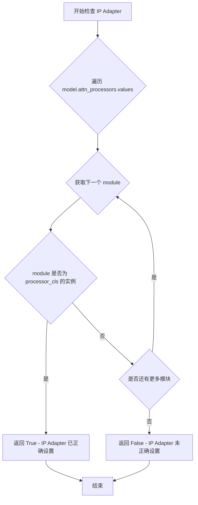
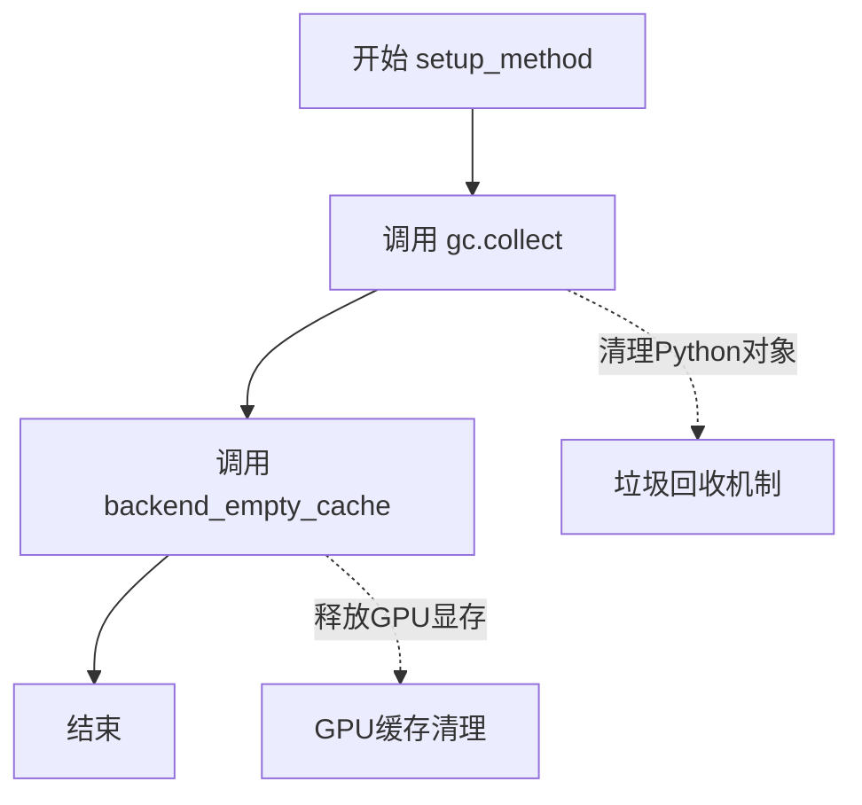
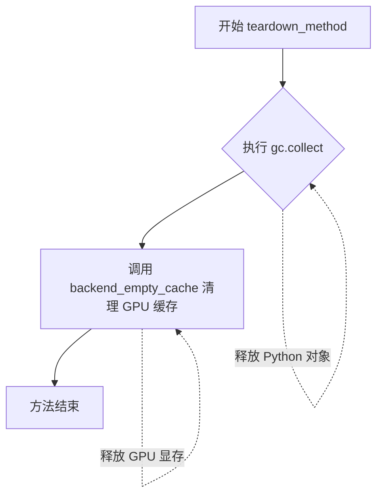
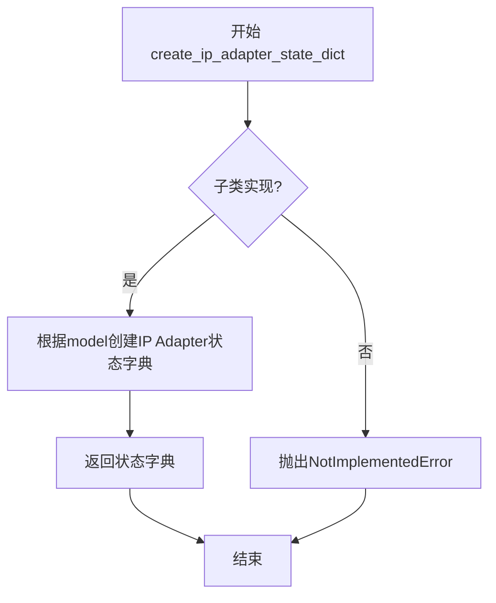
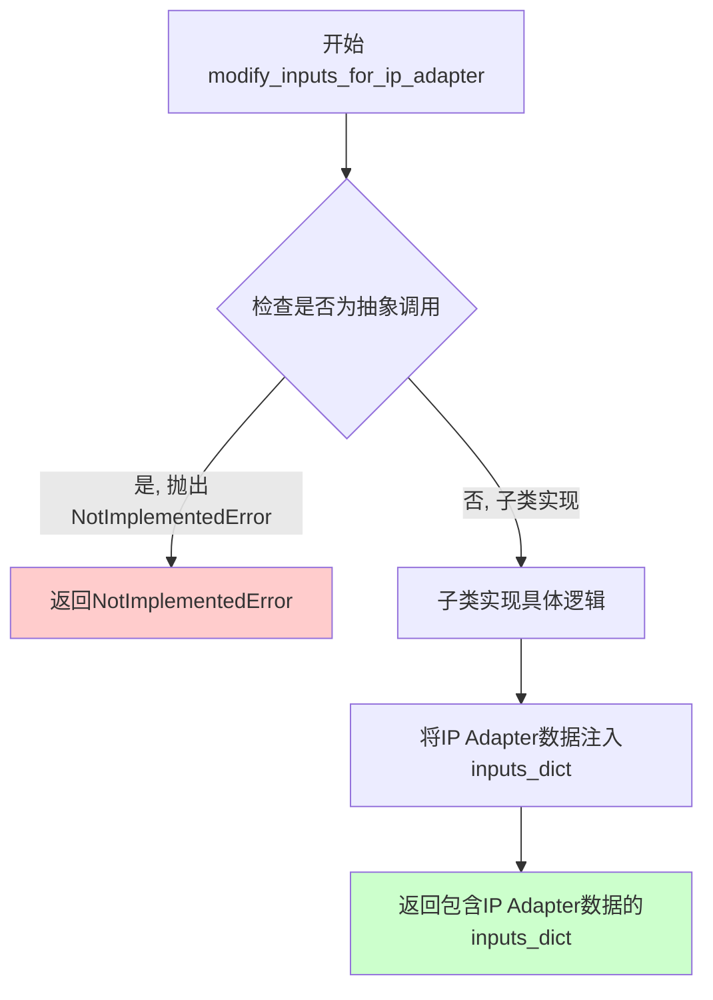
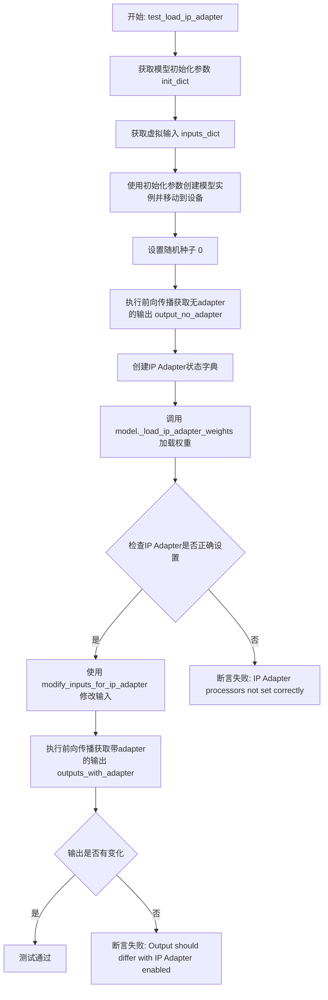
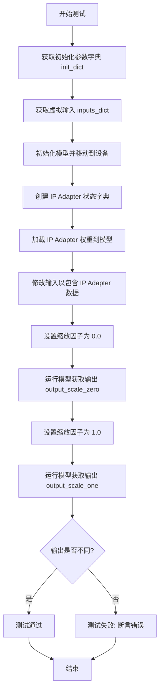
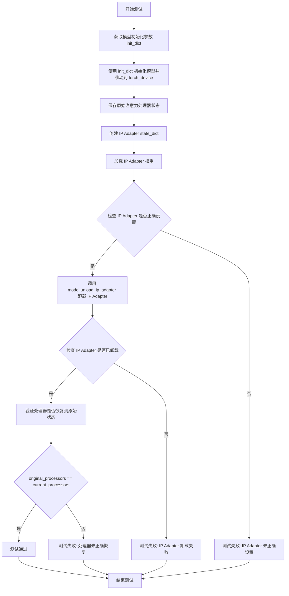

# `diffusers\tests\models\testing_utils\ip_adapter.py` 详细设计文档

这是一个用于测试HuggingFace Diffusers模型中IP Adapter（图像提示适配器）功能的pytest mixin类，提供了加载IP Adapter权重、测试适配器对模型输出的影响、测试适配器缩放和卸载等测试方法。

## 整体流程



## 类结构

```
IPAdapterTesterMixin (pytest mixin类)
└── 依赖: backend_empty_cache, is_ip_adapter, torch_device (从 testing_utils 导入)
```

## 全局变量及字段


### `gc`
    
Python垃圾回收模块，用于内存管理和清理

类型：`module`
    


### `pytest`
    
Python测试框架，用于编写和运行单元测试

类型：`module`
    


### `torch`
    
PyTorch深度学习库，用于张量计算和神经网络构建

类型：`module`
    


### `backend_empty_cache`
    
后端清空缓存工具函数，用于释放GPU内存

类型：`function`
    


### `is_ip_adapter`
    
IP Adapter测试标记装饰器，用于标识和过滤IP Adapter相关测试

类型：`decorator`
    


### `torch_device`
    
PyTorch设备变量，指定模型和数据运行的设备（CPU/CUDA）

类型：`str`
    


### `IPAdapterTesterMixin.ip_adapter_processor_cls`
    
IP Adapter处理器类属性，用于测试验证，必须由子类实现

类型：`property`
    
    

## 全局函数及方法


### `check_if_ip_adapter_correctly_set`

该函数用于检查模型中的 IP Adapter 处理器是否正确设置，通过遍历模型的注意力处理器集合，判断是否存在指定类型的处理器实例。

参数：

- `model`：`torch.nn.Module`，需要检查的模型对象，需包含 `attn_processors` 属性
- `processor_cls`：类型，检查目标处理器类型，用于判断是否为 IP Adapter 处理器类

返回值：`bool`，如果模型中正确设置了 IP Adapter 处理器则返回 `True`，否则返回 `False`

#### 流程图



#### 带注释源码

```python
def check_if_ip_adapter_correctly_set(model, processor_cls) -> bool:
    """
    Check if IP Adapter processors are correctly set in the model.

    Args:
        model: The model to check

    Returns:
        bool: True if IP Adapter is correctly set, False otherwise
    """
    # 遍历模型中所有的注意力处理器
    for module in model.attn_processors.values():
        # 检查当前模块是否为指定类型的 IP Adapter 处理器
        if isinstance(module, processor_cls):
            # 找到匹配的处理器，返回 True
            return True
    # 遍历完毕未找到匹配的处理器，返回 False
    return False
```


### `IPAdapterTesterMixin.setup_method`

在每个测试方法执行前，该方法用于清理 Python 垃圾回收和 GPU 内存缓存，确保测试环境处于干净的初始状态，避免因缓存残留导致测试结果不稳定或内存占用过高。

参数：
- `self`：`IPAdapterTesterMixin`，隐式参数，指向类的实例本身

返回值：`None`，无返回值描述

#### 流程图



#### 带注释源码

```python
def setup_method(self):
    """
    测试方法执行前的清理操作。
    
    该方法在每个测试用例运行前被 pytest 自动调用，
    用于确保测试环境处于干净的初始状态。
    """
    # 强制调用 Python 垃圾回收器，清理不再使用的对象
    gc.collect()
    
    # 调用后端特定的 GPU 缓存清理函数
    # torch_device: 全局变量，指定当前使用的设备（如 'cuda:0' 或 'cpu'）
    backend_empty_cache(torch_device)
```

#### 额外信息

| 项目 | 描述 |
|------|------|
| 调用时机 | 由 pytest 框架在每个测试方法（以 `test_` 开头的方法）执行前自动调用 |
| 依赖项 | `gc`（Python 内置模块）、`torch`（PyTorch）、`backend_empty_cache`（自定义工具函数） |
| 关联方法 | `teardown_method`（测试后的清理操作，逻辑相同） |
| 设计目的 | 隔离测试用例，防止测试间的内存污染和状态泄露 |


### `IPAdapterTesterMixin.teardown_method`

该方法用于在每个 IP Adapter 测试用例执行完成后执行清理操作，通过显式触发垃圾回收并清空 GPU 缓存来释放测试过程中占用的内存资源，防止测试间的内存泄漏和显存溢出。

参数：此方法无显式参数（仅包含隐式 `self` 参数）

返回值：`None`，无返回值

#### 流程图



#### 带注释源码

```python
def teardown_method(self):
    """
    测试方法执行完成后的清理操作
    
    该方法在每个测试用例结束后被 pytest 自动调用，
    用于清理测试过程中产生的内存和 GPU 缓存。
    """
    # 触发 Python 垃圾回收器，回收不可达的对象
    gc.collect()
    
    # 调用后端工具函数清空 GPU 缓存，释放显存
    backend_empty_cache(torch_device)
```


### `IPAdapterTesterMixin.create_ip_adapter_state_dict`

创建IP Adapter状态字典的抽象方法，供子类实现。该方法生成包含IP Adapter权重的状态字典，用于后续的`_load_ip_adapter_weights`加载操作。

参数：

- `model`：`object`，模型实例，用于创建对应的IP Adapter状态字典

返回值：`dict`，包含IP Adapter权重的状态字典（state dict），可被模型用于加载IP Adapter权重

#### 流程图



#### 带注释源码

```python
def create_ip_adapter_state_dict(self, model):
    """
    创建IP Adapter状态字典（需子类实现）
    
    此方法是抽象方法，Mixin类的子类必须实现此方法以提供
    具体的IP Adapter状态字典创建逻辑。该状态字典包含了
    IP Adapter所需的全部权重参数，用于后续通过
    _load_ip_adapter_weights 方法加载到模型中。
    
    Args:
        model: 模型实例，用于创建对应的IP Adapter状态字典
        
    Returns:
        dict: 包含IP Adapter权重的状态字典
        
    Raises:
        NotImplementedError: 当子类未实现此方法时抛出
    """
    raise NotImplementedError("child class must implement method to create IPAdapter State Dict")
```


### `IPAdapterTesterMixin.modify_inputs_for_ip_adapter`

修改输入以包含IP Adapter数据（需子类实现）。该方法是抽象方法，定义了修改模型输入以适配IP Adapter的接口，子类需要实现具体逻辑将IP Adapter相关数据（如图像特征、比例因子等）注入到输入字典中。

参数：

- `self`：`IPAdapterTesterMixin`，mixin类实例本身
- `model`：`torch.nn.Module`，需要修改输入的模型实例，用于获取模型的配置信息或状态
- `inputs_dict`：`Dict[str, Any]` 或 `dict`，包含模型原始输入的字典，如`input_ids`、`pixel_values`等

返回值：`Dict[str, Any]` 或 `dict`，修改后的输入字典，包含了IP Adapter所需的数据（如图像嵌入、adapter特征等）

#### 流程图



#### 带注释源码

```python
def modify_inputs_for_ip_adapter(self, model, inputs_dict):
    """
    修改输入字典以包含IP Adapter所需的数据。
    
    这是一个抽象方法，子类必须实现此方法以提供具体的IP Adapter输入修改逻辑。
    通常需要将图像特征、IP Adapter嵌入或相关参数添加到inputs_dict中。
    
    Args:
        model: 模型实例，可用于获取模型的配置或状态信息
        inputs_dict: 包含模型原始输入的字典，如{'input_ids': ..., 'pixel_values': ...}
    
    Returns:
        dict: 修改后的输入字典，包含IP Adapter所需的数据
    
    Raises:
        NotImplementedError: 当子类未实现此方法时抛出
    """
    raise NotImplementedError("child class must implement method to create IPAdapter model inputs")
```


### `IPAdapterTesterMixin.test_load_ip_adapter`

该方法用于测试 IP Adapter 权重的加载功能，验证模型能够正确加载 IP Adapter 权重并产生与原始模型不同的输出结果。

参数：无（隐式参数 `self` 由类实例提供）

返回值：无（通过 `assert` 断言进行验证）

#### 流程图



#### 带注释源码

```python
@torch.no_grad()  # 禁用梯度计算以节省内存
def test_load_ip_adapter(self):
    """
    测试IP Adapter权重的加载功能
    
    验证流程:
    1. 创建模型并获取无IP Adapter的输出作为基准
    2. 加载IP Adapter权重
    3. 验证权重正确加载到模型的attn_processors中
    4. 获取带IP Adapter的输出
    5. 断言两次输出存在差异,证明IP Adapter生效
    """
    
    # 第一步: 获取模型初始化参数字典
    # 来自混入类的get_init_dict方法,返回模型初始化所需参数
    init_dict = self.get_init_dict()
    
    # 第二步: 获取虚拟输入字典
    # 来自混入类的get_dummy_inputs方法,返回测试用输入
    inputs_dict = self.get_dummy_inputs()
    
    # 第三步: 创建模型实例并移动到指定设备
    # 使用torch_device确保模型在正确设备上(CPU/GPU)
    model = self.model_class(**init_dict).to(torch_device)

    # 第四步: 设置随机种子确保可重复性
    # 固定为0以便结果可复现
    torch.manual_seed(0)
    
    # 第五步: 执行前向传播获取无IP Adapter的基准输出
    # return_dict=False返回元组,取第一个元素(输出张量)
    output_no_adapter = model(**inputs_dict, return_dict=False)[0]

    # 第六步: 创建IP Adapter状态字典
    # 来自子类实现的create_ip_adapter_state_dict方法
    ip_adapter_state_dict = self.create_ip_adapter_state_dict(model)

    # 第七步: 调用模型内部方法加载IP Adapter权重
    # _load_ip_adapter_weights是模型内部方法,接收权重列表
    model._load_ip_adapter_weights([ip_adapter_state_dict])
    
    # 第八步: 验证IP Adapter处理器是否正确设置
    # 使用check_if_ip_adapter_correctly_set辅助函数验证
    assert check_if_ip_adapter_correctly_set(model, self.ip_adapter_processor_cls), (
        "IP Adapter processors not set correctly"
    )

    # 第九步: 修改输入以包含IP Adapter数据
    # 来自子类实现的modify_inputs_for_ip_adapter方法
    inputs_dict_with_adapter = self.modify_inputs_for_ip_adapter(model, inputs_dict.copy())
    
    # 第十步: 执行带IP Adapter的前向传播
    outputs_with_adapter = model(**inputs_dict_with_adapter, return_dict=False)[0]

    # 第十一步: 验证输出存在差异
    # 使用torch.allclose比较,允许一定容差(atol=1e-4, rtol=1e-4)
    assert not torch.allclose(output_no_adapter, outputs_with_adapter, atol=1e-4, rtol=1e-4), (
        "Output should differ with IP Adapter enabled"
    )
```


### `IPAdapterTesterMixin.test_ip_adapter_scale`

该方法用于测试 IP Adapter 的缩放功能，通过设置不同的缩放因子（0.0 和 1.0）来验证模型输出是否会相应变化。由于在模型级别未定义 IP Adapter 缩放功能的实现，该测试已被跳过。

参数：

- `self`：`IPAdapterTesterMixin`，测试类的实例，隐含参数

返回值：无（`None`），测试方法不返回任何值

#### 流程图



#### 带注释源码

```python
@pytest.mark.skip(
    reason="Setting IP Adapter scale is not defined at the model level. Enable this test after refactoring"
)
def test_ip_adapter_scale(self):
    """
    测试 IP Adapter 缩放功能
    
    该测试方法验证设置不同的 IP Adapter 缩放因子时，模型输出会相应改变。
    目前该测试被跳过，因为缩放功能在模型级别未实现。
    """
    # 获取模型初始化参数字典
    init_dict = self.get_init_dict()
    
    # 获取测试用的虚拟输入
    inputs_dict = self.get_dummy_inputs()
    
    # 根据初始化参数创建模型实例并移至指定设备
    model = self.model_class(**init_dict).to(torch_device)

    # 创建 IP Adapter 状态字典（包含适配器的权重参数）
    ip_adapter_state_dict = self.create_ip_adapter_state_dict(model)
    
    # 将 IP Adapter 权重加载到模型中
    model._load_ip_adapter_weights([ip_adapter_state_dict])

    # 修改输入以包含 IP Adapter 所需的数据
    inputs_dict_with_adapter = self.modify_inputs_for_ip_adapter(model, inputs_dict.copy())

    # === 测试场景 1: 缩放因子为 0.0（无效果）===
    # 设置 IP Adapter 缩放因子为 0.0，此时 IP Adapter 不应对输出产生影响
    model.set_ip_adapter_scale(0.0)
    # 固定随机种子以确保可重复性
    torch.manual_seed(0)
    # 运行模型获取输出
    output_scale_zero = model(**inputs_dict_with_adapter, return_dict=False)[0]

    # === 测试场景 2: 缩放因子为 1.0（完全效果）===
    # 设置 IP Adapter 缩放因子为 1.0，此时 IP Adapter 应完全生效
    model.set_ip_adapter_scale(1.0)
    # 固定随机种子以确保可重复性
    torch.manual_seed(0)
    # 运行模型获取输出
    output_scale_one = model(**inputs_dict_with_adapter, return_dict=False)[0]

    # === 验证输出差异 ===
    # 断言：不同缩放因子下的输出应该不同
    assert not torch.allclose(output_scale_zero, output_scale_one, atol=1e-4, rtol=1e-4), (
        "Output should differ with different IP Adapter scales"
    )
```


### `IPAdapterTesterMixin.test_unload_ip_adapter`

测试 IP Adapter 卸载功能的测试方法（已跳过）。该方法验证模型在卸载 IP Adapter 后，注意力处理器能够正确恢复到原始状态。

参数：无（该方法为实例方法，`self` 为隐含参数）

返回值：`None`，无返回值

#### 流程图



#### 带注释源码

```python
@pytest.mark.skip(
    reason="Unloading IP Adapter is not defined at the model level. Enable this test after refactoring"
)
def test_unload_ip_adapter(self):
    """
    测试 IP Adapter 卸载功能
    
    该测试方法验证：
    1. IP Adapter 可以正确加载到模型中
    2. 调用 unload_ip_adapter() 后，IP Adapter 被正确卸载
    3. 卸载后，模型的注意力处理器恢复到原始状态
    
    注意：当前该测试被跳过，因为模型级别的 IP Adapter 卸载功能尚未定义
    """
    # 获取模型初始化参数字典
    init_dict = self.get_init_dict()
    
    # 使用初始化参数创建模型实例，并移动到指定的 torch 设备
    model = self.model_class(**init_dict).to(torch_device)

    # 保存原始的注意力处理器信息
    # 创建一个字典，键为处理器名称，值为处理器类名
    original_processors = {k: type(v).__name__ for k, v in model.attn_processors.items()}

    # 创建 IP Adapter 状态字典
    # 由子类实现，用于测试 IP Adapter 的加载
    ip_adapter_state_dict = self.create_ip_adapter_state_dict(model)
    
    # 将 IP Adapter 权重加载到模型中
    model._load_ip_adapter_weights([ip_adapter_state_dict])

    # 断言：验证 IP Adapter 是否正确设置到模型中
    assert check_if_ip_adapter_correctly_set(model, self.ip_adapter_processor_cls), "IP Adapter should be set"

    # 调用模型的 unload_ip_adapter 方法卸载 IP Adapter
    model.unload_ip_adapter()

    # 断言：验证 IP Adapter 是否已被正确卸载
    assert not check_if_ip_adapter_correctly_set(model, self.ip_adapter_processor_cls), (
        "IP Adapter should be unloaded"
    )

    # 验证处理器是否已恢复到原始状态
    # 获取当前的处理器信息
    current_processors = {k: type(v).__name__ for k, v in model.attn_processors.items()}
    
    # 断言：原始处理器和当前处理器应该完全一致
    assert original_processors == current_processors, "Processors should be restored after unload"
```

## 关键组件


### IPAdapterTesterMixin

IP Adapter功能的测试mixin类，提供了一套完整的测试方法来验证模型中IP Adapter的正确加载、工作和卸载。

### check_if_ip_adapter_correctly_set

用于检查模型中IP Adapter处理器是否正确设置的辅助函数，通过遍历模型的attn_processors来验证。

### IP Adapter权重加载 (_load_ip_adapter_weights)

模型方法，用于加载IP Adapter的权重到模型中，支持多个IP Adapter的权重同时加载。

### IP Adapter输入修改 (modify_inputs_for_ip_adapter)

抽象方法，由子类实现，用于将IP Adapter所需的数据（如图像特征）添加到模型输入中。

### IP Adapter状态字典创建 (create_ip_adapter_state_dict)

抽象方法，由子类实现，用于创建测试用的IP Adapter状态字典，包含IP Adapter的权重参数。

### IP Adapter缩放设置 (set_ip_adapter_scale)

模型方法，用于设置IP Adapter的影响权重/缩放因子，控制IP Adapter对模型输出的影响程度。

### IP Adapter卸载 (unload_ip_adapter)

模型方法，用于移除已加载的IP Adapter，恢复模型到原始状态。


## 问题及建议


### 已知问题

- **测试被长期跳过未解决**：`test_ip_adapter_scale` 和 `test_unload_ip_adapter` 两个测试方法被标记为 skip，注释说明需要在重构后启用，但长期未进行重构，导致功能验证不完整
- **资源清理不完善**：`setup_method` 和 `teardown_method` 只处理了 gc 和 CUDA 缓存清理，但未处理测试异常情况下的资源释放，可能导致内存泄漏
- **类型注解全面缺失**：所有方法参数和返回值均缺少类型注解，降低了代码可读性和 IDE 支持，也无法在编译期发现类型错误
- **魔法数值无解释**：`atol=1e-4, rtol=1e-4` 等容差值直接硬编码，未以常量或配置方式定义，也无注释说明选择依据
- **错误处理不充分**：`check_if_ip_adapter_correctly_set` 函数未对 `model.attn_processors` 为空或不存在的情况进行防御性检查，可能抛出 `AttributeError`
- **测试确定性不足**：依赖 `torch.manual_seed(0)` 保证可复现性，但这种方式不够可靠，应使用更健壮的随机控制机制
- **文档不完整**：抽象方法的 docstring 缺少对参数和返回值的完整描述，如 `create_ip_adapter_state_dict` 的参数 `model` 和返回值类型未说明
- **测试覆盖不足**：缺少边界情况测试，如空模型、已加载 IP Adapter 后重复加载等异常场景

### 优化建议

- **完成被跳过的测试**：重构 `test_ip_adapter_scale` 和 `test_unload_ip_adapter`，使其能在模型级别正常工作并移除 skip 标记
- **添加类型注解**：为所有函数参数和返回值添加明确的类型注解，提升代码质量
- **提取常量定义**：将容差值、随机种子等魔法数值定义为类常量或配置常量，并添加注释说明用途
- **增强错误处理**：在 `check_if_ip_adapter_correctly_set` 中添加对 `model.attn_processors` 的存在性和空值检查
- **改进资源管理**：使用 try-finally 或 context manager 确保测试异常时也能正确清理资源
- **完善文档**：为所有抽象方法补充完整的参数和返回值描述，包括类型信息
- **提取公共逻辑**：`test_load_ip_adapter` 与其他测试存在重复的模型初始化逻辑，可提取为私有方法复用
- **添加边界测试**：补充异常输入、边界条件的测试用例，提升测试覆盖率

## 其它


### 设计目标与约束

本代码的设计目标是为支持IP Adapter功能的模型提供统一的测试mixin类，确保IP Adapter能够正确加载、工作以及卸载。约束条件包括：子类必须实现`ip_adapter_processor_cls`属性、`create_ip_adapter_state_dict()`方法和`modify_inputs_for_ip_adapter()`方法；测试仅在标记为`ip_adapter`的环境中运行；模型必须继承自支持IP Adapter的基类。

### 错误处理与异常设计

代码中使用了`NotImplementedError`来强制子类实现必要的方法和属性。测试方法中使用了`assert`语句来验证IP Adapter是否正确设置，包括检查处理器是否正确加载、输出是否不同、卸载后是否恢复原状态。若IP Adapter未正确设置，会抛出带有明确错误信息的断言异常。

### 数据流与状态机

数据流如下：1) 初始化模型并获取原始输出；2) 创建IP Adapter状态字典；3) 调用`_load_ip_adapter_weights()`加载权重；4) 修改输入以包含IP Adapter数据；5) 获取带适配器的输出并验证差异；6) 可选地测试scale参数和卸载功能。状态机包含：初始状态 → 加载适配器 → 适配器工作状态 → 卸载适配器 → 恢复原状。

### 外部依赖与接口契约

主要外部依赖包括：`torch`用于张量运算和模型操作；`pytest`用于测试框架；`gc`和自定义的`backend_empty_cache`用于内存管理。接口契约要求：模型类必须实现`_load_ip_adapter_weights()`、`set_ip_adapter_scale()`和`unload_ip_adapter()`方法；必须有`attn_processors`属性用于存储注意力处理器；处理器类必须与`ip_adapter_processor_cls`匹配。

### 性能考量

测试方法使用了`@torch.no_grad()`装饰器以减少内存占用和计算开销。`setup_method`和`teardown_method`中调用`gc.collect()`和`backend_empty_cache()`来管理GPU内存。测试中使用固定随机种子确保结果可复现。

### 安全性考虑

代码仅用于测试目的，不涉及直接的安全风险。但需要注意：测试中使用了固定种子(0)，这可能在生产环境中导致可预测的随机行为；测试跳过标志表明某些功能尚未完全定义，应谨慎使用。

### 测试覆盖范围

当前覆盖的测试场景包括：IP Adapter权重加载验证、适配器启用后输出差异验证、IP Adapter scale参数测试（已跳过）、IP Adapter卸载功能测试（已跳过）。未覆盖的场景包括：多个IP Adapter同时加载、适配器权重损坏处理、跨设备模型加载等。

### 配置与参数说明

关键配置参数包括：`torch_device`指定测试设备；`ip_adapter_state_dict`包含IP Adapter的权重和配置；`scale`参数控制IP Adapter的影响程度（0.0-1.0）。测试使用`pytest.mark.skip`标记来控制测试的执行。

### 使用示例

```python
class TestMyModelIPAdapter(IPAdapterTesterMixin):
    @property
    def model_class(self):
        return MyModel
    
    @property
    def ip_adapter_processor_cls(self):
        return MyIPAdapterProcessor
    
    def create_ip_adapter_state_dict(self, model):
        # 创建测试用的IP Adapter权重
        return {...}
    
    def modify_inputs_for_ip_adapter(self, model, inputs_dict):
        # 修改输入以包含IP Adapter数据
        return inputs_dict
```

### 版本历史与变更记录

初始版本提供基础的IP Adapter加载测试功能。某些高级功能（scale调整、适配器卸载）被标记为跳过，等待后续重构完善。当前版本号为1.0，遵循Apache 2.0许可证。


    