# `diffusers\tests\models\testing_utils\lora.py` 详细设计文档

A test module for testing LoRA (Low-Rank Adaptation) functionality in diffusers models, including saving/loading adapters, metadata handling, and hot-swapping capabilities with torch.compile support.

## 整体流程

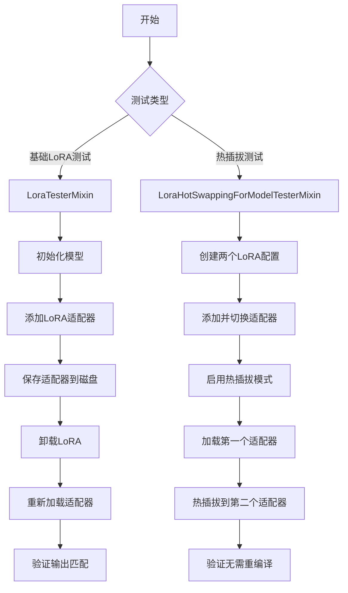

## 类结构

```
Global Functions
└── check_if_lora_correctly_set (检查LoRA层是否正确设置)

LoraTesterMixin (基础LoRA测试Mixin)
├── setup_method
├── test_save_load_lora_adapter (保存/加载适配器)
├── test_lora_wrong_adapter_name_raises_error (错误名称测试)
├── test_lora_adapter_metadata_is_loaded_correctly (元数据加载测试)
└── test_lora_adapter_wrong_metadata_raises_error (错误元数据测试)

LoraHotSwappingForModelTesterMixin (热插拔测试Mixin)
├── different_shapes_for_compilation (属性)
├── setup_method
├── teardown_method
├── _get_lora_config
├── _get_linear_module_name_other_than_attn
├── _check_model_hotswap
├── test_hotswapping_model
├── test_hotswapping_compiled_model_linear
├── test_hotswapping_compiled_model_conv2d
├── test_hotswapping_compiled_model_both_linear_and_conv2d
├── test_hotswapping_compiled_model_both_linear_and_other
├── test_enable_lora_hotswap_called_after_adapter_added_raises
├── test_enable_lora_hotswap_called_after_adapter_added_warning
├── test_enable_lora_hotswap_called_after_adapter_added_ignore
├── test_enable_lora_hotswap_wrong_check_compiled_argument_raises
├── test_hotswap_second_adapter_targets_more_layers_raises
└── test_hotswapping_compile_on_different_shapes
```

## 全局变量及字段


### `tmp_path`
    
Pytest临时目录fixture，用于存放测试生成的模型权重文件

类型：`pytest.fixture`
    


### `rank`
    
LoRA矩阵的秩，决定低秩适配器的维度（默认4）

类型：`int`
    


### `lora_alpha`
    
LoRA缩放因子，用于调整适配器输出的权重（默认4）

类型：`int`
    


### `use_dora`
    
是否使用DoRA（Decomposed Rank-Adaptation）方法（默认False）

类型：`bool`
    


### `atol`
    
绝对误差容限，用于张量相等性比较（默认1e-4）

类型：`float`
    


### `rtol`
    
相对误差容限，用于张量相等性比较（默认1e-4）

类型：`float`
    


### `do_compile`
    
是否使用torch.compile编译模型以测试热插拔与编译的兼容性

类型：`bool`
    


### `different_shapes`
    
动态编译测试用的不同输入形状列表（高度, 宽度）

类型：`list[tuple[int, int]]`
    


### `adapter_name`
    
LoRA适配器名称，用于标识和加载特定的适配器配置

类型：`str`
    


### `wrong_name`
    
错误的适配器名称（foo），用于测试异常处理

类型：`str`
    


### `is_peft_available`
    
检查PEFT库是否可用的工具函数

类型：`function`
    


### `check_if_lora_correctly_set`
    
检查模型中LoRA层是否正确配置的验证函数

类型：`function`
    


### `PeftAdapterMixin`
    
PEFT适配器混入类，提供add_adapter和load_lora_adapter等方法

类型：`class`
    


### `LoraTesterMixin.model_class`
    
待测试的模型类，需继承PeftAdapterMixin以支持LoRA功能

类型：`type`
    


### `LoraHotSwappingForModelTesterMixin.model_class`
    
待测试的模型类，需继承PeftAdapterMixin以支持热插拔功能

类型：`type`
    


### `LoraHotSwappingForModelTesterMixin.different_shapes_for_compilation`
    
可选属性，动态编译测试用的不同输入形状列表，用于验证torch.compile在不同输入尺寸下的行为

类型：`list[tuple[int, int]] | None`
    
    

## 全局函数及方法


### `check_if_lora_correctly_set`

检查模型中LoRA层是否正确设置，通过遍历模型的所有模块，检查是否存在任何 `BaseTunerLayer` 类型的模块。

参数：

-  `model`：`torch.nn.Module`，需要检查的模型

返回值：`bool`，如果LoRA正确设置返回True，否则返回False

#### 流程图

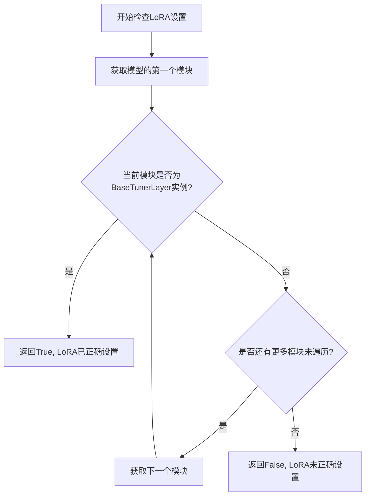

#### 带注释源码

```python
def check_if_lora_correctly_set(model) -> bool:
    """
    Check if LoRA layers are correctly set in the model.

    Args:
        model: The model to check

    Returns:
        bool: True if LoRA is correctly set, False otherwise
    """
    # 从peft库导入BaseTunerLayer类，用于检测LoRA层
    from peft.tuners.tuners_utils import BaseTunerLayer

    # 遍历模型的所有模块（包括叶子模块和容器模块）
    for module in model.modules():
        # 检查当前模块是否是LoRA调谐器的基类实例
        if isinstance(module, BaseTunerLayer):
            # 找到至少一个LoRA层，返回True
            return True
    # 遍历完所有模块都没有找到LoRA层，返回False
    return False
```


### `assert_tensors_close`

断言两个 PyTorch 张量在指定的绝对容差（atol）和相对容差（rtol）范围内相等。如果张量不相等，则抛出 `AssertionError` 并附带指定的错误消息。该函数通常用于测试中验证模型输出或权重的正确性。

参数：

- `tensor1`：`torch.Tensor`，第一个张量
- `tensor2`：`torch.Tensor`，第二个张量
- `atol`：`float`，绝对容差（默认为 `1e-6`）
- `rtol`：`float`，相对容差（默认为 `1e-4`）
- `msg`：`str`，断言失败时显示的错误消息前缀

返回值：`None`，该函数不返回任何值，仅通过断言验证张量相等性

#### 流程图

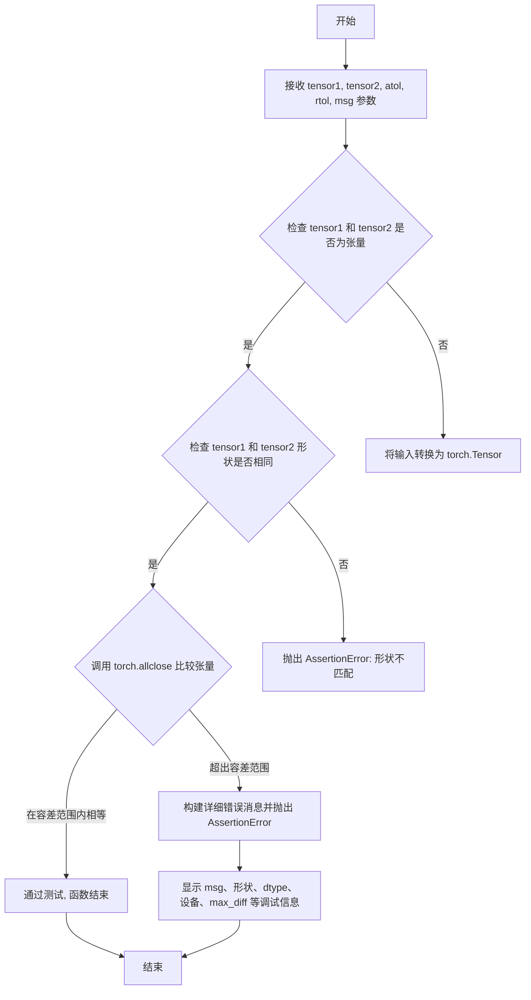

#### 带注释源码

```python
# 声明函数原型，接收两个张量和容差参数
def assert_tensors_close(
    tensor1: torch.Tensor,      # 待比较的第一个张量
    tensor2: torch.Tensor,      # 待比较的第二个张量
    *,                          # 关键字参数开始
    atol: float = 1e-6,         # 绝对容差，默认值 1e-6
    rtol: float = 1e-4,        # 相对容差，默认值 1e-4
    msg: str = ""               # 错误消息前缀
) -> None:
    """
    断言两个张量在指定容差内相等。
    
    该函数用于测试场景，验证两个张量的数值差异是否在可接受范围内。
    如果张量不相等，会抛出详细的 AssertionError 包含调试信息。
    
    参数:
        tensor1: 第一个张量
        tensor2: 第二个张量
        atol: 绝对容差 (absolute tolerance)
        rtol: 相对容差 (relative tolerance)
        msg: 自定义错误消息
    
    异常:
        AssertionError: 当张量形状不匹配或数值差异超过容差时抛出
    """
    
    # 确保输入是 PyTorch 张量
    if not isinstance(tensor1, torch.Tensor):
        tensor1 = torch.as_tensor(tensor1)  # 转换为张量
    if not isinstance(tensor2, torch.Tensor):
        tensor2 = torch.as_tensor(tensor2)
    
    # 首先检查形状是否相同
    if tensor1.shape != tensor2.shape:
        raise AssertionError(
            f"{msg}\n"
            f"Shape mismatch: {tensor1.shape} vs {tensor2.shape}"
        )
    
    # 使用 torch.allclose 检查是否在容差范围内相等
    # allclose 条件: |input - other| <= atol + rtol * |other|
    if not torch.allclose(tensor1, tensor2, atol=atol, rtol=rtol):
        # 计算实际差异用于调试
        diff = tensor1 - tensor2
        max_diff = diff.abs().max()
        mean_diff = diff.abs().mean()
        
        # 构建详细的错误消息
        error_msg = (
            f"{msg}\n" if msg else ""
            f"Tensor mismatch:\n"
            f"  Shape: {tensor1.shape}\n"
            f"  Dtype: {tensor1.dtype}\n"
            f"  Device: {tensor1.device}\n"
            f"  Max diff: {max_diff}\n"
            f"  Mean diff: {mean_diff}\n"
            f"  atol: {atol}, rtol: {rtol}\n"
            f"  tensor1 values:\n{tensor1}\n"
            f"  tensor2 values:\n{tensor2}"
        )
        
        raise AssertionError(error_msg)
    
    # 所有检查通过，函数正常结束（隐式返回 None）
```


### `backend_empty_cache`

该函数用于清理 GPU 或后端相关的缓存，释放显存资源，通常在测试结束后调用以确保测试之间的隔离性。

参数：

- `device`：`str`，目标设备标识符（如 `"cuda"`、`"cpu"` 等），指定要清理缓存的设备

返回值：`None`，无返回值

#### 流程图

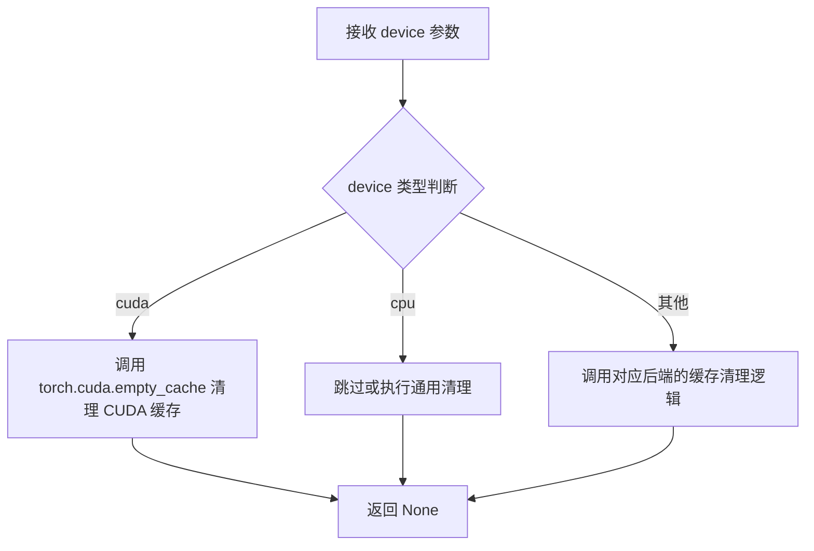

#### 带注释源码

```
# 从 testing_utils 模块导入
# 在本文件中通过以下方式导入：
# from ...testing_utils import (
#     assert_tensors_close,
#     backend_empty_cache,  # <-- 此函数
#     is_lora,
#     ...
# )

# 使用示例（在 teardown_method 中）:
def teardown_method(self):
    """
    测试后的清理方法，确保每个测试之间不会互相影响
    """
    # 1. 重置 torch 编译器缓存，避免同一进程中重用模型时的重编译错误
    torch.compiler.reset()
    
    # 2. 强制进行 Python 垃圾回收，释放 Python 对象
    gc.collect()
    
    # 3. 清理 GPU/后端缓存，释放显存
    # 参数 torch_device 通常为 "cuda" 或 "cpu"
    backend_empty_cache(torch_device)
```

> **注意**：由于 `backend_empty_cache` 是从外部模块 `testing_utils` 导入的，其完整源码定义不在当前代码文件中。从函数名的语义和调用上下文可以推断，该函数主要用于调用 PyTorch 的 `torch.cuda.empty_cache()` 或对应的后端缓存清理 API，以释放 GPU 显存资源。


### `torch_device`

获取测试设备（CPU/CUDA），用于在测试中动态选择合适的计算设备。

参数： 无

返回值： `str`，返回可用的设备字符串（如 `"cuda"` 或 `"cpu"`），优先返回 CUDA 设备（若可用）。

#### 流程图

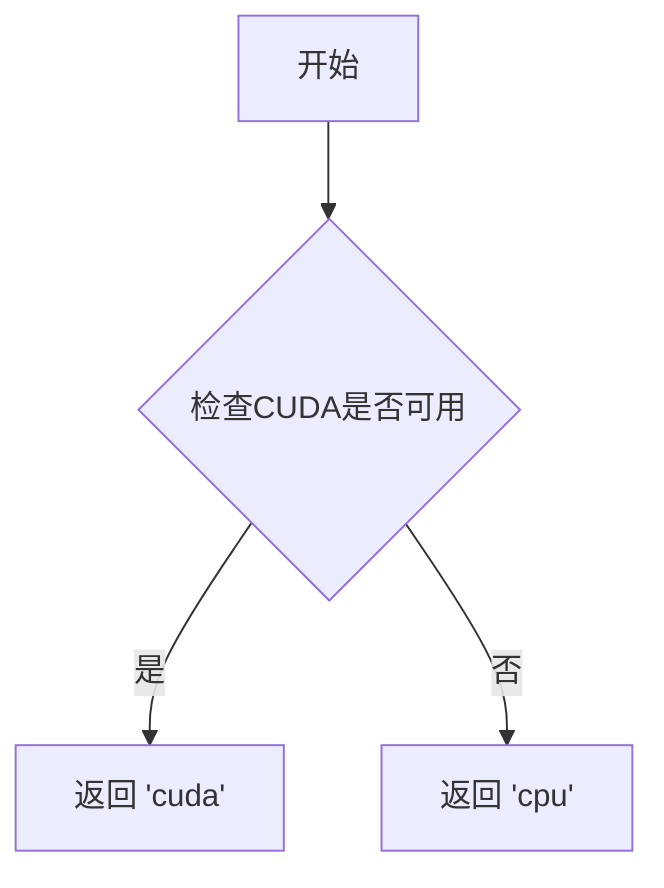

#### 带注释源码

```python
# 该函数定义在 testing_utils 模块中
# 以下为基于使用模式的推断实现

def torch_device() -> str:
    """
    获取测试设备。
    
    优先返回 CUDA 设备（若可用），否则返回 CPU 设备。
    这确保测试可以利用 GPU 加速，同时保证在没有 GPU 环境下仍能正常运行。
    
    Returns:
        str: 设备字符串，'cuda' 表示 CUDA 设备，'cpu' 表示 CPU 设备
    """
    # 检查是否有 CUDA 设备可用
    if torch.cuda.is_available():
        return "cuda"
    # 回退到 CPU 设备
    return "cpu"
```

---

### 备注

由于 `torch_device` 定义在外部模块 `testing_utils` 中，且当前代码文件仅导入并使用该函数，未包含其完整实现。上述源码为基于使用模式的合理推断：

- **实际位置**：`diffusers.utils.testing_utils` 模块
- **调用方式**：作为全局变量或函数被导入使用
- **使用示例**：
  - `model.to(torch_device)` — 将模型移动到指定设备
  - `backend_empty_cache(torch_device)` — 清除指定设备的缓存


### `LoraTesterMixin.setup_method`

初始化测试环境，检查模型类是否继承自 `PeftAdapterMixin`，如果不支持 PEFT 则跳过当前测试。该方法在每个测试方法执行前自动被 pytest 调用。

参数：

- `self`：隐式参数，`LoraTesterMixin` 类的实例，包含了测试所需的 `model_class` 属性

返回值：`None`，无返回值。该方法通过 `pytest.skip()` 跳过无法执行的测试，而非返回错误。

#### 流程图

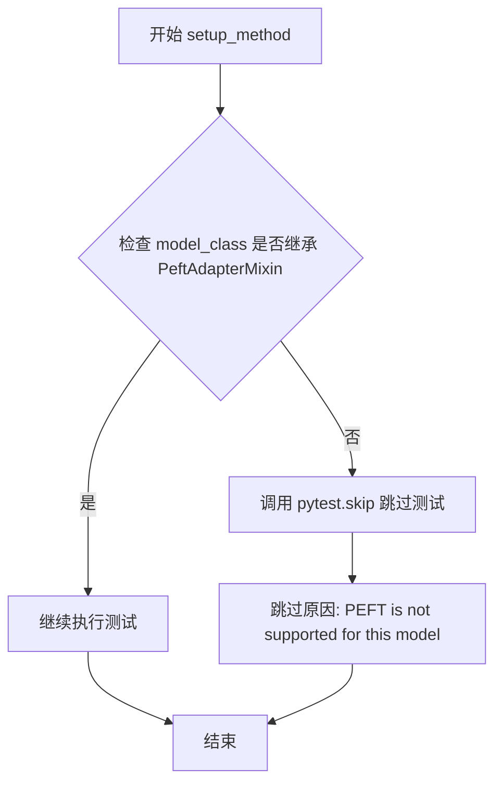

#### 带注释源码

```python
def setup_method(self):
    """
    在每个测试方法运行前初始化测试环境。
    检查模型是否支持 PEFT 功能，如果不支持则跳过测试。
    """
    # 检查 self.model_class 是否为 PeftAdapterMixin 的子类
    # PeftAdapterMixin 是 diffusers 中提供 PEFT/LoRA 支持的 mixin 类
    if not issubclass(self.model_class, PeftAdapterMixin):
        # 使用 pytest.skip 跳过测试，并提供清晰的跳过原因
        # 包含无法支持 PEFT 的模型类名称，便于调试
        pytest.skip(f"PEFT is not supported for this model ({self.model_class.__name__}).")
```


### `LoraTesterMixin.test_save_load_lora_adapter`

该方法测试LoRA适配器的完整保存和加载流程，包括模型初始化、添加LoRA适配器、保存权重、卸载适配器、重新加载适配器以及验证权重和输出的一致性。

参数：

- `self`：隐含的实例参数，调用该方法的类实例
- `tmp_path`：`tmp_path`（pytest fixture），临时目录路径，用于保存LoRA权重文件
- `rank`：`int`，默认值为4，LoRA适配器的秩（rank）参数
- `lora_alpha`：`int`，默认值为4，LoRA适配器的alpha缩放参数
- `use_dora`：`bool`，默认值为False，是否使用DoRA（Decomposed Rank-1 Adaptation）
- `atol`：`float`，默认值为1e-4，张量比较的绝对误差容忍度
- `rtol`：`float`，默认值为1e-4，张量比较的相对误差容忍度

返回值：`None`，无返回值（测试方法）

#### 流程图

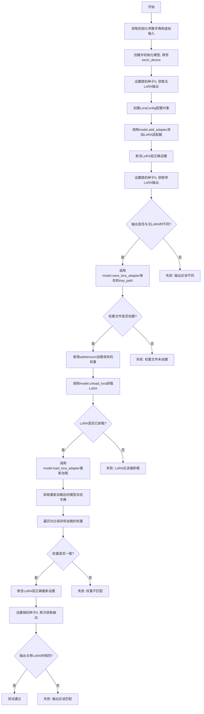

#### 带注释源码

```python
@torch.no_grad()  # 禁用梯度计算以提高性能和减少内存使用
def test_save_load_lora_adapter(self, tmp_path, rank=4, lora_alpha=4, use_dora=False, atol=1e-4, rtol=1e-4):
    """
    测试LoRA适配器的保存和加载流程
    
    测试步骤:
    1. 初始化模型并获取无LoRA的基线输出
    2. 添加LoRA适配器并验证输出改变
    3. 保存LoRA权重到磁盘
    4. 卸载LoRA适配器
    5. 重新加载LoRA适配器
    6. 验证权重一致性
    7. 验证输出恢复正确
    """
    from peft import LoraConfig  # 导入PEFT的LoraConfig
    from peft.utils import get_peft_model_state_dict  # 导入获取PEFT状态的工具函数

    # 获取模型初始化参数字典（由子类提供）
    init_dict = self.get_init_dict()
    # 获取虚拟输入字典（由子类提供）
    inputs_dict = self.get_dummy_inputs()
    # 使用初始化参数创建模型并移至指定设备
    model = self.model_class(**init_dict).to(torch_device)

    # 设置随机种子确保可重复性，获取无LoRA时的输出作为基线
    torch.manual_seed(0)
    output_no_lora = model(**inputs_dict, return_dict=False)[0]

    # 创建LoRA配置对象
    denoiser_lora_config = LoraConfig(
        r=rank,  # LoRA的秩
        lora_alpha=lora_alpha,  # alpha缩放因子
        target_modules=["to_q", "to_k", "to_v", "to_out.0"],  # 目标模块（注意力相关）
        init_lora_weights=False,  # 不使用默认权重初始化
        use_dora=use_dora,  # 是否使用DoRA
    )
    # 为模型添加LoRA适配器
    model.add_adapter(denoiser_lora_config)
    # 验证LoRA层是否正确设置
    assert check_if_lora_correctly_set(model), "LoRA layers not set correctly"

    # 再次设置相同随机种子，获取带LoRA时的输出
    torch.manual_seed(0)
    outputs_with_lora = model(**inputs_dict, return_dict=False)[0]

    # 断言：带LoRA的输出应该与无LoRA时不同
    assert not torch.allclose(output_no_lora, outputs_with_lora, atol=atol, rtol=rtol), (
        "Output should differ with LoRA enabled"
    )

    # 保存LoRA适配器到指定路径
    model.save_lora_adapter(tmp_path)
    # 验证权重文件是否成功创建
    assert os.path.isfile(os.path.join(tmp_path, "pytorch_lora_weights.safetensors")), (
        "LoRA weights file not created"
    )

    # 使用safetensors加载保存的权重文件
    state_dict_loaded = safetensors.torch.load_file(os.path.join(tmp_path, "pytorch_lora_weights.safetensors"))

    # 卸载LoRA适配器
    model.unload_lora()
    # 验证LoRA已成功卸载
    assert not check_if_lora_correctly_set(model), "LoRA should be unloaded"

    # 重新加载LoRA适配器（使用safetensors格式）
    model.load_lora_adapter(tmp_path, prefix=None, use_safetensors=True)
    # 获取重新加载后的模型状态字典
    state_dict_retrieved = get_peft_model_state_dict(model, adapter_name="default_0")

    # 逐个键比较保存的权重和加载的权重是否一致
    for k in state_dict_loaded:
        loaded_v = state_dict_loaded[k]
        retrieved_v = state_dict_retrieved[k].to(loaded_v.device)
        # 使用张量比较断言，检查权重是否匹配
        assert_tensors_close(loaded_v, retrieved_v, atol=atol, rtol=rtol, msg=f"Mismatch in LoRA weight {k}")

    # 验证重新加载后LoRA层正确设置
    assert check_if_lora_correctly_set(model), "LoRA layers not set correctly after reload"

    # 再次设置随机种子，获取重新加载后的输出
    torch.manual_seed(0)
    outputs_with_lora_2 = model(**inputs_dict, return_dict=False)[0]

    # 断言：重新加载后的输出应该与带LoRA时不同（与无LoRA相比）
    assert not torch.allclose(output_no_lora, outputs_with_lora_2, atol=atol, rtol=rtol), (
        "Output should differ with LoRA enabled"
    )
    # 断言：保存前后的输出应该一致
    assert_tensors_close(
        outputs_with_lora,
        outputs_with_lora_2,
        atol=atol,
        rtol=rtol,
        msg="Outputs should match before and after save/load",
    )
```


### `LoraTesterMixin.test_lora_wrong_adapter_name_raises_error`

该测试方法用于验证当使用错误的适配器名称保存 LoRA 适配器时，系统能够正确抛出 ValueError 异常，并包含准确的错误信息。

参数：

- `tmp_path`：`pytest.fixture`，pytest 提供的临时目录路径，用于存放测试过程中生成的临时文件

返回值：`None`，该方法为测试方法，无返回值，通过 pytest 断言验证异常行为

#### 流程图

```mermaid
flowchart TD
    A[开始测试] --> B[获取模型初始化字典 init_dict]
    B --> C[创建模型实例并移至 torch_device]
    C --> D[创建 LoraConfig 对象: r=4, lora_alpha=4, target_modules=[to_q, to_k, to_v, to_out.0]]
    D --> E[调用 model.add_adapter 添加适配器]
    E --> F{验证 LoRA 正确设置}
    F -->|是| G[设置错误适配器名称 wrong_name = 'foo']
    F -->|否| H[测试失败: LoRA layers not set correctly]
    G --> I[使用 pytest.raises 捕获 ValueError]
    I --> J[调用 model.save_lora_adapter/tmp_path/ adapter_name=wrong_name]
    J --> K{是否抛出 ValueError?}
    K -->|是| L[验证错误消息包含 'Adapter name foo not found in the model.']
    K -->|否| M[测试失败: 未抛出预期异常]
    L --> N[测试通过]
    H --> N
    M --> N
```

#### 带注释源码

```python
def test_lora_wrong_adapter_name_raises_error(self, tmp_path):
    """
    测试使用错误适配器名称保存时是否抛出异常。
    
    参数:
        tmp_path: pytest 提供的临时目录 fixture，用于保存临时文件
    """
    from peft import LoraConfig  # 从 peft 库导入 LoraConfig 配置类

    # 获取模型初始化参数字典（由子类 mixin 提供）
    init_dict = self.get_init_dict()
    
    # 使用初始化字典创建模型实例，并移至指定的计算设备
    model = self.model_class(**init_dict).to(torch_device)

    # 创建 LoRA 配置对象
    # r=4: LoRA 秩（rank）
    # lora_alpha=4: LoRA 缩放因子
    # target_modules: 要应用 LoRA 的模块列表（注意力机制的 q, k, v 和输出层）
    # init_lora_weights=False: 不初始化 LoRA 权重（使用随机初始化）
    # use_dora=False: 不使用 DoRA（Decomposed Rank-1 Adaptation）
    denoiser_lora_config = LoraConfig(
        r=4,
        lora_alpha=4,
        target_modules=["to_q", "to_k", "to_v", "to_out.0"],
        init_lora_weights=False,
        use_dora=False,
    )
    
    # 为模型添加 LoRA 适配器（使用默认名称 "default"）
    model.add_adapter(denoiser_lora_config)
    
    # 断言验证 LoRA 层已正确设置
    assert check_if_lora_correctly_set(model), "LoRA layers not set correctly"

    # 设置一个不存在的适配器名称
    wrong_name = "foo"
    
    # 使用 pytest.raises 上下文管理器捕获预期的 ValueError 异常
    with pytest.raises(ValueError) as exc_info:
        # 尝试使用错误的适配器名称保存 LoRA 适配器
        # 这应该抛出 ValueError 因为 'foo' 适配器不存在
        model.save_lora_adapter(tmp_path, adapter_name=wrong_name)

    # 验证抛出的异常消息包含预期的错误信息
    # 确认错误消息明确指出找不到指定的适配器名称
    assert f"Adapter name {wrong_name} not found in the model." in str(exc_info.value)
```


### `LoraTesterMixin.test_lora_adapter_metadata_is_loaded_correctly`

测试 LoRA 适配器的元数据（包括 LoRA 配置参数如 rank、alpha、target_modules 等）在保存并重新加载后是否能够正确恢复，确保加载后的元数据与原始配置一致。

参数：

- `self`：`LoraTesterMixin`，测试类的实例，指向包含测试方法的类本身
- `tmp_path`：`pytest.fixture` (pathlib.Path)，pytest 提供的临时目录路径，用于存放保存的 LoRA 适配器权重文件
- `rank`：`int`，可选，默认值为 `4`，LoRA 适配器的秩（rank）参数，决定低秩矩阵的维度
- `lora_alpha`：`int`，可选，默认值为 `4`，LoRA 适配器的 alpha 缩放参数，用于调整 LoRA 权重的影响力
- `use_dora`：`bool`，可选，默认值为 `False`，是否使用 DoRA（Decomposed Reparameterization）训练方法

返回值：`None`，该方法为测试方法，通过断言验证功能，不返回具体数值

#### 流程图

```mermaid
flowchart TD
    A[开始测试] --> B[获取模型初始化参数 init_dict]
    B --> C[使用 init_dict 初始化模型并移动到 torch_device]
    C --> D[创建 LoraConfig 对象<br/>r=rank, lora_alpha=lora_alpha<br/>target_modules=['to_q', 'to_k', 'to_v', 'to_out.0']<br/>init_lora_weights=False, use_dora=use_dora]
    D --> E[调用 model.add_adapter 添加 LoRA 适配器]
    E --> F[从 model.peft_config['default'] 获取原始元数据并转为字典]
    F --> G{断言: check_if_lora_correctly_set(model)}
    G -->|通过| H[调用 model.save_lora_adapter 保存适配器到 tmp_path]
    G -->|失败| Z[测试失败: LoRA layers not set correctly]
    H --> I{断言: pytorch_lora_weights.safetensors 文件存在}
    I -->|存在| J[调用 model.unload_lora 卸载 LoRA 适配器]
    I -->|不存在| Y[测试失败: LoRA weights file not created]
    J --> K{断言: check_if_lora_correctly_set(model) 为 False}
    K -->|通过| L[调用 model.load_lora_adapter 重新加载适配器<br/>prefix=None, use_safetensors=True]
    K -->|失败| X[测试失败: LoRA should be unloaded]
    L --> M[从 model.peft_config['default_0'] 获取加载后的元数据并转为字典]
    M --> N[调用 check_if_dicts_are_equal 比较原始元数据与加载后的元数据]
    N --> O[结束测试]
```

#### 带注释源码

```python
def test_lora_adapter_metadata_is_loaded_correctly(self, tmp_path, rank=4, lora_alpha=4, use_dora=False):
    """
    测试 LoRA 适配器元数据在保存和加载后是否正确恢复。
    
    该测试执行以下步骤：
    1. 创建并初始化模型
    2. 添加 LoRA 适配器并获取原始配置元数据
    3. 保存 LoRA 适配器到磁盘
    4. 卸载 LoRA 适配器
    5. 重新加载 LoRA 适配器
    6. 验证加载后的元数据与原始元数据一致
    """
    from peft import LoraConfig  # 导入 PEFT 库的 LoraConfig 类

    # Step 1: 获取模型初始化参数字典
    init_dict = self.get_init_dict()
    # 使用初始化参数创建模型实例，并移动到指定的设备（如 CUDA）
    model = self.model_class(**init_dict).to(torch_device)

    # Step 2: 创建 LoRA 配置对象
    denoiser_lora_config = LoraConfig(
        r=rank,                        # LoRA 秩参数，控制低秩矩阵的维度
        lora_alpha=lora_alpha,         # LoRA alpha 缩放因子
        target_modules=["to_q", "to_k", "to_v", "to_out.0"],  # 目标模块列表
        init_lora_weights=False,       # 不初始化 LoRA 权重，保持随机状态
        use_dora=use_dora,             # 是否使用 DoRA 方法
    )
    # 将 LoRA 适配器添加到模型中
    model.add_adapter(denoiser_lora_config)
    
    # 提取原始的 PEFT 配置元数据并转换为字典格式
    metadata = model.peft_config["default"].to_dict()
    
    # 断言验证 LoRA 层已正确设置
    assert check_if_lora_correctly_set(model), "LoRA layers not set correctly"

    # Step 3: 将 LoRA 适配器保存到指定的临时目录
    model.save_lora_adapter(tmp_path)
    
    # 构建保存的权重文件路径
    model_file = os.path.join(tmp_path, "pytorch_lora_weights.safetensors")
    
    # 断言验证权重文件已成功创建
    assert os.path.isfile(model_file), "LoRA weights file not created"

    # Step 4: 卸载模型中的 LoRA 适配器
    model.unload_lora()
    
    # 断言验证 LoRA 已成功卸载
    assert not check_if_lora_correctly_set(model), "LoRA should be unloaded"

    # Step 5: 从保存的文件重新加载 LoRA 适配器
    # prefix=None: 不使用前缀
    # use_safetensors=True: 使用 safetensors 格式加载
    model.load_lora_adapter(tmp_path, prefix=None, use_safetensors=True)
    
    # 获取重新加载后的 PEFT 配置元数据（注意：加载后 adapter 名称会变为 "default_0"）
    parsed_metadata = model.peft_config["default_0"].to_dict()
    
    # Step 6: 比较原始元数据与加载后的元数据是否一致
    check_if_dicts_are_equal(metadata, parsed_metadata)
```


### `LoraTesterMixin.test_lora_adapter_wrong_metadata_raises_error`

该方法用于测试当 LoRA 适配器的元数据损坏（包含不合法字段）时，加载该适配器是否会抛出 TypeError。

参数：

- `tmp_path`：`tmp_path`（pytest fixture），临时目录路径，用于保存和加载 LoRA 适配器文件

返回值：`None`（测试方法，无返回值），通过 pytest 的 `raises` 上下文管理器验证会抛出 `TypeError` 异常

#### 流程图

```mermaid
flowchart TD
    A[开始测试] --> B[获取初始化参数字典 init_dict]
    B --> C[使用 init_dict 创建模型并移动到 torch_device]
    C --> D[创建 LoraConfig: r=4, lora_alpha=4, target_modules=[to_q, to_k, to_v, to_out.0]]
    D --> E[调用 model.add_adapter 添加 LoRA 适配器]
    E --> F[断言 LoRA 层正确设置]
    F --> G[调用 model.save_lora_adapter 保存适配器到 tmp_path]
    G --> H[获取模型文件路径 model_file]
    H --> I[断言模型文件已创建]
    I --> J[使用 safetensors.torch.load_file 加载模型文件]
    J --> K[创建损坏的元数据: format=pt, 包含非法字段 foo=1, bar=2]
    K --> L[将损坏的元数据写入模型文件]
    L --> M[调用 model.unload_lora 卸载 LoRA]
    M --> N[断言 LoRA 已卸载]
    N --> O[尝试加载损坏的适配器: model.load_lora_adapter]
    O --> P{是否抛出 TypeError?}
    P -->|是| Q[断言错误消息包含 'LoraConfig class could not be instantiated']
    P -->|否| R[测试失败]
    Q --> S[结束测试]
    R --> S
```

#### 带注释源码

```python
def test_lora_adapter_wrong_metadata_raises_error(self, tmp_path):
    """
    测试当 LoRA 适配器的元数据损坏时，加载该适配器是否会抛出 TypeError。
    
    该测试通过以下步骤验证错误处理：
    1. 创建一个带有合法元数据的 LoRA 适配器并保存
    2. 故意破坏保存的元数据（添加非法字段 foo 和 bar）
    3. 尝试加载损坏的适配器，预期抛出 TypeError
    """
    # 导入 LoraConfig 用于创建 LoRA 配置
    from peft import LoraConfig
    
    # 导入 LoRA 适配器元数据键常量
    from diffusers.loaders.lora_base import LORA_ADAPTER_METADATA_KEY
    
    # 获取模型初始化参数字典（由子类提供）
    init_dict = self.get_init_dict()
    
    # 使用初始化参数字典创建模型，并将模型移动到指定的 torch 设备
    model = self.model_class(**init_dict).to(torch_device)
    
    # 创建 LoRA 配置：rank=4, alpha=4, 目标模块为 attention 相关层
    denoiser_lora_config = LoraConfig(
        r=4,                                    # LoRA rank（秩）
        lora_alpha=4,                           # LoRA alpha 缩放参数
        target_modules=["to_q", "to_k", "to_v", "to_out.0"],  # 要应用 LoRA 的模块
        init_lora_weights=False,                # 不初始化 LoRA 权重（使用随机权重）
        use_dora=False,                         # 不使用 DoRA
    )
    
    # 向模型添加 LoRA 适配器
    model.add_adapter(denoiser_lora_config)
    
    # 断言验证 LoRA 层已正确设置
    assert check_if_lora_correctly_set(model), "LoRA layers not set correctly"
    
    # 将 LoRA 适配器保存到临时目录
    model.save_lora_adapter(tmp_path)
    
    # 构建模型权重文件路径
    model_file = os.path.join(tmp_path, "pytorch_lora_weights.safetensors")
    
    # 断言 LoRA 权重文件已成功创建
    assert os.path.isfile(model_file), "LoRA weights file not created"
    
    # 加载已保存的模型权重
    loaded_state_dict = safetensors.torch.load_file(model_file)
    
    # 创建基础元数据（只有 format 字段）
    metadata = {"format": "pt"}
    
    # 获取当前 LoRA 配置的字典形式
    lora_adapter_metadata = denoiser_lora_config.to_dict()
    
    # 故意破坏元数据：添加非法的额外字段 "foo" 和 "bar"
    # 这些字段不是 LoraConfig 的有效属性，会导致反序列化失败
    lora_adapter_metadata.update({"foo": 1, "bar": 2})
    
    # 处理 set 类型：LoraConfig 中的某些字段可能是 set，需要转换为 list 以便 JSON 序列化
    for key, value in lora_adapter_metadata.items():
        if isinstance(value, set):
            lora_adapter_metadata[key] = list(value)
    
    # 将损坏的元数据 JSON 序列化并添加到 metadata 中
    # LORA_ADAPTER_METADATA_KEY 是用于存储 LoRA 适配器元数据的特殊键
    metadata[LORA_ADAPTER_METADATA_KEY] = json.dumps(lora_adapter_metadata, indent=2, sort_keys=True)
    
    # 使用损坏的元数据重新保存模型文件
    safetensors.torch.save_file(loaded_state_dict, model_file, metadata=metadata)
    
    # 卸载 LoRA 适配器
    model.unload_lora()
    
    # 断言 LoRA 已成功卸载
    assert not check_if_lora_correctly_set(model), "LoRA should be unloaded"
    
    # 尝试加载带有损坏元数据的适配器
    # 预期行为：抛出 TypeError，因为 LoraConfig 无法从损坏的元数据创建实例
    with pytest.raises(TypeError) as exc_info:
        model.load_lora_adapter(tmp_path, prefix=None, use_safetensors=True)
    
    # 断言错误消息包含预期的内容
    assert "`LoraConfig` class could not be instantiated" in str(exc_info.value)
```


### `LoraHotSwappingForModelTesterMixin.setup_method`

该方法用于初始化测试环境，验证模型类是否支持 PEFT（Parameter-Efficient Fine-Tuning）功能。如果模型不支持 PEFT，则跳过该测试用例。

参数：

- `self`：实例本身，无需显式传递

返回值：`None`，无返回值

#### 流程图

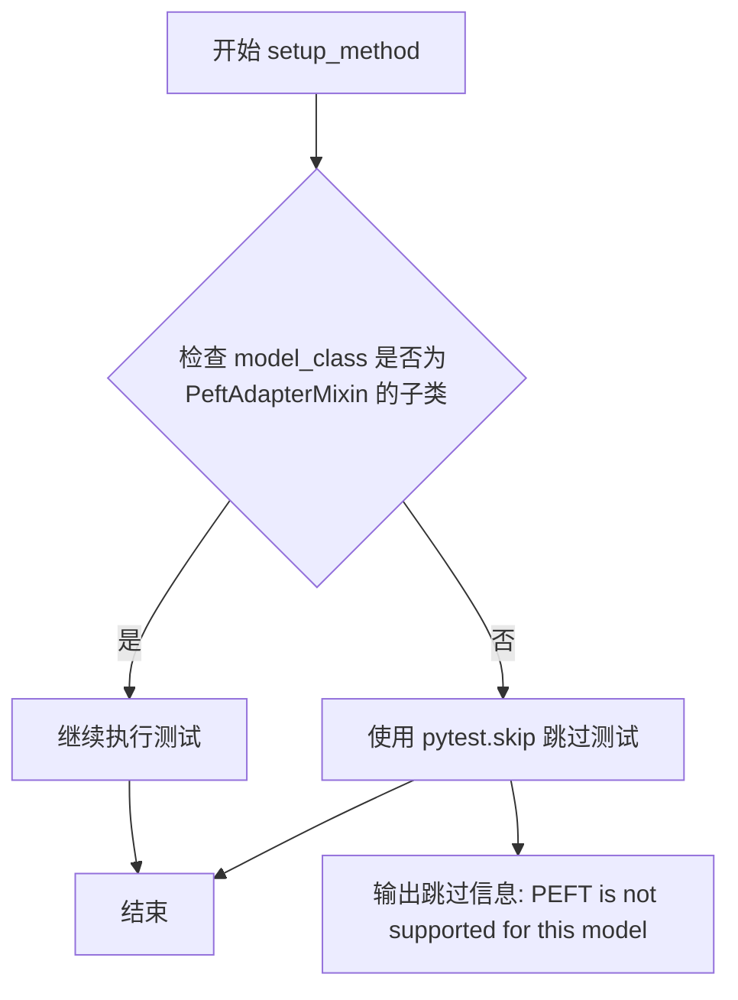

#### 带注释源码

```python
def setup_method(self):
    """
    初始化测试环境，检查 PEFT 支持情况。
    
    该方法在每个测试方法之前被调用，用于验证模型类是否支持 PEFT 功能。
    如果模型不支持 PEFT，则跳过该测试用例。
    
    Note: 
        - self.model_class 应在测试配置中定义
        - PeftAdapterMixin 是 diffusers 提供的 PEFT 适配器混入类
    """
    # 检查模型类是否继承自 PeftAdapterMixin
    if not issubclass(self.model_class, PeftAdapterMixin):
        # 如果不支持 PEFT，跳过测试并显示友好错误信息
        pytest.skip(f"PEFT is not supported for this model ({self.model_class.__name__}).")
```


### `LoraHotSwappingForModelTesterMixin.teardown_method`

该方法是测试类的清理方法，在每个测试方法执行完毕后被自动调用。其核心功能是重置 PyTorch 的 dynamo 编译缓存，强制进行垃圾回收，并清空 GPU 内存缓存。这是关键步骤，否则在同一进程中重新使用相同模型时会导致重新编译错误，因为 torch 会缓存模型状态。

参数：

- `self`：`LoraHotSwappingForModelTesterMixin` 类型，隐式参数，指向测试类实例本身

返回值：`None`，无返回值

#### 流程图

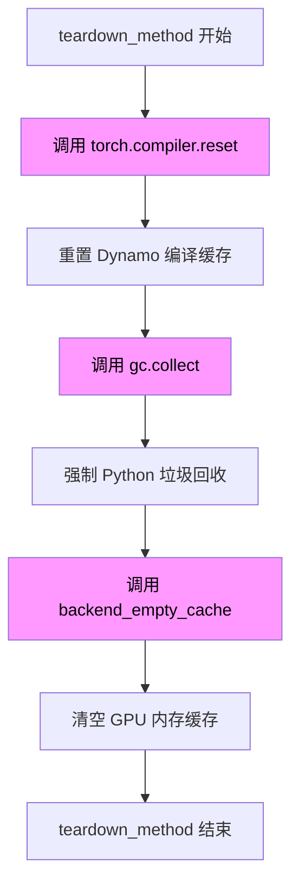

#### 带注释源码

```python
def teardown_method(self):
    """
    测试方法后的清理操作。

    关键说明：
    必须为每个测试重置 dynamo 缓存。否则，如果测试在同一进程中重新使用相同模型，
    将会出现重新编译错误，因为 torch 会在运行时缓存模型。
    """
    # 重置 PyTorch torch.compile 的 dynamo 编译缓存
    # 这确保了下一个测试不会受到前一个测试编译结果的影响
    torch.compiler.reset()
    
    # 强制调用 Python 垃圾回收器
    # 这有助于释放不再使用的 Python 对象
    gc.collect()
    
    # 清空 GPU 内存缓存
    # torch_device 是测试设备（如 'cuda' 或 'cpu'）
    # 这一步对于防止 GPU 内存泄漏至关重要
    backend_empty_cache(torch_device)
```


### `LoraHotSwappingForModelTesterMixin._get_lora_config`

创建并返回一个配置好的 `LoraConfig` 对象，用于在模型中添加LoRA适配器。

参数：

- `lora_rank`：`int`，LoRA矩阵的秩（rank），决定低秩矩阵的维度
- `lora_alpha`：`int`，LoRA的alpha缩放参数，用于调整LoRA权重的影响程度
- `target_modules`：`list[str]`，要应用LoRA的目标模块名称列表，如 `["to_q", "to_k", "to_v", "to_out.0"]`

返回值：`LoraConfig`，PEFT库中的LoraConfig对象，包含LoRA适配器的完整配置

#### 流程图

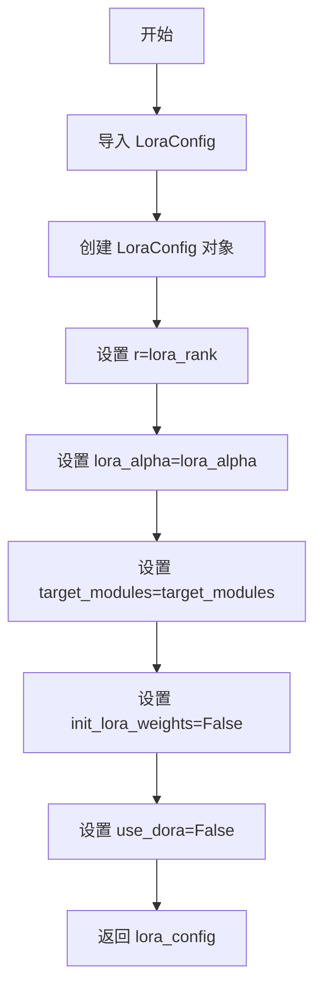

#### 带注释源码

```python
def _get_lora_config(self, lora_rank, lora_alpha, target_modules):
    """
    创建 LoraConfig 对象用于配置 LoRA 适配器。
    
    Args:
        lora_rank: LoRA 矩阵的秩
        lora_alpha: LoRA 的 alpha 缩放参数
        target_modules: 目标模块列表
    
    Returns:
        LoraConfig: 配置好的 LoRA 配置对象
    """
    # 从 peft 库导入 LoraConfig 类
    from peft import LoraConfig

    # 创建 LoraConfig 实例，配置 LoRA 适配器的各项参数
    lora_config = LoraConfig(
        r=lora_rank,              # LoRA 矩阵的秩，决定低秩分解的维度
        lora_alpha=lora_alpha,    # alpha 缩放因子，用于调整 LoRA 权重的影响
        target_modules=target_modules,  # 需要应用 LoRA 的目标模块
        init_lora_weights=False, # 不初始化 LoRA 权重（保留预训练权重）
        use_dora=False,          # 不使用 DoRA（Decomposed Rank Adaptation）
    )
    
    # 返回配置好的 LoraConfig 对象
    return lora_config
```


### `LoraHotSwappingForModelTesterMixin._get_linear_module_name_other_than_attn`

获取模型中非注意力层的第一个线性模块名称，用于在热切换测试中同时 targeting 注意力层和非注意力层。

参数：

- `model`：`torch.nn.Module`，要搜索线性模块的模型实例

返回值：`str`，返回第一个非注意力相关的线性模块名称（名称中不包含"to_"的线性层）

#### 流程图

```mermaid
flowchart TD
    A[Start] --> B[获取模型所有命名模块 model.named_modules]
    B --> C{遍历每个 name, module}
    C --> D{module 是 nn.Linear 且 name 不包含 'to_'}
    C --> E{遍历完毕?}
    D -->|是| F[添加到 linear_names 列表]
    D -->|否| C
    F --> C
    E -->|是| G[返回 linear_names[0]]
    G --> H[End]
```

#### 带注释源码

```python
def _get_linear_module_name_other_than_attn(self, model):
    """
    Get the name of a linear module that is not an attention-related module.
    
    This method is used in tests to find a non-attention linear layer in the model
    (e.g., from MLP or other components), so that the hotswapping test can target
    both attention layers and non-attention layers simultaneously.
    
    Args:
        model: The model to search for linear modules in
        
    Returns:
        str: The name of the first linear module that is not an attention-related 
             module (does not contain 'to_' in its name)
    """
    # 遍历模型的所有命名模块，筛选出 nn.Linear 类型且名称中不含 "to_" 的模块
    # "to_" 前缀通常用于注意力机制的 q/k/v/out 层 (to_q, to_k, to_v, to_out.0)
    linear_names = [
        name for name, module in model.named_modules() 
        if isinstance(module, nn.Linear) and "to_" not in name
    ]
    # 返回第一个符合条件的线性模块名称
    return linear_names[0]
```


### `LoraHotSwappingForModelTesterMixin._check_model_hotswap`

验证LoRA热插拔功能的核心方法，通过创建、加载、热交换两个不同配置的LoRA适配器，并可选地使用torch.compile()编译模型，以验证热插拔不会触发模型重新编译，同时确保输出结果的正确性。

参数：

- `tmp_path`：`_pytest._py.path.LocalPath`，pytest的临时目录路径，用于保存LoRA适配器权重文件
- `do_compile`：`bool`，是否使用torch.compile()编译模型以验证热插拔不会触发重新编译
- `rank0`：`int`，第一个LoRA适配器的rank值（也用作alpha值，因为save_lora_adapter不保存alpha缩放）
- `rank1`：`int`，第二个LoRA适配器的rank值
- `target_modules0`：`list[str]`，第一个适配器要应用的模块名称列表（如["to_q", "to_k", "to_v", "to_out.0"]）
- `target_modules1`：`list[str] | None`，第二个适配器的目标模块列表，默认为None时会复制target_modules0
- `atol`：`float`，绝对误差容忍度，用于tensor比较（默认5e-3）
- `rtol`：`float`，相对误差容忍度，用于tensor比较（默认5e-3）

返回值：`None`，该方法通过assert语句进行验证，不返回任何值

#### 流程图

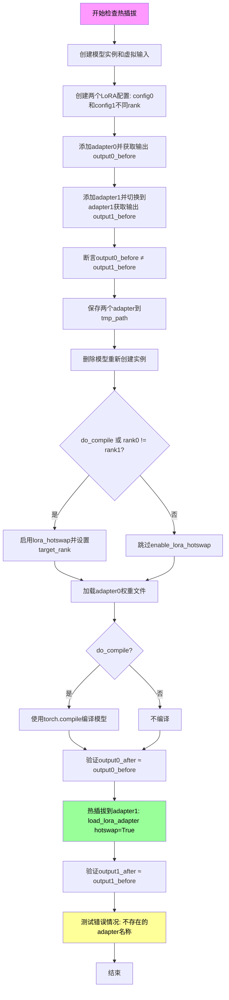

#### 带注释源码

```python
def _check_model_hotswap(
    self, tmp_path, do_compile, rank0, rank1, target_modules0, target_modules1=None, atol=5e-3, rtol=5e-3
):
    """
    Check that hotswapping works on a model.

    Steps:
    - create 2 LoRA adapters and save them
    - load the first adapter
    - hotswap the second adapter
    - check that the outputs are correct
    - optionally compile the model
    - optionally check if recompilations happen on different shapes

    Note: We set rank == alpha here because save_lora_adapter does not save the alpha scalings, thus the test would
    fail if the values are different. Since rank != alpha does not matter for the purpose of this test, this is
    fine.
    """
    # 获取用于动态编译测试的不同形状列表（可选）
    different_shapes = self.different_shapes_for_compilation
    
    # 使用相同种子确保可重复性
    torch.manual_seed(0)
    # 获取模型初始化参数字典和虚拟输入
    init_dict = self.get_init_dict()
    inputs_dict = self.get_dummy_inputs()
    # 创建模型实例并移至目标设备
    model = self.model_class(**init_dict).to(torch_device)

    # 设置alpha值与rank相同（原因见函数docstring）
    alpha0, alpha1 = rank0, rank1
    # 取最大rank作为目标rank
    max_rank = max([rank0, rank1])
    
    # 如果未指定第二个adapter的目标模块，则使用与第一个相同的模块
    if target_modules1 is None:
        target_modules1 = target_modules0[:]
    
    # 创建两个LoRA配置对象
    lora_config0 = self._get_lora_config(rank0, alpha0, target_modules0)
    lora_config1 = self._get_lora_config(rank1, alpha1, target_modules1)

    # 添加第一个adapter并获取输出
    model.add_adapter(lora_config0, adapter_name="adapter0")
    with torch.inference_mode():
        torch.manual_seed(0)
        output0_before = model(**inputs_dict)["sample"]

    # 添加第二个adapter并切换到它
    model.add_adapter(lora_config1, adapter_name="adapter1")
    model.set_adapter("adapter1")
    with torch.inference_mode():
        torch.manual_seed(0)
        output1_before = model(**inputs_dict)["sample"]

    # 健全性检查：两个adapter的输出应该不同，且都不为零
    assert not torch.allclose(output0_before, output1_before, atol=atol, rtol=rtol)
    assert not (output0_before == 0).all()
    assert not (output1_before == 0).all()

    # 保存两个adapter的检查点到磁盘
    model.save_lora_adapter(os.path.join(tmp_path, "0"), safe_serialization=True, adapter_name="adapter0")
    model.save_lora_adapter(os.path.join(tmp_path, "1"), safe_serialization=True, adapter_name="adapter1")
    # 删除模型以释放内存
    del model

    # 重新创建模型实例用于加载测试
    torch.manual_seed(0)
    init_dict = self.get_init_dict()
    model = self.model_class(**init_dict).to(torch_device)

    # 如果需要编译或rank不同，需要启用lora hotswap
    if do_compile or (rank0 != rank1):
        # no need to prepare if the model is not compiled or if the ranks are identical
        model.enable_lora_hotswap(target_rank=max_rank)

    # 构建权重文件路径
    file_name0 = os.path.join(os.path.join(tmp_path, "0"), "pytorch_lora_weights.safetensors")
    file_name1 = os.path.join(os.path.join(tmp_path, "1"), "pytorch_lora_weights.safetensors")
    
    # 加载第一个adapter
    model.load_lora_adapter(file_name0, safe_serialization=True, adapter_name="adapter0", prefix=None)

    # 如果需要编译，使用torch.compile进行编译
    if do_compile:
        model = torch.compile(model, mode="reduce-overhead", dynamic=different_shapes is not None)

    with torch.inference_mode():
        # 额外检查动态编译是否工作正常
        if different_shapes is not None:
            for height, width in different_shapes:
                new_inputs_dict = self.prepare_dummy_input(height=height, width=width)
                _ = model(**new_inputs_dict)
        else:
            # 验证加载adapter0后的输出与之前一致
            output0_after = model(**inputs_dict)["sample"]
            assert_tensors_close(
                output0_before, output0_after, atol=atol, rtol=rtol, msg="Output mismatch after loading adapter0"
            )

    # 热插拔到第二个adapter
    model.load_lora_adapter(file_name1, adapter_name="adapter0", hotswap=True, prefix=None)

    # 需要调用forward以潜在触发重新编译
    with torch.inference_mode():
        if different_shapes is not None:
            for height, width in different_shapes:
                new_inputs_dict = self.prepare_dummy_input(height=height, width=width)
                _ = model(**new_inputs_dict)
        else:
            # 验证热插拔后的输出与之前一致
            output1_after = model(**inputs_dict)["sample"]
            assert_tensors_close(
                output1_before,
                output1_after,
                atol=atol,
                rtol=rtol,
                msg="Output mismatch after hotswapping to adapter1",
            )

    # 检查传递无效adapter名称时是否报错
    name = "does-not-exist"
    msg = f"Trying to hotswap LoRA adapter '{name}' but there is no existing adapter by that name"
    with pytest.raises(ValueError, match=re.escape(msg)):
        model.load_lora_adapter(file_name1, adapter_name=name, hotswap=True, prefix=None)
```


### `LoraHotSwappingForModelTesterMixin.test_hotswapping_model`

测试基础热插拔功能，验证在不启用 torch.compile 的情况下，模型能够正确加载和热插拔两个不同的 LoRA 适配器，并确保输出结果一致。

参数：

- `self`：隐式参数，`LoraHotSwappingForModelTesterMixin` 类的实例，表示测试类本身
- `tmp_path`：`pytest.TempPathFactory` 或 `pathlib.Path`，pytest 提供的临时目录，用于存放临时文件和模型权重
- `rank0`：`int`，第一个 LoRA 适配器的秩（rank），决定 LoRA 矩阵的维度大小
- `rank1`：`int`，第二个 LoRA 适配器的秩（rank），决定热插拔后 LoRA 矩阵的维度大小

返回值：`None`，该方法为测试方法，通过断言验证行为，不返回任何值

#### 流程图

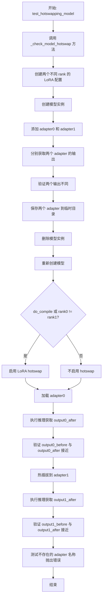

#### 带注释源码

```python
@pytest.mark.parametrize("rank0,rank1", [(11, 11), (7, 13), (13, 7)])
def test_hotswapping_model(self, tmp_path, rank0, rank1):
    """
    测试基础热插拔功能。
    
    该测试方法验证在不启用 torch.compile 的情况下，
    模型能够正确加载和热插拔两个不同的 LoRA 适配器。
    
    测试使用三种不同的 rank 组合：
    - (11, 11): 相同 rank
    - (7, 13): 从小 rank 切换到大 rank
    - (13, 7): 从大 rank 切换到小 rank
    
    参数:
        tmp_path: pytest 提供的临时目录，用于保存和加载 LoRA 权重
        rank0: 第一个 LoRA 适配器的 rank 值
        rank1: 第二个 LoRA 适配器的 rank 值
    """
    # 调用内部辅助方法 _check_model_hotswap 执行实际的热插拔测试逻辑
    # do_compile=False 表示不启用 torch.compile
    # target_modules0 指定要应用 LoRA 的模块列表
    self._check_model_hotswap(
        tmp_path, 
        do_compile=False, 
        rank0=rank0, 
        rank1=rank1, 
        target_modules0=["to_q", "to_k", "to_v", "to_out.0"]
    )
```


### `LoraHotSwappingForModelTesterMixin.test_hotswapping_compiled_model_linear`

测试编译后模型的线性层热插拔功能，验证在使用 `torch.compile()` 编译模型时，切换不同 LoRA 适配器（线性层）不会触发模型重新编译。

参数：

- `self`：`LoraHotSwappingForModelTesterMixin`，Mix-in 类实例，隐式参数
- `tmp_path`：`pytest.fixture.Path`，Pytest 提供的临时目录路径，用于保存和加载 LoRA 适配器权重
- `rank0`：`int`，第一个 LoRA 适配器的秩（rank），控制低秩矩阵的维度
- `rank1`：`int`，第二个 LoRA 适配器的秩（rank），控制低秩矩阵的维度

返回值：`None`，测试函数无返回值，通过 pytest 断言验证正确性

#### 流程图

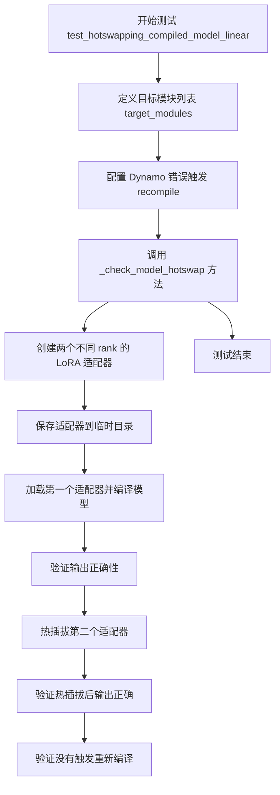

#### 带注释源码

```python
@pytest.mark.parametrize("rank0,rank1", [(11, 11), (7, 13), (13, 7)])
def test_hotswapping_compiled_model_linear(self, tmp_path, rank0, rank1):
    """
    测试编译后模型的线性层热插拔功能。
    
    该测试验证在使用 torch.compile() 编译模型时，
    切换不同 LoRA 适配器（线性层）不会触发模型重新编译。
    
    参数:
        tmp_path: pytest 临时目录 fixture，用于保存/加载 LoRA 权重
        rank0: 第一个 LoRA 适配器的秩
        rank1: 第二个 LoRA 适配器的秩
    
    测试流程:
        1. 定义目标模块（注意力机制的线性层）
        2. 配置 torch._dynamo 在发生 recompile 时抛出错误
        3. 调用 _check_model_hotswap 执行完整的热插拔测试流程
    """
    # 定义要应用 LoRA 的目标模块列表
    # to_q, to_k, to_v: 注意力机制的 Query, Key, Value 投影层
    # to_out.0: 注意力输出投影层
    target_modules = ["to_q", "to_k", "to_v", "to_out.0"]
    
    # 使用 torch._dynamo.config.patch(error_on_recompile=True) 配置编译器
    # 当发生模型重新编译时，会抛出异常而不是静默处理
    # torch._inductor.utils.fresh_inductor_cache() 确保使用全新的编译缓存
    # 这样可以准确检测是否发生了重新编译
    with torch._dynamo.config.patch(error_on_recompile=True), torch._inductor.utils.fresh_inductor_cache():
        # 调用内部方法 _check_model_hotswap 执行完整的热插拔测试
        # do_compile=True 表示要对模型进行 torch.compile() 编译
        # rank0, rank1 使用参数化的不同 rank 值测试
        self._check_model_hotswap(
            tmp_path, 
            do_compile=True, 
            rank0=rank0, 
            rank1=rank1, 
            target_modules0=target_modules
        )
```


### `LoraHotSwappingForModelTesterMixin.test_hotswapping_compiled_model_conv2d`

测试编译后模型的卷积层热插拔功能（仅适用于UNet），验证在使用torch.compile编译模型后，对conv、conv1、conv2等卷积层进行LoRA适配器热切换时不会触发模型重新编译。

参数：

- `self`：隐式参数，`LoraHotSwappingForModelTesterMixin`类的实例
- `tmp_path`：`pytest.TempPathFactory`或`py.path.local`，pytest提供的临时目录fixture，用于保存LoRA适配器权重
- `rank0`：`int`，第一个LoRA适配器的rank值（参数化测试取值为11, 7, 13）
- `rank1`：`int`，第二个LoRA适配器的rank值（参数化测试取值为11, 7, 13）

返回值：`None`，无返回值，这是一个pytest测试用例方法

#### 流程图

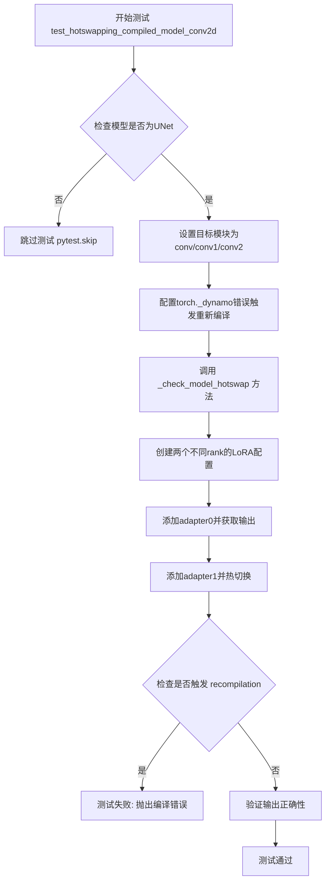

#### 带注释源码

```python
@pytest.mark.parametrize("rank0,rank1", [(11, 11), (7, 13), (13, 7)])
def test_hotswapping_compiled_model_conv2d(self, tmp_path, rank0, rank1):
    """
    测试编译后模型的卷积层热插拔功能（仅UNet）。
    
    该测试验证在使用torch.compile()编译UNet模型后，
    对卷积层（conv、conv1、conv2）进行LoRA适配器热切换时
    不会触发模型的重新编译（recompilation）。
    
    Args:
        tmp_path: pytest临时目录fixture，用于保存LoRA权重文件
        rank0: 第一个LoRA适配器的rank值
        rank1: 第二个LoRA适配器的rank值
    """
    # 检查模型是否为UNet类型，非UNet模型跳过此测试
    if "unet" not in self.model_class.__name__.lower():
        pytest.skip("Test only applies to UNet.")

    # 定义卷积层的目标模块名称
    target_modules = ["conv", "conv1", "conv2"]
    
    # 使用torch._dynamo配置来在发生重新编译时抛出错误
    # fresh_inductor_cache()确保每次测试使用全新的inductor缓存
    with torch._dynamo.config.patch(error_on_recompile=True), \
         torch._inductor.utils.fresh_inductor_cache():
        # 调用通用的热插拔检查方法
        # do_compile=True 表示启用torch.compile编译模型
        # rank0, rank1 用于测试不同rank值的适配器热插拔
        self._check_model_hotswap(
            tmp_path, 
            do_compile=True,  # 启用torch.compile编译
            rank0=rank0,      # 第一个适配器的rank
            rank1=rank1,      # 第二个适配器的rank
            target_modules0=target_modules  # 目标模块为卷积层
        )
```


### `LoraHotSwappingForModelTesterMixin.test_hotswapping_compiled_model_both_linear_and_conv2d`

测试混合层（Linear 和 Conv2d）的热插拔功能，验证在使用 `torch.compile()` 编译模型时，热插拔 LoRA 适配器不会触发模型重新编译。该测试专门针对 UNet 模型，验证 attention 层的 Linear 和卷积层可以同时作为 LoRA 目标进行热插拔。

参数：

- `self`：`LoraHotSwappingForModelTesterMixin`，类实例，测试方法所属的 mixin 类
- `tmp_path`：`pytest.fixture.Path`，pytest 临时路径 fixture，用于保存和加载 LoRA 适配器权重
- `rank0`：`int`，第一个 LoRA 适配器的秩（rank），参数化值为 11, 7, 13
- `rank1`：`int`，第二个 LoRA 适配器的秩（rank），参数化值为 11, 7, 13

返回值：无（`None`），此为测试方法，通过 pytest 断言验证行为

#### 流程图

```mermaid
flowchart TD
    A[开始测试 test_hotswapping_compiled_model_both_linear_and_conv2d] --> B{检查 model_class 名称是否包含 'unet'}
    B -->|是| C[设置 target_modules = ['to_q', 'conv']]
    B -->|否| D[跳过测试: pytest.skip]
    C --> E[启用 dynamo 错误检测: torch._dynamo.config.patch error_on_recompile=True]
    E --> F[清空 inductor 缓存: fresh_inductor_cache]
    F --> G[调用 _check_model_hotswap 方法]
    G --> H[创建两个不同 rank 的 LoRA 适配器配置]
    H --> I[添加 adapter0 和 adapter1]
    I --> J[验证热插拔前输出不同]
    J --> K[保存两个适配器到临时目录]
    K --> L[重新加载模型并启用 lora hotswap]
    L --> M{do_compile 为 True}
    M -->|是| N[使用 torch.compile 编译模型]
    M -->|否| O[跳过编译]
    N --> P[加载 adapter0]
    O --> P
    P --> Q[验证加载 adapter0 后输出正确]
    Q --> R[热插拔到 adapter1: load_lora_adapter with hotswap=True]
    R --> S[验证热插拔后输出正确]
    S --> T[检查错误处理: 无效 adapter 名称应抛出 ValueError]
    T --> U[测试结束]
```

#### 带注释源码

```python
@pytest.mark.parametrize("rank0,rank1", [(11, 11), (7, 13), (13, 7)])
def test_hotswapping_compiled_model_both_linear_and_conv2d(self, tmp_path, rank0, rank1):
    """
    测试混合层（Linear 和 Conv2d）的热插拔功能。
    
    验证在使用 torch.compile() 编译模型时，热插拔 LoRA 适配器不会触发
    重新编译。该测试专门针对 UNet 模型，检查同时包含 Linear 层和 Conv2d 层
    的热插拔场景。
    
    Args:
        tmp_path: pytest 临时路径 fixture，用于保存 LoRA 权重
        rank0: 第一个 LoRA 适配器的秩
        rank1: 第二个 LoRA 适配器的秩
    """
    # 检查模型类型，只对 UNet 运行此测试
    if "unet" not in self.model_class.__name__.lower():
        pytest.skip("Test only applies to UNet.")

    # 设置目标模块：同时包含 attention 的 Linear 层 (to_q) 和卷积层 (conv)
    target_modules = ["to_q", "conv"]
    
    # 关键：添加此上下文以便在发生重新编译时抛出错误
    # error_on_recompile=True 会让 torch.compile 在检测到重新编译时报错
    # fresh_inductor_cache() 清空 inductor 缓存确保干净的编译环境
    with torch._dynamo.config.patch(error_on_recompile=True), torch._inductor.utils.fresh_inductor_cache():
        # 调用核心测试方法，执行完整的热插拔验证流程
        self._check_model_hotswap(
            tmp_path,                     # 临时路径
            do_compile=True,              # 启用 torch.compile 编译
            rank0=rank0,                  # 第一个适配器 rank
            rank1=rank1,                  # 第二个适配器 rank
            target_modules0=target_modules  # 目标模块列表
        )
```


### `LoraHotSwappingForModelTesterMixin.test_hotswapping_compiled_model_both_linear_and_other`

测试注意力层（to_q）和非注意力层线性模块的热插拔功能，验证在使用 `torch.compile()` 编译模型时，能够同时对 Transformer 块中的线性层和非注意力块中的线性层进行 LoRA 适配器热切换，且不会触发模型重新编译。

参数：

- `self`：`LoraHotSwappingForModelTesterMixin`，测试mixin类实例本身
- `tmp_path`：`pytest.fixture` (pathlib.Path)，pytest 提供的临时目录路径，用于保存 LoRA 适配器权重文件
- `rank0`：`int`，第一个 LoRA 适配器的秩（rank），决定 LoRA 降维矩阵的维度
- `rank1`：`int`，第二个 LoRA 适配器的秩，用于测试不同秩之间的热插拔兼容性

返回值：`None`，测试方法无返回值，通过断言验证功能正确性

#### 流程图

```mermaid
flowchart TD
    A[开始测试] --> B[设置target_modules = ['to_q']]
    B --> C[调用self.get_init_dict获取模型初始化参数]
    C --> D[实例化模型: model = model_class(**init_dict)]
    D --> E[获取非注意力层线性模块名称<br/>调用self._get_linear_module_name_other_than_attn]
    E --> F[将非注意力层模块名称添加到target_modules]
    F --> G[删除模型对象释放内存]
    G --> H[配置torch._dynamo<br/>设置error_on_recompile=True]
    H --> I[调用self._check_model_hotswap执行热插拔测试]
    I --> J[创建两个不同rank的LoRA配置]
    J --> K[添加adapter0并获取输出output0_before]
    K --> L[添加adapter1并切换到adapter1<br/>获取输出output1_before]
    L --> M[保存两个适配器到tmp_path]
    M --> N[重新加载模型和adapter0]
    N --> O{do_compile=True?}
    O -->|是| P[使用torch.compile编译模型]
    O -->|否| Q[不编译模型]
    P --> R[验证output0_after与output0_before接近]
    Q --> R
    R --> S[热插拔adapter0为adapter1<br/>调用load_lora_adapter with hotswap=True]
    S --> T[验证output1_after与output1_before接近]
    T --> U[验证错误处理:传入不存在的适配器名称应抛出ValueError]
    U --> V[测试完成,清理资源]
```

#### 带注释源码

```python
@pytest.mark.parametrize("rank0,rank1", [(11, 11), (7, 13), (13, 7)])
def test_hotswapping_compiled_model_both_linear_and_other(self, tmp_path, rank0, rank1):
    """
    测试注意力层和非注意力层线性模块的热插拔功能。
    
    在 test_hotswapping_compiled_model_both_linear_and_conv2d() 中，我们检查了
    同时包含 linear 和 conv 层的模型的热插拔。本测试则检查是否能同时针对
    Transformer 块中的线性层和非注意力块中的另一个线性层进行热插拔。
    
    参数:
        tmp_path: pytest 临时目录 fixture
        rank0: 第一个 LoRA 适配器的秩
        rank1: 第二个 LoRA 适配器的秩
    """
    # 初始化目标模块列表，首先包含注意力层的 to_q
    target_modules = ["to_q"]
    
    # 获取模型初始化参数字典
    init_dict = self.get_init_dict()
    
    # 实例化模型（不移动到设备，后续会重新创建）
    model = self.model_class(**init_dict)
    
    # 获取一个非注意力层的线性模块名称并添加到目标模块列表
    # _get_linear_module_name_other_than_attn 查找不包含 "to_" 前缀的 Linear 层
    target_modules.append(self._get_linear_module_name_other_than_attn(model))
    
    # 删除模型对象释放内存
    del model
    
    # 关键：配置 torch._dynamo，在发生重新编译时抛出错误
    # 这确保热插拔不会触发模型的重新编译
    # error_on_recompile=True 会在检测到 recompilation 时抛出 torch.compiler._DynamoRebaseOffsetError
    with torch._dynamo.config.patch(error_on_recompile=True):
        # 执行热插拔测试核心逻辑
        # do_compile=True 启用 torch.compile 编译模型
        # target_modules0 包含注意力层和非注意力层两个线性模块
        self._check_model_hotswap(
            tmp_path, 
            do_compile=True, 
            rank0=rank0, 
            rank1=rank1, 
            target_modules0=target_modules
        )
```


### `LoraHotSwappingForModelTesterMixin.test_enable_lora_hotswap_called_after_adapter_added_raises`

测试在添加adapter之后调用`enable_lora_hotswap`方法会抛出RuntimeError，确保用户必须在加载第一个adapter之前启用lora热插拔功能。

参数：

- 无显式参数（隐式参数 `self` 是测试类实例）

返回值：`None`，无返回值（测试方法）

#### 流程图

```mermaid
flowchart TD
    A[开始测试] --> B[创建LoraConfig<br/>rank=8, alpha=8<br/>target_modules=['to_q']]
    B --> C[获取模型初始化参数字典]
    C --> D[实例化模型并移至torch_device]
    D --> E[调用add_adapter添加adapter]
    E --> F[构建期望的错误消息<br/>'Call `enable_lora_hotswap`<br/>before loading the first adapter.']
    F --> G[使用pytest.raises捕获RuntimeError]
    G --> H[调用enable_lora_hotswap<br/>target_rank=32]
    H --> I{是否抛出<br/>RuntimeError?}
    I -->|是| J[测试通过]
    I -->|否| K[测试失败]
    J --> L[结束测试]
    K --> L
```

#### 带注释源码

```python
def test_enable_lora_hotswap_called_after_adapter_added_raises(self):
    """
    测试在添加adapter之后调用enable_lora_hotswap会抛出RuntimeError。
    
    这个测试确保用户必须在加载第一个adapter之前调用enable_lora_hotswap，
    否则会抛出明确的错误提示。
    """
    # 创建LoraConfig配置
    # rank=8, alpha=8, 目标模块为to_q（query投影层）
    lora_config = self._get_lora_config(8, 8, target_modules=["to_q"])
    
    # 获取模型初始化参数字典（由子类提供）
    init_dict = self.get_init_dict()
    
    # 实例化模型并移至指定设备
    model = self.model_class(**init_dict).to(torch_device)
    
    # 先添加adapter（错误顺序）
    model.add_adapter(lora_config)
    
    # 构造期望的错误消息（使用re.escape转义特殊字符）
    msg = re.escape("Call `enable_lora_hotswap` before loading the first adapter.")
    
    # 使用pytest.raises期望捕获RuntimeError
    # 如果enable_lora_hotswap正确抛出包含msg的RuntimeError，测试通过
    with pytest.raises(RuntimeError, match=msg):
        # 在添加adapter之后调用enable_lora_hotswap，应该抛出错误
        model.enable_lora_hotswap(target_rank=32)
```


### `LoraHotSwappingForModelTesterMixin.test_enable_lora_hotswap_called_after_adapter_added_warning`

该测试函数用于验证当在添加适配器之后调用 `enable_lora_hotswap` 方法时，系统会发出适当的警告，提示用户建议在加载第一个适配器之前调用该方法以避免重新编译。

参数：

- `caplog`：`pytest.fixture`，pytest 的日志捕获 fixture，用于在测试中访问日志记录

返回值：`None`，测试函数无返回值，通过断言验证警告是否被正确记录

#### 流程图

```mermaid
flowchart TD
    A[开始测试] --> B[创建 LoraConfig: rank=8, alpha=8, target_modules=['to_q']]
    B --> C[获取模型初始化参数字典]
    C --> D[使用 model_class 初始化模型并移动到 torch_device]
    D --> E[调用 model.add_adapter 添加适配器]
    E --> F[设置预期警告消息]
    F --> G[使用 caplog.at_level 设置日志级别为 WARNING]
    G --> H[调用 model.enable_lora_hotswap target_rank=32, check_compiled='warn']
    H --> I{检查日志中是否包含预期警告消息}
    I -->|是| J[测试通过]
    I -->|否| K[测试失败]
    J --> L[结束测试]
    K --> L
```

#### 带注释源码

```python
def test_enable_lora_hotswap_called_after_adapter_added_warning(self, caplog):
    """
    测试过早调用热插拔产生警告
    
    该测试验证当在添加适配器之后调用 enable_lora_hotswap 时，
    系统会发出警告提示用户建议在加载第一个适配器之前调用该方法。
    """
    # 导入日志模块
    import logging

    # 创建 LoRA 配置：rank=8, alpha=8, 目标模块为 to_q
    lora_config = self._get_lora_config(8, 8, target_modules=["to_q"])
    
    # 获取模型初始化参数字典（由子类提供）
    init_dict = self.get_init_dict()
    
    # 初始化模型并移动到指定设备
    model = self.model_class(**init_dict).to(torch_device)
    
    # 添加适配器到模型
    model.add_adapter(lora_config)
    
    # 定义预期的警告消息内容
    msg = (
        "It is recommended to call `enable_lora_hotswap` before loading the first adapter to avoid recompilation."
    )
    
    # 使用 caplog 捕获日志，设置日志级别为 WARNING
    with caplog.at_level(logging.WARNING):
        # 调用 enable_lora_hotswap，check_compiled='warn' 表示产生警告而不是抛出异常
        model.enable_lora_hotswap(target_rank=32, check_compiled="warn")
        
        # 断言：检查捕获的日志中是否包含预期的警告消息
        assert any(msg in record.message for record in caplog.records)
```


### `LoraHotSwappingForModelTesterMixin.test_enable_lora_hotswap_called_after_adapter_added_ignore`

该测试方法用于验证当在 adapter 添加之后调用 `enable_lora_hotswap` 时，可以通过设置 `check_compiled="ignore"` 参数来忽略警告，而不会产生任何日志记录。

参数：

-  `self`：`LoraHotSwappingForModelTesterMixin`，测试类的实例，包含模型类和测试配置
-  `caplog`：`pytest.LogCaptureFixture`，pytest 的日志捕获 fixture，用于捕获测试期间的日志记录

返回值：`None`，测试方法无返回值，通过断言验证行为

#### 流程图

```mermaid
flowchart TD
    A[开始测试] --> B[创建 LoRA 配置: rank=8, alpha=8, target_modules=['to_q']]
    B --> C[获取模型初始化参数字典]
    C --> D[实例化模型并移至 torch_device]
    D --> E[向模型添加 adapter]
    E --> F[设置日志级别为 WARNING]
    F --> G[调用 enable_lora_hotswap with check_compiled='ignore']
    G --> H{断言: caplog.records 长度为 0?}
    H -->|是| I[测试通过]
    H -->|否| J[测试失败]
```

#### 带注释源码

```
def test_enable_lora_hotswap_called_after_adapter_added_ignore(self, caplog):
    # check possibility to ignore the error/warning
    # 该测试验证用户可以通过 check_compiled='ignore' 参数忽略警告
    
    import logging
    
    # 创建 LoRA 配置: rank=8, alpha=8, 目标模块为 to_q
    lora_config = self._get_lora_config(8, 8, target_modules=["to_q"])
    
    # 获取模型初始化参数字典（从测试配置 mixin 获取）
    init_dict = self.get_init_dict()
    
    # 实例化模型并移至指定设备
    model = self.model_class(**init_dict).to(torch_device)
    
    # 先添加 adapter（不先调用 enable_lora_hotswap）
    model.add_adapter(lora_config)
    
    # 使用 caplog 捕获日志，设置日志级别为 WARNING
    with caplog.at_level(logging.WARNING):
        # 调用 enable_lora_hotswap 并传入 check_compiled='ignore'
        # 这应该完全忽略警告，不产生任何日志
        model.enable_lora_hotswap(target_rank=32, check_compiled="ignore")
        
        # 断言：验证没有产生任何日志记录
        # 如果有警告被记录，caplog.records 长度会大于 0
        assert len(caplog.records) == 0
```


### `LoraHotSwappingForModelTesterMixin.test_enable_lora_hotswap_wrong_check_compiled_argument_raises`

该测试方法用于验证当向 `enable_lora_hotswap` 方法传递无效的 `check_compiled` 参数值时，系统能否正确抛出 `ValueError` 异常。

参数：

- `self`：隐式参数，`LoraHotSwappingForModelTesterMixin` 类的实例，用于访问类方法如 `self._get_lora_config`、`self.get_init_dict` 等

返回值：`None`，该测试方法不返回值，仅通过 `pytest.raises` 验证异常抛出行为

#### 流程图

```mermaid
flowchart TD
    A[开始测试] --> B[创建 LoRA 配置: rank=8, alpha=8, target_modules=['to_q']]
    B --> C[获取模型初始化参数字典: self.get_init_dict]
    C --> D[初始化模型并移动到 torch_device]
    D --> E[向模型添加 LoRA 适配器: model.add_adapter]
    E --> F[调用 enable_lora_hotswap 并传入错误参数: check_compiled='wrong-argument']
    F --> G{是否抛出 ValueError?}
    G -->|是| H[验证异常消息包含预期内容]
    H --> I[测试通过]
    G -->|否| J[测试失败]
```

#### 带注释源码

```python
def test_enable_lora_hotswap_wrong_check_compiled_argument_raises(self):
    """
    测试 enable_lora_hotswap 方法对无效 check_compiled 参数的处理。
    
    该测试验证当传入非法的 check_compiled 参数值时，
    方法能够正确抛出 ValueError 异常并提供有意义的错误消息。
    """
    # 步骤1: 创建 LoRA 配置
    # 使用 _get_lora_config 方法构建 LoraConfig 对象
    # 参数: rank=8, alpha=8, target_modules=['to_q']
    lora_config = self._get_lora_config(8, 8, target_modules=["to_q"])
    
    # 步骤2: 获取模型初始化参数字典
    # 该方法由子类实现，返回初始化模型所需的参数字典
    init_dict = self.get_init_dict()
    
    # 步骤3: 初始化模型并移动到指定设备
    # torch_device 是从 testing_utils 导入的测试工具变量
    model = self.model_class(**init_dict).to(torch_device)
    
    # 步骤4: 向模型添加 LoRA 适配器
    # 在调用 enable_lora_hotswap 之前需要先添加适配器
    model.add_adapter(lora_config)
    
    # 步骤5: 定义预期的错误消息
    # 使用 re.escape 转义特殊字符，确保精确匹配
    msg = re.escape("check_compiles should be one of 'error', 'warn', or 'ignore', got 'wrong-argument' instead.")
    
    # 步骤6: 验证异常抛出
    # 使用 pytest.raises 捕获 ValueError 并验证错误消息
    # 如果方法没有抛出异常或抛出了不同的异常，测试将失败
    with pytest.raises(ValueError, match=msg):
        # 调用 enable_lora_hotswap 并传入非法的 check_compiled 参数
        # 预期行为: 抛出 ValueError 并包含上述错误消息
        model.enable_lora_hotswap(target_rank=32, check_compiled="wrong-argument")
```


### `LoraHotSwappingForModelTesterMixin.test_hotswap_second_adapter_targets_more_layers_raises`

该测试方法用于验证当第二个LoRA适配器的目标层是第一个适配器目标层的超集时，系统能够正确抛出RuntimeError。这是因为PEFT库要求热交换的适配器目标层必须是相同或子集关系，目标层超集会导致热交换失败。

参数：

- `self`：`LoraHotSwappingForModelTesterMixin`，测试mixin类的实例，包含了模型测试所需的配置和方法
- `tmp_path`：`pytest.TempPathFactory`，pytest提供的临时目录fixture，用于存放临时文件和模型权重
- `caplog`：`pytest.LogCaptureFixture`，pytest的日志捕获fixture，用于捕获测试期间的日志记录

返回值：`None`，该方法为测试方法，不返回任何值，主要通过断言验证错误行为

#### 流程图

```mermaid
flowchart TD
    A[开始测试] --> B[设置目标模块: target_modules0 = ['to_q']]
    B --> C[设置目标模块: target_modules1 = ['to_q', 'to_k']]
    C --> D[使用pytest.raises期望捕获RuntimeError]
    D --> E[设置日志级别为ERROR]
    E --> F[调用_check_model_hotswap方法]
    F --> G{热交换是否成功?}
    G -->|是| H[PEFT抛出RuntimeError]
    H --> I[捕获RuntimeError]
    I --> J[断言日志中包含'Hotswapping adapter0 was unsuccessful']
    J --> K[测试通过]
    G -->|否| L[测试失败 - 未抛出预期异常]
    K --> M[结束测试]
    L --> M
```

#### 带注释源码

```python
def test_hotswap_second_adapter_targets_more_layers_raises(self, tmp_path, caplog):
    """
    测试当第二个适配器目标层是第一个适配器目标层超集时的错误处理。
    
    PEFT要求热交换的适配器目标层必须是相同或子集关系，
    如果第二个适配器目标更多的层（超集），则会抛出RuntimeError。
    """
    # 导入日志模块用于记录日志级别
    import logging

    # 第一个适配器只针对to_q层
    target_modules0 = ["to_q"]
    # 第二个适配器针对to_q和to_k层，是第一个适配器的超集
    target_modules1 = ["to_q", "to_k"]
    
    # 期望PEFT库抛出RuntimeError，因为目标层是超集关系
    with pytest.raises(RuntimeError):  # peft raises RuntimeError
        # 设置日志捕获级别为ERROR，以便捕获错误日志
        with caplog.at_level(logging.ERROR):
            # 调用内部方法_check_model_hotswap执行热交换测试
            self._check_model_hotswap(
                tmp_path,                # 临时目录路径
                do_compile=True,         # 启用torch.compile编译
                rank0=8,                 # 第一个适配器的rank
                rank1=8,                 # 第二个适配器的rank
                target_modules0=target_modules0,  # 第一个适配器的目标层
                target_modules1=target_modules1,  # 第二个适配器的目标层（超集）
            )
            # 断言日志中包含热交换失败的消息
            assert any("Hotswapping adapter0 was unsuccessful" in record.message for record in caplog.records)
```


### `LoraHotSwappingForModelTesterMixin.test_hotswapping_compile_on_different_shapes`

测试不同输入形状的动态编译功能，确保在使用 `torch.compile()` 编译模型后，热交换（hotswap）LoRA 适配器时不会触发模型重新编译。该测试验证动态形状编译在 LoRA 热交换场景下的正确性。

参数：

- `tmp_path`：`pytest.TempPathDir`，pytest 提供的临时目录 fixture，用于保存 LoRA 适配器权重文件
- `rank0`：`int`，第一个 LoRA 适配器的秩（rank）
- `rank1`：`int`，第二个 LoRA 适配器的秩（rank）

返回值：`None`，此方法为测试方法，无返回值

#### 流程图

```mermaid
flowchart TD
    A[开始测试] --> B{检查 different_shapes_for_compilation 是否设置}
    B -->|未设置| C[跳过测试 pytest.skip]
    B -->|已设置| D[设置 use_duck_shape=False 禁用duck typing]
    D --> E[定义目标模块: to_q, to_k, to_v, to_out.0]
    E --> F[使用 error_on_recompile 上下文管理器]
    F --> G[调用 _check_model_hotswap 方法]
    G --> H[执行完整的热交换测试流程]
    H --> I[验证编译后热交换不触发重编译]
    I --> J[测试结束]
```

#### 带注释源码

```python
@pytest.mark.parametrize("rank0,rank1", [(11, 11), (7, 13), (13, 7)])
@require_torch_version_greater("2.7.1")
def test_hotswapping_compile_on_different_shapes(self, tmp_path, rank0, rank1):
    """
    测试不同输入形状的动态编译功能。
    
    该测试确保在使用 torch.compile() 编译模型后，热交换 LoRA 适配器时
    不会因为输入形状变化而触发模型重新编译。
    """
    # 获取子类定义的动态编译形状列表
    different_shapes_for_compilation = self.different_shapes_for_compilation
    
    # 如果未设置动态形状列表，则跳过此测试
    if different_shapes_for_compilation is None:
        pytest.skip(f"Skipping as `different_shapes_for_compilation` is not set for {self.__class__.__name__}.")
    
    # 禁用 duck shape 优化，这会使编译器为不同大小的输入使用不同的符号变量
    # 这样可以更严格地测试动态编译场景
    # 参考: https://github.com/huggingface/diffusers/pull/11327#discussion_r2047659790
    torch.fx.experimental._config.use_duck_shape = False

    # 定义要应用 LoRA 的目标模块（注意力机制的查询、键、值和输出层）
    target_modules = ["to_q", "to_k", "to_v", "to_out.0"]
    
    # 使用 dynamo 配置，如果检测到重新编译则抛出错误
    # 这确保热交换不会触发不必要的模型重新编译
    with torch._dynamo.config.patch(error_on_recompile=True):
        # 调用核心的热交换检查方法，传入编译标志为 True
        self._check_model_hotswap(
            tmp_path,
            do_compile=True,
            rank0=rank0,
            rank1=rank1,
            target_modules0=target_modules,
        )
```

## 关键组件


### LoraTesterMixin

用于测试模型上 LoRA/PEFT 功能的 mixin 类，提供保存/加载 LoRA 适配器、验证元数据和错误处理等测试方法。

### LoraHotSwappingForModelTesterMixin

用于测试模型上 LoRA 热交换功能的 mixin 类，验证在 torch.compile 环境下热交换不会触发模型重新编译。

### check_if_lora_correctly_set

全局辅助函数，用于检查模型中 LoRA 层是否正确设置。

### LoRA 适配器保存与加载

包含 save_lora_adapter 和 load_lora_adapter 方法的测试逻辑，支持安全序列化（safetensors）和适配器元数据管理。

### LoRA 热交换机制

包含 enable_lora_hotswap 和 hotswap 参数的逻辑，用于在运行时动态切换 LoRA 适配器而不触发模型重新编译。

### torch.compile 集成测试

验证 LoRA 功能与 PyTorch 2.7.1+ 的 torch.compile 兼容性，包括动态形状编译和不同 rank 适配器的测试。

### PEFT 依赖集成

通过 peft 库的 LoraConfig 和 get_peft_model_state_dict 工具函数进行 LoRA 配置和状态字典管理。

## 问题及建议


### 已知问题

- **使用内部/私有API**：代码中使用了 `torch._dynamo.config.patch()`, `torch._inductor.utils.fresh_inductor_cache()`, `torch.fx.experimental._config.use_duck_shape` 等PyTorch内部API，这些API可能在未来版本中发生变化或被移除，导致代码脆弱性。

- **全局状态修改未完全恢复**：在 `test_hotswapping_compile_on_different_shapes` 中设置了 `torch.fx.experimental._config.use_duck_shape = False`，但在测试结束后没有恢复到原始状态，可能影响后续测试。

- **魔法数字和硬编码值**：多处使用硬编码的数值如 `rank=4, lora_alpha=4`、`target_modules=["to_q", "to_k", "to_v", "to_out.0"]`、`atol=1e-4/rtol=1e-4` vs `atol=5e-3/rtol=5e-3`，这些值分散在各处，难以维护和理解。

- **代码重复**：LoRA配置创建、模型初始化、适配器添加等逻辑在多个测试方法中重复出现，缺乏统一的辅助方法封装。

- **测试假设过于具体**：`_get_linear_module_name_other_than_attn` 方法假设模型中一定存在非注意力线性层，如果模型结构不符合预期会导致测试失败而非跳过。

- **资源清理不完整**：测试中创建临时文件和模型对象后，在某些错误路径下可能无法正确清理，特别是 `del model` 后没有显式调用 `gc.collect()`。

- **依赖PEFT内部实现**：测试依赖 `peft.tuners.tuners_utils.BaseTunerLayer`、`get_peft_model_state_dict` 等PEFT内部API，PEFT版本更新可能导致测试失败。

- **缺少测试参数化配置**：一些测试方法内的配置（如 `target_modules`）通过硬编码方式定义，不如将它们提取为类属性或配置常量更易于扩展。

### 优化建议

- 将内部PyTorch API调用封装到try-except块中，并提供降级方案或明确的版本检查。

- 使用 `finally` 块确保全局状态修改后能够恢复到原始值。

- 创建常量类或配置类集中管理魔法数字和默认配置值，例如 `LORATestConstants`。

- 将重复的模型初始化、LoRA配置创建等逻辑提取为Mixin的私有辅助方法。

- 对于依赖特定模型结构的测试，使用 `pytest.skip` 而非假设失败，提供更清晰的测试意图。

- 实现更完善的资源管理上下文管理器，处理临时文件和GPU内存的清理。

- 添加版本兼容性检查，在PEFT版本不满足要求时给出明确的错误信息而非隐式失败。

- 将测试方法中的配置参数化提到类级别，使用 `pytest.fixture` 或类属性进行管理。

## 其它


### 设计目标与约束

本代码的设计目标是验证diffusers库中LoRA（Low-Rank Adaptation）适配器的核心功能，包括保存、加载、热交换等操作是否正确实现，并确保与PEFT库的无缝集成。设计约束包括：必须支持torch.compile()编译模式下的热交换而不触发重编译；必须支持不同rank的LoRA适配器；必须兼容safetensors格式的权重保存。

### 错误处理与异常设计

代码中的错误处理主要通过pytest.raises上下文管理器和assert语句实现。对于错误的适配器名称，抛出ValueError并包含详细的错误信息；对于元数据解析错误，抛出TypeError；对于热交换时的非法操作，抛出RuntimeError。所有的异常都携带明确的错误消息，便于问题定位。

### 数据流与状态机

测试数据流遵循以下状态转换：初始化模型 -> 添加LoRA配置 -> 执行前向传播 -> 保存LoRA权重 -> 卸载LoRA -> 重新加载LoRA -> 验证输出一致性。热交换测试额外包含：创建多个适配器 -> 启用热交换模式 -> 加载第一个适配器 -> 热交换到第二个适配器 -> 验证编译模式下无重编译。

### 外部依赖与接口契约

本代码依赖以下外部包：peft库提供LoraConfig和LoRA功能实现；safetensors.torch用于安全地序列化/反序列化张量；torch和torch.nn提供基础深度学习功能；pytest框架提供测试运行能力。接口契约要求：model_class必须继承PeftAdapterMixin；必须实现get_init_dict()和get_dummy_inputs()方法；LoRA权重文件必须命名为pytorch_lora_weights.safetensors。

### 性能考量与基准测试

代码包含针对torch.compile()性能的特殊测试，验证热交换操作不会触发模型重编译。使用atol=5e-3和rtol=5e-3的宽松数值容差来容纳编译优化带来的微小数值差异。测试覆盖了不同rank组合（(11,11)、(7,13)、(13,7)）以验证各种配置的兼容性。

### 版本兼容性要求

代码通过装饰器强制要求特定的版本依赖：torch版本必须大于2.7.1；PEFT版本必须大于0.14.0；必须安装peft包。这些约束确保了所需API的可用性和正确性。

    