# `diffusers\tests\models\testing_utils\memory.py` 详细设计文档

该文件是diffusers库的内存优化测试工具模块，提供了用于测试模型CPU卸载、磁盘卸载、组卸载和逐层类型转换功能的mixin类和相关工具函数，帮助验证模型在有限内存环境下的正确性和性能表现。

## 整体流程

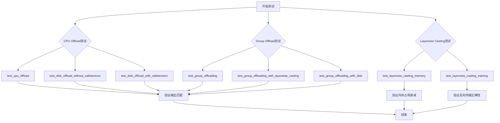

## 类结构

```
Object (Python内置)
├── function (全局函数)
│   ├── require_offload_support (装饰器)
│   └── require_group_offload_support (装饰器)
├── CPUOffloadTesterMixin (测试mixin类)
├── GroupOffloadTesterMixin (测试mixin类)
├── LayerwiseCastingTesterMixin (测试mixin类)
└── MemoryTesterMixin (综合测试mixin类)
    └── 继承自: CPUOffloadTesterMixin, GroupOffloadTesterMixin, LayerwiseCastingTesterMixin
```

## 全局变量及字段


### `MB_TOLERANCE`
    
内存测试中允许的MB容差，用于处理小模型测试中的浮点误差

类型：`float`
    


### `LEAST_COMPUTE_CAPABILITY`
    
GPU最小计算能力要求，用于条件检查 bf16 内存优化测试是否在支持的GPU上运行

类型：`float`
    


### `CPUOffloadTesterMixin.model_split_percents`
    
模型跨设备分割的百分比列表，用于卸载测试

类型：`list[float]`
    
    

## 全局函数及方法


### `require_offload_support`

这是一个装饰器函数，用于在测试执行前检查模型类是否支持模型分片（offloading）功能。如果模型类未设置 `_no_split_modules` 属性，则跳过相应的测试。

参数：

- `func`：`Callable`，被装饰的原始测试函数

返回值：`Callable`，返回包装后的函数，该函数在执行前会检查模型是否支持 offloading

#### 流程图

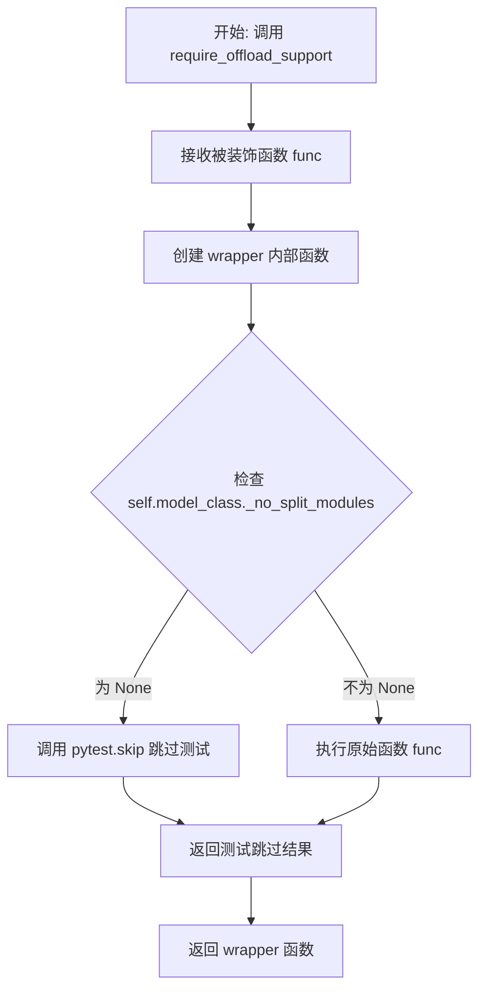

#### 带注释源码

```python
def require_offload_support(func):
    """
    Decorator to skip tests if model doesn't support offloading (requires _no_split_modules).
    """
    # 使用 @wraps 装饰器保留原函数元信息（函数名、文档字符串等）
    @wraps(func)
    def wrapper(self, *args, **kwargs):
        # 检查模型类是否设置了 _no_split_modules 属性
        # _no_split_modules 用于指定模型中哪些模块可以独立分片
        # 如果未设置（即为 None），则表示该模型不支持 offloading
        if self.model_class._no_split_modules is None:
            # 使用 pytest.skip 跳过测试，并提供清晰的跳过原因
            pytest.skip("Test not supported for this model as `_no_split_modules` is not set.")
        # 如果模型支持 offloading，则正常执行原测试函数
        return func(self, *args, **kwargs)

    # 返回包装后的函数
    return wrapper
```

#### 设计说明

该装饰器通常与测试类的实例方法配合使用，通过 `self.model_class` 访问模型类的静态属性 `_no_split_modules`。它是一种条件跳过机制，确保测试套件只在支持相应特性的模型上运行，避免因模型不支持某些高级特性（如模型分片卸载）而导致测试失败。这种设计符合 pytest 的最佳实践，提供了清晰的跳过原因和测试覆盖范围控制。


### `require_group_offload_support`

这是一个装饰器函数，用于在测试执行前检查模型类是否支持分组卸载（group offloading）功能。如果模型不支持分组卸载，则跳过该测试。

参数：

- `func`：`Callable`，需要被装饰的测试函数

返回值：`Callable`，包装后的函数，用于在执行前检查模型是否支持group offloading

#### 流程图

```mermaid
graph TD
    A[开始] --> B[接收被装饰函数func]
    B --> C[使用wraps装饰器包装func]
    C --> D[返回wrapper闭包函数]
    D --> E{测试方法被调用]
    E --> F{self.model_class._supports_group_offloading == True]
    F -->|否| G[pytest.skip 跳过测试]
    F -->|是| H[执行原函数func self args kwargs]
    G --> I[返回None 跳过测试]
    H --> J[返回函数执行结果]
```

#### 带注释源码

```python
def require_group_offload_support(func):
    """
    Decorator to skip tests if model doesn't support group offloading.
    """

    @wraps(func)  # 保留原函数元信息（名称、文档字符串等）
    def wrapper(self, *args, **kwargs):
        # 检查模型类是否支持group offloading功能
        if not self.model_class._supports_group_offloading:
            # 如果不支持，使用pytest跳过该测试
            pytest.skip("Model does not support group offloading.")
        # 支持则正常执行被装饰的测试函数
        return func(self, *args, **kwargs)

    return wrapper
```

#### 详细说明

该装饰器主要用途：

1. **功能检测**：通过检查 `self.model_class._supports_group_offloading` 属性来判断模型是否实现了group offloading功能
2. **条件跳过**：当模型不支持该功能时，使用 `pytest.skip()` 跳过测试而不是失败，提供更友好的测试体验
3. **函数封装**：使用 `@wraps` 装饰器保留原函数的元数据，确保pytest能够正确识别测试函数信息

#### 使用场景

此装饰器通常用于 `GroupOffloadTesterMixin` 类中的测试方法上，例如：

```python
@require_group_offload_support
@pytest.mark.parametrize("record_stream", [False, True])
def test_group_offloading(self, record_stream, atol=1e-5, rtol=0):
    # 测试逻辑...
```

这样可以确保只有支持group offloading的模型才会执行相关测试。


### `CPUOffloadTesterMixin.test_cpu_offload`

该方法用于测试模型的 CPU 卸载（CPU Offload）功能，通过将模型的不同部分加载到 GPU 和 CPU 上，验证模型在混合设备配置下能否正确运行并产生与纯 GPU 配置一致的输出。

参数：

- `self`：`CPUOffloadTesterMixin`，测试 mixin 类的实例，包含模型初始化和输入获取的方法
- `tmp_path`：`Path` 或 `str`，pytest 提供的临时目录路径，用于保存和加载模型
- `atol`：`float`，默认值 `1e-5`，用于比较输出张量时的绝对误差容限
- `rtol`：`float`，默认值 `0`，用于比较输出张量时的相对误差容限

返回值：`None`，该方法为测试方法，通过断言验证功能，不返回任何值

#### 流程图

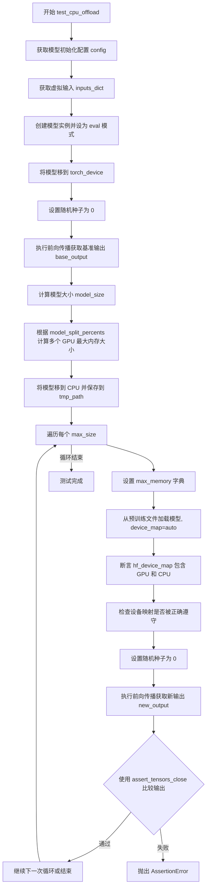

#### 带注释源码

```python
@require_offload_support  # 装饰器：检查模型是否支持 offloading（需要 _no_split_modules）
@torch.no_grad()  # 装饰器：禁用梯度计算以节省内存
def test_cpu_offload(self, tmp_path, atol=1e-5, rtol=0):
    """
    测试 CPU 卸载功能。
    
    该测试验证模型在部分加载到 GPU、部分保留在 CPU 的情况下，
    能否产生与完整加载到 GPU 时相同的输出结果。
    
    Args:
        tmp_path: pytest 提供的临时目录，用于保存/加载模型
        atol: 绝对误差容限，用于输出张量比较
        rtol: 相对误差容限，用于输出张量比较
    """
    # 获取模型初始化字典（由子类提供）
    config = self.get_init_dict()
    
    # 获取虚拟输入（由子类提供）
    inputs_dict = self.get_dummy_inputs()
    
    # 创建模型实例并设置为评估模式
    model = self.model_class(**config).eval()
    
    # 将模型移动到指定的计算设备（通常是 CUDA 设备）
    model = model.to(torch_device)
    
    # 设置随机种子以确保可重复性
    torch.manual_seed(0)
    
    # 执行基准前向传播，保存输出用于后续比较
    base_output = model(**inputs_dict)
    
    # 计算模型的总体大小（以字节为单位）
    model_size = compute_module_sizes(model)[""]
    
    # 根据 model_split_percents 计算多个 GPU 内存上限
    # 默认百分比为 [0.5, 0.7]，即分别测试 50% 和 70% GPU 内存的情况
    max_gpu_sizes = [int(p * model_size) for p in self.model_split_percents]
    
    # 将模型移回 CPU 并保存到临时目录
    model.cpu().save_pretrained(str(tmp_path))
    
    # 遍历每个 GPU 内存大小配置进行测试
    for max_size in max_gpu_sizes:
        # 设置内存分配策略：GPU 使用 max_size，CPU 使用 model_size * 2
        max_memory = {0: max_size, "cpu": model_size * 2}
        
        # 从保存的预训练模型加载，启用自动设备映射
        new_model = self.model_class.from_pretrained(
            str(tmp_path), 
            device_map="auto", 
            max_memory=max_memory
        )
        
        # 断言验证模型确实被分散在 GPU 和 CPU 之间
        assert set(new_model.hf_device_map.values()) == {0, "cpu"}, \
            "Model should be split between GPU and CPU"
        
        # 检查设备映射是否被模型正确遵守（即每层都在正确的设备上）
        check_device_map_is_respected(new_model, new_model.hf_device_map)
        
        # 重新设置随机种子以确保输入一致性
        torch.manual_seed(0)
        
        # 执行前向传播获取卸载后的输出
        new_output = new_model(**inputs_dict)
        
        # 验证输出与基准输出匹配（在指定的误差容限内）
        assert_tensors_close(
            base_output[0], 
            new_output[0], 
            atol=atol, 
            rtol=rtol, 
            msg="Output should match with CPU offloading"
        )
```


### `CPUOffloadTesterMixin.test_disk_offload_without_safetensors`

该方法用于测试模型在不使用 safetensors 序列化方式时的磁盘卸载功能，验证模型在CPU内存不足时能否正确地将部分权重卸载到磁盘，并且在磁盘卸载情况下输出结果与基线输出一致。

参数：

- `tmp_path`：`pytest.TempPathFactory`（或 `pathlib.Path`），pytest fixture，提供临时目录用于保存和加载模型
- `atol`：`float`，绝对误差容限，默认为 `1e-5`，用于比较输出张量时的绝对误差范围
- `rtol`：`float`，相对误差容限，默认为 `0`，用于比较输出张量时的相对误差范围

返回值：`None`，该方法为测试方法，无返回值，通过断言验证功能正确性

#### 流程图

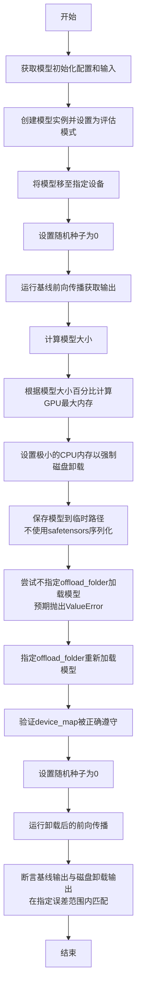

#### 带注释源码

```python
@require_offload_support
@torch.no_grad()
def test_disk_offload_without_safetensors(self, tmp_path, atol=1e-5, rtol=0):
    """
    测试不使用safetensors序列化时的磁盘卸载功能。
    
    该测试验证当模型太大无法完全加载到CPU内存时，
    能够将部分权重卸载到磁盘，并且在磁盘卸载情况下
    输出结果与基线输出一致。
    
    参数:
        tmp_path: pytest临时目录fixture，用于保存和加载模型
        atol: 绝对误差容限，默认1e-5
        rtol: 相对误差容限，默认0
    """
    # 获取模型初始化参数字典
    config = self.get_init_dict()
    # 获取模型输入
    inputs_dict = self.get_dummy_inputs()
    # 创建模型实例并设置为评估模式
    model = self.model_class(**config).eval()
    
    # 将模型移至指定的计算设备（如CUDA设备）
    model = model.to(torch_device)
    
    # 设置随机种子以确保可重复性
    torch.manual_seed(0)
    # 运行基线前向传播，保存输出用于后续比较
    base_output = model(**inputs_dict)
    
    # 计算模型的参数量大小（以字节为单位）
    model_size = compute_module_sizes(model)[""]
    # 根据配置的分割百分比计算GPU最大内存
    max_size = int(self.model_split_percents[0] * model_size)
    
    # 设置极小的CPU内存（仅为GPU内存的10%）
    # 强制模型将大部分权重卸载到磁盘
    max_memory = {0: max_size, "cpu": int(0.1 * max_size)}
    
    # 保存模型到临时路径，不使用safetensors序列化
    # 这将使用传统的pytorch pickle格式保存
    model.cpu().save_pretrained(str(tmp_path), safe_serialization=False)
    
    # 尝试在没有指定offload_folder的情况下加载模型
    # 这应该会失败，因为磁盘卸载需要指定卸载目录
    with pytest.raises(ValueError):
        new_model = self.model_class.from_pretrained(
            str(tmp_path), 
            device_map="auto", 
            max_memory=max_memory
        )
    
    # 指定offload_folder后重新加载模型
    # 现在模型应该能够成功加载，并将部分权重卸载到磁盘
    new_model = self.model_class.from_pretrained(
        str(tmp_path), 
        device_map="auto", 
        max_memory=max_memory, 
        offload_folder=str(tmp_path)
    )
    
    # 验证设备映射是否被正确遵守
    # 确保模型的每一层都在正确的设备上
    check_device_map_is_respected(new_model, new_model.hf_device_map)
    
    # 重新设置随机种子以确保与基线运行时条件一致
    torch.manual_seed(0)
    # 运行磁盘卸载后的模型前向传播
    new_output = new_model(**inputs_dict)
    
    # 断言基线输出与磁盘卸载输出在容差范围内一致
    # 验证磁盘卸载不会影响模型的计算结果
    assert_tensors_close(
        base_output[0], 
        new_output[0], 
        atol=atol, 
        rtol=rtol, 
        msg="Output should match with disk offloading"
    )
```


### CPUOffloadTesterMixin.test_disk_offload_with_safetensors

该方法用于测试使用 safetensors 序列化格式将模型部分卸载到磁盘的功能，验证磁盘卸载后模型的输出与原始模型输出一致。

参数：

- `self`：隐含的 self 参数，表示测试类的实例
- `tmp_path`：Pytest 的临时路径 fixture (pytest.fixture)，用于存放临时模型文件的目录路径
- `atol`：float 类型，默认值 1e-5，绝对误差容限（Absolute Tolerance），用于比较输出张量的最大允许绝对误差
- `rtol`：float 类型，默认值 0，相对误差容限（Relative Tolerance），用于比较输出张量的最大允许相对误差

返回值：`None`，该方法为测试方法，无返回值，通过断言验证正确性

#### 流程图

```mermaid
flowchart TD
    A[开始测试] --> B[获取模型初始化配置字典: config = self.get_init_dict]
    B --> C[获取模型虚拟输入: inputs_dict = self.get_dummy_inputs]
    C --> D[创建并评估模型: model = self.model_class\*\*config.eval]
    D --> E[将模型移至目标设备: model.to torch_device]
    E --> F[设置随机种子0并执行前向传播: base_output = model\*\*inputs_dict]
    F --> G[计算模型大小: model_size = compute_module_sizes model]
    G --> H[将模型移至CPU并保存到临时路径: model.cpu.save_pretrained tmp_path]
    H --> I[计算GPU最大内存: max_size = model_split_percents[0] \* model_size]
    I --> J[设置内存限制: max_memory = {0: max_size, cpu: max_size}]
    J --> K[从预训练模型加载并配置磁盘卸载: from_pretrained device_map=auto offload_folder=tmp_path]
    K --> L[验证设备映射是否被正确遵守: check_device_map_is_respected]
    L --> M[设置随机种子0并执行前向传播: new_output = model\*\*inputs_dict]
    M --> N{比较输出是否一致}
    N -->|通过| O[测试通过]
    N -->|失败| P[抛出断言错误]
```

#### 带注释源码

```python
@require_offload_support
@torch.no_grad()
def test_disk_offload_with_safetensors(self, tmp_path, atol=1e-5, rtol=0):
    """
    测试使用 safetensors 序列化格式进行磁盘卸载的功能。
    
    该测试会：
    1. 创建模型并获取基准输出
    2. 将模型保存为 safetensors 格式
    3. 使用磁盘卸载方式重新加载模型
    4. 验证磁盘卸载后的输出与基准输出是否一致
    """
    
    # Step 1: 获取模型初始化配置字典（从子类混入获取）
    config = self.get_init_dict()
    
    # Step 2: 获取模型的虚拟输入（用于前向传播测试）
    inputs_dict = self.get_dummy_inputs()
    
    # Step 3: 使用配置创建模型并设置为评估模式
    model = self.model_class(**config).eval()

    # Step 4: 将模型移至目标设备（CPU/CUDA）
    model = model.to(torch_device)

    # Step 5: 设置随机种子保证可复现性，执行前向传播获取基准输出
    torch.manual_seed(0)
    base_output = model(**inputs_dict)

    # Step 6: 计算模型的参数字节大小
    model_size = compute_module_sizes(model)[""]

    # Step 7: 将模型移至CPU并使用默认的safetensors格式保存到临时目录
    model.cpu().save_pretrained(str(tmp_path))

    # Step 8: 根据配置的第一个分割百分比计算GPU最大内存
    max_size = int(self.model_split_percents[0] * model_size)
    
    # Step 9: 设置内存限制，GPU和CPU各分配max_size字节
    # 这会强制部分模型层卸载到磁盘
    max_memory = {0: max_size, "cpu": max_size}
    
    # Step 10: 从预训练路径加载模型，配置device_map和offload_folder实现磁盘卸载
    new_model = self.model_class.from_pretrained(
        str(tmp_path), 
        device_map="auto",           # 自动设备映射
        offload_folder=str(tmp_path), # 磁盘卸载目录
        max_memory=max_memory        # 内存限制
    )

    # Step 11: 验证设备映射是否被正确遵守（每个层都在指定的设备上）
    check_device_map_is_respected(new_model, new_model.hf_device_map)
    
    # Step 12: 使用相同随机种子执行前向传播，获取磁盘卸载后的输出
    torch.manual_seed(0)
    new_output = new_model(**inputs_dict)

    # Step 13: 使用断言比较基准输出和磁盘卸载后的输出
    # 允许指定的绝对误差(atol)和相对误差(rtol)
    assert_tensors_close(
        base_output[0],
        new_output[0],
        atol=atol,
        rtol=rtol,
        msg="Output should match with disk offloading (safetensors)",
    )
```


### `GroupOffloadTesterMixin.test_group_offloading`

该方法用于测试模型的 group offloading（组卸载）功能，验证在启用不同级别（block_level 和 leaf_level）的组卸载后，模型的输出结果与未启用卸载时保持一致，并支持非阻塞模式和数据流记录等配置选项。

**参数：**

- `self`：`GroupOffloadTesterMixin`，mixin 类实例，隐式参数
- `record_stream`：`bool`，是否在 offloading 过程中记录 CUDA stream，用于测试数据流一致性
- `atol`：`float`，绝对误差容忍度，默认 `1e-5`，用于浮点数比较
- `rtol`：`float`，相对误差容忍度，默认 `0`，用于浮点数比较

**返回值：** `None`，该方法通过断言验证输出一致性，不返回具体值

#### 流程图

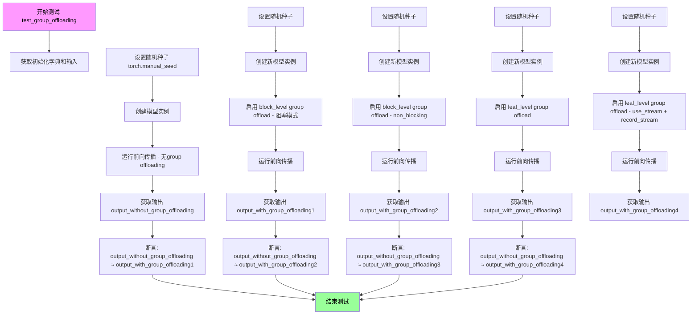

#### 带注释源码

```python
@require_group_offload_support  # 装饰器：检查模型是否支持 group offloading
@pytest.mark.parametrize("record_stream", [False, True])  # 参数化：测试是否记录 stream
def test_group_offloading(self, record_stream, atol=1e-5, rtol=0):
    """
    测试 group offloading 功能的测试方法
    
    测试场景：
    1. 不使用 group offloading 的基准输出
    2. block_level offloading - 阻塞模式
    3. block_level offloading - 非阻塞模式
    4. leaf_level offloading
    5. leaf_level offloading + use_stream + record_stream
    """
    # 获取模型初始化参数和测试输入
    init_dict = self.get_init_dict()
    inputs_dict = self.get_dummy_inputs()
    torch.manual_seed(0)  # 设置随机种子确保可复现性

    @torch.no_grad()  # 装饰器：禁用梯度计算以节省内存
    def run_forward(model):
        """内部函数：运行模型前向传播并验证 hook 已设置"""
        # 验证模型所有模块都正确设置了 group_offloading hook
        assert all(
            module._diffusers_hook.get_hook("group_offloading") is not None
            for module in model.modules()
            if hasattr(module, "_diffusers_hook")
        ), "Group offloading hook should be set"
        model.eval()  # 设置为评估模式
        return model(**inputs_dict)[0]  # 执行前向传播，返回第一个输出

    # ========== 场景1: 不使用 group offloading ==========
    model = self.model_class(**init_dict)
    model.to(torch_device)
    output_without_group_offloading = run_forward(model)

    # ========== 场景2: block_level offloading - 阻塞模式 ==========
    torch.manual_seed(0)  # 每次重置随机种子确保输入一致
    model = self.model_class(**init_dict)
    # 启用 block 级别的 group offloading，每组 1 个 block
    model.enable_group_offload(torch_device, offload_type="block_level", num_blocks_per_group=1)
    output_with_group_offloading1 = run_forward(model)

    # ========== 场景3: block_level offloading - 非阻塞模式 ==========
    torch.manual_seed(0)
    model = self.model_class(**init_dict)
    # 启用非阻塞模式的 block_level offloading
    model.enable_group_offload(torch_device, offload_type="block_level", num_blocks_per_group=1, non_blocking=True)
    output_with_group_offloading2 = run_forward(model)

    # ========== 场景4: leaf_level offloading ==========
    torch.manual_seed(0)
    model = self.model_class(**init_dict)
    # 启用 leaf 级别的 group offloading
    model.enable_group_offload(torch_device, offload_type="leaf_level")
    output_with_group_offloading3 = run_forward(model)

    # ========== 场景5: leaf_level offloading + use_stream + record_stream ==========
    torch.manual_seed(0)
    model = self.model_class(**init_dict)
    # 启用 leaf_level offloading，启用 stream 并记录 stream 状态
    model.enable_group_offload(
        torch_device, offload_type="leaf_level", use_stream=True, record_stream=record_stream
    )
    output_with_group_offloading4 = run_forward(model)

    # ========== 验证所有场景输出与基准一致 ==========
    # 使用 assert_tensors_close 比较输出，允许绝对误差 atol 和相对误差 rtol
    assert_tensors_close(
        output_without_group_offloading,
        output_with_group_offloading1,
        atol=atol,
        rtol=rtol,
        msg="Output should match with block-level offloading",
    )
    assert_tensors_close(
        output_without_group_offloading,
        output_with_group_offloading2,
        atol=atol,
        rtol=rtol,
        msg="Output should match with non-blocking block-level offloading",
    )
    assert_tensors_close(
        output_without_group_offloading,
        output_with_group_offloading3,
        atol=atol,
        rtol=rtol,
        msg="Output should match with leaf-level offloading",
    )
    assert_tensors_close(
        output_without_group_offloading,
        output_with_group_offloading4,
        atol=atol,
        rtol=rtol,
        msg="Output should match with leaf-level offloading with stream",
    )
```


### `GroupOffloadTesterMixin.test_group_offloading_with_layerwise_casting`

该方法用于测试模型在启用分组卸载（group offloading）的同时进行层级类型转换（layerwise casting）的功能，验证不同卸载类型（block_level/leaf_level）和流处理选项下的数值正确性。

参数：

- `record_stream`：`bool`，是否记录 CUDA 流，用于测试异步内存操作
- `offload_type`：`str`，分组卸载类型，可选值为 `"block_level"`（块级卸载）或 `"leaf_level"`（叶级卸载）

返回值：`None`，该方法为测试方法，通过断言验证输出张量的数值一致性

#### 流程图

```mermaid
flowchart TD
    A[开始测试] --> B[设置随机种子 torch.manual_seed]
    B --> C[获取模型初始化参数 init_dict]
    C --> D[获取dummy输入 inputs_dict]
    D --> E[创建模型实例 model]
    E --> F[将模型移至目标设备 model.to]
    F --> G[设置模型为评估模式 model.eval]
    G --> H[执行前向传播获取基准输出]
    
    I[重新设置随机种子] --> J[重新获取init_dict和inputs_dict]
    J --> K[设置storage_dtype=float16, compute_dtype=float32]
    K --> L[将输入转换为指定dtype]
    L --> M[创建新模型实例]
    M --> N[设置模型为评估模式]
    N --> O{判断offload_type}
    
    O -->|leaf_level| P[additional_kwargs = {}]
    O -->|block_level| Q[additional_kwargs = {num_blocks_per_group: 1}]
    
    P --> R[启用分组卸载 enable_group_offload]
    Q --> R
    
    R --> S[启用层级类型转换 enable_layerwise_casting]
    S --> T[执行前向传播]
    T --> U[测试完成, 无返回值]
```

#### 带注释源码

```python
@require_group_offload_support  # 装饰器：检查模型是否支持分组卸载
@pytest.mark.parametrize("record_stream", [False, True])  # 参数化：是否记录CUDA流
@pytest.mark.parametrize("offload_type", ["block_level", "leaf_level"])  # 参数化：卸载类型
@torch.no_grad()  # 上下文管理器：禁用梯度计算
def test_group_offloading_with_layerwise_casting(self, record_stream, offload_type):
    """
    测试分组卸载与层级类型转换的兼容性
    
    参数:
        record_stream: bool, 是否记录CUDA流用于异步操作测试
        offload_type: str, 分组卸载类型 ("block_level" 或 "leaf_level")
    """
    # 第一部分：建立基准输出（不使用分组卸载和层级转换）
    torch.manual_seed(0)  # 设置随机种子确保可复现性
    init_dict = self.get_init_dict()  # 获取模型初始化参数字典
    inputs_dict = self.get_dummy_inputs()  # 获取测试用dummy输入
    model = self.model_class(**init_dict)  # 创建模型实例

    model.to(torch_device)  # 将模型移至目标设备（GPU/CPU）
    model.eval()  # 设置为评估模式，禁用dropout等训练层
    _ = model(**inputs_dict)[0]  # 执行前向传播预热，丢弃输出

    # 第二部分：测试分组卸载 + 层级类型转换
    torch.manual_seed(0)  # 重新设置随机种子
    init_dict = self.get_init_dict()  # 重新获取初始化参数
    inputs_dict = self.get_dummy_inputs()  # 重新获取输入
    
    # 定义数据类型：storage_dtype用于存储，compute_dtype用于计算
    storage_dtype, compute_dtype = torch.float16, torch.float32
    # 将输入转换为计算数据类型
    inputs_dict = cast_inputs_to_dtype(inputs_dict, torch.float32, compute_dtype)
    
    # 创建新模型实例用于测试
    model = self.model_class(**init_dict)
    model.eval()  # 评估模式
    
    # 根据卸载类型设置额外参数
    # leaf_level: 无需指定num_blocks_per_group
    # block_level: 需要指定num_blocks_per_group=1
    additional_kwargs = {} if offload_type == "leaf_level" else {"num_blocks_per_group": 1}
    
    # 启用分组卸载功能
    model.enable_group_offload(
        torch_device,  # 目标设备
        offload_type=offload_type,  # 卸载类型
        use_stream=True,  # 使用CUDA流进行异步操作
        record_stream=record_stream,  # 是否记录流
        **additional_kwargs  # 额外参数
    )
    
    # 启用层级类型转换（存储和计算使用不同精度）
    model.enable_layerwise_casting(
        storage_dtype=storage_dtype,  # 存储精度：float16
        compute_dtype=compute_dtype   # 计算精度：float32
    )
    
    # 执行前向传播，测试组合功能
    # 注意：此测试方法不验证输出正确性，仅验证运行不报错
    _ = model(**inputs_dict)[0]
```


### `GroupOffloadTesterMixin.test_group_offloading_with_disk`

测试模型在使用 group offload 功能时将权重卸载到磁盘的功能是否正常工作。该测试通过比较启用磁盘 offload 前后模型的输出是否一致来验证实现的正确性。

参数：

- `self`：`GroupOffloadTesterMixin`，测试类的实例
- `tmp_path`：`pytest.fixture(Path)`，pytest 提供的临时目录，用于存储 offload 到磁盘的模型权重文件
- `record_stream`：`bool`，是否记录 stream（参数化：False, True）
- `offload_type`：`str`，offload 类型（参数化："block_level", "leaf_level"）
- `atol`：`float = 1e-5`，绝对容差，用于张量比较
- `rtol`：`float = 0`，相对容差，用于张量比较

返回值：`None`，测试方法无显式返回值

#### 流程图

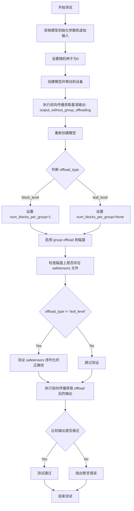

#### 带注释源码

```python
@require_group_offload_support
@pytest.mark.parametrize("record_stream", [False, True])
@pytest.mark.parametrize("offload_type", ["block_level", "leaf_level"])
@torch.no_grad()
@torch.inference_mode()
def test_group_offloading_with_disk(self, tmp_path, record_stream, offload_type, atol=1e-5, rtol=0):
    """
    测试模型在使用 group offload 功能时将权重卸载到磁盘的功能是否正常工作。
    
    测试步骤：
    1. 创建模型并获取基准输出（不使用 offload）
    2. 启用 group offload 到磁盘
    3. 验证磁盘上存在 safetensors 文件
    4. 验证 safetensors 序列化的正确性（仅对 block_level）
    5. 获取 offload 后的输出并与基准比较
    """
    
    def _has_generator_arg(model):
        """检查模型 forward 方法是否接受 generator 参数"""
        sig = inspect.signature(model.forward)
        params = sig.parameters
        return "generator" in params

    def _run_forward(model, inputs_dict):
        """
        运行模型前向传播
        
        参数:
            model: 要运行的模型
            inputs_dict: 输入字典
            
        返回:
            模型输出的第一个元素
        """
        accepts_generator = _has_generator_arg(model)
        if accepts_generator:
            inputs_dict["generator"] = torch.manual_seed(0)
        torch.manual_seed(0)
        return model(**inputs_dict)[0]

    # 获取模型初始化参数和虚拟输入
    init_dict = self.get_init_dict()
    inputs_dict = self.get_dummy_inputs()
    torch.manual_seed(0)
    
    # 创建模型并移动到设备
    model = self.model_class(**init_dict)
    model.eval()
    model.to(torch_device)
    
    # 获取没有 group offloading 时的基准输出
    output_without_group_offloading = _run_forward(model, inputs_dict)

    torch.manual_seed(0)
    model = self.model_class(**init_dict)
    model.eval()

    # 根据 offload_type 设置 num_blocks_per_group
    # block_level: 需要指定 num_blocks_per_group
    # leaf_level: num_blocks_per_group 为 None
    num_blocks_per_group = None if offload_type == "leaf_level" else 1
    additional_kwargs = {} if offload_type == "leaf_level" else {"num_blocks_per_group": num_blocks_per_group}
    
    # 临时目录路径
    tmpdir = str(tmp_path)
    
    # 启用 group offload 到磁盘
    model.enable_group_offload(
        torch_device,
        offload_type=offload_type,
        offload_to_disk_path=tmpdir,  # 指定磁盘卸载路径
        use_stream=True,
        record_stream=record_stream,
        **additional_kwargs,
    )
    
    # 检查磁盘上是否存在 safetensors 文件
    has_safetensors = glob.glob(f"{tmpdir}/*.safetensors")
    assert has_safetensors, "No safetensors found in the directory."

    # 对于 "leaf-level"，存在预取钩子使检查具有非确定性，因此跳过验证
    if offload_type != "leaf_level":
        is_correct, extra_files, missing_files = _check_safetensors_serialization(
            module=model,
            offload_to_disk_path=tmpdir,
            offload_type=offload_type,
            num_blocks_per_group=num_blocks_per_group,
        )
        if not is_correct:
            if extra_files:
                raise ValueError(f"Found extra files: {', '.join(extra_files)}")
            elif missing_files:
                raise ValueError(f"Following files are missing: {', '.join(missing_files)}")

    # 获取启用 group offloading 后的输出
    output_with_group_offloading = _run_forward(model, inputs_dict)
    
    # 断言输出匹配
    assert_tensors_close(
        output_without_group_offloading,
        output_with_group_offloading,
        atol=atol,
        rtol=rtol,
        msg="Output should match with disk-based group offloading",
    )
```


### `LayerwiseCastingTesterMixin.test_layerwise_casting_memory`

该方法用于测试逐层数据类型转换（Layerwise Casting）的内存优化效果，通过比较不同存储精度（fp32、fp8_e4m3）和计算精度（fp32、bf16）组合下的内存占用情况，验证内存优化策略的有效性。

参数：
- 无显式参数（除 `self` 隐式参数）

返回值：`None`，该方法通过断言验证内存占用是否符合预期，不返回具体值。

#### 流程图

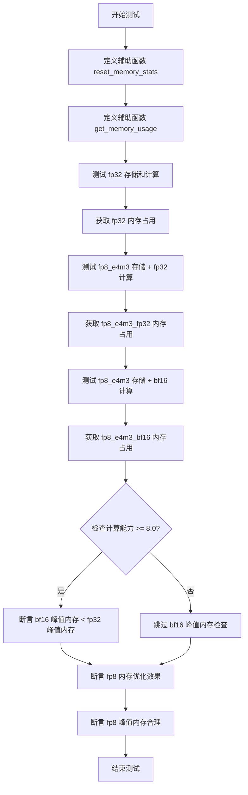

#### 带注释源码

```python
@torch.no_grad()
def test_layerwise_casting_memory(self):
    """
    测试逐层类型转换的内存优化效果。
    
    该测试通过比较不同数据类型组合下的内存占用来验证：
    1. fp32（基准）
    2. fp8_e4m3 存储 + fp32 计算
    3. fp8_e4m3 存储 + bf16 计算
    
    预期结果：内存占用应按照 fp32 > fp8_e4m3_fp32 > fp8_e4m3_bf16 的顺序递减。
    """
    # 允许的内存容差（MB），用于处理小模型中的微小差异
    MB_TOLERANCE = 0.2
    # 最低计算能力要求（用于 bf16 优化检查）
    LEAST_COMPUTE_CAPABILITY = 8.0

    def reset_memory_stats():
        """
        重置内存统计状态。
        
        执行垃圾回收、同步设备、清空缓存并重置峰值内存统计，
        确保每次测试时内存测量从干净状态开始。
        """
        gc.collect()
        backend_synchronize(torch_device)
        backend_empty_cache(torch_device)
        backend_reset_peak_memory_stats(torch_device)

    def get_memory_usage(storage_dtype, compute_dtype):
        """
        获取特定数据类型组合下的内存占用。
        
        参数:
            storage_dtype: 存储数据类型（如 torch.float32, torch.float8_e4m3fn）
            compute_dtype: 计算数据类型（如 torch.float32, torch.bfloat16）
        
        返回:
            tuple: (模型内存占用, 峰值推理内存占用 MB)
        """
        torch.manual_seed(0)
        # 获取模型配置和虚拟输入
        config = self.get_init_dict()
        inputs_dict = self.get_dummy_inputs()
        # 将输入转换为计算精度
        inputs_dict = cast_inputs_to_dtype(inputs_dict, torch.float32, compute_dtype)
        
        # 创建并配置模型
        model = self.model_class(**config).eval()
        model = model.to(torch_device, dtype=compute_dtype)
        # 启用逐层类型转换
        model.enable_layerwise_casting(storage_dtype=storage_dtype, compute_dtype=compute_dtype)

        # 重置内存统计并执行推理
        reset_memory_stats()
        model(**inputs_dict)
        # 获取内存占用指标
        model_memory_footprint = model.get_memory_footprint()
        peak_inference_memory_allocated_mb = backend_max_memory_allocated(torch_device) / 1024**2

        return model_memory_footprint, peak_inference_memory_allocated_mb

    # 测试三种数据类型组合的内存占用
    fp32_memory_footprint, fp32_max_memory = get_memory_usage(torch.float32, torch.float32)
    fp8_e4m3_fp32_memory_footprint, fp8_e4m3_fp32_max_memory = get_memory_usage(torch.float8_e4m3fn, torch.float32)
    fp8_e4m3_bf16_memory_footprint, fp8_e4m3_bf16_max_memory = get_memory_usage(
        torch.float8_e4m3fn, torch.bfloat16
    )

    # 获取设备计算能力（仅 CUDA 设备）
    compute_capability = get_torch_cuda_device_capability() if torch_device == "cuda" else None
    
    # 断言：内存占用应随存储精度降低而减少
    assert fp8_e4m3_bf16_memory_footprint < fp8_e4m3_fp32_memory_footprint < fp32_memory_footprint, (
        "Memory footprint should decrease with lower precision storage"
    )

    # 仅在支持足够计算能力的 GPU 上检查 bf16 峰值内存
    # 注意：Tesla T4 (compute capability 7.5) 上 bf16 会使用更多内存
    if compute_capability and compute_capability >= LEAST_COMPUTE_CAPABILITY:
        assert fp8_e4m3_bf16_max_memory < fp8_e4m3_fp32_max_memory, (
            "Peak memory should be lower with bf16 compute on newer GPUs"
        )

    # 断言：fp8 峰值内存应低于 fp32 或在容差范围内
    # 对于小模型，fp8_e4m3_fp32 有时可能比 fp32 高出几字节
    assert (
        fp8_e4m3_fp32_max_memory < fp32_max_memory
        or abs(fp8_e4m3_fp32_max_memory - fp32_max_memory) < MB_TOLERANCE
    ), "Peak memory should be lower or within tolerance with fp8 storage"
```


### `LayerwiseCastingTesterMixin.test_layerwise_casting_training`

该方法是一个测试函数，用于验证模型在训练模式下使用分层类型转换（layerwise casting）的功能。它通过多种存储精度（float16、float8_e4m3fn、float8_e5m2）和计算精度（float32、bfloat16）组合来测试模型的训练过程，确保梯度反向传播正确执行。

参数：

- `self`：`LayerwiseCastingTesterMixin` 实例，隐式参数，测试类的实例本身

返回值：`None`，无返回值（测试方法）

#### 流程图

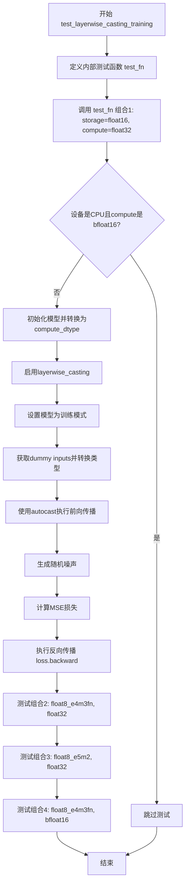

#### 带注释源码

```python
def test_layerwise_casting_training(self):
    """
    测试模型在训练模式下使用分层类型转换的功能。
    验证不同存储精度和计算精度组合下的前向传播和反向传播。
    """
    
    def test_fn(storage_dtype, compute_dtype):
        """
        内部测试函数，用于测试特定的存储/计算精度组合。
        
        参数:
            storage_dtype: 模型参数的存储精度（如torch.float16, torch.float8_e4m3fn等）
            compute_dtype: 模型计算时使用的精度（如torch.float32, torch.bfloat16）
        """
        
        # 如果设备是CPU且计算精度是bfloat16，则跳过测试（CPU不支持bfloat16）
        if torch.device(torch_device).type == "cpu" and compute_dtype == torch.bfloat16:
            pytest.skip("Skipping test because CPU doesn't go well with bfloat16.")

        # 使用配置初始化模型，并将其移动到指定设备，使用compute_dtype
        model = self.model_class(**self.get_init_dict())
        model = model.to(torch_device, dtype=compute_dtype)
        
        # 启用分层类型转换功能
        # storage_dtype: 用于存储模型参数的精度
        # compute_dtype: 用于计算的精度
        model.enable_layerwise_casting(storage_dtype=storage_dtype, compute_dtype=compute_dtype)
        
        # 设置模型为训练模式，启用dropout和batch normalization的训练行为
        model.train()

        # 获取模型的dummy inputs
        inputs_dict = self.get_dummy_inputs()
        
        # 将输入数据转换为compute_dtype
        inputs_dict = cast_inputs_to_dtype(inputs_dict, torch.float32, compute_dtype)
        
        # 使用自动混合精度（autocast）进行前向传播
        # 根据设备类型选择对应的autocast后端
        with torch.amp.autocast(device_type=torch.device(torch_device).type):
            # 执行前向传播，return_dict=False返回tuple
            output = model(**inputs_dict, return_dict=False)[0]

            # 获取主输入张量
            input_tensor = inputs_dict[self.main_input_name]
            
            # 生成与输出形状相同的随机噪声
            noise = torch.randn((input_tensor.shape[0],) + self.output_shape).to(torch_device)
            
            # 将噪声转换为compute_dtype
            noise = cast_inputs_to_dtype(noise, torch.float32, compute_dtype)
            
            # 计算输出与噪声之间的MSE损失
            loss = torch.nn.functional.mse_loss(output, noise)

        # 执行反向传播，计算梯度
        loss.backward()

    # 测试多种存储精度和计算精度的组合
    
    # 组合1: 存储精度float16, 计算精度float32
    test_fn(torch.float16, torch.float32)
    
    # 组合2: 存储精度float8_e4m3fn, 计算精度float32
    test_fn(torch.float8_e4m3fn, torch.float32)
    
    # 组合3: 存储精度float8_e5m2, 计算精度float32
    test_fn(torch.float8_e5m2, torch.float32)
    
    # 组合4: 存储精度float8_e4m3fn, 计算精度bfloat16
    test_fn(torch.float8_e4m3fn, torch.bfloat16)
```


### CPUOffloadTesterMixin.test_cpu_offload

测试模型在使用 CPU offloading 时的功能正确性，通过将模型分片加载到 GPU 和 CPU 上，验证输出结果与基准输出一致。

参数：

- `tmp_path`：`py.path.local`（pytest fixture），用于存储临时模型文件的路径
- `atol`：`float`，绝对误差容限，默认为 1e-5
- `rtol`：`float`，相对误差容限，默认为 0

返回值：`None`，该方法为测试方法，通过断言验证输出正确性

#### 流程图

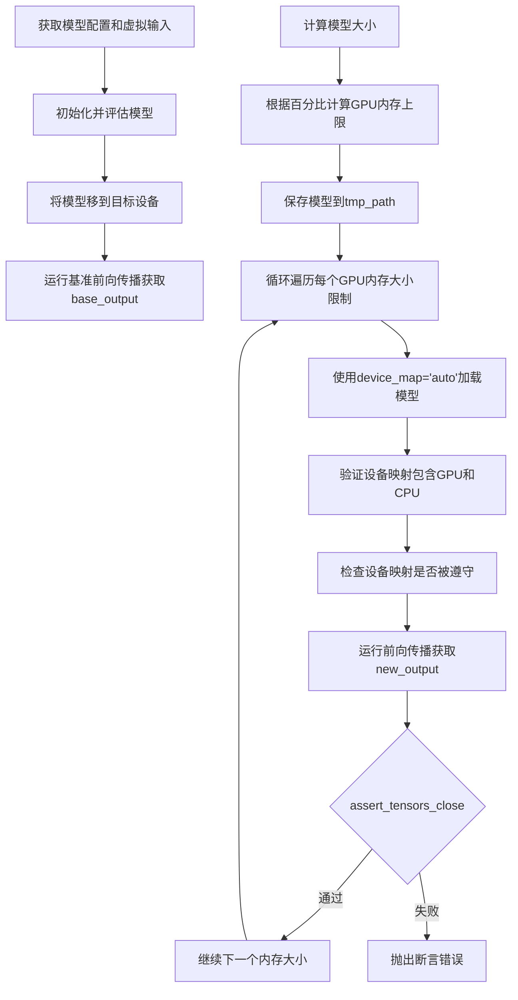

#### 带注释源码

```python
@require_offload_support
@torch.no_grad()
def test_cpu_offload(self, tmp_path, atol=1e-5, rtol=0):
    # 获取模型初始化字典
    config = self.get_init_dict()
    # 获取模型虚拟输入
    inputs_dict = self.get_dummy_inputs()
    # 初始化模型并设置为评估模式
    model = self.model_class(**config).eval()
    # 将模型移到目标设备（如cuda）
    model = model.to(torch_device)
    # 设置随机种子确保可重复性
    torch.manual_seed(0)
    # 运行基准前向传播，保存输出用于后续比较
    base_output = model(**inputs_dict)
    # 计算模型的参数字节大小
    model_size = compute_module_sizes(model)[""]
    # 定义要测试的GPU内存大小百分比
    max_gpu_sizes = [int(p * model_size) for p in self.model_split_percents]
    # 将模型移回CPU并保存到临时目录
    model.cpu().save_pretrained(str(tmp_path))
    # 遍历每个GPU内存大小配置
    for max_size in max_gpu_sizes:
        # 设置内存限制：GPU 0有限制，CPU有2倍模型大小
        max_memory = {0: max_size, "cpu": model_size * 2}
        # 使用device_map自动分配设备加载模型
        new_model = self.model_class.from_pretrained(str(tmp_path), device_map="auto", max_memory=max_memory)
        # 验证模型确实被分片到GPU和CPU
        assert set(new_model.hf_device_map.values()) == {0, "cpu"}, "Model should be split between GPU and CPU"
        # 检查设备映射是否被正确遵守
        check_device_map_is_respected(new_model, new_model.hf_device_map)
        # 重新设置随机种子确保输入一致
        torch.manual_seed(0)
        # 运行带offloading的前向传播
        new_output = new_model(**inputs_dict)
        # 验证输出与基准输出一致
        assert_tensors_close(
            base_output[0], new_output[0], atol=atol, rtol=rtol, msg="Output should match with CPU offloading"
        )
```

---

### CPUOffloadTesterMixin.test_disk_offload_without_safetensors

测试模型使用非安全序列化格式进行磁盘 offloading 的功能，验证在磁盘空间受限时模型仍能正确运行。

参数：

- `tmp_path`：`py.path.local`（pytest fixture），用于存储临时模型文件和 offload 数据的路径
- `atol`：`float`，绝对误差容限，默认为 1e-5
- `rtol`：`float`，相对误差容限，默认为 0

返回值：`None`，该方法为测试方法，通过断言验证输出正确性

#### 流程图

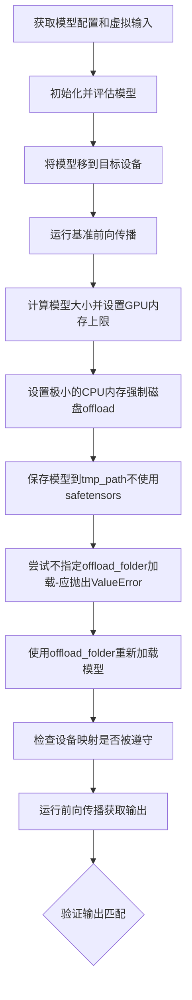

#### 带注释源码

```python
@require_offload_support
@torch.no_grad()
def test_disk_offload_without_safetensors(self, tmp_path, atol=1e-5, rtol=0):
    # 获取配置和输入
    config = self.get_init_dict()
    inputs_dict = self.get_dummy_inputs()
    model = self.model_class(**config).eval()
    model = model.to(torch_device)
    
    # 设置种子并运行基准输出
    torch.manual_seed(0)
    base_output = model(**inputs_dict)
    
    # 计算模型大小
    model_size = compute_module_sizes(model)[""]
    # 计算GPU内存上限（第一个百分比）
    max_size = int(self.model_split_percents[0] * model_size)
    # 设置非常小的CPU内存以强制磁盘卸载
    max_memory = {0: max_size, "cpu": int(0.1 * max_size)}
    
    # 保存模型到磁盘，不使用safetensors序列化
    model.cpu().save_pretrained(str(tmp_path), safe_serialization=False)
    
    # 尝试加载模型但未指定offload_folder，应该抛出ValueError
    with pytest.raises(ValueError):
        new_model = self.model_class.from_pretrained(str(tmp_path), device_map="auto", max_memory=max_memory)
    
    # 正确加载模型，指定offload_folder用于磁盘卸载
    new_model = self.model_class.from_pretrained(
        str(tmp_path), device_map="auto", max_memory=max_memory, offload_folder=str(tmp_path)
    )
    
    # 验证设备映射被遵守
    check_device_map_is_respected(new_model, new_model.hf_device_map)
    torch.manual_seed(0)
    new_output = new_model(**inputs_dict)
    
    # 验证输出与基准匹配
    assert_tensors_close(
        base_output[0], new_output[0], atol=atol, rtol=rtol, msg="Output should match with disk offloading"
    )
```

---

### CPUOffloadTesterMixin.test_disk_offload_with_safetensors

测试模型使用安全序列化格式（safetensors）进行磁盘 offloading 的功能。

参数：

- `tmp_path`：`py.path.local`（pytest fixture），用于存储临时模型文件和 offload 数据的路径
- `atol`：`float`，绝对误差容限，默认为 1e-5
- `rtol`：`float`，相对误差容限，默认为 0

返回值：`None`，该方法为测试方法，通过断言验证输出正确性

#### 流程图

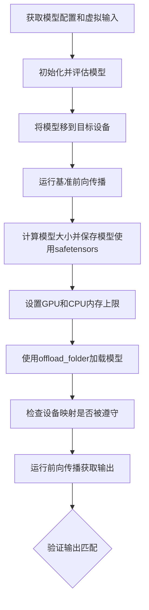

#### 带注释源码

```python
@require_offload_support
@torch.no_grad()
def test_disk_offload_with_safetensors(self, tmp_path, atol=1e-5, rtol=0):
    config = self.get_init_dict()
    inputs_dict = self.get_dummy_inputs()
    model = self.model_class(**config).eval()
    model = model.to(torch_device)
    
    torch.manual_seed(0)
    base_output = model(**inputs_dict)
    
    # 计算模型大小并保存模型（使用safetensors）
    model_size = compute_module_sizes(model)[""]
    model.cpu().save_pretrained(str(tmp_path))
    
    # 设置内存限制
    max_size = int(self.model_split_percents[0] * model_size)
    max_memory = {0: max_size, "cpu": max_size}
    
    # 使用safetensors和offload_folder加载模型
    new_model = self.model_class.from_pretrained(
        str(tmp_path), device_map="auto", offload_folder=str(tmp_path), max_memory=max_memory
    )
    
    # 验证设备映射
    check_device_map_is_respected(new_model, new_model.hf_device_map)
    torch.manual_seed(0)
    new_output = new_model(**inputs_dict)
    
    # 验证输出匹配
    assert_tensors_close(
        base_output[0],
        new_output[0],
        atol=atol,
        rtol=rtol,
        msg="Output should match with disk offloading (safetensors)",
    )
```

---

### GroupOffloadTesterMixin.test_group_offloading

测试模型的 group offloading 功能，包括 block-level 和 leaf-level 两种模式，以及阻塞和非阻塞模式。

参数：

- `record_stream`：`bool`，是否记录 CUDA stream，用于测试流管理
- `atol`：`float`，绝对误差容限，默认为 1e-5
- `rtol`：`float`，相对误差容限，默认为 0

返回值：`None`，该方法为测试方法，通过断言验证输出正确性

#### 流程图

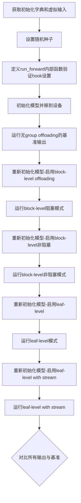

#### 带注释源码

```python
@require_group_offload_support
@pytest.mark.parametrize("record_stream", [False, True])
def test_group_offloading(self, record_stream, atol=1e-5, rtol=0):
    # 获取初始化参数和虚拟输入
    init_dict = self.get_init_dict()
    inputs_dict = self.get_dummy_inputs()
    torch.manual_seed(0)
    
    # 定义内部前向运行函数
    @torch.no_grad()
    def run_forward(model):
        # 验证group offloading hook已正确设置
        assert all(
            module._diffusers_hook.get_hook("group_offloading") is not None
            for module in model.modules()
            if hasattr(module, "_diffusers_hook")
        ), "Group offloading hook should be set"
        model.eval()
        return model(**inputs_dict)[0]
    
    # 测试1：无group offloading的基准
    model = self.model_class(**init_dict)
    model.to(torch_device)
    output_without_group_offloading = run_forward(model)
    
    # 测试2：block-level offloading（阻塞模式）
    torch.manual_seed(0)
    model = self.model_class(**init_dict)
    model.enable_group_offload(torch_device, offload_type="block_level", num_blocks_per_group=1)
    output_with_group_offloading1 = run_forward(model)
    
    # 测试3：block-level offloading（非阻塞模式）
    torch.manual_seed(0)
    model = self.model_class(**init_dict)
    model.enable_group_offload(torch_device, offload_type="block_level", num_blocks_per_group=1, non_blocking=True)
    output_with_group_offloading2 = run_forward(model)
    
    # 测试4：leaf-level offloading
    torch.manual_seed(0)
    model = self.model_class(**init_dict)
    model.enable_group_offload(torch_device, offload_type="leaf_level")
    output_with_group_offloading3 = run_forward(model)
    
    # 测试5：leaf-level offloading with stream
    torch.manual_seed(0)
    model = self.model_class(**init_dict)
    model.enable_group_offload(
        torch_device, offload_type="leaf_level", use_stream=True, record_stream=record_stream
    )
    output_with_group_offloading4 = run_forward(model)
    
    # 验证所有输出与基准匹配
    assert_tensors_close(output_without_group_offloading, output_with_group_offloading1, atol=atol, rtol=rtol, msg="Output should match with block-level offloading")
    assert_tensors_close(output_without_group_offloading, output_with_group_offloading2, atol=atol, rtol=rtol, msg="Output should match with non-blocking block-level offloading")
    assert_tensors_close(output_without_group_offloading, output_with_group_offloading3, atol=atol, rtol=rtol, msg="Output should match with leaf-level offloading")
    assert_tensors_close(output_without_group_offloading, output_with_group_offloading4, atol=atol, rtol=rtol, msg="Output should match with leaf-level offloading with stream")
```

---

### GroupOffloadTesterMixin.test_group_offloading_with_layerwise_casting

测试 group offloading 与 layerwise casting（层-wise 类型转换）结合使用的功能，验证两种内存优化技术可以同时工作。

参数：

- `record_stream`：`bool`，是否记录 CUDA stream
- `offload_type`：`str`，offloading 类型，可选值为 "block_level" 或 "leaf_level"

返回值：`None`，该方法为测试方法，通过断言验证功能正常

#### 流程图

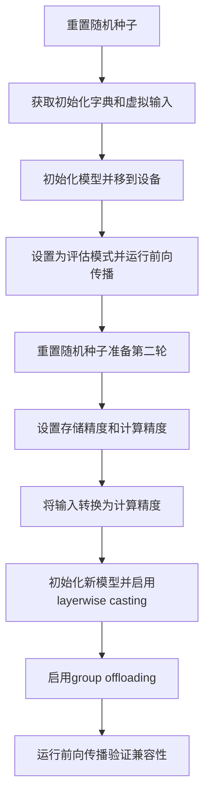

#### 带注释源码

```python
@require_group_offload_support
@pytest.mark.parametrize("record_stream", [False, True])
@pytest.mark.parametrize("offload_type", ["block_level", "leaf_level"])
@torch.no_grad()
def test_group_offloading_with_layerwise_casting(self, record_stream, offload_type):
    torch.manual_seed(0)
    init_dict = self.get_init_dict()
    inputs_dict = self.get_dummy_inputs()
    model = self.model_class(**init_dict)
    
    model.to(torch_device)
    model.eval()
    # 先运行一次确保模型正常
    _ = model(**inputs_dict)[0]
    
    # 第二轮：测试layerwise casting + group offloading组合
    torch.manual_seed(0)
    init_dict = self.get_init_dict()
    inputs_dict = self.get_dummy_inputs()
    # 设置存储精度为fp8，计算精度为fp32
    storage_dtype, compute_dtype = torch.float16, torch.float32
    inputs_dict = cast_inputs_to_dtype(inputs_dict, torch.float32, compute_dtype)
    model = self.model_class(**init_dict)
    model.eval()
    
    # 根据offload_type设置额外参数
    additional_kwargs = {} if offload_type == "leaf_level" else {"num_blocks_per_group": 1}
    # 启用group offloading
    model.enable_group_offload(
        torch_device, offload_type=offload_type, use_stream=True, record_stream=record_stream, **additional_kwargs
    )
    # 启用layerwise casting
    model.enable_layerwise_casting(storage_dtype=storage_dtype, compute_dtype=compute_dtype)
    # 运行前向传播
    _ = model(**inputs_dict)[0]
```

---

### GroupOffloadTesterMixin.test_group_offloading_with_disk

测试模型使用磁盘进行 group offloading 的功能，验证模型可以卸载到磁盘并在需要时加载回来正确运行。

参数：

- `tmp_path`：`py.path.local`（pytest fixture），用于存储临时文件的路径
- `record_stream`：`bool`，是否记录 CUDA stream
- `offload_type`：`str`，offloading 类型，可选值为 "block_level" 或 "leaf_level"
- `atol`：`float`，绝对误差容限，默认为 1e-5
- `rtol`：`float`，相对误差容限，默认为 0

返回值：`None`，该方法为测试方法，通过断言验证输出正确性

#### 流程图

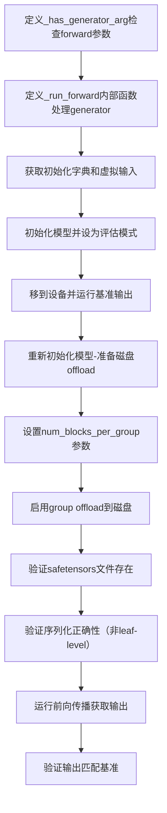

#### 带注释源码

```python
@require_group_offload_support
@pytest.mark.parametrize("record_stream", [False, True])
@pytest.mark.parametrize("offload_type", ["block_level", "leaf_level"])
@torch.no_grad()
@torch.inference_mode()
def test_group_offloading_with_disk(self, tmp_path, record_stream, offload_type, atol=1e-5, rtol=0):
    # 检查模型forward是否接受generator参数
    def _has_generator_arg(model):
        sig = inspect.signature(model.forward)
        params = sig.parameters
        return "generator" in params
    
    # 运行前向传播的内部函数
    def _run_forward(model, inputs_dict):
        accepts_generator = _has_generator_arg(model)
        if accepts_generator:
            inputs_dict["generator"] = torch.manual_seed(0)
        torch.manual_seed(0)
        return model(**inputs_dict)[0]
    
    init_dict = self.get_init_dict()
    inputs_dict = self.get_dummy_inputs()
    torch.manual_seed(0)
    model = self.model_class(**init_dict)
    
    model.eval()
    model.to(torch_device)
    # 获取基准输出（无group offloading）
    output_without_group_offloading = _run_forward(model, inputs_dict)
    
    # 重新初始化模型用于group offloading测试
    torch.manual_seed(0)
    model = self.model_class(**init_dict)
    model.eval()
    
    # 设置num_blocks_per_group参数
    num_blocks_per_group = None if offload_type == "leaf_level" else 1
    additional_kwargs = {} if offload_type == "leaf_level" else {"num_blocks_per_group": num_blocks_per_group}
    tmpdir = str(tmp_path)
    
    # 启用group offloading到磁盘
    model.enable_group_offload(
        torch_device,
        offload_type=offload_type,
        offload_to_disk_path=tmpdir,
        use_stream=True,
        record_stream=record_stream,
        **additional_kwargs,
    )
    
    # 验证safetensors文件已创建
    has_safetensors = glob.glob(f"{tmpdir}/*.safetensors")
    assert has_safetensors, "No safetensors found in the directory."
    
    # 对于非leaf-level类型，验证序列化正确性
    if offload_type != "leaf_level":
        is_correct, extra_files, missing_files = _check_safetensors_serialization(
            module=model,
            offload_to_disk_path=tmpdir,
            offload_type=offload_type,
            num_blocks_per_group=num_blocks_per_group,
        )
        if not is_correct:
            if extra_files:
                raise ValueError(f"Found extra files: {', '.join(extra_files)}")
            elif missing_files:
                raise ValueError(f"Following files are missing: {', '.join(missing_files)}")
    
    # 运行group offloading后的前向传播
    output_with_group_offloading = _run_forward(model, inputs_dict)
    
    # 验证输出匹配
    assert_tensors_close(
        output_without_group_offloading,
        output_with_group_offloading,
        atol=atol,
        rtol=rtol,
        msg="Output should match with disk-based group offloading",
    )
```

---

### LayerwiseCastingTesterMixin.test_layerwise_casting_memory

测试 layerwise casting（层-wise 类型转换）的内存优化效果，验证使用更低精度的存储类型可以减少内存占用。

参数：

- 无

返回值：`None`，该方法为测试方法，通过断言验证内存优化效果

#### 流程图

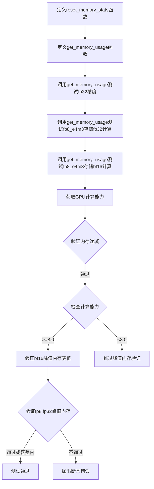

#### 带注释源码

```python
@torch.no_grad()
def test_layerwise_casting_memory(self):
    MB_TOLERANCE = 0.2  # 内存容差（MB）
    LEAST_COMPUTE_CAPABILITY = 8.0  # 最小计算能力要求
    
    # 重置内存统计信息的辅助函数
    def reset_memory_stats():
        gc.collect()  # 垃圾回收
        backend_synchronize(torch_device)  # 同步设备
        backend_empty_cache(torch_device)  # 清空缓存
        backend_reset_peak_memory_stats(torch_device)  # 重置峰值内存统计
    
    # 获取特定精度配置的内存使用情况
    def get_memory_usage(storage_dtype, compute_dtype):
        torch.manual_seed(0)
        config = self.get_init_dict()
        inputs_dict = self.get_dummy_inputs()
        # 将输入转换为计算精度
        inputs_dict = cast_inputs_to_dtype(inputs_dict, torch.float32, compute_dtype)
        model = self.model_class(**config).eval()
        # 将模型移到设备并设置为计算精度
        model = model.to(torch_device, dtype=compute_dtype)
        # 启用layerwise casting
        model.enable_layerwise_casting(storage_dtype=storage_dtype, compute_dtype=compute_dtype)
        
        # 重置内存统计并运行前向传播
        reset_memory_stats()
        model(**inputs_dict)
        # 获取模型内存占用和峰值推理内存
        model_memory_footprint = model.get_memory_footprint()
        peak_inference_memory_allocated_mb = backend_max_memory_allocated(torch_device) / 1024**2
        
        return model_memory_footprint, peak_inference_memory_allocated_mb
    
    # 测试1：fp32存储和计算
    fp32_memory_footprint, fp32_max_memory = get_memory_usage(torch.float32, torch.float32)
    # 测试2：fp8_e4m3存储，fp32计算
    fp8_e4m3_fp32_memory_footprint, fp8_e4m3_fp32_max_memory = get_memory_usage(torch.float8_e4m3fn, torch.float32)
    # 测试3：fp8_e4m3存储，bf16计算
    fp8_e4m3_bf16_memory_footprint, fp8_e4m3_bf16_max_memory = get_memory_usage(
        torch.float8_e4m3fn, torch.bfloat16
    )
    
    # 获取GPU计算能力
    compute_capability = get_torch_cuda_device_capability() if torch_device == "cuda" else None
    
    # 验证内存占用递减：bf16 < fp8_fp32 < fp32
    assert fp8_e4m3_bf16_memory_footprint < fp8_e4m3_fp32_memory_footprint < fp32_memory_footprint, (
        "Memory footprint should decrease with lower precision storage"
    )
    
    # 对于计算能力>=8.0的GPU，验证峰值内存
    if compute_capability and compute_capability >= LEAST_COMPUTE_CAPABILITY:
        assert fp8_e4m3_bf16_max_memory < fp8_e4m3_fp32_max_memory, (
            "Peak memory should be lower with bf16 compute on newer GPUs"
        )
    
    # 验证fp8_fp32峰值内存小于fp32（在容差范围内）
    assert (
        fp8_e4m3_fp32_max_memory < fp32_max_memory
        or abs(fp8_e4m3_fp32_max_memory - fp32_max_memory) < MB_TOLERANCE
    ), "Peak memory should be lower or within tolerance with fp8 storage"
```

---

### LayerwiseCastingTesterMixin.test_layerwise_casting_training

测试 layerwise casting 在训练模式下的功能，验证存储精度和计算精度的组合在训练时能正常工作。

参数：

- 无

返回值：`None`，该方法为测试方法，通过验证反向传播无错误来确认功能正确

#### 流程图

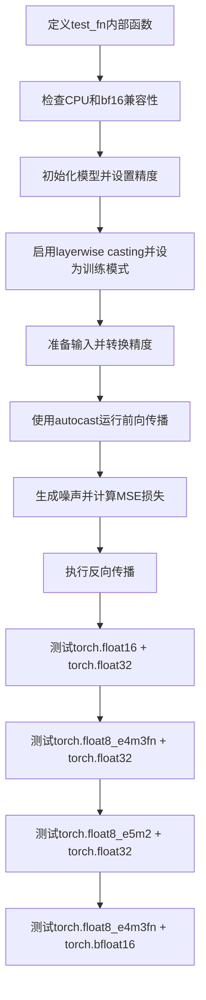

#### 带注释源码

```python
def test_layerwise_casting_training(self):
    # 定义测试函数，测试特定的存储和计算精度组合
    def test_fn(storage_dtype, compute_dtype):
        # CPU设备不支持bf16，跳过该组合
        if torch.device(torch_device).type == "cpu" and compute_dtype == torch.bfloat16:
            pytest.skip("Skipping test because CPU doesn't go well with bfloat16.")
        
        # 初始化模型并设置计算精度
        model = self.model_class(**self.get_init_dict())
        model = model.to(torch_device, dtype=compute_dtype)
        # 启用layerwise casting
        model.enable_layerwise_casting(storage_dtype=storage_dtype, compute_dtype=compute_dtype)
        model.train()
        
        # 准备输入并转换精度
        inputs_dict = self.get_dummy_inputs()
        inputs_dict = cast_inputs_to_dtype(inputs_dict, torch.float32, compute_dtype)
        
        # 使用自动混合精度（AMP）运行前向传播
        with torch.amp.autocast(device_type=torch.device(torch_device).type):
            output = model(**inputs_dict, return_dict=False)[0]
            
            # 生成随机噪声作为目标
            input_tensor = inputs_dict[self.main_input_name]
            noise = torch.randn((input_tensor.shape[0],) + self.output_shape).to(torch_device)
            noise = cast_inputs_to_dtype(noise, torch.float32, compute_dtype)
            # 计算MSE损失
            loss = torch.nn.functional.mse_loss(output, noise)
        
        # 执行反向传播
        loss.backward()
    
    # 测试多种精度组合
    test_fn(torch.float16, torch.float32)
    test_fn(torch.float8_e4m3fn, torch.float32)
    test_fn(torch.float8_e5m2, torch.float32)
    test_fn(torch.float8_e4m3fn, torch.bfloat16)
```


## 关键组件


### CPUOffloadTesterMixin

用于测试CPU卸载功能的mixin类，包含CPU offload和disk offload的测试方法。

### GroupOffloadTesterMixin

用于测试组卸载功能的mixin类，支持块级（block_level）和叶子级（leaf_level）两种卸载策略。

### LayerwiseCastingTesterMixin

用于测试分层类型转换（layerwise dtype casting）的mixin类，实现存储精度与计算精度分离的内存优化。

### MemoryTesterMixin

组合了CPUOffloadTesterMixin、GroupOffloadTesterMixin和LayerwiseCastingTesterMixin的综合性内存优化测试mixin类。

### require_offload_support

装饰器函数，用于检查模型是否支持卸载功能（需要_no_split_modules属性）。

### require_group_offload_support

装饰器函数，用于检查模型是否支持组卸载功能（需要_supports_group_offloading属性）。


## 问题及建议


### 已知问题

- **代码重复**: `test_cpu_offload`、`test_disk_offload_without_safetensors` 和 `test_disk_offload_with_safetensors` 中存在大量重复的模型初始化、输入获取和基准前向传播代码；`test_group_offloading` 中多个测试块（block_level、leaf_level、stream等）结构高度相似
- **硬编码的魔法数字**: 模型分割百分比 `[0.5, 0.7]`、CPU内存乘数 `model_size * 2`、极小CPU内存 `0.1 * max_size`、MB容差 `0.2`、最小计算能力阈值 `8.0` 等缺乏解释性常量定义
- **类型提示不完整**: `get_init_dict()`、`get_dummy_inputs()`、`main_input_name`、`output_shape` 等依赖混入类的属性无类型声明，参数 `offload_type`、`record_stream` 缺少类型标注
- **测试职责过载**: `test_group_offloading_with_layerwise_casting` 混合了层间类型转换与分组卸载两种测试场景，应拆分为独立测试用例
- **资源未及时释放**: `test_group_offloading_with_disk` 写入磁盘的临时文件（safetensors）未显式清理，测试目录可能残留
- **嵌套函数降低可读性**: `test_group_offloading_with_disk` 中定义 `_has_generator_arg` 和 `_run_forward` 局部函数，且每次调用都重复创建，增加理解成本
- **条件跳过逻辑分散**: `test_group_offloading_with_disk` 中对 `leaf_level` 类型的特殊处理（跳过确定性检查）以注释说明，未通过配置或标记统一管理
- **断言消息冗长**: 多处 `assert_tensors_close` 调用包含过长的 msg 字符串，可提取为常量或简化

### 优化建议

- **提取公共初始化逻辑**: 创建 `_setup_model_and_inputs` 等私有方法，将重复的模型加载、种子设置、前向传播模式封装为可复用函数
- **定义配置常量类**: 创建 `OffloadTestConstants` 或使用 dataclass 集中管理分割比例、内存乘数、容差等魔法数字，提升可维护性
- **完善类型注解**: 为所有混入方法参数和返回值添加类型提示，明确 `model_class`、`get_init_dict()` 等契约接口
- **拆分复合测试**: 将 `test_group_offloading_with_layerwise_casting` 拆分为 `test_group_offloading` 和 `test_layerwise_casting` 两个独立测试
- **使用 fixture 管理资源**: 引入 pytest fixture 处理临时目录创建与清理，确保测试隔离
- **重构嵌套函数**: 将 `_has_generator_arg` 和 `_run_forward` 提升为模块级辅助函数或混入类方法
- **统一跳过策略**: 对 `leaf_level` 特殊行为使用 pytest.mark 标记或配置驱动，而非硬编码条件分支
- **简化断言消息**: 将重复的长文本提取为模块级常量，如 `OUTPUT_MATCH_MSG = "Output should match..."`

## 其它


### 设计目标与约束

本代码的设计目标是验证diffusers模型在各种内存优化技术下的功能正确性和性能表现，包括CPU卸载、磁盘卸载、组卸载和分层类型转换。主要约束包括：1) 需要GPU加速器环境（通过`@require_accelerator`装饰器要求）；2) 测试的模型类必须实现`_no_split_modules`属性和`get_init_dict()`、`get_dummy_inputs()`方法；3) 磁盘卸载测试需要足够的磁盘空间；4) 部分GPU特性（如bf16计算）需要特定计算能力（≥8.0）的GPU支持。

### 错误处理与异常设计

代码中的错误处理主要包括：1) 使用`pytest.raises(ValueError)`捕获磁盘卸载时缺少offload_folder参数导致的ValueError；2) 通过`assert_tensors_close`函数进行数值比较，当输出不匹配时抛出详细的错误信息；3) 使用装饰器`@require_offload_support`和`@require_group_offload_support`在测试前检查模型是否支持相应功能，不支持则跳过测试；4) 内存测试中通过`MB_TOLERANCE`允许小范围的内存测量误差。

### 数据流与状态机

数据流主要分为两类场景：offloading测试的数据流为"模型初始化→加载到GPU→保存到磁盘→按device_map重新加载→执行推理→验证输出一致性"；layerwise casting测试的数据流为"模型初始化→启用分层类型转换→根据storage_dtype和compute_dtype执行前向传播→验证内存占用和输出正确性"。状态转换通过以下参数控制：1) `model_split_percents`控制CPU/GPU内存分割比例；2) `offload_type`（block_level/leaf_level）控制组卸载粒度；3) `use_stream`和`record_stream`控制流式传输；4) `storage_dtype`和`compute_dtype`控制数据类型转换策略。

### 外部依赖与接口契约

主要外部依赖包括：1) `accelerate.utils.modeling.compute_module_sizes`用于计算模型大小；2) `diffusers.utils.testing_utils`中的断言和内存工具函数；3) `pytest`框架；4) `torch`及其CUDA相关函数。接口契约要求：1) 使用本mixin的类必须提供`model_class`属性指向被测试的模型类；2) 必须实现`get_init_dict()`返回模型初始化参数字典；3) 必须实现`get_dummy_inputs()`返回测试输入字典；4) 模型类需要支持`_no_split_modules`属性和`enable_group_offload`、`enable_layerwise_casting`等方法。

### 性能考量与基准

性能测试主要关注：1) 内存占用比较（通过`get_memory_footprint()`和`backend_max_memory_allocated()`测量）；2) 不同精度下的内存效率（fp32 vs fp8_e4m3fn vs bf16）；3) offloading对推理输出的影响（通过`assert_tensors_close`验证数值一致性）；4) 组卸载中`record_stream`参数对性能的影响。基准值为`MB_TOLERANCE=0.2`MB的内存测量容差和`LEAST_COMPUTE_CAPABILITY=8.0`的GPU能力要求。

### 安全考虑

代码中的安全相关考量包括：1) 使用`torch.no_grad()`和`torch.inference_mode()`防止推理时的梯度计算；2) 磁盘卸载时使用`safe_serialization`参数控制序列化方式；3) 通过`_check_safetensors_serialization`函数验证safetensors文件的完整性；4) 测试中使用`torch.manual_seed(0)`确保结果可复现性。

### 测试策略

测试采用以下策略：1) 使用pytest标记（`cpu_offload`、`group_offload`、`memory`）组织不同类型的测试；2) 使用`@wraps`装饰器包装测试函数以保留原始函数元数据；3) 通过参数化（`@pytest.mark.parametrize`）测试多种配置组合；4) 使用mixin类实现代码复用，避免重复测试逻辑；5) 测试前通过装饰器检查前置条件，不满足则跳过。

### 配置管理

可配置的测试参数包括：1) `model_split_percents`列表控制CPU/GPU内存分割百分比（默认[0.5, 0.7]）；2) `max_memory`字典配置各设备的内存限制；3) `num_blocks_per_group`控制组卸载的块数量；4) `offload_to_disk_path`配置磁盘卸载路径；5) `storage_dtype`和`compute_dtype`配置类型转换的源类型和目标类型。

### 版本兼容性

代码中的版本兼容性考量包括：1) 通过`get_torch_cuda_device_capability()`检测CUDA计算能力；2) 部分断言（如bf16内存比较）仅在计算能力≥8.0的GPU上执行；3) CPU设备上跳过bf16相关测试；4) 使用`torch.float8_e4m3fn`和`torch.float8_e5m2`等特定精度类型，这些是较新的PyTorch特性。

### 部署相关

本测试代码的部署相关考量：1) 测试代码用于验证模型内存优化功能的正确性，可在CI/CD流程中集成；2) 需要临时目录（`tmp_path`）用于磁盘卸载测试；3) 测试结束后需要清理临时文件和GPU内存（通过`gc.collect()`和`backend_empty_cache`）；4) 多GPU场景下的测试需要配置适当的`device_map`和`max_memory`。


    