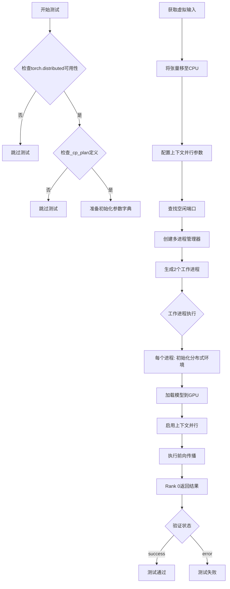
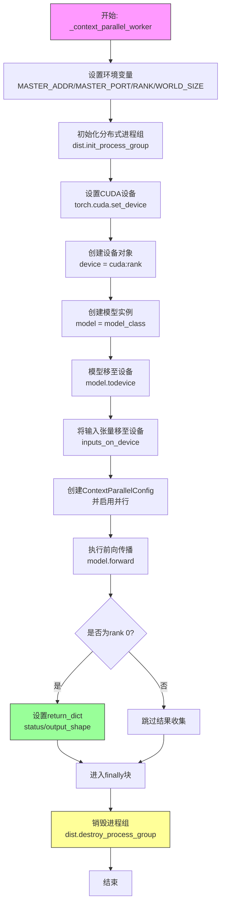
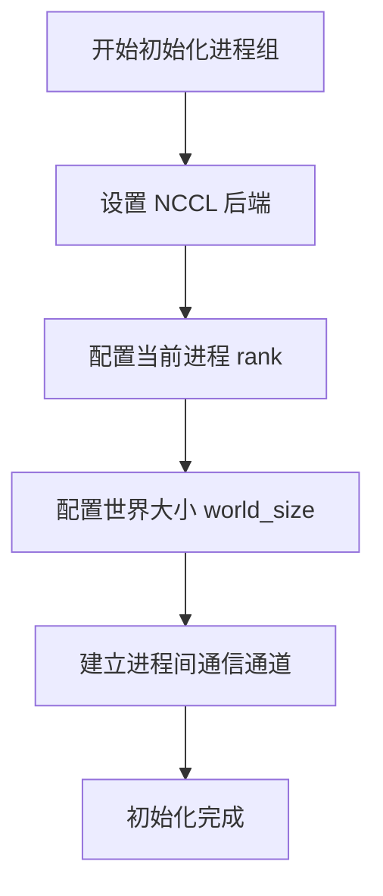
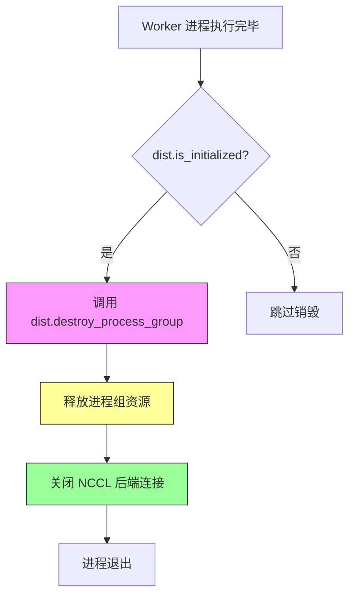
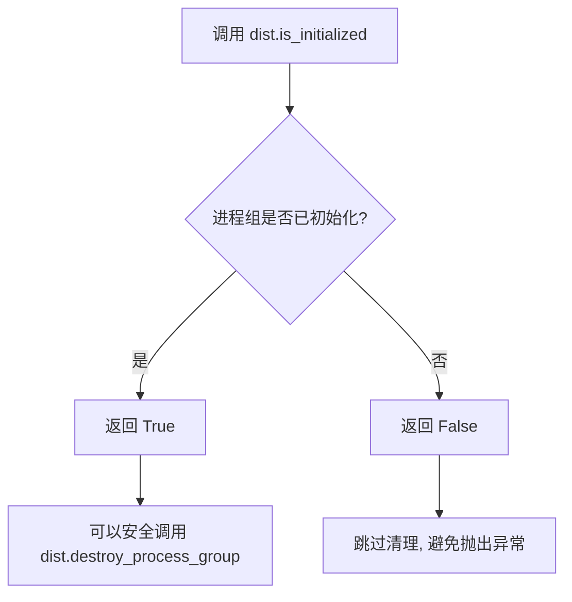
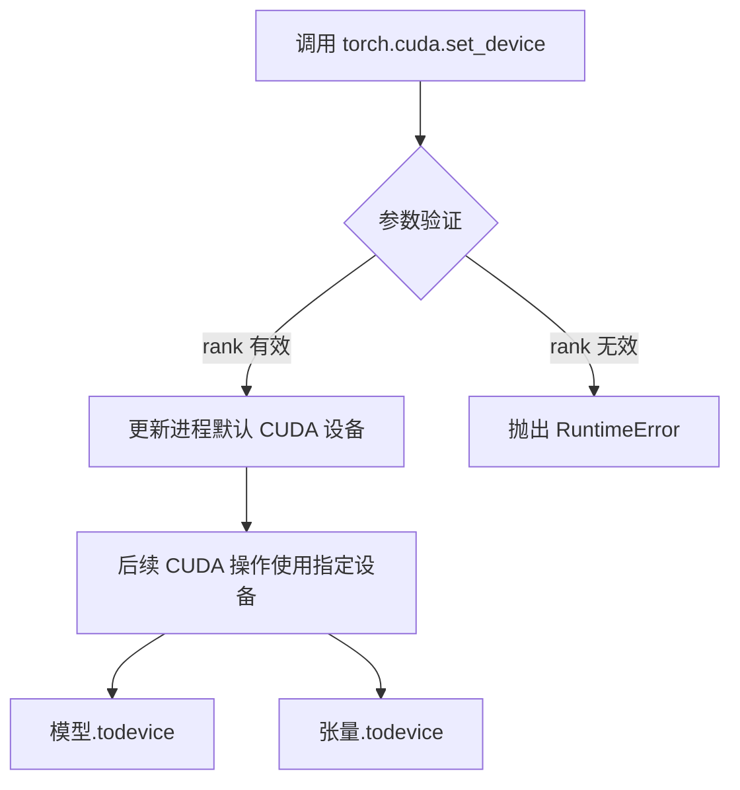
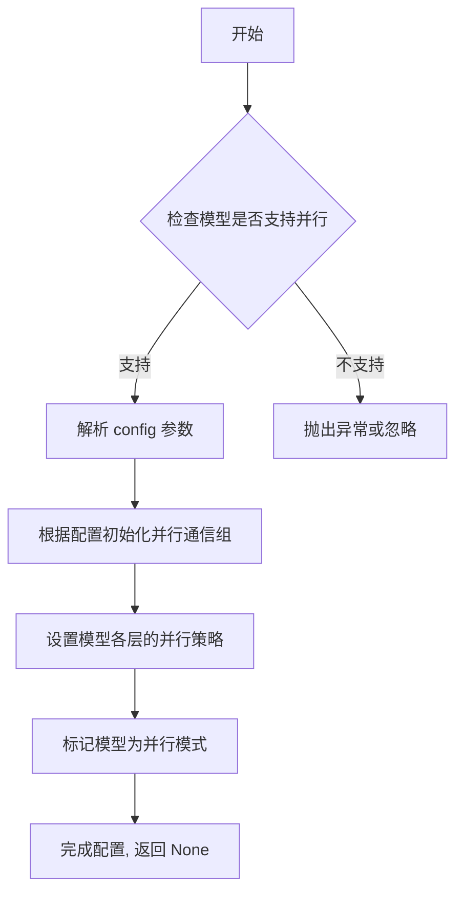
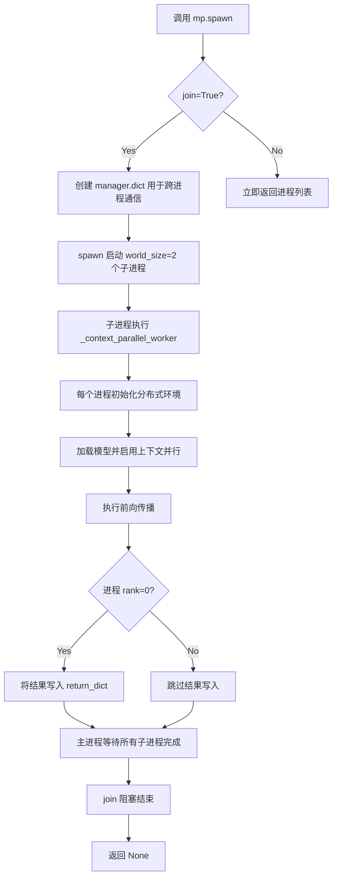
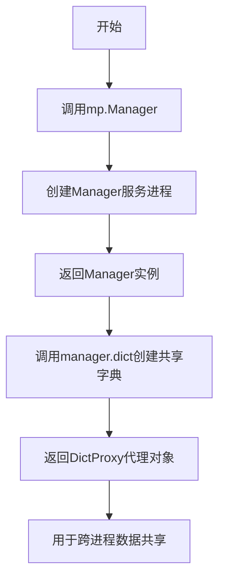
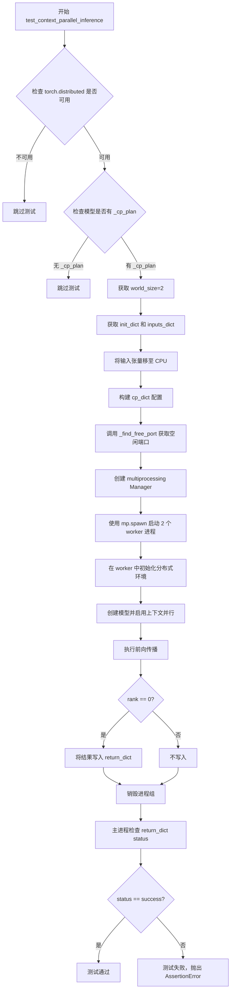

# `diffusers\tests\models\testing_utils\parallelism.py` 详细设计文档

这是一个用于测试模型上下文并行推理功能的测试文件，通过PyTorch的分布式多进程机制在多个GPU上并行运行模型推理，验证模型在ULYSSE和Ring两种并行策略下的正确性。

## 整体流程



## 类结构

```
ContextParallelTesterMixin (测试Mixin类)
    └── test_context_parallel_inference (测试方法)
```

## 全局变量及字段


### `socket`
    
Python标准库socket模块，用于网络通信和端口绑定

类型：`module`
    


### `pytest`
    
Python测试框架，用于编写和运行单元测试

类型：`module`
    


### `torch`
    
PyTorch深度学习库，提供张量计算和神经网络功能

类型：`module`
    


### `dist`
    
PyTorch分布式通信模块，用于多进程间的数据交换和同步

类型：`module`
    


### `mp`
    
PyTorch多进程模块，用于 spawning 多进程进行分布式测试

类型：`module`
    


### `ContextParallelConfig`
    
上下文并行配置类，用于配置模型在多个设备间的并行计算方式

类型：`class`
    


### `is_context_parallel`
    
装饰器函数，用于检查当前环境是否支持上下文并行特性

类型：`function/decorator`
    


### `require_torch_multi_accelerator`
    
装饰器函数，用于要求多个GPU加速器才能运行测试

类型：`function/decorator`
    


    

## 全局函数及方法


### `_find_free_port`

该函数用于在本地主机上查找一个可用的空闲端口，通过创建TCP socket并绑定到端口0（由系统分配临时端口），然后获取并返回该端口号，常用于分布式测试中为多进程通信动态分配端口。

参数： 无

返回值：`int`，返回系统分配的空闲端口号，可用于分布式通信的MASTER_PORT配置。

#### 流程图

```mermaid
flowchart TD
    A[开始] --> B[创建TCP Socket<br/>socket.AF_INET, SOCK_STREAM]
    B --> C[绑定Socket到任意地址<br/>bind: ('', 0)]
    C --> D[开始监听<br/>listen: 1]
    D --> E[获取绑定的端口号<br/>getsockname()[1]]
    E --> F[返回端口号]
    F --> G[结束<br/>with块退出时socket自动关闭]
```

#### 带注释源码

```python
def _find_free_port():
    """Find a free port on localhost."""
    # 创建一个IPv4 TCP流式socket
    # AF_INET: IPv4地址族
    # SOCK_STREAM: TCP协议
    with socket.socket(socket.AF_INET, socket.SOCK_STREAM) as s:
        # 绑定到空字符串(''表示localhost)和端口0
        # 端口0表示让操作系统分配一个空闲的临时端口
        s.bind(("", 0))
        # 开始监听，backlog设为1
        s.listen(1)
        # 获取绑定地址信息，返回(address, port)元组
        # 取索引1获取端口号
        port = s.getsockname()[1]
    # 返回分配的端口号
    # 注意：with块退出后socket会关闭，但端口会保持TIME_WAIT状态
    # 这确保了返回的端口在短期内不会被其他进程占用
    return port
```


### `_context_parallel_worker`

该函数是用于上下文并行（Context Parallelism）测试的工作进程函数，在分布式环境中初始化模型、配置上下文并行、执行前向传播，并通过共享字典返回执行结果。

参数：

- `rank`：`int`，当前进程在分布式环境中的排名（从0开始）
- `world_size`：`int`，分布式进程组的总进程数
- `master_port`：`int`，用于主进程通信的端口号
- `model_class`：`type`，待测试的模型类（传入类而非实例）
- `init_dict`：`dict`，模型构造函数所需的参数字典
- `cp_dict`：`dict`，上下文并行配置参数字典（如 `{"ulysses_degree": 2}` 或 `{"ring_degree": 2}`）
- `inputs_dict`：`dict`，模型输入数据的字典（键为输入名称，值为张量或数据）
- `return_dict`：`dict`，用于跨进程返回结果的共享字典（由 `multiprocessing.Manager()` 创建）

返回值：`None`，函数无返回值，结果通过 `return_dict` 参数传递

#### 流程图



#### 带注释源码

```python
def _context_parallel_worker(rank, world_size, master_port, model_class, init_dict, cp_dict, inputs_dict, return_dict):
    """
    Worker function for context parallel testing.
    在分布式环境中运行模型前向传播测试的工作进程函数。
    
    参数:
        rank: 当前进程的排名（0到world_size-1）
        world_size: 总进程数
        master_port: 主进程通信端口
        model_class: 待测试的模型类
        init_dict: 模型初始化参数
        cp_dict: 上下文并行配置（如ulysses_degree或ring_degree）
        inputs_dict: 输入数据字典
        return_dict: 跨进程返回结果的共享字典
    """
    try:
        # 设置分布式环境变量
        # 这些环境变量会被PyTorch分布式初始化读取
        os.environ["MASTER_ADDR"] = "localhost"
        os.environ["MASTER_PORT"] = str(master_port)
        os.environ["RANK"] = str(rank)
        os.environ["WORLD_SIZE"] = str(world_size)

        # 使用NCCL后端初始化分布式进程组
        # NCCL是NVIDIA提供的GPU间通信库，适合多GPU训练
        dist.init_process_group(backend="nccl", rank=rank, world_size=world_size)

        # 为当前进程设置CUDA设备
        # 确保每个进程使用不同的GPU
        torch.cuda.set_device(rank)
        device = torch.device(f"cuda:{rank}")

        # 根据init_dict创建模型实例
        model = model_class(**init_dict)
        # 将模型移至对应GPU设备
        model.to(device)
        # 设置为评估模式（禁用dropout等训练特定操作）
        model.eval()

        # 将输入数据移至当前进程的GPU设备
        # 多进程环境下，每个进程只能访问自己的GPU
        inputs_on_device = {}
        for key, value in inputs_dict.items():
            if isinstance(value, torch.Tensor):
                inputs_on_device[key] = value.to(device)
            else:
                inputs_on_device[key] = value

        # 创建上下文并行配置并启用并行
        # 支持ulysses（序列并行）或ring（环状并行）模式
        cp_config = ContextParallelConfig(**cp_dict)
        model.enable_parallelism(config=cp_config)

        # 执行前向传播
        # 使用torch.no_grad()禁用梯度计算，节省显存
        with torch.no_grad():
            output = model(**inputs_on_device, return_dict=False)[0]

        # 仅rank 0进程收集并返回结果
        # 避免多个进程同时写入return_dict导致冲突
        if rank == 0:
            return_dict["status"] = "success"
            return_dict["output_shape"] = list(output.shape)

    except Exception as e:
        # 捕获异常并将错误信息通过rank 0返回
        if rank == 0:
            return_dict["status"] = "error"
            return_dict["error"] = str(e)
    finally:
        # 确保进程组被正确销毁
        # 无论成功还是失败都需要清理资源
        if dist.is_initialized():
            dist.destroy_process_group()
```


### `dist.init_process_group`

初始化 PyTorch 分布式进程组，用于设置多进程 GPU 分布式训练环境，建立进程间通信基础架构。

参数：

- `backend`：`str`，分布式通信后端，值为 "nccl"（NVIDIA Collective Communications Library），用于 GPU 间高性能通信
- `rank`：`int`，当前进程在进程组中的唯一标识符，从 0 开始编号
- `world_size`：`int`，参与分布式计算的总进程数量

返回值：`None`，该函数无返回值，仅初始化分布式环境

#### 流程图



#### 带注释源码

```python
# 在 _context_parallel_worker 函数中调用
# 设置分布式环境变量后，初始化进程组
# MASTER_ADDR 和 MASTER_PORT 已在之前配置
os.environ["MASTER_ADDR"] = "localhost"
os.environ["MASTER_PORT"] = str(master_port)
os.environ["RANK"] = str(rank)
os.environ["WORLD_SIZE"] = str(world_size)

# Initialize process group
# 参数说明：
#   - backend="nccl": 使用 NVIDIA GPU 间的高速通信库
#   - rank=rank: 当前进程的编号（0 或 1）
#   - world_size=world_size: 总共 2 个进程
dist.init_process_group(backend="nccl", rank=rank, world_size=world_size)
```


### `dist.destroy_process_group`

销毁当前进程中已初始化的分布式进程组，释放相关资源。该函数是 PyTorch 分布式通信的核心清理接口，确保在测试或训练结束后正确释放分布式环境资源，避免进程组泄漏和潜在的死锁问题。

参数：

- `group`：`torch.distributed.ProcessGroup` 或 `None`，要销毁的进程组对象，传入 `None` 时销毁默认的主进程组（`GroupMember.WORLD`）

返回值：`None`，无返回值，仅执行进程组销毁操作

#### 流程图



#### 带注释源码

```python
# 位于 _context_parallel_worker 函数的 finally 块中
finally:
    # 检查分布式环境是否已初始化（避免在未初始化时调用导致错误）
    if dist.is_initialized():
        # 销毁默认进程组，释放分布式通信资源
        # 参数 group 默认为 None，表示销毁默认的主进程组
        # 此调用会：
        # 1. 等待所有进程同步
        # 2. 释放进程组持有的通信资源（NCCL 上下文、缓冲区等）
        # 3. 关闭底层通信后端
        dist.destroy_process_group()
```


### `dist.is_initialized`

检查当前进程是否已初始化 PyTorch 分布式进程组。

参数：

- （无参数）

返回值：`bool`，如果分布式进程组已初始化则返回 `True`，否则返回 `False`

#### 流程图



#### 带注释源码

```python
# 在代码中的使用场景：
finally:
    # 检查分布式进程组是否已初始化
    # 避免在未初始化的情况下调用 destroy_process_group 导致 RuntimeError
    if dist.is_initialized():
        dist.destroy_process_group()
```

**说明**：此函数是 `torch.distributed` 模块的内置函数，用于在 `finally` 块中安全地清理分布式进程组。在 `_context_parallel_worker` 函数中，即使 `try` 块发生异常，也需要检查进程组是否已成功初始化，只有在已初始化的情况下才能调用 `destroy_process_group()` 进行清理，避免抛出 `RuntimeError: invalid process group` 异常。


### `torch.cuda.set_device`

该函数是 PyTorch CUDA 运行时 API，用于设置当前进程/线程的默认 CUDA 设备。在分布式测试场景中，每个 worker 进程需要明确指定使用哪个 GPU 设备，以确保模型和输入数据在正确的设备上运行。

参数：

- `rank`：`int`，指定要设置为默认 CUDA 设备的设备编号（通常与进程 rank 对应）

返回值：`None`，该函数不返回任何值，仅修改进程级 CUDA 设备状态

#### 流程图



#### 带注释源码

```python
# 设置当前进程使用的 CUDA 设备
# rank 参数对应分布式进程编号，确保每个进程使用独立的 GPU
torch.cuda.set_device(rank)

# 示例：在分布式测试中，rank=0 的进程使用 cuda:0，rank=1 的进程使用 cuda:1
# 此调用会将当前进程的默认设备重置为指定设备
# 后续所有未指定设备的 CUDA 操作都会在此设备上执行
```


### `Model.enable_parallelism`

在分布式上下文并行（Context Parallel）测试的工作进程函数中，模型调用 `enable_parallelism` 方法来启用模型的并行计算功能。该方法接收一个 `ContextParallelConfig` 配置对象，用于设置并行策略（如 Ulysses 或 Ring 方式的并行度），从而支持模型在多个 GPU 上进行高效的上下文并行推理。

参数：

- `config`：`ContextParallelConfig`，用于配置并行计算的参数，包括并行类型（如 `ulysses_degree` 或 `ring_degree`）和并行度（world_size）

返回值：`None`，该方法直接修改模型状态，启用并行计算功能

#### 流程图



#### 带注释源码

```python
# 代码位置: diffusers/models/_modeling_parallel.py (推断)
# 以下为基于测试代码调用方式的推断实现

class BaseModel(nn.Module):
    """基础模型类,包含 enable_parallelism 方法"""
    
    def __init__(self):
        super().__init__()
        self._parallelism_enabled = False  # 类字段: 标记是否启用并行
        self._cp_config = None             # 类字段: 存储并行配置
    
    def enable_parallelism(self, config: ContextParallelConfig):
        """
        启用模型的上下文并行计算功能
        
        参数:
            config: ContextParallelConfig 对象,包含并行类型和度数配置
        返回:
            None
        """
        # 1. 验证配置有效性
        if not isinstance(config, ContextParallelConfig):
            raise TypeError(f"config must be ContextParallelConfig, got {type(config)}")
        
        # 2. 检查模型是否实现了 _cp_plan (上下文并行计划)
        if not hasattr(self, '_cp_plan') or self._cp_plan is None:
            raise NotImplementedError(
                "Model does not have a _cp_plan defined for context parallel inference."
            )
        
        # 3. 存储配置到模型实例
        self._cp_config = config
        
        # 4. 根据配置类型初始化并行策略
        # ulysses_degree: 使用 Ulysses 序列并行
        # ring_degree: 使用 Ring 序列并行
        parallel_type = config.ulysses_degree if config.ulysses_degree > 1 else config.ring_degree
        
        # 5. 应用并行配置到模型各层
        self._apply_parallel_plan(parallel_type)
        
        # 6. 标记模型已启用并行模式
        self._parallelism_enabled = True
        
        return None
    
    def _apply_parallel_plan(self, parallel_degree: int):
        """
        内部方法:根据并行度应用并行计划到模型层
        
        参数:
            parallel_degree: 并行度(进程数)
        """
        # 遍历模型的并行计划(_cp_plan)
        for layer_info in self._cp_plan:
            layer_name = layer_info['name']
            layer = self.get_submodule(layer_name)
            
            # 为每个支持并行的层启用并行计算
            if hasattr(layer, 'enable_cp'):
                layer.enable_cp(parallel_degree)
```


### `mp.spawn`

该函数是 PyTorch 多进程处理的接口，用于在指定的进程数量下生成子进程来执行分布式计算任务。在这个代码中，它用于启动多个工作进程来测试模型的上下文并行推理功能。

参数：

- `fn`：`_context_parallel_worker`，worker 函数，启动的子进程将执行此函数
- `args`：元组 `(world_size, master_port, self.model_class, init_dict, cp_dict, inputs_dict, return_dict)`，传递给 worker 函数的参数列表
- `nprocs`：`world_size`（int 类型），要生成的进程数量，此处为 2
- `join`：`True`（bool 类型），是否阻塞等待所有子进程完成
- `daemon`：（可选）默认为 None，子进程是否以守护进程方式运行
- `spawn_kwargs`：（可选）默认为 None，传递给 `spawn` 方法的其他关键字参数

返回值：`None`，spawn 方法不返回值，它启动进程后通过 join 参数决定是否阻塞等待

#### 流程图



#### 带注释源码

```python
# 使用 multiprocessing 的 spawn 方法启动分布式测试进程
mp.spawn(
    _context_parallel_worker,  # worker 函数，每个子进程执行的入口点
    args=(
        world_size,        # int: 总进程数，此处为 2
        master_port,       # int: 主节点端口，用于分布式通信
        self.model_class,  # type: 模型类，用于实例化模型
        init_dict,         # dict: 模型初始化参数字典
        cp_dict,           # dict: 上下文并行配置字典
        inputs_dict,       # dict: 模型输入数据字典
        return_dict        # dict: Manager.dict()，用于跨进程返回结果
    ),
    nprocs=world_size,  # int: 启动的子进程数量
    join=True           # bool: 是否阻塞等待所有子进程完成
)
```


### `mp.Manager`

创建了一个多进程管理器对象，用于跨进程共享数据和通信。该管理器返回一个共享字典，供多个进程读写数据。

参数：

- 无参数

返回值：`multiprocessing.managers.Manager`，返回一个管理器对象，该对象管理一个服务进程，允许其他进程通过代理对象共享数据。

#### 流程图



#### 带注释源码

```python
# 使用torch.multiprocessing创建管理器
# mp是torch.multiprocessing的别名
manager = mp.Manager()  # 创建一个Manager实例，管理一个独立的服务进程
return_dict = manager.dict()  # 创建一个共享字典，用于跨进程返回结果
```


### `ContextParallelTesterMixin.test_context_parallel_inference`

该方法是 ContextParallelTesterMixin 类中的测试方法，用于验证模型在上下文并行（Context Parallelism）模式下的推理功能。它通过多进程方式在两个 GPU 上初始化分布式环境，加载模型并执行前向传播，最后验证推理是否成功。

参数：

- `self`：`ContextParallelTesterMixin`，测试类的实例，包含模型类初始化字典和虚拟输入的获取方法
- `cp_type`：`str`，上下文并行的类型，支持 "ulysses_degree"（Ullysses 序列并行）或 "ring_degree"（Ring 环形并行）

返回值：`None`，该方法为测试用例，通过 pytest 断言验证分布式推理的正确性，无显式返回值

#### 流程图



#### 带注释源码

```python
@is_context_parallel
@require_torch_multi_accelerator
class ContextParallelTesterMixin:
    @pytest.mark.parametrize("cp_type", ["ulysses_degree", "ring_degree"], ids=["ulysses", "ring"])
    def test_context_parallel_inference(self, cp_type):
        """
        测试模型在上下文并行模式下的推理功能。
        
        参数:
            cp_type: 上下文并行类型，可选 "ulysses_degree" 或 "ring_degree"
        """
        # 检查 torch.distributed 是否可用（分布式训练环境）
        if not torch.distributed.is_available():
            pytest.skip("torch.distributed is not available.")

        # 检查模型类是否定义了 _cp_plan（上下文并行策略）
        if not hasattr(self.model_class, "_cp_plan") or self.model_class._cp_plan is None:
            pytest.skip("Model does not have a _cp_plan defined for context parallel inference.")

        # 设置分布式测试的进程数（2个GPU）
        world_size = 2
        # 获取模型初始化参数字典
        init_dict = self.get_init_dict()
        # 获取模型的虚拟输入
        inputs_dict = self.get_dummy_inputs()

        # 将所有张量移至 CPU（因为多进程需要序列化）
        inputs_dict = {k: v.cpu() if isinstance(v, torch.Tensor) else v for k, v in inputs_dict.items()}
        # 构建上下文并行配置字典
        cp_dict = {cp_type: world_size}

        # 为分布式通信寻找空闲端口
        master_port = _find_free_port()

        # 使用 multiprocessing manager 进行跨进程通信
        manager = mp.Manager()
        return_dict = manager.dict()

        # 使用 mp.spawn 启动 worker 进程
        # 参数: worker函数, args=(world_size, master_port, model_class, init_dict, cp_dict, inputs_dict, return_dict), 
        #       nprocs=进程数, join=True等待完成
        mp.spawn(
            _context_parallel_worker,
            args=(world_size, master_port, self.model_class, init_dict, cp_dict, inputs_dict, return_dict),
            nprocs=world_size,
            join=True,
        )

        # 断言验证测试结果
        assert return_dict.get("status") == "success", (
            f"Context parallel inference failed: {return_dict.get('error', 'Unknown error')}"
        )


def _context_parallel_worker(rank, world_size, master_port, model_class, init_dict, cp_dict, inputs_dict, return_dict):
    """
    Worker 函数，在每个分布式进程中执行模型推理。
    
    参数:
        rank: 当前进程的排名
        world_size: 总进程数
        master_port: 主进程端口
        model_class: 模型类
        init_dict: 模型初始化参数字典
        cp_dict: 上下文并行配置字典
        inputs_dict: 输入数据字典
        return_dict: 用于返回结果的共享字典
    """
    try:
        # 设置分布式环境变量
        os.environ["MASTER_ADDR"] = "localhost"
        os.environ["MASTER_PORT"] = str(master_port)
        os.environ["RANK"] = str(rank)
        os.environ["WORLD_SIZE"] = str(world_size)

        # 初始化 NCCL 进程组
        dist.init_process_group(backend="nccl", rank=rank, world_size=world_size)

        # 为当前进程设置 CUDA 设备
        torch.cuda.set_device(rank)
        device = torch.device(f"cuda:{rank}")

        # 实例化模型并移至对应设备
        model = model_class(**init_dict)
        model.to(device)
        model.eval()

        # 将输入数据移至对应设备
        inputs_on_device = {}
        for key, value in inputs_dict.items():
            if isinstance(value, torch.Tensor):
                inputs_on_device[key] = value.to(device)
            else:
                inputs_on_device[key] = value

        # 创建上下文并行配置并启用并行
        cp_config = ContextParallelConfig(**cp_dict)
        model.enable_parallelism(config=cp_config)

        # 执行前向传播（禁用梯度计算）
        with torch.no_grad():
            output = model(**inputs_on_device, return_dict=False)[0]

        # 仅 rank 0 进程报告结果
        if rank == 0:
            return_dict["status"] = "success"
            return_dict["output_shape"] = list(output.shape)

    except Exception as e:
        # 异常处理，仅 rank 0 记录错误
        if rank == 0:
            return_dict["status"] = "error"
            return_dict["error"] = str(e)
    finally:
        # 确保进程组被正确销毁
        if dist.is_initialized():
            dist.destroy_process_group()


def _find_free_port():
    """在本地主机上寻找可用端口。"""
    with socket.socket(socket.AF_INET, socket.SOCK_STREAM) as s:
        s.bind(("", 0))
        s.listen(1)
        port = s.getsockname()[1]
    return port
```

## 关键组件


### ContextParallelConfig

从 `diffusers.models._modeling_parallel` 导入的上下文并行配置类，用于配置模型在不同并行策略下的行为。

### _find_free_port()

本地端口查找函数，通过绑定临时套接字自动分配可用端口，用于分布式训练的进程间通信。

### _context_parallel_worker()

上下文并行测试的工作进程函数，负责在每个进程中初始化分布式环境、加载模型、执行前向传播并收集结果。

### ContextParallelTesterMixin

测试混入类，提供上下文并行推理的测试能力，支持 ulysses_degree 和 ring_degree 两种并行类型。


## 问题及建议


### 已知问题

- **worker 函数职责过重**：`_context_parallel_worker` 函数混合了环境设置、模型初始化、推理执行和结果收集等多重职责，缺乏单一职责原则，不利于维护和测试。
- **错误处理不完善**：只在 rank 0 进程收集和报告错误，其他进程的异常信息会被丢弃，导致调试困难。
- **端口竞争风险**：`_find_free_port` 函数在绑定和返回端口之间存在时间窗口，端口可能被其他进程抢占，导致后续连接失败。
- **资源清理不完整**：未显式清理 GPU 内存（`torch.cuda.empty_cache()`），且 `manager.dict()` 的生命周期管理不明确，可能导致资源泄漏。
- **硬编码后端限制**：直接使用 `backend="nccl"`，缺乏对其他分布式后端（如 gloo、ucc）的支持，限制了测试的通用性。
- **缺少超时机制**：分布式初始化和进程组销毁没有超时设置，可能在某些环境下永久阻塞。
- **类型注解缺失**：worker 函数和关键变量缺少类型注解，降低了代码的可读性和静态分析能力。

### 优化建议

- **拆分 worker 函数**：将环境设置、模型初始化、推理执行拆分为独立的辅助函数，提高代码可读性和可测试性。
- **完善错误处理**：使用 `multiprocessing.Queue` 或分布式错误收集机制，将所有进程的异常信息汇总到主进程。
- **改进端口分配**：使用 `torch.distributed.launch` 或 `torchrun` 自动分配端口，或在获取端口后立即验证可用性。
- **添加资源清理**：在 worker 结束时调用 `torch.cuda.empty_cache()`，并确保 `manager.dict()` 正确释放。
- **配置化后端选择**：通过参数或配置文件指定分布式后端，增强测试灵活性。
- **添加类型注解**：为函数参数、返回值和关键变量添加类型注解，提升代码质量。
- **增加超时配置**：为 `init_process_group` 和 `destroy_process_group` 添加 `timeout` 参数，防止无限等待。

## 其它


### 设计目标与约束

该代码旨在验证模型在上下文并行（Context Parallelism）模式下的推理功能，支持 ulysses_degree 和 ring_degree 两种并行策略。约束条件包括：1) 仅支持拥有 _cp_plan 的模型；2) 需要至少2个GPU设备；3) 仅支持 NCCL 后端的分布式训练；4) 测试必须在支持 torch.distributed 和多加速器的环境中运行。

### 错误处理与异常设计

代码采用多层错误处理机制：1) 使用 pytest.skip 跳过不支持的环境（如缺少 torch.distributed 或模型无 _cp_plan）；2) 在 worker 函数中用 try-except 捕获所有异常，并通过 return_dict 在进程间传递错误信息；3) 分布式初始化失败时在 finally 块中确保 process_group 正确销毁；4) 主测试通过断言 return_dict["status"] 验证执行结果，失败时输出详细错误信息。

### 数据流与状态机

测试流程状态机包含以下状态：初始化（准备参数、端口、进程间通信字典）→ 分布式环境搭建（设置环境变量、初始化 NCCL 进程组）→ 模型加载（实例化模型、启用并行）→ 前向传播（执行推理、收集输出）→ 结果汇总（rank 0 收集结果）→ 清理（销毁进程组）。输入数据流：CPU tensors → 广播到各 GPU 设备 → 模型推理 → 输出结果收集。

### 外部依赖与接口契约

依赖项包括：1) torch.distributed - NCCL 后端的多进程通信；2) torch.multiprocessing - 跨进程通信管理器；3) socket - 动态端口分配；4) pytest - 测试框架；5) diffusers 包中的 ContextParallelConfig 和模型并行相关模块。接口契约要求：model_class 必须实现 _cp_plan 属性、enable_parallelism(config) 方法和标准 forward 签名。

### 配置与参数说明

关键配置参数：world_size=2（并行度）、cp_type 可选 "ulysses_degree" 或 "ring_degree"、master_port 动态分配、backend 固定为 "nccl"。init_dict 和 inputs_dict 由子类通过 get_init_dict() 和 get_dummy_inputs() 方法提供。

### 性能考量与优化空间

当前实现存在以下优化空间：1) 每次测试都重新查找空闲端口，可考虑复用连接；2) 模型和输入数据在每个 worker 中独立加载，可引入共享内存减少复制；3) 仅 rank 0 返回结果可减少通信开销，但当前实现已正确处理；4) 缺少对不同 world_size 的参数化测试覆盖；5) 可添加性能基准测试对比串行与并行的推理延迟。

### 并发与同步机制

采用 PyTorch multiprocessing.spawn 创建 N 个 worker 进程，使用 mp.Manager().dict() 实现跨进程结果共享。分布式同步通过 dist.init_process_group 和 dist.destroy_process_group 完成，进程间通信依赖 NCCL 后端。test_context_parallel_inference 作为入口函数，仅在 rank 0 进程执行测试断言。

### 资源管理与清理

资源管理包含：1) socket 资源在 _find_free_port 函数中自动释放（with 语句）；2) GPU 设备通过 torch.cuda.set_device 指定；3) 分布式进程组在 finally 块中确保销毁，即使发生异常也会调用 dist.destroy_process_group。manager 创建的共享字典在测试函数结束后自动清理。

### 安全与权限说明

代码依赖 Apache 2.0 许可证。环境变量设置（RANK、WORLD_SIZE、MASTER_ADDR、MASTER_PORT）仅适用于本地单机器多卡场景，不适用于跨机器分布式测试。CUDA 设备绑定到特定 rank，确保无资源争用。

    