# `diffusers\tests\models\testing_utils\quantization.py` 详细设计文档

This file provides a comprehensive test suite for model quantization in the diffusers library, supporting multiple quantization backends including BitsAndBytes, Quanto, TorchAO, GGUF, and NVIDIA ModelOpt. It defines mixin classes that offer reusable test methods for validating quantization configuration, model loading, inference, memory footprint, serialization, LoRA integration, and torch.compile compatibility.

## 整体流程

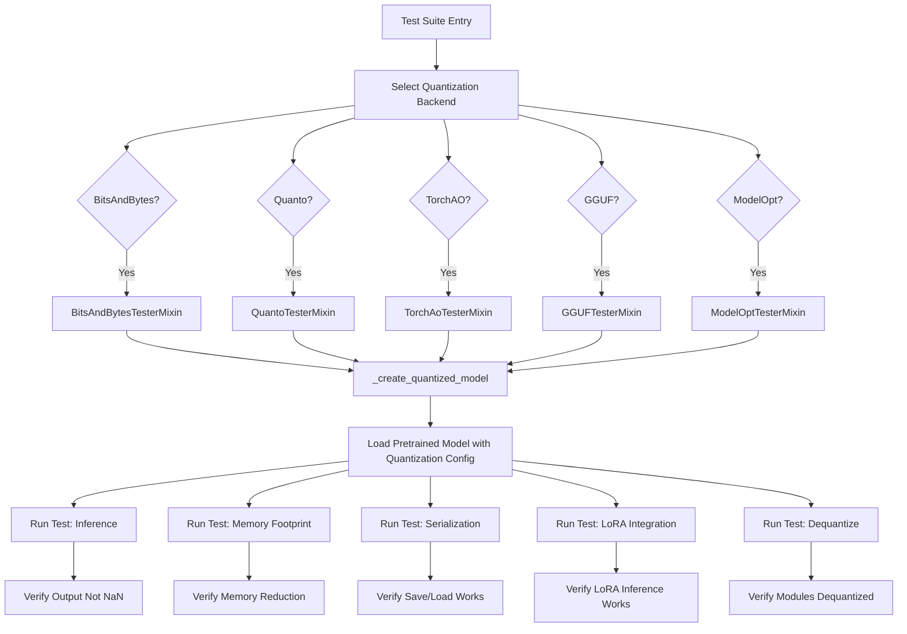

## 类结构

```
LoRALayer (Helper class for LoRA adapters)
QuantizationTesterMixin (Base mixin with common test methods)
├── BitsAndBytesConfigMixin (BitsAndBytes config)
├── BitsAndBytesTesterMixin (BitsAndBytes tests)
├── QuantizationCompileTesterMixin (Base for compile tests)
│   ├── BitsAndBytesCompileTesterMixin
│   ├── QuantoCompileTesterMixin
│   ├── TorchAoCompileTesterMixin
│   ├── GGUFCompileTesterMixin
│   └── ModelOptCompileTesterMixin
├── QuantoConfigMixin (Quanto config)
├── QuantoTesterMixin (Quanto tests)
├── TorchAoConfigMixin (TorchAO config)
├── TorchAoTesterMixin (TorchAO tests)
├── GGUFConfigMixin (GGUF config)
├── GGUFTesterMixin (GGUF tests)
├── ModelOptConfigMixin (ModelOpt config)
└── ModelOptTesterMixin (ModelOpt tests)
```

## 全局变量及字段


### `_int4wo_skip`
    
Pytest标记，用于跳过int4wo量化测试（仅在CUDA环境下运行）

类型：`pytest.mark.skipif`
    


### `LoRALayer.module`
    
被LoRA适配器包裹的原始线性层

类型：`torch.nn.Module`
    


### `LoRALayer.adapter`
    
包含两个线性层的LoRA适配器，用于注入可训练参数

类型：`torch.nn.Sequential`
    


### `BitsAndBytesConfigMixin.BNB_CONFIGS`
    
BitsAndBytes量化配置字典，包含4bit_nf4、4bit_fp4和8bit配置的参数

类型：`dict`
    


### `BitsAndBytesConfigMixin.BNB_EXPECTED_MEMORY_REDUCTIONS`
    
BitsAndBytes不同配置下的预期内存减少比例

类型：`dict`
    


### `QuantoConfigMixin.QUANTO_WEIGHT_TYPES`
    
Quanto权重类型字典，包含float8、int8、int4、int2的量化配置

类型：`dict`
    


### `QuantoConfigMixin.QUANTO_EXPECTED_MEMORY_REDUCTIONS`
    
Quanto不同权重类型下的预期内存减少比例

类型：`dict`
    


### `TorchAoConfigMixin.TORCHAO_QUANT_TYPES`
    
TorchAO量化类型字典，包含int4wo、int8wo、int8dq的配置

类型：`dict`
    


### `TorchAoConfigMixin.TORCHAO_EXPECTED_MEMORY_REDUCTIONS`
    
TorchAO不同量化类型下的预期内存减少比例

类型：`dict`
    


### `ModelOptConfigMixin.MODELOPT_CONFIGS`
    
NVIDIA ModelOpt量化配置字典，包含fp8、int8、int4的配置

类型：`dict`
    


### `ModelOptConfigMixin.MODELOPT_EXPECTED_MEMORY_REDUCTIONS`
    
ModelOpt不同配置下的预期内存减少比例

类型：`dict`
    
    

## 全局函数及方法


### `LoRALayer.__init__`

LoRALayer 类的初始化方法，用于将一个 PyTorch 线性层包装成带有 LoRA（Low-Rank Adaptation）风格适配器的层，以便在量化模型训练测试中使用。

参数：

- `module`：`torch.nn.Module`，要包装的原始线性层（如 Linear 层）
- `rank`：`int`，LoRA 适配器的低秩维度，控制适配器参数量

返回值：`None`，该方法为构造函数，不返回任何值

#### 流程图

```mermaid
flowchart TD
    A[开始 __init__] --> B[调用父类 torch.nn.Module.__init__]
    B --> C[保存原始模块引用 self.module = module]
    D[创建适配器 adapter] --> E[创建下投影 Linear: in_features → rank]
    E --> F[创建上投影 Linear: rank → out_features]
    F --> G[计算 small_std = (2.0 / (5 * min(in_features, out_features))) ** 0.5]
    G --> H[使用正态分布初始化下投影权重, std=small_std]
    H --> I[使用零初始化上投影权重]
    I --> J[将适配器移动到原始模块所在设备]
    J --> K[结束 __init__]
```

#### 带注释源码

```
def __init__(self, module: torch.nn.Module, rank: int):
    """
    初始化 LoRALayer 实例，将原始线性层包装为带 LoRA 适配器的层。
    
    Args:
        module: 要包装的原始 PyTorch 线性层
        rank: LoRA 适配器的低秩维度（rank）
    """
    # 调用父类 torch.nn.Module 的初始化方法
    super().__init__()
    
    # 保存对原始模块的引用，用于后续前向传播时调用原始模块
    self.module = module
    
    # 创建 LoRA 适配器，由两个线性层组成的 Sequential 模块
    # 1. 下投影层：将输入从 in_features 维度映射到 rank 维度（无偏置）
    # 2. 上投影层：将 rank 维度映射回 out_features 维度（无偏置）
    self.adapter = torch.nn.Sequential(
        torch.nn.Linear(module.in_features, rank, bias=False),
        torch.nn.Linear(rank, module.out_features, bias=False),
    )
    
    # 计算 LoRA 权重初始化的标准差
    # 公式来源：https://arxiv.org/abs/2106.09685
    # 确保权重初始化在合理范围内，避免训练不稳定
    small_std = (2.0 / (5 * min(module.in_features, module.out_features))) ** 0.5
    
    # 使用正态分布初始化下投影层（adapter[0]）的权重
    # 使得 LoRA 适配器从较小的随机值开始学习
    torch.nn.init.normal_(self.adapter[0].weight, std=small_std)
    
    # 使用零初始化上投影层（adapter[1]）的权重
    # 确保训练初期 LoRA 适配器对输出影响为零
    torch.nn.init.zeros_(self.adapter[1].weight)
    
    # 将适配器移动到原始模块所在的设备上（CPU 或 GPU）
    # 确保适配器与原始模块在同一设备，避免设备不匹配错误
    self.adapter.to(module.weight.device)
```


### `LoRALayer.forward`

该方法实现 LoRA 适配器层的前向传播，将原始模块的输出与适配器的输出相加，实现低秩适配器（LoRA）功能。

参数：

- `input`：`torch.Tensor`，输入张量，即需要经过线性变换的输入数据
- `*args`：可变位置参数 tuple，其他需要传递给原始模块的位置参数
- `**kwargs`：可变关键字参数 dict，其他需要传递给原始模块的关键字参数

返回值：`torch.Tensor`，原始模块输出与适配器输出之和，形状与原始模块输出相同

#### 流程图

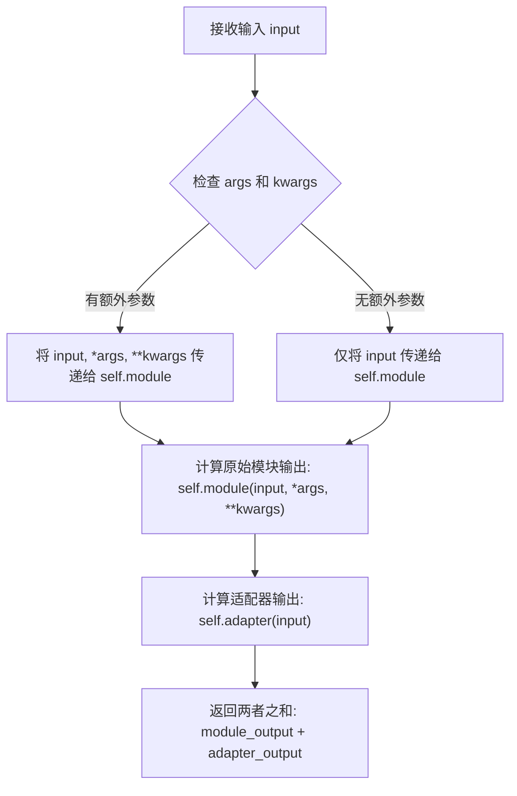

#### 带注释源码

```python
def forward(self, input, *args, **kwargs):
    """
    LoRA 层的前向传播方法。
    
    该方法执行两个计算：
    1. 原始模块的前向传播 (self.module)
    2. LoRA 适配器的前向传播 (self.adapter)
    
    最终返回两者的加和，实现残差连接式的低秩适配。
    
    参数:
        input: 输入张量，形状为 (batch_size, ..., in_features)
        *args: 可选的位置参数，会原样传递给原始模块
        **kwargs: 可选的关键字参数，会原样传递给原始模块
    
    返回值:
        torch.Tensor: 原始模块输出与适配器输出之和，形状为 (batch_size, ..., out_features)
    """
    # 步骤1: 调用原始模块 (如 nn.Linear) 的前向传播
    # 使用 *args 和 **kwargs 传递额外参数，保持与原始模块接口的兼容性
    return self.module(input, *args, **kwargs) + self.adapter(input)
    # 步骤2: 计算适配器输出
    # 适配器由两个线性层组成: down_project -> up_project
    # 步骤3: 返回两者的残差相加
```


### `QuantizationTesterMixin.setup_method`

该方法是 `QuantizationTesterMixin` 类的实例方法，作为 pytest 测试 fixture 的 setup 阶段，用于在每个测试方法执行前清理内存和 GPU 缓存，确保测试环境处于干净状态。

参数：

- `self`：`QuantizationTesterMixin` 或其子类实例，当前测试类的实例对象

返回值：`None`，该方法不返回任何值，仅执行副作用操作（内存回收和缓存清理）

#### 流程图

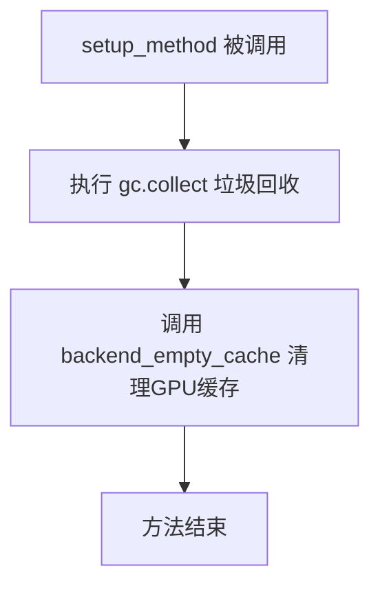

#### 带注释源码

```python
def setup_method(self):
    """
    Pytest fixture method，在每个测试方法执行前调用。
    用于清理 Python 垃圾回收和 GPU 显存缓存，确保测试环境干净。
    """
    # 触发 Python 垃圾回收，释放不再使用的对象内存
    gc.collect()
    # 清理 GPU/后端的显存缓存，避免显存泄漏影响测试结果
    backend_empty_cache(torch_device)
```


### `QuantizationTesterMixin.teardown_method`

该方法是测试框架的清理方法，在每个量化测试方法执行完成后被调用，用于释放 GPU 内存和执行垃圾回收，确保测试环境干净，避免内存泄漏影响后续测试。

参数：

- `self`：隐式参数，类型为 `QuantizationTesterMixin` 实例，表示调用该方法的对象本身

返回值：`None`，无返回值

#### 流程图

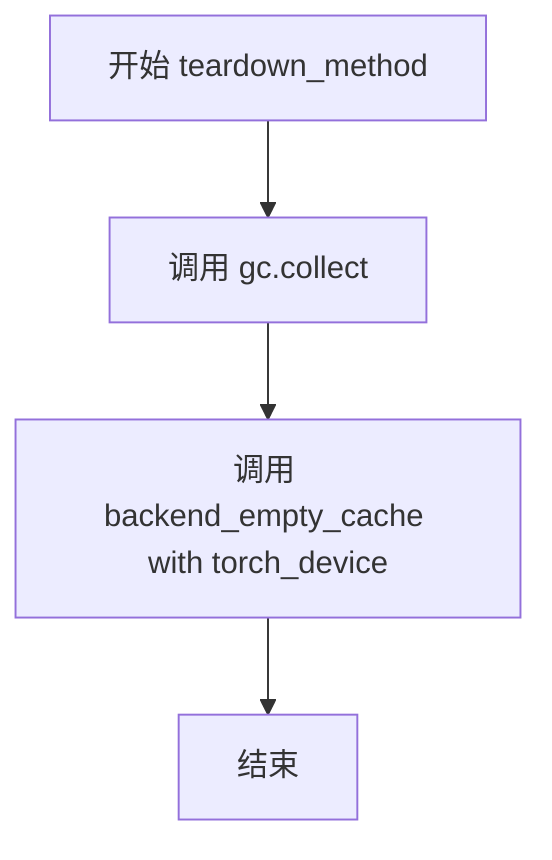

#### 带注释源码

```python
def teardown_method(self):
    """
    Cleanup method called after each test method.
    Performs garbage collection and clears backend memory cache.
    """
    gc.collect()  # 触发 Python 垃圾回收，释放不可达对象占用的内存
    backend_empty_cache(torch_device)  # 清空 GPU/后端缓存，释放显存
```


### `QuantizationTesterMixin._create_quantized_model`

该方法是 `QuantizationTesterMixin` 类的抽象方法，用于根据传入的量化配置参数创建量化模型。由于这是一个基类抽象方法，具体实现由子类（如 `BitsAndBytesConfigMixin`、`QuantoConfigMixin` 等）重写实现。

参数：

- `config_kwargs`：`Dict`，量化配置参数（如 `load_in_4bit`、`bnb_4bit_quant_type` 等）
- `**extra_kwargs`：`Dict`，额外的关键字参数，用于传递给 `from_pretrained`（如 `device_map`、`offload_folder` 等）

返回值：`torch.nn.Module`，返回量化后的模型实例

#### 流程图

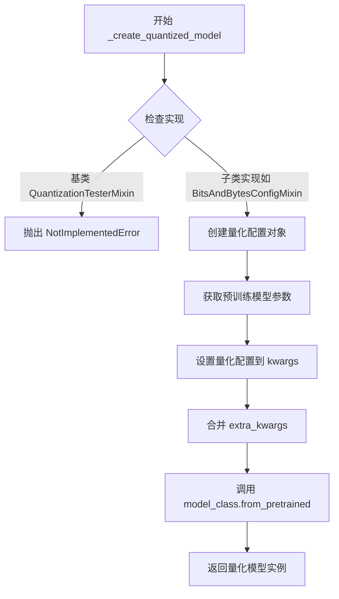

#### 带注释源码

```python
def _create_quantized_model(self, config_kwargs, **extra_kwargs):
    """
    Create a quantized model with the given config kwargs.

    Args:
        config_kwargs: Quantization config parameters
        **extra_kwargs: Additional kwargs to pass to from_pretrained (e.g., device_map, offload_folder)
    """
    # 基类中为抽象方法，子类必须实现此方法
    # 子类实现示例（来自 BitsAndBytesConfigMixin）:
    #     config = BitsAndBytesConfig(**config_kwargs)
    #     kwargs = getattr(self, "pretrained_model_kwargs", {}).copy()
    #     kwargs["quantization_config"] = config
    #     kwargs.update(extra_kwargs)
    #     return self.model_class.from_pretrained(self.pretrained_model_name_or_path, **kwargs)
    raise NotImplementedError("Subclass must implement _create_quantized_model")
```


### `QuantizationTesterMixin._verify_if_layer_quantized`

这是一个抽象方法，定义了验证神经网络层是否被正确量化的一致性接口。不同量化后端（如 BitsAndBytes、Quanto、GGUF、ModelOpt）通过重写此方法来实现各自特定的量化验证逻辑。

参数：

- `name`：`str`，层的名称，用于错误消息和调试
- `module`：`torch.nn.Module`，待验证的神经网络层模块
- `config_kwargs`：`dict`，量化配置参数字典，包含如 `load_in_4bit`、`bnb_4bit_quant_type` 等后端特定配置

返回值：`None`，通过 `assert` 语句进行验证，验证失败时抛出 `AssertionError`

#### 流程图

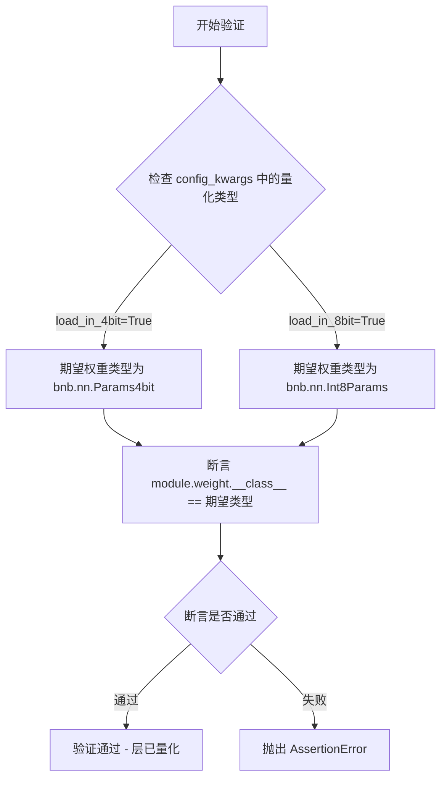

#### 带注释源码

```python
def _verify_if_layer_quantized(self, name, module, config_kwargs):
    """
    验证给定模块的层是否已被正确量化。
    
    这是一个抽象方法，由子类根据不同量化后端实现具体验证逻辑。
    各后端实现：
    - BitsAndBytes: 检查权重类型是 Params4bit 还是 Int8Params
    - Quanto: 检查模块是否为 QLinear 实例
    - GGUF: 检查权重是否为 GGUFParameter 类型
    - ModelOpt: 使用 mtq.utils.is_quantized() 检查
    - TorchAo: 验证模块是 Linear 类型（权重在模块外部存储）
    
    Args:
        name: 层的名称，用于错误消息
        module: 待验证的 torch.nn.Module 对象
        config_kwargs: 量化配置参数字典
    
    Raises:
        NotImplementedError: 基类中未实现，需由子类重写
        AssertionError: 验证失败时抛出
    """
    raise NotImplementedError("Subclass must implement _verify_if_layer_quantized")
```


### `QuantizationTesterMixin._is_module_quantized`

检查模块是否被量化。如果模块被量化则返回True，否则返回False。默认实现尝试调用`_verify_if_layer_quantized`并捕获异常，子类可以覆盖此方法以实现更高效的检查。

参数：

- `module`：`torch.nn.Module`，需要检查的模块

返回值：`bool`，如果模块被量化则返回True，否则返回False

#### 流程图

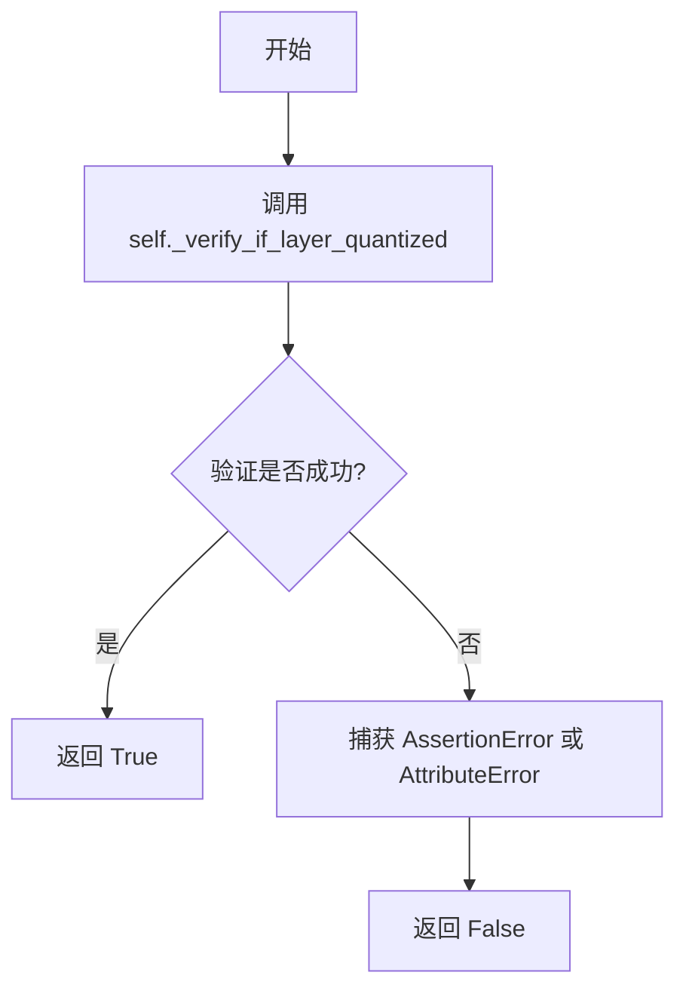

#### 带注释源码

```python
def _is_module_quantized(self, module):
    """
    Check if a module is quantized. Returns True if quantized, False otherwise.
    Default implementation tries _verify_if_layer_quantized and catches exceptions.
    Subclasses can override for more efficient checking.
    """
    try:
        # 尝试调用验证方法，使用空字符串作为名称，空字典作为配置
        self._verify_if_layer_quantized("", module, {})
        # 如果验证成功（未抛出异常），说明模块已被量化
        return True
    except (AssertionError, AttributeError):
        # 如果验证失败（抛出AssertionError或AttributeError），说明模块未被量化
        return False
```


### `QuantizationTesterMixin._load_unquantized_model`

加载未量化版本的预训练模型，使用模型类的 `from_pretrained` 方法进行加载。

参数：

- 无显式参数（仅包含 `self`）

返回值：`Model`（具体类型取决于 `self.model_class`），返回加载后的未量化模型实例。

#### 流程图

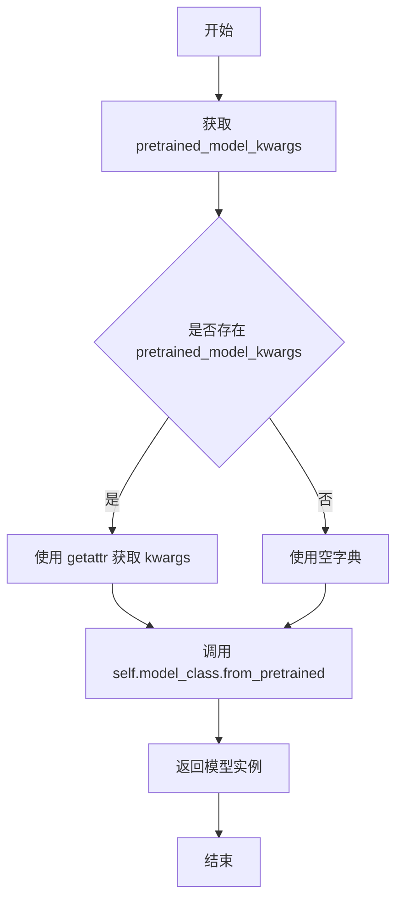

#### 带注释源码

```python
def _load_unquantized_model(self):
    """
    Load an unquantized version of the pretrained model.
    
    This method retrieves the pretrained model using the model class's
    from_pretrained method. It uses the class attributes:
    - self.model_class: The model class to instantiate
    - self.pretrained_model_name_or_path: The model identifier or path
    - self.pretrained_model_kwargs: Optional kwargs for from_pretrained
    
    Returns:
        Model: An instance of the model loaded from pretrained weights
    """
    # 获取可选的预训练模型参数（如 subfolder 等）
    # 如果不存在，则使用空字典作为默认值
    kwargs = getattr(self, "pretrained_model_kwargs", {})
    
    # 调用模型类的 from_pretrained 方法加载模型
    # 并返回未量化版本的模型实例
    return self.model_class.from_pretrained(self.pretrained_model_name_or_path, **kwargs)
```


### `QuantizationTesterMixin._test_quantization_num_parameters`

该方法用于验证量化后的模型与原始未量化模型的参数数量是否保持一致，确保量化过程不会改变模型的结构参数数量。

参数：

- `self`：`QuantizationTesterMixin`，调用该方法的类实例本身
- `config_kwargs`：`Dict`，量化配置参数，用于指定量化方法的具体配置（如量化位数、量化类型等）

返回值：`None`，该方法通过 `assert` 断言验证参数数量一致性，若验证失败则抛出 `AssertionError`

#### 流程图

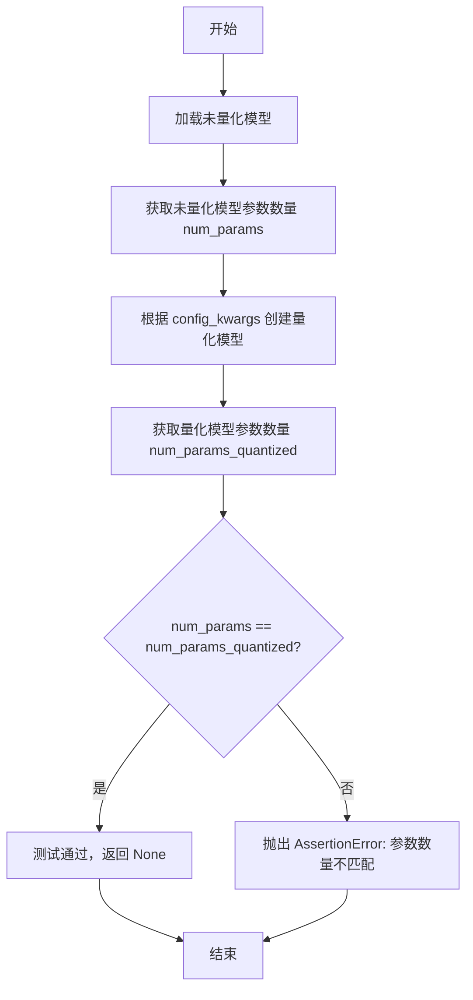

#### 带注释源码

```python
def _test_quantization_num_parameters(self, config_kwargs):
    """
    测试量化后模型的参数数量是否与未量化模型相同。
    
    参数量化不应改变模型的结构参数数量，只是参数的表示形式发生了变化。
    该测试用于验证量化过程没有引入额外的参数或丢失参数。
    
    Args:
        config_kwargs: 量化配置参数字典，如 load_in_4bit、bnb_4bit_quant_type 等
    """
    # 步骤1: 加载未量化的原始模型
    # 调用 _load_unquantized_model() 方法获取基准模型
    model = self._load_unquantized_model()
    
    # 步骤2: 获取未量化模型的参数总数
    # num_parameters() 返回模型中所有可训练参数的数量
    num_params = model.num_parameters()

    # 步骤3: 使用给定的量化配置创建量化模型
    # _create_quantized_model 是抽象方法，由子类实现具体量化逻辑
    model_quantized = self._create_quantized_model(config_kwargs)
    
    # 步骤4: 获取量化模型的参数总数
    num_params_quantized = model_quantized.num_parameters()

    # 步骤5: 验证参数数量一致性
    # 量化不应该改变模型的参数数量，只是改变参数的存储方式
    assert num_params == num_params_quantized, (
        f"Parameter count mismatch: unquantized={num_params}, quantized={num_params_quantized}"
    )
```


### `QuantizationTesterMixin._test_quantization_memory_footprint`

该方法用于测试量化模型的内存占用是否符合预期的内存减少比例，通过比较未量化模型和量化模型的内存占用来验证量化效果。

参数：

- `self`：隐式参数，QuantizationTesterMixin 类实例
- `config_kwargs`：`Dict`，量化配置参数，用于创建量化模型
- `expected_memory_reduction`：`float`，期望的内存减少倍数，默认为 1.2（即量化后内存应减少到至少原来的 1/1.2）

返回值：`None`，该方法通过断言验证内存减少比例，若不满足则抛出 `AssertionError`

#### 流程图

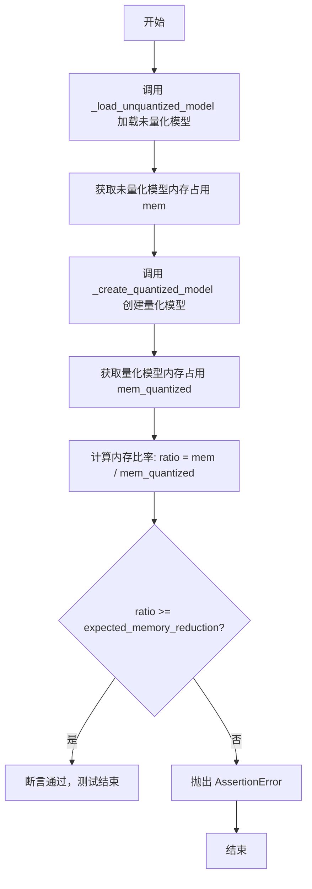

#### 带注释源码

```python
def _test_quantization_memory_footprint(self, config_kwargs, expected_memory_reduction=1.2):
    """
    测试量化模型的内存占用是否符合预期的内存减少比例。
    
    Args:
        config_kwargs: 量化配置参数
        expected_memory_reduction: 期望的内存减少倍数，默认为 1.2
    """
    # 步骤1: 加载未量化模型
    model = self._load_unquantized_model()
    
    # 步骤2: 获取未量化模型的内存占用（字节为单位）
    mem = model.get_memory_footprint()

    # 步骤3: 使用给定的配置参数创建量化模型
    model_quantized = self._create_quantized_model(config_kwargs)
    
    # 步骤4: 获取量化模型的内存占用
    mem_quantized = model_quantized.get_memory_footprint()

    # 步骤5: 计算内存减少比率（未量化内存 / 量化内存）
    # 比率越大说明压缩效果越好
    ratio = mem / mem_quantized
    
    # 步骤6: 断言验证内存减少比例是否满足预期
    # 如果实际比率小于期望值，则抛出 AssertionError 并显示详细信息
    assert ratio >= expected_memory_reduction, (
        f"Memory ratio {ratio:.2f} is less than expected ({expected_memory_reduction}x). "
        f"unquantized={mem}, quantized={mem_quantized}"
    )
```


### `QuantizationTesterMixin._test_quantization_inference`

该方法用于测试量化模型的推理功能，验证量化后的模型能够正常执行前向传播并输出有效结果（不为 None 且不包含 NaN 值）。

参数：

- `config_kwargs`：`dict`，量化配置参数，用于创建量化模型

返回值：`None`，该方法为测试方法，通过断言验证模型输出的有效性，不返回任何值

#### 流程图

```mermaid
flowchart TD
    A[开始] --> B[使用 config_kwargs 创建量化模型]
    B --> C[将模型移动到 torch_device]
    C --> D[调用 get_dummy_inputs 获取虚拟输入]
    D --> E[执行模型前向传播]
    E --> F{output is not None?}
    F -->|否| G[抛出 AssertionError: Model output is None]
    F -->|是| H{torch.isnan(output).any()?}
    H -->|是| I[抛出 AssertionError: Model output contains NaN]
    H -->|否| J[测试通过]
```

#### 带注释源码

```python
@torch.no_grad()  # 禁用梯度计算，用于推理测试
def _test_quantization_inference(self, config_kwargs):
    """
    测试量化模型的推理功能。
    
    该方法执行以下步骤：
    1. 使用给定的量化配置参数创建量化模型
    2. 将模型移动到指定的计算设备
    3. 获取虚拟输入数据
    4. 执行模型前向传播
    5. 验证输出不为 None 且不包含 NaN 值
    
    Args:
        config_kwargs: Quantization config parameters，用于配置量化方法的参数字典
        
    Returns:
        None，本方法为测试方法，通过断言验证，不返回任何值
    """
    # 步骤1：使用配置参数创建量化模型
    model_quantized = self._create_quantized_model(config_kwargs)
    
    # 步骤2：将模型移动到指定的设备（如 cuda 或 cpu）
    model_quantized.to(torch_device)
    
    # 步骤3：获取虚拟输入数据（由子类实现）
    inputs = self.get_dummy_inputs()
    
    # 步骤4：执行模型推理，获取第一项输出（return_dict=False 返回 tuple）
    output = model_quantized(**inputs, return_dict=False)[0]
    
    # 步骤5：断言验证 - 检查输出不为 None
    assert output is not None, "Model output is None"
    
    # 步骤6：断言验证 - 检查输出不包含 NaN 值
    assert not torch.isnan(output).any(), "Model output contains NaN"
```


### `QuantizationTesterMixin._test_quantization_dtype_assignment`

该方法用于测试量化模型的 dtype 分配行为，确保量化模型在尝试转换为标准浮点类型（如 float16）时会正确地抛出 ValueError，从而防止用户错误地进行不兼容的类型转换。

参数：

- `config_kwargs`：`dict`，量化配置参数，用于创建量化模型

返回值：`None`，该方法不返回任何值，主要通过 `pytest.raises` 断言来验证预期行为

#### 流程图

```mermaid
flowchart TD
    A[开始] --> B[创建量化模型 model = _create_quantization_model(config_kwargs)]
    C[测试1: model.to(torch.float16)] --> D{是否引发 ValueError?}
    D -->|是| E[测试通过]
    D -->|否| F[测试失败]
    G[测试2: model.to(device=device_0, dtype=torch.float16)] --> H{是否引发 ValueError?}
    H -->|是| I[测试通过]
    H -->|否| J[测试失败]
    K[测试3: model.float()] --> L{是否引发 ValueError?}
    L -->|是| M[测试通过]
    L -->|否| N[测试失败]
    O[测试4: model.half()] --> P{是否引发 ValueError?}
    P -->|是| Q[测试通过]
    P -->|否| R[测试失败]
    S[测试5: model.to(torch_device)] --> T[允许的操作, 测试通过]
    U[结束]
    E --> G
    I --> K
    M --> O
    Q --> S
    T --> U
```

#### 带注释源码

```python
def _test_quantization_dtype_assignment(self, config_kwargs):
    """
    测试量化模型的 dtype 分配行为。
    
    验证量化模型不能被转换为标准浮点类型（float16等），
    以防止用户进行不兼容的类型转换。
    
    Args:
        config_kwargs: 量化配置参数字典，用于创建量化模型
    """
    # 步骤1: 使用给定的配置参数创建量化模型
    model = self._create_quantized_model(config_kwargs)

    # 步骤2: 测试1 - 尝试将整个模型转换为 torch.float16
    # 量化模型不应该支持这种转换，应该抛出 ValueError
    with pytest.raises(ValueError):
        model.to(torch.float16)

    # 步骤3: 测试2 - 尝试使用 device 和 dtype 参数进行转换
    # 即使指定了设备，量化模型也不应该允许转换为 float16
    with pytest.raises(ValueError):
        device_0 = f"{torch_device}:0"
        model.to(device=device_0, dtype=torch.float16)

    # 步骤4: 测试3 - 尝试调用 .float() 方法
    # .float() 方法会尝试将模型转换为 float32，量化模型应该拒绝
    with pytest.raises(ValueError):
        model.float()

    # 步骤5: 测试4 - 尝试调用 .half() 方法
    # .half() 方法会尝试将模型转换为 float16，量化模型应该拒绝
    with pytest.raises(ValueError):
        model.half()

    # 步骤6: 测试5 - 验证模型可以正确移动到目标设备
    # 这是量化模型应该支持的正常操作
    model.to(torch_device)
```


### `QuantizationTesterMixin._test_quantization_lora_inference`

验证量化模型在添加 LoRA (Low-Rank Adaptation) 适配器后能否正常执行推理，并确保输出不为 None 且不包含 NaN 值。

参数：

- `config_kwargs`：`Dict`，量化配置参数，用于创建量化模型

返回值：`None`，该方法通过断言验证推理结果，不直接返回数据

#### 流程图

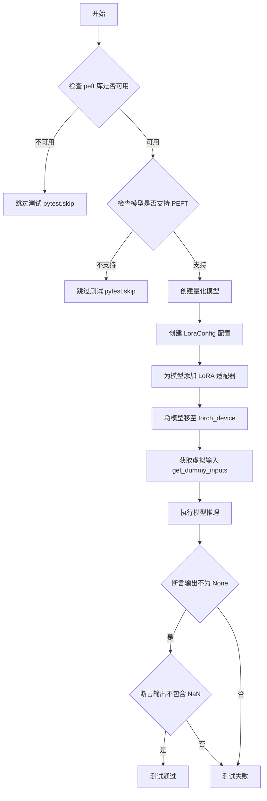

#### 带注释源码

```python
@torch.no_grad()  # 禁用梯度计算以节省内存
def _test_quantization_lora_inference(self, config_kwargs):
    """
    测试量化模型在添加 LoRA 适配器后的推理功能。
    
    验证流程：
    1. 检查 peft 库是否可用
    2. 检查模型类是否支持 PEFT 适配器
    3. 创建量化模型
    4. 添加 LoRA 适配器配置
    5. 执行推理并验证输出有效性
    """
    # 步骤 1: 尝试导入 peft 库，如果不可用则跳过测试
    try:
        from peft import LoraConfig
    except ImportError:
        pytest.skip("peft is not available")

    # 导入 PEFT 适配器混入类
    from diffusers.loaders.peft import PeftAdapterMixin

    # 步骤 2: 验证模型类是否支持 PEFT
    if not issubclass(self.model_class, PeftAdapterMixin):
        pytest.skip(f"PEFT is not supported for this model ({self.model_class.__name__})")

    # 步骤 3: 使用给定的量化配置创建量化模型
    model = self._create_quantized_model(config_kwargs)

    # 步骤 4: 配置 LoRA 适配器参数
    lora_config = LoraConfig(
        r=4,                        # LoRA 秩 rank
        lora_alpha=4,               # LoRA 缩放因子
        target_modules=["to_q", "to_k", "to_v", "to_out.0"],  # 目标注意力模块
        init_lora_weights=False,   # 不初始化 LoRA 权重（保持随机）
    )
    # 为模型添加 LoRA 适配器
    model.add_adapter(lora_config)
    # 将 LoRA 适配器权重移至计算设备（默认在 CPU 上）
    model.to(torch_device)

    # 步骤 5: 获取测试用的虚拟输入
    inputs = self.get_dummy_inputs()
    # 执行前向传播推理
    output = model(**inputs, return_dict=False)[0]

    # 验证输出不为 None
    assert output is not None, "Model output is None with LoRA"
    # 验证输出不包含 NaN 值
    assert not torch.isnan(output).any(), "Model output contains NaN with LoRA"
```


### `QuantizationTesterMixin._test_quantization_serialization`

该方法用于测试量化模型的序列化与反序列化功能。它创建一个量化模型，将其保存到临时路径，然后重新加载模型并运行推理，最后验证输出中不包含 NaN 值，以确保序列化过程正确无损。

参数：

- `self`：`QuantizationTesterMixin` 实例，隐式参数
- `config_kwargs`：`dict`，量化配置参数字典，包含如 `load_in_4bit`、`bnb_4bit_quant_type` 等量化参数
- `tmp_path`：`py.path.local` 或 `str`，pytest 提供的临时目录路径，用于保存和加载模型

返回值：`None`，该方法通过断言进行验证，不返回任何值

#### 流程图

```mermaid
flowchart TD
    A[开始] --> B[创建量化模型: model = self._create_quantized_model(config_kwargs)]
    B --> C[保存模型到临时路径: model.save_pretrained tmp_path, safe_serialization=True]
    C --> D[从临时路径加载模型: model_loaded = self.model_class.from_pretrained tmp_path]
    D --> E[获取虚拟输入: inputs = self.get_dummy_inputs]
    E --> F[运行推理: output = model_loaded inputs, return_dict=False]
    F --> G{检查输出是否包含 NaN}
    G -->|是| H[断言失败: 抛出 AssertionError]
    G -->|否| I[测试通过]
```

#### 带注释源码

```python
@torch.no_grad()  # 禁用梯度计算以节省内存并加速推理
def _test_quantization_serialization(self, config_kwargs, tmp_path):
    """
    测试量化模型的序列化（保存）和反序列化（加载）功能。
    
    该测试验证：
    1. 量化模型可以正确保存到磁盘
    2. 量化模型可以从磁盘正确加载
    3. 加载后的模型可以正常进行推理
    4. 推理输出不包含 NaN 值（表示量化/反量化过程正确）
    
    Args:
        config_kwargs: 量化配置参数字典，包含如 load_in_4bit、bnb_4bit_quant_type 等
        tmp_path: pytest 提供的临时目录路径，用于存放模型文件
    """
    # 第一步：使用给定的量化配置创建量化模型
    # _create_quantized_model 是抽象方法，由子类实现（如 BitsAndBytesTesterMixin）
    model = self._create_quantized_model(config_kwargs)

    # 第二步：将量化模型保存到临时路径
    # safe_serialization=True 使用安全序列化格式（safetensors），避免 pickle 安全风险
    model.save_pretrained(str(tmp_path), safe_serialization=True)

    # 第三步：从保存的路径重新加载模型
    # 重新加载的模型应保持量化状态
    model_loaded = self.model_class.from_pretrained(str(tmp_path))

    # 第四步：获取模型的虚拟输入
    # get_dummy_inputs 是测试类必须实现的方法，返回模型所需的输入字典
    inputs = self.get_dummy_inputs()

    # 第五步：使用加载的模型进行推理
    # return_dict=False 返回元组形式的输出，第一个元素是 logits/特征
    output = model_loaded(**inputs, return_dict=False)[0]

    # 第六步：验证输出不包含 NaN 值
    # 如果序列化/反序列化过程有问题，输出可能会产生 NaN
    assert not torch.isnan(output).any(), "Loaded model output contains NaN"
```


### `QuantizationTesterMixin._test_quantized_layers`

该方法用于验证量化模型中的线性层是否正确被量化。它会统计模型中所有线性层的数量，排除被保留为FP32的层，然后验证量化层数量与预期数量是否匹配。

参数：

- `config_kwargs`：`dict`，量化配置参数，用于创建量化模型

返回值：`None`，该方法通过断言验证量化层，不返回任何值

#### 流程图

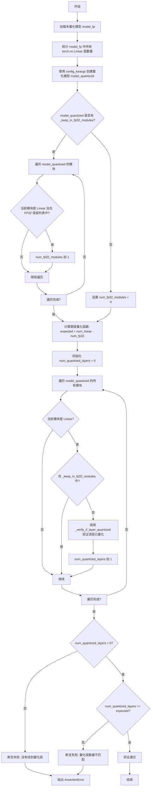

#### 带注释源码

```python
def _test_quantized_layers(self, config_kwargs):
    """
    Test that quantized layers are correctly quantized in the quantized model.
    
    Args:
        config_kwargs: Quantization config parameters used to create the quantized model
    """
    # Step 1: Load unquantized model and count total linear layers
    model_fp = self._load_unquantized_model()
    num_linear_layers = sum(1 for module in model_fp.modules() if isinstance(module, torch.nn.Linear))

    # Step 2: Create quantized model using the provided config
    model_quantized = self._create_quantized_model(config_kwargs)

    # Step 3: Count modules that should be kept in FP32 (not quantized)
    num_fp32_modules = 0
    if hasattr(model_quantized, "_keep_in_fp32_modules") and model_quantized._keep_in_fp32_modules:
        for name, module in model_quantized.named_modules():
            if isinstance(module, torch.nn.Linear):
                # Check if this module matches any FP32 preservation pattern
                if any(fp32_name in name for fp32_name in model_quantized._keep_in_fp32_modules):
                    num_fp32_modules += 1

    # Step 4: Calculate expected number of quantized layers
    # Expected = total linear layers - FP32 preserved layers
    expected_quantized_layers = num_linear_layers - num_fp32_modules

    # Step 5: Verify each linear layer is properly quantized
    num_quantized_layers = 0
    for name, module in model_quantized.named_modules():
        if isinstance(module, torch.nn.Linear):
            # Skip modules that should remain in FP32
            if hasattr(model_quantized, "_keep_in_fp32_modules") and model_quantized._keep_in_fp32_modules:
                if any(fp32_name in name for fp32_name in model_quantized._keep_in_fp32_modules):
                    continue
            # Verify this layer is quantized using backend-specific verification
            self._verify_if_layer_quantized(name, module, config_kwargs)
            num_quantized_layers += 1

    # Step 6: Assert that quantization was successful
    # Check 1: At least one layer should be quantized
    assert num_quantized_layers > 0, (
        f"No quantized layers found in model (expected {expected_quantized_layers} linear layers, {num_fp32_modules} kept in FP32)"
    )
    # Check 2: Quantized layer count must match expected
    assert num_quantized_layers == expected_quantized_layers, (
        f"Quantized layer count mismatch: expected {expected_quantized_layers}, got {num_quantized_layers} (total linear layers: {num_linear_layers}, FP32 modules: {num_fp32_modules})"
    )
```


### `QuantizationTesterMixin._test_quantization_modules_to_not_convert`

该方法用于测试量化配置中的 `modules_to_not_convert` 参数是否正确排除指定的模块不被量化，同时验证其他模块仍被正确量化，并比较排除模块后的模型内存占用应大于完全量化模型。

参数：

- `self`：`QuantizationTesterMixin`，mixin 类实例自身
- `config_kwargs`：`Dict`，基础量化配置参数，用于创建量化模型
- `modules_to_not_convert`：`List[str]]`，需要排除量化的小模块名称列表

返回值：`None`，该方法通过断言进行验证，不返回任何值

#### 流程图

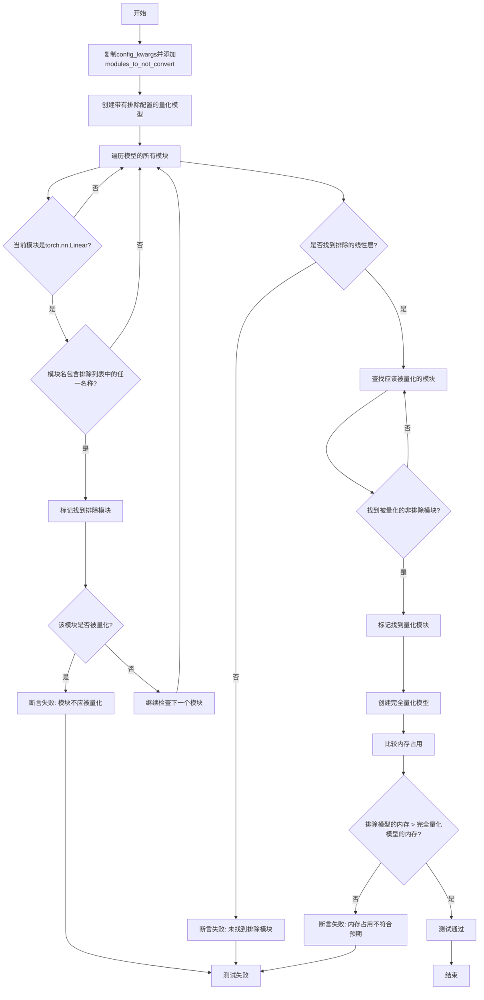

#### 带注释源码

```python
def _test_quantization_modules_to_not_convert(self, config_kwargs, modules_to_not_convert):
    """
    Test that modules specified in modules_to_not_convert are not quantized.

    Args:
        config_kwargs: Base quantization config kwargs
        modules_to_not_convert: List of module names to exclude from quantization
    """
    # 步骤1: 创建包含modules_to_not_convert参数的量化配置
    # 复制基础配置，避免修改原始配置
    config_kwargs_with_exclusion = config_kwargs.copy()
    # 将需要排除的模块列表添加到配置中
    config_kwargs_with_exclusion["modules_to_not_convert"] = modules_to_not_convert

    # 步骤2: 使用排除配置创建量化模型
    model_with_exclusion = self._create_quantized_model(config_kwargs_with_exclusion)

    # 步骤3: 验证排除列表中的模块确实未被量化
    found_excluded = False  # 标记是否找到排除的模块
    for name, module in model_with_exclusion.named_modules():
        if isinstance(module, torch.nn.Linear):
            # 检查当前模块名是否包含排除列表中的任一名称
            if any(excluded in name for excluded in modules_to_not_convert):
                found_excluded = True
                # 断言: 排除列表中的模块不应被量化
                assert not self._is_module_quantized(module), (
                    f"Module {name} should not be quantized but was found to be quantized"
                )

    # 断言: 必须在模型中找到被排除的线性层
    assert found_excluded, f"No linear layers found in excluded modules: {modules_to_not_convert}"

    # 步骤4: 验证不在排除列表中的模块仍被正确量化
    found_quantized = False
    for name, module in model_with_exclusion.named_modules():
        if isinstance(module, torch.nn.Linear):
            # 检查当前模块是否不在排除列表中
            if not any(excluded in name for excluded in modules_to_not_convert):
                # 检查该模块是否被量化
                if self._is_module_quantized(module):
                    found_quantized = True
                    break

    # 断言: 必须找到被量化的非排除模块
    assert found_quantized, "No quantized layers found outside of excluded modules"

    # 步骤5: 比较内存占用
    # 创建完全量化（无排除）的模型用于对比
    model_fully_quantized = self._create_quantized_model(config_kwargs)

    # 获取两种模型的内存占用
    mem_with_exclusion = model_with_exclusion.get_memory_footprint()
    mem_fully_quantized = model_fully_quantized.get_memory_footprint()

    # 断言: 排除部分模块后，模型内存占用应大于完全量化模型
    assert mem_with_exclusion > mem_fully_quantized, (
        f"Model with exclusions should be larger. With exclusion: {mem_with_exclusion}, fully quantized: {mem_fully_quantized}"
    )
```


### `QuantizationTesterMixin._test_quantization_device_map`

测试量化模型是否正确支持 `device_map="auto"`，验证模型在自动设备映射下能正确加载并进行推理。

参数：

- `self`：`QuantizationTesterMixin`，QuantizationTesterMixin 类实例，隐含参数
- `config_kwargs`：`Dict`，量化配置参数，用于创建量化模型

返回值：`None`，无返回值（测试方法，仅通过断言验证）

#### 流程图

```mermaid
flowchart TD
    A[开始: _test_quantization_device_map] --> B[调用 _create_quantized_model 创建量化模型, 传入 device_map='auto']
    B --> C{断言: model 是否有 hf_device_map 属性}
    C -->|是| D[断言: hf_device_map 是否不为 None]
    C -->|否| E[抛出 AssertionError: Model should have hf_device_map attribute]
    D --> F[调用 get_dummy_inputs 获取测试输入]
    F --> G[执行模型前向传播: model(**inputs)]
    G --> H{断言: output 是否不为 None}
    H -->|是| I[断言: output 是否包含 NaN]
    H -->|否| J[抛出 AssertionError: Model output is None]
    I -->|是| K[抛出 AssertionError: Model output contains NaN]
    I -->|否| L[测试通过]
    E --> M[测试失败]
    J --> M
    K --> M
```

#### 带注释源码

```python
@torch.no_grad()
def _test_quantization_device_map(self, config_kwargs):
    """
    Test that quantized models work correctly with device_map="auto".

    Args:
        config_kwargs: Base quantization config kwargs
    """
    # 使用 device_map="auto" 创建量化模型
    # 这样模型会自动将各层分配到合适的设备上
    model = self._create_quantized_model(config_kwargs, device_map="auto")

    # 验证模型是否具有 hf_device_map 属性
    # device_map 用于跟踪模型各层在设备上的映射关系
    assert hasattr(model, "hf_device_map"), "Model should have hf_device_map attribute"
    
    # 验证 hf_device_map 是否正确初始化（非 None）
    assert model.hf_device_map is not None, "hf_device_map should not be None"

    # 获取测试输入数据
    inputs = self.get_dummy_inputs()
    
    # 执行模型前向传播，获取输出
    # return_dict=False 返回元组形式的输出，取第一个元素（即 logits/tensor）
    output = model(**inputs, return_dict=False)[0]
    
    # 断言输出不为 None
    assert output is not None, "Model output is None"
    
    # 断言输出中不包含 NaN 值（确保数值稳定性）
    assert not torch.isnan(output).any(), "Model output contains NaN"
```


### `QuantizationTesterMixin._test_dequantize`

该方法用于测试量化模型的 `dequantize()` 功能，验证解量化操作能否将量化模型正确转换回标准线性层，并确保解量化后模型仍能正常执行推理且输出无 NaN 值。

参数：

- `config_kwargs`：`dict`，量化配置参数，用于创建量化模型

返回值：`None`，该方法为测试方法，通过断言验证解量化功能的正确性

#### 流程图

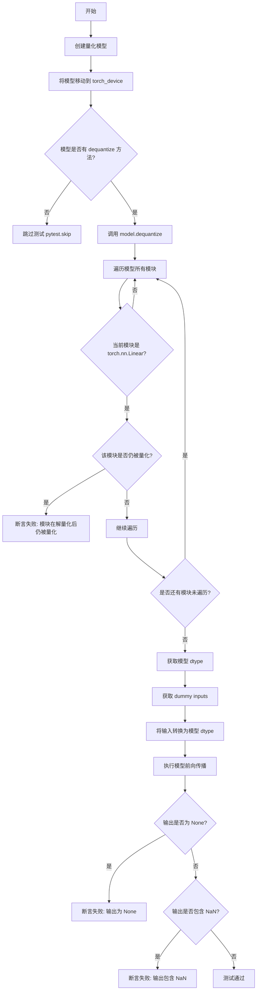

#### 带注释源码

```python
@torch.no_grad()
def _test_dequantize(self, config_kwargs):
    """
    Test that dequantize() converts quantized model back to standard linear layers.

    Args:
        config_kwargs: Quantization config parameters
    """
    # 步骤1: 使用给定的配置参数创建量化模型
    model = self._create_quantized_model(config_kwargs)
    
    # 步骤2: 将模型移动到指定的计算设备（如 CUDA）
    model.to(torch_device)

    # 步骤3: 检查模型是否支持 dequantize 方法，若不支持则跳过测试
    if not hasattr(model, "dequantize"):
        pytest.skip("Model does not have dequantize method")

    # 步骤4: 调用 dequantize 方法将量化模型转换回标准模型
    model.dequantize()

    # 步骤5: 验证所有 Linear 层已被正确解量化
    # 遍历模型中所有模块，检查每个 Linear 层是否已脱离量化状态
    for name, module in model.named_modules():
        if isinstance(module, torch.nn.Linear):
            assert not self._is_module_quantized(module), f"Module {name} is still quantized after dequantize()"

    # 步骤6: 获取模型的原始数据类型（从第一个参数获取）
    model_dtype = next(model.parameters()).dtype

    # 步骤7: 获取测试输入数据
    inputs = self.get_dummy_inputs()
    
    # 步骤8: 将输入张量转换为模型的数据类型
    # 仅对浮点张量进行转换，保持其他类型（如整型）不变
    inputs = {
        k: v.to(model_dtype) if isinstance(v, torch.Tensor) and v.is_floating_point() else v
        for k, v in inputs.items()
    }
    
    # 步骤9: 执行模型前向传播，验证解量化后模型可正常推理
    output = model(**inputs, return_dict=False)[0]
    
    # 步骤10: 验证输出有效性 - 确保输出不为 None
    assert output is not None, "Model output is None after dequantization"
    
    # 步骤11: 验证输出无数值异常 - 确保输出不包含 NaN 值
    assert not torch.isnan(output).any(), "Model output contains NaN after dequantization"
```


### `QuantizationTesterMixin._test_quantization_training`

该方法用于测试量化模型是否能够与 LoRA（Low-Rank Adaptation）类适配器结合进行训练。它通过冻结模型参数、向注意力层添加 LoRA 适配器、执行前向和反向传播，来验证梯度是否被正确计算，从而确保量化模型在训练场景下的可用性。

参数：

- `config_kwargs`：`Dict`，量化配置参数，用于创建量化模型

返回值：`None`，该方法无返回值，通过断言验证训练过程中的梯度计算

#### 流程图

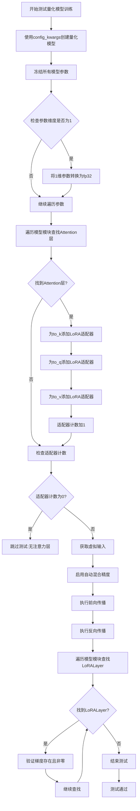

#### 带注释源码

```python
def _test_quantization_training(self, config_kwargs):
    """
    Test that quantized models can be used for training with LoRA-like adapters.

    This test:
    1. Freezes all model parameters
    2. Casts small parameters (e.g., layernorm) to fp32 for stability
    3. Adds LoRA adapters to attention layers
    4. Runs forward and backward passes
    5. Verifies gradients are computed correctly

    Args:
        config_kwargs: Quantization config parameters
    """
    # 步骤1: 使用配置参数创建量化模型
    model = self._create_quantized_model(config_kwargs)

    # 步骤2: 冻结所有模型参数
    for param in model.parameters():
        param.requires_grad = False
        # 对于1维参数（如layernorm），转换为fp32以保证数值稳定性
        if param.ndim == 1:
            param.data = param.data.to(torch.float32)

    # 步骤3: 向注意力层添加LoRA适配器
    adapter_count = 0
    for _, module in model.named_modules():
        # 检查模块类型名称中是否包含"Attention"
        if "Attention" in repr(type(module)):
            # 为to_k、to_q、to_v添加LoRA层
            if hasattr(module, "to_k"):
                module.to_k = LoRALayer(module.to_k, rank=4)
                adapter_count += 1
            if hasattr(module, "to_q"):
                module.to_q = LoRALayer(module.to_q, rank=4)
                adapter_count += 1
            if hasattr(module, "to_v"):
                module.to_v = LoRALayer(module.to_v, rank=4)
                adapter_count += 1

    # 如果没有找到注意力层，则跳过测试
    if adapter_count == 0:
        pytest.skip("No attention layers found in model for adapter training test")

    # 步骤4: 获取虚拟输入数据
    inputs = self.get_dummy_inputs()

    # 步骤5: 在自动混合精度上下文中执行前向和反向传播
    with torch.amp.autocast(torch_device, dtype=torch.float16):
        out = model(**inputs, return_dict=False)[0]
        # 对输出执行归一化操作后进行反向传播，确保梯度流经整个网络
        out.norm().backward()

    # 步骤6: 验证梯度是否被正确计算
    for module in model.modules():
        if isinstance(module, LoRALayer):
            # 验证LoRA适配器的梯度存在
            assert module.adapter[1].weight.grad is not None, "LoRA adapter gradient is None"
            # 验证梯度范数大于0，确保梯度确实被计算
            assert module.adapter[1].weight.grad.norm().item() > 0, "LoRA adapter gradient norm is zero"
```


### `BitsAndBytesConfigMixin._create_quantized_model`

该方法用于创建基于 BitsAndBytes 量化配置的模型实例。它接受量化配置参数，合并预训练模型加载参数，并通过 `from_pretrained` 方法加载量化后的模型。

参数：

- `config_kwargs`：`Dict`，量化配置参数（如 `load_in_4bit`、`bnb_4bit_quant_type` 等）
- `**extra_kwargs`：`Dict`，额外的关键字参数，用于传递给 `from_pretrained`（如 `device_map`、`offload_folder` 等）

返回值：`Model`，返回加载了量化配置的预训练模型实例

#### 流程图

```mermaid
flowchart TD
    A[开始] --> B[从 config_kwargs 创建 BitsAndBytesConfig 对象]
    B --> C[获取 pretrained_model_kwargs 并复制]
    C --> D[将 quantization_config 设置为创建的 config]
    D --> E[合并 extra_kwargs 到 kwargs]
    E --> F[调用 model_class.from_pretrained 加载模型]
    F --> G[返回量化后的模型实例]
```

#### 带注释源码

```python
def _create_quantized_model(self, config_kwargs, **extra_kwargs):
    """
    Create a quantized model with the given config kwargs.

    Args:
        config_kwargs: Quantization config parameters (e.g., load_in_4bit, bnb_4bit_quant_type)
        **extra_kwargs: Additional kwargs to pass to from_pretrained (e.g., device_map, offload_folder)
    """
    # 第一步：从 config_kwargs 参数创建 BitsAndBytesConfig 量化配置对象
    config = BitsAndBytesConfig(**config_kwargs)
    
    # 第二步：获取预训练模型的配置参数（从子类继承的类属性）
    # 如果子类没有定义，则默认为空字典
    kwargs = getattr(self, "pretrained_model_kwargs", {}).copy()
    
    # 第三步：将量化配置添加到 kwargs 中
    # 这样在加载模型时会自动应用量化配置
    kwargs["quantization_config"] = config
    
    # 第四步：合并额外的关键字参数
    # extra_kwargs 会覆盖 pretrained_model_kwargs 中的同名参数
    kwargs.update(extra_kwargs)
    
    # 第五步：调用模型类的 from_pretrained 方法加载预训练模型
    # 同时应用量化配置和其他参数
    return self.model_class.from_pretrained(self.pretrained_model_name_or_path, **kwargs)
```


### `BitsAndBytesConfigMixin._verify_if_layer_quantized`

该方法用于验证给定的层是否已按照BitsAndBytes配置（4bit或8bit）正确量化，通过检查模块权重类型是否与预期的一致来判断。

参数：

- `name`：`str`，层的名称，用于错误信息中的标识
- `module`：`torch.nn.Module`，要验证是否已量化的模块（通常是 `torch.nn.Linear`）
- `config_kwargs`：`dict`，包含量化配置参数的字典，特别关注 `load_in_4bit` 键来确定是4bit还是8bit量化

返回值：`None`，该方法通过断言验证，不返回任何值；若验证失败则抛出 `AssertionError`

#### 流程图

```mermaid
flowchart TD
    A[开始] --> B{config_kwargs.getload_in_4bit是否为True}
    B -->|True| C[expected_weight_class = bnb.nn.Params4bit]
    B -->|False| D[expected_weight_class = bnb.nn.Int8Params]
    C --> E{module.weight.__class__ == expected_weight_class}
    D --> E
    E -->|是| F[验证通过 - 无返回值]
    E -->|否| G[抛出AssertionError: 层权重类型不匹配]
    F --> H[结束]
    G --> H
```

#### 带注释源码

```python
def _verify_if_layer_quantized(self, name, module, config_kwargs):
    """
    验证指定层是否已按BitsAndBytes配置正确量化。
    
    该方法根据config_kwargs中的load_in_4bit参数判断当前层应该是4bit量化还是8bit量化，
    然后检查module.weight的实际类型是否与预期类型匹配。
    
    Args:
        name: 层的名称，用于错误信息
        module: 要检查的神经网络模块（通常是Linear层）
        config_kwargs: 包含量化配置的字典，必须包含load_in_4bit键来指定量化类型
    
    Raises:
        AssertionError: 如果模块权重的类型与预期类型不匹配
    """
    # 根据load_in_4bit配置确定期望的权重参数类
    # 4bit量化使用bnb.nn.Params4bit，8bit量化使用bnb.nn.Int8Params
    expected_weight_class = bnb.nn.Params4bit if config_kwargs.get("load_in_4bit") else bnb.nn.Int8Params
    
    # 断言验证模块权重的实际类型是否与预期类型完全一致
    assert module.weight.__class__ == expected_weight_class, (
        f"Layer {name} has weight type {module.weight.__class__}, expected {expected_weight_class}"
    )
```


### `BitsAndBytesTesterMixin.test_bnb_quantization_num_parameters`

这是一个参数化测试方法，用于验证 BitsAndBytes 量化模型的参数数量与未量化模型保持一致。通过 `@pytest.mark.parametrize` 装饰器，该测试会针对三种不同的 BitsAndBytes 配置（4bit_nf4、4bit_fp4、8bit）分别执行，确保量化操作不会改变模型的总参数数量。

参数：

-  `config_name`：`str`，BitsAndBytes 配置的名称，用于从 `BNB_CONFIGS` 字典中获取对应的量化配置参数。可选值包括 "4bit_nf4"、"4bit_fp4"、"8bit"

返回值：`None`，测试方法无返回值，通过 `assert` 断言验证参数数量一致性

#### 流程图

```mermaid
flowchart TD
    A[测试开始] --> B[获取config_name参数]
    B --> C[从BNB_CONFIGS字典获取对应配置]
    C --> D[调用父类方法_test_quantization_num_parameters]
    D --> E[加载未量化模型并获取参数数量]
    E --> F[创建量化模型并获取参数数量]
    F --> G{比较参数数量是否相等}
    G -->|是| H[测试通过]
    G -->|否| I[断言失败, 抛出AssertionError]
    H --> J[测试结束]
    I --> J
```

#### 带注释源码

```python
@pytest.mark.parametrize(
    "config_name",
    list(BitsAndBytesConfigMixin.BNB_CONFIGS.keys()),
    ids=list(BitsAndBytesConfigMixin.BNB_CONFIGS.keys()),
)
def test_bnb_quantization_num_parameters(self, config_name):
    """
    测试量化模型的参数数量与未量化模型是否一致
    
    参数化测试，针对三种BitsAndBytes配置进行测试：
    - 4bit_nf4: 4位NF4量化
    - 4bit_fp4: 4位FP4量化
    - 8bit: 8位量化
    
    Args:
        config_name: 配置名称，用于从BNB_CONFIGS获取对应配置
    """
    # 从BitsAndBytesConfigMixin类属性BNB_CONFIGS中获取对应config_name的配置
    # BNB_CONFIGS字典包含三种配置：
    # {
    #     "4bit_nf4": {"load_in_4bit": True, "bnb_4bit_quant_type": "nf4", "bnb_4bit_compute_dtype": torch.float16},
    #     "4bit_fp4": {"load_in_4bit": True, "bnb_4bit_quant_type": "fp4", "bnb_4bit_compute_dtype": torch.float16},
    #     "8bit": {"load_in_8bit": True}
    # }
    self._test_quantization_num_parameters(BitsAndBytesConfigMixin.BNB_CONFIGS[config_name])
```


### `BitsAndBytesTesterMixin.test_bnb_quantization_memory_footprint`

该方法用于测试 BitsAndBytes 量化模型的内存占用是否符合预期，通过比较未量化模型与量化模型的内存占用比率来验证量化效果。

参数：

- `self`：`BitsAndBytesTesterMixin`，测试类实例本身
- `config_name`：`str`，配置名称，用于从 `BitsAndBytesConfigMixin.BNB_CONFIGS` 中获取对应的量化配置（如 "4bit_nf4"、"4bit_fp4"、"8bit"）

返回值：`None`，该方法通过 `assert` 语句进行断言验证，不返回任何值

#### 流程图

```mermaid
flowchart TD
    A[开始测试] --> B[从 BNB_CONFIGS 获取 config_kwargs]
    B --> C[从 BNB_EXPECTED_MEMORY_REDUCTIONS 获取 expected 值]
    C --> D[调用父类方法 _test_quantization_memory_footprint]
    
    D --> D1[加载未量化模型]
    D1 --> D2[获取未量化模型内存占用 mem]
    D2 --> D3[创建量化模型]
    D3 --> D4[获取量化模型内存占用 mem_quantized]
    D4 --> D5[计算内存比率 ratio = mem / mem_quantized]
    D5 --> D6{ratio >= expected?}
    
    D6 -->|是| D7[测试通过]
    D6 -->|否| D8[抛出 AssertionError]
    D8 --> E[测试失败]
```

#### 带注释源码

```python
@pytest.mark.parametrize(
    "config_name",
    list(BitsAndBytesConfigMixin.BNB_CONFIGS.keys()),
    ids=list(BitsAndBytesConfigMixin.BNB_CONFIGS.keys()),
)
def test_bnb_quantization_memory_footprint(self, config_name):
    """
    测试 BitsAndBytes 量化模型的内存占用是否符合预期。
    
    该方法是一个 pytest 测试方法，使用 @pytest.mark.parametrize 装饰器
    参数化测试用例，支持多种量化配置（4bit_nf4, 4bit_fp4, 8bit）。
    内部委托给父类 QuantizationTesterMixin._test_quantization_memory_footprint
    方法执行实际的内存测试逻辑。
    
    Args:
        config_name: 量化配置名称，对应 BitsAndBytesConfigMixin.BNB_CONFIGS 中的键
    """
    # 从配置字典中获取对应配置名称的量化参数
    config_kwargs = BitsAndBytesConfigMixin.BNB_CONFIGS[config_name]
    
    # 获取预期的内存 reduction 比率，默认值为 1.2
    # 不同配置的预期值：
    # - "4bit_nf4": 3.0
    # - "4bit_fp4": 3.0
    # - "8bit": 1.5
    expected = BitsAndBytesConfigMixin.BNB_EXPECTED_MEMORY_REDUCTIONS.get(config_name, 1.2)
    
    # 调用父类的测试方法执行实际的内存占用验证
    self._test_quantization_memory_footprint(
        config_kwargs,  # 量化配置参数字典
        expected_memory_reduction=expected  # 预期的内存减少倍数
    )
```

---

### 附：`QuantizationTesterMixin._test_quantization_memory_footprint`（实际执行逻辑）

该方法是实际执行内存占用测试的核心逻辑。

参数：

- `self`：`QuantizationTesterMixin`，测试类实例本身
- `config_kwargs`：`dict`，量化配置参数字典
- `expected_memory_reduction`：`float`，预期的内存减少倍数，默认为 1.2

返回值：`None`，该方法通过 `assert` 语句进行断言验证

#### 带注释源码

```python
def _test_quantization_memory_footprint(self, config_kwargs, expected_memory_reduction=1.2):
    """
    测试量化模型的内存占用是否按预期减少。
    
    该方法执行以下步骤：
    1. 加载未量化模型并获取其内存占用
    2. 创建量化模型并获取其内存占用
    3. 计算内存比率，验证是否达到预期减少倍数
    
    Args:
        config_kwargs: 量化配置参数（如 load_in_4bit, bnb_4bit_quant_type 等）
        expected_memory_reduction: 预期的内存减少倍数，默认为 1.2
    """
    # 步骤1：加载未量化模型
    model = self._load_unquantized_model()
    
    # 获取未量化模型的内存占用（以字节为单位）
    mem = model.get_memory_footprint()

    # 步骤2：使用相同的预训练模型路径创建量化模型
    model_quantized = self._create_quantized_model(config_kwargs)
    
    # 获取量化模型的内存占用
    mem_quantized = model_quantized.get_memory_footprint()

    # 步骤3：计算内存减少比率
    ratio = mem / mem_quantized
    
    # 验证内存减少是否达到预期
    assert ratio >= expected_memory_reduction, (
        f"Memory ratio {ratio:.2f} is less than expected ({expected_memory_reduction}x). "
        f"unquantized={mem}, quantized={mem_quantized}"
    )
```


### `BitsAndBytesTesterMixin.test_bnb_quantization_inference`

该方法是 BitsAndBytes 量化测试 mixin 类中的推理测试方法，通过参数化测试验证量化模型在 4bit (nf4/fp4) 和 8bit 量化配置下的推理能力，确保模型能够正确输出非 NaN 的结果。

参数：

- `config_name`：`str`，量化配置名称，用于从 `BitsAndBytesConfigMixin.BNB_CONFIGS` 中获取对应的量化参数（如 "4bit_nf4"、"4bit_fp4"、"8bit"）

返回值：`None`，该方法为测试方法，通过断言验证模型推理的正确性，不返回任何值

#### 流程图

```mermaid
flowchart TD
    A[开始 test_bnb_quantization_inference] --> B[接收 config_name 参数]
    B --> C[从 BNB_CONFIGS 获取对应配置]
    C --> D[调用 _test_quantization_inference 方法]
    D --> E[创建量化模型]
    E --> F[将模型移动到设备]
    F --> G[获取测试输入]
    G --> H[执行模型前向传播]
    H --> I{输出是否为 None?}
    I -->|是| J[断言失败: 输出为 None]
    I -->|否| K{输出包含 NaN?}
    K -->|是| J
    K -->|否| L[测试通过]
    J --> M[抛出 AssertionError]
    L --> N[结束]
    M --> N
```

#### 带注释源码

```python
@pytest.mark.parametrize(
    "config_name",
    list(BitsAndBytesConfigMixin.BNB_CONFIGS.keys()),
    ids=list(BitsAndBytesConfigMixin.BNB_CONFIGS.keys()),
)
def test_bnb_quantization_inference(self, config_name):
    """
    测试 BitsAndBytes 量化模型的推理功能。

    使用 pytest.mark.parametrize 参数化测试，遍历 BNB_CONFIGS 中定义的所有
    量化配置（4bit_nf4, 4bit_fp4, 8bit），验证量化模型能够正确执行推理并输出
    有效的数值结果。

    参数:
        config_name: str, 量化配置名称，对应 BNB_CONFIGS 字典中的键

    返回:
        None: 测试方法，通过断言验证，不返回任何值
    """
    # 调用基类的量化推理测试方法，传入对应配置
    self._test_quantization_inference(BitsAndBytesConfigMixin.BNB_CONFIGS[config_name])
```


### `BitsAndBytesTesterMixin.test_bnb_quantization_dtype_assignment`

这是一个测试方法，用于验证量化后的模型不能被转换为其他数据类型（确保量化状态不会被意外改变）。

参数：

-  `config_name`：`str`，配置名称参数化，此处固定为 "4bit_nf4"

返回值：`None`，无返回值（测试方法）

#### 流程图

```mermaid
flowchart TD
    A[开始测试] --> B[创建量化模型: config_name='4bit_nf4']
    B --> C[尝试 model.to(torch.float16)]
    C --> D{是否抛出 ValueError?}
    D -->|是| E[继续下一步]
    D -->|否| F[测试失败]
    E --> G[尝试 model.to:0 dtype=torch.float16]
    G --> H{是否抛出 ValueError?}
    H -->|是| I[继续下一步]
    H -->|否| F
    I --> J[尝试 model.float]
    J --> K{是否抛出 ValueError?}
    K -->|是| L[继续下一步]
    K -->|否| F
    L --> M[尝试 model.half]
    M --> N{是否抛出 ValueError?}
    N -->|是| O[尝试 model.to torch_device]
    N -->|否| F
    O --> P[测试通过]
```

#### 带注释源码

```python
@pytest.mark.parametrize("config_name", ["4bit_nf4"], ids=["4bit_nf4"])
def test_bnb_quantization_dtype_assignment(self, config_name):
    """
    测试量化模型的 dtype 赋值限制。
    
    验证量化后的模型不能通过 .to(), .float(), .half() 等方法
    转换为其他数据类型，确保量化状态不会被意外改变。
    """
    # 调用父类 QuantizationTesterMixin 的测试方法
    self._test_quantization_dtype_assignment(BitsAndBytesConfigMixin.BNB_CONFIGS[config_name])
```

#### 底层实现 `_test_quantization_dtype_assignment`

```python
def _test_quantization_dtype_assignment(self, config_kwargs):
    """
    测试量化模型的 dtype 赋值行为。
    
    Args:
        config_kwargs: 量化配置参数字典
    """
    # 使用给定的配置创建量化模型
    model = self._create_quantized_model(config_kwargs)

    # 验证 1: 不能使用 .to(torch.float16) 转换模型
    with pytest.raises(ValueError):
        model.to(torch.float16)

    # 验证 2: 不能使用 .to(device=xxx:0, dtype=torch.float16) 转换
    with pytest.raises(ValueError):
        device_0 = f"{torch_device}:0"
        model.to(device=device_0, dtype=torch.float16)

    # 验证 3: 不能使用 .float() 方法转换模型
    with pytest.raises(ValueError):
        model.float()

    # 验证 4: 不能使用 .half() 方法转换模型
    with pytest.raises(ValueError):
        model.half()

    # 允许操作: 将模型移动到测试设备（不改变 dtype）
    model.to(torch_device)
```


### `BitsAndBytesTesterMixin.test_bnb_quantization_lora_inference`

测试 BitsAndBytes 量化模型在加载 LoRA 适配器后能够正常进行推理，验证模型输出非空且不包含 NaN 值。

参数：

-  `self`：`BitsAndBytesTesterMixin`，测试类的实例
-  `config_name`：`str`，BitsAndBytes 配置名称，用于从 `BNB_CONFIGS` 字典中获取对应的量化配置参数（如 "4bit_nf4"）

返回值：`None`，pytest 测试方法无显式返回值

#### 流程图

```mermaid
flowchart TD
    A[开始: test_bnb_quantization_lora_inference] --> B[从 BNB_CONFIGS 获取 config_kwargs]
    B --> C[调用 _test_quantization_lora_inference]
    
    C --> D{检查 peft 库是否可用}
    D -->|不可用| E[跳过测试: pytest.skip]
    D -->|可用| F{检查 model_class 是否支持 PeftAdapterMixin}
    F -->|不支持| G[跳过测试: pytest.skip]
    F -->|支持| H[创建量化模型 _create_quantized_model]
    
    H --> I[配置 LoraConfig: r=4, alpha=4, target_modules=[to_q, to_k, to_v, to_out.0]]
    I --> J[调用 model.add_adapter 添加 LoRA 适配器]
    J --> K[将模型移至 torch_device]
    K --> L[获取 get_dummy_inputs 返回的输入]
    L --> M[执行模型前向传播]
    M --> N{检查输出是否为 None}
    N -->|是| O[断言失败: Model output is None with LoRA]
    N -->|否| P{检查输出是否包含 NaN}
    P -->|是| Q[断言失败: Model output contains NaN with LoRA]
    P -->|否| R[测试通过]
    
    style O fill:#ffcccc
    style Q fill:#ffcccc
    style R fill:#ccffcc
```

#### 带注释源码

```python
@pytest.mark.parametrize("config_name", ["4bit_nf4"], ids=["4bit_nf4"])
def test_bnb_quantization_lora_inference(self, config_name):
    """
    测试 BitsAndBytes 量化模型在加载 LoRA 适配器后的推理功能。
    
    参数:
        config_name: BitsAndBytes 配置名称，从 BNB_CONFIGS 中选择（如 "4bit_nf4"）
    """
    # 从配置字典中获取对应的量化配置参数
    # BNB_CONFIGS["4bit_nf4"] = {"load_in_4bit": True, "bnb_4bit_quant_type": "nf4", "bnb_4bit_compute_dtype": torch.float16}
    self._test_quantization_lora_inference(BitsAndBytesConfigMixin.BNB_CONFIGS[config_name])


@torch.no_grad()
def _test_quantization_lora_inference(self, config_kwargs):
    """
    内部方法: 测试量化模型加载 LoRA 适配器后的推理。
    
    参数:
        config_kwargs: 量化配置参数字典
    """
    # 尝试导入 peft 库，用于 LoRA 配置
    try:
        from peft import LoraConfig
    except ImportError:
        # 如果 peft 不可用，跳过测试
        pytest.skip("peft is not available")

    # 导入 Diffusers 的 PEFT 适配器混合类
    from diffusers.loaders.peft import PeftAdapterMixin

    # 检查模型类是否支持 PEFT 适配器
    if not issubclass(self.model_class, PeftAdapterMixin):
        pytest.skip(f"PEFT is not supported for this model ({self.model_class.__name__})")

    # 使用给定的量化配置创建量化模型
    model = self._create_quantized_model(config_kwargs)

    # 创建 LoRA 配置
    # r=4: LoRA 适配器的秩 rank
    # lora_alpha=4: LoRA 缩放参数
    # target_modules: 要应用 LoRA 的目标模块列表
    # init_lora_weights=False: 不初始化 LoRA 权重（保持随机）
    lora_config = LoraConfig(
        r=4,
        lora_alpha=4,
        target_modules=["to_q", "to_k", "to_v", "to_out.0"],
        init_lora_weights=False,
    )
    
    # 向模型添加 LoRA 适配器
    model.add_adapter(lora_config)
    
    # 将 LoRA 适配器权重移至设备（默认在 CPU 上）
    model.to(torch_device)

    # 获取测试输入
    inputs = self.get_dummy_inputs()
    
    # 执行推理，获取输出
    # return_dict=False 返回元组，取第一个元素（logits/tensor）
    output = model(**inputs, return_dict=False)[0]

    # 断言: 输出不为 None
    assert output is not None, "Model output is None with LoRA"
    
    # 断言: 输出不包含 NaN 值
    assert not torch.isnan(output).any(), "Model output contains NaN with LoRA"
```


### `BitsAndBytesTesterMixin.test_bnb_quantization_serialization`

该方法用于测试 BitsAndBytes 量化模型的序列化与反序列化功能。它创建一个量化模型，将其保存到磁盘，然后重新加载，并验证加载后的模型能够正常执行推理且输出不包含 NaN 值。

参数：

- `self`：隐式参数，类型为 `BitsAndBytesTesterMixin` 实例，表示测试类本身
- `config_name`：`str`，要测试的 BitsAndBytes 配置名称（如 "4bit_nf4"），用于从 `BitsAndBytesConfigMixin.BNB_CONFIGS` 中获取对应的量化配置参数
- `tmp_path`：`pytest.TempPathFactory` 或 `pathlib.Path`，pytest 提供的临时目录路径，用于存放序列化的模型文件

返回值：无（`None`），该方法为测试方法，通过 `assert` 语句进行断言验证，不返回任何值

#### 流程图

```mermaid
flowchart TD
    A[开始 test_bnb_quantization_serialization] --> B[从 BNB_CONFIGS 获取 config_kwargs]
    B --> C[调用 _create_quantized_model 创建量化模型]
    C --> D[调用 model.save_pretrained 保存模型到 tmp_path]
    D --> E[调用 model_class.from_pretrained 重新加载模型]
    E --> F[调用 get_dummy_inputs 获取测试输入]
    F --> G[使用加载的模型进行推理]
    G --> H{输出包含 NaN?}
    H -->|是| I[断言失败, 测试不通过]
    H -->|否| J[测试通过]
```

#### 带注释源码

```python
@pytest.mark.parametrize("config_name", ["4bit_nf4"], ids=["4bit_nf4"])
def test_bnb_quantization_serialization(self, config_name, tmp_path):
    """
    测试 BitsAndBytes 量化模型的序列化功能。
    
    该测试方法执行以下步骤：
    1. 根据 config_name 获取对应的量化配置参数
    2. 创建一个量化模型
    3. 将量化模型保存到磁盘（使用 safe_serialization=True）
    4. 从磁盘重新加载模型
    5. 使用虚拟输入进行推理，验证模型能正常工作
    6. 检查输出不包含 NaN 值
    
    Args:
        config_name (str): 配置名称，用于从 BitsAndBytesConfigMixin.BNB_CONFIGS 获取配置
        tmp_path: pytest 提供的临时目录路径，用于存放序列化的模型
    """
    # 获取对应配置名称的量化配置参数
    # BNB_CONFIGS 包含三种配置：4bit_nf4, 4bit_fp4, 8bit
    config_kwargs = BitsAndBytesConfigMixin.BNB_CONFIGS[config_name]
    
    # 调用父类 QuantizationTesterMixin 的 _test_quantization_serialization 方法
    # 该方法会：
    # 1. 使用 _create_quantized_model(config_kwargs) 创建量化模型
    # 2. 调用 model.save_pretrained(str(tmp_path), safe_serialization=True) 保存模型
    # 3. 使用 model_class.from_pretrained(str(tmp_path)) 重新加载模型
    # 4. 使用 get_dummy_inputs() 获取测试输入并进行推理
    # 5. 验证输出不包含 NaN
    self._test_quantization_serialization(config_kwargs, tmp_path)
```


### `BitsAndBytesTesterMixin.test_bnb_quantized_layers`

该方法是一个 pytest 测试方法，用于验证 BitsAndBytes 量化模型中的层是否正确被量化。它通过参数化测试遍历不同的量化配置（4bit_nf4、4bit_fp4、8bit），调用父类的 `_test_quantized_layers` 方法来验证量化层数量是否符合预期。

参数：

- `self`：`BitsAndBytesTesterMixin`，测试类实例，隐式参数
- `config_name`：`str`，量化配置名称，来自 `BitsAndBytesConfigMixin.BNB_CONFIGS` 字典的键，可选值为 "4bit_nf4"、"4bit_fp4"、"8bit"

返回值：`None`，该方法为 pytest 测试方法，无返回值

#### 流程图

```mermaid
flowchart TD
    A[开始测试 test_bnb_quantized_layers] --> B[获取 config_name 参数]
    B --> C[从 BNB_CONFIGS 获取 config_kwargs]
    C --> D[调用 _test_quantized_layers 方法]
    
    E[_test_quantized_layers 内部流程] --> F[加载未量化模型 model_fp]
    F --> G[统计 model_fp 中所有 torch.nn.Linear 层数量 num_linear_layers]
    G --> H[创建量化模型 model_quantized]
    H --> I{检查 _keep_in_fp32_modules}
    I -->|存在| J[计算需要保持 FP32 的层数 num_fp32_modules]
    I -->|不存在| K[设置 num_fp32_modules = 0]
    J --> L[计算期望量化层数 expected_quantized_layers = num_linear_layers - num_fp32_modules]
    K --> L
    
    L --> M[遍历 model_quantized 的所有模块]
    M --> N{当前模块是 torch.nn.Linear?}
    N -->|否| M
    N -->|是| O{检查是否在 FP32 保留列表中}
    O -->|是| M
    O -->|否| P[调用 _verify_if_layer_quantized 验证层是否量化]
    P --> Q[累加 num_quantized_layers]
    Q --> M
    
    R{遍历结束} --> S{断言: num_quantized_layers > 0}
    S -->|是| T{断言: num_quantized_layers == expected_quantized_layers}
    S -->|否| U[测试失败: 没有找到量化层]
    T -->|是| V[测试通过]
    T -->|否| W[测试失败: 量化层数量不匹配]
```

#### 带注释源码

```python
@pytest.mark.parametrize(
    "config_name",
    list(BitsAndBytesConfigMixin.BNB_CONFIGS.keys()),
    ids=list(BitsAndBytesConfigMixin.BNB_CONFIGS.keys()),
)
def test_bnb_quantized_layers(self, config_name):
    """
    测试 BitsAndBytes 量化模型的量化层数量是否符合预期。
    
    该测试方法通过 pytest 参数化机制，针对不同的量化配置
    （4bit_nf4、4bit_fp4、8bit）执行验证逻辑。
    
    Args:
        config_name: 量化配置名称，对应 BNB_CONFIGS 字典中的键
    """
    # 从预定义的 BNB_CONFIGS 字典中获取当前配置名称对应的量化参数
    # BNB_CONFIGS 包含三种配置:
    # - "4bit_nf4": 4位 NF4 量化
    # - "4bit_fp4": 4位 FP4 量化  
    # - "8bit": 8位量化
    self._test_quantized_layers(BitsAndBytesConfigMixin.BNB_CONFIGS[config_name])
```

```python
# 以下是 _test_quantized_layers 方法的详细实现（在 QuantizationTesterMixin 类中）

def _test_quantized_layers(self, config_kwargs):
    """
    验证量化模型中的线性层是否正确量化。
    
    该方法执行以下验证:
    1. 统计未量化模型中的线性层总数
    2. 创建量化模型并统计应保持 FP32 的层数
    3. 计算期望的量化层数量
    4. 遍历量化模型，验证每个线性层是否正确量化
    5. 断言量化层数量与期望值匹配
    
    Args:
        config_kwargs: 量化配置参数字典，如 {"load_in_4bit": True, "bnb_4bit_quant_type": "nf4"}
    """
    # Step 1: 加载未量化模型并统计线性层总数
    model_fp = self._load_unquantized_model()
    # 遍历模型所有模块，统计 torch.nn.Linear 类型的层数
    num_linear_layers = sum(1 for module in model_fp.modules() if isinstance(module, torch.nn.Linear))

    # Step 2: 使用指定配置创建量化模型
    model_quantized = self._create_quantized_model(config_kwargs)

    # Step 3: 检查是否存在需要保持为 FP32 的模块
    num_fp32_modules = 0
    if hasattr(model_quantized, "_keep_in_fp32_modules") and model_quantized._keep_in_fp32_modules:
        # 遍历量化模型，找出需要保持 FP32 的线性层
        for name, module in model_quantized.named_modules():
            if isinstance(module, torch.nn.Linear):
                # 检查模块名称是否包含需要保持 FP32 的模块名
                if any(fp32_name in name for fp32_name in model_quantized._keep_in_fp32_modules):
                    num_fp32_modules += 1

    # Step 4: 计算期望的量化层数量 = 总线性层数 - 保持 FP32 的层数
    expected_quantized_layers = num_linear_layers - num_fp32_modules

    # Step 5: 遍历量化模型，验证每个线性层是否被正确量化
    num_quantized_layers = 0
    for name, module in model_quantized.named_modules():
        if isinstance(module, torch.nn.Linear):
            # 跳过需要保持 FP32 的层
            if hasattr(model_quantized, "_keep_in_fp32_modules") and model_quantized._keep_in_fp32_modules:
                if any(fp32_name in name for fp32_name in model_quantized._keep_in_fp32_modules):
                    continue
            # 调用子类实现的验证方法，检查层是否被正确量化
            self._verify_if_layer_quantized(name, module, config_kwargs)
            num_quantized_layers += 1

    # Step 6: 断言验证
    # 断言1: 至少存在一个量化层
    assert num_quantized_layers > 0, (
        f"No quantized layers found in model (expected {expected_quantized_layers} linear layers, {num_fp32_modules} kept in FP32)"
    )
    # 断言2: 量化层数量必须等于期望值
    assert num_quantized_layers == expected_quantized_layers, (
        f"Quantized layer count mismatch: expected {expected_quantized_layers}, got {num_quantized_layers} (total linear layers: {num_linear_layers}, FP32 modules: {num_fp32_modules})"
    )
```


### `BitsAndBytesTesterMixin.test_bnb_quantization_config_serialization`

该方法用于测试 BitsAndBytes 量化配置的序列化功能。它通过参数化测试遍历所有预定义的 BitsAndBytes 配置（包括 4bit_nf4、4bit_fp4 和 8bit），创建量化模型后验证模型配置中包含 `quantization_config`，并检查该配置能够正确转换为字典格式（to_dict()）、差分字典格式（to_diff_dict()）和 JSON 字符串格式（to_json_string()）。

参数：

-  `config_name`：`str`，参数化配置名称，从 `BitsAndBytesConfigMixin.BNB_CONFIGS` 的键中选取，可选值为 "4bit_nf4"、"4bit_fp4"、"8bit"
-  `tmp_path`：`py.path.local`，pytest 内置 fixture，提供临时目录用于模型保存和加载测试

返回值：`None`，测试方法无返回值，通过 assert 语句进行断言验证

#### 流程图

```mermaid
flowchart TD
    A[开始测试] --> B[获取配置参数 config_name]
    B --> C[从 BNB_CONFIGS 获取对应配置字典]
    D[调用 _create_quantized_model 创建量化模型]
    C --> D
    E{断言 quantization_config 存在于 model.config}
    D --> E
    F[调用 to_dict 转换为字典]
    E -->|通过| F
    G[调用 to_diff_dict 转换为差分字典]
    F --> G
    H[调用 to_json_string 转换为JSON字符串]
    G --> H
    I[测试通过 - 无返回值]
    H --> I
    E -->|失败| J[抛出 AssertionError]
```

#### 带注释源码

```python
@pytest.mark.parametrize(
    "config_name",
    list(BitsAndBytesConfigMixin.BNB_CONFIGS.keys()),
    ids=list(BitsAndBytesConfigMixin.BNB_CONFIGS.keys()),
)
def test_bnb_quantization_config_serialization(self, config_name):
    """
    测试 BitsAndBytes 量化配置的序列化功能。
    
    参数化测试遍历所有 BNB_CONFIGS 中的配置：
    - "4bit_nf4": 4位 NF4 量化
    - "4bit_fp4": 4位 FP4 量化  
    - "8bit": 8位量化
    """
    # 使用给定的配置参数创建量化模型
    model = self._create_quantized_model(BitsAndBytesConfigMixin.BNB_CONFIGS[config_name])

    # 断言模型配置中包含 quantization_config
    assert "quantization_config" in model.config, "Missing quantization_config"
    
    # 验证 quantization_config 可以转换为标准字典格式
    _ = model.config["quantization_config"].to_dict()
    
    # 验证 quantization_config 可以转换为差分字典格式（仅包含与默认值的差异）
    _ = model.config["quantization_config"].to_diff_dict()
    
    # 验证 quantization_config 可以转换为 JSON 字符串格式
    _ = model.config["quantization_config"].to_json_string()
```


### `BitsAndBytesTesterMixin.test_bnb_original_dtype`

该测试方法用于验证量化模型的配置中是否正确保存了量化前的原始数据类型（`_pre_quantization_dtype`），确保该值是有效的浮点数据类型（float16、float32 或 bfloat16）之一。

参数：

- `self`：`BitsAndBytesTesterMixin` 类型，测试类实例本身，用于访问类属性和方法

返回值：`None`，该方法为 pytest 测试方法，通过 assert 语句进行断言验证，不返回具体值

#### 流程图

```mermaid
flowchart TD
    A[开始测试] --> B[获取第一个配置名称]
    B --> C[从 BNB_CONFIGS 获取对应配置参数]
    C --> D[创建量化模型]
    D --> E{检查 _pre_quantization_dtype 是否存在}
    E -->|不存在| F[断言失败: Missing _pre_quantization_dtype]
    E -->|存在| G{检查 dtype 是否为有效类型}
    G -->|无效| H[断言失败: Unexpected dtype]
    G -->|有效| I[测试通过]
    F --> J[结束]
    H --> J
    I --> J
```

#### 带注释源码

```python
def test_bnb_original_dtype(self):
    """
    测试 BitsAndBytes 量化模型的原始数据类型配置是否正确保存。
    
    该测试验证量化模型在配置中正确保存了量化前的原始数据类型，
    该信息存储在模型的 config._pre_quantization_dtype 属性中。
    """
    # 获取第一个配置的名称（从 BNB_CONFIGS 字典的键中获取）
    config_name = list(BitsAndBytesConfigMixin.BNB_CONFIGS.keys())[0]
    
    # 根据配置名称获取对应的量化配置参数
    # 例如：{'load_in_4bit': True, 'bnb_4bit_quant_type': 'nf4', 'bnb_4bit_compute_dtype': torch.float16}
    config_kwargs = BitsAndBytesConfigMixin.BNB_CONFIGS[config_name]

    # 使用配置参数创建量化模型
    model = self._create_quantized_model(config_kwargs)

    # 断言：检查模型配置中是否存在 _pre_quantization_dtype 属性
    assert "_pre_quantization_dtype" in model.config, "Missing _pre_quantization_dtype"
    
    # 断言：验证 _pre_quantization_dtype 是有效的浮点数据类型之一
    # 有效类型包括：torch.float16, torch.float32, torch.bfloat16
    assert model.config["_pre_quantization_dtype"] in [
        torch.float16,
        torch.float32,
        torch.bfloat16,
    ], f"Unexpected dtype: {model.config['_pre_quantization_dtype']}"
```


### `BitsAndBytesTesterMixin.test_bnb_keep_modules_in_fp32`

该测试方法验证在使用 BitsAndBytes 4bit NF4 量化时，通过 `_keep_in_fp32_modules` 属性指定的模块（如 "proj_out"）能够保持在 FP32 精度，而其他模块被正确量化为 uint8 类型。

参数：
- `self`：`BitsAndBytesTesterMixin`，测试 mixin 实例，包含 `model_class` 等类属性

返回值：`None`，该方法为测试方法，通过断言验证模块精度，不返回任何值

#### 流程图

```mermaid
flowchart TD
    A[开始: test_bnb_keep_modules_in_fp32] --> B{检查 model_class 是否有 _keep_in_fp32_modules 属性}
    B -->|没有| C[跳过测试: pytest.skip]
    B -->|有| D[获取 4bit_nf4 配置]
    E[保存原始 _keep_in_fp32_modules] --> F[设置 _keep_in_fp32_modules = ['proj_out']]
    F --> G[创建量化模型]
    G --> H[遍历模型所有模块]
    H --> I{当前模块是 torch.nn.Linear?}
    I -->|否| J[继续下一个模块]
    I -->|是| K{模块名称包含 _keep_in_fp32_modules 中的任意一个?}
    K -->|是| L[断言: weight.dtype == torch.float32]
    K -->|否| M[断言: weight.dtype == torch.uint8]
    L --> N[获取测试输入]
    M --> N
    N --> O[执行模型前向传播]
    O --> P[恢复原始 _keep_in_fp32_modules]
    P --> Q[结束]
```

#### 带注释源码

```python
@torch.no_grad()
def test_bnb_keep_modules_in_fp32(self):
    """
    测试在使用 BitsAndBytes 量化时，_keep_in_fp32_modules 中指定的模块
    是否被正确保留为 FP32 精度，而其他模块被量化为 uint8。
    """
    # 检查模型类是否支持 _keep_in_fp32_modules 属性
    if not hasattr(self.model_class, "_keep_in_fp32_modules"):
        pytest.skip(f"{self.model_class.__name__} does not have _keep_in_fp32_modules")

    # 获取 4bit NF4 量化配置
    config_kwargs = BitsAndBytesConfigMixin.BNB_CONFIGS["4bit_nf4"]

    # 保存原始的 _keep_in_fp32_modules 设置，以便测试后恢复
    original_fp32_modules = getattr(self.model_class, "_keep_in_fp32_modules", None)
    
    # 临时设置需要保持 FP32 的模块为 "proj_out"
    self.model_class._keep_in_fp32_modules = ["proj_out"]

    try:
        # 创建量化模型
        model = self._create_quantized_model(config_kwargs)

        # 遍历模型中的所有模块，验证数据类型
        for name, module in model.named_modules():
            if isinstance(module, torch.nn.Linear):
                # 如果模块名称包含 _keep_in_fp32_modules 中的任意一个，应为 FP32
                if any(fp32_name in name for fp32_name in model._keep_in_fp32_modules):
                    assert module.weight.dtype == torch.float32, (
                        f"Module {name} should be FP32 but is {module.weight.dtype}"
                    )
                else:
                    # 其他模块应该被量化为 uint8
                    assert module.weight.dtype == torch.uint8, (
                        f"Module {name} should be uint8 but is {module.weight.dtype}"
                    )

        # 获取测试输入并执行前向传播，验证模型可以正常运行
        inputs = self.get_dummy_inputs()
        _ = model(**inputs)
    finally:
        # 测试结束后恢复原始的 _keep_in_fp32_modules 设置
        if original_fp32_modules is not None:
            self.model_class._keep_in_fp32_modules = original_fp32_modules
```


### `BitsAndBytesTesterMixin.test_bnb_modules_to_not_convert`

测试 BitsAndBytes 量化中 `modules_to_not_convert` 参数是否正确排除指定模块不被量化。

参数：

-  `self`：`BitsAndBytesTesterMixin`，隐式的测试类实例

返回值：`None`，测试方法无返回值，通过 pytest 断言验证

#### 流程图

```mermaid
flowchart TD
    A[开始测试] --> B{获取 modules_to_not_convert_for_test 属性}
    B -->|未定义| C[跳过测试 pytest.skip]
    B -->|已定义| D[调用 _test_quantization_modules_to_not_convert]
    D --> E[创建包含排除模块的量化配置]
    E --> F[创建带排除配置的量化模型]
    F --> G[遍历模型模块查找被排除的 Linear 层]
    G --> H{找到被排除模块?}
    H -->|否| I[断言失败: 未找到排除模块]
    H -->|是| J[验证被排除模块未被量化]
    J --> K[遍历非排除的 Linear 层]
    K --> L{找到已量化模块?}
    L -->|否| M[断言失败: 未找到量化层]
    L -->|是| N[创建完全量化模型进行对比]
    N --> O[对比内存占用]
    O --> P{排除模型内存 > 完全量化模型?}
    P -->|否| Q[断言失败: 内存对比不符合预期]
    P -->|是| R[测试通过]
```

#### 带注释源码

```python
def test_bnb_modules_to_not_convert(self):
    """
    Test that modules_to_not_convert parameter works correctly.
    
    此测试方法验证 BitsAndBytes 量化配置中的 modules_to_not_convert 参数
    是否能正确排除指定模块不被量化。
    """
    # 从测试类获取需要排除的模块列表
    # 子类需要定义 modules_to_not_convert_for_test 属性
    modules_to_exclude = getattr(self, "modules_to_not_convert_for_test", None)
    
    # 如果未定义排除模块，则跳过此测试
    if modules_to_exclude is None:
        pytest.skip("modules_to_not_convert_for_test not defined for this model")
    
    # 使用 4bit NF4 量化配置，调用父类的通用测试方法
    # 该方法会验证：
    # 1. 被排除的模块确实未被量化
    # 2. 其他模块已被正确量化
    # 3. 排除模块的模型内存占用大于完全量化模型
    self._test_quantization_modules_to_not_convert(
        BitsAndBytesConfigMixin.BNB_CONFIGS["4bit_nf4"],  # 量化配置
        modules_to_exclude  # 需要排除的模块列表
    )
```


### `BitsAndBytesTesterMixin.test_bnb_device_map`

测试 device_map='auto' 参数是否能正确配合 BitsAndBytes 量化模型工作，通过调用通用的 `_test_quantization_device_map` 方法来验证量化模型的自动设备映射功能。

参数：

-  `config_name`：`str`，要测试的 BitsAndBytes 配置名称（如 "4bit_nf4" 或 "8bit"），从 `BitsAndBytesConfigMixin.BNB_CONFIGS` 字典中获取对应的配置参数

返回值：`None`，此测试方法不返回任何值，仅执行断言验证

#### 流程图

```mermaid
flowchart TD
    A[开始 test_bnb_device_map] --> B[获取 config_name 对应的配置]
    --> C[调用 _test_quantization_device_map 方法]
    --> D[在 _test_quantization_device_map 中: 创建量化模型 with device_map='auto']
    --> E{验证 hf_device_map 属性存在且非空}
    --> F[获取模型输入 dummy inputs]
    --> G[执行模型前向传播]
    --> H{检查输出不为 None}
    --> I{检查输出不包含 NaN}
    --> J[测试通过 - 流程结束]
    E -->|失败| K[断言失败 - 测试异常]
    H -->|失败| K
    I -->|失败| K
```

#### 带注释源码

```python
@pytest.mark.parametrize(
    "config_name",
    ["4bit_nf4", "8bit"],  # 参数化测试：两种量化配置
    ids=["4bit_nf4", "8bit"]  # 测试ID标识
)
def test_bnb_device_map(self, config_name):
    """
    测试 device_map='auto' 是否能正确配合量化模型工作
    
    Args:
        config_name: BitsAndBytes 配置名称，从 BNB_CONFIGS 中获取
    """
    # 调用父类 QuantizationTesterMixin 提供的通用测试方法
    # 传入对应配置参数的字典形式
    self._test_quantization_device_map(
        BitsAndBytesConfigMixin.BNB_CONFIGS[config_name]
    )

# -------------------------------------------------
# 底层依赖的通用测试方法 (_test_quantization_device_map):
# -------------------------------------------------

@torch.no_grad()  # 禁用梯度计算以节省内存
def _test_quantization_device_map(self, config_kwargs):
    """
    测试量化模型是否能正确配合 device_map='auto' 使用
    
    Args:
        config_kwargs: 量化配置参数字典
    """
    # 步骤1: 创建带有 device_map="auto" 的量化模型
    # 这会自动将模型层分配到可用设备上
    model = self._create_quantized_model(config_kwargs, device_map="auto")

    # 步骤2: 验证模型具有 hf_device_map 属性
    assert hasattr(model, "hf_device_map"), \
        "Model should have hf_device_map attribute"
    
    # 步骤3: 验证 hf_device_map 不为 None
    assert model.hf_device_map is not None, \
        "hf_device_map should not be None"

    # 步骤4: 获取测试输入
    inputs = self.get_dummy_inputs()

    # 步骤5: 执行模型推理
    output = model(**inputs, return_dict=False)[0]

    # 步骤6: 验证输出不为空
    assert output is not None, "Model output is None"

    # 步骤7: 验证输出数值正常（无 NaN）
    assert not torch.isnan(output).any(), \
        "Model output contains NaN"
```


### `BitsAndBytesTesterMixin.test_bnb_dequantize`

该方法用于测试 BitsAndBytes 量化模型的 `dequantize()` 功能是否正确将量化后的模型转换回标准线性层。

参数：
- 无显式参数（继承自测试类的实例方法）

返回值：`None`，通过 `pytest` 断言验证功能正确性

#### 流程图

```mermaid
flowchart TD
    A[开始 test_bnb_dequantize] --> B[调用 _test_dequantize]
    B --> C[创建 4bit NF4 量化模型]
    C --> D[将模型移到 torch_device]
    D --> E{模型是否有 dequantize 方法?}
    E -->|是| F[调用 model.dequantize]
    E -->|否| G[跳过测试 pytest.skip]
    F --> H[遍历所有 Linear 层]
    H --> I{Linear 层是否仍被量化?}
    I -->|是| J[断言失败]
    I -->|否| K[获取模型 dtype]
    K --> L[将输入转换为模型 dtype]
    L --> M[执行前向传播]
    M --> N{输出是否为 None?}
    N -->|是| O[断言失败]
    N -->|否| P{输出包含 NaN?}
    P -->|是| Q[断言失败]
    P -->|否| R[测试通过]
    G --> R
    J --> R
    O --> R
    Q --> R
```

#### 带注释源码

```python
def test_bnb_dequantize(self):
    """
    Test that dequantize() works correctly.
    
    该测试方法验证 BitsAndBytes 量化模型的反量化功能：
    1. 使用 4bit NF4 配置创建量化模型
    2. 调用模型的 dequantize() 方法
    3. 验证所有 Linear 层不再处于量化状态
    4. 执行前向传播确保模型仍可正常工作
    """
    # 调用父类 QuantizationTesterMixin 的 _test_dequantize 方法
    # 使用 BitsAndBytesConfigMixin 中定义的 4bit_nf4 配置
    self._test_dequantize(BitsAndBytesConfigMixin.BNB_CONFIGS["4bit_nf4"])
```


### `BitsAndBytesTesterMixin.test_bnb_training`

该方法测试量化模型是否可以使用 LoRA 类适配器进行训练。它通过调用父类 `QuantizationTesterMixin` 中的 `_test_quantization_training` 方法，使用 4bit NF4 量化配置来验证量化模型在训练场景下的梯度计算功能。

参数：

-  无显式参数（仅使用 `self`）

返回值：`None`，该方法为测试方法，通过 pytest 断言验证训练功能的正确性，无返回值

#### 流程图

```mermaid
flowchart TD
    A[test_bnb_training 开始] --> B[调用 _test_quantization_training]
    B --> C[创建 4bit NF4 量化模型]
    C --> D[冻结所有模型参数]
    D --> E[将一维参数转换为 fp32]
    E --> F[遍历模型模块查找 Attention 层]
    F --> G{找到 Attention 层?}
    G -->|是| H[为 to_q, to_k, to_v 添加 LoRA 适配器]
    H --> I{适配器数量 > 0?}
    G -->|否| J[跳过测试 - 无 Attention 层]
    I -->|是| K[获取虚拟输入]
    I -->|否| J
    K --> L[执行前向传播 with autocast fp16]
    L --> M[执行反向传播]
    M --> N[验证 LoRA 适配器梯度存在且非零]
    N --> O[测试通过]
    J --> O
```

#### 带注释源码

```python
def test_bnb_training(self):
    """Test that quantized models can be used for training with adapters."""
    # 调用父类的量化训练测试方法，使用 4bit NF4 配置
    self._test_quantization_training(BitsAndBytesConfigMixin.BNB_CONFIGS["4bit_nf4"])


# 父类 QuantizationTesterMixin 中的实际实现：
def _test_quantization_training(self, config_kwargs):
    """
    Test that quantized models can be used for training with LoRA-like adapters.

    This test:
    1. Freezes all model parameters
    2. Casts small parameters (e.g., layernorm) to fp32 for stability
    3. Adds LoRA adapters to attention layers
    4. Runs forward and backward passes
    5. Verifies gradients are computed correctly

    Args:
        config_kwargs: Quantization config parameters
    """
    # 使用给定配置创建量化模型
    model = self._create_quantized_model(config_kwargs)

    # Step 1: 冻结所有参数
    for param in model.parameters():
        param.requires_grad = False
        if param.ndim == 1:
            # 将小参数（如 layernorm）转换为 fp32 以保证稳定性
            param.data = param.data.to(torch.float32)

    # Step 2: 为注意力层添加适配器
    adapter_count = 0
    for _, module in model.named_modules():
        if "Attention" in repr(type(module)):
            if hasattr(module, "to_k"):
                module.to_k = LoRALayer(module.to_k, rank=4)
                adapter_count += 1
            if hasattr(module, "to_q"):
                module.to_q = LoRALayer(module.to_q, rank=4)
                adapter_count += 1
            if hasattr(module, "to_v"):
                module.to_v = LoRALayer(module.to_v, rank=4)
                adapter_count += 1

    # 如果没有找到注意力层则跳过测试
    if adapter_count == 0:
        pytest.skip("No attention layers found in model for adapter training test")

    # Step 3: 执行前向和反向传播
    inputs = self.get_dummy_inputs()

    # 使用 autocast 进行混合精度训练
    with torch.amp.autocast(torch_device, dtype=torch.float16):
        out = model(**inputs, return_dict=False)[0]
        out.norm().backward()

    # Step 4: 验证梯度是否正确计算
    for module in model.modules():
        if isinstance(module, LoRALayer):
            assert module.adapter[1].weight.grad is not None, "LoRA adapter gradient is None"
            assert module.adapter[1].weight.grad.norm().item() > 0, "LoRA adapter gradient norm is zero"
```


### `BitsAndBytesTesterMixin.test_cpu_device_map`

该测试方法用于验证量化模型能够正确使用 `device_map="cpu"` 加载到 CPU 设备，并确保模型具有正确的 `hf_device_map` 属性。

参数：

- `self`：`BitsAndBytesTesterMixin`，测试类实例，隐式参数
- `config_name`：`str`，参数化配置名称，来自 `BitsAndBytesConfigMixin.BNB_CONFIGS` 字典的键（如 "4bit_nf4"、"4bit_fp4"、"8bit"）

返回值：`None`，无返回值（测试方法，通过断言验证）

#### 流程图

```mermaid
flowchart TD
    A[开始测试] --> B[获取配置参数]
    B --> C{遍历 config_name 参数化}
    C -->|4bit_nf4| D[使用 4bit NF4 量化配置]
    C -->|4bit_fp4| E[使用 4bit FP4 量化配置]
    C -->|8bit| F[使用 8bit 量化配置]
    D --> G[调用 _create_quantized_model 创建量化模型]
    G --> H[传入 device_map='cpu' 参数]
    H --> I[断言模型具有 hf_device_map 属性]
    I --> J[断言 hf_device_map 不为 None]
    J --> K[断言模型设备为 CPU]
    K --> L[测试通过]
    
    style A fill:#f9f,color:#000
    style L fill:#9f9,color:#000
```

#### 带注释源码

```python
@pytest.mark.parametrize(
    "config_name",
    list(BitsAndBytesConfigMixin.BNB_CONFIGS.keys()),
    ids=list(BitsAndBytesConfigMixin.BNB_CONFIGS.keys()),
)
def test_cpu_device_map(self, config_name):
    """
    测试量化模型使用 device_map='cpu' 时的行为。
    
    参数化测试 BitsAndBytes 支持的三种量化配置：
    - 4bit_nf4: 4位 NF4 量化
    - 4bit_fp4: 4位 FP4 量化  
    - 8bit: 8位量化
    """
    # 从配置字典中获取当前配置名称对应的量化参数
    config_kwargs = BitsAndBytesConfigMixin.BNB_CONFIGS[config_name]
    
    # 创建量化模型，指定 device_map="cpu" 将模型加载到 CPU
    # _create_quantized_model 继承自父类，会调用 BitsAndBytesConfigMixin 的实现
    model_quantized = self._create_quantized_model(config_kwargs, device_map="cpu")

    # 断言 1: 验证模型具有 hf_device_map 属性（用于跟踪设备映射）
    assert hasattr(model_quantized, "hf_device_map"), "Model should have hf_device_map attribute"
    
    # 断言 2: 验证 hf_device_map 不为 None（设备映射已正确设置）
    assert model_quantized.hf_device_map is not None, "hf_device_map should not be None"
    
    # 断言 3: 验证模型实际位于 CPU 设备上
    assert model_quantized.device == torch.device("cpu"), (
        f"Model should be on CPU, but is on {model_quantized.device}"
    )
```


### `QuantoConfigMixin._create_quantized_model`

该方法用于创建基于Quanto量化配置 quantized model，通过组合预训练模型路径和量化配置参数，调用模型的 `from_pretrained` 方法加载并返回量化后的模型实例。

参数：

- `self`：类的实例对象，包含 `model_class`、`pretrained_model_name_or_path`、`pretrained_model_kwargs` 等属性
- `config_kwargs`：`dict`，量化配置参数（如 `weights_dtype` 等），用于构建 `QuantoConfig`
- `extra_kwargs`：`**dict`，额外的关键字参数（如 `device_map`、`offload_folder` 等），传递给 `from_pretrained`

返回值：`torch.nn.Module` 或对应的量化模型类，返回通过 `from_pretrained` 加载的量化模型实例。

#### 流程图

```mermaid
flowchart TD
    A[开始] --> B[创建 QuantoConfig 实例]
    B --> C{self 是否有 pretrained_model_kwargs 属性?}
    C -->|是| D[复制 pretrained_model_kwargs 字典]
    C -->|否| E[创建空字典]
    D --> F[将 quantization_config 设置为创建的 config]
    E --> F
    F --> G[合并 extra_kwargs 到 kwargs]
    G --> H[调用 model_class.from_pretrained 加载模型]
    H --> I[返回量化后的模型实例]
```

#### 带注释源码

```python
def _create_quantized_model(self, config_kwargs, **extra_kwargs):
    """
    Create a quantized model with the given config kwargs.

    Args:
        config_kwargs: Quantization config parameters (e.g., {"weights_dtype": "int8"})
        **extra_kwargs: Additional kwargs to pass to from_pretrained (e.g., device_map, offload_folder)
    """
    # 使用传入的 config_kwargs 参数实例化QuantoConfig对象
    # config_kwargs 包含如 {"weights_dtype": "int8"} 等量化配置
    config = QuantoConfig(**config_kwargs)
    
    # 获取类属性 pretrained_model_kwargs (如 {"subfolder": "transformer"})
    # 如果不存在则返回空字典 {}
    kwargs = getattr(self, "pretrained_model_kwargs", {}).copy()
    
    # 将量化配置对象添加到 kwargs 中
    # 使得 from_pretrained 加载模型时应用量化
    kwargs["quantization_config"] = config
    
    # 合并额外的关键字参数，如 device_map="auto" 等
    kwargs.update(extra_kwargs)
    
    # 调用模型的 from_pretrained 方法
    # 使用预训练模型名称/路径和合并后的参数加载量化模型
    return self.model_class.from_pretrained(self.pretrained_model_name_or_path, **kwargs)
```


### `QuantoConfigMixin._verify_if_layer_quantized`

验证给定模块是否已被Quanto量化。该方法是QuantizationTesterMixin的抽象方法的具体实现，用于在测试中确认模型层已正确转换为量化版本。

参数：

- `name`：`str`，模块的完整名称，用于在断言失败时提供上下文信息
- `module`：`torch.nn.Module`，待验证的神经网络模块（通常是Linear层）
- `config_kwargs`：`dict`，量化配置参数，包含weights_dtype等量化设置

返回值：`None`，该方法通过断言进行验证，若失败则抛出AssertionError

#### 流程图

```mermaid
flowchart TD
    A[开始验证] --> B{module是否是QLinear}
    B -- 是 --> C[验证通过,返回None]
    B -- 否 --> D[抛出AssertionError]
    D --> E[错误信息: Layer {name} is not QLinear, got {type(module)}]
```

#### 带注释源码

```python
def _verify_if_layer_quantized(self, name, module, config_kwargs):
    """
    Verify that a given module has been quantized by Quanto.
    
    This method checks if the module has been properly converted to a
    quantized version (QLinear) as part of the Quanto quantization process.
    It is used in tests to ensure that model layers have been correctly
    quantized according to the configuration.
    
    Args:
        name: The full name of the module in the model hierarchy.
              Used for error reporting when assertion fails.
        module: The torch.nn.Module to verify. Expected to be a quantized
                linear layer (QLinear) after Quanto quantization.
        config_kwargs: Dict containing quantization configuration parameters
                       such as weights_dtype (e.g., 'int8', 'float8', 'int4').
    
    Returns:
        None. Raises AssertionError if the module is not a QLinear instance.
    
    Raises:
        AssertionError: If the module is not an instance of QLinear,
                        indicating quantization did not occur properly.
    """
    # Assert that the module is an instance of QLinear from optimum.quanto
    # QLinear is the quantized linear layer wrapper used by Quanto
    assert isinstance(module, QLinear), f"Layer {name} is not QLinear, got {type(module)}"
```


### `QuantoConfigMixin._test_quantization_memory_footprint`

该方法重写了基类的内存占用测试，针对Quanto量化框架进行了特殊优化。由于`get_memory_footprint`无法准确反映量化后的实际内存使用，该方法改用`backend_max_memory_allocated`来精确测量模型在设备上的峰值内存占用，通过计算未量化模型与量化模型的内存比率来验证量化效果是否符合预期的内存压缩比。

参数：

- `config_kwargs`：`Dict`，量化配置参数，包含如`weights_dtype`等量化配置选项
- `expected_memory_reduction`：`float`，默认为1.2，期望的内存压缩比（未量化内存/量化后内存）

返回值：`None`，该方法通过assert断言验证内存压缩比是否符合预期，不返回任何值

#### 流程图

```mermaid
flowchart TD
    A[开始] --> B[重置峰值内存统计]
    B --> C[清空GPU缓存]
    C --> D[加载未量化模型]
    D --> E[将模型移至设备]
    E --> F[获取峰值内存 mem]
    F --> G[删除模型引用]
    G --> H[垃圾回收]
    H --> I[清空GPU缓存]
    I --> J[重置峰值内存统计]
    J --> K[创建量化模型]
    K --> L[将量化模型移至设备]
    L --> M[获取峰值内存 mem_quantized]
    M --> N[计算内存比率 ratio = mem / mem_quantized]
    N --> O{ratio >= expected_memory_reduction?}
    O -->|是| P[测试通过]
    O -->|否| Q[抛出断言错误]
    P --> R[结束]
    Q --> R
```

#### 带注释源码

```python
def _test_quantization_memory_footprint(self, config_kwargs, expected_memory_reduction=1.2):
    """Override to use max_memory_allocated for Quanto (get_memory_footprint doesn't reflect quantized _data)."""
    # 步骤1: 测量未量化模型的内存占用
    # 重置峰值内存统计，以便准确测量本次内存分配
    backend_reset_peak_memory_stats(torch_device)
    # 清空GPU缓存，确保测量准确性
    backend_empty_cache(torch_device)

    # 加载未量化模型到内存
    model = self._load_unquantized_model()
    # 将模型移至指定设备（如CUDA）
    model.to(torch_device)
    # 获取模型在设备上的峰值内存占用
    mem = backend_max_memory_allocated(torch_device)

    # 步骤2: 清理未量化模型，释放内存
    # 删除模型引用以便垃圾回收
    del model
    # 强制垃圾回收
    gc.collect()
    # 清空GPU缓存
    backend_empty_cache(torch_device)

    # 步骤3: 测量量化模型的内存占用
    # 重置峰值内存统计
    backend_reset_peak_memory_stats(torch_device)

    # 使用给定的量化配置创建量化模型
    model_quantized = self._create_quantized_model(config_kwargs)
    # 将量化模型移至指定设备
    model_quantized.to(torch_device)
    # 获取量化模型在设备上的峰值内存占用
    mem_quantized = backend_max_memory_allocated(torch_device)

    # 步骤4: 计算并验证内存压缩比
    # 计算内存压缩比率
    ratio = mem / mem_quantized
    # 断言验证压缩比是否达到预期
    assert ratio >= expected_memory_reduction, (
        f"Memory ratio {ratio:.2f} is less than expected ({expected_memory_reduction}x). unquantized={mem}, quantized={mem_quantized}"
    )
```


### `QuantoTesterMixin.test_quanto_quantization_num_parameters`

该方法用于测试 Quanto 量化后模型的参数数量是否与未量化模型一致，确保量化操作不会改变模型的实际参数数量（尽管会改变参数的存储方式）。

参数：

- `weight_type_name`：`str`，权重类型名称（如 "float8"、"int8"、"int4"、"int2"），来自 pytest.mark.parametrize 参数化，用于指定要测试的量化权重类型

返回值：`None`，该方法通过 assert 断言验证参数数量一致性，不返回任何值

#### 流程图

```mermaid
flowchart TD
    A[开始 test_quanto_quantization_num_parameters] --> B[获取 weight_type_name 对应的配置]
    B --> C{调用 _test_quantization_num_parameters}
    C --> D[加载未量化模型: _load_unquantized_model]
    D --> E[获取未量化模型参数数量: model.num_parameters]
    E --> F[创建量化模型: _create_quantized_model]
    F --> G[获取量化模型参数数量: model_quantized.num_parameters]
    G --> H{断言: num_params == num_params_quantized}
    H -->|通过| I[测试通过]
    H -->|失败| J[抛出 AssertionError]
```

#### 带注释源码

```python
@pytest.mark.parametrize(
    "weight_type_name",
    list(QuantoConfigMixin.QUANTO_WEIGHT_TYPES.keys()),
    ids=list(QuantoConfigMixin.QUANTO_WEIGHT_TYPES.keys()),
)
def test_quanto_quantization_num_parameters(self, weight_type_name):
    """
    测试 Quanto 量化后模型的参数数量是否保持不变。
    
    参数:
        weight_type_name: 量化权重类型名称，取自 QUANTO_WEIGHT_TYPES 字典的键
                        可选值: "float8", "int8", "int4", "int2"
    
    返回:
        None: 通过 assert 断言验证，不返回任何值
    
    逻辑说明:
        1. 根据 weight_type_name 从 QUANTO_WEIGHT_TYPES 获取对应的量化配置
        2. 调用父类方法 _test_quantization_num_parameters 执行实际测试
        3. 该方法会比较量化前后模型的 num_parameters() 返回值
    """
    # 从 QUANTO_WEIGHT_TYPES 字典中获取指定权重类型的配置参数
    # 例如: weight_type_name="int8" -> {"weights_dtype": "int8"}
    config_kwargs = QuantoConfigMixin.QUANTO_WEIGHT_TYPES[weight_type_name]
    
    # 调用基类 QuantizationTesterMixin 的测试方法
    # 内部逻辑:
    #   1. 加载未量化模型并获取参数数量
    #   2. 创建量化模型并获取参数数量  
    #   3. 断言两者相等（量化不应改变参数数量）
    self._test_quantization_num_parameters(config_kwargs)
```


### `QuantoTesterMixin.test_quanto_quantization_memory_footprint`

该方法用于测试 Quanto 量化模型的内存占用是否符合预期的内存压缩比例，通过参数化测试验证不同的权重类型（float8、int8、int4、int2）的内存压缩效果。

参数：

- `weight_type_name`：`str`，要测试的权重类型名称（如 "float8"、"int8"、"int4"、"int2"），对应 `QuantoConfigMixin.QUANTO_WEIGHT_TYPES` 字典中的键

返回值：`None`，该方法为测试方法，通过断言验证内存压缩比例是否符合预期

#### 流程图

```mermaid
flowchart TD
    A[开始测试 test_quanto_quantization_memory_footprint] --> B[获取预期内存压缩比例]
    B --> C[调用 _test_quantization_memory_footprint 方法]
    C --> D[重置峰值内存统计并清空缓存]
    D --> E[加载未量化模型并移动到设备]
    E --> F[记录未量化模型内存峰值]
    F --> G[删除模型并强制垃圾回收]
    G --> H[清空缓存]
    H --> I[重置峰值内存统计]
    I --> J[创建量化模型并移动到设备]
    J --> K[记录量化模型内存峰值]
    K --> L{内存压缩比例 >= 预期?}
    L -->|是| M[测试通过]
    L -->|否| N[断言失败，抛出异常]
    M --> O[结束]
    N --> O
```

#### 带注释源码

```python
@pytest.mark.parametrize(
    "weight_type_name",
    list(QuantoConfigMixin.QUANTO_WEIGHT_TYPES.keys()),
    ids=list(QuantoConfigMixin.QUANTO_WEIGHT_TYPES.keys()),
)
def test_quanto_quantization_memory_footprint(self, weight_type_name):
    """
    测试不同权重类型的内存压缩比例是否达到预期。
    
    参数化测试会遍历所有支持的权重类型:
    - float8: 预期压缩 1.5x
    - int8: 预期压缩 1.5x
    - int4: 预期压缩 3.0x
    - int2: 预期压缩 7.0x
    """
    # 从配置中获取预期的内存压缩比例，默认值为 1.2x
    expected = QuantoConfigMixin.QUANTO_EXPECTED_MEMORY_REDUCTIONS.get(weight_type_name, 1.2)
    
    # 调用父类的测试方法，该方法使用 backend_max_memory_allocated 来测量实际内存占用
    # 原因：对于 Quanto 量化，get_memory_footprint 无法正确反映量化后的实际内存使用
    self._test_quantization_memory_footprint(
        QuantoConfigMixin.QUANTO_WEIGHT_TYPES[weight_type_name], 
        expected_memory_reduction=expected
    )
```

---

#### `QuantoConfigMixin._test_quantization_memory_footprint` 源码

```python
def _test_quantization_memory_footprint(self, config_kwargs, expected_memory_reduction=1.2):
    """
    Override to use max_memory_allocated for Quanto (get_memory_footprint doesn't reflect quantized _data).
    
    测量并验证量化模型的内存压缩比例是否达到预期。
    
    Args:
        config_kwargs: 量化配置参数字典，如 {"weights_dtype": "int8"}
        expected_memory_reduction: 预期的内存压缩比例，默认 1.2x
    
    Returns:
        None，通过断言验证
    
    Raises:
        AssertionError: 当内存压缩比例小于预期时
    """
    # 测量未量化模型内存
    backend_reset_peak_memory_stats(torch_device)  # 重置峰值内存统计
    backend_empty_cache(torch_device)              # 清空 GPU 缓存

    model = self._load_unquantized_model()         # 加载未量化模型
    model.to(torch_device)                         # 移动到设备
    mem = backend_max_memory_allocated(torch_device)  # 记录峰值内存

    del model                                       # 删除模型引用
    gc.collect()                                    # 强制垃圾回收
    backend_empty_cache(torch_device)              # 清空缓存

    # 测量量化模型内存
    backend_reset_peak_memory_stats(torch_device)  # 重置峰值内存统计

    model_quantized = self._create_quantized_model(config_kwargs)  # 创建量化模型
    model_quantized.to(torch_device)                                 # 移动到设备
    mem_quantized = backend_max_memory_allocated(torch_device)       # 记录峰值内存

    # 计算压缩比例并验证
    ratio = mem / mem_quantized
    assert ratio >= expected_memory_reduction, (
        f"Memory ratio {ratio:.2f} is less than expected ({expected_memory_reduction}x). "
        f"unquantized={mem}, quantized={mem_quantized}"
    )
```


### `QuantoTesterMixin.test_quanto_quantization_inference`

该方法是一个参数化测试方法，用于验证 Quanto 量化模型在推理时的正确性。它通过 `pytest.mark.parametrize` 装饰器遍历所有支持的权重类型（float8、int8、int4、int2），并为每种类型调用通用的 `_test_quantization_inference` 方法，以验证量化后的模型能够正确执行前向传播并输出有效的数值结果。

参数：

- `weight_type_name`：`str`，权重类型名称，对应 `QuantoConfigMixin.QUANTO_WEIGHT_TYPES` 字典中的键（如 "float8"、"int8"、"int4"、"int2"），用于指定量化精度类型

返回值：`None`，该方法为测试方法，通过断言验证模型输出的有效性，不返回任何值

#### 流程图

```mermaid
flowchart TD
    A[开始 test_quanto_quantization_inference] --> B[获取 weight_type_name 参数]
    B --> C{从 QUANTO_WEIGHT_TYPES 获取 config_kwargs}
    C --> D[调用 _test_quantization_inference]
    
    D --> D1[创建量化模型 _create_quantized_model]
    D1 --> D2[将模型移动到 torch_device]
    D2 --> D3[获取测试输入 get_dummy_inputs]
    D3 --> D4[执行模型前向传播 model_quantized]
    D4 --> D5[断言输出非空]
    D5 --> D6[断言输出不包含 NaN]
    
    E[测试通过 / 失败]
    D6 --> E
```

#### 带注释源码

```python
@pytest.mark.parametrize(
    "weight_type_name",
    list(QuantoConfigMixin.QUANTO_WEIGHT_TYPES.keys()),
    ids=list(QuantoConfigMixin.QUANTO_WEIGHT_TYPES.keys()),
)
def test_quanto_quantization_inference(self, weight_type_name):
    """
    测试 Quanto 量化模型推理功能.
    
    使用参数化测试遍历所有支持的权重类型,验证量化模型能够正确执行前向传播.
    
    Args:
        weight_type_name: 权重类型名称,可选值为 "float8", "int8", "int4", "int2"
    
    Returns:
        None: 测试方法,通过断言验证,不返回任何值
    """
    # 从配置字典中获取对应权重类型的量化配置参数
    config_kwargs = QuantoConfigMixin.QUANTO_WEIGHT_TYPES[weight_type_name]
    
    # 调用父类 QuantizationTesterMixin 中通用的量化推理测试方法
    # 该方法会:
    # 1. 创建量化模型 (_create_quantized_model)
    # 2. 将模型移动到指定设备 (to torch_device)
    # 3. 获取测试输入 (get_dummy_inputs)
    # 4. 执行前向传播并验证输出非空且不含 NaN
    self._test_quantization_inference(config_kwargs)
```


### `QuantoTesterMixin.test_quanto_quantized_layers`

这是一个 pytest 测试方法，用于验证 Quanto 量化模型的量化层是否正确实现。该方法通过加载未量化模型和量化模型，比对线性层数量和量化层数量，确保模型量化配置正确应用。

参数：

- `weight_type_name`：`str`，参数化测试的权重类型名称，当前固定为 "int8"，从 `QUANTO_WEIGHT_TYPES` 字典中获取对应的量化配置

返回值：无（`None`），该方法为测试方法，通过断言验证量化层配置，不返回任何值

#### 流程图

```mermaid
flowchart TD
    A[开始测试] --> B[获取weight_type_name='int8']
    B --> C[从QUANTO_WEIGHT_TYPES获取config_kwargs]
    C --> D[调用父类方法_test_quantized_layers]
    D --> E[加载未量化模型 model_fp]
    E --> F[计算model_fp中所有torch.nn.Linear层数量]
    F --> G[使用config_kwargs创建量化模型model_quantized]
    G --> H{检查_keep_in_fp32_modules属性}
    H -->|是| I[计算保留为FP32的模块数量]
    H -->|否| J[expected_quantized_layers = num_linear_layers]
    I --> J
    J --> K[遍历model_quantized的所有模块]
    K --> L{当前模块是torch.nn.Linear?}
    L -->|否| M[继续遍历]
    L -->|是| N{检查是否在FP32保留列表中}
    N -->|是| M
    N -->|否| O[调用_verify_if_layer_quantized验证量化]
    O --> P[累加num_quantized_layers]
    P --> M
    M --> Q{遍历结束?}
    Q -->|否| K
    Q -->|是| R{断言: num_quantized_layers > 0}
    R -->|通过| S{断言: num_quantized_layers == expected_quantized_layers}
    S -->|通过| T[测试通过]
    R -->|失败| U[抛出AssertionError: No quantized layers found]
    S -->|失败| V[抛出AssertionError: Quantized layer count mismatch]
```

#### 带注释源码

```python
@pytest.mark.parametrize("weight_type_name", ["int8"], ids=["int8"])
def test_quanto_quantized_layers(self, weight_type_name):
    """
    测试 Quanto 量化模型的量化层是否正确实现。
    
    参数化测试使用 "int8" 权重类型进行测试。
    该方法验证:
    1. 量化模型中存在被量化的层
    2. 量化层数量与预期一致（排除保留为FP32的层）
    
    Args:
        weight_type_name: str，参数化测试的权重类型名称，当前固定为 "int8"
    
    Returns:
        None，测试方法通过断言验证，不返回任何值
    """
    # 从 QuantoConfigMixin.QUANTO_WEIGHT_TYPES 字典获取 int8 的量化配置
    # QUANTO_WEIGHT_TYPES = {"int8": {"weights_dtype": "int8"}, ...}
    config_kwargs = QuantoConfigMixin.QUANTO_WEIGHT_TYPES[weight_type_name]
    
    # 调用父类 QuantizationTesterMixin 的 _test_quantized_layers 方法
    # 该方法执行以下验证:
    # 1. 加载未量化模型并统计线性层数量
    # 2. 创建量化模型
    # 3. 检查保留为 FP32 的模块数量
    # 4. 遍历量化模型，验证每个线性层是否正确量化
    # 5. 断言量化层数量与预期一致
    self._test_quantized_layers(config_kwargs)
```


### `QuantoTesterMixin.test_quanto_quantization_lora_inference`

该方法是一个pytest测试用例，用于验证Quanto量化模型在使用LoRA（Low-Rank Adaptation）适配器进行推理时的正确性。测试会创建量化模型、添加LoRA适配器、执行前向传播，并确保输出不为None且不包含NaN值。

参数：

- `self`：引用类实例本身，无需显式传递
- `weight_type_name`：`str`，表示要测试的权重类型名称（参数化为"int8"），对应 QuantoConfigMixin.QUANTO_WEIGHT_TYPES 字典中的键

返回值：`None`，该方法为pytest测试用例，通过断言验证行为，不返回具体值

#### 流程图

```mermaid
flowchart TD
    A[开始测试] --> B[获取weight_type_name参数]
    B --> C[从QUANTO_WEIGHT_TYPES字典获取config_kwargs]
    C --> D[调用_test_quantization_lora_inference方法]
    D --> D1[检查peft库是否可用]
    D1 --> D2{peft可用?}
    D2 -->|否| D3[跳过测试 pytest.skip]
    D2 -->|是| D4[检查model_class是否支持PeftAdapterMixin]
    D4 --> D5{支持?}
    D5 -->|否| D6[跳过测试]
    D5 -->|是| D7[创建量化模型 _create_quantized_model]
    D7 --> D8[创建LoraConfig配置 r=4, alpha=4]
    D8 --> D9[调用model.add_adapter添加LoRA]
    D9 --> D10[将模型移动到设备 model.to]
    D10 --> D11[获取虚拟输入 get_dummy_inputs]
    D11 --> D12[执行前向传播 model.forward]
    D12 --> D13{输出非空?}
    D13 -->|否| D14[断言失败]
    D13 -->|是| D15{输出无NaN?}
    D15 -->|否| D16[断言失败]
    D15 -->|是| D17[测试通过]
```

#### 带注释源码

```python
@pytest.mark.parametrize("weight_type_name", ["int8"], ids=["int8"])
def test_quanto_quantization_lora_inference(self, weight_type_name):
    """
    测试 Quanto 量化模型使用 LoRA 适配器进行推理的功能。
    
    该测试用例被参数化为仅测试 int8 权重类型。它调用父类中
    实现的 _test_quantization_lora_inference 方法来执行实际的
    测试逻辑。
    
    Args:
        weight_type_name: 字符串，表示权重类型名称（如 "int8", "int4" 等）
    """
    # 从 QUANTO_WEIGHT_TYPES 字典中获取对应的配置参数
    # 例如：{"weights_dtype": "int8"}
    self._test_quantization_lora_inference(QuantoConfigMixin.QUANTO_WEIGHT_TYPES[weight_type_name])
```

---

### `QuantizationTesterMixin._test_quantization_lora_inference`

该方法是量化测试混合类的核心测试方法，用于验证量化模型与LoRA适配器的兼容性。方法首先检查必要的依赖（peft库）和模型支持（PeftAdapterMixin），然后创建量化模型、配置并添加LoRA适配器、执行推理，最后验证输出的有效性。

参数：

- `self`：引用类实例本身，无需显式传递
- `config_kwargs`：`dict`，包含量化配置参数（如 `{"weights_dtype": "int8"}`），用于创建量化模型

返回值：`None`，该方法通过pytest断言验证行为，不返回具体值；若测试失败或条件不满足，会调用 `pytest.skip()` 跳过测试

#### 流程图

```mermaid
flowchart TD
    A[开始 _test_quantization_lora_inference] --> B[尝试导入 peft.LoraConfig]
    B --> C{导入成功?}
    C -->|否| D[pytest.skip peft不可用]
    C -->|是| E[导入 PeftAdapterMixin]
    E --> F{self.model_class是PeftAdapterMixin子类?}
    F -->|否| G[pytest.skip 模型不支持PEFT]
    F -->|是| H[调用 _create_quantized_model 创建量化模型]
    H --> I[创建 LoraConfig 对象]
    I --> J[调用 model.add_adapter 添加LoRA]
    J --> K[将模型移到设备 CPU->torch_device]
    K --> L[调用 get_dummy_inputs 获取输入]
    L --> M[执行前向传播 model]
    M --> N{输出不为None?}
    N -->|否| O[断言失败: Model output is None with LoRA]
    N -->|是| P{输出无NaN?}
    P -->|是| Q[测试通过]
    P -->|否| R[断言失败: Model output contains NaN with LoRA]
```

#### 带注释源码

```python
@torch.no_grad()  # 禁用梯度计算以节省内存和提高性能
def _test_quantization_lora_inference(self, config_kwargs):
    """
    测试量化模型与LoRA适配器的推理兼容性。
    
    该方法执行以下步骤：
    1. 检查peft库是否可用，不可用则跳过测试
    2. 检查模型类是否支持PeftAdapterMixin，不支持则跳过测试
    3. 创建量化模型
    4. 配置LoRA参数（rank=4, alpha=4, 目标模块为attention相关层）
    5. 将LoRA适配器添加到量化模型
    6. 将模型移到指定设备
    7. 执行前向传播并验证输出有效性
    
    Args:
        config_kwargs: 字典，包含量化配置参数，用于创建量化模型
    """
    # 尝试导入 peft 库的 LoraConfig
    # 如果导入失败（peft未安装），则跳过测试
    try:
        from peft import LoraConfig
    except ImportError:
        pytest.skip("peft is not available")

    # 从 diffusers 加载器导入 PEFT 适配器混合类
    from diffusers.loaders.peft import PeftAdapterMixin

    # 检查模型类是否支持 PEFT 适配器
    # 如果不支持则跳过测试（某些模型可能不支持LoRA）
    if not issubclass(self.model_class, PeftAdapterMixin):
        pytest.skip(f"PEFT is not supported for this model ({self.model_class.__name__})")

    # 使用给定的配置参数创建量化模型
    # _create_quantized_model 是子类需要实现的方法
    model = self._create_quantized_model(config_kwargs)

    # 创建 LoRA 配置
    # r=4: LoRA 的秩（rank），决定低秩矩阵的维度
    # lora_alpha=4: LoRA 的缩放因子
    # target_modules: 指定要应用LoRA的模块（attention中的q, k, v, out.0）
    # init_lora_weights=False: 不初始化LoRA权重（从零开始训练）
    lora_config = LoraConfig(
        r=4,
        lora_alpha=4,
        target_modules=["to_q", "to_k", "to_v", "to_out.0"],
        init_lora_weights=False,
    )
    
    # 向模型添加LoRA适配器
    # 这是 PeftAdapterMixin 提供的方法
    model.add_adapter(lora_config)
    
    # 将LoRA适配器权重移到设备
    # 适配器权重默认保存在CPU上，需要显式移到GPU/设备
    model.to(torch_device)

    # 获取测试用的虚拟输入
    # get_dummy_inputs 是测试子类需要实现的方法，返回输入字典
    inputs = self.get_dummy_inputs()
    
    # 执行前向传播
    # return_dict=False 返回元组形式的结果，取第一个元素（logits/tensor）
    output = model(**inputs, return_dict=False)[0]

    # 验证输出不为空
    assert output is not None, "Model output is None with LoRA"
    
    # 验证输出不包含NaN（数值稳定性的重要检查）
    assert not torch.isnan(output).any(), "Model output contains NaN with LoRA"
```


### `QuantoTesterMixin.test_quanto_quantization_serialization`

描述：测试 Quanto 量化模型的序列化与反序列化功能，验证量化模型能够正确保存到磁盘并重新加载，且加载后的模型输出不含 NaN。

参数：

- `self`：隐式参数，QuantoTesterMixin 类的实例
- `weight_type_name`：`str`，参数化测试中的权重类型名称（如 "int8"）
- `tmp_path`：`pytest.TempPathFactory`，Pytest 提供的临时目录 fixture

返回值：`None`，该方法为测试用例，通过 assert 语句验证正确性

#### 流程图

```mermaid
flowchart TD
    A[开始测试] --> B[根据 weight_type_name 获取配置]
    B --> C[调用 _test_quantization_serialization]
    C --> D[创建量化模型: _create_quantized_model]
    E[序列化: model.save_pretrained]
    D --> E
    E --> F[反序列化: model_class.from_pretrained]
    F --> G[获取测试输入: get_dummy_inputs]
    G --> H[前向传播]
    H --> I{输出包含 NaN?}
    I -->|是| J[断言失败]
    I -->|否| K[测试通过]
    J --> K
```

#### 带注释源码

```python
@pytest.mark.parametrize("weight_type_name", ["int8"], ids=["int8"])
def test_quanto_quantization_serialization(self, weight_type_name, tmp_path):
    """
    测试 Quanto 量化模型的序列化与反序列化功能。
    
    参数化测试：仅测试 int8 权重类型
    
    Args:
        weight_type_name: 权重类型名称，如 "int8"
        tmp_path: Pytest 提供的临时目录路径
    """
    # 调用父类的序列化测试方法，传入对应的权重配置
    self._test_quantization_serialization(
        QuantoConfigMixin.QUANTO_WEIGHT_TYPES[weight_type_name], 
        tmp_path
    )
```


### `QuantoTesterMixin.test_quanto_modules_to_not_convert`

该测试方法用于验证 `modules_to_not_convert` 参数在Quanto量化配置中是否正确生效，确保指定的模块不被量化。

参数：

- 无显式参数（隐式参数 `self` 为测试类实例）

返回值：`None`，无返回值（测试方法通过断言和pytest框架进行验证）

#### 流程图

```mermaid
flowchart TD
    A[开始: test_quanto_modules_to_not_convert] --> B{获取 modules_to_not_convert_for_test 属性}
    B -->|属性存在| C[获取量化配置: QUANTO_WEIGHT_TYPES['int8']]
    B -->|属性不存在| D[跳过测试: pytest.skip]
    D --> E[结束]
    C --> F[调用 _test_quantization_modules_to_not_convert]
    F --> G[创建包含排除模块的量化配置]
    G --> H[创建量化模型并验证排除的模块未被量化]
    H --> I[验证存在量化的模块]
    I --> J[比较内存占用: 排除后应更大]
    J -->|断言通过| E
    J -->|断言失败| K[抛出 AssertionError]
```

#### 带注释源码

```python
def test_quanto_modules_to_not_convert(self):
    """
    Test that modules_to_not_convert parameter works correctly.
    
    该测试方法验证当在量化配置中指定 modules_to_not_convert 参数时，
    指定的模块不会被量化，同时其他模块仍然被正确量化。
    """
    # 从测试类获取需要排除的模块列表
    # subclasses 需要定义 modules_to_not_convert_for_test 属性
    modules_to_exclude = getattr(self, "modules_to_not_convert_for_test", None)
    
    # 如果未定义排除模块列表，则跳过此测试
    if modules_to_exclude is None:
        pytest.skip("modules_to_not_convert_for_test not defined for this model")

    # 调用父类 QuantizationTesterMixin 的通用测试方法
    # 使用 int8 量化类型和需要排除的模块列表
    self._test_quantization_modules_to_not_convert(
        QuantoConfigMixin.QUANTO_WEIGHT_TYPES["int8"],  # {"weights_dtype": "int8"}
        modules_to_exclude  # 需要排除量化的模块名称列表
    )
```

---

**补充说明：该方法实际调用的核心方法 `_test_quantization_modules_to_not_convert` 在 `QuantizationTesterMixin` 类中定义，其完整逻辑如下：**

```python
def _test_quantization_modules_to_not_convert(self, config_kwargs, modules_to_not_convert):
    """
    Test that modules specified in modules_to_not_convert are not quantized.

    Args:
        config_kwargs: Base quantization config kwargs
        modules_to_not_convert: List of module names to exclude from quantization
    """
    # 1. 创建包含排除模块的量化配置
    config_kwargs_with_exclusion = config_kwargs.copy()
    config_kwargs_with_exclusion["modules_to_not_convert"] = modules_to_not_convert

    # 2. 创建带有排除配置的量化模型
    model_with_exclusion = self._create_quantized_model(config_kwargs_with_exclusion)

    # 3. 验证排除的模块未被量化
    found_excluded = False
    for name, module in model_with_exclusion.named_modules():
        if isinstance(module, torch.nn.Linear):
            if any(excluded in name for excluded in modules_to_not_convert):
                found_excluded = True
                # 断言: 排除的模块不应该被量化
                assert not self._is_module_quantized(module), (
                    f"Module {name} should not be quantized but was found to be quantized"
                )

    assert found_excluded, f"No linear layers found in excluded modules: {modules_to_not_convert}"

    # 4. 验证存在被量化的模块
    found_quantized = False
    for name, module in model_with_exclusion.named_modules():
        if isinstance(module, torch.nn.Linear):
            if not any(excluded in name for excluded in modules_to_not_convert):
                if self._is_module_quantized(module):
                    found_quantized = True
                    break

    assert found_quantized, "No quantized layers found outside of excluded modules"

    # 5. 验证内存占用: 有排除模块的模型应比完全量化模型更大
    model_fully_quantized = self._create_quantized_model(config_kwargs)

    mem_with_exclusion = model_with_exclusion.get_memory_footprint()
    mem_fully_quantized = model_fully_quantized.get_memory_footprint()

    assert mem_with_exclusion > mem_fully_quantized, (
        f"Model with exclusions should be larger. With exclusion: {mem_with_exclusion}, fully quantized: {mem_fully_quantized}"
    )
```


### `QuantoTesterMixin.test_quanto_device_map`

测试 Quantization 模型在 device_map="auto" 配置下是否能正确工作。

参数：

- `self`：隐式参数， QuantoTesterMixin 实例本身

返回值：`None`，该方法为测试方法，通过断言验证功能，不返回具体值

#### 流程图

```mermaid
flowchart TD
    A[开始测试] --> B[调用 _test_quantization_device_map]
    B --> C{检查是否满足 quantization 条件}
    C -->|是| D[创建量化模型: config=QUANTO_WEIGHT_TYPES['int8'], device_map='auto']
    C -->|否| E[跳过测试]
    D --> F{检查 model.hf_device_map 属性是否存在}
    F -->|是| G[断言 hf_device_map 不为 None]
    F -->|否| H[测试失败]
    G --> I[获取 dummy inputs]
    I --> J[执行模型前向传播]
    J --> K{检查输出是否为 None}
    K -->|否| L[检查输出是否包含 NaN]
    K -->|是| M[测试失败]
    L -->|否| N[测试通过]
    L -->|是| O[测试失败]
```

#### 带注释源码

```python
def test_quanto_device_map(self):
    """
    Test that device_map='auto' works correctly with quantization.
    
    此测试方法验证使用 Quanto 量化框架时，模型能否正确配合
    device_map='auto' 参数进行自动设备映射。该测试通过创建
    量化模型并执行前向传播来验证功能。
    
    测试流程：
    1. 使用 int8 量化配置创建模型，并设置 device_map='auto'
    2. 验证模型具有 hf_device_map 属性且不为 None
    3. 使用 get_dummy_inputs() 获取测试输入
    4. 执行前向传播并验证输出有效（不为 None 且不包含 NaN）
    """
    # 调用父类 QuantizationTesterMixin 中实现的通用量化 device_map 测试方法
    # 使用 Quanto 的 int8 权重类型配置
    # 内部实现参考 _test_quantization_device_map 方法
    self._test_quantization_device_map(QuantoConfigMixin.QUANTO_WEIGHT_TYPES["int8"])
```


### `QuantoTesterMixin.test_quanto_dequantize`

测试 `dequantize()` 方法是否正确工作，通过调用父类的 `_test_dequantize` 方法来验证量化模型能否正确转换回标准线性层。

参数：

- 该方法无参数（仅包含 `self`）

返回值：`None`，该方法为测试方法，无返回值

#### 流程图

```mermaid
flowchart TD
    A[开始 test_quanto_dequantize] --> B[调用 _test_dequantize 方法]
    B --> C[创建量化模型: _create_quantized_model]
    C --> D[将模型移到 torch_device]
    D --> E{模型是否有 dequantize 方法?}
    E -->|是| F[调用 model.dequantize]
    E -->|否| G[跳过测试 pytest.skip]
    F --> H[遍历所有模块: named_modules]
    H --> I{当前模块是 Linear?}
    I -->|是| J[断言模块未被量化: _is_module_quantized]
    I -->|否| K[继续遍历]
    J --> L[获取模型 dtype]
    L --> M[获取输入: get_dummy_inputs]
    M --> N[将浮点输入转换为模型 dtype]
    N --> O[执行前向传播: model]
    O --> P{输出是否为 None?}
    P -->|否| Q{输出包含 NaN?}
    Q -->|否| R[测试通过]
    P -->|是| S[断言失败: 输出为 None]
    Q -->|是| T[断言失败: 输出包含 NaN]
```

#### 带注释源码

```python
def test_quanto_dequantize(self):
    """Test that dequantize() works correctly."""
    # 调用父类 QuantizationTesterMixin 的 _test_dequantize 方法
    # 使用 int8 量化配置进行测试
    self._test_dequantize(QuantoConfigMixin.QUANTO_WEIGHT_TYPES["int8"])
```

#### 相关联的 `_test_dequantize` 方法源码

```python
@torch.no_grad()
def _test_dequantize(self, config_kwargs):
    """
    测试 dequantize() 将量化模型转换回标准线性层。

    Args:
        config_kwargs: 量化配置参数（如 weights_dtype: "int8"）
    """
    # 1. 使用给定的量化配置创建量化模型
    model = self._create_quantized_model(config_kwargs)
    # 2. 将模型移动到测试设备（如 cuda 或 cpu）
    model.to(torch_device)

    # 3. 检查模型是否有 dequantize 方法，如果没有则跳过测试
    if not hasattr(model, "dequantize"):
        pytest.skip("Model does not have dequantize method")

    # 4. 调用 dequantize 方法将量化模型转换回标准模型
    model.dequantize()

    # 5. 验证所有 Linear 层都已被反量化
    for name, module in model.named_modules():
        if isinstance(module, torch.nn.Linear):
            # 断言该模块不再被量化
            assert not self._is_module_quantized(module), f"Module {name} is still quantized after dequantize()"

    # 6. 获取模型的 dtype（从第一个参数）
    model_dtype = next(model.parameters()).dtype

    # 7. 获取测试输入
    inputs = self.get_dummy_inputs()
    # 8. 将浮点类型的输入转换为模型的 dtype
    inputs = {
        k: v.to(model_dtype) if isinstance(v, torch.Tensor) and v.is_floating_point() else v
        for k, v in inputs.items()
    }
    # 9. 执行前向传播并获取输出
    output = model(**inputs, return_dict=False)[0]
    
    # 10. 断言输出不为 None
    assert output is not None, "Model output is None after dequantization"
    # 11. 断言输出不包含 NaN
    assert not torch.isnan(output).any(), "Model output contains NaN after dequantization"
```


### `TorchAoConfigMixin._create_quantized_model`

该方法用于创建基于 TorchAO 量化配置 quantized model。它接受量化配置参数和额外关键字参数，实例化 `TorchAoConfig`，设置量化配置和设备映射，然后通过 `from_pretrained` 方法加载预训练模型并返回量化后的模型实例。

参数：

- `self`：类实例方法隐含的参数，表示调用该方法的类实例（`TorchAoConfigMixin` 或其子类的实例）
- `config_kwargs`：`Dict`，量化配置参数，用于传递给 `TorchAoConfig` 构造函数（例如 `{"quant_type": "int8_weight_only"}`）
- `**extra_kwargs`：`Dict`，额外关键字参数，用于传递给 `from_pretrained` 方法（例如 `device_map`、`offload_folder` 等）

返回值：`Model`（具体类型取决于 `self.model_class`），返回量化后的预训练模型实例，通常是 `torch.nn.Module` 的子类

#### 流程图

```mermaid
flowchart TD
    A[开始] --> B[创建 TorchAoConfig 实例: config = TorchAoConfig(**config_kwargs)]
    B --> C[获取预训练模型 kwargs: kwargs = getattr(self, 'pretrained_model_kwargs', {}).copy()]
    C --> D[设置 quantization_config: kwargs['quantization_config'] = config]
    D --> E[设置 device_map: kwargs['device_map'] = str(torch_device)]
    E --> F[合并 extra_kwargs: kwargs.update(extra_kwargs)]
    F --> G[调用 from_pretrained: model = self.model_class.from_pretrained(self.pretrained_model_name_or_path, **kwargs)]
    G --> H[返回量化模型: return model]
    H --> I[结束]
```

#### 带注释源码

```python
def _create_quantized_model(self, config_kwargs, **extra_kwargs):
    """
    Create a quantized model with the given config kwargs.

    Args:
        config_kwargs: Quantization config parameters
        **extra_kwargs: Additional kwargs to pass to from_pretrained (e.g., device_map, offload_folder)
    """
    # 使用传入的 config_kwargs 实例化 TorchAoConfig 量化配置对象
    config = TorchAoConfig(**config_kwargs)
    
    # 从类属性中获取预训练模型的默认参数（如 subfolder 等）
    kwargs = getattr(self, "pretrained_model_kwargs", {}).copy()
    
    # 将量化配置添加到 kwargs 中
    kwargs["quantization_config"] = config
    
    # 设置 device_map 为当前 torch device（字符串形式）
    # 这是 TorchAO 量化所必需的
    kwargs["device_map"] = str(torch_device)
    
    # 合并额外的关键字参数（如调用者指定的 device_map="auto" 等）
    kwargs.update(extra_kwargs)
    
    # 调用模型类的 from_pretrained 方法加载预训练模型
    # 此时模型会根据 quantization_config 自动进行量化
    return self.model_class.from_pretrained(self.pretrained_model_name_or_path, **kwargs)
```


### `TorchAoConfigMixin._verify_if_layer_quantized`

验证给定模块是否已通过 TorchAO 量化方法正确量化。该方法通过断言检查模块是否为 `torch.nn.Linear` 类型来确认量化状态。

参数：

- `name`：`str`，模块在模型中的名称，用于错误信息中的标识
- `module`：`torch.nn.Module`，需要验证的模块实例
- `config_kwargs`：`dict`，量化配置参数（当前实现中未使用，但保留接口一致性）

返回值：`None`，通过 `assert` 断言进行验证，若验证失败则抛出 `AssertionError`

#### 流程图

```mermaid
flowchart TD
    A[开始验证] --> B{检查 module 是否为 torch.nn.Linear}
    B -->|是| C[验证通过 - 返回无异常]
    B -->|否| D[抛出 AssertionError]
    D --> E[错误信息: Layer {name} is not Linear, got {type(module)}]
```

#### 带注释源码

```python
def _verify_if_layer_quantized(self, name, module, config_kwargs):
    """
    验证 TorchAO 量化层是否正确量化。
    
    该方法通过检查模块类型来确认量化状态。
    与其他量化后端（如 BitsAndBytes、Quanto）不同，
    TorchAO 量化后的权重仍然存储在 torch.nn.Linear 模块中，
    只是其内部数据被转换为量化格式。
    
    Args:
        name: 模块名称，用于错误信息
        module: 要验证的模块实例
        config_kwargs: 量化配置参数（当前未使用）
    
    Raises:
        AssertionError: 如果模块不是 torch.nn.Linear 类型
    """
    # 验证模块是否为 Linear 层
    # TorchAO 量化保持 Linear 层结构，只是改变了权重的数据表示方式
    assert isinstance(module, torch.nn.Linear), f"Layer {name} is not Linear, got {type(module)}"
```


### `TorchAoTesterMixin.test_torchao_quantization_num_parameters`

该测试方法用于验证 TorchAO 量化后模型的参数数量保持不变，确保量化过程不会改变模型的总参数量。

参数：

-  `quant_type`：`str`，要测试的量化类型（如 "int4wo"、"int8wo"、"int8dq"）

返回值：`None`，该方法通过断言验证参数数量一致性，测试失败时抛出 `AssertionError`

#### 流程图

```mermaid
flowchart TD
    A[Start] --> B[接收 quant_type 参数]
    B --> C[从 TORCHAO_QUANT_TYPES 获取对应配置]
    C --> D[调用 _test_quantization_num_parameters]
    D --> E[加载未量化模型 _load_unquantized_model]
    E --> F[获取未量化模型参数数量 num_parameters]
    F --> G[创建量化模型 _create_quantized_model]
    G --> H[获取量化模型参数数量]
    H --> I{num_params == num_params_quantized?}
    I -->|Yes| J[Test Passes - 断言通过]
    I -->|No| K[抛出 AssertionError]
    
    style K fill:#ffcccc
    style J fill:#ccffcc
```

#### 带注释源码

```python
@pytest.mark.parametrize(
    "quant_type",
    [
        pytest.param("int4wo", marks=_int4wo_skip),  # int4wo 需要 CUDA，在非 CUDA 设备上跳过
        "int8wo",
        "int8dq",
    ],
    ids=["int4wo", "int8wo", "int8dq"],
)
def test_torchao_quantization_num_parameters(self, quant_type):
    """
    测试量化后模型参数数量保持不变。
    
    该测试验证 TorchAO 量化不会改变模型的总参数量，
    这对于确保模型兼容性和预期行为非常重要。
    
    参数:
        quant_type: 要测试的量化类型 (int4wo, int8wo, 或 int8dq)
    """
    # 从 TorchAoConfigMixin 获取对应 quant_type 的量化配置
    config_kwargs = TorchAoConfigMixin.TORCHAO_QUANT_TYPES[quant_type]
    
    # 调用基类 QuantizationTesterMixin 的测试方法
    self._test_quantization_num_parameters(config_kwargs)
```

其中调用的 `_test_quantization_num_parameters` 方法来自基类 `QuantizationTesterMixin`：

```python
def _test_quantization_num_parameters(self, config_kwargs):
    """测试量化前后参数数量是否一致"""
    # 1. 加载未量化模型
    model = self._load_unquantized_model()
    num_params = model.num_parameters()  # 获取参数量

    # 2. 使用指定配置创建量化模型
    model_quantized = self._create_quantized_model(config_kwargs)
    num_params_quantized = model_quantized.num_parameters()

    # 3. 断言：量化前后参数量必须相等
    assert num_params == num_params_quantized, (
        f"Parameter count mismatch: unquantized={num_params}, quantized={num_params_quantized}"
    )
```


### `TorchAoTesterMixin.test_torchao_quantization_memory_footprint`

测试 TorchAO 量化模型的内存占用是否符合预期的内存压缩比例，验证量化配置（如 int4wo、int8wo、int8dq）能否实现预期的内存减少效果。

参数：

- `quant_type`：`str`，量化类型，对应 TorchAO 支持的量化方式（如 "int4wo"、"int8wo"、"int8dq"）

返回值：`None`，该方法通过断言验证内存压缩比例是否符合预期

#### 流程图

```mermaid
flowchart TD
    A[开始] --> B[根据 quant_type 获取预期内存压缩比例]
    B --> C[根据 quant_type 获取量化配置]
    C --> D[调用 _test_quantization_memory_footprint 方法]
    D --> E{验证内存压缩比例}
    E -->|通过| F[测试通过]
    E -->|失败| G[抛出 AssertionError]
```

#### 带注释源码

```python
@pytest.mark.parametrize(
    "quant_type",
    [
        pytest.param("int4wo", marks=_int4wo_skip),  # int4wo 需要 CUDA，跳过非 CUDA 环境
        "int8wo",                                    # int8 权重量化
        "int8dq",                                    # int8 动态量化
    ],
    ids=["int4wo", "int8wo", "int8dq"],  # 测试 ID
)
def test_torchao_quantization_memory_footprint(self, quant_type):
    """
    测试 TorchAO 量化模型的内存占用是否符合预期。
    
    该测试方法通过 pytest.mark.parametrize 对三种量化类型进行参数化测试：
    - int4wo: int4 权重量化（仅权重，静态量化）
    - int8wo: int8 权重量化（仅权重，静态量化）
    - int8dq: int8 动态量化（动态激活+静态权重）
    """
    # 从 TorchAoConfigMixin 获取预期内存压缩比例
    # int4wo: 1.8x, int8wo: 1.5x, int8dq: 1.5x
    expected = TorchAoConfigMixin.TORCHAO_EXPECTED_MEMORY_REDUCTIONS.get(quant_type, 1.2)
    
    # 获取对应量化类型的配置参数
    config_kwargs = TorchAoConfigMixin.TORCHAO_QUANT_TYPES[quant_type]
    
    # 调用父类 QuantizationTesterMixin 的内存测试方法
    # 该方法会：
    # 1. 加载未量化模型并测量内存占用
    # 2. 创建量化模型并测量内存占用
    # 3. 计算压缩比例并与预期值比较
    self._test_quantization_memory_footprint(
        config_kwargs, 
        expected_memory_reduction=expected
    )
```

#### 底层 `_test_quantization_memory_footprint` 方法源码

```python
def _test_quantization_memory_footprint(self, config_kwargs, expected_memory_reduction=1.2):
    """
    测试量化模型的内存占用是否达到预期的压缩比例。
    
    注意：TorchAO 使用 backend_max_memory_allocated 而非 get_memory_footprint，
    因为 get_memory_footprint 无法正确反映量化后的实际 GPU 内存使用。
    """
    # 重置内存统计并清空缓存
    backend_reset_peak_memory_stats(torch_device)
    backend_empty_cache(torch_device)

    # 步骤1：加载未量化模型并测量 GPU 内存占用
    model = self._load_unquantized_model()
    model.to(torch_device)
    mem = backend_max_memory_allocated(torch_device)  # 获取峰值内存

    # 清理：删除模型引用，强制垃圾回收，清空 GPU 缓存
    del model
    gc.collect()
    backend_empty_cache(torch_device)

    # 步骤2：加载量化模型并测量 GPU 内存占用
    backend_reset_peak_memory_stats(torch_device)
    
    model_quantized = self._create_quantized_model(config_kwargs)
    model_quantized.to(torch_device)
    mem_quantized = backend_max_memory_allocated(torch_device)

    # 步骤3：计算内存压缩比例
    ratio = mem / mem_quantized
    
    # 步骤4：断言验证压缩比例是否符合预期
    assert ratio >= expected_memory_reduction, (
        f"Memory ratio {ratio:.2f} is less than expected ({expected_memory_reduction}x). "
        f"unquantized={mem}, quantized={mem_quantized}"
    )
```


### `TorchAoTesterMixin.test_torchao_quantization_inference`

该方法是一个 pytest 测试用例，用于验证 TorchAO 量化模型在推理时的正确性。它通过参数化测试支持三种量化类型（int4wo、int8wo、int8dq），并将量化配置传递给基类的 `_test_quantization_inference` 方法执行实际验证，包括加载量化模型、运行前向传播、检查输出是否为 NaN 等。

参数：

- `self`：`TorchAoTesterMixin`，测试类实例（隐式参数）
- `quant_type`：`str`，要测试的量化类型，可选值为 "int4wo"、"int8wo"、"int8dq"（由 pytest.mark.parametrize 参数化）

返回值：`None`（无返回值，测试方法通过断言进行验证）

#### 流程图

```mermaid
flowchart TD
    A[开始 test_torchao_quantization_inference] --> B[获取 quant_type 对应的量化配置]
    B --> C[调用基类 _test_quantization_inference 方法]
    C --> D[_test_quantization_inference 内部: 创建量化模型]
    D --> E[将模型移动到 torch_device]
    E --> F[调用 get_dummy_inputs 获取测试输入]
    F --> G[执行模型前向传播]
    G --> H{output is not None?}
    H -->|No| I[断言失败: Model output is None]
    H -->|Yes| J{torch.isnan(output).any()?}
    J -->|Yes| K[断言失败: Model output contains NaN]
    J -->|No| L[测试通过]
```

#### 带注释源码

```python
@pytest.mark.parametrize(
    "quant_type",
    [
        pytest.param("int4wo", marks=_int4wo_skip),  # int4wo 仅在 CUDA 上可用，跳过其他设备
        "int8wo",                                   # int8 权重仅量化
        "int8dq",                                   # int8 动态激活+量化权重
    ],
    ids=["int4wo", "int8wo", "int8dq"],  # 测试用例 ID
)
def test_torchao_quantization_inference(self, quant_type):
    """
    测试 TorchAO 量化模型的推理功能
    
    该方法为参数化测试，会为每种量化类型创建独立的测试用例:
    - int4wo: int4 权重仅量化（需要 CUDA）
    - int8wo: int8 权重仅量化
    - int8dq: int8 动态激活 + int8 权重量化
    
    Args:
        quant_type: 量化类型字符串，对应 TorchAoConfigMixin.TORCHAO_QUANT_TYPES 中的键
    """
    # 从 TorchAoConfigMixin.TORCHAO_QUANT_TYPES 字典中获取对应 quant_type 的配置参数
    # 例如: quant_type="int8wo" -> {"quant_type": "int8_weight_only"}
    config_kwargs = TorchAoConfigMixin.TORCHAO_QUANT_TYPES[quant_type]
    
    # 调用基类 QuantizationTesterMixin 的 _test_quantization_inference 方法
    # 实际执行以下操作:
    # 1. 使用 _create_quantized_model 创建量化模型
    # 2. 将模型移动到指定设备 (torch_device)
    # 3. 获取测试输入 (调用子类实现的 get_dummy_inputs)
    # 4. 执行前向传播
    # 5. 验证输出不为 None 且不包含 NaN
    self._test_quantization_inference(config_kwargs)
```


### `TorchAoTesterMixin.test_torchao_quantized_layers`

该方法是一个 Pytest 测试用例，用于验证 TorchAO 量化模型中的线性层是否正确被量化。它接收量化类型参数，从配置字典中获取对应的量化配置，并调用基类的 `_test_quantized_layers` 方法执行具体的量化层验证逻辑。

参数：

- `quant_type`：`str`，量化类型标识符，此处固定为 "int8wo"（int8 weight-only quantization），通过 pytest parametrize 传入

返回值：`None`，该方法为 pytest 测试用例，无显式返回值，结果通过断言验证

#### 流程图

```mermaid
flowchart TD
    A[开始 test_torchao_quantized_layers] --> B[接收 quant_type='int8wo' 参数]
    B --> C[从 TorchAoConfigMixin.TORCHAO_QUANT_TYPES 获取配置]
    C --> D{config_kwargs = {'quant_type': 'int8_weight_only'}}
    D --> E[调用 self._test_quantized_layers(config_kwargs)]
    E --> F[_test_quantized_layers 内部逻辑]
    F --> G[加载未量化模型并统计 Linear 层数量]
    H[创建量化模型] --> I[检查 _keep_in_fp32_modules]
    I --> J[计算预期量化层数 = 总Linear层数 - FP32保留层数]
    J --> K[遍历量化模型所有模块]
    K --> L{当前模块是 Linear 层?}
    L -->|是| M{该层是否在 FP32 保留列表?}
    L -->|否| N[继续遍历下一个模块]
    M -->|是| N
    M -->|否| O[调用 _verify_if_layer_quantized 验证量化]
    O --> P[统计量化层数量 +1]
    P --> Q{还有更多模块?}
    Q -->|是| K
    Q -->|否| R[断言: 量化层数 > 0]
    R --> S[断言: 量化层数 == 预期量化层数]
    S --> T[测试通过 / 抛出 AssertionError]
```

#### 带注释源码

```python
@pytest.mark.parametrize("quant_type", ["int8wo"], ids=["int8wo"])
def test_torchao_quantized_layers(self, quant_type):
    """
    Test that quantized layers are correctly quantized in the model.
    
    This test verifies that:
    1. Linear layers in the model are properly quantized
    2. The number of quantized layers matches expectations
    3. FP32 modules (if any) are correctly excluded from quantization
    
    Args:
        quant_type: The quantization type to test (e.g., "int8wo", "int4wo", "int8dq")
    """
    # 从 TorchAoConfigMixin.TORCHAO_QUANT_TYPES 字典获取对应的量化配置
    # 对于 quant_type="int8wo"，得到 {"quant_type": "int8_weight_only"}
    self._test_quantized_layers(TorchAoConfigMixin.TORCHAO_QUANT_TYPES[quant_type])
```

#### 关联方法 `_test_quantized_layers` 源码（被调用）

```python
def _test_quantized_layers(self, config_kwargs):
    """
    Test that quantized layers in the model match expected count.
    
    This method:
    1. Loads unquantized model and counts total Linear layers
    2. Creates quantized model with given config
    3. Calculates expected quantized layer count (excluding FP32 modules)
    4. Verifies each Linear layer is properly quantized
    5. Asserts the count matches expectations
    
    Args:
        config_kwargs: Quantization config parameters (e.g., {"quant_type": "int8_weight_only"})
    """
    # Step 1: 加载未量化模型并统计所有 torch.nn.Linear 层数量
    model_fp = self._load_unquantized_model()
    num_linear_layers = sum(1 for module in model_fp.modules() if isinstance(module, torch.nn.Linear))

    # Step 2: 使用指定配置创建量化模型
    model_quantized = self._create_quantized_model(config_kwargs)

    # Step 3: 检查是否有保留为 FP32 的模块
    num_fp32_modules = 0
    if hasattr(model_quantized, "_keep_in_fp32_modules") and model_quantized._keep_in_fp32_modules:
        for name, module in model_quantized.named_modules():
            if isinstance(module, torch.nn.Linear):
                # 检查当前层是否在 FP32 保留列表中
                if any(fp32_name in name for fp32_name in model_quantized._keep_in_fp32_modules):
                    num_fp32_modules += 1

    # Step 4: 计算预期量化层数 = 总Linear层数 - FP32保留层数
    expected_quantized_layers = num_linear_layers - num_fp32_modules

    # Step 5: 遍历量化模型，验证每个 Linear 层是否被正确量化
    num_quantized_layers = 0
    for name, module in model_quantized.named_modules():
        if isinstance(module, torch.nn.Linear):
            # 跳过 FP32 保留的层
            if hasattr(model_quantized, "_keep_in_fp32_modules") and model_quantized._keep_in_fp32_modules:
                if any(fp32_name in name for fp32_name in model_quantized._keep_in_fp32_modules):
                    continue
            # 调用子类实现的验证方法，检查该层是否被正确量化
            self._verify_if_layer_quantized(name, module, config_kwargs)
            num_quantized_layers += 1

    # Step 6: 断言验证
    # 断言1: 至少有一个量化层
    assert num_quantized_layers > 0, (
        f"No quantized layers found in model (expected {expected_quantized_layers} linear layers, {num_fp32_modules} kept in FP32)"
    )
    # 断言2: 量化层数量与预期一致
    assert num_quantized_layers == expected_quantized_layers, (
        f"Quantized layer count mismatch: expected {expected_quantized_layers}, got {num_quantized_layers} (total linear layers: {num_linear_layers}, FP32 modules: {num_fp32_modules})"
    )
```


### `TorchAoTesterMixin.test_torchao_quantization_lora_inference`

该方法用于测试 TorchAO 量化模型在加载 LoRA 适配器后的推理功能。它是 `TorchAoTesterMixin` 类的测试方法，通过参数化方式测试 int8wo 量化类型，调用父类 `QuantizationTesterMixin` 的 `_test_quantization_lora_inference` 方法来验证量化模型与 LoRA 适配器的兼容性。

参数：

-  `quant_type`：`str`，量化类型参数，此处固定为 "int8wo"，表示 int8 weight-only 量化配置

返回值：`None`，该方法为测试方法，使用 pytest 断言验证结果，无返回值

#### 流程图

```mermaid
flowchart TD
    A[开始 test_torchao_quantization_lora_inference] --> B[接收 quant_type 参数]
    B --> C[从 TORCHAO_QUANT_TYPES 获取 config_kwargs]
    C --> D[调用 _test_quantization_lora_inference 方法]
    D --> E[_test_quantization_lora_inference 内部流程]
    
    E --> F[尝试导入 peft.LoraConfig]
    F --> G{导入是否成功?}
    G -->|否| H[pytest.skip: peft 不可用]
    G -->|是| I[检查 model_class 是否继承 PeftAdapterMixin]
    
    I --> J{是否支持 PEFT?}
    J -->|否| K[pytest.skip: 不支持 PEFT]
    J -->|是| L[使用 config_kwargs 创建量化模型]
    
    L --> M[创建 LoraConfig 配置对象]
    M --> N[调用 model.add_adapter 添加 LoRA 适配器]
    N --> O[将模型移动到 torch_device]
    O --> P[获取 get_dummy_inputs 返回的输入]
    P --> Q[执行模型前向传播]
    Q --> R{输出是否为 None?}
    R -->|是| S[断言失败: 输出为 None]
    R -->|否| T{输出包含 NaN?}
    T -->|是| U[断言失败: 输出包含 NaN]
    T -->|否| V[测试通过]
```

#### 带注释源码

```python
@pytest.mark.parametrize("quant_type", ["int8wo"], ids=["int8wo"])
def test_torchao_quantization_lora_inference(self, quant_type):
    """
    测试 TorchAO 量化模型在 int8wo 模式下的 LoRA 推理功能。
    
    该测试方法通过参数化方式固定测试 int8wo（int8 weight-only）量化类型，
    并调用父类 QuantizationTesterMixin 提供的 _test_quantization_lora_inference 方法
    来执行实际的测试逻辑。
    
    参数:
        quant_type: 量化类型字符串，此处固定为 "int8wo"
    """
    # 从 TorchAoConfigMixin 类属性中获取对应量化类型的配置参数
    # TORCHAO_QUANT_TYPES["int8wo"] = {"quant_type": "int8_weight_only"}
    self._test_quantization_lora_inference(TorchAoConfigMixin.TORCHAO_QUANT_TYPES[quant_type])
```


### `TorchAoTesterMixin.test_torchao_quantization_serialization`

测试 TorchAO 量化模型的序列化和反序列化功能，验证保存的量化模型能够正确加载并产生有效输出。

参数：

- `self`：`TorchAoTesterMixin`，测试类实例本身
- `quant_type`：`str`，量化类型，指定要测试的量化配置（如 "int8wo"）
- `tmp_path`：`py.path.local` 或 `Path`，pytest 提供的临时目录路径，用于保存和加载模型

返回值：`None`，测试方法无返回值，通过断言验证正确性

#### 流程图

```mermaid
flowchart TD
    A[开始] --> B[获取量化配置: TORCHAO_QUANT_TYPES[quant_type]]
    B --> C[创建量化模型: _create_quantized_model]
    C --> D[保存模型到临时路径: save_pretrained with safe_serialization=False]
    D --> E[从临时路径加载模型: from_pretrained with device_map]
    E --> F[获取测试输入: get_dummy_inputs]
    F --> G[执行前向传播]
    G --> H{检查输出是否包含NaN}
    H -->|是| I[断言失败: 输出包含NaN]
    H -->|否| J[测试通过]
```

#### 带注释源码

```python
@pytest.mark.parametrize("quant_type", ["int8wo"], ids=["int8wo"])
def test_torchao_quantization_serialization(self, quant_type, tmp_path):
    """Override to use safe_serialization=False for TorchAO (safetensors not supported)."""
    # 根据量化类型获取对应的配置参数
    config_kwargs = TorchAoConfigMixin.TORCHAO_QUANT_TYPES[quant_type]
    
    # 使用配置创建量化模型
    model = self._create_quantized_model(config_kwargs)

    # 保存量化模型到临时路径，使用 safe_serialization=False
    # TorchAO 不支持 safetensors 格式，因此必须设为 False
    model.save_pretrained(str(tmp_path), safe_serialization=False)

    # 从保存的路径重新加载模型，指定设备映射
    model_loaded = self.model_class.from_pretrained(str(tmp_path), device_map=str(torch_device))

    # 获取测试用的虚拟输入
    inputs = self.get_dummy_inputs()
    
    # 执行前向传播，获取输出
    output = model_loaded(**inputs, return_dict=False)[0]
    
    # 断言输出不包含 NaN 值，确保加载后的模型能正确推理
    assert not torch.isnan(output).any(), "Loaded model output contains NaN"
```


### `TorchAoTesterMixin.test_torchao_modules_to_not_convert`

该方法用于测试 `modules_to_not_convert` 参数是否正确工作，确保指定的模块不会被量化。

参数：

- `self`：`TorchAoTesterMixin` 实例，隐式参数，无需显式传递

返回值：`None`，该方法通过断言验证模块未被量化，若测试失败则抛出 `AssertionError`

#### 流程图

```mermaid
flowchart TD
    A[开始 test_torchao_modules_to_not_convert] --> B{获取 modules_to_not_convert_for_test 属性}
    B -->|属性存在| C[调用 _test_quantization_modules_to_not_convert]
    B -->|属性不存在| D[跳过测试 pytest.skip]
    C --> E[使用 int8wo 量化类型创建量化模型]
    E --> F[遍历模型中的所有 Linear 层]
    F --> G{检查模块是否在排除列表中}
    G -->|是| H[断言该模块未被量化]
    G -->|否| I[断言该模块已被量化]
    H --> J[比较包含排除和完全量化模型的内存占用]
    I --> J
    J --> K[结束测试]
    D --> K
```

#### 带注释源码

```python
def test_torchao_modules_to_not_convert(self):
    """
    Test that modules_to_not_convert parameter works correctly.
    
    该测试方法验证 TorchAO 量化配置中的 modules_to_not_convert 参数
    是否能正确排除指定模块不被量化。
    """
    # 从测试类中获取需要排除的模块列表
    # 子类需要定义 modules_to_not_convert_for_test 属性
    modules_to_exclude = getattr(self, "modules_to_not_convert_for_test", None)
    
    # 如果未定义排除列表，则跳过此测试
    if modules_to_exclude is None:
        pytest.skip("modules_to_not_convert_for_test not defined for this model")

    # 调用父类的通用测试方法，使用 int8_weight_only 量化类型
    # 该方法会：
    # 1. 创建包含排除配置的量化模型
    # 2. 验证排除列表中的模块未被量化
    # 3. 验证非排除列表中的模块已被量化
    # 4. 比较内存占用（排除后应更大）
    self._test_quantization_modules_to_not_convert(
        TorchAoConfigMixin.TORCHAO_QUANT_TYPES["int8wo"],  # {"quant_type": "int8_weight_only"}
        modules_to_exclude  # 需要排除的模块名称列表
    )
```


### `TorchAoTesterMixin.test_torchao_device_map`

该方法用于测试量化模型在使用 `device_map="auto"` 时能否正确进行设备映射。它通过创建带有 `device_map="auto"` 配置的量化模型，验证模型是否具有 `hf_device_map` 属性，并检查模型前向传播输出是否为有效值（无 NaN）。

参数：此方法无显式参数（`self` 为隐式参数）

返回值：`None`，该方法通过断言进行测试验证

#### 流程图

```mermaid
flowchart TD
    A[开始 test_torchao_device_map] --> B[调用 _test_quantization_device_map 方法]
    B --> C{检查 TorchAoConfigMixin.TORCHAO_QUANT_TYPES 是否有 int8wo}
    C -->|是| D[获取 int8wo 量化配置]
    C -->|否| E[抛出异常]
    D --> F[调用 _create_quantized_model 创建量化模型, 传入 device_map='auto']
    F --> G{检查模型是否有 hf_device_map 属性}
    G -->|是| H[验证 hf_device_map 不为 None]
    G -->|否| I[断言失败: Model should have hf_device_map attribute]
    H --> J[调用 get_dummy_inputs 获取测试输入]
    J --> K[执行模型前向传播]
    K --> L{检查输出是否为 None}
    L -->|是| M[断言失败: Model output is None]
    L -->|否| N{检查输出是否包含 NaN}
    N -->|是| O[断言失败: Model output contains NaN]
    N -->|否| P[测试通过]
    E --> P
    I --> P
    M --> P
    O --> P
```

#### 带注释源码

```python
def test_torchao_device_map(self):
    """
    Test that device_map='auto' works correctly with quantization.
    
    该测试方法验证 TorchAO 量化模型在使用 device_map='auto' 时能够正确工作。
    它调用父类 QuantizationTesterMixin 中的 _test_quantization_device_map 方法，
    使用 int8wo 量化类型进行测试。
    """
    # 调用父类的测试方法，使用 int8wo (int8 weight only) 量化配置
    # TORCHAO_QUANT_TYPES["int8wo"] = {"quant_type": "int8_weight_only"}
    self._test_quantization_device_map(TorchAoConfigMixin.TORCHAO_QUANT_TYPES["int8wo"])
```

#### 父类 `_test_quantization_device_map` 方法源码

```python
@torch.no_grad()
def _test_quantization_device_map(self, config_kwargs):
    """
    Test that quantized models work correctly with device_map="auto".

    Args:
        config_kwargs: Base quantization config kwargs
                     基础量化配置参数，用于创建量化模型
    """
    # 使用给定的配置kwargs创建量化模型，并设置 device_map="auto"
    # 这允许模型自动将不同的层分配到可用的设备上
    model = self._create_quantized_model(config_kwargs, device_map="auto")

    # 断言验证模型具有 hf_device_map 属性
    # hf_device_map 是 Hugging Face Accelerate 库用于跟踪设备映射的字典
    assert hasattr(model, "hf_device_map"), "Model should have hf_device_map attribute"
    
    # 断言验证 hf_device_map 不为 None
    # 如果 device_map="auto" 成功应用，该属性应该是一个非空字典
    assert model.hf_device_map is not None, "hf_device_map should not be None"

    # 获取测试输入数据
    # get_dummy_inputs 是一个由子类实现的方法，返回模型所需的输入字典
    inputs = self.get_dummy_inputs()
    
    # 执行模型前向传播，获取输出
    # return_dict=False 表示返回元组而非字典
    output = model(**inputs, return_dict=False)[0]
    
    # 断言验证输出不为 None
    assert output is not None, "Model output is None"
    
    # 断言验证输出不包含 NaN 值
    # 这确保量化模型能够正确执行推理而不会产生数值问题
    assert not torch.isnan(output).any(), "Model output contains NaN"
```


### `TorchAoTesterMixin.test_torchao_dequantize`

测试 TorchAO 量化模型在调用 `dequantize()` 方法后能否正确转换回标准线性层，并验证反量化后的模型仍能正常执行推理且输出无 NaN 值。

参数：此方法无显式参数（通过内部调用 `_test_dequantize` 时使用 `TorchAoConfigMixin.TORCHAO_QUANT_TYPES["int8wo"]` 作为配置）。

返回值：`None`（测试方法，无返回值）

#### 流程图

```mermaid
flowchart TD
    A[开始: test_torchao_dequantize] --> B[调用 _test_dequantize 方法]
    B --> C[使用 int8wo 配置创建量化模型]
    C --> D[将模型移动到 torch_device]
    E{模型是否有 dequantize 方法?} -- 否 --> F[跳过测试]
    E -- 是 --> G[调用 model.dequantize]
    G --> H[遍历所有 nn.Linear 模块]
    H --> I{模块是否仍被量化?}
    I -- 是 --> J[断言失败: 模块在 dequantize 后仍被量化]
    I -- 否 --> K[获取模型 dtype]
    K --> L[准备输入并转换为模型 dtype]
    L --> M[执行前向传播]
    M --> N{输出是否为 None?}
    N -- 是 --> O[断言失败: 输出为 None]
    N -- 否 --> P{输出是否包含 NaN?}
    P -- 是 --> Q[断言失败: 输出包含 NaN]
    P -- 否 --> R[测试通过]
```

#### 带注释源码

```python
def test_torchao_dequantize(self):
    """
    Test that dequantize() works correctly.
    
    此测试方法验证量化后的模型能够通过调用 dequantize() 方法
    正确地转换回标准的非量化线性层，并确保反量化后的模型
    仍然能够正常执行推理任务。
    """
    # 使用 int8wo (int8 weight only) 量化类型配置调用通用测试方法
    # TORCHAO_QUANT_TYPES["int8wo"] = {"quant_type": "int8_weight_only"}
    self._test_dequantize(TorchAoConfigMixin.TORCHAO_QUANT_TYPES["int8wo"])
```


### `TorchAoTesterMixin.test_torchao_training`

该方法用于测试 TorchAO 量化模型是否支持使用 LoRA 类适配器进行训练。它通过冻结模型参数、添加 LoRA 适配器到注意力层、执行前向和反向传播，最后验证梯度是否正确计算来确保量化模型在训练场景下的可用性。

参数：

- `self`：`TorchAoTesterMixin` 类实例，隐式参数，无需显式传递

返回值：`None`，该方法为测试方法，执行验证操作后不返回具体值

#### 流程图

```mermaid
flowchart TD
    A[开始测试] --> B[调用_create_quantized_model创建量化模型]
    B --> C[冻结所有模型参数]
    C --> D{检查参数维度}
    D -->|一维参数| E[转换为float32以保证稳定性]
    D -->|非一维| F[跳过]
    E --> F
    F --> G[遍历模型模块寻找Attention层]
    G --> H{找到Attention层?}
    H -->|是| I[为to_k添加LoRA适配器]
    I --> J[为to_q添加LoRA适配器]
    J --> K[为to_v添加LoRA适配器]
    K --> L[adapter_count加1]
    L --> H
    H -->|否| M{adapter_count > 0?}
    M -->|否| N[跳过测试: pytest.skip]
    M -->|是| O[获取dummy inputs]
    O --> P[使用autocast执行前向传播]
    P --> Q[执行反向传播: out.norm.backward]
    Q --> R{验证梯度}
    R --> S[检查LoRA适配器权重梯度非None]
    S --> T[检查梯度范数大于0]
    T --> U[测试通过]
    R -->|验证失败| V[断言失败]
```

#### 带注释源码

```python
def test_torchao_training(self):
    """Test that quantized models can be used for training with adapters."""
    # 使用 int8wo 量化类型调用通用的量化训练测试方法
    # TorchAoConfigMixin.TORCHAO_QUANT_TYPES["int8wo"] = {"quant_type": "int8_weight_only"}
    self._test_quantization_training(TorchAoConfigMixin.TORCHAO_QUANT_TYPES["int8wo"])
```

#### 底层依赖方法 `_test_quantization_training` 源码

```python
def _test_quantization_training(self, config_kwargs):
    """
    Test that quantized models can be used for training with LoRA-like adapters.

    This test:
    1. Freezes all model parameters
    2. Casts small parameters (e.g., layernorm) to fp32 for stability
    3. Adds LoRA adapters to attention layers
    4. Runs forward and backward passes
    5. Verifies gradients are computed correctly

    Args:
        config_kwargs: Quantization config parameters
    """
    # 步骤1: 创建量化模型
    model = self._create_quantized_model(config_kwargs)

    # 步骤2: 冻结所有参数并将一维参数转换为fp32以保证数值稳定性
    for param in model.parameters():
        param.requires_grad = False
        if param.ndim == 1:
            # cast small parameters (e.g. layernorm) to fp32 for stability
            param.data = param.data.to(torch.float32)

    # 步骤3: 为Attention层添加LoRA适配器
    adapter_count = 0
    for _, module in model.named_modules():
        if "Attention" in repr(type(module)):
            if hasattr(module, "to_k"):
                module.to_k = LoRALayer(module.to_k, rank=4)
                adapter_count += 1
            if hasattr(module, "to_q"):
                module.to_q = LoRALayer(module.to_q, rank=4)
                adapter_count += 1
            if hasattr(module, "to_v"):
                module.to_v = LoRALayer(module.to_v, rank=4)
                adapter_count += 1

    if adapter_count == 0:
        pytest.skip("No attention layers found in model for adapter training test")

    # 步骤4: 执行前向和反向传播
    inputs = self.get_dummy_inputs()

    with torch.amp.autocast(torch_device, dtype=torch.float16):
        out = model(**inputs, return_dict=False)[0]
        out.norm().backward()

    # 步骤5: 验证梯度正确计算
    for module in model.modules():
        if isinstance(module, LoRAPlayer):
            assert module.adapter[1].weight.grad is not None, "LoRA adapter gradient is None"
            assert module.adapter[1].weight.grad.norm().item() > 0, "LoRA adapter gradient norm is zero"
```


### `GGUFConfigMixin.gguf_filename`

GGUF 量化配置 Mixin 类中的属性方法，用于返回 GGUF 文件的 URL 或本地路径。该属性为抽象属性，必须由子类实现。

参数：

- `self`：`GGUFConfigMixin`，隐式参数，指向类实例本身

返回值：`str`，返回 GGUF 文件的 URL 或本地路径字符串

#### 流程图

```mermaid
flowchart TD
    A[调用 gguf_filename 属性] --> B{子类是否实现该属性?}
    B -- 是 --> C[返回 GGUF 文件路径字符串]
    B -- 否 --> D[抛出 NotImplementedError]
    
    style D fill:#ffcccc
```

#### 带注释源码

```python
@property
def gguf_filename(self):
    """URL or path to the GGUF file. Must be implemented by subclasses."""
    raise NotImplementedError("Subclasses must implement the `gguf_filename` property.")
```

**说明**：这是一个 `@property` 装饰器修饰的属性方法。在 `GGUFConfigMixin` 基类中，它被定义为抽象属性，通过抛出 `NotImplementedError` 异常来强制子类必须实现该属性。子类需要提供具体的 GGUF 文件 URL 或本地文件路径，以便 `GGUFTesterMixin` 等测试类能够加载 GGUF 格式的量化模型进行测试。该属性被 `GGUFConfigMixin._create_quantized_model` 方法间接使用，通过调用 `from_single_file(self.gguf_filename, **kwargs)` 来加载单文件模型。


### `GGUFConfigMixin._create_quantized_model`

该方法为 GGUF 量化配置提供模型创建功能，通过 `from_single_file` 方法从 GGUF 文件加载量化模型。

参数：

- `config_kwargs`：`Optional[Dict[str, Any]]`，量化配置参数，默认为 `{"compute_dtype": torch.bfloat16}`
- `**extra_kwargs`：`Any`，额外关键字参数传递给 `from_pretrained`

返回值：`Model`，量化后的模型实例

#### 流程图

```mermaid
flowchart TD
    A[开始 _create_quantized_model] --> B{config_kwargs is None?}
    B -->|是| C[设置 config_kwargs = {'compute_dtype': torch.bfloat16}]
    B -->|否| D[继续]
    C --> E[创建 GGUFQuantizationConfig 实例]
    D --> E
    E --> F[构建 kwargs 字典]
    F --> G[合并 extra_kwargs 到 kwargs]
    G --> H[调用 model_class.from_single_file]
    H --> I[返回量化模型]
```

#### 带注释源码

```python
def _create_quantized_model(self, config_kwargs=None, **extra_kwargs):
    """
    Create a quantized model using GGUF quantization config.
    
    Args:
        config_kwargs: Quantization config parameters (default: {"compute_dtype": torch.bfloat16})
        **extra_kwargs: Additional kwargs to pass to from_pretrained (e.g., device_map, offload_folder)
    
    Returns:
        A quantized model loaded from GGUF file
    """
    # 如果未提供配置参数，则使用默认的 bfloat16 计算精度
    if config_kwargs is None:
        config_kwargs = {"compute_dtype": torch.bfloat16}

    # 使用传入的参数实例化 GGUF 量化配置对象
    config = GGUFQuantizationConfig(**config_kwargs)
    
    # 构建模型加载所需的 kwargs 字典
    # quantization_config: 量化配置对象
    # torch_dtype: 模型的数据类型，从 config_kwargs 获取或默认 bfloat16
    # device_map: 设备映射，转换为字符串
    kwargs = {
        "quantization_config": config,
        "torch_dtype": config_kwargs.get("compute_dtype", torch.bfloat16),
        "device_map": str(torch_device),
    }
    
    # 将额外的关键字参数合并到 kwargs 中
    kwargs.update(extra_kwargs)
    
    # 使用 from_single_file 方法从 GGUF 文件加载模型
    return self.model_class.from_single_file(self.gguf_filename, **kwargs)
```


### `GGUFConfigMixin._verify_if_layer_quantized`

验证 GGUF 量化层是否具有正确的量化参数类型和属性。

参数：

- `name`：`str`，层的名称，用于错误信息中的标识
- `module`：`torch.nn.Module`，要验证的模块（应为 `torch.nn.Linear`）
- `config_kwargs`：`dict` 或 `None`，量化配置参数（可选）

返回值：`None`，该方法通过断言验证，不返回任何值

#### 流程图

```mermaid
flowchart TD
    A[开始 _verify_if_layer_quantized] --> B[导入 GGUFParameter]
    B --> C{module.weight 是 GGUFParameter?}
    C -->|否| D[断言失败: weight 不是 GGUFParameter]
    C -->|是| E{module.weight 有 quant_type 属性?}
    E -->|否| F[断言失败: weight 缺少 quant_type]
    E -->|是| G{module.weight.dtype == uint8?}
    G -->|否| H[断言失败: weight dtype 不是 uint8]
    G -->|是| I[验证通过]
    D --> J[抛出 AssertionError]
    F --> J
    H --> J
    I --> K[结束]
```

#### 带注释源码

```python
def _verify_if_layer_quantized(self, name, module, config_kwargs=None):
    """
    Verify that a layer has been quantized with GGUF quantization.
    
    This method checks three conditions:
    1. The module's weight is an instance of GGUFParameter
    2. The weight has a 'quant_type' attribute
    3. The weight's dtype is torch.uint8
    
    Args:
        name: The name of the layer (used in assertion messages)
        module: The module to verify (should be a torch.nn.Linear)
        config_kwargs: Optional quantization config dict (unused in this implementation)
    
    Raises:
        AssertionError: If any of the quantization conditions are not met
    """
    from diffusers.quantizers.gguf.utils import GGUFParameter

    # 检查权重是否为 GGUFParameter 类型
    assert isinstance(module.weight, GGUFParameter), f"{name} weight is not GGUFParameter"
    
    # 检查权重是否有 quant_type 属性
    assert hasattr(module.weight, "quant_type"), f"{name} weight missing quant_type"
    
    # 检查权重的 dtype 是否为 uint8
    assert module.weight.dtype == torch.uint8, f"{name} weight dtype should be uint8"
```


### `GGUFTesterMixin.test_gguf_quantization_inference`

该方法测试 GGUF 量化模型能否正确执行推理。它通过调用父类 `QuantizationTesterMixin` 的 `_test_quantization_inference` 方法，使用 `compute_dtype` 为 `torch.bfloat16` 的 GGUF 量化配置来创建量化模型，执行前向传播，并验证输出不为 None 且不包含 NaN 值。

参数：

- `self`：`GGUFTesterMixin`，隐式参数，表示类的实例本身

返回值：`None`，无返回值（该方法为测试方法，通过断言验证正确性）

#### 流程图

```mermaid
flowchart TD
    A[开始 test_gguf_quantization_inference] --> B[调用 _test_quantization_inference 方法]
    B --> C[创建 GGUF 量化模型: compute_dtype=torch.bfloat16]
    C --> D[将模型移动到 torch_device]
    D --> E[获取模型虚拟输入 get_dummy_inputs]
    E --> F[执行模型前向传播: model_quantized(**inputs)]
    F --> G{输出是否为 None?}
    G -->|是| H[断言失败: Model output is None]
    G -->|否| I{输出是否包含 NaN?}
    I -->|是| J[断言失败: Model output contains NaN]
    I -->|否| K[测试通过]
    H --> L[测试失败]
    J --> L
    K --> L
```

#### 带注释源码

```python
def test_gguf_quantization_inference(self):
    """
    测试 GGUF 量化模型的推理功能。
    
    该方法通过调用父类 QuantizationTesterMixin 的 _test_quantization_inference 方法，
    使用 bfloat16 计算数据类型创建 GGUF 量化模型，并验证模型能够正确执行推理。
    """
    # 调用父类的 _test_quantization_inference 方法，传入 GGUF 量化配置
    # 配置指定 compute_dtype 为 torch.bfloat16
    self._test_quantization_inference({"compute_dtype": torch.bfloat16})


# 下面是父类 QuantizationTesterMixin._test_quantization_inference 的实现参考：
@torch.no_grad()
def _test_quantization_inference(self, config_kwargs):
    """
    测试量化模型的推理功能。
    
    Args:
        config_kwargs: 量化配置参数字典
    """
    # 1. 使用给定的配置参数创建量化模型
    model_quantized = self._create_quantized_model(config_kwargs)
    
    # 2. 将模型移动到指定的设备 (torch_device)
    model_quantized.to(torch_device)
    
    # 3. 获取测试用的虚拟输入数据
    inputs = self.get_dummy_inputs()
    
    # 4. 执行前向传播，获取模型输出
    # return_dict=False 返回元组，取第一个元素 (logits/tensor)
    output = model_quantized(**inputs, return_dict=False)[0]
    
    # 5. 断言验证输出不为 None
    assert output is not None, "Model output is None"
    
    # 6. 断言验证输出不包含 NaN 值
    assert not torch.isnan(output).any(), "Model output contains NaN"
```


### `GGUFTesterMixin.test_gguf_keep_modules_in_fp32`

测试 GGUF 量化模型中指定模块（如 proj_out）是否保持在 FP32 精度，而其他模块被正确量化。该测试通过临时设置模型的 `_keep_in_fp32_modules` 属性为 `["proj_out"]`，然后验证这些指定模块的权重数据类型确实为 `torch.float32`。

参数：

- `self`：`GGUFTesterMixin` 实例，表示测试类本身

返回值：`None`，该方法为测试方法，通过断言验证模块精度，不返回任何值

#### 流程图

```mermaid
flowchart TD
    A[开始测试] --> B{检查 model_class 是否有 _keep_in_fp32_modules 属性}
    B -->|是| C[保存原始 _keep_in_fp32_modules 值]
    B -->|否| D[跳过测试 pytest.skip]
    C --> E[设置 model_class._keep_in_fp32_modules = ['proj_out']]
    E --> F[创建量化模型 model = _create_quantized_model]
    F --> G[遍历模型所有模块]
    G --> H{模块是 Linear 且在 _keep_in_fp32_modules 中?}
    H -->|是| I{验证权重 dtype == torch.float32}
    H -->|否| J[继续下一个模块]
    I --> K{断言通过?}
    K -->|是| J
    K -->|否| L[抛出 AssertionError]
    J --> M{还有更多模块?}
    M -->|是| G
    M -->|否| N[恢复原始 _keep_in_fp32_modules 值]
    N --> O[结束测试]
    D --> O
```

#### 带注释源码

```python
def test_gguf_keep_modules_in_fp32(self):
    """
    测试 GGUF 量化模型中指定模块是否保持在 FP32 精度。
    
    该测试验证：
    1. 模型支持 _keep_in_fp32_modules 属性
    2. 设置为保持 FP32 的模块（如 proj_out）权重 dtype 确实是 torch.float32
    """
    # 检查模型类是否支持 _keep_in_fp32_modules 属性
    # 如果不支持则跳过测试
    if not hasattr(self.model_class, "_keep_in_fp32_modules"):
        pytest.skip(f"{self.model_class.__name__} does not have _keep_in_fp32_modules")

    # 保存原始的 _keep_in_fp32_modules 配置，以便测试结束后恢复
    _keep_in_fp32_modules = self.model_class._keep_in_fp32_modules
    
    # 临时设置要保持 FP32 的模块列表为 ["proj_out"]
    # 这是一个常见的输出 projection 层名称
    self.model_class._keep_in_fp32_modules = ["proj_out"]

    try:
        # 使用 GGUF 量化配置创建量化模型
        # _create_quantized_model 来自父类 QuantizationTesterMixin
        model = self._create_quantized_model()
        
        # 遍历模型中所有模块，检查指定模块的权重精度
        for name, module in model.named_modules():
            # 只检查 Linear 层且名称在 _keep_in_fp32_modules 列表中的模块
            if isinstance(module, torch.nn.Linear) and name in model._keep_in_fp32_modules:
                # 断言：这些模块的权重应该是 FP32 精度
                assert module.weight.dtype == torch.float32, f"Module {name} should be FP32"
    finally:
        # 确保测试结束后恢复原始配置，无论测试成功或失败
        self.model_class._keep_in_fp32_modules = _keep_in_fp32_modules
```


### `GGUFTesterMixin.test_gguf_quantization_dtype_assignment`

该方法用于测试 GGUF 量化模型的 dtype 赋值行为，确保量化模型不能被转换为其他数据类型（如 float16、half()、float() 等），只能移动到指定的计算设备上。

参数：

- 无显式参数（继承自 pytest test 方法）

返回值：无显式返回值（pytest 测试方法）

#### 流程图

```mermaid
flowchart TD
    A[开始测试] --> B[调用 _test_quantization_dtype_assignment]
    B --> C[创建量化模型]
    C --> D1[尝试 model.to&#40;torch.float16&#41;]
    D1 --> D2{是否抛出 ValueError?}
    D2 -->|是| E1[尝试 model.to&#40;device, dtype&#61;torch.float16&#41;]
    D2 -->|否| F[测试失败 - 应该抛出异常]
    E1 --> E2{是否抛出 ValueError?}
    E2 -->|是| E3[尝试 model.float&#40;&#41;]
    E2 -->|否| F
    E3 --> E4{是否抛出 ValueError?}
    E4 -->|是| E5[尝试 model.half&#40;&#41;]
    E4 -->|否| F
    E5 --> E6{是否抛出 ValueError?}
    E6 -->|是| G[model.to&#40;torch_device&#41;]
    E6 -->|否| F
    G --> H[测试通过]
    F --> I[测试失败]
```

#### 带注释源码

```python
def test_gguf_quantization_dtype_assignment(self):
    """
    Test that GGUF quantized models cannot be cast to other dtypes.
    
    This test verifies that:
    1. Quantized models cannot be cast to float16 using .to()
    2. Cannot cast with device and dtype together
    3. Cannot use .float() method
    4. Cannot use .half() method
    5. Only device movement is allowed
    """
    # 调用基类的 _test_quantization_dtype_assignment 方法
    # 传入 compute_dtype 为 bfloat16 的配置
    self._test_quantization_dtype_assignment({"compute_dtype": torch.bfloat16})
```

> **说明**：该方法是 `QuantizationTesterMixin` 中 `_test_quantization_dtype_assignment` 方法的包装器。实际的测试逻辑在基类中实现：

```python
def _test_quantization_dtype_assignment(self, config_kwargs):
    """
    Test that quantized models reject dtype assignment.
    
    Args:
        config_kwargs: Quantization config parameters
    """
    # 使用配置参数创建量化模型
    model = self._create_quantized_model(config_kwargs)

    # 测试1: 尝试直接转换为 float16，应该抛出 ValueError
    with pytest.raises(ValueError):
        model.to(torch.float16)

    # 测试2: 尝试同时指定设备和 dtype 转换，应该抛出 ValueError
    with pytest.raises(ValueError):
        device_0 = f"{torch_device}:0"
        model.to(device=device_0, dtype=torch.float16)

    # 测试3: 尝试使用 .float() 方法，应该抛出 ValueError
    with pytest.raises(ValueError):
        model.float()

    # 测试4: 尝试使用 .half() 方法，应该抛出 ValueError
    with pytest.raises(ValueError):
        model.half()

    # 测试5: 允许只移动到设备而不改变 dtype
    model.to(torch_device)
```


### `GGUFTesterMixin.test_gguf_quantization_lora_inference`

该方法用于测试 GGUF 量化模型在使用 LoRA 适配器进行推理时的正确性。它会创建量化模型、添加 LoRA 适配器、执行前向传播并验证输出不为空且不包含 NaN 值。

参数：

- 无显式参数（继承自 pytest test 方法）

返回值：`None`，无返回值（pytest 测试方法）

#### 流程图

```mermaid
flowchart TD
    A[开始: test_gguf_quantization_lora_inference] --> B[调用 _test_quantization_lora_inference]
    B --> C{检查 peft 库是否可用}
    C -->|不可用| D[跳过测试 pytest.skip]
    C -->|可用| E{检查 model_class 是否支持 PeftAdapterMixin}
    E -->|不支持| F[跳过测试 pytest.skip]
    E -->|支持| G[创建量化模型 _create_quantized_model]
    G --> H[配置 LoRA 参数: r=4, lora_alpha=4, target_modules=['to_q', 'to_k', 'to_v', 'to_out.0']]
    H --> I[调用 model.add_adapter 添加 LoRA 适配器]
    I --> J[将模型移到 torch_device]
    J --> K[获取虚拟输入 get_dummy_inputs]
    K --> L[执行模型前向传播 model(**inputs)]
    L --> M{检查输出是否为 None}
    M -->|是| N[断言失败: Model output is None with LoRA]
    M -->|否| O{检查输出是否包含 NaN}
    O -->|是| P[断言失败: Model output contains NaN with LoRA]
    O -->|否| Q[测试通过]
```

#### 带注释源码

```python
def test_gguf_quantization_lora_inference(self):
    """
    Test quantization with LoRA inference for GGUF quantized models.
    
    This method tests that GGUF quantized models can perform inference
    correctly when using LoRA adapters. It verifies:
    1. PEFT library is available
    2. The model class supports PEFT adapters
    3. LoRA adapters can be added to the quantized model
    4. Forward pass produces valid output (not None, no NaN)
    """
    # 调用基类的 _test_quantization_lora_inference 方法
    # 传入 GGUF 特定的配置：compute_dtype 为 bfloat16
    self._test_quantization_lora_inference({"compute_dtype": torch.bfloat16})
```


### `GGUFTesterMixin.test_gguf_dequantize`

该方法用于测试 GGUF 量化模型的 `dequantize()` 功能，验证量化后的模型能否正确恢复到标准线性层，并在去量化后执行推理以确保模型输出正常。

参数：

- `self`：`GGUFTesterMixin`，表示类的实例本身

返回值：`None`，该方法为测试方法，无返回值（通过断言验证正确性）

#### 流程图

```mermaid
flowchart TD
    A[开始 test_gguf_dequantize] --> B[调用 _test_dequantize 方法]
    B --> C[使用 compute_dtype=torch.bfloat16 创建量化模型]
    C --> D{模型是否有 dequantize 方法?}
    D -->|是| E[调用 model.dequantize()]
    D -->|否| F[跳过测试 pytest.skip]
    E --> G[遍历所有 Linear 层]
    G --> H{当前层是否仍被量化?}
    H -->|是| I[抛出断言错误]
    H -->|否| J[获取模型 dtype]
    J --> K[准备输入数据并转换为模型 dtype]
    K --> L[执行模型前向传播]
    L --> M{输出是否为 None?}
    M -->|是| N[抛出断言错误]
    M -->|否| O{输出是否包含 NaN?}
    O -->|是| P[抛出断言错误]
    O -->|否| Q[测试通过]
    F --> Q
    I --> Q
    N --> Q
    P --> Q
```

#### 带注释源码

```python
def test_gguf_dequantize(self):
    """
    Test that dequantize() works correctly.
    
    该测试方法验证 GGUF 量化模型的去量化功能是否正常工作。
    测试流程包括：
    1. 创建量化模型
    2. 调用 dequantize() 方法
    3. 验证所有 Linear 层已去量化
    4. 执行前向传播确保输出正常
    """
    # 调用父类 QuantizationTesterMixin 的 _test_dequantize 方法
    # 传入 GGUF 量化配置：compute_dtype 为 bfloat16
    self._test_dequantize({"compute_dtype": torch.bfloat16})
```

---

#### `_test_dequantize` 父类方法（被调用）

```python
@torch.no_grad()
def _test_dequantize(self, config_kwargs):
    """
    Test that dequantize() converts quantized model back to standard linear layers.

    Args:
        config_kwargs: Quantization config parameters
                     量化配置参数，包含如 compute_dtype 等设置
    """
    # 步骤1: 使用给定的配置参数创建量化模型
    model = self._create_quantized_model(config_kwargs)
    
    # 将模型移动到测试设备（如 cuda 或 cpu）
    model.to(torch_device)

    # 步骤2: 检查模型是否支持 dequantize 方法
    if not hasattr(model, "dequantize"):
        # 如果模型不支持去量化，则跳过此测试
        pytest.skip("Model does not have dequantize method")

    # 步骤3: 调用 dequantize() 方法将量化模型转换回标准模型
    model.dequantize()

    # 步骤4: 验证所有 Linear 层已被去量化
    for name, module in model.named_modules():
        if isinstance(module, torch.nn.Linear):
            # 使用 _is_module_quantized 检查模块是否仍处于量化状态
            assert not self._is_module_quantized(module), f"Module {name} is still quantized after dequantize()"

    # 步骤5: 获取模型的 dtype（从第一个参数获取）
    model_dtype = next(model.parameters()).dtype

    # 步骤6: 获取测试输入并转换为模型 dtype
    inputs = self.get_dummy_inputs()
    inputs = {
        # 仅对浮点张量进行 dtype 转换
        k: v.to(model_dtype) if isinstance(v, torch.Tensor) and v.is_floating_point() else v
        for k, v in inputs.items()
    }
    
    # 步骤7: 执行前向传播
    output = model(**inputs, return_dict=False)[0]
    
    # 步骤8: 验证输出有效性
    assert output is not None, "Model output is None after dequantization"
    assert not torch.isnan(output).any(), "Model output contains NaN after dequantization"
```


### `ModelOptConfigMixin._create_quantized_model`

该方法用于使用 NVIDIA ModelOpt 量化配置创建量化模型。它接收量化配置参数和额外关键字参数，构造 `NVIDIAModelOptConfig` 对象，并通过 `from_pretrained` 方法加载预训练模型，同时应用量化配置和设备映射。

参数：

- `config_kwargs`：`dict`，量化配置参数（如 `quant_type` 等）
- `**extra_kwargs`：`dict`，额外的关键字参数，用于传递给 `from_pretrained`（如 `device_map`、`offload_folder` 等）

返回值：`torch.nn.Module`，返回量化后的模型实例

#### 流程图

```mermaid
flowchart TD
    A[开始] --> B[创建 NVIDIAModelOptConfig 实例]
    B --> C[获取 pretrained_model_kwargs]
    C --> D[复制 kwargs 字典]
    E[设置 quantization_config]
    E --> D
    E --> F[设置 device_map 为 torch_device 字符串]
    F --> G[更新 extra_kwargs]
    G --> H[调用 model_class.from_pretrained]
    H --> I[返回量化模型]
```

#### 带注释源码

```python
def _create_quantized_model(self, config_kwargs, **extra_kwargs):
    """
    Create a quantized model with the given config kwargs.

    Args:
        config_kwargs: Quantization config parameters (e.g., {"quant_type": "FP8"})
        **extra_kwargs: Additional kwargs to pass to from_pretrained (e.g., device_map, offload_folder)
    """
    # Step 1: 使用 config_kwargs 实例化 NVIDIAModelOptConfig 量化配置对象
    config = NVIDIAModelOptConfig(**config_kwargs)
    
    # Step 2: 获取类属性 pretrained_model_kwargs（如果存在则复制，否则返回空字典）
    kwargs = getattr(self, "pretrained_model_kwargs", {}).copy()
    
    # Step 3: 将量化配置添加到 kwargs 中
    kwargs["quantization_config"] = config
    
    # Step 4: 设置 device_map 为当前 torch_device 的字符串表示
    kwargs["device_map"] = str(torch_device)
    
    # Step 5: 合并额外的关键字参数（如 device_map="auto" 等）
    kwargs.update(extra_kwargs)
    
    # Step 6: 调用 model_class.from_pretrained 加载预训练模型并应用量化
    return self.model_class.from_pretrained(self.pretrained_model_name_or_path, **kwargs)
```


### `ModelOptConfigMixin._verify_if_layer_quantized`

验证给定的模块是否已被 NVIDIA ModelOpt 量化。该方法通过调用 `mtq.utils.is_quantized()` 来检查模块是否具有量化属性，如果模块未被量化则抛出断言错误。

参数：

- `self`：`ModelOptConfigMixin` 类的实例，隐含参数
- `name`：`str`，层的名称，用于错误信息中标识具体的层
- `module`：`torch.nn.Module`，要验证的 PyTorch 模块（通常是 `torch.nn.Linear`）
- `config_kwargs`：`dict`，量化配置参数，当前实现中未直接使用此参数

返回值：`None`，该方法通过断言验证，不返回任何值

#### 流程图

```mermaid
flowchart TD
    A["开始: _verify_if_layer_quantized"] --> B["调用 mtq.utils.is_quantized(module)"]
    B --> C{"模块是否已量化?"}
    C -->|是| D["通过验证, 方法结束"]
    C -->|否| E["抛出 AssertionError: Layer {name} does not have weight_quantizer attribute (not quantized)"]
```

#### 带注释源码

```python
def _verify_if_layer_quantized(self, name, module, config_kwargs):
    """
    Verify that a given module is quantized using NVIDIA ModelOpt.
    
    Args:
        name: Name of the layer (used for error messages)
        module: The PyTorch module to verify (typically torch.nn.Linear)
        config_kwargs: Quantization config parameters (unused in this implementation)
    
    Raises:
        AssertionError: If the module is not quantized
    """
    # 使用 ModelOpt 的工具函数检查模块是否已被量化
    # mtq.utils.is_quantized() 会检查模块是否具有 weight_quantizer 属性
    assert mtq.utils.is_quantized(module), f"Layer {name} does not have weight_quantizer attribute (not quantized)"
```


### `ModelOptTesterMixin.test_modelopt_quantization_num_parameters`

该测试方法用于验证 NVIDIA ModelOpt 量化后的模型参数数量与原始未量化模型保持一致，确保量化过程不会改变模型的参数总量。

参数：

- `config_name`：`str`，配置名称，用于从 `MODELOPT_CONFIGS` 中选择具体的量化配置参数（默认值为 "fp8"）

返回值：`None`，该方法为测试方法，通过 `assert` 断言验证参数数量一致性，测试失败时抛出异常

#### 流程图

```mermaid
flowchart TD
    A[开始测试] --> B[获取配置参数]
    B --> C[调用 _test_quantization_num_parameters]
    C --> D[_load_unquantized_model 加载原始模型]
    D --> E[获取原始模型参数数量 num_params]
    E --> F[_create_quantized_model 创建量化模型]
    F --> G[获取量化模型参数数量 num_params_quantized]
    G --> H{num_params == num_params_quantized?}
    H -->|是| I[测试通过]
    H -->|否| J[断言失败: Parameter count mismatch]
```

#### 带注释源码

```python
@pytest.mark.parametrize("config_name", ["fp8"], ids=["fp8"])
def test_modelopt_quantization_num_parameters(self, config_name):
    """
    测试 ModelOpt 量化模型的参数数量是否与未量化模型一致。
    
    Args:
        config_name: 量化配置名称，可选值为 "fp8", "int8", "int4"
                     当前仅参数化测试 "fp8" 配置
    """
    # 从 ModelOptConfigMixin.MODELOPT_CONFIGS 获取对应的配置参数字典
    # MODELOPT_CONFIGS = {
    #     "fp8": {"quant_type": "FP8"},
    #     "int8": {"quant_type": "INT8"},
    #     "int4": {"quant_type": "INT4"},
    # }
    config_kwargs = ModelOptConfigMixin.MODELOPT_CONFIGS[config_name]
    
    # 调用父类 QuantizationTesterMixin 的通用测试方法
    self._test_quantization_num_parameters(config_kwargs)
```


### `ModelOptTesterMixin.test_modelopt_quantization_memory_footprint`

该测试方法用于验证 NVIDIA ModelOpt 量化模型的内存占用是否符合预期的内存压缩比例。测试通过比较未量化模型和量化模型的内存占用，计算压缩比，并断言压缩比是否达到预设的期望值（fp8/int8 为 1.5x，int4 为 3.0x）。

参数：

- `self`：`ModelOptTesterMixin`（或继承自该类的测试类实例），测试类实例，包含模型类、预训练模型路径等属性
- `config_name`：`str`，量化配置名称，对应 `ModelOptConfigMixin.MODELOPT_CONFIGS` 中的键（如 "fp8"、"int8"、"int4"）

返回值：无（`None`），该方法为 pytest 测试方法，通过断言验证内存压缩比

#### 流程图

```mermaid
flowchart TD
    A[开始 test_modelopt_quantization_memory_footprint] --> B[获取 config_name 对应的期望内存压缩比]
    B --> C[调用 _test_quantization_memory_footprint]
    C --> D[加载未量化模型并获取内存占用 mem]
    E[加载量化模型并获取内存占用 mem_quantized]
    D --> F[计算压缩比 ratio = mem / mem_quantized]
    E --> F
    F --> G{ratio >= expected_memory_reduction?}
    G -->|是| H[测试通过]
    G -->|否| I[断言失败, 抛出 AssertionError]
    H --> J[结束]
    I --> J
```

#### 带注释源码

```python
@pytest.mark.parametrize(
    "config_name",
    list(ModelOptConfigMixin.MODELOPT_CONFIGS.keys()),
    ids=list(ModelOptConfigMixin.MODELOPT_CONFIGS.keys()),
)
def test_modelopt_quantization_memory_footprint(self, config_name):
    """
    测试 ModelOpt 量化模型的内存占用是否符合预期的压缩比例。
    
    参数化测试，会对 MODELOPT_CONFIGS 中的每个配置（fp8, int8, int4）分别运行。
    
    Args:
        config_name: 量化配置名称，对应 ModelOptConfigMixin.MODELOPT_CONFIGS 中的键
    """
    # 从 MODELOPT_EXPECTED_MEMORY_REDUCTIONS 获取期望的内存压缩比
    # fp8/int8: 1.5x, int4: 3.0x, 默认为 1.2x
    expected = ModelOptConfigMixin.MODELOPT_EXPECTED_MEMORY_REDUCTIONS.get(config_name, 1.2)
    
    # 调用父类 QuantizationTesterMixin 的 _test_quantization_memory_footprint 方法
    # 该方法会：
    # 1. 加载未量化模型并获取内存占用 mem
    # 2. 加载量化模型并获取内存占用 mem_quantized
    # 3. 计算压缩比并断言 ratio >= expected_memory_reduction
    self._test_quantization_memory_footprint(
        ModelOptConfigMixin.MODELOPT_CONFIGS[config_name], expected_memory_reduction=expected
    )
```


### `ModelOptTesterMixin.test_modelopt_quantization_inference`

该方法是一个 Pytest 测试方法，用于测试 NVIDIA ModelOpt 量化模型的推理功能。它通过参数化配置名称，从 `ModelOptConfigMixin.MODELOPT_CONFIGS` 中获取对应的量化配置（如 fp8、int8、int4），然后调用父类的 `_test_quantization_inference` 方法执行推理测试，验证量化模型能够正常生成输出且不包含 NaN 值。

参数：

-  `config_name`：`str`，配置名称，用于从 `ModelOptConfigMixin.MODELOPT_CONFIGS` 中获取对应的量化参数（如 "fp8"、"int8"、"int4"）

返回值：无（Pytest 测试方法无返回值，通过断言验证正确性）

#### 流程图

```mermaid
flowchart TD
    A[Start test_modelopt_quantization_inference] --> B[Get config from MODELOPT_CONFIGS using config_name]
    B --> C[Call _test_quantization_inference with config]
    C --> D[_test_quantization_inference: Create quantized model with _create_quantized_model]
    D --> E[Move model to torch_device]
    E --> F[Get dummy inputs via get_dummy_inputs]
    F --> G[Run model forward pass]
    G --> H{Is output None?}
    H -->|Yes| I[Fail: Assert output is not None]
    H -->|No| J{Does output contain NaN?}
    J -->|Yes| K[Fail: Assert output has no NaN]
    J -->|No| L[Test passes]
```

#### 带注释源码

```python
@pytest.mark.parametrize(
    "config_name",
    list(ModelOptConfigMixin.MODELOPT_CONFIGS.keys()),
    ids=list(ModelOptConfigMixin.MODELOPT_CONFIGS.keys()),
)
def test_modelopt_quantization_inference(self, config_name):
    """Test quantization inference for ModelOpt models.
    
    This test is parameterized to run with different quantization configs:
    - "fp8": FP8 quantization
    - "int8": INT8 quantization  
    - "int4": INT4 quantization
    
    Args:
        config_name: The name of the quantization config to test
    """
    # 调用父类的 _test_quantization_inference 方法进行推理测试
    # 参数为从 MODELOPT_CONFIGS 中获取的对应配置
    self._test_quantization_inference(ModelOptConfigMixin.MODELOPT_CONFIGS[config_name])
```


### `ModelOptTesterMixin.test_modelopt_quantization_dtype_assignment`

该测试方法用于验证量化模型在尝试更改数据类型（dtype）时是否会正确地抛出 ValueError，以确保量化模型的数据类型不可随意更改，从而保护量化状态的完整性。

参数：

- `config_name`：`str`，配置名称参数，对应 `ModelOptConfigMixin.MODELOPT_CONFIGS` 中的键（测试中传入 "fp8"）

返回值：无（测试方法无返回值，通过 `pytest.raises` 断言异常抛出）

#### 流程图

```mermaid
flowchart TD
    A[开始测试 test_modelopt_quantization_dtype_assignment] --> B[获取配置: config_name='fp8']
    B --> C[调用 _test_quantization_dtype_assignment 方法]
    C --> D[创建量化模型: _create_quantized_model]
    D --> E[测试1: 尝试 model.to(torch.float16)]
    E --> F{是否抛出 ValueError?}
    F -->|是| G[测试2: 尝试 model.to(device, dtype=torch.float16)]
    F -->|否| H[测试失败]
    G --> I{是否抛出 ValueError?}
    I -->|是| J[测试3: 尝试 model.float()]
    I -->|否| H
    J --> K{是否抛出 ValueError?}
    K -->|是| L[测试4: 尝试 model.half()]
    K -->|否| H
    L --> M{是否抛出 ValueError?}
    M -->|是| N[成功移动到目标设备: model.to(torch_device)]
    M -->|否| H
    N --> O[测试通过]
    H --> P[测试失败]
```

#### 带注释源码

```python
@pytest.mark.parametrize("config_name", ["fp8"], ids=["fp8"])
def test_modelopt_quantization_dtype_assignment(self, config_name):
    """
    测试量化模型的数据类型赋值限制。
    
    该测试验证量化模型在尝试更改数据类型时是否会正确抛出 ValueError，
    以防止意外修改量化模型的 dtype 导致量化状态被破坏。
    
    参数:
        config_name: 配置名称，对应 MODELOPT_CONFIGS 中的键
    """
    # 调用父类的测试方法，传入对应的配置参数
    self._test_quantization_dtype_assignment(
        ModelOptConfigMixin.MODELOPT_CONFIGS[config_name]
    )
```

---

### `QuantizationTesterMixin._test_quantization_dtype_assignment`（被调用方法）

该方法真正执行数据类型赋值限制的验证逻辑，确保量化后的模型无法通过 `.to()`、`.float()`、`.half()` 等方法更改数据类型。

参数：

- `config_kwargs`：`dict`，量化配置参数

返回值：无（测试方法，通过 `pytest.raises` 断言异常）

#### 带注释源码

```python
def _test_quantization_dtype_assignment(self, config_kwargs):
    """
    验证量化模型的数据类型不可更改。
    
    该测试确保量化后的模型：
    1. 不能通过 .to(dtype) 更改数据类型
    2. 不能通过 .float() 转换为 FP32
    3. 不能通过 .half() 转换为 FP16
    4. 可以正常移动到目标设备（不改变 dtype）
    
    参数:
        config_kwargs: 量化配置参数字典
    """
    # 创建量化模型
    model = self._create_quantized_model(config_kwargs)

    # 测试1: 尝试直接使用 dtype 参数更改类型，应抛出 ValueError
    with pytest.raises(ValueError):
        model.to(torch.float16)

    # 测试2: 尝试同时指定设备和 dtype，应抛出 ValueError
    with pytest.raises(ValueError):
        device_0 = f"{torch_device}:0"
        model.to(device=device_0, dtype=torch.float16)

    # 测试3: 尝试使用 .float() 方法，应抛出 ValueError
    with pytest.raises(ValueError):
        model.float()

    # 测试4: 尝试使用 .half() 方法，应抛出 ValueError
    with pytest.raises(ValueError):
        model.half()

    # 测试5: 允许仅移动到目标设备（不改变 dtype）
    model.to(torch_device)
```


### `ModelOptTesterMixin.test_modelopt_quantization_lora_inference`

该方法是一个 pytest 测试用例，用于验证 NVIDIA ModelOpt 量化模型在加载 LoRA 适配器后的推理功能是否正常。它通过参数化配置（fp8）调用通用的 `_test_quantization_lora_inference` 测试方法。

参数：

- `config_name`：`str`，配置名称，此处固定为 "fp8"，对应 ModelOptConfigMixin.MODELOPT_CONFIGS 中的 fp8 量化配置

返回值：`None`，pytest 测试方法无返回值

#### 流程图

```mermaid
flowchart TD
    A[开始 test_modelopt_quantization_lora_inference] --> B[获取 fp8 配置参数]
    B --> C[调用 _test_quantization_lora_inference 方法]
    C --> C1{检查 peft 是否可用}
    C1 -->|不可用| C2[跳过测试 pytest.skip]
    C1 -->|可用| C3{检查 model_class 是否支持 PeftAdapterMixin}
    C3 -->|不支持| C4[跳过测试 pytest.skip]
    C3 --> C5[创建量化模型]
    C5 --> C6[创建 LoraConfig 配置 r=4, lora_alpha=4]
    C6 --> C7[调用 model.add_adapter 添加 LoRA 适配器]
    C7 --> C8[将模型移动到 torch_device]
    C8 --> C9[获取 dummy_inputs]
    C9 --> C10[执行模型推理 output = model(**inputs)]
    C10 --> C11{验证 output 不为 None}
    C11 -->|是| C12{验证 output 不包含 NaN}
    C12 -->|是| C13[测试通过]
    C12 -->|否| C14[断言失败: Model output contains NaN with LoRA]
    C11 -->|否| C15[断言失败: Model output is None with LoRA]
```

#### 带注释源码

```python
@pytest.mark.parametrize("config_name", ["fp8"], ids=["fp8"])
def test_modelopt_quantization_lora_inference(self, config_name):
    """
    Test that ModelOpt quantized models work correctly with LoRA adapters during inference.
    
    This is a pytest test method decorated with @pytest.mark.parametrize to run
    with the 'fp8' quantization config. It delegates to the common test method
    _test_quantization_lora_inference defined in QuantizationTesterMixin.
    
    Args:
        config_name: The name of the ModelOpt config to use (default: "fp8")
    """
    # 从 ModelOptConfigMixin.MODELOPT_CONFIGS 获取 fp8 配置参数
    # MODELOPT_CONFIGS = {"fp8": {"quant_type": "FP8"}, ...}
    self._test_quantization_lora_inference(ModelOptConfigMixin.MODELOPT_CONFIGS[config_name])
```


### `ModelOptTesterMixin.test_modelopt_quantization_serialization`

该方法用于测试 NVIDIA ModelOpt 量化的序列化功能。它接受一个量化配置名称和临时路径参数，创建量化模型后将模型保存到指定路径，再重新加载模型并验证输出不包含 NaN，以确保序列化/反序列化过程正确。

参数：

- `self`：测试类实例，隐式参数，代表调用该方法的测试类对象
- `config_name`：`str`，参数化配置名称，此处固定为 `"fp8"`，对应 `ModelOptConfigMixin.MODELOPT_CONFIGS` 中的 FP8 量化配置
- `tmp_path`：`py.path.local` 或 `Path`，pytest 提供的临时目录路径 fixture，用于存放序列化后的模型文件

返回值：无（`None`），该方法为 pytest 测试方法，通过断言验证正确性，不返回任何值

#### 流程图

```mermaid
flowchart TD
    A[开始] --> B[获取量化配置<br/>config_name='fp8']
    B --> C[调用父类方法<br/>_test_quantization_serialization]
    C --> D[创建量化模型<br/>_create_quantized_model]
    D --> E[保存模型到tmp_path<br/>save_pretrained safe_serialization=True]
    E --> F[从tmp_path加载模型<br/>from_pretrained]
    F --> G[获取测试输入<br/>get_dummy_inputs]
    G --> H[执行前向传播<br/>model_loaded forward]
    H --> I{输出包含NaN?}
    I -->|是| J[断言失败 测试失败]
    I -->|否| K[断言通过 测试通过]
    J --> L[结束]
    K --> L
```

#### 带注释源码

```python
@pytest.mark.parametrize("config_name", ["fp8"], ids=["fp8"])
def test_modelopt_quantization_serialization(self, config_name, tmp_path):
    """
    测试 ModelOpt 量化模型的序列化功能。
    
    该测试方法:
    1. 使用指定的量化配置创建量化模型
    2. 将量化模型保存到指定路径 (使用 safe_serialization)
    3. 从保存的路径重新加载模型
    4. 执行前向传播并验证输出不包含 NaN
    
    Args:
        config_name: 量化配置名称,此处固定为 'fp8'
        tmp_path: pytest 提供的临时目录路径
    
    Returns:
        None (测试方法,通过断言验证)
    """
    # 调用父类 QuantizationTesterMixin 的序列化测试方法
    # 传入 ModelOptConfigMixin.MODELOPT_CONFIGS 中对应 config_name 的配置参数字典
    self._test_quantization_serialization(
        ModelOptConfigMixin.MODELOPT_CONFIGS[config_name], 
        tmp_path
    )
```


### `ModelOptTesterMixin.test_modelopt_quantized_layers`

该方法用于测试 NVIDIA ModelOpt 量化模型的量化层是否正确实现。它通过参数化配置 "fp8" 调用基类方法 `_test_quantized_layers` 来验证量化层数量是否符合预期。

参数：

-  `self`：测试类实例，包含模型类和预训练模型路径等属性
-  `config_name`：`str`，参数化值为 "fp8"，表示 ModelOpt 量化配置名称（对应 `ModelOptConfigMixin.MODELOPT_CONFIGS["fp8"]`）

返回值：`None`，该方法为测试方法，通过 pytest 断言验证量化层，不返回具体值

#### 流程图

```mermaid
flowchart TD
    A[开始 test_modelopt_quantized_layers] --> B[获取 config_name = 'fp8']
    B --> C[从 ModelOptConfigMixin.MODELOPT_CONFIGS 获取 fp8 配置]
    C --> D[调用基类方法 self._test_quantized_layers]
    D --> E[加载未量化模型 model_fp]
    E --> F[统计 model_fp 中所有 torch.nn.Linear 层数量]
    F --> G[创建量化模型 model_quantized]
    G --> H[检查 _keep_in_fp32_modules 属性]
    H --> I{是否存在 FP32 模块保留列表?}
    I -->|是| J[统计保留为 FP32 的线性层数量]
    I -->|否| K[num_fp32_modules = 0]
    J --> L[计算期望的量化层数量: num_linear_layers - num_fp32_modules]
    K --> L
    L --> M[遍历 model_quantized 的所有模块]
    M --> N{当前模块是 torch.nn.Linear?}
    N -->|是| O{该模块是否在 FP32 保留列表中?}
    O -->|是| P[跳过该模块,继续下一个]
    O -->|否| Q[调用 _verify_if_layer_quantized 验证层是否量化]
    Q --> R[累加 num_quantized_layers]
    N -->|否| P
    P --> S{还有更多模块?}
    S -->|是| M
    S -->|否| T[断言: num_quantized_layers > 0]
    T --> U[断言: num_quantized_layers == expected_quantized_layers]
    U --> V[结束测试]
```

#### 带注释源码

```python
@pytest.mark.parametrize("config_name", ["fp8"], ids=["fp8"])
def test_modelopt_quantized_layers(self, config_name):
    """
    测试 ModelOpt 量化模型的量化层是否正确实现。
    
    该方法通过调用基类 QuantizationTesterMixin 的 _test_quantized_layers 方法，
    验证量化模型中的线性层是否被正确量化，并检查量化层数量是否符合预期。
    
    Args:
        config_name: ModelOpt 配置名称，此处固定为 "fp8"，对应 fp8 量化配置
    
    Returns:
        None: 测试方法，通过 pytest 断言验证，不返回具体值
    """
    # 从 ModelOptConfigMixin.MODELOPT_CONFIGS 获取 fp8 配置
    # 配置内容为 {"quant_type": "FP8"}
    config = ModelOptConfigMixin.MODELOPT_CONFIGS[config_name]
    
    # 调用基类的 _test_quantized_layers 方法进行验证
    # 该方法会:
    # 1. 加载未量化模型并统计 Linear 层数量
    # 2. 创建量化模型
    # 3. 检查是否有模块保留为 FP32 (通过 _keep_in_fp32_modules 属性)
    # 4. 遍历量化模型的所有模块，验证每个 Linear 层是否被量化
    # 5. 断言量化层数量 > 0 且等于期望值 (总 Linear 层数 - FP32 保留层数)
    self._test_quantized_layers(config)
```


### `ModelOptTesterMixin.test_modelopt_modules_to_not_convert`

该测试方法用于验证 NVIDIA ModelOpt 量化框架中 `modules_to_not_convert` 参数的正确性，确保指定的模块不被量化，同时其他模块应被正确量化。

参数：

- `self`：测试类实例本身，无需显式传递

返回值：`None`，该方法为 pytest 测试方法，通过断言验证功能，不返回具体值

#### 流程图

```mermaid
flowchart TD
    A[开始测试] --> B{检查 modules_to_not_convert_for_test 属性是否存在}
    B -->|不存在| C[跳过测试: modules_to_not_convert_for_test not defined]
    B -->|存在| D[获取 fp8 量化配置]
    E[调用 _test_quantization_modules_to_not_convert 方法]
    D --> E
    
    E --> F[创建包含排除模块的量化配置]
    F --> G[创建带排除项的量化模型]
    G --> H[遍历模型所有线性层]
    H --> I{检查模块名称是否在排除列表中}
    I -->|是| J[断言该模块未被量化]
    I -->|否| K{检查该模块是否被量化}
    K -->|是| L[记录已找到被量化的非排除模块]
    
    J --> M{所有断言验证通过?}
    L --> M
    M -->|否| N[测试失败]
    M -->|是| O[创建完全量化模型进行对比]
    O --> P[比较内存占用]
    P --> Q[断言排除模型内存 > 完全量化模型内存]
    Q --> R[测试通过]
    
    style C fill:#f9f,stroke:#333
    style N fill:#f99,stroke:#333
    style R fill:#9f9,stroke:#333
```

#### 带注释源码

```python
@is_modelopt
@require_accelerator
@require_accelerate
@require_modelopt_version_greater_or_equal("0.33.1")
class ModelOptTesterMixin(ModelOptConfigMixin, QuantizationTesterMixin):
    """
    Mixin class for testing NVIDIA ModelOpt quantization on models.
    继承自 ModelOptConfigMixin 和 QuantizationTesterMixin
    """

    # ... 其他测试方法 ...

    def test_modelopt_modules_to_not_convert(self):
        """Test that modules_to_not_convert parameter works correctly."""
        # 从测试类获取预定义的排除模块列表
        modules_to_exclude = getattr(self, "modules_to_not_convert_for_test", None)
        
        # 如果测试类未定义 modules_to_not_convert_for_test 属性，则跳过测试
        if modules_to_exclude is None:
            pytest.skip("modules_to_not_convert_for_test not defined for this model")

        # 使用 fp8 量化配置调用基类的通用测试方法
        # 该方法会验证:
        # 1. 排除列表中的模块未被量化
        # 2. 非排除列表中的模块已被量化
        # 3. 排除模块的模型比完全量化模型占用更多内存
        self._test_quantization_modules_to_not_convert(
            ModelOptConfigMixin.MODELOPT_CONFIGS["fp8"], 
            modules_to_exclude
        )
```


### `ModelOptTesterMixin.test_modelopt_device_map`

该方法用于测试量化模型与 `device_map="auto"` 的兼容性，验证 NVIDIA ModelOpt 量化模型能否正确自动分配设备。

参数：

- `self`：调用此方法的类实例（隐式参数），类型为继承自 `ModelOptTesterMixin` 的测试类

返回值：无（返回 `None`），该方法通过断言验证模型功能，不返回任何值

#### 流程图

```mermaid
flowchart TD
    A[开始测试 test_modelopt_device_map] --> B[调用 _test_quantization_device_map 方法]
    B --> C[创建量化模型并设置 device_map='auto']
    C --> D{断言: model 是否有 hf_device_map 属性}
    D -->|是| E{断言: model.hf_device_map 是否不为 None}
    D -->|否| F[抛出 AssertionError]
    E -->|是| G[获取模型的虚拟输入 get_dummy_inputs]
    G --> H[执行模型前向传播]
    H --> I{断言: output 是否不为 None}
    I -->|是| J{断言: output 是否不含 NaN}
    I -->|否| K[抛出 AssertionError]
    J -->|是| L[测试通过]
    J -->|否| M[抛出 AssertionError]
```

#### 带注释源码

```python
def test_modelopt_device_map(self):
    """
    Test that device_map='auto' works correctly with quantization.
    
    该测试方法验证量化后的模型能够正确使用 device_map='auto'
    进行自动设备分配。继承自父类的 _test_quantization_device_map 方法。
    """
    # 调用父类 QuantizationTesterMixin 中的测试方法
    # 使用 ModelOptConfigMixin 中定义的 fp8 配置进行测试
    self._test_quantization_device_map(ModelOptConfigMixin.MODELOPT_CONFIGS["fp8"])
```

#### 底层依赖方法 `_test_quantization_device_map` 的源码

```python
@torch.no_grad()
def _test_quantization_device_map(self, config_kwargs):
    """
    Test that quantized models work correctly with device_map="auto".

    Args:
        config_kwargs: Base quantization config kwargs，量化配置参数
    """
    # 使用 device_map="auto" 创建量化模型，让框架自动分配设备
    model = self._create_quantized_model(config_kwargs, device_map="auto")

    # 断言：验证模型是否有 hf_device_map 属性（Accelerate 库用于追踪设备映射）
    assert hasattr(model, "hf_device_map"), "Model should have hf_device_map attribute"
    # 断言：验证 hf_device_map 不为 None
    assert model.hf_device_map is not None, "hf_device_map should not be None"

    # 获取测试输入
    inputs = self.get_dummy_inputs()
    # 执行模型前向传播
    output = model(**inputs, return_dict=False)[0]
    
    # 断言：验证模型有输出
    assert output is not None, "Model output is None"
    # 断言：验证输出不包含 NaN 值
    assert not torch.isnan(output).any(), "Model output contains NaN"
```


### `ModelOptTesterMixin.test_modelopt_dequantize`

测试 NVIDIA ModelOpt 量化模型的 `dequantize()` 方法是否正确工作，将量化模型恢复为标准线性层并进行推理验证。

参数：

-  `self`：`ModelOptTesterMixin`，Mixin 类实例本身，包含模型类、预训练模型路径等测试所需的类属性

返回值：`None`，该方法为测试方法，通过断言验证功能，不返回任何值

#### 流程图

```mermaid
flowchart TD
    A[开始测试 test_modelopt_dequantize] --> B[获取 fp8 配置: ModelOptConfigMixin.MODELOPT_CONFIGS['fp8']]
    B --> C[调用 _test_dequantize 方法]
    C --> D{模型是否有 dequantize 方法?}
    D -->|是| E[执行 model.dequantize 还原模型]
    D -->|否| F[跳过测试 pytest.skip]
    E --> G[遍历所有 Linear 层]
    G --> H{当前 Linear 层是否仍被量化?}
    H -->|是| I[断言失败: 模块仍在量化状态]
    H -->|否| J[获取模型参数 dtype]
    J --> K[准备输入并将浮点张量转换为模型 dtype]
    K --> L[执行前向传播]
    L --> M{输出是否为 None?}
    M -->|是| N[断言失败: 输出为 None]
    M -->|否| O{输出是否包含 NaN?}
    O -->|是| P[断言失败: 输出包含 NaN]
    O -->|否| Q[测试通过]
    F --> Q
    I --> Q
    N --> Q
    P --> Q
```

#### 带注释源码

```python
def test_modelopt_dequantize(self):
    """
    Test that dequantize() works correctly.
    
    此测试方法验证 NVIDIA ModelOpt 量化模型的 dequantize() 方法能够：
    1. 将量化后的模型权重恢复为标准浮点类型
    2. 恢复后的模型能够正常进行前向传播
    3. 输出结果不包含 NaN 值
    """
    # 使用 fp8 量化配置调用父类 _test_dequantize 方法
    # ModelOptConfigMixin.MODELOPT_CONFIGS["fp8"] = {"quant_type": "FP8"}
    self._test_dequantize(ModelOptConfigMixin.MODELOPT_CONFIGS["fp8"])
```

#### `_test_dequantize` 父类方法源码（参考）

```python
@torch.no_grad()
def _test_dequantize(self, config_kwargs):
    """
    Test that dequantize() converts quantized model back to standard linear layers.

    Args:
        config_kwargs: Quantization config parameters (如 {"quant_type": "FP8"})
    """
    # 1. 创建量化模型
    model = self._create_quantized_model(config_kwargs)
    model.to(torch_device)

    # 2. 检查模型是否有 dequantize 方法，如果没有则跳过测试
    if not hasattr(model, "dequantize"):
        pytest.skip("Model does not have dequantize method")

    # 3. 执行 dequantize 操作，将量化权重转换回标准浮点权重
    model.dequantize()

    # 4. 验证所有 Linear 层已被去量化，不再处于量化状态
    for name, module in model.named_modules():
        if isinstance(module, torch.nn.Linear):
            assert not self._is_module_quantized(module), f"Module {name} is still quantized after dequantize()"

    # 5. 获取模型的 dtype（从第一个参数）
    model_dtype = next(model.parameters()).dtype

    # 6. 准备测试输入，并将浮点张量转换为模型 dtype
    inputs = self.get_dummy_inputs()
    inputs = {
        k: v.to(model_dtype) if isinstance(v, torch.Tensor) and v.is_floating_point() else v
        for k, v in inputs.items()
    }
    
    # 7. 执行前向传播，验证去量化后的模型功能正常
    output = model(**inputs, return_dict=False)[0]
    assert output is not None, "Model output is None after dequantization"
    assert not torch.isnan(output).any(), "Model output contains NaN after dequantization"
```


### `QuantizationCompileTesterMixin.setup_method`

这是 `QuantizationCompileTesterMixin` 类的 `setup_method` 方法，用于在每个测试方法运行前进行初始化设置。该方法通过垃圾回收和清空缓存来确保测试环境干净，并通过重置 torch.compile 缓存来确保测试的可重复性。

参数：

- `self`：隐式参数，类型为 `QuantizationTesterMixin` 或其子类实例，表示测试类实例本身

返回值：`None`，无返回值

#### 流程图

```mermaid
graph TD
    A[开始 setup_method] --> B[执行 gc.collect 垃圾回收]
    B --> C[调用 backend_empty_cache 清理缓存]
    C --> D[调用 torch.compiler.reset 重置编译器]
    D --> E[结束 setup_method]
```

#### 带注释源码

```python
def setup_method(self):
    """
    在每个测试方法运行前执行的初始化设置方法。
    
    该方法确保测试环境的干净性，通过：
    1. 调用垃圾回收释放未使用的内存
    2. 清空GPU缓存
    3. 重置torch.compile的编译缓存
    
    这样可以避免之前测试的残留状态影响当前测试的结果，
    确保测试的可重复性和独立性。
    """
    gc.collect()                    # 触发Python垃圾回收，释放不再使用的对象内存
    backend_empty_cache(torch_device)  # 清空指定设备的后端缓存（通常是GPU内存缓存）
    torch.compiler.reset()          # 重置torch.compile的编译缓存，避免缓存的编译结果影响测试
```


### `QuantizationCompileTesterMixin.teardown_method`

该方法是 Pytest 测试框架的 teardown 钩子，在每个测试方法执行完毕后自动调用，用于清理测试过程中产生的内存占用和 torch.compile 的编译缓存，确保测试环境保持干净状态，避免测试之间的相互影响。

参数：无（除隐式参数 `self`）

返回值：`None`，无返回值

#### 流程图

```mermaid
flowchart TD
    A[开始 teardown_method] --> B[执行 gc.collect 强制垃圾回收]
    B --> C[调用 backend_empty_cache 清理GPU缓存]
    C --> D[调用 torch.compiler.reset 重置编译器缓存]
    D --> E[结束]
```

#### 带注释源码

```python
def teardown_method(self):
    """
    Pytest teardown hook - 在每个测试方法执行完毕后清理资源。
    确保测试之间的环境隔离，避免内存泄漏和编译缓存干扰。
    """
    gc.collect()                          # 强制 Python 垃圾回收，释放测试中产生的对象
    backend_empty_cache(torch_device)      # 清理 GPU 内存缓存（根据后端实现）
    torch.compiler.reset()                 # 重置 torch.compile 的编译缓存状态
```


### `QuantizationCompileTesterMixin._test_torch_compile`

该方法用于测试 torch.compile 是否能正确与量化模型配合工作，通过创建量化模型、编译模型、执行前向传播并验证输出不为 None 且不含 NaN 值来确保编译后的量化模型可以正常推理。

参数：

- `config_kwargs`：`dict`，量化配置参数，用于指定量化类型和相关配置

返回值：`None`，该方法为测试方法，无返回值，通过断言验证模型输出

#### 流程图

```mermaid
flowchart TD
    A[开始] --> B[调用 _create_quantized_model 创建量化模型]
    B --> C[将模型移到 torch_device]
    C --> D[设置模型为 eval 模式]
    D --> E[使用 torch.compile 编译模型 fullgraph=True]
    E --> F[使用 torch._dynamo.config.patch 设置错误捕获]
    F --> G[调用 get_dummy_inputs 获取输入]
    G --> H[执行模型前向传播]
    H --> I{output is not None?}
    I -->|否| J[断言失败: Model output is None]
    I -->|是| K{not torch.isnan(output).any()}
    K -->|是| L[测试通过]
    K -->|否| M[断言失败: Model output contains NaN]
```

#### 带注释源码

```python
@torch.no_grad()
def _test_torch_compile(self, config_kwargs):
    """
    Test that torch.compile works correctly with a quantized model.

    Args:
        config_kwargs: Quantization config parameters
    """
    # Step 1: 使用配置参数创建量化模型
    model = self._create_quantized_model(config_kwargs)
    
    # Step 2: 将模型移动到指定设备（如 CUDA）
    model.to(torch_device)
    
    # Step 3: 设置为评估模式，禁用 dropout 等训练专用层
    model.eval()

    # Step 4: 使用 torch.compile 编译模型
    # fullgraph=True 表示要求完整图编译，若无法编译完整图会报错
    model = torch.compile(model, fullgraph=True)

    # Step 5: 使用 dynamo 配置补丁，启用错误时重新编译
    # error_on_recompile=True 表示在重新编译时抛出错误
    with torch._dynamo.config.patch(error_on_recompile=True):
        # Step 6: 获取测试输入数据
        inputs = self.get_dummy_inputs()
        
        # Step 7: 执行前向传播，获取输出
        # return_dict=False 返回元组，取第一个元素（logits/输出张量）
        output = model(**inputs, return_dict=False)[0]
        
        # Step 8: 断言验证输出不为 None
        assert output is not None, "Model output is None"
        
        # Step 9: 断言验证输出不包含 NaN 值
        assert not torch.isnan(output).any(), "Model output contains NaN"
```


### `QuantizationCompileTesterMixin._test_torch_compile_with_group_offload`

测试 `torch.compile` 与量化模型和 group offloading 功能一起工作是否正常。

参数：

- `self`：`QuantizationCompileTesterMixin`，测试 mixin 实例本身
- `config_kwargs`：`Dict`，量化配置参数，用于创建量化模型
- `use_stream`：`bool`（可选，默认 `False`），是否使用 CUDA 流进行 offloading

返回值：`None`，该方法为测试方法，通过断言验证模型输出正确性

#### 流程图

```mermaid
flowchart TD
    A[开始] --> B[设置 torch._dynamo.config.cache_size_limit = 1000]
    B --> C[调用 _create_quantized_model 创建量化模型]
    C --> D[设置 model.eval]
    D --> E{模型是否有 enable_group_offload 方法?}
    E -->|否| F[跳过测试 pytest.skip]
    E -->|是| G[构建 group_offload_kwargs 参数字典]
    G --> H[调用 model.enable_group_offload 启用组卸载]
    H --> I[使用 torch.compile 编译模型]
    I --> J[调用 get_dummy_inputs 获取测试输入]
    J --> K[执行模型前向传播]
    K --> L{输出是否为 None?}
    L -->|是| M[断言失败: Model output is None]
    L -->|否| N{输出是否包含 NaN?}
    N -->|是| O[断言失败: Model output contains NaN]
    N -->|否| P[测试通过]
    M --> Q[结束]
    O --> Q
    P --> Q
    F --> Q
```

#### 带注释源码

```python
@torch.no_grad()
def _test_torch_compile_with_group_offload(self, config_kwargs, use_stream=False):
    """
    Test that torch.compile works correctly with a quantized model and group offloading.

    Args:
        config_kwargs: Quantization config parameters
        use_stream: Whether to use CUDA streams for offloading
    """
    # 设置 torch.compile 的 Dynamo 缓存大小限制为 1000
    # 确保编译缓存足够容纳测试用例
    torch._dynamo.config.cache_size_limit = 1000

    # 使用配置参数创建量化模型
    model = self._create_quantized_model(config_kwargs)
    # 设置模型为评估模式，禁用 dropout 等训练特定行为
    model.eval()

    # 检查模型是否支持 group offloading 功能
    # 如果不支持则跳过该测试
    if not hasattr(model, "enable_group_offload"):
        pytest.skip("Model does not support group offloading")

    # 构建 group offloading 的配置参数
    # onload_device: 加载权重到的目标设备（当前设备）
    # offload_device: 卸载权重的目标设备（CPU）
    # offload_type: 卸载类型为 leaf_level（叶级别）
    # use_stream: 是否使用 CUDA 流
    group_offload_kwargs = {
        "onload_device": torch.device(torch_device),
        "offload_device": torch.device("cpu"),
        "offload_type": "leaf_level",
        "use_stream": use_stream,
    }
    # 启用模型的 group offload 功能
    model.enable_group_offload(**group_offload_kwargs)
    # 使用 torch.compile 编译模型以优化执行
    model = torch.compile(model)

    # 获取测试用的虚拟输入
    inputs = self.get_dummy_inputs()
    # 执行模型前向传播，获取输出
    output = model(**inputs, return_dict=False)[0]
    
    # 断言验证：输出不为 None
    assert output is not None, "Model output is None"
    # 断言验证：输出不包含 NaN 值
    assert not torch.isnan(output).any(), "Model output contains NaN"
```


### `BitsAndBytesCompileTesterMixin.test_bnb_torch_compile`

该方法用于测试 BitsAndBytes 量化模型与 `torch.compile` 的兼容性。通过创建 4bit NF4 量化模型，使用 `torch.compile` 进行编译，然后执行前向传播验证输出是否为 None 或包含 NaN。

参数：

- `config_name`：`str`，配置名称参数化，固定为 "4bit_nf4"，对应 BitsAndBytesConfigMixin.BNB_CONFIGS 中的 4bit NF4 量化配置

返回值：`None`，该方法为 pytest 测试方法，通过断言验证而非返回值

#### 流程图

```mermaid
flowchart TD
    A[开始测试] --> B[获取配置参数: config_name='4bit_nf4']
    B --> C[调用 _test_torch_compile 方法]
    C --> D[创建量化模型: _create_quantized_model]
    D --> E[模型移动到设备: model.totorch_device]
    E --> F[设置评估模式: model.eval]
    F --> G[torch.compile 编译: torch.compilemodel, fullgraph=True]
    G --> H[获取测试输入: get_dummy_inputs]
    H --> I[前向传播: model\*\*inputs]
    I --> J{输出是否为 None?}
    J -->|是| K[断言失败: Model output is None]
    J -->|否| L{输出是否包含 NaN?}
    L -->|是| M[断言失败: Model output contains NaN]
    L -->|否| N[测试通过]
```

#### 带注释源码

```python
@pytest.mark.parametrize("config_name", ["4bit_nf4"], ids=["4bit_nf4"])
def test_bnb_torch_compile(self, config_name):
    """
    测试 BitsAndBytes 量化模型与 torch.compile 的兼容性。
    
    Args:
        config_name: 配置名称参数化，固定为 "4bit_nf4"
    
    Returns:
        None: 通过 pytest 断言验证功能，不返回具体值
    """
    # 调用 _test_torch_compile 通用测试方法
    # 传入 BitsAndBytesConfigMixin.BNB_CONFIGS 中对应的配置参数
    # 配置包含: load_in_4bit=True, bnb_4bit_quant_type='nf4', bnb_4bit_compute_dtype=torch.float16
    self._test_torch_compile(BitsAndBytesConfigMixin.BNB_CONFIGS[config_name])
```

#### `_test_torch_compile` 底层实现源码

```python
@torch.no_grad()
def _test_torch_compile(self, config_kwargs):
    """
    Test that torch.compile works correctly with a quantized model.

    Args:
        config_kwargs: Quantization config parameters (如 load_in_4bit, bnb_4bit_quant_type 等)
    """
    # 步骤1: 根据配置参数创建量化模型
    # _create_quantized_model 继承自 BitsAndBytesConfigMixin
    # 会使用 BitsAndBytesConfig 创建量化模型
    model = self._create_quantized_model(config_kwargs)
    
    # 步骤2: 将模型移动到指定设备 (如 cuda/cpu)
    model.to(torch_device)
    
    # 步骤3: 设置为评估模式，关闭 dropout 等训练层
    model.eval()

    # 步骤4: 使用 torch.compile 编译模型
    # fullgraph=True 表示强制整个计算图完整编译，不允许分割
    model = torch.compile(model, fullgraph=True)

    # 步骤5: 在 error_on_recompile=True 上下文中执行
    # 如果发生重新编译会抛出异常
    with torch._dynamo.config.patch(error_on_recompile=True):
        # 获取测试输入 (由子类实现 get_dummy_inputs 方法)
        inputs = self.get_dummy_inputs()
        
        # 执行前向传播
        # return_dict=False 返回元组，取第一个元素 (logits/output)
        output = model(**inputs, return_dict=False)[0]
        
        # 断言1: 输出不为 None
        assert output is not None, "Model output is None"
        
        # 断言2: 输出不包含 NaN 值
        assert not torch.isnan(output).any(), "Model output contains NaN"
```


### `BitsAndBytesCompileTesterMixin.test_bnb_torch_compile_with_group_offload`

该方法用于测试 BitsAndBytes 量化模型在使用 `torch.compile` 编译时配合 Group Offload（组卸载）功能是否正常工作。它通过启用模型的小组件级卸载（leaf_level），并将部分权重卸载到 CPU，随后使用 `torch.compile` 编译模型，验证编译后的模型能够正确执行推理且输出无 NaN 值。

参数：

- `self`：`BitsAndBytesCompileTesterMixin`，测试mixin类实例
- `config_name`：`str`，配置名称，用于从 `BitsAndBytesConfigMixin.BNB_CONFIGS` 中获取对应的量化配置参数（如 "4bit_nf4"）

返回值：`None`，该方法为测试方法，通过 pytest 断言验证功能，不返回任何值

#### 流程图

```mermaid
flowchart TD
    A[开始] --> B[从 BNB_CONFIGS 获取 config_name 对应的量化配置]
    --> C[调用父类方法 _test_torch_compile_with_group_offload]
    --> D[_test_torch_compile_with_group_offload 内部: 设置 dynamo cache_size_limit]
    --> E[创建量化模型 model]
    --> F[设置 model.eval]
    --> G{检查 model 是否有 enable_group_offload 方法}
    -->|是| H[配置 group_offload_kwargs: onload_device, offload_device, offload_type, use_stream]
    --> I[调用 model.enable_group_offload 启用组卸载]
    --> J[使用 torch.compile 编译模型]
    --> K[获取测试输入 get_dummy_inputs]
    --> L[执行模型前向传播]
    --> M{验证输出不为 None}
    -->|是| N{验证输出不包含 NaN}
    -->|是| O[测试通过]
    --> P[结束]
    G -->|否| Q[跳过测试 pytest.skip]
    M -->|否| R[断言失败: Model output is None]
    N -->|否| S[断言失败: Model output contains NaN]
```

#### 带注释源码

```python
@pytest.mark.parametrize("config_name", ["4bit_nf4"], ids=["4bit_nf4"])
def test_bnb_torch_compile_with_group_offload(self, config_name):
    """
    测试 BitsAndBytes 量化模型在 torch.compile 配合 group offload 场景下的功能
    
    Args:
        config_name: 量化配置名称，用于从 BNB_CONFIGS 字典获取对应的配置参数
    """
    # 调用父类 QuantizationCompileTesterMixin 中的通用测试实现
    # 传入从配置字典中获取的具体量化配置参数
    self._test_torch_compile_with_group_offload(
        BitsAndBytesConfigMixin.BNB_CONFIGS[config_name]
    )
```

#### 父类方法 `_test_torch_compile_with_group_offload` 源码

```python
@torch.no_grad()
def _test_torch_compile_with_group_offload(self, config_kwargs, use_stream=False):
    """
    测试 torch.compile 配合量化模型和 group offloading 功能是否正常工作
    
    Args:
        config_kwargs: 量化配置参数字典（如 {"load_in_4bit": True, "bnb_4bit_quant_type": "nf4", ...}）
        use_stream: 是否使用 CUDA streams 进行 offloading，默认为 False
    
    Returns:
        无返回值，通过 pytest 断言验证功能
    """
    # 增加 dynamo 的 cache_size_limit 以避免在测试过程中因缓存限制导致重新编译
    torch._dynamo.config.cache_size_limit = 1000

    # 使用给定的配置参数创建量化模型
    model = self._create_quantized_model(config_kwargs)
    model.eval()  # 设置模型为评估模式

    # 检查模型是否支持 group offload 功能
    if not hasattr(model, "enable_group_offload"):
        pytest.skip("Model does not support group offloading")

    # 配置 group offload 的参数
    group_offload_kwargs = {
        "onload_device": torch.device(torch_device),   # 加载设备（当前设备，如 cuda:0）
        "offload_device": torch.device("cpu"),         # 卸载设备（CPU）
        "offload_type": "leaf_level",                   # 卸载类型：叶子层级
        "use_stream": use_stream,                       # 是否使用 CUDA stream
    }
    # 启用模型的 group offload 功能
    model.enable_group_offload(**group_offload_kwargs)
    
    # 使用 torch.compile 编译模型（默认模式，非 fullgraph）
    model = torch.compile(model)

    # 获取测试输入数据
    inputs = self.get_dummy_inputs()
    
    # 执行前向传播
    output = model(**inputs, return_dict=False)[0]
    
    # 断言：输出不为 None
    assert output is not None, "Model output is None"
    
    # 断言：输出中不包含 NaN 值
    assert not torch.isnan(output).any(), "Model output contains NaN"
```


### `QuantoCompileTesterMixin.test_quanto_torch_compile`

该方法用于测试 torch.compile 是否能正确编译量化后的 Quanto 模型，确保编译后的模型能够正常执行推理并输出有效结果。

参数：

- `self`：`QuantizationTesterMixin`（隐式参数），测试类的实例，包含模型加载和测试所需的方法与属性
- `weight_type_name`：`str`，权重类型名称，用于从 `QuantoConfigMixin.QUANTO_WEIGHT_TYPES` 获取对应的量化配置（如 "int8"、"int4" 等）

返回值：无返回值（`None`），该方法为 pytest 测试方法，通过断言验证模型输出的有效性

#### 流程图

```mermaid
flowchart TD
    A[开始 test_quanto_torch_compile] --> B[获取量化配置]
    B --> C{weight_type_name 是否有效}
    C -->|是| D[调用 _test_torch_compile]
    C -->|否| E[抛出异常]
    D --> F[_test_torch_compile 内部逻辑]
    F --> G[创建量化模型 _create_quantized_model]
    G --> H[模型移动到设备并设为 eval 模式]
    H --> I[调用 torch.compile 编译模型]
    I --> J[获取测试输入 get_dummy_inputs]
    J --> K[执行前向传播]
    K --> L{输出是否为 None}
    L -->|是| M[断言失败]
    L -->|否| N{输出是否包含 NaN}
    N -->|是| O[断言失败]
    N -->|否| P[测试通过]
```

#### 带注释源码

```python
@pytest.mark.parametrize("weight_type_name", ["int8"], ids=["int8"])
def test_quanto_torch_compile(self, weight_type_name):
    """
    测试 torch.compile 是否能正确编译量化后的 Quanto 模型。
    
    该方法是一个 pytest 测试用例，使用 @pytest.mark.parametrize 装饰器
    将 weight_type_name 参数化为 "int8"，用于测试 int8 量化配置。
    
    实际测试逻辑委托给父类 QuantizationCompileTesterMixin 的
    _test_torch_compile 方法执行。
    
    Args:
        weight_type_name: str，权重类型名称，从 QUANTO_WEIGHT_TYPES 字典中
                         获取对应的量化配置参数
    
    Returns:
        None（测试方法，通过断言验证）
    
    Raises:
        KeyError: 如果 weight_type_name 不在 QUANTO_WEIGHT_TYPES 中
        AssertionError: 如果模型输出为 None 或包含 NaN
    """
    # 从 QuantoConfigMixin.QUANTO_WEIGHT_TYPES 字典中获取对应的量化配置
    # 例如: weight_type_name="int8" -> {"weights_dtype": "int8"}
    config_kwargs = QuantoConfigMixin.QUANTO_WEIGHT_TYPES[weight_type_name]
    
    # 调用父类 QuantizationCompileTesterMixin 提供的测试方法
    # 该方法执行以下操作：
    # 1. 使用给定的量化配置创建量化模型
    # 2. 将模型移动到指定设备并设为 eval 模式
    # 3. 使用 torch.compile 编译模型
    # 4. 执行前向传播并验证输出
    self._test_torch_compile(config_kwargs)
```


### `QuantoCompileTesterMixin.test_quanto_torch_compile_with_group_offload`

该方法测试 Quanto 量化模型在使用 torch.compile 编译时与 group offload 功能结合的正确性。它首先创建量化模型，启用 group offload 功能（将权重卸载到 CPU 并在需要时加载回设备），然后使用 torch.compile 编译模型并执行前向传播，验证输出不为空且不包含 NaN 值。

参数：

-  `self`：隐式参数，QuantoTesterMixin 实例本身
-  `weight_type_name`：`str`，量化权重类型名称（如 "int8"），用于从 QUANTO_WEIGHT_TYPES 字典中获取对应的量化配置参数

返回值：`None`，该方法为测试方法，通过 assert 语句验证模型输出的有效性，不返回任何值

#### 流程图

```mermaid
flowchart TD
    A[开始 test_quanto_torch_compile_with_group_offload] --> B[获取 weight_type_name 对应的 config_kwargs]
    B --> C[调用 _test_torch_compile_with_group_offload 方法]
    C --> D[设置 torch._dynamo.config.cache_size_limit = 1000]
    D --> E[调用 _create_quantized_model 创建量化模型]
    E --> F[设置 model.eval]
    G{检查 model 是否有 enable_group_offload 方法}
    G -->|否| H[跳过测试 pytest.skip]
    G -->|是| I[配置 group_offload_kwargs]
    I --> J[调用 model.enable_group_offload 启用 group offload]
    J --> K[调用 torch.compile 编译模型]
    K --> L[调用 get_dummy_inputs 获取测试输入]
    L --> M[执行模型前向传播 model(**inputs)]
    M --> N{检查输出是否为 None}
    N -->|是| O[断言失败: Model output is None]
    N -->|否| P{检查输出是否包含 NaN}
    P -->|是| Q[断言失败: Model output contains NaN]
    P -->|否| R[测试通过]
    O --> S[结束]
    Q --> S
    H --> S
    R --> S
```

#### 带注释源码

```python
@pytest.mark.parametrize("weight_type_name", ["int8"], ids=["int8"])
def test_quanto_torch_compile_with_group_offload(self, weight_type_name):
    """
    测试 Quanto 量化模型在使用 torch.compile 时的 group offload 功能。
    
    该测试方法:
    1. 使用参数化测试,默认测试 int8 量化权重类型
    2. 调用父类方法 _test_torch_compile_with_group_offload 执行实际测试
    
    参数:
        weight_type_name: str,量化权重类型名称,可选值包括 "int8", "int4", "int2", "float8"
    """
    # 调用父类 QuantizationCompileTesterMixin 的方法执行实际测试
    # 传递从 QuantoConfigMixin.QUANTO_WEIGHT_TYPES 获取的对应配置
    self._test_torch_compile_with_group_offload(
        QuantoConfigMixin.QUANTO_WEIGHT_TYPES[weight_type_name]
    )
```

```python
@torch.no_grad()
def _test_torch_compile_with_group_offload(self, config_kwargs, use_stream=False):
    """
    测试 torch.compile 与量化模型和 group offloading 一起工作的正确性。
    
    参数:
        config_kwargs: 量化配置参数字典
        use_stream: 布尔值,是否使用 CUDA 流进行 offloading
    """
    # 设置 torch dynamo 的缓存大小限制为 1000,避免因缓存限制导致重新编译
    torch._dynamo.config.cache_size_limit = 1000

    # 创建量化模型 - 由子类实现的具体量化模型创建逻辑
    model = self._create_quantized_model(config_kwargs)
    model.eval()  # 设置模型为评估模式

    # 检查模型是否支持 group offload 功能
    if not hasattr(model, "enable_group_offload"):
        pytest.skip("Model does not support group offloading")

    # 配置 group offload 参数
    group_offload_kwargs = {
        "onload_device": torch.device(torch_device),      # 加载设备为当前设备
        "offload_device": torch.device("cpu"),           # 卸载设备为 CPU
        "offload_type": "leaf_level",                    # 卸载类型为叶子层级
        "use_stream": use_stream,                        # 是否使用 CUDA 流
    }
    # 启用 group offload 功能
    model.enable_group_offload(**group_offload_kwargs)
    # 使用 torch.compile 编译模型
    model = torch.compile(model)

    # 获取测试输入
    inputs = self.get_dummy_inputs()
    # 执行前向传播
    output = model(**inputs, return_dict=False)[0]
    
    # 验证输出有效性
    assert output is not None, "Model output is None"
    assert not torch.isnan(output).any(), "Model output contains NaN"
```


### `TorchAoCompileTesterMixin.test_torchao_torch_compile`

该方法用于测试 TorchAO 量化模型与 torch.compile 的兼容性。它通过参数化方式测试 int8wo（int8 weight-only）量化类型，调用父类中定义的 `_test_torch_compile` 方法来验证量化模型是否能够正确编译并执行推理。

参数：

- `quant_type`：`str`，量化类型参数，此处固定为 "int8wo"，表示 int8 weight-only 量化方式

返回值：`None`，该方法为测试方法，通过 pytest 断言验证功能，不返回具体值

#### 流程图

```mermaid
flowchart TD
    A[开始 test_torchao_torch_compile] --> B[接收 quant_type='int8wo']
    B --> C[从 TorchAoConfigMixin.TORCHAO_QUANT_TYPES 获取配置]
    C --> D[调用 _test_torch_compile 方法]
    E[_test_torch_compile 内部流程]
    D --> E
    E --> F[创建量化模型 _create_quantized_model]
    F --> G[将模型移至 torch_device]
    G --> H[设置模型为 eval 模式]
    H --> I[使用 torch.compile 编译模型 fullgraph=True]
    I --> J[执行模型前向传播 get_dummy_inputs]
    J --> K[验证输出不为 None]
    K --> L{输出包含 NaN?}
    L -->|是| M[抛出断言错误]
    L -->|否| N[测试通过]
    M --> O[结束]
    N --> O
```

#### 带注释源码

```python
@pytest.mark.parametrize("quant_type", ["int8wo"], ids=["int8wo"])
def test_torchao_torch_compile(self, quant_type):
    """
    测试 TorchAO 量化模型与 torch.compile 的兼容性。
    
    该方法使用 pytest 参数化装饰器，固定测试 int8wo 量化类型。
    int8wo 表示 int8 weight-only 量化，即仅对权重进行 int8 量化，
    激活值保持原始精度。这种量化方式在保持较好压缩率的同时，
    通常能获得较好的推理性能。
    
    测试流程：
    1. 从 TORCHAO_QUANT_TYPES 获取对应的量化配置参数
    2. 调用父类 QuantizationCompileTesterMixin 的 _test_torch_compile 方法
    3. 在 _test_torch_compile 中：
       - 创建量化模型并加载到指定设备
       - 使用 torch.compile 编译模型，启用 fullgraph=True 强制完整图编译
       - 执行前向传播并验证输出有效性
    
    Args:
        quant_type: 量化类型字符串，此处固定为 "int8wo"
                   可选值包括 "int4wo", "int8wo", "int8dq"
    
    Returns:
        None
    
    Raises:
        AssertionError: 当模型输出为 None 或包含 NaN 值时
        pytest.skip: 当测试环境不满足条件时（如缺少 torch.compile 支持）
    """
    # 从 TorchAoConfigMixin 类属性中获取指定量化类型的配置参数
    # TORCHAO_QUANT_TYPES = {
    #     "int4wo": {"quant_type": "int4_weight_only"},
    #     "int8wo": {"quant_type": "int8_weight_only"},
    #     "int8dq": {"quant_type": "int8_dynamic_activation_int8_weight"},
    # }
    config_kwargs = TorchAoConfigMixin.TORCHAO_QUANT_TYPES[quant_type]
    
    # 调用父类 QuantizationCompileTesterMixin 中实现的通用编译测试逻辑
    # 该方法封装了 torch.compile 测试的完整流程
    self._test_torch_compile(config_kwargs)
```


### `TorchAoCompileTesterMixin.test_torchao_torch_compile_with_group_offload`

这是一个测试方法，用于验证 TorchAO 量化模型在启用组卸载（group offload）功能时与 torch.compile 的兼容性。

参数：

- `quant_type`：`str`，量化类型参数，用于从 `TorchAoConfigMixin.TORCHAO_QUANT_TYPES` 字典中获取对应的量化配置（如 "int8wo"）

返回值：`None`，此方法不返回任何值，通过 pytest 断言验证功能正确性

#### 流程图

```mermaid
flowchart TD
    A[开始测试] --> B[获取量化配置: TorchAoConfigMixin.TORCHAO_QUANT_TYPES[quant_type]]
    B --> C[调用 _test_torch_compile_with_group_offload 方法]
    C --> D[创建量化模型]
    D --> E[启用 group_offload 功能]
    E --> F[使用 torch.compile 编译模型]
    F --> G[执行模型推理]
    G --> H[断言输出非空且不含 NaN]
    H --> I[测试通过]
```

#### 带注释源码

```python
@pytest.mark.parametrize("quant_type", ["int8wo"], ids=["int8wo"])
def test_torchao_torch_compile_with_group_offload(self, quant_type):
    """
    测试 TorchAO 量化模型在启用组卸载功能时与 torch.compile 的兼容性。
    
    参数:
        quant_type: 量化类型，映射到 TorchAoConfigMixin.TORCHAO_QUANT_TYPES 中的配置
    """
    # 从 TorchAoConfigMixin.TORCHAO_QUANT_TYPES 字典获取对应的量化配置
    # quant_type="int8wo" 对应 {"quant_type": "int8_weight_only"}
    self._test_torch_compile_with_group_offload(TorchAoConfigMixin.TORCHAO_QUANT_TYPES[quant_type])
```

#### 相关底层方法详情

`test_torchao_torch_compile_with_group_offload` 内部调用了 `_test_torch_compile_with_group_offload` 方法，该方法的实现位于 `QuantizationCompileTesterMixin` 基类中：

```python
@torch.no_grad()
def _test_torch_compile_with_group_offload(self, config_kwargs, use_stream=False):
    """
    测试 torch.compile 与量化模型和组卸载功能一起工作。
    
    参数:
        config_kwargs: 量化配置参数
        use_stream: 是否使用 CUDA 流进行卸载
    """
    # 增加 dynamo 缓存大小限制以适应复杂的量化模型
    torch._dynamo.config.cache_size_limit = 1000

    # 创建量化模型
    model = self._create_quantized_model(config_kwargs)
    model.eval()

    # 检查模型是否支持组卸载功能
    if not hasattr(model, "enable_group_offload"):
        pytest.skip("Model does not support group offloading")

    # 配置组卸载参数
    group_offload_kwargs = {
        "onload_device": torch.device(torch_device),    # 加载设备（如 CUDA）
        "offload_device": torch.device("cpu"),          # 卸载设备（CPU）
        "offload_type": "leaf_level",                    # 卸载类型：叶层级
        "use_stream": use_stream,                        # 是否使用 CUDA 流
    }
    
    # 启用组卸载功能
    model.enable_group_offload(**group_offload_kwargs)
    
    # 使用 torch.compile 编译模型
    model = torch.compile(model)

    # 获取测试输入并执行推理
    inputs = self.get_dummy_inputs()
    output = model(**inputs, return_dict=False)[0]
    
    # 验证输出有效性和数值正确性
    assert output is not None, "Model output is None"
    assert not torch.isnan(output).any(), "Model output contains NaN"
```


### `GGUFCompileTesterMixin.test_gguf_torch_compile`

该方法是 GGUF 量化模型的 torch.compile 测试方法，用于验证 GGUF 量化模型能否与 torch.compile 正确集成工作。

参数：
- `self`：隐式参数，类型为 `GGUFCompileTesterMixin` 实例，表示测试类本身

返回值：`None`，该方法为测试方法，直接通过断言验证模型输出，不返回任何值

#### 流程图

```mermaid
flowchart TD
    A[开始 test_gguf_torch_compile] --> B[调用 _test_torch_compile]
    B --> C[创建量化配置: compute_dtype=torch.bfloat16]
    C --> D[调用 _create_quantized_model 创建 GGUF 量化模型]
    D --> E[模型移动到 torch_device]
    E --> F[model.eval 设置评估模式]
    F --> G[torch.compile 编译模型 fullgraph=True]
    G --> H[获取测试输入 get_dummy_inputs]
    H --> I[模型前向传播]
    I --> J{输出是否为 None?}
    J -->|是| K[断言失败: Model output is None]
    J -->|否| L{输出是否包含 NaN?}
    L -->|是| K
    L -->|否| M[测试通过]
```

#### 带注释源码

```python
def test_gguf_torch_compile(self):
    """
    测试 GGUF 量化模型与 torch.compile 的兼容性。
    
    该测试方法继承自 GGUFCompileTesterMixin 类，调用父类
    QuantizationCompileTesterMixin 中的 _test_torch_compile 方法，
    使用 bfloat16 计算精度创建 GGUF 量化模型，然后通过 torch.compile
    编译模型并验证前向传播的正确性。
    
    测试流程：
    1. 使用 GGUFQuantizationConfig 创建量化配置
    2. 通过 from_single_file 加载 GGUF 量化模型
    3. 将模型移动到指定设备并设置为 eval 模式
    4. 使用 torch.compile 编译模型
    5. 执行前向传播并验证输出非空且不包含 NaN
    """
    self._test_torch_compile({"compute_dtype": torch.bfloat16})
```


### `GGUFCompileTesterMixin.test_gguf_torch_compile_with_group_offload`

该方法是 GGUF 量化模型测试 mixin 类中的测试方法，用于验证 GGUF 量化模型在启用分组卸载（group offload）和 torch.compile 编译时的正确性。方法内部调用了父类 `QuantizationCompileTesterMixin` 的 `_test_torch_compile_with_group_offload` 方法来执行实际的测试逻辑。

参数： 无（该方法不接受任何显式参数，通过内部硬编码的配置进行测试）

返回值： `None`，该方法为测试方法，通过 pytest 框架执行，不返回任何值

#### 流程图

```mermaid
flowchart TD
    A[开始测试 test_gguf_torch_compile_with_group_offload] --> B[调用父类方法 _test_torch_compile_with_group_offload]
    B --> C[设置 torch._dynamo.config.cache_size_limit = 1000]
    C --> D[创建 GGUF 量化模型并设为 eval 模式]
    D --> E{模型是否有 enable_group_offload 方法?}
    E -->|是| F[配置 group_offload_kwargs 参数]
    E -->|否| G[跳过测试 pytest.skip]
    F --> H[调用 model.enable_group_offload 启用分组卸载]
    H --> I[使用 torch.compile 编译模型]
    I --> J[获取测试输入 get_dummy_inputs]
    J --> K[执行模型前向传播]
    K --> L{输出是否为 None?}
    L -->|是| M[断言失败: Model output is None]
    L -->|否| N{输出是否包含 NaN?}
    N -->|是| O[断言失败: Model output contains NaN]
    N -->|否| P[测试通过]
```

#### 带注释源码

```python
def test_gguf_torch_compile_with_group_offload(self):
    """
    Test that torch.compile works correctly with a GGUF quantized model and group offloading.
    
    This method is a test case for GGUF quantization with torch.compile and group offload.
    It calls the parent class method _test_torch_compile_with_group_offload with a default
    compute_dtype of torch.bfloat16 for GGUF quantization.
    
    The actual implementation is in QuantizationCompileTesterMixin._test_torch_compile_with_group_offload:
    - Sets torch._dynamo.config.cache_size_limit to 1000 for cache management
    - Creates a quantized model using GGUFQuantizationConfig
    - Checks if the model supports enable_group_offload (skips if not available)
    - Configures group offload with onload_device, offload_device, offload_type, and use_stream
    - Compiles the model using torch.compile
    - Runs inference and verifies the output is not None and contains no NaN values
    """
    # 调用父类的测试方法，传入 GGUF 量化配置（compute_dtype 为 bfloat16）
    self._test_torch_compile_with_group_offload({"compute_dtype": torch.bfloat16})
```


### `ModelOptCompileTesterMixin.test_modelopt_torch_compile`

该测试方法用于验证 NVIDIA ModelOpt 量化模型与 torch.compile 的兼容性。它是 ModelOptCompileTesterMixin 类中的测试方法，通过参数化方式选择 "fp8" 量化配置，并调用父类 QuantizationCompileTesterMixin 中的 `_test_torch_compile` 方法执行实际的编译测试。

参数：

- `config_name`：`str`，参数化测试的配置名称，此处固定为 "fp8"，对应 ModelOptConfigMixin.MODELOPT_CONFIGS 中的 FP8 量化配置

返回值：无（`None`），这是一个 pytest 测试方法，不返回任何值，测试结果通过断言验证

#### 流程图

```mermaid
flowchart TD
    A[开始测试 test_modelopt_torch_compile] --> B[接收 config_name 参数: 'fp8']
    B --> C[从 ModelOptConfigMixin.MODELOPT_CONFIGS 获取 fp8 配置]
    C --> D[调用 _test_torch_compile 方法]
    D --> E[创建量化模型并加载到设备]
    E --> F[使用 torch.compile 编译模型 fullgraph=True]
    F --> G[执行模型前向传播]
    G --> H{输出是否为 None?}
    H -->|是| I[断言失败: Model output is None]
    H -->|否| J{输出是否包含 NaN?}
    J -->|是| K[断言失败: Model output contains NaN]
    J -->|否| L[测试通过]
    I --> M[测试失败]
    K --> M
    L --> N[结束测试]
```

#### 带注释源码

```python
@pytest.mark.parametrize("config_name", ["fp8"], ids=["fp8"])
def test_modelopt_torch_compile(self, config_name):
    """
    测试 torch.compile 与 ModelOpt 量化模型的兼容性。
    
    使用参数化装饰器指定测试配置为 'fp8'，调用 _test_torch_compile 
    方法执行实际的编译测试逻辑。
    
    Args:
        config_name: 量化配置名称，此处固定为 "fp8"
    
    Returns:
        None - 这是一个 pytest 测试方法，通过断言验证结果
    """
    # 从 ModelOptConfigMixin 中获取指定配置名称的量化参数
    # MODELOPT_CONFIGS["fp8"] = {"quant_type": "FP8"}
    self._test_torch_compile(ModelOptConfigMixin.MODELOPT_CONFIGS[config_name])
```


### `ModelOptCompileTesterMixin.test_modelopt_torch_compile_with_group_offload`

该方法用于测试 NVIDIA ModelOpt 量化模型在启用 group offload 功能后与 `torch.compile` 的兼容性，验证量化模型能够正确执行前向传播且输出无 NaN 值。

参数：

-  `config_name`：`str`，测试配置名称，此处固定为 "fp8"，对应 ModelOptConfigMixin.MODELOPT_CONFIGS 中的 fp8 量化配置

返回值：`None`，该方法为 pytest 测试方法，通过断言验证模型行为

#### 流程图

```mermaid
flowchart TD
    A[开始测试] --> B[获取 fp8 量化配置]
    B --> C[调用 _test_torch_compile_with_group_offload]
    C --> D[设置 cache_size_limit=1000]
    E[创建量化模型] --> F[模型设为 eval 模式]
    F --> G{模型是否支持 enable_group_offload?}
    G -->|是| H[配置 group offload 参数]
    G -->|否| I[跳过测试]
    H --> J[启用 group offload]
    J --> K[使用 torch.compile 编译模型]
    K --> L[获取 dummy inputs]
    L --> M[执行前向传播]
    M --> N{输出是否为 None?}
    N -->|是| O[断言失败]
    N -->|否| P{输出包含 NaN?}
    P -->|是| O
    P -->|否| Q[测试通过]
```

#### 带注释源码

```python
@pytest.mark.parametrize("config_name", ["fp8"], ids=["fp8"])
def test_modelopt_torch_compile_with_group_offload(self, config_name):
    """
    测试 ModelOpt 量化模型在启用 group offload 功能后与 torch.compile 的兼容性。
    
    参数:
        config_name: 量化配置名称，此处固定为 "fp8"
    
    返回:
        None: pytest 测试方法，通过内部断言验证
    """
    # 从 ModelOptConfigMixin.MODELOPT_CONFIGS 获取 fp8 配置
    # fp8 配置为 {"quant_type": "FP8"}
    self._test_torch_compile_with_group_offload(ModelOptConfigMixin.MODELOPT_CONFIGS[config_name])
```

下方为被调用的核心方法 `_test_torch_compile_with_group_offload`：

```python
@torch.no_grad()
def _test_torch_compile_with_group_offload(self, config_kwargs, use_stream=False):
    """
    测试 torch.compile 与量化模型和 group offloading 的兼容性。
    
    参数:
        config_kwargs: 量化配置参数（如 {"quant_type": "FP8"}）
        use_stream: 是否使用 CUDA streams 进行 offloading
    
    返回:
        None: 通过断言验证模型输出
    """
    # 设置 dynamo 缓存大小限制，避免因缓存限制导致重新编译
    torch._dynamo.config.cache_size_limit = 1000

    # 使用配置创建量化模型
    model = self._create_quantized_model(config_kwargs)
    # 设置为评估模式，禁用 dropout 和 batch normalization 训练行为
    model.eval()

    # 检查模型是否支持 group offload 功能
    if not hasattr(model, "enable_group_offload"):
        pytest.skip("Model does not support group offloading")

    # 配置 group offload 参数
    group_offload_kwargs = {
        "onload_device": torch.device(torch_device),   # 加载设备（当前设备）
        "offload_device": torch.device("cpu"),         # 卸载设备（CPU）
        "offload_type": "leaf_level",                  # offload 级别为叶子层
        "use_stream": use_stream,                       # 是否使用 CUDA streams
    }
    # 启用 group offload 功能
    model.enable_group_offload(**group_offload_kwargs)
    # 使用 torch.compile 编译模型
    model = torch.compile(model)

    # 获取测试输入
    inputs = self.get_dummy_inputs()
    # 执行前向传播
    output = model(**inputs, return_dict=False)[0]
    
    # 断言输出不为 None
    assert output is not None, "Model output is None"
    # 断言输出不包含 NaN 值
    assert not torch.isnan(output).any(), "Model output contains NaN"
```

## 关键组件


### LoRALayer

用于测试量化模型上LoRA适配器训练能力的辅助类，包装线性层并添加低秩适配器。

### QuantizationTesterMixin

基础量化测试mixin类，提供通用的量化测试实现框架，包括参数数量验证、内存占用验证、推理验证、序列化验证、量化层检查、模块排除测试、设备映射测试、反量化测试和训练测试等核心测试方法。

### BitsAndBytesConfigMixin

BitsAndBytes量化配置mixin，定义4bit NF4、4bit FP4和8bit量化配置及预期内存压缩比。

### BitsAndBytesTesterMixin

BitsAndBytes量化测试mixin，继承自QuantizationTesterMixin和BitsAndBytesConfigMixin，提供完整的BitsAndBytes量化功能测试。

### BitsAndBytesCompileTesterMixin

BitsAndBytes量化模型torch.compile测试mixin，验证量化模型与torch.compile的兼容性及分组卸载功能。

### QuantoConfigMixin

Quanto量化配置mixin，定义float8、int8、int4、int2权重类型及对应预期内存压缩比。

### QuantoTesterMixin

Quanto量化测试mixin，继承自QuantizationTesterMixin和QuantoConfigMixin，提供完整的Quanto量化功能测试。

### QuantoCompileTesterMixin

Quanto量化模型torch.compile测试mixin，验证量化模型与torch.compile的兼容性。

### TorchAoConfigMixin

TorchAO量化配置mixin，定义int4权重只量化、int8权重只量化、int8动态激活int8权重量化类型。

### TorchAoTesterMixin

TorchAO量化测试mixin，继承自QuantizationTesterMixin和TorchAoConfigMixin，提供完整的TorchAO量化功能测试。

### TorchAoCompileTesterMixin

TorchAO量化模型torch.compile测试mixin，验证量化模型与torch.compile的兼容性及分组卸载功能。

### GGUFConfigMixin

GGUF量化配置mixin，从单文件加载量化模型，支持计算数据类型配置。

### GGUFTesterMixin

GGUF量化测试mixin，继承自QuantizationTesterMixin和GGUFConfigMixin，提供完整的GGUF量化功能测试。

### GGUFCompileTesterMixin

GGUF量化模型torch.compile测试mixin，验证量化模型与torch.compile的兼容性。

### ModelOptConfigMixin

NVIDIA ModelOpt量化配置mixin，定义FP8、INT8、INT4量化类型及预期内存压缩比。

### ModelOptTesterMixin

ModelOpt量化测试mixin，继承自QuantizationTesterMixin和ModelOptConfigMixin，提供完整的ModelOpt量化功能测试。

### ModelOptCompileTesterMixin

ModelOpt量化模型torch.compile测试mixin，验证量化模型与torch.compile的兼容性。

### QuantizationCompileTesterMixin

torch.compile测试基础mixin，提供量化模型与torch.compile集成的通用测试方法，包括分组卸载功能测试。

### 张量索引与惰性加载

代码中通过torch.no_grad()装饰器实现推理时的惰性加载优化，避免不必要的梯度计算。

### 反量化支持

各测试mixin中的_dequantize方法验证量化模型的权重可以正确反量化回标准线性层。

### 量化策略

代码支持多种量化策略：BitsAndBytes的4bit/8bit NF4/FP4量化、Quanto的int2/int4/int8/float8量化、TorchAO的int4/int8权重只量化和动态激活量化、GGUF的量化、ModelOpt的FP8/INT8/INT4量化。

## 问题及建议


### 已知问题

-   **代码重复**: `QuantizationTesterMixin` 中的多个测试方法（如 `test_bnb_quantization_num_parameters`、`test_quanto_quantization_num_parameters` 等）存在大量重复的 pytest 参数化逻辑，可以提取为通用方法。
-   **内存测试实现不一致**: `QuantizationTesterMixin._test_quantization_memory_footprint` 使用 `get_memory_footprint()`，而 `QuantoConfigMixin` 覆盖该方法使用 `backend_max_memory_allocated()`，导致测试逻辑不统一，增加维护成本。
-   **测试配置覆盖不完整**: 某些测试仅覆盖部分配置（如 `BitsAndBytesTesterMixin` 中 dtype_assignment 仅测试 "4bit_nf4"），而其他配置（如 "8bit"）未被测试，可能导致潜在问题未被覆盖。
-   **全局状态修改**: `_keep_in_fp32_modules` 直接在类级别修改（如 `self.model_class._keep_in_fp32_modules = ["proj_out"]`），若测试异常终止可能导致测试间状态污染。
-   **未使用的导入和占位符**: `is_gguf_available()` 和 `is_torchao_version` 检查后使用 `pass` 语句作为占位符，但未实现任何功能，代码显得冗余。
-   **魔法数字和硬编码**: 多个位置使用硬编码值（如 LoRA rank=4、expected_memory_reduction=1.2、small_std 计算公式），缺乏配置统一管理。
-   **不一致的异常处理**: 部分方法使用 `pytest.skip()`，另一部分使用 `raise NotImplementedError`，如 `gguf_filename` 属性。

### 优化建议

-   **提取通用测试框架**: 创建一个通用的参数化装饰器工厂，接收配置字典并自动生成参数化测试方法，减少各后端 mixin 中的重复代码。
-   **统一内存测试实现**: 在 `QuantizationTesterMixin` 中引入配置选项或抽象方法，让各后端自定义内存测量策略，而不是覆盖整个方法。
-   **增加测试覆盖**: 对所有配置变体（如 BitsAndBytes 的 "8bit"、ModelOpt 的 "int8"/"int4"）进行 dtype_assignment 和其他关键测试。
-   **使用上下文管理器或 fixture**: 使用 pytest fixture 或上下文管理器管理 `_keep_in_fp32_modules` 的修改，确保异常情况下也能恢复原始状态。
-   **清理未使用的导入**: 移除空的占位符 `pass` 语句，或在注释中说明为何暂时未使用相关功能。
-   **配置常量集中管理**: 将硬编码的内存压缩比、LoRA 参数等提取为类属性或配置文件，便于统一调整。
-   **统一异常处理策略**: 明确规定哪些情况使用 `pytest.skip()`、哪些使用 `NotImplementedError`，并在文档中说明原因。

## 其它


### 设计目标与约束

该测试框架旨在为diffusers库中的多种量化后端（BitsAndBytes、Quanto、TorchAO、GGUF、NVIDIA ModelOpt）提供统一的测试基础设施。核心设计目标包括：1）支持不同的量化配置（如4bit NF4、8bit、int8、int4、fp8等）；2）验证量化模型的参数数量、内存占用、推理结果正确性；3）确保量化模型与LoRA微调、torch.compile等功能的兼容性；4）支持模型的序列化和反序列化。约束条件包括：需要GPU加速器环境、特定的库版本要求（如bitsandbytes>=0.43.2、torchao>=0.7.0、modelopt>=0.33.1等）、部分量化类型需要CUDA支持。

### 错误处理与异常设计

框架采用多层错误处理策略：1）使用pytest.skip跳过不支持的测试场景（如缺少依赖库、模型不支持特定功能）；2）使用pytest.raises验证错误场景（如量化后模型禁止类型转换）；3）在_is_module_quantized中使用try-except捕获断言错误和属性错误；4）配置检查使用装饰器（如@require_accelerator、@require_accelerate）进行前置条件验证。关键异常包括NotImplementedError（子类未实现抽象方法）、ImportError（缺少可选依赖）、AssertionError（量化验证失败）。

### 数据流与状态机

测试数据流遵循以下流程：setup_method清理内存和缓存 → 创建量化模型 → 执行各类测试（推理、序列化、训练等） → teardown_method清理资源。模型状态包括：未量化状态、量化状态（含不同量化类型）、带LoRA适配器的量化状态、编译后的量化状态。状态转换通过_create_quantized_model、add_adapter、dequantize、torch.compile等方法实现。内存管理使用gc.collect()和backend_empty_cache进行显式清理。

### 外部依赖与接口契约

主要外部依赖包括：1）量化库（bitsandbytes、optimum.quanto、torchao、modelopt）；2）模型加载库（diffusers、transformers）；3）测试辅助库（pytest、peft）。接口契约方面，测试mixin要求子类必须提供model_class、pretrained_model_name_or_path属性和get_dummy_inputs()方法；配置mixin定义了BNB_CONFIGS、QUANTO_WEIGHT_TYPES等配置字典；模型类需继承PeftAdapterMixin以支持LoRA。from_pretrained和from_single_file方法接收quantization_config、device_map、torch_dtype等参数。

### 性能测试与基准

框架内置性能基准验证：1）内存占用 reduction 预期（如4bit NF4需达到3.0x，int4需达到3.0x，int2需达到7.0x）；2）参数数量一致性验证（量化前后参数量相同）；3）推理正确性验证（输出非NaN）。使用backend_max_memory_allocated和get_memory_footprint进行精确内存测量。对于TorchAO等特殊后端，会根据device类型跳过不适用的测试（如int4wo仅支持CUDA）。

### 兼容性设计

框架采用多层次兼容性设计：1）版本检查装饰器（require_bitsandbytes_version_greater、require_torchao_version_greater_or_equal等）；2）条件导入（is_bitsandbytes_available、is_torchao_available等）；3）设备兼容性（torch_device抽象、CUDA特定测试跳过）；4）序列化兼容性（不同后端支持不同的save_pretrained参数，如safe_serialization）。此外，通过_keep_in_fp32_modules机制允许特定模块保持全精度，确保与某些需要高精度输入的模块兼容。

### 测试覆盖范围

该测试框架覆盖以下测试场景：1）参数数量验证；2）内存占用验证；3）推理正确性验证；4）类型分配限制验证；5）LoRA推理兼容性；6）模型序列化/反序列化；7）量化层数量验证；8）模块排除功能（modules_to_not_convert）；9）device_map自动分配；10）dequantize功能；11）训练功能（带LoRA适配器）；12）torch.compile集成；13）group offload功能。不同后端的测试覆盖范围略有差异，部分测试仅针对特定配置（如4bit_nf4、int8、fp8）运行。

### 部署注意事项

部署该测试框架需注意：1）必须安装对应的量化库才能运行相关测试；2）需要GPU环境才能执行量化推理测试；3）部分测试需要大量磁盘空间用于模型下载和序列化；4）内存密集型测试可能需要16GB+ GPU显存；5）测试顺序可能影响内存状态，建议每个测试独立运行；6）CI环境中需配置accelerate库和相应的加速器设备。

    