# `diffusers\tests\models\testing_utils\single_file.py` 详细设计文档

这是一个用于测试单文件加载功能的 pytest mixin 类，提供了对 HuggingFace Hub 单文件检查点（.safetensors/.ckpt 等）加载的全面测试支持，包括配置对比、参数验证、本地文件加载、数据类型转换和设备映射等功能测试。

## 整体流程

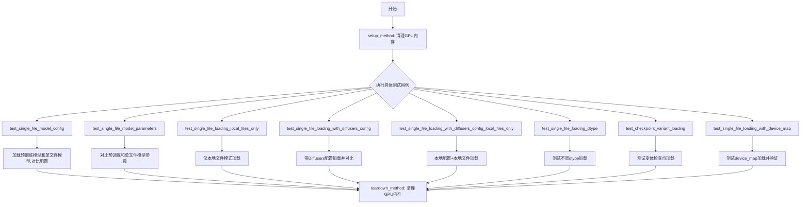

## 类结构

```
SingleFileTesterMixin (pytest mixin类)
├── Required Properties
│   └── ckpt_path: str
├── Optional Properties
│   ├── torch_dtype: torch.dtype | None
│   └── alternate_ckpt_paths: list[str] | None
├── Lifecycle Methods
│   ├── setup_method()
│   └── teardown_method()
└── Test Methods
    ├── test_single_file_model_config()
    ├── test_single_file_model_parameters()
    ├── test_single_file_loading_local_files_only()
    ├── test_single_file_loading_with_diffusers_config()
    ├── test_single_file_loading_with_diffusers_config_local_files_only()
    ├── test_single_file_loading_dtype()
    ├── test_checkpoint_variant_loading()
    └── test_single_file_loading_with_device_map()
```

## 全局变量及字段


### `download_single_file_checkpoint`
    
从HuggingFace Hub下载单个文件检查点到临时目录

类型：`function(pretrained_model_name_or_path: str, filename: str, tmpdir: str) -> str`
    


### `download_diffusers_config`
    
从仓库下载diffusers配置文件（排除权重文件）

类型：`function(pretrained_model_name_or_path: str, tmpdir: str) -> str`
    


### `SingleFileTesterMixin.ckpt_path`
    
单文件检查点的路径或Hub路径，子类必须实现此属性

类型：`property (required) -> str`
    


### `SingleFileTesterMixin.torch_dtype`
    
用于单文件测试的torch数据类型，默认为None

类型：`property (optional) -> torch.dtype | None`
    


### `SingleFileTesterMixin.alternate_ckpt_paths`
    
用于变体测试的备用检查点路径列表，默认为None

类型：`property (optional) -> list[str] | None`
    


### `SingleFileTesterMixin.model_class`
    
要测试的模型类，由config mixin提供

类型：`expected from config mixin -> Any`
    


### `SingleFileTesterMixin.pretrained_model_name_or_path`
    
预训练模型的Hub仓库ID，由config mixin提供

类型：`expected from config mixin -> str`
    


### `SingleFileTesterMixin.pretrained_model_kwargs`
    
from_pretrained的额外参数（如subfolder），由config mixin提供

类型：`expected from config mixin -> dict`
    
    

## 全局函数及方法


### `download_single_file_checkpoint`

从 HuggingFace Hub 下载单个文件检查点到指定的临时目录，并返回下载文件的本地路径。

参数：

- `pretrained_model_name_or_path`：`str`，预训练模型的名称或路径，可以是 HuggingFace Hub 仓库 ID（如 `"runwayml/stable-diffusion-v1-5"`）或本地路径
- `filename`：`str`，要下载的检查点文件的名称（如 `"pytorch_model.bin"` 或 `"model.safetensors"`）
- `tmpdir`：`str`，用于存放下载文件的临时目录路径

返回值：`str`，下载的检查点文件的本地绝对路径

#### 流程图

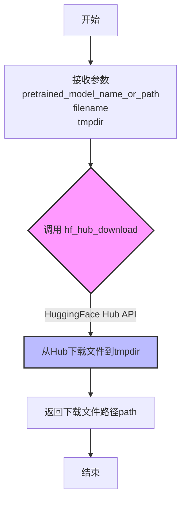

#### 带注释源码

```python
def download_single_file_checkpoint(pretrained_model_name_or_path, filename, tmpdir):
    """Download a single file checkpoint from the Hub to a temporary directory.
    
    该函数是单文件检查点下载的底层实现，封装了 HuggingFace Hub 的下载逻辑。
    主要用于从预训练模型仓库中下载单个权重文件或检查点文件到临时目录，
    后续可配合 from_single_file 方法进行模型加载。
    
    参数:
        pretrained_model_name_or_path: HuggingFace Hub 仓库 ID 或本地路径
        filename: 要下载的文件名（权重文件或检查点文件）
        tmpdir: 临时目录路径，用于存放下载的文件
    
    返回:
        下载文件的本地路径，可直接用于模型加载
    """
    # 调用 huggingface_hub 库的 hf_hub_download 函数
    # local_dir 参数指定文件下载到的本地目录
    path = hf_hub_download(pretrained_model_name_or_path, filename=filename, local_dir=tmpdir)
    return path
```


### `download_diffusers_config`

从 HuggingFace Hub 仓库下载 Diffusers 配置文件（排除权重文件），仅保留 JSON 和 TXT 格式的配置文件。

参数：

- `pretrained_model_name_or_path`：`str`，预训练模型的名称或路径（HuggingFace Hub 仓库 ID 或本地路径）
- `tmpdir`：`str`，用于存放下载配置文件的临时目录路径

返回值：`str`，下载的配置文件目录的本地路径

#### 流程图

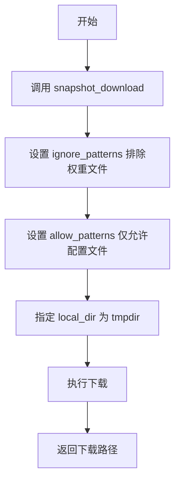

#### 带注释源码

```python
def download_diffusers_config(pretrained_model_name_or_path, tmpdir):
    """
    Download diffusers config files (excluding weights) from a repository.
    
    从仓库下载 Diffusers 配置文件（不包括权重文件）。
    该函数通过 snapshot_download 下载仓库内容，但使用 ignore_patterns 
    排除所有权重文件格式（.ckpt, .bin, .pt, .safetensors），
    仅允许下载配置文件（.json, .txt）。
    """
    # 使用 huggingface_hub 的 snapshot_download 下载仓库快照
    path = snapshot_download(
        pretrained_model_name_or_path,  # 目标仓库 ID 或路径
        ignore_patterns=[               # 忽略的patterns（排除权重文件）
            "**/*.ckpt",                 # 任意路径下的 .ckpt 文件
            "*.ckpt",                    # 根目录下的 .ckpt 文件
            "**/*.bin",                 # 任意路径下的 .bin 文件
            "*.bin",                    # 根目录下的 .bin 文件
            "**/*.pt",                  # 任意路径下的 .pt 文件
            "*.pt",                     # 根目录下的 .pt 文件
            "**/*.safetensors",         # 任意路径下的 .safetensors 文件
            "*.safetensors",            # 根目录下的 .safetensors 文件
        ],
        allow_patterns=[                # 允许的patterns（仅配置文件）
            "**/*.json",                # 任意路径下的 JSON 文件
            "*.json",                   # 根目录下的 JSON 文件
            "*.txt",                    # 根目录下的 TXT 文件
            "**/*.txt",                 # 任意路径下的 TXT 文件
        ],
        local_dir=tmpdir,               # 下载到指定的临时目录
    )
    return path  # 返回下载的配置文件目录路径
```


# 设计文档：check_device_map_is_respected 函数分析

## 1. 概述

`check_device_map_is_respected` 是一个用于验证模型参数是否按照指定的 `device_map` 正确放置到对应设备上的验证函数。

## 2. 函数信息提取

### `check_device_map_is_reserved`

参数：

- `model`：`torch.nn.Module`，需要检查的模型对象
- `device_map`：字典类型，设备映射关系，通常为模型的 `hf_device_map` 属性

返回值：`None`，该函数通过断言验证设备映射的正确性，若验证失败则抛出异常

#### 流程图

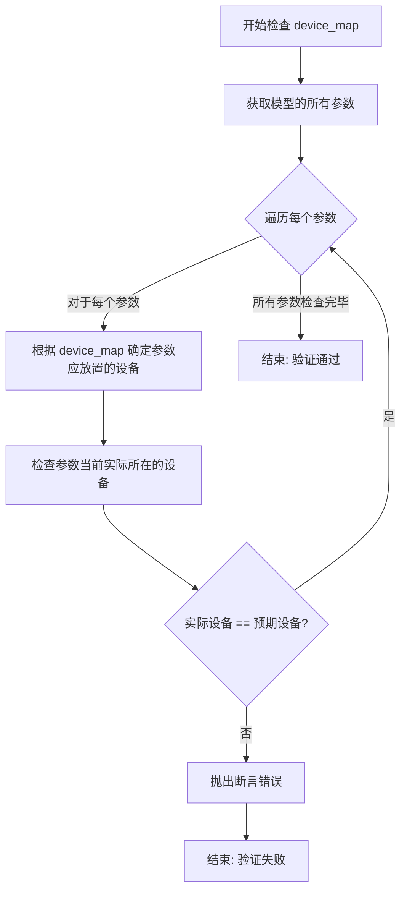

#### 带注释源码

```python
# 注意: 该函数定义在 common 模块中,当前代码文件仅导入了该函数
# 函数定义未在提供的代码中显示

# 以下是函数的使用场景 (在 SingleFileTesterMixin.test_single_file_loading_with_device_map 方法中):
def test_single_file_loading_with_device_map(self):
    """
    测试使用 device_map 加载单文件模型
    """
    single_file_kwargs = {"device_map": torch_device}

    if self.torch_dtype:
        single_file_kwargs["torch_dtype"] = self.torch_dtype

    # 从单文件加载模型
    model = self.model_class.from_single_file(self.ckpt_path, **single_file_kwargs)

    assert model is not None, "Failed to load model with device_map"
    assert hasattr(model, "hf_device_map"), "Model should have hf_device_map attribute when loaded with device_map"
    assert model.hf_device_map is not None, "hf_device_map should not be None when loaded with device_map"
    
    # 调用 check_device_map_is_respected 验证设备映射是否正确
    # 参数1: model - 需要检查的模型
    # 参数2: model.hf_device_map - 模型应该遵守的设备映射规则
    check_device_map_is_respected(model, model.hf_device_map)
```

## 3. 补充说明

### 3.1 函数来源

- **模块**：`common` 模块（在 `diffusers` 包的测试工具中）
- **导入方式**：`from .common import check_device_map_is_respected`
- **定义位置**：该函数的实际定义代码未包含在提供的代码文件中

### 3.2 使用场景

该函数在 `SingleFileTesterMixin.test_single_file_loading_with_device_map` 测试方法中被调用，用于验证使用 `device_map` 加载的模型是否正确遵守了设备放置规则。这对于分布式推理和模型并行场景尤为重要。

### 3.3 技术债务/优化空间

1. **缺少源码可见性**：当前代码只导入了该函数但未显示定义，建议将完整的函数定义包含在代码注释或文档中
2. **错误信息可读性**：建议在验证失败时提供更详细的错误信息，包括具体哪个参数放错了设备

### 3.4 设计意图

该函数的目的是确保在使用 HuggingFace 的 `device_map` 功能加载模型时，所有模型参数都被正确地放置在指定的设备上，防止出现隐式的 CPU-GPU 数据传输导致的性能问题。


### `_extract_repo_id_and_weights_name`

从单文件检查点路径中提取HuggingFace Hub仓库ID和权重文件名。该函数解析传入的检查点路径（可能是本地路径或Hub路径），将其拆分为预训练模型名称（或仓库ID）和具体的权重文件名称，以便后续从Hub下载对应资源或进行本地文件处理。

参数：

- `checkpoint_path`：`str`，单文件检查点路径，可以是本地文件系统路径、HuggingFace Hub仓库路径（如"username/model"）或包含具体文件名的Hub路径（如"username/model/weight.safetensors"）

返回值：`Tuple[str, str]`，返回一个元组
- 第一个元素（`str`）：预训练模型名称或Hub仓库ID
- 第二个元素（`str`）：权重文件名

#### 流程图

```mermaid
flowchart TD
    A[开始：接收checkpoint_path] --> B{判断路径类型}
    B --> C[本地文件路径?]
    B --> D[Hub路径?]
    
    C --> E[提取文件名作为weight_name]
    C --> F[尝试从路径推断repo_id或使用默认值]
    
    D --> G{路径是否包含具体文件名?}
    G -->|是| H[解析URL/路径提取repo_id和weight_name]
    G --> H[使用路径作为repo_id<br/>使用默认权重名]
    
    H --> I[返回repo_id和weight_name]
    E --> I
    F --> I
    
    I --> J[结束：返回Tuple[str, str]]
```

#### 带注释源码

```python
# 由于该函数定义在 diffusers.loaders.single_file_utils 模块中，
# 当前代码文件仅导入了该函数而未包含其完整实现。
# 以下是基于代码调用方式的逻辑推断：

def _extract_repo_id_and_weights_name(checkpoint_path: str) -> Tuple[str, str]:
    """
    从单文件检查点路径中提取仓库ID和权重文件名。
    
    参数:
        checkpoint_path: 单文件检查点路径，支持本地路径或Hub路径
        
    返回:
        Tuple[str, str]: (仓库ID, 权重文件名)
    """
    # 处理各种路径格式：
    # 1. 本地路径: /path/to/model/weight.safetensors
    # 2. Hub路径: username/model
    # 3. 带文件名的Hub路径: username/model/weight.safetensors
    
    # 逻辑推断：
    # - 如果是本地路径，提取文件名作为weight_name
    # - 如果是Hub路径，解析出repo_id
    # - 如果路径包含具体文件名，同时提取weight_name
    
    # 代码中的实际调用示例：
    # pretrained_model_name_or_path, weight_name = _extract_repo_id_and_weights_name(self.ckpt_path)
    
    # 随后使用返回值进行下载：
    # local_ckpt_path = download_single_file_checkpoint(pretrained_model_name_or_path, weight_name, str(tmp_path))
    
    pass  # 实际实现位于 diffusers.loaders.single_file_utils
```


### `gc.collect()`

`gc.collect()` 是 Python 标准库 `gc` 模块中的函数，用于手动触发垃圾回收机制，返回已回收的对象数量。在该代码中用于在测试方法结束后清理 GPU 内存和 Python 垃圾回收，确保释放模型对象占用的资源。

#### 参数

- 无参数

#### 返回值

- `int`：返回已回收并释放的对象数量

#### 使用位置

该函数在代码的以下位置被调用：

1. **`SingleFileTesterMixin.setup_method`**：测试方法开始前清理
2. **`SingleFileTesterMixin.teardown_method`**：测试方法结束后清理
3. **`SingleFileTesterMixin.test_single_file_model_parameters`**：模型参数比较测试中，删除模型对象后清理 GPU 内存
4. **`SingleFileTesterMixin.test_single_file_loading_dtype`**：数据类型测试中，每次循环结束后清理
5. **`SingleFileTesterMixin.test_checkpoint_variant_loading`**：变体加载测试中，每次循环结束后清理

#### 流程图

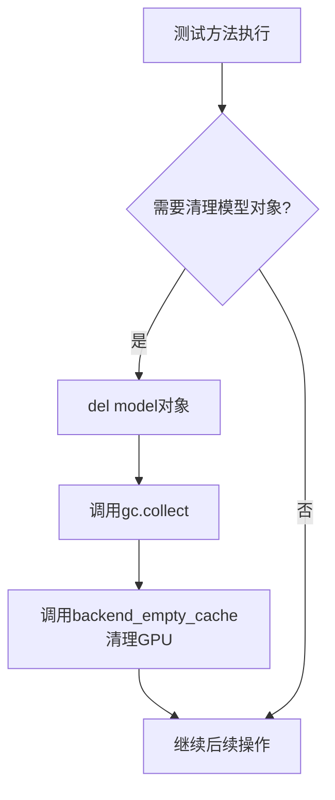

#### 带注释源码

```python
# gc.collect() 在各类测试方法中的使用示例：

# 1. setup_method - 测试开始前清理
def setup_method(self):
    gc.collect()  # 手动触发Python垃圾回收，清理无用对象
    backend_empty_cache(torch_device)  # 清理GPU缓存内存

# 2. teardown_method - 测试结束后清理
def teardown_method(self):
    gc.collect()  # 清理测试过程中产生的临时对象
    backend_empty_cache(torch_device)  # 释放GPU显存

# 3. test_single_file_model_parameters - 模型对比测试中的清理
def test_single_file_model_parameters(self):
    # ... 加载模型 ...
    state_dict = {k: v.cpu() for k, v in model.state_dict().items()}
    del model  # 删除模型对象引用
    gc.collect()  # 触发垃圾回收，释放Python对象内存
    backend_empty_cache(torch_device)  # 清理GPU显存

    # ... 加载另一个模型 ...
    model_single_file = self.model_class.from_single_file(self.ckpt_path, **single_file_kwargs)
    state_dict_single_file = {k: v.cpu() for k, v in model_single_file.state_dict().items()}
    del model_single_file
    gc.collect()  # 再次清理，为后续比较释放内存
    backend_empty_cache(torch_device)
    
    # ... 执行参数比较 ...

# 4. test_single_file_loading_dtype - 数据类型测试中的清理
def test_single_file_loading_with_device_map(self):
    model = self.model_class.from_single_file(self.ckpt_path, **single_file_kwargs)
    # ... 测试逻辑 ...
    del model
    gc.collect()  # 清理模型对象
    backend_empty_cache(torch_device)

# 5. test_checkpoint_variant_loading - 变体测试中的循环清理
def test_checkpoint_variant_loading(self):
    if not self.alternate_ckpt_paths:
        return

    for ckpt_path in self.alternate_ckpt_paths:
        backend_empty_cache(torch_device)  # 先清理GPU
        
        model = self.model_class.from_single_file(ckpt_path, **single_file_kwargs)
        # ... 测试逻辑 ...
        
        del model  # 删除模型引用
        gc.collect()  # 触发GC
        backend_empty_cache(torch_device)  # 清理GPU，为下一次循环准备
```

#### 设计意图与约束

- **设计目标**：在单文件模型加载测试中，确保每个测试方法执行前后都能释放 GPU 内存和 Python 对象，避免显存泄漏导致后续测试失败
- **约束**：需要配合 `backend_empty_cache`（针对特定后端如 CUDA MPS 的内存清理）一起使用，单一使用 `gc.collect()` 不足以完全释放 GPU 显存
- **潜在优化空间**：
  - 当前在多处重复调用 `gc.collect()`，可以考虑封装为工具方法减少代码重复
  - 可以考虑使用 `torch.cuda.empty_cache()` 替代部分场景下的 `gc.collect()`，针对 GPU 内存进行更精准的清理


### torch.equal

比较两个张量是否完全相等。

参数：

- `input`：`torch.Tensor`，第一个输入张量
- `other`：`torch.Tensor`，第二个输入张量

返回值：`torch.Tensor`（bool类型），返回单个布尔值表示两个张量是否完全相等

#### 带注释源码

```python
# 在 test_single_file_model_parameters 方法中用于比较模型参数
# 比较预训练模型和单文件加载模型的参数值是否完全一致
assert torch.equal(param, param_single_file), f"Parameter values differ for {key}"
```

---

### torch.float32 / torch.float16 / torch.bfloat16

PyTorch中的浮点数数据类型常量，用于指定模型参数和计算的精度。

参数：无需参数（为torch.dtype字面值）

返回值：`torch.dtype`，对应的PyTorch浮点数据类型

#### 带注释源码

```python
# 在 test_single_file_loading_dtype 方法中用于测试不同数据类型的加载
# 遍历测试 float32 和 float16 两种数据类型
for dtype in [torch.float32, torch.float16]:
    # MPS设备不支持 bfloat16，跳过该类型
    if torch_device == "mps" and dtype == torch.bfloat16:
        continue

    # 加载单文件模型时指定数据类型
    model_single_file = self.model_class.from_single_file(self.ckpt_path, torch_dtype=dtype)

    # 验证加载后的模型数据类型与请求的数据类型一致
    assert model_single_file.dtype == dtype, f"Expected dtype {dtype}, got {model_single_file.dtype}"
```

---

### torch.dtype

用于类型注解，表示PyTorch的张量数据类型。

参数：无需参数（为类型注解）

返回值：类型，表示PyTorch数据类型

#### 带注释源码

```python
# SingleFileTesterMixin 类中的 torch_dtype 属性
@property
def torch_dtype(self) -> torch.dtype | None:
    """torch dtype to use for single file testing."""
    return None
```

---

### torch (主模块引用)

代码中导入torch作为基础依赖，用于张量操作和数据类型处理。

#### 导入语句

```python
import torch
```

#### 使用场景汇总

1. **类型定义**：`torch.dtype` 用于类型注解
2. **数据类型常量**：`torch.float32`、`torch.float16`、`torch.bfloat16`
3. **张量比较**：`torch.equal()` 用于验证模型参数一致性
4. **设备管理**：通过 `torch_device` 全局变量管理计算设备


### `hf_hub_download`

从 Hugging Face Hub 下载指定文件到本地缓存或指定目录。该函数是 huggingface_hub 库的核心下载函数，用于获取模型权重、配置文件等资源。

参数：

- `repo_id`：`str`，Hugging Face Hub 上的仓库 ID（例如 `"username/model"` 或 `"model-name"`）
- `filename`：`str`，要下载的文件名
- `local_dir`：`str`，可选参数，指定下载到本地的目标目录路径
- `repo_type`：`str`，可选参数，仓库类型（`"model"`、`"dataset"` 或 `"space"`，默认 `"model"`）
- `revision`：`str`，可选参数，仓库的特定版本或分支（默认 `"main"`）
- `cache_dir`：`str`，可选参数，指定缓存目录路径
- `force_download`：`bool`，可选参数，是否强制重新下载（默认 `False`）
- `resume_download`：`bool`，可选参数，是否支持断点续传（默认 `True`）
- `proxies`：`dict`，可选参数，代理服务器配置
- `etag_timeout`：`float`，可选参数，获取 ETag 的超时时间（默认 `10`）
- `resume_download`：`bool`，可选参数，是否启用断点续传（默认 `True`）

返回值：`str`，返回下载文件的本地路径

#### 流程图

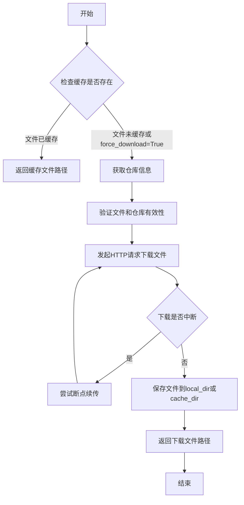

#### 带注释源码

```python
# 该函数在 huggingface_hub 库中定义，此处展示在项目中的调用方式
from huggingface_hub import hf_hub_download

# 在 download_single_file_checkpoint 函数中的调用示例
def download_single_file_checkpoint(pretrained_model_name_or_path, filename, tmpdir):
    """Download a single file checkpoint from the Hub to a temporary directory."""
    # 使用 hf_hub_download 从 Hugging Face Hub 下载单个文件检查点
    # 参数:
    #   - pretrained_model_name_or_path: 仓库ID或本地路径
    #   - filename: 要下载的文件名
    #   - local_dir: 下载到本地的目标目录
    # 返回:
    #   - path: 下载文件的本地路径
    path = hf_hub_download(pretrained_model_name_or_path, filename=filename, local_dir=tmpdir)
    return path
```


### `snapshot_download`

该函数是 Hugging Face Hub 库提供的核心下载工具，用于从 Hugging Face Hub 仓库下载完整的文件快照（不包括单个文件），支持本地缓存、文件过滤模式、增量下载等功能。在 Diffusers 项目中，该函数被用于下载 Diffusers 配置文件（JSON 和 TXT 文件），同时排除权重文件（.ckpt、.bin、.pt、.safetensors）。

参数：

- `repo_id`：`str`，Hugging Face Hub 上的仓库标识符（可以是模型 ID 或完整的仓库路径）
- `repo_type`：`str`，可选，仓库类型（"model"、"dataset" 或 "space"，默认为 "model"）
- `revision`：`str`，可选，仓库的特定版本/分支（默认为 "main"）
- `cache_dir`：`str | None`，可选，本地缓存目录路径
- `local_dir`：`str | None`，可选，下载文件的目标目录（不经过缓存）
- `local_dir_use_symlinks`：`bool | None`，可选，是否在 local_dir 中使用符号链接（默认 "auto"）
- `resume_download`：`bool`，可选，是否允许恢复中断的下载（默认为 True）
- `force_download`：`bool`，可选，是否强制重新下载（默认为 False）
- `proxies`：`dict | None`，可选，代理服务器配置
- `etag_timeout`：`float`，可选，ETag 请求超时时间（单位：秒，默认 10）
- `resume_chunk_size`：`int`，可选，恢复下载的块大小（默认 8388608 字节）
- `headers`：`dict | None`，可选，HTTP 请求头
- `allow_patterns`：`list[str] | None`，可选，仅下载匹配这些模式的文件
- `ignore_patterns`：`list[str] | None`，可选，排除匹配这些模式的文件
- `max_workers`：`int`，可选，最大并发下载线程数（默认 8）
- `download_callback`：`Callable | None`，可选，下载过程中的回调函数

返回值：`str`，返回下载文件所在的本地目录路径

#### 流程图

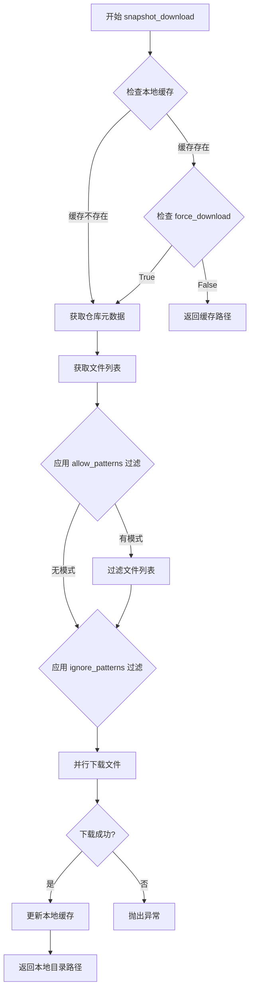

#### 带注释源码

```python
# 实际的 snapshot_download 源码位于 huggingface_hub 库中
# 以下是基于调用方式和官方文档的重建源码

def snapshot_download(
    repo_id: str,
    repo_type: str = "model",
    revision: str | None = None,
    cache_dir: str | None = None,
    local_dir: str | None = None,
    local_dir_use_symlinks: bool | str = "auto",
    resume_download: bool = True,
    force_download: bool = False,
    proxies: dict | None = None,
    etag_timeout: float = 10,
    resume_chunk_size: int = 8388608,
    headers: dict | None = None,
    allow_patterns: list[str] | None = None,
    ignore_patterns: list[str] | None = None,
    max_workers: int = 8,
    download_callback: Callable | None = None,
    **kwargs,
) -> str:
    """
    Download all files from a repository on Hugging Face Hub.
    
    从 Hugging Face Hub 下载仓库中的所有文件。
    
    Args:
        repo_id: Repository ID on Hugging Face Hub.
        repo_type: Type of repository ("model", "dataset", or "space").
        revision: Branch or tag name. Defaults to "main".
        cache_dir: Directory to cache files locally.
        local_dir: Directory to download files to (bypasses cache).
        local_dir_use_symlinks: If "auto", only symlinks cache files if cache_dir is on same filesystem.
        resume_download: If True, resume broken downloads. Default is True.
        force_download: If True, redownload files. Default is False.
        proxies: Dictionary of proxy servers.
        etag_timeout: Timeout for ETag requests (in seconds).
        resume_chunk_size: Chunk size for resuming downloads (in bytes).
        headers: Additional HTTP headers.
        allow_patterns: List of patterns to match files to download.
        ignore_patterns: List of patterns to exclude from download.
        max_workers: Maximum number of workers for parallel downloads.
        download_callback: Optional callback to monitor download progress.
    
    Returns:
        str: Path to the downloaded repository files.
    
    Example:
        >>> from huggingface_hub import snapshot_download
        >>> # 下载完整的模型仓库
        >>> model_dir = snapshot_download("google-bert/bert-base-uncased")
        >>> 
        >>> # 仅下载配置文件
        >>> config_dir = snapshot_download(
        ...     "google-bert/bert-base-uncased",
        ...     allow_patterns=["*.json", "*.txt"],
        ...     ignore_patterns=["*.bin", "*.pt", "*.safetensors"]
        ... )
    """
    # 1. 解析仓库信息并验证仓库存在
    # 2. 获取仓库中的文件列表
    # 3. 根据 allow_patterns 和 ignore_patterns 过滤文件
    # 4. 检查本地缓存（若缓存存在且 force_download=False，跳过下载）
    # 5. 使用多线程并行下载文件
    # 6. 处理下载中断，恢复下载
    # 7. 返回本地目录路径
    pass
```


### `backend_empty_cache`

该函数用于清空PyTorch后端的GPU缓存，释放GPU内存，通常在测试方法的setup和teardown阶段以及测试结束后调用，以防止内存泄漏导致的测试失败或内存不足错误。

参数：

- `torch_device`：`str`，PyTorch设备标识符（如"cuda"、"cuda:0"、"cpu"等），指定要清空哪个设备的缓存

返回值：`None`，无返回值

#### 流程图

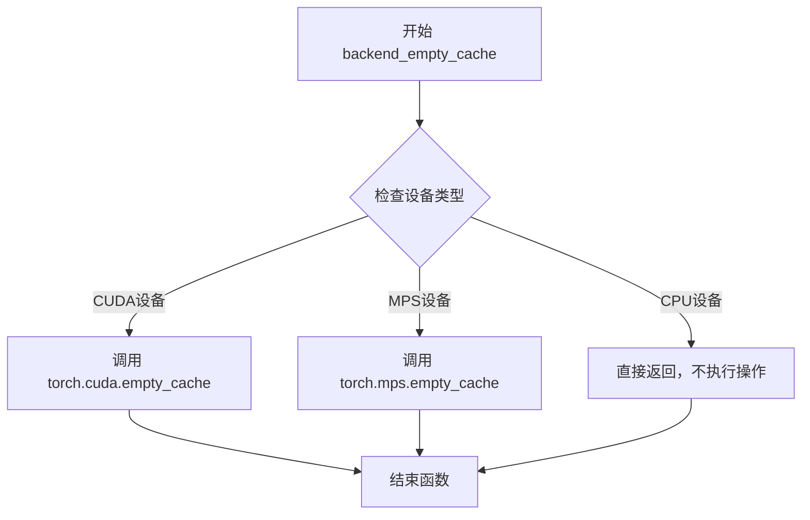

#### 带注释源码

```python
# 该函数定义在 testing_utils 模块中
# 以下是基于使用方式的推断实现

def backend_empty_cache(torch_device: str) -> None:
    """
    清空指定PyTorch后端的GPU缓存，释放GPU内存。
    
    参数:
        torch_device: PyTorch设备标识符，指定要清空缓存的设备
        
    注意:
        - 对于CUDA设备，调用 torch.cuda.empty_cache()
        - 对于MPS设备（Apple Silicon），调用 torch.mps.empty_cache()
        - 对于CPU设备，不执行任何操作
    """
    import gc
    import torch
    
    # 首先进行垃圾回收，释放Python层面的对象
    gc.collect()
    
    # 根据设备类型选择清空对应的GPU缓存
    if torch_device == "cuda" or torch_device.startswith("cuda:"):
        # NVIDIA GPU: 清空CUDA缓存
        torch.cuda.empty_cache()
    elif torch_device == "mps":
        # Apple Silicon GPU: 清空MPS缓存
        torch.mps.empty_cache()
    # 对于 CPU 设备，无需操作
```

#### 使用示例

在提供的代码中，该函数被用于：

```python
# 在测试类的 setup_method 中
def setup_method(self):
    gc.collect()
    backend_empty_cache(torch_device)  # 测试开始前清空缓存

# 在测试类的 teardown_method 中
def teardown_method(self):
    gc.collect()
    backend_empty_cache(torch_device)  # 测试结束后清空缓存

# 在测试方法中，模型加载完成后清空缓存
def test_single_file_model_parameters(self):
    # ... 加载模型 ...
    del model
    gc.collect()
    backend_empty_cache(torch_device)  # 释放模型后清空缓存
    
    # 继续加载另一个模型
    model_single_file = self.model_class.from_single_file(...)
    # ... 
```


### `is_single_file`

该函数是一个 pytest 标记装饰器（decorator），用于标记测试类是否与单文件（single file）模型加载功能相关。通过在测试类上应用 `@is_single_file` 装饰器，可以将此类测试归类到 `single_file` 测试标记组中，便于使用 `pytest -m "single_file"` 或 `pytest -m "not single_file"` 进行条件筛选执行。

参数：

- 无显式参数（作为装饰器使用）

返回值：`Callable`，返回装饰后的类或函数

#### 流程图

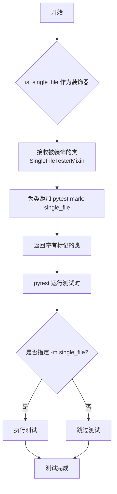

#### 带注释源码

```python
# 该源码为基于代码中使用方式推断的 is_single_file 函数原型
# 实际定义位于 ...testing_utils 模块中

def is_single_file(func_or_class):
    """
    pytest 标记装饰器，用于标识测试类/函数与单文件加载功能相关。
    
    使用方式：
        @is_single_file
        class SingleFileTesterMixin:
            ...
    
    等同于：
        @pytest.mark.single_file
        class SingleFileTesterMixin:
            ...
    
    作用：
        - 将测试标记为 'single_file' 分组
        - 支持 pytest -m "single_file" 选择性运行
        - 支持 pytest -m "not single_file" 跳过单文件测试
    """
    # 1. 获取被装饰的对象（类或函数）
    # 2. 为其添加 single_file 标记
    # 3. 返回修改后的对象
    
    # 实际实现可能是：
    # return pytest.mark.single_file(func_or_class)
    
    # 或者更复杂的实现，包含：
    # - 条件检查（仅在特定条件下标记）
    # - 组合多个标记
    # - 添加元数据信息
    
    pass  # 具体实现未知，位于 testing_utils 模块
```


### `nightly`

该函数是一个测试装饰器，用于标记测试为"夜间测试"（nightly tests）。在 `SingleFileTesterMixin` 类上作为装饰器使用，配合 `@require_torch_accelerator` 和 `@is_single_file` 一起使用，表示该测试类需要满足特定条件（夜间运行、需配备 torch 加速器、单文件模式）才会执行。

#### 流程图

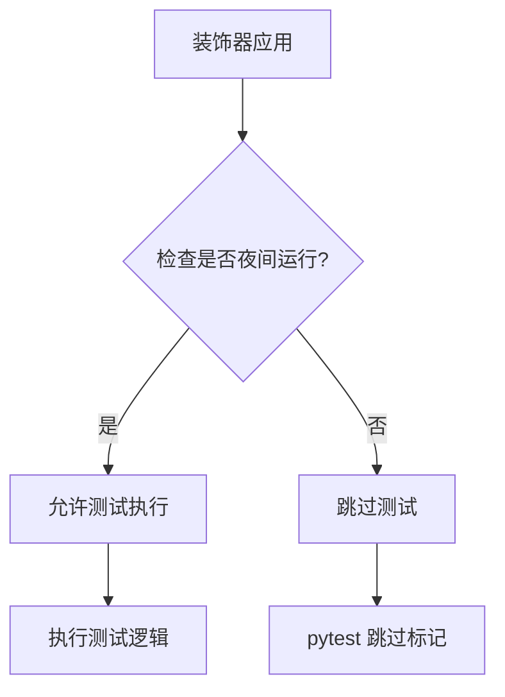

#### 带注释源码

```python
# 这是一个从 testing_utils 模块导入的装饰器函数
# 位置: from ...testing_utils import nightly
#
# 作用: 标记测试为夜间测试
# - 夜间测试通常运行时间较长或需要特定资源
# - 使用方式: @nightly 装饰在类或函数上
#
# 在本代码中的使用示例:
# @nightly
# @require_torch_accelerator
# @is_single_file
# class SingleFileTesterMixin:
#     ...
#
# 注意: 实际的 nightly 函数定义在 testing_utils 模块中，
# 本文件只是导入并使用它作为装饰器
```

---

**注意**：根据提供的代码片段，`nightly` 函数的具体实现位于 `...testing_utils` 模块中，当前文件仅展示了其导入和使用方式。该装饰器是 pytest 生态系统中常见的模式，用于将耗时的测试与常规测试分离，确保只有在使用特定标记（如 `pytest -m nightly`）或满足特定条件时才会运行这些测试。


### `require_torch_accelerator`

该函数是从 `testing_utils` 模块导入的 pytest 装饰器，用于跳过在没有 PyTorch 加速器（如 GPU/CUDA）的环境中运行的测试。

**注意**：该函数的实际实现在 `...testing_utils` 模块中（代码中未包含），以下信息基于其在代码中的使用方式和常见模式推断。

参数：无需直接参数（作为装饰器使用）

返回值：无返回值（修改被装饰函数/类的行为）

#### 流程图

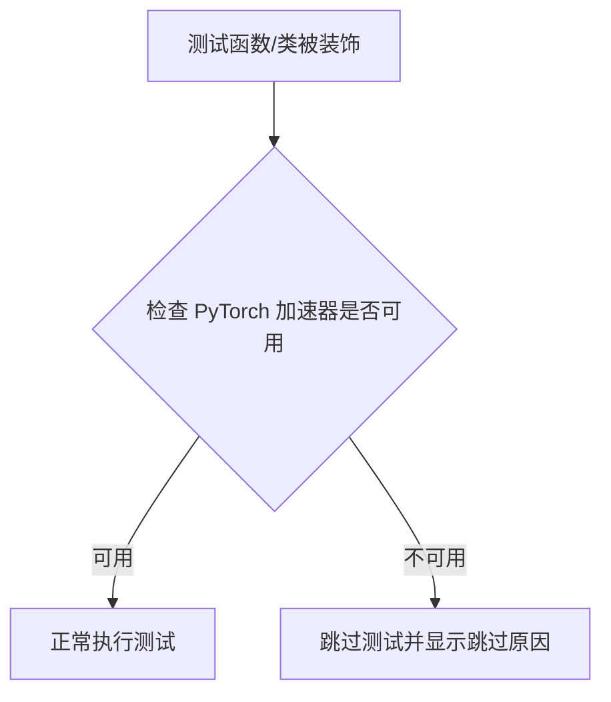

#### 带注释源码

```python
# 该函数的实际实现位于 testing_utils.py 中
# 在当前代码中仅作为导入的装饰器使用
from ...testing_utils import (
    backend_empty_cache,
    is_single_file,
    nightly,
    require_torch_accelerator,  # 从 testing_utils 模块导入
    torch_device,
)

# 使用示例：作为类装饰器
@nightly
@require_torch_accelerator  # 装饰器：检查 GPU 可用性
@is_single_file
class SingleFileTesterMixin:
    """
    Mixin class for testing single file loading for models.
    ...
    """
    # 类的实现...
```

---

**补充说明**：

由于提供的代码段未包含 `require_torch_accelerator` 的完整源码，以下是该函数典型实现的逻辑说明：

```python
# 假设的 testing_utils.py 中的实现逻辑
def require_torch_accelerator(func):
    """装饰器：跳过没有 PyTorch 加速器（GPU/CUDA/MPS）的测试"""
    return pytest.mark.skipif(
        not torch.cuda.is_available() and not torch.backends.mps.is_available(),
        reason="Test requires PyTorch accelerator (CUDA/MPS)"
    )(func)
```


# 关于 torch_device 的分析

## 分析结果

经过仔细分析所提供的代码，我发现 `torch_device` 并不是在该代码文件中定义的函数或方法。它是作为**全局变量**从 `testing_utils` 模块导入的。

### 导入来源

```python
from ...testing_utils import (
    backend_empty_cache,
    is_single_file,
    nightly,
    require_torch_accelerator,
    torch_device,
)
```

### 在代码中的使用方式

在提供的代码中，`torch_device` 被作为**全局变量**使用，而非函数。以下是它的使用场景：

1. **作为函数参数使用**
   - `backend_empty_cache(torch_device)` - 作为后端清理缓存函数的参数
   - `pretrained_kwargs = {"device": torch_device, **self.pretrained_model_kwargs}` - 作为设备参数

2. **类型推断**
   - 从使用方式来看，`torch_device` 是一个表示 PyTorch 计算设备的字符串（例如 `"cuda"`, `"cpu"`, `"mps"`）

### 说明

由于 `torch_device` 的实际定义位于 `testing_utils` 模块中，而不是在当前提供的代码文件内，**无法从此代码中提取其完整的函数签名、返回值和实现细节**。

如果您需要 `torch_device` 的详细设计文档，建议：

1. 查看 `testing_utils` 模块的源代码
2. 或者确认是否有其他文件定义了 `torch_device`

---

**结论**：当前提供的代码文件中，`torch_device` 只是一个被导入并使用的外部全局变量/常量，不是该文件内定义的函数或方法。


### `SingleFileTesterMixin.setup_method`

执行垃圾回收并清空GPU显存，为单文件模型测试准备测试环境。

参数：

- `self`：`SingleFileTesterMixin`，隐式参数，表示类的实例本身

返回值：`None`，无返回值，仅执行清理操作

#### 流程图

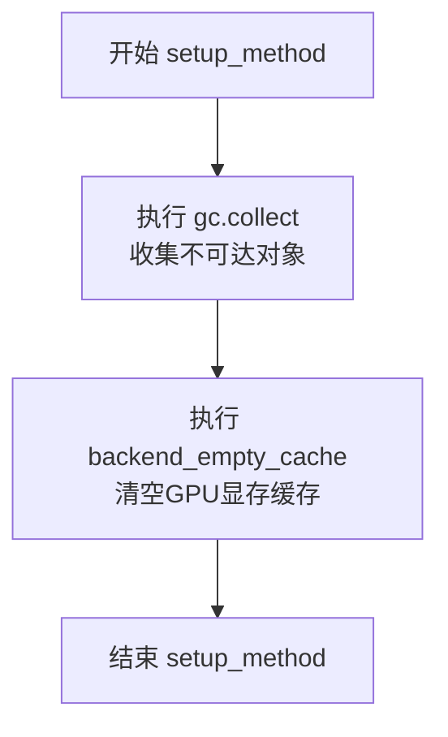

#### 带注释源码

```python
def setup_method(self):
    """
    测试方法_setup函数，在每个测试方法执行前调用。
    
    该方法负责清理Python垃圾回收器和GPU显存，
    确保测试环境处于干净状态，避免测试间的相互干扰。
    """
    # 手动触发Python垃圾回收，释放不再使用的对象内存
    gc.collect()
    
    # 调用后端特定的显存清空函数，释放GPU显存缓存
    # torch_device 是全局变量，表示当前使用的计算设备
    backend_empty_cache(torch_device)
```


### `SingleFileTesterMixin.teardown_method`

用于在每个测试方法执行后清理测试环境，通过显式调用垃圾回收和清空GPU/后端缓存来释放资源，防止测试间的内存泄漏。

参数：

- `self`：实例本身，无额外参数

返回值：`None`，无返回值（Python 方法默认返回 None）

#### 流程图

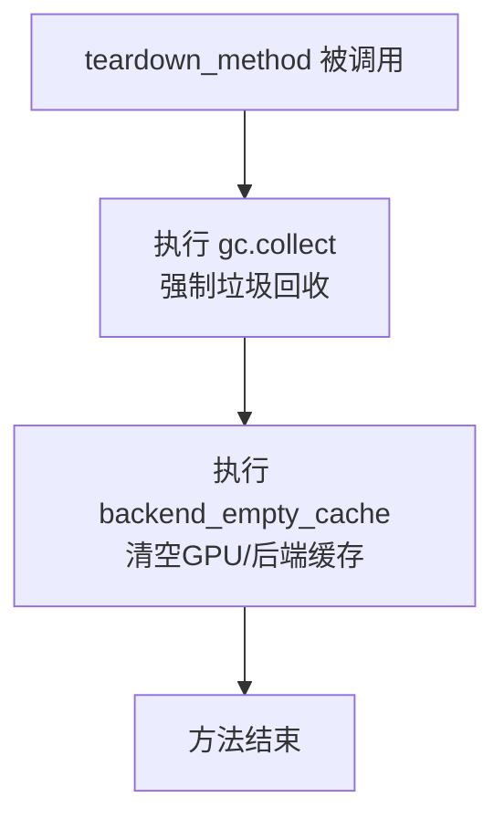

#### 带注释源码

```python
def teardown_method(self):
    """
    在每个测试方法执行后调用的清理方法。
    
    用途：
        - 强制进行Python垃圾回收，释放测试过程中产生的临时对象
        - 清空GPU/后端缓存，确保GPU显存被释放
    """
    gc.collect()                # 强制调用Python的垃圾回收器，清理循环引用等无法自动释放的对象
    backend_empty_cache(torch_device)  # 调用后端特定的缓存清理函数（如GPU显存清空）
```


### `SingleFileTesterMixin.test_single_file_model_config`

该测试方法用于验证通过 `from_single_file` 方法加载的模型配置与通过标准 `from_pretrained` 方法加载的模型配置是否一致，确保单文件加载方式能正确保留模型的关键配置参数。

参数：无显式参数（通过 `self` 访问类属性）

返回值：无返回值（通过 `assert` 断言进行验证）

#### 流程图

```mermaid
flowchart TD
    A[开始 test_single_file_model_config] --> B[构建 pretrained_kwargs 和 single_file_kwargs]
    B --> C{self.torch_dtype 是否存在?}
    C -->|是| D[将 torch_dtype 添加到两个 kwargs]
    C -->|否| E[跳过]
    D --> E
    E --> F[调用 from_pretrained 加载标准模型]
    F --> G[调用 from_single_file 加载单文件模型]
    G --> H[定义 PARAMS_TO_IGNORE 列表]
    H --> I[遍历 model_single_file.config 中的参数]
    I --> J{当前参数是否在忽略列表中?}
    J -->|是| K[跳过该参数]
    J -->|否| L{model.config[param_name] == param_value?}
    L -->|是| K
    L -->|否| M[抛出 AssertionError]
    K --> N{是否还有更多参数?}
    N -->|是| I
    N -->|否| O[测试通过]
    M --> O
```

#### 带注释源码

```python
def test_single_file_model_config(self):
    """
    测试单文件加载的模型配置是否与预训练模型配置一致。
    
    该方法执行以下步骤：
    1. 构建 from_pretrained 和 from_single_file 的参数
    2. 加载两个模型实例
    3. 比较两个模型的配置参数（排除特定忽略的参数）
    """
    # ==================== 步骤1：构建加载参数 ====================
    # 基础参数：设备 + 子类传入的额外参数
    pretrained_kwargs = {"device": torch_device, **self.pretrained_model_kwargs}
    single_file_kwargs = {"device": torch_device}
    
    # 如果子类指定了 torch_dtype，则将其添加到加载参数中
    if self.torch_dtype:
        pretrained_kwargs["torch_dtype"] = self.torch_dtype
        single_file_kwargs["torch_dtype"] = self.torch_dtype

    # ==================== 步骤2：加载模型实例 ====================
    # 使用标准 from_pretrained 方法加载模型
    model = self.model_class.from_pretrained(self.pretrained_model_name_or_path, **pretrained_kwargs)
    # 使用单文件 from_single_file 方法加载模型
    model_single_file = self.model_class.from_single_file(self.ckpt_path, **single_file_kwargs)

    # ==================== 步骤3：配置参数比较 ====================
    # 定义需要忽略的配置参数，这些参数在两种加载方式间可能存在差异
    PARAMS_TO_IGNORE = [
        "torch_dtype",       # 数据类型可能不同
        "_name_or_path",     # 路径标识不同
        "_use_default_values", # 默认值使用标记
        "_diffusers_version"   # diffusers 版本号
    ]
    
    # 遍历单文件模型的所有配置参数
    for param_name, param_value in model_single_file.config.items():
        # 跳过需要忽略的参数
        if param_name in PARAMS_TO_IGNORE:
            continue
        # 断言：两种加载方式的配置参数必须一致
        assert model.config[param_name] == param_value, (
            f"{param_name} differs between pretrained loading and single file loading: "
            f"pretrained={model.config[param_name]}, single_file={param_value}"
        )
```

---

#### 关联信息

**依赖的类属性：**

| 属性名 | 类型 | 描述 |
|--------|------|------|
| `self.model_class` | `type` | 要测试的模型类（如 `StableDiffusionPipeline`） |
| `self.pretrained_model_name_or_path` | `str` | HuggingFace Hub 仓库 ID 或本地路径 |
| `self.pretrained_model_kwargs` | `dict` | 传递给 `from_pretrained` 的额外参数 |
| `self.ckpt_path` | `str` | 单文件检查点的路径或 Hub 路径 |
| `self.torch_dtype` | `torch.dtype \| None` | 可选的数据类型指定 |

**潜在技术债务/优化空间：**

1. **硬编码的忽略参数列表**：`PARAMS_TO_IGNORE` 是硬编码的，可能需要考虑将其提取为类属性或配置常量，提高可维护性
2. **错误信息不够详细**：当断言失败时，只显示参数值差异，未显示参数的其他上下文信息
3. **缺少测试覆盖率标记**：可添加 `@pytest.mark.single_file` 标记以支持选择性运行
4. **资源清理不完整**：方法结束后未显式删除 `model` 和 `model_single_file` 对象，可能导致内存占用


### `SingleFileTesterMixin.test_single_file_model_parameters`

该方法用于验证从 HuggingFace Hub 预训练模型加载的参数与从单文件 checkpoint 加载的参数是否完全一致，包括参数键名、形状和数值。

参数：

- 无显式参数（除隐式 `self`）

返回值：`None`，无返回值（测试方法）

#### 流程图

```mermaid
flowchart TD
    A[开始] --> B[准备 pretrained_kwargs: device_map=torch_device]
    B --> C{self.torch_dtype 是否存在?}
    C -->|是| D[添加 torch_dtype 到 kwargs]
    C -->|否| E[跳过]
    D --> F
    E --> F
    F[从 pretrained 加载模型] --> G[获取 state_dict 并移至 CPU]
    G --> H[删除模型对象]
    H --> I[GC 回收 + 清空 GPU 缓存]
    I --> J[从 single_file 加载模型]
    J --> K[获取 state_dict 并移至 CPU]
    K --> L[删除模型对象]
    L --> M[GC 回收 + 清空 GPU 缓存]
    M --> N{比较 state_dict keys 是否相等?}
    N -->|否| O[断言失败: 报告缺失和多余的键]
    N -->|是| P[遍历每个 key]
    P --> Q{所有 key 的 shape 相等?}
    Q -->|否| R[断言失败: 报告 shape 不匹配的 key]
    Q -->|是| S{所有 key 的值相等?]
    S -->|否| T[断言失败: 报告值不同的 key]
    S -->|是| U[测试通过]
    O --> V[结束]
    R --> V
    T --> V
    U --> V
```

#### 带注释源码

```python
def test_single_file_model_parameters(self):
    # 准备从预训练模型加载的参数字典
    # 使用 device_map 方式加载，以便后续与单文件加载方式进行参数对比
    pretrained_kwargs = {"device_map": str(torch_device), **self.pretrained_model_kwargs}
    # 准备从单文件加载的参数字典
    single_file_kwargs = {"device": torch_device}

    # 如果子类指定了 torch_dtype，则将其添加到对应的加载参数中
    # 确保两种加载方式使用相同的数据类型进行对比
    if self.torch_dtype:
        pretrained_kwargs["torch_dtype"] = self.torch_dtype
        single_file_kwargs["torch_dtype"] = self.torch_dtype

    # ===== 第一部分：加载预训练模型并提取参数 =====
    # 使用 from_pretrained 方法从 HuggingFace Hub 加载完整预训练模型
    model = self.model_class.from_pretrained(self.pretrained_model_name_or_path, **pretrained_kwargs)
    # 将模型的所有参数从 GPU 转移到 CPU，生成新的字典
    # 这样做是为了避免 GPU 内存占用，便于后续与单文件加载的模型进行数值比较
    state_dict = {k: v.cpu() for k, v in model.state_dict().items()}
    # 删除模型对象以释放 GPU 内存
    del model
    # 手动触发垃圾回收，清理 Python 对象
    gc.collect()
    # 清空 GPU 缓存，释放显存
    backend_empty_cache(torch_device)

    # ===== 第二部分：加载单文件模型并提取参数 =====
    # 使用 from_single_file 方法从单文件 checkpoint 加载模型
    model_single_file = self.model_class.from_single_file(self.ckpt_path, **single_file_kwargs)
    # 同样将参数转移到 CPU
    state_dict_single_file = {k: v.cpu() for k, v in model_single_file.state_dict().items()}
    # 释放单文件模型对象
    del model_single_file
    # 清理资源
    gc.collect()
    backend_empty_cache(torch_device)

    # ===== 第三部分：验证参数键名一致性 =====
    # 检查两种加载方式生成的参数键是否完全一致
    # 如果不一致，报告缺失的键和多余的键
    assert set(state_dict.keys()) == set(state_dict_single_file.keys()), (
        "Model parameters keys differ between pretrained and single file loading. "
        f"Missing in single file: {set(state_dict.keys()) - set(state_dict_single_file.keys())}. "
        f"Extra in single file: {set(state_dict_single_file.keys()) - set(state_dict.keys())}"
    )

    # ===== 第四部分：验证每个参数的形状和数值 =====
    # 遍历所有参数键，逐个比较形状和数值
    for key in state_dict.keys():
        # 获取预训练模型和单文件模型中对应参数的数值
        param = state_dict[key]
        param_single_file = state_dict_single_file[key]

        # 首先比较参数形状是否一致
        assert param.shape == param_single_file.shape, (
            f"Parameter shape mismatch for {key}: "
            f"pretrained {param.shape} vs single file {param_single_file.shape}"
        )

        # 然后比较参数数值是否完全相等
        # 使用 torch.equal 进行精确比较（而非近似比较）
        assert torch.equal(param, param_single_file), f"Parameter values differ for {key}"
```


### `SingleFileTesterMixin.test_single_file_loading_local_files_only`

该方法用于测试仅使用本地文件加载单文件模型的功能。首先根据 `torch_dtype` 属性配置加载参数，然后从检查点路径中提取仓库ID和权重名称，将权重文件下载到临时目录，最后使用 `from_single_file` 方法配合 `local_files_only=True` 参数加载模型，并断言模型成功加载。

参数：

- `self`：`SingleFileTesterMixin`，调用该方法的类实例
- `tmp_path`：`Path`，pytest 提供的临时目录 fixture，用于存放下载的检查点文件

返回值：`None`，该方法为测试方法，通过断言验证模型加载成功，不返回实际值

#### 流程图

```mermaid
flowchart TD
    A[开始] --> B[创建空字典 single_file_kwargs]
    B --> C{self.torch_dtype 是否存在?}
    C -->|是| D[设置 single_file_kwargs['torch_dtype']]
    C -->|否| E[跳过]
    D --> E
    E --> F[调用 _extract_repo_id_and_weights_name 提取仓库ID和权重名]
    F --> G[调用 download_single_file_checkpoint 下载权重到 tmp_path]
    G --> H[调用 from_single_file 加载模型 local_files_only=True]
    H --> I[断言 model_single_file is not None]
    I --> J[结束]
```

#### 带注释源码

```python
def test_single_file_loading_local_files_only(self, tmp_path):
    """
    Test loading a single file model with local_files_only=True.
    
    This method verifies that a model can be loaded from a locally downloaded
    checkpoint without making any network requests to the Hugging Face Hub.
    
    Args:
        tmp_path: Pytest fixture providing a temporary directory path for storing
                  the downloaded checkpoint files.
    """
    # 初始化空字典用于存储单文件加载的额外参数
    single_file_kwargs = {}

    # 如果类属性中指定了 torch_dtype，则将其添加到加载参数中
    # 这样可以控制模型加载后的数据类型（如 float16、float32 等）
    if self.torch_dtype:
        single_file_kwargs["torch_dtype"] = self.torch_dtype

    # 从检查点路径中提取 HuggingFace 仓库 ID 和权重文件名
    # 例如：从 "hf-hub:///runwayml/stable-diffusion-v1-5" 提取
    # repo_id="runwayml/stable-diffusion-v1-5", weight_name="v1-5.safetensors"
    pretrained_model_name_or_path, weight_name = _extract_repo_id_and_weights_name(self.ckpt_path)
    
    # 将单个文件检查点下载到临时目录中
    # 返回本地文件路径，供后续 from_single_file 调用使用
    local_ckpt_path = download_single_file_checkpoint(
        pretrained_model_name_or_path, 
        weight_name, 
        str(tmp_path)
    )

    # 使用 from_single_file 方法加载模型
    # local_files_only=True 确保只从本地文件系统读取，不进行网络请求
    # 这是一个关键的测试点，验证离线加载功能的正确性
    model_single_file = self.model_class.from_single_file(
        local_ckpt_path, 
        local_files_only=True, 
        **single_file_kwargs
    )

    # 断言模型成功加载，如果失败则抛出带有详细信息的 AssertionError
    assert model_single_file is not None, "Failed to load model with local_files_only=True"
```


### `SingleFileTesterMixin.test_single_file_loading_with_diffusers_config`

该方法用于测试使用 `from_single_file` 方法配合 Diffusers 配置加载单文件模型的功能，并通过与标准 `from_pretrained` 加载的模型配置进行比较，验证两者配置参数的一致性。

参数：

- `self`：`SingleFileTesterMixin` 类实例，测试mixin类本身，包含模型类、预训练模型路径等测试所需属性

返回值：`None`，该方法为测试方法，无返回值，通过断言验证配置一致性

#### 流程图

```mermaid
flowchart TD
    A[开始 test_single_file_loading_with_diffusers_config] --> B[初始化 single_file_kwargs 空字典]
    B --> C{self.torch_dtype 存在?}
    C -->|是| D[设置 torch_dtype 参数]
    C -->|否| E[跳过]
    D --> F[更新 pretrained_model_kwargs]
    E --> F
    F --> G[使用 from_single_file 加载模型<br/>传入 config=self.pretrained_model_name_or_path]
    G --> H[创建 pretrained_kwargs 字典]
    H --> I{self.torch_dtype 存在?}
    I -->|是| J[设置 torch_dtype 参数]
    I -->|否| K[跳过]
    J --> L
    K --> L[使用 from_pretrained 加载模型]
    L --> M[定义 PARAMS_TO_IGNORE 列表<br/>排除 torch_dtype, _name_or_path 等]
    M --> N[遍历 model_single_file.config 中的参数]
    N --> O{参数在忽略列表中?}
    O -->|是| P[跳过该参数]
    O -->|否| Q{param_value == model.config[param_name]?}
    Q -->|是| R[继续下一个参数]
    Q -->|否| S[断言失败, 抛出异常]
    P --> R
    R --> N
    N --> T[所有参数比较完成]
    T --> U[结束]
```

#### 带注释源码

```python
def test_single_file_loading_with_diffusers_config(self):
    """
    测试使用 diffusers config 参数加载单文件模型的功能。
    验证通过 from_single_file 加载的模型配置与通过 from_pretrained 加载的模型配置一致。
    """
    # 初始化单文件加载的 kwargs 字典
    single_file_kwargs = {}

    # 如果类属性中指定了 torch_dtype，则添加到单文件加载参数中
    if self.torch_dtype:
        single_file_kwargs["torch_dtype"] = self.torch_dtype
    
    # 将预训练模型的额外参数（如 subfolder 等）更新到单文件加载参数中
    single_file_kwargs.update(self.pretrained_model_kwargs)

    # 使用 from_single_file 方法加载模型，传入 config 参数指向预训练模型路径
    # 这样会使用 diffusers 格式的配置文件来构建模型
    model_single_file = self.model_class.from_single_file(
        self.ckpt_path, 
        config=self.pretrained_model_name_or_path,  # 使用 diffusers 配置
        **single_file_kwargs
    )

    # 准备预训练模型加载的参数
    pretrained_kwargs = {**self.pretrained_model_kwargs}
    
    # 添加 torch_dtype 参数（如果存在）
    if self.torch_dtype:
        pretrained_kwargs["torch_dtype"] = self.torch_dtype

    # 使用标准的 from_pretrained 方法加载模型作为对比基准
    model = self.model_class.from_pretrained(
        self.pretrained_model_name_or_path, 
        **pretrained_kwargs
    )

    # 定义需要忽略的比较参数，这些参数在两种加载方式中可能不同
    PARAMS_TO_IGNORE = [
        "torch_dtype",       # 数据类型可能不同
        "_name_or_path",    # 模型路径标识
        "_use_default_values",  # 默认值使用标识
        "_diffusers_version"    # diffusers 版本
    ]
    
    # 遍历单文件加载模型的配置参数，与预训练模型配置进行比较
    for param_name, param_value in model_single_file.config.items():
        # 跳过需要忽略的参数
        if param_name in PARAMS_TO_IGNORE:
            continue
        
        # 断言两种方式加载的模型配置参数一致
        assert model.config[param_name] == param_value, (
            f"{param_name} differs: pretrained={model.config[param_name]}, single_file={param_value}"
        )
```


### `SingleFileTesterMixin.test_single_file_loading_with_diffusers_config_local_files_only`

该方法用于测试单文件模型加载功能，结合使用本地 Diffusers 配置文件和本地权重文件进行加载，验证 `from_single_file` 方法在 `local_files_only=True` 模式下的正确性。

参数：

- `self`：`SingleFileTesterMixin`，Mixin 类实例，隐式参数，包含模型类、预训练模型路径等测试配置
- `tmp_path`：`pytest.fixture`，Pytest 提供的临时目录路径 fixture，用于存放下载的检查点和配置文件

返回值：无明确返回值（`None`），通过断言验证模型加载成功

#### 流程图

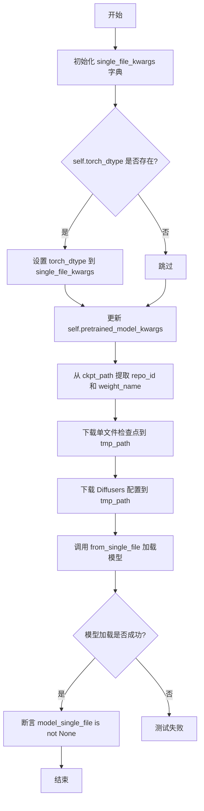

#### 带注释源码

```python
def test_single_file_loading_with_diffusers_config_local_files_only(self, tmp_path):
    """
    测试使用本地文件和本地 Diffusers 配置进行单文件加载。
    
    该测试验证：
    1. 能够从本地路径加载单文件检查点
    2. 能够使用本地 Diffusers 配置文件
    3. from_single_file 方法的 local_files_only=True 参数正常工作
    """
    # 初始化单文件加载的 kwargs 字典
    single_file_kwargs = {}

    # 如果类配置了 torch_dtype，则添加到加载参数中
    if self.torch_dtype:
        single_file_kwargs["torch_dtype"] = self.torch_dtype
    
    # 合并预训练模型的额外配置参数（如 subfolder 等）
    single_file_kwargs.update(self.pretrained_model_kwargs)

    # 从单文件检查点路径提取 HuggingFace repo_id 和权重文件名
    pretrained_model_name_or_path, weight_name = _extract_repo_id_and_weights_name(self.ckpt_path)
    
    # 下载单文件检查点到临时目录
    local_ckpt_path = download_single_file_checkpoint(pretrained_model_name_or_path, weight_name, str(tmp_path))
    
    # 下载 Diffusers 配置文件（不含权重文件）到临时目录
    local_diffusers_config = download_diffusers_config(self.pretrained_model_name_or_path, str(tmp_path))

    # 使用本地文件和本地配置加载单文件模型
    model_single_file = self.model_class.from_single_file(
        local_ckpt_path,          # 本地检查点路径
        config=local_diffusers_config,  # 本地 Diffusers 配置目录
        local_files_only=True,    # 仅使用本地文件
        **single_file_kwargs      # 其他加载参数
    )

    # 断言模型加载成功
    assert model_single_file is not None, "Failed to load model with config and local_files_only=True"
```


### `SingleFileTesterMixin.test_single_file_loading_dtype`

该方法用于测试单文件加载时能否正确使用不同的 `torch.dtype`（如 `float32` 和 `float16`），通过遍历多种数据类型，加载模型并验证模型的实际 dtype 是否与请求的 dtype 一致，同时进行内存清理。

参数：

- `self`：`SingleFileTesterMixin`，表示类的实例本身，无需额外参数

返回值：`None`，该方法为测试方法，主要通过 `assert` 断言进行验证，无显式返回值

#### 流程图

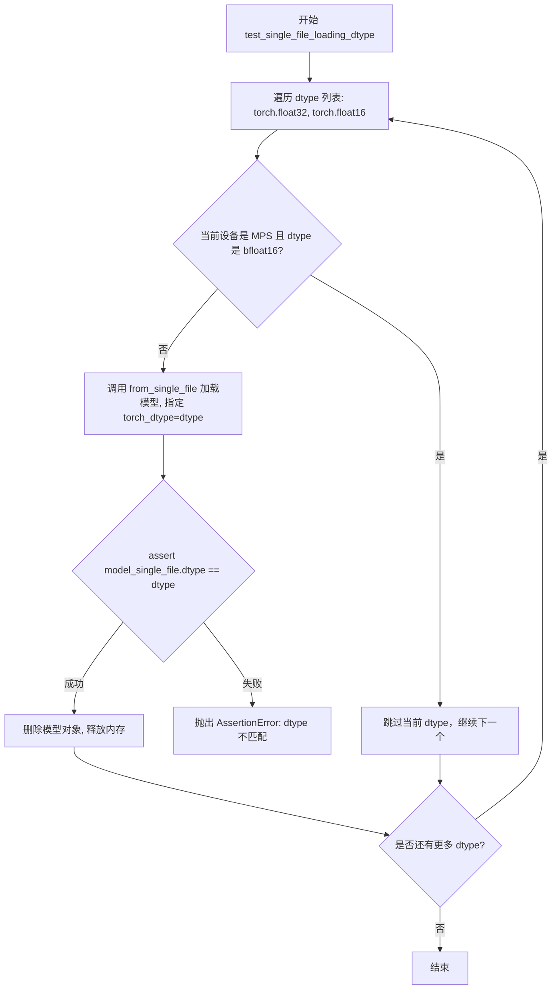

#### 带注释源码

```python
def test_single_file_loading_dtype(self):
    """
    测试单文件加载时能否正确使用不同的 torch.dtype。
    遍历 float32 和 float16 两种数据类型，验证模型加载后的 dtype 是否正确。
    """
    # 遍历多种 dtype 进行测试
    for dtype in [torch.float32, torch.float16]:
        # MPS 设备不支持 bfloat16，跳过该组合
        if torch_device == "mps" and dtype == torch.bfloat16:
            continue

        # 使用 from_single_file 方法加载模型，指定 torch_dtype 参数
        model_single_file = self.model_class.from_single_file(self.ckpt_path, torch_dtype=dtype)

        # 断言：验证模型的实际 dtype 与请求的 dtype 一致
        assert model_single_file.dtype == dtype, f"Expected dtype {dtype}, got {model_single_file.dtype}"

        # Cleanup: 清理已加载的模型对象
        del model_single_file
        # 强制垃圾回收，释放 Python 对象
        gc.collect()
        # 清空 GPU 缓存，释放 GPU 内存
        backend_empty_cache(torch_device)
```


### `SingleFileTesterMixin.test_checkpoint_variant_loading`

该方法用于测试从多个交替的检查点路径加载单文件模型，验证模型能否成功加载并确保资源正确释放。

参数：

- `self`：`SingleFileTesterMixin`，类的实例本身，包含 `alternate_ckpt_paths`、`torch_dtype` 和 `model_class` 等属性

返回值：`None`，该方法为测试方法，无返回值

#### 流程图

```mermaid
flowchart TD
    A[开始] --> B{self.alternate_ckpt_paths 是否存在?}
    B -->|否| C[直接返回]
    B -->|是| D[遍历 alternate_ckpt_paths 中的每个 ckpt_path]
    D --> E[清空后端缓存]
    E --> F[初始化空字典 single_file_kwargs]
    F --> G{self.torch_dtype 是否存在?}
    G -->|是| H[将 torch_dtype 添加到 single_file_kwargs]
    G -->|否| I[使用单文件方式加载模型]
    H --> I
    I --> J[使用 model_class.from_single_file 加载模型]
    J --> K{模型是否成功加载?}
    K -->|否| L[抛出断言错误]
    K -->|是| M[删除模型对象]
    M --> N[垃圾回收]
    N --> O[清空后端缓存]
    O --> P{是否还有更多 ckpt_path?}
    P -->|是| D
    P -->|否| Q[结束]
```

#### 带注释源码

```python
def test_checkpoint_variant_loading(self):
    """
    测试从多个交替的检查点路径加载单文件模型。
    该测试方法验证模型能够从不同的检查点变体成功加载。
    """
    # 如果没有配置交替检查点路径，则直接返回，不执行测试
    if not self.alternate_ckpt_paths:
        return

    # 遍历所有配置的交替检查点路径
    for ckpt_path in self.alternate_ckpt_paths:
        # 每次加载前清空GPU缓存，释放资源
        backend_empty_cache(torch_device)

        # 准备单文件加载的额外参数
        single_file_kwargs = {}
        # 如果指定了torch_dtype，则添加到加载参数中
        if self.torch_dtype:
            single_file_kwargs["torch_dtype"] = self.torch_dtype

        # 使用from_single_file方法从指定路径加载模型
        model = self.model_class.from_single_file(ckpt_path, **single_file_kwargs)

        # 断言模型成功加载，不为None
        assert model is not None, f"Failed to load checkpoint from {ckpt_path}"

        # 清理加载的模型对象
        del model
        # 强制垃圾回收，释放内存
        gc.collect()
        # 再次清空后端缓存，确保资源完全释放
        backend_empty_cache(torch_device)
```


### `SingleFileTesterMixin.test_single_file_loading_with_device_map`

该方法用于测试使用 `device_map` 参数从单文件检查点加载模型的功能，验证模型能够正确加载并具有有效的 `hf_device_map` 属性，同时确保设备映射被正确遵守。

参数：

- `self`：`SingleFileTesterMixin`，测试类的实例，包含模型加载所需的配置属性（如 `ckpt_path`、`torch_dtype`、`model_class` 等）

返回值：`None`，该方法为测试方法，通过断言验证模型加载结果，不返回任何值

#### 流程图

```mermaid
flowchart TD
    A[开始测试] --> B[创建 single_file_kwargs<br/>设置 device_map=torch_device]
    B --> C{self.torch_dtype<br/>是否存在?}
    C -->|是| D[添加 torch_dtype<br/>到 single_file_kwargs]
    C -->|否| E[跳过]
    D --> E
    E --> F[调用 model_class.from_single_file<br/>加载模型]
    F --> G{断言: model is not None}
    G -->|失败| H[抛出 AssertionError<br/>'Failed to load model with device_map']
    G -->|成功| I{断言: hasattr<br/>model.hf_device_map}
    I -->|失败| J[抛出 AssertionError<br/>'Model should have hf_device_map attribute']
    I -->|成功| K{断言: model.hf_device_map<br/>is not None}
    K -->|失败| L[抛出 AssertionError<br/>'hf_device_map should not be None']
    K -->|成功| M[调用 check_device_map_is_respected<br/>验证设备映射遵守情况]
    M --> N[测试通过<br/>结束]
```

#### 带注释源码

```python
def test_single_file_loading_with_device_map(self):
    """
    测试使用 device_map 参数从单文件检查点加载模型的功能。
    
    该测试方法执行以下验证：
    1. 使用 device_map 参数加载模型
    2. 验证模型成功加载（非 None）
    3. 验证模型具有 hf_device_map 属性
    4. 验证 hf_device_map 不为 None
    5. 验证设备映射被正确遵守
    """
    # 构建加载参数字典，指定设备映射目标
    # torch_device 是从 testing_utils 导入的设备标识符（如 'cuda', 'cpu', 'mps' 等）
    single_file_kwargs = {"device_map": torch_device}

    # 检查是否需要设置特定的数据类型
    # torch_dtype 属性可以在子类中重写，默认为 None
    if self.torch_dtype:
        # 如果指定了 torch_dtype，将其添加到加载参数中
        # 支持加载不同精度的模型（float32, float16, bfloat16 等）
        single_file_kwargs["torch_dtype"] = self.torch_dtype

    # 调用模型的 from_single_file 类方法加载模型
    # self.ckpt_path 是单文件检查点的路径（必须由子类实现）
    # self.model_class 是要测试的模型类（必须由配置 mixin 提供）
    # **single_file_kwargs 展开设备映射和数据类型参数
    model = self.model_class.from_single_file(self.ckpt_path, **single_file_kwargs)

    # 断言验证：模型成功加载
    assert model is not None, "Failed to load model with device_map"
    
    # 断言验证：模型具有 hf_device_map 属性
    # device_map 参数会使模型加载器生成 hf_device_map 字典
    assert hasattr(model, "hf_device_map"), "Model should have hf_device_map attribute when loaded with device_map"
    
    # 断言验证：hf_device_map 不为 None
    # hf_device_map 是一个字典，描述了模型各层到设备的映射
    assert model.hf_device_map is not None, "hf_device_map should not be None when loaded with device_map"
    
    # 调用辅助函数验证设备映射是否被正确遵守
    # 确保模型的计算操作确实在 hf_device_map 指定的设备上执行
    check_device_map_is_respected(model, model.hf_device_map)
```

## 关键组件


### 单文件检查点下载器 (download_single_file_checkpoint)

从HuggingFace Hub下载单个文件检查点到临时目录，返回本地文件路径。

### Diffusers配置下载器 (download_diffusers_config)

从仓库下载Diffusers配置文件，排除所有权重文件（.ckpt、.bin、.pt、.safetensors），仅保留配置类文件（.json、.txt）。

### 单文件模型测试Mixin类 (SingleFileTesterMixin)

核心测试类，提供单文件加载功能的完整测试覆盖，包括配置验证、参数一致性检查、本地文件加载、设备映射支持、多种dtype加载、变体检查点加载等。

### 配置一致性验证 (test_single_file_model_config)

验证从预训练加载和单文件加载的模型配置参数一致性，排除特定系统参数后逐项比对。

### 参数一致性验证 (test_single_file_model_parameters)

验证两种加载方式的模型参数键、形状和数值完全一致，通过状态字典对比实现。

### 本地文件加载测试 (test_single_file_loading_local_files_only)

测试使用local_files_only=True从本地缓存加载单文件模型的能力。

### 混合配置加载测试 (test_single_file_loading_with_diffusers_config)

测试使用预训练配置路径加载单文件模型，并与标准预训练加载结果进行配置对比。

### 本地配置加载测试 (test_single_file_loading_with_diffusers_config_local_files_only)

测试同时使用本地单文件检查点和本地Diffusers配置文件进行加载。

### 多精度加载测试 (test_single_file_loading_dtype)

验证单文件加载支持float32、float16、bfloat16等多种数值精度。

### 检查点变体加载测试 (test_checkpoint_variant_loading)

测试加载同一模型的不同检查点变体（如不同精度版本）。

### 设备映射加载测试 (test_single_file_loading_with_device_map)

验证单文件加载支持device_map参数，并正确设置hf_device_map属性。


## 问题及建议


### 已知问题

-   **硬编码的魔法字符串**：`PARAMS_TO_IGNORE` 列表在多个测试方法中重复定义（`test_single_file_model_config` 和 `test_single_file_loading_with_diffusers_config`），违反 DRY 原则，且新增配置参数时需要手动维护
-   **代码重复**：`torch_dtype` 的处理逻辑在所有测试方法中重复出现，未提取为公共方法
-   **缺少类型提示**：全局函数 `download_single_file_checkpoint` 和 `download_diffusers_config` 的参数缺少类型注解，影响代码可读性和静态检查
-   **内存管理不完善**：测试方法中未使用 `torch.no_grad()` 上下文，尤其在 `test_single_file_model_parameters` 中加载大模型时会导致不必要的显存占用
-   **测试隔离性不足**：依赖真实的 HuggingFace Hub 进行网络下载，网络波动或服务不可用会导致测试失败（flaky tests）
-   **异常处理缺失**：网络下载和模型加载均无 try-except 包装，无法提供有意义的错误信息或进行错误恢复
-   **资源清理不彻底**：虽然调用了 `gc.collect()` 和 `backend_empty_cache`，但对于 `state_dict` 等中间变量未显式释放

### 优化建议

-   将 `PARAMS_TO_IGNORE` 提升为类属性或常量，所有测试方法共用
-   提取 `torch_dtype` 处理逻辑为类方法（如 `_prepare_dtype_kwargs`），减少重复代码
-   为全局函数添加完整的类型注解
-   在模型推理和状态字典获取处使用 `torch.no_grad()` 减少显存占用
-   考虑使用 mock 或本地缓存的检查点文件来隔离外部依赖，提高测试稳定性
-   为关键操作添加异常处理和日志记录，区分不同类型的失败原因
-   使用 `del` 显式删除大对象并结合 `torch.cuda.empty_cache()` 确保显存及时释放

## 其它


### 设计目标与约束

本模块的设计目标是验证Diffusers库中单文件加载（Single File Loading）功能的正确性和一致性，确保从单文件checkpoint加载的模型与从完整预训练仓库加载的模型在配置、参数、dtype等方面完全等价。约束条件包括：1）仅支持PyTorch加速器环境（@require_torch_accelerator）；2）仅在nightly版本运行（@nightly）；3）依赖特定格式的checkpoint文件（.ckpt/.bin/.pt/.safetensors）；4）测试必须在单文件标记（@is_single_file）下运行。

### 错误处理与异常设计

代码采用断言（assert）进行关键验证，包括参数键一致性检查、参数形状匹配验证、数值等价性验证、dtype一致性验证、device_map正确性验证等。当加载失败时返回None并通过assert捕获。NotImplementedError用于强制子类实现必需属性（ckpt_path）。异常处理策略包括：1）使用try-except捕获下载异常；2）通过gc.collect()和backend_empty_cache()清理资源防止内存泄漏；3）跳过不支持的dtype（如MPS设备上的bfloat16）。

### 数据流与状态机

测试流程状态机包含以下状态：1）SETUP（setup_method）：执行gc.collect()和缓存清理；2）CONFIG_TEST（test_single_file_model_config）：加载预训练模型和单文件模型，比较config参数；3）PARAM_TEST（test_single_file_model_parameters）：加载模型获取state_dict，比较键、形状、数值；4）LOCAL_LOAD_TEST（test_single_file_loading_local_files_only）：下载到本地后加载；5）CONFIG_LOAD_TEST（test_single_file_loading_with_diffusers_config）：使用diffusers config加载；6）DTYPE_TEST（test_single_file_loading_dtype）：循环测试不同dtype；7）VARIANT_TEST（test_checkpoint_variant_loading）：测试变体checkpoint；8）DEVICE_MAP_TEST（test_single_file_loading_with_device_map）：测试device_map加载；9）TEARDOWN（teardown_method）：清理资源。

### 外部依赖与接口契约

本模块依赖以下外部接口：1）hf_hub_download：下载单文件checkpoint；2）snapshot_download：下载diffusers配置文件；3）_extract_repo_id_and_weights_name：从路径提取repo_id和权重名称；4）from_pretrained：标准预训练模型加载方法；5）from_single_file：单文件加载方法；6）check_device_map_is_respected：验证device_map正确性。契约要求：子类必须实现ckpt_path属性（返回字符串类型的checkpoint路径），可选实现torch_dtype和alternate_ckpt_paths属性，from_pretrained和from_single_file方法必须返回等价的模型实例。

### 配置管理

配置管理涉及两部分：1）测试配置：通过pretrained_model_kwargs字典传递额外配置参数（如subfolder）；2）模型配置：使用PARAMS_TO_IGNORE列表排除比较的config字段（torch_dtype、_name_or_path、_use_default_values、_diffusers_version），这些字段在两种加载方式间自然不同。配置验证在test_single_file_model_config和test_single_file_loading_with_diffusers_config中执行。

### 资源清理与生命周期管理

资源管理策略：1）每个测试方法前后执行setup_method和teardown_method；2）加载模型后立即调用state_dict()获取参数，然后删除模型对象；3）显式调用gc.collect()强制垃圾回收；4）调用backend_empty_cache(torch_device)清理GPU缓存；5）在dtype循环测试中每次迭代后清理模型。这种设计确保在资源受限的CI环境中不会因内存累积导致测试失败。

### 性能考虑

性能相关设计：1）获取state_dict后立即移至CPU（.cpu()）避免GPU内存占用；2）使用del显式删除大对象；3）及时清理GPU缓存。由于是测试代码，性能优化不是主要目标，重点在于验证正确性而非加载速度。

### 并发与线程安全

本模块为单线程测试设计，不涉及并发场景。测试之间通过setup_method和teardown_method确保状态隔离，每个测试独立运行。临时目录（tmp_path）通过pytest fixture提供，确保测试间文件隔离。

### 安全性考虑

安全相关设计：1）使用ignore_patterns过滤敏感文件类型（.ckpt/.bin/.pt/.safetensors）；2）仅允许_patterns限定文件类型（.json/.txt）；3）local_files_only模式防止网络依赖；4）从Hub下载时使用指定的tmpdir隔离文件系统。

### 测试策略

测试策略采用多维度验证：1）等价性验证：比较预训练和单文件加载的config和parameters；2）本地化验证：测试local_files_only模式；3）配置验证：测试传入diffusers config的加载；4）类型验证：测试不同dtype（float32/float16/bfloat16）；5）变体验证：测试不同checkpoint变体；6）设备验证：测试device_map加载和hf_device_map属性。采用pytest标记（@nightly、@require_torch_accelerator、@is_single_file）实现选择性执行。

### 平台兼容性

平台兼容性处理：1）使用torch_device变量抽象设备（支持cuda/cpu/mps）；2）在test_single_file_loading_dtype中显式跳过MPS设备上的bfloat16（if torch_device == "mps" and dtype == torch.bfloat16: continue）；3）设备相关功能通过torch_device动态适配。

### 日志与监控

代码中无显式日志记录，仅通过assert的失败消息提供调试信息。监控通过测试框架的pytest报告实现，失败时自动展示参数差异详情。

### 版本兼容性

版本兼容性考虑：1）_diffusers_version字段用于忽略版本差异；2）支持多种checkpoint格式（.ckpt/.bin/.pt/.safetensors）；3）torch.dtype类型注解使用Python 3.10+的联合类型语法（torch.dtype | None）；4）list[str]类型注解要求Python 3.9+。建议最低Python版本为3.9。

### 代码规范与约定

代码规范：1）使用Google风格的docstring；2）常量使用全大写命名（PARAMS_TO_IGNORE）；3）属性使用@property装饰器；4）测试方法以test_前缀命名；5）类型注解使用Python 3.10+联合类型语法；6）遵循Hugging Face Diffusers项目编码规范（utf-8编码，Apache 2.0许可证头）。

### 关键边界场景

关键边界场景包括：1）空alternate_ckpt_paths列表时直接返回；2）MPS设备跳过bfloat16测试；3）config参数为None时的默认行为；4）local_files_only=True但文件不存在时的错误处理；5）checkpoint格式不匹配时的错误提示。

### 改进建议

潜在改进空间：1）增加异步下载支持提升测试速度；2）添加缓存机制避免重复下载；3）增加更多dtype测试（torch.bfloat16 on CUDA）；4）添加模型推理验证确保功能等价而不仅是参数等价；5）增加错误消息的国际化支持；6）将PARAMS_TO_IGNORE提取为配置常量便于扩展；7）添加性能基准测试记录加载时间。

    