# `diffusers\tests\models\testing_utils\training.py` 详细设计文档

这是一个 Pytest 测试 mixin 类，用于测试 diffusers 库中模型的训练功能，包括基础训练、EMA 训练、梯度检查点和混合精度训练等关键特性的验证。

## 整体流程

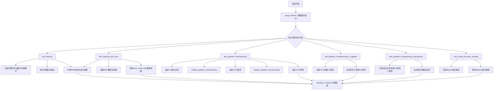

## 类结构

```
TrainingTesterMixin (Pytest Mixin类)
├── 依赖: EMAModel (diffusers.training_utils)
├── 依赖: testing_utils (HuggingFace测试工具)
└── 期望配置mixin:
    ├── model_class (模型类)
    ├── output_shape (输出形状)
    ├── get_init_dict() (初始化参数字典)
    └── get_dummy_inputs() (虚拟输入)
```

## 全局变量及字段


### `torch_device`
    
PyTorch设备字符串，用于指定模型和数据运行的设备（如'cuda:0'或'cpu'）

类型：`str`
    


### `output_shape`
    
来自配置mixin的预期输出形状元组，定义模型输出张量的维度

类型：`tuple`
    


### `model_class`
    
来自配置mixin的模型类，指向待测试的模型类本身

类型：`type`
    


### `init_dict`
    
运行时变量，从get_init_dict()获取的模型初始化参数字典

类型：`dict`
    


### `inputs_dict`
    
运行时变量，从get_dummy_inputs()获取的模型输入字典

类型：`dict`
    


### `model`
    
运行时变量，模型类实例化后的模型对象

类型：`torch.nn.Module`
    


### `ema_model`
    
运行时变量，指数移动平均模型，用于稳定训练过程

类型：`EMAModel`
    


### `output`
    
运行时变量，模型前向传播的输出张量

类型：`torch.Tensor`
    


### `noise`
    
运行时变量，用于计算MSE损失的随机噪声张量

类型：`torch.Tensor`
    


### `loss`
    
运行时变量，模型输出与噪声之间的MSE损失值

类型：`torch.Tensor`
    


    

## 全局函数及方法


### `gc.collect`

Python标准库中的垃圾回收函数，用于强制触发垃圾回收过程，回收不可达的对象并释放内存。

参数：无

返回值：`int`，返回回收的对象数量

#### 流程图

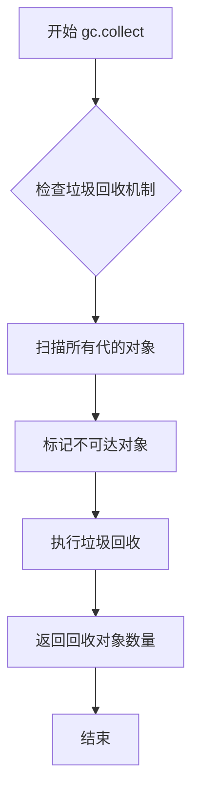

#### 带注释源码

```python
# Python标准库的gc.collect()函数调用
# 在测试框架中用于清理内存，确保测试之间没有内存泄漏

def setup_method(self):
    """
    测试方法开始前的设置
    """
    gc.collect()  # 强制进行垃圾回收，清理之前测试遗留的对象
    backend_empty_cache(torch_device)  # 清空GPU缓存

def teardown_method(self):
    """
    测试方法结束后的清理
    """
    gc.collect()  # 强制进行垃圾回收，清理当前测试产生的对象
    backend_empty_cache(torch_device)  # 清空GPU缓存
```

#### 使用场景说明

在测试类`TrainingTesterMixin`中，`gc.collect()`被用于：

1. **setup_method**：在每个测试方法开始前调用，确保清理之前的内存，为当前测试提供干净的内存环境
2. **teardown_method**：在每个测试方法结束后调用，清理测试过程中产生的临时对象，防止内存泄漏影响后续测试

这对于GPU测试尤为重要，因为GPU内存资源有限，及时回收未使用的对象可以避免内存不足的问题。


### `backend_empty_cache`

清理指定设备（GPU）的缓存，释放未使用的显存，通常用于在测试前重置显存状态以确保测试的准确性。

参数：

- `device`：`str` 或 `torch.device`，目标设备（如 `"cuda"` 或 `"cuda:0"`），指定要清理缓存的设备

返回值：`None`，无返回值，仅执行缓存清理操作

#### 流程图

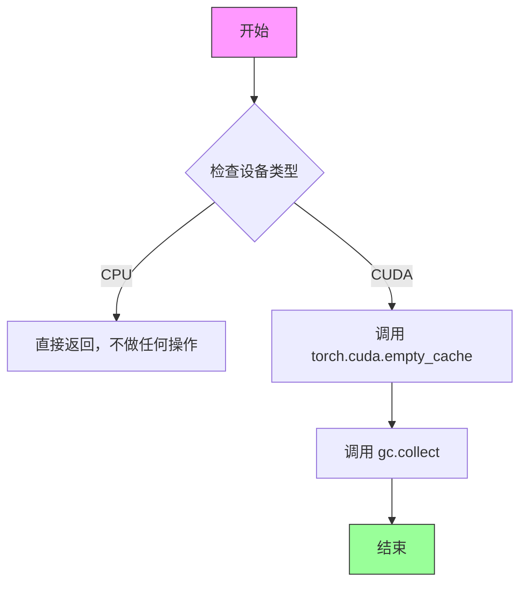

#### 带注释源码

```python
# 从 testing_utils 模块导入的函数
# 源码位置：...testing_utils.py
# 注意：由于该函数在外部模块定义，这里展示调用方式和使用场景

def backend_empty_cache(device):
    """
    清理指定设备的缓存，释放GPU显存。
    
    参数:
        device: str 或 torch.device - 目标设备
        
    返回:
        None
    """
    # 检查是否为CPU设备
    if torch.device(device).type == "cpu":
        # CPU设备无需清理缓存，直接返回
        return
    
    # 对于CUDA设备，执行以下操作：
    # 1. 清理CUDA缓存 - 释放未使用的GPU显存
    torch.cuda.empty_cache()
    
    # 2. 触发Python垃圾回收 - 确保Python对象被正确释放
    gc.collect()


# 在测试类中的实际调用：
class TrainingTesterMixin:
    def setup_method(self):
        """每个测试方法开始前调用，清理缓存确保干净环境"""
        gc.collect()
        backend_empty_cache(torch_device)  # 清理GPU缓存

    def teardown_method(self):
        """每个测试方法结束后调用，释放测试占用的显存"""
        gc.collect()
        backend_empty_cache(torch_device)  # 清理GPU缓存
```


### `torch.randn`

生成指定形状的随机张量，元素服从标准正态分布（均值=0，方差=1）。该函数是PyTorch内置函数，用于在训练过程中生成噪声样本或初始化随机数据。

参数：

- `shape`：`int` 或 `tuple of ints`，要生成的随机张量的形状。例如，`(3, 4)` 表示生成3行4列的张量。

返回值：`Tensor`，返回一个张量，其元素从标准正态分布中随机采样。

#### 流程图

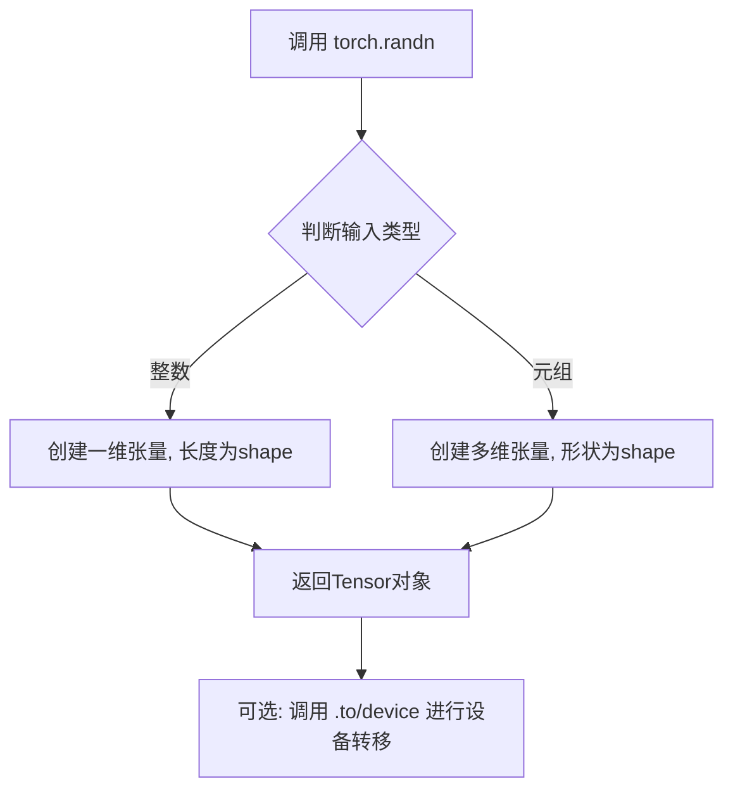

#### 带注释源码

```python
# 在 test_training 方法中使用
# 生成与输出形状相同的随机噪声，用于计算 MSE loss
noise = torch.randn((output.shape[0],) + self.output_shape).to(torch_device)

# 在 test_training_with_ema 方法中同样使用
noise = torch.randn((output.shape[0],) + self.output_shape).to(torch_device)

# 在 test_gradient_checkpointing_equivalence 方法中使用
# 生成与模型输出形状相同的随机标签
labels = torch.randn_like(out)

# 在 test_mixed_precision_training 方法中用于 float16 测试
noise = torch.randn((output.shape[0],) + self.output_shape).to(torch_device)

# 在 test_mixed_precision_training 方法中用于 bfloat16 测试
noise = torch.randn((output.shape[0],) + self.output_shape).to(torch_device)
```


### `torch.nn.functional.mse_loss`

该函数是PyTorch的均方误差损失函数，用于计算预测值与目标值之间的均方误差损失，常用于回归任务中评估模型性能。

参数：

- `input`：`torch.Tensor`，预测值（模型输出）
- `target`：`torch.Tensor`，目标值（真实标签）
- `reduction`：`str`，可选参数，指定损失 reduction 方式，可选值包括 `'none'`（返回每个元素的损失）、`'mean'`（返回平均损失，默认值）和 `'sum'`（返回损失之和）

返回值：`torch.Tensor`，返回计算后的损失值，类型取决于 `reduction` 参数

#### 流程图

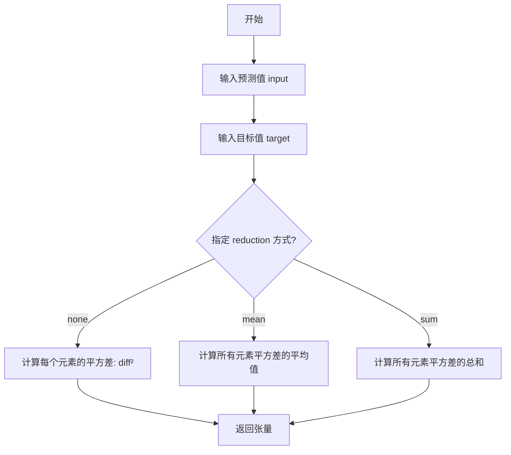

#### 带注释源码

```python
# 代码中的调用示例（来自 test_training 方法）
# 1. 获取模型输出
output = model(**inputs_dict, return_dict=False)[0]

# 2. 生成随机噪声作为目标值
noise = torch.randn((output.shape[0],) + self.output_shape).to(torch_device)

# 3. 调用 mse_loss 计算损失
#    input: output - 模型预测值
#    target: noise - 目标值（随机生成的噪声）
#    默认使用 reduction='mean'，返回标量损失
loss = torch.nn.functional.mse_loss(output, noise)

# 4. 反向传播计算梯度
loss.backward()
```

### 补充信息

#### 关键组件信息

- **TrainingTesterMixin**：测试训练功能的混合类，包含多个测试方法
- **model**：被测试的模型实例
- **output**：模型的前向传播输出
- **noise**：作为目标值的随机噪声
- **loss**：均方误差损失值

#### 潜在技术债务或优化空间

1. **测试代码重复**：在多个测试方法（`test_training`、`test_training_with_ema`、`test_mixed_precision_training`）中都有相同的 `mse_loss` 调用逻辑，可提取为共享方法
2. **硬编码的设备管理**：每次使用 `to(torch_device)` 可以考虑封装为辅助方法

#### 其它项目

- **设计目标**：验证模型在训练模式下的前向传播、反向传播和梯度计算功能
- **错误处理**：使用 `@require_torch_accelerator_with_training` 装饰器确保在支持训练的硬件环境下运行
- **外部依赖**：依赖 `torch.nn.functional.mse_loss`（PyTorch 内置函数）和 `EMAModel`（来自 diffusers 库）


### `torch.amp.autocast`

`torch.amp.autocast` 是 PyTorch 的自动混合精度（Automatic Mixed Precision, AMP）上下文管理器，允许在指定设备上使用特定的浮点数据类型（float16 或 bfloat16）运行前向传播，从而在保持数值稳定性的同时提升训练速度并减少显存占用。

参数：

- `device_type`：`str`，指定设备类型（如 `"cuda"`、`"cpu"` 等），用于确定使用哪种后端的自动混合精度
- `dtype`：`torch.dtype`，指定 autocast 内部计算使用的目标数据类型，通常为 `torch.float16` 或 `torch.bfloat16`
- `enabled`：`bool`（可选），默认值为 `True`，用于控制是否启用自动混合精度
- `cache_enabled`：`bool`（可选），默认值为 `True`，用于控制是否缓存自动混合精度相关的高速缓存

返回值：`torch.autocast` 上下文管理器对象，作为上下文管理器使用，用于包裹需要自动混合精度加速的代码块

#### 流程图

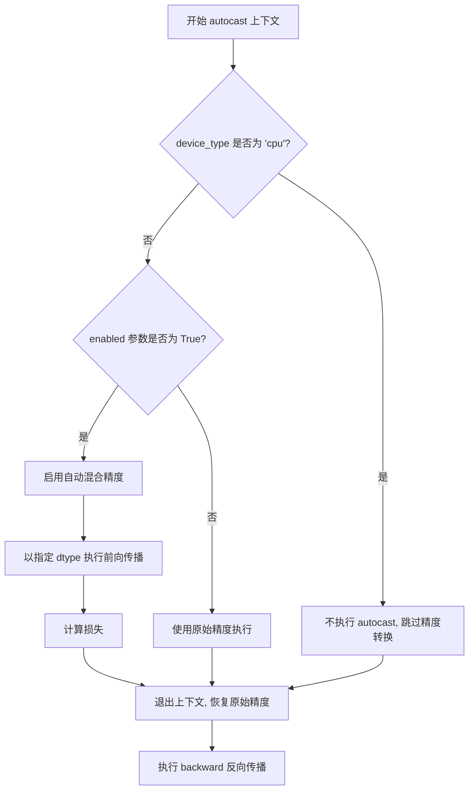

#### 带注释源码

```python
# 在 test_mixed_precision_training 方法中演示了 autocast 的使用方式

def test_mixed_precision_training(self):
    """
    测试模型的混合精度训练功能
    """
    init_dict = self.get_init_dict()
    inputs_dict = self.get_dummy_inputs()

    # 初始化模型并移动到目标设备
    model = self.model_class(**init_dict)
    model.to(torch_device)
    model.train()

    # 测试 float16 混合精度
    # 只有在非 CPU 设备上才执行混合精度测试
    if torch.device(torch_device).type != "cpu":
        # 使用 autocast 上下文管理器
        # device_type: 指定设备类型 (cuda, cpu, etc.)
        # dtype: 指定内部计算的精度类型 (float16)
        with torch.amp.autocast(device_type=torch.device(torch_device).type, dtype=torch.float16):
            # 在 float16 精度下执行前向传播
            output = model(**inputs_dict, return_dict=False)[0]

            # 生成噪声并计算 MSE 损失
            noise = torch.randn((output.shape[0],) + self.output_shape).to(torch_device)
            loss = torch.nn.functional.mse_loss(output, noise)

        # 退出 autocast 上下文后执行反向传播
        # 反向传播会在原始精度下进行
        loss.backward()

    # 测试 bfloat16 混合精度
    if torch.device(torch_device).type != "cpu":
        # 清零梯度
        model.zero_grad()
        # 使用 bfloat16 精度进行训练
        with torch.amp.autocast(device_type=torch.device(torch_device).type, dtype=torch.bfloat16):
            output = model(**inputs_dict, return_dict=False)[0]

            noise = torch.randn((output.shape[0],) + self.output_shape).to(torch_device)
            loss = torch.nn.functional.mse_loss(output, noise)

        loss.backward()
```

#### 关键组件信息

| 名称 | 描述 |
|------|------|
| `torch.amp.autocast` | PyTorch 自动混合精度上下文管理器，支持 float16 和 bfloat16 精度 |
| `EMAModel` | 指数移动平均模型，用于稳定训练过程（虽然代码中未直接在 autocast 内使用） |
| `test_mixed_precision_training` | 测试方法，验证模型在 float16 和 bfloat16 精度下的训练能力 |

#### 潜在技术债务与优化空间

1. **重复代码**：float16 和 bfloat16 的测试逻辑高度重复，可以使用参数化测试或提取公共方法
2. **CPU 跳过逻辑**：`torch.device(torch_device).type != "cpu"` 的判断在多处重复出现，应抽取为辅助函数
3. **缺失错误处理**：未对 autocast 可能失败的情况（如设备不支持特定精度）进行处理
4. **测试覆盖不足**：未测试精度混用场景（如部分层使用混合精度）

#### 其他设计说明

- **设计目标**：确保模型在支持混合精度的硬件上能够使用 float16 或 bfloat16 进行高效训练
- **约束条件**：仅在非 CPU 设备上执行混合精度测试，因为 CPU 不支持 float16 加速
- **错误处理**：代码采用静默跳过策略（if 判断），未对不支持精度的情况抛出明确异常
- **数据流**：输入数据 → 模型前向传播（autocast 精度）→ 损失计算 → 反向传播（恢复原始精度）


### copy.copy

`copy.copy` 是 Python 标准库 `copy` 模块中的一个函数，用于创建对象的浅拷贝（shallow copy）。在代码中，该函数被用于复制模型类，以便在测试中验证梯度检查点功能时不会修改原始模型类。

参数：

-  `{参数名称}`：`{参数类型}`，{参数描述}
-  `self.model_class`：`type`，在 `test_gradient_checkpointing_is_applied` 方法中传入的模型类，用于创建该类的一个浅拷贝

返回值：`type`，返回传入对象的浅拷贝副本

#### 流程图

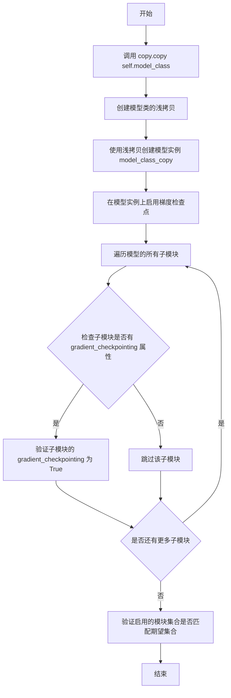

#### 带注释源码

```python
# test_gradient_checkpointing_is_applied 方法中的相关代码片段
def test_gradient_checkpointing_is_applied(self, expected_set=None):
    if not self.model_class._supports_gradient_checkpointing:
        pytest.skip("Gradient checkpointing is not supported.")

    if expected_set is None:
        pytest.skip("expected_set must be provided to verify gradient checkpointing is applied.")

    init_dict = self.get_init_dict()

    # 使用 copy.copy 创建模型类的浅拷贝
    # 浅拷贝创建一个新的对象，但引用原始对象内部的引用（如嵌套对象）
    model_class_copy = copy.copy(self.model_class)
    
    # 使用浅拷贝的模型类创建模型实例
    model = model_class_copy(**init_dict)
    
    # 启用梯度检查点
    model.enable_gradient_checkpointing()

    # 遍历模型的所有子模块，检查梯度检查点是否正确应用
    modules_with_gc_enabled = {}
    for submodule in model.modules():
        if hasattr(submodule, "gradient_checkpointing"):
            assert submodule.gradient_checkpointing, f"{submodule.__class__.__name__} should have GC enabled"
            modules_with_gc_enabled[submodule.__class__.__name__] = True

    # 验证启用的模块集合是否与期望集合匹配
    assert set(modules_with_gc_enabled.keys()) == expected_set, (
        f"Modules with GC enabled {set(modules_with_gc_enabled.keys())} do not match expected set {expected_set}"
    )
    assert all(modules_with_gc_enabled.values()), "All modules should have GC enabled"
```

#### 关键点说明

1. **浅拷贝特性**：`copy.copy` 创建的浅拷贝只复制对象本身，对于对象内部的引用（如列表、字典或其他对象），只复制引用而不复制引用的对象。

2. **使用场景**：在测试中使用浅拷贝是为了确保测试不会修改原始的模型类，因为后续会对 `model_class_copy` 进行修改（如启用梯度检查点）。

3. **与 deep copy 的区别**：代码中还有一处使用 `copy.deepcopy(inputs_dict)`，这是深拷贝，会递归复制所有嵌套对象。在 `test_gradient_checkpointing_equivalence` 方法中使用深拷贝是为了确保两次前向传播的输入数据完全独立，避免共享状态影响测试结果。


### `copy.deepcopy`

`copy.deepcopy` 是 Python 标准库 `copy` 模块中的函数，用于创建对象的深拷贝。与浅拷贝不同，深拷贝会递归地复制所有嵌套对象，确保原始对象和拷贝对象完全独立，互不影响。

参数：

- `x`：`Any`，要进行深拷贝的 Python 对象，可以是任意类型
- `memo`：`dict`（可选），用于维护已拷贝对象的映射字典，以处理循环引用

返回值：`Any`，返回输入对象的深拷贝副本，与原始对象完全独立

#### 流程图

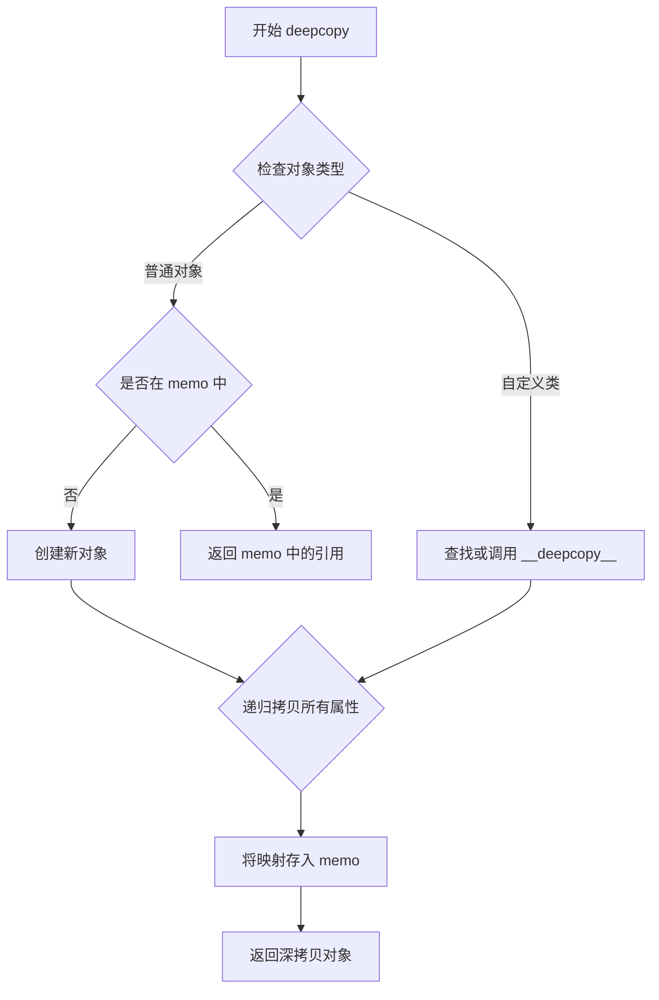

#### 带注释源码

```python
# Python 标准库 copy 模块中的 deepcopy 实现逻辑示例

def deepcopy(x, memo=None, _nil=[]):
    """
    创建对象的深拷贝副本
    
    参数:
        x: 要拷贝的任意 Python 对象
        memo: 可选的字典，用于处理循环引用和维护对象映射
    """
    # 初始化 memo 字典（如果未提供）
    if memo is None:
        memo = {}
    
    # 检查对象是否已经拷贝过（处理循环引用）
    if id(x) in memo:
        return memo[id(x)]
    
    # 获取对象的类信息
    cls = type(x)
    
    # 尝试查找自定义的 __deepcopy__ 方法
    copier = getattr(cls, "__deepcopy__", None)
    if copier is not None:
        # 如果类定义了 __deepcopy__，调用它
        y = copier(x, memo)
    else:
        # 否则使用默认的深拷贝逻辑
        # 这里会递归复制所有嵌套对象
        y = _reconstruct(x, memo)
    
    # 将映射存入 memo 以处理循环引用
    memo[id(x)] = y
    
    return y

def _reconstruct(x, memo):
    """默认的对象重建逻辑"""
    # 根据对象类型选择合适的复制策略
    # 对于字典、列表、元组等内置容器类型会递归处理
    ...
```

**使用示例**（来自用户代码）：

```python
# 在 test_gradient_checkpointing_equivalence 方法中
inputs_dict_copy = copy.deepcopy(inputs_dict)
# 将输入字典进行深拷贝，以确保后续测试使用独立的输入副本
# 避免在比较两个模型输出时共享同一个输入对象导致的偏差
```


### `pytest.skip`

`pytest.skip` 是 pytest 框架中的一个核心函数，用于在测试执行过程中自愿跳过某个测试，并可指定跳过原因。当调用此函数时，会立即停止当前测试的执行，并将该测试标记为"跳过"状态（SKIPPED），而非失败（FAILED）。

参数：

- `reason`：`str`，跳过测试的原因描述，用于在测试报告中说明为何跳过
- `allow_module_level`：`bool`（可选），默认为 `False`，是否允许在模块级别使用跳过

返回值：`None`（实际上该函数不返回任何值，它会抛出 `Skipped` 异常来中断测试执行）

#### 流程图

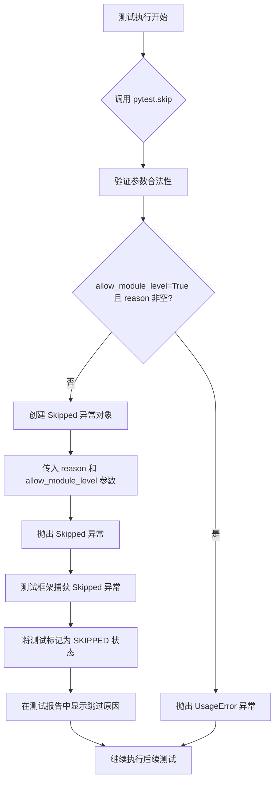

#### 带注释源码

```python
def skip(reason: str = "", allow_module_level: bool = False) -> "NoReturn":
    """
    Skip a test with an optional reason.
    
    此函数用于自愿跳过测试，标记为跳过状态。
    它通过抛出 Skipped 异常来实现跳过机制。

    参数:
        reason: 描述跳过原因的字符串，将显示在测试报告中
        allow_module_level: 布尔值，允许在模块级别执行跳过操作

    返回:
        NoReturn: 此函数不返回，始终抛出异常

    异常:
        Skipped: 始终抛出此异常以触发测试跳过
        UsageError: 当 allow_module_level=True 且 reason 非空时抛出

    示例:
        >>> import pytest
        >>> def test_feature_not_implemented():
        ...     pytest.skip("功能尚未实现")
        >>> 
        >>> def test_optional_feature():
        ...     if not has_optional_dep():
        ...         pytest.skip("可选依赖未安装", allow_module_level=True)
    """
    from _pytest.config import UsageError
    from _pytest.outcomes import Skipped

    # 验证参数合法性：模块级别跳过时不能提供原因
    if allow_module_level and reason:
        raise UsageError(
            "skip with reason is not allowed in module level"
        )
    
    # 抛出 Skipped 异常，测试框架会捕获此异常
    # 并将测试标记为跳过状态
    raise Skipped(reason, allow_module_level=allow_module_level)
```

---

### 在代码中的实际调用示例

在提供的代码中，`pytest.skip` 被用于以下场景：

```python
# 场景1：当模型不支持梯度检查点时跳过测试
if not self.model_class._supports_gradient_checkpointing:
    pytest.skip("Gradient checkpointing is not supported.")

# 场景2：当未提供 expected_set 参数时跳过测试
if expected_set is None:
    pytest.skip("expected_set must be provided to verify gradient checkpointing is applied.")
```

这些调用用于在测试执行前检查前置条件，当条件不满足时跳过测试而非让测试失败，从而提供更清晰的测试反馈。


### `torch_all_close`

该函数是一个用于比较两个 PyTorch 张量是否在数值上接近的测试工具函数，类似于 `torch.all_close`，但在测试框架中作为断言辅助工具使用。

参数：

- `a`：`torch.Tensor`，第一个要比较的张量
- `b`：`torch.Tensor`，第二个要比较的张量
- `rtol`：`float`，相对容差（默认为 1e-5），可选参数
- `atol`：`float`，绝对容差（必须指定），用于控制绝对误差
- `equal_nan`：`bool`，是否将 NaN 视为相等（默认为 True），可选参数

返回值：`bool`，如果两个张量在指定容差内相等则返回 True，否则返回 False

#### 流程图

```mermaid
flowchart TD
    A[开始 torch_all_close] --> B{输入参数验证}
    B -->|验证通过| C[计算绝对差值: |a - b|]
    B -->|验证失败| D[抛出异常]
    C --> E{检查 rtol 和 atol}
    E --> F[应用容差判断: |a - b| <= atol + rtol * |b|]
    F --> G{结果为True?}
    G -->|是| H[返回 True]
    G -->|否| I[返回 False]
    
    style A fill:#f9f,color:#000
    style H fill:#9f9,color:#000
    style I fill:#f99,color:#000
```

#### 带注释源码

```python
# 由于 torch_all_close 是从 testing_utils 导入的外部函数，
# 以下是其在 diffusers 项目中可能的实现方式（基于使用方式推断）：

def torch_all_close(
    a: torch.Tensor,
    b: torch.Tensor,
    rtol: float = 1e-5,
    atol: float = 1e-5,
    equal_nan: bool = True,
) -> bool:
    """
    比较两个张量是否在数值上接近。
    
    参数:
        a: 第一个张量
        b: 第二个张量  
        rtol: 相对容差
        atol: 绝对容差
        equal_nan: 是否将 NaN 视为相等
    
    返回:
        如果张量在容差范围内相等返回 True，否则返回 False
    """
    # 处理 NaN 的情况
    if equal_nan:
        nan_mask = torch.isnan(a) & torch.isnan(b)
        if torch.all(nan_mask):
            return True
    
    # 计算绝对差值
    diff = torch.abs(a - b)
    
    # 应用容差判断: |a - b| <= atol + rtol * |b|
    tolerance = atol + rtol * torch.abs(b)
    
    # 检查所有元素是否在容差范围内
    return torch.all(diff <= tolerance).item()
```

#### 使用示例

在给定的代码中，该函数的使用方式如下：

```python
# 在 test_gradient_checkpointing_equivalence 方法中使用
assert torch_all_close(param.grad.data, named_params_2[name].grad.data, atol=param_grad_tol), (
    f"Gradient mismatch for {name}"
)
```

这里 `torch_all_close` 用于验证梯度检查点启用前后的梯度是否在容差范围内相等，确保梯度检查点功能不会改变模型的梯度计算结果。


### EMAModel

EMAModel（指数移动平均模型）是一个用于在训练过程中维护模型参数指数移动平均的类。它通过保存模型参数的平滑副本，提高模型的稳定性和泛化能力，常用于深度学习训练中。

参数：

- `parameters`：模型参数，通常通过 `model.parameters()` 获取，用于初始化 EMA 模型的参数副本。

返回值：返回 EMA 模型实例。

#### 流程图

```mermaid
graph TD
    A[开始] --> B[创建 EMAModel 实例]
    B --> C[复制原始模型参数到 EMA 参数]
    C --> D[训练迭代]
    D --> E[执行 ema_model.step]
    E --> F[更新 EMA 参数: ema_param = decay * ema_param + (1 - decay) * param]
    F --> D
```

#### 带注释源码

```python
# 以下为代码中使用 EMAModel 的示例，EMAModel 类定义来自 diffusers.training_utils

# 导入 EMAModel 类
from diffusers.training_utils import EMAModel

# 创建模型实例并设置为训练模式
model = self.model_class(**init_dict)
model.to(torch_device)
model.train()

# 初始化 EMA 模型，传入模型参数
ema_model = EMAModel(model.parameters())

# 执行前向传播
output = model(**inputs_dict, return_dict=False)[0]

# 计算损失并反向传播
noise = torch.randn((output.shape[0],) + self.output_shape).to(torch_device)
loss = torch.nn.functional.mse_loss(output, noise)
loss.backward()

# 执行 EMA 步骤，更新 EMA 参数
ema_model.step(model.parameters())
```

#### EMAModel 类接口（根据使用推断）

```python
class EMAModel:
    """
    指数移动平均模型类
    
    主要功能：
    - 在训练过程中维护模型参数的指数移动平均
    - 提供 step 方法更新 EMA 参数
    - 可选地提供 swap_weights 方法用于推理时使用 EMA 参数
    """
    
    def __init__(self, parameters, decay=0.9999, device=None):
        """
        初始化 EMA 模型
        
        参数：
        - parameters: 模型参数迭代器
        - decay: 衰减率，默认 0.9999
        - device: 设备参数，可选
        """
        # 复制参数到 EMA 缓冲区
        pass
    
    def step(self, parameters):
        """
        执行一次 EMA 更新
        
        参数：
        - parameters: 当前模型参数
        
        更新公式：ema_param = decay * ema_param + (1 - decay) * param
        """
        pass
    
    def swap_weights(self):
        """
        交换模型权重为 EMA 权重，用于推理
        """
        pass
    
    def restore_weights(self):
        """
        恢复原始模型权重
        """
        pass
```


### `TrainingTesterMixin.setup_method`

该方法是 pytest 的 setup 钩子，在每个测试方法执行前自动调用。它通过运行垃圾回收和清空 GPU 缓存来确保测试环境的干净状态，防止测试间的内存泄漏和状态污染。

参数：

- `self`：`TrainingTesterMixin`，mixin 类的实例（隐式参数），代表当前测试类的实例

返回值：`None`，该方法没有返回值

#### 流程图

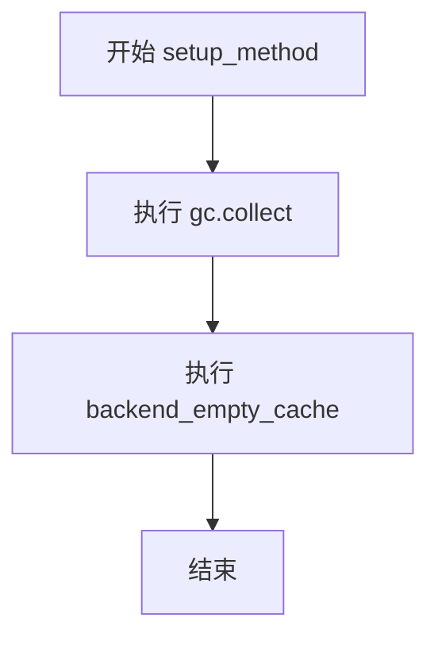

#### 带注释源码

```python
def setup_method(self):
    """
    pytest setup 钩子方法，在每个测试方法执行前调用。
    
    该方法确保每个测试都在干净的环境中运行：
    1. 调用 gc.collect() 进行垃圾回收，释放未使用的内存对象
    2. 调用 backend_empty_cache() 清空 GPU 缓存，防止显存泄漏
    """
    # 收集并清理不可达的 Python 对象，释放内存
    gc.collect()
    # 清空 GPU 缓存，释放显存资源
    backend_empty_cache(torch_device)
```


### `TrainingTesterMixin.teardown_method`

该方法是一个pytest测试生命周期钩子，在每个测试方法执行完毕后被自动调用，用于执行清理工作，回收Python垃圾和GPU显存资源，确保测试环境干净，避免内存泄漏影响后续测试。

参数：

- `self`：`TrainingTesterMixin`，当前mixin类的实例隐式传入

返回值：`None`，无显式返回值

#### 流程图

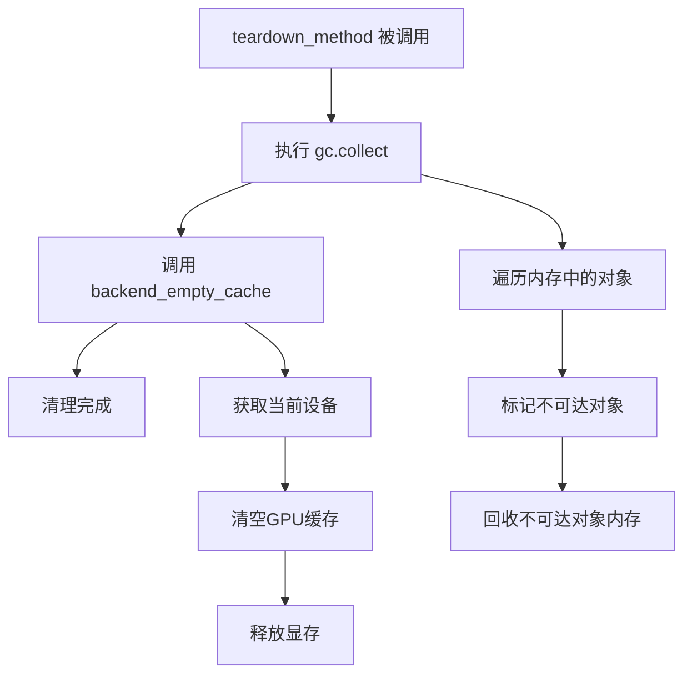

#### 带注释源码

```python
def teardown_method(self):
    """
    在每个测试方法运行后执行的清理方法。
    
    该方法作为pytest的teardown钩子，会在测试方法完成后自动调用。
    用于清理测试过程中产生的内存占用，确保测试间的隔离性。
    """
    # 执行Python垃圾回收，清理不再引用的对象
    gc.collect()
    
    # 调用后端工具清空GPU显存缓存
    # torch_device 定义在 testing_utils 中，通常为 'cuda' 或 'cpu'
    backend_empty_cache(torch_device)
```


### `TrainingTesterMixin.test_training`

该方法是一个测试模型训练功能的核心测试用例，通过初始化模型、执行前向传播、生成噪声并计算MSE损失，最后进行反向传播来验证模型能够正常进行训练。

参数：
- 该方法无显式参数（`self` 为隐式参数）

返回值：`None`，该方法为测试用例，执行验证逻辑但不返回结果

#### 流程图

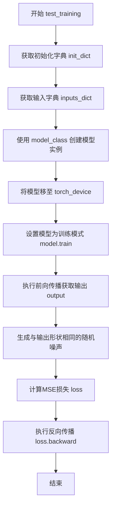

#### 带注释源码

```python
def test_training(self):
    """
    测试模型的基础训练功能。
    
    该测试用例执行以下步骤：
    1. 获取模型初始化参数字典
    2. 获取模型输入字典
    3. 创建模型实例并移至指定设备
    4. 设置模型为训练模式
    5. 执行前向传播
    6. 生成随机噪声作为目标
    7. 计算MSE损失
    8. 执行反向传播验证梯度计算
    """
    # 获取模型初始化参数字典，由子类提供
    init_dict = self.get_init_dict()
    
    # 获取模型输入字典，由子类提供
    inputs_dict = self.get_dummy_inputs()
    
    # 使用模型类创建模型实例，传入初始化参数
    model = self.model_class(**init_dict)
    
    # 将模型移至指定的计算设备（如GPU）
    model.to(torch_device)
    
    # 设置模型为训练模式，启用dropout等训练特定层
    model.train()
    
    # 执行前向传播，return_dict=False返回tuple，取第一个元素为输出张量
    output = model(**inputs_dict, return_dict=False)[0]
    
    # 生成与输出形状相同的随机噪声，用于计算损失
    # output.shape[0] 为批次大小，self.output_shape 为输出空间维度
    noise = torch.randn((output.shape[0],) + self.output_shape).to(torch_device)
    
    # 计算输出与噪声之间的MSE损失
    loss = torch.nn.functional.mse_loss(output, noise)
    
    # 执行反向传播，计算所有可训练参数的梯度
    loss.backward()
```


### `TrainingTesterMixin.test_training_with_ema`

该方法用于测试模型在训练模式下结合指数移动平均（EMA）的功能，验证模型前向传播、梯度计算以及 EMA 参数更新的正确性。

参数：

- `self`：`TrainingTesterMixin`，调用此方法的类实例本身

返回值：`None`，此测试方法不返回任何值，仅执行训练步骤的验证

#### 流程图

```mermaid
flowchart TD
    A[开始] --> B[获取初始化字典: get_init_dict]
    B --> C[获取输入字典: get_dummy_inputs]
    C --> D[使用 model_class 创建模型]
    D --> E[将模型移动到 torch_device]
    E --> F[设置模型为训练模式: model.train]
    F --> G[创建 EMA 模型: EMAModel]
    G --> H[执行前向传播: model(inputs_dict)]
    H --> I[获取模型输出]
    I --> J[生成随机噪声]
    J --> K[计算 MSE 损失: loss = MSE(output, noise)]
    K --> L[反向传播: loss.backward]
    L --> M[更新 EMA 参数: ema_model.step]
    M --> N[结束]
```

#### 带注释源码

```python
def test_training_with_ema(self):
    """
    测试训练功能与 EMA (指数移动平均) 结合
    验证模型在训练模式下前向传播、梯度计算和 EMA 更新的正确性
    """
    # 获取模型初始化参数字典，由子类提供
    init_dict = self.get_init_dict()
    
    # 获取模型输入字典，由子类提供
    inputs_dict = self.get_dummy_inputs()

    # 使用模型类实例化模型
    model = self.model_class(**init_dict)
    
    # 将模型移动到指定的计算设备（CPU/GPU）
    model.to(torch_device)
    
    # 设置模型为训练模式，启用 dropout 等训练特定层
    model.train()
    
    # 创建 EMA 模型，用于维护模型参数的指数移动平均
    # EMAModel 会跟踪模型参数的滑动平均值
    ema_model = EMAModel(model.parameters())

    # 执行前向传播，传入输入并获取输出
    # return_dict=False 返回元组，取第一个元素（输出张量）
    output = model(**inputs_dict, return_dict=False)[0]

    # 生成与输出形状相同的随机噪声
    # output.shape[0] 是 batch size，self.output_shape 是输出空间维度
    noise = torch.randn((output.shape[0],) + self.output_shape).to(torch_device)
    
    # 计算输出与噪声之间的 MSE 损失
    loss = torch.nn.functional.mse_loss(output, noise)
    
    # 执行反向传播，计算梯度
    loss.backward()
    
    # 执行 EMA 一步更新，将滑动平均值应用到模型参数
    ema_model.step(model.parameters())
```


### `TrainingTesterMixin.test_gradient_checkpointing`

该方法用于测试模型的梯度检查点（Gradient Checkpointing）功能是否正常工作，包括验证模型在初始化时梯度检查点默认禁用、启用方法和禁用方法是否能正确切换状态。

参数：

- `self`：`TrainingTesterMixin` 类实例，表示测试混入类的实例本身

返回值：`None`，该方法为测试方法，无返回值，通过断言验证功能正确性

#### 流程图

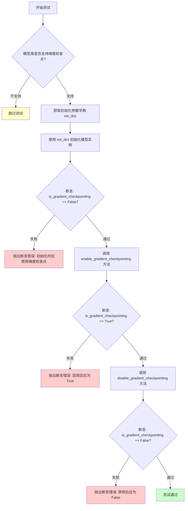

#### 带注释源码

```python
def test_gradient_checkpointing(self):
    """
    测试模型的梯度检查点功能是否正常工作。
    
    测试内容：
    1. 模型初始化时梯度检查点默认为禁用状态
    2. enable_gradient_checkpointing() 方法能正确启用梯度检查点
    3. disable_gradient_checkpointing() 方法能正确禁用梯度检查点
    """
    # 检查模型类是否支持梯度检查点功能，如不支持则跳过测试
    if not self.model_class._supports_gradient_checkpointing:
        pytest.skip("Gradient checkpointing is not supported.")

    # 获取模型初始化参数字典，由子类实现提供
    init_dict = self.get_init_dict()

    # ====== 测试1: 验证初始化时梯度检查点默认禁用 ======
    # 在 init 时模型应该禁用梯度检查点
    model = self.model_class(**init_dict)
    # 断言初始化后 is_gradient_checkpointing 属性为 False
    assert not model.is_gradient_checkpointing, "Gradient checkpointing should be disabled at init"

    # ====== 测试2: 验证启用功能 ======
    # 检查 enable 是否工作
    # 调用模型的 enable_gradient_checkpointing 方法启用梯度检查点
    model.enable_gradient_checkpointing()
    # 断言启用后 is_gradient_checkpointing 属性为 True
    assert model.is_gradient_checkpointing, "Gradient checkpointing should be enabled"

    # ====== 测试3: 验证禁用功能 ======
    # 检查 disable 是否工作
    # 调用模型的 disable_gradient_checkpointing 方法禁用梯度检查点
    model.disable_gradient_checkpointing()
    # 断言禁用后 is_gradient_checkpointing 属性为 False
    assert not model.is_gradient_checkpointing, "Gradient checkpointing should be disabled"
```


### `TrainingTesterMixin.test_gradient_checkpointing_is_applied`

该方法用于验证模型在启用梯度检查点（Gradient Checkpointing）后，所有指定子模块的 gradient_checkpointing 属性是否都被正确设置为 True。它通过遍历模型的子模块并检查其属性，确保梯度检查点在预期模块上生效。

参数：

- `expected_set`：`Optional[set]`，用于验证梯度检查点是否应用的预期模块名称集合。如果为 None，则跳过测试。

返回值：`None`，无返回值（测试方法）。

#### 流程图

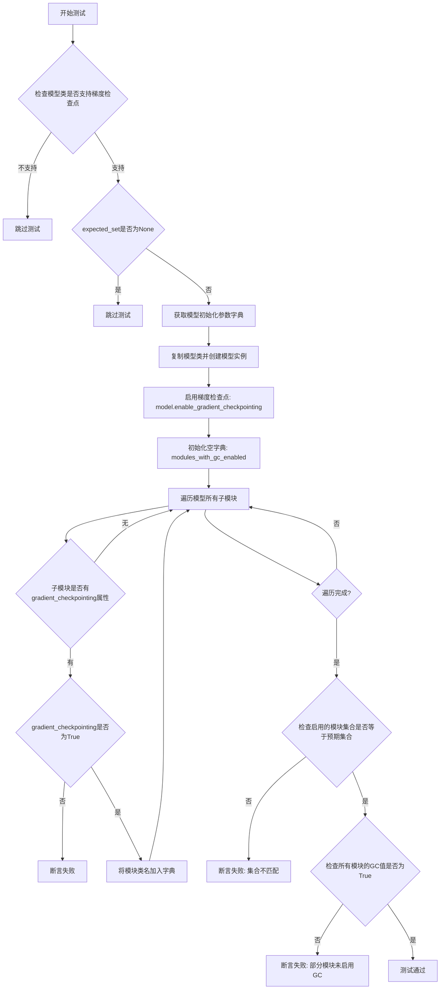

#### 带注释源码

```python
def test_gradient_checkpointing_is_applied(self, expected_set=None):
    """
    测试梯度检查点是否在预期模块上正确应用。
    
    参数:
        expected_set: Optional[set] - 预期启用梯度检查点的模块类名集合
    """
    # 检查模型类是否支持梯度 checkpointing，如果不支持则跳过测试
    if not self.model_class._supports_gradient_checkpointing:
        pytest.skip("Gradient checkpointing is not supported.")

    # expected_set 必须提供，否则无法验证哪些模块应该启用 GC
    if expected_set is None:
        pytest.skip("expected_set must be provided to verify gradient checkpointing is applied.")

    # 获取模型初始化参数字典（由子类提供）
    init_dict = self.get_init_dict()

    # 复制模型类并创建模型实例（避免修改原始类）
    model_class_copy = copy.copy(self.model_class)
    model = model_class_copy(**init_dict)
    
    # 启用模型的梯度检查点
    model.enable_gradient_checkpointing()

    # 用于存储已启用梯度检查点的模块
    modules_with_gc_enabled = {}
    
    # 遍历模型的所有子模块
    for submodule in model.modules():
        # 检查子模块是否有 gradient_checkpointing 属性
        if hasattr(submodule, "gradient_checkpointing"):
            # 断言该模块的 gradient_checkpointing 必须为 True
            assert submodule.gradient_checkpointing, f"{submodule.__class__.__name__} should have GC enabled"
            # 记录已启用 GC 的模块类名
            modules_with_gc_enabled[submodule.__class__.__name__] = True

    # 验证启用 GC 的模块集合与预期集合是否一致
    assert set(modules_with_gc_enabled.keys()) == expected_set, (
        f"Modules with GC enabled {set(modules_with_gc_enabled.keys())} do not match expected set {expected_set}"
    )
    
    # 验证所有记录的模块都已启用 GC（值为 True）
    assert all(modules_with_gc_enabled.values()), "All modules should have GC enabled"
```


### `TrainingTesterMixin.test_gradient_checkpointing_equivalence`

该方法用于验证梯度检查点（Gradient Checkpointing）技术与非梯度检查点技术在前向传播、反向传播以及参数梯度上的数值等价性。通过在启用和禁用梯度检查点两种情况下分别训练模型，并比较损失值和参数梯度的差异，确保梯度检查点功能的正确实现。

参数：

- `self`：`TrainingTesterMixin`，类的实例自身
- `loss_tolerance`：`float`，默认值 `1e-5`，允许的损失值差异容忍度
- `param_grad_tol`：`float`，默认值 `5e-5`，允许的参数梯度差异容忍度
- `skip`：`set` 或 `None`，可选，默认值为 `None`，在梯度比较时需要跳过的参数名称集合

返回值：`None`，该方法为测试方法，通过 `assert` 断言进行验证，不返回具体数值

#### 流程图

```mermaid
flowchart TD
    A[开始测试] --> B{检查是否支持梯度检查点}
    B -->|不支持| C[跳过测试 pytest.skip]
    B -->|支持| D[初始化 skip 集合为空集]
    D --> E[获取模型初始化参数字典和输入数据]
    E --> F[深拷贝输入数据保存副本]
    F --> G[设置随机种子为 0]
    G --> H[创建模型实例 model]
    H --> I[将模型移至 torch_device]
    I --> J[断言: 未启用梯度检查点且模型在训练模式]
    J --> K[执行前向传播获取输出]
    K --> L[清零梯度]
    L --> M[生成随机标签并计算损失]
    M --> N[执行反向传播]
    N --> O[重新设置随机种子为 0]
    O --> P[创建第二个模型实例 model_2]
    P --> Q[加载 model 的权重到 model_2]
    Q --> R[将 model_2 移至 torch_device]
    R --> S[启用 model_2 的梯度检查点]
    S --> T[断言: 已启用梯度检查点且模型在训练模式]
    T --> U[执行前向传播获取输出 out_2]
    U --> V[清零梯度]
    V --> W[计算损失 loss_2]
    W --> X[执行反向传播]
    X --> Y{比较损失差异}
    Y -->|差异大于 loss_tolerance| Z[断言失败抛出异常]
    Y -->|差异在容忍范围内| AA[遍历所有命名参数]
    AA --> BB{检查参数是否需要跳过}
    BB -->|跳过| CC[继续下一参数]
    BB -->|不跳过| DD{参数是否有梯度}
    DD -->|无梯度| EE[继续下一参数]
    DD -->|有梯度| FF{比较梯度差异]
    FF -->|差异大于 param_grad_tol| GG[断言失败抛出异常]
    FF -->|差异在容忍范围内| CC
    CC --> HH{是否还有更多参数}
    HH -->|是| AA
    HH -->|否| II[测试通过]
```

#### 带注释源码

```python
def test_gradient_checkpointing_equivalence(self, loss_tolerance=1e-5, param_grad_tol=5e-5, skip=None):
    """
    测试梯度检查点技术与非梯度检查点技术的等价性。
    
    该测试通过比较启用和禁用梯度检查点两种情况下的：
    1. 损失值差异
    2. 模型参数梯度差异
    来验证梯度检查点实现的正确性。
    
    参数:
        loss_tolerance: float, 损失值差异的容忍阈值，默认 1e-5
        param_grad_tol: float, 参数梯度差异的容忍阈值，默认 5e-5
        skip: set or None, 需要在比较中跳过的参数名称集合，默认 None
    """
    
    # 检查模型类是否支持梯度检查点功能，若不支持则跳过测试
    if not self.model_class._supports_gradient_checkpointing:
        pytest.skip("Gradient checkpointing is not supported.")

    # 如果 skip 为 None，初始化为空集合，用于后续跳过特定参数的比较
    if skip is None:
        skip = set()

    # 获取模型初始化所需的参数字典
    init_dict = self.get_init_dict()
    
    # 获取用于测试的虚拟输入数据
    inputs_dict = self.get_dummy_inputs()
    
    # 创建输入数据的深拷贝，用于第二个模型的测试
    inputs_dict_copy = copy.deepcopy(inputs_dict)

    # 设置随机种子为 0，确保两次测试的初始化和输入数据一致
    torch.manual_seed(0)
    
    # 创建模型实例
    model = self.model_class(**init_dict)
    
    # 将模型移至指定的计算设备（如 CUDA 设备）
    model.to(torch_device)

    # 断言验证：模型当前未启用梯度检查点且处于训练模式
    assert not model.is_gradient_checkpointing and model.training

    # 执行前向传播，获取模型输出
    # return_dict=False 表示返回元组而非字典
    out = model(**inputs_dict, return_dict=False)[0]

    # 清零模型所有参数的梯度
    model.zero_grad()

    # 生成与输出形状相同的随机标签
    labels = torch.randn_like(out)
    
    # 计算预测值与标签之间的均方误差损失
    loss = (out - labels).mean()
    
    # 执行反向传播，计算参数梯度
    loss.backward()

    # 重新设置随机种子，确保模型初始化与第一次相同
    torch.manual_seed(0)
    
    # 创建第二个模型实例
    model_2 = self.model_class(**init_dict)
    
    # 将第一个模型的权重参数克隆到第二个模型
    # 确保两个模型初始权重完全相同
    model_2.load_state_dict(model.state_dict())
    
    # 将第二个模型移至计算设备
    model_2.to(torch_device)
    
    # 启用梯度检查点功能
    model_2.enable_gradient_checkpointing()

    # 断言验证：模型已启用梯度检查点且处于训练模式
    assert model_2.is_gradient_checkpointing and model_2.training

    # 执行第二个模型的前向传播
    out_2 = model_2(**inputs_dict_copy, return_dict=False)[0]

    # 清零第二个模型的梯度
    model_2.zero_grad()
    
    # 使用相同的标签计算第二个模型的损失
    loss_2 = (out_2 - labels).mean()
    
    # 执行反向传播
    loss_2.backward()

    # 比较两个模型的损失值差异
    assert (loss - loss_2).abs() < loss_tolerance, (
        f"Loss difference {(loss - loss_2).abs()} exceeds tolerance {loss_tolerance}"
    )

    # 获取两个模型的所有命名参数
    named_params = dict(model.named_parameters())
    named_params_2 = dict(model_2.named_parameters())

    # 遍历所有参数，比较梯度
    for name, param in named_params.items():
        # 跳过后量化卷积层（post_quant_conv），这类层通常不需要梯度
        if "post_quant_conv" in name:
            continue
        
        # 跳过用户指定的参数
        if name in skip:
            continue
        
        # 如果参数没有梯度（如下游层），跳过比较
        if param.grad is None:
            continue

        # 比较两个模型对应参数的梯度差异
        assert torch_all_close(param.grad.data, named_params_2[name].grad.data, atol=param_grad_tol), (
            f"Gradient mismatch for {name}"
        )
```


### TrainingTesterMixin.test_mixed_precision_training

该方法用于测试模型在混合精度训练模式下的功能正确性，分别验证 float16 和 bfloat16 两种半精度格式的前向传播、损失计算和梯度反向传播是否正常工作，确保模型能够在支持 CUDA 的设备上使用混合精度训练。

参数：
- 该方法无显式参数（继承自 mixin 类，通过 `self` 访问配置属性）

返回值：`None`，该方法为测试方法，通过 pytest 断言验证行为，不返回任何值

#### 流程图

```mermaid
flowchart TD
    A([开始 test_mixed_precision_training]) --> B[获取 init_dict 和 inputs_dict]
    B --> C[创建模型实例并移动到 torch_device]
    C --> D[设置模型为训练模式 model.train()]
    E{设备类型 != "cpu"} -->|是| F[执行 float16 精度测试]
    E -->|否| G[跳过 float16 测试]
    F --> H[使用 torch.amp.autocast 启用 float16]
    H --> I[前向传播获取 output]
    I --> J[生成随机噪声并计算 MSE loss]
    J --> K[执行 loss.backward 反向传播]
    K --> L{设备类型 != "cpu"}
    L -->|是| M[执行 bfloat16 精度测试]
    L -->|否| N[跳过 bfloat16 测试]
    M --> O[model.zero_grad 梯度清零]
    O --> P[使用 torch.amp.autocast 启用 bfloat16]
    P --> Q[前向传播获取 output]
    Q --> R[生成随机噪声并计算 MSE loss]
    R --> S[执行 loss.backward 反向传播]
    S --> T([测试完成])
    G --> T
    N --> T
```

#### 带注释源码

```python
def test_mixed_precision_training(self):
    """
    测试模型在混合精度训练模式下的功能。
    验证 float16 和 bfloat16 两种半精度格式的兼容性。
    """
    # 从配置 mixin 获取模型初始化参数字典
    init_dict = self.get_init_dict()
    # 从配置 mixin 获取模型虚拟输入
    inputs_dict = self.get_dummy_inputs()

    # 使用初始化参数字典创建模型实例
    model = self.model_class(**init_dict)
    # 将模型参数移动到指定的计算设备（GPU/CPU）
    model.to(torch_device)
    # 设置模型为训练模式，启用 dropout 等训练特定层
    model.train()

    # ====== 测试 float16 (半精度) ======
    # 仅在非 CPU 设备上执行混合精度测试
    if torch.device(torch_device).type != "cpu":
        # 使用 torch.amp.autocast 开启自动混合精度上下文
        # device_type 根据设备类型选择（如 'cuda', 'cpu'）
        # dtype 指定计算精度为 torch.float16
        with torch.amp.autocast(device_type=torch.device(torch_device).type, dtype=torch.float16):
            # 执行前向传播，获取模型输出
            # return_dict=False 返回元组而非字典
            output = model(**inputs_dict, return_dict=False)[0]

            # 生成与输出形状相同的随机噪声作为目标
            noise = torch.randn((output.shape[0],) + self.output_shape).to(torch_device)
            # 计算输出与噪声之间的均方误差损失
            loss = torch.nn.functional.mse_loss(output, noise)

        # 在 autocast 上下文外执行反向传播
        # 这样可以正确处理梯度缩放等混合精度细节
        loss.backward()

    # ====== 测试 bfloat16 (脑浮点格式) ======
    # 在 float16 测试后清零梯度，准备下一次测试
    if torch.device(torch_device).type != "cpu":
        # 清零所有参数的梯度累积
        model.zero_grad()
        # 使用 bfloat16 精度进行混合精度训练测试
        # bfloat16 提供更宽的动态范围但精度较低
        with torch.amp.autocast(device_type=torch.device(torch_device).type, dtype=torch.bfloat16):
            # 执行前向传播
            output = model(**inputs_dict, return_dict=False)[0]

            # 生成随机噪声目标并计算 MSE 损失
            noise = torch.randn((output.shape[0],) + self.output_shape).to(torch_device)
            loss = torch.nn.functional.mse_loss(output, noise)

        # 执行反向传播计算梯度
        loss.backward()
```

## 关键组件


### TrainingTesterMixin

一个 pytest mixin 类，用于测试模型的训练功能。提供多个测试方法来验证模型的基础训练、EMA 训练、梯度检查点和混合精度训练等功能。

### test_training

测试模型的基础前向传播和反向传播功能。创建模型，执行前向传播，生成随机噪声作为目标，计算 MSE 损失并执行反向传播以验证梯度计算正确性。

### test_training_with_ema

测试模型训练时使用指数移动平均（EMA）的功能。在基础训练测试基础上，创建 EMA 模型并在反向传播后调用 step 方法更新 EMA 参数。

### test_gradient_checkpointing

测试梯度检查点的启用和禁用功能。验证模型初始化时梯度检查点为禁用状态，enable_gradient_checkpointing() 方法能正确启用，disable_gradient_checkpointing() 方法能正确禁用。

### test_gradient_checkpointing_is_applied

验证梯度检查点是否正确应用到模型的所有子模块。遍历模型的所有子模块，检查具有 gradient_checkpointing 属性的模块是否都已启用，并验证实际启用的模块集合是否与预期集合匹配。

### test_gradient_checkpointing_equivalence

测试梯度检查点的数值等效性。分别用禁用和启用梯度检查点的方式训练模型，比较两种情况下的损失值和参数梯度差异，确保梯度检查点在一定容差范围内产生相同的训练结果。

### test_mixed_precision_training

测试模型的混合精度训练功能。分别使用 float16 和 bfloat16 两种精度进行前向传播和反向传播，验证模型在非 CPU 设备上支持混合精度训练。

### EMAModel 集成

集成 diffusers 库的 EMAModel 类，用于在训练过程中维护模型参数的指数移动平均，提供更稳定的模型性能。

### 梯度检查点验证逻辑

通过遍历模型子模块并检查 gradient_checkpointing 属性来验证梯度检查点的应用状态，确保在模型的不同层次正确启用。

### 测试工具函数

使用 testing_utils 模块中的辅助函数，包括 backend_empty_cache、torch_device、torch_all_close 等，用于跨不同训练后端的测试适配。


## 问题及建议


### 已知问题

- **EMA 测试逻辑不完整**：`test_training_with_ema` 中直接调用 `ema_model.step(model.parameters())`，缺少 optimizer 参与，无法正确模拟实际训练流程，且未验证 EMA 模型参数是否正确更新
- **模型设备转换冗余**：多个测试方法中重复调用 `model.to(torch_device)`，未检查模型是否已在目标设备上，造成不必要的内存操作
- **浅拷贝风险**：`test_gradient_checkpointing_is_applied` 使用 `copy.copy(self.model_class)` 浅拷贝类，可能导致类状态污染，应使用 `copy.deepcopy`
- **变量命名覆盖**：`test_gradient_checkpointing_equivalence` 中参数 `skip` 与循环内变量 `skip` 存在命名冲突，影响代码可读性
- **随机性未完全控制**：`test_gradient_checkpointing_equivalence` 仅设置 `torch.manual_seed(0)`，未设置 CUDA 相关种子，GPU 测试结果可能不确定
- **测试覆盖不完整**：`test_mixed_precision_training` 仅检查非 CPU 设备，未测试其他设备类型（如 mps），且混合精度测试未验证梯度计算正确性
- **缺少参数有效性验证**：测试方法未对 `get_init_dict()` 和 `get_dummy_inputs()` 返回值进行校验，可能导致隐藏的测试失败

### 优化建议

- **修复 EMA 测试**：在 `test_training_with_ema` 中添加 optimizer，并验证 EMA 参数与原始模型参数的差异，确保 EMA 机制正常工作
- **添加设备检查**：在 `model.to(torch_device)` 前检查 `model.device != torch_device`，避免重复迁移
- **使用深拷贝**：将 `copy.copy` 替换为 `copy.deepcopy`，确保模型类副本独立
- **统一随机种子**：在梯度检查点等价性测试中同时设置 `torch.cuda.manual_seed_all(0)`（如可用），确保 CPU 和 GPU 结果一致
- **重构 skip 变量**：将参数 `skip` 重命名为 `skip_params` 或 `skipped_params`，避免命名冲突
- **增强混合精度测试**：添加对 autocast 上下文中梯度存在性的验证，确保混合精度下梯度正确计算
- **添加输入验证**：在测试开始时断言 `init_dict` 和 `inputs_dict` 不为空且符合预期结构，提高测试健壮性

## 其它


### 设计目标与约束

该代码是一个pytest测试mixin类（TrainingTesterMixin），旨在为Diffusers模型提供通用的训练功能测试能力。设计目标包括验证模型的基础训练流程、EMA（指数移动平均）集成、梯度检查点机制以及混合精度训练功能。约束方面，测试仅在支持CUDA加速且具备训练能力的设备上运行（通过`@require_torch_accelerator_with_training`装饰器限制），并依赖特定的模型类接口实现（如`model_class`、`output_shape`、`get_init_dict()`和`get_dummy_inputs()`方法）。

### 错误处理与异常设计

代码中的错误处理主要通过pytest机制实现。当模型类不支持梯度检查点功能时，使用`pytest.skip()`跳过相关测试；对于梯度不存在的参数（如`post_quant_conv`），在对比验证时进行跳过处理。测试中的断言用于验证各功能的正确性，任何不满足条件的情况都会导致测试失败。此外，测试方法中包含`gc.collect()`和`backend_empty_cache()`调用，用于在测试前后进行内存清理，防止显存泄漏。

### 数据流与状态机

测试的数据流如下：首先通过`get_init_dict()`获取模型初始化参数，然后通过`get_dummy_inputs()`获取模型输入；模型在训练模式下执行前向传播，生成输出；接着创建随机噪声作为目标值，计算MSE损失；最后执行反向传播更新梯度。状态机方面，模型在训练过程中经历初始化→训练模式设置→前向传播→损失计算→反向传播的状态转换，EMA模型额外经历参数复制→EMA更新的状态转换。

### 外部依赖与接口契约

主要外部依赖包括：PyTorch（torch）用于张量操作和自动混合精度训练；pytest用于测试框架和跳过机制；diffusers库的EMAModel用于指数移动平均；项目内部的testing_utils模块提供设备管理、内存清理和测试工具函数。接口契约要求使用该mixin的测试类必须提供：model_class属性（待测试的模型类）、output_shape属性（期望输出形状）、get_init_dict()方法（返回模型初始化参数字典）、get_dummy_inputs()方法（返回模型输入字典）。

### 配置与参数说明

关键配置参数包括：loss_tolerance（默认1e-5）用于验证梯度检查点等效性时的损失容差；param_grad_tol（默认5e-5）用于参数梯度对比的容差；expected_set用于验证梯度检查点应用的预期模块集合。torch_device指定计算设备，torch.manual_seed(0)用于确保测试结果的可复现性。

### 使用示例与调用方式

该mixin类通过多重继承方式被测试类使用。典型的使用模式如下：创建一个继承自TrainingTesterMixin和unittest.TestCase的测试类，实现必需的model_class、output_shape、get_init_dict()和get_dummy_inputs()属性/方法，然后pytest会自动发现并执行test_training、test_training_with_ema、test_gradient_checkpointing等测试方法。测试可通过`pytest -m "training"`单独运行或使用`pytest -m "not training"`跳过。

### 性能考虑与优化空间

测试中每次都创建新的模型实例，可能导致测试执行时间较长。性能优化方向包括：考虑使用pytest fixture共享模型实例；当前测试串行执行，可考虑并行化；混合精度测试中重复创建模型，可考虑复用；内存清理（gc.collect和empty_cache）可考虑更精细的控制策略以平衡清理频率与性能。

### 安全考虑

代码本身为测试用途，安全性主要涉及：测试使用随机数生成，需注意随机种子设置以确保可复现性；模型参数复制（load_state_dict）确保测试隔离；GPU内存操作需正确处理以避免显存泄漏；在CPU设备上跳过部分精度测试以避免不支持的操作。

### 与其他模块的关系

该模块位于diffusers项目的测试目录中，与以下模块紧密相关：diffusers.training_utils.EMAModel（EMA功能依赖）；...testing_utils（工具函数来源）；被继承的测试类需实现特定的接口契约；测试结果可为模型训练相关功能的开发提供验证保障。

    