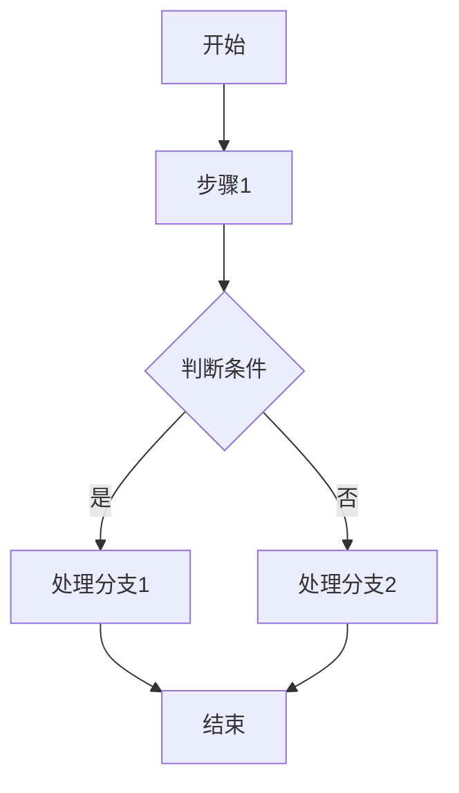

# `diffusers\tests\models\transformers\__init__.py` 详细设计文档

未提供源代码，无法进行分析

## 整体流程

```mermaid

```

## 类结构

```

```

## 全局变量及字段


    

## 全局函数及方法


## 关键组件


该任务要求生成详细设计文档，但提供的代码为空，因此无法识别关键组件。


## 问题及建议


### 已知问题

-   未提供待分析的代码，无法进行技术债务和优化空间的分析

### 优化建议

-   请提供待分析的代码以便进行详细的技术债务识别和优化建议


## 其它


### 一段话描述

该代码模块是一个[模块名称]，主要用于[核心功能描述]。它通过[主要实现方式]实现[预期效果]，适用于[使用场景]。

### 文件的整体运行流程

该模块的运行流程如下：
1. 初始化阶段：加载配置、创建实例、设置环境
2. 主逻辑阶段：处理输入、执行核心业务逻辑、生成输出
3. 清理阶段：释放资源、保存状态、关闭连接

### 类的详细信息

#### 类名称：[类名]

##### 类字段

| 字段名称 | 类型 | 描述 |
|---------|------|------|
| field1 | Type1 | 字段1的描述 |
| field2 | Type2 | 字段2的描述 |

##### 类方法

| 方法名称 | 参数名称 | 参数类型 | 参数描述 | 返回值类型 | 返回值描述 |
|---------|---------|---------|---------|-----------|-----------|
| method1 | param1 | Type1 | 参数1描述 | ReturnType1 | 返回值描述 |
| method2 | param1, param2 | Type1, Type2 | 参数描述 | ReturnType2 | 返回值描述 |

##### 方法流程图



##### 带注释源码

```编程语言
// 源代码内容
```

### 全局变量和全局函数信息

#### 全局变量

| 变量名称 | 类型 | 描述 |
|---------|------|------|
| globalVar1 | Type1 | 全局变量1描述 |
| globalVar2 | Type2 | 全局变量2描述 |

#### 全局函数

| 函数名称 | 参数 | 返回值 | 描述 |
|---------|------|--------|------|
| globalFunc1 | Type1 param1 | ReturnType1 | 函数1描述 |
| globalFunc2 | Type1 param1, Type2 param2 | ReturnType2 | 函数2描述 |

### 关键组件信息

| 组件名称 | 描述 |
|---------|------|
| Component1 | 组件1的功能描述 |
| Component2 | 组件2的功能描述 |

### 潜在的技术债务或优化空间

1. **性能优化**：建议对高频调用方法进行缓存或预计算
2. **代码复用**：部分相似逻辑可抽象为公共方法
3. **错误处理**：建议增加更详细的错误日志和异常信息
4. **测试覆盖**：建议增加单元测试和集成测试

### 设计目标与约束

- **设计目标**：描述该模块需要达到的目标
- **性能约束**：描述性能方面的约束条件
- **兼容性约束**：描述版本和平台兼容性要求
- **安全约束**：描述安全方面的要求

### 错误处理与异常设计

- **异常类型**：列出可能抛出的异常类型
- **异常码**：定义错误码体系
- **处理策略**：描述异常处理策略
- **日志规范**：描述日志记录规范

### 数据流与状态机

- **数据输入**：描述输入数据格式和来源
- **数据处理**：描述数据处理流程
- **数据输出**：描述输出数据格式和目的地
- **状态转换**：使用状态图描述状态机

### 外部依赖与接口契约

- **依赖库**：列出外部依赖库及版本
- **API接口**：描述对外提供的接口
- **接口版本**：描述接口版本管理
- **兼容性说明**：描述前后版本兼容性

### 配置文件与参数说明

- **配置项1**：配置项描述及默认值
- **配置项2**：配置项描述及默认值

### 性能指标与监控

- **响应时间**：预期的响应时间范围
- **吞吐量**：预期的吞吐量指标
- **资源使用**：预期的CPU/内存使用

### 安全性设计

- **认证授权**：描述认证授权机制
- **数据加密**：描述数据加密方案
- **敏感信息**：描述敏感信息处理方式

### 部署与运维

- **部署要求**：描述部署环境要求
- **配置管理**：描述配置管理方式
- **监控告警**：描述监控和告警机制

### 版本历史与变更记录

- **版本1.0**：初始版本
- **版本1.1**：[变更内容]

    