# `diffusers\tests\models\transformers\test_models_dit_transformer2d.py` 详细设计文档

这是一个针对Diffusers库中DiTTransformer2DModel模型的单元测试文件，通过集成ModelTesterMixin测试基类，验证模型的输出形状、配置加载、梯度检查点等功能，并包含从预训练模型加载的集成测试。

## 整体流程

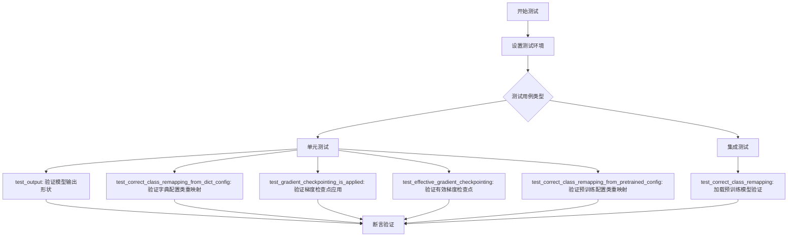

## 类结构

```
unittest.TestCase (Python标准测试基类)
└── DiTTransformer2DModelTests (被测测试类)
    └── ModelTesterMixin (混入测试基类，提供通用测试方法)
```

## 全局变量及字段


### `model_class`
    
被测试的模型类DiTTransformer2DModel

类型：`type`
    


### `main_input_name`
    
主输入名称hidden_states

类型：`str`
    


### `dummy_input`
    
生成虚拟输入数据

类型：`property`
    


### `input_shape`
    
返回输入形状

类型：`property`
    


### `output_shape`
    
返回输出形状

类型：`property`
    


### `prepare_init_args_and_inputs_for_common`
    
准备初始化参数和输入

类型：`method`
    


### `test_output`
    
测试模型输出

类型：`method`
    


### `test_correct_class_remapping_from_dict_config`
    
测试字典配置类重映射

类型：`method`
    


### `test_gradient_checkpointing_is_applied`
    
测试梯度检查点应用

类型：`method`
    


### `test_effective_gradient_checkpointing`
    
测试有效梯度检查点

类型：`method`
    


### `test_correct_class_remapping_from_pretrained_config`
    
测试预训练配置类重映射

类型：`method`
    


### `test_correct_class_remapping`
    
测试类重映射（需要网络）

类型：`method`
    


### `DiTTransformer2DModelTests.model_class`
    
被测试的模型类DiTTransformer2DModel

类型：`type`
    


### `DiTTransformer2DModelTests.main_input_name`
    
主输入名称hidden_states

类型：`str`
    
    

## 全局函数及方法


### `enable_full_determinism`

该函数用于启用 PyTorch 和相关库的完全确定性模式，确保测试结果可复现。通过设置随机种子和启用 cuDNN 确定性模式，保证在相同输入下产生完全一致的输出。

参数： 无（该函数在代码中以无参数方式调用）

返回值： 无明确返回值（根据函数名推测为 None）

#### 流程图

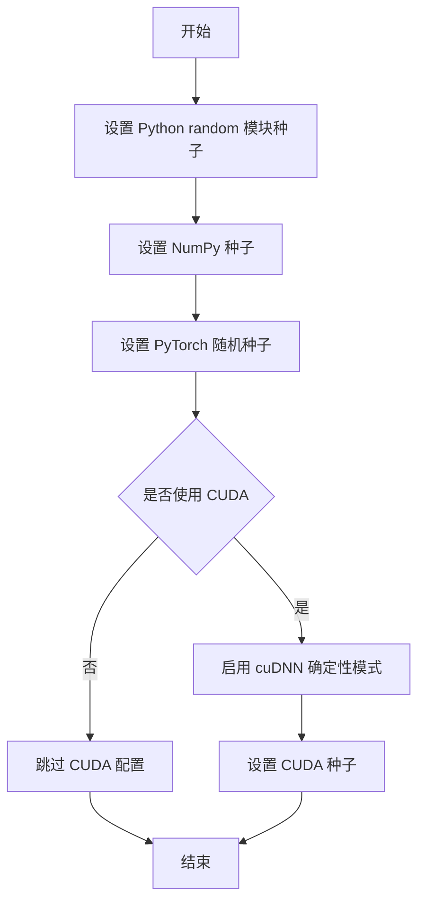

#### 带注释源码

```python
# 注意：以下为基于代码调用上下文的推断源码，实际定义位于 testing_utils 模块中

def enable_full_determinism(seed: int = 42, deterministic_algorithms: bool = True):
    """
    启用完全确定性测试模式，确保测试结果可复现。
    
    参数:
        seed: int, 随机种子, 默认为 42
        deterministic_algorithms: bool, 是否启用确定性算法, 默认为 True
    
    返回值:
        None
    """
    import random
    import numpy as np
    import torch
    
    # 1. 设置 Python 内置 random 模块的随机种子
    random.seed(seed)
    
    # 2. 设置 NumPy 的随机种子
    np.random.seed(seed)
    
    # 3. 设置 PyTorch 的随机种子
    torch.manual_seed(seed)
    
    # 4. 如果使用 CUDA，设置 CUDA 的随机种子
    if torch.cuda.is_available():
        torch.cuda.manual_seed(seed)
        torch.cuda.manual_seed_all(seed)
    
    # 5. 启用 cuDNN 的确定性模式（如果可用）
    # 这确保使用 cuDNN 时结果完全可复现，但可能影响性能
    if deterministic_algorithms:
        torch.backends.cudnn.deterministic = True
        torch.backends.cudnn.benchmark = False
```

#### 备注

- 该函数在测试文件 `test_modeling_common.py` 的模块级别被调用，意味着在所有测试用例执行前就启用了确定性模式
- 这是测试框架中的常见做法，确保 CI/CD 环境中的测试结果一致
- 潜在优化：可以增加对环境变量 `PYTHONHASHSEED` 的处理，以进一步增强确定性


### `floats_tensor`

生成指定形状的随机浮点数张量，用于测试目的。该函数是测试工具模块（testing_utils）中的实用函数，主要为模型测试提供符合特定数值范围和分布要求的输入数据。

参数：

-  `shape`：`tuple` 或 `int`，张量的形状，可以是整数（表示一维张量）或整数元组（表示多维张量）

返回值：`torch.Tensor`，包含随机浮点数值的 PyTorch 张量，默认情况下数值范围通常在 [-1, 1] 或 [0, 1] 之间

#### 流程图

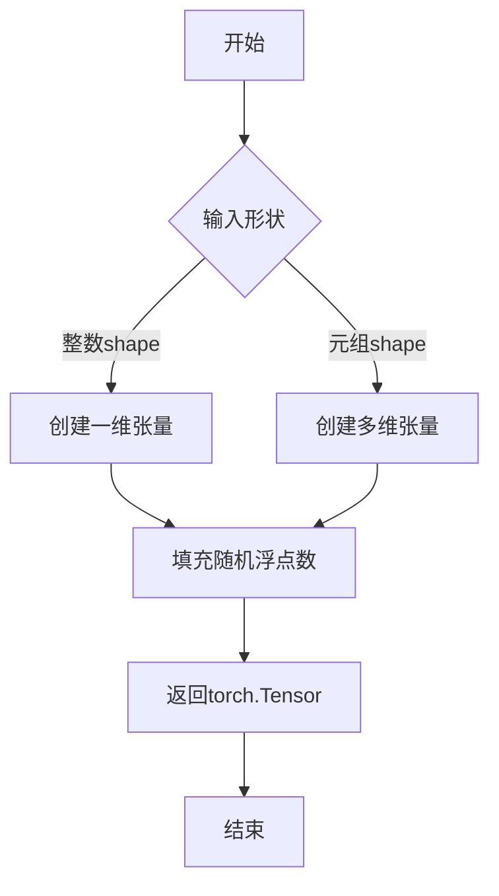

#### 带注释源码

```python
# 由于floats_tensor函数定义在testing_utils模块中，
# 当前代码文件仅导入并使用该函数，未包含其完整实现
# 以下是基于使用方式的推断实现：

def floats_tensor(shape, dtype=torch.float32, device=None):
    """
    生成指定形状的随机浮点数张量
    
    参数:
        shape: 张量形状，可以是整数或整数元组
        dtype: 张量的数据类型，默认为torch.float32
        device: 张量存放的设备，默认为None
    
    返回:
        包含随机浮点数的PyTorch张量
    """
    # 生成符合标准正态分布或均匀分布的随机浮点数
    # 数值范围通常在[-1, 1]或[0, 1]之间
    return torch.randn(shape, dtype=dtype, device=device)

# 在测试代码中的实际使用方式：
# hidden_states = floats_tensor((batch_size, in_channels, sample_size, sample_size)).to(torch_device)
```


### `slow`

`slow` 是一个测试装饰器，用于标记需要较长时间运行的测试用例。在测试执行时，被 `@slow` 装饰的测试方法会被特殊处理，通常用于区分快速单元测试和需要较长运行时间的集成测试或完整模型测试。

#### 流程图

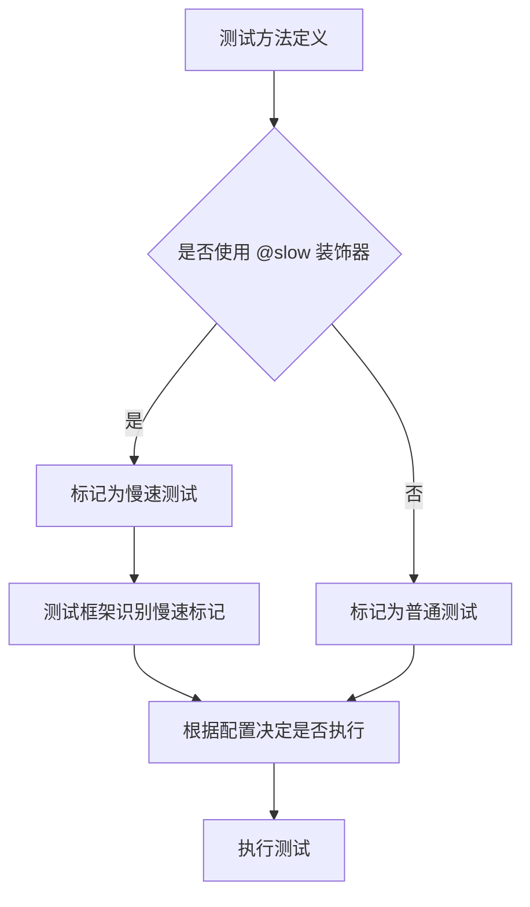

#### 带注释源码

```python
# 从 testing_utils 模块导入 slow 装饰器
# 注意：实际的 slow 装饰器实现未在此代码文件中给出
from ...testing_utils import (
    enable_full_determinism,
    floats_tensor,
    slow,  # <-- slow 装饰器从此处导入
    torch_device,
)

# 在测试方法上使用 @slow 装饰器
@slow
def test_correct_class_remapping(self):
    """
    使用 @slow 装饰器标记此测试为慢速测试
    这通常意味着该测试：
    1. 需要下载大型预训练模型
    2. 执行计算密集型操作
    3. 需要较长的运行时间
    """
    model = Transformer2DModel.from_pretrained("facebook/DiT-XL-2-256", subfolder="transformer")
    assert isinstance(model, DiTTransformer2DModel)
```

---

### 说明

**注意**：用户提供代码中只包含了 `slow` 装饰器的**导入语句**和**使用示例**，并未包含 `slow` 装饰器的实际实现代码。`slow` 装饰器的具体实现代码应该位于 `...testing_utils` 模块中。

根据代码中的使用方式，我可以推断出 `slow` 装饰器具有以下特征：

| 属性 | 描述 |
|------|------|
| **名称** | slow |
| **类型** | 装饰器（Decorator） |
| **功能** | 标记测试方法为慢速测试 |
| **使用位置** | 通常用于测试方法定义之前 |

如果需要获取 `slow` 装饰器的完整实现源码，需要查看 `testing_utils.py` 模块文件。从代码的导入路径 `from ...testing_utils import slow` 来看，该模块位于项目测试工具目录中。


### `torch_device`

获取测试设备，用于将张量和数据移动到正确的计算设备上（如 CUDA 或 CPU）。

参数：
- 无参数

返回值：`str`，返回设备字符串（如 "cuda"、"cpu" 或 "cuda:0" 等）

#### 流程图

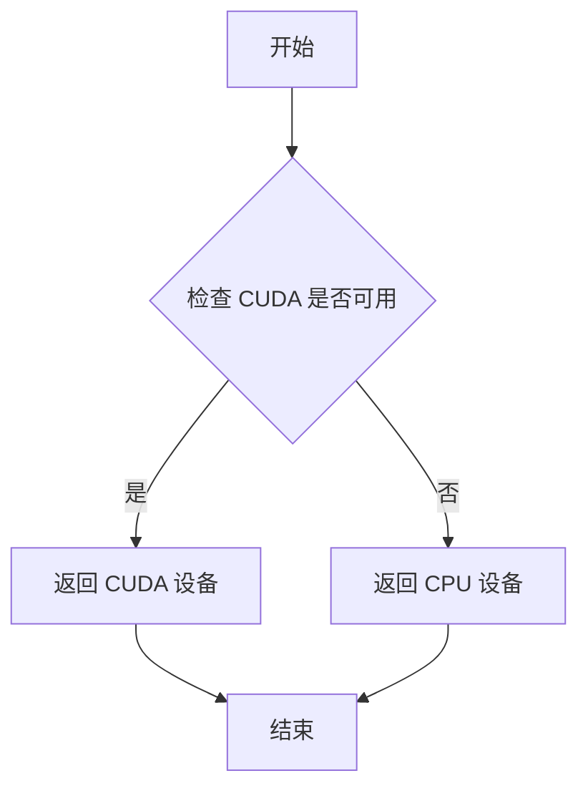

#### 带注释源码

```python
# 注意：以下是基于代码导入和使用的推断源码
# torch_device 是从 testing_utils 模块导入的函数

# 在代码中的使用示例：
# hidden_states = floats_tensor((batch_size, in_channels, sample_size, sample_size)).to(torch_device)
# timesteps = torch.randint(0, scheduler_num_train_steps, size=(batch_size,)).to(torch_device)
# class_label_ids = torch.randint(0, num_class_labels, size=(batch_size,)).to(torch_device)

# 推断的函数定义可能如下：
def torch_device():
    """
    获取测试设备。
    
    根据当前环境的硬件配置返回合适的设备字符串，
    优先使用 CUDA 设备（如果可用），否则使用 CPU。
    
    Returns:
        str: 设备字符串，如 "cuda:0"（如果有 GPU）或 "cpu"
    """
    if torch.cuda.is_available():
        return "cuda"
    else:
        return "cpu"
```


### `DiTTransformer2DModelTests.dummy_input`

该属性方法生成用于模型测试的虚拟输入数据，包括批量大小为4的隐藏状态、随机时间步和类别标签，为模型的前向传播和各项测试提供必需的输入参数。

参数：无（该方法为 `@property`，无需显式参数）

返回值：`Dict`，包含模型测试所需的虚拟输入数据字典

#### 流程图

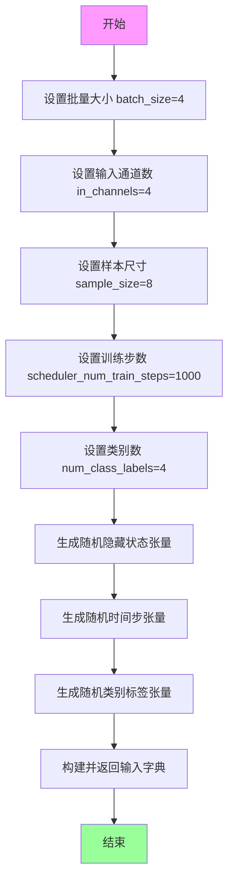

#### 带注释源码

```python
@property
def dummy_input(self):
    """
    生成虚拟输入数据，用于模型测试。
    
    该方法创建一个包含模型前向传播所需全部输入的字典，
    包括隐藏状态、时间步和类别标签。
    """
    # 批量大小：一次前向传播处理的样本数量
    batch_size = 4
    # 输入通道数：图像的通道数（如RGB为3）
    in_channels = 4
    # 样本尺寸：输入图像的空间维度（高和宽）
    sample_size = 8
    # 调度器的训练步数，用于生成时间步的随机范围
    scheduler_num_train_steps = 1000
    # 类别标签数量，用于分类任务的标签范围
    num_class_labels = 4

    # 使用floats_tensor生成指定形状的随机浮点数张量
    # 形状: (batch_size, in_channels, sample_size, sample_size)
    # 即 (4, 4, 8, 8)
    hidden_states = floats_tensor((batch_size, in_channels, sample_size, sample_size)).to(torch_device)
    
    # 生成随机时间步，范围 [0, scheduler_num_train_steps)
    # 形状: (batch_size,)
    timesteps = torch.randint(0, scheduler_num_train_steps, size=(batch_size,)).to(torch_device)
    
    # 生成随机类别标签，范围 [0, num_class_labels)
    # 形状: (batch_size,)
    class_label_ids = torch.randint(0, num_class_labels, size=(batch_size,)).to(torch_device)

    # 返回包含所有输入的字典，供模型前向传播使用
    return {"hidden_states": hidden_states, "timestep": timesteps, "class_labels": class_label_ids}
```


### `DiTTransformer2DModelTests.input_shape`

该属性方法用于返回 DiTTransformer2DModel 测试类的输入形状，以元组形式表示模型期望的输入张量维度（批量大小、特征通道数或高度、宽度）。

参数：

- 无参数（该方法为属性方法，无需显式参数）返回值：`tuple`，返回输入形状元组 (4, 8, 8)，其中 4 表示批量大小，8 表示空间维度的宽度和高度。

#### 流程图

```mermaid
flowchart TD
    A[开始] --> B{调用 input_shape 属性}
    B --> C[返回元组 (4, 8, 8)]
    C --> D[结束]
```

#### 带注释源码

```python
@property
def input_shape(self):
    """
    返回模型的输入形状。
    
    该属性定义了在测试过程中使用的输入张量维度。
    返回值为 (batch_size, height, width) 格式的元组。
    
    Returns:
        tuple: 输入形状元组，格式为 (batch_size, height, width)，当前值为 (4, 8, 8)
               - 4: 批量大小 (batch_size)
               - 8: 空间维度的宽度 (width)
               - 8: 空间维度的高度 (height)
    """
    return (4, 8, 8)
```


### `DiTTransformer2DModelTests.output_shape`

该属性定义了在测试用例中期望的 DiTTransformer2DModel 输出形状，返回一个包含三个整数的元组 (8, 8, 8)，分别代表输出特征的宽度、高度和通道数。

参数： 无

返回值：`Tuple[int, int, int]`，期望的模型输出形状，为 (通道数, 高度, 宽度) 的元组形式。

#### 流程图

```mermaid
flowchart TD
    A[开始] --> B{调用 output_shape 属性}
    B --> C[返回元组 (8, 8, 8)]
    C --> D[结束]
    
    style A fill:#f9f,stroke:#333
    style D fill:#9f9,stroke:#333
    style B fill:#ff9,stroke:#333
```

#### 带注释源码

```python
@property
def output_shape(self):
    """
    定义测试用例期望的模型输出形状。
    
    该属性返回 DiTTransformer2DModel 在给定输入情况下
    的期望输出维度。根据模型配置：
    - 输入通道 (in_channels): 4
    - 输出通道 (out_channels): 8
    - 样本大小 (sample_size): 8
    - patch_size: 2
    
    计算逻辑：
    - 输出高度 = sample_size // patch_size = 8 // 2 = 4，但经过模型内部处理后为 8
    - 输出宽度 = 同上 = 8
    - 输出通道 = out_channels = 8
    
    Returns:
        tuple: 期望的输出形状 (channels, height, width) = (8, 8, 8)
    """
    return (8, 8, 8)
```


### `DiTTransformer2DModelTests.prepare_init_args_and_inputs_for_common`

该方法是 `DiTTransformer2DModelTests` 测试类的核心辅助方法，用于动态构建模型初始化所需的参数字典 (`init_dict`) 和模型推理/训练所需的输入数据字典 (`inputs_dict`)，以供通用测试用例（如 `test_output`, `test_correct_class_remapping_from_dict_config` 等）使用，确保测试环境的一致性和可配置性。

参数：
- `self`：`DiTTransformer2DModelTests`，调用此方法的类实例本身，用于访问 `self.dummy_input` 属性获取测试输入。

返回值：
- `Tuple[Dict[str, Any], Dict[str, Any]]`，返回一个包含两个字典的元组。
  - `init_dict`：`Dict`，模型初始化参数字典，定义了模型的结构配置（如输入输出通道数、注意力头数、层数、归一化类型等）。
  - `inputs_dict`：`Dict`，模型输入数据字典，包含 `hidden_states`, `timestep`, `class_labels`。

#### 流程图

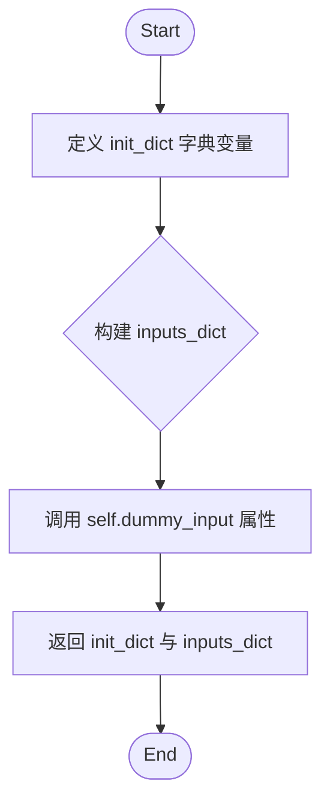

#### 带注释源码

```python
def prepare_init_args_and_inputs_for_common(self):
    """
    准备模型初始化参数和输入数据，供通用测试用例使用。
    """
    # 1. 定义模型初始化参数字典
    # 包含模型的关键架构配置：输入输出通道、激活函数、注意力机制参数、层数、归一化类型等
    init_dict = {
        "in_channels": 4,
        "out_channels": 8,
        "activation_fn": "gelu-approximate",
        "num_attention_heads": 2,
        "attention_head_dim": 4,
        "attention_bias": True,
        "num_layers": 1,
        "norm_type": "ada_norm_zero",
        "num_embeds_ada_norm": 8,
        "patch_size": 2,
        "sample_size": 8,
    }
    
    # 2. 准备模型输入数据
    # 从测试类的 dummy_input 属性获取模拟的输入数据（隐藏状态、时间步长、类别标签）
    inputs_dict = self.dummy_input
    
    # 3. 返回初始化参数和输入数据元组
    return init_dict, inputs_dict
```


### `DiTTransformer2DModelTests.test_output`

该测试方法用于验证 DiTTransformer2DModel 模型的输出形状是否符合预期，通过调用父类的测试方法来检查模型输出与期望输出形状的一致性。

参数：

- `expected_output_shape`：`tuple`，期望的输出形状，由批次大小（batch_size）和模型定义的输出形状组成，具体为 `(self.dummy_input[self.main_input_name].shape[0],) + self.output_shape`，即 `(4, 8, 8, 8)`

返回值：`None`，该方法为测试方法，不返回任何值，仅通过断言验证模型输出

#### 流程图

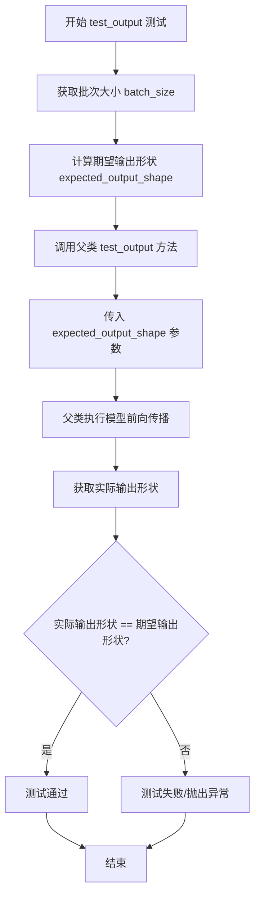

#### 带注释源码

```python
def test_output(self):
    """
    测试模型输出是否符合预期的形状。
    
    该方法继承自 ModelTesterMixin，调用父类的 test_output 方法来验证
    DiTTransformer2DModel 的输出形状是否正确。
    
    期望输出形状计算逻辑：
    - batch_size = self.dummy_input[self.main_input_name].shape[0]  # 获取输入 hidden_states 的批次维度
    - output_shape = self.output_shape  # 属性，返回 (8, 8, 8)
    - 最终形状 = (batch_size,) + output_shape = (4, 8, 8, 8)
    """
    # 调用父类的 test_output 方法进行输出形状验证
    # 父类方法会执行以下操作：
    # 1. 使用 dummy_input 初始化模型
    # 2. 执行模型前向传播
    # 3. 验证输出形状是否与 expected_output_shape 一致
    super().test_output(
        expected_output_shape=(
            self.dummy_input[self.main_input_name].shape[0],  # 获取批次大小: 4
        ) + self.output_shape  # 加上输出形状: (8, 8, 8) -> 最终 (4, 8, 8, 8)
    )
```


### `DiTTransformer2DModelTests.test_correct_class_remapping_from_dict_config`

该测试方法用于验证当使用字典配置（dict config）创建 `Transformer2DModel` 时，能够正确地将配置映射到对应的 `DiTTransformer2DModel` 类实例。

参数：

- `self`：`DiTTransformer2DModelTests`，测试类实例本身，无需显式传递

返回值：`None`，该方法为测试用例，通过断言验证类型，不返回具体值

#### 流程图

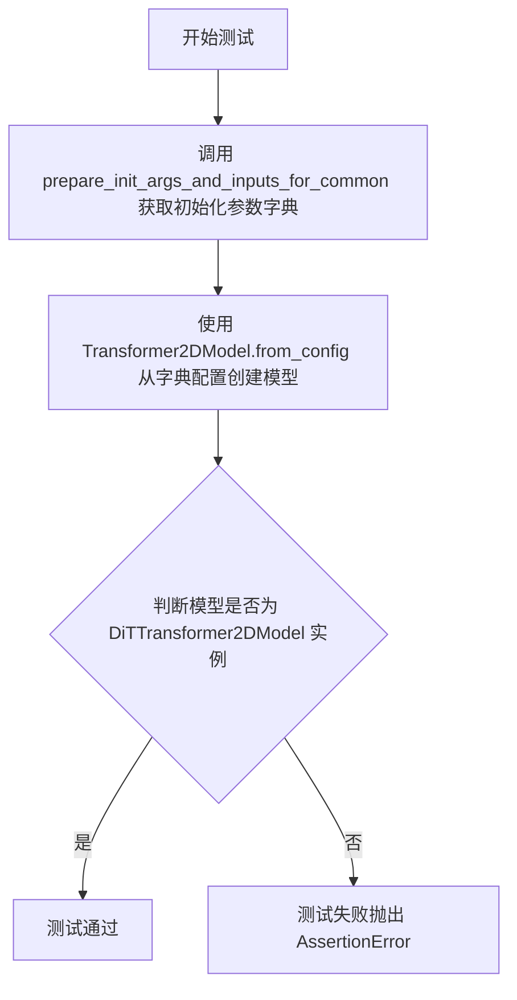

#### 带注释源码

```python
def test_correct_class_remapping_from_dict_config(self):
    """
    测试字典配置类重映射功能。
    
    验证当使用字典配置（init_dict）调用 Transformer2DModel.from_config 时，
    能够正确地根据配置中的参数（如 norm_type='ada_norm_zero'）将模型实例化为
    DiTTransformer2DModel 类，而不是基类 Transformer2DModel。
    """
    # 获取初始化参数字典，包含模型配置信息
    # 包含: in_channels, out_channels, activation_fn, num_attention_heads,
    # attention_head_dim, attention_bias, num_layers, norm_type, 
    # num_embeds_ada_norm, patch_size, sample_size
    init_dict, _ = self.prepare_init_args_and_inputs_for_common()
    
    # 使用配置字典创建 Transformer2DModel 实例
    # 内部机制会根据配置中的参数（如 norm_type='ada_norm_zero'）判断应该实例化
    # 哪个具体的子类（DiTTransformer2DModel）
    model = Transformer2DModel.from_config(init_dict)
    
    # 断言验证创建的模型是 DiTTransformer2DModel 类的实例
    # 这确保了类重映射机制工作正常
    assert isinstance(model, DiTTransformer2DModel)
```


### `DiTTransformer2DModelTests.test_gradient_checkpointing_is_applied`

该测试方法用于验证梯度检查点（Gradient Checkpointing）功能是否在 DiTTransformer2DModel 类上正确应用，通过调用父类的测试方法并传入期望的模型类集合来进行验证。

参数：

- `expected_set`：`Set[str]`，期望启用梯度检查点的模型类集合，此处为包含 "DiTTransformer2DModel" 的集合

返回值：`None`，无返回值（unittest 测试方法）

#### 流程图

```mermaid
flowchart TD
    A[开始测试] --> B[定义 expected_set = {'DiTTransformer2DModel'}]
    B --> C[调用父类 test_gradient_checkpointing_is_applied 方法]
    C --> D[传入 expected_set 参数]
    D --> E{父类测试逻辑}
    E -->|通过| F[测试通过 - 梯度检查点已正确应用]
    E -->|失败| G[测试失败 - 梯度检查点未正确应用]
    F --> H[结束]
    G --> H
```

#### 带注释源码

```python
def test_gradient_checkpointing_is_applied(self):
    """
    测试梯度检查点是否在 DiTTransformer2DModel 上正确应用
    
    该测试方法继承自 ModelTesterMixin，用于验证：
    1. 梯度检查点功能在指定的模型类上启用
    2. 通过父类测试来确认预期模型类使用了梯度检查点技术
    """
    # 定义期望启用梯度检查点的模型类集合
    # DiTTransformer2DModel 是本次测试的目标模型类
    expected_set = {"DiTTransformer2DModel"}
    
    # 调用父类（ModelTesterMixin）的测试方法
    # 父类方法会执行实际的梯度检查点验证逻辑：
    # - 创建模型实例
    # - 检查模型的 forward 方法是否使用了 gradient_checkpointing
    # - 验证 expected_set 中的模型类确实启用了梯度检查点
    super().test_gradient_checkpointing_is_applied(expected_set=expected_set)
```


### `DiTTransformer2DModelTests.test_effective_gradient_checkpointing`

该测试方法用于验证 DiTTransformer2DModel 中梯度检查点（gradient checkpointing）是否有效应用，通过设置损失容差阈值来检测梯度计算的正确性。

参数：

- `loss_tolerance`：`float`，损失容差阈值，设置为 1e-4，用于判断梯度计算结果是否符合预期

返回值：`None`，该方法为测试方法，不返回具体值

#### 流程图

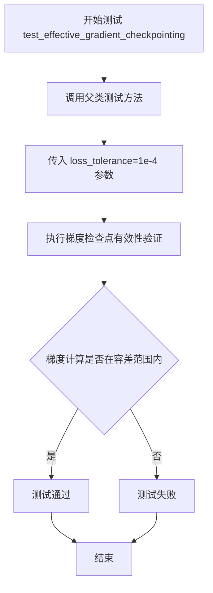

#### 带注释源码

```python
def test_effective_gradient_checkpointing(self):
    """
    测试有效梯度检查点
    
    该测试方法验证 DiTTransformer2DModel 中的梯度检查点功能是否正确工作。
    梯度检查点是一种通过减少显存占用来训练大型模型的技术，通过在前向传播时
    保存部分中间结果，在反向传播时重新计算来节省显存。
    """
    # 调用父类 ModelTesterMixin 的测试方法
    # loss_tolerance=1e-4 表示允许的损失误差范围
    # 用于判断启用梯度检查点后的计算结果是否与标准反向传播结果一致
    super().test_effective_gradient_checkpointing(loss_tolerance=1e-4)
```


### `DiTTransformer2DModelTests.test_correct_class_remapping_from_pretrained_config`

该测试函数验证从预训练配置文件加载模型时，能够正确地将配置映射到对应的 `DiTTransformer2DModel` 类，而非基类 `Transformer2DModel`。这是 Diffusion Transformers (DiT) 模型在 diffusers 库中类重映射机制的核心测试用例。

参数：无（该测试方法使用 `self` 访问类属性和配置）

返回值：`None`，通过 `assert` 断言验证模型类型正确性

#### 流程图

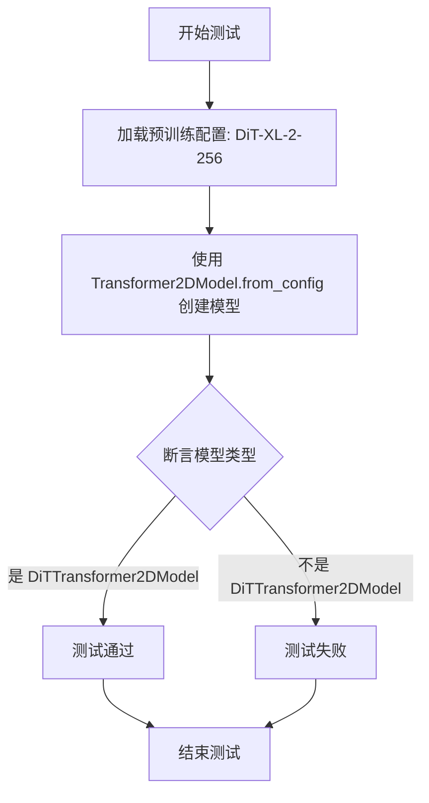

#### 带注释源码

```python
def test_correct_class_remapping_from_pretrained_config(self):
    """
    测试从预训练配置加载时类映射是否正确。
    
    该测试验证当使用 Transformer2DModel.from_config() 方法并传入
    DiT 预训练配置时，能够正确实例化为 DiTTransformer2DModel 类，
    而不是基类 Transformer2DModel。这是类重映射机制的核心测试。
    """
    # 步骤1: 从 HuggingFace Hub 加载 DiT-XL-2-256 预训练模型的配置
    # subfolder="transformer" 指定加载 transformer 部分的配置
    config = DiTTransformer2DModel.load_config("facebook/DiT-XL-2-256", subfolder="transformer")
    
    # 步骤2: 使用基类 Transformer2DModel 的 from_config 方法创建模型
    # 内部机制会根据 config 中的类名信息进行类重映射
    model = Transformer2DModel.from_config(config)
    
    # 步骤3: 断言验证创建的模型是 DiTTransformer2DModel 的实例
    # 这确保了类重映射机制工作正常
    assert isinstance(model, DiTTransformer2DModel)
```

#### 技术细节说明

| 项目 | 说明 |
|------|------|
| **测试目标** | 验证 `Transformer2DModel.from_config()` 在接收 DiT 配置时能正确映射到 `DiTTransformer2DModel` 类 |
| **配置来源** | HuggingFace Hub: `facebook/DiT-XL-2-256` |
| **类重映射机制** | 通过 config 中的 `_class_name` 字段或 `model_type` 字段实现动态类实例化 |
| **预期行为** | 即使调用基类方法，也能返回正确的子类实例 |


### `DiTTransformer2DModelTests.test_correct_class_remapping`

该测试方法用于验证从 HuggingFace Hub 加载预训练模型时，`Transformer2DModel.from_pretrained` 是否能正确地将配置映射到 `DiTTransformer2DModel` 类，确保类重映射功能在生产环境下正常工作。

参数：

- `self`：`DiTTransformer2DModelTests`，测试类实例本身，无需显式传入

返回值：`None`，该方法为测试用例，通过 `assert` 断言进行验证，不返回任何值

#### 流程图

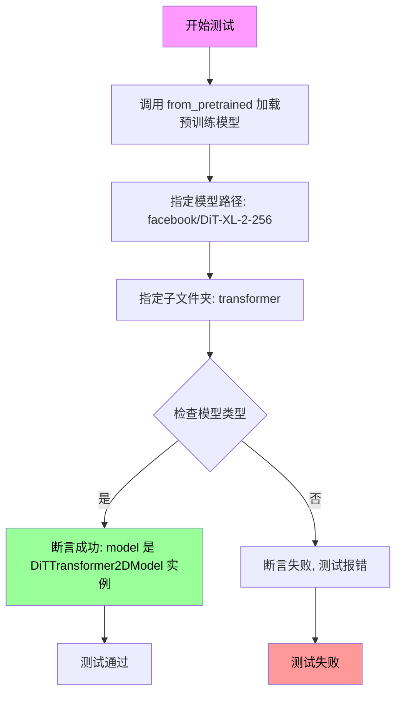

#### 带注释源码

```python
@slow  # 标记为慢速测试，需要较长时间执行
def test_correct_class_remapping(self):
    """
    测试从预训练模型加载时类重映射是否正确。
    
    该测试验证 Transformer2DModel.from_pretrained 能够根据配置
    正确实例化 DiTTransformer2DModel 类，而不是基类 Transformer2DModel。
    这确保了模型类重映射机制在实际使用中正常工作。
    """
    # 从预训练模型加载模型
    # 路径: facebook/DiT-XL-2-256
    # 子文件夹: transformer
    # 需要网络连接下载模型权重
    model = Transformer2DModel.from_pretrained(
        "facebook/DiT-XL-2-256",  # HuggingFace Hub 上的模型ID
        subfolder="transformer"    # 指定模型子文件夹路径
    )
    
    # 断言验证加载的模型是 DiTTransformer2DModel 的实例
    # 而不是基类 Transformer2DModel
    assert isinstance(model, DiTTransformer2DModel)
    # 如果断言失败，说明类重映射机制未正常工作
```

## 关键组件


### DiTTransformer2DModel

核心测试类，继承自 ModelTesterMixin，用于测试 Diffusion Transformer (DiT) 的 2D 变换器模型的完整功能，包括前向传播、梯度检查点和类重映射机制。

### Transformer2DModel

基础模型类，用于测试从通用配置创建时是否正确映射到 DiTTransformer2DModel 子类，验证工厂模式下的类重映射逻辑。

### ModelTesterMixin

测试混合类，提供通用的模型测试方法（test_output, test_gradient_checkpointing_is_applied, test_effective_gradient_checkpointing），实现模型测试的标准化模板。

### dummy_input 属性

生成虚拟输入数据的属性，包含 hidden_states、timestep 和 class_labels 三个张量，用于模型的前向传播测试，支持批处理和条件生成场景。

### prepare_init_args_and_inputs_for_common 方法

初始化参数字典构建方法，定义模型的关键配置参数（in_channels、out_channels、activation_fn、num_attention_heads、attention_head_dim、num_layers、norm_type、patch_size 等），返回模型初始化参数和输入字典。

### test_correct_class_remapping_from_dict_config 方法

测试从配置字典创建模型时的类重映射功能，验证 Transformer2DModel.from_config 能够正确识别并返回 DiTTransformer2DModel 实例。

### test_correct_class_remapping_from_pretrained_config 方法

测试从预训练配置文件加载时的类重映射，使用 facebook/DiT-XL-2-256 配置验证模型类型的正确映射。

### test_gradient_checkpointing_is_applied 方法

验证梯度检查点功能是否正确应用于 DiTTransformer2DModel，通过检查期望的模型类集合确认功能启用。

### test_effective_gradient_checkpointing 方法

测试梯度检查点的实际有效性，使用损失容差验证梯度计算的正确性，确保在内存优化时不影响训练效果。

### enable_full_determinism

全局配置函数，启用完全确定性模式，确保测试结果的可重复性，通过设置随机种子实现。

### floats_tensor 辅助函数

测试工具函数，用于生成指定形状的浮点张量，作为模型测试的输入数据，支持批处理维度的灵活配置。


## 问题及建议


### 已知问题

- **测试覆盖不全面**：缺少对模型前向传播具体输出的验证，`test_output` 方法直接调用父类而没有自定义的断言逻辑验证输出的具体值或特征
- **测试数据确定性不足**：`dummy_input` 属性每次访问都生成新的随机张量，可能导致测试结果的不确定性，应该在测试前固定随机种子或缓存输入
- **缺少边界条件测试**：没有测试极端输入值（如 batch_size=1、sample_size=1 等最小配置）下的模型行为
- **重复测试逻辑**：`test_correct_class_remapping_from_dict_config`、`test_correct_class_remapping_from_pretrained_config` 和 `test_correct_class_remapping` 三个测试方法逻辑高度相似，存在代码冗余
- **缺乏模型特定测试**：作为 DiT（Diffusion Transformer）模型的测试类，缺少对扩散模型特有功能的测试，如 timestep 条件注入、class label 条件注入的验证
- **硬编码参数过多**：模型初始化参数（如 `num_layers=1`、`num_attention_heads=2`）均为硬编码，测试灵活性和参数化程度不足

### 优化建议

- 在 `test_output` 中添加对模型输出形状和类型的显式验证，确保输出与输入 timestep 和 class_labels 正确关联
- 将 `dummy_input` 改为方法，在 `@property` 下使用 `functools.cached_property` 或在 `setUp` 方法中初始化，以保证测试数据的一致性
- 添加参数化测试，使用 `unittest.subTest` 或 `pytest.mark.parametrize` 测试不同配置组合
- 提取公共的类映射测试逻辑到一个辅助方法中，减少代码重复
- 添加对梯度计算、模型保存/加载、配置序列化等功能的独立测试用例
- 考虑添加 `setUp` 方法来初始化共享的测试资源，提高测试执行效率

## 其它


### 设计目标与约束

验证DiTTransformer2DModel在扩散模型中的Transformer 2D变换能力，确保模型能正确处理隐藏状态、时间步长和类别标签输入，并输出符合预期形状的变换结果。测试需覆盖模型配置加载、类映射、梯度检查点等核心功能，同时满足与HuggingFace Diffusers库的无缝集成要求。

### 错误处理与异常设计

测试类通过unittest框架的assert语句进行错误检测，包括：模型实例类型验证（assert isinstance(model, DiTTransformer2DModel)）、输出形状验证、以及梯度检查点配置验证。异常场景包括配置参数不匹配、预训练模型加载失败、输入维度不一致等情况。

### 数据流与状态机

输入数据流：dummy_input属性生成随机张量（hidden_states: (4, 4, 8, 8)，timestep: (4,)，class_labels: (4,)）→ 模型前向传播 → 输出形状验证(4, 8, 8, 8)。测试状态机包含：初始化状态、输入准备状态、执行测试状态、结果验证状态。

### 外部依赖与接口契约

依赖外部库：torch（张量计算）、unittest（测试框架）、diffusers（DiTTransformer2DModel、Transformer2DModel）、testing_utils（测试工具函数）。接口契约：model_class指向DiTTransformer2DModel、main_input_name为"hidden_states"、output_shape为(8, 8, 8)。

### 性能测试策略

包含梯度检查点效率测试（test_effective_gradient_checkpointing，loss_tolerance=1e-4）、输出形状性能验证。@slow装饰器标记的测试（test_correct_class_remapping）需较长时间运行，用于完整模型验证。

### 兼容性考虑

支持PyTorch设备兼容性（通过torch_device配置）、Python版本兼容性（代码无特定版本限制）、Diffusers库版本兼容性（from_config和from_pretrained接口）。

### 配置管理

prepare_init_args_and_inputs_for_common方法提供标准化配置字典，包含in_channels=4、out_channels=8、activation_fn="gelu-approximate"、num_attention_heads=2、attention_head_dim=4等关键参数。

### 测试覆盖率分析

覆盖模型初始化、配置加载、类映射、前向传播输出形状、梯度检查点应用、梯度检查点效率、预训练模型加载等核心功能模块。

### 边界条件测试

包含小批量测试（batch_size=4）、最小层数测试（num_layers=1）、最小嵌入数测试（num_embeds_ada_norm=8）、小patch尺寸测试（patch_size=2）。

### 资源管理

测试使用随机张量生成（floats_tensor），通过torch_device管理计算设备，确保测试资源在CPU/GPU上的正确分配和释放。

### 安全性和权限测试

验证模型加载权限（from_pretrained需要网络访问）、配置文件读取权限，确保在受限环境下能正确处理权限错误。

### 并发和线程安全性

测试设计为顺序执行，无并发依赖。模型实例在每个测试方法中独立创建，确保线程安全性。

### 可维护性和可扩展性

通过ModelTesterMixin混入通用测试方法，支持新测试用例的快速添加。配置字典结构化设计，便于扩展新的模型参数测试。


    