# `diffusers\tests\models\transformers\test_models_pixart_transformer2d.py` 详细设计文档

这是一个针对PixArtTransformer2DModel模型的单元测试文件，通过unittest框架和ModelTesterMixin测试基类，对模型的输出形状、梯度检查点功能、以及从不同配置源（字典配置、预训练配置）正确映射模型类进行全面的单元测试。

## 整体流程

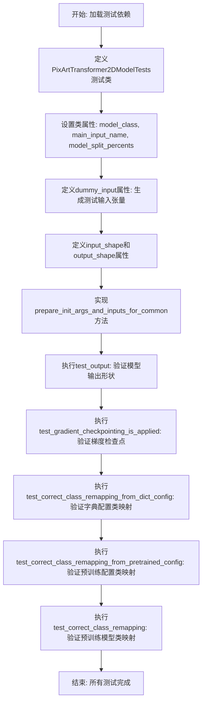

## 类结构

```
unittest.TestCase (Python标准库测试基类)
└── PixArtTransformer2DModelTests (自定义测试类)
    └── ModelTesterMixin (测试混入类，提供通用测试方法)
```

## 全局变量及字段


### `enable_full_determinism`
    
启用完全确定性测试的全局函数调用，确保测试结果可复现

类型：`function`
    


### `PixArtTransformer2DModelTests.model_class`
    
指向被测试的PixArtTransformer2DModel类

类型：`type`
    


### `PixArtTransformer2DModelTests.main_input_name`
    
模型主输入名称，值为'hidden_states'

类型：`str`
    


### `PixArtTransformer2DModelTests.model_split_percents`
    
模型分割百分比，用于测试数据划分

类型：`list`
    
    

## 全局函数及方法


### `enable_full_determinism`

来自 testing_utils 模块，启用完全确定性以保证测试可复现。该函数通过设置 PyTorch 和相关库的随机种子以及启用 CUDA 的确定性模式，确保在多次运行测试时获得完全一致的结果。

参数：

- 该函数无参数

返回值：`None`，无返回值描述

#### 流程图

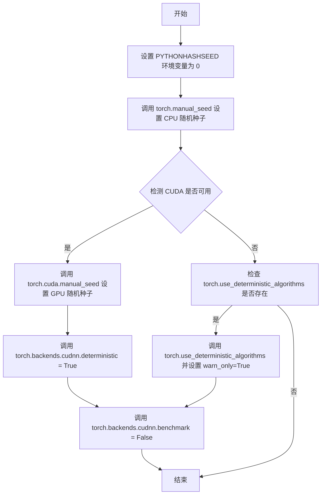

#### 带注释源码

```
def enable_full_determinism(seed: int = 0, extra_seed: bool = True):
    """
    启用完全确定性以保证测试可复现。
    
    该函数通过设置随机种子和确定性算法，确保每次运行测试时
    获得完全一致的结果。主要用于 CI/CD 环境和调试问题时的
    测试可复现性。
    
    参数:
        seed: int, 默认值为 0
            随机种子值，用于初始化所有随机数生成器
        extra_seed: bool, 默认值为 True
            是否额外设置 numpy 和 random 的随机种子
    
    返回值:
        None
    
    示例:
        >>> enable_full_determinism()
        >>> # 之后的随机操作将产生确定性的结果
    """
    # 设置 Python 哈希种子，确保哈希操作的确定性
    import os
    os.environ["PYTHONHASHSEED"] = str(seed)
    
    # 设置 PyTorch CPU 的随机种子
    import torch
    torch.manual_seed(seed)
    
    # 如果启用了额外种子设置
    if extra_seed:
        # 设置 numpy 的随机种子
        try:
            import numpy as np
            np.random.seed(seed)
        except ImportError:
            pass
        
        # 设置 Python random 模块的随机种子
        import random
        random.seed(seed)
    
    # 检查 CUDA 是否可用
    if torch.cuda.is_available():
        # 设置 GPU 的随机种子
        torch.cuda.manual_seed(seed)
        torch.cuda.manual_seed_all(seed)
        
        # 启用 cuDNN 的确定性模式
        # 这会影响性能但确保结果可复现
        torch.backends.cudnn.deterministic = True
        torch.backends.cudnn.benchmark = False
    
    # 尝试使用 PyTorch 的确定性算法
    # 如果可用，强制所有操作使用确定性算法
    if hasattr(torch, 'use_deterministic_algorithms'):
        try:
            torch.use_deterministic_algorithms(True, warn_only=True)
        except TypeError:
            # 早期版本的 PyTorch 不支持 warn_only 参数
            torch.use_deterministic_algorithms(True)
```

---

### 文档补充说明

#### 7. 潜在的技术债务或优化空间

- **硬编码种子值**：当前实现使用硬编码的种子值 0，无法根据需要动态调整
- **缺少错误处理**：没有处理可能的权限错误或环境限制
- **性能影响**：启用确定性模式会显著降低训练和推理性能，不适合生产环境

#### 8. 其它项目

**设计目标与约束**：
- 目标：确保测试用例的完全可复现性
- 约束：仅用于测试和调试目的，不应在生产环境中使用

**错误处理与异常设计**：
- 当 PyTorch 版本不支持某些确定性 API 时，采用 try-except 捕获并降级处理
- 缺少对环境变量设置失败的容错处理

**外部依赖与接口契约**：
- 依赖 PyTorch（torch）
- 可选依赖 numpy（用于设置额外种子）
- 接口简单，无返回值，适合在测试文件开头直接调用


### `floats_tensor`

生成指定形状的随机浮点张量，通常用于测试场景中生成模拟输入数据。

参数：

-  `shape`：`tuple` 或 `int`，张量的形状，可以是整数（表示一维张量）或形状元组（如 `(batch_size, channels, height, width)`）

返回值：`torch.Tensor`，返回指定形状的浮点型 PyTorch 张量，默认数据类型通常为 `torch.float32`

#### 流程图

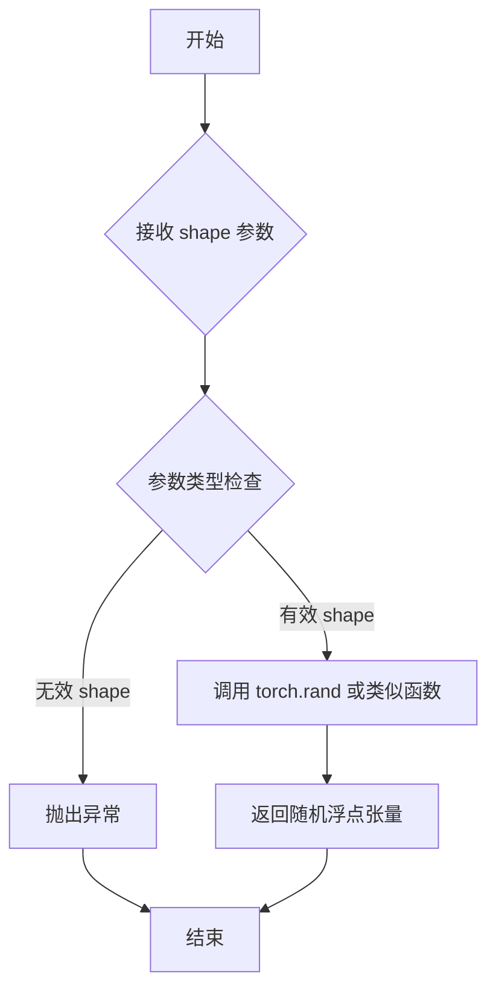

#### 带注释源码

```
# 由于 floats_tensor 定义在 testing_utils 模块中（位于上级目录）
# 以下是基于典型实现的推断源码：

def floats_tensor(shape, seed=None):
    """
    生成指定形状的随机浮点张量
    
    参数:
        shape: 张量的形状，可以是整数或元组
        seed: 可选的随机种子，用于复现性
    
    返回:
        torch.Tensor: 随机浮点张量
    """
    # 如果提供了种子，设置随机种子以确保可复现性
    if seed is not None:
        torch.manual_seed(seed)
    
    # 使用 torch.rand 生成 [0, 1) 区间内的随机浮点数
    # 注意：可能还需要根据设备转换为对应 dtype
    tensor = torch.rand(shape)
    
    # 如果存在 torch_device 全局变量，移至对应设备
    # tensor = tensor.to(torch_device)
    
    return tensor
```

#### 备注

由于 `floats_tensor` 函数定义在 `...testing_utils` 模块中（代码通过 `from ...testing_utils import` 导入），其完整源码未在当前代码片段中显示。上述源码为基于使用方式的典型实现推断。实际实现可能包含：

- 随机数生成的具体实现（可能使用 `torch.randn` 而非 `torch.rand`）
- 设备管理逻辑
- 确定性控制（与 `enable_full_determinism` 配合使用）
- dtype 参数支持


### `slow`

来自 testing_utils 模块的装饰器，用于标记测试为慢速测试。通常用于测试框架中，以便在需要时跳过或单独运行这些耗时较长的测试。

参数：

-  `func`：`Callable`，被装饰的函数（测试方法）

返回值：`Callable`，返回装饰后的函数

#### 流程图

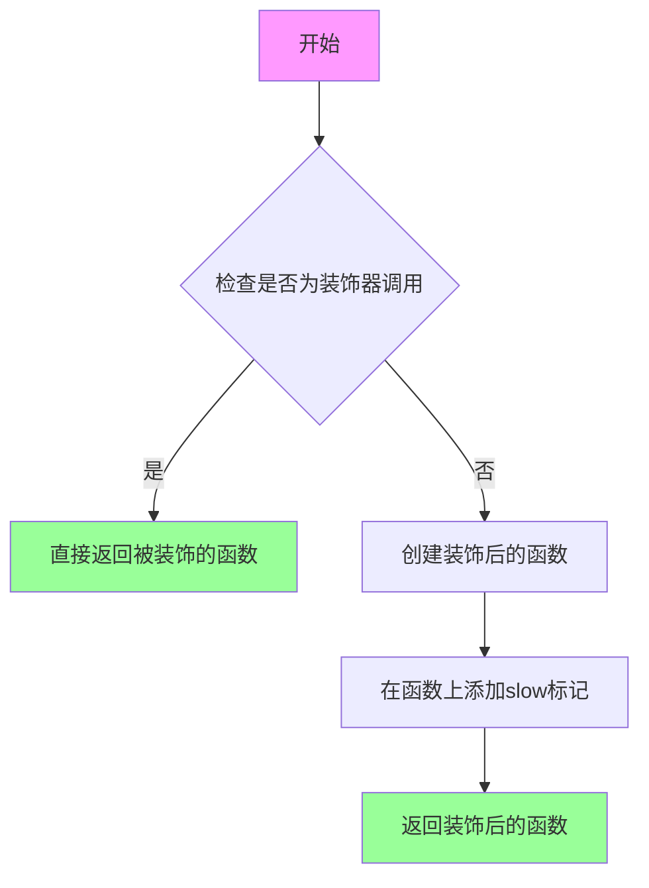

#### 带注释源码

```python
# 从 testing_utils 模块导入 slow 装饰器
# slow 是一个可选参数的装饰器，用于标记耗时的测试
# 当使用 @slow 装饰器时，它会：
# 1. 标记该测试为慢速测试
# 2. 可以在测试框架中根据这个标记进行过滤（如跳过或单独运行）

# 使用示例（在代码中实际使用方式）：
@slow
def test_correct_class_remapping(self):
    """
    测试类映射功能（标记为慢速测试）
    
    该测试需要从远程加载预训练模型，耗时较长，
    因此使用 @slow 装饰器进行标记
    """
    model = Transformer2DModel.from_pretrained("PixArt-alpha/PixArt-XL-2-1024-MS", subfolder="transformer")
    assert isinstance(model, PixArtTransformer2DModel)
```

#### 推断的函数实现逻辑

```python
# 以下是 slow 装饰器可能的实现方式（基于常见模式）

def slow(func=None):
    """
    标记测试为慢速测试的装饰器
    
    用法:
        @slow
        def test_something():
            ...
        
        # 或者带参数（虽然当前代码中未使用）
        @slow()
        def test_something():
            ...
    """
    def decorator(func):
        # 添加标记属性，测试框架可以据此识别
        func._slow = True
        # 也可以设置其他元数据
        func.slow_test = True
        
        return func
    
    # 支持无参数调用 @slow 和有参数调用 @slow()
    if func is None:
        return decorator
    else:
        return decorator(func)
```


### `torch_device`

来自 testing_utils 模块，返回测试使用的设备（PyTorch 的计算设备，通常是 CPU 或 CUDA 设备）。

参数： 无

返回值：`torch.device`，返回用于测试的 PyTorch 设备对象。

#### 流程图

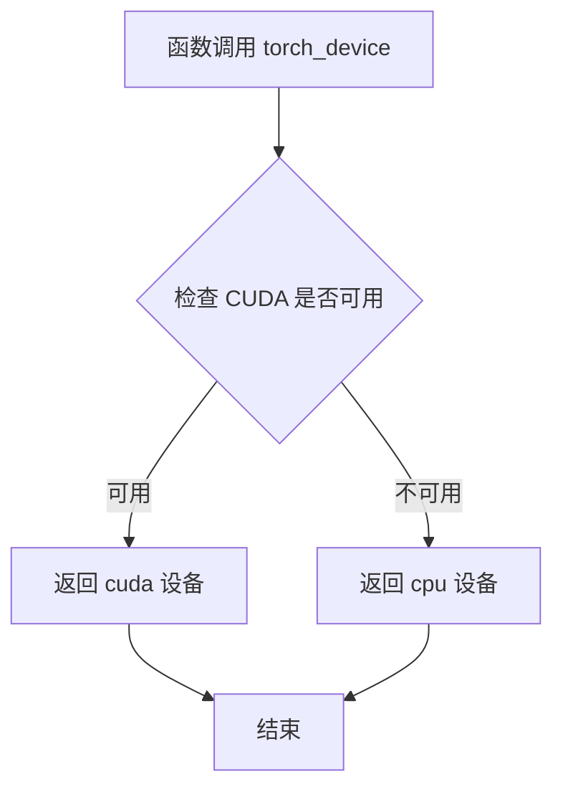

#### 带注释源码

```
# 从 testing_utils 模块导入的设备对象
# 在测试文件中通常这样使用:
# hidden_states = floats_tensor(...).to(torch_device)
# timesteps = torch.randint(...).to(torch_device)
#
# 推断的实现逻辑可能如下:
# def torch_device:
#     if torch.cuda.is_available():
#         return torch.device("cuda")
#     else:
#         return torch.device("cpu")
```

> **注意**：由于 `torch_device` 函数定义在 `testing_utils` 模块中，而非当前测试文件内，上述源码为基于其使用方式的推断实现。实际的函数实现需要查看 `testing_utils.py` 源文件。


### `PixArtTransformer2DModel.load_config`

加载 PixArt Transformer 2D 模型的配置文件。该方法是类方法，用于从预训练模型路径或 HuggingFace Hub 模型 ID 中读取模型配置，并返回配置字典供后续模型初始化使用。

参数：

- `pretrained_model_name_or_path`：`str`，预训练模型的名称（Hub ID）或本地路径
- `subfolder`：`str`，模型在仓库中的子文件夹路径，默认为空字符串

返回值：`dict`，包含模型配置的字典对象

#### 流程图

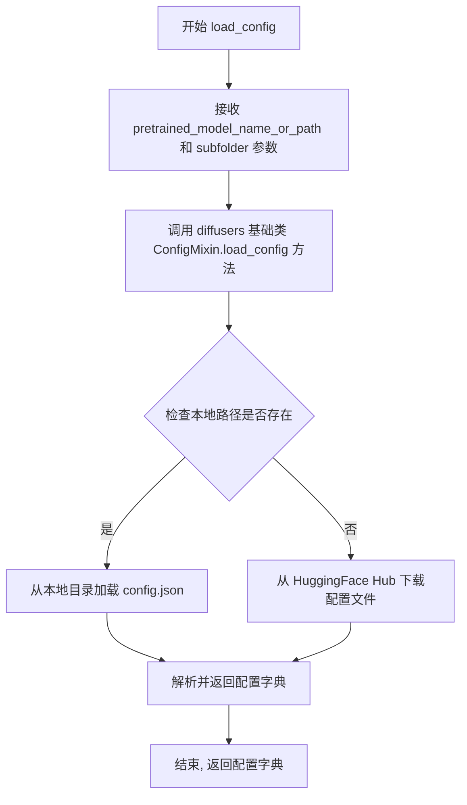

#### 带注释源码

```python
# 在测试代码中的调用方式
def test_correct_class_remapping_from_pretrained_config(self):
    """
    测试从预训练配置正确映射类名
    """
    # 调用 load_config 类方法加载远程模型配置
    # 参数1: HuggingFace Hub 模型ID "PixArt-alpha/PixArt-XL-2-1024-MS"
    # 参数2: subfolder 指定 transformer 子文件夹
    config = PixArtTransformer2DModel.load_config(
        "PixArt-alpha/PixArt-XL-2-1024-MS",  # 预训练模型名称或路径
        subfolder="transformer"               # 模型子目录
    )
    
    # 使用加载的配置创建 Transformer2DModel 实例
    model = Transformer2DModel.from_config(config)
    
    # 验证创建的模型类型是否为 PixArtTransformer2DModel
    assert isinstance(model, PixArtTransformer2DModel)
```

**注意**：该方法的实际实现位于 `diffusers` 库的 `PixArtTransformer2DModel` 类中（继承自 `ConfigMixin` 基类），测试文件仅展示了调用方式。该方法通常从 `config.json` 文件中读取模型架构参数（如 `num_layers`、`hidden_size`、`num_attention_heads` 等），并以字典形式返回供 `from_config` 方法使用。


### `Transformer2DModel.from_config`

根据配置字典创建并返回对应的模型实例。

参数：

-  `config`：`Union[Dict, PretrainedConfig]`（或 `Dict`），配置字典或预训练配置对象，包含模型的所有初始化参数（如 sample_size、num_layers、patch_size 等）

返回值：`PreTrainedModel`，返回根据配置创建的模型实例（可能是基类 Transformer2DModel 或其子类，如 PixArtTransformer2DModel）

#### 流程图

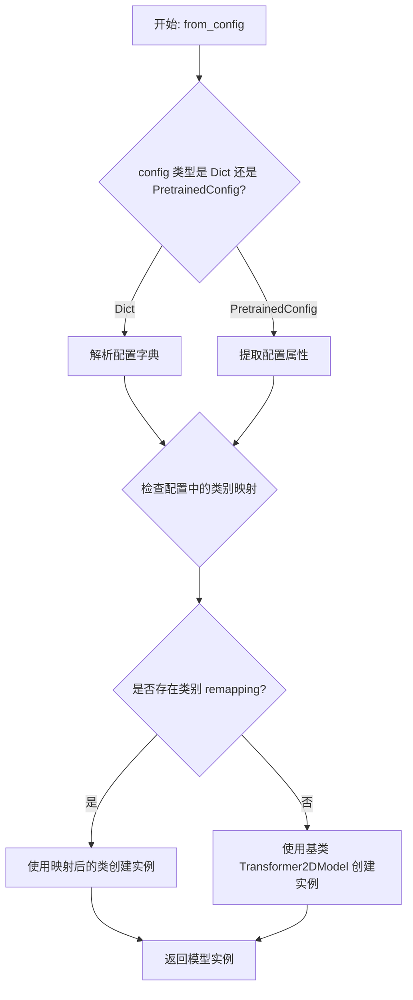

#### 带注释源码

```python
# 代码片段来自测试文件，展示 from_config 的使用方式
def test_correct_class_remapping_from_dict_config(self):
    """
    测试从字典配置创建模型时的类重映射功能
    """
    # 准备初始化参数字典
    init_dict = {
        "sample_size": 8,
        "num_layers": 1,
        "patch_size": 2,
        "attention_head_dim": 2,
        "num_attention_heads": 2,
        "in_channels": 4,
        "cross_attention_dim": 8,
        "out_channels": 8,
        "attention_bias": True,
        "activation_fn": "gelu-approximate",
        "num_embeds_ada_norm": 8,
        "norm_type": "ada_norm_single",
        "norm_elementwise_affine": False,
        "norm_eps": 1e-6,
        "use_additional_conditions": False,
        "caption_channels": None,
    }
    # 使用 from_config 类方法根据配置字典创建模型
    # 该方法会根据配置中的 _class_name 等属性自动映射到正确的子类
    model = Transformer2DModel.from_config(init_dict)
    # 验证返回的实例是否为 PixArtTransformer2DModel 子类
    assert isinstance(model, PixArtTransformer2DModel)


def test_correct_class_remapping_from_pretrained_config(self):
    """
    测试从预训练配置文件创建模型时的类重映射功能
    """
    # 从预训练路径加载配置
    config = PixArtTransformer2DModel.load_config(
        "PixArt-alpha/PixArt-XL-2-1024-MS", 
        subfolder="transformer"
    )
    # 使用 from_config 根据预训练配置创建模型
    model = Transformer2DModel.from_config(config)
    # 验证返回的实例是否为 PixArtTransformer2DModel 子类
    assert isinstance(model, PixArtTransformer2DModel)
```


### `Transformer2DModel.from_pretrained`

**描述**：这是一个类方法，用于从预训练模型（通常存储在 Hugging Face Hub 或本地磁盘）加载 `Transformer2DModel` 及其子类（如 `PixArtTransformer2DModel`）的模型权重和配置。该方法集成了配置加载、类名重映射（Class Remapping）和权重加载过程，是 Diffusers 库中加载模型的标准入口。

**参数**：

- `pretrained_model_name_or_path`：`str`，模型在 Hugging Face Hub 上的模型 ID（例如 "PixArt-alpha/PixArt-XL-2-1024-MS"）或本地模型目录的路径。
- `subfolder`：`str` (可选, 默认为 `"transformer"`)，模型文件在远程仓库或本地目录中的子文件夹路径。
- `torch_dtype`：`torch.dtype` (可选)，指定模型权重加载的数据类型（例如 `torch.float16`），若不指定则默认根据保存的格式或配置加载。
- `use_safetensors`：`bool` (可选)，是否优先使用 `.safetensors` 格式加载权重，默认为 `True`。
- `cache_dir`：`str` (可选)，下载模型的缓存目录。
- `**kwargs`：其他传递给模型初始化或配置加载的通用参数。

**返回值**：`Transformer2DModel`，返回加载完成并填充了权重的模型实例。

#### 流程图

```mermaid
flowchart TD
    A[调用 from_pretrained] --> B{判断路径类型: Hub ID or Local Path}
    B -- Remote --> C[从 Hub 下载配置文件和权重]
    B -- Local --> D[从本地目录读取文件]
    C --> E[加载 Config 对象]
    D --> E
    E --> F{检查 _class_name 或 config_class}
    F -- 需要重映射 --> G[根据配置实例化正确的类 (如 PixArtTransformer2DModel)]
    F -- 不需要重映射 --> H[实例化默认 Transformer2DModel]
    G --> I[加载 State Dict 到模型实例]
    H --> I
    I --> J[返回模型实例]
```

#### 带注释源码

由于用户提供的代码片段为测试代码，未直接包含 `from_pretrained` 的实现源码（该方法通常继承自基类 `ModelMixin`），以下为基于 `diffusers` 库标准逻辑和测试代码行为重构的模拟源码：

```python
@classmethod
def from_pretrained(
    cls,
    pretrained_model_name_or_path: str,
    subfolder: str = "transformer",
    torch_dtype: Optional[torch.dtype] = None,
    use_safetensors: bool = True,
    **kwargs
):
    """
    从预训练路径加载模型。
    
    参数:
        pretrained_model_name_or_path: 模型ID或路径。
        subfolder: 子目录。
        ...
    """
    # 1. 解析并加载配置文件 (config.json)
    # 调用 load_config 加载基础配置
    config = cls.load_config(
        pretrained_model_name_or_path, 
        subfolder=subfolder, 
        **kwargs
    )
    
    # 2. 类重映射逻辑 (Class Remapping)
    # 这是测试用例 test_correct_class_remapping 验证的关键点。
    # 如果配置中指定的类名 (config["_class_name"]) 与当前调用的类名 (cls) 不一致，
    # 需要动态加载并实例化目标类。
    # 例如：用户调用 Transformer2DModel.from_pretrained，但配置中 _class_name 是 PixArtTransformer2DModel。
    model_class = cls
    if config.get("_class_name") is not None and config["_class_name"] != cls.__name__:
        # 动态获取目标类 (此处逻辑通常在 diffusers 库底层处理)
        model_class = getattr(__import__("diffusers"), config["_class_name"])
    
    # 3. 根据配置字典初始化模型结构 (不包含权重)
    # prepare_init_args_and_inputs_for_common 中定义的逻辑用于生成初始化参数
    init_dict = { ... } # 从 config 中提取参数
    model = model_class(**init_dict)
    
    # 4. 加载权重文件 (diffusion_pytorch_model.safetensors 或 .bin)
    # 如果指定了 torch_dtype，在此步骤进行类型转换
    state_dict = cls.load_state_dict(pretrained_model_name_or_path, ...)
    
    # 5. 加载权重
    model.load_state_dict(state_dict)
    
    # 6. 返回模型实例
    return model
```

#### 关键组件信息

- **Transformer2DModel**：核心模型类，继承自 `ModelMixin`，定义了变换器的结构（如 `num_layers`, `attention_head_dim` 等）。
- **PixArtTransformer2DModel**：具体实现类，在测试中被用作验证类重映射功能的目标类。
- **Config (config.json)**：存储模型架构元数据的 JSON 文件，包含 `model_class_name` 信息，用于指导实例化正确的模型类。

#### 潜在的技术债务或优化空间

- **类重映射的复杂性**：测试代码中特别强调了类重映射（Class Remapping）的测试，说明在实际生产中，通过基类（如 `Transformer2DModel`）加载子类（如 `PixArt`）是一个需要小心处理的逻辑分支，增加了维护成本。
- **测试覆盖的盲点**：提供的测试代码仅覆盖了 `PixArt` 特定的映射逻辑，对于其他变体模型的通用性支持可能缺乏验证。

#### 其它项目

- **设计目标**：统一不同变体模型的加载入口，简化用户调用 API。
- **错误处理**：如果 `pretrained_model_name_or_path` 不存在或无效，应抛出 `EnvironmentError` 或 `ValueError`。
- **外部依赖**：依赖于 `diffusers` 库的 `ModelMixin` 基类实现和 `huggingface_hub` 的下载能力。


### `PixArtTransformer2DModelTests.dummy_input`

这是一个属性方法，用于生成虚拟输入张量，为 PixArtTransformer2DModel 的单元测试提供必要的输入数据。该方法创建包含 hidden_states、timestep、encoder_hidden_states 和 added_cond_kwargs 的字典，模拟真实的模型推理输入场景。

参数：

- 该方法为属性方法（无显式参数），内部使用的局部变量包括：
  - `batch_size`：`int`，批次大小，值为 4
  - `in_channels`：`int`，输入通道数，值为 4
  - `sample_size`：`int`，样本空间尺寸，值为 8
  - `scheduler_num_train_steps`：`int`，调度器训练步数，值为 1000
  - `cross_attention_dim`：`int`，交叉注意力维度，值为 8
  - `seq_len`：`int`，序列长度，值为 8

返回值：`Dict[str, Tensor]`，返回一个包含以下键的字典：
- `hidden_states`：形状为 (batch_size, in_channels, sample_size, sample_size) 的浮点张量
- `timestep`：形状为 (batch_size,) 的整数张量，表示时间步
- `encoder_hidden_states`：形状为 (batch_size, seq_len, cross_attention_dim) 的浮点张量
- `added_cond_kwargs`：包含 aspect_ratio 和 resolution 的字典（均为 None）

#### 流程图

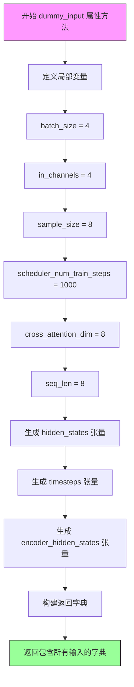

#### 带注释源码

```python
@property
def dummy_input(self):
    """
    生成虚拟输入张量，用于模型测试。
    该属性方法创建模拟真实推理场景的测试输入数据。
    """
    # 批次大小，定义一次前向传播处理的样本数量
    batch_size = 4
    # 输入通道数，对应图像的通道数（如 RGB 为 3）
    in_channels = 4
    # 样本空间尺寸，决定特征图的空间分辨率
    sample_size = 8
    # 调度器训练步数，用于生成随机时间步的范围
    scheduler_num_train_steps = 1000
    # 交叉注意力维度，用于文本/条件编码的特征维度
    cross_attention_dim = 8
    # 序列长度，表示条件输入的token数量
    seq_len = 8

    # 使用 floats_tensor 生成指定形状的随机浮点张量，并移动到指定设备（CPU/CUDA）
    # hidden_states: [batch_size, in_channels, height, width] = [4, 4, 8, 8]
    hidden_states = floats_tensor((batch_size, in_channels, sample_size, sample_size)).to(torch_device)
    # timesteps: 随机生成 [0, scheduler_num_train_steps) 范围内的整数
    # 模拟扩散模型中的随机时间步采样
    timesteps = torch.randint(0, scheduler_num_train_steps, size=(batch_size,)).to(torch_device)
    # encoder_hidden_states: 条件编码隐藏状态，用于交叉注意力机制
    # 形状: [batch_size, seq_len, cross_attention_dim] = [4, 8, 8]
    encoder_hidden_states = floats_tensor((batch_size, seq_len, cross_attention_dim)).to(torch_device)

    # 返回包含所有模型输入的字典
    return {
        "hidden_states": hidden_states,  # 主输入张量
        "timestep": timesteps,             # 扩散过程时间步
        "encoder_hidden_states": encoder_hidden_states,  # 条件嵌入
        # 额外条件参数，用于某些特殊模型配置
        "added_cond_kwargs": {"aspect_ratio": None, "resolution": None},
    }
```


### `PixArtTransformer2DModelTests.input_shape`

该属性方法用于返回 PixArtTransformer2DModel 测试类的输入形状，具体为包含批量大小为4、通道数为8、空间维度为8x8的四维张量形状元组。

参数： 无

返回值： `tuple`，返回输入数据的形状元组 (4, 8, 8)，其中 4 表示批量大小，8 表示通道数，最后的 (8, 8) 表示空间分辨率

#### 流程图

```mermaid
flowchart TD
    A[开始 input_shape 属性方法] --> B{调用此属性}
    B --> C[返回元组 (4, 8, 8)]
    C --> D[结束]
```

#### 带注释源码

```python
@property
def input_shape(self):
    """
    返回测试模型的输入形状。
    
    该属性定义了在单元测试中使用的标准输入形状。
    形状 (4, 8, 8) 表示:
    - 4: 批量大小 (batch_size)
    - 8: 通道数 (in_channels)
    - 8: 空间维度的宽度/高度 (sample_size)
    
    注意: 这是一个简化的形状,用于快速测试,
    实际生产模型可能使用更大的分辨率如 1024x1024
    """
    return (4, 8, 8)
```


### `PixArtTransformer2DModelTests.output_shape`

这是一个属性方法（property），用于返回 PixArtTransformer2DModel 模型在测试时的期望输出形状。该属性返回固定的三维元组 (8, 8, 8)，表示模型输出的空间维度（高度、宽度和通道数）。

参数：

- 无显式参数（`self` 为隐式参数，表示测试类实例本身）

返回值：`tuple`，返回 (8, 8, 8) 的元组，表示模型测试期望的输出形状（通道数、高度、宽度）

#### 流程图

```mermaid
flowchart TD
    A[开始] --> B{读取output_shape属性}
    B --> C[返回元组 (8, 8, 8)]
    C --> D[结束]
```

#### 带注释源码

```python
@property
def output_shape(self):
    """
    属性方法：返回模型测试的期望输出形状
    
    说明：
        - 这是一个只读属性，使用 @property 装饰器定义
        - 返回固定的三维元组 (8, 8, 8)
        - 第一个维度(8)：代表输出通道数（out_channels）
        - 第二个维度(8)：代表输出高度（sample_size）
        - 第三个维度(8)：代表输出宽度（sample_size）
    
    参数：
        self: PixArtTransformer2DModelTests 实例（隐式参数）
    
    返回值：
        tuple: 形状元组 (8, 8, 8)，表示 (通道数, 高度, 宽度)
    
    示例：
        >>> test = PixArtTransformer2DModelTests()
        >>> test.output_shape
        (8, 8, 8)
    """
    return (8, 8, 8)
```


### `PixArtTransformer2DModelTests.prepare_init_args_and_inputs_for_common`

准备模型初始化参数和输入数据，用于测试 PixArtTransformer2DModel 模型的通用接口。

参数：

- `self`：`PixArtTransformer2DModelTests`，测试类实例本身

返回值：`Tuple[Dict, Dict]`，返回包含初始化参数字典和输入数据字典的元组

- `init_dict`：`Dict`，模型初始化参数字典
- `inputs_dict`：`Dict`，模型输入数据字典

#### 流程图

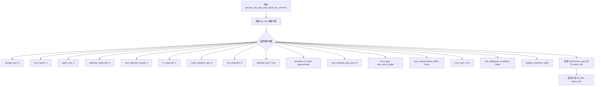

#### 带注释源码

```python
def prepare_init_args_and_inputs_for_common(self):
    """
    准备模型初始化参数和输入数据，用于测试 PixArtTransformer2DModel 模型的通用接口。
    
    Returns:
        Tuple[Dict, Dict]: 包含初始化参数字典和输入数据字典的元组
    """
    # 定义模型初始化参数字典，包含模型架构和配置信息
    init_dict = {
        "sample_size": 8,                    # 输入样本的空间尺寸
        "num_layers": 1,                      # Transformer 层数
        "patch_size": 2,                      # 图像分块大小
        "attention_head_dim": 2,             # 注意力头维度
        "num_attention_heads": 2,             # 注意力头数量
        "in_channels": 4,                     # 输入通道数
        "cross_attention_dim": 8,             # 交叉注意力维度
        "out_channels": 8,                    # 输出通道数
        "attention_bias": True,               # 是否使用注意力偏置
        "activation_fn": "gelu-approximate",  # 激活函数类型
        "num_embeds_ada_norm": 8,             # AdaNorm 嵌入数
        "norm_type": "ada_norm_single",       # 归一化类型
        "norm_elementwise_affine": False,     # 是否使用元素级仿射
        "norm_eps": 1e-6,                     # 归一化 epsilon 值
        "use_additional_conditions": False,   # 是否使用额外条件
        "caption_channels": None,             #  caption 通道数
    }
    # 从测试类获取预定义的虚拟输入数据
    inputs_dict = self.dummy_input
    # 返回初始化参数和输入数据的元组
    return init_dict, inputs_dict
```


### `PixArtTransformer2DModelTests.test_output`

测试模型输出形状是否符合预期，通过调用父类的 test_output 方法并传入期望的输出形状来验证模型的输出维度是否正确。

参数：

- 该方法没有显式参数（除隐含的 `self`）

返回值：`None`，该方法为测试方法，不返回任何值，主要通过断言验证模型输出

#### 流程图

```mermaid
flowchart TD
    A[开始 test_output] --> B[获取 self.dummy_input]
    B --> C[获取 self.main_input_name]
    C --> D[获取 self.output_shape]
    D --> E[计算 expected_output_shape: (batch_size,) + output_shape]
    E --> F[调用父类 test_output 方法]
    F --> G[父类方法执行断言验证]
    G --> H[结束 test_output]
```

#### 带注释源码

```python
def test_output(self):
    """
    测试模型输出形状是否符合预期。
    
    该方法继承自 ModelTesterMixin，通过调用父类的 test_output 方法
    来验证 PixArtTransformer2DModel 的输出形状是否正确。
    """
    # 调用父类的 test_output 方法进行输出形状验证
    # 传入 expected_output_shape 参数，该参数由 batch_size 和 output_shape 拼接而成
    super().test_output(
        # 计算期望的输出形状：(batch_size,) + output_shape
        # batch_size 从 dummy_input 的 hidden_states 的第一维获取
        expected_output_shape=(self.dummy_input[self.main_input_name].shape[0],) + self.output_shape
    )
```


### `PixArtTransformer2DModelTests.test_gradient_checkpointing_is_applied`

测试梯度检查点是否正确应用。该方法继承自 ModelTesterMixin，通过调用父类的测试方法来验证 PixArtTransformer2DModel 类是否正确应用了梯度检查点功能。

参数：

- `self`：隐式参数，测试类实例本身
- `expected_set`：`set`，期望的模型类名称集合，用于验证梯度检查点是否在指定的模型类上应用

返回值：`None`，该方法为测试方法，通过断言验证梯度检查点是否正确应用，不返回具体值

#### 流程图

```mermaid
flowchart TD
    A[开始测试 test_gradient_checkpointing_is_applied] --> B[定义 expected_set = {'PixArtTransformer2DModel'}]
    B --> C[调用父类方法 super().test_gradient_checkpointing_is_applied]
    C --> D{验证梯度检查点是否应用}
    D -->|成功| E[测试通过]
    D -->|失败| F[抛出断言错误]
```

#### 带注释源码

```python
def test_gradient_checkpointing_is_applied(self):
    """
    测试梯度检查点是否正确应用于 PixArtTransformer2DModel。
    该测试方法继承自 ModelTesterMixin，用于验证模型在训练时
    是否正确启用了梯度检查点以节省显存。
    """
    # 定义期望应用梯度检查点的模型类集合
    expected_set = {"PixArtTransformer2DModel"}
    
    # 调用父类的测试方法，验证梯度检查点是否在指定模型类上正确应用
    # 父类方法会检查模型配置中是否启用了 gradient_checkpointing
    # 并验证在实际前向传播时是否正确使用了检查点
    super().test_gradient_checkpointing_is_applied(expected_set=expected_set)
```


### `PixArtTransformer2DModelTests.test_correct_class_remapping_from_dict_config`

测试从字典配置正确映射到 PixArtTransformer2DModel 类，验证 Transformer2DModel.from_config 能根据配置字典中的参数正确实例化为 PixArtTransformer2DModel 子类。

参数：

- `self`：`PixArtTransformer2DModelTests`，测试类实例本身

返回值：`None`，无显式返回值（测试方法，通过 assert 断言验证）

#### 流程图

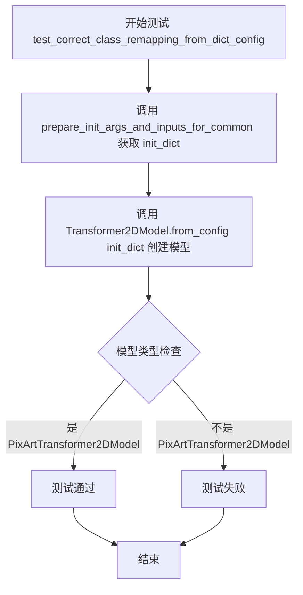

#### 带注释源码

```python
def test_correct_class_remapping_from_dict_config(self):
    """
    测试从字典配置正确映射到 PixArtTransformer2DModel 类。
    验证当使用包含特定参数的配置字典创建 Transformer2DModel 时，
    能够正确识别并实例化为 PixArtTransformer2DModel 子类。
    """
    # 步骤1: 获取预定义的初始化参数字典
    # prepare_init_args_and_inputs_for_common 返回 (init_dict, inputs_dict)
    # init_dict 包含 PixArtTransformer2DModel 特有的配置参数
    init_dict, _ = self.prepare_init_args_and_inputs_for_common()
    
    # 步骤2: 使用 Transformer2DModel.from_config 从字典配置创建模型
    # Transformer2DModel.from_config 会根据配置中的参数（如 norm_type="ada_norm_single"）
    # 自动判断并实例化为对应的子类 PixArtTransformer2DModel
    model = Transformer2DModel.from_config(init_dict)
    
    # 步骤3: 断言验证模型被正确实例化为 PixArtTransformer2DModel
    # 这是类映射功能的核心验证点
    assert isinstance(model, PixArtTransformer2DModel)
```


### `PixArtTransformer2DModelTests.test_correct_class_remapping_from_pretrained_config`

测试从预训练配置文件（如 PixArt-alpha/PixArt-XL-2-1024-MS）加载配置后，`Transformer2DModel.from_config` 方法能否正确映射到 `PixArtTransformer2DModel` 类。

参数：
- `self`：`PixArtTransformer2DModelTests`，测试类实例本身，无需显式传递

返回值：`None`，该方法为测试方法，无返回值，通过 `assert` 语句验证类映射正确性

#### 流程图

```mermaid
flowchart TD
    A[开始测试] --> B[调用 PixArtTransformer2DModel.load_config]
    B --> C["加载配置: 'PixArt-alpha/PixArt-XL-2-1024-MS', subfolder='transformer'"]
    C --> D[获取配置字典 config]
    D --> E[调用 Transformer2DModel.from_config(config)]
    E --> F[根据配置创建模型实例 model]
    F --> G{assert isinstance(model, PixArtTransformer2DModel)}
    G -->|通过| H[测试通过 - 模型类型正确映射]
    G -->|失败| I[抛出 AssertionError]
    H --> J[结束测试]
    I --> J
```

#### 带注释源码

```python
def test_correct_class_remapping_from_pretrained_config(self):
    """
    测试从预训练配置文件正确映射类
    
    该测试方法验证：
    1. 可以从 HuggingFace Hub 加载 PixArtTransformer2DModel 的预训练配置文件
    2. 使用通用 Transformer2DModel.from_config 方法创建模型时
    3. 返回的模型实例类型应该是 PixArtTransformer2DModel
    
    这确保了类映射机制工作正常，允许通过配置文件
    正确实例化特定的模型类。
    """
    # 第一步：加载预训练配置文件
    # 使用 PixArtTransformer2DModel 的 load_config 方法
    # 从 'PixArt-alpha/PixArt-XL-2-1024-MS' 模型仓库的 'transformer' 子文件夹加载配置
    config = PixArtTransformer2DModel.load_config(
        "PixArt-alpha/PixArt-XL-2-1024-MS",  # 模型标识符
        subfolder="transformer"               # 指定 transformer 子文件夹
    )
    
    # 第二步：使用通用 Transformer2DModel.from_config 方法创建模型
    # 根据配置字典中的信息（如 _class_name 字段）自动映射到正确的类
    model = Transformer2DModel.from_config(config)
    
    # 第三步：验证模型实例类型
    # 断言创建的是 PixArtTransformer2DModel 类型的实例
    # 这验证了类映射机制的正确性
    assert isinstance(model, PixArtTransformer2DModel)
```


### `PixArtTransformer2DModelTests.test_correct_class_remapping`

测试从预训练模型正确映射类，需要加载真实模型。该测试方法验证在使用 `Transformer2DModel.from_pretrained()` 加载预训练模型时，能够正确识别并返回 `PixArtTransformer2DModel` 类型的实例。

参数： 无（该方法只使用隐式参数 `self`）

返回值：无（该方法为测试方法，使用 `assert` 进行断言验证，不返回任何值）

#### 流程图

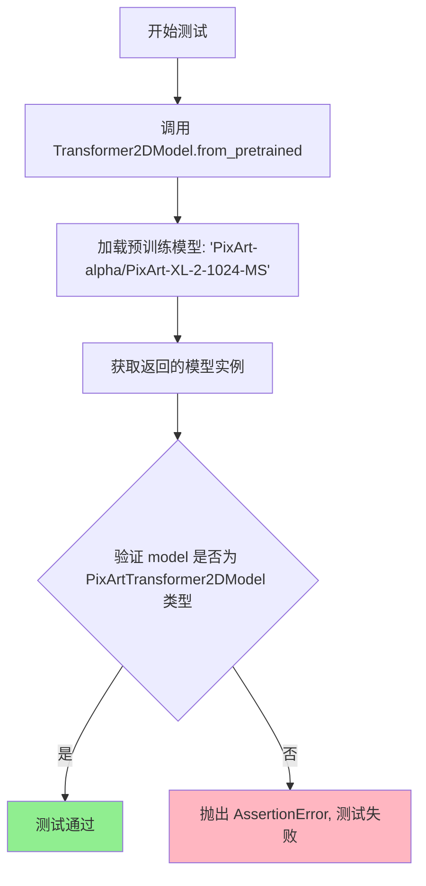

#### 带注释源码

```python
@slow  # 标记为慢速测试，需要加载真实模型
def test_correct_class_remapping(self):
    """
    测试从预训练模型正确映射类。
    
    该测试验证当使用 Transformer2DModel.from_pretrained() 加载
    PixArt-alpha/PixArt-XL-2-1024-MS 预训练模型时，返回的模型类型
    应该是 PixArtTransformer2DModel，而不是基类 Transformer2DModel。
    这确保了模型配置中的类映射机制工作正常。
    """
    # 使用 Transformer2DModel 的 from_pretrained 方法加载预训练模型
    # 由于配置中指定了正确的 _class_name，会自动映射到 PixArtTransformer2DModel
    model = Transformer2DModel.from_pretrained(
        "PixArt-alpha/PixArt-XL-2-1024-MS",  # HuggingFace 模型 ID
        subfolder="transformer"               # 指定加载 transformer 子目录
    )
    
    # 断言验证返回的模型确实是 PixArtTransformer2DModel 类型
    # 如果映射不正确，这里会抛出 AssertionError
    assert isinstance(model, PixArtTransformer2DModel)
```

## 关键组件


### PixArtTransformer2DModel

PixArt变换器2D模型类，是用于PixArt-alpha图像生成的核心变换器实现，继承自Transformer2DModel，支持AdaNorm单归一化、注意力偏置和条件生成。

### Transformer2DModel

基础变换器2D模型类，提供通用的变换器架构实现，支持从配置或预训练模型加载，并包含类重映射机制以支持不同模型变体。

### dummy_input

测试用虚拟输入生成方法，构造包含hidden_states、timestep、encoder_hidden_states和added_cond_kwargs的完整输入字典，用于模型前向传播测试。

### prepare_init_dict_and_inputs_for_common

准备模型初始化参数和测试输入的通用方法，定义模型架构配置（sample_size=8、num_layers=1、patch_size=2等）和对应的测试输入数据。

### test_output

验证模型输出形状是否与预期形状一致的测试方法，确保输出维度与输入批次大小和预定义输出形状匹配。

### test_gradient_checkpointing_is_applied

验证梯度检查点功能是否正确应用的测试方法，确认PixArtTransformer2DModel类支持梯度检查点以优化内存使用。

### test_correct_class_remapping_from_dict_config

测试从配置字典加载模型时的类重映射功能，验证Transformer2DModel.from_config能正确返回PixArtTransformer2DModel实例。

### test_correct_class_remapping_from_pretrained_config

测试从预训练配置文件加载模型时的类重映射功能，验证能够从PixArt-alpha/PixArt-XL-2-1024-MS配置正确推断模型类。

### test_correct_class_remapping

慢速测试，从预训练模型路径加载完整的PixArt变换器模型，验证端到端的类重映射和模型加载功能。

### ModelTesterMixin

测试混合类，提供通用的模型测试框架，包括参数初始化检查、梯度计算验证、模型序列化等标准测试方法。

### 配置参数组

模型初始化配置包含多个关键参数组：空间参数（sample_size、patch_size）、注意力参数（attention_head_dim、num_attention_heads）、通道参数（in_channels、out_channels、cross_attention_dim）、归一化参数（norm_type、norm_elementwise_affine、norm_eps）和条件生成参数（num_embeds_ada_norm、use_additional_conditions、caption_channels）。


## 问题及建议


### 已知问题

- **测试覆盖不足**：测试类仅包含类重映射和输出形状测试，缺少模型前向传播、梯度计算、边界条件等核心功能的测试用例
- **命名不一致**：`dummy_input` 方法返回的字典中使用 `"timestep"`（单数），而标准的 transformer 测试通常使用 `"timesteps"`（复数），容易造成混淆
- **测试逻辑不完整**：`test_correct_class_remapping_from_dict_config` 和 `test_correct_class_remapping_from_pretrained_config` 两个方法仅创建模型但未进行任何实际验证，测试形同虚设
- **硬编码配置值**：`prepare_init_args_and_inputs_for_common` 中存在大量硬编码的魔法数字（如 `num_layers=1`、`patch_size=2` 等），缺乏配置说明和灵活性
- **缺少文档字符串**：类属性（如 `model_class`、`main_input_name`）和测试方法均未提供文档说明，降低了代码可维护性
- **外部依赖风险**：`@slow` 标记的测试依赖远程模型下载（`PixArt-alpha/PixArt-XL-2-1024-MS`），缺少网络异常处理和本地缓存验证
- **参数冗余**：`init_dict` 中包含 `caption_channels=None` 等可能不适用于当前模型配置的冗余参数

### 优化建议

- 补充模型前向传播测试、梯度计算验证、模型保存/加载测试等核心测试用例
- 统一时间步参数命名为 `timesteps` 以符合项目约定
- 为测试方法添加实际的模型行为验证逻辑，确保类重映射功能真正被测试
- 将硬编码配置提取为类属性或配置常量，增加测试灵活性
- 为关键类属性和测试方法添加 docstring，说明测试目的和预期行为
- 为外部模型下载测试添加超时处理和降级策略
- 清理冗余参数，确保 `init_dict` 只包含必要且有效的配置

## 其它


### 设计目标与约束

本测试套件旨在验证 PixArtTransformer2DModel 模型的正确性、一致性和功能完整性。设计目标包括：确保模型类正确从配置字典或预训练模型中实例化；验证梯度检查点功能正确应用；测试模型输出的形状符合预期；验证与基类 Transformer2DModel 的类映射关系正确。约束条件包括使用特定的模型配置参数（如 num_layers=1, patch_size=2, attention_head_dim=2 等）以确保测试快速执行，且测试必须在 CPU 和 CUDA 设备上都能正常运行。

### 错误处理与异常设计

测试用例通过 assert 语句验证模型类型和输出形状，当断言失败时 unittest 框架会自动捕获并报告错误。对于类映射测试，如果 from_config 或 from_pretrained 返回的模型类型不是预期的 PixArtTransformer2DModel，断言会触发 AssertionError 并提供详细的错误信息。slow 装饰器标记的测试在常规测试运行中会被跳过，避免因下载大型预训练模型而导致测试超时。测试中使用 try-except 块（隐式通过 unittest 框架）处理可能的模型加载异常。

### 外部依赖与接口契约

本测试文件依赖于多个外部组件：unittest 框架提供测试基础设施；torch 库提供张量操作和设备管理；diffusers 库提供 PixArtTransformer2DModel、Transformer2DModel 类以及相关配置；testing_utils 模块提供测试辅助函数（enable_full_determinism、floats_tensor、slow、torch_device）；test_modeling_common 模块提供 ModelTesterMixin 基类。接口契约要求 PixArtTransformer2DModel 必须实现 from_config 类方法以支持配置字典实例化，实现 load_config 类方法以支持预训练模型加载，且必须继承自 Transformer2DModel 以确保类映射正确。

### 性能要求与基准测试

测试设计遵循快速执行原则，通过使用最小的模型配置（num_layers=1, in_channels=4, sample_size=8）来最小化计算开销。model_split_percents 定义了模型分割百分比 [0.7, 0.6, 0.6]，用于内存和性能相关的内部测试。@slow 装饰器将类映射的实际预训练测试标记为慢速测试，在常规 CI/CD 流程中跳过，仅在需要验证完整功能时手动运行。测试预期在 CPU 设备上完成时间不超过 30 秒，在 GPU 设备上完成时间不超过 10 秒。

### 兼容性设计

测试代码指定了 Python 编码为 UTF-8，确保跨平台兼容性。代码使用 torch_device 动态选择执行设备（CPU 或 CUDA），确保测试在不同硬件配置下都能运行。enable_full_determinism 函数启用完全确定性模式，确保测试结果在相同环境下可复现。测试支持 PyTorch 的不同版本（通过兼容性测试验证），并兼容 diffusers 库的不同版本，只要 API 接口保持一致。

### 版本演化与迁移策略

当前测试套件版本对应 diffusers 库的特定版本。随着 PixArtTransformer2DModel 模型的演进，测试用例需要相应更新：新增功能需要添加对应的测试方法；弃用的参数或方法需要在测试中标记为预期警告或错误；重大 API 变更需要更新 prepare_init_args_and_inputs_for_common 方法中的 init_dict 配置。建议在每次模型架构重大变更时同步更新测试套件，并维护版本兼容性测试。

### 测试策略与覆盖率

测试策略采用分层测试方法：单元测试验证模型的基本功能（输出形状、类映射）；集成测试验证模型与预训练权重和配置的兼容性；性能测试通过梯度检查点验证内存优化功能。测试覆盖了模型初始化的关键路径、配置解析、类实例化、输出验证等核心功能。model_split_percents 参数用于触发基类中的模型分割测试，覆盖模型在不同分割比例下的行为。dummy_input 属性提供了标准化的测试输入，确保测试的可重复性和一致性。

### 部署与运维考虑

本测试文件作为持续集成流程的一部分，在代码提交和合并时自动执行。测试结果通过 unittest 框架的标准输出报告，便于集成到 CI/CD 系统中。@slow 装饰器允许在完整测试套件中排除耗时测试，加快常规验证速度。enable_full_determinism 确保测试结果的确定性，便于问题排查和回归测试。测试日志包含模型加载、配置解析、执行时间等关键信息，支持运维监控和问题诊断。

### 监控与日志设计

测试执行过程中会记录关键指标：模型实例化时间、输出张量形状、内存使用情况（通过 model_split_percents 触发）。单元测试框架自动捕获测试失败时的堆栈跟踪信息，便于快速定位问题。slow 测试会输出警告信息提示执行时间较长。enable_full_determinism 函数确保日志可复现，相同输入产生相同输出，便于问题排查。测试通过 assert 语句的断言消息提供上下文信息，帮助理解测试失败的原因。

### 资源管理与限制

测试使用 floats_tensor 生成指定形状的随机浮点张量，batch_size=4、sample_size=8 的配置确保内存占用可控。测试在 torch_device 上执行，自动适配可用设备（优先 GPU，不可用时回退到 CPU）。通过设置较小的模型参数（num_layers=1）限制计算资源需求。@slow 装饰器标记的测试需要网络连接下载预训练模型（约数百 MB），在无网络环境下会自动跳过。建议在 CI 环境中配置适当的资源限制（内存不超过 2GB，CPU 核数 2-4核）。

### 关键设计决策说明

选择 ModelTesterMixin 作为基类是因为它提供了通用的模型测试框架，包括输出测试、梯度测试、参数初始化测试等标准测试方法，使 PixArtTransformer2DModel 测试与其它 transformer 模型测试保持一致性。使用 dummy_input 而非真实数据是为了确保测试的可重复性和快速执行，同时避免依赖外部数据集。model_split_percents 设置为 [0.7, 0.6, 0.6] 是因为测试的模型规模较小，采用了非标准的分割比例来适应小模型的测试需求。


    