# `diffusers\tests\models\transformers\test_models_prior.py` 详细设计文档

这是 diffusers 库中 PriorTransformer 模型的测试文件，包含单元测试和集成测试，用于验证 PriorTransformer（Kandinsky 文本到图像模型的先验部分）的模型加载、前向传播、输出正确性等功能。

## 整体流程

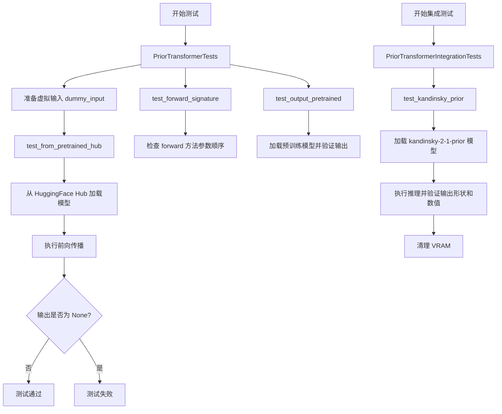

## 类结构

```
unittest.TestCase
├── PriorTransformerTests (单元测试类)
│   └── ModelTesterMixin (混入类)
└── PriorTransformerIntegrationTests (集成测试类)
```

## 全局变量及字段


### `batch_size`
    
Batch size for test inputs

类型：`int`
    


### `embedding_dim`
    
Embedding dimension size

类型：`int`
    


### `num_embeddings`
    
Number of embeddings

类型：`int`
    


### `hidden_states`
    
Input hidden states tensor

类型：`torch.Tensor`
    


### `proj_embedding`
    
Projected embedding tensor

类型：`torch.Tensor`
    


### `encoder_hidden_states`
    
Encoder hidden states tensor from encoder

类型：`torch.Tensor`
    


### `timestep`
    
Diffusion timestep value

类型：`int`
    


### `seed`
    
Random seed for reproducibility

类型：`int`
    


### `expected_slice`
    
Expected output slice values for verification

类型：`List[float]`
    


### `output_slice`
    
Actual output slice from model forward pass

类型：`torch.Tensor`
    


### `expected_output_slice`
    
Tensor version of expected output for comparison

类型：`torch.Tensor`
    


### `PriorTransformerTests.model_class`
    
The model class being tested (PriorTransformer)

类型：`type`
    


### `PriorTransformerTests.main_input_name`
    
The name of the main input parameter for the model (hidden_states)

类型：`str`
    
    

## 全局函数及方法


### `enable_full_determinism`

设置 PyTorch 随机种子和确定性算法选项，以确保测试过程的可重复性和结果一致性。

参数：

- 该函数无参数

返回值：`None`，无返回值（仅执行确定性配置操作）

#### 流程图

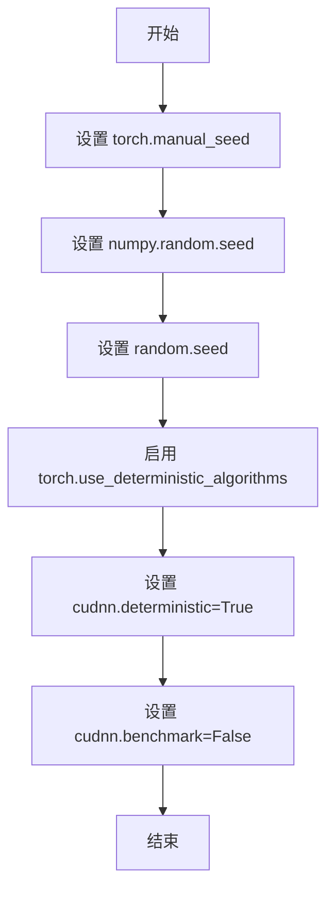

#### 带注释源码

```
# 该函数定义在 ...testing_utils 模块中（本文件仅导入并调用）
# 以下为根据 HuggingFace diffusers 库常见实现的推断源码

def enable_full_determinism(seed: int = 42):
    """
    启用完全确定性模式，确保测试结果可复现
    
    参数:
        seed: 随机种子值，默认42
    """
    # 1. 设置 PyTorch 全局随机种子
    torch.manual_seed(seed)
    torch.cuda.manual_seed_all(seed)
    
    # 2. 设置 numpy 随机种子
    try:
        import numpy as np
        np.random.seed(seed)
    except ImportError:
        pass
    
    # 3. 设置 Python random 模块种子
    import random
    random.seed(seed)
    
    # 4. 启用 PyTorch 确定性算法模式
    # 当操作不存在确定性实现时会抛出 RuntimeError
    torch.use_deterministic_algorithms(True)
    
    # 5. 设置 CuDNN 为确定性模式
    # 禁用 CuDNN 自动调优以确保可复现性
    torch.backends.cudnn.deterministic = True
    torch.backends.cudnn.benchmark = False

# 在本文件中的调用（模块级别）
enable_full_determinism()
```

---

**备注**：由于 `enable_full_determinism` 函数定义在 `testing_utils` 模块中而非本代码文件内，以上源码为根据函数名称和调用模式的合理推断。该函数在测试模块加载时立即执行，确保后续所有测试用例在确定性的环境中运行，以获得可复现的测试结果。


### `floats_tensor`

`floats_tensor` 是从 `testing_utils` 模块导入的辅助函数，用于生成指定形状的随机浮点张量。在测试代码中用于创建测试所需的 dummy 输入数据。

参数：

-  `shape`：`tuple`，指定生成张量的形状

返回值：`torch.Tensor`，返回指定形状的随机浮点张量

#### 流程图

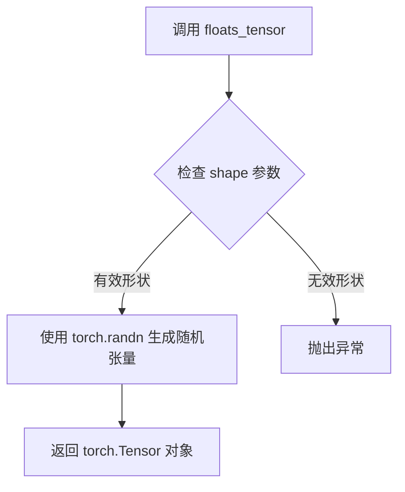

#### 带注释源码

```python
# floats_tensor 函数定义位于 ...testing_utils 模块中
# 本代码文件中仅导入并使用，未直接定义

# 使用示例（在 dummy_input 属性中）:
hidden_states = floats_tensor((batch_size, embedding_dim)).to(torch_device)
# 生成形状为 (batch_size, embedding_dim) 的随机浮点张量

proj_embedding = floats_tensor((batch_size, embedding_dim)).to(torch_device)
# 生成形状为 (batch_size, embedding_dim) 的随机浮点张量

encoder_hidden_states = floats_tensor((batch_size, num_embeddings, embedding_dim)).to(torch_device)
# 生成形状为 (batch_size, num_embeddings, embedding_dim) 的随机浮点张量

# 补充说明：
# - floats_tensor 是 diffusers 库 testing_utils 模块提供的测试辅助函数
# - 该函数底层通常调用 torch.randn 或类似方法生成随机数
# - 返回的张量默认在 CPU 上，可通过 .to(device) 转移到指定设备
# - 具体实现需要查看 testing_utils.py 源码确认
```


### `torch_all_close`

描述：`torch_all_close` 是一个用于比较两个 PyTorch 张量是否在指定容差范围内相等的全局函数，常见于测试场景以验证模型输出的数值精度。

参数：

- `tensor1`：`torch.Tensor`，待比较的第一个张量
- `tensor2`：`torch.Tensor`，待比较的第二个张量
- `rtol`：`float`，相对容差（relative tolerance），默认为 `1e-5`
- `atol`：`float`，绝对容差（absolute tolerance），默认为 `1e-8`
- `equal_nan`：`bool`，是否将 NaN 视为相等，默认为 `True`

返回值：`bool`，如果两个张量在容差范围内相等则返回 `True`，否则返回 `False`

#### 流程图

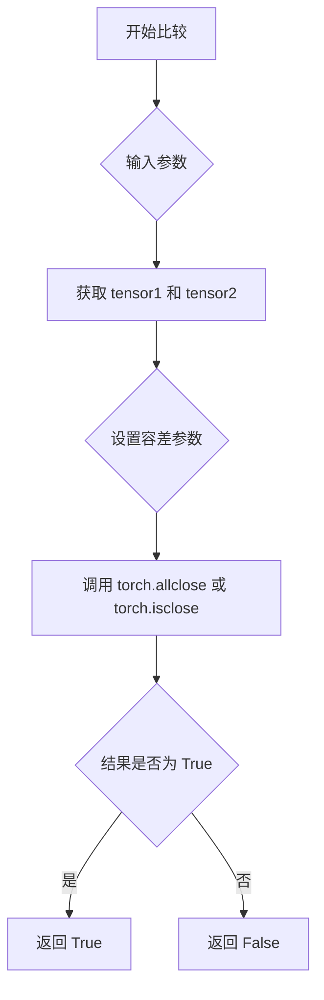

#### 带注释源码

```python
# 从 testing_utils 模块导入的函数，用于测试比较
# 此函数为 torch.allclose 的包装器或等价实现
# 使用示例：
#   torch_all_close(output_slice, expected_output_slice, rtol=1e-2)
#   torch_all_close(output_slice, expected_output_slice, atol=1e-3)

def torch_all_close(tensor1, tensor2, rtol=1e-5, atol=1e-8, equal_nan=True):
    """
    比较两个张量是否在容差范围内相等。
    
    参数:
        tensor1: 第一个张量
        tensor2: 第二个张量
        rtol: 相对容差
        atol: 绝对容差
        equal_nan: 是否将 NaN 视为相等
    
    返回:
        bool: 是否相等
    """
    # 实际实现调用 torch.allclose 或 torch.isclose
    return torch.allclose(tensor1, tensor2, rtol=rtol, atol=atol, equal_nan=equal_nan)
```


由于 `torch_device` 是从外部模块 `...testing_utils` 导入的，未在当前代码文件中定义，因此无法直接提供其实现细节。但根据其使用方式，可以推断其为一个全局变量或函数，用于获取当前的 PyTorch 设备（如 "cuda" 或 "cpu"）。

### `torch_device`

一个全局变量或函数，用于获取当前的 PyTorch 设备，以便在测试中将张量或模型移动到指定设备。

参数： 无

返回值： `str` 或 `torch.device`，返回当前 PyTorch 设备的标识符（如 "cuda"、"cpu" 或 "cuda:0"）。

#### 流程图

由于 `torch_device` 是外部导入的，其具体实现不可见，因此不提供流程图。

#### 带注释源码

```python
# torch_device 是从 testing_utils 模块导入的全局变量或函数
# 其具体定义不在当前代码文件中，以下为推测的实现形式：
# 假设它是一个函数，返回一个字符串表示设备
def torch_device():
    """
    返回当前的 PyTorch 设备。
    通常根据环境变量或系统配置返回 'cuda' 或 'cpu'。
    """
    if torch.cuda.is_available():
        return "cuda"
    else:
        return "cpu"

# 在代码中，torch_device 被用作：
# hidden_states = hidden_states.to(torch_device)  # 将张量移动到设备
# model = model.to(torch_device)  # 将模型移动到设备
# backend_empty_cache(torch_device)  # 清理设备缓存
```


### `backend_empty_cache`

该函数是一个测试工具函数，用于清理 GPU 缓存（VRAM），通常在测试完成后调用以释放显存资源。

参数：

- `torch_device`：`str`，表示目标设备（如 "cuda"、"cuda:0" 或 "cpu"）

返回值：`None`，无返回值

#### 流程图

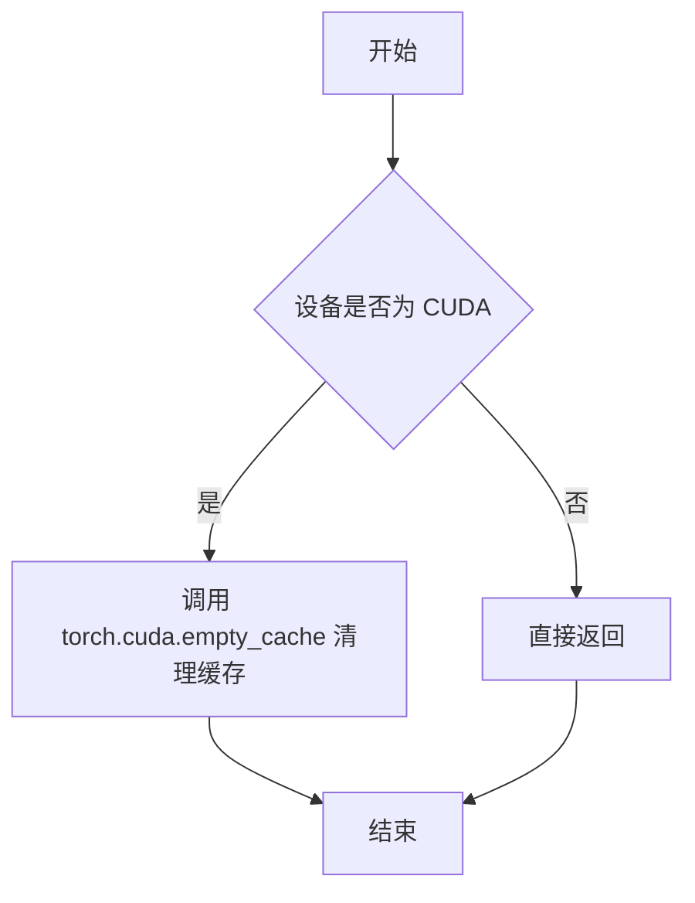

#### 带注释源码

```python
# 注意：此源码为推断代码，实际实现位于 testing_utils 模块中
def backend_empty_cache(torch_device):
    """
    清理指定设备上的 GPU 缓存（VRAM）
    
    参数:
        torch_device: 目标设备字符串，如 'cuda', 'cuda:0', 'cpu' 等
    """
    # 检查设备是否为 CUDA 设备
    if torch_device in ["cuda", "cpu"] or torch_device.startswith("cuda:"):
        # 调用 PyTorch 的 CUDA 缓存清理函数
        torch.cuda.empty_cache()
    
    # 如果是 CPU 设备，无需清理缓存，函数直接返回
    return None
```

> **注意**：由于 `backend_empty_cache` 是从外部模块 `testing_utils` 导入的，其实际源码未包含在当前代码文件中。上述源码为基于其使用方式的合理推断。


### `slow`

`slow` 是从 `...testing_utils` 模块导入的装饰器函数，用于将测试类或测试方法标记为"慢速"测试。在该代码中，`@slow` 装饰器被应用于 `PriorTransformerIntegrationTests` 类，将其标记为慢速集成测试，通常意味着该测试需要加载大型模型或执行耗时的操作。

参数： 无

返回值： 无

#### 流程图

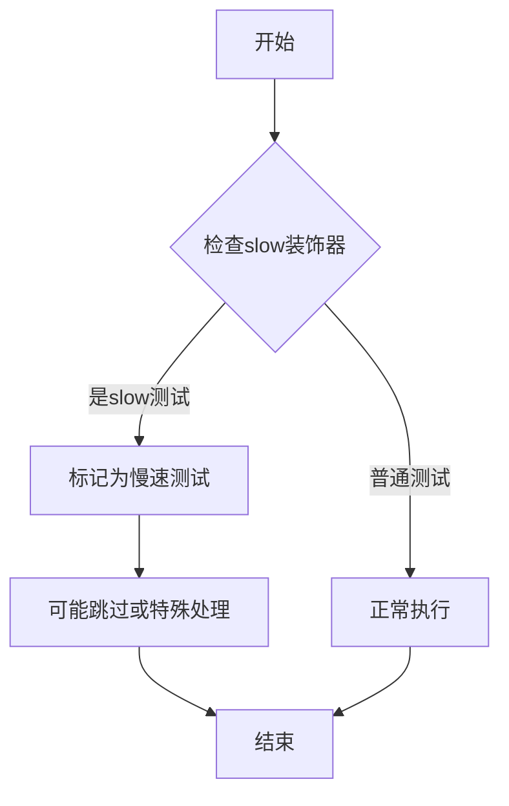

#### 带注释源码

```
# slow 是从 testing_utils 导入的装饰器
# 位置: from ...testing_utils import slow
# 用途: 标记测试类为慢速测试

@slow  # 装饰器应用
class PriorTransformerIntegrationTests(unittest.TestCase):
    # 此类被标记为慢速测试
    # 通常表示需要加载大型预训练模型（如kandinsky-2-1-prior）
    # 执行时间较长，可能需要特殊处理（如CI中的单独job）
    
    def get_dummy_seed_input(self, ...):
        # 生成测试输入数据
        ...
    
    def test_kandinsky_prior(self, seed, expected_slice):
        # 实际执行模型推理的测试方法
        ...
```

> **注意**：由于 `slow` 函数定义在 `testing_utils` 模块中（未在当前代码文件中提供），以上信息基于其使用方式和常见测试框架模式推断。实际的 `slow` 函数实现需要查看 `testing_utils` 模块源码。


### `parameterized.expand`

`parameterized.expand` 是 `parameterized` 库中的一个装饰器函数，用于为测试方法生成多个参数化测试用例。它接受一个包含多组参数的列表，每组参数将作为独立的测试用例执行被装饰的测试方法。

参数：

- `parameterized_list`：`List[List]` 或 `List[Tuple]`，参数列表，每个元素是一组测试参数，用于传递给被装饰的测试方法

返回值：`Callable`，返回一个装饰器函数，用于装饰测试方法并生成多个测试用例

#### 流程图

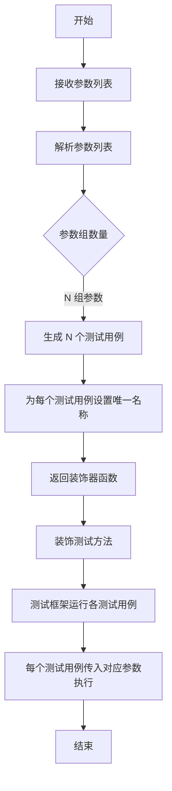

#### 带注释源码

```python
@parameterized.expand(
    [
        # 参数列表：每组参数 [seed, expected_slice] 对应一个测试用例
        # 测试用例1: seed=13, 期望输出切片为 [-0.5861, 0.1283, -0.0931, 0.0882, 0.4476, 0.1329, -0.0498, 0.0640]
        [13, [-0.5861, 0.1283, -0.0931, 0.0882, 0.4476, 0.1329, -0.0498, 0.0640]],
        # 测试用例2: seed=37, 期望输出切片为 [-0.4913, 0.0110, -0.0483, 0.0541, 0.4954, -0.0170, 0.0354, 0.1651]
        [37, [-0.4913, 0.0110, -0.0483, 0.0541, 0.4954, -0.0170, 0.0354, 0.1651]],
    ]
)
def test_kandinsky_prior(self, seed, expected_slice):
    """
    测试 Kandinsky Prior 模型在不同随机种子下的输出一致性
    
    参数:
        seed: int, 随机种子用于生成输入数据
        expected_slice: List[float], 期望的输出切片用于验证模型正确性
    
    返回:
        无返回值，测试框架自动验证
    """
    # 从预训练模型加载 PriorTransformer
    model = PriorTransformer.from_pretrained("kandinsky-community/kandinsky-2-1-prior", subfolder="prior")
    # 将模型移动到指定设备（CPU/GPU）
    model.to(torch_device)
    # 使用指定种子生成dummy输入
    input = self.get_dummy_seed_input(seed=seed)

    # 禁用梯度计算以提高推理效率
    with torch.no_grad():
        # 前向传播获取模型输出
        sample = model(**input)[0]

    # 验证输出形状为 [1, 768]
    assert list(sample.shape) == [1, 768]

    # 提取输出切片用于比较
    output_slice = sample[0, :8].flatten().cpu()
    # 将期望输出转换为张量
    expected_output_slice = torch.tensor(expected_slice)

    # 验证输出与期望值的近似程度（容差 1e-3）
    assert torch_all_close(output_slice, expected_output_slice, atol=1e-3)
```


### `PriorTransformerTests.dummy_input`

该方法是一个 `@property` 装饰的属性方法，用于生成 PriorTransformer 模型的测试虚拟输入数据。它创建包含 `hidden_states`、`timestep`、`proj_embedding` 和 `encoder_hidden_states` 的字典，作为模型的测试输入参数。

参数：
- （无参数，这是一个属性方法）

返回值：`dict`，包含以下键值对：
- `hidden_states`：`torch.Tensor`，形状为 (batch_size, embedding_dim)，即 (4, 8)，表示输入的隐藏状态
- `timestep`：`int`，值为 2，表示扩散过程的时间步
- `proj_embedding`：`torch.Tensor`，形状为 (batch_size, embedding_dim)，即 (4, 8)，表示投影后的嵌入向量
- `encoder_hidden_states`：`torch.Tensor`，形状为 (batch_size, num_embeddings, embedding_dim)，即 (4, 7, 8)，表示编码器的隐藏状态序列

#### 流程图

```mermaid
flowchart TD
    A[开始] --> B[设置batch_size=4, embedding_dim=8, num_embeddings=7]
    B --> C[使用floats_tensor生成hidden_states: (4, 8)]
    C --> D[使用floats_tensor生成proj_embedding: (4, 8)]
    D --> E[使用floats_tensor生成encoder_hidden_states: (4, 7, 8)]
    E --> F[构建返回字典包含4个键值对]
    F --> G[返回字典对象]
    G --> H[结束]
```

#### 带注释源码

```python
@property
def dummy_input(self):
    """生成PriorTransformer的测试虚拟输入数据"""
    # 批大小
    batch_size = 4
    # 嵌入维度
    embedding_dim = 8
    # 嵌入数量
    num_embeddings = 7

    # 生成随机浮点张量作为隐藏状态，形状为 (batch_size, embedding_dim)
    hidden_states = floats_tensor((batch_size, embedding_dim)).to(torch_device)

    # 生成随机浮点张量作为投影嵌入，形状为 (batch_size, embedding_dim)
    proj_embedding = floats_tensor((batch_size, embedding_dim)).to(torch_device)
    # 生成随机浮点张量作为编码器隐藏状态，形状为 (batch_size, num_embeddings, embedding_dim)
    encoder_hidden_states = floats_tensor((batch_size, num_embeddings, embedding_dim)).to(torch_device)

    # 返回包含所有输入参数的字典，用于模型前向传播
    return {
        "hidden_states": hidden_states,
        "timestep": 2,
        "proj_embedding": proj_embedding,
        "encoder_hidden_states": encoder_hidden_states,
    }
```


### `PriorTransformerTests.get_dummy_seed_input`

该方法用于生成具有确定性随机性的测试输入数据，通过设置随机种子确保测试结果的可重复性，常用于单元测试中获取一致的输入样本。

参数：

- `self`：`PriorTransformerTests`，隐式的测试类实例参数，表示当前测试类的上下文
- `seed`：`int`，可选参数，默认值为 `0`，用于设置 PyTorch 随机种子以确保生成一致的随机数据

返回值：`Dict[str, torch.Tensor]`，返回一个包含测试所需输入数据的字典，包含 `hidden_states`、`timestep`、`proj_embedding` 和 `encoder_hidden_states` 四个键值对

#### 流程图

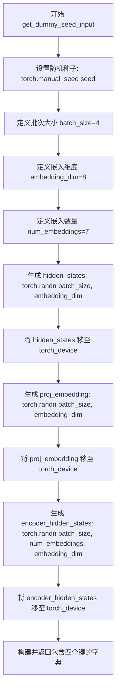

#### 带注释源码

```python
def get_dummy_seed_input(self, seed=0):
    """
    生成用于测试的确定性随机输入数据
    
    参数:
        seed: int, 用于设置随机种子的整数值, 默认为0
              相同seed值会生成相同的随机数序列, 确保测试可重复
    
    返回:
        dict: 包含以下键的字典:
            - hidden_states: torch.Tensor, 形状为 (batch_size, embedding_dim) 的随机隐藏状态
            - timestep: int, 时间步长, 固定值为2
            - proj_embedding: torch.Tensor, 形状为 (batch_size, embedding_dim) 的投影嵌入
            - encoder_hidden_states: torch.Tensor, 形状为 (batch_size, num_embeddings, embedding_dim) 的编码器隐藏状态
    """
    # 设置PyTorch全局随机种子，确保生成的随机数可预测
    torch.manual_seed(seed)
    
    # 定义测试数据的超参数
    batch_size = 4        # 批次大小
    embedding_dim = 8     # 嵌入维度
    num_embeddings = 7    # 嵌入数量
    
    # 生成随机隐藏状态张量并移至指定设备
    # 形状: (batch_size, embedding_dim)
    hidden_states = torch.randn((batch_size, embedding_dim)).to(torch_device)
    
    # 生成随机投影嵌入张量并移至指定设备
    # 形状: (batch_size, embedding_dim)
    proj_embedding = torch.randn((batch_size, embedding_dim)).to(torch_device)
    
    # 生成随机编码器隐藏状态张量并移至指定设备
    # 形状: (batch_size, num_embeddings, embedding_dim)
    encoder_hidden_states = torch.randn((batch_size, num_embeddings, embedding_dim)).to(torch_device)
    
    # 返回包含所有输入的字典，用于模型前向传播
    return {
        "hidden_states": hidden_states,
        "timestep": 2,
        "proj_embedding": proj_embedding,
        "encoder_hidden_states": encoder_hidden_states,
    }
```


### `PriorTransformerTests.input_shape`

该属性定义了 PriorTransformer 模型测试的输入形状，返回一个包含批量大小和嵌入维度的元组，用于测试用例的输入数据配置。

参数：

- 无（仅包含隐式的 `self` 参数，指向测试类实例）

返回值：`Tuple[int, int]`，返回输入张量的形状元组 (batch_size, embedding_dim)，其中 batch_size=4, embedding_dim=8，用于指定测试输入 hidden_states 的维度。

#### 流程图

```mermaid
flowchart TD
    A[开始] --> B{调用 input_shape 属性}
    B --> C[返回元组 (4, 8)]
    C --> D[结束]
    
    style A fill:#f9f,color:#000
    style D fill:#9f9,color:#000
```

#### 带注释源码

```python
@property
def input_shape(self):
    """
    定义测试输入的形状属性。
    
    Returns:
        tuple: 包含两个整数的元组，表示 (batch_size, embedding_dim)。
               - 第一个值 4 表示批量大小 (batch_size)
               - 第二个值 8 表示嵌入维度 (embedding_dim)
    """
    return (4, 8)
```


### `PriorTransformerTests.output_shape`

该属性定义了 PriorTransformer 模型输出张量的形状，返回一个元组表示批量大小和嵌入维度。

参数：无（属性不接受任何参数）

返回值：`tuple`，返回模型输出张量的预期形状，值为 `(4, 8)`，其中 4 表示批量大小（batch_size），8 表示嵌入维度（embedding_dim）。

#### 流程图

```mermaid
flowchart TD
    A[访问 output_shape 属性] --> B{返回形状元组}
    B --> C[返回 (4, 8)]
    
    style A fill:#e1f5fe
    style B fill:#fff3e0
    style C fill:#e8f5e9
```

#### 带注释源码

```python
@property
def output_shape(self):
    """
    属性：定义模型输出张量的预期形状
    
    该属性返回一个元组，表示 PriorTransformer 模型在给定输入下的
    输出张量维度。第一个元素表示批量大小（batch_size），第二个元素
    表示嵌入维度（embedding_dim）。
    
    Returns:
        tuple: 包含两个整数的元组 (batch_size, embedding_dim)
               - batch_size: 4，表示处理4个样本的批次
               - embedding_dim: 8，表示输出嵌入维度为8
    """
    return (4, 8)
```


### `PriorTransformerTests.prepare_init_args_and_inputs_for_common`

该方法为 `PriorTransformer` 模型测试准备通用的初始化参数和输入数据，返回一个包含模型初始化配置字典和输入字典的元组，供其他测试方法使用。

参数：

- `self`：`PriorTransformerTests` 实例本身，隐含参数，无需显式传入

返回值：`Tuple[Dict[str, int], Dict[str, Union[torch.Tensor, int]]]`，返回包含初始化参数字典和输入数据字典的元组

- `init_dict`：字典，包含初始化 `PriorTransformer` 所需的配置参数
- `inputs_dict`：字典，包含模型前向传播所需的输入数据

#### 流程图

```mermaid
flowchart TD
    A[开始 prepare_init_args_and_inputs_for_common] --> B[创建 init_dict 字典]
    B --> C[设置 num_attention_heads: 2]
    C --> D[设置 attention_head_dim: 4]
    D --> E[设置 num_layers: 2]
    E --> F[设置 embedding_dim: 8]
    F --> G[设置 num_embeddings: 7]
    G --> H[设置 additional_embeddings: 4]
    H --> I[调用 self.dummy_input 获取 inputs_dict]
    I --> J[返回 (init_dict, inputs_dict) 元组]
    J --> K[结束]
```

#### 带注释源码

```python
def prepare_init_args_and_inputs_for_common(self):
    """
    准备用于通用测试的初始化参数和输入数据。
    
    该方法为 PriorTransformer 模型创建标准的初始化配置和输入数据，
    供类中其他测试方法使用，确保测试参数的一致性。
    """
    
    # 定义模型初始化参数字典
    # 包含 Transformer 模型的关键架构参数
    init_dict = {
        "num_attention_heads": 2,        # 注意力头的数量
        "attention_head_dim": 4,        # 每个注意力头的维度
        "num_layers": 2,                # Transformer 层数
        "embedding_dim": 8,             # 嵌入维度
        "num_embeddings": 7,            # 嵌入数量/词表大小
        "additional_embeddings": 4,      # 额外的嵌入数量
    }
    
    # 从测试类获取预定义的虚拟输入
    # dummy_input 属性在类中定义为返回标准的测试输入张量
    inputs_dict = self.dummy_input
    
    # 返回初始化参数字典和输入字典的元组
    # 格式: (init_dict, inputs_dict)
    return init_dict, inputs_dict
```


### `PriorTransformerTests.test_from_pretrained_hub`

该测试方法验证 PriorTransformer 类能够从 HuggingFace Hub 成功加载预训练模型，并确保模型可以正确执行前向传播且输出非空。

参数：
- 该方法无显式参数（`self` 为隐含参数）

返回值：`None`，因为该方法为单元测试方法，使用断言进行验证，不返回任何值。

#### 流程图

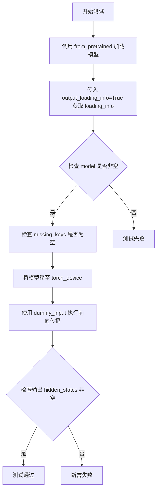

#### 带注释源码

```python
def test_from_pretrained_hub(self):
    """
    测试从 HuggingFace Hub 加载预训练 PriorTransformer 模型的功能。
    
    验证点：
    1. 模型能够成功从预训练路径加载
    2. 加载信息中没有缺失的键
    3. 模型可以在指定设备上执行前向传播
    4. 前向传播输出非空
    """
    # 从 HuggingFace Hub 加载预训练模型，同时获取加载信息
    # "hf-internal-testing/prior-dummy" 是一个测试用的虚拟模型路径
    model, loading_info = PriorTransformer.from_pretrained(
        "hf-internal-testing/prior-dummy", output_loading_info=True
    )
    
    # 断言模型对象非空，确保加载成功
    self.assertIsNotNone(model)
    
    # 验证加载信息中没有任何缺失的键（即模型完整加载）
    self.assertEqual(len(loading_info["missing_keys"]), 0)

    # 将模型移动到指定的计算设备（如 CUDA 或 CPU）
    model.to(torch_device)
    
    # 使用虚拟输入执行模型的前向传播
    # self.dummy_input 包含:
    #   - hidden_states: (batch_size=4, embedding_dim=8)
    #   - timestep: 2
    #   - proj_embedding: (batch_size=4, embedding_dim=8)
    #   - encoder_hidden_states: (batch_size=4, num_embeddings=7, embedding_dim=8)
    # model(**self.dummy_input) 返回元组，取第一个元素为 hidden_states 输出
    hidden_states = model(**self.dummy_input)[0]

    # 断言输出不为 None，确保模型产生了有效的输出
    assert hidden_states is not None, "Make sure output is not None"
```


### `PriorTransformerTests.test_forward_signature`

该测试方法用于验证 `PriorTransformer` 模型的前向传播函数（forward method）的签名，确保其前两个参数名称分别为 `hidden_states` 和 `timestep`，以确保 API 的一致性和预期的参数顺序。

参数：

- `self`：`PriorTransformerTests`，测试类实例本身，包含测试所需的上下文和辅助方法

返回值：`None`，该方法为测试方法，无返回值，通过断言验证参数名称是否符合预期

#### 流程图

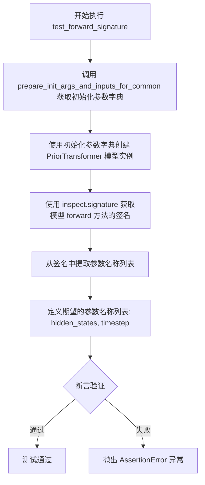

#### 带注释源码

```python
def test_forward_signature(self):
    """
    测试 PriorTransformer 模型的 forward 方法签名是否符合预期。
    
    该测试验证模型的前向传播方法的前两个参数名称是否为
    'hidden_states' 和 'timestep'，以确保 API 设计的一致性。
    """
    # 获取模型初始化参数和输入数据的字典
    init_dict, _ = self.prepare_init_args_and_inputs_for_common()

    # 使用初始化参数字典创建 PriorTransformer 模型实例
    model = self.model_class(**init_dict)
    
    # 使用 inspect 模块获取模型 forward 方法的函数签名
    signature = inspect.signature(model.forward)
    
    # signature.parameters 是一个 OrderedDict，按参数定义顺序存储
    # 因此 arg_names 的顺序是确定的
    # 提取所有参数名称
    arg_names = [*signature.parameters.keys()]

    # 定义期望的参数名称列表，前两个参数应为 hidden_states 和 timestep
    expected_arg_names = ["hidden_states", "timestep"]
    
    # 断言验证前两个参数名称是否与期望一致
    self.assertListEqual(arg_names[:2], expected_arg_names)
```


### `PriorTransformerTests.test_output_pretrained`

该测试方法用于验证 PriorTransformer 从预训练模型加载后的前向传播输出是否与预期结果一致，确保模型在给定随机种子输入下能产生稳定的输出。

参数：

- `self`：`PriorTransformerTests`，测试类的实例方法，用于访问类属性和辅助方法

返回值：`None`，该方法为测试用例，无显式返回值（unittest.TestCase 的测试方法）

#### 流程图

```mermaid
flowchart TD
    A[开始测试] --> B[从预训练模型加载PriorTransformer]
    B --> C[将模型移动到torch_device]
    C --> D{模型是否有set_default_attn_processor方法}
    D -->|是| E[调用set_default_attn_processor设置默认注意力处理器]
    D -->|否| F[跳过此步骤]
    E --> G
    F --> G
    G[调用get_dummy_seed_input获取随机种子输入] --> H[使用torch.no_grad禁用梯度计算]
    H --> I[执行模型前向传播: model\*\*input]
    I --> J[提取输出第一个元素: output[0]]
    J --> K[切片取前5个元素并展平: output[0, :5].flatten()]
    K --> L[将结果移到CPU: .cpu]
    L --> M[定义期望输出张量: expected_output_slice]
    M --> N{使用torch_all_close比较输出与期望值}
    N -->|通过| O[测试通过]
    N -->|失败| P[测试失败抛出异常]
```

#### 带注释源码

```python
def test_output_pretrained(self):
    """
    测试 PriorTransformer 预训练模型的前向传播输出是否与预期一致。
    该测试验证模型在特定随机种子下的输出稳定性。
    """
    # 步骤1: 从预训练模型加载 PriorTransformer
    # 使用 HuggingFace Hub 上的 'hf-internal-testing/prior-dummy' 预训练权重
    model = PriorTransformer.from_pretrained("hf-internal-testing/prior-dummy")
    
    # 步骤2: 将模型移动到指定的计算设备（CPU/GPU）
    model = model.to(torch_device)
    
    # 步骤3: 检查模型是否有 set_default_attn_processor 方法
    # 如果有，调用该方法设置默认的注意力处理器，确保注意力计算的一致性
    if hasattr(model, "set_default_attn_processor"):
        model.set_default_attn_processor()
    
    # 步骤4: 获取使用固定随机种子的测试输入
    # 使用 get_dummy_seed_input 方法生成确定性的随机输入
    input = self.get_dummy_seed_input()
    
    # 步骤5: 在 no_grad 模式下执行前向传播，节省显存和计算资源
    # model(**input) 返回一个元组，取第一个元素得到实际输出张量
    with torch.no_grad():
        output = model(**input)[0]
    
    # 步骤6: 提取输出的一部分用于验证
    # 取第一个样本的前5个元素并展平为一维张量，然后移到CPU
    output_slice = output[0, :5].flatten().cpu()
    
    # 步骤7: 定义期望的输出张量
    # 由于 VAE Gaussian prior 的生成器在相应设备上是有种子的
    # CPU 和 GPU 的期望输出切片是不同的，此处使用 CPU 环境的预期值
    expected_output_slice = torch.tensor([-1.3436, -0.2870, 0.7538, 0.4368, -0.0239])
    
    # 步骤8: 断言输出与期望值在给定相对误差容限内接近
    # 使用 rtol=1e-2 (1% 的相对误差) 进行比较
    self.assertTrue(torch_all_close(output_slice, expected_output_slice, rtol=1e-2))
```


### `PriorTransformerIntegrationTests.get_dummy_seed_input`

生成用于测试的随机种子输入数据，用于PriorTransformer模型的集成测试。通过设置随机种子确保测试的可重复性，并生成符合模型输入格式要求的张量字典。

参数：

- `self`：`unittest.TestCase`，测试类的实例对象
- `batch_size`：`int`，批量大小，默认值为1，表示输入的样本数量
- `embedding_dim`：`int`，嵌入维度，默认值为768，对应模型的隐藏层维度
- `num_embeddings`：`int`，嵌入数量，默认值为77，表示条件嵌入的数量
- `seed`：`int`，随机种子，默认值为0，用于控制随机数生成的可重复性

返回值：`Dict[str, Union[torch.Tensor, int]]`，返回包含模型输入的字典，包含以下键值：
  - `hidden_states`：torch.Tensor，形状为 (batch_size, embedding_dim) 的随机初始隐藏状态
  - `timestep`：int，值为2，表示扩散过程中的时间步
  - `proj_embedding`：torch.Tensor，形状为 (batch_size, embedding_dim) 的投影嵌入向量
  - `encoder_hidden_states`：torch.Tensor，形状为 (batch_size, num_embeddings, embedding_dim) 的编码器隐藏状态

#### 流程图

```mermaid
flowchart TD
    A[开始 get_dummy_seed_input] --> B[设置随机种子: torch.manual_seed(seed)]
    B --> C[生成 hidden_states: torch.randn(batch_size, embedding_dim)]
    C --> D[生成 proj_embedding: torch.randn(batch_size, embedding_dim)]
    D --> E[生成 encoder_hidden_states: torch.randn(batch_size, num_embeddings, embedding_dim)]
    E --> F[构建并返回输入字典]
    F --> G[包含 hidden_states, timestep=2, proj_embedding, encoder_hidden_states]
    G --> H[结束]
```

#### 带注释源码

```python
def get_dummy_seed_input(self, batch_size=1, embedding_dim=768, num_embeddings=77, seed=0):
    """
    生成用于PriorTransformer集成测试的随机种子输入数据
    
    参数:
        self: 测试类实例
        batch_size: 批量大小，默认为1
        embedding_dim: 嵌入维度，默认为768（与真实模型一致）
        num_embeddings: 嵌入数量，默认为77
        seed: 随机种子，确保测试结果可重复
    
    返回:
        dict: 包含模型输入的字典
    """
    # 设置PyTorch随机种子，确保生成的随机数可预测
    torch.manual_seed(seed)
    
    # 生成随机隐藏状态张量，形状为 (batch_size, embedding_dim)
    # 这是PriorTransformer的主要输入，表示当前的去噪状态
    hidden_states = torch.randn((batch_size, embedding_dim)).to(torch_device)
    
    # 生成随机投影嵌入向量，形状为 (batch_size, embedding_dim)
    # 这是额外的上下文嵌入，用于引导生成过程
    proj_embedding = torch.randn((batch_size, embedding_dim)).to(torch_device)
    
    # 生成随机编码器隐藏状态，形状为 (batch_size, num_embeddings, embedding_dim)
    # 这是来自文本编码器的条件嵌入，用于文本到图像的生成
    encoder_hidden_states = torch.randn((batch_size, num_embeddings, embedding_dim)).to(torch_device)
    
    # 返回符合模型forward方法签名的输入字典
    return {
        "hidden_states": hidden_states,      # 主输入：当前隐藏状态
        "timestep": 2,                        # 时间步：扩散过程中的时间点
        "proj_embedding": proj_embedding,     # 投影嵌入：辅助条件信息
        "encoder_hidden_states": encoder_hidden_states,  # 编码器状态：文本条件
    }
```


### `PriorTransformerIntegrationTests.tearDown`

该方法是一个测试清理函数（tearDown），在每个集成测试用例执行完毕后自动调用，用于释放GPU显存资源，防止内存泄漏。

参数：

- `self`：`unittest.TestCase`，测试类实例本身，隐式参数

返回值：`None`，无返回值

#### 流程图

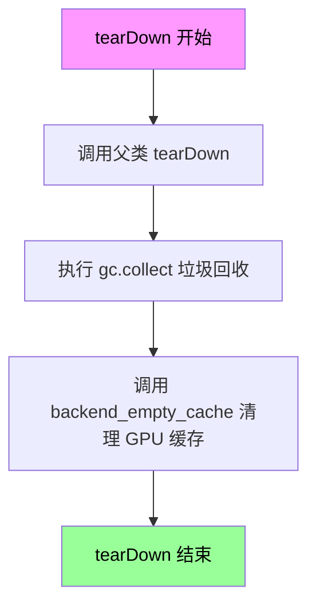

#### 带注释源码

```python
def tearDown(self):
    """
    测试用例执行完成后的清理方法
    
    该方法在每个集成测试结束后自动调用，主要用于：
    1. 调用父类的 tearDown 方法，确保父类资源被正确释放
    2. 执行 Python 垃圾回收，释放不再使用的对象
    3. 调用后端特定的缓存清空函数，释放 GPU/显存资源
    """
    # 清理前先调用父类的 tearDown，确保父类资源正确释放
    super().tearDown()
    
    # 手动触发 Python 垃圾回收，回收已删除对象的内存
    gc.collect()
    
    # 调用后端特定的缓存清空函数，释放 GPU VRAM
    # torch_device 定义在 testing_utils 中，通常是 'cuda' 或 'cpu'
    backend_empty_cache(torch_device)
```


### `PriorTransformerIntegrationTests.test_kandinsky_prior`

该方法是一个集成测试用例，用于验证 PriorTransformer 模型在加载 kandinsky-2-1-prior 预训练权重后的前向传播是否产生正确的输出，通过比对模型输出的前8个值与期望的数值切片来确保模型的数学一致性。

参数：

- `self`：`PriorTransformerIntegrationTests`，测试类实例本身
- `seed`：`int`，随机种子，用于生成输入张量的随机初始化
- `expected_slice`：`list`，期望的输出数值切片，用于与实际输出进行比对验证

返回值：`None`，该方法为测试用例，通过断言进行验证，不返回任何值

#### 流程图

```mermaid
flowchart TD
    A[开始测试] --> B[从HuggingFace加载kandinsky-2-1-prior预训练模型]
    B --> C[将模型移动到torch_device]
    C --> D[调用get_dummy_seed_input生成随机输入]
    D --> E[使用torch.no_grad禁用梯度计算]
    E --> F[执行模型前向传播]
    F --> G[提取模型输出sample]
    G --> H{断言输出形状是否为[1, 768]}
    H -->|是| I[提取输出前8个元素并展平]
    I --> J[将expected_slice转换为torch.tensor]
    J --> K{断言torch_all_close输出与期望值}
    K -->|通过| L[测试通过]
    K -->|失败| M[抛出断言错误]
    H -->|否| N[抛出断言错误]
```

#### 带注释源码

```python
@parameterized.expand(
    [
        # fmt: off
        # 参数化测试：两套不同的随机种子和期望输出
        [13, [-0.5861, 0.1283, -0.0931, 0.0882, 0.4476, 0.1329, -0.0498, 0.0640]],
        [37, [-0.4913, 0.0110, -0.0483, 0.0541, 0.4954, -0.0170, 0.0354, 0.1651]],
        # fmt: on
    ]
)
def test_kandinsky_prior(self, seed, expected_slice):
    """
    集成测试：验证PriorTransformer在kandinsky-2-1-prior预训练权重下的前向传播正确性
    
    Args:
        seed: 随机种子，用于生成确定性输入
        expected_slice: 期望的输出数值切片，用于结果验证
    """
    # 从HuggingFace Hub加载kandinsky-community的kandinsky-2-1-prior模型
    # subfolder="prior"指定加载prior子目录中的权重
    model = PriorTransformer.from_pretrained("kandinsky-community/kandinsky-2-1-prior", subfolder="prior")
    
    # 将模型移动到指定的计算设备（CPU/GPU）
    model.to(torch_device)
    
    # 使用给定的随机种子生成测试输入
    input = self.get_dummy_seed_input(seed=seed)

    # 禁用梯度计算，节省内存并加速推理
    with torch.no_grad():
        # 执行模型前向传播，传入输入字典
        # 返回值为元组，取第一个元素作为sample
        sample = model(**input)[0]

    # 断言验证：确保输出形状为[1, 768]
    # batch_size=1, embedding_dim=768
    assert list(sample.shape) == [1, 768]

    # 提取输出第一个样本的前8个元素并展平为1D张量
    # 转换到CPU进行后续比较
    output_slice = sample[0, :8].flatten().cpu()
    
    # 将期望的numpy列表转换为torch.tensor
    expected_output_slice = torch.tensor(expected_slice)

    # 断言验证：使用torch_all_close比较输出与期望值
    # atol=1e-3指定绝对容差为0.001
    assert torch_all_close(output_slice, expected_output_slice, atol=1e-3)
```

## 关键组件


### PriorTransformer 模型测试

这是对 diffusers 库中 PriorTransformer 模型的单元测试和集成测试代码，用于验证模型的前向传播、加载、输出正确性等核心功能。

### 测试框架与基础设施

使用 unittest 框架和 ModelTesterMixin 混合类，提供标准化的模型测试方法，包括参数检查、梯度计算、模型加载等功能。

### 虚拟输入生成器

通过 floats_tensor 和 torch.randn 生成符合模型输入维度的虚拟数据，包括 hidden_states、timestep、proj_embedding、encoder_hidden_states，用于模型的前向传播测试。

### 模型加载器

使用 from_pretrained 方法从 HuggingFace Hub 加载预训练模型，支持 output_loading_info=True 以获取加载信息，支持自定义子文件夹路径。

### 前向传播测试

验证模型的 forward 方法签名和输出维度，确保 hidden_states 和 timestep 是主要输入参数，并检查输出的形状和数值正确性。

### 集成测试

使用 @slow 装饰器标记的慢速测试，从真实预训练模型（kandinsky-community/kandinsky-2-1-prior）加载并验证模型输出的数值精度。

### GPU 内存管理

在 tearDown 方法中调用 gc.collect() 和 backend_empty_cache() 清理 GPU 内存，确保测试间的内存隔离。

### 参数化测试

使用 @parameterized.expand 装饰器对多个随机种子进行测试，验证模型在不同随机状态下的输出一致性。

### 设备兼容性

使用 torch_device 变量确保测试在不同设备（CPU/GPU）上运行，通过 to(torch_device) 移动张量。

### 确定性控制

通过 enable_full_determinism() 启用完全确定性模式，便于复现测试结果。


## 问题及建议


### 已知问题

- **资源清理不一致**：`PriorTransformerTests` 类没有重写 `tearDown` 方法来清理 GPU 显存，而 `PriorTransformerIntegrationTests` 有完整的资源清理逻辑，可能导致单元测试运行后显存未释放
- **硬编码的预期输出值**：`test_output_pretrained` 和 `test_kandinsky_prior` 中硬编码了浮点数数组（如 `expected_output_slice = torch.tensor([-1.3436, -0.2870, ...])`），这些值与模型实现强耦合，一旦模型内部实现变化测试会失败
- **测试数据生成重复**：`dummy_input` 属性和 `get_dummy_seed_input` 方法功能几乎完全相同，使用了不同的随机生成方式（`floats_tensor` vs `torch.randn`），代码冗余
- **外部网络依赖**：`test_from_pretrained_hub`、`test_output_pretrained` 和 `test_kandinsky_prior` 直接从 HuggingFace Hub 加载模型（"hf-internal-testing/prior-dummy"、"kandinsky-community/kandinsky-2-1-prior"），测试依赖网络连接且受远程模型可用性影响
- **魔法数字缺乏说明**：`timestep=2`、`batch_size=4`、`embedding_dim=8`、`num_embeddings=7` 等数值在代码中直接使用，没有注释说明其含义或选择依据
- **边界条件测试缺失**：没有针对 `hidden_states` 维度异常、负值 timestep、非法的 `encoder_hidden_states` 形状等边界情况的测试
- **测试输出形状属性冗余**：`input_shape` 和 `output_shape` 属性返回完全相同的值 (4, 8)，这在设计上可能是错误的或者属性定义不完整
- **断言风格不统一**：部分地方使用 `assert` 语句（如 `assert hidden_states is not None`），部分使用 `self.assertTrue`/`self.assertEqual`，后者更符合 unittest 框架规范

### 优化建议

- 在 `PriorTransformerTests` 中添加 `tearDown` 方法进行显存清理，保持与集成测试的一致性
- 将硬编码的预期输出值提取为测试类的常量或配置文件，并添加注释说明这些值的来源和用途
- 统一随机数据生成方式，合并 `dummy_input` 和 `get_dummy_seed_input` 为一个通用方法
- 考虑使用本地 mock 模型或 fixture 来替代远程加载，减少网络依赖和提高测试稳定性
- 为关键数值添加类型注解和注释，或将其定义为类/模块级别的配置常量
- 增加边界条件和异常输入的测试用例，提高测试覆盖率
- 检查并修正 `input_shape` 和 `output_shape` 属性的实现逻辑
- 统一使用 unittest 框架的断言方法替代裸 `assert` 语句

## 其它


### 设计目标与约束

测试代码的设计目标是为 PriorTransformer 模型提供全面的单元测试和集成测试覆盖，确保模型在前向传播、参数加载、输出一致性等功能上的正确性。约束条件包括：测试必须支持 CPU 和 GPU 设备（通过 torch_device），需要保持结果的可重复性（通过 enable_full_determinism），集成测试标记为 @slow 以区分快速单元测试和耗时测试。

### 错误处理与异常设计

测试代码主要通过 assert 语句进行断言验证。关键断言包括：model 不为 None、loading_info["missing_keys"] 长度为 0、输出不为 None、输出形状符合预期（[1, 768]）、输出值与期望值的接近度验证（torch_all_close）。当断言失败时，unittest 框架会自动捕获并报告错误信息。集成测试中包含 try-except 结构的资源清理（tearDown 方法），确保 GPU 内存正确释放。

### 数据流与状态机

测试数据流从 dummy_input 或 get_dummy_seed_input 方法生成测试输入开始，经过模型前向传播（model(**input)），输出结果张量。状态机方面：单元测试使用固定种子和已知维度进行确定性测试；集成测试使用不同种子（13、37）验证模型在不同随机条件下的输出一致性。每个测试方法相互独立，共享 setup/tearDown 生命周期管理状态。

### 外部依赖与接口契约

主要外部依赖包括：torch（PyTorch 框架）、unittest（Python 标准测试框架）、parameterized（参数化测试装饰器）、diffusers 库中的 PriorTransformer 模型和 ModelTesterMixin 测试基类、testing_utils 中的辅助函数（backend_empty_cache、enable_full_determinism、floats_tensor、slow、torch_all_close、torch_device）。接口契约方面：模型必须实现 from_pretrained 方法支持远程加载、forward 方法接受 hidden_states、timestep、proj_embedding、encoder_hidden_states 参数并返回元组（输出张量，...）。

### 性能考虑与基准测试

单元测试设计为快速执行，使用小批次（batch_size=4）、小维度（embedding_dim=8、num_embeddings=7）以加快测试速度。集成测试标记 @slow，使用实际模型（kandinsky-2-1-prior）和更大维度（embedding_dim=768、num_embeddings=77）进行性能验证。tearDown 方法中调用 gc.collect() 和 backend_empty_cache() 清理 GPU 内存，防止测试间内存泄漏。

### 安全考虑

测试代码本身为纯函数式测试，无直接安全风险。潜在安全考虑包括：from_pretrained 可能从 HuggingFace Hub 下载模型文件，应验证来源可信（使用 hf-internal-testing 和 kandinsky-community 等官方/社区仓库）。测试不涉及用户数据处理，仅使用随机生成的张量。

### 版本兼容性

代码指定编码为 UTF-8，版权声明适用于 Apache License 2.0。依赖版本由项目环境管理，需要 Python 3.x、torch、diffusers、parameterized 等兼容版本。测试针对特定 diffusers API 设计（PriorTransformer.from_pretrained、set_default_attn_processor），需确保 diffusers 版本支持这些接口。

### 测试覆盖率

当前测试覆盖：模型加载（test_from_pretrained_hub）、前向传播签名验证（test_forward_signature）、输出数值正确性（test_output_pretrained）、集成测试多种子验证（test_kandinsky_prior）。未覆盖场景：梯度计算测试、模型保存/序列化测试、多设备迁移测试、异常输入边界测试、模型推理性能基准测试。

### 部署相关

此测试代码不直接涉及生产部署，但为 CI/CD 流程提供质量保障。建议部署配置：运行单元测试作为 PR 合并前置条件（快速反馈），集成测试作为定期回归测试（在专属 CI runner 上执行，因 @slow 标记）。测试结果应集成到 CI 仪表板监控模型质量趋势。

    