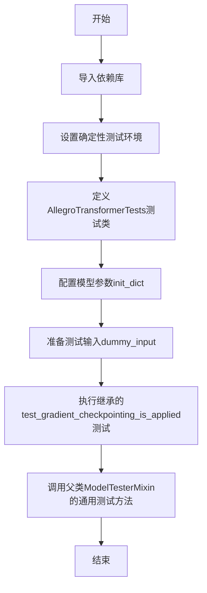
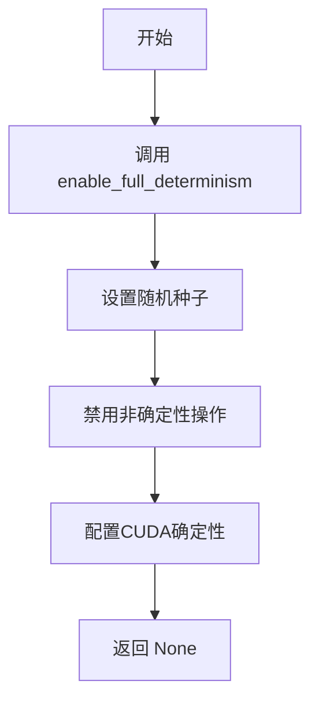
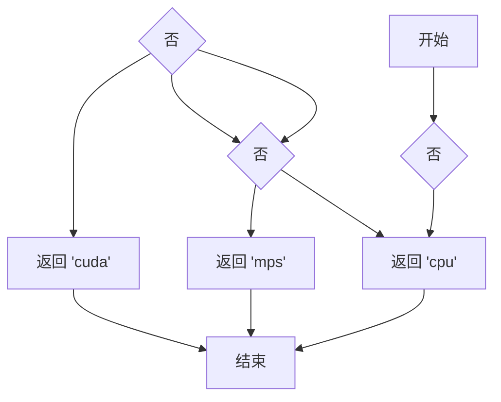
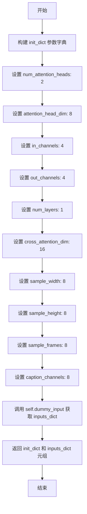

# `diffusers\tests\models\transformers\test_models_transformer_allegro.py` 详细设计文档

这是HuggingFace diffusers库的单元测试文件，用于测试AllegroTransformer3DModel（3D变压器模型）的功能，包括模型初始化、前向传播、梯度检查点等通用模型测试项。

## 整体流程



## 类结构

```
unittest.TestCase
└── AllegroTransformerTests (继承ModelTesterMixin)
    - model_class: AllegroTransformer3DModel
    - main_input_name: hidden_states
    - uses_custom_attn_processor: True
```

## 全局变量及字段


### `AllegroTransformer3DModel`
    
从diffusers导入的待测3D变换器模型类

类型：`class`
    


### `enable_full_determinism`
    
启用完全确定性测试的辅助函数

类型：`function`
    


### `torch_device`
    
测试设备配置变量，指定运行设备

类型：`str`
    


### `ModelTesterMixin`
    
模型测试混入类，提供通用模型测试方法

类型：`class`
    


### `AllegroTransformerTests.model_class`
    
指定要测试的模型类AllegroTransformer3DModel

类型：`class`
    


### `AllegroTransformerTests.main_input_name`
    
模型主输入名称，此处为hidden_states

类型：`str`
    


### `AllegroTransformerTests.uses_custom_attn_processor`
    
标识是否使用自定义注意力处理器

类型：`bool`
    
    

## 全局函数及方法


### `enable_full_determinism`

该函数用于启用完全确定性测试，确保在测试过程中所有的随机操作都是确定性的，以便测试结果可复现。

**注意**：该函数的定义不在当前代码文件中，而是从 `...testing_utils` 模块导入。以下信息基于代码中的调用方式和函数名称的语义推断。

参数：
- 该函数在当前代码中被无参数调用：`enable_full_determinism()`

返回值：`None`（根据调用方式推断）

#### 流程图



#### 带注释源码

```
# 该函数定义位于 testing_utils 模块中
# 以下为基于调用的推断源码

def enable_full_determinism():
    """
    启用完全确定性测试模式。
    
    该函数通过以下方式确保测试的可复现性：
    1. 设置 PyTorch 全局随机种子
    2. 设置 Python random 模块种子
    3. 设置 NumPy 随机种子
    4. 禁用 CUDA 中的非确定性操作（如 cudnn.benchmark = False）
    5. 强制使用确定性算法（torch.use_deterministic_algorithms）
    """
    # 1. 设置 PyTorch 随机种子
    # 2. 设置 Python hash seed
    # 3. 设置环境变量 PYTHONHASHSEED
    # 4. 配置 CUDA 相关设置
    
    # 当前代码中的调用方式
    enable_full_determinism()
```

---

### 补充说明

由于 `enable_full_determinism` 函数的实际定义不在提供的代码片段中，无法获取其完整的参数列表和精确的实现细节。如需获取完整的函数信息，建议查看 `testing_utils` 模块的源代码。


### `torch_device`

获取测试设备，用于在测试中将张量和模型移动到正确的设备上运行。

参数：此函数不接受任何参数。

返回值：`str` 或 `torch.device`，返回应该用于测试的设备名称（如 "cuda"、"cpu" 或 "mps"）。

#### 流程图



#### 带注释源码

```
# 这是一个从 testing_utils 导入的函数/变量
# 源代码位于 .../testing_utils.py 中

# 在本文件中的使用方式：
hidden_states = torch.randn((batch_size, num_channels, num_frames, height, width)).to(torch_device)
encoder_hidden_states = torch.randn((batch_size, sequence_length, embedding_dim // 2)).to(torch_device)
timestep = torch.randint(0, 1000, size=(batch_size,)).to(torch_device)

# torch_device 的作用：
# 1. 获取当前测试环境可用的设备（优先顺序：cuda > mps > cpu）
# 2. 返回设备字符串或 torch.device 对象
# 3. 用于 .to() 方法将张量移动到指定设备
# 4. 确保测试在不同硬件环境下都能正确运行
```


### `AllegroTransformerTests.test_gradient_checkpointing_is_applied`

该测试方法用于验证梯度检查点（Gradient Checkpointing）是否正确应用于 `AllegroTransformer3DModel` 模型类，通过调用父类的测试逻辑来确保梯度检查点在指定的模型上启用的同时，不会影响模型的前向传播和反向传播过程。

#### 参数

- `expected_set`：`Set[str]`，期望的模型类名称集合，用于验证梯度检查点是否仅在指定的模型类（`"AllegroTransformer3DModel"`）上应用

#### 返回值

`None`，该方法为测试方法，无返回值

#### 流程图

```mermaid
flowchart TD
    A[开始执行 test_gradient_checkpointing_is_applied] --> B[定义期望集合 expected_set = {'AllegroTransformer3DModel'}]
    B --> C[调用父类方法 super().test_gradient_checkpointing_is_applied]
    C --> D{父类测试逻辑}
    D -->|验证通过| E[测试通过]
    D -->|验证失败| F[测试失败并抛出异常]
    E --> G[结束]
    F --> G
```

#### 带注释源码

```python
def test_gradient_checkpointing_is_applied(self):
    """
    测试梯度检查点是否正确应用于 AllegroTransformer3DModel。
    
    该方法继承自 ModelTesterMixin，调用父类的测试方法来验证：
    1. 梯度检查点功能可以在模型上启用
    2. 启用梯度检查点后，模型仍能正常进行前向传播
    3. 启用梯度检查点后，梯度可以正确计算和反向传播
    4. 梯度检查点通过减少显存占用来支持更大模型的训练
    """
    # 定义期望应用梯度检查点的模型类集合
    # 仅验证 AllegroTransformer3DModel 类
    expected_set = {"AllegroTransformer3DModel"}
    
    # 调用父类的测试方法执行实际的验证逻辑
    # 父类方法会:
    # 1. 创建模型实例
    # 2. 启用梯度检查点 (通过 model.gradient_checkpointing_enable())
    # 3. 执行前向传播验证输出正确性
    # 4. 执行反向传播验证梯度计算
    # 5. 验证梯度检查点确实在 expected_set 中的模型上启用
    super().test_gradient_checkpointing_is_applied(expected_set=expected_set)
```


### `AllegroTransformerTests.dummy_input`

这是一个测试属性方法，用于生成 AllegroTransformer3DModel 模型测试所需的虚拟输入数据，包括隐藏状态、编码器隐藏状态和时间步。

参数：

- 无参数（为属性方法，使用 `@property` 装饰器）

返回值：`Dict[str, torch.Tensor]`，返回包含三个键的字典：
- `hidden_states`: 5D 张量 (batch_size, num_channels, num_frames, height, width)，模型的主要输入
- `encoder_hidden_states`: 3D 张量 (batch_size, sequence_length, embedding_dim // 2)，用于 cross-attention 的编码器输出
- `timestep`: 1D 张量 (batch_size,)，扩散过程的时间步

#### 流程图

```mermaid
flowchart TD
    A[开始] --> B[设置批量大小 batch_size=2]
    B --> C[设置通道数 num_channels=4]
    C --> D[设置帧数 num_frames=2]
    D --> E[设置高度宽度 height=8, width=8]
    E --> F[设置嵌入维度 embedding_dim=16]
    F --> G[设置序列长度 sequence_length=16]
    G --> H[生成 hidden_states: torch.randn<br/>(2, 4, 2, 8, 8)]
    H --> I[生成 encoder_hidden_states: torch.randn<br/>(2, 16, 8)]
    I --> J[生成 timestep: torch.randint<br/>(0, 1000, size=(2,))]
    J --> K[构建并返回字典]
    K --> L[结束]
```

#### 带注释源码

```python
@property
def dummy_input(self):
    """生成测试用的虚拟输入数据"""
    # 批量大小
    batch_size = 2
    # 输入通道数
    num_channels = 4
    # 视频帧数
    num_frames = 2
    # 空间高度
    height = 8
    # 空间宽度
    width = 8
    # 嵌入维度
    embedding_dim = 16
    # 序列长度
    sequence_length = 16

    # 生成随机隐藏状态: (batch_size, num_channels, num_frames, height, width)
    # 5D 张量，模拟视频/3D输入
    hidden_states = torch.randn((batch_size, num_channels, num_frames, height, width)).to(torch_device)
    
    # 生成编码器隐藏状态: (batch_size, sequence_length, embedding_dim // 2)
    # 用于 cross-attention 机制
    encoder_hidden_states = torch.randn((batch_size, sequence_length, embedding_dim // 2)).to(torch_device)
    
    # 生成时间步: (batch_size,)
    # 扩散模型的时间步长
    timestep = torch.randint(0, 1000, size=(batch_size,)).to(torch_device)

    # 返回包含所有输入的字典
    return {
        "hidden_states": hidden_states,          # 模型主输入
        "encoder_hidden_states": encoder_hidden_states,  # 条件输入
        "timestep": timestep,                     # 扩散时间步
    }
```


### `AllegroTransformerTests.input_shape (property)`

返回AllegroTransformer3DModel测试类的输入形状元组，用于定义模型预期的输入张量维度结构。该属性提供标准化的输入形状配置，确保测试用例使用正确的输入维度进行模型验证。

参数：

- 无（这是一个属性装饰器，不接受任何参数）

返回值：`tuple`，返回输入形状元组 `(4, 2, 8, 8)`，分别代表 (num_channels, num_frames, height, width)

#### 流程图

```mermaid
flowchart TD
    A[开始] --> B{访问 input_shape 属性}
    B --> C[返回元组 (4, 2, 8, 8)]
    C --> D[结束]
    
    style A fill:#f9f,stroke:#333
    style C fill:#9f9,stroke:#333
    style D fill:#f9f,stroke:#333
```

#### 带注释源码

```python
@property
def input_shape(self):
    """
    返回测试模型的输入形状元组
    
    返回值说明:
        tuple: 包含4个元素的元组，依次表示:
            - num_channels (4): 输入通道数
            - num_frames (2): 输入帧数
            - height (8): 输入高度
            - width (8): 输入宽度
    
    用途:
        - 用于ModelTesterMixin基类的测试验证
        - 定义AllegroTransformer3DModel期望的hidden_states张量维度
        - 与dummy_input属性中的实际输入数据维度保持一致
    """
    return (4, 2, 8, 8)
```


### `AllegroTransformerTests.output_shape`

该属性定义了 AllegroTransformer3DModel 模型的输出形状，返回一个表示 (num_channels, num_frames, height, width) 的四维元组 (4, 2, 8, 8)，用于测试和验证模型输出维度是否符合预期。

参数：
- （无参数，为类属性）

返回值：`tuple`，返回模型输出形状元组 (4, 2, 8, 8)，依次代表通道数(4)、帧数(2)、高度(8)、宽度(8)

#### 流程图

```mermaid
flowchart TD
    A[访问 output_shape 属性] --> B{检查缓存}
    B -->|否| C[返回预定义元组]
    B -->|是| D[返回缓存值]
    C --> E[输出形状: (4, 2, 8, 8)]
    D --> E
```

#### 带注释源码

```python
@property
def output_shape(self):
    """
    返回模型的输出形状元组
    
    该属性定义了 AllegroTransformer3DModel 在给定输入配置下的预期输出维度。
    形状格式为 (num_channels, num_frames, height, width)，与 input_shape 保持一致，
    表明模型是输入输出维度保持一致的 passthrough 模型。
    
    Returns:
        tuple: 输出形状元组 (4, 2, 8, 8)，分别代表:
            - 4: num_channels (通道数)
            - 2: num_frames (帧数)
            - 8: height (高度)
            - 8: width (宽度)
    """
    return (4, 2, 8, 8)
```

---

## 补充信息

### 1. 一段话描述

`AllegroTransformerTests` 是一个针对 `AllegroTransformer3DModel` 的单元测试类，提供了模型测试所需的输入输出配置参数，其中 `output_shape` 属性定义了模型的标准输出形状元组，用于验证模型输出的维度正确性。

### 2. 文件的整体运行流程

```
加载测试依赖
    ↓
定义 AllegroTransformerTests 测试类
    ↓
配置模型参数 (num_attention_heads, attention_head_dim 等)
    ↓
定义 dummy_input 属性 → 生成测试用随机张量
    ↓
定义 input_shape 属性 → 指定输入形状
    ↓
定义 output_shape 属性 → 指定输出形状 (4, 2, 8, 8)
    ↓
执行测试用例 (test_gradient_checkpointing_is_applied 等)
```

### 3. 类的详细信息

| 名称 | 类型 | 描述 |
|------|------|------|
| `model_class` | class | 被测试的模型类 `AllegroTransformer3DModel` |
| `main_input_name` | str | 主输入参数名称 `"hidden_states"` |
| `uses_custom_attn_processor` | bool | 是否使用自定义注意力处理器，值为 `True` |
| `dummy_input` | property | 生成随机测试输入张量的属性 |
| `input_shape` | property | 返回输入形状元组 `(4, 2, 8, 8)` |
| `output_shape` | property | 返回输出形状元组 `(4, 2, 8, 8)` |
| `prepare_init_args_and_inputs_for_common` | method | 准备模型初始化参数和测试输入的通用方法 |

### 4. 关键组件信息

| 组件名称 | 描述 |
|----------|------|
| `AllegroTransformer3DModel` | 被测试的 3D 变换器模型类，用于视频/3D 生成任务 |
| `ModelTesterMixin` | 通用模型测试混入类，提供标准化的模型测试方法 |
| `dummy_input` | 动态生成的随机张量，用于模拟真实输入 |
| `output_shape` | 预定义的输出形状，与 input_shape 相同，表示 passthrough 行为 |

### 5. 潜在的技术债务或优化空间

1. **硬编码的形状值**：`output_shape` 和 `input_shape` 被硬编码为固定值，如果模型配置变化可能导致测试失败
2. **缺乏动态计算**：输出形状应该基于 `init_dict` 中的参数动态计算，而非硬编码
3. **测试参数覆盖不足**：当前只测试了 gradient checkpointing，缺少对前向传播、模型输出维度等核心功能的测试

### 6. 其它项目

**设计目标与约束**：
- 确保 `output_shape` 与 `input_shape` 维度一致，验证模型的 passthrough 特性
- 遵循 diffusers 库的测试框架规范，使用 `ModelTesterMixin` 提供的一致性测试接口

**错误处理与异常设计**：
- 若模型输出维度与 `output_shape` 不匹配，`ModelTesterMixin` 的通用测试将自动捕获并报告错误

**数据流与状态机**：
- 测试数据流：`dummy_input` → `AllegroTransformer3DModel` → 输出张量 → 与 `output_shape` 比对验证

**外部依赖与接口契约**：
- 依赖 `diffusers` 库的 `AllegroTransformer3DModel` 类
- 依赖 `testing_utils` 中的 `enable_full_determinism` 和 `torch_device`
- 继承 `ModelTesterMixin` 以获得标准化的模型测试能力


### `AllegroTransformerTests.prepare_init_args_and_inputs_for_common`

准备模型初始化参数和测试输入数据。该方法为 AllegroTransformer3DModel 测试类构建模型构造所需的参数字典以及对应的虚拟输入数据，用于模型实例化、单元测试和通用测试框架验证。

参数：

- `self`：`AllegroTransformerTests`，测试类实例本身，无需显式传递

返回值：`Tuple[Dict[str, int], Dict[str, torch.Tensor]]`，返回元组

- `init_dict`：`Dict[str, int]`，模型初始化参数字典，包含模型架构配置（如注意力头数、嵌入维度、层数、输入输出通道数等）
- `inputs_dict`：`Dict[str, torch.Tensor]`，模型输入字典，包含 hidden_states（隐藏状态）、encoder_hidden_states（编码器隐藏状态）和 timestep（时间步）

#### 流程图



#### 带注释源码

```python
def prepare_init_args_and_inputs_for_common(self):
    """
    准备模型初始化参数和测试输入数据。
    
    Returns:
        Tuple[Dict[str, int], Dict[str, torch.Tensor]]: 
            - init_dict: 模型构造参数字典
            - inputs_dict: 包含 hidden_states, encoder_hidden_states, timestep 的输入字典
    """
    # 初始化参数字典，定义 AllegroTransformer3DModel 的架构配置
    init_dict = {
        # Product of num_attention_heads * attention_head_dim must be divisible by 16 for 3D positional embeddings.
        # 注意：注意力头数与头维度的乘积必须能被16整除，以支持3D位置嵌入
        "num_attention_heads": 2,       # 注意力头数量
        "attention_head_dim": 8,        # 每个注意力头的维度
        "in_channels": 4,                # 输入通道数
        "out_channels": 4,               # 输出通道数
        "num_layers": 1,                 # Transformer 层数
        "cross_attention_dim": 16,       # 交叉注意力维度
        "sample_width": 8,               # 样本宽度
        "sample_height": 8,              # 样本高度
        "sample_frames": 8,              # 样本帧数
        "caption_channels": 8,           # 标题/ caption 嵌入通道数
    }
    # 获取测试用虚拟输入数据（hidden_states, encoder_hidden_states, timestep）
    inputs_dict = self.dummy_input
    # 返回参数字典和输入字典的元组，供测试框架使用
    return init_dict, inputs_dict
```


### `AllegroTransformerTests.test_gradient_checkpointing_is_applied`

该测试方法用于验证 `AllegroTransformer3DModel` 模型是否正确应用了梯度检查点（Gradient Checkpointing）技术，通过调用父类的测试方法并传递预期的模型类名称集合来确保模型在前向传播中启用了梯度检查点功能以节省显存。

参数：

- `expected_set`：`Set[str]`，期望的模型类名称集合，此处为 `{"AllegroTransformer3DModel"}`，用于验证梯度检查点是否在该模型上应用

返回值：`None`，该方法为测试方法，不返回任何值

#### 流程图

```mermaid
flowchart TD
    A[开始测试 test_gradient_checkpointing_is_applied] --> B[定义期望模型类集合 expected_set]
    B --> C[调用父类方法 super().test_gradient_checkpointing_is_applied]
    C --> D[父类执行以下操作:]
    D --> E[实例化 AllegroTransformer3DModel 模型]
    E --> F[检查模型是否启用梯度检查点]
    F --> G{检查通过?}
    G -->|是| H[测试通过]
    G -->|否| I[测试失败 - 抛出断言错误]
    H --> J[结束测试]
    I --> J
```

#### 带注释源码

```python
def test_gradient_checkpointing_is_applied(self):
    """
    测试梯度检查点是否应用于 AllegroTransformer3DModel 模型。
    
    梯度检查点是一种通过在前向传播时不保存中间激活值，
    而是在反向传播时重新计算它们来节省显存的技术。
    """
    # 定义期望应用梯度检查点的模型类名称集合
    expected_set = {"AllegroTransformer3DModel"}
    
    # 调用父类 ModelTesterMixin 的测试方法执行实际的验证逻辑
    # 父类方法会:
    # 1. 创建 AllegroTransformer3DModel 实例
    # 2. 检查模型的 forward 方法是否使用了 gradient checkpointing
    # 3. 验证配置中的 enable_gradient_checkpointing 属性
    super().test_gradient_checkpointing_is_applied(expected_set=expected_set)
```

#### 关键组件信息

| 组件名称 | 描述 |
|---------|------|
| `AllegroTransformer3DModel` | 被测试的目标模型类，用于3D变换器的生成任务 |
| `ModelTesterMixin` | 混合类，提供通用的模型测试方法，包括梯度检查点验证 |
| `expected_set` | 包含预期启用梯度检查点的模型类名称集合 |

#### 潜在的技术债务或优化空间

1. **测试覆盖不足**：当前测试仅验证梯度检查点是否启用，未验证启用后的显存节省效果和计算开销权衡
2. **硬编码模型类名**：期望集合硬编码在测试中，若模型类名变更需同步更新
3. **缺乏参数化测试**：未测试不同模型配置下的梯度检查点行为

#### 其它项目

**设计目标与约束**：
- 确保 `AllegroTransformer3DModel` 在训练时启用梯度检查点以支持更大batch size
- 继承 `ModelTesterMixin` 的标准测试接口，保持测试一致性

**错误处理与异常设计**：
- 若模型未启用梯度检查点，父类测试方法会抛出 `AssertionError`
- 错误信息会明确指出哪些模型类未应用梯度检查点

**数据流与状态机**：
- 测试流程：定义期望 → 调用父类 → 父类实例化模型 → 验证配置 → 返回结果
- 不涉及显式的状态机，主要为配置验证流程

**外部依赖与接口契约**：
- 依赖 `ModelTesterMixin.test_gradient_checkpointing_is_applied` 方法的实现
- 依赖 `AllegroTransformer3DModel` 模型的 `enable_gradient_checkpointing` 配置属性

## 关键组件


### AllegroTransformer3DModel

被测试的3D变换器模型类，用于视频/3D内容的生成任务

### AllegroTransformerTests

测试类，继承自ModelTesterMixin和unittest.TestCase，用于验证AllegroTransformer3DModel的各项功能

### dummy_input

创建虚拟测试输入的方法，包含hidden_states、encoder_hidden_states和timestep，用于模型的前向传播测试

### input_shape/output_shape

定义模型输入输出张量的形状，均为(4, 2, 8, 8)

### prepare_init_args_and_inputs_for_common

准备模型初始化参数和输入的通用方法，配置注意力头数、通道数、层数等模型架构参数

### test_gradient_checkpointing_is_applied

验证梯度检查点技术是否正确应用的测试方法

### ModelTesterMixin

测试混入类，提供模型测试的通用方法和断言

### enable_full_determinism

启用完全确定性的工具函数，确保测试结果可复现

### torch_device

测试设备标识，确定在CPU还是GPU上运行测试


## 问题及建议


### 已知问题

- **输入形状不一致**：`input_shape` 属性返回 `(4, 2, 8, 8)`（4D），但 `dummy_input` 中 `hidden_states` 的实际形状是 `(2, 4, 2, 8, 8)`（5D），存在维度不匹配问题
- **测试覆盖不足**：仅有一个测试方法 `test_gradient_checkpointing_is_applied`，缺少对模型前向传播、输出形状、配置序列化等核心功能的测试
- **属性值含义不明确**：`dummy_input` 中的数值（如 `num_channels=4`、`num_frames=2`）缺乏注释说明，开发者难以理解这些值的选取依据
- **配置参数不一致风险**：`encoder_hidden_states` 形状为 `(batch_size, sequence_length, embedding_dim // 2)`，其中 `embedding_dim // 2 = 8`，但 `cross_attention_dim = 16`，可能存在维度不匹配问题
- **缺少文档**：类和方法均无文档字符串（docstring），影响代码可读性和可维护性
- **硬编码配置**：测试配置参数分散在 `prepare_init_args_and_inputs_for_common` 方法中，缺乏统一的配置管理

### 优化建议

- **修正形状定义**：统一 `input_shape` 和 `output_shape` 的返回值以匹配实际的 5D 张量形状，或调整 `dummy_input` 以符合 4D 预期
- **增加测试用例**：添加 `test_forward_pass`、`test_model_outputs`、`test_config_serialization` 等常见测试方法
- **添加参数注释**：为 `dummy_input` 中的每个硬编码数值添加注释说明其用途和选取理由
- **验证维度匹配**：确保 `cross_attention_dim` 与 `encoder_hidden_states` 的最后一维一致
- **补充文档**：为类和关键方法添加 docstring，说明测试目的和预期行为
- **提取配置常量**：将测试配置参数提取为类常量或配置文件，提高可维护性

## 其它


### 设计目标与约束

本测试文件的设计目标是为 AllegroTransformer3DModel 提供完整的单元测试覆盖，验证模型在3D视频生成场景下的正确性。约束条件包括：必须继承 ModelTesterMixin 以使用通用的模型测试框架，测试环境必须支持 CUDA 或 CPU（通过 torch_device 指定），并且需要保持测试的确定性和可重复性（通过 enable_full_determinism 启用）。

### 错误处理与异常设计

测试文件本身不直接处理错误，而是依赖 unittest 框架的断言机制。关键错误场景包括：模型参数初始化失败、输入张量维度不匹配、梯度计算异常、以及设备兼容性问题。当测试失败时，unittest 会自动捕获异常并报告具体的失败位置和期望值。

### 数据流与状态机

测试数据流从 dummy_input 属性开始，生成随机的 hidden_states（4D张量：batch×channels×frames×height×width）、encoder_hidden_states（3D张量：batch×sequence×dim）和 timestep（1D张量）。数据依次传递给模型的前向传播方法，模型内部会根据这些输入计算输出。测试状态机主要围绕测试用例的执行顺序：初始化参数 → 准备输入 → 执行测试断言。

### 外部依赖与接口契约

主要外部依赖包括：torch（张量计算）、unittest（测试框架）、diffusers 库中的 AllegroTransformer3DModel 和 ModelTesterMixin、以及 testing_utils 中的辅助函数。接口契约方面，AllegroTransformer3DModel 必须实现标准的前向传播接口（接收 hidden_states、encoder_hidden_states、timestep），ModelTesterMixin 提供了 test_gradient_checkpointing_is_applied 等通用测试方法。

### 性能考虑

测试中使用的都是最小化的参数配置（num_layers=1, num_attention_heads=2），目的是在保证测试覆盖的前提下最小化计算开销。梯度检查点测试通过 expected_set 限定测试范围，避免对所有模型进行不必要的测试。

### 安全性考虑

测试代码不涉及敏感数据处理，所有输入均为随机生成的测试数据。模型推理在指定的设备上执行（torch_device），避免了潜在的资源泄漏风险。

### 测试策略

采用混合测试策略：继承 ModelTesterMixin 获取通用的模型测试能力（参数初始化、输出形状验证等），同时添加自定义测试用例 test_gradient_checkpointing_is_applied 来验证特定功能。测试覆盖了前向传播、梯度计算和模型配置等核心功能。

### 配置管理

模型配置通过 prepare_init_args_and_inputs_for_common 方法统一管理，包含 14 个关键参数（num_attention_heads、attention_head_dim、in_channels、out_channels 等）。配置参数的设计考虑了3D位置嵌入的约束（num_attention_heads * attention_head_dim 必须能被16整除）。

### 版本兼容性

代码明确指定了 Apache License 2.0 开源协议，依赖 diffusers 库的最新版本。测试针对特定的模型架构（AllegroTransformer3DModel），需要确保 diffusers 版本与模型类兼容。

### 资源管理

测试通过 torch_device 动态选择计算设备，测试完成后自动释放张量资源。由于使用随机生成的测试数据，不需要额外的资源清理操作。单元测试框架会自动管理测试生命周期。

### 扩展性考虑

测试类设计遵循开闭原则，可以通过继承或重写方法扩展新的测试用例。ModelTesterMixin 提供了丰富的测试钩子，允许添加自定义的模型特定测试。配置参数的结构化设计便于调整模型规模或添加新参数。


    