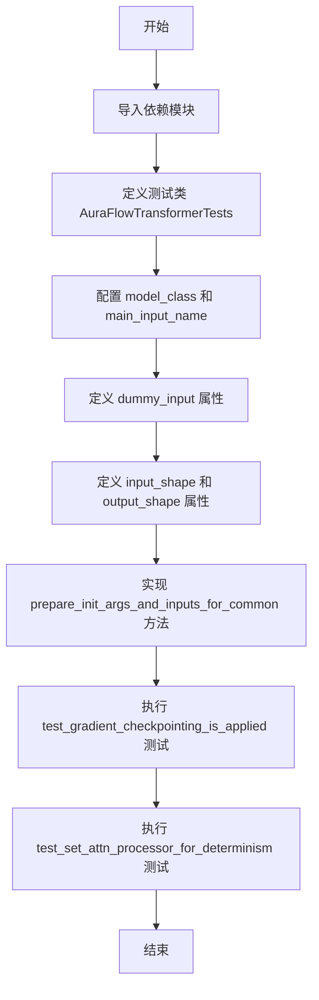
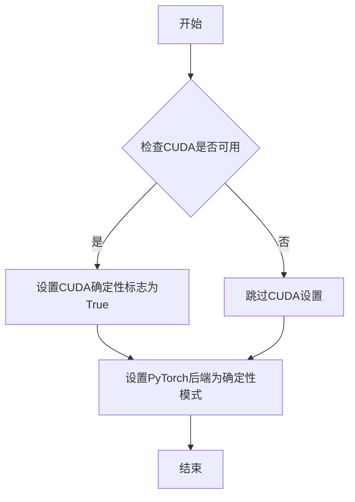
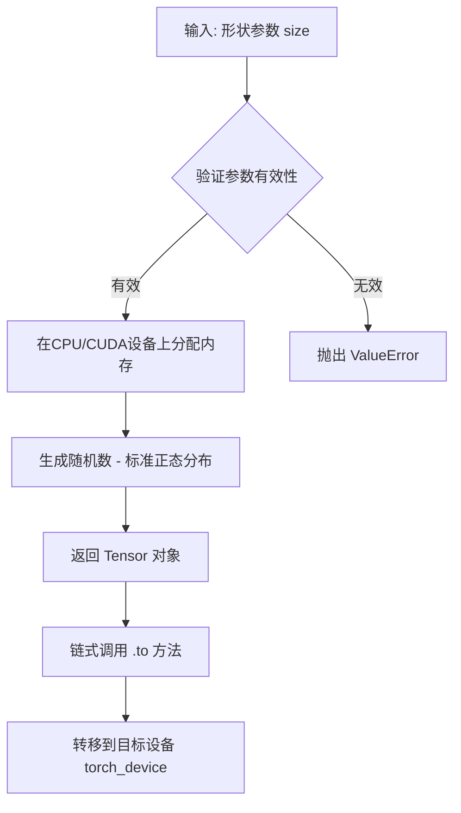
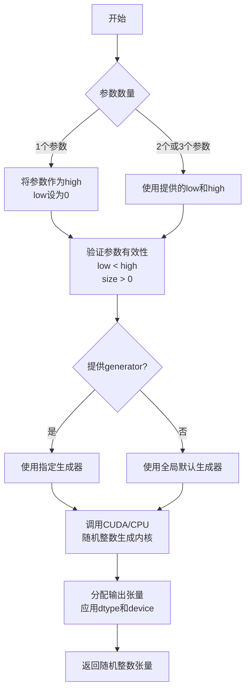
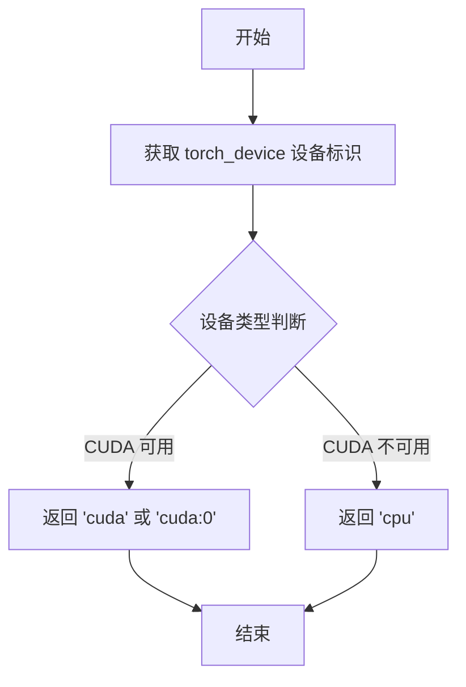
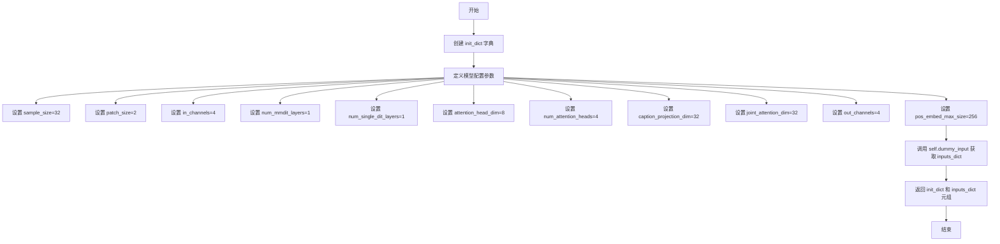
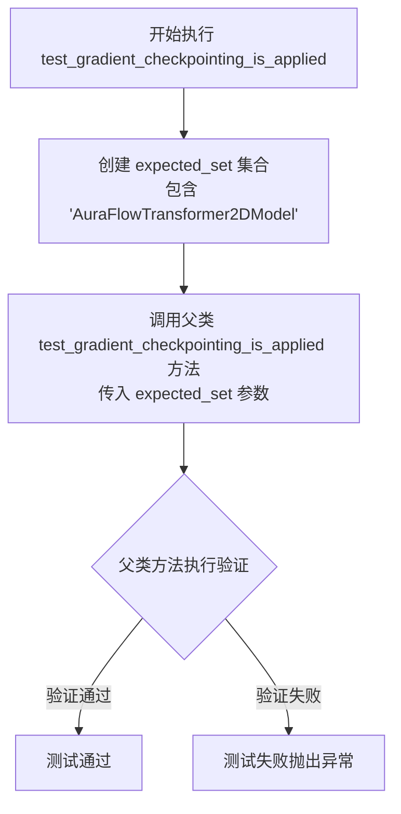
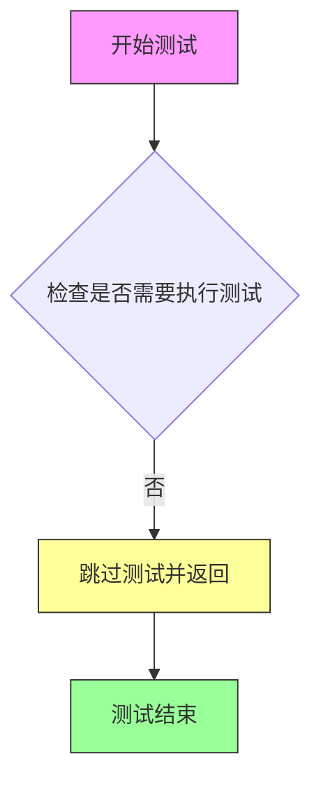

# `diffusers\tests\models\transformers\test_models_transformer_aura_flow.py` 详细设计文档

这是一个使用 PyTorch 和 Hugging Face diffusers 库的单元测试文件，专门用于测试 AuraFlowTransformer2DModel 模型的各项功能，包括模型前向传播、梯度检查点、注意力处理器等核心功能的验证。

## 整体流程



## 类结构

```
unittest.TestCase
└── AuraFlowTransformerTests (继承 ModelTesterMixin)
    └── 测试 AuraFlowTransformer2DModel 模型
```

## 全局变量及字段


### `torch`
    
PyTorch深度学习库，提供张量运算和神经网络功能

类型：`module`
    


### `AuraFlowTransformer2DModel`
    
AuraFlow 2D变换器模型类，用于 diffusion 模型的变换器部分

类型：`class`
    


### `enable_full_determinism`
    
启用完全确定性模式的函数，确保测试结果可复现

类型：`function`
    


### `torch_device`
    
PyTorch设备标识字符串，指定计算设备（cuda或cpu）

类型：`str`
    


### `ModelTesterMixin`
    
模型测试混合类，提供通用模型测试方法和断言

类型：`class`
    


### `AuraFlowTransformerTests.model_class`
    
被测试的模型类，指向AuraFlowTransformer2DModel

类型：`type[AuraFlowTransformer2DModel]`
    


### `AuraFlowTransformerTests.main_input_name`
    
模型主输入参数的名称，此处为hidden_states

类型：`str`
    


### `AuraFlowTransformerTests.model_split_percents`
    
模型分割百分比列表，用于控制模型不同部分的测试数据划分比例

类型：`list[float]`
    
    

## 全局函数及方法


### `enable_full_determinism`

这是一个用于启用PyTorch完全确定性模式的函数，确保测试或训练过程可以完全复现。

参数：
- （无参数）

返回值：无返回值

#### 流程图



#### 带注释源码

```python
# 该函数定义在 testing_utils 模块中
# 当前代码文件只是导入了该函数并调用
from ...testing_utils import enable_full_determinism, torch_device

# 调用 enable_full_determinism 函数
# 作用：启用完全确定性模式，确保PyTorch操作在不同运行中产生相同结果
# 这对于测试用例的复现性至关重要
enable_full_determinism()
```

> **注意**：当前提供的代码文件中仅包含 `enable_full_determinism` 函数的导入和调用语句，该函数的具体实现定义在 `testing_utils` 模块中。根据函数名称和调用上下文推断，该函数用于设置PyTorch的完全确定性模式，以确保测试结果的可复现性。


### `torch.randn`

生成指定形状的张量，其元素服从标准正态分布（均值0，方差1）。在代码中用于生成测试用的随机输入数据。

参数：

- `size`：`tuple of int`，形状参数。代码中实际调用为 `(batch_size, num_channels, height, width)` 即 `(2, 4, 32, 32)`，表示生成 4 维张量
- `*args`：`torch.device`（可选），目标设备。代码中通过链式调用 `.to(torch_device)` 指定

返回值：`torch.Tensor`，形状为 `(2, 4, 32, 32)` 的随机张量，元素类型为 `float32`

#### 流程图



#### 带注释源码

```python
# 代码中第一次使用 torch.randn
# 用于生成 AuraFlowTransformer2DModel 的 hidden_states 输入
# 参数: (batch_size, num_channels, height, width) = (2, 4, 32, 32)
# 生成形状为 (2, 4, 32, 32) 的张量，元素服从标准正态分布
hidden_states = torch.randn((batch_size, num_channels, height, width)).to(torch_device)

# 代码中第二次使用 torch.randn
# 用于生成 encoder_hidden_states 条件输入
# 参数: (batch_size, sequence_length, embedding_dim) = (2, 256, 32)
# 生成形状为 (2, 256, 32) 的张量，元素服从标准正态分布
encoder_hidden_states = torch.randn((batch_size, sequence_length, embedding_dim)).to(torch_device)
```

#### 技术说明

`torch.randn` 是 PyTorch 的基础随机数生成函数，内部实现基于 C++/CUDA 底层的随机数生成器（如 Mersenne Twister 或 Philox）。该函数在测试代码中用于：
1. 创建符合模型输入期望的随机初始化张量
2. 确保测试的可重复性（配合 `enable_full_determinism` 设置随机种子）


### `torch.randint`

生成一个在指定区间 `[low, high)` 内的随机整数张量，常用于生成时间步、索引或其他随机整数场景。

参数：

- `low`：`int`，下界（包含），默认为 0。当只提供一个参数时，该参数作为 `high`，`low` 默认为 0
- `high`：`int`，上界（不包含），生成的随机整数范围为 `[low, high)`
- `size`：`tuple` 或 `int`，输出张量的形状，指定要生成的随机数的维度
- `dtype`：`torch.dtype`，可选，返回张量的数据类型，默认为 `torch.long`
- `device`：`torch.device`，可选，返回张量的设备（CPU 或 CUDA）
- `layout`：`torch.layout`，可选，返回张量的布局，默认为 `torch.strided`
- `generator`：`torch.Generator`，可选，用于控制随机数生成的确定性
- `requires_grad`：`bool`，可选，是否需要自动微分梯度，默认为 `False`

返回值：`torch.Tensor`，返回一个包含随机整数的张量，其形状由 `size` 参数指定，值域在 `[low, high)` 区间内

#### 流程图



#### 带注释源码

```python
# 来自测试代码的实际使用示例
# 这行代码位于 AuraFlowTransformerTests 类的 dummy_input 属性中

timestep = torch.randint(0, 1000, size=(batch_size,)).to(torch_device)
# 参数说明：
#   - 0: low，下界（包含），生成的整数最小值为 0
#   - 1000: high，上界（不包含），生成整数的最大值为 999
#   - size=(batch_size,): 输出形状为一维张量，长度等于 batch_size
#   - .to(torch_device): 将生成的张量移动到指定的设备（CPU 或 CUDA）
#
# 返回值：
#   - timestep: torch.Tensor 类型，形状为 (batch_size,)
#   - 值域范围：[0, 999] 的随机整数
#
# 典型用途：
#   - 在扩散模型中生成随机时间步（timestep）
#   - 作为模型输入的一部分，用于条件生成
#   - 模拟随机采样过程
```


### `torch_device`

`torch_device` 是一个从 `testing_utils` 模块导入的全局变量，用于指定 PyTorch 张量应该被移动到的计算设备（通常是 CPU 或 CUDA 设备）。该变量在测试代码中多次被使用，用于将输入张量（hidden_states、encoder_hidden_states、timestep）移动到指定的设备上，以确保测试能够在正确的设备上运行。

参数： 无（全局变量，无函数参数）

返回值：`str` 或 `torch.device`，返回设备标识符字符串（如 "cuda", "cpu" 等）或 PyTorch 设备对象，用于指定张量应放置的计算设备。

#### 流程图



#### 带注释源码

```
# 从 testing_utils 模块导入的全局变量
# 源代码未在当前文件中定义，位于 ...testing_utils 模块中
from ...testing_utils import enable_full_determinism, torch_device

# 使用示例（在当前代码中）：
# torch_device 用于将张量移动到指定的计算设备

# 1. 将 hidden_states 张量移动到 torch_device 指定的设备
hidden_states = torch.randn((batch_size, num_channels, height, width)).to(torch_device)

# 2. 将 encoder_hidden_states 张量移动到 torch_device 指定的设备
encoder_hidden_states = torch.randn((batch_size, sequence_length, embedding_dim)).to(torch_device)

# 3. 将 timestep 张量移动到 torch_device 指定的设备
timestep = torch.randint(0, 1000, size=(batch_size,)).to(torch_device)

# torch_device 的典型定义（在 testing_utils 模块中）可能类似于：
# torch_device = "cuda" if torch.cuda.is_available() else "cpu"
# 或者从命令行参数/环境变量获取
```


### `AuraFlowTransformerTests.dummy_input`

该属性方法用于生成模型测试所需的虚拟输入数据，构造包含隐藏状态（hidden_states）、编码器隐藏状态（encoder_hidden_states）和时间步长（timestep）的字典，作为 AuraFlowTransformer2DModel 模型的测试输入。

参数：

- 该方法无参数（作为 `@property` 装饰器声明的属性方法）

返回值：`Dict[str, torch.Tensor]`，返回一个包含三个键值对的字典，分别为 `hidden_states`（隐藏状态张量）、`encoder_hidden_states`（编码器隐藏状态张量）和 `timestep`（时间步长张量），用于模型的前向传播测试。

#### 流程图

```mermaid
flowchart TD
    A[开始] --> B[设置批次大小 batch_size=2]
    B --> C[设置通道数 num_channels=4]
    C --> D[设置高度宽度和嵌入维度 height=width=embedding_dim=32]
    D --> E[设置序列长度 sequence_length=256]
    E --> F[生成 hidden_states: torch.randn with shape (2, 4, 32, 32)]
    F --> G[生成 encoder_hidden_states: torch.randn with shape (2, 256, 32)]
    G --> H[生成 timestep: torch.randint with shape (2,)]
    H --> I[构建并返回包含三个张量的字典]
    I --> J[结束]
```

#### 带注释源码

```python
@property
def dummy_input(self):
    """生成模型测试用的虚拟输入数据"""
    # 批次大小
    batch_size = 2
    # 输入通道数
    num_channels = 4
    # 图像高度和宽度，以及嵌入维度
    height = width = embedding_dim = 32
    # 序列长度，用于编码器隐藏状态
    sequence_length = 256

    # 创建随机初始化的隐藏状态张量，形状为 (batch_size, num_channels, height, width)
    hidden_states = torch.randn((batch_size, num_channels, height, width)).to(torch_device)
    # 创建随机初始化的编码器隐藏状态张量，形状为 (batch_size, sequence_length, embedding_dim)
    encoder_hidden_states = torch.randn((batch_size, sequence_length, embedding_dim)).to(torch_device)
    # 创建随机整数时间步长，范围在 [0, 1000)，形状为 (batch_size,)
    timestep = torch.randint(0, 1000, size=(batch_size,)).to(torch_device)

    # 返回包含所有输入的字典，供模型前向传播使用
    return {
        "hidden_states": hidden_states,
        "encoder_hidden_states": encoder_hidden_states,
        "timestep": timestep,
    }
```


### `AuraFlowTransformerTests.input_shape`

该属性方法用于返回 AuraFlowTransformer2DModel 模型的输入形状，定义了测试所需的张量维度规格。

参数：无（该方法为属性方法，仅包含隐含的 `self` 参数）

返回值：`Tuple[int, int, int]`，返回输入形状元组 (4, 32, 32)，分别代表通道数、高度和宽度

#### 流程图

```mermaid
flowchart TD
    A[调用 input_shape 属性] --> B{属性访问}
    B -->|Property Getter| C[返回元组 (4, 32, 32)]
    
    subgraph 形状含义
        C --> D[4: 通道数 num_channels]
        C --> E[32: 高度 height]
        C --> F[32: 宽度 width]
    end
    
    style C fill:#90EE90
    style D fill:#FFB6C1
    style E fill:#FFB6C1
    style F fill:#FFB6C1
```

#### 带注释源码

```python
@property
def input_shape(self):
    """
    返回模型的输入形状规格。
    
    该属性方法定义了 AuraFlowTransformer2DModel 在测试过程中的
    预期输入张量维度，用于模型测试和验证。
    
    返回值:
        Tuple[int, int, int]: 
            - 第一个元素 4: 输入通道数 (num_channels)
            - 第二个元素 32: 输入高度 (height)
            - 第三个元素 32: 输入宽度 (width)
    
    注意:
        - 此属性与 output_shape 配合使用，确保模型输入输出维度一致性
        - 该形状对应 dummy_input 中生成的随机张量维度
    """
    return (4, 32, 32)
```


### `AuraFlowTransformerTests.output_shape`

该属性是测试类中的一个属性方法，用于返回 AuraFlowTransformer2DModel 模型的预期输出形状。它是一个只读属性，在测试框架中用于验证模型输出的维度是否符合预期。

参数： 无

返回值：`tuple`，返回模型的预期输出形状，为一个包含 3 个元素的元组 `(4, 32, 32)`

#### 流程图

```mermaid
flowchart TD
    A[开始] --> B{调用 output_shape 属性}
    B --> C[返回元组 (4, 32, 32)]
    C --> D[结束]
    
    style A fill:#f9f,stroke:#333
    style D fill:#9f9,stroke:#333
```

#### 带注释源码

```python
@property
def output_shape(self):
    """
    返回模型的预期输出形状。
    
    该属性用于测试框架中，验证 AuraFlowTransformer2DModel 的输出
    是否具有正确的维度。在这个测试用例中，模型期望输出形状为
    (4, 32, 32)，对应 (batch_size, height, width)。
    
    Returns:
        tuple: 一个包含三个整数的元组，表示模型的输出形状
               - 第一个元素 4: 批量大小 (batch_size)
               - 第二个元素 32: 输出高度 (height)
               - 第三个元素 32: 输出宽度 (width)
    """
    return (4, 32, 32)
```


### `AuraFlowTransformerTests.prepare_init_args_and_inputs_for_common`

该方法为通用模型测试准备初始化参数和输入数据，返回一个包含模型配置字典和测试输入字典的元组，用于初始化和运行 AuraFlowTransformer2DModel 的前向传播测试。

参数：

- `self`：`AuraFlowTransformerTests` 类实例，方法的隐式调用者

返回值：`Tuple[Dict, Dict]`，返回包含初始化参数字典和模型输入字典的元组。第一个字典包含模型架构配置参数（如 sample_size、patch_size、in_channels 等），第二个字典包含用于前向传播测试的输入张量（hidden_states、encoder_hidden_states、timestep）。

#### 流程图



#### 带注释源码

```python
def prepare_init_args_and_inputs_for_common(self):
    """
    为通用模型测试准备初始化参数和输入数据。
    
    返回值:
        tuple: 包含两个字典的元组
            - init_dict: 模型初始化参数字典
            - inputs_dict: 模型输入参数字典
    """
    # 定义模型架构的初始化参数字典
    # 包含模型的核心配置信息，用于实例化 AuraFlowTransformer2DModel
    init_dict = {
        "sample_size": 32,              # 输入样本的空间维度大小
        "patch_size": 2,                # 图像分块（patch）的大小
        "in_channels": 4,               # 输入通道数
        "num_mmdit_layers": 1,          # MM-DiT 层数量
        "num_single_dit_layers": 1,     # 单层 DiT 层数量
        "attention_head_dim": 8,        # 注意力头维度
        "num_attention_heads": 4,       # 注意力头数量
        "caption_projection_dim": 32,   # 字幕投影维度
        "joint_attention_dim": 32,      # 联合注意力维度
        "out_channels": 4,              # 输出通道数
        "pos_embed_max_size": 256,      # 位置嵌入最大尺寸
    }
    
    # 获取测试用的虚拟输入数据
    # 通过 self.dummy_input 属性构造，包含:
    # - hidden_states: 隐状态张量 (batch, channels, height, width)
    # - encoder_hidden_states: 编码器隐状态 (batch, seq_len, embed_dim)
    # - timestep: 时间步 (batch,)
    inputs_dict = self.dummy_input
    
    # 返回初始化参数字典和输入字典的元组
    return init_dict, inputs_dict
```


### `AuraFlowTransformerTests.test_gradient_checkpointing_is_applied`

该测试方法用于验证 AuraFlowTransformer2DModel 模型类是否正确应用了梯度检查点（Gradient Checkpointing）技术。它通过调用父类的同名测试方法，传入包含目标模型类名的集合来执行实际的验证逻辑。

参数：

- `self`：隐式参数，`unittest.TestCase` 类型，代表测试类实例本身
- `expected_set`：`Set[str]` 类型，包含 `{"AuraFlowTransformer2DModel"}`，指定期望应用梯度检查点的模型类名称集合

返回值：`None`（void），该方法为测试方法，无返回值，通过内部断言验证梯度检查点是否启用

#### 流程图



#### 带注释源码

```python
def test_gradient_checkpointing_is_applied(self):
    """
    测试方法：验证梯度检查点是否应用于 AuraFlowTransformer2DModel
    
    该测试方法继承自 ModelTesterMixin，用于确认指定的模型类
    已正确配置了梯度检查点功能，以节省显存开销。
    """
    # 定义期望应用梯度检查点的模型类集合
    # AuraFlowTransformer2DModel 是本次测试的目标模型类
    expected_set = {"AuraFlowTransformer2DModel"}
    
    # 调用父类的测试方法执行实际的验证逻辑
    # 父类方法会检查模型是否使用了梯度检查点
    super().test_gradient_checkpointing_is_applied(expected_set=expected_set)
```


### `AuraFlowTransformerTests.test_set_attn_processor_for_determinism`

该测试方法用于验证注意力处理器的确定性设置，但由于 AuraFlowTransformer2DModel 使用其自己的专用注意力处理器，此测试不适用，因此被跳过。

参数：无

返回值：`None`，无返回值（测试被跳过）

#### 流程图



#### 带注释源码

```python
@unittest.skip("AuraFlowTransformer2DModel uses its own dedicated attention processor. This test does not apply")
def test_set_attn_processor_for_determinism(self):
    """
    测试注意力处理器的确定性设置。
    
    该测试被跳过（skip），原因如下：
    - AuraFlowTransformer2DModel 使用自定义的专用注意力处理器
    - 标准的注意力处理器确定性测试不适用于此类模型
    - 需要使用模型特定的测试方法进行验证
    
    参数:
        self: 测试类实例本身，包含模型配置和输入数据
    
    返回值:
        None: 测试被跳过，不执行任何验证逻辑
    """
    pass  # 方法体为空，测试被跳过
```


## 关键组件


### AuraFlowTransformerTests 测试类

这是核心的单元测试类，负责对AuraFlowTransformer2DModel模型进行全面测试，继承自ModelTesterMixin和unittest.TestCase，包含模型初始化参数准备、梯度检查点验证等测试用例。

### AuraFlowTransformer2DModel 模型类

被测试的Diffusers Transformer模型类，用于AuraFlow图像生成任务，具备2D变换器架构，支持注意力机制、patch嵌入和条件生成。

### dummy_input 虚拟输入

生成随机张量作为模型测试输入，包含hidden_states（4D张量）、encoder_hidden_states（3D张量）和timestep（1D张量），用于验证模型的前向传播功能。

### prepare_init_args_and_inputs_for_common 初始化配置方法

准备模型初始化参数字典和测试输入字典，配置包括sample_size、patch_size、in_channels、num_mmdit_layers、num_single_dit_layers、attention_head_dim、num_attention_heads、caption_projection_dim、joint_attention_dim、out_channels、pos_embed_max_size等关键参数。

### test_gradient_checkpointing_is_applied 梯度检查点测试

验证AuraFlowTransformer2DModel模型是否正确应用梯度检查点优化技术，通过expected_set集合指定待测试模型范围。

### test_set_attn_processor_for_determinism 注意力处理器测试

由于AuraFlowTransformer2DModel使用专用的注意力处理器，该测试被跳过（标记为unittest.skip），避免不适用的测试逻辑执行。

### enable_full_determinism 确定性配置

从testing_utils导入的辅助函数，用于启用完全确定性模式，确保测试结果的可重复性。

### ModelTesterMixin 测试混合类

提供通用模型测试方法的基类mixin，包含模型结构验证、参数初始化、梯度计算等标准化测试逻辑。


## 问题及建议


### 已知问题

- **空实现的跳过的测试**：`test_set_attn_processor_for_determinism` 方法被完全跳过，仅包含 `pass` 语句，这种做法不优雅且降低了代码可读性，应直接删除该方法或添加更明确的文档说明
- **缺少测试方法覆盖**：类中仅实现 `test_gradient_checkpointing_is_applied` 一个测试方法，依赖于父类 `ModelTesterMixin` 提供的隐式测试行为，缺少对模型特定功能的显式测试覆盖
- **缺乏文档注释**：类属性（如 `model_split_percents = [0.7, 0.6, 0.6]`）使用魔数（magic numbers）且无注释说明其用途和选取原因
- **硬编码的测试参数**：`dummy_input` 中的所有维度参数（batch_size=2, num_channels=4, height=width=embedding_dim=32, sequence_length=256）均为硬编码，不利于未来模型参数变化时的维护

### 优化建议

- 删除空的 `test_set_attn_processor_for_determinism` 方法或重构为更明确的跳过实现（如使用 `@unittest.skip` 装饰器并保留原因说明）
- 为 `model_split_percents` 等关键配置参数添加文档注释，说明其设计意图
- 将 `dummy_input` 中的硬编码参数提取为类属性或从配置文件加载，提高代码的可维护性和可配置性
- 考虑添加更多针对 `AuraFlowTransformer2DModel` 特定功能的测试方法，如自定义注意力处理器、层结构验证等

## 其它


### 设计目标与约束

本测试代码旨在验证 AuraFlowTransformer2DModel 模型的正确性，确保模型在前向传播、梯度检查点、注意力机制等核心功能上的行为符合预期。测试采用 unittest 框架，继承 ModelTesterMixin 提供的一致性测试方法。模型被配置为小型配置（num_mmdit_layers=1, num_single_dit_layers=1）以加快测试执行速度。

### 错误处理与异常设计

代码中使用了 `@unittest.skip` 装饰器跳过不适用的测试（test_set_attn_processor_for_determinism），因为该模型使用自定义的注意力处理器。测试失败时 unittest 框架会自动捕获并报告错误，无需额外的异常处理逻辑。

### 数据流与状态机

数据流：dummy_input 属性生成随机张量（hidden_states, encoder_hidden_states, timestep）-> prepare_init_args_and_inputs_for_common 组装初始化字典和输入字典 -> 测试方法执行前向/反向传播验证。无状态机设计。

### 外部依赖与接口契约

依赖：torch (PyTorch), diffusers 库 (AuraFlowTransformer2DModel), unittest 框架, testing_utils (enable_full_determinism, torch_device), test_modeling_common (ModelTesterMixin)。接口契约：model_class 指向被测模型类，main_input_name="hidden_states" 指定主输入参数名，prepare_init_args_and_inputs_for_common 返回 (init_dict, inputs_dict) 元组。

### 测试覆盖范围说明

测试继承自 ModelTesterMixin，将自动覆盖：模型输出形状验证、参数初始化检查、梯度计算能力、模型配置序列化/反序列化、相同输入的确定性输出等通用测试场景。显式测试包括梯度检查点验证（test_gradient_checkpointing_is_applied）。

### 配置参数说明

model_split_percents = [0.7, 0.6, 0.6] 用于模型分割测试（验证模型不同部分的输出）。sample_size=32, patch_size=2, in_channels=4 定义模型输入维度。num_mmdit_layers=1, num_single_dit_layers=1 指定模型层数。attention_head_dim=8, num_attention_heads=4 配置注意力机制参数。

### 测试环境要求

需要配置 torch_device 以确定测试设备（CPU/CUDA）。enable_full_determinism() 确保测试可复现性。测试数据使用固定随机种子生成的确定性张量。

### 潜在优化空间

当前测试仅覆盖基础功能，建议增加：1) 内存占用测试；2) 性能基准测试；3) 边缘情况测试（如 timestep=0 或最大值的处理）；4) 与不同注意力处理器兼容性的专项测试。

    