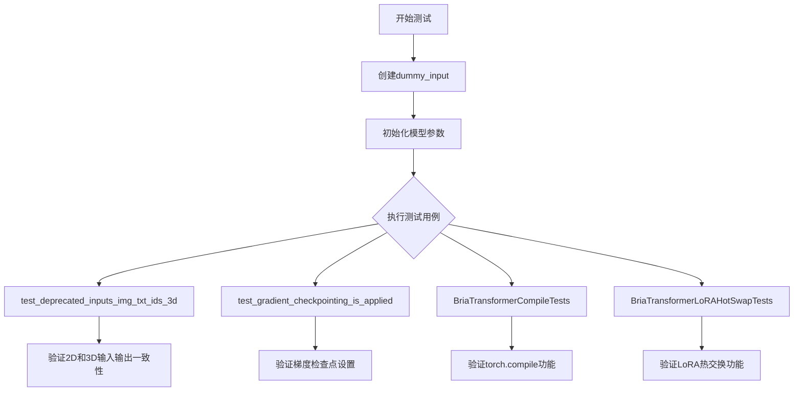
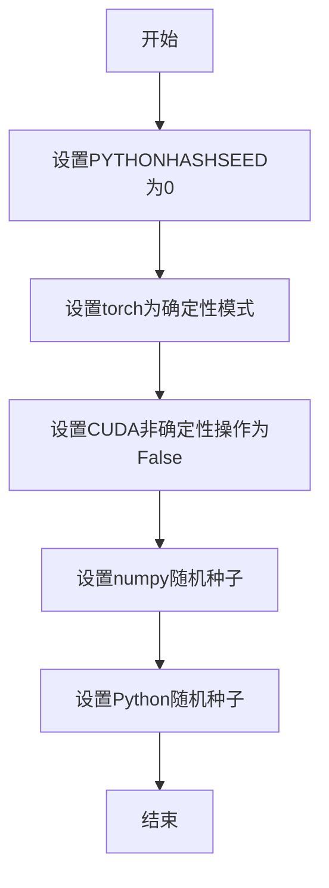
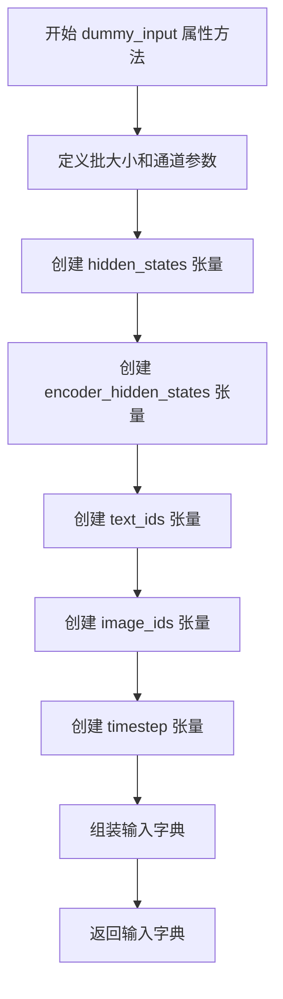
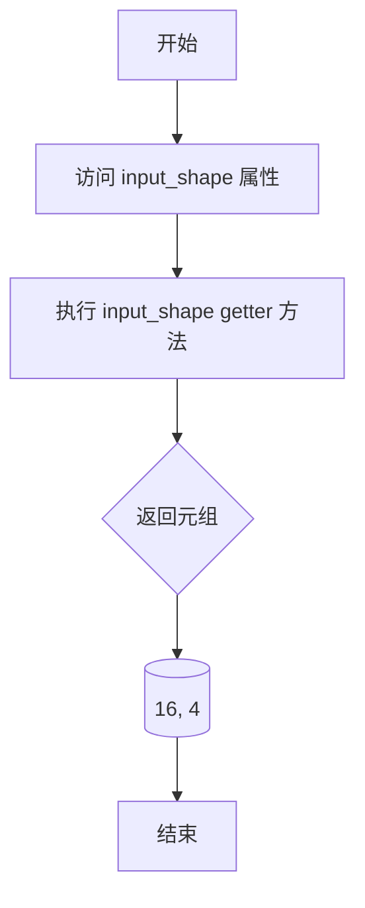
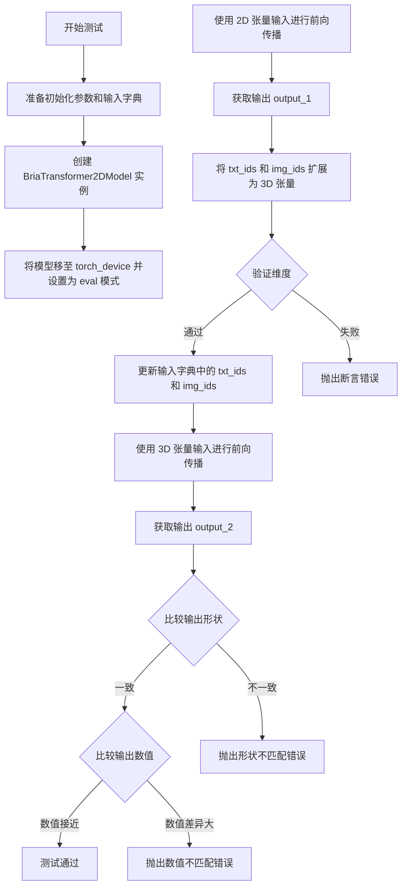
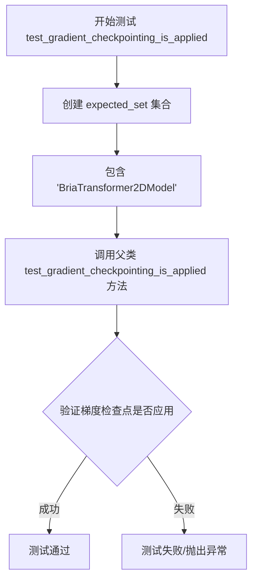
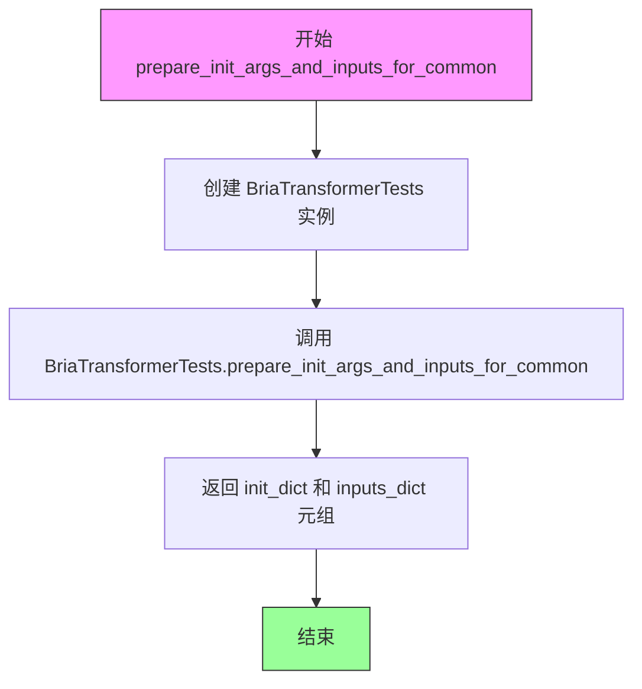
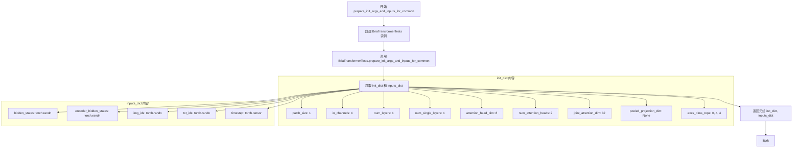

# `diffusers\tests\models\transformers\test_models_transformer_bria.py` 详细设计文档

这是BriaTransformer2DModel模型的单元测试文件，用于验证模型的正确性、梯度检查点功能、编译性能以及LoRA热交换能力。

## 整体流程



## 类结构

```
unittest.TestCase (基类)
├── BriaTransformerTests
│   └── ModelTesterMixin
├── BriaTransformerCompileTests
│   └── TorchCompileTesterMixin
└── BriaTransformerLoRAHotSwapTests
    └── LoraHotSwappingForModelTesterMixin
```

## 全局变量及字段


### `batch_size`
    
批次大小，控制一次前向传播中处理的样本数量

类型：`int`
    


### `num_latent_channels`
    
潜在通道数，表示潜在空间的维度

类型：`int`
    


### `num_image_channels`
    
图像通道数，通常RGB为3通道

类型：`int`
    


### `height`
    
图像高度维度

类型：`int`
    


### `width`
    
图像宽度维度

类型：`int`
    


### `sequence_length`
    
序列长度，表示文本或图像token序列的长度

类型：`int`
    


### `embedding_dim`
    
嵌入维度，特征向量的维度大小

类型：`int`
    


### `hidden_states`
    
隐藏状态张量，模型的主输入，包含潜在空间特征

类型：`torch.Tensor`
    


### `encoder_hidden_states`
    
编码器隐藏状态张量，包含文本编码信息

类型：`torch.Tensor`
    


### `text_ids`
    
文本IDs张量，用于标识文本序列中的位置

类型：`torch.Tensor`
    


### `image_ids`
    
图像IDs张量，用于标识图像序列中的位置

类型：`torch.Tensor`
    


### `timestep`
    
时间步张量，用于扩散模型的调度

类型：`torch.Tensor`
    


### `init_dict`
    
初始化参数字典，包含模型构造所需的所有配置参数

类型：`dict`
    


### `inputs_dict`
    
输入参数字典，包含模型前向传播所需的所有输入

类型：`dict`
    


### `ip_cross_attn_state_dict`
    
IP适配器交叉注意力状态字典，存储跨注意力权重

类型：`dict`
    


### `ip_image_projection_state_dict`
    
IP适配器图像投影状态字典，存储图像投影层权重

类型：`dict`
    


### `ip_state_dict`
    
IP状态字典，整合图像投影和IP适配器的完整状态

类型：`dict`
    


### `key_id`
    
关键ID，用于索引IP适配器权重字典

类型：`int`
    


### `joint_attention_dim`
    
联合注意力维度，文本和图像共享的注意力空间维度

类型：`int`
    


### `hidden_size`
    
隐藏层大小，计算为注意力头数乘以每头维度

类型：`int`
    


### `sd`
    
状态字典，用于临时存储模型权重

类型：`dict`
    


### `image_projection`
    
图像投影对象，将图像嵌入投影到联合注意力空间

类型：`ImageProjection`
    


### `text_ids_3d`
    
3D文本IDs张量，已扩展维度用于兼容旧版本输入格式

类型：`torch.Tensor`
    


### `image_ids_3d`
    
3D图像IDs张量，已扩展维度用于兼容旧版本输入格式

类型：`torch.Tensor`
    


### `output_1`
    
模型输出张量，使用2D输入格式的推理结果

类型：`torch.Tensor`
    


### `output_2`
    
模型输出张量，使用3D输入格式（已弃用）的推理结果

类型：`torch.Tensor`
    


### `expected_set`
    
预期集合，包含支持梯度检查点的模型类名称

类型：`set`
    


### `BriaTransformerTests.model_class`
    
模型类类型，指向BriaTransformer2DModel

类型：`type`
    


### `BriaTransformerTests.main_input_name`
    
主输入名称，标识模型的主要输入参数

类型：`str`
    


### `BriaTransformerTests.model_split_percents`
    
模型分割百分比，用于测试时模型切分的比例

类型：`list`
    


### `BriaTransformerTests.uses_custom_attn_processor`
    
是否使用自定义注意力处理器标志

类型：`bool`
    


### `BriaTransformerTests.dummy_input`
    
属性方法，返回用于测试的虚拟输入数据

类型：`property`
    


### `BriaTransformerTests.input_shape`
    
属性方法，返回模型的输入形状

类型：`property`
    


### `BriaTransformerTests.output_shape`
    
属性方法，返回模型的输出形状

类型：`property`
    


### `BriaTransformerTests.prepare_init_args_and_inputs_for_common`
    
准备模型初始化参数和输入的通用方法

类型：`method`
    


### `BriaTransformerTests.test_deprecated_inputs_img_txt_ids_3d`
    
测试已弃用的3D img_ids和txt_ids输入是否仍能正常工作

类型：`method`
    


### `BriaTransformerTests.test_gradient_checkpointing_is_applied`
    
验证梯度检查点是否正确应用到模型

类型：`method`
    


### `BriaTransformerCompileTests.model_class`
    
模型类类型，指向BriaTransformer2DModel

类型：`type`
    


### `BriaTransformerCompileTests.prepare_init_args_and_inputs_for_common`
    
准备模型初始化参数和输入的通用方法

类型：`method`
    


### `BriaTransformerLoRAHotSwapTests.model_class`
    
模型类类型，指向BriaTransformer2DModel

类型：`type`
    


### `BriaTransformerLoRAHotSwapTests.prepare_init_args_and_inputs_for_common`
    
准备模型初始化参数和输入的通用方法

类型：`method`
    
    

## 全局函数及方法


### `create_bria_ip_adapter_state_dict`

该函数用于为 BriaTransformer2DModel 模型创建 IP Adapter（图像提示适配器）的状态字典，包含图像投影层权重和交叉注意力权重，用于支持图像条件的扩散模型推理。

参数：

- `model`：`BriaTransformer2DModel`，输入的 Bria Transformer 模型实例，用于获取配置信息和注意力处理器

返回值：`Dict`，返回包含 "image_proj" 和 "ip_adapter" 两个键的字典，分别存储图像投影层和交叉注意力适配器的权重状态

#### 流程图

```mermaid
flowchart TD
    A[开始] --> B[初始化空字典 ip_cross_attn_state_dict 和 key_id = 0]
    B --> C{遍历 model.attn_processors 的键}
    C --> D{检查键是否以 'single_transformer_blocks' 开头?}
    D -->|是| E[跳过当前键, key_id 不变]
    D -->|否| F[获取 joint_attention_dim 和 hidden_size 配置]
    F --> G[创建 FluxIPAdapterJointAttnProcessor2_0 实例]
    G --> H[从实例获取 state_dict 并提取 to_k_ip/to_v_ip 权重]
    H --> I[更新 ip_cross_attn_state_dict, 键名格式: {key_id}.to_k_ip.weight]
    I --> J[key_id 递增]
    J --> C
    C -->|遍历结束| K[创建 ImageProjection 实例]
    K --> L[获取 image_proj state_dict 并提取权重]
    L --> M[构建 ip_image_projection_state_dict]
    M --> N[合并两个字典为最终 ip_state_dict]
    N --> O[返回 ip_state_dict]
```

#### 带注释源码

```python
def create_bria_ip_adapter_state_dict(model):
    """
    为 BriaTransformer2DModel 创建 IP Adapter 状态字典。
    IP Adapter 是用于在扩散模型中注入图像条件的机制，
    包含图像投影层和交叉注意力适配器权重。
    
    参数:
        model: BriaTransformer2DModel 实例
        
    返回:
        dict: 包含 'image_proj' 和 'ip_adapter' 两个子字典的状态字典
    """
    
    # ========== 第一部分: 构建 IP 交叉注意力权重 ==========
    # 初始化用于存储 IP 交叉注意力权重的字典
    ip_cross_attn_state_dict = {}
    # key_id 用于为每个注意力处理器分配唯一索引
    key_id = 0

    # 遍历模型的所有注意力处理器
    for name in model.attn_processors.keys():
        # 跳过 single_transformer_blocks，这些块使用不同的注意力机制
        if name.startswith("single_transformer_blocks"):
            continue

        # 从模型配置中获取联合注意力维度
        joint_attention_dim = model.config["joint_attention_dim"]
        # 计算隐藏层大小 = 注意力头数 × 每头维度
        hidden_size = model.config["num_attention_heads"] * model.config["attention_head_dim"]
        
        # 创建 Flux IP Adapter 处理器实例用于获取默认权重
        sd = FluxIPAdapterJointAttnProcessor2_0(
            hidden_size=hidden_size, 
            cross_attention_dim=joint_attention_dim, 
            scale=1.0
        ).state_dict()
        
        # 从处理器状态字典中提取 IP 相关的权重
        # 这些权重将用于注入图像条件到交叉注意力层
        ip_cross_attn_state_dict.update(
            {
                # 为每个注意力层分配唯一的 key_id
                f"{key_id}.to_k_ip.weight": sd["to_k_ip.0.weight"],
                f"{key_id}.to_v_ip.weight": sd["to_v_ip.0.weight"],
                f"{key_id}.to_k_ip.bias": sd["to_k_ip.0.bias"],
                f"{key_id}.to_v_ip.bias": sd["to_v_ip.0.bias"],
            }
        )

        # 递增 key_id，为下一个注意力层准备
        key_id += 1

    # ========== 第二部分: 构建图像投影层权重 ==========
    # 创建图像投影层实例，用于将图像嵌入映射到共享注意力空间
    image_projection = ImageProjection(
        cross_attention_dim=model.config["joint_attention_dim"],
        image_embed_dim=model.config["pooled_projection_dim"],
        num_image_text_embeds=4,
    )

    # 初始化图像投影状态字典
    ip_image_projection_state_dict = {}
    # 获取图像投影层的权重
    sd = image_projection.state_dict()
    # 提取并重新命名权重键以符合 IP Adapter 格式
    ip_image_projection_state_dict.update(
        {
            "proj.weight": sd["image_embeds.weight"],
            "proj.bias": sd["image_embeds.bias"],
            "norm.weight": sd["norm.weight"],
            "norm.bias": sd["norm.bias"],
        }
    )

    # 删除临时变量释放内存
    del sd
    
    # ========== 第三部分: 合并并返回 ==========
    # 构建最终的状态字典结构
    ip_state_dict = {}
    ip_state_dict.update({
        "image_proj": ip_image_projection_state_dict,  # 图像投影层权重
        "ip_adapter": ip_cross_attn_state_dict          # 交叉注意力适配器权重
    })
    return ip_state_dict
```


### `enable_full_determinism`

该函数用于启用PyTorch的完全确定性模式，确保在测试或推理过程中所有操作都产生可重复的结果，通过设置相关的随机种子和环境变量来消除非确定性因素。

参数：

- 该函数无参数

返回值：`None`，无返回值

#### 流程图



#### 带注释源码

```python
# 该函数定义在 testing_utils 模块中
# 当前代码文件中只是导入了该函数并直接调用
# 导入语句：from ...testing_utils import enable_full_determinism, torch_device
# 调用方式：无参数直接调用
enable_full_determinism()

# 函数功能说明：
# 1. 设置环境变量PYTHONHASHSEED为"0"
# 2. 设置torch.use_deterministic_algorithms(True)
# 3. 设置torch.backends.cudnn.deterministic = True
# 4. 设置torch.backends.cudnn.benchmark = False
# 5. 设置numpy和python的随机种子
# 目的：确保测试结果的完全可复现性，消除所有非确定性因素
```


### `torch_device`

`torch_device` 是从 `testing_utils` 模块导入的全局变量，用于指定 PyTorch 张量运行的设备（如 "cuda"、"cpu" 或 "cuda:0" 等）。在测试代码中，它被用来将模型和输入张量移动到指定的设备上，以确保测试能够在正确的设备上执行。

参数： 无（全局变量，无参数）

返回值：`str` 或 `torch.device`，返回当前配置的 PyTorch 设备字符串或设备对象

#### 流程图

```mermaid
flowchart TD
    A[开始] --> B[从 testing_utils 导入 torch_device]
    B --> C[在测试中创建张量后调用 .to(torch_device)]
    C --> D[将张量移动到指定设备]
    D --> E[用于模型推理]
    E --> F[结束]
```

#### 带注释源码

```python
# 从 testing_utils 模块导入 torch_device
# torch_device 的实际定义在 testing_utils 模块中
# 在本文件中作为全局变量使用
from ...testing_utils import enable_full_determinism, torch_device

# 使用示例（在 BriaTransformerTests 类的 dummy_input 属性中）:
#
# hidden_states = torch.randn((batch_size, height * width, num_latent_channels)).to(torch_device)
# # 将随机张量移动到 torch_device 指定的设备上（如 cuda:0 或 cpu）
#
# encoder_hidden_states = torch.randn((batch_size, sequence_length, embedding_dim)).to(torch_device)
# text_ids = torch.randn((sequence_length, num_image_channels)).to(torch_device)
# image_ids = torch.randn((height * width, num_image_channels)).to(torch_device)
# timestep = torch.tensor([1.0]).to(torch_device).expand(batch_size)
#
# model.to(torch_device)  # 将模型也移动到指定设备
```


### `BriaTransformerTests.dummy_input`

该方法是一个属性方法，用于生成 BriaTransformer2DModel 模型测试所需的虚拟输入数据（dummy inputs），包括隐藏状态、编码器隐藏状态、图像ID、文本ID和时间步等张量。

参数：

- `self`：隐式参数，`BriaTransformerTests` 类实例本身，无需显式传递

返回值：`Dict[str, torch.Tensor]`，返回包含模型推理所需虚拟输入的字典，包含以下键值对：

- `hidden_states`：`torch.Tensor`，形状为 (batch_size, height * width, num_latent_channels)，潜在空间的隐藏状态
- `encoder_hidden_states`：`torch.Tensor`，形状为 (batch_size, sequence_length, embedding_dim)，编码器输出的隐藏状态
- `img_ids`：`torch.Tensor`，形状为 (height * width, num_image_channels)，图像标识符
- `txt_ids`：`torch.Tensor`，形状为 (sequence_length, num_image_channels)，文本标识符
- `timestep`：`torch.Tensor`，形状为 (batch_size,)，扩散过程的时间步

#### 流程图



#### 带注释源码

```python
@property
def dummy_input(self):
    """
    生成用于模型测试的虚拟输入数据。
    返回一个包含所有必要输入张量的字典，用于初始化和测试 BriaTransformer2DModel。
    """
    # 批次大小为1
    batch_size = 1
    # 潜在通道数（latent channels）为4
    num_latent_channels = 4
    # 图像通道数为3（RGB）
    num_image_channels = 3
    # 图像高度和宽度设为4
    height = width = 4
    # 序列长度为48
    sequence_length = 48
    # 嵌入维度为32
    embedding_dim = 32

    # 创建潜在空间的隐藏状态张量，形状: (1, 16, 4)
    hidden_states = torch.randn((batch_size, height * width, num_latent_channels)).to(torch_device)
    
    # 创建编码器隐藏状态张量，形状: (1, 48, 32)
    encoder_hidden_states = torch.randn((batch_size, sequence_length, embedding_dim)).to(torch_device)
    
    # 创建文本ID张量，形状: (48, 3)
    text_ids = torch.randn((sequence_length, num_image_channels)).to(torch_device)
    
    # 创建图像ID张量，形状: (16, 3)
    image_ids = torch.randn((height * width, num_image_channels)).to(torch_device)
    
    # 创建时间步张量，形状: (1,)
    timestep = torch.tensor([1.0]).to(torch_device).expand(batch_size)

    # 返回包含所有虚拟输入的字典
    return {
        "hidden_states": hidden_states,          # 潜在空间的隐藏状态
        "encoder_hidden_states": encoder_hidden_states,  # 编码器输出的隐藏状态
        "img_ids": image_ids,                    # 图像标识符
        "txt_ids": text_ids,                     # 文本标识符
        "timestep": timestep,                    # 扩散过程的时间步
    }
```


### BriaTransformerTests.input_shape

该属性方法用于返回 BriaTransformer2DModel 的隐层状态输入形状，通常为 (height * width, num_latent_channels) 形式的二维元组，其中第一个元素表示空间位置的总数，第二个元素表示潜在通道数。

参数：

- `self`：`BriaTransformerTests` 类型，隐式参数，表示类的实例本身，无显式描述但在方法内部使用

返回值：`Tuple[int, int]`，返回模型 hidden_states 输入的形状元组。在示例中返回 (16, 4)，表示 16 个空间位置（4x4）和 4 个潜在通道

#### 流程图



#### 带注释源码

```python
@property
def input_shape(self):
    """
    属性装饰器：将 input_shape 方法转换为属性访问
    用于获取模型测试所需的输入形状配置
    
    返回值说明：
    - 第一个元素 (16): 表示空间维度的展平结果，即 height * width = 4 * 4 = 16
    - 第二个元素 (4): 表示潜在通道数，对应 init_dict 中的 in_channels = 4
    
    该属性通常与 output_shape 属性配合使用，用于验证模型前向传播
    的输入输出维度一致性
    """
    return (16, 4)
```


### `BriaTransformerTests.output_shape`

该属性定义了 BriaTransformer2DModel 的输出形状，返回模型输出的空间维度（高度和宽度）。

参数：

- （无，该属性不接受任何参数）

返回值：`tuple`，返回模型输出的形状元组 (height, width)，在本例中为 (16, 4)，表示输出的特征图高度为 16，宽度为 4。

#### 流程图

```mermaid
flowchart TD
    A[访问 output_shape 属性] --> B{返回元组}
    B --> C[返回 (16, 4)]
    C --> D[表示输出特征图高度=16, 宽度=4]
```

#### 带注释源码

```python
@property
def output_shape(self):
    """
    返回模型输出形状的元组。
    
    该属性定义了 BriaTransformer2DModel 推理时的输出空间维度。
    返回 (16, 4) 表示输出特征图的高度为 16，宽度为 4。
    
    Returns:
        tuple: 输出形状 (height, width)，即 (16, 4)
    """
    return (16, 4)
```


### `BriaTransformerTests.prepare_init_args_and_inputs_for_common`

该方法为 BriaTransformer2DModel 测试类准备初始化参数和输入数据，返回一个包含模型配置字典和测试输入字典的元组，用于公共测试场景。

参数：
- `self`：隐式参数，`BriaTransformerTests` 类的实例

返回值：`Tuple[Dict, Dict]`，返回两个字典的元组 - 第一个是模型初始化参数字典，第二个是测试输入数据字典

#### 流程图

```mermaid
flowchart TD
    A[开始] --> B[创建 init_dict 字典]
    B --> C[设置 patch_size=1]
    C --> D[设置 in_channels=4]
    D --> E[设置 num_layers=1]
    E --> F[设置 num_single_layers=1]
    F --> G[设置 attention_head_dim=8]
    G --> H[设置 num_attention_heads=2]
    H --> I[设置 joint_attention_dim=32]
    I --> J[设置 pooled_projection_dim=None]
    J --> K[设置 axes_dims_rope=[0, 4, 4]]
    K --> L[获取 dummy_input 作为 inputs_dict]
    L --> M[返回 init_dict 和 inputs_dict 元组]
    M --> N[结束]
```

#### 带注释源码

```python
def prepare_init_args_and_inputs_for_common(self):
    """
    准备模型初始化参数和输入数据，用于通用测试场景。
    
    Returns:
        Tuple[Dict, Dict]: 包含以下两个字典的元组:
            - init_dict: 模型初始化参数字典
            - inputs_dict: 测试输入数据字典
    """
    # 定义模型初始化参数字典
    init_dict = {
        "patch_size": 1,              # 图像分块大小
        "in_channels": 4,              # 输入通道数（潜在空间通道数）
        "num_layers": 1,               # Transformer 层数
        "num_single_layers": 1,        # 单Transformer块层数
        "attention_head_dim": 8,      # 注意力头维度
        "num_attention_heads": 2,      # 注意力头数量
        "joint_attention_dim": 32,     # 联合注意力维度
        "pooled_projection_dim": None,# 池化投影维度（设为None）
        "axes_dims_rope": [0, 4, 4],   # RoPE轴维度配置
    }

    # 从类属性获取测试输入数据
    inputs_dict = self.dummy_input
    
    # 返回初始化参数和输入数据的元组
    return init_dict, inputs_dict
```


### `BriaTransformerTests.test_deprecated_inputs_img_txt_ids_3d`

该测试方法用于验证 BriaTransformer2DModel 模型能否正确处理已废弃的3D张量格式输入（img_ids 和 txt_ids），并确保3D输入的输出与2D输入的输出在数值上保持一致（允许微小的浮点误差）。

参数：

- `self`：隐式参数，测试类实例本身，无需显式传递

返回值：`None`（无返回值），该方法通过 `unittest.TestCase` 的断言来验证测试结果

#### 流程图



#### 带注释源码

```python
def test_deprecated_inputs_img_txt_ids_3d(self):
    """
    测试模型对废弃的3D张量格式输入（img_ids 和 txt_ids）的支持。
    
    该测试验证当 img_ids 和 txt_ids 以3D张量（而非标准的2D张量）
    传入时，模型的输出应与使用2D张量输入时的输出保持一致。
    这确保了向后兼容性，尽管这种输入方式已被废弃。
    """
    # 步骤1: 获取模型初始化参数和测试输入
    # prepare_init_args_and_inputs_for_common 返回一个包含模型配置参数的字典
    # 和一个包含测试输入数据的字典
    init_dict, inputs_dict = self.prepare_init_args_and_inputs_for_common()
    
    # 步骤2: 使用初始化参数创建 BriaTransformer2DModel 模型实例
    model = self.model_class(**init_dict)
    
    # 步骤3: 将模型移至指定的计算设备（如 GPU 或 CPU）
    model.to(torch_device)
    
    # 步骤4: 设置模型为评估模式，禁用 dropout 等训练特定的操作
    model.eval()

    # 步骤5: 使用标准的2D张量输入进行前向传播
    # hidden_states: 隐状态张量，形状为 (batch_size, height*width, num_latent_channels)
    # encoder_hidden_states: 编码器隐状态，形状为 (batch_size, sequence_length, embedding_dim)
    # img_ids: 图像标识符，形状为 (height*width, num_image_channels) - 2D
    # txt_ids: 文本标识符，形状为 (sequence_length, num_image_channels) - 2D
    # timestep: 时间步，形状为 (batch_size,)
    with torch.no_grad():
        # 执行前向传播并将输出转换为元组，取第一个元素
        output_1 = model(**inputs_dict).to_tuple()[0]

    # 步骤6: 将 txt_ids 和 img_ids 转换为3D张量（已废弃的格式）
    # unsqueeze(0) 在第0维添加一个维度，将 2D 张量变为 3D
    # 原形状: (sequence_length, num_image_channels) -> 新形状: (1, sequence_length, num_image_channels)
    text_ids_3d = inputs_dict["txt_ids"].unsqueeze(0)
    
    # 原形状: (height*width, num_image_channels) -> 新形状: (1, height*width, num_image_channels)
    image_ids_3d = inputs_dict["img_ids"].unsqueeze(0)

    # 步骤7: 验证转换后的张量确实是3D的
    assert text_ids_3d.ndim == 3, "text_ids_3d should be a 3d tensor"
    assert image_ids_3d.ndim == 3, "img_ids_3d should be a 3d tensor"

    # 步骤8: 更新输入字典，使用3D张量替换原来的2D张量
    inputs_dict["txt_ids"] = text_ids_3d
    inputs_dict["img_ids"] = image_ids_3d

    # 步骤9: 使用废弃的3D张量输入进行前向传播
    with torch.no_grad():
        output_2 = model(**inputs_dict).to_tuple()[0]

    # 步骤10: 验证两种输入格式的输出形状是否一致
    self.assertEqual(output_1.shape, output_2.shape)
    
    # 步骤11: 验证两种输入格式的输出数值是否接近（允许1e-5的绝对误差）
    self.assertTrue(
        torch.allclose(output_1, output_2, atol=1e-5),
        msg="output with deprecated inputs (img_ids and txt_ids as 3d torch tensors) are not equal as them as 2d inputs",
    )
```


### `BriaTransformerTests.test_gradient_checkpointing_is_applied`

该测试方法用于验证 BriaTransformer2DModel 模型是否正确应用了梯度检查点（Gradient Checkpointing）技术，通过调用父类测试方法并指定预期模型集合来确保梯度检查点在指定模型上生效。

参数：

- `self`：`BriaTransformerTests`，测试类实例，隐式参数
- `expected_set`：`Set[str]`，包含预期应用梯度检查点的模型类名称集合，此处为 `{"BriaTransformer2DModel"}`

返回值：`None`，该方法为测试用例，通过断言验证梯度检查点是否应用，不返回具体值

#### 流程图



#### 带注释源码

```python
def test_gradient_checkpointing_is_applied(self):
    """
    测试梯度检查点是否被正确应用于模型。
    
    该测试方法继承自 ModelTesterMixin，用于验证 BriaTransformer2DModel
    是否正确配置了梯度检查点功能，以优化显存使用。
    """
    # 定义预期应用梯度检查点的模型类集合
    expected_set = {"BriaTransformer2DModel"}
    
    # 调用父类的测试方法，验证指定的模型类是否应用了梯度检查点
    # 父类方法会检查模型配置和实际 forward 过程中的梯度计算行为
    super().test_gradient_checkpointing_is_applied(expected_set=expected_set)
```


### `BriaTransformerCompileTests.prepare_init_args_and_inputs_for_common`

该方法是一个测试工具函数，用于为 BriaTransformer2DModel 编译测试准备初始化参数和输入数据。它通过调用 `BriaTransformerTests.prepare_init_args_and_inputs_for_common` 来获取模型初始化配置字典和输入张量字典。

参数：

- `self`：实例方法隐式参数，无类型描述

返回值：`Tuple[Dict, Dict]`，返回一个元组，包含模型初始化参数字典和模型输入字典。

#### 流程图



#### 带注释源码

```python
def prepare_init_args_and_inputs_for_common(self):
    """
    为 BriaTransformer2DModel 编译测试准备初始化参数和输入数据。
    
    该方法作为测试类的接口方法，通过委托方式调用 BriaTransformerTests
    的同名方法来获取标准的模型初始化配置和测试输入。
    
    Returns:
        Tuple[Dict, Dict]: 包含两个字典的元组
            - init_dict: 模型初始化参数字典，包含 patch_size, in_channels,
                        num_layers, num_single_layers, attention_head_dim,
                        num_attention_heads, joint_attention_dim,
                        pooled_projection_dim, axes_dims_rope 等配置
            - inputs_dict: 模型输入字典，包含 hidden_states, encoder_hidden_states,
                          img_ids, txt_ids, timestep 等张量
    """
    # 委托给 BriaTransformerTests 类的方法来获取初始化参数和输入
    # 这样可以确保编译测试使用与普通模型测试相同的配置
    return BriaTransformerTests().prepare_init_args_and_inputs_for_common()
```


### `BriaTransformerLoRAHotSwapTests.prepare_init_args_and_inputs_for_common`

该方法是 BriaTransformerLoRAHotSwapTests 测试类的成员方法，用于准备模型初始化参数和输入数据。它通过调用 BriaTransformerTests 类的同名方法来获取标准的初始化参数字典和输入字典，用于 LoRA 热插拔测试场景。

参数：

- `self`：`BriaTransformerLoRAHotSwapTests` 实例，隐式参数，无需显式传递

返回值：`Tuple[Dict[str, Any], Dict[str, Any]]`，返回一个元组，包含两个字典——第一个是模型初始化参数字典，第二个是模型输入字典

#### 流程图



#### 带注释源码

```python
def prepare_init_args_and_inputs_for_common(self):
    """
    准备模型初始化参数和输入数据，用于 LoRA 热插拔测试。
    
    该方法通过委托方式调用 BriaTransformerTests 类的同名方法，
    以获取标准的模型配置和测试输入数据。
    
    参数:
        self: BriaTransformerLoRAHotSwapTests 实例
        
    返回:
        Tuple[Dict[str, Any], Dict[str, Any]]: 
            - 第一个字典 (init_dict): 包含 BriaTransformer2DModel 的初始化参数
            - 第二个字典 (inputs_dict): 包含模型前向传播所需的输入数据
    """
    # 创建 BriaTransformerTests 临时实例，用于获取标准初始化参数和输入
    # 这里采用委托模式，将测试逻辑复用给 BriaTransformerTests 类
    return BriaTransformerTests().prepare_init_args_and_inputs_for_common()
```

## 关键组件


### BriaTransformer2DModel

核心测试的目标模型类，是一个基于Transformer的2D图像生成模型，支持图像和文本条件的联合处理。

### FluxIPAdapterJointAttnProcessor2_0

IP适配器的交叉注意力处理器，负责处理图像提示适配器的键值投影，支持图像嵌入与文本嵌入的联合注意力机制。

### ImageProjection

图像投影层，将图像嵌入维度映射到交叉注意力维度，实现图像条件与文本条件的融合。

### create_bria_ip_adapter_state_dict

辅助函数，用于创建IP适配器的完整状态字典，包括图像投影层权重和交叉注意力层权重，支持模型权重的序列化和加载。

### BriaTransformerTests

主测试类，继承ModelTesterMixin，提供模型的基础功能测试，包括输入输出形状验证、梯度检查点测试等。

### BriaTransformerCompileTests

编译测试类，继承TorchCompileTesterMixin，用于验证模型的torch.compile兼容性。

### BriaTransformerLoRAHotSwapTests

LoRA热交换测试类，继承LoraHotSwappingForModelTesterMixin，验证模型对LoRA权重热更新的支持。

### dummy_input

测试用的虚拟输入生成器，构建符合模型输入维度的随机张量，包括hidden_states、encoder_hidden_states、img_ids、txt_ids和timestep。

### IP Adapter机制

图像提示适配器机制，通过ImageProjection和FluxIPAdapterJointAttnProcessor2_0实现图像条件嵌入，支持多尺度图像特征的条件注入。

### 梯度检查点测试

通过test_gradient_checkpointing_is_applied方法验证模型是否正确应用梯度检查点以节省显存。


## 问题及建议


### 已知问题

-   **重复代码与低效实例化**：`BriaTransformerCompileTests` 和 `BriaTransformerLoRAHotSwapTests` 类中的 `prepare_init_args_and_inputs_for_common` 方法通过 `BriaTransformerTests().prepare_init_args_and_inputs_for_common()` 创建新的测试实例，每次调用都会实例化一个新的测试对象，造成不必要的内存开销和性能损耗。
-   **硬编码的魔法数字**：`create_bria_ip_adapter_state_dict` 函数中 `num_image_text_embeds=4` 被硬编码，缺乏可配置性，如果模型配置变化需要同步修改此处代码。
-   **缺失的空值检查**：在 `create_bria_ip_adapter_state_dict` 函数中，遍历 `model.attn_processors.keys()` 时未检查其是否为空，可能导致返回空字典但调用者未预期此情况。
-   **未充分利用的导入**：`FluxIPAdapterJointAttnProcessor2_0` 被导入但在当前文件中仅通过 `state_dict()` 方法间接使用，代码意图不够明确。
-   **测试方法覆盖不足**：`test_gradient_checkpointing_is_applied` 方法仅调用父类方法，自身没有额外的断言或验证逻辑，测试意义有限。
-   **配置不一致风险**：初始化参数 `pooled_projection_dim=None`，但 `create_bria_ip_adapter_state_dict` 函数中访问 `model.config["pooled_projection_dim"]` 时假设其有值，可能导致运行时错误。

### 优化建议

-   **提取共享方法为模块函数**：将 `BriaTransformerTests.prepare_init_args_and_inputs_for_common` 的逻辑提取为模块级函数或测试基类方法，避免在测试类中创建不必要的实例。
-   **消除硬编码**：将 `num_image_text_embeds` 作为参数传入 `create_bria_ip_adapter_state_dict` 函数，或从模型配置中读取，提高代码可维护性。
-   **添加防御性检查**：在遍历 `attn_processors` 前检查其是否为空，或在函数文档中明确说明前置条件。
-   **增强测试有效性**：`test_gradient_checkpointing_is_applied` 应添加具体的梯度检查逻辑，或添加注释说明为何仅依赖父类测试即可。
-   **统一配置访问方式**：确保模型配置项在测试前被正确初始化，避免运行时 KeyError 或 AttributeError。

## 其它


### 设计目标与约束

本测试文件旨在验证BriaTransformer2DModel模型的正确性，包括模型的前向传播、梯度检查点、torch.compile编译以及LoRA热交换功能。测试需在PyTorch框架下运行，依赖diffusers库的相关模块。测试约束包括使用特定的输入维度（height=width=4, sequence_length=48）和配置参数（patch_size=1, in_channels=4, num_layers=1等）。

### 错误处理与异常设计

测试中未显式实现错误处理机制，主要通过unittest框架的断言来验证模型输出的正确性。关键断言包括：验证3D张量的维度（assert text_ids_3d.ndim == 3）、验证输出形状一致性（self.assertEqual(output_1.shape, output_2.shape)）、验证数值近似相等（torch.allclose）。当模型输出与预期不符时，测试框架会抛出AssertionError。

### 数据流与状态机

数据流从dummy_input生成开始，经过模型前向传播（model(**inputs_dict)），输出转换为元组（.to_tuple()[0]）。状态转换包括：模型初始化状态 -> 评估模式（model.eval()） -> 无梯度计算状态（torch.no_grad()） -> 输出状态。IP适配器状态字典的创建遵循特定流程：先遍历attn_processors获取cross-attention权重，再创建ImageProjection层获取投影权重，最终合并为ip_state_dict。

### 外部依赖与接口契约

主要外部依赖包括：torch（PyTorch框架）、unittest（测试框架）、diffusers库（BriaTransformer2DModel、FluxIPAdapterJointAttnProcessor2_0、ImageProjection）、testing_utils模块（enable_full_determinism、torch_device）、test_modeling_common模块（测试混合类）。接口契约要求BriaTransformer2DModel必须支持传入hidden_states、encoder_hidden_states、img_ids、txt_ids、timestep等参数，并返回包含hidden_states的元组。

### 性能考虑

测试使用了torch.no_grad()上下文管理器来禁用梯度计算，提高测试执行效率。模型split_percent设置为[0.8, 0.7, 0.7]，表明测试数据划分策略。enable_full_determinism()用于确保测试可复现性。测试未包含大规模性能基准测试，主要关注功能正确性验证。

### 可测试性分析

代码具备良好的可测试性设计：通过dummy_input属性提供标准测试输入；prepare_init_args_and_inputs_for_common方法封装初始化参数和输入；测试类继承自成熟的测试Mixin（ModelTesterMixin、TorchCompileTesterMixin、LoraHotSwappingForModelTesterMixin）；使用property装饰器提供动态测试输入。测试覆盖了正常场景（forward pass）、废弃API兼容性（3D tensor输入）、编译功能、LoRA热交换等多个维度。

### 版本兼容性

代码声明支持Python和PyTorch版本需符合Apache License 2.0要求。测试针对特定版本的diffusers库（从导入的模块可以看出）。BriaTransformer2DModel需与FluxIPAdapterJointAttnProcessor2_0和ImageProjection配合使用，版本不匹配可能导致接口不兼容。

### 配置管理与参数化

模型配置通过init_dict字典管理，包含12个关键参数：patch_size、in_channels、num_layers、num_single_layers、attention_head_dim、num_attention_heads、joint_attention_dim、pooled_projection_dim、axes_dims_rope。IP适配器配置通过create_bria_ip_adapter_state_dict函数动态生成状态字典，包含image_proj和ip_adapter两个部分。

### 并发与线程安全性

测试文件为单线程执行，未涉及多线程并发场景。torch_device的使用需确保设备一致性（CPU/CUDA）。模型在测试过程中保持.eval()评估模式，确保确定性行为。

### 安全考虑

代码不涉及用户数据处理、网络请求或敏感信息操作。测试使用随机生成的输入数据（torch.randn），无隐私风险。模型文件加载需注意来源可靠性验证。

    