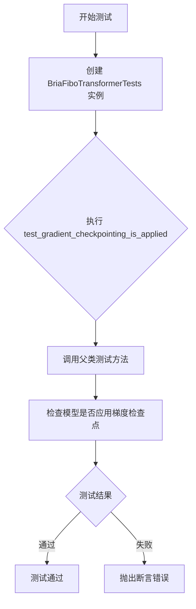
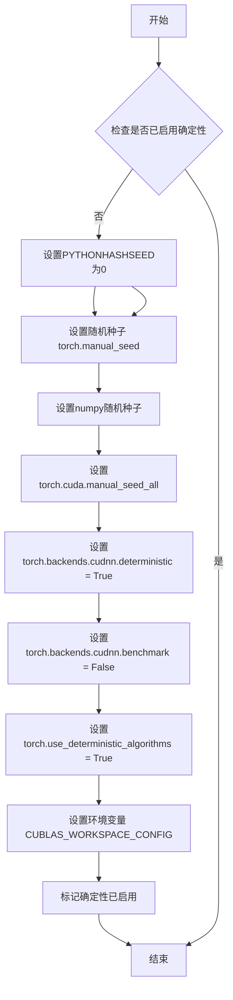
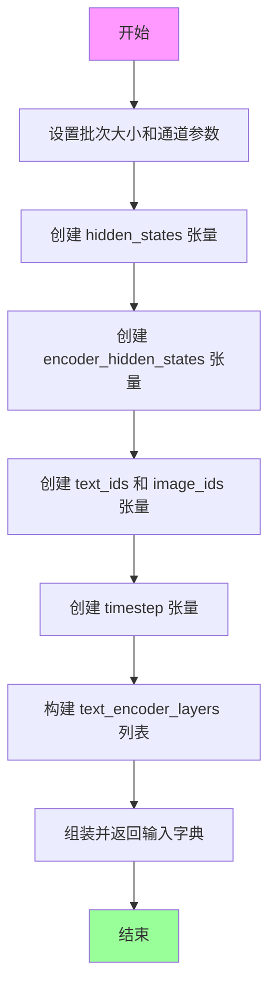

# `diffusers\tests\models\transformers\test_models_transformer_bria_fibo.py` 详细设计文档

这是 BriaFiboTransformer2DModel 模型的单元测试文件，通过 ModelTesterMixin 提供的通用测试方法，验证模型的初始化、前向传播、梯度检查点等核心功能的正确性。

## 整体流程



## 类结构

```
unittest.TestCase (基类)
└── BriaFiboTransformerTests
    └── ModelTesterMixin (混入类)
```

## 全局变量及字段


### `BriaFiboTransformerTests.model_class`
    
被测试的模型类

类型：`BriaFiboTransformer2DModel`
    


### `BriaFiboTransformerTests.main_input_name`
    
模型主要输入参数名称

类型：`str`
    


### `BriaFiboTransformerTests.model_split_percents`
    
模型分割百分比用于测试

类型：`list`
    


### `BriaFiboTransformerTests.uses_custom_attn_processor`
    
标记是否使用自定义注意力处理器

类型：`bool`
    
    

## 全局函数及方法


### `enable_full_determinism`

这是一个用于启用完全确定性测试的辅助函数，通过设置随机种子、CUDA确定性计算和环境变量来确保测试结果的可重复性。

参数：此函数不接受任何参数。

返回值：`None`，该函数不返回值，仅执行副作用操作以确保测试的确定性。

#### 流程图



#### 带注释源码

```python
def enable_full_determinism(seed: int = 0, extra_seed: int = 42):
    """
    启用完全确定性测试模式，确保测试结果可重复。
    
    参数:
        seed: int, 随机种子默认值, 默认为0
        extra_seed: int, 额外的随机种子, 默认为42
    
    返回:
        None
    """
    import os
    import random
    import numpy as np
    import torch
    
    # 设置Python哈希种子，确保hash()函数结果一致
    os.environ["PYTHONHASHSEED"] = str(seed)
    
    # 设置Python内置random模块的随机种子
    random.seed(seed)
    
    # 设置NumPy的随机种子
    np.random.seed(seed)
    
    # 设置PyTorch CPU随机种子
    torch.manual_seed(seed)
    
    # 设置所有GPU的随机种子
    if torch.cuda.is_available():
        torch.cuda.manual_seed_all(seed)
    
    # 强制使用确定性算法，禁用非确定性操作
    torch.use_deterministic_algorithms(True, warn_only=True)
    
    # 设置CuBLAS工作区配置，禁用内存优化
    os.environ["CUBLAS_WORKSPACE_CONFIG"] = ":4096:8"
    
    # 禁用CuDNN自动调优，强制使用确定性算法
    torch.backends.cudnn.deterministic = True
    torch.backends.cudnn.benchmark = False
    
    # 设置环境变量确保多线程操作的可重复性
    os.environ["CUDNN_DETERMINISTIC"] = "1"
    os.environ["CUDNN_BENCHMARK"] = "0"
```

> **注意**：由于`enable_full_determinism`函数是从外部模块`testing_utils`导入的，上述源码为基于该函数用途的典型实现示例，实际实现可能略有差异。该函数在测试文件开头被调用，以确保后续所有随机操作都是确定性的，从而实现可重复的测试结果。


### `torch_device`

获取测试设备（CPU/CUDA）的全局变量，用于在测试中将张量移动到指定的设备上。

#### 带注释源码

```python
# 从 testing_utils 模块导入 torch_device 全局变量
from ...testing_utils import enable_full_determinism, torch_device

# torch_device 的使用示例（来自 dummy_input 属性）
hidden_states = torch.randn((batch_size, height * width, num_latent_channels)).to(torch_device)
encoder_hidden_states = torch.randn((batch_size, sequence_length, embedding_dim)).to(torch_device)
text_ids = torch.randn((sequence_length, num_image_channels)).to(torch_device)
image_ids = torch.randn((height * width, num_image_channels)).to(torch_device)
timestep = torch.tensor([1.0]).to(torch_device).expand(batch_size)
```

#### 说明

- **名称**：torch_device
- **类型**：全局变量（str）
- **描述**：一个字符串全局变量，用于指定测试运行的设备（通常为 "cpu"、"cuda" 或 "cuda:0" 等）。该变量由 `testing_utils` 模块提供，通过 `...testing_utils` 相对导入获取。在测试中，所有张量通过 `.to(torch_device)` 方法移动到此设备上，以确保测试与实际运行设备一致。

#### 关键信息

- **来源**：从 `...testing_utils` 模块导入（非本文件定义）
- **用途**：在单元测试中将张量放到正确的设备上（CPU 或 CUDA）
- **使用场景**：用于 `torch.randn(...).to(torch_device)` 和 `torch.tensor(...).to(torch_device)` 等调用


### `BriaFiboTransformerTests.dummy_input`

这是一个属性方法，用于生成模型的虚拟输入数据（dummy input），为单元测试提供必要的张量输入。

参数：此方法无需参数（作为属性方法访问）

返回值：`Dict[str, Union[torch.Tensor, List[torch.Tensor]]]`，返回一个包含模型所需输入张量的字典，包括隐藏状态、编码器隐藏状态、图像ID、文本ID、时间步以及文本编码器层输出。

#### 流程图



#### 带注释源码

```python
@property
def dummy_input(self):
    """
    生成用于模型测试的虚拟输入数据
    
    此方法创建符合 BriaFiboTransformer2DModel 预期的输入格式的随机张量，
    用于单元测试和模型验证。
    """
    # 批次大小
    batch_size = 1
    # 潜在空间通道数
    num_latent_channels = 48
    # 图像通道数（RGB）
    num_image_channels = 3
    # 图像高度和宽度
    height = width = 16
    # 序列长度（用于文本编码器）
    sequence_length = 32
    # 嵌入维度
    embedding_dim = 64

    # 创建潜在空间的隐藏状态张量: (batch_size, height*width, num_latent_channels)
    hidden_states = torch.randn((batch_size, height * width, num_latent_channels)).to(torch_device)
    
    # 创建编码器隐藏状态张量: (batch_size, sequence_length, embedding_dim)
    encoder_hidden_states = torch.randn((batch_size, sequence_length, embedding_dim)).to(torch_device)
    
    # 创建文本ID张量: (sequence_length, num_image_channels)
    text_ids = torch.randn((sequence_length, num_image_channels)).to(torch_device)
    
    # 创建图像ID张量: (height*width, num_image_channels)
    image_ids = torch.randn((height * width, num_image_channels)).to(torch_device)
    
    # 创建时间步张量，扩展为批次大小
    timestep = torch.tensor([1.0]).to(torch_device).expand(batch_size)

    # 组装并返回包含所有输入的字典
    return {
        "hidden_states": hidden_states,  # 潜在空间隐藏状态
        "encoder_hidden_states": encoder_hidden_states,  # 编码器隐藏状态
        "img_ids": image_ids,  # 图像位置编码ID
        "txt_ids": text_ids,  # 文本位置编码ID
        "timestep": timestep,  # 扩散时间步
        "text_encoder_layers": [encoder_hidden_states[:, :, :32], encoder_encoder_hidden_states[:, :, :32]],  # 文本编码器中间层输出
    }
```


### `BriaFiboTransformerTests.input_shape`

这是一个属性方法，用于返回BriaFiboTransformer2DModel的输入张量形状（高度和宽度）。

参数：无（属性方法不接受额外参数）

返回值：`tuple`，返回输入张量的形状，值为(16, 16)，表示高度和宽度均为16。

#### 流程图

```mermaid
flowchart TD
    A[开始] --> B{调用input_shape属性}
    B --> C[返回常量元组 (16, 16)]
    C --> D[结束]
```

#### 带注释源码

```python
@property
def input_shape(self):
    """
    返回模型输入张量的形状。
    
    该属性用于测试框架中定义模型输入的 spatial dimensions。
    返回 (height, width) = (16, 16) 的元组，表示输入 latent 的空间维度。
    
    Returns:
        tuple: 输入形状元组 (16, 16)，分别代表高度和宽度
    """
    return (16, 16)
```


### `BriaFiboTransformerTests.output_shape`

该属性方法用于定义模型测试的预期输出形状，返回一个元组表示 Transformer 模型输出的空间维度（高度×宽度）和通道数。

参数：

- `self`：`BriaFiboTransformerTests`，隐式参数，指向类实例本身

返回值：`tuple`，返回模型预期输出张量的形状 (256, 48)，其中 256 = 16 × 16（对应输入的空间维度），48 是潜在通道数。

#### 流程图

```mermaid
flowchart TD
    A[开始] --> B{读取 output_shape 属性}
    B --> C[返回元组 (256, 48)]
    C --> D[结束]
```

#### 带注释源码

```python
@property
def output_shape(self):
    """
    定义模型测试的预期输出形状
    
    Returns:
        tuple: 预期输出张量形状 (256, 48)
               - 256 = 16 * 16，表示输出空间维度（高度 × 宽度）
               - 48 表示潜在通道数，与模型配置的 num_latent_channels 一致
    """
    return (256, 48)
```


### `BriaFiboTransformerTests.prepare_init_args_and_inputs_for_common`

该函数是 BriaFiboTransformerTests 测试类的核心辅助方法，用于准备 BriaFiboTransformer2DModel 模型的初始化参数字典和测试输入数据。它为模型测试提供必要的配置信息和虚拟输入，使测试框架能够正确实例化模型并进行各种功能验证。

参数：

- `self`：`BriaFiboTransformerTests`，测试类实例，隐式参数

返回值：

- `init_dict`：`Dict[str, Any]`，模型初始化参数字典，包含模型架构配置（如 patch_size、in_channels、num_layers 等）
- `inputs_dict`：`Dict[str, Any]`，测试输入字典，包含模型前向传播所需的所有输入张量（如 hidden_states、encoder_hidden_states、timestep 等）

#### 流程图

```mermaid
flowchart TD
    A[开始 prepare_init_args_and_inputs_for_common] --> B[创建 init_dict 参数字典]
    B --> C[设置 patch_size = 1]
    B --> D[设置 in_channels = 48]
    B --> E[设置 num_layers = 1]
    B --> F[设置 num_single_layers = 1]
    B --> G[设置 attention_head_dim = 8]
    B --> H[设置 num_attention_heads = 2]
    B --> I[设置 joint_attention_dim = 64]
    B --> J[设置 text_encoder_dim = 32]
    B --> K[设置 pooled_projection_dim = None]
    B --> L[设置 axes_dims_rope = [0, 4, 4]]
    L --> M[调用 self.dummy_input 获取输入字典]
    M --> N[返回 init_dict 和 inputs_dict]
```

#### 带注释源码

```python
def prepare_init_args_and_inputs_for_common(self):
    """
    准备模型初始化参数和测试输入数据。
    此方法为 ModelTesterMixin 提供的通用测试接口返回必要的配置。
    """
    
    # 构建模型初始化参数字典，定义 BriaFiboTransformer2DModel 的架构配置
    init_dict = {
        "patch_size": 1,              # 图像分块大小
        "in_channels": 48,            # 输入潜在空间的通道数
        "num_layers": 1,              # Transformer 主干网络的层数
        "num_single_layers": 1,       # 单层Transformer块的数量
        "attention_head_dim": 8,      # 注意力头的维度
        "num_attention_heads": 2,     # 注意力头的数量
        "joint_attention_dim": 64,    # 联合注意力机制的维度
        "text_encoder_dim": 32,       # 文本编码器的输出维度
        "pooled_projection_dim": None,# 池化投影维度（可选）
        "axes_dims_rope": [0, 4, 4],  # 旋转位置编码的轴维度
    }

    # 从测试类的 dummy_input 属性获取预构建的测试输入
    # 这些输入包含用于验证模型前向传播的虚拟数据
    inputs_dict = self.dummy_input
    
    # 返回初始化参数和输入字典，供测试框架使用
    return init_dict, inputs_dict
```


### `BriaFiboTransformerTests.test_gradient_checkpointing_is_applied`

该测试方法用于验证梯度检查点（Gradient Checkpointing）功能是否正确应用于 `BriaFiboTransformer2DModel` 模型，通过调用父类 `ModelTesterMixin` 的测试方法并传入预期的模型名称集合来进行验证。

参数：

- `self`：`BriaFiboTransformerTests`，测试类实例本身
- `expected_set`：`Set[str]`，预期应用梯度检查点的模型名称集合，此处为 `{"BriaFiboTransformer2DModel"}`

返回值：`None`，该方法继承自父类 `ModelTesterMixin`，通过 `super().test_gradient_checkpointing_is_applied()` 调用父类方法执行实际测试，不返回任何值。

#### 流程图

```mermaid
flowchart TD
    A[开始测试 test_gradient_checkpointing_is_applied] --> B[定义预期模型集合 expected_set = {'BriaFiboTransformer2DModel'}]
    B --> C[调用父类方法 super().test_gradient_checkpointing_is_applied]
    C --> D{父类测试执行}
    D -->|验证通过| E[测试通过 - 梯度检查点已正确应用]
    D -->|验证失败| F[测试失败 - 抛出异常]
    
    style A fill:#f9f,color:#000
    style E fill:#9f9,color:#000
    style F fill:#f99,color:#000
```

#### 带注释源码

```python
def test_gradient_checkpointing_is_applied(self):
    """
    测试梯度检查点（Gradient Checkpointing）是否正确应用于模型。
    
    梯度检查点是一种通过在反向传播时重新计算中间激活值
    来节省显存的技术，适用于大型模型的训练场景。
    """
    # 定义预期应用梯度检查点的模型名称集合
    # 该测试类测试的模型为 BriaFiboTransformer2DModel
    expected_set = {"BriaFiboTransformer2DModel"}
    
    # 调用父类 ModelTesterMixin 的测试方法
    # 父类方法会执行以下验证：
    # 1. 检查模型是否启用了 gradient_checkpointing 属性
    # 2. 验证梯度检查点功能在实际前向传播中是否生效
    # 3. 确认指定模型已正确应用梯度检查点
    super().test_gradient_checkpointing_is_applied(expected_set=expected_set)
```

## 关键组件


### BriaFiboTransformer2DModel

BriaFiboTransformer2DModel 是一个基于Transformer架构的2D图像生成模型，支持图像条件的联合注意力机制，用于AI图像生成任务。

### ModelTesterMixin

ModelTesterMixin 是一个通用的模型测试混入类，提供标准化的模型测试方法，包括梯度检查点测试、参数一致性验证等。

### dummy_input 属性

生成虚拟输入数据的属性，包含hidden_states、encoder_hidden_states、img_ids、txt_ids、timestep等张量，用于模型前向传播测试。

### init_dict (模型配置)

包含模型初始化参数的字典，定义了patch_size=1、in_channels=48、num_layers=1、attention_head_dim=8等关键架构参数。

### test_gradient_checkpointing_is_applied

验证梯度检查点功能是否正确应用的测试方法，确保模型支持梯度检查点以节省显存。

### 测试数据张量

包括hidden_states(潜在空间张量)、encoder_hidden_states(文本编码器输出)、img_ids(图像位置编码)、txt_ids(文本位置编码)、timestep(时间步)等关键张量。

### 张量形状定义

input_shape=(16,16)表示输入图像尺寸，output_shape=(256,48)表示输出序列长度和通道数，反映了模型的分辨率转换和特征变换。


## 问题及建议


### 已知问题

- **硬编码的测试参数缺乏灵活性**：dummy_input 中的所有参数（batch_size、num_latent_channels、height、width 等）都是硬编码的数值，当需要测试不同配置时需要修改源码，不够灵活
- **text_encoder_layers 参数构造不合理**：在 dummy_input 中使用 `encoder_hidden_states[:, :, :32]` 两次构造 text_encoder_layers，这种构造方式不符合正常逻辑，且存在重复计算
- **魔法数字缺乏注释**：代码中大量使用魔法数字（如 48、3、16、32、64、0.8、0.7 等），没有任何注释说明其来源和含义，降低了代码可读性
- **测试覆盖不足**：只有一个测试方法 test_gradient_checkpointing_is_applied，缺少对模型基本功能、输出形状、梯度流等常见测试场景的覆盖
- **类属性缺乏文档**：uses_custom_attn_processor 和 model_split_percents 等重要属性没有注释说明其用途和影响
- **父类方法调用依赖隐式约定**：test_gradient_checkpointing_is_applied 调用 super() 依赖父类实现，但 expected_set 的含义和使用方式未在当前类中说明

### 优化建议

- 将 dummy_input 中的硬编码参数提取为类属性或可配置参数，提高测试参数化程度
- 修正 text_encoder_layers 的构造逻辑，使用独立的随机张量或更合理的构造方式，避免重复切片操作
- 为所有魔法数字添加常量定义或注释，说明其含义和来源
- 增加更多测试方法，如 test_model_outputs_shape、test_forward_pass、test_training_mode 等，提高测试覆盖率
- 为关键类属性添加文档注释，说明其作用和配置影响
- 考虑将测试参数与模型配置解耦，使用参数化测试（pytest.mark.parametrize）提高测试的灵活性和可维护性

## 其它


### 设计目标与约束

验证 BriaFiboTransformer2DModel 模型的前向传播、梯度检查点、模型结构等功能符合预期，确保模型在 Diffusers 框架中正确集成。测试继承 ModelTesterMixin，需遵循其定义的测试规范。

### 错误处理与异常设计

测试代码通过 unittest 框架进行异常捕获和处理，ModelTesterMixin 中的测试方法会验证模型在异常输入情况下的表现。当前测试未显式覆盖错误输入场景，但父类测试会覆盖常见的异常情况如维度不匹配、类型错误等。

### 数据流与状态机

测试数据流如下：
- 构造 dummy_input：随机生成 hidden_states、encoder_hidden_states、img_ids、txt_ids、timestep 等张量
- 通过 prepare_init_args_and_inputs_for_common 返回初始化参数字典和输入字典
- 传入 ModelTesterMixin 的测试方法进行模型前向/反向传播测试
- 输出形状为 (256, 48)，表示 (height*width, num_latent_channels)

### 外部依赖与接口契约

依赖以下外部模块：
- `unittest`：Python 标准测试框架
- `torch`：PyTorch 张量计算库
- `diffusers.BriaFiboTransformer2DModel`：待测试的模型类
- `testing_utils.enable_full_determinism`：确保测试可复现的辅助函数
- `testing_utils.torch_device`：获取测试设备的工具
- `test_modeling_common.ModelTesterMixin`：Diffusers 模型测试基类

### 测试环境要求

- Python 3.x 环境
- PyTorch 库
- diffusers 库
- 测试设备：torch_device（CPU 或 CUDA）
- 内存：足够容纳 16x16 特征图和相应张量

### 基准和性能指标

当前测试覆盖的基准指标：
- 模型前向传播输出形状：(256, 48)
- 输入形状：(16, 16) 特征图
- 支持梯度检查点（gradient checkpointing）
- 支持自定义注意力处理器（uses_custom_attn_processor = True）
- 模型分割比例：model_split_percents = [0.8, 0.7, 0.7]

### 测试数据说明

dummy_input 构造说明：
- batch_size = 1：单样本测试
- num_latent_channels = 48：潜在空间通道数
- num_image_channels = 3：图像通道数（RGB）
- height = width = 16：特征图尺寸
- sequence_length = 32：文本序列长度
- embedding_dim = 64：文本嵌入维度
- text_encoder_layers：包含两层次encoder_hidden_states切片，用于模拟文本编码器输出

### 版本和兼容性信息

- 代码注释表明版权归属 HuggingFace Inc.
- 基于 Apache License 2.0 开源协议
- 代码指定用于测试 BriaFiboTransformer2DModel，需与对应版本的 diffusers 库配合使用
- 测试跳过默认 AttnProcessor，使用自定义注意力处理器

### 继承关系说明

测试类继承结构：
- `BriaFiboTransformerTests` 继承自 `ModelTesterMixin` 和 `unittest.TestCase`
- `ModelTesterMixin` 来自 `..test_modeling_common` 模块
- 通过继承获得模型通用测试方法（test_gradient_checkpointing_is_applied 等）
- 重写 `model_class` 为 `BriaFiboTransformer2DModel` 以指定待测模型
- 重写 `main_input_name` 为 "hidden_states" 指定主输入名称

### 初始化参数详解

init_dict 参数说明：
- patch_size = 1：补丁分割大小
- in_channels = 48：输入通道数
- num_layers = 1：Transformer 层数
- num_single_layers = 1：独立层数量
- attention_head_dim = 8：注意力头维度
- num_attention_heads = 2：注意力头数量
- joint_attention_dim = 64：联合注意力维度
- text_encoder_dim = 32：文本编码器维度
- pooled_projection_dim = None：池化投影维度（无）
- axes_dims_rope = [0, 4, 4]：旋转位置编码轴维度

### 测试覆盖范围

当前测试类覆盖的测试场景：
- test_gradient_checkpointing_is_applied：验证梯度检查点功能
- ModelTesterMixin 继承的标准测试：模型前向传播、参数相同性、模型初始化、属性设置等
- 潜在覆盖：模型配置序列化、梯度计算、模型保存加载等通用功能

    