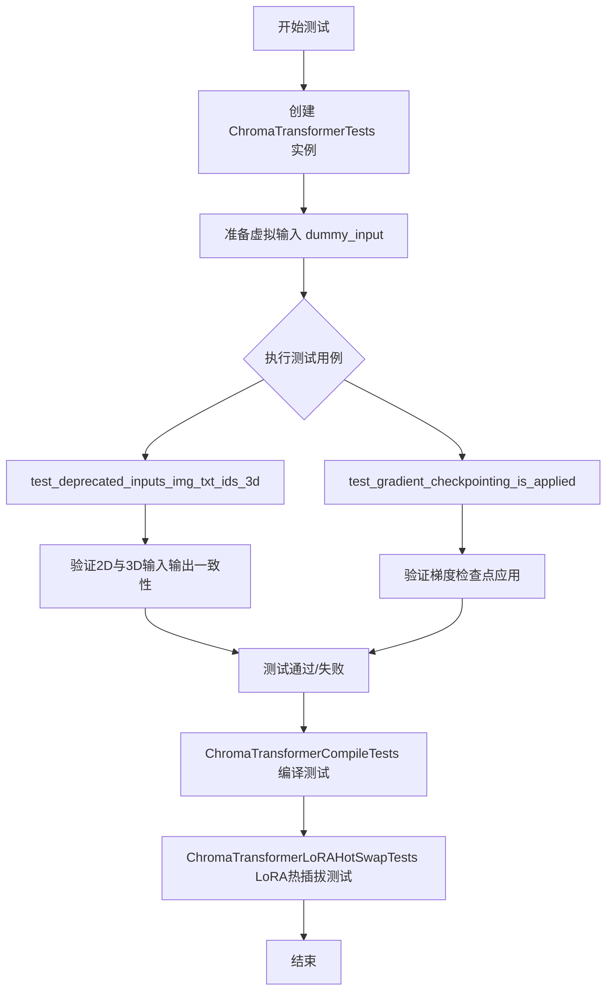
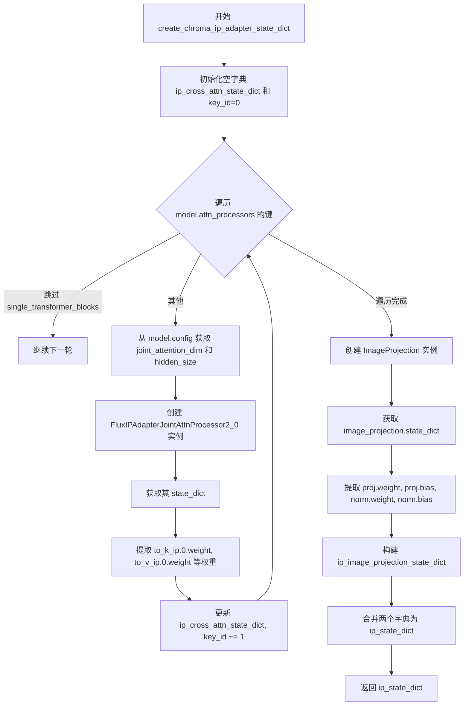
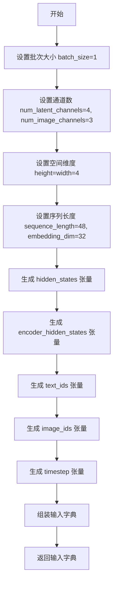
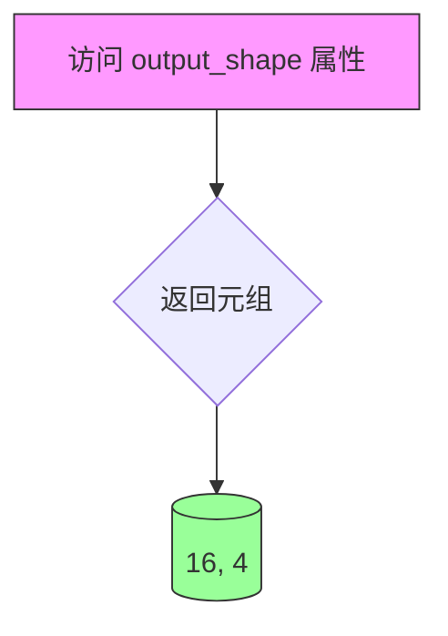
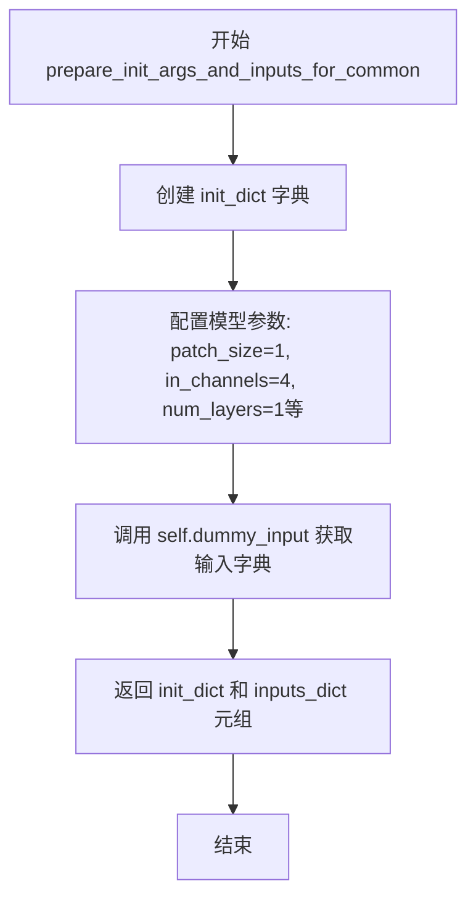
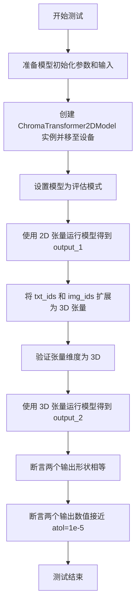
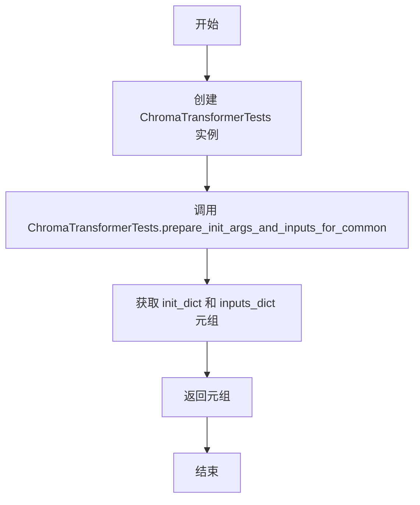

# `diffusers\tests\models\transformers\test_models_transformer_chroma.py` 详细设计文档

该文件是 ChromaTransformer2DModel 的单元测试文件，包含了模型的基本功能测试、编译测试和 LoRA 热插拔测试，用于验证 Chroma 变换器模型在图像生成任务中的正确性。

## 整体流程



## 类结构

```
unittest.TestCase
├── ChromaTransformerTests (ModelTesterMixin)
│   ├── test_deprecated_inputs_img_txt_ids_3d()
│   └── test_gradient_checkpointing_is_applied()
├── ChromaTransformerCompileTests (TorchCompileTesterMixin)
│   └── (继承自 TorchCompileTesterMixin)
└── ChromaTransformerLoRAHotSwapTests (LoraHotSwappingForModelTesterMixin)
    └── (继承自 LoraHotSwappingForModelTesterMixin)
```

## 全局变量及字段


### `enable_full_determinism`
    
从testing_utils导入的函数，用于启用完全确定性以确保测试结果可复现

类型：`function`
    


### `create_chroma_ip_adapter_state_dict`
    
全局函数，用于生成Chroma IP适配器的状态字典，包含image_proj和ip_adapter两部分权重

类型：`function`
    


### `ChromaTransformerTests.model_class`
    
指定测试的模型类为ChromaTransformer2DModel

类型：`type`
    


### `ChromaTransformerTests.main_input_name`
    
模型的主要输入张量名称为hidden_states

类型：`str`
    


### `ChromaTransformerTests.model_split_percents`
    
模型分割百分比用于测试，值为[0.8, 0.7, 0.7]

类型：`list[float]`
    


### `ChromaTransformerTests.uses_custom_attn_processor`
    
标志位，表示使用自定义注意力处理器而非默认AttnProcessor

类型：`bool`
    


### `ChromaTransformerCompileTests.model_class`
    
指定测试的模型类为ChromaTransformer2DModel

类型：`type`
    


### `ChromaTransformerLoRAHotSwapTests.model_class`
    
指定测试的模型类为ChromaTransformer2DModel

类型：`type`
    
    

## 全局函数及方法


### `create_chroma_ip_adapter_state_dict`

该函数用于为 ChromaTransformer2DModel 创建 IP Adapter（图像提示适配器）的状态字典，包含图像投影层权重和跨注意力权重，用于支持多模态图像提示功能。

参数：

- `model`：`ChromaTransformer2DModel`，输入的 ChromaTransformer2DModel 模型实例，用于获取配置信息和注意力处理器

返回值：`Dict`，返回包含 "image_proj"（图像投影层权重）和 "ip_adapter"（跨注意力权重）的状态字典

#### 流程图



#### 带注释源码

```python
def create_chroma_ip_adapter_state_dict(model):
    # 初始化用于存储 IP Adapter 跨注意力权重的字典
    # "ip_adapter" (cross-attention weights)
    ip_cross_attn_state_dict = {}
    key_id = 0  # 用于为每个注意力处理器分配唯一键ID

    # 遍历模型的所有注意力处理器
    for name in model.attn_processors.keys():
        # 跳过 single_transformer_blocks，这些不需要 IP Adapter
        if name.startswith("single_transformer_blocks"):
            continue

        # 从模型配置中获取联合注意力维度和隐藏大小
        joint_attention_dim = model.config["joint_attention_dim"]
        hidden_size = model.config["num_attention_heads"] * model.config["attention_head_dim"]
        
        # 创建 FluxIPAdapterJointAttnProcessor2_0 实例用于生成权重模板
        sd = FluxIPAdapterJointAttnProcessor2_0(
            hidden_size=hidden_size, cross_attention_dim=joint_attention_dim, scale=1.0
        ).state_dict()
        
        # 从模板中提取 IP 适配器的关键权重（k 和 v 投影）
        ip_cross_attn_state_dict.update(
            {
                f"{key_id}.to_k_ip.weight": sd["to_k_ip.0.weight"],
                f"{key_id}.to_v_ip.weight": sd["to_v_ip.0.weight"],
                f"{key_id}.to_k_ip.bias": sd["to_k_ip.0.bias"],
                f"{key_id}.to_v_ip.bias": sd["to_v_ip.0.bias"],
            }
        )

        key_id += 1  # 递增键ID

    # "image_proj" (ImageProjection layer weights)
    # 创建图像投影层用于处理图像嵌入

    image_projection = ImageProjection(
        cross_attention_dim=model.config["joint_attention_dim"],
        image_embed_dim=model.config["pooled_projection_dim"],
        num_image_text_embeds=4,
    )

    # 提取图像投影层的权重
    ip_image_projection_state_dict = {}
    sd = image_projection.state_dict()
    ip_image_projection_state_dict.update(
        {
            "proj.weight": sd["image_embeds.weight"],
            "proj.bias": sd["image_embeds.bias"],
            "norm.weight": sd["norm.weight"],
            "norm.bias": sd["norm.bias"],
        }
    )

    del sd  # 清理临时变量
    
    # 合并图像投影和 IP 适配器状态字典
    ip_state_dict = {}
    ip_state_dict.update({"image_proj": ip_image_projection_state_dict, "ip_adapter": ip_cross_attn_state_dict})
    return ip_state_dict
```


### `ChromaTransformerTests.dummy_input`

这是一个测试用的属性方法（property），用于生成 ChromaTransformer2DModel 模型推理所需的虚拟输入数据，包括隐藏状态、编码器隐藏状态、图像ID、文本ID和时间步等张量，为模型测试提供标准化的输入格式。

参数：

- 该方法无参数（作为 `@property` 装饰的属性方法）

返回值：`dict`，返回包含模型推理所需所有输入张量的字典，包括 `hidden_states`（潜在空间隐藏状态）、`encoder_hidden_states`（编码器隐藏状态/文本嵌入）、`img_ids`（图像位置编码ID）、`txt_ids`（文本位置编码ID）和 `timestep`（扩散时间步）。

#### 流程图



#### 带注释源码

```python
@property
def dummy_input(self):
    """
    生成用于模型测试的虚拟输入数据。
    
    该属性方法构造了 ChromaTransformer2DModel 推理所需的全部输入张量，
    包括潜在空间表示、文本嵌入、位置编码和时间步信息。
    """
    # 批次大小设置为1，用于单样本测试
    batch_size = 1
    # 潜在空间的通道数（对应VAE的 latent channels）
    num_latent_channels = 4
    # 图像RGB通道数
    num_image_channels = 3
    # 空间维度设为4x4
    height = width = 4
    # 文本序列长度48，嵌入维度32
    sequence_length = 48
    embedding_dim = 32

    # 创建随机初始化的隐藏状态张量 (batch, seq_len, channels)
    # 形状: (1, 16, 4) - 其中16=4*4为空间位置数
    hidden_states = torch.randn((batch_size, height * width, num_latent_channels)).to(torch_device)
    
    # 创建随机文本/图像条件嵌入 (batch, seq_len, embed_dim)
    # 形状: (1, 48, 32)
    encoder_hidden_states = torch.randn((batch_size, sequence_length, embedding_dim)).to(torch_device)
    
    # 创建文本位置ID张量 (seq_len, channels)
    # 形状: (48, 3)
    text_ids = torch.randn((sequence_length, num_image_channels)).to(torch_device)
    
    # 创建图像位置ID张量 (seq_len, channels)
    # 形状: (16, 3) - 对应4x4=16个空间位置
    image_ids = torch.randn((height * width, num_image_channels)).to(torch_device)
    
    # 创建时间步张量，值为1.0，扩展到批次大小
    # 形状: (1,)
    timestep = torch.tensor([1.0]).to(torch_device).expand(batch_size)

    # 返回包含所有输入的字典，供模型前向传播使用
    return {
        "hidden_states": hidden_states,      # 潜在空间表示
        "encoder_hidden_states": encoder_hidden_states,  # 条件嵌入
        "img_ids": image_ids,                # 图像位置编码
        "txt_ids": text_ids,                 # 文本位置编码
        "timestep": timestep,                # 扩散时间步
    }
```


### `ChromaTransformerTests.input_shape`

这是一个属性方法（property），用于返回 ChromaTransformer2DModel 测试类的输入形状元组。在测试框架中，input_shape 定义了模型预期的输入维度，通常用于配置测试数据和验证模型输出。

参数：

- （无参数）

返回值：`Tuple[int, int]`，返回输入形状元组 (16, 4)，表示高度和宽度的维度

#### 流程图

```mermaid
flowchart TD
    A[调用 input_shape 属性] --> B{是否是第一次访问}
    B -->|是| C[返回元组 (16, 4)]
    B -->|否| C
    C --> D[提供测试框架使用]
    
    style A fill:#e1f5fe
    style C fill:#c8e6c9
```

#### 带注释源码

```python
@property
def input_shape(self):
    """
    返回 ChromaTransformer2DModel 的输入形状元组
    
    该属性供 ModelTesterMixin 基类使用，用于：
    1. 确定测试数据的空间维度
    2. 验证模型输出的形状是否与预期匹配
    3. 配置测试框架中的模型参数
    
    Returns:
        Tuple[int, int]: 输入形状元组，格式为 (height, width)
                        - 16: 表示高度维度
                        - 4: 表示宽度维度
    """
    return (16, 4)
```


### `ChromaTransformerTests.output_shape`

该属性定义了 ChromaTransformer2DModel 的输出张量形状，用于测试框架中验证模型输出维度是否符合预期。

参数： 无

返回值：`tuple`，返回模型输出的预期形状为 (16, 4)，其中 16 表示序列长度/空间维度的乘积，4 表示潜在通道数。

#### 流程图



#### 带注释源码

```python
@property
def output_shape(self):
    """
    定义模型输出的预期形状。
    
    该属性用于测试框架中，便于在多个测试用例中统一引用输出形状。
    测试框架会比较模型实际输出的形状与该属性返回的形状是否一致。
    
    Returns:
        tuple: 包含两个整数的元组
            - 第一个元素 (16): 表示 (height * width) 的空间维度，即 4*4=16
            - 第二个元素 (4): 表示潜在通道数 (num_latent_channels)，与输入的 in_channels 对应
    """
    return (16, 4)
```


### `ChromaTransformerTests.prepare_init_args_and_inputs_for_common`

该方法用于为通用测试准备模型初始化参数字典和输入数据字典，初始化参数包含模型架构配置（如patch_size、通道数、层数、注意力头维度等），输入数据包含隐藏状态、编码器隐藏状态、图像和文本ID以及时间步。

参数：

- `self`：`ChromaTransformerTests`，调用此方法的测试类实例本身

返回值：`Tuple[Dict, Dict]`，返回一个元组
- 第一个元素 `init_dict`：`Dict[str, Any]`，包含模型初始化所需的各种配置参数
- 第二个元素 `inputs_dict`：`Dict[str, Tensor]`，包含模型前向传播所需的各种输入张量

#### 流程图



#### 带注释源码

```python
def prepare_init_args_and_inputs_for_common(self):
    """
    准备模型初始化参数和输入数据，用于通用测试场景。
    
    Returns:
        Tuple[Dict, Dict]: 包含初始化参数字典和输入数据字典的元组
    """
    # 定义模型初始化参数字典，包含ChromaTransformer2DModel所需的各种配置
    init_dict = {
        "patch_size": 1,                    # 补丁大小
        "in_channels": 4,                   # 输入通道数（潜在空间通道）
        "num_layers": 1,                    # 变换器层数
        "num_single_layers": 1,              # 单transformer块数量
        "attention_head_dim": 16,           # 每个注意力头的维度
        "num_attention_heads": 2,           # 注意力头数量
        "joint_attention_dim": 32,          # 联合注意力维度
        "axes_dims_rope": [4, 4, 8],         # RoPE旋转位置编码的轴维度
        "approximator_num_channels": 8,     # 近似器的通道数
        "approximator_hidden_dim": 16,      # 近似器的隐藏层维度
        "approximator_layers": 1,            # 近似器的层数
    }

    # 从测试类获取预定义的虚拟输入数据
    inputs_dict = self.dummy_input
    
    # 返回初始化参数和输入数据的元组，供测试框架使用
    return init_dict, inputs_dict
```


### `ChromaTransformerTests.test_deprecated_inputs_img_txt_ids_3d`

验证当 `img_ids` 和 `txt_ids` 作为 3D 张量（已弃用的输入格式）时，模型的输出应与 2D 张量输入时的输出保持一致，确保向后兼容性。

参数：

- `self`：`ChromaTransformerTests` 实例方法，无需显式传参

返回值：`None`，该方法为 `unittest.TestCase` 的测试方法，通过断言验证输出，不返回具体值

#### 流程图



#### 带注释源码

```python
def test_deprecated_inputs_img_txt_ids_3d(self):
    """
    测试当 img_ids 和 txt_ids 作为 3D 张量（已弃用）
    与作为 2D 张量时的输出是否一致
    """
    # 步骤1: 获取模型初始化参数和测试输入
    init_dict, inputs_dict = self.prepare_init_args_and_inputs_for_common()
    
    # 步骤2: 创建模型实例
    model = self.model_class(**init_dict)
    # 将模型移至指定设备（如 CUDA）
    model.to(torch_device)
    # 设置为评估模式，关闭 dropout 等训练特性
    model.eval()

    # 步骤3: 使用 2D 张量作为输入运行模型
    with torch.no_grad():
        # to_tuple()[0] 获取第一个输出（hidden_states）
        output_1 = model(**inputs_dict).to_tuple()[0]

    # 步骤4: 将 txt_ids 和 img_ids 转换为 3D 张量（模拟弃用的输入格式）
    # unsqueeze(0) 在第0维添加批次维度，使 2D -> 3D
    text_ids_3d = inputs_dict["txt_ids"].unsqueeze(0)
    image_ids_3d = inputs_dict["img_ids"].unsqueeze(0)

    # 步骤5: 验证转换后的张量维度正确
    assert text_ids_3d.ndim == 3, "text_ids_3d should be a 3d tensor"
    assert image_ids_3d.ndim == 3, "img_ids_3d should be a 3d tensor"

    # 步骤6: 更新输入字典，使用 3D 张量
    inputs_dict["txt_ids"] = text_ids_3d
    inputs_dict["img_ids"] = image_ids_3d

    # 步骤7: 使用 3D 张量运行模型
    with torch.no_grad():
        output_2 = model(**inputs_dict).to_tuple()[0]

    # 步骤8: 验证输出结果
    # 断言1: 输出形状必须相同
    self.assertEqual(output_1.shape, output_2.shape)
    # 断言2: 输出数值必须接近（容差 1e-5），确保 3D/2D 输入产生相同结果
    self.assertTrue(
        torch.allclose(output_1, output_2, atol=1e-5),
        msg="output with deprecated inputs (img_ids and txt_ids as 3d torch tensors) are not equal as them as 2d inputs",
    )
```


### `ChromaTransformerTests.test_gradient_checkpointing_is_applied`

该测试方法用于验证 ChromaTransformer2DModel 模型是否正确应用了梯度检查点（Gradient Checkpointing）技术，通过调用父类测试用例并指定期望的模型类集合来确认检查点功能是否按预期工作。

参数：

- `self`：`ChromaTransformerTests` 实例本身，隐式参数，表示当前测试类的实例
- `expected_set`：`Set[str]`，期望的模型类名称集合，此处为 `{"ChromaTransformer2DModel"}`，用于验证梯度检查点是否应用于指定的模型类

返回值：`None`，该方法为测试用例，通过断言验证行为，不返回具体数值

#### 流程图

```mermaid
flowchart TD
    A[开始测试 test_gradient_checkpointing_is_applied] --> B[设置 expected_set = {'ChromaTransformer2DModel'}]
    B --> C[调用父类 test_gradient_checkpointing_is_applied 方法]
    C --> D{父类方法执行}
    D -->|验证通过| E[测试通过 - 梯度检查点已正确应用]
    D -->|验证失败| F[测试失败 - 抛出断言错误]
    
    subgraph 父类方法内部逻辑
        G[创建 ChromaTransformer2DModel 实例] --> H[启用梯度检查点]
        H --> I[执行前向传播]
        I --> J[执行反向传播计算梯度]
        J --> K[检查模型参数是否使用梯度检查点]
        K --> L{检查结果}
    end
    
    C -.-> G
```

#### 带注释源码

```python
def test_gradient_checkpointing_is_applied(self):
    """
    测试方法：验证 ChromaTransformer2DModel 模型是否应用了梯度检查点
    
    梯度检查点是一种内存优化技术，通过在反向传播时重新计算前向传播的中间结果，
    来换取更低的显存占用。该测试确保该模型正确启用了此优化。
    """
    # 定义期望的模型类集合，用于在父类测试中验证
    # ChromaTransformer2DModel 是该测试类对应的模型类
    expected_set = {"ChromaTransformer2DModel"}
    
    # 调用父类 ModelTesterMixin 的测试方法
    # 父类方法会执行以下操作：
    # 1. 实例化 ChromaTransformer2DModel 模型
    # 2. 启用模型的梯度检查点功能 (通常通过 model.enable_gradient_checkpointing())
    # 3. 执行前向传播和反向传播
    # 4. 验证模型中确实使用了梯度检查点（检查 forward 函数是否被替换为 checkpoint 函数）
    super().test_gradient_checkpointing_is_applied(expected_set=expected_set)
```


### `ChromaTransformerCompileTests.prepare_init_args_and_inputs_for_common`

该方法是一个测试辅助函数，用于为 ChromaTransformer2DModel 编译测试准备初始化参数和输入数据。它通过调用 `ChromaTransformerTests` 类的相同方法来获取标准的模型初始化配置和测试输入，确保编译测试与普通模型测试使用一致的参数配置。

参数：

- （无显式参数，仅包含隐式 `self` 参数）

返回值：`Tuple[Dict, Dict]`，返回包含模型初始化参数字典和输入数据字典的元组。其中第一个字典包含模型的配置参数（如 patch_size、in_channels、num_layers 等），第二个字典包含用于模型前向传播的输入数据（如 hidden_states、encoder_hidden_states、img_ids、txt_ids、timestep）。

#### 流程图



#### 带注释源码

```python
def prepare_init_args_and_inputs_for_common(self):
    """
    准备 ChromaTransformer2DModel 的初始化参数和输入数据。
    
    该方法作为测试类的辅助函数，用于为模型编译测试准备必要的参数。
    它委托给 ChromaTransformerTests 类的同名方法来获取标准的初始化配置，
    确保不同测试场景下参数的一致性。
    
    Returns:
        Tuple[Dict, Dict]: 包含两个字典的元组:
            - init_dict: 模型初始化参数字典
            - inputs_dict: 模型输入数据字典
    """
    # 调用 ChromaTransformerTests 类的静态方法获取初始化参数和输入
    # 返回值为 (init_dict, inputs_dict) 元组
    return ChromaTransformerTests().prepare_init_args_and_inputs_for_common()
```


### `ChromaTransformerLoRAHotSwapTests.prepare_init_args_and_inputs_for_common`

该方法是一个测试辅助方法，用于为 LoRA Hot Swapping 测试准备模型初始化参数和输入数据。它通过委托方式调用 `ChromaTransformerTests` 类的相同方法来获取标准的初始化字典和输入字典。

参数：

- `self`：`ChromaTransformerLoRAHotSwapTests`，隐式参数，表示当前测试类实例

返回值：`tuple[dict, dict]`，返回包含两个字典的元组——第一个字典 (`init_dict`) 包含 ChromaTransformer2DModel 的初始化参数，第二个字典 (`inputs_dict`) 包含用于模型前向传播的输入数据

#### 流程图

```mermaid
flowchart TD
    A[开始] --> B[创建 ChromaTransformerTests 实例]
    B --> C[调用 ChromaTransformerTests.prepare_init_args_and_inputs_for_common]
    C --> D[构建 init_dict: patch_size=1, in_channels=4, num_layers=1, 等]
    D --> E[获取 self.dummy_input 作为 inputs_dict]
    E --> F[返回 (init_dict, inputs_dict) 元组]
    F --> G[结束]
```

#### 带注释源码

```python
def prepare_init_args_and_inputs_for_common(self):
    """
    准备 ChromaTransformer2DModel 的初始化参数和输入数据。
    用于 LoRA Hot Swapping 测试场景。
    
    Returns:
        tuple: (init_dict, inputs_dict) 元组
            - init_dict: 模型初始化参数字典
            - inputs_dict: 模型输入字典，包含 hidden_states, encoder_hidden_states, img_ids, txt_ids, timestep
    """
    # 委托给 ChromaTransformerTests 类获取标准初始化参数和输入
    return ChromaTransformerTests().prepare_init_args_and_inputs_for_common()
```

## 关键组件


### ChromaTransformer2DModel

HuggingFace diffusers 库中的2D变换器模型，用于处理图像和文本嵌入的联合注意力计算，支持IP Adapter图像条件注入。

### FluxIPAdapterJointAttnProcessor2_0

跨注意力处理器实现，用于IP Adapter机制，将图像嵌入注入到模型的注意力计算中，支持可学习的图像键值投影。

### ImageProjection

图像投影层，将图像嵌入向量投影到与文本嵌入相同的特征空间，支持跨模态特征对齐和归一化处理。

### IP Adapter 状态字典构建

创建包含图像投影权重和跨注意力权重的完整状态字典，用于模型权重加载和权重初始化，包含to_k_ip、to_v_ip投影权重及归一化层权重。

### dummy_input

虚拟输入生成器，创建符合模型输入维度的随机张量，包括隐藏状态、编码器隐藏状态、图像ID、文本ID和时间步，用于模型前向传播测试。

### 梯度检查点测试

验证ChromaTransformer2DModel是否正确应用梯度检查点技术以降低显存占用的测试用例。

### Torch Compile 测试

验证ChromaTransformer2DModel与PyTorch 2.0 torch.compile编译优化功能兼容性的测试类。

### LoRA Hot Swapping 测试

验证ChromaTransformer2DModel支持LoRA权重热插拔功能的测试类，允许在不重新加载完整模型的情况下动态切换LoRA权重。

### 3D张量兼容性测试

验证模型对废弃的3D张量输入（img_ids和txt_ids）的向后兼容性，确保2D和3D输入产生一致的输出结果。


## 问题及建议


### 已知问题

-   **魔法数字和硬编码值**：代码中存在多处硬编码的配置值，如 `num_image_text_embeds=4`、`batch_size=1`、`sequence_length=48`、`embedding_dim=32`、`height = width = 4` 等，这些值缺乏配置化，修改时需要多处改动。
-   **代码重复**：`ChromaTransformerCompileTests` 和 `ChromaTransformerLoRAHotSwapTests` 类中的 `prepare_init_args_and_inputs_for_common` 方法通过 `ChromaTransformerTests()` 创建新实例来调用相同逻辑，造成不必要的对象创建和代码重复。
-   **资源管理不完善**：`create_chroma_ip_adapter_state_dict` 函数中显式使用了 `del sd` 删除变量，但 `image_projection` 对象在函数结束时才被自动回收，且删除操作的意义不明显，代码意图不够清晰。
-   **测试数据不可复现**：`dummy_input` 属性每次访问时都会生成新的随机张量，没有使用固定随机种子，导致测试结果不可复现，增加调试难度。
-   **配置依赖风险**：`joint_attention_dim` 和 `hidden_size` 的计算依赖于 `model.config` 中的多个字段，如果配置值不合法或字段缺失，代码可能运行失败但缺乏显式验证。
-   **冗余变量计算**：在 `create_chroma_ip_adapter_state_dict` 中，`joint_attention_dim` 和 `hidden_size` 在循环外部定义但仅在循环内使用一次，可以考虑直接内联以减少作用域。

### 优化建议

-   **配置化与常量提取**：将魔法数字提取为类常量或配置文件，例如定义 `DEFAULT_NUM_IMAGE_TEXT_EMBEDS = 4`、`DEFAULT_SEQUENCE_LENGTH = 48` 等，提高代码可维护性。
-   **消除代码重复**：将 `prepare_init_args_and_inputs_for_common` 逻辑提取为模块级函数或使用 Mixin 类的类方法直接调用，避免不必要的实例创建。
-   **改进资源管理**：移除显式的 `del sd` 操作，依赖 Python 的垃圾回收机制；如果需要显式管理资源，使用上下文管理器或确保文档说明意图。
-   **固定随机种子**：在 `dummy_input` 属性或测试类中使用 `@property` 结合 `functools.cached_property`，或显式设置 `torch.manual_seed()` 以确保测试数据可复现。
-   **添加配置验证**：在 `create_chroma_ip_adapter_state_dict` 函数或模型初始化时添加配置字段的存在性和合法性检查，提供清晰的错误信息。
-   **简化计算逻辑**：将 `joint_attention_dim` 和 `hidden_size` 的计算内联到使用位置，或封装为辅助函数，减少变量生命周期和不必要的中间变量。

## 其它


### 设计目标与约束

本测试套件的主要设计目标是验证 ChromaTransformer2DModel 的功能正确性，包括模型前向传播、梯度检查点、torch.compile 编译支持以及 LoRA 热插拔能力。测试约束包括：模型为小型 transformer（num_layers=1, num_single_layers=1），使用特定的输入维度（height=width=4, sequence_length=48），并假设运行环境具备 CUDA 支持（torch_device）。

### 错误处理与异常设计

测试代码主要通过 unittest 框架的断言机制进行错误检测。关键异常处理场景包括：1) test_deprecated_inputs_img_txt_ids_3d 中使用 torch.allclose 进行数值近似比较（atol=1e-5），允许浮点精度误差；2) 梯度检查点测试通过反射检查模型类名是否符合预期；3) 潜在错误包括模型加载失败、GPU 内存不足、输入维度不匹配等。

### 数据流与状态机

测试数据流如下：dummy_input 属性生成随机张量（hidden_states, encoder_hidden_states, img_ids, txt_ids, timestep）→ prepare_init_args_and_inputs_for_common 组装初始化参数字典和输入字典 → 测试方法执行模型前向/反向传播 → 输出结果进行断言验证。状态转换包括：初始化状态 → eval 模式 → torch.no_grad() 上下文 → 输出状态。

### 外部依赖与接口契约

主要外部依赖包括：1) torch 库（张量运算）；2) diffusers 包（ChromaTransformer2DModel, FluxIPAdapterJointAttnProcessor2_0, ImageProjection）；3) 项目内部模块（testing_utils, test_modeling_common）。接口契约方面，ChromaTransformer2DModel 接受 init_dict 配置参数和 inputs_dict 输入张量，返回元组形式输出。

### 性能考量与基准测试

测试覆盖的性能维度包括：1) 梯度检查点内存效率（test_gradient_checkpointing_is_applied）；2) torch.compile 编译支持与执行速度（ChromaTransformerCompileTests）；3) LoRA 权重热插拔延迟（ChromaTransformerLoRAHotSwapTests）。测试使用较小的模型规模（model_split_percents=[0.8, 0.7, 0.7]）以平衡测试覆盖率和执行时间。

### 配置参数详解

关键配置参数包括：patch_size=1（图像分块大小）、in_channels=4（潜在通道数）、num_layers=1 和 num_single_layers=1（ transformer 层数）、attention_head_dim=16 和 num_attention_heads=2（注意力头维度与数量）、joint_attention_dim=32（联合注意力维度）、axes_dims_rope=[4,4,8]（ROPE 轴维度）、approximator_num_channels=8 和 approximator_hidden_dim=16（逼近器参数）、approximator_layers=1（逼近器层数）。

### 测试覆盖范围

测试覆盖的功能点包括：1) 基础模型前向传播与输出形状验证（通过 ModelTesterMixin）；2) 模型状态字典生成与加载；3) 3D 张量（img_ids/txt_ids）向后兼容性（test_deprecated_inputs_img_txt_ids_3d）；4) 梯度检查点启用验证；5) torch.compile 模式支持；6) LoRA 权重热插拔机制。IP 适配器状态字典创建（create_chroma_ip_adapter_state_dict）验证了 cross-attention 权重和图像投影层的导出。

### 假设与前置条件

测试执行的前置条件包括：1) CUDA 可用（torch_device 应为 "cuda"）；2) diffusers 库已正确安装；3) testing_utils 模块提供 enable_full_determinism 和 torch_device；4) 基础模型类 ModelTesterMixin、TorchCompileTesterMixin、LoraHotSwappingForModelTesterMixin 已实现；5) 输入张量维度必须匹配模型配置。

### 已知限制与扩展方向

当前测试的局限性包括：1) 仅测试单层 transformer（num_layers=1），未覆盖深层网络场景；2) 批次大小固定为 1，未测试批量推理；3) 缺少定量性能基准测试（benchmark）；4) 未测试分布式训练场景；5) IP 适配器仅验证状态字典结构，未进行实际推理验证。扩展方向可考虑增加梯度对比测试、长时间运行稳定性测试、内存泄漏检测等。
    