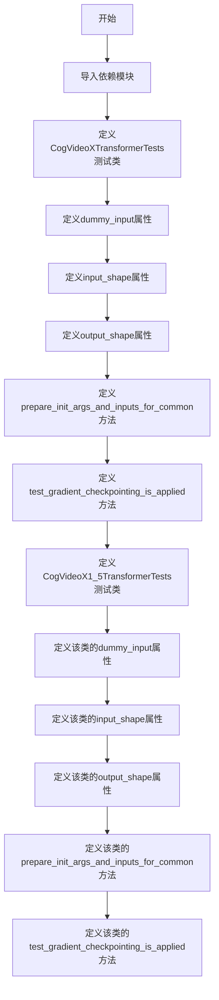
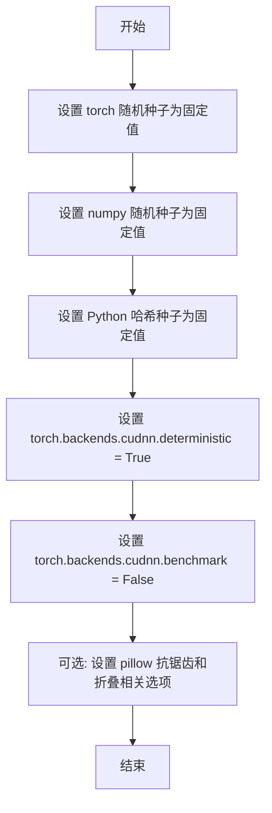
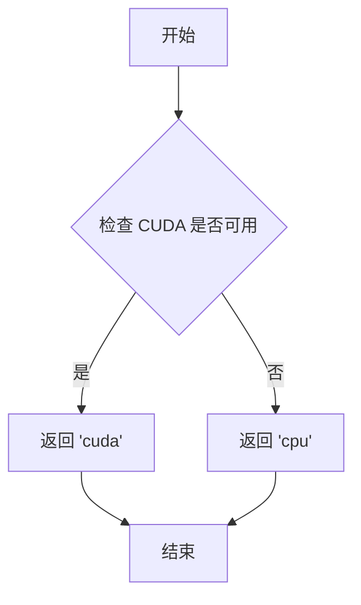
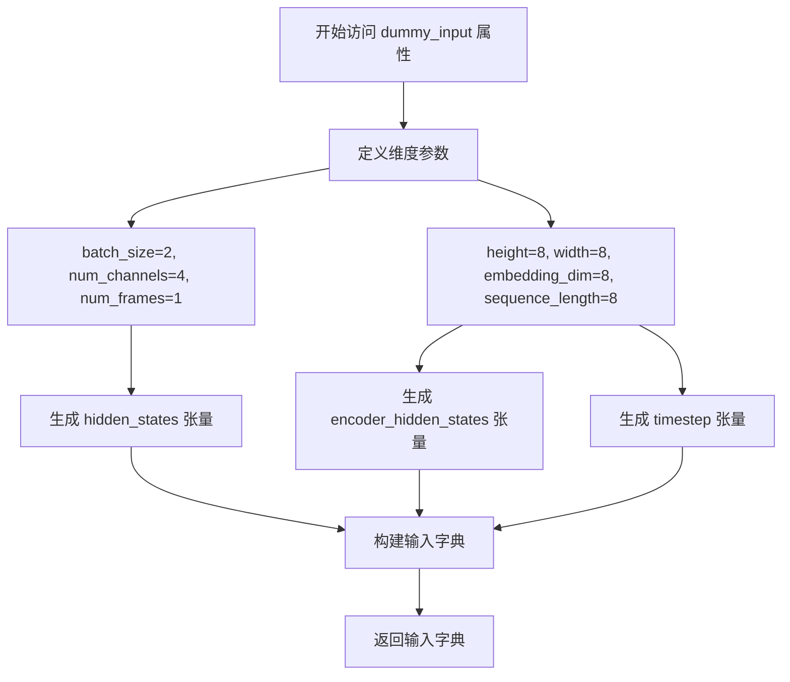
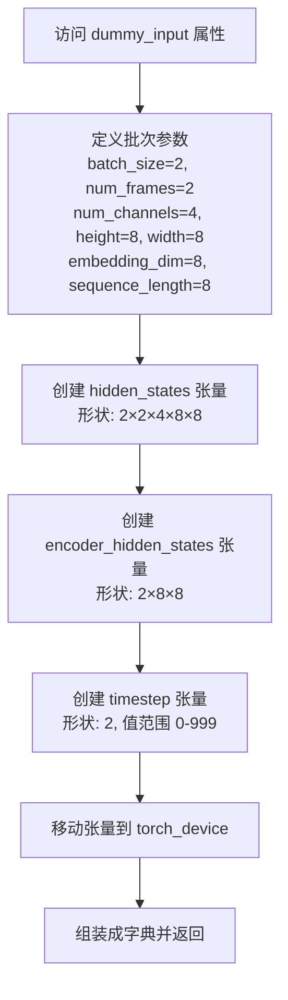
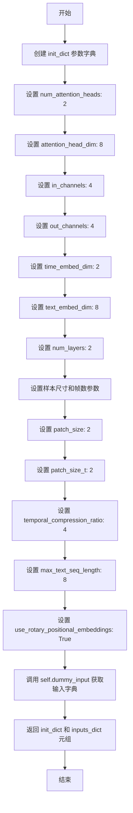

# `diffusers\tests\models\transformers\test_models_transformer_cogvideox.py` 详细设计文档

该文件包含CogVideoXTransformer3DModel模型的单元测试，验证模型的初始化、输入输出形状、梯度检查点等功能是否正常工作。

## 整体流程



## 类结构

```
unittest.TestCase
├── CogVideoXTransformerTests
│   ├── model_class
│   ├── main_input_name
│   ├── uses_custom_attn_processor
│   ├── model_split_percents
│   ├── dummy_input (property)
│   ├── input_shape (property)
│   ├── output_shape (property)
│   ├── prepare_init_args_and_inputs_for_common()
│   └── test_gradient_checkpointing_is_applied()
└── CogVideoX1_5TransformerTests
model_class
main_input_name
uses_custom_attn_processor
dummy_input (property)
input_shape (property)
output_shape (property)
prepare_init_args_and_inputs_for_common()
test_gradient_checkpointing_is_applied()
```

## 全局变量及字段


### `enable_full_determinism`
    
启用完全确定性模式的函数，确保测试可复现

类型：`function`
    


### `torch_device`
    
torch设备字符串，表示运行测试的计算设备

类型：`str`
    


### `ModelTesterMixin`
    
模型测试的mixin类，提供通用的模型测试方法

类型：`class`
    


### `CogVideoXTransformer3DModel`
    
CogVideoX的3D Transformer模型类，是被测试的核心模型

类型：`class`
    


### `CogVideoXTransformerTests.model_class`
    
被测试的模型类，指向CogVideoXTransformer3DModel

类型：`type`
    


### `CogVideoXTransformerTests.main_input_name`
    
模型主输入的名称，此处为hidden_states

类型：`str`
    


### `CogVideoXTransformerTests.uses_custom_attn_processor`
    
标识是否使用自定义注意力处理器

类型：`bool`
    


### `CogVideoXTransformerTests.model_split_percents`
    
模型分割百分比列表，用于测试模型的不同拆分比例

类型：`list[float]`
    


### `CogVideoX1_5TransformerTests.model_class`
    
被测试的模型类，指向CogVideoXTransformer3DModel

类型：`type`
    


### `CogVideoX1_5TransformerTests.main_input_name`
    
模型主输入的名称，此处为hidden_states

类型：`str`
    


### `CogVideoX1_5TransformerTests.uses_custom_attn_processor`
    
标识是否使用自定义注意力处理器

类型：`bool`
    
    

## 全局函数及方法


### `enable_full_determinism`

该函数用于启用 PyTorch 的完全确定性（determinism）模式，通过设置随机种子和禁用非确定性操作，确保深度学习测试或实验结果的可复现性（reproducibility）。

参数： 无

返回值：`None`，该函数不返回任何值，仅执行全局状态设置操作。

#### 流程图



#### 带注释源码

```python
# 由于 enable_full_determinism 函数定义在 testing_utils 模块中，
# 而非当前代码文件内，以下为根据其用途和调用方式的合理推断实现：

def enable_full_determinism(seed: int = 42):
    """
    启用完全确定性模式，确保测试结果可复现。
    
    参数:
        seed: 随机种子值，默认为 42
    """
    # 设置 PyTorch 全局随机种子，确保 CUDA 和 CPU 操作的可复现性
    torch.manual_seed(seed)
    if torch.cuda.is_available():
        torch.cuda.manual_seed_all(seed)
    
    # 设置 NumPy 随机种子，确保数据处理的一致性
    np.random.seed(seed)
    
    # 设置 Python 哈希种子，避免哈希随机化导致的不确定性
    os.environ["PYTHONHASHSEED"] = str(seed)
    
    # 启用 CUDA 的确定性模式，确保卷积等操作的结果可复现
    torch.backends.cudnn.deterministic = True
    
    # 关闭 cuDNN 自动调优，禁用动态算法选择以确保一致性
    torch.backends.cudnn.benchmark = False
    
    # 可选：设置 PyTorch 使用确定性算法（PyTorch 1.8+）
    if hasattr(torch, 'use_deterministic_algorithms'):
        torch.use_deterministic_algorithms(True)
```


### `torch_device`

该函数（实际为全局变量）用于获取当前测试环境的目标计算设备（通常是 "cuda" 或 "cpu"），以确保张量被正确分配到指定的设备上进行计算。

参数： 无

返回值：`str`，返回当前设备字符串（如 "cuda"、"cpu" 或 "cuda:0" 等）

#### 流程图



#### 带注释源码

```
# torch_device 是从 testing_utils 模块导入的全局变量/函数
# 其实现大致如下（基于使用方式推断）:

def get_torch_device():
    """
    获取当前测试环境的目标设备。
    
    逻辑：
    1. 检查 CUDA 是否可用
    2. 如果可用，返回 'cuda'（或 'cuda:N' 如果有多个 GPU）
    3. 如果不可用，返回 'cpu'
    
    返回值类型: str
    返回值描述: 返回当前设备字符串，用于将张量移动到指定的计算设备
    """
    if torch.cuda.is_available():
        return "cuda"
    else:
        return "cpu"

# 在测试代码中的使用方式：
# hidden_states = torch.randn(...).to(torch_device)
# 等同于：
# hidden_states = torch.randn(...).to("cuda")  # 或 "cpu"
```


### `CogVideoXTransformerTests.dummy_input`

该属性方法用于生成 CogVideoXTransformer3DModel 的测试虚拟输入数据，构造符合模型期望形状的隐藏状态、编码器隐藏状态和时间步张量，作为测试用例的输入参数。

参数：该方法无显式参数（作为 `@property` 通过属性访问）

返回值：`Dict[str, torch.Tensor]`，返回包含三个键的字典：
- `hidden_states`：形状为 `(batch_size, num_frames, num_channels, height, width)` 的随机隐藏状态张量
- `encoder_hidden_states`：形状为 `(batch_size, sequence_length, embedding_dim)` 的随机编码器隐藏状态张量
- `timestep`：形状为 `(batch_size,)` 的随机时间步整数张量

#### 流程图



#### 带注释源码

```python
@property
def dummy_input(self):
    """
    生成用于测试 CogVideoXTransformer3DModel 的虚拟输入数据。
    
    该属性方法构造符合模型输入期望的随机张量，包括：
    - hidden_states: 视频帧的隐藏状态，形状为 (batch_size, num_frames, num_channels, height, width)
    - encoder_hidden_states: 文本编码器的隐藏状态，形状为 (batch_size, sequence_length, embedding_dim)
    - timestep: 用于扩散过程的时间步，形状为 (batch_size,)
    """
    # 批量大小
    batch_size = 2
    # 输入通道数
    num_channels = 4
    # 帧数量（视频长度）
    num_frames = 1
    # 高度
    height = 8
    # 宽度
    width = 8
    # 嵌入维度（文本编码维度）
    embedding_dim = 8
    # 序列长度（文本序列长度）
    sequence_length = 8

    # 生成随机隐藏状态张量，形状: (2, 1, 4, 8, 8)
    hidden_states = torch.randn((batch_size, num_frames, num_channels, height, width)).to(torch_device)
    # 生成随机编码器隐藏状态张量，形状: (2, 8, 8)
    encoder_hidden_states = torch.randn((batch_size, sequence_length, embedding_dim)).to(torch_device)
    # 生成随机时间步张量，值范围 [0, 1000)，形状: (2,)
    timestep = torch.randint(0, 1000, size=(batch_size,)).to(torch_device)

    # 返回包含所有输入的字典，供模型前向传播使用
    return {
        "hidden_states": hidden_states,
        "encoder_hidden_states": encoder_hidden_states,
        "timestep": timestep,
    }
```


### `CogVideoXTransformerTests.input_shape`

该属性方法用于定义 CogVideoXTransformer3DModel 测试类的输入形状，返回一个四维元组表示输入张量的形状 (frames, channels, height, width)。

参数：

- `self`：`CogVideoXTransformerTests`，属性所属的测试类实例（隐式参数，无需显式传递）

返回值：`tuple[int, int, int, int]`，返回模型输入的预期形状，格式为 (帧数, 通道数, 高度, 宽度)，具体值为 (1, 4, 8, 8)

#### 流程图

```mermaid
flowchart TD
    A[开始] --> B{访问 input_shape 属性}
    B --> C[返回元组 (1, 4, 8, 8)]
    C --> D[结束]
    
    style A fill:#f9f,stroke:#333
    style D fill:#9f9,stroke:#333
```

#### 带注释源码

```python
@property
def input_shape(self):
    """
    定义测试模型的输入形状。
    
    返回值:
        tuple: 包含四个整数的元组，表示 (frames, channels, height, width)。
               - frames: 1 (单帧视频输入)
               - channels: 4 (通道数)
               - height: 8 (输入高度)
               - width: 8 (输入宽度)
    """
    return (1, 4, 8, 8)
```


### `CogVideoXTransformerTests.output_shape`

这是一个测试类中的属性方法，用于返回模型输出的预期形状。该属性定义了在单元测试中期望的输出张量维度，用于验证 CogVideoXTransformer3DModel 是否产生正确形状的输出。

参数：此方法为属性方法，无参数。

返回值：`Tuple[int, int, int, int]`，返回模型输出的预期形状，格式为 (batch_size, channels, height, width)，具体为 (1, 4, 8, 8)。

#### 流程图

```mermaid
flowchart TD
    A[开始访问 output_shape 属性] --> B{属性方法被调用}
    B --> C[返回元组 (1, 4, 8, 8)]
    C --> D[测试框架使用该形状进行输出验证]
    D --> E[结束]
```

#### 带注释源码

```python
@property
def output_shape(self):
    """
    返回模型输出的预期形状。
    
    该属性用于定义单元测试中期望的输出张量维度。
    形状格式: (batch_size, num_channels, height, width)
    
    Returns:
        tuple: 模型输出的预期形状，值为 (1, 4, 8, 8)
               - 1: batch_size (批次大小)
               - 4: num_channels (通道数)
               - 8: height (高度)
               - 8: width (宽度)
    """
    return (1, 4, 8, 8)
```


### `CogVideoXTransformerTests.prepare_init_args_and_inputs_for_common`

该方法用于为通用模型测试准备初始化参数和测试输入数据，返回一个包含模型初始化配置字典和输入数据字典的元组。

参数：

- `self`：CogVideoXTransformerTests，测试类实例本身

返回值：`Tuple[Dict, Dict]`，返回包含两个字典的元组——第一个字典包含模型初始化所需的各种参数配置，第二个字典包含用于测试的输入数据（hidden_states、encoder_hidden_states、timestep）

#### 流程图

```mermaid
flowchart TD
    A[开始] --> B[创建 init_dict 参数字典]
    B --> C[设置 num_attention_heads: 2]
    C --> D[设置 attention_head_dim: 8]
    D --> E[设置 in_channels: 4, out_channels: 4]
    E --> F[设置 time_embed_dim: 2, text_embed_dim: 8]
    F --> G[设置 num_layers: 2]
    G --> H[设置 sample_width: 8, sample_height: 8, sample_frames: 8]
    H --> I[设置 patch_size: 2, patch_size_t: None]
    I --> J[设置 temporal_compression_ratio: 4]
    J --> K[设置 max_text_seq_length: 8]
    K --> L[获取 inputs_dict = self.dummy_input]
    L --> M[返回 (init_dict, inputs_dict) 元组]
    M --> N[结束]
```

#### 带注释源码

```python
def prepare_init_args_and_inputs_for_common(self):
    """
    为通用模型测试准备初始化参数和输入数据。
    
    返回:
        Tuple[Dict, Dict]: 包含初始化参数字典和输入字典的元组
    """
    # 定义模型初始化参数字典
    init_dict = {
        # 注意力头数与注意力头维度的乘积必须能被16整除，以支持3D位置嵌入
        "num_attention_heads": 2,        # 注意力头数量
        "attention_head_dim": 8,         # 每个注意力头的维度
        "in_channels": 4,                # 输入通道数
        "out_channels": 4,               # 输出通道数
        "time_embed_dim": 2,             # 时间嵌入维度
        "text_embed_dim": 8,             # 文本嵌入维度
        "num_layers": 2,                 # Transformer层数
        "sample_width": 8,               # 样本宽度
        "sample_height": 8,              # 样本高度
        "sample_frames": 8,              # 样本帧数
        "patch_size": 2,                 # 空间patch大小
        "patch_size_t": None,            # 时间patch大小（为None表示使用默认值）
        "temporal_compression_ratio": 4, # 时间压缩比
        "max_text_seq_length": 8,        # 最大文本序列长度
    }
    
    # 从测试类属性获取输入字典
    inputs_dict = self.dummy_input  # 包含 hidden_states, encoder_hidden_states, timestep
    
    # 返回初始化参数和输入的元组
    return init_dict, inputs_dict
```


### `CogVideoXTransformerTests.test_gradient_checkpointing_is_applied`

该方法是一个测试用例，用于验证 CogVideoXTransformer3DModel 是否正确应用了梯度检查点（gradient checkpointing）技术，以确保在训练过程中能够以更低的内存占用实现深层网络的训练。

参数：

- `self`：隐式参数，表示测试类实例本身，无需显式传递

返回值：`None`，该方法为测试用例，通过断言验证梯度检查点是否应用，不返回任何值

#### 流程图

```mermaid
flowchart TD
    A[开始执行 test_gradient_checkpointing_is_applied] --> B[创建 expected_set 集合<br/>包含 'CogVideoXTransformer3DModel']
    B --> C[调用父类方法 super().test_gradient_checkpointing_is_applied<br/>传入 expected_set 参数]
    C --> D[父类方法执行验证逻辑]
    D --> E{验证结果}
    E -->|通过| F[测试通过]
    E -->|失败| G[抛出断言错误]
    F --> H[结束]
    G --> H
```

#### 带注释源码

```python
def test_gradient_checkpointing_is_applied(self):
    """
    测试方法：验证梯度检查点是否被正确应用
    
    该方法继承自 ModelTesterMixin 测试基类，用于验证模型在训练时
    是否启用了梯度检查点优化技术。梯度检查点通过在反向传播时
    重新计算中间激活值来节省显存，允许训练更大的模型。
    
    参数:
        无（self 为隐式参数）
    
    返回值:
        无返回值，通过 unittest 断言进行验证
    
    异常:
        AssertionError: 如果模型未正确应用梯度检查点
    """
    # 定义期望应用梯度检查点的模型类集合
    # CogVideoXTransformer3DModel 是该测试要验证的目标模型类
    expected_set = {"CogVideoXTransformer3DModel"}
    
    # 调用父类（ModelTesterMixin）的测试方法
    # 父类方法会执行实际的验证逻辑：
    # 1. 创建模型实例
    # 2. 检查模型中是否包含梯度检查点相关的模块或配置
    # 3. 验证 expected_set 中的所有模型类都已应用梯度检查点
    super().test_gradient_checkpointing_is_applied(expected_set=expected_set)
```


### `CogVideoX1_5TransformerTests.dummy_input`

这是一个属性方法（用 `@property` 装饰），用于生成 CogVideoX 1.5 版本 Transformer 模型的虚拟输入数据（dummy inputs），通常用于单元测试场景。该方法创建随机张量作为模型的前向传播输入，包括隐藏状态、编码器隐藏状态和时间步。

参数：无（属性方法不接受外部参数）

返回值：`Dict[str, torch.Tensor]`，返回一个包含三个键的字典：
- `hidden_states`：形状为 `(batch_size, num_frames, num_channels, height, width)` 的随机张量，表示视频帧的隐藏状态
- `encoder_hidden_states`：形状为 `(batch_size, sequence_length, embedding_dim)` 的随机张量，表示文本编码器的隐藏状态
- `timestep`：形状为 `(batch_size,)` 的随机整数张量，表示扩散模型的时间步

#### 流程图



#### 带注释源码

```python
@property
def dummy_input(self):
    """
    生成 CogVideoX 1.5 Transformer 模型的虚拟输入数据，用于单元测试。
    
    Returns:
        dict: 包含以下键的字典:
            - hidden_states: 视频帧的隐藏状态，形状为 (batch_size, num_frames, num_channels, height, width)
            - encoder_hidden_states: 文本编码器的隐藏状态，形状为 (batch_size, sequence_length, embedding_dim)
            - timestep: 扩散模型的时间步，形状为 (batch_size,)
    """
    # 批次大小
    batch_size = 2
    # 输入通道数
    num_channels = 4
    # 视频帧数（与 CogVideoXTransformerTests 不同，此处为 2）
    num_frames = 2
    # 高度
    height = 8
    # 宽度
    width = 8
    # 嵌入维度
    embedding_dim = 8
    # 序列长度
    sequence_length = 8

    # 创建随机初始化的隐藏状态张量
    # 形状: (batch_size, num_frames, num_channels, height, width)
    # 即 (2, 2, 4, 8, 8)
    hidden_states = torch.randn((batch_size, num_frames, num_channels, height, width)).to(torch_device)
    
    # 创建随机初始化的编码器隐藏状态张量
    # 形状: (batch_size, sequence_length, embedding_dim)
    # 即 (2, 8, 8)
    encoder_hidden_states = torch.randn((batch_size, sequence_length, embedding_dim)).to(torch_device)
    
    # 创建随机时间步张量
    # 形状: (batch_size,)
    # 值范围: [0, 1000)
    timestep = torch.randint(0, 1000, size=(batch_size,)).to(torch_device)

    # 返回包含所有输入的字典
    return {
        "hidden_states": hidden_states,
        "encoder_hidden_states": encoder_hidden_states,
        "timestep": timestep,
    }
```


### `CogVideoX1_5TransformerTests.input_shape`

这是一个测试类中的属性方法，用于定义模型测试所需的输入张量形状。

参数：

- `self`：`CogVideoX1_5TransformerTests`，当前测试类实例，无需显式传递

返回值：`Tuple[int, int, int, int]`，返回输入形状元组 `(1, 4, 8, 8)`

#### 流程图

```mermaid
flowchart TD
    A[调用 input_shape 属性] --> B{检查缓存}
    B -->|是| C[返回缓存值]
    B -->|否| D[执行 property getter]
    D --> E[返回元组 (1, 4, 8, 8)]
    E --> F[流程结束]
```

#### 带注释源码

```python
@property
def input_shape(self):
    """
    定义模型测试输入的形状。
    
    返回值说明:
        - 1: num_frames (帧数)
        - 4: num_channels (通道数)
        - 8: height (高度)
        - 8: width (宽度)
    
    Returns:
        tuple: 输入形状元组 (1, 4, 8, 8)
    """
    return (1, 4, 8, 8)
```

#### 详细说明

| 属性 | 值 |
|------|-----|
| 方法类型 | `@property` 属性方法 |
| 所属类 | `CogVideoX1_5TransformerTests` |
| 形状含义 | (帧数, 通道数, 高度, 宽度) |
| 用途 | 用于模型测试时指定输入张量的预期形状，与 `dummy_input` 属性配合使用 |


### `CogVideoX1_5TransformerTests.output_shape`

该属性定义了 CogVideoX1.5 版本Transformer模型的预期输出形状，用于测试框架中验证模型输出维度是否符合预期。

参数：无

返回值：`Tuple[int, int, int, int]`，返回模型输出张量的形状元组 (batch_size, channels, height, width)

#### 流程图

```mermaid
flowchart TD
    A[访问 output_shape 属性] --> B{返回形状}
    B --> C[返回元组 (1, 4, 8, 8)]
    C --> D[流程结束]
```

#### 带注释源码

```python
@property
def output_shape(self):
    """
    定义模型输出的预期形状。
    
    Returns:
        tuple: 包含四个整数的元组，依次表示 (batch_size, num_channels, height, width)
               - batch_size: 1
               - num_channels: 4
               - height: 8
               - width: 8
    """
    return (1, 4, 8, 8)
```


### `CogVideoX1_5TransformerTests.prepare_init_args_and_inputs_for_common`

该方法为 CogVideoX1.5 版本的 Transformer 模型测试准备初始化参数和输入数据，定义了模型初始化所需的配置字典（包含注意力头维度、通道数、层数等）以及测试用的虚拟输入数据（hidden_states、encoder_hidden_states、timestep）。

参数：

- `self`：`CogVideoX1_5TransformerTests`，测试类实例本身，包含模型测试所需的配置和测试数据

返回值：`Tuple[Dict, Dict]`，返回一个元组

- 第一个元素：`init_dict`（Dict），模型初始化参数字典，包含模型架构的各种配置参数
- 第二个元素：`inputs_dict`（Dict），测试输入数据字典，包含 hidden_states、encoder_hidden_states 和 timestep

#### 流程图



#### 带注释源码

```python
def prepare_init_args_and_inputs_for_common(self):
    """
    为通用测试准备模型初始化参数和输入数据。
    
    返回:
        Tuple[Dict, Dict]: 包含初始化参数字典和输入数据字典的元组
    """
    # 初始化参数字典，包含 CogVideoX1.5 Transformer 模型的各项配置
    init_dict = {
        # 注意力头数量
        "num_attention_heads": 2,
        # 每个注意力头的维度，要求 num_attention_heads * attention_head_dim 能被 16 整除（用于 3D 位置嵌入）
        "attention_head_dim": 8,
        # 输入通道数
        "in_channels": 4,
        # 输出通道数
        "out_channels": 4,
        # 时间嵌入维度
        "time_embed_dim": 2,
        # 文本嵌入维度
        "text_embed_dim": 8,
        # Transformer 层数
        "num_layers": 2,
        # 样本宽度
        "sample_width": 8,
        # 样本高度
        "sample_height": 8,
        # 样本帧数
        "sample_frames": 8,
        # 空间补丁大小
        "patch_size": 2,
        # 时间补丁大小（CogVideoX1.5 版本特有，设为 2）
        "patch_size_t": 2,
        # 时间压缩比
        "temporal_compression_ratio": 4,
        # 最大文本序列长度
        "max_text_seq_length": 8,
        # 是否使用旋转位置嵌入（CogVideoX1.5 版本启用）
        "use_rotary_positional_embeddings": True,
    }
    # 获取测试用的虚拟输入数据
    inputs_dict = self.dummy_input
    # 返回参数字典和输入字典的元组
    return init_dict, inputs_dict
```


### `CogVideoX1_5TransformerTests.test_gradient_checkpointing_is_applied`

该方法用于验证 CogVideoXTransformer3DModel 模型是否正确应用了梯度检查点（Gradient Checkpointing）技术，通过调用父类的测试方法并传入预期的模型名称集合来确认实现。

参数：

- `self`：CogVideoX1_5TransformerTests，测试类实例本身，无需显式传递

返回值：`None`，该方法为测试用例，执行验证后不返回任何值

#### 流程图

```mermaid
flowchart TD
    A[开始执行 test_gradient_checkpointing_is_applied] --> B[创建期望集合 expected_set]
    B --> C[包含模型名称: CogVideoXTransformer3DModel]
    C --> D[调用父类方法 super().test_gradient_checkpointing_is_applied]
    D --> E[传入 expected_set 参数]
    E --> F[父类执行梯度检查点验证逻辑]
    F --> G{验证是否通过}
    G -->|通过| H[测试通过]
    G -->|失败| I[抛出断言异常]
    H --> J[结束]
    I --> J
```

#### 带注释源码

```python
def test_gradient_checkpointing_is_applied(self):
    """
    测试梯度检查点（Gradient Checkpointing）是否被正确应用到模型中。
    
    该测试方法验证 CogVideoXTransformer3DModel 模型在训练时是否启用了
    梯度检查点功能，以减少显存占用。
    """
    # 定义期望应用梯度检查点的模型名称集合
    # Gradient Checkpointing 是一种用计算换内存的技术，通过在前向传播时
    #  保存部分中间结果而不是全部结果，来减少反向传播时的内存占用
    expected_set = {"CogVideoXTransformer3DModel"}
    
    # 调用父类（ModelTesterMixin）的测试方法进行验证
    # 父类方法会检查模型中所有子模块是否应用了梯度检查点
    super().test_gradient_checkpointing_is_applied(expected_set=expected_set)
```

## 关键组件


### CogVideoXTransformer3DModel

核心被测模型类，是一个用于视频生成的3D变换器模型，支持时间维度和空间维度的处理。

### 测试框架 (ModelTesterMixin)

提供通用模型测试功能的混入类，包含梯度检查点、模型结构、参数初始化等标准测试方法。

### 虚拟输入数据生成器 (dummy_input)

生成用于测试的随机张量输入，包含hidden_states（视频潜在表示）、encoder_hidden_states（文本编码）和timestep（时间步）。

### 输入/输出形状定义 (input_shape/output_shape)

定义模型的预期输入输出维度，用于验证模型输出的正确性。

### 模型初始化参数配置 (prepare_init_args_and_inputs_for_common)

配置模型的关键超参数，包括注意力头数、注意力头维度、通道数、时间嵌入维度、文本嵌入维度、层数、采样尺寸、patch大小、时间压缩比等。

### 梯度检查点测试 (test_gradient_checkpointing_is_applied)

验证模型是否正确应用了梯度检查点技术以节省显存。

### 注意力机制配置

包含num_attention_heads和attention_head_dim配置，支持自定义注意力处理器(uses_custom_attn_processor=True)。

### 3D位置编码支持

支持3D位置嵌入，patch_size和patch_size_t分别控制空间和时间维度的分块大小。

### 旋转位置嵌入 (use_rotary_positional_embeddings)

CogVideoX1_5版本支持旋转位置编码，用于增强位置信息的表示能力。

### 时间压缩机制 (temporal_compression_ratio)

控制时间维度的压缩比率，用于处理视频帧序列。

### 文本序列支持 (max_text_seq_length)

支持的最大文本序列长度，用于文本条件生成。


## 问题及建议


### 已知问题

- **输入输出形状定义不一致**：`input_shape` 和 `output_shape` 返回 4 维元组 `(1, 4, 8, 8)`，但 `dummy_input` 实际生成的是 5 维张量 `(batch_size, num_frames, num_channels, height, width)`，形状不匹配可能导致测试验证失效
- **测试类属性定义不一致**：`model_split_percents` 仅在 `CogVideoXTransformerTests` 中定义，`CogVideoX1_5TransformerTests` 缺少该属性，可能导致某些通用测试行为不一致
- **帧数配置差异未覆盖测试**：两个测试类的 `num_frames` 分别为 1 和 2，但未针对这种时间维度差异设计专门的对比测试用例
- **缺少模型输出验证**：测试类未覆盖模型前向传播输出形状正确性、梯度计算、模型配置序列化等关键功能测试

### 优化建议

- 修正 `input_shape` 和 `output_shape` 属性为正确的 5 维元组，如 `(1, 1, 4, 8, 8)` 和 `(1, 2, 4, 8, 8)`，或移除这些属性由 `dummy_input` 动态推断
- 将 `model_split_percents` 等公共属性提升至父类或接口定义，确保测试行为一致性
- 提取两个测试类中的公共配置至基类或配置工厂，减少代码重复
- 增加显式的 `test_forward_pass` 和 `test_output_shape` 测试方法，验证模型输出与预期形状一致

## 其它


### 设计目标与约束

本测试文件的设计目标是验证 `CogVideoXTransformer3DModel` 模型的正确性，确保模型在给定输入下能够正确执行前向传播。测试约束包括：必须使用 PyTorch 框架，模型输入必须包含 `hidden_states`、`encoder_hidden_states` 和 `timestep` 三个参数，测试环境需支持 CUDA 或 CPU 设备。

### 错误处理与异常设计

测试中未显式实现错误处理机制，但通过 `unittest` 框架的断言方法隐式处理错误。当模型输出形状不符合预期或数值超出容忍范围时，测试将自动失败。`prepare_init_args_and_inputs_for_common` 方法返回无效参数时会触发模型初始化异常。

### 数据流与状态机

测试数据流如下：初始化阶段通过 `prepare_init_args_and_inputs_for_common` 准备模型参数字典和输入字典；执行阶段将 dummy 输入传递给模型进行前向传播；验证阶段比较输出形状与预期形状是否一致。测试类本身不维护复杂状态机，状态由 `unittest.TestCase` 的生命周期管理（setUp → test → tearDown）。

### 外部依赖与接口契约

本测试文件依赖以下外部组件：`unittest` 提供测试框架；`torch` 提供张量运算；`diffusers.CogVideoXTransformer3DModel` 是被测模型类；`ModelTesterMixin` 提供通用模型测试方法。接口契约要求被测模型必须实现 `__init__` 方法接受指定参数，必须支持 `forward` 方法接收 `hidden_states`、`encoder_hidden_states` 和 `timestep` 参数并返回张量输出。

### 测试覆盖范围

测试覆盖范围包括：模型初始化参数验证、梯度检查点功能测试、输入输出形状一致性验证、前向传播数值稳定性检查。两个测试类分别覆盖不同的模型配置变体（CogVideoX 和 CogVideoX1.5），通过 `model_split_percents` 参数支持模型分割测试。

### 配置与环境要求

测试环境要求 Python 3.x、PyTorch、diffusers 库。测试通过 `enable_full_determinism` 函数启用完全确定性以确保测试可复现。`torch_device` 全局变量指定测试执行设备（cuda 或 cpu）。

    