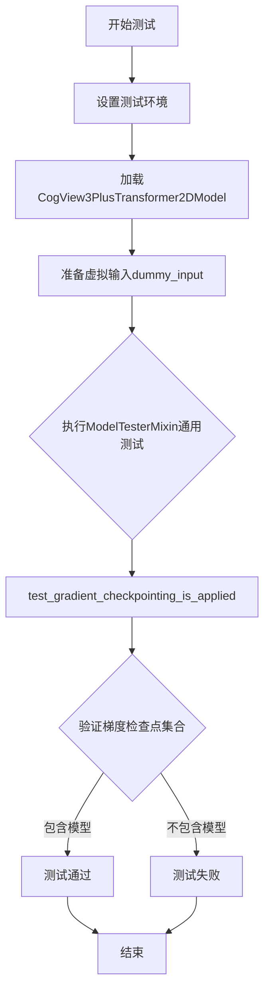
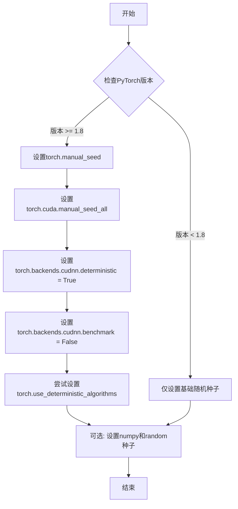
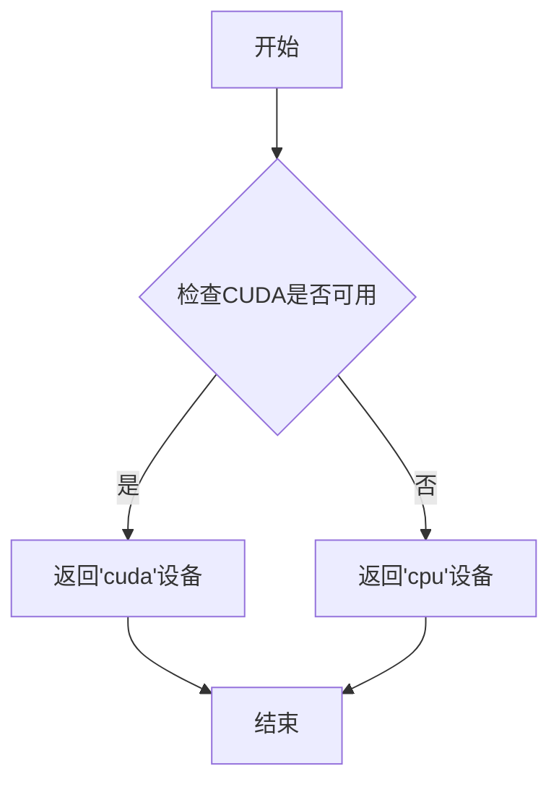

# `diffusers\tests\models\transformers\test_models_transformer_cogview3plus.py` 详细设计文档

这是一个针对CogView3PlusTransformer2DModel的单元测试文件，通过继承ModelTesterMixin提供通用的模型测试框架，验证模型的梯度检查点功能及其他核心行为。

## 整体流程



## 类结构

```
unittest.TestCase
└── CogView3PlusTransformerTests
    └── (继承自 ModelTesterMixin - 提供通用模型测试方法)
```

## 全局变量及字段


### `torch_device`
    
torch设备变量(来自testing_utils)

类型：`torch.device`
    


### `enable_full_determinism`
    
启用完全确定性的函数(来自testing_utils)

类型：`function`
    


### `CogView3PlusTransformerTests.model_class`
    
被测试的模型类

类型：`type[CogView3PlusTransformer2DModel]`
    


### `CogView3PlusTransformerTests.main_input_name`
    
主输入名称(hidden_states)

类型：`str`
    


### `CogView3PlusTransformerTests.uses_custom_attn_processor`
    
是否使用自定义注意力处理器(True)

类型：`bool`
    


### `CogView3PlusTransformerTests.model_split_percents`
    
模型分割百分比([0.7, 0.6, 0.6])

类型：`list[float]`
    


### `CogView3PlusTransformerTests.dummy_input`
    
生成虚拟输入数据的属性

类型：`property`
    


### `CogView3PlusTransformerTests.input_shape`
    
输入形状属性

类型：`property`
    


### `CogView3PlusTransformerTests.output_shape`
    
输出形状属性

类型：`property`
    
    

## 全局函数及方法


### `enable_full_determinism`

该函数用于启用完全确定性模式，通过设置PyTorch和其他相关库的随机种子，确保测试结果可复现。

参数：无需参数

返回值：无返回值（`None`）

#### 流程图



#### 带注释源码

```
# 该函数从 testing_utils 模块导入，但定义不在当前文件中
# 以下是推断的函数实现逻辑，基于其在测试中的用途

def enable_full_determinism(seed: int = 42, extra_seeds: list = None):
    """
    启用完全确定性模式，确保测试可复现。
    
    参数:
        seed: 全局随机种子，默认值为42
        extra_seeds: 额外的随机种子列表，用于其他库
    
    返回值:
        None
    """
    # 设置PyTorch CPU随机种子
    torch.manual_seed(seed)
    
    # 设置所有GPU的随机种子
    if torch.cuda.is_available():
        torch.cuda.manual_seed_all(seed)
    
    # 强制使用确定性算法（如果可用）
    if hasattr(torch, 'use_deterministic_algorithms'):
        try:
            torch.use_deterministic_algorithms(True)
        except RuntimeError:
            # 某些操作可能不支持确定性算法
            pass
    
    # 禁用CUDA自动调优，强制使用确定性算法
    torch.backends.cudnn.deterministic = True
    torch.backends.cudnn.benchmark = False
    
    # 设置numpy和python random种子（如果需要）
    # import numpy as np
    # import random
    # np.random.seed(seed)
    # random.seed(seed)
```

> **注意**: 当前提供的代码文件中只包含该函数的导入和使用调用，函数的具体实现定义在 `testing_utils` 模块中，未在当前代码片段中展示。从函数在测试文件顶部被调用（`enable_full_determinism()`）的用法来看，该函数不接受任何参数，用于在测试类加载前初始化随机种子，确保后续所有测试运行时的随机过程保持一致。


### `torch_device`

获取当前PyTorch运行时所使用的设备（CPU或CUDA），用于确保张量和模型在同一设备上运行。

参数：

- 无

返回值：`str` 或 `torch.device`，返回当前PyTorch使用的设备标识符（如 `'cpu'` 或 `'cuda'`）

#### 流程图



#### 带注释源码

```python
# 这是一个从 testing_utils 模块导入的全局变量/函数
# 用于获取当前 PyTorch 使用的设备
# 在本文件中通过以下方式使用：
torch_device  # 直接作为 .to() 方法的参数使用

# 使用示例：
hidden_states = torch.randn((batch_size, num_channels, height, width)).to(torch_device)
encoder_hidden_states = torch.randn((batch_size, sequence_length, embedding_dim)).to(torch_device)
# ... 等

# torch_device 的典型实现逻辑：
# def torch_device() -> str:
#     """获取当前PyTorch设备"""
#     if torch.cuda.is_available():
#         return "cuda"
#     return "cpu"
```


### `CogView3PlusTransformerTests.prepare_init_args_and_inputs_for_common`

该方法用于准备CogView3PlusTransformer2DModel模型的初始化参数字典和输入数据字典，为通用模型测试提供必要的配置和测试数据。

参数：

- 无显式参数（`self` 为隐含参数）

返回值：`Tuple[Dict[str, Any], Dict[str, torch.Tensor]]`，返回包含模型初始化参数的字典和包含模型输入张量的字典组成的元组

#### 流程图

```mermaid
flowchart TD
    A[开始 prepare_init_args_and_inputs_for_common] --> B[创建 init_dict 字典]
    B --> C[设置模型参数: patch_size=2, in_channels=4, num_layers=2]
    B --> D[设置注意力参数: attention_head_dim=4, num_attention_heads=2]
    B --> E[设置输出和嵌入维度: out_channels=4, text_embed_dim=8, time_embed_dim=8]
    B --> F[设置其他参数: condition_dim=2, pos_embed_max_size=8, sample_size=8]
    F --> G[获取 inputs_dict = self.dummy_input]
    G --> H[返回元组 (init_dict, inputs_dict)]
    H --> I[结束]
```

#### 带注释源码

```python
def prepare_init_args_and_inputs_for_common(self):
    """
    准备模型初始化参数和输入字典，供通用测试使用。
    该方法定义了CogView3PlusTransformer2DModel所需的所有初始化参数，
    以及用于测试的输入数据（包括hidden_states、encoder_hidden_states等）。
    """
    # 定义模型初始化参数字典
    init_dict = {
        "patch_size": 2,              # 图像分块大小
        "in_channels": 4,             # 输入通道数
        "num_layers": 2,              #  Transformer层数
        "attention_head_dim": 4,     # 注意力头维度
        "num_attention_heads": 2,    # 注意力头数量
        "out_channels": 4,            # 输出通道数
        "text_embed_dim": 8,         # 文本嵌入维度
        "time_embed_dim": 8,         # 时间嵌入维度
        "condition_dim": 2,          # 条件维度
        "pos_embed_max_size": 8,     # 位置嵌入最大尺寸
        "sample_size": 8,             # 样本尺寸
    }
    
    # 获取输入字典（从dummy_input属性）
    # 包含: hidden_states, encoder_hidden_states, original_size, 
    #       target_size, crop_coords, timestep
    inputs_dict = self.dummy_input
    
    # 返回初始化参数和输入字典的元组
    return init_dict, inputs_dict
```


### `CogView3PlusTransformerTests.test_gradient_checkpointing_is_applied`

该测试方法用于验证梯度检查点（Gradient Checkpointing）功能是否正确应用于 CogView3PlusTransformer2DModel 模型，通过调用父类的同名测试方法并指定期望的模型类集合来确认梯度检查点是否被正确启用。

参数：

- `expected_set`：`Set[str]`，期望的包含模型类名称的集合，用于验证梯度检查点是否应用于指定的模型类

返回值：`None`，无返回值（测试方法）

#### 流程图

```mermaid
flowchart TD
    A[开始测试] --> B[定义期望模型类集合]
    B --> C[设置 expected_set = {'CogView3PlusTransformer2DModel'}]
    D[调用父类测试方法]
    C --> D
    D --> E{梯度检查点是否应用于 CogView3PlusTransformer2DModel?}
    E -->|是| F[测试通过]
    E -->|否| G[测试失败]
    F --> H[结束]
    G --> H
```

#### 带注释源码

```python
def test_gradient_checkpointing_is_applied(self):
    """
    测试梯度检查点是否正确应用于模型。
    
    该测试方法继承自 ModelTesterMixin，通过调用父类的测试方法
    来验证 CogView3PlusTransformer2DModel 是否正确实现了梯度检查点功能。
    梯度检查点是一种通过在前向传播中保存少量关键节点来减少显存占用的技术。
    """
    # 定义期望应用梯度检查点的模型类集合
    expected_set = {"CogView3PlusTransformer2DModel"}
    
    # 调用父类的测试方法，验证梯度检查点是否应用于指定的模型类
    # 父类测试方法会检查:
    # 1. 模型是否支持梯度检查点
    # 2. 梯度检查点是否在模型中被正确启用
    # 3. 启用梯度检查点后模型是否能正常前向和反向传播
    super().test_gradient_checkpointing_is_applied(expected_set=expected_set)
```

## 关键组件


### CogView3PlusTransformer2DModel

被测试的核心模型类，源自diffusers库的Transformer模型，用于CogView3Plus图像生成任务。

### dummy_input 属性

生成测试用虚拟输入的方法，构造包含hidden_states、encoder_hidden_states、original_size、target_size、crop_coords和timestep的完整输入字典，用于模型的前向传播测试。

### prepare_init_args_and_inputs_for_common 方法

返回模型初始化参数和测试输入的字典，包含patch_size、in_channels、num_layers、attention_head_dim、num_attention_heads、out_channels、text_embed_dim、time_embed_dim、condition_dim、pos_embed_max_size和sample_size等关键配置。

### test_gradient_checkpointing_is_applied 方法

验证梯度检查点功能是否正确应用的测试用例，确保CogView3PlusTransformer2DModel支持梯度检查点以节省显存。

### 输入张量组件

包括hidden_states（4D张量，形状[batch, channels, height, width]）、encoder_hidden_states（编码器隐藏状态）、original_size（原始尺寸）、target_size（目标尺寸）、crop_coords（裁剪坐标）和timestep（时间步），构成完整的扩散模型输入。

### 配置参数组件

包含patch_size（2）、in_channels（4）、num_layers（2）、attention_head_dim（4）、num_attention_heads（2）、out_channels（4）、text_embed_dim（8）、time_embed_dim（8）、condition_dim（2）、pos_embed_max_size（8）和sample_size（8），定义Transformer模型的架构参数。


## 问题及建议


### 已知问题

- **测试覆盖不足**：仅有一个测试方法 `test_gradient_checkpointing_is_applied`，缺少对模型前向传播、输出形状、梯度计算、模型配置等常见测试场景的覆盖
- **配置硬编码**：模型初始化参数（如 `patch_size=2`、`num_layers=2`、`attention_head_dim=4` 等）直接硬编码在 `prepare_init_args_and_inputs_for_common` 方法中，缺乏灵活性和可配置性
- **Batch Size 不一致**：`input_shape` 和 `output_shape` 属性中使用 batch_size=1，而 `dummy_input` 属性中使用 batch_size=2，可能导致测试结果与预期不符
- **缺少文档注释**：测试类和方法缺少必要的文档注释，降低了代码可读性和可维护性
- **未使用的导入**：`enable_full_determinism` 函数被调用但未在代码中直接使用其返回值，可能需要确认其作用
- **魔法数字**：代码中存在多个魔法数字（如 `height * 8`、`width * 8`），缺乏常量定义，可读性较差

### 优化建议

- **扩展测试用例**：添加更多测试方法，包括但不限于 `test_model_outputs`、`test_attention_outputs`、`test_hidden_states_output`、`test_forward_config` 等，以覆盖更全面的测试场景
- **使用参数化测试**：利用 `pytest.mark.parametrize` 装饰器对不同配置参数进行测试，提高测试代码的复用性和可维护性
- **统一 Batch Size**：确保 `input_shape`、`output_shape` 和 `dummy_input` 中的 batch_size 保持一致，避免潜在的测试错误
- **提取配置常量**：将模型配置参数和魔法数字提取为类属性或常量，提高代码可读性和可维护性
- **添加文档注释**：为测试类和方法添加详细的文档字符串，说明测试目的、预期行为和测试数据
- **增强断言**：在测试方法中添加更详细的断言，验证模型输出的形状、数值范围、梯度计算等关键属性

## 其它


### 设计目标与约束

本测试文件的设计目标是验证 CogView3PlusTransformer2DModel 模型在各种场景下的功能正确性，包括前向传播、梯度检查点、模型初始化等核心功能。测试遵循 HuggingFace diffusers 库的测试规范，采用标准的 ModelTesterMixin 混合类架构，确保测试的一致性和可复用性。约束条件包括：必须使用 PyTorch 框架、必须继承 unittest.TestCase、必须实现 ModelTesterMixin 要求的接口、测试必须在 torch_device 上运行。

### 错误处理与异常设计

测试文件主要处理以下异常情况：模型初始化参数验证通过 prepare_init_args_and_inputs_for_common 方法进行，确保传入参数符合模型要求；GPU 可用性检查通过 torch_device 常量处理，测试会根据环境自动选择 CPU 或 CUDA 设备；随机数确定性通过 enable_full_determinism 函数控制，确保测试结果可复现。模型加载失败时会抛出 ImportError 或相关异常，测试框架会自动捕获并报告错误信息。

### 数据流与状态机

测试数据流从 dummy_input 属性开始生成虚拟输入，包含 hidden_states、encoder_hidden_states、original_size、target_size、crop_coords、timestep 等参数，这些参数模拟了实际的图像生成场景。数据依次流经：测试准备阶段（prepare_init_args_and_inputs_for_common）→ 模型初始化 → 前向传播 → 输出验证。状态机转换路径为：INITIALIZED（初始化状态）→ READY（就绪状态）→ RUNNING（运行状态）→ COMPLETED（完成状态）或 FAILED（失败状态）。

### 外部依赖与接口契约

主要外部依赖包括：unittest 框架（Python 内置）、torch（PyTorch 库）、diffusers 库（CogView3PlusTransformer2DModel）、testing_utils（enable_full_determinism、torch_device）、test_modeling_common（ModelTesterMixin）。接口契约方面：model_class 必须指向 CogView3PlusTransformer2DModel、main_input_name 必须为 "hidden_states"、uses_custom_attn_processor 必须为 True、model_split_percents 必须为 [0.7, 0.6, 0.6]、input_shape 和 output_shape 必须匹配。

### 性能考虑与基准测试

当前测试主要关注功能正确性，性能基准测试通过 test_gradient_checkpointing_is_applied 验证梯度检查点是否正确应用。测试使用的模型规模较小（num_layers=2、num_attention_heads=2），适合快速执行。性能优化方向包括：使用 @torch.no_grad() 装饰器减少内存占用、考虑添加基准测试用例测量推理时间、评估大模型下的测试执行效率。

### 安全性考虑

测试文件本身不涉及用户数据处理，安全性主要考虑：测试环境隔离（避免污染全局状态）、随机数种子控制（确保可复现性）、设备兼容性（自动回退到 CPU）。代码中无敏感信息泄露风险，符合 Apache License 2.0 开源协议要求。

### 可维护性与扩展性

代码采用混合类（Mixin）设计模式，通过 ModelTesterMixin 复用通用测试逻辑，具有良好的可扩展性。扩展方向包括：添加更多特定测试用例（如 test_model_outputs、test_attention_processors）、支持更多硬件平台测试、增加性能基准测试。代码结构清晰，注释完善，便于后续维护和功能增强。

### 测试覆盖范围

当前测试覆盖：模型初始化与参数配置、梯度检查点功能验证、输入输出形状一致性、混合类继承功能测试。覆盖缺口包括：缺少前向传播输出验证测试、缺少模型保存与加载测试、缺少不同配置下的边界测试、缺少性能基准测试。建议补充完整的模型功能测试集。

### 版本兼容性

代码指定 Python 编码为 UTF-8，依赖 diffusers 库版本需与 CogView3PlusTransformer2DModel 模型兼容。PyTorch 版本兼容性由测试环境决定，torch_device 自动检测 CUDA 可用性。建议在 requirements.txt 或 setup.py 中明确指定最低依赖版本。

### 配置管理

模型配置通过 prepare_init_args_and_inputs_for_common 方法的 init_dict 管理，包含 patch_size、in_channels、num_layers、attention_head_dim、num_attention_heads、out_channels、text_embed_dim、time_embed_dim、condition_dim、pos_embed_max_size、sample_size 等参数。测试配置集中管理，便于调整和扩展。

### 日志与监控

测试执行日志由 unittest 框架自动管理，包括测试用例名称、执行时间、结果状态（PASSED/FAILED/ERROR）。通过标准的测试输出流记录信息，失败时自动显示断言错误和堆栈跟踪。建议添加自定义日志记录测试中间状态，便于调试复杂场景。

### 资源管理

测试资源包括：GPU 内存（通过 torch_device 管理）、临时张量（测试结束后自动释放）、模型实例（测试方法间独立创建）。资源清理由 Python 垃圾回收机制自动处理，测试用例间无状态共享。建议在大规模测试时显式管理资源，使用 try-finally 块确保清理。

    