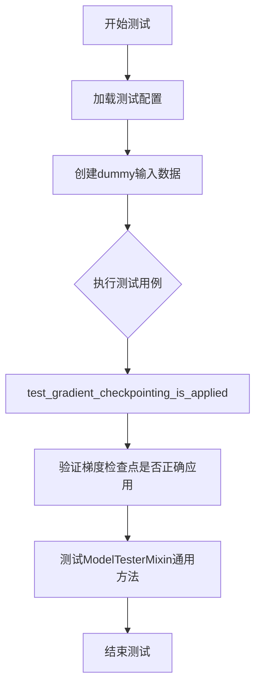
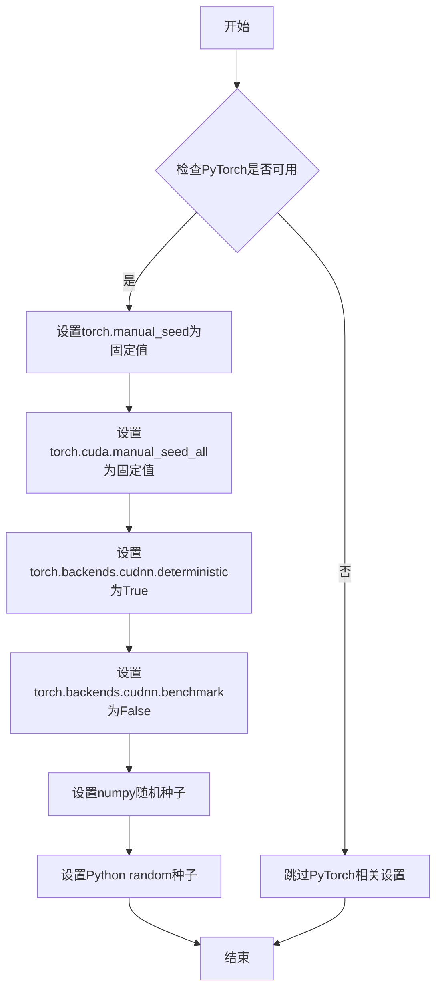
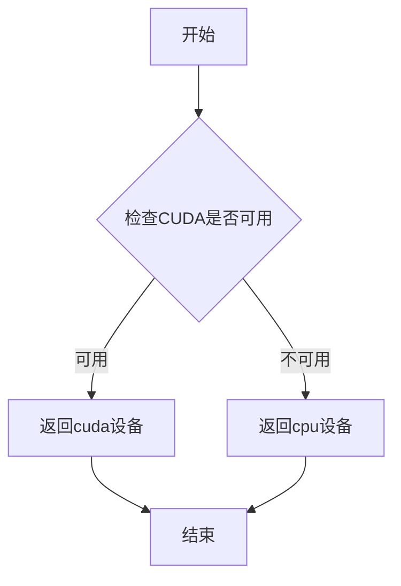
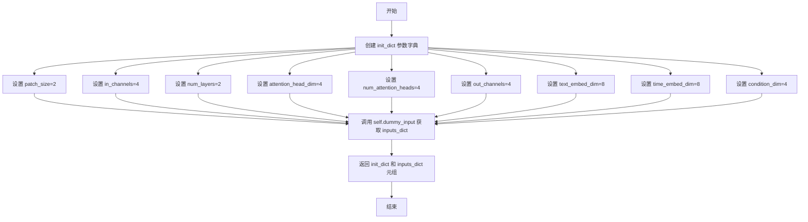
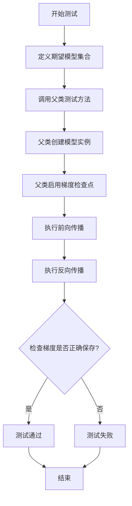

# `diffusers\tests\models\transformers\test_models_transformer_cogview4.py` 详细设计文档

这是一个针对CogView4Transformer2DModel的单元测试文件，用于验证Diffusion模型的Transformer2D实现是否符合预期，包括模型初始化、前向传播、梯度检查点等通用功能测试。

## 整体流程



## 类结构

```
unittest.TestCase
└── CogView3PlusTransformerTests (继承ModelTesterMixin)
    └── 测试CogView4Transformer2DModel
```

## 全局变量及字段


### `torch_device`
    
torch设备标识符，用于指定模型运行的设备

类型：`str`
    


### `enable_full_determinism`
    
启用完全确定性测试的配置函数，确保测试结果可复现

类型：`function`
    


### `CogView3PlusTransformerTests.model_class`
    
指定要测试的模型类 CogView4Transformer2DModel

类型：`class`
    


### `CogView3PlusTransformerTests.main_input_name`
    
模型主输入名称 'hidden_states'

类型：`str`
    


### `CogView3PlusTransformerTests.uses_custom_attn_processor`
    
是否使用自定义注意力处理器标志

类型：`bool`
    


### `CogView3PlusTransformerTests.dummy_input`
    
生成虚拟输入数据的属性

类型：`property`
    


### `CogView3PlusTransformerTests.input_shape`
    
返回输入形状 (4, 8, 8)

类型：`property`
    


### `CogView3PlusTransformerTests.output_shape`
    
返回输出形状 (4, 8, 8)

类型：`property`
    


### `CogView3PlusTransformerTests.prepare_init_args_and_inputs_for_common`
    
准备模型初始化参数和输入数据

类型：`method`
    


### `CogView3PlusTransformerTests.test_gradient_checkpointing_is_applied`
    
测试梯度检查点是否被正确应用

类型：`method`
    
    

## 全局函数及方法


### `enable_full_determinism`

该函数用于配置测试环境的完全确定性，通过设置随机种子和相关配置，确保测试结果可复现。

参数：
- 无参数

返回值：`None`，该函数不返回任何值，主要通过副作用生效。

#### 流程图



#### 带注释源码

```
# 源码无法从提供的代码片段中获取
# 该函数定义在 testing_utils 模块中，但在当前代码中仅看到导入语句：
# from ...testing_utils import enable_full_determinism
# 实际函数实现未在给定代码中定义

# 基于函数名的推断源码（典型实现模式）：
"""
def enable_full_determinism(seed: int = 0):
    '''
    启用完全确定性测试配置
    
    参数:
        seed: 随机种子，默认为0
    '''
    import torch
    import numpy as np
    import random
    
    # 设置PyTorch随机种子
    torch.manual_seed(seed)
    torch.cuda.manual_seed_all(seed)
    
    # 强制使用确定性算法，牺牲一定性能
    torch.backends.cudnn.deterministic = True
    torch.backends.cudnn.benchmark = False
    
    # 设置NumPy随机种子
    np.random.seed(seed)
    
    # 设置Python random随机种子
    random.seed(seed)
    
    # 设置环境变量以确保更多组件的确定性
    import os
    os.environ['CUBLAS_WORKSPACE_CONFIG'] = ':4096:8'
"""
```

**注意**：由于提供的代码片段中仅包含对 `enable_full_determinism` 函数的导入和使用语句，原始函数定义并未包含在内。以上源码为基于函数名称和上下文的合理推断，实际实现可能略有差异。如需获取准确源码，请提供 `testing_utils` 模块的完整代码。


### `torch_device`

该函数返回当前测试使用的 PyTorch 设备字符串（如 "cuda"、"cpu" 或 "cuda:0" 等），用于确保测试在不同硬件环境下能够正确运行在可用的设备上。

参数： 无

返回值：`str`，返回当前 PyTorch 可用的设备字符串，通常为 "cuda"、"cpu" 或 "cuda:0" 等。

#### 流程图



#### 带注释源码

```python
# 从 testing_utils 模块导入的 torch_device
# 这是一个用于获取当前测试设备的功能
# 由于源代码未提供，这里展示典型的实现模式

# 在 testing_utils.py 中可能的实现方式：
def torch_device():
    """
    返回当前测试使用的PyTorch设备。
    
    如果CUDA可用，返回'cuda'或'cuda:0'；
    否则返回'cpu'。
    """
    if torch.cuda.is_available():
        return "cuda" if not torch.cuda.device_count() > 1 else "cuda:0"
    return "cpu"

# 在测试中的使用示例：
hidden_states = torch.randn((batch_size, num_channels, height, width)).to(torch_device)
# 上述代码将张量移动到torch_device返回的设备上
```


### `CogView3PlusTransformerTests.prepare_init_args_and_inputs_for_common`

该方法用于准备 CogView4Transformer2DModel 模型的初始化参数字典和输入数据字典，为通用测试用例提供必要的配置参数和输入数据。

参数：

- `self`：`CogView3PlusTransformerTests`，测试类实例本身，用于访问类属性 `dummy_input`

返回值：

- `init_dict`：`Dict[str, int]`，包含模型初始化所需的参数字典，包括 patch_size、in_channels、num_layers、attention_head_dim、num_attention_heads、out_channels、text_embed_dim、time_embed_dim、condition_dim 等配置
- `inputs_dict`：`Dict[str, torch.Tensor]`，包含模型 forward 所需的输入数据，来源于 `self.dummy_input` 属性，包括 hidden_states、encoder_hidden_states、timestep、original_size、target_size、crop_coords 等张量

#### 流程图



#### 带注释源码

```python
def prepare_init_args_and_inputs_for_common(self):
    """
    准备模型初始化参数和输入数据，用于通用测试用例。
    
    Returns:
        Tuple[Dict[str, int], Dict[str, torch.Tensor]]: 
            - init_dict: 模型初始化参数字典
            - inputs_dict: 模型输入数据字典
    """
    # 定义模型初始化参数字典
    init_dict = {
        "patch_size": 2,           # 图像分块大小
        "in_channels": 4,          # 输入通道数
        "num_layers": 2,           # Transformer层数
        "attention_head_dim": 4,  # 注意力头维度
        "num_attention_heads": 4,  # 注意力头数量
        "out_channels": 4,        # 输出通道数
        "text_embed_dim": 8,      # 文本嵌入维度
        "time_embed_dim": 8,      # 时间嵌入维度
        "condition_dim": 4,       # 条件嵌入维度
    }
    
    # 从类属性获取输入数据字典
    inputs_dict = self.dummy_input
    
    # 返回参数字典和输入数据字典的元组
    return init_dict, inputs_dict
```


### `CogView3PlusTransformerTests.test_gradient_checkpointing_is_applied`

验证梯度检查点（Gradient Checkpointing）是否被正确应用于 `CogView4Transformer2DModel` 模型，确保在反向传播时能够通过减少显存占用来实现训练优化。

参数：

- 该方法无显式参数，内部通过 `super().test_gradient_checkpointing_is_applied(expected_set=expected_set)` 调用父类方法，`expected_set` 为隐式参数

返回值：`None`，测试方法无返回值，通过断言验证行为

#### 流程图



#### 带注释源码

```python
def test_gradient_checkpointing_is_applied(self):
    """
    测试梯度检查点是否被正确应用于模型。
    
    梯度检查点是一种内存优化技术，通过在前向传播时保存部分中间结果，
    在反向传播时重新计算这些结果，以节省显存开销。
    """
    # 定义期望应用梯度检查点的模型类集合
    # CogView4Transformer2DModel 是该测试类对应的模型类
    expected_set = {"CogView4Transformer2DModel"}
    
    # 调用父类 ModelTesterMixin 的测试方法
    # 父类方法会：
    # 1. 创建 CogView4Transformer2DModel 模型实例
    # 2. 启用模型的梯度检查点功能 (enable_gradient_checkpointing)
    # 3. 执行前向传播生成中间激活值
    # 4. 执行反向传播计算梯度
    # 5. 验证指定模型类的模块是否正确应用了梯度检查点
    super().test_gradient_checkpointing_is_applied(expected_set=expected_set)
```

## 关键组件


### CogView4Transformer2DModel

CogView4Transformer2DModel 是被测试的核心模型类，测试文件通过 unittest 框架对其进行功能验证。

### CogView3PlusTransformerTests

测试类，继承自 ModelTesterMixin 和 unittest.TestCase，负责对 CogView4Transformer2DModel 进行模型通用测试。

### dummy_input 属性

创建虚拟输入数据的属性方法，生成包括 hidden_states、encoder_hidden_states、timestep、original_size、target_size 和 crop_coords 在内的完整测试输入字典，用于模型前向传播测试。

### prepare_init_args_and_inputs_for_common 方法

准备模型初始化参数和测试输入的公共方法，定义模型的架构配置（patch_size、in_channels、num_layers 等）和对应的输入数据。

### test_gradient_checkpointing_is_applied 方法

验证梯度检查点功能是否正确应用的测试方法，确保 CogView4Transformer2DModel 支持梯度检查点以优化显存使用。

### ModelTesterMixin

通用的模型测试混入类，提供一系列标准化的模型测试方法，包括参数初始化、梯度计算、模型输出一致性等测试。

### enable_full_determinism 函数

启用完全确定性执行的工具函数，确保测试结果的可复现性，通过设置随机种子等方式消除测试中的随机性。

### 测试输入规格

定义输入形状 (4, 8, 8) 和输出形状 (4, 8, 8)，用于验证模型的维度一致性。


## 问题及建议


### 已知问题

- 类名不一致：测试类命名为 `CogView3PlusTransformerTests`，但实际测试的模型类是 `CogView4Transformer2DModel`，命名不一致可能导致维护混乱
- 缺少测试方法体：`test_gradient_checkpointing_is_applied` 方法仅调用父类方法，未包含任何自定义断言或验证逻辑，测试覆盖不完整
- 属性方法重复计算：`dummy_input` 属性每次访问都会重新创建新的张量对象，在测试执行过程中会造成不必要的内存开销和计算浪费
- 硬编码配置值：批量大小、通道数、图像尺寸等参数直接在代码中硬编码，缺乏灵活配置机制，降低了测试用例的可复用性
- 缺少文档注释：测试类及各个方法均未提供文档字符串，增加了理解测试意图和维护代码的难度

### 优化建议

- 修正类名：将测试类重命名为 `CogView4Transformer2DModelTests` 以保持与被测模型的一致性
- 实现参数化测试：使用 pytest 的 `@pytest.mark.parametrize` 或在 `__init__` 中接收配置参数，提高测试的灵活性和可重用性
- 缓存计算结果：对 `dummy_input` 使用 `@property` 结合缓存机制，或在 `setUp` 方法中初始化一次并在测试间复用
- 补充测试用例：添加模型前向传播、输出形状验证、配置序列化与反序列化等关键功能的测试方法
- 添加文档字符串：为类和方法添加清晰的文档说明，描述测试目的、输入输出预期及测试策略

## 其它


### 设计目标与约束

本测试文件的设计目标是验证 CogView4Transformer2DModel 模型的正确性，确保模型在给定输入下能够正确运行并输出预期形状的结果。约束条件包括：使用 PyTorch 框架，依赖 diffusers 库，需要 CUDA 支持（torch_device），测试必须在 GPU 环境下运行以确保性能。

### 错误处理与异常设计

代码本身未包含显式的错误处理机制，因为作为单元测试文件，错误通过 unittest 框架的断言机制处理。潜在的异常情况包括：模型初始化参数不合法时抛出 ValueError；输入张量形状不匹配时抛出 RuntimeError；GPU 内存不足时抛出 OutOfMemoryError。

### 外部依赖与接口契约

本测试文件依赖以下外部组件：CogView4Transformer2DModel（被测模型，来自 diffusers 库）、ModelTesterMixin（测试基类，提供通用测试逻辑）、enable_full_determinism（用于确保测试可重复性）、torch_device（测试设备标识）。接口契约要求被测模型必须实现 forward 方法，接受 hidden_states、encoder_hidden_states、timestep、original_size、target_size、crop_coords 等参数。

### 数据流与状态机

测试数据流如下：dummy_input 属性生成随机输入张量 → prepare_init_args_and_inputs_for_common 返回模型初始化参数字典和输入字典 → unittest 框架调用测试方法 → 测试方法验证模型前向传播的正确性。状态机转换：初始化状态 → 输入准备状态 → 模型执行状态 → 验证状态 → 完成状态。

### 测试覆盖范围

当前测试覆盖了模型梯度检查点（gradient checkpointing）功能的验证，确保 CogView4Transformer2DModel 类正确使用了梯度检查点技术。测试类还继承了 ModelTesterMixin，因此隐式包含了模型通用测试（参数初始化、输出形状一致性、模型配置序列化等）。

### 关键配置参数

patch_size=2 将输入图像划分为 2x2 的块；in_channels=4 定义输入通道数；num_layers=2 指定 Transformer 层数；attention_head_dim=4 和 num_attention_heads=4 定义注意力机制维度；out_channels=4 定义输出通道数；text_embed_dim=8 和 time_embed_dim=8 分别定义文本和时间嵌入维度；condition_dim=4 定义条件信息维度。

### 性能考量

测试使用较小的模型配置（num_layers=2, hidden_dim=8）以加快测试执行速度。输入张量尺寸较小（batch_size=2, height=8, width=8），确保测试在有限资源环境下也能快速完成。


    