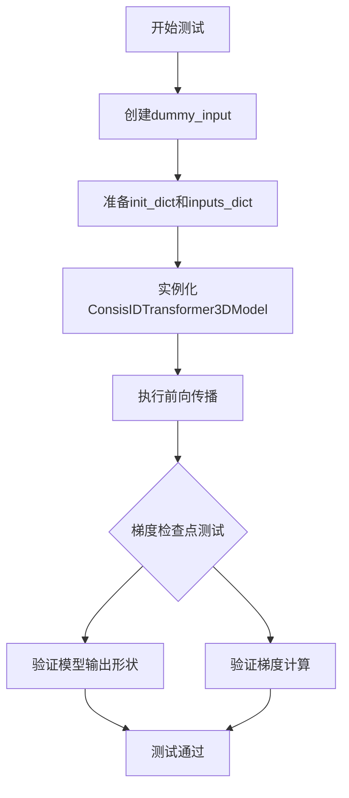
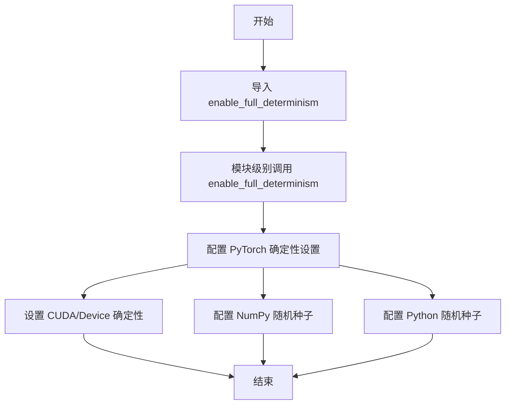
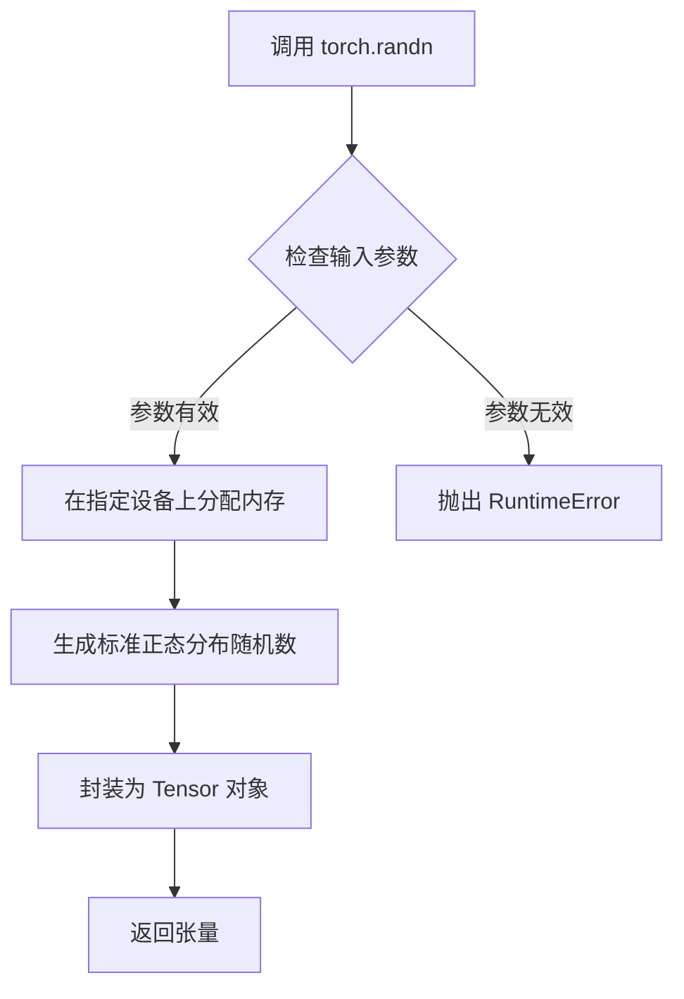
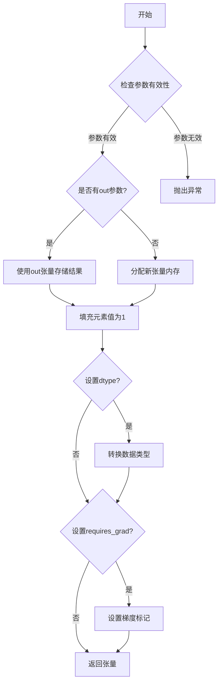
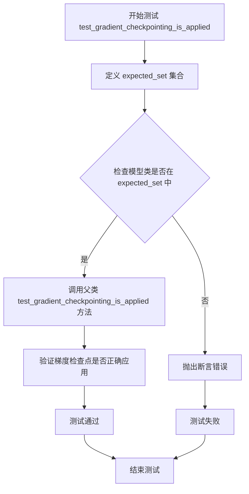
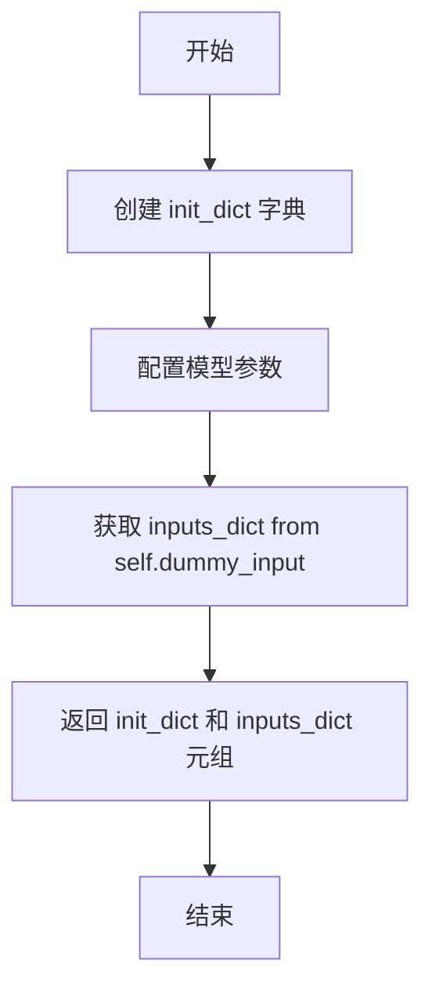

# `diffusers\tests\models\transformers\test_models_transformer_consisid.py` 详细设计文档

这是一个用于测试ConsisIDTransformer3DModel模型的单元测试类，继承自unittest.TestCase和ModelTesterMixin，提供了模型的初始化参数配置、虚拟输入数据生成、以及梯度检查点测试功能。

## 整体流程



## 类结构

```
unittest.TestCase (基类)
ModelTesterMixin (混合类)
└── ConsisIDTransformerTests (测试类)
```

## 全局变量及字段


### `torch`
    
PyTorch深度学习框架的Python绑定，提供张量运算和神经网络构建功能

类型：`module`
    


### `ConsisIDTransformer3DModel`
    
来自diffusers库的一致性ID变换器3D模型类，用于处理视频或3D数据的生成任务

类型：`class`
    


### `enable_full_determinism`
    
测试工具函数，用于启用完全确定性模式以确保测试结果的可重复性

类型：`function`
    


### `torch_device`
    
测试工具变量，指定用于运行测试的计算设备（如'cuda'或'cpu'）

类型：`str`
    


### `ModelTesterMixin`
    
测试模型共用的mixin类，提供模型测试的通用方法和断言

类型：`class`
    


### `ConsisIDTransformerTests.model_class`
    
指定测试类所测试的模型类，即ConsisIDTransformer3DModel

类型：`class`
    


### `ConsisIDTransformerTests.main_input_name`
    
模型的主要输入张量的名称，此处为'hidden_states'

类型：`str`
    


### `ConsisIDTransformerTests.uses_custom_attn_processor`
    
标志位，表示模型是否使用自定义注意力处理器

类型：`bool`
    
    

## 全局函数及方法


### `enable_full_determinism`

设置 PyTorch 和相关库的完全确定性模式，以确保测试的可重复性。

参数：

- 此函数无显式参数（通过 `...testing_utils` 模块导入）

返回值：`None`，无返回值

#### 流程图



#### 带注释源码

```python
# 此函数定义在 testing_utils 模块中
# 当前代码文件从 testing_utils 导入并模块级别调用
from ...testing_utils import (
    enable_full_determinism,
    torch_device,
)

# 模块级别调用：确保整个测试模块在确定的随机种子下运行
enable_full_determinism()

# 函数功能说明：
# 1. 设置 torch.manual_seed 以确保 PyTorch 张量操作的可重复性
# 2. 设置 CUDA 确定性操作（如果可用）
# 3. 设置 Python 和 NumPy 的随机种子
# 目的：使测试结果完全可复现，消除由于随机性导致的测试 flakiness
```

**注意**：当前代码文件中仅包含对该函数的调用，函数定义位于 `...testing_utils` 模块中。该函数通常用于测试框架中，确保在运行测试时所有随机操作都是确定性的，以便测试结果可复现。


### `torch.randn`

`torch.randn` 是 PyTorch 库中的一个核心函数，用于生成服从标准正态分布（均值为0，标准差为1）的随机张量。在该测试代码中，它被用于生成模拟输入数据，包括隐藏状态（hidden_states）和编码器隐藏状态（encoder_hidden_states），以便对 ConsisIDTransformer3DModel 进行单元测试。

参数：

- `*size`：整数可变参数序列（int...），定义输出张量的形状，例如 (batch_size, num_frames, num_channels, height, width)

返回值：`Tensor`，返回一个新的随机张量，其元素从标准正态分布 N(0,1) 中独立采样

#### 流程图



#### 带注释源码

```python
# torch.randn 函数源码（位于 PyTorch 源码库中，此处为简化注释版）

def randn(*size, out=None, dtype=None, layout=torch.strided, device=None, requires_grad=False):
    """
    返回一个由随机数组成的张量，这些随机数服从标准正态分布（均值=0，方差=1）。
    
    参数：
        *size (int...): 定义输出张量形状的整数序列
        out (Tensor, optional): 输出张量
        dtype (torch.dtype, optional): 返回张量的数据类型
        layout (torch.layout, optional): 返回张量的布局
        device (torch.device, optional): 返回张量所在的设备
        requires_grad (bool, optional): 是否需要计算梯度
    
    返回值：
        Tensor: 服从标准正态分布的随机张量
    """
    
    # 如果提供了 out 参数，则使用提供的张量作为输出
    if out is None:
        # 内部调用 Tensor 生成器创建随机张量
        return _C._randn(size, dtype=dtype, layout=layout, device=device, requires_grad=requires_grad)
    else:
        # 将随机数写入提供的 out 张量中
        return _C._randn_out(size, out=out)
```

**在当前测试代码中的具体使用：**

```python
# 用法1：生成 5D 隐藏状态张量 (batch_size, num_frames, num_channels, height, width)
hidden_states = torch.randn((batch_size, num_frames, num_channels, height, width)).to(torch_device)

# 用法2：生成 3D 编码器隐藏状态张量 (batch_size, sequence_length, embedding_dim)
encoder_hidden_states = torch.randn((batch_size, sequence_length, embedding_dim)).to(torch_device)
```


### `torch.randint`

生成指定范围内的随机整数张量，创建一个形状为`size`的张量，其中填充了从指定范围`[low, high)`内均匀采样的随机整数。

参数：

- `low`：`int`，范围下限（包含），默认值为0
- `high`：`int`，范围上限（不包含），指定随机整数的上限
- `size`：`tuple` or `int`，输出张量的形状，这里是`(batch_size,)`
- `*`：`其他参数`，如`dtype`、`device`、`layout`、`generator`、`pin_memory`、`requires_grad`等

返回值：`Tensor`，返回填充了`[low, high)`范围内随机整数的张量

#### 流程图

```mermaid
flowchart TD
    A[开始调用 torch.randint] --> B{检查参数有效性}
    B -->|参数有效| C[在 [low, high) 范围内生成随机整数]
    C --> D[将随机整数填充到指定形状 size 的张量中]
    D --> E[返回生成的张量]
    B -->|参数无效| F[抛出 ValueError 异常]
    E --> G[结束]
```

#### 带注释源码

```python
# 代码中的实际使用方式：
timestep = torch.randint(0, 1000, size=(batch_size,)).to(torch_device)

# 参数解析：
# - 0: low 参数，生成随机整数的下限（包含）
# - 1000: high 参数，生成随机整数的上限（不包含），实际生成范围为 [0, 999]
# - size=(batch_size,): 输出张量的形状，这里 batch_size=2，所以生成形状为 (2,) 的张量
# - .to(torch_device): 将生成的张量移动到指定的计算设备上（如 CPU 或 CUDA 设备）

# 功能说明：
# 该调用生成一个包含 batch_size 个随机整数的张量，每个整数的取值范围为 [0, 1000)
# 例如：可能生成 tensor([123, 567]) 这样的结果
```


### `torch.ones`

创建并返回一个填充了标量值 1 的张量，其形状由可变参数 `size` 定义。该函数是 PyTorch 基础张量创建函数之一，常用于初始化测试数据、占位符或模型权重的基准值。

#### 参数

- `size`：`int 或 Tuple[int]`，张量的形状，可以是单个整数或整数元组（如 `(3, 4)` 或 `3, 4`）
- `out`：`Tensor, optional`，输出张量，指定结果存储的目标张量
- `dtype`：`torch.dtype, optional`，返回张量的数据类型（如 `torch.float32`、`torch.int64` 等）
- `layout`：`torch.layout, optional`，张量的内存布局，默认为 `torch.strided`
- `device`：`torch.device, optional`，返回张量所在的设备（CPU 或 CUDA）
- `requires_grad`：`bool, optional`，是否记录张量的梯度，默认为 `False`

#### 返回值

- `Tensor`，形状为 `size` 的张量，其中所有元素值均为 1

#### 流程图



#### 带注释源码

```python
# 源码位置: pytorch/torch/_tensor.py 或 pytorch/torch/ones.py
# 以下为简化的核心逻辑实现

def ones(*size, out=None, dtype=None, layout=torch.strided, device=None, requires_grad=False):
    """
    返回一个填充了标量值1的张量
    
    参数:
        *size: 可变长参数，定义输出张量的形状
        out: 可选的输出张量
        dtype: 可选的数据类型
        layout: 内存布局，默认为strided
        device: 可选的设备(CPU/CUDA)
        requires_grad: 是否需要梯度
    
    返回:
        Tensor: 填充了1的张量
    """
    # 如果传入的是元组或列表，则使用该形状
    if len(size) == 1 and isinstance(size[0], (tuple, list)):
        size = size[0]
    
    # 使用empty创建未初始化的张量，然后填充1
    if out is None:
        # 分配内存创建张量
        tensor = torch.empty(*size, dtype=dtype, layout=layout, device=device)
    else:
        tensor = out
    
    # 填充值为1 (核心操作)
    tensor.fill_(1)
    
    # 设置梯度标记
    tensor.requires_grad = requires_grad
    
    return tensor
```

#### 在代码中的实际使用示例

```python
# 在测试代码中的使用
id_vit_hidden = [torch.ones([batch_size, 2, 2]).to(torch_device)] * 1
# 创建形状为 [2, 2, 2] 的全1张量，然后移动到指定设备

id_cond = torch.ones(batch_size, 2).to(torch_device)
# 创建形状为 [2, 2] 的全1张量，然后移动到指定设备
```


### `ConsisIDTransformerTests.test_gradient_checkpointing_is_applied`

该测试方法用于验证梯度检查点（Gradient Checkpointing）功能是否正确应用于指定的 `ConsisIDTransformer3DModel` 模型类，通过调用父类的测试方法并传入预期的模型类集合来执行验证。

参数：

- `expected_set`：`set`，包含预期应用梯度检查点的模型类名称集合（此处为 `{"ConsisIDTransformer3DModel"}`），通过 `super()` 调用时传递

返回值：`None`，该方法通过调用父类方法执行测试，不返回任何值

#### 流程图



#### 带注释源码

```python
def test_gradient_checkpointing_is_applied(self):
    """
    测试梯度检查点（Gradient Checkpointing）是否应用于指定的模型类。
    
    该方法继承自 ModelTesterMixin，用于验证模型在启用梯度检查点后
    能够正确保存和恢复梯度信息，以实现内存优化。
    """
    # 定义预期应用梯度检查点的模型类集合
    expected_set = {"ConsisIDTransformer3DModel"}
    
    # 调用父类的测试方法，验证梯度检查点是否正确应用于指定的模型类
    # 父类方法会检查:
    # 1. 模型是否支持梯度检查点
    # 2. 梯度检查点启用后前向传播是否正常
    # 3. 梯度计算是否正确
    super().test_gradient_checkpointing_is_applied(expected_set=expected_set)
```


### `ConsisIDTransformerTests.dummy_input`

该属性方法用于生成ConsisIDTransformer3DModel模型测试所需的虚拟输入数据，返回一个包含hidden_states、encoder_hidden_states、timestep、id_vit_hidden和id_cond的字典，作为模型前向传播的测试用例。

参数：

- `self`：`ConsisIDTransformerTests`实例，隐含的测试类实例引用

返回值：`Dict[str, Any]`，包含模型测试所需的所有虚拟输入张量
- `hidden_states`：`torch.Tensor`，形状为(batch_size, num_frames, num_channels, height, width)=(2, 1, 4, 8, 8)的5D张量，表示输入的隐藏状态
- `encoder_hidden_states`：`torch.Tensor`，形状为(batch_size, sequence_length, embedding_dim)=(2, 8, 8)的3D张量，表示编码器的隐藏状态
- `timestep`：`torch.Tensor`，形状为(batch_size,)=(2,)的1D张量，表示扩散过程中的时间步
- `id_vit_hidden`：`List[torch.Tensor]`，包含1个形状为(batch_size, 2, 2)=(2, 2, 2)的3D张量的列表，表示ID相关的ViT隐藏状态
- `id_cond`：`torch.Tensor`，形状为(batch_size, 2)=(2, 2)的2D张量，表示ID条件信息

#### 流程图

```mermaid
flowchart TD
    A[开始 dummy_input property] --> B[设置批次大小 batch_size=2]
    B --> C[设置通道数 num_channels=4]
    C --> D[设置帧数 num_frames=1]
    D --> E[设置高度 width=8 和宽度 height=8]
    E --> F[设置嵌入维度 embedding_dim=8]
    F --> G[设置序列长度 sequence_length=8]
    G --> H[生成 hidden_states: torch.randn<br/>(2, 1, 4, 8, 8)]
    H --> I[生成 encoder_hidden_states: torch.randn<br/>(2, 8, 8)]
    I --> J[生成 timestep: torch.randint<br/>(0, 1000, (2,))]
    J --> K[生成 id_vit_hidden: List[torch.ones<br/>(2, 2, 2)] × 1]
    K --> L[生成 id_cond: torch.ones<br/>(2, 2)]
    L --> M[构建并返回输入字典]
    M --> N[结束]
```

#### 带注释源码

```python
@property
def dummy_input(self):
    """
    生成用于模型测试的虚拟输入数据。
    
    该方法创建一个包含所有必要输入的字典，用于测试ConsisIDTransformer3DModel
    的前向传播功能。生成的张量使用随机值（除id_vit_hidden和id_cond使用常量值）。
    """
    # 定义批次大小
    batch_size = 2
    # 定义输入通道数
    num_channels = 4
    # 定义视频帧数（单帧）
    num_frames = 1
    # 定义空间维度：高度和宽度
    height = 8
    width = 8
    # 定义文本嵌入维度
    embedding_dim = 8
    # 定义序列长度
    sequence_length = 8

    # 生成5D隐藏状态张量: [批次, 帧数, 通道, 高度, 宽度]
    # 形状: (2, 1, 4, 8, 8)
    hidden_states = torch.randn((batch_size, num_frames, num_channels, height, width)).to(torch_device)
    
    # 生成编码器隐藏状态: [批次, 序列长度, 嵌入维度]
    # 形状: (2, 8, 8)
    encoder_hidden_states = torch.randn((batch_size, sequence_length, embedding_dim)).to(torch_device)
    
    # 生成随机时间步: [批次]
    # 形状: (2,), 值范围 [0, 1000)
    timestep = torch.randint(0, 1000, size=(batch_size,)).to(torch_device)
    
    # 生成ID ViT隐藏状态列表: 包含1个3D张量
    # 每个张量形状: (2, 2, 2)
    id_vit_hidden = [torch.ones([batch_size, 2, 2]).to(torch_device)] * 1
    
    # 生成ID条件张量: [批次, 条件维度]
    # 形状: (2, 2)
    id_cond = torch.ones(batch_size, 2).to(torch_device)

    # 返回包含所有输入的字典，供模型前向传播使用
    return {
        "hidden_states": hidden_states,
        "encoder_hidden_states": encoder_hidden_states,
        "timestep": timestep,
        "id_vit_hidden": id_vit_hidden,
        "id_cond": id_cond,
    }
```


### `ConsisIDTransformerTests.input_shape`

该属性定义了ConsisIDTransformer3DModel测试类的输入张量形状，用于模型测试时的输入维度验证。

参数：
- （无参数，该属性不需要输入参数）

返回值：`tuple`，返回模型的预期输入形状，包含(帧数, 通道数, 高度, 宽度)四个维度的元组

#### 流程图

```mermaid
flowchart TD
    A[调用input_shape属性] --> B{检查属性是否存在}
    B -->|是| C[返回元组 (1, 4, 8, 8)]
    C --> D[结束]
    
    style A fill:#e1f5fe
    style C fill:#c8e6c9
```

#### 带注释源码

```python
@property
def input_shape(self):
    """
    定义模型测试的输入形状。
    
    返回值说明:
    - 第一个元素 1: num_frames (帧数)
    - 第二个元素 4: num_channels (通道数) 
    - 第三个元素 8: height (高度)
    - 第四个元素 8: width (宽度)
    
    注意: 此属性与dummy_input方法配合使用，dummy_input生成的
    实际张量形状为 (batch_size, num_frames, num_channels, height, width)
    即 (2, 1, 4, 8, 8)，其中batch_size=2会作为额外维度添加。
    """
    return (1, 4, 8, 8)
```


### `ConsisIDTransformerTests.output_shape`

该属性定义了 ConsisIDTransformer3DModel 的输出张量形状，返回一个四维元组 (1, 4, 8, 8)，分别代表批量大小、通道数、高度和宽度。

参数：

- （无参数，该方法为属性装饰器方法）

返回值：`Tuple[int, int, int, int]`，返回模型输出的形状元组，包含 (batch_size, channels, height, width)。

#### 流程图

```mermaid
flowchart TD
    A[开始] --> B{调用 output_shape 属性}
    B --> C[返回元组 (1, 4, 8, 8)]
    C --> D[结束]
    
    style A fill:#f9f,stroke:#333
    style D fill:#9f9,stroke:#333
```

#### 带注释源码

```python
@property
def output_shape(self):
    """
    返回模型的输出形状。
    
    该属性定义了 ConsisIDTransformer3DModel 在推理时输出的 hidden_states 的维度。
    返回的四维元组分别代表：
    - 批量大小 (batch_size): 1
    - 通道数 (num_channels): 4
    - 高度 (height): 8
    - 宽度 (width): 8
    
    Returns:
        tuple: 包含四个整数的元组，表示 (batch_size, num_channels, height, width)
    """
    return (1, 4, 8, 8)
```


### `ConsisIDTransformerTests.prepare_init_args_and_inputs_for_common`

该方法用于准备模型测试所需的初始化参数字典和输入字典，为通用测试用例提供必要的配置和输入数据。

参数：

- `self`：`ConsisIDTransformerTests` 实例本身，包含模型类信息和测试配置

返回值：`Tuple[dict, dict]`，返回一个元组，包含初始化参数字典 `init_dict` 和输入字典 `inputs_dict`，用于模型的前向传播测试

#### 流程图



#### 带注释源码

```
def prepare_init_args_and_inputs_for_common(self):
    """
    准备模型初始化参数和输入数据，用于通用测试。
    
    Returns:
        tuple: (init_dict, inputs_dict) 初始化参数字典和输入字典的元组
    """
    # 初始化参数字典，包含模型架构的各种配置参数
    init_dict = {
        "num_attention_heads": 2,              # 注意力头数量
        "attention_head_dim": 8,              # 注意力头维度
        "in_channels": 4,                     # 输入通道数
        "out_channels": 4,                     # 输出通道数
        "time_embed_dim": 2,                  # 时间嵌入维度
        "text_embed_dim": 8,                  # 文本嵌入维度
        "num_layers": 1,                       # 网络层数
        "sample_width": 8,                     # 样本宽度
        "sample_height": 8,                    # 样本高度
        "sample_frames": 8,                    # 样本帧数
        "patch_size": 2,                       # 补丁大小
        "temporal_compression_ratio": 4,      # 时间压缩比
        "max_text_seq_length": 8,             # 最大文本序列长度
        "cross_attn_interval": 1,             # 交叉注意力间隔
        "is_kps": False,                       # 是否使用关键点
        "is_train_face": True,                 # 是否训练人脸
        "cross_attn_dim_head": 1,             # 交叉注意力头维度
        "cross_attn_num_heads": 1,            # 交叉注意力头数量
        "LFE_id_dim": 2,                       # ID特征维度
        "LFE_vit_dim": 2,                      # ViT特征维度
        "LFE_depth": 5,                        # LFE深度
        "LFE_dim_head": 8,                     # LFE头维度
        "LFE_num_heads": 2,                    # LFE头数量
        "LFE_num_id_token": 1,                # ID令牌数量
        "LFE_num_querie": 1,                  # 查询数量
        "LFE_output_dim": 10,                 # LFE输出维度
        "LFE_ff_mult": 1,                      # LFE前馈网络倍数
        "LFE_num_scale": 1,                   # LFE尺度数量
    }
    # 从测试类获取虚拟输入数据
    inputs_dict = self.dummy_input
    # 返回初始化参数和输入字典的元组
    return init_dict, inputs_dict
```


### `ConsisIDTransformerTests.test_gradient_checkpointing_is_applied`

该方法用于测试梯度检查点（Gradient Checkpointing）功能是否被正确应用到 `ConsisIDTransformer3DModel` 模型类中，通过验证目标模型类是否存在于梯度检查点的预期集合中，并调用父类的测试逻辑来确认检查点机制是否生效。

参数：

- `expected_set`：`Set[str]`，预期启用梯度检查点的模型类名称集合，此处为包含 `"ConsisIDTransformer3DModel"` 的集合

返回值：`None`，该方法无返回值，通过调用父类方法执行测试断言

#### 流程图

```mermaid
flowchart TD
    A[开始执行 test_gradient_checkpointing_is_applied] --> B[创建 expected_set 集合]
    B --> C[包含 'ConsisIDTransformer3DModel']
    C --> D[调用父类方法 super().test_gradient_checkpointing_is_applied]
    D --> E{父类方法执行测试逻辑}
    E -->|通过| F[测试通过, 无返回值]
    E -->|失败| G[抛出断言错误]
    
    style A fill:#e1f5fe
    style F fill:#c8e6c9
    style G fill:#ffcdd2
```

#### 带注释源码

```python
def test_gradient_checkpointing_is_applied(self):
    """
    测试梯度检查点功能是否应用于 ConsisIDTransformer3DModel 模型类。
    
    该方法继承自 ModelTesterMixin，通过调用父类的测试方法验证：
    1. 目标模型类 ConsisIDTransformer3DModel 是否在梯度检查点集合中
    2. 梯度检查点机制是否正确启用并能节省显存
    """
    # 定义预期启用梯度检查点的模型类集合
    # ConsisIDTransformer3DModel 是本次测试的目标模型类
    expected_set = {"ConsisIDTransformer3DModel"}
    
    # 调用父类 (ModelTesterMixin) 的同名方法执行实际的梯度检查点测试逻辑
    # 父类方法会验证模型是否正确实现了梯度检查点功能
    super().test_gradient_checkpointing_is_applied(expected_set=expected_set)
```

## 关键组件


### ConsisIDTransformer3DModel

核心被测试模型类，是一个3D Transformer模型，用于ConsisID任务。

### dummy_input

测试输入生成方法，构造包含hidden_states、encoder_hidden_states、timestep、id_vit_hidden和id_cond的测试字典，用于模型前向传播测试。

### ModelTesterMixin

通用的模型测试混入类，提供模型测试的通用方法（如梯度检查点测试、参数初始化测试等）。

### test_gradient_checkpointing_is_applied

梯度检查点测试方法，验证模型是否正确应用了梯度检查点技术以节省显存。

### LFE (Latent Feature Extractor) 组件

包含LFE_id_dim、LFE_vit_dim、LFE_depth、LFE_dim_head、LFE_num_heads、LFE_num_id_token、LFE_num_querie、LFE_output_dim、LFE_ff_mult、LFE_num_scale等参数，用于处理ID特征的潜在特征提取器配置。

### attention_head_dim 与 num_attention_heads

注意力头维度（8）和注意力头数量（2）的配置，决定自注意力机制的参数规模。

### patch_size 与 temporal_compression_ratio

空间补丁大小（2）和时间压缩比（4），用于3D数据的空间和时间维度处理。

### is_kps 与 is_train_face

关键点检测标志（False）和人脸训练标志（True），控制模型的行为模式。


## 问题及建议


### 已知问题

- **输入输出形状定义不匹配**：`input_shape` 和 `output_shape` 属性返回 4D 元组 `(1, 4, 8, 8)`，但 `dummy_input` 方法中创建的 `hidden_states` 是 5D 张量 `(batch_size, num_frames, num_channels, height, width)` = `(2, 1, 4, 8, 8)`，与模型实际处理的 3D 视频数据维度不一致
- **测试数据使用硬编码值**：`id_vit_hidden` 和 `id_cond` 使用 `torch.ones` 创建全1张量，而非随机数据，这可能导致测试无法有效验证模型在不同输入下的行为
- **配置参数缺乏类型标注**：`prepare_init_args_and_inputs_for_common` 方法中的 `init_dict` 包含大量配置参数（如 `LFE_id_dim`, `LFE_vit_dim`, `LFE_depth` 等），但没有类型标注和注释说明其含义和取值范围
- **测试覆盖不足**：仅实现了 `test_gradient_checkpointing_is_applied` 一个测试方法，缺少对模型前向传播、输出形状、注意力机制等核心功能的测试
- **魔法数字问题**：多个地方使用硬编码数值（如 `num_frames=1`, `height=8`, `width=8`, `sequence_length=8`），缺乏统一的常量定义或配置管理
- **类属性与父类契约不一致**：`uses_custom_attn_processor = True` 被设置，但未实现相应的自定义注意力处理器逻辑

### 优化建议

- 修正 `input_shape` 和 `output_shape` 属性，返回正确的 5D 元组以匹配 3D 模型输入（如 `(1, 1, 4, 8, 8)`）
- 将 `id_vit_hidden` 和 `id_cond` 改为使用 `torch.randn` 生成随机数据，提高测试的真实性和覆盖率
- 将硬编码的配置参数提取为类级别常量或 `pytest fixture`，提高可维护性
- 增加更多测试方法，包括 `test_model_outputs_equivalence`, `test_attention_weights`, `test_hidden_states_output` 等
- 为 `init_dict` 中的配置参数添加类型标注和 docstring，说明每个参数的用途和约束
- 考虑添加参数化测试（`@pytest.mark.parametrize`）以覆盖不同的配置组合

## 其它


### 设计目标与约束

验证 ConsisIDTransformer3DModel 模型类在各种配置下的功能正确性，包括前向传播、梯度检查点、参数一致性等核心功能。约束条件包括使用特定的输入维度（batch_size=2, num_frames=1, num_channels=4, height=8, width=8）和模型配置参数。

### 错误处理与异常设计

测试类通过继承 unittest.TestCase 利用其内置的断言机制处理错误。当模型输出形状不匹配、梯度计算错误或参数不一致时，测试框架会自动捕获 AssertionError 并报告具体的失败信息。ModelTesterMixin 提供了标准化的错误处理模式。

### 数据流与状态机

测试数据流：dummy_input 方法生成包含 hidden_states（五维张量）、encoder_hidden_states、timestep、id_vit_hidden 和 id_cond 的字典，输入模型后返回预测结果。状态机方面，测试覆盖推理模式（is_train=False）和训练模式（is_train=True，通过 prepare_init_args_and_inputs_for_common 中的 is_train_face=True 设置）。

### 外部依赖与接口契约

主要依赖包括：torch（张量运算）、unittest（测试框架）、diffusers 库中的 ConsisIDTransformer3DModel 类、ModelTesterMixin 混合类以及 testing_utils 中的 enable_full_determinism 和 torch_device 工具函数。接口契约要求模型必须接受指定的输入参数字段并返回兼容的张量输出。

### 测试覆盖范围分析

当前测试覆盖范围包括：梯度检查点验证（test_gradient_checkpointing_is_applied）、模型初始化参数准备、输入输出形状定义。缺失的测试覆盖包括：模型前向传播正确性验证、参数数量一致性检查、模型配置序列化与反序列化、梯度计算准确性、与预训练权重的兼容性验证。

### 关键组件交互关系

ConsisIDTransformer3DModel 是核心被测组件；ModelTesterMixin 提供通用模型测试方法；dummy_input 生成测试输入数据；prepare_init_args_and_inputs_for_common 准备模型初始化参数字典；test_gradient_checkpointing_is_applied 验证梯度检查点功能是否正确应用。

### 性能基准与优化空间

当前测试未包含性能基准测试。优化空间：可添加推理速度基准测试、内存占用测试、不同批量大小下的性能曲线测试，以评估模型在不同硬件配置下的表现。

### 可维护性与扩展性

测试类设计遵循单一职责原则，通过 ModelTesterMixin 实现测试方法复用。扩展性良好，可通过添加新的测试方法验证模型其他功能特性，如不同的注意力机制配置、时序处理逻辑等。

### 配置参数说明

模型配置包含注意力头数（num_attention_heads=2）、注意力头维度（attention_head_dim=8）、输入输出通道数（in_channels=4, out_channels=4）、时间嵌入维度（time_embed_dim=2）、文本嵌入维度（text_embed_dim=8）、层数（num_layers=1）、样本尺寸（sample_width=8, sample_height=8, sample_frames=8）、patch大小（patch_size=2）、时序压缩比（temporal_compression_ratio=4）、最大文本序列长度（max_text_seq_length=8）、LFE（Local Feature Extraction）相关参数等。

### 测试环境要求

需要 Python 3.8+、PyTorch 1.8+、diffusers 库、测试环境需支持 CUDA（torch_device 指定设备）。enable_full_determinism 确保测试结果可复现。


    