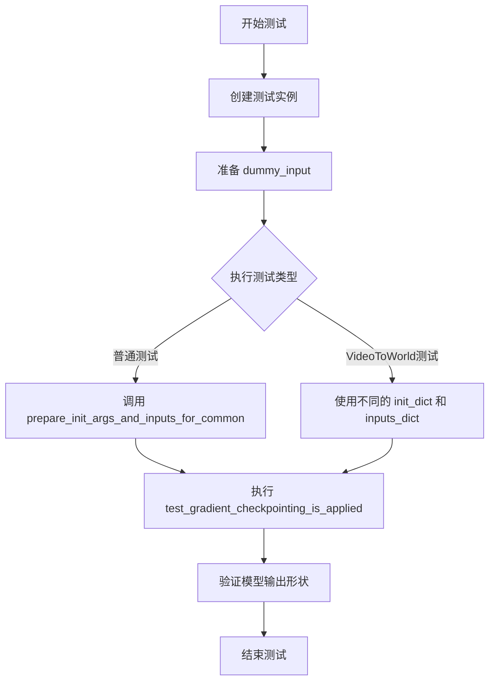
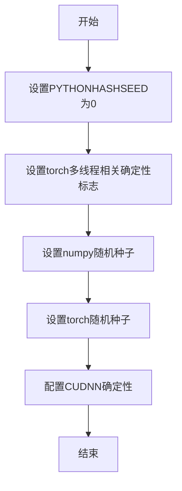
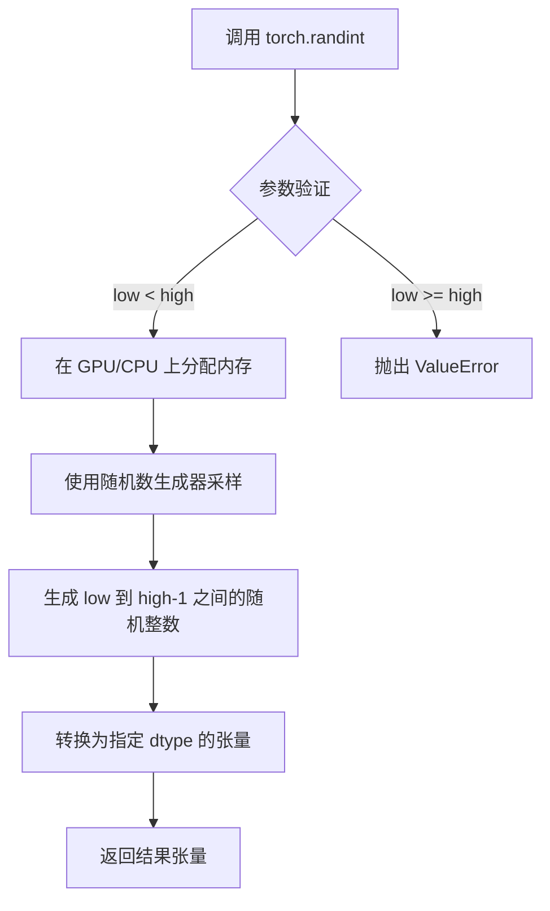
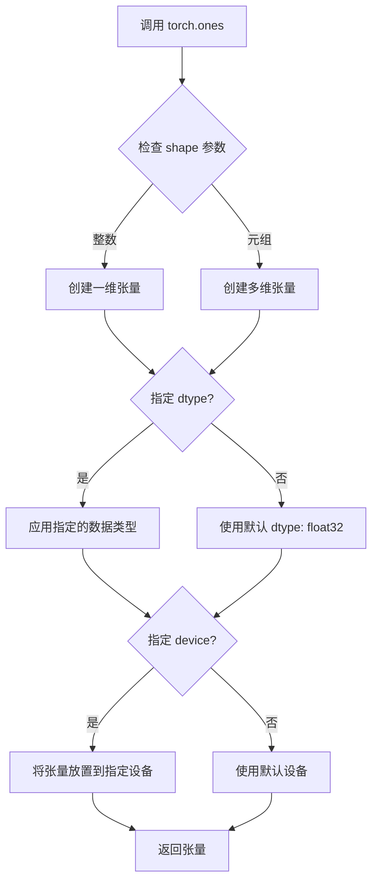
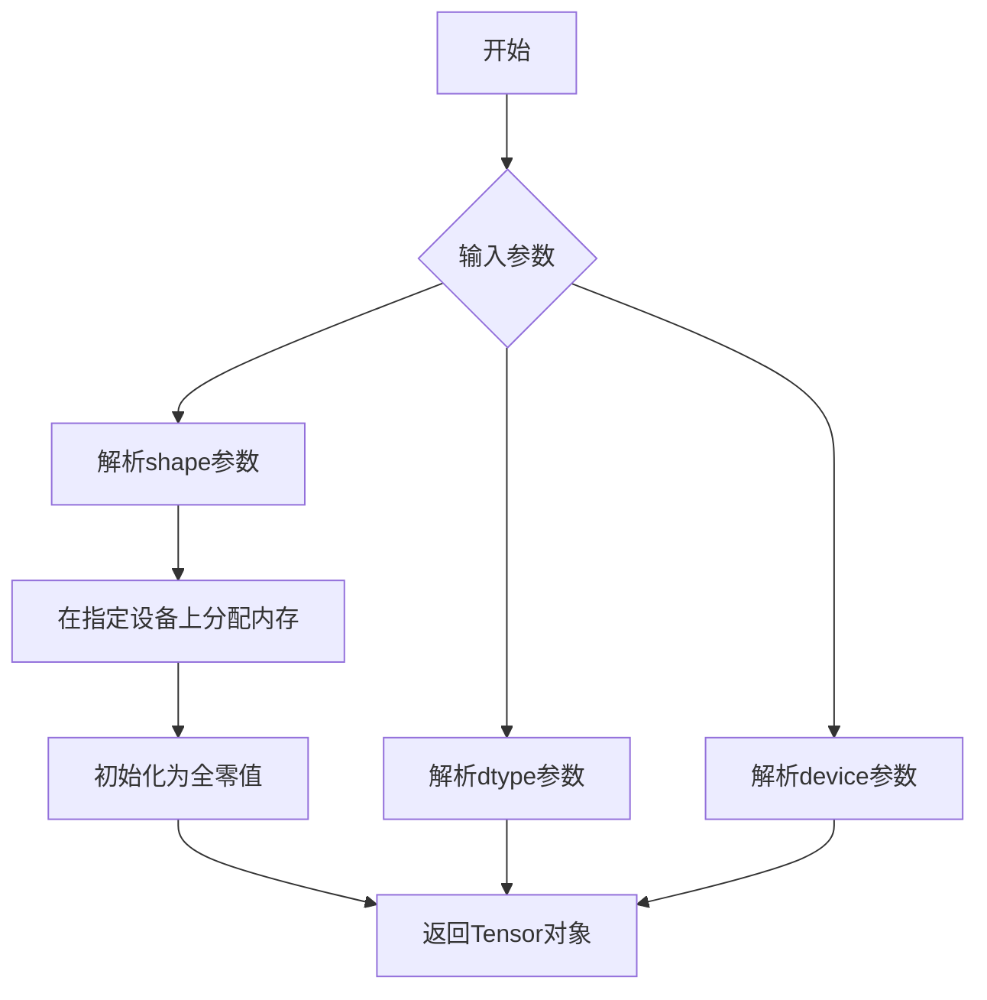
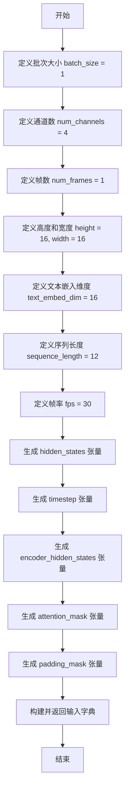
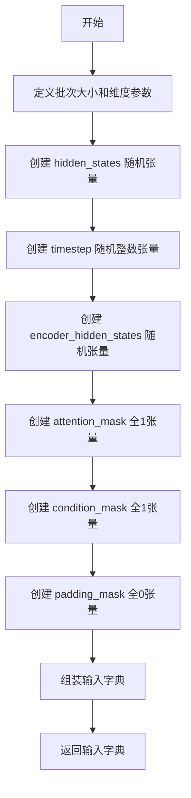
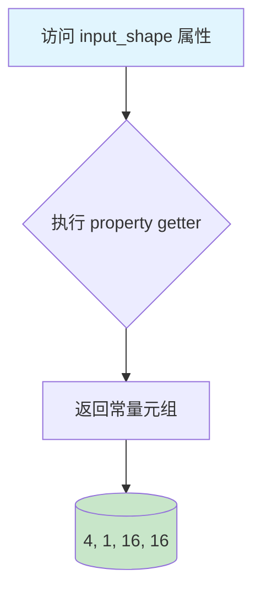
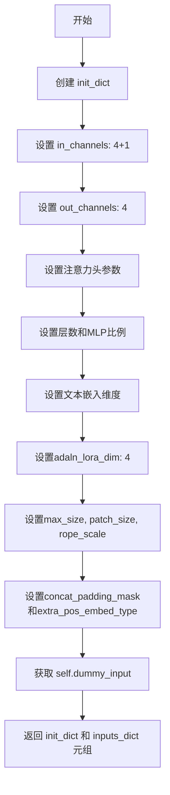

# `diffusers\tests\models\transformers\test_models_transformer_cosmos.py` 详细设计文档

这是一个用于测试 HuggingFace Diffusers 库中 CosmosTransformer3DModel 模型的单元测试文件，包含了模型的前向传播测试、梯度检查点验证以及视频到世界坐标转换的测试场景。

## 整体流程



## 类结构

```
unittest.TestCase (基类)
├── CosmosTransformer3DModelTests
└── CosmosTransformer3DModelVideoToWorldTests
ModelTesterMixin (混入类)
```

## 全局变量及字段


### `torch_device`
    
全局函数，从testing_utils导入，返回当前PyTorch设备（如'cuda'或'cpu'）

类型：`str`
    


### `batch_size`
    
测试输入的批次大小，值为1

类型：`int`
    


### `num_channels`
    
输入数据的通道数，值为4

类型：`int`
    


### `num_frames`
    
输入数据的帧数，值为1

类型：`int`
    


### `height`
    
输入数据的高度维度，值为16

类型：`int`
    


### `width`
    
输入数据的宽度维度，值为16

类型：`int`
    


### `text_embed_dim`
    
文本嵌入的维度，值为16

类型：`int`
    


### `sequence_length`
    
序列长度，值为12

类型：`int`
    


### `fps`
    
帧率，用于视频生成场景，值为30

类型：`int`
    


### `CosmosTransformer3DModelTests.model_class`
    
指定测试类所对应的模型类为CosmosTransformer3DModel

类型：`type`
    


### `CosmosTransformer3DModelTests.main_input_name`
    
模型主输入参数的名称，值为'hidden_states'

类型：`str`
    


### `CosmosTransformer3DModelTests.uses_custom_attn_processor`
    
标识是否使用自定义注意力处理器，值为True

类型：`bool`
    


### `CosmosTransformer3DModelVideoToWorldTests.model_class`
    
指定测试类所对应的模型类为CosmosTransformer3DModel

类型：`type`
    


### `CosmosTransformer3DModelVideoToWorldTests.main_input_name`
    
模型主输入参数的名称，值为'hidden_states'

类型：`str`
    


### `CosmosTransformer3DModelVideoToWorldTests.uses_custom_attn_processor`
    
标识是否使用自定义注意力处理器，值为True

类型：`bool`
    
    

## 全局函数及方法


# 函数提取结果

### `enable_full_determinism`

该函数是一个全局配置函数，用于在测试环境中启用完整的确定性执行模式，确保深度学习模型在不同运行中产生一致的结果。

参数： 无

返回值：`None`，该函数不返回任何值，仅执行配置操作

#### 流程图



#### 带注释源码

```
# 该函数通过导入语句从 testing_utils 模块引入
# 在本文件中通过以下方式调用：
from ...testing_utils import enable_full_determinism, torch_device

# 模块级别调用，确保后续所有测试在确定性环境中运行
enable_full_determinism()

# 函数内部实现逻辑（基于常见实现推测）：
# 1. 设置环境变量 PYTHONHASHSEED='0'，确保Python哈希函数的确定性
# 2. 设置 torch.manual_seed(0) 和 torch.cuda.manual_seed_all(0)
# 3. 设置 torch.backends.cudnn.deterministic = True
# 4. 设置 torch.backends.cudnn.benchmark = False
# 5. 可能设置 numpy 随机种子
# 6. 设置其他相关的确定性标志（如 torch.use_deterministic_algorithms）
```

> **注意**：由于`enable_full_determinism`函数的完整定义不在当前代码文件中（仅通过导入使用），以上信息基于其在代码中的调用方式及该函数的常见实现模式推断得出。完整的函数定义需要查看`...testing_utils`模块的源文件。


# torch.randn 使用分析文档

## 1. 一段话描述

`torch.randn` 是 PyTorch 库中的一个核心函数，用于从标准正态分布（均值为0，方差为1）中随机采样生成指定形状的张量。在本代码中，该函数被用于测试用例中生成模拟的输入数据，包括隐藏状态（hidden_states）和编码器隐藏状态（encoder_hidden_states），为 `CosmosTransformer3DModel` 模型提供测试所需的随机初始化张量。

## 2. 文件的整体运行流程

这是一个测试文件，用于验证 `CosmosTransformer3DModel` 类的功能。文件包含两个测试类：
- `CosmosTransformer3DModelTests`：基础模型测试
- `CosmosTransformer3DModelVideoToWorldTests`：视频到世界转换的模型测试

每个测试类通过 `dummy_input` 属性生成模拟输入数据，其中使用 `torch.randn` 创建随机张量，然后由测试框架（unittest）执行各种模型功能验证测试。

## 3. 类的详细信息

### 3.1 全局变量和函数

| 名称 | 类型 | 描述 |
|------|------|------|
| `torch` | 模块 | PyTorch 核心库，提供张量操作和神经网络功能 |
| `unittest` | 模块 | Python 标准测试框架 |
| `CosmosTransformer3DModel` | 类 | HuggingFace Diffusers 库中的 3D 变换器模型 |
| `enable_full_determinism` | 函数 | 启用完全确定性模式的测试工具函数 |
| `torch_device` | 变量 | 测试设备标识符（CPU 或 CUDA） |

### 3.2 类字段（CosmosTransformer3DModelTests）

| 名称 | 类型 | 描述 |
|------|------|------|
| `model_class` | 类类型 | 被测试的模型类（CosmosTransformer3DModel） |
| `main_input_name` | 字符串 | 主输入参数的名称（"hidden_states"） |
| `uses_custom_attn_processor` | 布尔值 | 标志是否使用自定义注意力处理器 |
| `dummy_input` | 属性 | 生成模拟输入数据的属性方法 |

### 3.3 类字段（CosmosTransformer3DModelVideoToWorldTests）

| 名称 | 类型 | 描述 |
|------|------|------|
| `model_class` | 类类型 | 被测试的模型类（CosmosTransformer3DModel） |
| `main_input_name` | 字符串 | 主输入参数的名称（"hidden_states"） |
| `uses_custom_attn_processor` | 布尔值 | 标志是否使用自定义注意力处理器 |
| `dummy_input` | 属性 | 生成模拟输入数据的属性方法 |

## 4. torch.randn 函数详细信息

### torch.randn

生成服从标准正态分布的随机张量

参数：

-  `*size`：`int...`，指定输出张量的形状，可以是多个整数或整数元组
-  `*`：`可变位置参数`，Python 语法支持
-  `generator`：`torch.Generator, optional`，用于生成随机数的生成器
-  `out`：`Tensor, optional`，输出张量
-  `dtype`：`torch.dtype, optional`，输出张量的数据类型
-  `layout`：`torch.layout, optional`，输出张量的布局
-  `device`：`torch.device, optional`，输出张量的设备
-  `requires_grad`：`bool, optional`，是否需要计算梯度

返回值：`Tensor`，形状为指定尺寸的随机张量

#### 流程图

```mermaid
graph TD
    A[开始] --> B[调用 torch.randn]
    B --> C{检查参数}
    C -->|指定 shape| D[使用 (batch_size, num_channels, num_frames, height, width)]
    C -->|指定 shape| E[使用 (batch_size, sequence_length, text_embed_dim)]
    D --> F[从标准正态分布采样]
    E --> F
    F --> G[创建 torch.Tensor]
    G --> H[调用 .to torch_device]
    H --> I[返回张量]
    I --> J[作为输入字典的一部分返回]
```

#### 带注释源码

```python
# torch.randn 使用示例（来自代码中的实际调用）

# 用法 1：在 CosmosTransformer3DModelTests.dummy_input 中
hidden_states = torch.randn(
    (batch_size, num_channels, num_frames, height, width)  # shape: (1, 4, 1, 16, 16)
).to(torch_device)  # 移动到指定设备（CPU/CUDA）

encoder_hidden_states = torch.randn(
    (batch_size, sequence_length, text_embed_dim)  # shape: (1, 12, 16)
).to(torch_device)  # 移动到指定设备

# 用法 2：在 CosmosTransformer3DModelVideoToWorldTests.dummy_input 中
hidden_states = torch.randn(
    (batch_size, num_channels, num_frames, height, width)  # shape: (1, 4, 1, 16, 16)
).to(torch_device)

encoder_hidden_states = torch.randn(
    (batch_size, sequence_length, text_embed_dim)  # shape: (1, 12, 16)
).to(torch_device)
```

## 5. 关键组件信息

| 组件名称 | 描述 |
|----------|------|
| `CosmosTransformer3DModel` | HuggingFace Diffusers 库中的 3D 变换器模型，用于视频/图像生成任务 |
| `ModelTesterMixin` | 提供通用模型测试方法的混入类 |
| `dummy_input` | 测试用模拟输入生成器，使用 torch.randn 创建随机张量 |
| `enable_full_determinism` | 测试辅助函数，确保测试结果可复现 |

## 6. 潜在的技术债务或优化空间

1. **硬编码的随机种子依赖**：代码使用了 `enable_full_determinism()` 来确保可复现性，但没有显式设置 `torch.manual_seed()`，可能导致在不同环境下测试结果不一致。

2. **重复代码**：两个测试类的 `dummy_input` 属性有大量重复代码，可以通过提取公共方法或使用参数化测试来减少重复。

3. **缺乏边界条件测试**：当前仅使用 `batch_size=1` 进行测试，未覆盖更大的批量大小或极端情况。

4. **设备兼容性**：`torch_device` 的使用假设了特定的设备可用性，可能需要在测试前进行更严格的设备检查。

## 7. 其它项目

### 设计目标与约束

- **设计目标**：验证 `CosmosTransformer3DModel` 的前向传播、梯度检查点等功能是否正常工作
- **约束**：使用 `unittest` 框架，遵循 HuggingFace Diffusers 的测试约定

### 错误处理与异常设计

- 测试类继承自 `unittest.TestCase`，框架自动捕获并报告异常
- 使用 `torch_device` 时应确保设备可用，当前代码通过 `.to(torch_device)` 处理设备转移

### 数据流与状态机

1. 测试框架加载测试类
2. 调用 `prepare_init_args_and_inputs_for_common()` 获取初始化参数和输入
3. `dummy_input` 属性通过 `torch.randn` 生成随机张量
4. 测试框架将输入传递给模型进行前向/后向传播测试

### 外部依赖与接口契约

- **依赖库**：`torch`, `unittest`, `diffusers`
- **接口**：测试类需要实现 `model_class`, `main_input_name`, `dummy_input`, `input_shape`, `output_shape`, `prepare_init_args_and_inputs_for_common()` 等接口


### `torch.randint`

`torch.randint` 是 PyTorch 框架提供的用于生成指定范围内随机整数张量的核心函数。在给定的测试代码中，该函数用于生成模拟的时间步（timestep）数据，为模型的前向传播提供测试输入。

参数：

- `low`：`int`，范围的下界（包含），代码中传入 `0`
- `high`：`int`，范围的上界（不包含），代码中传入 `1000`
- `size`：`tuple of int`，输出张量的形状，代码中传入 `(batch_size,)` 即 `(1,)`

返回值：`Tensor`，返回一个形状为 `size` 的随机整数张量，数据类型为 `torch.long`

#### 流程图



#### 带注释源码

```python
# 在 CosmosTransformer3DModelTests 类中的使用
timestep = torch.randint(0, 1000, size=(batch_size,)).to(torch_device)
# 参数说明：
#   0: low, 范围下界（包含），生成随机整数的最小值
#   1000: high, 范围上界（不包含），生成随机整数的最大值+1
#   size=(batch_size,): 输出张量形状，此处为 (1,)
#   .to(torch_device): 将张量移动到指定设备（CPU/CUDA）

# 在 CosmosTransformer3DModelVideoToWorldTests 类中的使用（完全相同）
timestep = torch.randint(0, 1000, size=(batch_size,)).to(torch_device)
```

#### 完整函数签名参考

```python
torch.randint(
    low=0,
    high,
    size,
    *,
    generator=None,
    out=None,
    dtype=torch.long,
    layout=torch.strided,
    device=None,
    requires_grad=False
)
```

#### 关键特性说明

| 特性 | 说明 |
|------|------|
| 返回数据类型 | 默认为 `torch.long`（64位有符号整数） |
| 范围 | `[low, high)` 即包含 low，不包含 high |
| 设备支持 | 支持 CPU 和 CUDA 设备 |
| 梯度记录 | 默认 `requires_grad=False` 不参与梯度计算 |


### `torch.ones`

`torch.ones` 是 PyTorch 库中的全局函数，用于创建一个填充值为 1 的张量（tensor）。在给定的测试代码中，该函数用于初始化注意力掩码（attention_mask）和条件掩码（condition_mask），确保模型在处理输入时能够正确地关注有效区域。

参数：

-  `*shape`：`int...` 或 `tuple of ints`，张量的形状，可以是一个整数或一个整数元组（如 `(batch_size, sequence_length)` 或 `(batch_size, 1, num_frames, height, width)`）
-  `dtype`：`torch.dtype`（可选），返回张量的数据类型，默认为 `torch.float32`
-  `device`：`torch.device`（可选），返回张量所在的设备，默认为 `None`
-  `requires_grad`：`bool`（可选），是否需要计算梯度，默认为 `False`

返回值：`Tensor`，一个填充了值 1 的张量，其形状由 `shape` 参数指定

#### 流程图



#### 带注释源码

```python
# 在代码中的实际使用示例：

# 第一次使用：创建注意力掩码
# shape: (batch_size, sequence_length) = (1, 12)
# 用途：为文本嵌入序列创建全1的注意力掩码，表示所有位置都有效
attention_mask = torch.ones((batch_size, sequence_length)).to(torch_device)

# 第二次使用（在 VideoToWorld 测试中）：创建条件掩码
# shape: (batch_size, 1, num_frames, height, width) = (1, 1, 1, 16, 16)
# 用途：创建视频帧的条件掩码，用于控制模型在生成过程中的条件信息
condition_mask = torch.ones(batch_size, 1, num_frames, height, width).to(torch_device)

# 源代码逻辑（简化自 PyTorch 官方实现）：
def ones(*shape, dtype=torch.float32, device=None, requires_grad=False):
    """
    返回一个填充了标量值 1 的张量。
    
    参数:
        shape: 张量的形状
        dtype: 张量的数据类型
        device: 张量所在的设备
        requires_grad: 是否需要计算梯度
    
    返回:
        填充了 1 的张量
    """
    if len(shape) == 1 and isinstance(shape[0], (list, tuple)):
        shape = shape[0]
    
    # 调用底层的 Tensor 构造函数创建张量
    return torch._C._TensorBase.new_full(
        shape, 
        fill_value=1, 
        dtype=dtype, 
        device=device, 
        requires_grad=requires_grad
    )
```

#### 关键使用场景分析

| 使用场景 | 形状 | 目的 |
|---------|------|------|
| attention_mask | (batch_size, sequence_length) | 指示哪些文本嵌入位置是有效的 |
| condition_mask | (batch_size, 1, num_frames, height, width) | 视频生成任务中指示条件帧的有效区域 |

#### 潜在的技术债务或优化空间

1. **硬编码的掩码值**：当前使用 `torch.ones` 创建全1掩码，未来可能需要支持可学习的注意力模式
2. **设备转移开销**：`.to(torch_device)` 每次调用都会产生设备间数据传输，可考虑预先在正确设备上创建张量
3. **掩码类型单一**：目前仅使用全1掩码，缺乏对稀疏掩码或自适应掩码的支持


### torch.zeros

`torch.zeros` 是 PyTorch 库中的一个基础函数，用于创建一个指定形状的全零张量（tensor）。在给定的测试代码中，该函数用于初始化 padding_mask（填充掩码），为模型的输入数据提供零值掩码。

参数：

-  `*shape`：`int...` 或 `tuple of ints`，张量的形状，可以是多个整数参数或一个整数元组
-  `*`：`Tensor`，（可选）输出张量的 dtype 和 device，例如 `dtype=torch.float32, device='cuda'`
-  `out`：`Tensor, optional`，（可选）输出张量

返回值：`Tensor`，返回一个新的全零张量，形状由 shape 参数指定

#### 流程图



#### 带注释源码

```python
# 在代码中的实际使用示例（来自测试文件）
padding_mask = torch.zeros(batch_size, 1, height, width).to(torch_device)
# 参数说明：
#   - batch_size: 批处理大小（1）
#   - 1: 单一通道
#   - height: 高度（16）
#   - width: 宽度（16）
#   .to(torch_device): 将张量移动到指定设备（CPU或CUDA）
# 返回值：一个形状为 (1, 1, 16, 16) 的全零张量，用于填充掩码

# 另一个使用场景
condition_mask = torch.ones(batch_size, 1, num_frames, height, width).to(torch_device)
# 对比：torch.ones 用于创建全一张量
```

#### 说明

在当前代码文件中，并未直接调用 `torch.zeros` 函数，但使用了 `torch.zeros` 的变体或相关张量创建函数。代码中实际使用的方式包括：

- `torch.randn()` - 创建随机正态分布张量
- `torch.randint()` - 创建随机整数张量
- `torch.ones()` - 创建全一张量
- `torch.zeros()` - 创建全零张量（如示例中的 padding_mask）

如需查看 `torch.zeros` 的完整实现，需要参考 PyTorch 官方源码。


### `CosmosTransformer3DModelTests.dummy_input`

该属性方法用于生成测试用的虚拟输入数据，返回一个包含隐藏状态、时间步、编码器隐藏状态、注意力掩码、帧率和填充掩码的字典，模拟 CosmosTransformer3DModel 所需的输入格式。

参数：
- 该属性方法无参数

返回值：`Dict[str, Union[torch.Tensor, int]]`，返回一个字典，包含模型推理所需的虚拟输入数据

#### 流程图



#### 带注释源码

```python
@property
def dummy_input(self):
    """
    生成用于测试的虚拟输入数据。
    
    该方法创建一个模拟 CosmosTransformer3DModel 所需的输入字典，
    用于单元测试中的模型初始化和前向传播测试。
    """
    # 批次大小
    batch_size = 1
    # 输入通道数
    num_channels = 4
    # 帧数（用于视频/3D处理）
    num_frames = 1
    # 空间高度
    height = 16
    # 空间宽度
    width = 16
    # 文本嵌入维度
    text_embed_dim = 16
    # 序列长度
    sequence_length = 12
    # 帧率
    fps = 30

    # 创建随机隐藏状态张量，形状为 (batch_size, num_channels, num_frames, height, width)
    hidden_states = torch.randn((batch_size, num_channels, num_frames, height, width)).to(torch_device)
    # 创建随机时间步张量，形状为 (batch_size,)，值在 [0, 1000) 范围内
    timestep = torch.randint(0, 1000, size=(batch_size,)).to(torch_device)
    # 创建随机编码器隐藏状态张量，形状为 (batch_size, sequence_length, text_embed_dim)
    encoder_hidden_states = torch.randn((batch_size, sequence_length, text_embed_dim)).to(torch_device)
    # 创建注意力掩码（全1表示不屏蔽任何位置），形状为 (batch_size, sequence_length)
    attention_mask = torch.ones((batch_size, sequence_length)).to(torch_device)
    # 创建填充掩码（全0表示无填充），形状为 (batch_size, 1, height, width)
    padding_mask = torch.zeros(batch_size, 1, height, width).to(torch_device)

    # 返回包含所有输入的字典
    return {
        "hidden_states": hidden_states,          # 模型主输入
        "timestep": timestep,                    # 扩散过程的时间步
        "encoder_hidden_states": encoder_hidden_states,  # 文本条件嵌入
        "attention_mask": attention_mask,         # 注意力掩码
        "fps": fps,                               # 帧率信息
        "padding_mask": padding_mask,            # 空间填充掩码
    }
```


### `CosmosTransformer3DModelTests.input_shape`

该属性定义了 `CosmosTransformer3DModel` 测试类的输入数据形状，返回一个表示（通道数、时间帧数、高度、宽度）的四维元组，用于模型测试时的输入维度验证。

参数：

- `self`：`CosmosTransformer3DModelTests`，隐式参数，表示测试类实例本身

返回值：`tuple[int, int, int, int]`，返回模型输入的形状，具体为 (4, 1, 16, 16)，表示 4 个通道、1 个时间帧、16x16 的空间分辨率

#### 流程图

```mermaid
flowchart TD
    A[开始访问 input_shape 属性] --> B{调用 getter 方法}
    B --> C[返回元组 (4, 1, 16, 16)]
    C --> D[结束]
```

#### 带注释源码

```python
@property
def input_shape(self):
    """
    返回模型输入的形状配置
    
    返回值:
        tuple[int, int, int, int]: 
            - 第一个元素 4: 输入通道数 (num_channels)
            - 第二个元素 1: 时间帧数 (num_frames)
            - 第三个元素 16: 高度 (height)
            - 第四个元素 16: 宽度 (width)
    """
    return (4, 1, 16, 16)
```


### `CosmosTransformer3DModelTests.output_shape`

该属性定义了 CosmosTransformer3DModel 测试类的期望输出形状，用于模型测试时验证输出维度是否符合预期。它是一个只读属性，返回一个表示输出张量形状的元组。

参数：
- 无参数（这是一个属性装饰器方法，不接受任何参数）

返回值：`tuple`，返回模型的期望输出形状，为 `(4, 1, 16, 16)`，分别代表 `(num_channels, num_frames, height, width)`。

#### 流程图

```mermaid
flowchart TD
    A[开始] --> B[返回元组 (4, 1, 16, 16)]
    B --> C[结束]
```

#### 带注释源码

```python
@property
def output_shape(self):
    """
    定义测试模型的期望输出形状。
    
    返回值:
        tuple: 包含四个整数的元组，表示 (num_channels, num_frames, height, width)。
               在此测试中，num_channels=4, num_frames=1, height=16, width=16。
    """
    return (4, 1, 16, 16)
```


### `CosmosTransformer3DModelTests.prepare_init_args_and_inputs_for_common`

该方法是 `CosmosTransformer3DModelTests` 测试类中的一个辅助方法，用于准备模型初始化参数和测试输入数据。它返回一个元组，包含用于实例化 `CosmosTransformer3DModel` 模型的参数字典和用于测试的输入数据字典。

参数：

- `self`：`CosmosTransformer3DModelTests`，测试类实例本身，用于访问类属性 `dummy_input`

返回值：`Tuple[Dict, Dict]`，返回一个元组，第一个元素是模型初始化参数字典（包含 in_channels、out_channels、num_attention_heads 等配置），第二个元素是测试输入数据字典（包含 hidden_states、timestep、encoder_hidden_states 等）

#### 流程图

```mermaid
flowchart TD
    A[开始 prepare_init_args_and_inputs_for_common] --> B[创建 init_dict 参数字典]
    B --> C[设置模型配置参数]
    C --> D{"in_channels": 4<br/>"out_channels": 4<br/>"num_attention_heads": 2<br/>"attention_head_dim": 12<br/>"num_layers": 2<br/>"mlp_ratio": 2<br/>"text_embed_dim": 16<br/>"adaln_lora_dim": 4<br/>"max_size": (4, 32, 32)<br/>"patch_size": (1, 2, 2)<br/>"rope_scale": (2.0, 1.0, 1.0)<br/>"concat_padding_mask": True<br/>"extra_pos_embed_type": "learnable"}
    D --> E[获取 inputs_dict = self.dummy_input]
    E --> F[返回元组 (init_dict, inputs_dict)]
    F --> G[结束]
```

#### 带注释源码

```python
def prepare_init_args_and_inputs_for_common(self):
    """
    准备模型初始化参数和测试输入数据，用于通用的模型测试场景。
    
    Returns:
        Tuple[Dict, Dict]: 包含两个字典的元组:
            - init_dict: 模型初始化参数字典
            - inputs_dict: 测试输入数据字典
    """
    # 定义模型初始化参数字典，包含模型架构和配置信息
    init_dict = {
        "in_channels": 4,              # 输入通道数
        "out_channels": 4,             # 输出通道数
        "num_attention_heads": 2,      # 注意力头数量
        "attention_head_dim": 12,      # 注意力头维度
        "num_layers": 2,               # Transformer层数
        "mlp_ratio": 2,                # MLP扩展比率
        "text_embed_dim": 16,          # 文本嵌入维度
        "adaln_lora_dim": 4,           # 自适应层归一化LoRA维度
        "max_size": (4, 32, 32),       # 最大尺寸配置 (通道, 高度, 宽度)
        "patch_size": (1, 2, 2),       # 补丁大小 (时间, 高度, 宽度)
        "rope_scale": (2.0, 1.0, 1.0), # 旋转位置编码缩放因子
        "concat_padding_mask": True,   # 是否拼接填充掩码
        "extra_pos_embed_type": "learnable",  # 额外位置嵌入类型
    }
    
    # 从测试类获取预生成的虚拟输入数据
    inputs_dict = self.dummy_input
    
    # 返回参数字典和输入字典的元组
    return init_dict, inputs_dict
```


### `CosmosTransformer3DModelTests.test_gradient_checkpointing_is_applied`

该测试方法用于验证梯度检查点（Gradient Checkpointing）功能是否正确应用于 `CosmosTransformer3DModel` 模型，通过调用父类的测试方法并传入预期的模型类集合来确认梯度检查点已被正确启用。

参数：

- `self`：`CosmosTransformer3DModelTests`，测试类的实例本身（隐式参数），代表当前测试用例

返回值：`None`，该方法为测试方法，不返回任何值，仅执行验证逻辑

#### 流程图

```mermaid
flowchart TD
    A[开始: test_gradient_checkpointing_is_applied] --> B[创建 expected_set 集合]
    B --> C[expected_set = {'CosmosTransformer3DModel'}]
    C --> D[调用父类方法]
    D --> E[super().test_gradient_checkpointing_is_applied<br/>传入 expected_set 参数]
    E --> F[结束]
    
    style A fill:#f9f,stroke:#333
    style F fill:#9f9,stroke:#333
```

#### 带注释源码

```python
def test_gradient_checkpointing_is_applied(self):
    """
    测试梯度检查点功能是否正确应用于 CosmosTransformer3DModel。
    
    该测试方法继承自 ModelTesterMixin，用于验证模型在前向传播过程中
    是否正确使用了梯度检查点技术来节省显存占用。
    """
    # 定义预期使用梯度检查点的模型类集合
    expected_set = {"CosmosTransformer3DModel"}
    
    # 调用父类的测试方法，验证梯度检查点是否已正确应用
    # 父类方法将检查模型中所有子模块是否使用了梯度检查点
    super().test_gradient_checkpointing_is_applied(expected_set=expected_set)
```


### `CosmosTransformer3DModelVideoToWorldTests.dummy_input`

这是一个测试用的属性方法（property），用于生成 CosmosTransformer3DModel 模型在视频到世界（Video-to-World）转换任务中的模拟输入数据。它创建符合模型输入格式要求的随机张量，包括隐藏状态、时间步、编码器隐藏状态、注意力掩码、条件掩码和填充掩码。

参数：
- （无参数）

返回值：`dict`，返回一个包含模型测试所需输入的字典，包括 hidden_states、timestep、encoder_hidden_states、attention_mask、fps、condition_mask 和 padding_mask

#### 流程图



#### 带注释源码

```python
@property
def dummy_input(self):
    """
    生成用于测试 CosmosTransformer3DModel 的虚拟输入数据。
    该方法创建一个包含模型推理所需所有张量的字典。
    """
    # 定义批次大小
    batch_size = 1
    # 定义输入通道数
    num_channels = 4
    # 定义帧数（这里为1表示单帧）
    num_frames = 1
    # 定义空间高度和宽度
    height = 16
    width = 16
    # 定义文本嵌入维度
    text_embed_dim = 16
    # 定义序列长度
    sequence_length = 12
    # 定义帧率
    fps = 30

    # 创建形状为 (batch_size, num_channels, num_frames, height, width) 的随机隐藏状态张量
    # 5D张量符合3D模型输入要求
    hidden_states = torch.randn((batch_size, num_channels, num_frames, height, width)).to(torch_device)
    
    # 创建形状为 (batch_size,) 的随机时间步张量，值在0-999之间
    timestep = torch.randint(0, 1000, size=(batch_size,)).to(torch_device)
    
    # 创建形状为 (batch_size, sequence_length, text_embed_dim) 的文本嵌入张量
    encoder_hidden_states = torch.randn((batch_size, sequence_length, text_embed_dim)).to(torch_device)
    
    # 创建形状为 (batch_size, sequence_length) 的注意力掩码（全1表示全部可见）
    attention_mask = torch.ones((batch_size, sequence_length)).to(torch_device)
    
    # 创建形状为 (batch_size, 1, num_frames, height, width) 的条件掩码
    # 用于视频到世界转换任务的条件控制
    condition_mask = torch.ones(batch_size, 1, num_frames, height, width).to(torch_device)
    
    # 创建形状为 (batch_size, 1, height, width) 的填充掩码（全0表示无填充）
    padding_mask = torch.zeros(batch_size, 1, height, width).to(torch_device)

    # 返回包含所有输入的字典，供模型前向传播使用
    return {
        "hidden_states": hidden_states,        # 模型主输入：潜在空间表示
        "timestep": timestep,                  # 扩散过程时间步
        "encoder_hidden_states": encoder_hidden_states,  # 文本条件嵌入
        "attention_mask": attention_mask,      # 文本注意力掩码
        "fps": fps,                            # 帧率信息
        "condition_mask": condition_mask,     # 视频到世界的条件掩码
        "padding_mask": padding_mask,          # 空间填充掩码
    }
```


### `CosmosTransformer3DModelVideoToWorldTests.input_shape`

该属性是测试类 `CosmosTransformer3DModelVideoToWorldTests` 中的一个只读属性，用于返回模型测试所需的输入张量形状。具体返回一个四元组，表示视频到世界转换模型的输入形状，其中包含通道数(4)、帧数(1)、高度(16)和宽度(16)。

参数： 无

返回值：`tuple`，返回表示输入形状的四元组 `(4, 1, 16, 16)`，分别对应 (channels, frames, height, width)

#### 流程图



#### 带注释源码

```python
@property
def input_shape(self):
    """
    返回模型测试的输入形状。
    
    该属性定义了 CosmosTransformer3DModelVideoToWorldTests 测试类
    所使用的输入张量维度。
    
    Returns:
        tuple: 一个四元组 (channels, frames, height, width)
               - channels: 4 (输入通道数，包括条件_mask通道)
               - frames: 1 (帧数)
               - height: 16 (输入高度)
               - width: 16 (输入宽度)
    """
    return (4, 1, 16, 16)
```

---

### 潜在技术债务或优化空间

1. **硬编码的形状值**：输入输出形状被硬编码为 (4, 1, 16, 16)，缺乏灵活性。建议将这些值参数化或从测试配置中读取，以提高测试的可配置性。

2. **与 `dummy_input` 的不一致**：`input_shape` 返回 (4, 1, 16, 16)，但 `dummy_input` 方法中实际创建的张量形状是 (1, 4, 1, 16, 16)（包含 batch_size 维度）。这种不一致可能导致测试结果的混淆。

3. **缺乏文档说明**：属性本身没有 docstring，调用者难以理解该形状的具体含义和用途。

4. **测试覆盖不足**：没有针对不同输入尺寸的测试用例，当前实现仅支持单一固定形状。

---

### 其它项目

#### 设计目标与约束

- **设计目标**：为 `CosmosTransformer3DModel` 的视频到世界转换变体提供标准化的输入/输出形状定义，供 `ModelTesterMixin` 测试框架使用
- **约束**：形状必须与 `prepare_init_args_and_inputs_for_common` 中的 `in_channels: 4 + 1`（5通道）保持逻辑一致性

#### 错误处理与异常设计

- 当前实现无错误处理，因为是纯静态返回值
- 建议：添加形状验证，确保返回值符合模型配置的通道数要求

#### 数据流与状态机

- 该属性是测试框架的数据提供者，不涉及复杂的状态管理
- 数据流：测试框架 → 读取 `input_shape` → 验证模型输入维度兼容性

#### 外部依赖与接口契约

- 依赖 `unittest` 框架的 `@property` 装饰器
- 需与 `ModelTesterMixin` 的接口契约兼容
- 涉及 `torch` 库的张量形状约定（PyTorch 维度顺序）


### `CosmosTransformer3DModelVideoToWorldTests.output_shape`

这是一个测试类中的属性方法，用于定义 `CosmosTransformer3DModel` 在视频到世界转换任务中的预期输出张量形状。该属性返回一个元组，表示模型输出应具有的通道数、帧数、高度和宽度，用于在单元测试中验证模型输出的形状是否符合预期。

参数：

- `self`：`CosmosTransformer3DModelVideoToWorldTests`，隐式参数，指向测试类实例本身

返回值：`Tuple[int, int, int, int]`，返回表示输出形状的四元组 (4, 1, 16, 16)，分别对应 (通道数, 帧数, 高度, 宽度)

#### 流程图

```mermaid
flowchart TD
    A[访问 output_shape 属性] --> B{检查是否有缓存}
    B -->|否| C[返回元组 (4, 1, 16, 16)]
    B -->|是| D[返回缓存的值]
    C --> E[测试框架验证模型输出形状]
    D --> E
```

#### 带注释源码

```python
@property
def output_shape(self):
    """
    定义测试用例的预期输出形状。
    
    返回值说明：
    - 4: 通道数 (num_channels)
    - 1: 帧数 (num_frames)，表示单帧输出
    - 16: 高度 (height)
    - 16: 宽度 (width)
    
    Returns:
        tuple: 包含四个整数的元组，表示 (channels, frames, height, width)
    """
    return (4, 1, 16, 16)
```


### CosmosTransformer3DModelVideoToWorldTests.prepare_init_args_and_inputs_for_common

该方法为 `CosmosTransformer3DModelVideoToWorldTests` 测试类准备模型初始化参数和测试输入数据，返回一个包含初始化配置字典和输入字典的元组，用于通用测试场景。

参数：

- 该方法无显式参数（隐含参数 `self` 代表测试类实例）

返回值：`Tuple[Dict, Dict]`，返回包含模型初始化参数字典和输入数据字典的元组

#### 流程图



#### 带注释源码

```
def prepare_init_args_and_inputs_for_common(self):
    """
    准备模型初始化参数和测试输入数据
    
    该方法为 CosmosTransformer3DModelVideoToWorldTests 测试类
    构建模型初始化所需的参数字典和用于测试的输入数据。
    主要区别于基类的是 in_channels 增加了 1（用于条件mask通道）
    """
    
    # 模型初始化参数字典
    init_dict = {
        # 输入通道数：4 + 1（额外的条件mask通道）
        "in_channels": 4 + 1,
        # 输出通道数：4
        "out_channels": 4,
        # 注意力头数量
        "num_attention_heads": 2,
        # 注意力头的维度
        "attention_head_dim": 12,
        # Transformer层数
        "num_layers": 2,
        # MLP扩展比例
        "mlp_ratio": 2,
        # 文本嵌入维度
        "text_embed_dim": 16,
        # AdaLN LoRA维度
        "adaln_lora_dim": 4,
        # 最大尺寸 (C, H, W)
        "max_size": (4, 32, 32),
        # 补丁大小 (T, H, W)
        "patch_size": (1, 2, 2),
        # RoPE缩放因子 (时间, 高度, 宽度)
        "rope_scale": (2.0, 1.0, 1.0),
        # 是否拼接padding mask
        "concat_padding_mask": True,
        # 额外位置嵌入类型
        "extra_pos_embed_type": "learnable",
    }
    
    # 从测试类属性获取输入数据
    inputs_dict = self.dummy_input
    
    # 返回初始化参数和输入数据的元组
    return init_dict, inputs_dict
```


### `CosmosTransformer3DModelVideoToWorldTests.test_gradient_checkpointing_is_applied`

该方法是一个测试用例，用于验证 `CosmosTransformer3DModel` 模型是否正确应用了梯度检查点（gradient checkpointing）技术。它通过调用父类的测试方法来检查指定的模型类是否在梯度检查点集合中。

参数：

- `self`：`CosmosTransformer3DModelVideoToWorldTests`，测试类实例本身，继承自 `unittest.TestCase`
- `expected_set`：`set[str]`，期望的梯度检查点模型集合，此处为包含 `"CosmosTransformer3DModel"` 字符串的集合，用于验证该模型是否启用了梯度检查点

返回值：`None`，该方法不返回任何值，仅执行测试逻辑并通过 `unittest` 框架报告结果

#### 流程图

```mermaid
flowchart TD
    A[开始 test_gradient_checkpointing_is_applied] --> B[创建 expected_set = {'CosmosTransformer3DModel'}]
    B --> C[调用父类方法 super().test_gradient_checkpointing_is_applied]
    C --> D[父类方法验证模型是否在梯度检查点集合中]
    D --> E{验证通过?}
    E -->|是| F[测试通过]
    E -->|否| G[测试失败]
    F --> H[结束]
    G --> H
```

#### 带注释源码

```python
def test_gradient_checkpointing_is_applied(self):
    """
    测试梯度检查点（Gradient Checkpointing）是否被正确应用。
    
    该测试方法继承自 ModelTesterMixin，用于验证 CosmosTransformer3DModel
    模型在训练时是否启用了梯度检查点技术以节省显存。
    """
    # 定义期望启用梯度检查点的模型集合
    # Gradient Checkpointing 是一种通过计算换内存的技术，在反向传播时
    # 重新计算部分中间激活值而不是存储它们，从而减少显存占用
    expected_set = {"CosmosTransformer3DModel"}
    
    # 调用父类（ModelTesterMixin）的测试方法进行验证
    # 父类方法会检查当前模型是否在 expected_set 中
    # 如果模型启用了梯度检查点，则测试通过；否则抛出异常
    super().test_gradient_checkpointing_is_applied(expected_set=expected_set)
```

## 关键组件


### 模型测试框架

该代码是CosmosTransformer3DModel的单元测试模块，通过unittest框架和ModelTesterMixin提供标准化的3D Transformer模型测试，验证模型的前向传播、梯度检查点等功能。

### 张量输入构建

使用torch.randn动态生成符合模型输入规格的多维张量，包括hidden_states(5D张量: batch, channel, frames, height, width)、timestep、encoder_hidden_states、attention_mask等关键输入，支持视频到世界转换的特殊condition_mask。

### 梯度检查点验证

通过test_gradient_checkpointing_is_applied方法验证CosmosTransformer3DModel是否正确应用梯度检查点技术，用于降低大模型的显存占用。

### 自定义注意力处理器

uses_custom_attn_processor = True标志该模型使用自定义注意力机制，需要特殊的测试处理流程。

### 视频时空维度处理

支持5D张量操作(batch, channel, time, height, width)，通过patch_size=(1,2,2)、rope_scale等参数处理时空注意力机制。

### 模型配置参数化

通过prepare_init_args_and_inputs_for_common方法提供完整的模型初始化参数字典，包含in_channels、out_channels、num_attention_heads、attention_head_dim、num_layers、mlp_ratio、text_embed_dim、adaln_lora_dim、max_size等核心架构参数。


## 问题及建议


### 已知问题

- **重复代码过多**：两个测试类（`CosmosTransformer3DModelTests` 和 `CosmosTransformer3DModelVideoToWorldTests`）之间存在大量重复代码，包括 `dummy_input` 方法、`prepare_init_args_and_inputs_for_common` 方法和 `test_gradient_checkpointing_is_applied` 方法，建议提取公共基类或使用 mixin 模式复用
- **shape 定义不一致**：`input_shape` 和 `output_shape` 属性返回 `(4, 1, 16, 16)`（4D），但实际 `hidden_states` 是 5D 张量 `(batch_size, num_channels, num_frames, height, width)` = `(1, 4, 1, 16, 16)`，存在维度不匹配问题
- **硬编码参数过多**：`dummy_input` 中的 `batch_size`、`num_channels`、`num_frames`、`height`、`width`、`text_embed_dim`、`sequence_length`、`fps` 等参数均为魔法数字，缺乏可配置性
- **测试覆盖不足**：仅定义了输入参数准备逻辑和梯度检查点测试，缺少对模型核心功能（如前向传播、输出形状验证、梯度计算等）的实际测试用例
- **设备依赖未校验**：代码依赖全局变量 `torch_device`，但未验证该设备是否可用或是否为期望的设备类型（如 CUDA）
- **文档缺失**：测试类和方法缺少 docstring，特别是 `condition_mask` 参数的具体用途和 `CosmosTransformer3DModelVideoToWorldTests` 与基础测试类的区别未作说明

### 优化建议

- 提取公共测试逻辑到基类或使用组合模式，将 `dummy_input` 中重复的部分抽象为可配置的方法
- 修正 `input_shape` 和 `output_shape` 的返回值以匹配实际的 5D 张量维度，或在注释中明确说明这是投影后的空间维度
- 将魔法数字提取为类属性或测试配置常量，提高可维护性
- 添加完整的测试用例覆盖，包括模型前向传播、输出张量形状验证、梯度流检查等
- 在测试开始前增加设备可用性检查，确保 `torch_device` 符合测试预期
- 为关键类和方法添加 docstring，说明测试目的、参数含义和预期行为

## 其它


### 设计目标与约束

本测试文件旨在验证 CosmosTransformer3DModel 在不同场景下的功能正确性，包括基础变换和视频到世界的变换任务。测试遵循 Hugging Face diffusers 库的测试规范，使用 ModelTesterMixin 提供通用模型测试框架。设计约束包括：使用 PyTorch 作为深度学习框架，依赖 diffusers 库的模型类，确保测试在 CPU 和 CUDA 设备上均可运行，并通过 enable_full_determinism 保证测试可复现性。

### 错误处理与异常设计

测试文件中主要依赖 ModelTesterMixin 提供的通用错误检测机制，包括梯度计算验证、模型输出形状检查、数值稳定性测试等。测试用例通过 prepare_init_args_and_inputs_for_common 方法验证模型初始化参数的有效性，当参数不合法时会在模型构造阶段抛出 PyTorch 异常。对于梯度检查测试，通过 test_gradient_checkpointing_is_applied 方法验证梯度检查点是否正确应用，确保内存优化功能正常工作。

### 数据流与状态机

数据流主要通过 dummy_input 属性定义，包含以下输入：hidden_states（5D 张量，形状为 batch×channels×frames×height×width）、timestep（1D 整型张量）、encoder_hidden_states（3D 文本嵌入张量）、attention_mask（2D 掩码张量）、padding_mask（4D 空间掩码）以及可选的 condition_mask（5D 条件掩码，仅在 VideoToWorld 测试中使用）。模型接收这些输入后，经过前向传播输出变换后的 hidden_states，输出形状与输入形状保持一致。测试通过比较输入输出形状验证数据流的一致性。

### 外部依赖与接口契约

主要依赖包括：PyTorch（torch 模块）、diffusers 库中的 CosmosTransformer3DModel 和 ModelTesterMixin、testing_utils 模块中的 enable_full_determinism 和 torch_device 工具函数。接口契约方面，模型类必须实现 ModelTesterMixin 规定的标准接口，包括：dummy_input 属性（返回测试输入字典）、input_shape 和 output_shape 属性（返回张量形状元组）、prepare_init_args_and_inputs_for_common 方法（返回初始化参数字典和输入字典）。测试类继承 unittest.TestCase 并实现 model_class、main_input_name 和 uses_custom_attn_processor 属性。

### 性能考虑

测试使用较小的输入规模（batch_size=1, height=16, width=16, num_layers=2）以确保测试执行速度。enable_full_determinism 用于在需要时复现性能问题。test_gradient_checkpointing_is_applied 验证梯度检查点功能，这是一项重要的内存优化技术，可以显著减少大模型的显存占用。测试未包含基准性能测试，但通过形状验证确保模型计算图的正确性。

### 安全性考虑

测试文件本身不涉及用户数据处理，所有输入均为随机生成的合成数据。padding_mask 使用零初始化可能暗示某些安全相关的边界条件处理。测试在 CPU 和 GPU 设备上运行，使用 torch_device 自动检测可用设备，确保测试代码的可移植性。

### 测试策略

采用分层测试策略：基础测试类（CosmosTransformer3DModelTests）验证模型的标准变换功能，VideoToWorld 测试类（CosmosTransformer3DModelVideoToWorldTests）验证带条件掩码的增强变换功能。测试继承 ModelTesterMixin 获取通用的模型测试能力，包括参数初始化验证、前向传播验证、梯度计算验证、模型配置序列化等。测试使用属性（@property）定义输入输出形状，便于在不同测试用例中复用配置逻辑。

### 配置与参数设计

模型初始化参数通过 prepare_init_args_and_inputs_for_common 方法以字典形式提供，关键配置包括：in_channels 和 out_channels（输入输出通道数）、num_attention_heads 和 attention_head_dim（注意力机制配置）、num_layers（Transformer 层数）、mlp_ratio（MLP 扩展比率）、text_embed_dim（文本嵌入维度）、adaln_lora_dim（LoRA 适配器维度）、max_size（最大尺寸）、patch_size（Patch 划分大小）、rope_scale（旋转位置编码缩放）、concat_padding_mask 和 extra_pos_embed_type（位置编码相关选项）。VideoToWorld 测试的 in_channels 为 4+1，表明额外通道用于条件信息。

### 版本兼容性

代码版权声明为 2025 年，许可证为 Apache License 2.0。测试依赖 diffusers 库的最新版本功能（如 CosmosTransformer3DModel 类）。PyTorch 版本兼容性由 ModelTesterMixin 框架统一管理。测试代码使用类型提示风格的参数注释，确保与 Python 3.8+ 版本兼容。

### 关键测试场景

第一个测试类覆盖基础 3D 变换场景，输入输出通道数均为 4。第二个测试类覆盖视频到世界的变换场景，通过 condition_mask 引入额外条件信息，输入通道数为 5（4+1），支持更复杂的条件生成任务。两个测试类均验证梯度检查点功能是否正确应用，这对于训练大规模模型至关重要。

### 潜在扩展方向

测试可以扩展以覆盖：不同 batch_size 下的性能测试、混合精度（fp16/bf16）推理验证、模型导出（ONNX/TorchScript）兼容性测试、分布式训练（DDP/FSDP）场景验证、更多 attention_head_dim 和 num_layers 组合的稳定性测试、以及条件生成任务的质量评估（如果提供真实标签数据）。


    