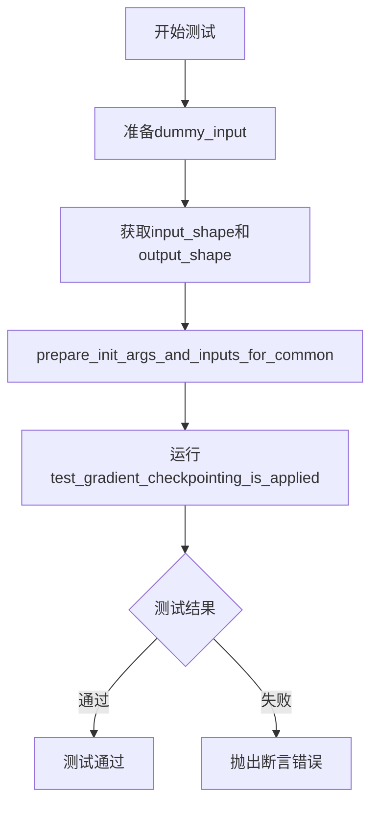
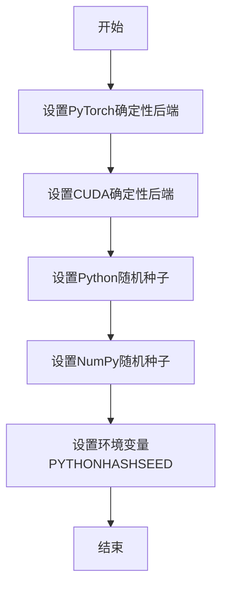
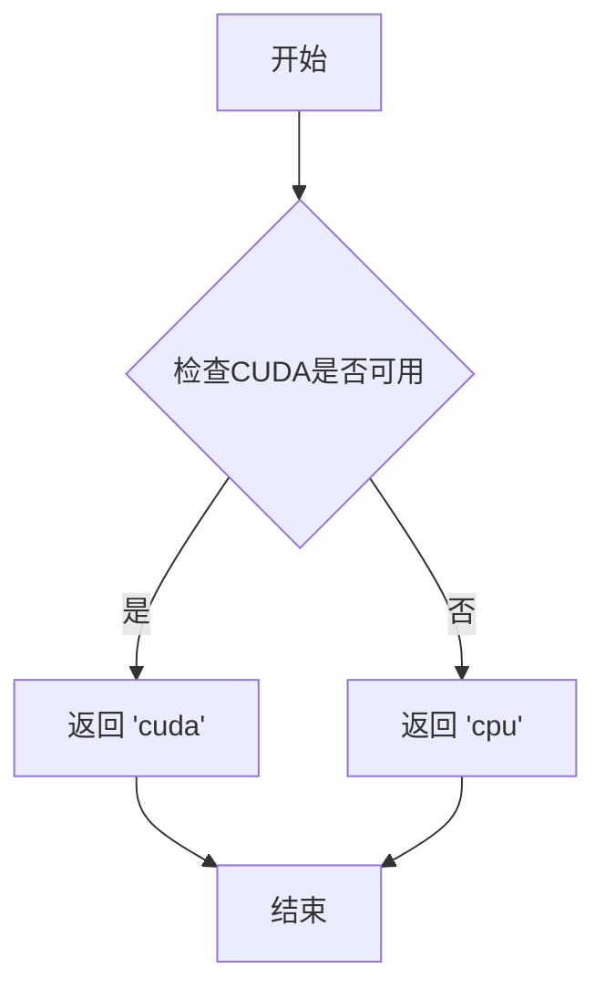
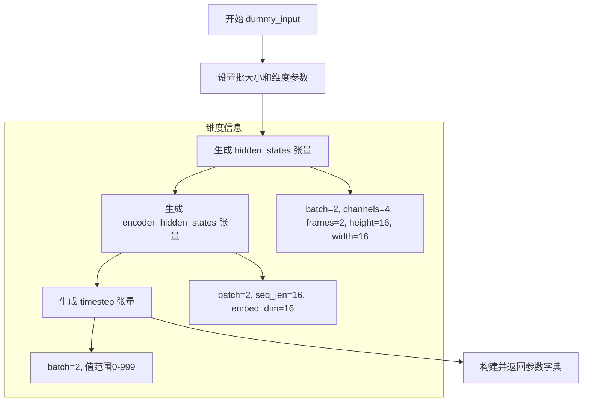
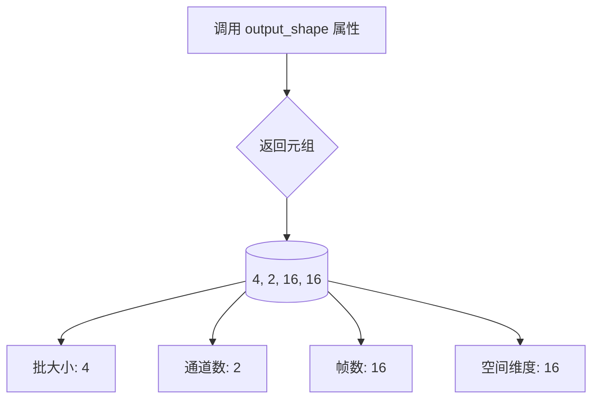
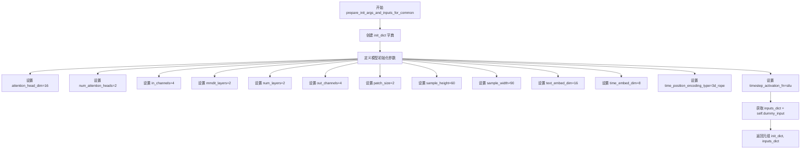

# `diffusers\tests\models\transformers\test_models_transformer_easyanimate.py` 详细设计文档

这是一个用于测试EasyAnimateTransformer3DModel模型的单元测试类，继承自ModelTesterMixin和unittest.TestCase，用于验证3D动画变换器模型的各项功能，包括前向传播、梯度检查点等核心特性。

## 整体流程



## 类结构

```
EasyAnimateTransformerTests (单元测试类)
├── 继承自: unittest.TestCase
└── 继承自: ModelTesterMixin
```

## 全局变量及字段


### `enable_full_determinism`
    
启用完全确定性

类型：`function`
    


### `EasyAnimateTransformerTests.model_class`
    
测试的模型类

类型：`EasyAnimateTransformer3DModel`
    


### `EasyAnimateTransformerTests.main_input_name`
    
主输入名称(hidden_states)

类型：`str`
    


### `EasyAnimateTransformerTests.uses_custom_attn_processor`
    
是否使用自定义注意力处理器

类型：`bool`
    
    

## 全局函数及方法


### `enable_full_determinism`

该函数用于启用完全确定性测试，通过设置随机种子和环境变量，确保深度学习模型在测试过程中的结果可复现，避免因随机性导致的测试不稳定问题。

参数：无

返回值：无

#### 流程图



#### 带注释源码

```
# 从 testing_utils 模块导入 enable_full_determinism 函数
from ...testing_utils import enable_full_determinism, torch_device

# 在测试文件开头调用该函数
# 作用：启用完全确定性测试，确保测试结果可复现
# 影响：设置 PyTorch、CUDA、Python、NumPy 的随机种子
# 目的：避免因随机初始化导致的测试 flaky 问题
enable_full_determinism()
```

#### 备注

由于 `enable_full_determinism` 函数的定义位于 `testing_utils` 模块中，当前代码文件仅展示了其使用方法。该函数通常会设置以下内容以确保确定性：

1. **PyTorch 确定性后端**：设置 `torch.backends.cudnn.deterministic = True`
2. **CUDA 确定性**：设置 `torch.cuda.manual_seed_all()` 和相关确定性选项
3. **随机种子**：设置 Python `random`、NumPy、PyTorch 的全局随机种子
4. **环境变量**：设置 `PYTHONHASHSEED` 等环境变量


### `torch_device`

该函数用于获取当前 PyTorch 应该使用的设备（通常是 'cuda' 或 'cpu'），确保模型和数据在正确的计算设备上运行。

参数： 无

返回值： `str`，返回 PyTorch 设备字符串，如 "cuda" 或 "cpu"

#### 流程图



#### 带注释源码

```python
# 该函数/变量定义在 testing_utils 模块中
# 此处展示基于代码上下文的推断实现

import torch

def torch_device():
    """
    获取当前PyTorch应使用的设备。
    
    Returns:
        str: 返回 'cuda' 如果CUDA可用，否则返回 'cpu'
    """
    # 检查是否有可用的CUDA设备
    if torch.cuda.is_available():
        # 如果有GPU可用，返回cuda设备
        return "cuda"
    else:
        # 否则返回CPU设备
        return "cpu"


# 或者作为模块级变量（更常见的方式）
# torch_device = "cuda" if torch.cuda.is_available() else "cpu"
```


### `EasyAnimateTransformerTests.dummy_input`

该属性方法用于生成 EasyAnimateTransformer3DModel 测试所需的虚拟输入数据，构造包含 hidden_states、timestep、encoder_hidden_states 等键的字典，模拟真实的模型推理输入场景。

参数：

- `self`：无参数，property 装饰器方法，隐式接收 EasyAnimateTransformerTests 实例本身

返回值：`Dict[str, Optional[torch.Tensor]]`，返回包含虚拟输入张量和空值的字典，用于模型测试的输入参数

#### 流程图



#### 带注释源码

```python
@property
def dummy_input(self):
    """
    生成测试用的虚拟输入数据，用于 EasyAnimateTransformer3DModel 的单元测试。
    构造符合模型输入格式要求的张量字典。
    """
    # 批处理大小
    batch_size = 2
    # 输入通道数
    num_channels = 4
    # 视频帧数
    num_frames = 2
    # 特征图高度
    height = 16
    # 特征图宽度
    width = 16
    # 文本嵌入维度
    embedding_dim = 16
    # 序列长度
    sequence_length = 16

    # 创建5D隐藏状态张量 [batch, channels, frames, height, width]
    # 用于视频/3D模型的输入
    hidden_states = torch.randn((batch_size, num_channels, num_frames, height, width)).to(torch_device)
    
    # 创建编码器隐藏状态张量 [batch, sequence_length, embedding_dim]
    # 用于文本条件嵌入
    encoder_hidden_states = torch.randn((batch_size, sequence_length, embedding_dim)).to(torch_device)
    
    # 创建时间步张量 [batch_size]
    # 用于扩散模型的时间步条件
    timestep = torch.randint(0, 1000, size=(batch_size,)).to(torch_device)

    # 返回包含所有模型输入的字典
    return {
        "hidden_states": hidden_states,          # 主输入特征
        "timestep": timestep,                     # 扩散时间步
        "timestep_cond": None,                   # 时间步条件（可选）
        "encoder_hidden_states": encoder_hidden_states,  # 文本嵌入
        "encoder_hidden_states_t5": None,        # T5文本嵌入（可选）
        "inpaint_latents": None,                 # 图像修复 latent（可选）
        "control_latents": None,                 # 控制 latent（可选）
    }
```


### `EasyAnimateTransformerTests.input_shape`

该属性方法用于返回 EasyAnimateTransformer3DModel 的预期输入形状元组，形状为 (4, 2, 16, 16)，分别代表通道数(4)、帧数(2)、高度(16)和宽度(16)。

参数：

- `self`：无需显式传递，是类的实例引用

返回值：`tuple[int, int, int, int]`，返回表示输入张量形状的四元素元组 (channels, frames, height, width)，即 (4, 2, 16, 16)

#### 流程图

```mermaid
flowchart TD
    A[调用 input_shape 属性] --> B{检查缓存/计算}
    B -->|首次调用| C[返回元组 (4, 2, 16, 16)]
    B -->|后续调用| D[返回缓存值]
    C --> E[输出形状元组]
    D --> E
```

#### 带注释源码

```python
@property
def input_shape(self):
    """
    返回模型的预期输入形状。
    
    返回值说明:
    - 4: 通道数 (num_channels)
    - 2: 帧数 (num_frames)
    - 16: 高度 (height)
    - 16: 宽度 (width)
    
    该属性与 output_shape 配合使用，用于在测试中验证模型
    输入输出张量的形状是否符合预期。
    """
    return (4, 2, 16, 16)
```


### `EasyAnimateTransformerTests.output_shape`

这是一个属性方法（property），用于返回 EasyAnimateTransformer3DModel 的预期输出形状。该属性定义了在测试场景下模型应该输出的张量维度，包含批大小、通道数、帧数以及空间维度信息。

参数：

- `self`：无显式参数，隐式参数，代表 `EasyAnimateTransformerTests` 类的实例本身

返回值：`Tuple[int, int, int, int]`，返回模型输出的预期形状，为一个包含4个整数的元组 (4, 2, 16, 16)，分别代表批大小（batch_size）、通道数（num_channels）、帧数（num_frames）和空间维度（height/width）

#### 流程图



#### 带注释源码

```python
@property
def output_shape(self):
    """
    属性方法，返回模型的预期输出形状。
    
    该属性定义了测试中模型输出的预期维度，
    用于验证模型输出是否符合预期规格。
    
    Returns:
        tuple: 包含4个整数的元组，依次表示:
            - batch_size (批大小): 4
            - num_channels (通道数): 2  
            - num_frames (帧数): 16
            - height/width (空间维度): 16
    """
    return (4, 2, 16, 16)
```


### `EasyAnimateTransformerTests.prepare_init_args_and_inputs_for_common`

该方法为 EasyAnimateTransformer3DModel 测试类准备模型初始化参数字典和输入字典，用于通用模型测试场景。

参数：
- `self`：EasyAnimateTransformerTests 实例本身，无需显式传入

返回值：`Tuple[Dict, Dict]`，返回包含模型初始化配置和测试输入的两个字典元组
- `init_dict`：Dict，包含模型结构配置参数（注意力头维度、通道数、层数、位置编码类型等）
- `inputs_dict`：Dict，包含模型前向传播所需的输入张量（隐藏状态、时间步、编码器隐藏状态等）

#### 流程图



#### 带注释源码

```python
def prepare_init_args_and_inputs_for_common(self):
    """
    准备模型初始化参数和输入数据，用于通用模型测试。
    该方法为 EasyAnimateTransformer3DModel 测试类提供必要的配置和输入。
    """
    # 定义模型初始化参数字典，包含模型架构和超参数配置
    init_dict = {
        "attention_head_dim": 16,           # 注意力头维度，影响自注意力计算的细粒度
        "num_attention_heads": 2,           # 注意力头的数量
        "in_channels": 4,                   # 输入通道数，对应视频帧的通道数
        "mmdit_layers": 2,                   # MMDiT 层数，用于多模态扩散 Transformer
        "num_layers": 2,                    # 总层数，Transformer 主干网络层数
        "out_channels": 4,                   # 输出通道数，与输入保持一致
        "patch_size": 2,                    # 补丁大小，用于空间时间分块
        "sample_height": 60,                # 采样高度，视频/图像高度
        "sample_width": 90,                 # 采样宽度，视频/图像宽度
        "text_embed_dim": 16,               # 文本嵌入维度，T5 编码维度
        "time_embed_dim": 8,                # 时间嵌入维度，时间条件编码维度
        "time_position_encoding_type": "3d_rope",  # 时间位置编码类型，使用 3D 旋转位置编码
        "timestep_activation_fn": "silu",   # 时间步激活函数，使用 SiLU/GELU
    }
    # 获取测试输入字典，调用类的 dummy_input 属性生成模拟输入
    inputs_dict = self.dummy_input
    # 返回初始化参数和输入的元组，供测试框架使用
    return init_dict, inputs_dict
```


### `EasyAnimateTransformerTests.test_gradient_checkpointing_is_applied`

该测试方法用于验证 `EasyAnimateTransformer3DModel` 模型是否正确应用了梯度检查点（Gradient Checkpointing）技术，通过调用父类的测试方法来确认预期模型集合中包含了指定的模型类。

参数：

- `self`：测试类实例本身，无需显式传递

返回值：`None`，该方法为测试用例，执行验证操作但不返回具体值

#### 流程图

```mermaid
flowchart TD
    A[开始测试 test_gradient_checkpointing_is_applied] --> B[定义预期模型集合 expected_set]
    B --> C[包含 'EasyAnimateTransformer3DModel']
    C --> D[调用父类测试方法 super().test_gradient_checkpointing_is_applied]
    D --> E{父类方法执行验证}
    E -->|通过| F[测试通过]
    E -->|失败| G[测试失败/抛出异常]
    F --> H[结束]
    G --> H
```

#### 带注释源码

```python
def test_gradient_checkpointing_is_applied(self):
    # 定义预期应用梯度检查点的模型集合
    # 该集合应包含需要进行梯度检查点测试的模型类
    expected_set = {"EasyAnimateTransformer3DModel"}
    
    # 调用父类 (ModelTesterMixin) 的测试方法
    # 父类方法会执行实际的梯度检查点验证逻辑:
    # 1. 创建模型实例
    # 2. 启用梯度检查点 (enable_gradient_checkpointing)
    # 3. 执行前向传播
    # 4. 执行反向传播
    # 5. 验证梯度是否正确计算并存在于模型参数中
    # 如果模型未正确应用梯度检查点，内存占用会显著增加或测试会失败
    super().test_gradient_checkpointing_is_applied(expected_set=expected_set)
```

## 关键组件


### EasyAnimateTransformer3DModel

被测试的核心模型类，是一个3D Transformer模型，用于视频/动画生成任务。

### EasyAnimateTransformerTests

测试类，继承自unittest.TestCase和ModelTesterMixin，负责对EasyAnimateTransformer3DModel进行单元测试。

### dummy_input

虚拟输入数据生成属性，返回包含hidden_states、timestep、encoder_hidden_states等张量的字典，用于模型测试。

### prepare_init_args_and_inputs_for_common

测试初始化方法，返回模型初始化参数字典和输入字典，配置了attention_head_dim、num_attention_heads、in_channels、mmdit_layers等关键参数。

### test_gradient_checkpointing_is_applied

梯度检查点测试方法，验证模型是否正确应用了梯度检查点优化技术。

### ModelTesterMixin

测试混入类，提供模型测试的通用方法，包括梯度检查点、模型初始化、参数一致性等测试逻辑。


## 问题及建议


### 已知问题

- **维度不匹配**：`input_shape` 和 `output_shape` 返回 `(4, 2, 16, 16)`，但 `dummy_input` 中 `hidden_states` 的实际维度是 `(batch_size, num_channels, num_frames, height, width)` = `(2, 4, 2, 16, 16)`，存在 5 维与 4 维的不一致
- **测试覆盖不足**：测试类仅实现了 `test_gradient_checkpointing_is_applied` 方法，缺少对模型前向传播、输出形状验证、模型参数一致性等常见测试场景的覆盖
- **硬编码配置**：`prepare_init_args_and_inputs_for_common` 中的初始化参数（如 `sample_height: 60`, `sample_width: 90`）与 `input_shape` 不匹配，可能导致测试结果不可靠
- **魔法数字**：多处使用硬编码数值（如 timestep 范围 0-1000），缺乏配置常量统一管理

### 优化建议

- 修正 `input_shape` 和 `output_shape` 方法，使其与 `dummy_input` 的实际维度对齐，建议返回 `(2, 4, 2, 16, 16)` 或调整 `dummy_input` 的维度
- 补充完整的测试方法集：添加 `test_model_outputs_equivalence`、`test_attention_outputs`、`test_hidden_states_output` 等继承自 `ModelTesterMixin` 的方法
- 将关键配置参数提取为类属性或配置文件，提高测试参数的可维护性和一致性
- 添加对模型配置异常的测试用例，验证参数校验逻辑
- 考虑添加集成测试，验证模型在真实场景下的行为

## 其它


### 设计目标与约束

本测试文件旨在验证 EasyAnimateTransformer3DModel 模型的核心功能正确性，确保模型在前向传播、梯度检查点、参数初始化等关键环节符合预期设计。测试遵循 HuggingFace diffusers 库的 ModelTesterMixin 标准接口，支持 PyTorch 设备兼容性测试，并确保在 CPU 和 CUDA 设备上的行为一致性。

### 错误处理与异常设计

测试类通过继承 unittest.TestCase 实现标准异常捕获机制，ModelTesterMixin 提供统一的测试框架来处理参数不匹配、维度错误等常见问题。测试中的随机输入使用固定种子（enable_full_determinism）确保可复现性，任何模型输出 NaN 或 Inf 值时会被基类测试捕获并报告为失败。

### 外部依赖与接口契约

本测试依赖以下外部组件：torch 提供张量运算，unittest 提供测试框架，diffusers.EasyAnimateTransformer3DModel 为被测模型类，testing_utils.enable_full_determinism 确保随机性可控，test_modeling_common.ModelTesterMixin 定义通用模型测试接口。被测模型需实现 ModelTesterMixin 规定的接口，包括 forward 方法接受 hidden_states、timestep、encoder_hidden_states 等参数并返回与输入形状匹配的张量。

### 测试覆盖范围

当前测试覆盖以下方面：梯度检查点应用验证（test_gradient_checkpointing_is_applied）、模型初始化参数验证（prepare_init_args_and_inputs_for_common）、输入输出形状一致性验证（input_shape/output_shape 属性）、自定义注意力处理器支持（uses_custom_attn_processor = True）。基类 ModelTesterMixin 还会自动覆盖参数初始化、梯度计算、模型序列化等通用测试场景。

### 性能考量

测试使用较小的模型配置（num_layers=2、num_attention_heads=2、embedding_dim=16）和低分辨率输入（16x16）以确保测试执行效率。随机输入张量在每次测试时动态生成，避免静态大张量占用过多内存。梯度检查点测试通过 expected_set 精确指定目标模型类，避免不必要的全模型扫描。

### 与项目其他模块的关系

本测试属于 diffusers 库的模型测试套件，通过 ModelTesterMixin 与其他模型测试（UNet、VAE、Transformer 等）保持一致性。EasyAnimateTransformer3DModel 作为视频/3D 生成模型，其测试结果直接影响 EasyAnimatePipeline 的可用性。测试文件位于项目测试目录中，与 src/diffusers/models/transformers/easy_animate_transformer_3d.py 源文件对应。

### 配置参数说明

测试中使用的配置参数定义了最小化但完整的模型结构：attention_head_dim=16 与 num_attention_heads=2 组合得到时间嵌入维度 32，in_channels=4 与 out_channels=4 保持通道数不变，patch_size=2 定义空间补丁划分，sample_height=60 和 sample_width=90 定义样本分辨率，time_embed_dim=8 为时间嵌入维度，time_position_encoding_type="3d_rope" 指定 3D 旋转位置编码，timestep_activation_fn="silu" 指定时间步激活函数。

### 测试数据流

测试数据流如下：dummy_input 属性生成随机张量字典，包含 5D hidden_states (batch, channels, frames, height, width)、1D timestep、2D encoder_hidden_states；prepare_init_args_and_inputs_for_common 将配置字典与输入字典组合后传递给 ModelTesterMixin；基类测试框架自动执行前向传播、损失计算、梯度回传等完整流程。


    