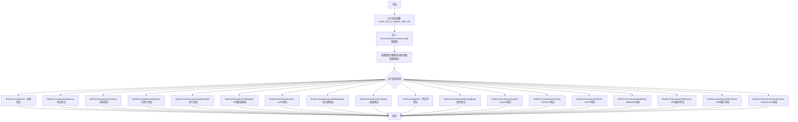
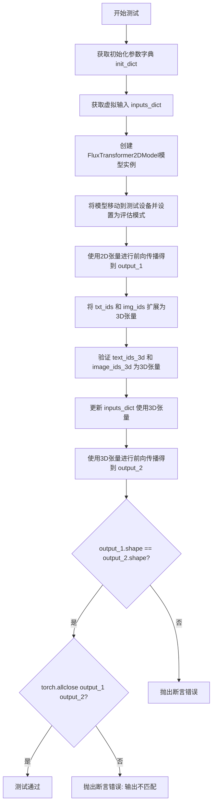
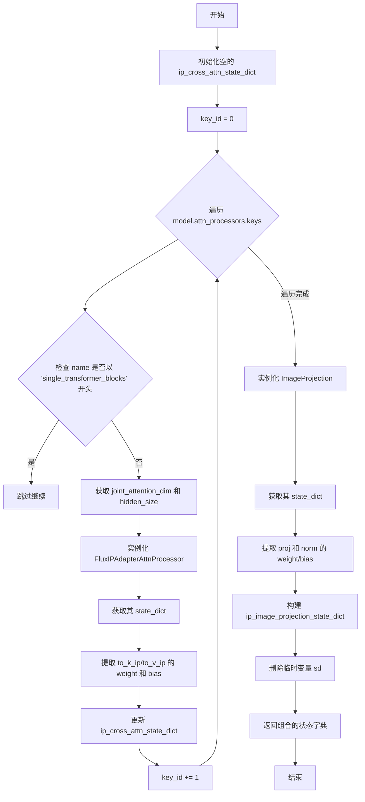
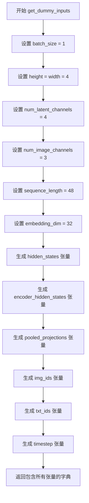
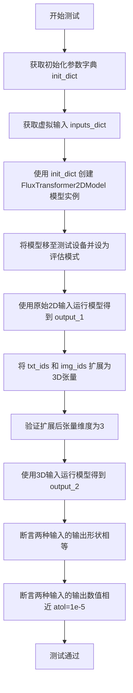
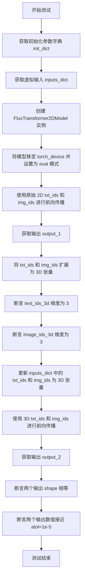
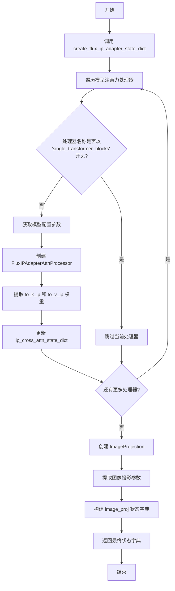
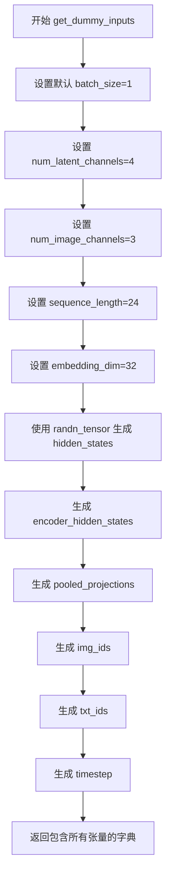
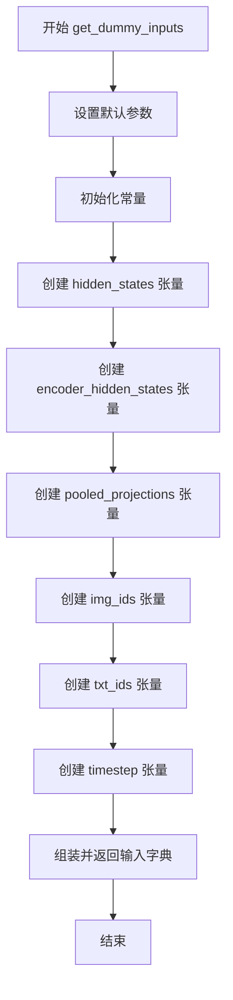
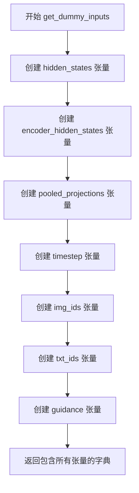

# `diffusers\tests\models\transformers\test_models_transformer_flux.py` 详细设计文档

这是一个Flux Transformer模型的综合测试套件，通过继承多个测试Mixin类来验证模型的各项功能，包括基本推理、内存优化、训练、注意力机制、上下文并行、IP Adapter、LoRA适配器、torch.compile编译、多种量化方法（BitsAndBytes、Quanto、TorchAO、ModelOpt、GGUF）以及各类缓存优化策略。

## 整体流程



## 类结构

```
BaseModelTesterConfig (抽象基类)
└── FluxTransformerTesterConfig
    ├── TestFluxTransformer
    ├── TestFluxTransformerMemory
    ├── TestFluxTransformerTraining
    ├── TestFluxTransformerAttention
    ├── TestFluxTransformerContextParallel
    ├── TestFluxTransformerIPAdapter
    ├── TestFluxTransformerLoRA
    ├── TestFluxTransformerLoRAHotSwap
    ├── TestFluxTransformerCompile
    ├── TestFluxSingleFile
    ├── TestFluxTransformerBitsAndBytes
    ├── TestFluxTransformerQuanto
    ├── TestFluxTransformerTorchAo
    ├── TestFluxTransformerGGUF
    ├── TestFluxTransformerQuantoCompile
    ├── TestFluxTransformerTorchAoCompile
    ├── TestFluxTransformerGGUFCompile
    ├── TestFluxTransformerModelOpt
    ├── TestFluxTransformerModelOptCompile
    ├── TestFluxTransformerBitsAndBytesCompile
    ├── TestFluxTransformerPABCache
    ├── TestFluxTransformerFBCCache
    └── TestFluxTransformerFasterCache
```

## 全局变量及字段


### `patch_size`
    
Flux模型的patch大小，用于将图像分割为块

类型：`int`
    


### `in_channels`
    
输入通道数，决定模型的输入维度

类型：`int`
    


### `num_layers`
    
Transformer层数量，决定模型深度

类型：`int`
    


### `num_single_layers`
    
单个Transformer块的数量

类型：`int`
    


### `attention_head_dim`
    
注意力头的维度大小

类型：`int`
    


### `num_attention_heads`
    
注意力头的数量

类型：`int`
    


### `joint_attention_dim`
    
联合注意力机制的维度，用于文本和图像特征的融合

类型：`int`
    


### `pooled_projection_dim`
    
池化投影的维度，用于生成条件嵌入

类型：`int`
    


### `axes_dims_rope`
    
旋转位置编码(RoPE)的轴维度列表

类型：`list[int]`
    


### `batch_size`
    
批次大小，决定一次处理的样本数量

类型：`int`
    


### `height`
    
输入图像的高度

类型：`int`
    


### `width`
    
输入图像的宽度

类型：`int`
    


### `num_latent_channels`
    
潜在空间的通道数

类型：`int`
    


### `num_image_channels`
    
图像的通道数（如RGB为3）

类型：`int`
    


### `sequence_length`
    
输入序列的长度

类型：`int`
    


### `embedding_dim`
    
嵌入向量的维度

类型：`int`
    


### `ip_cross_attn_state_dict`
    
IP适配器的交叉注意力状态字典

类型：`dict[str, Any]`
    


### `key_id`
    
用于索引IP适配器权重的键ID计数器

类型：`int`
    


### `hidden_size`
    
隐藏层大小，由注意力头数乘以头维度计算得出

类型：`int`
    


### `sd`
    
临时状态字典变量，用于存储注意力处理器的状态

类型：`dict[str, torch.Tensor]`
    


### `image_projection`
    
图像投影对象，用于将图像嵌入映射到注意力空间

类型：`ImageProjection`
    


### `ip_image_projection_state_dict`
    
IP图像投影层的状态字典

类型：`dict[str, Any]`
    


### `text_ids_3d`
    
3D文本ID张量（已弃用的输入格式）

类型：`torch.Tensor`
    


### `image_ids_3d`
    
3D图像ID张量（已弃用的输入格式）

类型：`torch.Tensor`
    


### `output_1`
    
模型使用2D输入的输出结果

类型：`torch.Tensor`
    


### `output_2`
    
模型使用3D输入的输出结果

类型：`torch.Tensor`
    


### `cross_attention_dim`
    
交叉注意力维度，用于IP适配器图像嵌入

类型：`int`
    


### `image_embeds`
    
IP适配器的图像嵌入向量

类型：`torch.Tensor`
    


### `FluxTransformerTesterConfig.model_class`
    
返回Flux Transformer模型类

类型：`type[FluxTransformer2DModel]`
    


### `FluxTransformerTesterConfig.pretrained_model_name_or_path`
    
预训练模型的名称或路径

类型：`str`
    


### `FluxTransformerTesterConfig.pretrained_model_kwargs`
    
预训练模型的额外参数

类型：`dict[str, Any]`
    


### `FluxTransformerTesterConfig.output_shape`
    
模型输出的形状

类型：`tuple[int, int]`
    


### `FluxTransformerTesterConfig.input_shape`
    
模型输入的形状

类型：`tuple[int, int]`
    


### `FluxTransformerTesterConfig.model_split_percents`
    
模型分割百分比列表

类型：`list[float]`
    


### `FluxTransformerTesterConfig.main_input_name`
    
主输入张量的名称

类型：`str`
    


### `FluxTransformerTesterConfig.generator`
    
用于生成确定性随机数的生成器

类型：`torch.Generator`
    


### `TestFluxTransformerIPAdapter.ip_adapter_processor_cls`
    
IP适配器注意力处理器类

类型：`type[FluxIPAdapterAttnProcessor]`
    


### `TestFluxTransformerLoRAHotSwap.different_shapes_for_compilation`
    
用于编译测试的不同形状列表

类型：`list[tuple[int, int]]`
    


### `TestFluxTransformerCompile.different_shapes_for_compilation`
    
用于编译测试的不同形状列表

类型：`list[tuple[int, int]]`
    


### `TestFluxSingleFile.ckpt_path`
    
检查点文件的URL路径

类型：`str`
    


### `TestFluxSingleFile.alternate_ckpt_paths`
    
备用检查点文件URL列表

类型：`list[str]`
    


### `TestFluxSingleFile.pretrained_model_name_or_path`
    
预训练模型名称或路径

类型：`str`
    


### `TestFluxTransformerQuanto.pretrained_model_name_or_path`
    
预训练模型名称或路径

类型：`str`
    


### `TestFluxTransformerQuanto.pretrained_model_kwargs`
    
预训练模型额外参数

类型：`dict[str, Any]`
    


### `TestFluxTransformerGGUF.gguf_filename`
    
GGUF格式模型文件名URL

类型：`str`
    


### `TestFluxTransformerGGUF.torch_dtype`
    
PyTorch数据类型

类型：`torch.dtype`
    


### `TestFluxTransformerGGUFCompile.gguf_filename`
    
GGUF格式模型文件名URL

类型：`str`
    


### `TestFluxTransformerGGUFCompile.torch_dtype`
    
PyTorch数据类型

类型：`torch.dtype`
    


### `TestFluxTransformerFasterCache.FASTER_CACHE_CONFIG`
    
FasterCache缓存配置字典

类型：`dict[str, Any]`
    
    

## 全局函数及方法


### `create_flux_ip_adapter_state_dict`

该函数用于为 Flux Transformer 模型创建虚拟的 IP（Image Prompt）Adapter 状态字典，主要用于测试目的。它遍历模型的注意力处理器，生成适配器权重和偏置，同时创建图像投影层的状态字典，以支持 IP Adapter 功能的单元测试和集成测试。

参数：

- `model`：`FluxTransformer2DModel`，输入的 Flux Transformer 模型实例，用于获取模型配置（如 joint_attention_dim、num_attention_heads、attention_head_dim 等）以及注意力处理器字典

返回值：`dict[str, dict[str, Any]]`，返回包含两个键的字典——`image_proj` 键对应图像投影层的状态字典（包含 proj、norm 的 weight 和 bias），`ip_adapter` 键对应跨注意力 IP 适配器的状态字典（包含 to_k_ip、to_v_ip 的 weight 和 bias）

#### 流程图

```mermaid
flowchart TD
    A[开始] --> B[初始化空字典 ip_cross_attn_state_dict 和 key_id=0]
    B --> C{遍历 model.attn_processors}
    C --> D{检查处理器名称是否以 'single_transformer_blocks' 开头}
    D -->|是| E[跳过该处理器, 继续下一个]
    D -->|否| F[从 model.config 获取 joint_attention_dim 和 hidden_size]
    F --> G[创建 FluxIPAdapterAttnProcessor 实例]
    G --> H[获取其 state_dict]
    H --> I[更新 ip_cross_attn_state_dict 添入 to_k_ip/to_v_ip 的 weight 和 bias]
    I --> J[key_id += 1]
    J --> C
    C --> K{处理完所有处理器}
    K --> L[创建 ImageProjection 实例]
    L --> M[获取其 state_dict]
    M --> N[构建 ip_image_projection_state_dict 包含 proj 和 norm]
    N --> O[删除临时 sd 变量]
    O --> P[返回 {'image_proj': ..., 'ip_adapter': ...}]
```

#### 带注释源码

```python
def create_flux_ip_adapter_state_dict(model) -> dict[str, dict[str, Any]]:
    """Create a dummy IP Adapter state dict for Flux transformer testing."""
    # 初始化空的IP跨注意力状态字典和键ID计数器
    ip_cross_attn_state_dict = {}
    key_id = 0

    # 遍历模型的所有注意力处理器
    for name in model.attn_processors.keys():
        # 跳过单Transformer块（这些块不需要IP适配器处理）
        if name.startswith("single_transformer_blocks"):
            continue

        # 从模型配置中获取联合注意力维度和隐藏大小
        # hidden_size = num_attention_heads * attention_head_dim
        joint_attention_dim = model.config["joint_attention_dim"]
        hidden_size = model.config["num_attention_heads"] * model.config["attention_head_dim"]
        
        # 创建Flux IP适配器注意力处理器实例并获取其状态字典
        sd = FluxIPAdapterAttnProcessor(
            hidden_size=hidden_size, cross_attention_dim=joint_attention_dim, scale=1.0
        ).state_dict()
        
        # 将处理器的权重和偏置提取并存储到状态字典中
        # 使用递增的key_id作为前缀以支持多个IP适配器
        ip_cross_attn_state_dict.update(
            {
                f"{key_id}.to_k_ip.weight": sd["to_k_ip.0.weight"],
                f"{key_id}.to_v_ip.weight": sd["to_v_ip.0.weight"],
                f"{key_id}.to_k_ip.bias": sd["to_k_ip.0.bias"],
                f"{key_id}.to_v_ip.bias": sd["to_v_ip.0.bias"],
            }
        )
        key_id += 1

    # 创建图像投影层（ImageProjection）用于IP适配器的图像嵌入处理
    # 处理可能的配置差异：pooled_projection_dim 可能不存在
    image_projection = ImageProjection(
        cross_attention_dim=model.config["joint_attention_dim"],
        image_embed_dim=(
            model.config["pooled_projection_dim"] if "pooled_projection_dim" in model.config.keys() else 768
        ),
        num_image_text_embeds=4,
    )

    # 提取图像投影层的状态字典
    ip_image_projection_state_dict = {}
    sd = image_projection.state_dict()
    ip_image_projection_state_dict.update(
        {
            "proj.weight": sd["image_embeds.weight"],
            "proj.bias": sd["image_embeds.bias"],
            "norm.weight": sd["norm.weight"],
            "norm.bias": sd["norm.bias"],
        }
    )

    # 清理临时变量，返回完整的IP适配器状态字典
    del sd
    return {"image_proj": ip_image_projection_state_dict, "ip_adapter": ip_cross_attn_state_dict}
```


### `TestFluxTransformer.test_deprecated_inputs_img_txt_ids_3d`

测试Flux Transformer模型对已弃用的3D img_ids和txt_ids张量的向后兼容性，确保模型能够正确处理这些张量而不会引发错误。

参数：

- `self`：`TestFluxTransformer`，测试类实例本身，隐式参数

返回值：`None`，无返回值（测试方法）

#### 流程图



#### 带注释源码

```python
def test_deprecated_inputs_img_txt_ids_3d(self):
    """Test that deprecated 3D img_ids and txt_ids still work."""
    # 获取模型初始化参数字典
    init_dict = self.get_init_dict()
    # 获取测试用虚拟输入数据
    inputs_dict = self.get_dummy_inputs()

    # 创建FluxTransformer2DModel模型实例
    model = self.model_class(**init_dict)
    # 将模型移动到测试设备并设置为评估模式
    model.to(torch_device)
    model.eval()

    # 使用2D张量进行前向传播，获取基准输出
    with torch.no_grad():
        output_1 = model(**inputs_dict).to_tuple()[0]

    # 将txt_ids和img_ids扩展为3D张量（已弃用的输入格式）
    # 原始2D张量 shape: (sequence_length, num_image_channels)
    # 扩展后3D张量 shape: (1, sequence_length, num_image_channels)
    text_ids_3d = inputs_dict["txt_ids"].unsqueeze(0)
    image_ids_3d = inputs_dict["img_ids"].unsqueeze(0)

    # 断言验证张量维度正确转换为3D
    assert text_ids_3d.ndim == 3, "text_ids_3d should be a 3d tensor"
    assert image_ids_3d.ndim == 3, "img_ids_3d should be a 3d tensor"

    # 用3D张量替换原始输入字典中的2D张量
    inputs_dict["txt_ids"] = text_ids_3d
    inputs_dict["img_ids"] = image_ids_3d

    # 使用3D张量进行前向传播
    with torch.no_grad():
        output_2 = model(**inputs_dict).to_tuple()[0]

    # 验证两种输入格式的输出形状相同
    assert output_1.shape == output_2.shape
    # 验证输出数值在容差范围内相等（确保向后兼容性）
    assert torch.allclose(output_1, output_2, atol=1e-5), (
        "output with deprecated inputs (img_ids and txt_ids as 3d torch tensors) "
        "are not equal as them as 2d inputs"
    )
```


### `TestFluxTransformerIPAdapter.modify_inputs_for_ip_adapter`

该方法为 IP (Image Prompt) Adapter 测试准备输入数据，通过创建虚拟图像嵌入并将其添加到输入字典的 `joint_attention_kwargs` 参数中，使模型能够正确处理 IP Adapter 的推理流程。

参数：

- `model`：`FluxTransformer2DModel`，待测试的 Flux Transformer 模型实例，用于获取模型配置参数
- `inputs_dict`：`dict[str, torch.Tensor]`，包含模型输入张量的字典（如 hidden_states、encoder_hidden_states 等），需要被修改以支持 IP Adapter

返回值：`dict[str, torch.Tensor]`，更新后的输入字典，增加了 `joint_attention_kwargs.ip_adapter_image_embeds` 键值对

#### 流程图

```mermaid
flowchart TD
    A[开始 modify_inputs_for_ip_adapter] --> B[设置随机种子 torch.manual_seed(0)]
    B --> C[获取 cross_attention_dim<br/>从 model.config.joint_attention_dim<br/>默认为 32]
    C --> D[创建随机图像嵌入<br/>torch.randn(1, 1, cross_attention_dim)]
    D --> E[将图像嵌入移到目标设备 torch_device]
    E --> F[更新 inputs_dict<br/>添加 joint_attention_kwargs 包含 ip_adapter_image_embeds]
    F --> G[返回更新后的 inputs_dict]
```

#### 带注释源码

```python
def modify_inputs_for_ip_adapter(self, model, inputs_dict):
    """
    为 IP Adapter 测试修改输入字典。

    该方法创建虚拟的图像嵌入向量，并将其添加到输入字典中，
    以便在测试 IP Adapter 功能时模拟图像提示条件的注入。

    Args:
        model: FluxTransformer2DModel 实例，用于获取配置信息
        inputs_dict: 包含模型输入的字典

    Returns:
        更新后的 inputs_dict，包含 IP Adapter 所需的图像嵌入
    """
    # 设置随机种子以确保测试可重复性
    torch.manual_seed(0)

    # 获取交叉注意力维度，默认值为 32
    # joint_attention_dim 是 Flux 模型中联合注意力机制的维度
    cross_attention_dim = getattr(model.config, "joint_attention_dim", 32)

    # 创建虚拟图像嵌入 [batch=1, seq=1, dim=cross_attention_dim]
    # 这是 IP Adapter 用来编码输入图像的嵌入向量
    image_embeds = torch.randn(1, 1, cross_attention_dim).to(torch_device)

    # 将图像嵌入添加到输入字典的 joint_attention_kwargs 中
    # IP Adapter 处理器会读取这个键来获取图像条件信息
    inputs_dict.update({"joint_attention_kwargs": {"ip_adapter_image_embeds": image_embeds}})

    # 返回更新后的输入字典，供模型前向传播使用
    return inputs_dict
```


### `create_ip_adapter_state_dict`

创建 Flux Transformer 模型的虚拟 IP Adapter 状态字典，用于测试目的。该方法通过实例化 FluxIPAdapterAttnProcessor 和 ImageProjection 来生成模型权重，并将其组织成适合加载到模型中的格式。

参数：

-  `self`：测试类实例本身，无需显式传递
-  `model`：`Any`，Flux Transformer 模型实例，用于获取模型配置（如 joint_attention_dim、num_attention_heads、attention_head_dim 等）和注意力处理器信息

返回值：`dict[str, dict[str, Any]]`，返回一个包含两个键的字典：
  - `"image_proj"`：图像投影层的状态字典
  - `"ip_adapter"`：IP 适配器交叉注意力层的状态字典

#### 流程图



#### 带注释源码

```python
def create_ip_adapter_state_dict(self, model: Any) -> dict[str, dict[str, Any]]:
    """为 Flux Transformer 测试创建虚拟 IP Adapter 状态字典。
    
    该方法是一个包装器，实际逻辑在全局函数 create_flux_ip_adapter_state_dict 中实现。
    它允许测试类通过统一的方法名为不同的模型类型创建适配器状态字典。
    
    参数:
        model: Flux Transformer 模型实例，用于提取配置信息
        
    返回:
        包含 'image_proj' 和 'ip_adapter' 两个键的字典
    """
    return create_flux_ip_adapter_state_dict(model)


def create_flux_ip_adapter_state_dict(model) -> dict[str, dict[str, Any]]:
    """Create a dummy IP Adapter state dict for Flux transformer testing.
    
    核心逻辑：
    1. 为每个非 single_transformer_blocks 的注意力处理器创建 IP 适配器权重
    2. 创建图像投影层的权重
    3. 将两者组合返回
    
    参数:
        model: 包含 attn_processors 和 config 的模型对象
        
    返回格式:
        {
            'image_proj': {...},  # 图像投影层权重
            'ip_adapter': {...}   # IP 适配器交叉注意力权重
        }
    """
    # 初始化存储 IP 适配器交叉注意力权重的字典
    ip_cross_attn_state_dict = {}
    key_id = 0  # 用于为每个注意力处理器分配唯一键名

    # 遍历模型的所有注意力处理器
    for name in model.attn_processors.keys():
        # 跳过单变换器块（这些块不处理联合注意力）
        if name.startswith("single_transformer_blocks"):
            continue

        # 从模型配置中获取联合注意力维度
        joint_attention_dim = model.config["joint_attention_dim"]
        # 计算隐藏层大小 = 注意力头数 × 每个头的维度
        hidden_size = model.config["num_attention_heads"] * model.config["attention_head_dim"]
        
        # 创建虚拟的 FluxIPAdapterAttnProcessor 并获取其权重
        sd = FluxIPAdapterAttnProcessor(
            hidden_size=hidden_size, 
            cross_attention_dim=joint_attention_dim, 
            scale=1.0
        ).state_dict()
        
        # 提取 IP 适配器的关键权重（k 和 v 的权重和偏置）
        ip_cross_attn_state_dict.update(
            {
                f"{key_id}.to_k_ip.weight": sd["to_k_ip.0.weight"],
                f"{key_id}.to_v_ip.weight": sd["to_v_ip.0.weight"],
                f"{key_id}.to_k_ip.bias": sd["to_k_ip.0.bias"],
                f"{key_id}.to_v_ip.bias": sd["to_v_ip.0.bias"],
            }
        )
        key_id += 1

    # 创建图像投影层（ImageProjection）
    # 处理可能不存在 pooled_projection_dim 的情况，默认使用 768
    image_projection = ImageProjection(
        cross_attention_dim=model.config["joint_attention_dim"],
        image_embed_dim=(
            model.config["pooled_projection_dim"] 
            if "pooled_projection_dim" in model.config.keys() 
            else 768
        ),
        num_image_text_embeds=4,  # 图像-文本嵌入数量
    )

    # 提取图像投影层的权重
    ip_image_projection_state_dict = {}
    sd = image_projection.state_dict()
    ip_image_projection_state_dict.update(
        {
            "proj.weight": sd["image_embeds.weight"],
            "proj.bias": sd["image_embeds.bias"],
            "norm.weight": sd["norm.weight"],
            "norm.bias": sd["norm.bias"],
        }
    )

    # 清理临时变量
    del sd
    
    # 返回组合后的状态字典
    return {
        "image_proj": ip_image_projection_state_dict, 
        "ip_adapter": ip_cross_attn_state_dict
    }
```


### `FluxTransformerTesterConfig.get_init_dict`

该方法用于返回 Flux Transformer 模型的初始化参数字典，包含了模型架构的关键配置参数（如层数、注意力头维度、注意力头数量等），供测试用例创建模型实例使用。

参数：
- `self`：`FluxTransformerTesterConfig` 类型，当前配置实例本身

返回值：`dict[str, int | list[int]]` 类型，返回一个包含 Flux 模型初始化参数的字典，包括 patch_size、in_channels、num_layers、num_single_layers、attention_head_dim、num_attention_heads、joint_attention_dim、pooled_projection_dim 和 axes_dims_rope 等配置项。

#### 流程图

```mermaid
flowchart TD
    A[开始 get_init_dict] --> B{执行方法}
    B --> C[构建初始化参数字典]
    C --> D[返回字典<br/>{'patch_size': 1, 'in_channels': 4, ...}]
    D --> E[结束]
    
    style A fill:#e1f5fe
    style D fill:#c8e6c9
    style E fill:#ffcdd2
```

#### 带注释源码

```python
def get_init_dict(self) -> dict[str, int | list[int]]:
    """Return Flux model initialization arguments."""
    # 返回一个包含 Flux Transformer 模型初始化参数的字典
    # 这些参数用于创建 FluxTransformer2DModel 实例
    return {
        "patch_size": 1,                    # 图像分块大小
        "in_channels": 4,                   # 输入通道数
        "num_layers": 1,                    # Transformer 层数（单层）
        "num_single_layers": 1,             # 单 Transformer 层数
        "attention_head_dim": 16,           # 注意力头维度
        "num_attention_heads": 2,           # 注意力头数量
        "joint_attention_dim": 32,          # 联合注意力维度
        "pooled_projection_dim": 32,       # 池化投影维度
        "axes_dims_rope": [4, 4, 8],       # RoPE 坐标轴维度
    }
```


### `FluxTransformerTesterConfig.get_dummy_inputs`

该方法为 FluxTransformer2DModel 测试生成虚拟输入数据，返回包含 hidden_states、encoder_hidden_states、pooled_projections、img_ids、txt_ids 和 timestep 的字典，用于模型的前向传播测试。

参数：

- `self`：隐式参数，FluxTransformerTesterConfig 类的实例

返回值：`dict[str, torch.Tensor]`，包含测试所需的虚拟输入张量

#### 流程图



#### 带注释源码

```python
def get_dummy_inputs(self) -> dict[str, torch.Tensor]:
    """Generate dummy inputs for FluxTransformer2DModel testing.
    
    Returns:
        dict[str, torch.Tensor]: A dictionary containing dummy input tensors
            - hidden_states: Latent space input tensor
            - encoder_hidden_states: Text encoding input tensor
            - pooled_projections: Pooled text embeddings
            - img_ids: Image position IDs for attention
            - txt_ids: Text position IDs for attention
            - timestep: Diffusion timestep
    """
    # 配置测试参数
    batch_size = 1                  # 批次大小
    height = width = 4             # 图像高度和宽度
    num_latent_channels = 4        # 潜在空间通道数
    num_image_channels = 3         # 图像通道数 (RGB)
    sequence_length = 48           # 文本序列长度
    embedding_dim = 32             # 嵌入维度

    # 构建并返回虚拟输入字典
    return {
        # hidden_states: 潜在空间输入，形状为 (batch_size, height*width, num_latent_channels)
        "hidden_states": randn_tensor(
            (batch_size, height * width, num_latent_channels), generator=self.generator, device=torch_device
        ),
        # encoder_hidden_states: 编码器隐藏状态，形状为 (batch_size, sequence_length, embedding_dim)
        "encoder_hidden_states": randn_tensor(
            (batch_size, sequence_length, embedding_dim), generator=self.generator, device=torch_device
        ),
        # pooled_projections: 池化投影，形状为 (batch_size, embedding_dim)
        "pooled_projections": randn_tensor(
            (batch_size, embedding_dim), generator=self.generator, device=torch_device
        ),
        # img_ids: 图像位置ID，形状为 (height*width, num_image_channels)
        "img_ids": randn_tensor(
            (height * width, num_image_channels), generator=self.generator, device=torch_device
        ),
        # txt_ids: 文本位置ID，形状为 (sequence_length, num_image_channels)
        "txt_ids": randn_tensor(
            (sequence_length, num_image_channels), generator=self.generator, device=torch_device
        ),
        # timestep: 扩散时间步，形状为 (batch_size,)
        "timestep": torch.tensor([1.0]).to(torch_device).expand(batch_size),
    }
```


### `TestFluxTransformer.test_deprecated_inputs_img_txt_ids_3d`

该测试方法验证了Flux Transformer模型能够兼容已弃用的3D格式`img_ids`和`txt_ids`输入，确保从2D输入格式迁移到3D输入格式时模型行为保持一致。

参数：

- `self`：隐式参数，`TestFluxTransformer`类实例本身，无需显式传递

返回值：`None`，该方法为`pytest`测试方法，通过断言验证行为而非返回值

#### 流程图



#### 带注释源码

```python
def test_deprecated_inputs_img_txt_ids_3d(self):
    """Test that deprecated 3D img_ids and txt_ids still work."""
    # 获取Flux模型的初始化参数字典
    # 包含 patch_size, in_channels, num_layers 等配置
    init_dict = self.get_init_dict()
    
    # 获取测试用的虚拟输入
    # 包含 hidden_states, encoder_hidden_states, pooled_projections, 
    # img_ids, txt_ids, timestep 等张量
    inputs_dict = self.get_dummy_inputs()

    # 使用初始化参数创建Flux Transformer模型实例
    model = self.model_class(**init_dict)
    
    # 将模型移至测试设备(CPU/GPU)并设置为评估模式
    model.to(torch_device)
    model.eval()

    # 第一次推理：使用原始的2D txt_ids 和 img_ids
    with torch.no_grad():
        output_1 = model(**inputs_dict).to_tuple()[0]

    # 将txt_ids和img_ids从2D扩展为3D张量(在第0维添加batch维度)
    # 这是为了模拟已弃用的3D输入格式
    text_ids_3d = inputs_dict["txt_ids"].unsqueeze(0)
    image_ids_3d = inputs_dict["img_ids"].unsqueeze(0)

    # 断言：验证扩展后的张量确实是3维的
    assert text_ids_3d.ndim == 3, "text_ids_3d should be a 3d tensor"
    assert image_ids_3d.ndim == 3, "img_ids_3d should be a 3d tensor"

    # 用3D张量替换原始输入中的2D张量
    inputs_dict["txt_ids"] = text_ids_3d
    inputs_dict["img_ids"] = image_ids_3d

    # 第二次推理：使用3D格式的txt_ids和img_ids
    with torch.no_grad():
        output_2 = model(**inputs_dict).to_tuple()[0]

    # 验证：两种输入格式产生的输出形状必须一致
    assert output_1.shape == output_2.shape
    
    # 验证：两种输入格式产生的输出数值必须足够接近
    # 容差设为1e-5，确保数值精度兼容
    assert torch.allclose(output_1, output_2, atol=1e-5), (
        "output with deprecated inputs (img_ids and txt_ids as 3d torch tensors) "
        "are not equal as them as 2d inputs"
    )
```


### `TestFluxTransformer.test_deprecated_inputs_img_txt_ids_3d`

测试 Flux Transformer 模型对废弃的 3D img_ids 和 txt_ids 输入是否仍然保持向后兼容性。

参数：

- `self`：测试类实例，继承自 `FluxTransformerTesterConfig` 和 `ModelTesterMixin`，通过继承获取 `get_init_dict()` 和 `get_dummy_inputs()` 等方法

返回值：`None`，该方法为测试方法，通过断言验证功能，不返回任何值

#### 流程图



#### 带注释源码

```python
def test_deprecated_inputs_img_txt_ids_3d(self):
    """Test that deprecated 3D img_ids and txt_ids still work."""
    # 获取模型的初始化参数字典，包含 patch_size, in_channels, num_layers 等配置
    init_dict = self.get_init_dict()
    
    # 获取虚拟输入，包含 hidden_states, encoder_hidden_states, pooled_projections,
    # img_ids, txt_ids, timestep 等张量
    inputs_dict = self.get_dummy_inputs()

    # 使用初始化参数字典创建 FluxTransformer2DModel 模型实例
    model = self.model_class(**init_dict)
    
    # 将模型移至指定的计算设备（如 CUDA）并设置为评估模式
    model.to(torch_device)
    model.eval()

    # 禁用梯度计算，进行推理
    with torch.no_grad():
        # 使用原始 2D txt_ids 和 img_ids 进行前向传播，获取输出
        output_1 = model(**inputs_dict).to_tuple()[0]

    # 将 txt_ids 和 img_ids 从 2D 张量扩展为 3D 张量（添加批次维度）
    # 这是为了测试废弃的 3D 输入格式是否仍然兼容
    text_ids_3d = inputs_dict["txt_ids"].unsqueeze(0)
    image_ids_3d = inputs_dict["img_ids"].unsqueeze(0)

    # 断言确保扩展后的张量确实是 3D 的
    assert text_ids_3d.ndim == 3, "text_ids_3d should be a 3d tensor"
    assert image_ids_3d.ndim == 3, "img_ids_3d should be a 3d tensor"

    # 用 3D 张量替换输入字典中的 txt_ids 和 img_ids
    inputs_dict["txt_ids"] = text_ids_3d
    inputs_dict["img_ids"] = image_ids_3d

    # 再次禁用梯度，进行推理
    with torch.no_grad():
        # 使用 3D txt_ids 和 img_ids 进行前向传播，获取输出
        output_2 = model(**inputs_dict).to_tuple()[0]

    # 断言两个输出的形状相同，确保 3D 输入没有改变输出结构
    assert output_1.shape == output_2.shape
    
    # 断言两个输出的数值在容差范围内相等，确保 3D 输入的输出结果与 2D 输入一致
    assert torch.allclose(output_1, output_2, atol=1e-5), (
        "output with deprecated inputs (img_ids and txt_ids as 3d torch tensors) "
        "are not equal as them as 2d inputs"
    )
```


### `TestFluxTransformerIPAdapter.modify_inputs_for_ip_adapter`

该方法用于在IP Adapter测试中修改输入字典，生成虚拟的图像嵌入向量并将其添加到模型的输入参数中，以支持IP Adapter功能的测试验证。

参数：

- `model`：`Any`，Flux Transformer模型实例，用于获取配置信息（主要是`joint_attention_dim`）
- `inputs_dict`：`dict`，包含模型输入的字典（如hidden_states、encoder_hidden_states等），该字典会被修改并添加IP Adapter相关的图像嵌入

返回值：`dict`，返回修改后的输入字典，增加了`joint_attention_kwargs`键，其中包含`ip_adapter_image_embeds`

#### 流程图

```mermaid
flowchart TD
    A[开始 modify_inputs_for_ip_adapter] --> B[设置随机种子 torch.manual_seed(0)]
    B --> C[获取cross_attention_dim]
    C --> D{检查model.config.joint_attention_dim是否存在}
    D -->|存在| E[使用model.config.joint_attention_dim]
    D -->|不存在| F[使用默认值32]
    E --> G[创建随机图像嵌入 image_embeds]
    F --> G
    G --> H[将image_embeds移到torch_device设备]
    H --> I[更新inputs_dict添加joint_attention_kwargs]
    I --> J[返回修改后的inputs_dict]
    J --> K[结束]
```

#### 带注释源码

```python
def modify_inputs_for_ip_adapter(self, model, inputs_dict):
    """
    为IP Adapter测试修改输入字典。
    
    该方法创建一个虚拟的图像嵌入向量，并将其添加到输入字典中，
    以便在测试Flux Transformer的IP Adapter功能时使用。
    
    参数:
        model: Flux Transformer模型实例，用于获取配置中的joint_attention_dim
        inputs_dict: 包含模型输入的字典，会被原地修改
    
    返回:
        修改后的inputs_dict，增加了joint_attention_kwargs键
    """
    # 设置随机种子以确保测试的可重复性
    torch.manual_seed(0)
    
    # 获取cross_attention_dim，优先从model.config.joint_attention_dim获取，
    # 如果不存在则使用默认值32
    # 这是IP Adapter中图像特征与文本特征融合的关键维度
    cross_attention_dim = getattr(model.config, "joint_attention_dim", 32)
    
    # 创建虚拟的图像嵌入向量
    # 形状: (1, 1, cross_attention_dim) - batch_size=1, num_images=1
    image_embeds = torch.randn(1, 1, cross_attention_dim).to(torch_device)

    # 更新输入字典，添加IP Adapter所需的图像嵌入
    # 模型会通过joint_attention_kwargs识别这是IP Adapter的输入
    inputs_dict.update({"joint_attention_kwargs": {"ip_adapter_image_embeds": image_embeds}})

    return inputs_dict
```


### `TestFluxTransformerIPAdapter.create_ip_adapter_state_dict`

该方法是 `TestFluxTransformerIPAdapter` 类的成员方法，用于为 Flux Transformer 的 IP Adapter 测试创建虚拟状态字典（state dict），封装了对全局函数 `create_flux_ip_adapter_state_dict` 的调用，返回包含图像投影和跨注意力参数的字典结构。

参数：

-  `model`：`Any`，输入的 Flux Transformer 模型实例，用于获取模型配置（如 `joint_attention_dim`、`num_attention_heads`、`attention_head_dim`）和注意力处理器信息

返回值：`dict[str, dict[str, Any]]`，返回包含两个键的字典：`image_proj`（图像投影层的状态字典）和 `ip_adapter`（IP Adapter 跨注意力层权重）

#### 流程图



#### 带注释源码

```python
def create_ip_adapter_state_dict(self, model: Any) -> dict[str, dict[str, Any]]:
    """
    为 Flux Transformer IP Adapter 测试创建虚拟状态字典。
    
    参数:
        model: Flux Transformer 模型实例
        
    返回:
        包含 image_proj 和 ip_adapter 两个子字典的状态字典
    """
    # 调用全局辅助函数创建 IP Adapter 状态字典
    return create_flux_ip_adapter_state_dict(model)
```

> **说明**：该方法是测试类的成员方法，其核心逻辑封装在全局函数 `create_flux_ip_adapter_state_dict` 中。该全局函数的主要流程如下：
>
> 1. **遍历注意力处理器**：遍历模型的 `attn_processors`，跳过以 `single_transformer_blocks` 开头的处理器
> 2. **构建跨注意力权重**：为每个有效处理器创建 `FluxIPAdapterAttnProcessor`，提取 `to_k_ip` 和 `to_v_ip` 的权重和偏置
> 3. **构建图像投影权重**：创建 `ImageProjection` 实例，提取投影层和归一化层的参数
> 4. **返回组合字典**：将图像投影和跨注意力参数组合为最终的测试用状态字典


### `TestFluxTransformerLoRAHotSwap.get_dummy_inputs`

该方法是 `TestFluxTransformerLoRAHotSwap` 类的成员方法，覆盖了基类的 `get_dummy_inputs` 方法，用于为 Flux Transformer 的 LoRA 热交换测试生成虚拟输入数据，支持动态的高度和宽度参数以适应不同的测试场景。

参数：

- `height`：`int`，可选参数，默认为 4，指定生成虚拟输入的高度维度
- `width`：`int`，可选参数，默认为 4，指定生成虚拟输入的宽度维度

返回值：`dict[str, torch.Tensor]`，返回包含多个 PyTorch 张量的字典，这些张量模拟了 Flux Transformer 模型前向传播所需的输入，包括 hidden_states、encoder_hidden_states、pooled_projections、img_ids、txt_ids 和 timestep

#### 流程图



#### 带注释源码

```python
def get_dummy_inputs(self, height: int = 4, width: int = 4) -> dict[str, torch.Tensor]:
    """Override to support dynamic height/width for LoRA hotswap tests."""
    # 定义批量大小为1
    batch_size = 1
    # 潜在通道数设为4
    num_latent_channels = 4
    # 图像通道数设为3（RGB）
    num_image_channels = 3
    # 序列长度设为24
    sequence_length = 24
    # 嵌入维度设为32
    embedding_dim = 32

    # 返回包含所有虚拟输入的字典
    return {
        # hidden_states: 潜在空间表示，形状为 (batch_size, height * width, num_latent_channels)
        "hidden_states": randn_tensor((batch_size, height * width, num_latent_channels), device=torch_device),
        # encoder_hidden_states: 编码器隐藏状态，形状为 (batch_size, sequence_length, embedding_dim)
        "encoder_hidden_states": randn_tensor((batch_size, sequence_length, embedding_dim), device=torch_device),
        # pooled_projections: 池化后的投影向量，形状为 (batch_size, embedding_dim)
        "pooled_projections": randn_tensor((batch_size, embedding_dim), device=torch_device),
        # img_ids: 图像位置编码ID，形状为 (height * width, num_image_channels)
        "img_ids": randn_tensor((height * width, num_image_channels), device=torch_device),
        # txt_ids: 文本位置编码ID，形状为 (sequence_length, num_image_channels)
        "txt_ids": randn_tensor((sequence_length, num_image_channels), device=torch_device),
        # timestep: 时间步长，用于扩散模型的时间嵌入
        "timestep": torch.tensor([1.0]).to(torch_device).expand(batch_size),
    }
```


### `TestFluxTransformerCompile.get_dummy_inputs`

该方法是 Flux Transformer 编译测试的输入数据生成器，通过接受可选的 height 和 width 参数，动态生成包含 hidden_states、encoder_hidden_states、pooled_projections、img_ids、txt_ids 和 timestep 的测试输入字典，用于支持不同尺寸的编译测试场景。

参数：

- `height`：`int`，可选参数，图像高度，默认为 4
- `width`：`int`，可选参数，图像宽度，默认为 4

返回值：`dict[str, torch.Tensor]`，返回包含模型所需所有输入张量的字典

#### 流程图



#### 带注释源码

```python
def get_dummy_inputs(self, height: int = 4, width: int = 4) -> dict[str, torch.Tensor]:
    """Override to support dynamic height/width for compilation tests."""
    # 批大小设为1
    batch_size = 1
    # 潜在通道数
    num_latent_channels = 4
    # 图像通道数 (RGB)
    num_image_channels = 3
    # 序列长度
    sequence_length = 24
    # 嵌入维度
    embedding_dim = 32

    # 构建并返回包含所有模型输入的字典
    return {
        # 隐藏状态：潜在空间的特征表示
        # 形状: (batch_size, height * width, num_latent_channels)
        "hidden_states": randn_tensor((batch_size, height * width, num_latent_channels), device=torch_device),
        
        # 编码器隐藏状态：文本/条件的特征表示
        # 形状: (batch_size, sequence_length, embedding_dim)
        "encoder_hidden_states": randn_tensor((batch_size, sequence_length, embedding_dim), device=torch_device),
        
        # 池化投影：用于条件注入的全局特征
        # 形状: (batch_size, embedding_dim)
        "pooled_projections": randn_tensor((batch_size, embedding_dim), device=torch_device),
        
        # 图像 IDs：位置编码信息，用于图像tokens
        # 形状: (height * width, num_image_channels)
        "img_ids": randn_tensor((height * width, num_image_channels), device=torch_device),
        
        # 文本 IDs：位置编码信息，用于文本tokens
        # 形状: (sequence_length, num_image_channels)
        "txt_ids": randn_tensor((sequence_length, num_image_channels), device=torch_device),
        
        # 时间步：扩散过程的时间嵌入
        # 形状: (batch_size,)
        "timestep": torch.tensor([1.0]).to(torch_device).expand(batch_size),
    }
```


### `TestFluxTransformerGGUF.get_dummy_inputs`

该方法是 `TestFluxTransformerGGUF` 类的成员方法，用于生成与真实 FLUX 模型维度相匹配的虚拟输入数据，专门用于 GGUF（GPTQ-Quantized Gradient-Free）格式模型的测试场景。

参数：

- 无显式参数（但内部使用实例属性 `self.generator`、`self.torch_dtype`）

返回值：`dict[str, torch.Tensor]`，返回一个字典，包含模型推理所需的所有虚拟输入张量，包括 hidden_states、encoder_hidden_states、pooled_projections、timestep、img_ids、txt_ids 和 guidance。

#### 流程图

```mermaid
flowchart TD
    A[开始 get_dummy_inputs] --> B[获取 torch_dtype: bfloat16]
    B --> C[生成 hidden_states: shape (1, 4096, 64)]
    C --> D[生成 encoder_hidden_states: shape (1, 512, 4096)]
    D --> E[生成 pooled_projections: shape (1, 768)]
    E --> F[生成 timestep: shape (1,)]
    F --> G[生成 img_ids: shape (4096, 3)]
    G --> H[生成 txt_ids: shape (512, 3)]
    H --> I[生成 guidance: shape (1,)]
    I --> J[组装并返回输入字典]
```

#### 带注释源码

```python
def get_dummy_inputs(self):
    """Override to provide inputs matching the real FLUX model dimensions."""
    # 返回一个包含所有模型输入的字典，使用与真实FLUX模型相同的维度
    # 使用 bfloat16 数据类型以匹配 GGUF 量化模型的精度要求
    return {
        # hidden_states: 主输入的潜在表示，shape (batch=1, 空间=4096, 通道=64)
        "hidden_states": randn_tensor(
            (1, 4096, 64), generator=self.generator, device=torch_device, dtype=self.torch_dtype
        ),
        # encoder_hidden_states: 编码器输出的隐藏状态，shape (batch=1, 序列=512, 维度=4096)
        "encoder_hidden_states": randn_tensor(
            (1, 512, 4096), generator=self.generator, device=torch_device, dtype=self.torch_dtype
        ),
        # pooled_projections: 池化后的投影向量，shape (batch=1, 维度=768)
        "pooled_projections": randn_tensor(
            (1, 768), generator=self.generator, device=torch_device, dtype=self.torch_dtype
        ),
        # timestep: 扩散过程的时间步，shape (1,)
        "timestep": torch.tensor([1]).to(torch_device, self.torch_dtype),
        # img_ids: 图像位置的ID张量，shape (4096, 3)，用于位置编码
        "img_ids": randn_tensor((4096, 3), generator=self.generator, device=torch_device, dtype=self.torch_dtype),
        # txt_ids: 文本位置的ID张量，shape (512, 3)，用于位置编码
        "txt_ids": randn_tensor((512, 3), generator=self.generator, device=torch_device, dtype=self.torch_dtype),
        # guidance: 引导强度参数，shape (1,)，用于 Classifier-Free Guidance
        "guidance": torch.tensor([3.5]).to(torch_device, self.torch_dtype),
    }
```


### `TestFluxTransformerGGUFCompile.get_dummy_inputs`

该方法是 `TestFluxTransformerGGUFCompile` 类的成员方法，用于重写基类方法，提供与真实 FLUX 模型维度相匹配的虚拟输入数据，以便进行 GGUF 格式模型的编译测试。

参数：

- （无参数）

返回值：`dict[str, torch.Tensor]`，返回一个包含用于模型测试的虚拟输入字典，包括 hidden_states、encoder_hidden_states、pooled_projections、timestep、img_ids、txt_ids 和 guidance 等张量。

#### 流程图



#### 带注释源码

```python
def get_dummy_inputs(self):
    """Override to provide inputs matching the real FLUX model dimensions."""
    # 返回一个包含多个虚拟输入张量的字典，用于模型测试
    return {
        # hidden_states: 主输入隐藏状态，形状为 (batch_size=1, 高度×宽度=4096, 通道数=64)
        "hidden_states": randn_tensor(
            (1, 4096, 64), generator=self.generator, device=torch_device, dtype=self.torch_dtype
        ),
        # encoder_hidden_states: 编码器隐藏状态，形状为 (batch_size=1, 序列长度=512, 嵌入维度=4096)
        "encoder_hidden_states": randn_tensor(
            (1, 512, 4096), generator=self.generator, device=torch_device, dtype=self.torch_dtype
        ),
        # pooled_projections: 池化投影，形状为 (batch_size=1, 投影维度=768)
        "pooled_projections": randn_tensor(
            (1, 768), generator=self.generator, device=torch_device, dtype=self.torch_dtype
        ),
        # timestep: 时间步，值为 [1]
        "timestep": torch.tensor([1]).to(torch_device, self.torch_dtype),
        # img_ids: 图像 IDs，形状为 (4096, 3)，用于位置编码
        "img_ids": randn_tensor((4096, 3), generator=self.generator, device=torch_device, dtype=self.torch_dtype),
        # txt_ids: 文本 IDs，形状为 (512, 3)，用于位置编码
        "txt_ids": randn_tensor((512, 3), generator=self.generator, device=torch_device, dtype=self.torch_dtype),
        # guidance: 引导强度，值为 3.5
        "guidance": torch.tensor([3.5]).to(torch_device, self.torch_dtype),
    }
```

## 关键组件


### FluxIPAdapterAttnProcessor

Flux模型的IP适配器注意力处理器，用于实现图像提示适配功能，支持跨注意力维度的特征注入。

### ImageProjection

图像投影层，负责将图像嵌入投影到与文本嵌入相同的joint_attention_dim空间，实现多模态特征的融合。

### FluxTransformer2DModel

Flux变换器2D模型，是整个测试的核心被测模型，支持各种量化、缓存和编译优化方案。

### create_flux_ip_adapter_state_dict

用于创建虚拟IP适配器状态字典的辅助函数，生成符合Flux模型架构的IP-Adapter权重结构，包括cross_attn权重和image_projection权重。

### FluxTransformerTesterConfig

Flux模型的测试配置类，定义模型初始化参数（patch_size、in_channels、num_layers等）和虚拟输入生成方法。

### IPAdapter测试组件

包含IP适配器特定的测试配置（ip_adapter_processor_cls）、输入修改方法（modify_inputs_for_ip_adapter）和状态字典创建方法（create_ip_adapter_state_dict）。

### 量化策略测试组件

涵盖多种量化方案的测试类：BitsAndBytes量化、Quanto量化、TorchAO量化、GGUF格式量化、ModelOpt量化，每种方案都支持独立的编译测试。

### 缓存优化测试组件

包含多种缓存策略的测试：PyramidAttentionBroadcast缓存、FirstBlockCache缓存、FasterCache缓存，用于优化推理速度和内存占用。

### LoRA适配器测试组件

支持LoRA适配器的标准测试和热交换（HotSwapping）功能测试，支持动态形状的编译测试。

### 编译优化测试组件

基于torch.compile的模型编译优化测试，支持不同的输入形状配置，用于验证模型的动态形状兼容性。

### ContextParallel测试组件

上下文并行推理测试，用于分布式推理场景下的注意力计算优化。

### 内存优化测试组件

MemoryTesterMixin，提供内存使用优化的相关测试用例。

### 训练测试组件

TrainingTesterMixin，验证模型在训练模式下的功能正确性。

### 注意力处理器测试组件

AttentionTesterMixin，测试各种自定义注意力处理器的功能和性能。


## 问题及建议


### 已知问题

- **TODO 注释未完成**: `create_flux_ip_adapter_state_dict` 函数标注了 TODO 说明需要重构，但至今未完成，存在技术债务
- **魔法数字和硬编码值**: 代码中存在多处硬编码的数值，如 `num_image_text_embeds=4`、`pooled_projection_dim` 的 fallback 值 `768`、`axes_dims_rope: [4, 4, 8]` 等，缺乏配置化管理
- **代码重复**: `get_dummy_inputs` 方法在 `TestFluxTransformerLoRAHotSwap`、`TestFluxTransformerCompile`、`TestFluxTransformerGGUF` 等多个类中重复定义；`gguf_filename` 和 `torch_dtype` 属性在 `TestFluxTransformerGGUF` 和 `TestFluxTransformerGGUFCompile` 中完全重复
- **测试跳过**: `TestFluxTransformerBitsAndBytesCompile` 被标记为跳过，原因是 torch.compile 与 BitsAndBytes 不兼容，这是一个已知的限制但长期未解决
- **类型注解不够精确**: `create_flux_ip_adapter_state_dict` 函数返回类型为 `dict[str, dict[str, Any]]`，可以定义更具体的类型如 TypedDict
- **废弃输入测试**: `test_deprecated_inputs_img_txt_ids_3d` 测试了已废弃的 3D img_ids 和 txt_ids，虽然保证向后兼容，但长期维护这些废弃功能的测试增加了负担

### 优化建议

- **消除重复代码**: 将重复的 `get_dummy_inputs` 方法、属性定义提取到基类或 mixin 中，通过参数化配置区分不同测试场景
- **提取配置常量**: 将魔法数字提取为配置类的属性或单独的配置文件，提高可维护性
- **完善类型注解**: 使用 TypedDict 或 dataclass 定义更精确的返回类型，提升代码可读性和 IDE 支持
- **定期审查废弃功能**: 对于已废弃的输入格式测试，考虑是否可以在主版本升级时移除这些兼容代码
- **解决测试跳过问题**: 评估是否可以移除 `TestFluxTransformerBitsAndBytesCompile` 或寻找替代方案来测试 BitsAndBytes 与 compile 的组合
- **添加错误处理**: 在模型加载和数据准备过程中添加更完善的异常处理和验证逻辑

## 其它


### 设计目标与约束

本测试文件旨在对FluxTransformer2DModel进行全面测试，覆盖模型推理、训练、内存优化、量化、编译等多个维度。设计目标包括：确保模型在不同配置下的正确性、验证各种优化技术（LoRA、IP-Adapter、量化等）的兼容性、支持动态输入形状测试、以及提供可扩展的测试框架以适应未来功能迭代。约束条件方面，测试依赖于PyTorch和diffusers库，部分测试需要特定硬件支持（如CUDA），且某些测试组合（如BitsAndBytes与torch.compile）存在已知的不兼容性。

### 错误处理与异常设计

代码中采用pytest的断言机制进行错误检测与验证。对于预期不支持的场景，使用`@pytest.mark.skip`装饰器进行跳过处理，例如`TestFluxTransformerBitsAndBytesCompile`因torch.compile不支持BitsAndBytes而被跳过。测试中的关键断言包括：验证输出形状一致性（`assert output_1.shape == output_2.shape`）、数值接近度检查（`assert torch.allclose(output_1, output_2, atol=1e-5)`）以及维度验证（`assert text_ids_3d.ndim == 3`）。这种设计确保了测试失败时能够快速定位问题，同时优雅处理已知不兼容场景。

### 数据流与状态机

测试数据流遵循以下路径：首先通过`FluxTransformerTesterConfig`的配置属性（`get_init_dict()`、`get_dummy_inputs()`）生成初始化参数和虚拟输入；然后创建模型实例并将参数应用于模型；最后执行前向传播并验证输出。状态转换主要体现在测试类的继承关系中，每个测试类代表一种测试状态（如`MemoryTesterMixin`代表内存测试状态、`TrainingTesterMixin`代表训练测试状态），通过混入不同的Mixin类实现测试行为的组合与切换。

### 外部依赖与接口契约

本文件依赖以下核心外部组件：PyTorch（张量运算与模型操作）、diffusers库（FluxTransformer2DModel、ImageProjection、FluxIPAdapterAttnProcessor等模型与处理器）、pytest（测试框架）、testing_utils模块（提供enable_full_determinism、torch_device等测试辅助函数）。关键接口契约包括：TesterMixin类定义的标准化接口（如`model_class`、`pretrained_model_name_or_path`、`get_dummy_inputs`等属性和方法），以及FluxTransformerTesterConfig提供的配置字典结构。所有测试类需遵循统一的配置规范，确保不同测试场景之间的兼容性与可替换性。

### 配置管理

配置管理通过`FluxTransformerTesterConfig`类集中实现，该类继承自`BaseModelTesterConfig`并覆盖多个配置属性。核心配置项包括：模型类（`model_class`返回FluxTransformer2DModel）、预训练模型路径（`hf-internal-testing/tiny-flux-pipe`）、输入输出形状（均为(16, 4)）、模型初始化参数字典（包含patch_size、in_channels、num_layers等15个参数）。配置设计采用Python属性（@property）动态计算方式，便于根据测试需求灵活调整，同时通过`get_init_dict()`和`get_dummy_inputs()`方法提供标准化的配置输出接口。

### 性能考虑

测试代码在性能方面进行了多项优化：使用`torch.no_grad()`禁用梯度计算以加速推理测试；通过`model.eval()`切换到评估模式避免训练相关开销；使用固定随机种子（`torch.Generator("cpu").manual_seed(0)`）确保测试可重复性。部分测试类（如`TestFluxTransformerCompile`）支持动态形状测试以验证torch.compile的优化效果。量化测试类（BitsAndBytes、Quanto、TorchAo、ModelOpt、GGUF）覆盖了不同的推理加速技术，测试框架能够评估这些优化对模型精度的影响。

### 安全性考虑

代码遵循Apache License 2.0开源协议，包含版权头声明。测试中使用的预训练模型路径指向公开的HuggingFace模型仓库（hf-internal-testing、black-forest-labs、Comfy-Org等），均为社区验证的合法资源。网络URL（如GGUF模型文件）使用HTTPS协议确保传输安全。测试代码本身不涉及敏感数据操作，使用随机生成的张量进行功能验证，符合安全最佳实践。

### 测试覆盖范围

测试文件覆盖了Flux Transformer模型的多个测试维度：基础功能测试（TestFluxTransformer）、内存优化（TestFluxTransformerMemory）、训练能力（TestFluxTransformerTraining）、注意力机制（TestFluxTransformerAttention）、上下文并行推理（TestFluxTransformerContextParallel）、IP-Adapter图像适配（TestFluxTransformerIPAdapter）、LoRA微调（TestFluxTransformerLoRA及HotSwap）、torch.compile编译优化（TestFluxTransformerCompile）、多种量化技术（BitsAndBytes、Quanto、TorchAo、ModelOpt、GGUF）、以及缓存优化（PAB、FBCCache、FasterCache）。这种全面覆盖确保了模型在各种使用场景下的可靠性。

### 版本兼容性与迁移说明

代码中存在一些版本兼容性考量：废弃的3D img_ids和txt_ids支持（test_deprecated_inputs_img_txt_ids_3d）表明API演进过程中的向后兼容性设计；torch.compile与BitsAndBytes的不兼容问题通过跳过测试处理；不同量化方法的测试配置存在差异（如GGUF使用bfloat16、Quanto使用默认dtype）。代码中的TODO注释指出`create_flux_ip_adapter_state_dict`函数需要重构以保持与pipeline测试的向后兼容性，这暗示未来可能存在API调整。测试框架通过Mixin机制实现了良好的扩展性，便于适应diffusers库的未来版本更新。


    