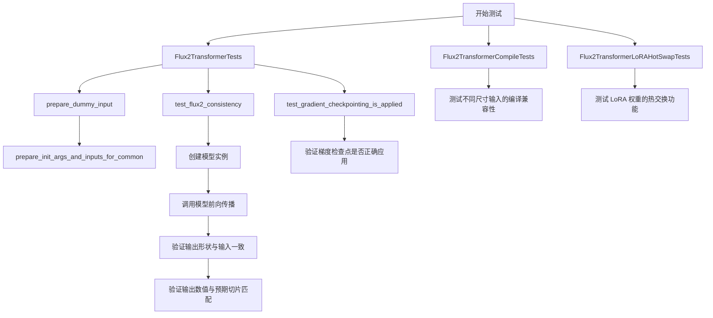
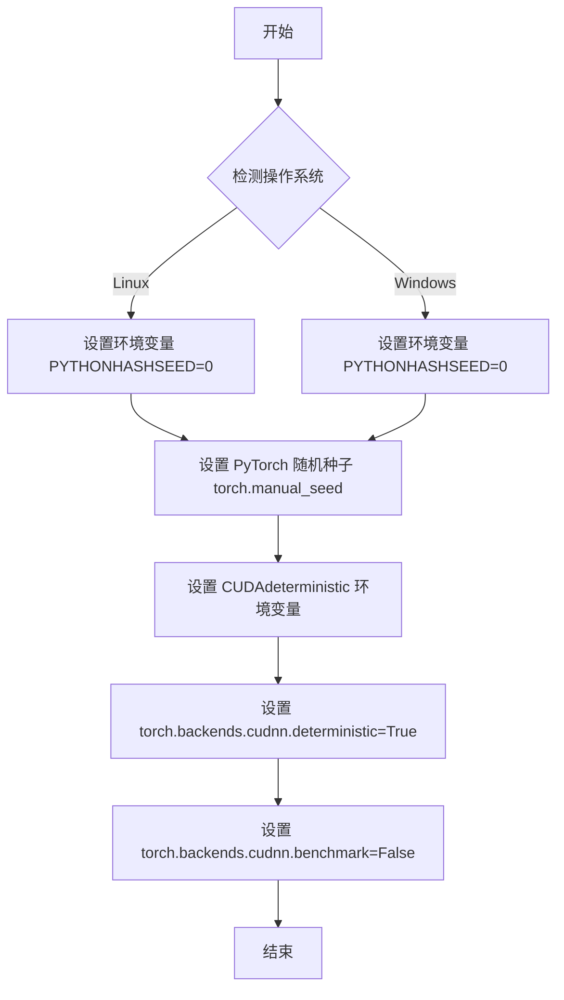
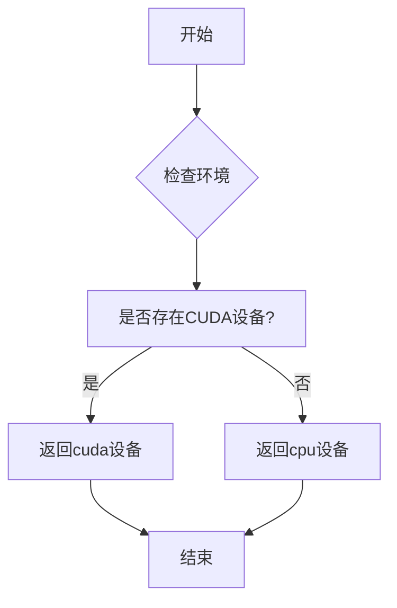
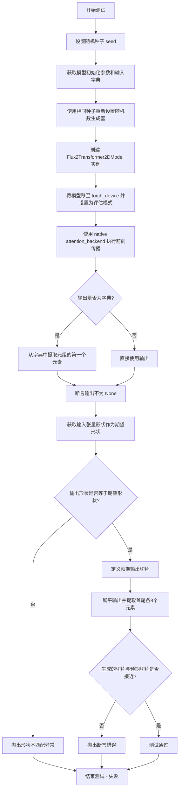
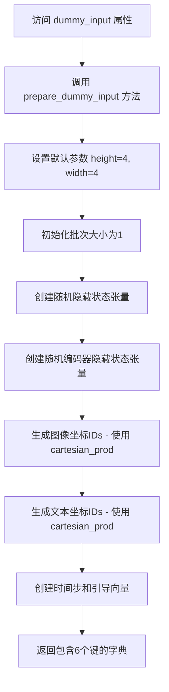
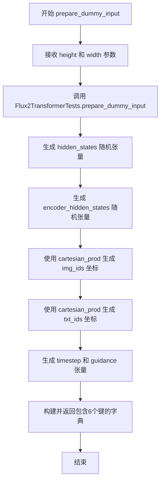
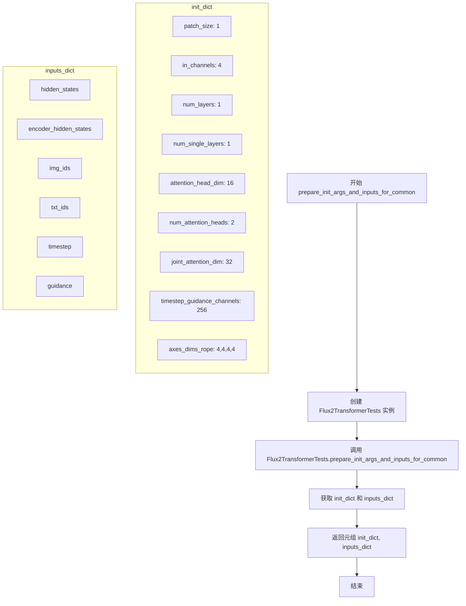

# `diffusers\tests\models\transformers\test_models_transformer_flux2.py` 详细设计文档

这是一个单元测试文件，用于测试 HuggingFace diffusers 库中的 Flux2Transformer2DModel 模型的功能，包括模型一致性测试、梯度检查点测试、torch.compile 编译测试和 LoRA 热交换测试。

## 整体流程



## 类结构

```
unittest.TestCase (基类)
├── Flux2TransformerTests (继承 ModelTesterMixin)
│   └── 测试 Flux2Transformer2DModel 一致性和梯度检查点
├── Flux2TransformerCompileTests (继承 TorchCompileTesterMixin)
│   └── 测试模型的 torch.compile 编译功能
└── Flux2TransformerLoRAHotSwapTests (继承 LoraHotSwappingForModelTesterMixin)
    └── 测试模型的 LoRA 热交换功能
```

## 全局变量及字段


### `enable_full_determinism`
    
启用完全确定性测试的函数引用，确保测试结果可复现

类型：`function`
    


### `Flux2Transformer2DModel`
    
diffusers库中的Transformer模型类，用于Flux2图像生成

类型：`class`
    


### `attention_backend`
    
注意力后端模块，提供不同的注意力计算实现

类型：`module`
    


### `Flux2TransformerTests.model_class`
    
被测试的模型类，指向Flux2Transformer2DModel

类型：`type[Flux2Transformer2DModel]`
    


### `Flux2TransformerTests.main_input_name`
    
模型主输入名称，用于标识hidden_states输入

类型：`str`
    


### `Flux2TransformerTests.model_split_percents`
    
模型分割百分比列表，用于测试时的模型拆分

类型：`List[float]`
    


### `Flux2TransformerTests.uses_custom_attn_processor`
    
标志位，指示是否使用自定义注意力处理器

类型：`bool`
    


### `Flux2TransformerCompileTests.model_class`
    
被测试的模型类，指向Flux2Transformer2DModel

类型：`type[Flux2Transformer2DModel]`
    


### `Flux2TransformerCompileTests.different_shapes_for_compilation`
    
用于编译测试的不同输入形状列表

类型：`List[Tuple[int, int]]`
    


### `Flux2TransformerLoRAHotSwapTests.model_class`
    
被测试的模型类，指向Flux2Transformer2DModel

类型：`type[Flux2Transformer2DModel]`
    


### `Flux2TransformerLoRAHotSwapTests.different_shapes_for_compilation`
    
用于LoRA热切换测试的不同输入形状列表

类型：`List[Tuple[int, int]]`
    
    

## 全局函数及方法


### `enable_full_determinism`

启用完全确定性测试，确保在使用 PyTorch 进行测试时设置所有随机种子和环境变量，以保证测试结果的可重复性和确定性。

参数：

- 该函数在调用时未传递任何参数

返回值：`None`，无返回值（该函数主要执行副作用操作）

#### 流程图



#### 带注释源码

```python
# 该函数定义位于 testing_utils 模块中，当前文件通过导入使用
# 此处展示的是调用方式和上下文

# 导入语句（在文件开头）
from ...testing_utils import enable_full_determinism, torch_device

# ... 其他导入 ...

# 函数调用（在类定义之前）
# 作用：在运行任何测试之前启用完全确定性模式
# 确保所有随机操作可预测，使测试结果可复现
enable_full_determinism()

# 后续的测试类定义...
class Flux2TransformerTests(ModelTesterMixin, unittest.TestCase):
    # ...
```

#### 说明

该函数的具体实现源码不在当前文件中，而是从 `...testing_utils` 模块导入。根据函数名称 `enable_full_determinism`（启用完全确定性）和调用位置（在所有测试类之前），可以推断其主要功能包括：

1. 设置 Python 哈希种子环境变量
2. 设置 PyTorch 全局随机种子
3. 配置 CUDA 相关确定性选项
4. 可能还包含其他随机数生成器的种子设置


### `torch_device`

获取测试设备，用于将张量移动到指定的计算设备（CPU/CUDA）。

参数：此函数无参数

返回值：`str`，返回设备字符串（如 "cpu"、"cuda"、"cuda:0" 等）

#### 流程图



#### 带注释源码

```python
# torch_device 是从 testing_utils 模块导入的全局变量/函数
# 在当前文件中作为设备标识符使用，用于将张量移动到指定设备

# 示例用法：
hidden_states = torch.randn((batch_size, height * width, num_latent_channels)).to(torch_device)
# 将随机初始化的隐藏状态张量移动到测试设备

image_ids = image_ids.unsqueeze(0).expand(batch_size, -1, -1).to(torch_device)
# 将图像ID张量移动到测试设备

text_ids = text_ids.unsqueeze(0).expand(batch_size, -1, -1).to(torch_device)
# 将文本ID张量移动到测试设备

timestep = torch.tensor([1.0]).to(torch_device).expand(batch_size)
# 将时间步张量移动到测试设备

guidance = torch.tensor([1.0]).to(torch_device).expand(batch_size)
# 将引导张量移动到测试设备

model.to(torch_device)
# 将整个模型移动到测试设备
```

---

**注意**：`torch_device` 是从 `...testing_utils` 模块导入的，其具体定义不在当前代码文件中。从使用方式来看，它返回一个设备字符串（通常为 `"cpu"` 或 `"cuda:0"` 等），用于 PyTorch 的 `.to()` 方法将张量或模型移动到指定设备。


### `Flux2TransformerTests.test_flux2_consistency`

该测试方法验证 Flux2Transformer2DModel 的一致性，通过设置随机种子初始化模型，执行前向传播，检查输出是否存在、形状是否与输入匹配，以及输出数值是否与预期切片高度吻合（容差 1e-4），确保模型在相同输入下产生确定性结果。

参数：

- `self`：`Flux2TransformerTests`，测试类实例本身
- `seed`：`int`，随机种子，默认值为 0，用于确保测试的可重复性

返回值：`None`，该方法为测试方法，通过断言验证模型行为，不返回任何值

#### 流程图



#### 带注释源码

```python
def test_flux2_consistency(self, seed=0):
    """
    测试 Flux2Transformer2DModel 的一致性
    验证模型在相同随机种子下产生确定性的输出
    """
    # 设置随机种子以确保可重复性
    torch.manual_seed(seed)
    
    # 获取模型初始化参数和测试输入字典
    init_dict, inputs_dict = self.prepare_init_args_and_inputs_for_common()

    # 再次设置相同种子，确保模型初始化与输入处理使用相同的随机状态
    torch.manual_seed(seed)
    
    # 使用初始化参数创建模型实例
    model = self.model_class(**init_dict)
    
    # 可选：打印和保存模型参数用于调试
    # state_dict = model.state_dict()
    # for key, param in state_dict.items():
    #     print(f"{key} | {param.shape}")
    # torch.save(state_dict, "/raid/daniel_gu/test_flux2_params/diffusers.pt")
    
    # 将模型移至指定设备并设置为评估模式
    model.to(torch_device)
    model.eval()

    # 使用 native 注意力后端进行前向传播
    with attention_backend("native"):
        # 禁用梯度计算以提高性能和减少内存使用
        with torch.no_grad():
            # 执行模型前向传播
            output = model(**inputs_dict)

            # 如果输出是字典格式，则提取元组的第一个元素
            if isinstance(output, dict):
                output = output.to_tuple()[0]

    # 断言输出不为 None
    self.assertIsNotNone(output)

    # input & output have to have the same shape
    # 获取主输入张量
    input_tensor = inputs_dict[self.main_input_name]
    # 期望的输出形状应该与输入形状相同
    expected_shape = input_tensor.shape
    # 验证输出形状是否与输入形状匹配
    self.assertEqual(output.shape, expected_shape, "Input and output shapes do not match")

    # Check against expected slice
    # fmt: off
    # 预计算的期望输出切片（用于一致性验证）
    expected_slice = torch.tensor([-0.3662, 0.4844, 0.6334, -0.3497, 0.2162, 0.0188, 0.0521, -0.2061, -0.2041, -0.0342, -0.7107, 0.4797, -0.3280, 0.7059, -0.0849, 0.4416])
    # fmt: on

    # 将输出展平并提取首尾各8个元素，组成16个元素的切片
    flat_output = output.cpu().flatten()
    generated_slice = torch.cat([flat_output[:8], flat_output[-8:]])
    # 验证生成的切片与预期切片是否在容差范围内接近
    self.assertTrue(torch.allclose(generated_slice, expected_slice, atol=1e-4))
```


### `Flux2TransformerTests.test_gradient_checkpointing_is_applied`

该方法用于测试 Flux2Transformer2DModel 模型的梯度检查点（Gradient Checkpointing）是否正确应用。它通过调用父类的测试方法，验证指定的模型是否启用了梯度检查点功能，以确保在反向传播时能够节省显存。

参数：

- `expected_set`：`set`，期望检查梯度检查点应用的模型名称集合，此处为 `{"Flux2Transformer2DModel"}`

返回值：`None`，无返回值，通过测试断言验证梯度检查点是否正确应用

#### 流程图

```mermaid
flowchart TD
    A[开始测试 test_gradient_checkpointing_is_applied] --> B[定义 expected_set = {'Flux2Transformer2DModel'}]
    B --> C[调用父类方法 super().test_gradient_checkpointing_is_applied]
    C --> D[父类测试方法内部逻辑]
    D --> D1[获取模型类名]
    D1 --> D2{模型类名是否在 expected_set 中?}
    D2 -->|是| D3[检查模型的 forward 方法是否使用 gradient_checkpointing_enable]
    D2 -->|否| D4[测试失败 - 抛出 AssertionError]
    D3 --> D5{梯度检查点是否正确应用?}
    D5 -->|是| D6[测试通过]
    D5 -->|否| D7[测试失败 - 抛出 AssertionError]
```

#### 带注释源码

```python
def test_gradient_checkpointing_is_applied(self):
    """
    测试梯度检查点是否正确应用到 Flux2Transformer2DModel 模型。
    该测试方法继承自 ModelTesterMixin，用于验证梯度检查点功能。
    """
    # 定义期望检查梯度检查点的模型名称集合
    expected_set = {"Flux2Transformer2DModel"}
    
    # 调用父类 (ModelTesterMixin) 的测试方法进行验证
    # 父类方法会检查 Flux2Transformer2DModel 是否正确应用了梯度检查点
    super().test_gradient_checkpointing_is_applied(expected_set=expected_set)
```


### `Flux2TransformerTests.dummy_input`

该属性是 Flux2Transformer2DModel 测试类的虚拟输入数据生成器，通过调用 `prepare_dummy_input` 方法返回模型测试所需的虚拟输入数据，包括隐藏状态、编码器隐藏状态、图像ID、文本ID、时间步和引导向量。

参数：无（该属性无参数）

返回值：`Dict[str, torch.Tensor]`，返回包含以下键的字典：
- `hidden_states`：隐藏状态张量，形状为 (batch_size, height * width, num_latent_channels)
- `encoder_hidden_states`：编码器隐藏状态张量，形状为 (batch_size, sequence_length, embedding_dim)
- `img_ids`：图像坐标 IDs 张量，用于图像位置编码
- `txt_ids`：文本坐标 IDs 张量，用于文本位置编码
- `timestep`：时间步张量
- `guidance`：引导向量张量

#### 流程图



#### 带注释源码

```python
@property
def dummy_input(self):
    """
    返回虚拟输入数据，用于模型测试。
    这是一个属性方法，通过调用 prepare_dummy_input 生成测试所需的输入。
    """
    return self.prepare_dummy_input()

# 实际生成数据的底层方法（供参考）
def prepare_dummy_input(self, height=4, width=4):
    """
    准备虚拟输入数据
    
    参数：
    - height：int，图像高度（默认4）
    - width：int，图像宽度（默认4）
    
    返回：
    - dict：包含所有模型输入的字典
    """
    batch_size = 1
    num_latent_channels = 4
    sequence_length = 48
    embedding_dim = 32

    # 创建随机隐藏状态 (batch, height*width, channels)
    hidden_states = torch.randn((batch_size, height * width, num_latent_channels)).to(torch_device)
    # 创建随机编码器隐藏状态 (batch, sequence_length, embedding_dim)
    encoder_hidden_states = torch.randn((batch_size, sequence_length, embedding_dim)).to(torch_device)

    # 生成图像坐标 IDs (t, h, w, l) 四维坐标
    t_coords = torch.arange(1)
    h_coords = torch.arange(height)
    w_coords = torch.arange(width)
    l_coords = torch.arange(1)
    image_ids = torch.cartesian_prod(t_coords, h_coords, w_coords, l_coords)  # [height * width, 4]
    image_ids = image_ids.unsqueeze(0).expand(batch_size, -1, -1).to(torch_device)

    # 生成文本坐标 IDs
    text_t_coords = torch.arange(1)
    text_h_coords = torch.arange(1)
    text_w_coords = torch.arange(1)
    text_l_coords = torch.arange(sequence_length)
    text_ids = torch.cartesian_prod(text_t_coords, text_h_coords, text_w_coords, text_l_coords)
    text_ids = text_ids.unsqueeze(0).expand(batch_size, -1, -1).to(torch_device)

    # 时间步和引导向量
    timestep = torch.tensor([1.0]).to(torch_device).expand(batch_size)
    guidance = torch.tensor([1.0]).to(torch_device).expand(batch_size)

    return {
        "hidden_states": hidden_states,
        "encoder_hidden_states": encoder_hidden_states,
        "img_ids": image_ids,
        "txt_ids": text_ids,
        "timestep": timestep,
        "guidance": guidance,
    }
```


### `Flux2TransformerTests.input_shape`

该属性用于返回 Flux2Transformer2DModel 的输入形状，定义为一个元组 (16, 4)，其中 16 表示高度与宽度的乘积（4×4），4 表示潜在通道数。此属性在测试用例中用于验证模型输入输出的形状一致性。

参数： 无

返回值：`tuple`，返回输入张量的形状元组 (16, 4)

#### 流程图

```mermaid
flowchart TD
    A[访问 input_shape 属性] --> B{调用 getter}
    B --> C[返回元组 (16, 4)]
    C --> D[用于测试中验证模型输入形状]
```

#### 带注释源码

```python
@property
def input_shape(self):
    """
    返回模型期望的输入形状。
    
    形状说明:
    - 16 = height(4) * width(4)，表示空间维度的总像素数
    - 4 表示潜在通道数 (num_latent_channels)
    
    Returns:
        tuple: 输入形状元组 (16, 4)，第一维为序列长度，第二维为特征维度
    """
    return (16, 4)
```


### `Flux2TransformerTests.output_shape`

该属性返回 Flux2Transformer2DModel 模型的输出形状，用于测试框架中定义输入输出的维度期望值。

参数： 无

返回值：`tuple[int, int]`，返回元组 (16, 4)，表示模型输出的形状为 16×4（高度×宽度），对应潜在空间的空间维度。

#### 流程图

```mermaid
flowchart TD
    A[访问 output_shape 属性] --> B{执行 get 方法}
    B --> C[返回元组 (16, 4)]
```

#### 带注释源码

```python
@property
def output_shape(self):
    """
    返回模型期望的输出形状。
    
    该属性定义了 Flux2Transformer2DModel 在测试中的输出维度。
    返回值为 (height, width) = (16, 4)，表示输出的空间维度。
    这与 input_shape 保持一致，验证模型在前向传播后
    能够保持输入的空间维度不变。
    
    Returns:
        tuple: 输出形状元组 (16, 4)
    """
    return (16, 4)
```


### `Flux2TransformerTests.prepare_dummy_input`

准备虚拟输入数据，用于 Flux2Transformer2DModel 的测试。该方法生成包含 hidden_states、encoder_hidden_states、img_ids、txt_ids、timestep 和 guidance 的字典，作为模型的输入。

参数：

- `height`：`int`，可选参数，默认为 4，表示虚拟输入的高度维度
- `width`：`int`，可选参数，默认为 4，表示虚拟输入的宽度维度

返回值：`Dict[str, torch.Tensor]`，返回包含以下键的字典：
  - `hidden_states`：隐藏状态张量，形状为 (batch_size, height * width, num_latent_channels)
  - `encoder_hidden_states`：编码器隐藏状态张量，形状为 (batch_size, sequence_length, embedding_dim)
  - `img_ids`：图像坐标 IDs，形状为 (batch_size, height * width, 4)
  - `txt_ids`：文本坐标 IDs，形状为 (batch_size, sequence_length, 4)
  - `timestep`：时间步张量，形状为 (batch_size,)
  - `guidance`：引导张量，形状为 (batch_size,)

#### 流程图

```mermaid
flowchart TD
    A[开始 prepare_dummy_input] --> B[设置默认参数<br/>batch_size=1, num_latent_channels=4<br/>sequence_length=48, embedding_dim=32]
    B --> C[生成 hidden_states<br/>torch.randn 形状 (1, height\*width, 4)]
    C --> D[生成 encoder_hidden_states<br/>torch.randn 形状 (1, 48, 32)]
    D --> E[生成图像坐标 image_ids<br/>使用 cartesian_prod 生成 t/h/w/l 坐标]
    E --> F[生成文本坐标 text_ids<br/>使用 cartesian_prod 生成文本坐标]
    F --> G[生成 timestep 张量<br/>值为 1.0, 形状 (1,)]
    G --> H[生成 guidance 张量<br/>值为 1.0, 形状 (1,)]
    H --> I[所有张量移动到 torch_device]
    I --> J[返回包含6个键的字典]
```

#### 带注释源码

```python
def prepare_dummy_input(self, height=4, width=4):
    """
    准备虚拟输入数据，用于模型测试
    
    参数:
        height: 虚拟输入的高度维度，默认为4
        width: 虚拟输入的宽度维度，默认为4
    
    返回:
        包含模型所需输入的字典
    """
    # 定义批量大小和通道数
    batch_size = 1
    num_latent_channels = 4
    sequence_length = 48
    embedding_dim = 32

    # 生成随机隐藏状态张量，形状为 (batch_size, height*width, num_latent_channels)
    # 表示批量为1，序列长度为 height*width，通道数为4的潜在空间表示
    hidden_states = torch.randn((batch_size, height * width, num_latent_channels)).to(torch_device)
    
    # 生成随机编码器隐藏状态，形状为 (batch_size, sequence_length, embedding_dim)
    # 用于文本或条件信息的编码表示
    encoder_hidden_states = torch.randn((batch_size, sequence_length, embedding_dim)).to(torch_device)

    # === 生成图像坐标 IDs (img_ids) ===
    # 用于标识图像中每个像素的位置信息
    # t_coords: 时间维度坐标，当前设为1
    t_coords = torch.arange(1)
    # h_coords: 高度维度坐标
    h_coords = torch.arange(height)
    # w_coords: 宽度维度坐标
    w_coords = torch.arange(width)
    # l_coords: 潜在维度坐标，当前设为1
    l_coords = torch.arange(1)
    
    # 使用笛卡尔积生成所有坐标组合，形状为 [height*width, 4]
    image_ids = torch.cartesian_prod(t_coords, h_coords, w_coords, l_coords)
    # 扩展为 (batch_size, height*width, 4) 并移动到指定设备
    image_ids = image_ids.unsqueeze(0).expand(batch_size, -1, -1).to(torch_device)

    # === 生成文本坐标 IDs (txt_ids) ===
    # 用于标识文本序列中每个 token 的位置信息
    text_t_coords = torch.arange(1)
    text_h_coords = torch.arange(1)
    text_w_coords = torch.arange(1)
    # 文本长度维度坐标，对应 sequence_length
    text_l_coords = torch.arange(sequence_length)
    
    # 使用笛卡尔积生成所有文本坐标组合
    text_ids = torch.cartesian_prod(text_t_coords, text_h_coords, text_w_coords, text_l_coords)
    # 扩展为 (batch_size, sequence_length, 4) 并移动到指定设备
    text_ids = text_ids.unsqueeze(0).expand(batch_size, -1, -1).to(torch_device)

    # === 生成时间步和引导张量 ===
    # timestep: 用于扩散模型的时间步信息
    timestep = torch.tensor([1.0]).to(torch_device).expand(batch_size)
    # guidance: 用于分类器自由引导的强度值
    guidance = torch.tensor([1.0]).to(torch_device).expand(batch_size)

    # 返回包含所有模型输入的字典
    return {
        "hidden_states": hidden_states,
        "encoder_hidden_states": encoder_hidden_states,
        "img_ids": image_ids,
        "txt_ids": text_ids,
        "timestep": timestep,
        "guidance": guidance,
    }
```


### `Flux2TransformerTests.prepare_init_args_and_inputs_for_common`

该方法为 Flux2Transformer2DModel 测试准备初始化参数字典和输入张量字典，返回包含模型配置参数的 init_dict 和包含测试输入数据的 inputs_dict，用于模型的前向传播验证。

参数：无（隐式接收 `self` 参数）

返回值：
- `init_dict`：`Dict[str, Any]`，包含模型初始化所需的配置参数
- `inputs_dict`：`Dict[str, torch.Tensor]`，包含模型前向传播所需的输入张量

#### 流程图

```mermaid
flowchart TD
    A[开始 prepare_init_args_and_inputs_for_common] --> B[构建 init_dict 字典]
    B --> C[设置 patch_size=1]
    B --> D[设置 in_channels=4]
    B --> E[设置 num_layers=1]
    B --> F[设置 num_single_layers=1]
    B --> G[设置 attention_head_dim=16]
    B --> H[设置 num_attention_heads=2]
    B --> I[设置 joint_attention_dim=32]
    B --> J[设置 timestep_guidance_channels=256]
    B --> K[设置 axes_dims_rope=[4, 4, 4, 4]]
    K --> L[调用 self.dummy_input 获取 inputs_dict]
    L --> M[返回 init_dict 和 inputs_dict 元组]
```

#### 带注释源码

```python
def prepare_init_args_and_inputs_for_common(self):
    """
    准备 Flux2Transformer2DModel 的初始化参数和输入数据
    
    Returns:
        Tuple[Dict, Dict]: (init_dict, inputs_dict) 初始化参数字典和输入张量字典
    """
    # 定义模型初始化配置字典，包含 Transformer 模型的关键架构参数
    init_dict = {
        "patch_size": 1,                    # 图像分块大小
        "in_channels": 4,                  # 输入通道数
        "num_layers": 1,                   # Transformer 编码器层数
        "num_single_layers": 1,            # 单层Transformer数量
        "attention_head_dim": 16,         # 注意力头维度
        "num_attention_heads": 2,          # 注意力头数量
        "joint_attention_dim": 32,         # 联合注意力维度
        "timestep_guidance_channels": 256, # 时间步引导通道数（硬编码）
        "axes_dims_rope": [4, 4, 4, 4],    # RoPE 旋转位置编码的轴维度
    }

    # 获取测试输入数据，调用 prepare_dummy_input 方法构造虚拟输入
    inputs_dict = self.dummy_input
    
    # 返回初始化参数字典和输入字典的元组
    return init_dict, inputs_dict
```


### `Flux2TransformerTests.test_flux2_consistency`

该测试方法用于验证Flux2Transformer2DModel的一致性，通过使用固定随机种子初始化模型并执行推理，验证模型输出的形状与输入形状一致，并且输出数值与预期切片匹配（使用torch.allclose进行浮点数近似比较）。

参数：

- `self`：Flux2TransformerTests，测试类实例本身
- `seed`：`int`，随机种子，用于设置PyTorch随机数生成器的种子以确保可重复性，默认为0

返回值：`None`，该方法为测试方法，通过unittest的assert语句进行验证，不返回任何值

#### 流程图

```mermaid
flowchart TD
    A[开始测试 test_flux2_consistency] --> B[设置随机种子: torch.manual_seed(seed)]
    B --> C[准备初始化参数和输入: prepare_init_args_and_inputs_for_common]
    C --> D[使用随机种子重新初始化模型]
    D --> E[将模型移动到指定设备并设置为评估模式]
    E --> F[使用native attention backend执行前向传播]
    F --> G{输出是否为字典?}
    G -->|是| H[提取tuple中的第一个元素作为output]
    G -->|否| I[直接使用output]
    H --> J[验证output不为None]
    I --> J
    J --> K[验证output.shape与input_tensor.shape相等]
    K --> L[准备预期输出切片 expected_slice]
    L --> M[从output中提取前8和后8个元素生成generated_slice]
    M --> N{使用torch.allclose比较两个切片?}
    N -->|是| O[测试通过]
    N -->|否| P[测试失败抛出AssertionError]
```

#### 带注释源码

```python
def test_flux2_consistency(self, seed=0):
    """测试Flux2Transformer2DModel的一致性"""
    # 1. 设置随机种子以确保可重复性
    torch.manual_seed(seed)
    
    # 2. 获取模型初始化参数和输入数据
    init_dict, inputs_dict = self.prepare_init_args_and_inputs_for_common()

    # 3. 使用相同种子重新初始化模型，确保模型权重确定性
    torch.manual_seed(seed)
    model = self.model_class(**init_dict)
    
    # 4. 将模型移动到指定设备(CPU/GPU)并设置为评估模式
    model.to(torch_device)
    model.eval()

    # 5. 使用native attention backend执行推理
    with attention_backend("native"):
        with torch.no_grad():  # 禁用梯度计算以提高推理效率
            output = model(**inputs_dict)

            # 6. 如果输出是字典，提取tuple中的第一个元素
            if isinstance(output, dict):
                output = output.to_tuple()[0]

    # 7. 验证输出不为None
    self.assertIsNotNone(output)

    # 8. 验证输入输出形状一致
    input_tensor = inputs_dict[self.main_input_name]
    expected_shape = input_tensor.shape
    self.assertEqual(output.shape, expected_shape, "Input and output shapes do not match")

    # 9. 定义预期输出切片(通过预先计算获得)
    # fmt: off
    expected_slice = torch.tensor([-0.3662, 0.4844, 0.6334, -0.3497, 0.2162, 0.0188, 0.0521, -0.2061, -0.2041, -0.0342, -0.7107, 0.4797, -0.3280, 0.7059, -0.0849, 0.4416])
    # fmt: on

    # 10. 扁平化输出并提取首尾各8个元素
    flat_output = output.cpu().flatten()
    generated_slice = torch.cat([flat_output[:8], flat_output[-8:]])
    
    # 11. 使用torch.allclose进行浮点数近似比较(atol=1e-4)
    self.assertTrue(torch.allclose(generated_slice, expected_slice, atol=1e-4))
```


### `Flux2TransformerTests.test_gradient_checkpointing_is_applied`

该测试方法用于验证梯度检查点（Gradient Checkpointing）是否已正确应用于 Flux2Transformer2DModel 模型，通过调用父类的同名测试方法并传入预期的模型集合来执行验证。

参数：

- `self`：`Flux2TransformerTests`，测试类的实例，包含测试所需的模型配置和输入数据

返回值：`None`，无返回值（测试方法，通过断言验证功能）

#### 流程图

```mermaid
flowchart TD
    A[开始 test_gradient_checkpointing_is_applied] --> B[定义 expected_set]
    B --> C[expected_set = {'Flux2Transformer2DModel'}]
    C --> D[调用父类方法]
    D --> E[super.test_gradient_checkpointing_is_applied<br/>expected_set=expected_set]
    E --> F{父类方法执行验证}
    F -->|通过| G[测试通过]
    F -->|失败| H[抛出断言异常]
    G --> I[结束]
    H --> I
```

#### 带注释源码

```python
def test_gradient_checkpointing_is_applied(self):
    """
    测试梯度检查点是否已应用到 Flux2Transformer2DModel。
    
    该测试方法验证模型在训练时是否启用了梯度检查点优化技术，
    该技术通过在前向传播中牺牲少量计算来节省显存占用。
    """
    # 定义预期应用梯度检查点的模型集合
    # Flux2Transformer2DModel 是需要验证的模型类
    expected_set = {"Flux2Transformer2DModel"}
    
    # 调用父类（ModelTesterMixin）的测试方法进行实际验证
    # 父类方法会检查模型是否正确配置了梯度检查点
    super().test_gradient_checkpointing_is_applied(expected_set=expected_set)
```


### `Flux2TransformerCompileTests.prepare_init_args_and_inputs_for_common`

该方法用于准备 Flux2Transformer2DModel 编译测试所需的初始化参数和输入数据，通过复用 Flux2TransformerTests 的同名方法获取模型配置字典和输入字典组成的元组，为后续的模型编译测试提供必要的测试数据。

参数：

- `self`：类的实例方法隐式参数，无需显式传递

返回值：`Tuple[Dict, Dict]`，返回一个元组，包含：
- 第一个元素：`Dict`，模型初始化参数字典，包含 patch_size、in_channels、num_layers、num_single_layers、attention_head_dim、num_attention_heads、joint_attention_dim、timestep_guidance_channels、axes_dims_rope 等配置
- 第二个元素：`Dict`，模型输入字典，包含 hidden_states、encoder_hidden_states、img_ids、txt_ids、timestep、guidance 等输入张量

#### 流程图

```mermaid
flowchart TD
    A[开始] --> B[调用 Flux2TransformerTests 实例的 prepare_init_args_and_inputs_for_common 方法]
    B --> C[返回 (init_dict, inputs_dict) 元组]
    C --> D[结束]
```

#### 带注释源码

```python
def prepare_init_args_and_inputs_for_common(self):
    """
    准备 Flux2Transformer2DModel 编译测试所需的初始化参数和输入数据。
    
    该方法通过复用 Flux2TransformerTests 类的同名方法来获取模型初始化
    参数字典和输入字典，用于模型编译测试场景。
    
    Returns:
        Tuple[Dict, Dict]: 包含以下两个元素的元组:
            - init_dict: 模型初始化参数字典，包含模型架构配置
            - inputs_dict: 模型输入字典，包含测试用的输入张量
    """
    # 直接调用 Flux2TransformerTests 类的实例方法来获取初始化参数和输入
    # 这种设计实现了代码复用，避免在多个测试类中重复定义相同的准备逻辑
    return Flux2TransformerTests().prepare_init_args_and_inputs_for_common()
```


### `Flux2TransformerCompileTests.prepare_dummy_input`

准备虚拟输入数据，用于 Flux2Transformer2DModel 的编译测试。该方法接收高度和宽度参数，调用 Flux2TransformerTests 的 prepare_dummy_input 方法生成包含 hidden_states、encoder_hidden_states、img_ids、txt_ids、timestep 和 guidance 的字典格式虚拟输入。

参数：

- `height`：`int`，输入图像的高度维度
- `width`：`int`，输入图像的宽度维度

返回值：`Dict[str, torch.Tensor]`，包含以下键的字典：

- `hidden_states`：`torch.Tensor`，形状为 (batch_size, height * width, num_latent_channels) 的潜在状态
- `encoder_hidden_states`：`torch.Tensor`，形状为 (batch_size, sequence_length, embedding_dim) 的编码器隐藏状态
- `img_ids`：`torch.Tensor`，形状为 (batch_size, height * width, 4) 的图像坐标 IDs
- `txt_ids`：`torch.Tensor`，形状为 (batch_size, sequence_length, 4) 的文本坐标 IDs
- `timestep`：`torch.Tensor`，形状为 (batch_size,) 的时间步
- `guidance`：`torch.Tensor`，形状为 (batch_size,) 的指导向量

#### 流程图



#### 带注释源码

```python
def prepare_dummy_input(self, height, width):
    """
    准备虚拟输入数据，用于 Flux2Transformer2DModel 的编译测试。
    
    参数:
        height: 输入图像的高度维度
        width: 输入图像的宽度维度
    
    返回:
        包含模型所需输入的字典
    """
    # 调用 Flux2TransformerTests 类的 prepare_dummy_input 方法
    # 实际生成逻辑在 Flux2TransformerTests.prepare_dummy_input 中实现
    return Flux2TransformerTests().prepare_dummy_input(height=height, width=width)
```


### `Flux2TransformerLoRAHotSwapTests.prepare_init_args_and_inputs_for_common`

该方法用于准备 Flux2TransformerLoRAHotSwapTests 测试类的模型初始化参数和输入数据。它委托调用 `Flux2TransformerTests` 类的同名方法获取标准的模型初始化配置和测试输入，以便为 LoRA 热插拔测试提供必要的参数和输入数据。

参数：
- 无显式参数（隐式参数 `self` 为 unittest.TestCase 实例）

返回值：`Tuple[Dict, Dict]`，返回一个元组，包含模型初始化参数字典 `init_dict` 和模型输入字典 `inputs_dict`

#### 流程图



#### 带注释源码

```python
def prepare_init_args_and_inputs_for_common(self):
    """
    准备模型初始化参数和输入数据，用于 LoRA 热插拔测试。
    
    该方法委托给 Flux2TransformerTests 类的同名方法，以获取
    标准的模型初始化配置和测试输入数据。
    
    Returns:
        Tuple[Dict, Dict]: 包含两个字典的元组:
            - init_dict: 模型初始化参数字典
            - inputs_dict: 模型输入参数字典
    """
    # 通过创建 Flux2TransformerTests 实例并调用其方法来获取
    # 标准初始化参数和输入数据
    return Flux2TransformerTests().prepare_init_args_and_inputs_for_common()
```


### `Flux2TransformerLoRAHotSwapTests.prepare_dummy_input`

准备虚拟输入数据，用于 Flux2Transformer LoRA 热交换测试。该方法是一个委托方法，内部调用 `Flux2TransformerTests.prepare_dummy_input` 来生成测试所需的虚拟输入张量。

参数：

- `height`：`int`，生成虚拟输入的高度维度，默认为 4
- `width`：`int`，生成虚拟输入的宽度维度，默认为 4

返回值：`Dict[str, torch.Tensor]`，包含模型前向传播所需的所有虚拟输入张量的字典，包括 hidden_states、encoder_hidden_states、img_ids、txt_ids、timestep 和 guidance

#### 流程图

```mermaid
flowchart TD
    A[开始 prepare_dummy_input] --> B[接收 height 和 width 参数]
    B --> C[调用 Flux2TransformerTests.prepare_dummy_input]
    C --> D[创建基础维度变量: batch_size=1, num_latent_channels=4, sequence_length=48, embedding_dim=32]
    D --> E[生成 hidden_states: torch.randn 形状为 (1, height\*width, 4)]
    E --> F[生成 encoder_hidden_states: torch.randn 形状为 (1, 48, 32)]
    F --> G[生成 img_ids: 使用 cartesian_prod 生成图像坐标ID并扩展到 batch_size]
    G --> H[生成 txt_ids: 使用 cartesian_prod 生成文本坐标ID并扩展到 batch_size]
    H --> I[生成 timestep: 值为 1.0 的张量]
    I --> J[生成 guidance: 值为 1.0 的张量]
    J --> K[返回包含所有输入的字典]
```

#### 带注释源码

```python
def prepare_dummy_input(self, height, width):
    """
    准备虚拟输入数据，用于 Flux2Transformer LoRA 热交换测试。
    
    这是一个委托方法，内部调用 Flux2TransformerTests.prepare_dummy_input
    来生成测试所需的虚拟输入张量。
    
    参数:
        height: int, 生成虚拟输入的高度维度
        width: int, 生成虚拟输入的宽度维度
    
    返回:
        Dict[str, torch.Tensor], 包含模型前向传播所需的所有虚拟输入
    """
    # 委托给 Flux2TransformerTests 的 prepare_dummy_input 方法生成虚拟输入
    return Flux2TransformerTests().prepare_dummy_input(height=height, width=width)
```

## 关键组件


### Flux2Transformer2DModel

核心测试模型类，继承自ModelTesterMixin，用于验证Flux2 Transformer 2D模型的结构和输出正确性。

### attention_backend

注意力后端配置接口，通过`attention_backend("native")`指定使用原生注意力实现，用于控制模型内部注意力计算的后端策略。

### prepare_dummy_input

虚拟输入生成方法，动态生成测试所需的hidden_states、encoder_hidden_states、img_ids、txt_ids、timestep和guidance等张量数据，采用惰性加载模式按需构造。

### image_ids / text_ids

图像和文本坐标索引张量，使用torch.cartesian_prod生成4维坐标（t_coords, h_coords, w_coords, l_coords），用于标识输入数据的空间位置信息。

### test_flux2_consistency

模型一致性测试方法，验证模型输出的形状与输入一致，并通过torch.allclose比对特定slice的数值确保模型计算正确性。

### LoraHotSwappingForModelTesterMixin

LoRA热插拔测试混入类，提供对Flux2Transformer2DModel的LoRA权重动态加载/卸载能力的测试支持。

### TorchCompileTesterMixin

PyTorch编译测试混入类，使用different_shapes_for_compilation定义多形状编译测试场景，验证模型的torch.compile兼容性能。

### gradient_checkpointing

梯度检查点技术，通过test_gradient_checkpointing_is_applied验证模型支持梯度检查点以节省显存。

### ModelTesterMixin

通用模型测试混入类，提供模型初始化、输入输出形状验证、参数一致性检查等标准化测试框架。

### enable_full_determinism

测试确定性配置函数，确保测试结果的可复现性，通过设置随机种子等方式消除浮点运算的不确定性。


## 问题及建议


### 已知问题

-   **硬编码配置值**：代码中存在多处硬编码的配置值，如 `timestep_guidance_channels: 256`（带有"Hardcoded in original code"注释）、`axes_dims_rope: [4, 4, 4, 4]` 以及 `attention_head_dim`、`num_attention_heads`、`joint_attention_dim` 等参数，缺乏灵活配置机制
-   **代码重复**：三个测试类（`Flux2TransformerTests`、`Flux2TransformerCompileTests`、`Flux2TransformerLoRAHotSwapTests`）中的 `prepare_init_args_and_inputs_for_common` 和 `prepare_dummy_input` 方法存在大量重复代码，后者仅是简单调用前者的方法
-   **测试实例创建开销**：`Flux2TransformerCompileTests` 和 `Flux2TransformerLoRAHotSwapTests` 的 `prepare_init_args_and_inputs_for_common` 方法每次调用都会创建新的 `Flux2TransformerTests()` 实例，增加不必要的内存开销
-   **硬编码的期望输出**：`expected_slice` 包含硬编码的数值，如果模型内部实现发生微小变化，测试将失败，导致测试脆弱性
-   **TODO 待处理**：`test_flux2_consistency` 方法上有 TODO 注释标记该测试可被移除，但至今未处理
-   **Magic Numbers**：代码中大量使用魔数（如 `batch_size=1`、`num_latent_channels=4`、`sequence_length=48` 等），缺乏常量定义，降低了可读性和可维护性

### 优化建议

-   将硬编码的配置值提取为类属性或配置文件，通过参数化方式传入，提高测试的灵活性和覆盖率
-   使用继承或混入（Mixin）模式重构测试类，将公共方法抽取到基类中，消除重复代码
-   将 `Flux2TransformerTests` 实例改为类级别属性或使用 `@classmethod` 共享实例，避免重复创建
-   考虑使用相对比较而非绝对值比较，或者将期望输出值参数化，参考环境变量或配置进行断言
-   清理 TODO 注释，要么实现移除该测试，要么添加说明为何需要保留
-   定义常量类或枚举，为魔数赋予语义化的名称，提升代码可读性

## 其它


### 设计目标与约束

本测试文件旨在验证Flux2Transformer2DModel模型的正确性、一致性和性能。设计目标包括：确保模型前向传播输出形状与输入一致，验证梯度检查点功能，测试torch.compile编译兼容性，以及LoRA权重热插拔功能。约束条件包括使用特定的输入维度（height=4, width=4）、特定的批次大小（batch_size=1）、以及特定的通道数和注意力头配置。此外，测试依赖PyTorch和diffusers库，需要在CUDA设备上运行以确保测试的可重复性。

### 错误处理与异常设计

测试类通过unittest框架进行异常捕获和断言验证。关键错误处理包括：
1. 输出类型检查：使用isinstance判断输出是否为字典，若是则转换为元组
2. 形状一致性验证：通过assertEqual确保输入输出形状匹配
3. 数值精度验证：使用torch.allclose和atol=1e-4进行浮点数近似比较
4. 空值检查：使用assertIsNotNone确保输出非空

### 数据流与状态机

测试数据流遵循以下路径：
1. prepare_dummy_input生成模拟输入数据（hidden_states, encoder_hidden_states, img_ids, txt_ids, timestep, guidance）
2. prepare_init_args_and_inputs_for_common构建模型初始化参数
3. 模型实例化并进行设备转移（to(torch_device)）
4. 设置评估模式（model.eval()）
5. 执行前向传播（model(**inputs_dict)）
6. 输出结果验证

状态转换：初始化状态 → 设备配置状态 → 评估状态 → 推理状态 → 验证状态

### 外部依赖与接口契约

主要外部依赖包括：
- torch：深度学习框架，用于张量操作和模型计算
- diffusers库：Flux2Transformer2DModel和attention_backend来源
- unittest：Python标准测试框架
- testing_utils：enable_full_determinism和torch_device工具函数
- test_modeling_common：ModelTesterMixin等基类

接口契约：
- model_class：指定待测试的模型类
- main_input_name：指定主输入参数名称（hidden_states）
- prepare_init_args_and_inputs_for_common：返回(初始化参数字典, 输入字典)的元组
- prepare_dummy_input：返回包含所有必要输入的字典

### 性能考虑与基准测试

测试中的性能考虑包括：
1. 使用torch.no_grad()禁用梯度计算以加速推理
2. 使用model.eval()切换到评估模式禁用dropout等训练特定操作
3. test_flux2_consistency中的expected_slice作为数值一致性基准，用于回归测试
4. test_gradient_checkpointing_is_applied验证梯度检查点是否正确应用，影响内存使用
5. 不同形状测试(different_shapes_for_compilation)用于验证编译兼容性

### 安全考虑

测试代码本身不涉及用户输入处理，主要安全考虑集中在：
1. 设备选择：使用torch_device确保在合适设备上运行
2. 随机性控制：通过enable_full_determinism和torch.manual_seed确保测试可重复性
3. 模型状态管理：测试后不保存模型状态，避免敏感信息泄露

### 版本兼容性与迁移

版本兼容性考虑：
1. 代码指定Apache License 2.0开源许可
2. 使用HuggingFace diffusers库的Flux2Transformer2DModel，需保持与最新diffusers版本兼容
3. attention_backend("native")调用需要特定版本的diffusers支持
4. torch.compile功能需要PyTorch 2.0+版本
5. 潜在迁移路径：未来可能需要适配更新的Transformer架构和注意力机制

### 测试覆盖范围

当前测试覆盖：
1. 模型前向传播一致性测试（test_flux2_consistency）
2. 梯度检查点应用验证（test_gradient_checkpointing_is_applied）
3. torch.compile编译兼容性测试（Flux2TransformerCompileTests）
4. LoRA权重热插拔功能测试（Flux2TransformerLoRAHotSwapTests）

未覆盖领域：
1. 反向传播梯度计算正确性
2. 模型序列化与反序列化
3. 混合精度推理
4. 分布式推理
5. 内存泄漏检测

### 部署与运维注意事项

测试文件本身不直接用于生产部署，但相关建议包括：
1. 定期运行测试套件确保模型质量
2. 使用CI/CD自动化测试流程
3. 在目标硬件上进行完整测试验证
4. 记录测试环境信息（PyTorch版本、diffusers版本、CUDA版本）
5. 建立性能基准以检测回归

### 参考资料与相关文档

- Apache License 2.0: https://www.apache.org/licenses/LICENSE-2.0
- HuggingFace diffusers文档: https://huggingface.co/docs/diffusers
- PyTorch torch.compile文档: https://pytorch.org/tutorials/intermediate/torch_compile_tutorial.html
- Flux2Transformer2DModel源代码: 来自diffusers库的Transformer模型实现
- 原始代码中的硬编码参数timestep_guidance_channels=256需要进一步文档说明其设计依据


    