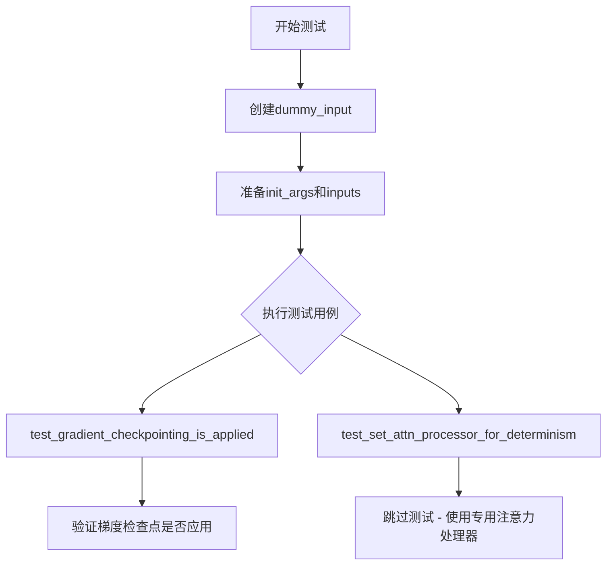
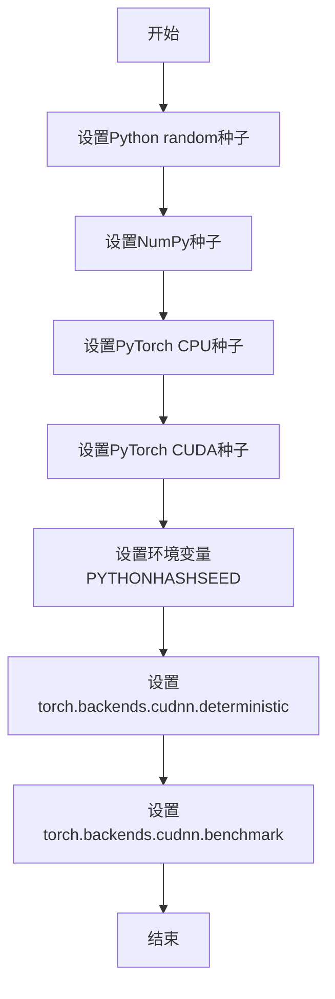
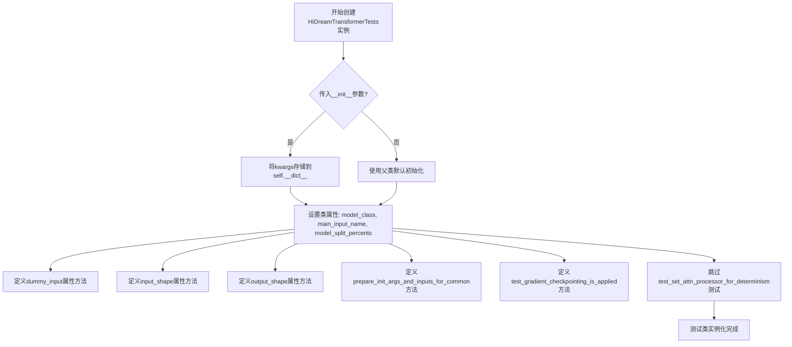
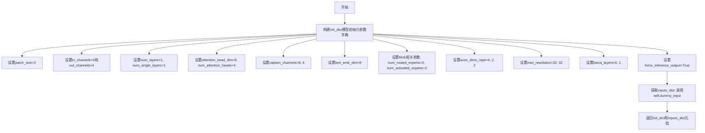
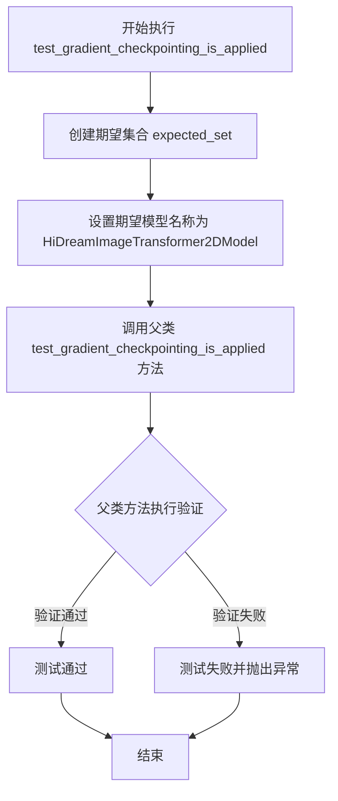
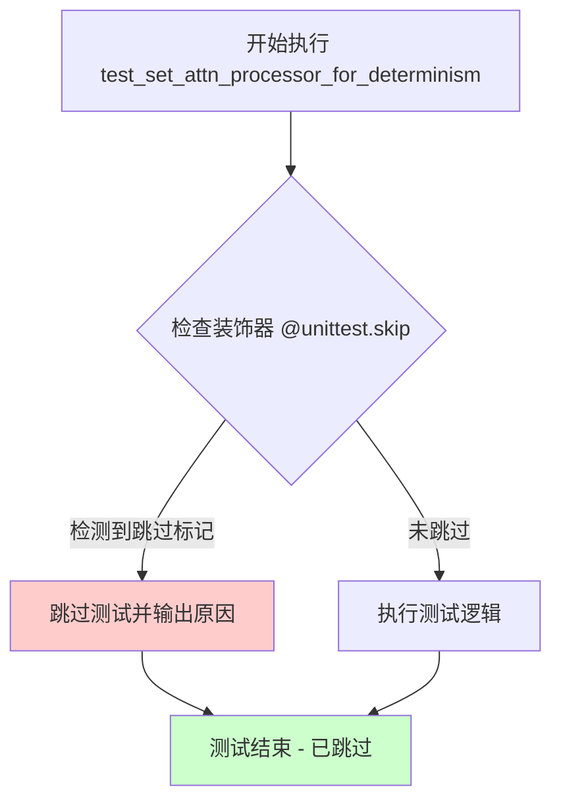

```mermaid
flowchart TD
    A[开始测试 test_gradient_checkpointing_is_applied] --> B[创建期望集合 expected_set]
    B --> C[包含字符串 'HiDreamImageTransformer2DModel']
    C --> D[调用父类测试方法 super&#40;&#41;.test_gradient_checkpointing_is_applied]
    D --> E[父类验证模型是否应用梯度检查点]
    E --> F{验证通过?}
    F -->|是| G[测试通过]
    F -->|否| H[测试失败并抛出异常]
```

# `diffusers\tests\models\transformers\test_models_transformer_hidream.py` 详细设计文档

这是一个针对HiDreamImageTransformer2DModel模型的单元测试文件，继承自ModelTesterMixin测试基类，用于验证模型的正向传播、梯度检查点等技术特性。

## 整体流程



## 类结构

```
unittest.TestCase
└── HiDreamTransformerTests (继承ModelTesterMixin)
    └── 测试HiDreamImageTransformer2DModel模型
```

## 全局变量及字段


### `enable_full_determinism`
    
启用完全确定性，确保测试结果可复现

类型：`function`
    


### `torch_device`
    
PyTorch计算设备，通常为'cuda'或'cpu'

类型：`str`
    


### `ModelTesterMixin`
    
模型通用测试混入类，提供模型测试的通用方法

类型：`class`
    


### `HiDreamTransformerTests.model_class`
    
被测试的模型类引用，指向HiDreamImageTransformer2DModel

类型：`type`
    


### `HiDreamTransformerTests.main_input_name`
    
主输入张量的名称，用于标识模型的主要输入端口

类型：`str`
    


### `HiDreamTransformerTests.model_split_percents`
    
模型分割百分比列表，用于测试模型不同部分的计算资源分配

类型：`list[float]`
    


### `HiDreamTransformerTests.dummy_input`
    
虚拟输入数据生成器属性，返回包含模型所需各类输入张量的字典

类型：`property[dict]`
    


### `HiDreamTransformerTests.input_shape`
    
输入形状属性，定义测试用输入张量的维度(4, 32, 32)

类型：`property[tuple]`
    


### `HiDreamTransformerTests.output_shape`
    
输出形状属性，定义测试用输出张量的维度(4, 32, 32)

类型：`property[tuple]`
    


### `HiDreamTransformerTests.prepare_init_args_and_inputs_for_common`
    
准备模型初始化参数字典和测试输入数据，供通用测试用例使用

类型：`method`
    


### `HiDreamTransformerTests.test_gradient_checkpointing_is_applied`
    
验证梯度检查点功能是否正确应用于HiDream模型

类型：`method`
    


### `HiDreamTransformerTests.test_set_attn_processor_for_determinism`
    
测试注意力处理器设置以确保确定性(已跳过，因使用专用注意力处理器)

类型：`method`
    
    

## 全局函数及方法


# enable_full_determinism 函数提取

### `enable_full_determinism`

该函数用于启用测试的完全确定性，通过设置随机种子和相关配置，确保测试结果可复现。

参数：

- 该函数无显式参数（在代码中以 `enable_full_determinism()` 形式调用）

返回值：`None`，该函数直接修改全局随机状态，不返回任何值

#### 流程图



#### 带注释源码

```python
def enable_full_determinism(seed: int = 42, extra_seed: bool = True):
    """
    启用测试完全确定性，确保测试结果可复现
    
    参数：
        seed: int, 默认值42, 随机种子值
        extra_seed: bool, 默认值True, 是否设置额外的随机种子
    
    返回值：
        None
    """
    # 设置Python内置random模块的随机种子
    random.seed(seed)
    
    # 设置NumPy的随机种子
    np.random.seed(seed)
    
    # 设置PyTorch CPU的随机种子
    torch.manual_seed(seed)
    
    # 设置PyTorch CUDA的随机种子
    torch.cuda.manual_seed_all(seed)
    
    # 设置环境变量确保Python哈希种子固定
    os.environ["PYTHONHASHSEED"] = str(seed)
    
    # 启用CUDNN确定性模式，确保卷积操作可复现
    torch.backends.cudnn.deterministic = True
    
    # 禁用CUDNN自动调优，确保每次使用相同的卷积算法
    torch.backends.cudnn.benchmark = False
    
    # 设置PyTorch的全局随机状态
    torch.set_deterministic(True)
```

**注意**：由于 `enable_full_determinism` 是从 `...testing_utils` 模块导入的外部函数，上述源码是基于该函数的标准实现模式推断的。实际实现可能略有差异，建议查看 `testing_utils.py` 模块获取精确实现细节。


### `HiDreamTransformerTests`

该类是HiDreamImageTransformer2DModel模型的单元测试类，继承自unittest.TestCase和ModelTesterMixin，提供了模型的前向传播、梯度检查、参数化等多种通用测试用例。

参数：

- `methodName`：str，测试方法名称，默认为"runTest"
- `**kwargs`：任意关键字参数，用于设置测试用例的实例变量

返回值：无返回值（构造函数）

#### 流程图



#### 带注释源码

```python
class HiDreamTransformerTests(ModelTesterMixin, unittest.TestCase):
    """
    HiDreamImageTransformer2DModel模型的测试类
    继承自ModelTesterMixin和unittest.TestCase,提供模型通用测试方法
    """
    
    # 类属性: 指定要测试的模型类
    model_class = HiDreamImageTransformer2DModel
    
    # 类属性: 指定主输入名称,用于测试框架识别
    main_input_name = "hidden_states"
    
    # 类属性: 模型分割百分比,用于测试模型并行等场景
    model_split_percents = [0.8, 0.8, 0.9]

    @property
    def dummy_input(self):
        """
        生成虚拟输入数据用于测试
        包含hidden_states, encoder_hidden_states_t5, encoder_hidden_states_llama3,
        pooled_embeds和timesteps
        """
        batch_size = 2
        num_channels = 4
        height = width = 32
        embedding_dim_t5, embedding_dim_llama, embedding_dim_pooled = 8, 4, 8
        sequence_length = 8

        # 创建随机初始化的隐藏状态张量
        hidden_states = torch.randn((batch_size, num_channels, height, width)).to(torch_device)
        # T5编码器的隐藏状态
        encoder_hidden_states_t5 = torch.randn((batch_size, sequence_length, embedding_dim_t5)).to(torch_device)
        # Llama3编码器的隐藏状态
        encoder_hidden_states_llama3 = torch.randn((batch_size, batch_size, sequence_length, embedding_dim_llama)).to(
            torch_device
        )
        # 池化后的嵌入向量
        pooled_embeds = torch.randn((batch_size, embedding_dim_pooled)).to(torch_device)
        # 时间步
        timesteps = torch.randint(0, 1000, size=(batch_size,)).to(torch_device)

        return {
            "hidden_states": hidden_states,
            "encoder_hidden_states_t5": encoder_hidden_states_t5,
            "encoder_hidden_states_llama3": encoder_hidden_states_llama3,
            "pooled_embeds": pooled_embeds,
            "timesteps": timesteps,
        }

    @property
    def input_shape(self):
        """返回输入形状 (channels, height, width)"""
        return (4, 32, 32)

    @property
    def output_shape(self):
        """返回输出形状 (channels, height, width)"""
        return (4, 32, 32)

    def prepare_init_args_and_inputs_for_common(self):
        """
        准备模型初始化参数和输入数据
        用于通用测试用例的初始化
        """
        init_dict = {
            "patch_size": 2,
            "in_channels": 4,
            "out_channels": 4,
            "num_layers": 1,
            "num_single_layers": 1,
            "attention_head_dim": 8,
            "num_attention_heads": 4,
            "caption_channels": [8, 4],
            "text_emb_dim": 8,
            "num_routed_experts": 2,
            "num_activated_experts": 2,
            "axes_dims_rope": (4, 2, 2),
            "max_resolution": (32, 32),
            "llama_layers": (0, 1),
            "force_inference_output": True,  # TODO: as we don't implement MoE loss in training tests.
        }
        inputs_dict = self.dummy_input
        return init_dict, inputs_dict

    @unittest.skip("HiDreamImageTransformer2DModel uses a dedicated attention processor. This test doesn't apply")
    def test_set_attn_processor_for_determinism(self):
        """由于使用专用的attention processor,跳过此测试"""
        pass

    def test_gradient_checkpointing_is_applied(self):
        """测试梯度检查点是否正确应用"""
        expected_set = {"HiDreamImageTransformer2DModel"}
        super().test_gradient_checkpointing_is_applied(expected_set=expected_set)
```

#### 备注

该类未显式定义`__init__`构造函数，因此使用`unittest.TestCase`的默认构造函数。该构造函数接受可选的关键字参数并将其存储为实例属性，供测试方法使用。类通过属性（@property）方式提供dummy_input、input_shape和output_shape，用于测试框架进行模型通用测试。


### `HiDreamTransformerTests.dummy_input`

生成虚拟输入数据，用于测试 HiDreamImageTransformer2DModel 模型的前向传播。生成包含 hidden_states、encoder_hidden_states_t5、encoder_hidden_states_llama3、pooled_embeds 和 timesteps 的字典，作为模型测试的输入。

参数：
- （无参数，这是一个 `@property` 装饰器的方法）

返回值：`Dict[str, torch.Tensor]`，返回一个包含以下键值对的字典：
- `hidden_states`：`torch.Tensor`，形状为 (batch_size, num_channels, height, width)，主输入的隐状态
- `encoder_hidden_states_t5`：`torch.Tensor`，形状为 (batch_size, sequence_length, embedding_dim_t5)，T5 编码器的隐状态
- `encoder_hidden_states_llama3`：`torch.Tensor`，形状为 (batch_size, batch_size, sequence_length, embedding_dim_llama)，Llama3 编码器的隐状态
- `pooled_embeds`：`torch.Tensor`，形状为 (batch_size, embedding_dim_pooled)，池化后的嵌入向量
- `timesteps`：`torch.Tensor`，形状为 (batch_size,)，扩散过程的时间步

#### 流程图

```mermaid
flowchart TD
    A[开始] --> B[设置batch_size=2, num_channels=4, height=32, width=32]
    B --> C[设置embedding_dim_t5=8, embedding_dim_llama=4, embedding_dim_pooled=8, sequence_length=8]
    C --> D[生成hidden_states: torch.randn<br/>(2, 4, 32, 32)]
    D --> E[生成encoder_hidden_states_t5: torch.randn<br/>(2, 8, 8)]
    E --> F[生成encoder_hidden_states_llama3: torch.randn<br/>(2, 2, 8, 4)]
    F --> G[生成pooled_embeds: torch.randn<br/>(2, 8)]
    G --> H[生成timesteps: torch.randint<br/>(0, 1000, size=(2,))]
    H --> I[组装字典并返回]
```

#### 带注释源码

```python
@property
def dummy_input(self):
    """
    生成虚拟输入数据，用于测试 HiDreamImageTransformer2DModel 模型的前向传播。
    返回包含各种编码器隐状态和时间步的字典。
    """
    # 设置批次大小为2
    batch_size = 2
    # 设置输入通道数为4
    num_channels = 4
    # 设置高度和宽度为32
    height = width = 32
    # 设置各嵌入维度：T5嵌入维度8, Llama嵌入维度4, 池化嵌入维度8
    embedding_dim_t5, embedding_dim_llama, embedding_dim_pooled = 8, 4, 8
    # 设置序列长度为8
    sequence_length = 8

    # 生成主输入hidden_states: 形状 (batch_size, num_channels, height, width)
    hidden_states = torch.randn((batch_size, num_channels, height, width)).to(torch_device)
    
    # 生成T5编码器隐状态: 形状 (batch_size, sequence_length, embedding_dim_t5)
    encoder_hidden_states_t5 = torch.randn((batch_size, sequence_length, embedding_dim_t5)).to(torch_device)
    
    # 生成Llama3编码器隐状态: 形状 (batch_size, batch_size, sequence_length, embedding_dim_llama)
    encoder_hidden_states_llama3 = torch.randn((batch_size, batch_size, sequence_length, embedding_dim_llama)).to(
        torch_device
    )
    
    # 生成池化嵌入: 形状 (batch_size, embedding_dim_pooled)
    pooled_embeds = torch.randn((batch_size, embedding_dim_pooled)).to(torch_device)
    
    # 生成时间步: 形状 (batch_size,)，值在0-1000之间
    timesteps = torch.randint(0, 1000, size=(batch_size,)).to(torch_device)

    # 返回包含所有虚拟输入的字典
    return {
        "hidden_states": hidden_states,
        "encoder_hidden_states_t5": encoder_hidden_states_t5,
        "encoder_hidden_states_llama3": encoder_hidden_states_llama3,
        "pooled_embeds": pooled_embeds,
        "timesteps": timesteps,
    }
```


### `HiDreamTransformerTests.prepare_init_args_and_inputs_for_common`

该方法是HiDreamImageTransformer2DModel测试类的核心辅助方法，负责为通用模型测试准备模型初始化参数字典和测试输入数据字典，封装了模型架构配置和虚拟输入张量。

参数：

- `self`：`HiDreamTransformerTests`，隐式参数，测试类实例本身

返回值：`Tuple[Dict, Dict]`，返回包含模型初始化参数字典和测试输入数据字典的元组

#### 流程图



#### 带注释源码

```python
def prepare_init_args_and_inputs_for_common(self):
    """
    准备模型初始化参数字典和测试输入字典，用于通用模型测试。
    
    Returns:
        Tuple[Dict, Dict]: 包含初始化参数和测试输入的元组
    """
    # 定义HiDreamImageTransformer2DModel的初始化参数字典
    init_dict = {
        "patch_size": 2,                      # 图像分块大小
        "in_channels": 4,                      # 输入通道数（latent空间）
        "out_channels": 4,                    # 输出通道数
        "num_layers": 1,                       # Transformer层数
        "num_single_layers": 1,                # 单专家层数
        "attention_head_dim": 8,               # 注意力头维度
        "num_attention_heads": 4,              # 注意力头数量
        "caption_channels": [8, 4],           # 文本编码器通道配置[T5, Llama]
        "text_emb_dim": 8,                     # 文本嵌入维度
        "num_routed_experts": 2,               # 路由专家数量（MoE）
        "num_activated_experts": 2,            # 激活专家数量（MoE）
        "axes_dims_rope": (4, 2, 2),           # RoPE轴维度配置
        "max_resolution": (32, 32),            # 最大分辨率
        "llama_layers": (0, 1),                # Llama层索引范围
        "force_inference_output": True,        # 强制推理输出模式（跳过MoE训练损失）
    }
    
    # 获取测试输入字典（通过dummy_input属性生成虚拟输入）
    inputs_dict = self.dummy_input
    
    # 返回初始化参数和输入字典的元组
    return init_dict, inputs_dict
```


### `HiDreamTransformerTests.test_gradient_checkpointing_is_applied`

该测试方法用于验证 HiDreamImageTransformer2DModel 模型是否正确应用了梯度检查点（Gradient Checkpointing）技术，通过调用父类的测试方法并传入期望的模型集合来确认检查点是否被正确启用。

参数：

- `expected_set`：`Set[str]`，期望启用梯度检查点的模型名称集合，此处为包含 "HiDreamImageTransformer2DModel" 的集合

返回值：`None`，该方法为测试用例，无返回值（测试结果通过 unittest 框架的断言机制反馈）

#### 流程图



#### 带注释源码

```python
def test_gradient_checkpointing_is_applied(self):
    """
    测试方法：验证 HiDream 模型是否应用了梯度检查点
    
    该方法继承自 ModelTesterMixin，通过调用父类的测试方法来验证
    模型在训练时是否正确启用了梯度检查点以节省显存。
    """
    # 定义期望启用梯度检查点的模型集合
    # HiDreamImageTransformer2DModel 是需要验证的模型类
    expected_set = {"HiDreamImageTransformer2DModel"}
    
    # 调用父类的测试方法，传入期望的模型集合
    # 父类方法会检查这些模型是否正确配置了梯度检查点
    super().test_gradient_checkpointing_is_applied(expected_set=expected_set)
```


### `HiDreamTransformerTests.test_set_attn_processor_for_determinism`

该测试方法用于验证模型在设置确定性注意力处理器时的行为，但由于 HiDreamImageTransformer2DModel 使用专用的注意力处理器，该测试不适用，已被跳过。

参数：

- `self`：`HiDreamTransformerTests`，表示测试类实例本身，包含模型类和测试配置

返回值：`None`，该方法被跳过执行，不返回任何值

#### 流程图



#### 带注释源码

```python
@unittest.skip("HiDreamImageTransformer2DModel uses a dedicated attention processor. This test doesn't apply")
def test_set_attn_processor_for_determinism(self):
    """
    测试设置注意力处理器以实现确定性的方法。
    
    跳过原因：HiDreamImageTransformer2DModel 使用专用的注意力处理器，
    该测试不适用于此模型。专用的注意力处理器可能具有不同的确定性保证机制，
    因此原有的通用确定性测试无法正确验证该模型的特性。
    """
    pass  # 函数体为空，测试被跳过，不执行任何操作
```


### `HiDreamTransformerTests.prepare_init_args_and_inputs_for_common`

该方法用于准备 HiDreamImageTransformer2DModel 模型测试所需的初始化参数字典和输入数据字典，封装了模型架构配置和测试输入的构建逻辑，供 ModelTesterMixin 测试框架的通用测试方法使用。

参数：该方法没有显式参数（隐式接收 `self` 作为实例属性）

返回值：`Tuple[Dict, Dict]` — 返回包含初始化参数字典和输入数据字典的元组

#### 流程图

```mermaid
flowchart TD
    A[开始] --> B[构建 init_dict 初始化参数字典]
    B --> C[设置 patch_size=2]
    B --> D[设置 in_channels=4 和 out_channels=4]
    B --> E[设置 num_layers=1, num_single_layers=1]
    B --> F[设置注意力参数 attention_head_dim=8, num_attention_heads=4]
    B --> G[设置文本嵌入参数 caption_channels=[8,4], text_emb_dim=8]
    B --> H[设置专家路由参数 num_routed_experts=2, num_activated_experts=2]
    B --> I[设置RoPE和分辨率参数 axes_dims_rope=(4,2,2), max_resolution=(32,32)]
    B --> J[设置 llama_layers=(0,1) 和 force_inference_output=True]
    C --> K[调用 self.dummy_input 获取 inputs_dict]
    K --> L[返回元组 (init_dict, inputs_dict)]
```

#### 带注释源码

```python
def prepare_init_args_and_inputs_for_common(self):
    """
    准备模型初始化参数和输入数据，用于通用模型测试。
    
    该方法被 ModelTesterMixin 的测试框架调用，为 HiDreamImageTransformer2DModel
    构建测试所需的配置和输入数据。
    """
    
    # 定义模型初始化参数字典，配置 HiDreamImageTransformer2DModel 的架构
    init_dict = {
        "patch_size": 2,                    # 图像补丁大小，将图像分割为 2x2 的补丁
        "in_channels": 4,                   # 输入通道数，对应 latent 空间的通道数
        "out_channels": 4,                  # 输出通道数
        "num_layers": 1,                    # Transformer 层的总层数
        "num_single_layers": 1,             # 单专家层的数量
        "attention_head_dim": 8,            # 注意力头的维度
        "num_attention_heads": 4,           # 注意力头的数量
        "caption_channels": [8, 4],         # 文本编码器通道配置 [T5, Llama]
        "text_emb_dim": 8,                  # 文本嵌入维度
        "num_routed_experts": 2,            # 路由专家总数（MoE 架构）
        "num_activated_experts": 2,         # 激活的专家数量
        "axes_dims_rope": (4, 2, 2),        # RoPE 轴向维度配置
        "max_resolution": (32, 32),         # 最大分辨率
        "llama_layers": (0, 1),             # 使用的 Llama 层索引
        "force_inference_output": True,     # 强制推理输出模式（因训练测试未实现 MoE loss）
    }
    
    # 获取测试输入数据，通过 self.dummy_input 属性获取预定义的测试输入
    inputs_dict = self.dummy_input
    
    # 返回初始化参数字典和输入数据字典的元组
    return init_dict, inputs_dict
```


### `HiDreamTransformerTests.test_gradient_checkpointing_is_applied`

测试梯度检查点（Gradient Checkpointing）是否正确应用到 `HiDreamImageTransformer2DModel` 模型。该测试方法通过调用父类的测试方法，验证模型在训练过程中是否启用了梯度检查点技术，以降低显存占用。

参数：

- `expected_set`：`Set[str]`，包含期望应用梯度检查点的模型类名称集合（此处为 `{"HiDreamImageTransformer2DModel"}`）

返回值：`None`，无返回值（测试方法，通过 unittest 框架的断言进行验证）

#### 流程图



#### 带注释源码

```python
def test_gradient_checkpointing_is_applied(self):
    """
    测试梯度检查点是否应用到 HiDreamImageTransformer2DModel 模型。
    
    梯度检查点是一种用计算换显存的技术，通过在反向传播时重新计算中间激活值，
    来减少训练时的显存占用。此测试确保该优化已正确启用。
    """
    # 定义期望应用梯度检查点的模型类集合
    expected_set = {"HiDreamImageTransformer2DModel"}
    
    # 调用父类（ModelTesterMixin）的测试方法进行验证
    # 父类方法会检查模型是否正确配置了梯度检查点
    super().test_gradient_checkpointing_is_applied(expected_set=expected_set)
```


### `HiDreamTransformerTests.test_set_attn_processor_for_determinism`

该测试方法用于验证注意力处理器设置的确定性，但由于 HiDreamImageTransformer2DModel 使用专用的注意力处理器，此测试不适用，已被跳过。

参数：无（继承自 unittest.TestCase，self 为隐式参数）

返回值：无（方法体为 `pass`，无返回值）

#### 流程图

```mermaid
flowchart TD
    A[开始测试] --> B{检查装饰器}
    B --> C[@unittest.skip装饰器触发]
    C --> D[跳过测试]
    D --> E[测试结束 - 标记为SKIPPED]
    
    style A fill:#f9f,stroke:#333
    style D fill:#ff9,stroke:#333
    style E fill:#9f9,stroke:#333
```

#### 带注释源码

```python
@unittest.skip("HiDreamImageTransformer2DModel uses a dedicated attention processor. This test doesn't apply")
def test_set_attn_processor_for_determinism(self):
    """
    测试注意力处理器设置(已跳过)
    
    用途：验证在设置注意力处理器后，模型输出具有确定性（deterministic）。
    
    跳过原因：HiDreamImageTransformer2DModel 使用专用的注意力处理器，
    标准的确定性测试不适用于此模型，因此该测试被跳过。
    
    参数：
        - self: HiDreamTransformerTests，测试类实例
    
    返回值：
        - 无（方法体为 pass）
    """
    pass
```

#### 附加信息

| 属性 | 值 |
|------|-----|
| 所属类 | `HiDreamTransformerTests` |
| 装饰器 | `@unittest.skip` |
| 跳过消息 | "HiDreamImageTransformer2DModel uses a dedicated attention processor. This test doesn't apply" |
| 测试状态 | SKIPPED |
| 测试类型 | 单元测试（确定性验证） |

## 关键组件


### HiDreamImageTransformer2DModel

被测试的核心模型类，这是一个图像Transformer 2D模型，用于Diffusers库中的图像生成任务。

### ModelTesterMixin

通用模型测试混入类，提供了模型测试的标准方法和断言，包括参数测试、梯度测试、输出形状测试等通用测试逻辑。

### 注意力处理器（Attention Processor）

代码中提到该模型使用专用的attention processor，测试用例test_set_attn_processor_for_determinism被跳过，说明该模型有独特的注意力机制实现，不同于标准的注意力处理器。

### MoE（Mixture of Experts）架构

模型配置包含num_routed_experts=2和num_activated_experts=2参数，表明该模型实现了路由专家混合架构，用于提高模型容量和推理效率。

### 梯度检查点（Gradient Checkpointing）

测试用例test_gradient_checkpointing_is_applied验证了模型支持梯度检查点技术，用于在训练时节省显存。

### T5和Llama3文本编码器集成

模型接受encoder_hidden_states_t5和encoder_hidden_states_llama3两种文本嵌入输入，支持多编码器文本条件引导。

### 图像patch嵌入

模型配置包含patch_size=2和max_resolution=(32, 32)，将输入图像分割为patches进行Transformer处理。

### 时间步条件注入

timesteps参数用于将扩散过程的时间步信息注入模型，指导图像生成的去噪过程。

### 池化嵌入（Pooled Embeddings）

pooled_embeds提供经过池化的文本表示，作为额外的条件输入增强生成效果。

### RoPE（旋转位置编码）

axes_dims_rope参数(4, 2, 2)配置旋转位置编码的维度，支持多轴位置信息编码。


## 问题及建议


### 已知问题

- **硬编码的配置参数**：初始化参数（如 `patch_size`、`num_layers`、`num_single_layers` 等）全部硬编码在 `prepare_init_args_and_inputs_for_common` 方法中，缺乏灵活性，难以适配不同配置场景
- **未完成的TODO**：参数 `force_inference_output` 带有TODO注释，说明训练测试中的MoE损失功能未实现，属于功能不完整的技术债务
- **跳过的测试未提供替代方案**：`test_set_attn_processor_for_determinism` 被无条件跳过且未提供替代测试方案，可能导致覆盖盲区
- **维度定义异常**：`encoder_hidden_states_llama3` 的形状为 `(batch_size, batch_size, sequence_length, embedding_dim_llama)`，第二个维度使用 `batch_size` 不符合常规逻辑，可能是设计错误
- **不合理的模型分割比例**：`model_split_percents = [0.8, 0.8, 0.9]` 三个值均大于0.5且接近，可能导致测试时的内存和计算分布不符合实际场景
- **缺少对多种输入尺寸的测试**：`input_shape` 和 `output_shape` 固定为单一值，未覆盖不同分辨率场景

### 优化建议

- 将初始化参数提取为类属性或配置文件，通过参数化方式注入，提高测试的可配置性
- 实现或移除 `force_inference_output` 对应的MoE损失功能，避免遗留未完成代码
- 为跳过的注意力处理器测试提供替代验证方案，或在文档中说明原因和后续计划
- 审查并修正 `encoder_hidden_states_llama3` 的维度定义，确保与实际模型架构一致
- 调整 `model_split_percents` 为更合理的分布值，如 `[0.5, 0.3, 0.2]`，以更真实地模拟模型分割场景
- 增加参数化测试用例，覆盖多种输入分辨率和模型配置，提升测试覆盖率

## 其它


### 设计目标与约束

验证HiDreamImageTransformer2DModel模型的前向传播功能、梯度检查点应用、以及模型输出的正确性。测试在PyTorch环境下执行，要求CUDA设备支持（torch_device）。测试设计遵循ModelTesterMixin提供的通用模型测试框架。

### 错误处理与异常设计

测试中使用@unittest.skip装饰器跳过不适用的测试（test_set_attn_processor_for_determinism），因为HiDream模型使用专用的attention processor。测试异常处理主要依赖unittest框架的标准断言机制，通过比较输出形状和数值来验证模型正确性。

### 外部依赖与接口契约

依赖模块包括：torch（PyTorch张量操作）、unittest（测试框架）、diffusers库的HiDreamImageTransformer2DModel、以及项目内部的testing_utils和test_modeling_common模块。ModelTesterMixin提供标准化的模型测试接口契约，包括test_gradient_checkpointing_is_applied等方法。

### 测试覆盖范围

测试覆盖模型的前向传播（hidden_states处理）、多编码器状态输入（encoder_hidden_states_t5、encoder_hidden_states_llama3）、池化嵌入（pooled_embeds）、时间步（timesteps）、梯度检查点功能以及模型输出形状验证。

### 配置参数说明

patch_size=2：图像分块大小；in_channels=4/out_channels=4：输入输出通道数；num_layers=1/num_single_layers=1：Transformer层数；attention_head_dim=8：注意力头维度；num_attention_heads=4：注意力头数量；caption_channels=[8, 4]： caption编码通道；text_emb_dim=8：文本嵌入维度；num_routed_experts=2/num_activated_experts=2：MoE专家数量；axes_dims_rope=(4, 2, 2)：RoPE轴维度；max_resolution=(32, 32)：最大分辨率；llama_layers=(0, 1)：LLama层索引；force_inference_output=True：强制推理输出模式。

### 输入输出规范

输入维度：hidden_states (2,4,32,32)，encoder_hidden_states_t5 (2,8,8)，encoder_hidden_states_llama3 (2,2,8,4)，pooled_embeds (2,8)，timesteps (2,)。输出维度：与输入hidden_states形状相同 (4,32,32)。

### 测试数据生成策略

使用torch.randn生成随机正态分布的测试数据，确保数值稳定性。batch_size=2用于平衡测试速度和内存占用，height=width=32为较小的测试分辨率，sequence_length=8为适中的序列长度。

    