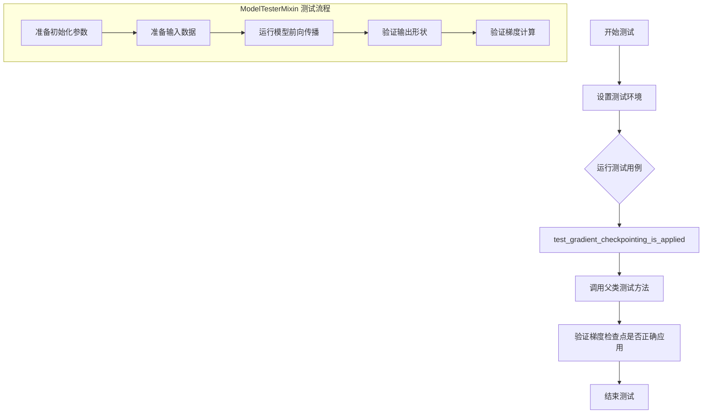
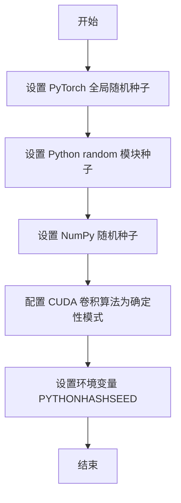
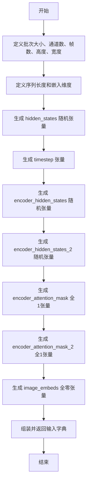
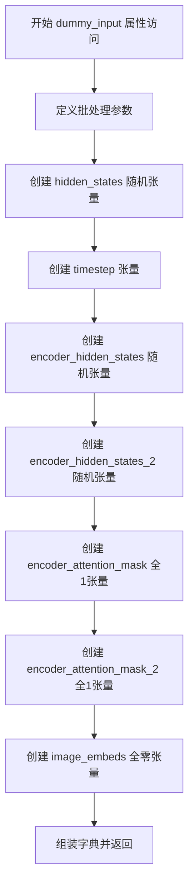
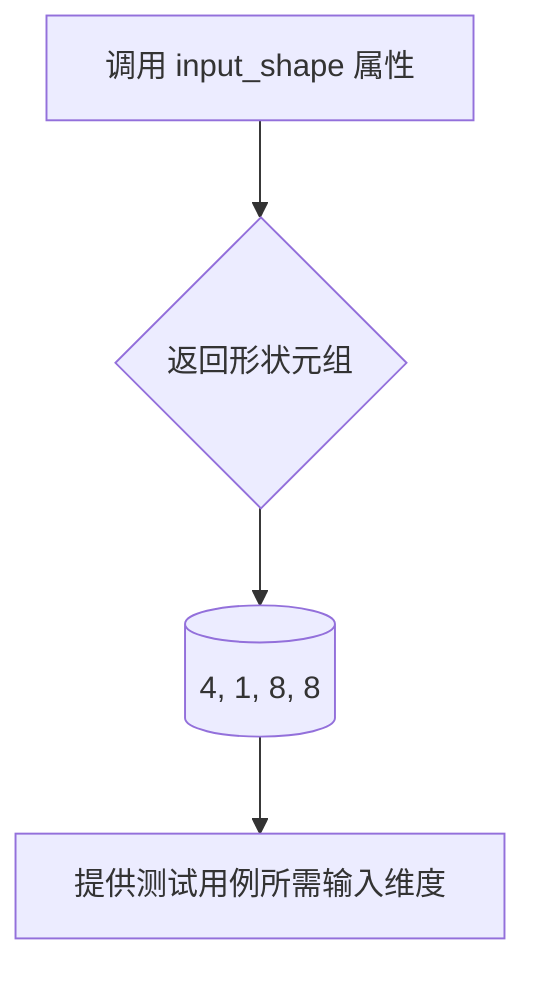
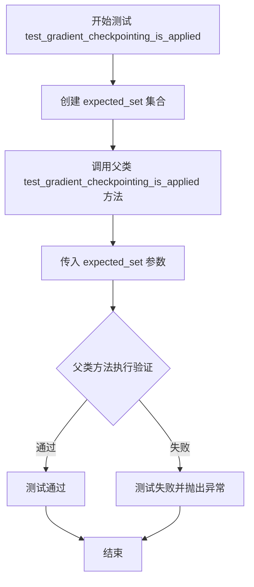

# `diffusers\tests\models\transformers\test_models_transformer_hunyuan_1_5.py` 详细设计文档

这是一个针对 HunyuanVideo15Transformer3DModel 模型的单元测试文件，通过继承 ModelTesterMixin 提供了对3D变换器模型的全面测试，包括梯度检查点、模型初始化、输入输出形状验证等功能。

## 整体流程



## 类结构

```
unittest.TestCase (基类)
├── ModelTesterMixin (混合类)
│   └── HunyuanVideo15Transformer3DTests (被测类)
        │
        └── 依赖: HunyuanVideo15Transformer3DModel (diffusers库)
```

## 全局变量及字段


### `unittest`
    
Python标准库单元测试框架

类型：`module`
    


### `torch`
    
PyTorch深度学习库

类型：`module`
    


### `HunyuanVideo15Transformer3DModel`
    
待测试的3D变换器模型类

类型：`class`
    


### `enable_full_determinism`
    
启用完全确定性测试的函数

类型：`function`
    


### `torch_device`
    
测试设备标识符(cpu或cuda)

类型：`str`
    


### `ModelTesterMixin`
    
模型测试混合基类提供通用测试方法

类型：`class`
    


### `HunyuanVideo15Transformer3DTests.model_class`
    
被测试的模型类HunyuanVideo15Transformer3DModel

类型：`type`
    


### `HunyuanVideo15Transformer3DTests.main_input_name`
    
主输入张量名称(hidden_states)

类型：`str`
    


### `HunyuanVideo15Transformer3DTests.uses_custom_attn_processor`
    
标识是否使用自定义注意力处理器

类型：`bool`
    


### `HunyuanVideo15Transformer3DTests.model_split_percents`
    
模型分割百分比用于测试模型并行[0.99, 0.99, 0.99]

类型：`list`
    


### `HunyuanVideo15Transformer3DTests.text_embed_dim`
    
文本嵌入维度配置值16

类型：`int`
    


### `HunyuanVideo15Transformer3DTests.text_embed_2_dim`
    
第二文本嵌入维度配置值8

类型：`int`
    


### `HunyuanVideo15Transformer3DTests.image_embed_dim`
    
图像嵌入维度配置值12

类型：`int`
    
    

## 全局函数及方法


### `enable_full_determinism`

设置随机种子以确保测试过程的可重复性和确定性，通过配置 PyTorch 和相关库的随机种子，消除测试中的非确定性因素。

参数：
- 无参数

返回值：`None`，该函数不返回任何值，仅执行副作用操作。

#### 流程图



#### 带注释源码

```
# 导入测试工具模块中的 enable_full_determinism 函数
# 该函数来自 diffusers 库的 testing_utils 模块
from ...testing_utils import enable_full_determinism, torch_device

# 在模块加载时调用，确保后续所有随机操作可重现
# 这对于单元测试至关重要，可以消除由于随机性导致的测试 flaky 问题
enable_full_determinism()
```

---

## 补充说明

### 设计目标与约束
- **目标**：确保测试结果的可重复性，消除由于随机初始化、CUDA 非确定性算法等导致的测试结果波动
- **约束**：可能牺牲部分性能以换取确定性执行

### 潜在的技术债务或优化空间
1. **性能开销**：确定性模式可能显著降低训练/推理速度
2. **平台差异**：不同硬件（CPU/GPU）可能需要不同的确定性配置
3. **依赖隐式**：该函数的影响范围可能不清晰，建议在文档中明确列出所有受影响的模块

### 错误处理与异常设计
- 如果某些随机种子设置失败（如特定 CUDA 版本不支持），应捕获异常并发出警告而非中断执行

### 外部依赖与接口契约
- 依赖 PyTorch、NumPy、Python random 等库的种子设置接口
- 不接受参数，通过修改全局状态生效
- 返回 `None`，调用方不应依赖其返回值


### `HunyuanVideo15Transformer3DTests.dummy_input`

该属性方法用于生成包含 hidden_states、timestep、encoder_hidden_states 等的测试输入字典，为模型前向传播测试提供所需的全部张量数据。

参数：

- （无显式参数，为 `@property` 装饰的属性方法）

返回值：`Dict[str, torch.Tensor]`，返回包含以下键值对的字典：
- `hidden_states`：输入潜在表示，形状 (batch_size, num_channels, num_frames, height, width)
- `timestep`：扩散时间步，形状 (batch_size,)
- `encoder_hidden_states`：第一组文本编码器隐藏状态，形状 (batch_size, sequence_length, text_embed_dim)
- `encoder_attention_mask`：第一组文本注意力掩码，形状 (batch_size, sequence_length)
- `encoder_hidden_states_2`：第二组文本编码器隐藏状态，形状 (batch_size, sequence_length_2, text_embed_2_dim)
- `encoder_attention_mask_2`：第二组文本注意力掩码，形状 (batch_size, sequence_length_2)
- `image_embeds`：图像嵌入向量，用于诱导 T2V（Text-to-Video）路径，形状 (batch_size, image_sequence_length, image_embed_dim)

#### 流程图



#### 带注释源码

```python
@property
def dummy_input(self):
    """生成测试用的虚拟输入数据字典"""
    
    # 定义基础维度参数
    batch_size = 1                    # 批次大小
    num_channels = 4                  # 输入通道数（对应潜在空间维度）
    num_frames = 1                    # 帧数（视频帧数）
    height = 8                        # 高度
    width = 8                         # 宽度
    sequence_length = 6               # 第一组文本序列长度
    sequence_length_2 = 4             # 第二组文本序列长度
    image_sequence_length = 3         # 图像序列长度

    # 生成 hidden_states：随机初始化的潜在表示
    # 形状: (batch_size, num_channels, num_frames, height, width)
    hidden_states = torch.randn((batch_size, num_channels, num_frames, height, width)).to(torch_device)
    
    # 生成 timestep：扩散过程的时间步
    # 形状: (batch_size,)，值为 1.0
    timestep = torch.tensor([1.0]).to(torch_device)
    
    # 生成 encoder_hidden_states：第一组文本嵌入向量
    # 形状: (batch_size, sequence_length, text_embed_dim)
    encoder_hidden_states = torch.randn((batch_size, sequence_length, self.text_embed_dim), device=torch_device)
    
    # 生成 encoder_hidden_states_2：第二组文本嵌入向量
    # 形状: (batch_size, sequence_length_2, text_embed_2_dim)
    encoder_hidden_states_2 = torch.randn(
        (batch_size, sequence_length_2, self.text_embed_2_dim), device=torch_device
    )
    
    # 生成 encoder_attention_mask：第一组文本的注意力掩码（全1表示不屏蔽）
    # 形状: (batch_size, sequence_length)
    encoder_attention_mask = torch.ones((batch_size, sequence_length), device=torch_device)
    
    # 生成 encoder_attention_mask_2：第二组文本的注意力掩码（全1表示不屏蔽）
    # 形状: (batch_size, sequence_length_2)
    encoder_attention_mask_2 = torch.ones((batch_size, sequence_length_2), device=torch_device)
    
    # 生成 image_embeds：图像嵌入向量
    # 全零张量，用于诱导模型走 T2V（Text-to-Video）路径
    # 形状: (batch_size, image_sequence_length, image_embed_dim)
    image_embeds = torch.zeros((batch_size, image_sequence_length, self.image_embed_dim), device=torch_device)

    # 组装并返回包含所有输入的字典
    return {
        "hidden_states": hidden_states,
        "timestep": timestep,
        "encoder_hidden_states": encoder_hidden_states,
        "encoder_attention_mask": encoder_attention_mask,
        "encoder_hidden_states_2": encoder_hidden_states_2,
        "encoder_attention_mask_2": encoder_attention_mask_2,
        "image_embeds": image_embeds,
    }
```


### `HunyuanVideo15Transformer3DTests.prepare_init_args_and_inputs_for_common`

该方法为HunyuanVideo15Transformer3D模型测试类准备初始化参数字典和输入字典，用于模型测试的通用初始化流程。它根据类属性构建模型配置参数，同时调用dummy_input属性生成测试所需的输入数据，最终返回两个字典供模型测试框架使用。

参数：
- 该方法无显式参数（隐式接收self参数）

返回值：
- `Tuple[Dict, Dict]`：返回包含两个字典的元组
  - 第一个字典 (`init_dict`)：模型初始化参数，包含in_channels、out_channels、num_attention_heads等配置
  - 第二个字典 (`inputs_dict`)：模型输入数据，包含hidden_states、timestep、encoder_hidden_states等输入张量

#### 流程图

```mermaid
flowchart TD
    A[开始 prepare_init_args_and_inputs_for_common] --> B[构建 init_dict 初始化参数字典]
    B --> C{设置模型配置参数}
    C --> D["in_channels = 4"]
    C --> E["out_channels = 4"]
    C --> F["num_attention_heads = 2"]
    C --> G["attention_head_dim = 8"]
    C --> H["num_layers = 2"]
    C --> I["num_refiner_layers = 1"]
    C --> J["mlp_ratio = 2.0"]
    C --> K["patch_size = 1"]
    C --> L["patch_size_t = 1"]
    C --> M["text_embed_dim = self.text_embed_dim"]
    C --> N["text_embed_2_dim = self.text_embed_2_dim"]
    C --> O["image_embed_dim = self.image_embed_dim"]
    C --> P["rope_axes_dim = (2, 2, 4)"]
    C --> Q["target_size = 16"]
    C --> R["task_type = 't2v'"]
    
    R --> S[获取 self.dummy_input]
    S --> T[构建 inputs_dict 输入字典]
    T --> U[返回 Tuple[init_dict, inputs_dict]]
    U --> V[结束]
```

#### 带注释源码

```python
def prepare_init_args_and_inputs_for_common(self):
    """
    准备模型初始化参数和输入字典，用于通用测试场景。
    
    该方法为HunyuanVideo15Transformer3DModel测试类提供必要的配置参数，
    使测试框架能够正确实例化模型并执行前向传播测试。
    
    Returns:
        Tuple[Dict, Dict]: 包含两个字典的元组
            - init_dict: 模型构造函数所需的参数字典
            - inputs_dict: 模型前向传播所需的输入数据字典
    """
    
    # 构建模型初始化参数字典
    # 包含模型架构配置：通道数、注意力头数、层数、MLP比例、patch配置等
    init_dict = {
        "in_channels": 4,              # 输入通道数（4D输入：channels x frames x height x width）
        "out_channels": 4,             # 输出通道数
        "num_attention_heads": 2,      # 注意力头数量
        "attention_head_dim": 8,       # 每个注意力头的维度
        "num_layers": 2,               # 变换器层数
        "num_refiner_layers": 1,       # Refiner层数量（用于细化输出）
        "mlp_ratio": 2.0,              # MLP隐藏层维度与输入维度的比例
        "patch_size": 1,               # 空间维度patch大小
        "patch_size_t": 1,             # 时间维度patch大小
        "text_embed_dim": self.text_embed_dim,       # 文本嵌入维度（类属性：16）
        "text_embed_2_dim": self.text_embed_2_dim,    # 第二文本嵌入维度（类属性：8）
        "image_embed_dim": self.image_embed_dim,      # 图像嵌入维度（类属性：12）
        "rope_axes_dim": (2, 2, 4),    # 旋转位置编码（RoPE）的轴维度配置
        "target_size": 16,             # 目标输出尺寸
        "task_type": "t2v",            # 任务类型：text-to-video（文生视频）
    }
    
    # 从类属性dummy_input获取模型输入数据
    # 包含：hidden_states（隐藏状态）、timestep（时间步）、encoder_hidden_states（编码器隐藏状态）等
    inputs_dict = self.dummy_input
    
    # 返回初始化参数字典和输入字典的元组
    return init_dict, inputs_dict
```


### `HunyuanVideo15Transformer3DTests.dummy_input`

该属性方法用于生成测试 `HunyuanVideo15Transformer3DModel` 模型所需的虚拟输入数据，构造包含隐藏状态、时间步、文本嵌入和图像嵌入等8个张量的字典，模拟真实的推理输入场景。

参数：

- `self`：`HunyuanVideo15Transformer3DTests`，隐式参数，测试类实例本身

返回值：`Dict[str, torch.Tensor]`，返回包含8个键值对的字典，键为字符串类型，值为 PyTorch 张量，具体包括：

- `hidden_states`：`torch.Tensor`，形状为 (batch_size, num_channels, num_frames, height, width) 的随机噪声张量，作为模型的主要输入
- `timestep`：`torch.Tensor`，形状为 (batch_size,) 的时间步张量，用于扩散过程
- `encoder_hidden_states`：`torch.Tensor`，形状为 (batch_size, sequence_length, text_embed_dim) 的文本嵌入序列
- `encoder_attention_mask`：`torch.Tensor`，形状为 (batch_size, sequence_length) 的注意力掩码，全1表示不屏蔽
- `encoder_hidden_states_2`：`torch.Tensor`，形状为 (batch_size, sequence_length_2, text_embed_2_dim) 的第二文本嵌入序列
- `encoder_attention_mask_2`：`torch.Tensor`，形状为 (batch_size, sequence_length_2) 的第二注意力掩码
- `image_embeds`：`torch.Tensor`，形状为 (batch_size, image_sequence_length, image_embed_dim) 的图像嵌入张量，全零用于诱导 T2V（文本到视频）路径

#### 流程图



#### 带注释源码

```python
@property
def dummy_input(self):
    """
    生成用于测试 HunyuanVideo15Transformer3DModel 的虚拟输入数据。
    
    该属性方法构造一个完整的输入字典，包含模型前向传播所需的全部张量：
    - 隐藏状态（主要输入）
    - 时间步（扩散过程控制）
    - 文本编码器隐藏状态及注意力掩码（双文本嵌入支持）
    - 图像嵌入（用于文本到视频路径）
    
    Returns:
        Dict[str, torch.Tensor]: 包含8个键值对的输入字典，
                                 键为字符串，值为对应形状的 PyTorch 张量
    """
    # 批处理大小设为1，用于单元测试
    batch_size = 1
    # 输入通道数，对应视频帧的通道（RGB+Alpha）
    num_channels = 4
    # 视频帧数，设为1用于测试
    num_frames = 1
    # 空间分辨率高度
    height = 8
    # 空间分辨率宽度
    width = 8
    # 第一文本嵌入序列长度
    sequence_length = 6
    # 第二文本嵌入序列长度
    sequence_length_2 = 4
    # 图像嵌入序列长度
    image_sequence_length = 3

    # 创建主输入张量：随机初始化的隐藏状态
    # 形状: (batch_size, num_channels, num_frames, height, width)
    # 模拟视频数据的5D张量格式 [B, C, T, H, W]
    hidden_states = torch.randn((batch_size, num_channels, num_frames, height, width)).to(torch_device)
    
    # 创建时间步张量：单精度浮点标量
    # 用于扩散模型的时间步嵌入
    timestep = torch.tensor([1.0]).to(torch_device)
    
    # 创建第一文本编码器的隐藏状态
    # 形状: (batch_size, sequence_length, text_embed_dim)
    # 包含主文本条件信息
    encoder_hidden_states = torch.randn((batch_size, sequence_length, self.text_embed_dim), device=torch_device)
    
    # 创建第二文本编码器的隐藏状态
    # 形状: (batch_size, sequence_length_2, text_embed_2_dim)
    # 用于辅助文本条件（如负面提示）
    encoder_hidden_states_2 = torch.randn(
        (batch_size, sequence_length_2, self.text_embed_2_dim), device=torch_device
    )
    
    # 创建第一文本编码器的注意力掩码
    # 全1表示所有位置都参与注意力计算（无遮蔽）
    encoder_attention_mask = torch.ones((batch_size, sequence_length), device=torch_device)
    
    # 创建第二文本编码器的注意力掩码
    encoder_attention_mask_2 = torch.ones((batch_size, sequence_length_2), device=torch_device)
    
    # 创建图像嵌入张量（全零）
    # 注释说明：全零用于诱导模型走文本到视频T2V路径
    # 如果需要图像到视频功能，此处应传入实际图像嵌入
    image_embeds = torch.zeros((batch_size, image_sequence_length, self.image_embed_dim), device=torch_device)

    # 组装并返回完整的输入字典
    return {
        "hidden_states": hidden_states,           # 主输入张量
        "timestep": timestep,                     # 扩散时间步
        "encoder_hidden_states": encoder_hidden_states,     # 主文本条件
        "encoder_attention_mask": encoder_attention_mask,    # 主文本注意力掩码
        "encoder_hidden_states_2": encoder_hidden_states_2,  # 辅助文本条件
        "encoder_attention_mask_2": encoder_attention_mask_2, # 辅助文本注意力掩码
        "image_embeds": image_embeds,             # 图像嵌入（T2V路径用全零）
    }
```


### `HunyuanVideo15Transformer3DTests.input_shape`

该属性方法用于返回模型测试的输入张量形状，以元组形式表示为 (4, 1, 8, 8)，其中 4 表示通道数，1 表示帧数，8 和 8 分别表示高度和宽度。

参数： 无（该方法为属性方法，仅使用隐式参数 `self`）

返回值：`tuple`，返回输入形状元组 (4, 1, 8, 8)，分别对应 (num_channels, num_frames, height, width)

#### 流程图



#### 带注释源码

```python
@property
def input_shape(self):
    """
    返回模型测试所需的输入张量形状。
    
    返回值:
        tuple: 形状元组 (4, 1, 8, 8)
               - 4: num_channels (通道数)
               - 1: num_frames (帧数)
               - 8: height (高度)
               - 8: width (宽度)
    """
    return (4, 1, 8, 8)
```


### `HunyuanVideo15Transformer3DTests.output_shape`

该属性方法用于返回模型的预期输出形状，以元组形式表示，用于测试和验证模型的输出维度是否正确。

参数：
- （无参数，该方法为 @property 装饰器修饰的属性访问器）

返回值：`tuple`，返回模型的输出形状元组 (4, 1, 8, 8)，分别代表批量大小(batch_size)、帧数(num_frames)、高度(height)和宽度(width)。

#### 流程图

```mermaid
flowchart TD
    A[开始] --> B{访问 output_shape 属性}
    B --> C[返回输出形状元组 (4, 1, 8, 8)]
    C --> D[结束]
```

#### 带注释源码

```python
@property
def output_shape(self):
    """
    返回模型的预期输出形状。
    
    该属性用于测试框架中验证模型输出的维度是否符合预期。
    返回的形状为 (batch_size, num_frames, height, width) = (4, 1, 8, 8)。
    
    Returns:
        tuple: 包含四个整数的元组，表示 (batch_size, num_frames, height, width)
               - batch_size: 1（批量大小）
               - num_frames: 1（帧数）
               - height: 8（输出高度）
               - width: 8（输出宽度）
    """
    return (4, 1, 8, 8)
```


### `HunyuanVideo15Transformer3DTests.prepare_init_args_and_inputs_for_common`

该方法为 HunyuanVideo15Transformer3DModel 测试类准备模型初始化参数和输入数据，返回一个包含模型配置字典和输入张量字典的元组，用于通用测试场景的模型实例化。

参数：

- `self`：`HunyuanVideo15Transformer3DTests` 类实例，隐式参数，用于访问类属性如 `text_embed_dim`、`text_embed_2_dim`、`image_embed_dim`

返回值：`(dict, dict)`，返回一个元组
- `init_dict`：字典，包含模型初始化参数（如 `in_channels`、`out_channels`、`num_attention_heads` 等）
- `inputs_dict`：字典，包含模型输入张量（如 `hidden_states`、`timestep`、`encoder_hidden_states` 等）

#### 流程图

```mermaid
flowchart TD
    A[开始 prepare_init_args_and_inputs_for_common] --> B[创建 init_dict 字典]
    B --> C[设置模型参数: in_channels=4, out_channels=4]
    B --> D[设置注意力参数: num_attention_heads=2, attention_head_dim=8]
    B --> E[设置层参数: num_layers=2, num_refiner_layers=1]
    B --> F[设置MLP和Patch参数: mlp_ratio=2.0, patch_size=1, patch_size_t=1]
    B --> G[设置嵌入维度: text_embed_dim=self.text_embed_dim=16]
    B --> H[设置嵌入维度: text_embed_2_dim=self.text_embed_2_dim=8]
    B --> I[设置嵌入维度: image_embed_dim=self.image_embed_dim=12]
    B --> J[设置其他参数: rope_axes_dim, target_size, task_type]
    J --> K[调用 self.dummy_input 获取 inputs_dict]
    K --> L[返回 (init_dict, inputs_dict) 元组]
```

#### 带注释源码

```python
def prepare_init_args_and_inputs_for_common(self):
    """
    准备模型初始化参数和输入数据，用于通用测试场景
    
    Returns:
        tuple: (init_dict, inputs_dict) 模型初始化参数字典和输入张量字典
    """
    # 定义模型初始化参数字典，包含模型架构配置
    init_dict = {
        "in_channels": 4,              # 输入通道数，4通道对应RGB+Alpha或类似的4维输入
        "out_channels": 4,             # 输出通道数，与输入通道数保持一致
        "num_attention_heads": 2,      # 注意力机制的头数量
        "attention_head_dim": 8,       # 每个注意力头的维度
        "num_layers": 2,               # 主干网络的层数
        "num_refiner_layers": 1,       # Refiner网络的层数，用于细化输出
        "mlp_ratio": 2.0,              # MLP中间层相对于输入维度的扩展比率
        "patch_size": 1,               # 空间维度上的patch大小
        "patch_size_t": 1,             # 时间维度上的patch大小
        "text_embed_dim": self.text_embed_dim,        # 文本嵌入维度，从类属性获取（16）
        "text_embed_2_dim": self.text_embed_2_dim,    # 第二文本嵌入维度，从类属性获取（8）
        "image_embed_dim": self.image_embed_dim,      # 图像嵌入维度，从类属性获取（12）
        "rope_axes_dim": (2, 2, 4),    # RoPE旋转位置编码的轴维度配置
        "target_size": 16,             # 目标输出尺寸
        "task_type": "t2v",            # 任务类型，t2v表示Text-to-Video（文生视频）
    }
    
    # 获取输入张量字典，通过调用类的dummy_input属性方法
    inputs_dict = self.dummy_input
    
    # 返回初始化参数字典和输入字典的元组
    # 供ModelTesterMixin的测试框架使用以实例化模型并执行前向传播测试
    return init_dict, inputs_dict
```


### `HunyuanVideo15Transformer3DTests.test_gradient_checkpointing_is_applied`

测试 HunyuanVideo15Transformer3DModel 是否正确应用了梯度检查点（gradient checkpointing）功能，通过调用父类的测试方法来验证指定的模型类是否在梯度检查点集合中。

参数：

- `expected_set`：`set`，包含预期使用梯度检查点的模型类名的集合，在本例中为 `{"HunyuanVideo15Transformer3DModel"}`

返回值：`None`，该方法为测试方法，没有返回值

#### 流程图



#### 带注释源码

```python
def test_gradient_checkpointing_is_applied(self):
    """
    测试梯度检查点是否应用
    
    该测试方法验证 HunyuanVideo15Transformer3DModel 模型类
    是否正确配置了梯度检查点功能。梯度检查点是一种内存优化技术，
    通过在前向传播中保存部分计算结果，在反向传播时重新计算，
    从而减少显存占用。
    """
    # 定义预期使用梯度检查点的模型类集合
    # 在这个测试中，预期 HunyuanVideo15Transformer3DModel 应该使用梯度检查点
    expected_set = {"HunyuanVideo15Transformer3DModel"}
    
    # 调用父类 ModelTesterMixin 的测试方法进行验证
    # 父类方法会检查：
    # 1. 模型是否支持梯度检查点
    # 2. 梯度检查点是否在实际训练中被正确启用
    super().test_gradient_checkpointing_is_applied(expected_set=expected_set)
```

#### 相关上下文信息

**调用链关系**：
- 本测试方法继承自 `ModelTesterMixin` 混合类
- 调用的父类方法 `ModelTesterMixin.test_gradient_checkpointing_is_applied()` 会执行实际的梯度检查点验证逻辑
- 验证逻辑通常包括：检查模型的 `gradient_checkpointing` 属性是否被正确设置

**测试目的**：
- 确保 `HunyuanVideo15Transformer3DModel` 类在其前向传播中使用了梯度检查点
- 验证模型在启用梯度检查点后能够正常进行前向和反向传播
- 确认内存优化功能正常工作

**潜在的技术债务或优化空间**：
1. 测试仅验证模型类名是否在集合中，未验证实际的梯度检查点行为（如内存占用变化）
2. `expected_set` 是硬编码的字符串集合，如果模型重命名可能导致测试失败
3. 依赖于父类实现，父类行为变化可能影响此测试的稳定性

**错误处理**：
- 如果模型未正确实现梯度检查点，父类测试方法会抛出 `AssertionError`
- 如果模型类名不在预期集合中，测试将失败并提示相关信息


## 关键组件


### HunyuanVideo15Transformer3DModel 模型类

被测试的核心模型类，继承自diffusers库，用于处理HunyuanVideo 1.5版本的3D transformer变换。

### dummy_input 属性

用于生成测试所需的虚拟输入数据，包括hidden_states、timestep、encoder_hidden_states、encoder_attention_mask等关键输入张量。

### input_shape 和 output_shape 属性

定义模型输入输出的形状配置，均为(4, 1, 8, 8)的四维张量格式。

### prepare_init_args_for_common 方法

准备模型初始化参数和输入数据的通用方法，包含in_channels、out_channels、num_attention_heads、attention_head_dim、num_layers等核心配置。

### test_gradient_checkpointing_is_applied 方法

验证梯度检查点技术是否正确应用的测试方法，确保模型支持梯度检查点以优化显存使用。

### ModelTesterMixin 测试混入类

提供通用模型测试功能的混入类，包含多种模型相关的测试用例和验证逻辑。

### text_embed_dim 配置参数

文本嵌入维度配置，当前设置为16，用于控制文本编码器的嵌入空间大小。

### image_embed_dim 配置参数

图像嵌入维度配置，当前设置为12，用于控制图像编码器的嵌入空间大小。

### num_attention_heads 和 attention_head_dim 配置

注意力头数量设置为2，每个注意力头的维度设置为8，共同决定注意力机制的计算规模。

### num_layers 和 num_refiner_layers 配置

主网络层数设置为2，refiner层数设置为1，用于控制模型深度和渐进式细化结构。

### rope_axes_dim 配置

旋转位置编码(RoPE)的轴维度配置，设置为(2, 2, 4)，用于处理3D时空位置信息。

### task_type 配置

任务类型配置，当前设置为"t2v"(text-to-video)，用于指定模型处理的任务类型。

### enable_full_determinism 函数

启用完全确定性模式的工具函数，确保测试结果的可重复性。

### torch_device 全局变量

指定测试所使用的计算设备（CPU或CUDA），通过testing_utils模块获取。


## 问题及建议


### 已知问题

- **测试覆盖不全面**：当前仅包含 `test_gradient_checkpointing_is_applied` 这一个测试方法，缺少常见的基础测试，如前向传播测试（forward pass）、输出形状验证测试、模型配置一致性测试等
- **硬编码的随机数据**：大量使用 `torch.randn` 生成随机输入数据，这会导致测试结果具有不确定性（non-deterministic），难以复现失败的测试用例
- **测试设备限制**：代码中使用了 `torch_device`，但未明确验证 GPU/CUDA 设备支持情况，可能在不同硬件环境下表现不一致
- **`uses_custom_attn_processor` 属性未使用**：类中定义了 `uses_custom_attn_processor = True`，但没有对应的测试逻辑验证自定义注意力处理器的行为
- **配置值可能不合理**：`model_split_percents = [0.99, 0.99, 0.99]` 设置了极高的分割比例（99%），这可能导致模型并行测试时负载不均衡或内存溢出
- **缺少错误处理测试**：没有测试参数边界值验证、异常输入处理、配置合法性检查等内容
- **缺少清理机制**：测试类中没有 `tearDown` 方法或资源清理逻辑，可能导致测试之间的状态污染
- **测试依赖隐藏**：依赖 `ModelTesterMixin` 基类提供大量测试逻辑，但当前代码无法直观看出完整的测试覆盖范围

### 优化建议

- 添加显式的前向传播测试，验证模型输出形状与 `output_shape` 一致，并对比有无梯度时的输出一致性
- 将随机输入数据改为使用固定随机种子（`torch.manual_seed`）或预定义的常量张量，确保测试可复现
- 补充参数边界测试，如 `num_layers=0`、`attention_head_dim=0` 等异常配置的预期行为
- 重新评估 `model_split_percents` 的取值，考虑更均衡的分割比例（如 `[0.33, 0.33, 0.34]`）
- 添加 `tearDown` 方法释放 GPU 内存或清理 CUDA 缓存
- 考虑添加设备兼容性测试，验证 CPU 和 CUDA 设备上的行为一致性
- 如果 `uses_custom_attn_processor = True`，应添加对应测试验证自定义注意力处理器的正确集成

## 其它


### 设计目标与约束

本测试类的设计目标是验证HunyuanVideo15Transformer3DModel模型在T2V（Text-to-Video）任务下的功能正确性，包括前向传播、梯度检查点、模型结构一致性等核心功能。测试约束包括使用特定的输入维度（4通道、1帧、8x8分辨率）、文本嵌入维度（text_embed_dim=16、text_embed_2_dim=8）、图像嵌入维度（image_embed_dim=12），以及支持梯度检查点功能验证。

### 错误处理与异常设计

测试类通过unittest框架进行错误捕获与报告，使用torch_device确保设备兼容性。当模型参数不匹配或输入维度错误时，会触发AssertionError或RuntimeError。测试使用torch.randn生成随机输入，避免因特定数值导致的偶然通过，同时通过enable_full_determinism确保测试的可重复性。

### 数据流与状态机

数据流从dummy_input属性开始，依次经过hidden_states、timestep、encoder_hidden_states、encoder_attention_mask、encoder_hidden_states_2、encoder_attention_mask_2、image_embeds等输入节点，通过模型的forward方法进行处理，最终输出与input_shape和output_shape定义相匹配的hidden_states。模型内部状态包括num_layers=2、num_refiner_layers=1的层级结构，以及mlp_ratio=2.0的MLP扩展比例。

### 外部依赖与接口契约

主要依赖包括torch（PyTorch框架）、unittest（单元测试框架）、diffusers库中的HunyuanVideo15Transformer3DModel类、以及testing_utils模块中的enable_full_determinism和torch_device工具函数。接口契约要求调用方必须提供符合input_shape和output_shape的输入张量，模型返回相同形状的hidden_states，且支持task_type="t2v"的文本到视频任务模式。

### 性能考虑与基准

测试使用较小的模型配置（num_layers=2、num_attention_heads=2、attention_head_dim=8）以快速执行，同时通过model_split_percents=[0.99, 0.99, 0.99]定义模型分割百分比用于内存测试。测试环境通过torch_device动态选择计算设备，确保在CPU和GPU上均可运行。

### 安全性考虑

测试代码本身不涉及敏感数据处理，使用随机生成的测试数据。模型加载需符合Apache License 2.0许可协议。测试过程中无外部网络请求或文件I/O操作，安全风险较低。

### 配置管理与环境要求

要求Python环境安装torch、diffusers及项目内部的testing_utils和test_modeling_common模块。模型配置通过prepare_init_args_and_inputs_for_common方法统一管理，支持不同测试场景下的参数覆盖。环境变量PYTORCH_DEVICE用于指定计算设备。

### 版本兼容性

测试代码指定版权年份为2025年，需与diffusers库的最新版本兼容。模型类HunyuanVideo15Transformer3DModel需匹配对应版本的API，使用uses_custom_attn_processor标志指示自定义注意力处理器支持情况。

### 测试覆盖范围

当前测试覆盖梯度检查点功能验证（test_gradient_checkpointing_is_applied），继承自ModelTesterMixin的测试方法覆盖模型前向传播、参数一致性、模型序列化等通用测试场景。测试覆盖范围可通过添加更多测试方法扩展，如推理模式测试、梯度计算验证、模型输出维度验证等。

### 部署相关考虑

本测试类为开发阶段的单元测试，不涉及生产环境部署。部署时需考虑模型的推理优化（如使用torch.compile、ONNX导出等）、模型版本管理、以及与HuggingFace Hub的集成配置。


    