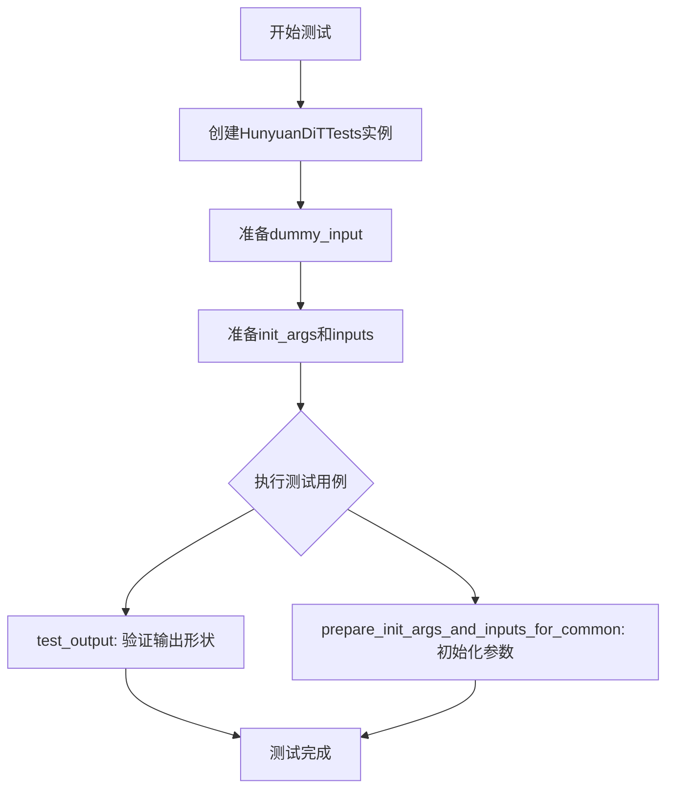
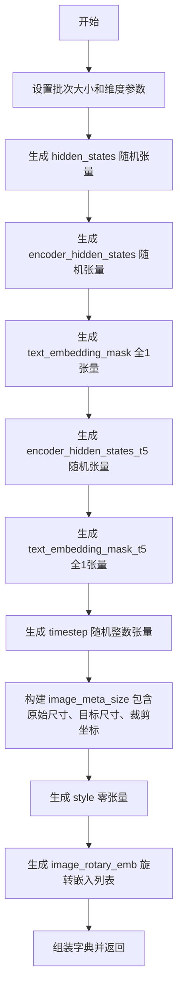
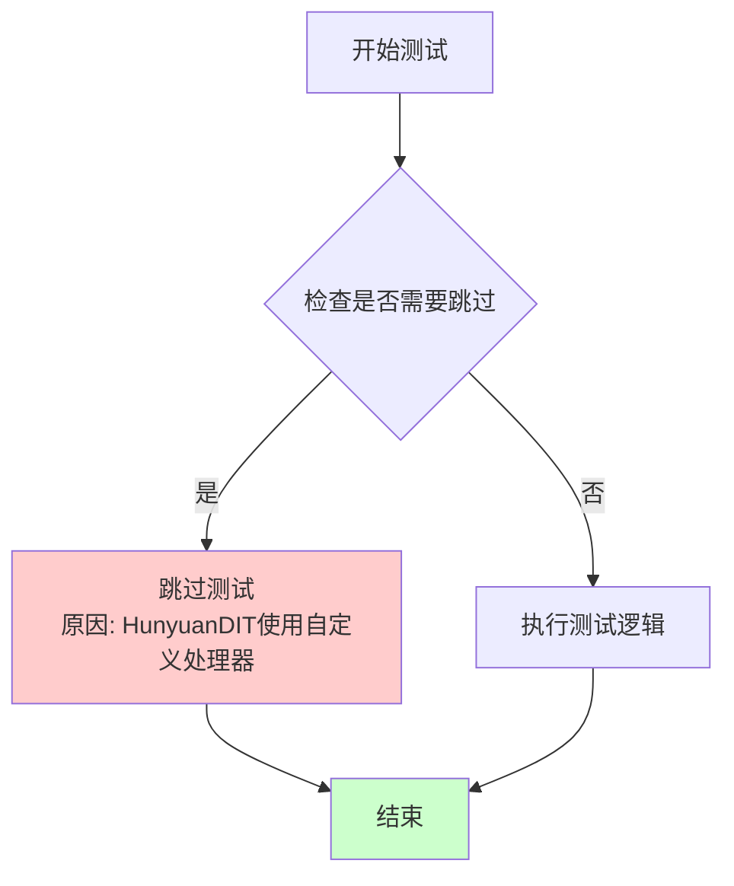
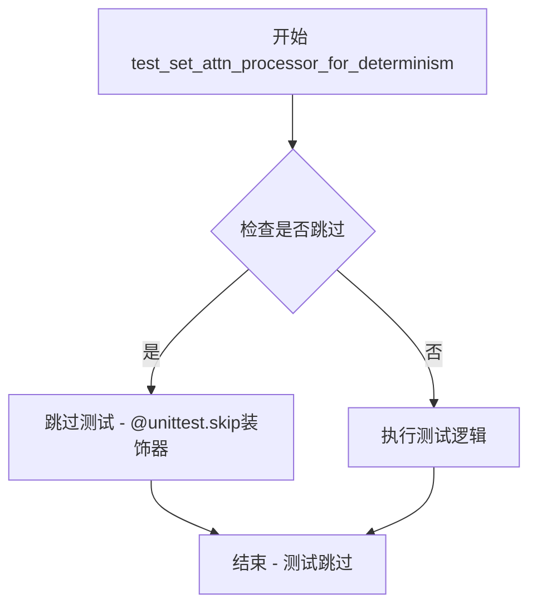
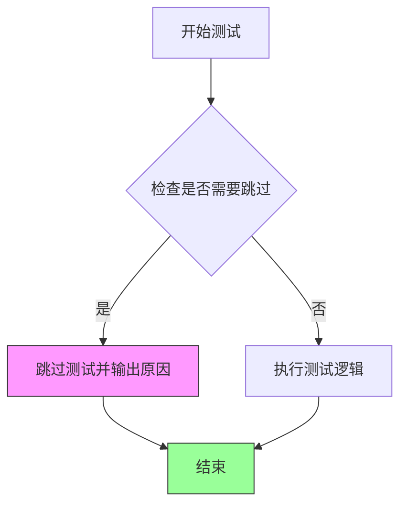
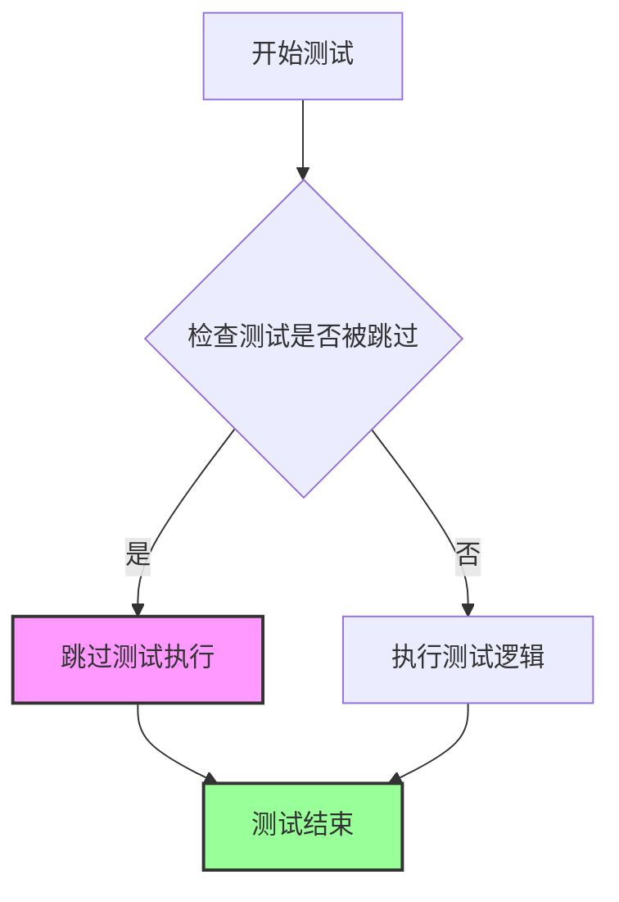

# `diffusers\tests\models\transformers\test_models_transformer_hunyuan_dit.py` 详细设计文档

这是一个针对HunyuanDiT2DModel模型的单元测试文件，用于验证模型的输入输出结构、参数初始化和前向传播是否正确。

## 整体流程



## 类结构

```
unittest.TestCase
└── HunyuanDiTTests (继承ModelTesterMixin)
```

## 全局变量及字段


### `unittest`
    
Python标准库单元测试框架

类型：`module`
    


### `torch`
    
PyTorch深度学习库

类型：`module`
    


### `HunyuanDiT2DModel`
    
Hunyuan DiT 2D模型类，被测试的目标模型

类型：`class`
    


### `enable_full_determinism`
    
启用完全确定性测试的函数，确保测试结果可复现

类型：`function`
    


### `torch_device`
    
测试使用的设备字符串('cpu'或'cuda')

类型：`str`
    


### `HunyuanDiTTests.model_class`
    
待测试的模型类，指向HunyuanDiT2DModel

类型：`type[HunyuanDiT2DModel]`
    


### `HunyuanDiTTests.main_input_name`
    
主输入参数名称，值为'hidden_states'

类型：`str`
    


### `HunyuanDiTTests.dummy_input`
    
生成测试用dummy输入数据的属性方法

类型：`property`
    


### `HunyuanDiTTests.input_shape`
    
输入形状，值为(4, 8, 8)

类型：`property`
    


### `HunyuanDiTTests.output_shape`
    
输出形状，值为(8, 8, 8)

类型：`property`
    
    

## 全局函数及方法


### `HunyuanDiTTests.dummy_input`

这是 `HunyuanDiTTests` 测试类中的一个属性（property），用于生成模型测试所需的虚拟输入数据（dummy inputs），返回一个包含 `hidden_states`、`encoder_hidden_states`、`text_embedding_mask` 等所有必要输入的字典，供模型前向传播测试使用。

参数：

- 无参数（这是一个 `@property` 装饰器定义的只读属性）

返回值：`Dict[str, torch.Tensor]`，返回一个字典，包含以下键值对：
- `hidden_states`: torch.Tensor - 主输入的隐藏状态，形状为 (batch_size, num_channels, height, width)
- `encoder_hidden_states`: torch.Tensor - 编码器的隐藏状态，用于跨注意力机制
- `text_embedding_mask`: torch.Tensor - 文本嵌入的注意力掩码
- `encoder_hidden_states_t5`: torch.Tensor - T5 编码器的隐藏状态
- `text_embedding_mask_t5`: torch.Tensor - T5 文本嵌入的注意力掩码
- `timestep`: torch.Tensor - 扩散模型的时间步
- `image_meta_size`: torch.Tensor - 图像元数据（原始尺寸、目标尺寸、裁剪坐标）
- `style`: torch.Tensor - 风格标签
- `image_rotary_emb`: List[torch.Tensor] - 图像旋转嵌入

#### 流程图



#### 带注释源码

```python
@property
def dummy_input(self):
    # ==================== 基础维度参数设置 ====================
    batch_size = 2                    # 批次大小
    num_channels = 4                  # 输入通道数
    height = width = 8                # 输入图像的高宽
    embedding_dim = 8                 # 嵌入维度
    sequence_length = 4               # 文本序列长度
    sequence_length_t5 = 4           # T5 文本序列长度

    # ==================== 主输入生成 ====================
    # hidden_states: 主输入的隐藏状态，形状 (batch_size, num_channels, height, width)
    # 这是扩散模型的核心输入，表示噪声图像或潜在表示
    hidden_states = torch.randn((batch_size, num_channels, height, width)).to(torch_device)

    # ==================== 文本编码器相关输入 ====================
    # encoder_hidden_states: 编码器（CLIP）输出的隐藏状态
    # 形状 (batch_size, sequence_length, embedding_dim)
    encoder_hidden_states = torch.randn((batch_size, sequence_length, embedding_dim)).to(torch_device)

    # text_embedding_mask: 文本嵌入的注意力掩码，用于标识有效token
    # 全1表示所有token都有效
    text_embedding_mask = torch.ones(size=(batch_size, sequence_length)).to(torch_device)

    # ==================== T5 编码器相关输入 ====================
    # encoder_hidden_states_t5: T5 编码器的隐藏状态
    # 用于更长的文本描述处理
    encoder_hidden_states_t5 = torch.randn((batch_size, sequence_length_t5, embedding_dim)).to(torch_device)

    # text_embedding_mask_t5: T5 文本嵌入的注意力掩码
    text_embedding_mask_t5 = torch.ones(size=(batch_size, sequence_length_t5)).to(torch_device)

    # ==================== 扩散时间步 ====================
    # timestep: 扩散模型的时间步，用于调度器计算噪声添加
    timestep = torch.randint(0, 1000, size=(batch_size,), dtype=encoder_hidden_states.dtype).to(torch_device)

    # ==================== 图像元数据 ====================
    # image_meta_size: 包含图像尺寸信息用于控制生成
    original_size = [1024, 1024]      # 原始图像尺寸
    target_size = [16, 16]            # 目标生成尺寸
    crops_coords_top_left = [0, 0]   # 裁剪左上角坐标
    add_time_ids = list(original_size + target_size + crops_coords_top_left)
    # 展平为 [original_width, original_height, target_width, target_height, crop_top, crop_left]
    add_time_ids = torch.tensor([add_time_ids, add_time_ids], dtype=encoder_hidden_states.dtype).to(torch_device)

    # ==================== 风格控制 ====================
    # style: 风格标签，0 表示默认/无风格
    style = torch.zeros(size=(batch_size,), dtype=int).to(torch_device)

    # ==================== 旋转位置嵌入 ====================
    # image_rotary_emb: 用于图像的旋转位置嵌入（RoPE）
    # 包含 sin 和 cos 两个分量
    image_rotary_emb = [
        torch.ones(size=(1, 8), dtype=encoder_hidden_states.dtype),  # sin 分量
        torch.zeros(size=(1, 8), dtype=encoder_hidden_states.dtype), # cos 分量
    ]

    # ==================== 返回输入字典 ====================
    return {
        "hidden_states": hidden_states,
        "encoder_hidden_states": encoder_hidden_states,
        "text_embedding_mask": text_embedding_mask,
        "encoder_hidden_states_t5": encoder_hidden_states_t5,
        "text_embedding_mask_t5": text_embedding_mask_t5,
        "timestep": timestep,
        "image_meta_size": add_time_ids,
        "style": style,
        "image_rotary_emb": image_rotary_emb,
    }
```

---

### 类的详细信息

#### HunyuanDiTTests

**描述**：HunyuanDiT2DModel 的测试类，继承自 `ModelTesterMixin` 和 `unittest.TestCase`，用于验证模型的各项功能。

**类字段**：

- `model_class`: type - 待测试的模型类 `HunyuanDiT2DModel`
- `main_input_name`: str - 主输入名称 `"hidden_states"`

**类方法**：

| 方法名 | 功能描述 |
|--------|----------|
| `dummy_input` | 生成虚拟输入字典 |
| `input_shape` | 返回输入形状 `(4, 8, 8)` |
| `output_shape` | 返回输出形状 `(8, 8, 8)` |
| `prepare_init_args_and_inputs_for_common` | 准备初始化参数和输入 |
| `test_output` | 测试模型输出形状 |
| `test_set_xformers_attn_processor_for_determinism` | 跳过（使用自定义处理器） |
| `test_set_attn_processor_for_determinism` | 跳过（使用自定义处理器） |

---

### 关键组件信息

| 组件名称 | 一句话描述 |
|----------|------------|
| HunyuanDiT2DModel | 腾讯 HunyuanDiT 2D 扩散模型的核心实现类 |
| hidden_states | 模型的主输入张量，表示图像的潜在表示 |
| encoder_hidden_states | CLIP 文本编码器输出的文本特征 |
| encoder_hidden_states_t5 | T5 文本编码器输出的长文本特征 |
| image_rotary_emb | 旋转位置嵌入，用于保持图像空间位置信息 |
| image_meta_size | 包含原始/目标尺寸和裁剪坐标的元数据 |

---

### 潜在的技术债务或优化空间

1. **硬编码的维度参数**：序列长度、嵌入维度等参数在 `dummy_input` 中硬编码，应从模型配置中动态获取
2. **重复的张量创建**：部分张量（如 `add_time_ids`）可以预先计算而非每次调用时重新生成
3. **缺乏参数化**：测试用例的维度参数应支持通过 fixture 或参数化进行配置，以提高测试覆盖率
4. **magic numbers**：存在魔法数字（如 `1024`、`1000`、`8`），应提取为常量或配置项

---

### 其它项目

#### 设计目标与约束

- **目标**：为 HunyuanDiT2DModel 提供标准化的测试输入，确保模型在各种配置下能正确运行
- **约束**：输入必须与模型的 `forward` 方法签名完全匹配

#### 错误处理与异常设计

- 当前实现未包含显式的错误处理，依赖 PyTorch 的类型检查
- 建议：添加输入形状验证，确保与模型配置一致

#### 数据流与状态机

```
dummy_input (property)
    ↓ [生成输入字典]
ModelTesterMixin.test_output()
    ↓ [调用 forward 方法]
HunyuanDiT2DModel.forward()
```

#### 外部依赖与接口契约

| 依赖项 | 用途 |
|--------|------|
| torch | 张量操作 |
| diffusers.HunyuanDiT2DModel | 待测试模型 |
| testing_utils.enable_full_determinism | 确定性测试配置 |
| test_modeling_common.ModelTesterMixin | 通用模型测试混入类 |


### `HunyuanDiTTests.input_shape`

该属性用于返回模型测试类的输入张量形状元组，定义了在测试过程中 hidden_states 的预期形状 (channels, height, width)。

参数：无（该属性不接受任何显式参数，隐式接收 `self` 实例）

返回值：`tuple[int, int, int]`，返回形状元组 (4, 8, 8)，分别代表通道数、高度和宽度

#### 流程图

```mermaid
flowchart TD
    A[访问 input_shape 属性] --> B{获取 self 实例}
    B --> C[返回元组 (4, 8, 8)]
    C --> D[表示输入形状: 4通道, 8x8 空间维度]
```

#### 带注释源码

```python
@property
def input_shape(self):
    """
    返回测试模型的输入张量形状元组。
    
    该属性定义了测试用例中 hidden_states 的预期形状格式：
    - 4: 通道数 (num_channels)，对应 in_channels=4
    - 8: 高度 (height)
    - 8: 宽度 (width)
    
    这个形状与 dummy_input 方法中生成的 hidden_states 维度一致，
    用于模型一致性测试和输出形状验证。
    
    Returns:
        tuple[int, int, int]: 输入形状元组 (channels, height, width)
    """
    return (4, 8, 8)
```


### `HunyuanDiTTests.output_shape`

该属性定义了 HunyuanDiT2DModel 测试的预期输出张量形状，返回一个元组 (8, 8, 8)，表示输出张量的通道数和空间维度。

参数： 无

返回值：`tuple`，返回输出张量形状元组 (8, 8, 8)，其中第一个维度对应批量大小，8x8 表示输出特征图的空间分辨率，通道数为 8。

#### 流程图

```mermaid
flowchart TD
    A[访问 output_shape 属性] --> B[返回元组 (8, 8, 8)]
    B --> C[用于测试验证模型输出形状]
    
    style A fill:#f9f,stroke:#333
    style B fill:#9ff,stroke:#333
    style C fill:#ff9,stroke:#333
```

#### 带注释源码

```python
@property
def output_shape(self):
    """
    定义测试用例的预期输出形状。
    
    返回值:
        tuple: 包含三个整数的元组 (8, 8, 8)，表示:
            - 第一个 8: 批量大小（与 dummy_input 的 batch_size 一致）
            - 第二个 8: 输出高度
            - 第三个 8: 输出宽度
            
    注意: 此属性返回的是空间维度和通道数的组合，
    实际完整输出形状还需在 test_output 方法中加上批量大小维度。
    """
    return (8, 8, 8)
```


### `HunyuanDiTTests.prepare_init_args_and_inputs_for_common`

该方法用于为通用测试准备模型初始化参数字典和输入字典，返回一个包含 HunyuanDiT2DModel 模型配置参数以及测试用虚拟输入数据的元组。

参数：

- 该方法无参数（作为实例方法隐式接收 `self`）

返回值：`Tuple[Dict, Dict]`，返回包含初始化参数字典和输入字典的元组

#### 流程图

```mermaid
flowchart TD
    A[开始] --> B[创建 init_dict 字典]
    B --> C[配置模型参数: sample_size, patch_size, in_channels, num_layers 等]
    C --> D[从 self.dummy_input 获取 inputs_dict]
    D --> E[返回元组 (init_dict, inputs_dict)]
    E --> F[结束]
```

#### 带注释源码

```python
def prepare_init_args_and_inputs_for_common(self):
    """
    准备模型初始化参数字典和输入字典，用于通用测试。
    
    返回:
        Tuple[Dict, Dict]: 包含初始化参数和测试输入的元组
    """
    # 定义模型初始化参数字典，包含模型架构配置
    init_dict = {
        "sample_size": 8,              # 输入样本的空间尺寸
        "patch_size": 2,               # 图像分块大小
        "in_channels": 4,              # 输入通道数
        "num_layers": 1,               # Transformer 层数
        "attention_head_dim": 8,       # 注意力头维度
        "num_attention_heads": 2,      # 注意力头数量
        "cross_attention_dim": 8,      # 跨注意力维度（CLIP 文本编码器）
        "cross_attention_dim_t5": 8,   # 跨注意力维度（T5 文本编码器）
        "pooled_projection_dim": 4,    # 池化投影维度
        "hidden_size": 16,             # 隐藏层尺寸
        "text_len": 4,                 # CLIP 文本嵌入长度
        "text_len_t5": 4,              # T5 文本嵌入长度
        "activation_fn": "gelu-approximate",  # 激活函数类型
    }
    
    # 从测试类的 dummy_input 属性获取预定义的测试输入
    inputs_dict = self.dummy_input
    
    # 返回初始化参数和输入字典的元组
    return init_dict, inputs_dict
```


### `HunyuanDiTTests.test_output`

该方法是一个继承自 `ModelTesterMixin` 的输出测试方法，用于验证模型输出的形状是否符合预期。它调用父类的 `test_output` 方法，并传入基于测试输入和输出形状计算得到的期望输出形状。

参数：

- `self`：`HunyuanDiTTests` 实例，隐式参数，表示当前测试类实例
- `expected_output_shape`：`tuple` 类型，关键字参数，通过 `self.dummy_input[self.main_input_name].shape[0]` 获取批次大小，并与 `self.output_shape` 拼接得到期望的输出形状

返回值：`None`，无显式返回值，该方法通过调用父类 `ModelTesterMixin.test_output()` 执行测试断言

#### 流程图

```mermaid
flowchart TD
    A[开始 test_output] --> B[获取 main_input_name 对应的 dummy_input 形状]
    B --> C[提取批次大小: dummy_input[main_input_name].shape[0]]
    C --> D[拼接批次大小与 output_shape 形成 expected_output_shape]
    D --> E[调用父类 test_output 方法]
    E --> F{父类执行输出形状验证}
    F -->|通过| G[测试通过]
    F -->|失败| H[测试失败抛出异常]
```

#### 带注释源码

```python
def test_output(self):
    """
    测试模型输出形状是否符合预期。
    
    该方法继承自 ModelTesterMixin，用于验证模型的前向传播输出
    是否具有正确的形状。期望的输出形状由测试类的 dummy_input
    的批次大小和 output_shape 共同决定。
    """
    # 调用父类 ModelTesterMixin 的 test_output 方法
    # 传入 expected_output_shape 参数，该参数是一个元组
    # 格式为: (batch_size,) + output_shape
    # 其中 batch_size 来自 dummy_input 中 main_input_name (即 hidden_states) 的第一维
    # output_shape 来自测试类的 output_shape 属性，值为 (8, 8, 8)
    super().test_output(
        expected_output_shape=(
            self.dummy_input[self.main_input_name].shape[0],  # 批次大小 = 2
        ) + self.output_shape  # (8, 8, 8) -> 最终期望形状 (2, 8, 8, 8)
    )
```


### `HunyuanDiTTests.test_set_xformers_attn_processor_for_determinism`

该函数是一个单元测试方法，用于测试 xformers 注意力处理器的一致性。由于 HunyuanDIT 使用自定义的 HunyuanAttnProcessor2_0 处理器，因此该测试被跳过。

参数：

- `self`：`HunyyuanDiTTests`，TestCase 实例本身，包含测试所需的属性和方法

返回值：`None`，该函数体为空（pass），不执行任何测试逻辑

#### 流程图



#### 带注释源码

```python
@unittest.skip("HunyuanDIT use a custom processor HunyuanAttnProcessor2_0")
def test_set_xformers_attn_processor_for_determinism(self):
    """
    测试 xformers 注意力处理器的一致性（确定性）。
    
    该测试用于验证在设置 xformers 注意力处理器后，模型输出的一致性。
    由于 HunyuanDIT 模型使用了自定义的注意力处理器 HunyuanAttnProcessor2_0，
    而非标准的 xformers 注意力处理器，因此跳过此测试。
    """
    pass
```


### `HunyuanDiTTests.test_set_attn_processor_for_determinism`

该测试方法用于验证注意力处理器的一致性（determinism），但在 HunyuanDiT 模型中被跳过，原因是该模型使用了自定义的注意力处理器 `HunyuanAttnProcessor2_0`，因此跳过此测试以避免不必要的失败。

参数：无

返回值：无

#### 流程图



#### 带注释源码

```python
@unittest.skip("HunyuanDIT use a custom processor HunyuanAttnProcessor2_0")
def test_set_attn_processor_for_determinism(self):
    """
    测试设置注意力处理器以确保确定性输出。
    
    该测试方法用于验证在设置特定注意力处理器时，模型能否产生
    一致的（可重复的）输出结果。
    
    参数:
        无（继承自 unittest.TestCase）
    
    返回值:
        无
    
    注意事项:
        - 该测试在 HunyuanDiT 中被跳过，因为模型使用了自定义处理器
        - HunyuanAttnProcessor2_0 是专门为 HunyuanDiT 设计的自定义实现
        - 跳过原因存储在 @unittest.skip 装饰器中
    """
    pass  # 方法体为空，测试被跳过
```

#### 补充说明

| 项目 | 说明 |
|------|------|
| **所属类** | `HunyuanDiTTests` |
| **类定义位置** | 同文件中的 `HunyuanDiTTests` 类 |
| **装饰器** | `@unittest.skip("HunyuanDIT use a custom processor HunyuanAttnProcessor2_0")` |
| **跳过原因** | HunyuanDiT 使用自定义注意力处理器 `HunyuanAttnProcessor2_0`，不兼容通用的确定性测试 |
| **测试目的** | 验证设置不同注意力处理器时模型输出的确定性 |
| **与父类关系** | 继承自 `ModelTesterMixin`，重写了父类中的测试方法并将其跳过 |


### HunyuanDiTTests.prepare_init_args_and_inputs_for_common

该方法为 HunyuanDiT2DModel 测试类准备模型初始化参数和模型输入数据，返回一个包含初始化配置字典和输入张量字典的元组，供通用模型测试使用。

参数：无（仅包含隐式参数 `self`）

返回值：`Tuple[Dict, Dict]`，返回两个字典组成的元组——第一个 `init_dict` 包含模型初始化参数，第二个 `inputs_dict` 包含模型推理所需的输入张量数据。

#### 流程图

```mermaid
flowchart TD
    A[开始] --> B[创建 init_dict 字典]
    B --> C[配置模型参数]
    C --> D[设置 sample_size=8, patch_size=2, in_channels=4]
    C --> E[设置 num_layers=1, attention_head_dim=8, num_attention_heads=2]
    C --> F[设置 cross_attention_dim=8, cross_attention_dim_t5=8]
    C --> G[设置 pooled_projection_dim=4, hidden_size=16]
    C --> H[设置 text_len=4, text_len_t5=4]
    C --> I[设置 activation_fn='gelu-approximate']
    I --> J[调用 self.dummy_input 获取 inputs_dict]
    J --> K[返回 (init_dict, inputs_dict) 元组]
    K --> L[结束]
```

#### 带注释源码

```python
def prepare_init_args_and_inputs_for_common(self):
    """
    准备模型初始化参数和输入数据，供通用模型测试使用。
    
    该方法为 HunyuanDiT2DModel 创建一个包含模型架构配置的初始化字典，
    以及一个包含推理所需输入张量的输入字典。
    """
    # 1. 构建模型初始化参数字典
    init_dict = {
        "sample_size": 8,              # 输入样本的空间维度大小
        "patch_size": 2,                # 图像分块（patch）的大小
        "in_channels": 4,               # 输入通道数
        "num_layers": 1,                # Transformer 层数
        "attention_head_dim": 8,       # 注意力头的维度
        "num_attention_heads": 2,      # 注意力头的数量
        "cross_attention_dim": 8,      # 跨注意力机制的维度（CLIP 文本编码器）
        "cross_attention_dim_t5": 8,   # T5 文本编码器的跨注意力维度
        "pooled_projection_dim": 4,    # 池化投影维度
        "hidden_size": 16,             # 隐藏层维度
        "text_len": 4,                 # CLIP 文本嵌入长度
        "text_len_t5": 4,              # T5 文本嵌入长度
        "activation_fn": "gelu-approximate",  # 激活函数类型
    }
    
    # 2. 获取模型输入张量字典（通过 dummy_input 属性）
    inputs_dict = self.dummy_input
    
    # 3. 返回初始化参数和输入数据的元组
    #    - init_dict: 用于创建 HunyuanDiT2DModel 实例
    #    - inputs_dict: 用于模型前向传播的输入
    return init_dict, inputs_dict
```

#### 相关联的 dummy_input 属性（输入字典结构）

```python
@property
def dummy_input(self):
    """生成测试用的虚拟输入张量"""
    batch_size = 2
    num_channels = 4
    height = width = 8
    embedding_dim = 8
    sequence_length = 4
    sequence_length_t5 = 4

    # 主要输入：图像 latent
    hidden_states = torch.randn((batch_size, num_channels, height, width)).to(torch_device)
    
    # CLIP 文本编码器相关输入
    encoder_hidden_states = torch.randn((batch_size, sequence_length, embedding_dim)).to(torch_device)
    text_embedding_mask = torch.ones(size=(batch_size, sequence_length)).to(torch_device)
    
    # T5 文本编码器相关输入
    encoder_hidden_states_t5 = torch.randn((batch_size, sequence_length_t5, embedding_dim)).to(torch_device)
    text_embedding_mask_t5 = torch.ones(size=(batch_size, sequence_length_t5)).to(torch_device)
    
    # 时间步长
    timestep = torch.randint(0, 1000, size=(batch_size,), dtype=encoder_hidden_states.dtype).to(torch_device)

    # 图像尺寸信息
    original_size = [1024, 1024]
    target_size = [16, 16]
    crops_coords_top_left = [0, 0]
    add_time_ids = list(original_size + target_size + crops_coords_top_left)
    add_time_ids = torch.tensor([add_time_ids, add_time_ids], dtype=encoder_hidden_states.dtype).to(torch_device)
    
    # 风格标识
    style = torch.zeros(size=(batch_size,), dtype=int).to(torch_device)
    
    # 旋转嵌入
    image_rotary_emb = [
        torch.ones(size=(1, 8), dtype=encoder_hidden_states.dtype),
        torch.zeros(size=(1, 8), dtype=encoder_hidden_states.dtype),
    ]

    return {
        "hidden_states": hidden_states,                    # 输入图像 latent
        "encoder_hidden_states": encoder_hidden_states,    # CLIP 文本嵌入
        "text_embedding_mask": text_embedding_mask,        # CLIP 文本嵌入 mask
        "encoder_hidden_states_t5": encoder_hidden_states_t5,  # T5 文本嵌入
        "text_embedding_mask_t5": text_embedding_mask_t5,      # T5 文本嵌入 mask
        "timestep": timestep,                              # 扩散时间步
        "image_meta_size": add_time_ids,                   # 图像尺寸元数据
        "style": style,                                     # 风格标识
        "image_rotary_emb": image_rotary_emb,               # 旋转位置嵌入
    }
```


### `HunyuanDiTTests.test_output`

该测试方法用于验证 HunyuanDiT2DModel 模型的输出形状是否符合预期，通过调用父类的 test_output 方法并传入期望的输出形状参数来执行验证。

参数：该方法无显式参数，使用类属性 `self.dummy_input` 和 `self.output_shape` 计算期望输出形状

返回值：`None`（void），该方法为 unittest 测试用例，无返回值

#### 流程图

```mermaid
flowchart TD
    A[开始 test_output 测试] --> B[获取 batch_size: self.dummy_input hidden_states shape 0]
    B --> C[获取期望输出形状: self.output_shape]
    C --> D[拼接期望形状: (batch_size,) + output_shape]
    D --> E[调用父类 test_output 方法]
    E --> F{验证模型输出形状}
    F -->|通过| G[测试通过]
    F -->|失败| H[抛出断言异常]
    G --> I[结束]
    H --> I
```

#### 带注释源码

```python
def test_output(self):
    """
    测试模型输出形状是否符合预期
    
    该方法继承自 ModelTesterMixin，验证模型的前向传播输出
    是否具有正确的形状。期望输出形状基于批次大小和预定义的
    output_shape 计算得出。
    """
    # 调用父类的 test_output 方法进行验证
    # 参数: expected_output_shape - 期望的输出张量形状
    # 计算方式: (batch_size,) + output_shape
    # batch_size 来自 dummy_input 中 hidden_states 的第一维
    # output_shape 来自类属性，固定为 (8, 8, 8)
    super().test_output(
        expected_output_shape=(
            self.dummy_input[self.main_input_name].shape[0],  # batch_size = 2
        ) + self.output_shape  # (8, 8, 8) -> 最终期望形状 (2, 8, 8, 8)
    )
```


### `HunyuanDiTTests.test_set_xformers_attn_processor_for_determinism`

该方法是一个被跳过的单元测试，用于验证 xformers 注意力处理器的确定性，但由于 HunyuanDiT 使用了自定义的 HunyuanAttnProcessor2_0 处理器而被跳过。

参数：

- `self`：`HunyuanDiTTests`，表示测试类实例本身

返回值：`None`，该方法没有返回值（pass 语句）

#### 流程图



#### 带注释源码

```python
@unittest.skip("HunyuanDIT use a custom processor HunyuanAttnProcessor2_0")
def test_set_xformers_attn_processor_for_determinism(self):
    """
    测试 xformers 注意力处理器的确定性功能。
    
    该测试被跳过，原因：HunyuanDIT 模型使用了自定义的注意力处理器
    HunyuanAttnProcessor2_0，而不是标准的 xformers 处理器，因此无法
    使用 xformers 的确定性功能测试。
    """
    pass  # 测试逻辑未实现，仅作为占位符
```


### `HunyuanDiTTests.test_set_attn_processor_for_determinism`

该测试方法用于验证注意力处理器（Attention Processor）的确定性行为，确保在相同的输入条件下多次执行模型时产生一致的输出。由于 HunyuanDiT 使用了自定义的处理器 HunyuanAttnProcessor2_0，该测试被跳过。

参数：

- `self`：`HunyuanDiTTests`，测试类实例，指向当前的测试用例对象，用于访问测试类的属性和方法

返回值：`None`，该方法没有返回值，因为方法体仅包含 `pass` 语句

#### 流程图



#### 带注释源码

```python
@unittest.skip("HunyuanDIT use a custom processor HunyuanAttnProcessor2_0")
def test_set_attn_processor_for_determinism(self):
    """
    测试设置注意力处理器的确定性行为。
    
    该测试方法原本用于验证在设置注意力处理器后，
    模型是否能够在多次推理中保持输出一致性。
    
    由于 HunyuanDiT 模型使用了自定义的注意力处理器 HunyuanAttnProcessor2_0，
    该处理器可能与标准测试方法不兼容，因此测试被跳过。
    """
    pass  # 方法体为空，跳过执行
```

## 关键组件


### HunyuanDiT2DModel

华为推出的Diffusion Transformer模型类，被测试的核心模型组件，用于图像生成任务。

### dummy_input

测试用的虚拟输入生成方法，构建包含hidden_states、encoder_hidden_states、text_embedding_mask、encoder_hidden_states_t5、text_embedding_mask_t5、timestep、image_meta_size、style和image_rotary_emb等多个张量的完整输入字典，用于模型前向传播测试。

### ModelTesterMixin

diffusers库提供的通用模型测试混入类，封装了模型一致性、输出形状、参数初始化等标准测试方法，HunyuanDiTTests继承该类以获得标准化测试能力。

### hidden_states

类型：torch.Tensor，形状为(batch_size, num_channels, height, width)，主输入张量，代表图像的隐空间表示。

### encoder_hidden_states

类型：torch.Tensor，形状为(batch_size, sequence_length, embedding_dim)，文本编码器的隐藏状态，用于提供文本条件信息。

### text_embedding_mask

类型：torch.Tensor，形状为(batch_size, sequence_length)，文本嵌入的注意力掩码，用于标识有效文本位置。

### encoder_hidden_states_t5

类型：torch.Tensor，形状为(batch_size, sequence_length_t5, embedding_dim)，T5模型编码的文本隐藏状态，提供额外的文本编码能力。

### text_embedding_mask_t5

类型：torch.Tensor，形状为(batch_size, sequence_length_t5)，T5文本嵌入的注意力掩码。

### timestep

类型：torch.Tensor，形状为(batch_size,)，扩散过程的时间步长，用于条件生成。

### image_meta_size

类型：torch.Tensor，形状为(batch_size, 6)，包含original_size、target_size和crops_coords_top_left的图像元数据，用于控制图像生成尺寸。

### style

类型：torch.Tensor，形状为(batch_size,)，风格标识符，用于指定生成图像的风格类型。

### image_rotary_emb

类型：List[torch.Tensor]，包含两个张量的列表，用于旋转位置编码(RoPE)，增强模型的全局注意力能力。

### 配置参数

包含sample_size、patch_size、in_channels、num_layers、attention_head_dim、num_attention_heads、cross_attention_dim、cross_attention_dim_t5、pooled_projection_dim、hidden_size、text_len、text_len_t5和activation_fn等模型初始化参数，定义了HunyuanDiT2DModel的架构配置。

### 测试跳过项

test_set_xformers_attn_processor_for_determinism和test_set_attn_processor_for_determinism两个测试被跳过，原因是HunyuanDIT使用自定义处理器HunyuanAttnProcessor2_0，不支持标准的xformers和attention processor设置。


## 问题及建议


### 已知问题

-   **测试数据生成不一致**：`dummy_input` 属性使用 `@property` 装饰器，每次访问都会重新生成新的随机张量，可能导致测试结果的不确定性和难以复现的问题
-   **张量初始化方式不统一**：部分使用 `torch.randn`（随机），部分使用 `torch.ones` 或 `torch.zeros`（固定），缺乏一致的测试数据策略
-   **魔法数字缺乏文档**：代码中存在大量硬编码数值（如 `1024`、`1000`、`8`、`4` 等），没有对应的常量定义或注释说明其含义和来源
-   **重复代码**：相同的 `batch_size = 2` 和 `sequence_length = 4` 等参数在多处重复定义
-   **被跳过的测试缺少说明**：`test_set_xformers_attn_processor_for_determinism` 和 `test_set_attn_processor_for_determinism` 被无条件跳过，但仅在注释中说明原因，缺少更详细的文档或跟踪 Issue
-   **数据结构设计不够清晰**：`image_rotary_emb` 使用列表嵌套张量，结构不够明确，可以考虑使用命名元组或 dataclass 增强可读性
-   **测试覆盖不足**：仅依赖父类 `ModelTesterMixin` 的通用测试，缺少针对 HunyuanDiT 模型特定功能（如 custom processor、style 输入等）的专项测试

### 优化建议

-   **缓存测试数据**：将 `dummy_input` 改为使用 `@functools.cached_property` 或在 `setUp` 方法中初始化一次，确保测试数据在整个测试运行期间保持一致
-   **统一数据初始化策略**：根据测试目的选择固定的随机种子或统一的初始化方式（如全部使用 `torch.zeros` 或 `torch.ones`）
-   **提取魔法数字为常量**：在类级别定义常量，如 `ORIGINAL_SIZE = [1024, 1024]`、`DEFAULT_SEQUENCE_LENGTH = 4` 等，提高代码可维护性
-   **使用 dataclass 或 namedtuple**：将 `image_rotary_emb` 等复杂数据结构封装为具名结构，增强类型安全性和可读性
-   **添加专项测试**：针对 HunyuanDiT2DModel 的独特功能（如 T5 encoder 集成、style 输入处理、自定义 attention processor）编写测试用例
-   **补充跳过测试的原因追踪**：在跳过测试时添加对应 Issue 或 PR 的引用，便于后续维护和理解

## 其它


### 设计目标与约束

该测试文件的设计目标是验证 HunyuanDiT2DModel 模型的核心功能是否符合预期，包括模型输出的形状、参数初始化等。约束条件包括：必须继承 ModelTesterMixin 以保持与其他模型测试的一致性，使用特定的输入维度（batch_size=2, num_channels=4, height=width=8），并且需要与 diffusers 库的测试框架兼容。

### 错误处理与异常设计

测试中使用了 @unittest.skip 装饰器来跳过某些测试（test_set_xformers_attn_processor_for_determinism 和 test_set_attn_processor_for_determinism），原因是 HunyuanDIT 使用了自定义的处理器 HunyuanAttnProcessor2_0。这些跳过的测试表明当前实现与标准 xformers 或注意力处理器不兼容，需要特殊处理。

### 数据流与状态机

测试数据流如下：dummy_input 属性生成完整的输入字典，包含 hidden_states、encoder_hidden_states、text_embedding_mask、encoder_hidden_states_t5、text_embedding_mask_t5、timestep、image_meta_size、style 和 image_rotary_emb 等9个输入参数。这些输入通过 prepare_init_args_and_inputs_for_common 方法传递给被测试的模型，模型执行前向传播后返回输出结果进行形状验证。

### 外部依赖与接口契约

该测试文件依赖以下外部组件：1) unittest 框架作为测试基础；2) torch 库用于张量操作；3) diffusers 库中的 HunyuanDiT2DModel 类是被测对象；4) testing_utils 模块中的 enable_full_determinism 和 torch_device 工具函数；5) test_modeling_common 中的 ModelTesterMixin 提供通用模型测试方法。接口契约要求模型必须支持 main_input_name="hidden_states" 的输入，并且输出形状应与预期一致。

### 测试覆盖范围分析

当前测试覆盖范围包括：模型输出形状验证（test_output 方法）、模型参数初始化（通过 prepare_init_args_and_inputs_for_common 提供配置）。但缺少的测试覆盖包括：模型前向传播的具体数值正确性测试、梯度计算测试、模型序列化与反序列化测试、模型在不同设备上的运行测试、以及边界条件测试。

### 技术债务与优化空间

1. **测试跳过问题**：两个测试方法被永久跳过，这些功能（HunyuanDIT 的注意力处理器确定性设置）目前无法验证，建议后续实现自定义的确定性测试方法。2. **测试数据硬编码**：输入张量的维度和其他参数硬编码在代码中，缺乏灵活性，建议改为可配置的参数化测试。3. **测试用例单一**：仅有一个 dummy_input 生成器，无法覆盖多种输入场景，建议添加更多不同规模和类型的测试用例。4. **缺失的测试方法**：从 ModelTesterMixin 继承的测试方法可能有很多未被调用，建议确认所有必要的测试都已执行。

### 性能考量与基准

测试中使用的输入规模较小（batch_size=2, 8x8 图像），这种小规模测试有助于快速验证功能正确性，但无法评估模型在实际应用场景下的性能表现。建议在后续添加性能基准测试，包括推理速度、内存占用等指标的测量。

### 代码组织与模块化

该测试文件遵循了 diffusers 库的标准测试结构，按照约定放在 tests 目录下，并通过文件名（test_modeling_hunyuan_dit.py）表明测试对象。测试类的命名规范（HunyuanDiTTests）清晰表达了被测模块。建议将测试配置参数（如模型参数字典）提取为独立的配置常量，提高代码可维护性。


    