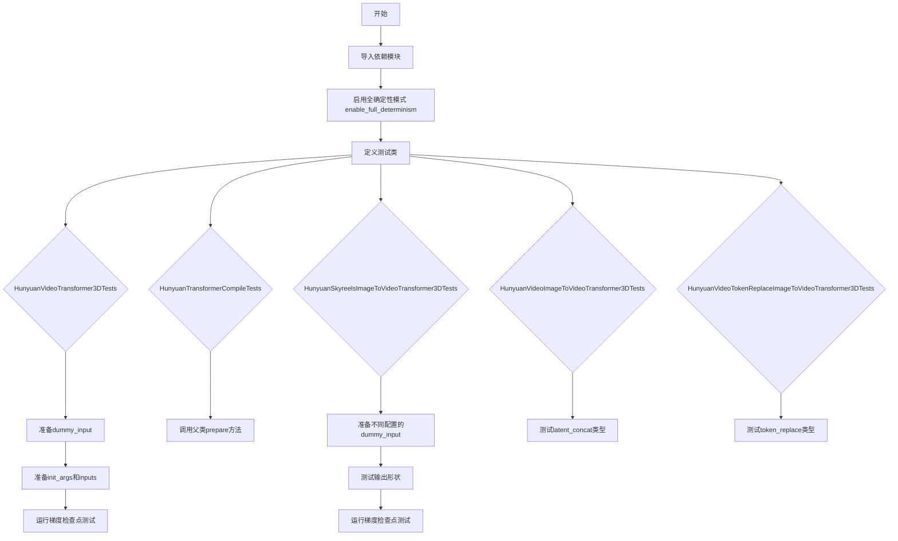
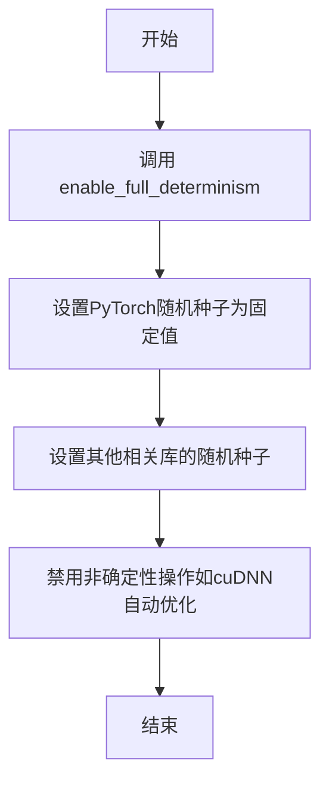
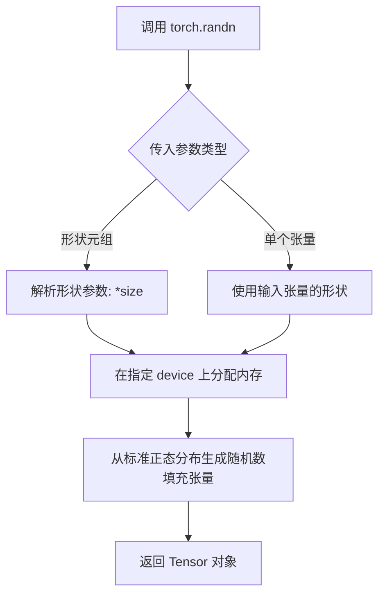
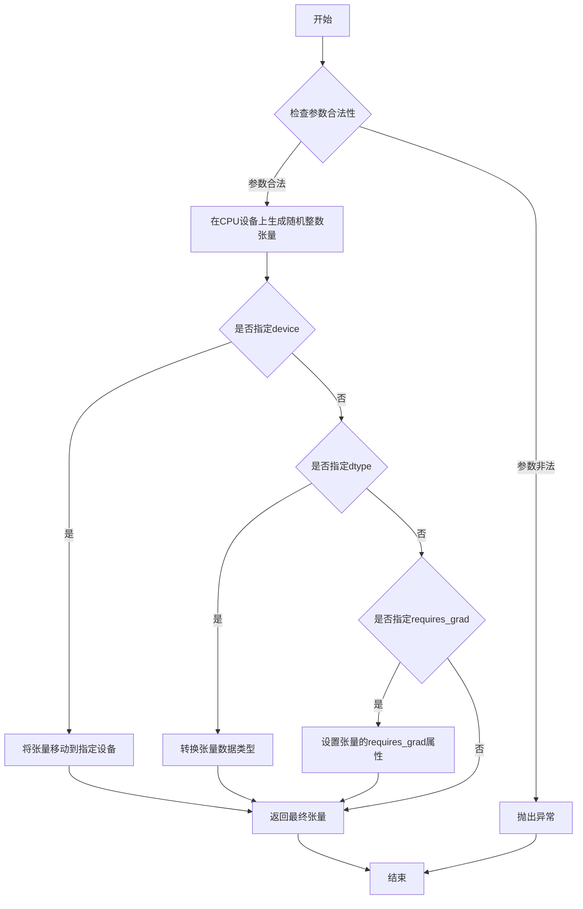
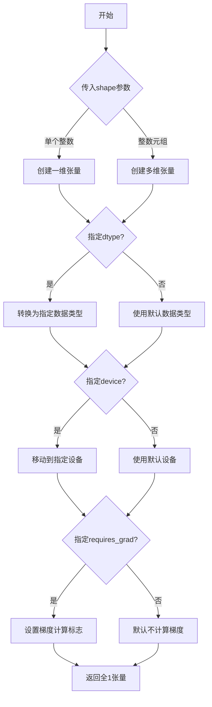
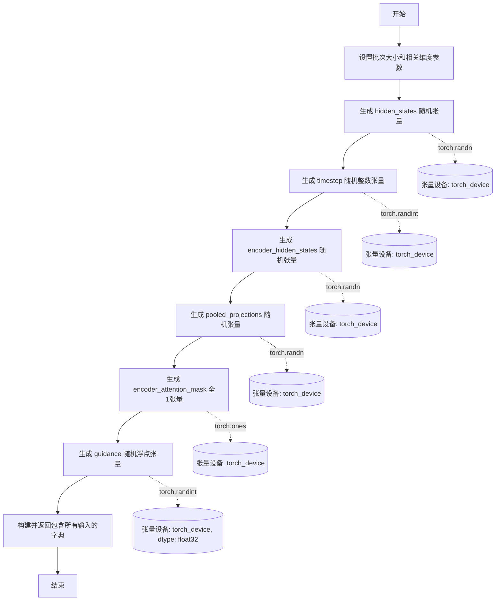
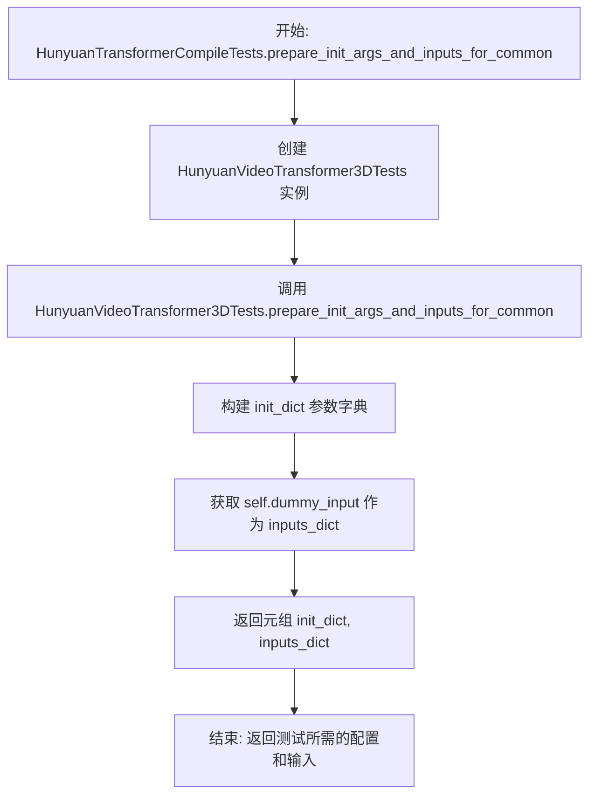
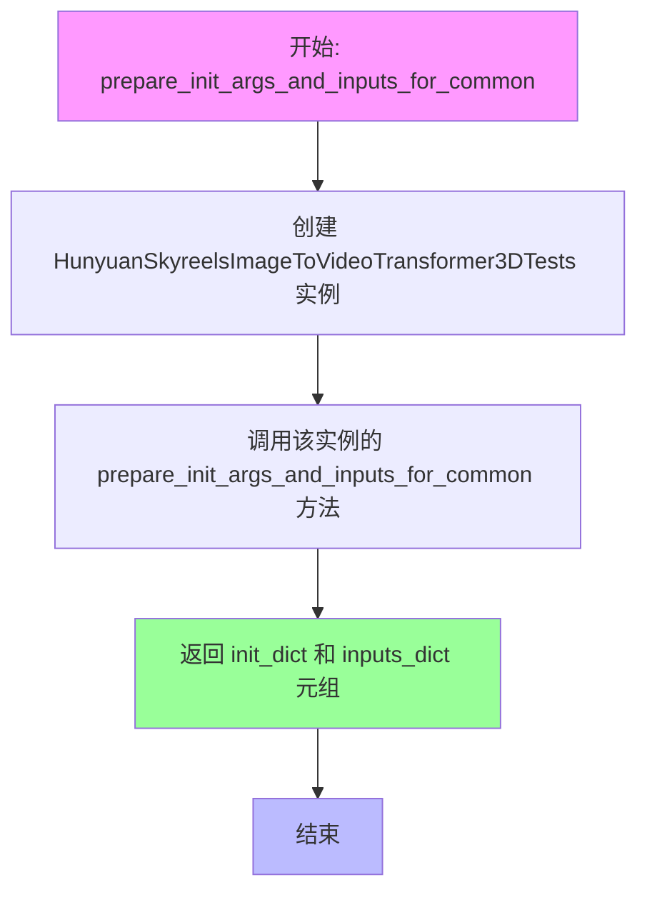
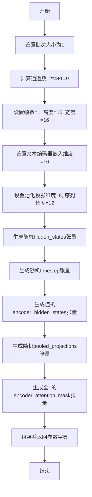

# `diffusers\tests\models\transformers\test_models_transformer_hunyuan_video.py` 详细设计文档

这是HunyuanVideoTransformer3DModel的单元测试文件，包含多个测试类，用于验证模型的图像到视频转换、视频到视频转换、token替换等不同功能场景的正确性，以及梯度检查点和torch.compile编译功能。

## 整体流程



## 类结构

```
unittest.TestCase
├── HunyuanVideoTransformer3DTests (ModelTesterMixin)
│   ├── dummy_input (property)
│   ├── input_shape (property)
│   ├── output_shape (property)
│   ├── prepare_init_args_and_inputs_for_common()
│   └── test_gradient_checkpointing_is_applied()
├── HunyuanTransformerCompileTests (TorchCompileTesterMixin)
│   └── prepare_init_args_and_inputs_for_common()
├── HunyuanSkyreelsImageToVideoTransformer3DTests (ModelTesterMixin)
dummy_input (property)
input_shape (property)
output_shape (property)
prepare_init_args_and_inputs_for_common()
test_output()
test_gradient_checkpointing_is_applied()
├── HunyuanSkyreelsImageToVideoCompileTests (TorchCompileTesterMixin)
HunyuanVideoImageToVideoTransformer3DTests (ModelTesterMixin)
dummy_input (property)
input_shape (property)
output_shape (property)
prepare_init_args_and_inputs_for_common()
test_output()
test_gradient_checkpointing_is_applied()
HunyuanImageToVideoCompileTests (TorchCompileTesterMixin)
HunyuanVideoTokenReplaceImageToVideoTransformer3DTests (ModelTesterMixin)
dummy_input (property)
input_shape (property)
output_shape (property)
prepare_init_args_and_inputs_for_common()
test_output()
test_gradient_checkpointing_is_applied()
└── HunyuanVideoTokenReplaceCompileTests (TorchCompileTesterMixin)
```

## 全局变量及字段


### `torch`
    
PyTorch机器学习库，提供张量运算和神经网络功能

类型：`module`
    


### `torch_device`
    
用于指定测试运行的设备（如cuda或cpu）

类型：`str`
    


### `enable_full_determinism`
    
启用完全确定性模式以确保测试可复现

类型：`function`
    


### `HunyuanVideoTransformer3DModel`
    
Hunyuan视频3D变换器模型，用于视频生成任务

类型：`class`
    


### `ModelTesterMixin`
    
模型测试混入类，提供通用模型测试方法

类型：`class`
    


### `TorchCompileTesterMixin`
    
Torch编译测试混入类，提供torch.compile相关测试

类型：`class`
    


### `HunyuanVideoTransformer3DTests.model_class`
    
指定要测试的模型类为HunyuanVideoTransformer3DModel

类型：`type`
    


### `HunyuanVideoTransformer3DTests.main_input_name`
    
模型主输入张量的名称

类型：`str`
    


### `HunyuanVideoTransformer3DTests.uses_custom_attn_processor`
    
指示模型是否使用自定义注意力处理器

类型：`bool`
    


### `HunyuanTransformerCompileTests.model_class`
    
指定要测试的模型类为HunyuanVideoTransformer3DModel

类型：`type`
    


### `HunyuanSkyreelsImageToVideoTransformer3DTests.model_class`
    
指定要测试的模型类为HunyuanVideoTransformer3DModel

类型：`type`
    


### `HunyuanSkyreelsImageToVideoTransformer3DTests.main_input_name`
    
模型主输入张量的名称

类型：`str`
    


### `HunyuanSkyreelsImageToVideoTransformer3DTests.uses_custom_attn_processor`
    
指示模型是否使用自定义注意力处理器

类型：`bool`
    


### `HunyuanSkyreelsImageToVideoCompileTests.model_class`
    
指定要测试的模型类为HunyuanVideoTransformer3DModel

类型：`type`
    


### `HunyuanVideoImageToVideoTransformer3DTests.model_class`
    
指定要测试的模型类为HunyuanVideoTransformer3DModel

类型：`type`
    


### `HunyuanVideoImageToVideoTransformer3DTests.main_input_name`
    
模型主输入张量的名称

类型：`str`
    


### `HunyuanVideoImageToVideoTransformer3DTests.uses_custom_attn_processor`
    
指示模型是否使用自定义注意力处理器

类型：`bool`
    


### `HunyuanImageToVideoCompileTests.model_class`
    
指定要测试的模型类为HunyuanVideoTransformer3DModel

类型：`type`
    


### `HunyuanVideoTokenReplaceImageToVideoTransformer3DTests.model_class`
    
指定要测试的模型类为HunyuanVideoTransformer3DModel

类型：`type`
    


### `HunyuanVideoTokenReplaceImageToVideoTransformer3DTests.main_input_name`
    
模型主输入张量的名称

类型：`str`
    


### `HunyuanVideoTokenReplaceImageToVideoTransformer3DTests.uses_custom_attn_processor`
    
指示模型是否使用自定义注意力处理器

类型：`bool`
    


### `HunyuanVideoTokenReplaceCompileTests.model_class`
    
指定要测试的模型类为HunyuanVideoTransformer3DModel

类型：`type`
    
    

## 全局函数及方法


### `enable_full_determinism`

该函数用于在测试环境中启用完全确定性，确保PyTorch和相关库的操作可重复，从而保证测试结果的一致性。

参数：此函数没有参数。

返回值：`None`，该函数通常不返回值，仅用于设置全局状态。

#### 流程图



#### 带注释源码

```
# 该函数在 testing_utils 模块中定义，此处仅为调用示例
enable_full_determinism()
```

---

**注意**：`enable_full_determinism` 函数是在 `...testing_utils` 模块中定义的，当前代码文件仅导入了该函数并进行了调用。由于未提供 `testing_utils` 模块的源代码，以上信息基于函数名称和上下文的推测。


### `torch.randn`

这是 PyTorch 库中的一个核心函数，用于生成服从标准正态分布（均值为0，方差为1）的随机张量。在测试代码中用于创建模拟输入数据。

参数：

- `*size`：`int...`（可变数量整数），定义输出张量的形状，例如 `(batch_size, num_channels, num_frames, height, width)`。每个整数代表对应维度的大小。

返回值：`Tensor`，返回一个随机张量，其元素从标准正态分布 N(0, 1) 中独立同分布采样得到。

#### 流程图



#### 带注释源码

```python
# 用法示例 1: 创建 5D 隐藏状态张量 (batch, channels, frames, height, width)
# 生成形状为 (1, 4, 1, 16, 16) 的标准正态分布随机张量
hidden_states = torch.randn((batch_size, num_channels, num_frames, height, width)).to(torch_device)

# 用法示例 2: 创建编码器隐藏状态张量 (batch, seq_len, embed_dim)
# 生成形状为 (1, 12, 16) 的标准正态分布随机张量
encoder_hidden_states = torch.randn((batch_size, sequence_length, text_encoder_embedding_dim)).to(torch_device)

# 用法示例 3: 创建池化投影张量 (batch, projection_dim)
# 生成形状为 (1, 8) 的标准正态分布随机张量
pooled_projections = torch.randn((batch_size, pooled_projection_dim)).to(torch_device)

# 函数签名参考 (PyTorch 官方):
# torch.randn(*size, *, out=None, dtype=None, layout=torch.strided, device=None, requires_grad=False) -> Tensor
```


### `torch.randint`

`torch.randint` 是 PyTorch 库中的一个函数，用于生成指定范围内（含下限，不含上限）的随机整数张量。在该代码中主要用于生成时间步长（timestep）和引导向量（guidance）等随机输入数据。

参数：

- `low`：`int`，随机整数范围的起始值（包含），默认为 0
- `high`：`int`，随机整数范围的结束值（不包含）
- `size`：`tuple of ints`，输出张量的形状
- `dtype`：`torch.dtype`，输出张量的数据类型（可选，默认为 torch.long）
- `layout`：`torch.layout`，张量的布局方式（可选）
- `device`：`torch.device`，张量所在的设备（可选）
- `requires_grad`：`bool`，是否需要计算梯度（可选）

返回值：`torch.Tensor`，包含指定范围内随机整数的张量

#### 流程图



#### 带注释源码

```python
# torch.randint 函数源码（简化版）
def randint(low=0, high, size, *, dtype=torch.long, layout=torch.strided, device=None, requires_grad=False):
    """
    生成指定范围内的随机整数张量
    
    参数:
        low (int): 范围起始值（包含），默认0
        high (int): 范围结束值（不包含）
        size (tuple): 输出张量形状
        dtype (torch.dtype): 数据类型，默认torch.long
        layout (torch.layout): 张量布局
        device (torch.device): 设备位置
        requires_grad (bool): 是否需要梯度
    
    返回:
        torch.Tensor: 随机整数张量
    """
    # 验证参数
    if low >= high:
        raise ValueError(f"low ({low}) must be less than high ({high})")
    
    # 在指定设备上生成随机整数张量
    # 使用torch.randint生成[low, high)范围内的整数
    tensor = torch.randint(low, high, size, dtype=dtype, device=device)
    
    # 设置是否需要梯度
    tensor.requires_grad = requires_grad
    
    return tensor

# 代码中的实际调用示例：
# 1. 生成时间步长张量
timestep = torch.randint(0, 1000, size=(batch_size,)).to(torch_device)
# - low=0: 起始值
# - high=1000: 结束值（不包含）
# - size=(batch_size,): 输出形状为(batch_size,)
# - .to(torch_device): 移动到指定设备

# 2. 生成引导向量张量（带数据类型转换）
guidance = torch.randint(0, 1000, size=(batch_size,)).to(torch_device, dtype=torch.float32)
# - 额外指定dtype=torch.float32: 将张量转换为浮点类型
```


### `torch.ones`

这是 PyTorch 库中的一个基础张量创建函数，用于创建一个全部元素为 1 的张量（tensor）。在当前代码中，该函数用于初始化编码器注意力掩码（encoder_attention_mask）。

参数：

- `*shape`：`int...` 或 `tuple of ints`，表示输出张量的形状，可以是多个整数或一个整数元组
- `dtype`：`torch.dtype`（可选），指定返回张量的数据类型，默认为 `None`
- `device`：`torch.device`（可选），指定张量存放的设备，默认为 `None`
- `requires_grad`：`bool`（可选），指定是否需要计算梯度，默认为 `False`

返回值：`torch.Tensor`，返回一个全部元素为 1 的张量

#### 流程图



#### 带注释源码

```python
# 在本文件中的实际使用示例：

# HunyuanVideoTransformer3DTests 类中的 dummy_input 属性
encoder_attention_mask = torch.ones((batch_size, sequence_length)).to(torch_device)

# 参数说明：
# - (batch_size, sequence_length): 元组参数，指定张量形状
#   - batch_size: int, 批次大小
#   - sequence_length: int, 序列长度
# - .to(torch_device): 将张量移动到指定设备（CPU或GPU）

# 返回值：
# - torch.Tensor: 形状为 (batch_size, sequence_length) 的全1张量
# - 数据类型: torch.float32（默认）
# - 用途: 作为编码器的注意力掩码，标记有效位置
```

> **注意**：本文件仅包含 `torch.ones` 的**使用示例**，而非 `torch.ones` 函数本身的源代码定义。该函数是 PyTorch 库的内置函数，其完整源码位于 PyTorch 核心库中。上方展示的是本测试文件中对该函数的实际调用方式。


### `HunyuanVideoTransformer3DTests.dummy_input`

该属性方法用于生成测试 `HunyuanVideoTransformer3DModel` 模型所需的虚拟输入数据，模拟真实的推理流程输入，包括隐藏状态、时间步、文本编码器隐藏状态、池化投影、注意力掩码和引导向量。

参数：
- `self`：隐式参数，`HunyuanVideoTransformer3DTests` 实例本身

返回值：`Dict[str, torch.Tensor]`，包含以下键值对：
- `hidden_states`：`torch.Tensor`，形状为 `(batch_size, num_channels, num_frames, height, width)`，模型的隐藏状态输入
- `timestep`：`torch.Tensor`，形状为 `(batch_size,)`，扩散过程的时间步
- `encoder_hidden_states`：`torch.Tensor`，形状为 `(batch_size, sequence_length, text_encoder_embedding_dim)`，文本编码器的输出
- `pooled_projections`：`torch.Tensor`，形状为 `(batch_size, pooled_projection_dim)`，池化后的文本特征投影
- `encoder_attention_mask`：`torch.Tensor`，形状为 `(batch_size, sequence_length)`，文本编码器的注意力掩码
- `guidance`：`torch.Tensor`，形状为 `(batch_size,)`，用于分类器自由引导的噪声调度参数

#### 流程图



#### 带注释源码

```python
@property
def dummy_input(self):
    """
    生成用于测试模型的虚拟输入数据。
    
    该属性方法创建了一个完整的输入字典，模拟 HunyuanVideoTransformer3DModel 
    在推理时所需的全部输入参数。
    """
    # 批次大小，设置为1以简化测试
    batch_size = 1
    # 输入通道数，对应模型的 in_channels 参数
    num_channels = 4
    # 帧数，视频生成任务通常使用单帧作为输入
    num_frames = 1
    # 输入图像的高度和宽度（以像素/特征为单位）
    height = 16
    width = 16
    # 文本编码器嵌入维度
    text_encoder_embedding_dim = 16
    # 池化投影维度
    pooled_projection_dim = 8
    # 序列长度，表示文本编码器输出的token数量
    sequence_length = 12

    # 创建隐藏状态张量：形状 (batch_size, num_channels, num_frames, height, width)
    # 使用标准正态分布随机初始化
    hidden_states = torch.randn((batch_size, num_channels, num_frames, height, width)).to(torch_device)
    
    # 创建时间步张量：在 [0, 1000) 范围内随机采样
    # 对应扩散模型的去噪时间调度
    timestep = torch.randint(0, 1000, size=(batch_size,)).to(torch_device)
    
    # 创建文本编码器隐藏状态：形状 (batch_size, sequence_length, text_encoder_embedding_dim)
    encoder_hidden_states = torch.randn((batch_size, sequence_length, text_encoder_embedding_dim)).to(torch_device)
    
    # 创建池化投影向量：形状 (batch_size, pooled_projection_dim)
    pooled_projections = torch.randn((batch_size, pooled_projection_dim)).to(torch_device)
    
    # 创建注意力掩码：全1向量，表示所有token都可见
    encoder_attention_mask = torch.ones((batch_size, sequence_length)).to(torch_device)
    
    # 创建引导向量：用于分类器自由引导 (classifier-free guidance)
    # 注意：使用 float32 类型以支持后续计算
    guidance = torch.randint(0, 1000, size=(batch_size,)).to(torch_device, dtype=torch.float32)

    # 返回包含所有输入的字典，供模型前向传播使用
    return {
        "hidden_states": hidden_states,
        "timestep": timestep,
        "encoder_hidden_states": encoder_hidden_states,
        "pooled_projections": pooled_projections,
        "encoder_attention_mask": encoder_attention_mask,
        "guidance": guidance,
    }
```


### `HunyuanVideoTransformer3DTests.input_shape`

该属性定义了 HunyuanVideoTransformer3D 模型测试的输入形状，用于指定测试输入张量的通道数、帧数、高度和宽度的元组。

参数：无（该方法为属性方法，仅使用隐式参数 `self`）

返回值：`tuple[int, int, int, int]`，返回输入数据的形状元组，依次表示（通道数, 帧数, 高度, 宽度）

#### 流程图

```mermaid
flowchart TD
    A[开始访问 input_shape 属性] --> B{返回输入形状}
    B --> C[返回元组 (4, 1, 16, 16)]
    C --> D[其中 4=通道数, 1=帧数, 16=高度, 16=宽度]
    D --> E[结束]
```

#### 带注释源码

```python
@property
def input_shape(self):
    """
    定义测试输入张量的形状。
    
    该属性返回一个元组，表示模型期望的输入 hidden_states 的维度。
    格式为 (num_channels, num_frames, height, width)，对应 5D 张量的后4维。
    
    返回:
        tuple: (4, 1, 16, 16) - 表示:
            - 4: 输入通道数 (num_channels)
            - 1: 帧数 (num_frames)
            - 16: 高度 (height)
            - 16: 宽度 (width)
    """
    return (4, 1, 16, 16)
```


### `HunyuanVideoTransformer3DTests.output_shape`

该属性方法定义了 HunyuanVideoTransformer3DTests 测试类的期望输出形状，用于模型测试时验证输出维度是否符合预期。

参数：无（该方法为属性方法，仅使用隐含的 `self` 参数）

返回值：`tuple`，期望的输出张量形状，格式为 (channels, frames, height, width)

#### 流程图

```mermaid
flowchart TD
    A[调用 output_shape 属性] --> B{获取返回值}
    B --> C[返回元组 (4, 1, 16, 16)]
    
    style A fill:#f9f,stroke:#333
    style C fill:#9f9,stroke:#333
```

#### 带注释源码

```python
@property
def output_shape(self):
    """
    定义测试类的期望输出形状。
    
    返回值:
        tuple: 期望的输出张量形状，格式为 (channels, frames, height, width)
               - channels: 4 (输出通道数)
               - frames: 1 (帧数)
               - height: 16 (高度)
               - width: 16 (宽度)
    """
    return (4, 1, 16, 16)
```


### `HunyuanVideoTransformer3DTests.prepare_init_args_and_inputs_for_common`

该方法为 `HunyuanVideoTransformer3DModel` 的通用测试准备初始化参数字典和输入字典。它定义了模型初始化所需的各种参数（如 `in_channels`、`out_channels`、`num_attention_heads` 等）以及用于测试的虚拟输入数据（包括 `hidden_states`、`timestep`、`encoder_hidden_states` 等）。

参数：
- `self`：隐式参数，表示类的实例本身。

返回值：`Tuple[Dict, Dict]`，返回一个元组，其中第一个元素是包含模型初始化参数的字典 `init_dict`，第二个元素是包含测试输入的字典 `inputs_dict`。

#### 流程图

```mermaid
flowchart TD
    A[开始 prepare_init_args_and_inputs_for_common] --> B[创建 init_dict 字典]
    B --> C[设置模型初始化参数]
    C --> D{设置 guidance_embeds}
    D -->|True| E[包含 guidance 参数]
    D -->|False| F[不包含 guidance 参数]
    E --> G[获取 dummy_input 作为 inputs_dict]
    F --> G
    G --> H[返回 Tuple[init_dict, inputs_dict]]
```

#### 带注释源码

```python
def prepare_init_args_and_inputs_for_common(self):
    """
    为通用测试准备模型初始化参数和输入数据。
    
    Returns:
        Tuple[Dict, Dict]: 包含初始化参数字典和输入字典的元组
    """
    # 定义模型初始化参数字典
    init_dict = {
        "in_channels": 4,                    # 输入通道数
        "out_channels": 4,                   # 输出通道数
        "num_attention_heads": 2,            # 注意力头数量
        "attention_head_dim": 10,           # 注意力头维度
        "num_layers": 1,                     # Transformer 层数
        "num_single_layers": 1,             # 单帧层数
        "num_refiner_layers": 1,            # 精炼层数
        "patch_size": 1,                    # 空间 patch 大小
        "patch_size_t": 1,                  # 时间 patch 大小
        "guidance_embeds": True,             # 是否包含 guidance 嵌入
        "text_embed_dim": 16,               # 文本嵌入维度
        "pooled_projection_dim": 8,         # 池化投影维度
        "rope_axes_dim": (2, 4, 4),         # RoPE 轴维度
        "image_condition_type": None,       # 图像条件类型
    }
    
    # 获取虚拟输入数据（由 dummy_input property 提供）
    inputs_dict = self.dummy_input
    
    # 返回初始化参数字典和输入字典的元组
    return init_dict, inputs_dict
```


### `HunyuanVideoTransformer3DTests.test_gradient_checkpointing_is_applied`

该测试方法用于验证 HunyuanVideoTransformer3DModel 模型是否正确应用了梯度检查点（Gradient Checkpointing）技术，通过调用父类的测试方法来确认指定的模型类在梯度检查点启用时能够正常工作。

参数：

- `self`：隐式参数，`HunyuanVideoTransformer3DTests` 类的实例，无需显式传递

返回值：无返回值（`None`），该方法通过 `super()` 调用父类的测试方法进行验证

#### 流程图

```mermaid
flowchart TD
    A[开始测试] --> B[创建期望的模型集合]
    B --> C[expected_set = {'HunyuanVideoTransformer3DModel'}]
    C --> D[调用父类测试方法]
    D --> E[验证梯度检查点是否应用]
    E --> F{验证通过?}
    F -->|是| G[测试通过]
    F -->|否| H[测试失败/抛出异常]
    G --> I[结束]
    H --> I
```

#### 带注释源码

```python
def test_gradient_checkpointing_is_applied(self):
    """
    测试梯度检查点是否被正确应用于模型。
    
    该方法继承自 ModelTesterMixin，用于验证 HunyuanVideoTransformer3DModel
    在启用梯度检查点后能够正常运行且内存使用得到优化。
    """
    # 定义期望应用梯度检查点的模型类集合
    expected_set = {"HunyuanVideoTransformer3DModel"}
    
    # 调用父类的测试方法，验证梯度检查点是否正确应用
    # 父类方法会执行以下操作：
    # 1. 创建模型实例
    # 2. 启用梯度检查点
    # 3. 执行前向传播
    # 4. 执行反向传播
    # 5. 验证梯度计算正确性
    super().test_gradient_checkpointing_is_applied(expected_set=expected_set)
```


### `HunyuanTransformerCompileTests.prepare_init_args_and_inputs_for_common`

该方法是一个测试辅助函数，用于为 HunyuanVideoTransformer3DModel 的编译测试准备初始化参数和输入数据。它通过调用 `HunyuanVideoTransformer3DTests` 类的相同方法来获取标准的测试配置和虚拟输入。

参数：
- `self`：HunyuanTransformerCompileTests 实例，调用该方法的对象本身

返回值：`Tuple[Dict, Dict]`
- 第一个元素 `init_dict`（类型：`Dict[str, Any]`）：包含模型初始化所需的各种配置参数，如输入输出通道数、注意力头数量、层数、patch 大小等
- 第二个元素 `inputs_dict`（类型：`Dict[str, torch.Tensor]`）：包含模型前向传播所需的输入张量，包括 hidden_states、timestep、encoder_hidden_states 等

#### 流程图



#### 带注释源码

```python
class HunyuanTransformerCompileTests(TorchCompileTesterMixin, unittest.TestCase):
    """
    HunyuanVideoTransformer3DModel 的编译测试类
    继承自 TorchCompileTesterMixin 和 unittest.TestCase
    用于测试模型的 torch.compile 功能
    """
    model_class = HunyuanVideoTransformer3DModel  # 指定要测试的模型类

    def prepare_init_args_and_inputs_for_common(self):
        """
        准备模型初始化参数和输入数据
        
        该方法为编译测试提供必要的配置和输入数据，
        通过委托方式调用 HunyuanVideoTransformer3DTests 的同名方法
        来获取标准的测试配置，确保编译测试与其他测试使用一致的参数
        
        返回:
            Tuple[Dict, Dict]: (init_dict, inputs_dict) 元组
                - init_dict: 模型初始化参数字典
                - inputs_dict: 模型输入张量字典
        """
        # 返回由 HunyuanVideoTransformer3DTests.prepare_init_args_and_inputs_for_common()
        # 生成的元组，其中包含：
        #   1. init_dict: 包含 in_channels=4, out_channels=4, num_attention_heads=2,
        #                 attention_head_dim=10, num_layers=1, num_single_layers=1,
        #                 num_refiner_layers=1, patch_size=1, patch_size_t=1,
        #                 guidance_embeds=True, text_embed_dim=16, pooled_projection_dim=8,
        #                 rope_axes_dim=(2,4,4), image_condition_type=None 等配置
        #   2. inputs_dict: 包含 hidden_states, timestep, encoder_hidden_states,
        #                   pooled_projections, encoder_attention_mask, guidance 等张量
        return HunyuanVideoTransformer3DTests().prepare_init_args_and_inputs_for_common()
```


### `HunyuanSkyreelsImageToVideoTransformer3DTests.dummy_input`

该属性方法生成用于模型测试的虚拟输入数据，包括隐藏状态、时间步、编码器隐藏状态、池化投影、编码器注意力掩码和引导向量，以字典形式返回，供 HunyuanVideoTransformer3DModel 的图像到视频转换测试使用。

参数：
- （无参数，是 @property 装饰器方法）

返回值：`Dict[str, torch.Tensor]`，返回包含以下键的字典：
- `hidden_states`：隐藏状态张量，形状为 (batch_size, num_channels, num_frames, height, width)
- `timestep`：时间步张量
- `encoder_hidden_states`：编码器隐藏状态张量
- `pooled_projections`：池化投影张量
- `encoder_attention_mask`：编码器注意力掩码张量
- `guidance`：引导张量

#### 流程图

```mermaid
flowchart TD
    A[开始 dummy_input] --> B[设置批次大小<br/>num_channels=8<br/>num_frames=1<br/>height=16<br/>width=16]
    B --> C[设置文本编码器参数<br/>text_encoder_embedding_dim=16<br/>pooled_projection_dim=8<br/>sequence_length=12]
    C --> D[生成随机张量]
    D --> E[hidden_states: torch.randn<br/>(1, 8, 1, 16, 16)]
    D --> F[timestep: torch.randint<br/>(0, 1000, size=(1,))]
    D --> G[encoder_hidden_states: torch.randn<br/>(1, 12, 16)]
    D --> H[pooled_projections: torch.randn<br/>(1, 8)]
    D --> I[encoder_attention_mask: torch.ones<br/>(1, 12)]
    D --> J[guidance: torch.randint<br/>(0, 1000, size=(1,))]
    E --> K[组装字典并返回]
    F --> K
    G --> K
    H --> K
    I --> K
    J --> K
```

#### 带注释源码

```python
@property
def dummy_input(self):
    """
    生成用于模型测试的虚拟输入数据。
    
    该属性方法为 HunyuanSkyreelsImageToVideoTransformer3DTests 测试类
    创建符合模型输入要求的虚拟张量数据，用于验证模型的前向传播功能。
    
    返回值:
        Dict[str, torch.Tensor]: 包含以下键的字典:
            - hidden_states: 输入的隐藏状态张量，形状为 (batch_size, num_channels, num_frames, height, width)
            - timestep: 用于去噪调度的时间步张量
            - encoder_hidden_states: 文本编码器输出的隐藏状态
            - pooled_projections: 文本嵌入的池化投影
            - encoder_attention_mask: 编码器注意力掩码
            - guidance: 用于分类器自由引导的引导向量
    """
    # 批次大小为1，用于单样本测试
    batch_size = 1
    # 输入通道数为8，对应图像条件
    num_channels = 8
    # 帧数为1，表示单帧图像输入（图像到视频任务）
    num_frames = 1
    # 输入高度和宽度
    height = 16
    width = 16
    # 文本编码器嵌入维度
    text_encoder_embedding_dim = 16
    # 池化投影维度
    pooled_projection_dim = 8
    # 序列长度
    sequence_length = 12

    # 生成随机初始化的隐藏状态张量，形状: (1, 8, 1, 16, 16)
    hidden_states = torch.randn((batch_size, num_channels, num_frames, height, width)).to(torch_device)
    # 生成随机时间步，范围 [0, 1000)
    timestep = torch.randint(0, 1000, size=(batch_size,)).to(torch_device)
    # 生成随机编码器隐藏状态，形状: (1, 12, 16)
    encoder_hidden_states = torch.randn((batch_size, sequence_length, text_encoder_embedding_dim)).to(torch_device)
    # 生成随机池化投影，形状: (1, 8)
    pooled_projections = torch.randn((batch_size, pooled_projection_dim)).to(torch_device)
    # 生成全1注意力掩码，形状: (1, 12)
    encoder_attention_mask = torch.ones((batch_size, sequence_length)).to(torch_device)
    # 生成随机引导向量，范围 [0, 1000)，类型为 float32
    guidance = torch.randint(0, 1000, size=(batch_size,)).to(torch_device, dtype=torch.float32)

    # 返回包含所有虚拟输入的字典
    return {
        "hidden_states": hidden_states,
        "timestep": timestep,
        "encoder_hidden_states": encoder_hidden_states,
        "pooled_projections": pooled_projections,
        "encoder_attention_mask": encoder_attention_mask,
        "guidance": guidance,
    }
```


### `HunyuanSkyreelsImageToVideoTransformer3DTests.input_shape`

该属性定义了 HunyuanSkyreelsImageToVideoTransformer3D 测试类的输入形状，返回一个元组表示 (通道数, 帧数, 高度, 宽度)，用于模型测试时指定期望的输入维度。

参数： 无

返回值：`Tuple[int, int, int, int]`，返回 (8, 1, 16, 16) 元组，表示输入张量的形状为 8 通道、1 帧、16x16 像素

#### 带注释源码

```python
@property
def input_shape(self):
    """
    定义测试模型的输入形状。
    
    返回:
        tuple: 一个四元组 (num_channels, num_frames, height, width)
               - num_channels: 8 (输入通道数，对应 in_channels=8)
               - num_frames: 1 (帧数，视频transformer通常单帧处理)
               - height: 16 (输入高度)
               - width: 16 (输入宽度)
    """
    return (8, 1, 16, 16)
```

#### 流程图

```mermaid
flowchart TD
    A[测试类 HunyuanSkyreelsImageToVideoTransformer3DTests] --> B{访问 input_shape 属性}
    B --> C[返回元组 (8, 1, 16, 16)]
    
    C --> D[供测试框架使用]
    D --> E[验证模型输入维度]
    
    style A fill:#f9f,stroke:#333
    style C fill:#ff9,stroke:#333
```


### `HunyuanSkyreelsImageToVideoTransformer3DTests.output_shape`

该属性定义了 HunyuanSkyreelsImageToVideoTransformer3DTests 测试类中模型期望的输出张量形状，用于验证模型在前向传播时输出维度是否符合预期。

参数： 无

返回值：`tuple`，表示模型输出的形状，格式为 (channels, frames, height, width)，具体值为 (4, 1, 16, 16)

#### 流程图

```mermaid
flowchart TD
    A[访问 output_shape 属性] --> B{检查是否为 property}
    B -->|是| C[调用 getter 函数]
    C --> D[返回元组 (4, 1, 16, 16)]
    D --> E[测试框架验证输出形状]
```

#### 带注释源码

```python
class HunyuanSkyreelsImageToVideoTransformer3DTests(ModelTesterMixin, unittest.TestCase):
    """Hunyuan Skyreels 图像到视频转换模型的测试类"""
    
    model_class = HunyuanVideoTransformer3DModel
    main_input_name = "hidden_states"
    uses_custom_attn_processor = True

    @property
    def output_shape(self):
        """
        定义模型期望的输出张量形状
        
        Returns:
            tuple: 输出形状，格式为 (channels, frames, height, width)
                   - channels: 4 (输出通道数)
                   - frames: 1 (帧数)
                   - height: 16 (高度)
                   - width: 16 (宽度)
        """
        return (4, 1, 16, 16)
```


### `HunyuanSkyreelsImageToVideoTransformer3DTests.prepare_init_args_and_inputs_for_common`

该方法为 HunyuanSkyreels 图像到视频转换器的 3D 模型测试准备初始化参数字典和输入数据字典，返回的元组包含模型构造所需的配置参数和用于前向传播的虚拟输入数据。

参数：

- `self`：HunyuanSkyreelsImageToVideoTransformer3DTests 实例本身，无需显式传递

返回值：`Tuple[Dict, Dict]`，返回包含初始化参数字典和输入数据字典的元组

- 第一个元素为 `init_dict`：Dict 类型，包含模型初始化所需的所有参数配置
- 第二个元素为 `inputs_dict`：Dict 类型，包含模型前向传播所需的所有输入张量

#### 流程图

```mermaid
flowchart TD
    A[开始] --> B[构建 init_dict 参数字典]
    B --> C{设置关键参数}
    C --> D[in_channels: 8]
    C --> E[out_channels: 4]
    C --> F[num_attention_heads: 2]
    C --> G[attention_head_dim: 10]
    C --> H[num_layers: 1]
    C --> I[num_single_layers: 1]
    C --> J[num_refiner_layers: 1]
    C --> K[patch_size: 1]
    C --> L[patch_size_t: 1]
    C --> M[guidance_embeds: True]
    C --> N[text_embed_dim: 16]
    C --> O[pooled_projection_dim: 8]
    C --> P[rope_axes_dim: (2, 4, 4)]
    C --> Q[image_condition_type: None]
    D --> R[获取 self.dummy_input]
    R --> S[构建 inputs_dict]
    S --> T[返回 Tuple[init_dict, inputs_dict]]
    T --> U[结束]
```

#### 带注释源码

```python
def prepare_init_args_and_inputs_for_common(self):
    """
    为通用模型测试准备初始化参数和输入数据。
    
    此方法构建并返回一个元组，包含：
    1. init_dict: 模型构造函数所需的参数字典
    2. inputs_dict: 模型前向传播所需的输入张量字典
    """
    
    # 定义模型初始化参数字典
    # 包含模型架构、注意力机制、patch处理等核心配置
    init_dict = {
        # 输入输出通道配置
        "in_channels": 8,          # 输入通道数：8（4通道图像 + 4通道潜在表示）
        "out_channels": 4,         # 输出通道数：4（生成视频的潜在表示）
        
        # 注意力机制配置
        "num_attention_heads": 2,  # 注意力头数量
        "attention_head_dim": 10,  # 每个注意力头的维度
        
        # 模型层结构配置
        "num_layers": 1,           # 主干网络层数
        "num_single_layers": 1,   # 单层transformer数量
        "num_refiner_layers": 1,  # 精炼层数量
        
        # 时空patch配置
        "patch_size": 1,           # 空间patch大小
        "patch_size_t": 1,         # 时间patch大小
        
        # 条件引导配置
        "guidance_embeds": True,   # 是否启用guidance嵌入
        
        # 文本编码器配置
        "text_embed_dim": 16,     # 文本嵌入维度
        "pooled_projection_dim": 8, # 池化投影维度
        
        # 旋转位置编码配置
        "rope_axes_dim": (2, 4, 4), # RoPE轴维度配置
        
        # 图像条件类型
        "image_condition_type": None, # 图像条件类型（无特殊条件）
    }
    
    # 从测试类属性获取虚拟输入数据
    # dummy_input 属性已在类定义中定义为 @property
    # 包含：hidden_states, timestep, encoder_hidden_states, 
    # pooled_projections, encoder_attention_mask, guidance
    inputs_dict = self.dummy_input
    
    # 返回初始化参数字典和输入字典的元组
    # 供 ModelTesterMixin 的模型测试框架使用
    return init_dict, inputs_dict
```


### `HunyuanSkyreelsImageToVideoTransformer3DTests.test_output`

该测试方法继承自 `ModelTesterMixin`，用于验证 `HunyuanVideoTransformer3DModel` 在处理 Hunyuan Skyreels 图像到视频转换任务时的输出形状是否符合预期。它通过调用父类的 `test_output` 方法，并传入期望的输出形状 `(1, 4, 1, 16, 16)` 来执行验证。

参数：

- `self`：HunyuanSkyreelsImageToVideoTransformer3DTests 实例，测试类本身，无需显式传递

返回值：`None`，该方法为测试用例，无返回值（void）

#### 流程图

```mermaid
flowchart TD
    A[开始 test_output] --> B[获取 self.output_shape]
    B --> C[构建期望输出形状: (1, *self.output_shape)]
    C --> D[调用父类 test_output 方法]
    D --> E{验证模型输出形状}
    E -->|通过| F[测试通过]
    E -->|失败| G[抛出断言错误]
    F --> H[结束]
    G --> H
```

#### 带注释源码

```python
def test_output(self):
    """
    测试模型输出形状是否符合预期。
    
    该方法继承自 ModelTesterMixin，用于验证 HunyuanVideoTransformer3DModel
    在处理 Hunyuan Skyreels 图像到视频转换任务时的输出是否符合预期形状。
    
    期望的输出形状为 (1, 4, 1, 16, 16)，其中：
    - 1: batch size
    - 4: 输出通道数 (out_channels)
    - 1: 帧数 (num_frames)
    - 16: 高度 (height)
    - 16: 宽度 (width)
    """
    # 调用父类的 test_output 方法进行输出形状验证
    # expected_output_shape 基于 self.output_shape 属性构建
    # self.output_shape 返回 (4, 1, 16, 16)，加上 batch 维度后为 (1, 4, 1, 16, 16)
    super().test_output(expected_output_shape=(1, *self.output_shape))
```


### `HunyuanSkyreelsImageToVideoTransformer3DTests.test_gradient_checkpointing_is_applied`

该测试方法用于验证 HunyuanVideoTransformer3DModel 模型是否正确应用了梯度检查点（Gradient Checkpointing）技术，通过比对模型类名集合来确认检查点功能已启用。

参数：

- `self`：`HunyuanSkyreelsImageToVideoTransformer3DTests`，测试类实例本身，包含模型配置和测试输入数据

返回值：`None`，该方法为测试方法，通过断言验证梯度检查点是否应用，不返回具体值

#### 流程图

```mermaid
flowchart TD
    A[开始测试] --> B[定义expected_set]
    B --> C{expected_set = {'HunyuanVideoTransformer3DModel'}}
    C --> D[调用父类测试方法]
    D --> E{验证梯度检查点是否应用}
    E -->|通过| F[测试通过]
    E -->|失败| G[抛出断言错误]
```

#### 带注释源码

```python
def test_gradient_checkpointing_is_applied(self):
    """
    测试方法：验证梯度检查点是否已应用
    
    该方法继承自 ModelTesterMixin，用于检查模型是否正确配置了
    梯度检查点功能。梯度检查点是一种通过牺牲计算时间换取
    显存空间的技术，在训练大型模型时尤为重要。
    """
    # 定义期望的模型类集合，用于验证梯度检查点配置
    # HunyuanVideoTransformer3DModel 是被测试的目标模型类
    expected_set = {"HunyuanVideoTransformer3DModel"}
    
    # 调用父类（ModelTesterMixin）的同名测试方法
    # 传入期望的模型类集合，父类方法会执行实际的验证逻辑
    super().test_gradient_checkpointing_is_applied(expected_set=expected_set)
```


### `HunyuanSkyreelsImageToVideoCompileTests.prepare_init_args_and_inputs_for_common`

该方法是一个测试辅助函数，用于为 HunyuanSkyreelsImageToVideo 模型的编译测试准备初始化参数和输入数据。它通过委托方式调用 `HunyuanSkyreelsImageToVideoTransformer3DTests` 类的同名方法来获取模型初始化配置字典和测试输入字典。

参数：

- `self`：类的实例对象，无需显式传递

返回值：`tuple[dict, dict]`，返回包含模型初始化参数字典和测试输入字典的元组

#### 流程图



#### 带注释源码

```python
class HunyuanSkyreelsImageToVideoCompileTests(TorchCompileTesterMixin, unittest.TestCase):
    """HunyuanSkyreels Image-to-Video 编译测试类，继承自 TorchCompileTesterMixin 和 unittest.TestCase"""
    
    model_class = HunyuanVideoTransformer3DModel  # 指定测试的模型类为 HunyuanVideoTransformer3DModel

    def prepare_init_args_and_inputs_for_common(self):
        """
        准备并返回模型初始化参数和测试输入数据。
        
        该方法通过委托方式调用 HunyuanSkyreelsImageToVideoTransformer3DTests 类的
        prepare_init_args_and_inputs_for_common 方法来获取:
        - init_dict: 包含模型初始化所需的各种配置参数
        - inputs_dict: 包含测试所需的输入张量数据
        
        Returns:
            tuple: (init_dict, inputs_dict) 元组
                - init_dict: 模型初始化参数字典，包含 in_channels, out_channels, 
                            num_attention_heads, attention_head_dim 等配置
                - inputs_dict: 测试输入字典，包含 hidden_states, timestep, 
                              encoder_hidden_states, pooled_projections 等输入张量
        """
        # 创建 HunyuanSkyreelsImageToVideoTransformer3DTests 测试类实例
        # 并调用其 prepare_init_args_and_inputs_for_common 方法获取初始化参数和输入
        return HunyuanSkyreelsImageToVideoTransformer3DTests().prepare_init_args_and_inputs_for_common()
```


### `HunyuanVideoImageToVideoTransformer3DTests.dummy_input`

该方法是一个测试用的属性（property），用于生成虚拟输入数据，模拟 HunyuanVideoTransformer3DModel 在图像到视频转换任务中的输入参数。这些输入包括隐藏状态、时间步长、编码器隐藏状态、池化投影和注意力掩码。

参数：无（该方法是一个 `@property` 装饰器修饰的属性，不需要显式参数）

返回值：`dict`，返回包含以下键值对的字典：
- `hidden_states`：`torch.Tensor`，形状为 (batch_size=1, num_channels=9, num_frames=1, height=16, width=16)，表示输入的潜在表示
- `timestep`：`torch.Tensor`，形状为 (batch_size=1,)，表示扩散过程的时间步
- `encoder_hidden_states`：`torch.Tensor`，形状为 (batch_size=1, sequence_length=12, text_encoder_embedding_dim=16)，表示文本编码器的输出
- `pooled_projections`：`torch.Tensor`，形状为 (batch_size=1, pooled_projection_dim=8)，表示池化后的投影向量
- `encoder_attention_mask`：`torch.Tensor`，形状为 (batch_size=1, sequence_length=12)，表示编码器注意力掩码

#### 流程图



#### 带注释源码

```python
@property
def dummy_input(self):
    """生成图像到视频转换任务的虚拟测试输入数据"""
    
    # 批次大小
    batch_size = 1
    
    # 输入通道数: 2*4+1 = 9
    # 2*4 表示两个4通道的潜在表示（可能是原始帧和重构帧）
    # +1 表示额外的条件通道
    num_channels = 2 * 4 + 1
    
    # 帧数（用于视频，当前设为1表示单帧图像输入）
    num_frames = 1
    
    # 空间维度
    height = 16
    width = 16
    
    # 文本编码器嵌入维度
    text_encoder_embedding_dim = 16
    
    # 池化投影维度
    pooled_projection_dim = 8
    
    # 序列长度
    sequence_length = 12

    # 创建形状为 (batch_size, num_channels, num_frames, height, width) 的随机潜在状态
    # 这通常是来自VAE或编码器的潜在表示
    hidden_states = torch.randn((batch_size, num_channels, num_frames, height, width)).to(torch_device)
    
    # 创建随机时间步张量，范围 [0, 1000)，用于扩散过程
    timestep = torch.randint(0, 1000, size=(batch_size,)).to(torch_device)
    
    # 创建随机文本编码器隐藏状态
    encoder_hidden_states = torch.randn((batch_size, sequence_length, text_encoder_embedding_dim)).to(torch_device)
    
    # 创建随机池化投影向量
    pooled_projections = torch.randn((batch_size, pooled_projection_dim)).to(torch_device)
    
    # 创建全1的注意力掩码（表示所有位置都可见）
    encoder_attention_mask = torch.ones((batch_size, sequence_length)).to(torch_device)

    # 返回包含所有输入参数的字典，供模型前向传播使用
    return {
        "hidden_states": hidden_states,
        "timestep": timestep,
        "encoder_hidden_states": encoder_hidden_states,
        "pooled_projections": pooled_projections,
        "encoder_attention_mask": encoder_attention_mask,
    }
```


### `HunyuanVideoImageToVideoTransformer3DTests.input_shape`

该属性定义了 `HunyuanVideoImageToVideoTransformer3DTests` 测试类的输入张量形状，用于模型测试时指定 hidden_states 的预期维度。

参数：无（这是一个属性而非方法）

返回值：`Tuple[int, int, int, int]`，返回输入形状元组 `(8, 1, 16, 16)`，分别代表通道数(num_channels=8)、帧数(num_frames=1)、高度(height=16)和宽度(width=16)

#### 流程图

```mermaid
flowchart TD
    A[访问 input_shape 属性] --> B{属性调用}
    B --> C[返回元组 (8, 1, 16, 16)]
    
    subgraph 形状含义
    C --> D[8: num_channels<br/>通道数]
    C --> E[1: num_frames<br/>帧数]
    C --> F[16: height<br/>高度]
    C --> G[16: width<br/>宽度]
    end
    
    D --> H[用于测试输入验证]
    E --> H
    F --> H
    G --> H
```

#### 带注释源码

```python
@property
def input_shape(self):
    """
    定义测试类的输入形状。
    
    返回值:
        Tuple[int, int, int, int]: 输入张量的形状 (通道数, 帧数, 高度, 宽度)
    
    说明:
        - 8: 通道数，对应 in_channels = 2 * 4 + 1 = 9（但在某些配置下为8）
        - 1: 帧数，表示单帧输入（图像到视频任务）
        - 16: 高度，隐藏状态的空间维度
        - 16: 宽度，隐藏状态的空间维度
    
    用途:
        此属性被 ModelTesterMixin 的测试框架用于：
        1. 验证模型输出的形状是否符合预期
        2. 构造符合模型输入要求的虚拟输入张量
        3. 在 test_output 测试中比对输出形状
    """
    return (8, 1, 16, 16)
```


### `HunyuanVideoImageToVideoTransformer3DTests.output_shape`

该属性定义了 HunyuanVideoTransformer3DModel 在图像到视频转换任务中的期望输出张量形状，返回值为 (4, 1, 16, 16)，表示批量大小为 4、时间帧为 1、空间尺寸为 16x16 的 4 通道输出。

参数： 无

返回值：`tuple`，期望的输出张量形状，值为 (4, 1, 16, 16)

#### 流程图

```mermaid
flowchart TD
    A[开始] --> B[返回元组 (4, 1, 16, 16)]
    B --> C[结束]
```

#### 带注释源码

```python
@property
def output_shape(self):
    """
    定义图像到视频转换任务的期望输出形状。
    
    返回值:
        tuple: 包含四个整数的元组，表示 (通道数, 时间帧数, 高度, 宽度)
              - 通道数: 4
              - 时间帧数: 1
              - 高度: 16
              - 宽度: 16
    """
    return (4, 1, 16, 16)
```


### `HunyuanVideoImageToVideoTransformer3DTests.prepare_init_args_and_inputs_for_common`

该方法为 HunyuanVideoTransformer3DModel 的 Image-to-Video（图像到视频）变换测试准备模型初始化参数和测试输入数据。它返回一个包含模型配置字典和输入张量字典的元组，供测试框架验证模型的前向传播、梯度等功能。

参数：

- `self`：隐式参数，测试类实例本身

返回值：`Tuple[Dict, Dict]`，返回一个二元组
- 第一个元素 `init_dict`：包含 HunyuanVideoTransformer3DModel 初始化参数的字典
- 第二个元素 `inputs_dict`：包含模型前向传播所需输入张量的字典

#### 流程图

```mermaid
flowchart TD
    A[开始] --> B[创建 init_dict 字典]
    B --> C[设置模型参数: in_channels=9, out_channels=4, num_attention_heads=2, attention_head_dim=10]
    B --> D[设置层参数: num_layers=1, num_single_layers=1, num_refiner_layers=1]
    B --> E[设置patch参数: patch_size=1, patch_size_t=1]
    B --> F[设置文本和注意力: text_embed_dim=16, pooled_projection_dim=8, rope_axes_dim=2;4;4]
    B --> G[设置条件类型: guidance_embeds=False, image_condition_type=latent_concat]
    G --> H[从 self.dummy_input 获取 inputs_dict]
    H --> I[返回二元组 (init_dict, inputs_dict)]
    I --> J[结束]
```

#### 带注释源码

```python
def prepare_init_args_and_inputs_for_common(self):
    """
    为通用测试准备模型初始化参数和输入数据
    
    该方法为 HunyuanVideoTransformer3DModel 的 Image-to-Video 变换测试
    构造必要的配置和输入，用于验证模型的正确性
    """
    # 定义模型初始化参数字典
    init_dict = {
        # 输入输出通道数配置
        # in_channels=9 表示输入包含 2*4+1 通道（2个4通道帧 + 1个条件通道）
        "in_channels": 2 * 4 + 1,
        # out_channels=4 表示输出4通道的潜空间表示
        "out_channels": 4,
        
        # 注意力机制配置
        # num_attention_heads=2 使用2个注意力头
        "num_attention_heads": 2,
        # attention_head_dim=10 每个注意力头的维度为10
        "attention_head_dim": 10,
        
        # 模型层数配置
        # num_layers=1 transformer主层数量
        "num_layers": 1,
        # num_single_layers=1 单层transformer数量
        "num_single_layers": 1,
        # num_refiner_layers=1 精炼层数量
        "num_refiner_layers": 1,
        
        # 时空补丁配置
        # patch_size=1 空间维度补丁大小
        "patch_size": 1,
        # patch_size_t=1 时间维度补丁大小
        "patch_size_t": 1,
        
        # 引导嵌入配置
        # guidance_embeds=False 禁用引导嵌入（Image-to-Video不需要）
        "guidance_embeds": False,
        
        # 文本编码器配置
        # text_embed_dim=16 文本嵌入维度
        "text_embed_dim": 16,
        # pooled_projection_dim=8 池化投影维度
        "pooled_projection_dim": 8,
        # rope_axes_dim=(2, 4, 4) RoPE旋转位置编码的轴维度
        "rope_axes_dim": (2, 4, 4),
        
        # 图像条件类型配置
        # image_condition_type="latent_concat" 使用潜空间拼接方式处理图像条件
        "image_condition_type": "latent_concat",
    }
    
    # 从测试类的 dummy_input 属性获取输入字典
    # 包含: hidden_states, timestep, encoder_hidden_states, pooled_projections, encoder_attention_mask
    inputs_dict = self.dummy_input
    
    # 返回 (初始化参数字典, 输入字典) 元组
    return init_dict, inputs_dict
```


### `HunyuanVideoImageToVideoTransformer3DTests.test_output`

该方法用于测试 HunyuanVideoTransformer3DModel 在图像到视频转换任务中的输出形状是否符合预期。它通过调用父类 `ModelTesterMixin` 的 `test_output` 方法，传入期望的输出形状 `(1, 4, 1, 16, 16)` 来验证模型前向传播后的输出维度是否正确。

参数：

- `self`：实例方法，无需显式传递的参数

返回值：`None`，该方法为测试方法，执行验证操作但不返回具体值

#### 流程图

```mermaid
flowchart TD
    A[开始执行 test_output] --> B[获取 output_shape 属性]
    B --> C[将 output_shape 解包为元组参数]
    C --> D[构造 expected_output_shape = (1, *output_shape)]
    D --> E[调用父类 test_output 方法]
    E --> F{模型输出形状是否匹配}
    F -->|匹配| G[测试通过]
    F -->|不匹配| H[抛出断言错误]
    G --> I[结束]
    H --> I
```

#### 带注释源码

```python
def test_output(self):
    """
    测试模型的输出形状是否符合预期。
    
    该方法继承自 ModelTesterMixin，用于验证 HunyuanVideoTransformer3DModel
    在图像到视频转换任务中的前向传播输出维度是否正确。
    """
    # 调用父类的 test_output 方法进行测试
    # 传入期望的输出形状：(1, 4, 1, 16, 16)
    # 其中 1 表示批次大小，4 表示通道数，1 表示帧数，16x16 表示空间维度
    super().test_output(expected_output_shape=(1, *self.output_shape))
```


### `HunyuanVideoImageToVideoTransformer3DTests.test_gradient_checkpointing_is_applied`

该方法用于验证 HunyuanVideoTransformer3DModel 模型中是否正确应用了梯度检查点（Gradient Checkpointing）技术，通过调用父类的测试方法并传入预期的模型集合来进行断言检查。

参数：

- `self`：`HunyuanVideoImageToVideoTransformer3DTests`，测试类实例，承载测试逻辑的上下文

返回值：`None`，无返回值（unittest 测试方法）

#### 流程图

```mermaid
flowchart TD
    A[开始测试] --> B[定义 expected_set]
    B --> C[包含 'HunyuanVideoTransformer3DModel']
    C --> D[调用父类 test_gradient_checkpointing_is_applied]
    D --> E{验证梯度检查点是否应用}
    E -->|成功| F[测试通过]
    E -->|失败| G[抛出断言错误]
```

#### 带注释源码

```python
def test_gradient_checkpointing_is_applied(self):
    """
    测试梯度检查点是否在 HunyuanVideoTransformer3DModel 中被正确应用。
    
    该测试方法继承自 ModelTesterMixin，验证模型在训练时使用了梯度检查点
    技术来节省显存。通过传入预期的模型集合来确认正确的模型被检查。
    """
    # 定义预期应用梯度检查点的模型集合
    expected_set = {"HunyuanVideoTransformer3DModel"}
    
    # 调用父类的测试方法，验证梯度检查点配置
    # 父类 test_gradient_checkpointing_is_applied 方法会：
    # 1. 检查模型中使用了 torch.utils.checkpoint 的模块
    # 2. 确认 expected_set 中的模型确实启用了梯度检查点
    super().test_gradient_checkpointing_is_applied(expected_set=expected_set)
```


### `HunyuanImageToVideoCompileTests.prepare_init_args_and_inputs_for_common`

该方法是一个测试初始化辅助函数，用于为图像转视频（Image-to-Video）编译测试准备模型初始化参数和输入数据。它通过委托方式调用 `HunyuanVideoImageToVideoTransformer3DTests` 类的相同方法来获取初始化字典和输入字典。

参数：

- `self`：实例本身，无需显式传递

返回值：`Tuple[Dict, Dict]`，返回包含模型初始化参数字典和输入数据字典的元组。其中初始化字典包含模型架构配置（如通道数、注意力头维度、层数等），输入字典包含用于测试的虚拟输入张量（如 hidden_states、timestep、encoder_hidden_states 等）。

#### 流程图

```mermaid
flowchart TD
    A[开始] --> B[调用 prepare_init_args_and_inputs_for_common]
    B --> C[创建 HunyuanVideoImageToVideoTransformer3DTests 实例]
    C --> D[调用该实例的 prepare_init_args_and_inputs_for_common 方法]
    D --> E{返回 init_dict 和 inputs_dict}
    E --> F[init_dict: 模型初始化参数]
    E --> G[inputs_dict: 模型输入数据]
    F --> H[结束，返回元组]
    G --> H
```

#### 带注释源码

```python
def prepare_init_args_and_inputs_for_common(self):
    """
    为图像转视频编译测试准备初始化参数和输入数据。
    
    该方法委托给 HunyuanVideoImageToVideoTransformer3DTests 类的相同方法，
    以获取一致的测试配置。用于测试 HunyuanVideoTransformer3DModel 在图像转视频
    场景下的 torch.compile 兼容性。
    """
    # 返回 HunyuanVideoImageToVideoTransformer3DTests 类的测试参数
    # 这是一个委托调用，获取该测试类的初始化参数和输入数据
    return HunyuanVideoImageToVideoTransformer3DTests().prepare_init_args_and_inputs_for_common()
```

#### 委托目标方法详情（`HunyuanVideoImageToVideoTransformer3DTests.prepare_init_args_and_inputs_for_common`）

以下是实际返回数据的来源方法详情：

```python
def prepare_init_args_and_inputs_for_common(self):
    """
    为图像转视频变换器测试准备模型初始化参数和虚拟输入。
    
    返回一个包含初始化字典和输入字典的元组，用于模型测试。
    初始化工字典包含模型架构配置，输入字典包含虚拟输入张量。
    """
    # 模型初始化参数字典
    init_dict = {
        "in_channels": 2 * 4 + 1,          # 输入通道数：2*4+1=9（包含图像条件）
        "out_channels": 4,                  # 输出通道数：4
        "num_attention_heads": 2,           # 注意力头数量
        "attention_head_dim": 10,           # 注意力头维度
        "num_layers": 1,                    # Transformer 层数
        "num_single_layers": 1,             # 单层数量
        "num_refiner_layers": 1,            # 精炼层数量
        "patch_size": 1,                    # 空间 patch 大小
        "patch_size_t": 1,                  # 时间 patch 大小
        "guidance_embeds": False,           # 是否启用引导嵌入
        "text_embed_dim": 16,               # 文本嵌入维度
        "pooled_projection_dim": 8,         # 池化投影维度
        "rope_axes_dim": (2, 4, 4),         # 旋转位置编码轴维度
        "image_condition_type": "latent_concat",  # 图像条件类型：潜在concat
    }
    
    # 获取虚拟输入数据
    inputs_dict = self.dummy_input
    return init_dict, inputs_dict
```


### `HunyuanVideoTokenReplaceImageToVideoTransformer3DTests.dummy_input`

该属性方法用于生成测试所需的虚拟输入数据（dummy input），为 `HunyuanVideoTransformer3DModel` 的单元测试提供符合模型输入要求的张量字典，包含隐藏状态、时间步、编码器隐藏状态、池化投影、注意力掩码和引导向量。

参数：

- 该方法为 `@property`，无直接参数

返回值：`Dict[str, torch.Tensor]`，返回包含以下键的字典：
- `hidden_states`: 隐藏状态张量，形状为 `(batch_size, num_channels, num_frames, height, width)`
- `timestep`: 时间步张量，形状为 `(batch_size,)`
- `encoder_hidden_states`: 编码器隐藏状态张量，形状为 `(batch_size, sequence_length, text_encoder_embedding_dim)`
- `pooled_projections`: 池化投影张量，形状为 `(batch_size, pooled_projection_dim)`
- `encoder_attention_mask`: 编码器注意力掩码张量，形状为 `(batch_size, sequence_length)`
- `guidance`: 引导向量张量，形状为 `(batch_size,)`，类型为 `torch.float32`

#### 流程图

```mermaid
flowchart TD
    A[开始 dummy_input 属性] --> B[设置批次大小为1]
    B --> C[设置通道数为2]
    C --> D[设置帧数为1]
    D --> E[设置高度和宽度为16]
    E --> F[设置文本编码器嵌入维度为16]
    F --> G[设置池化投影维度为8]
    G --> H[设置序列长度为12]
    H --> I[生成 hidden_states: torch.randn<br/>形状: (1, 2, 1, 16, 16)]
    I --> J[生成 timestep: torch.randint<br/>形状: (1,)]
    J --> K[生成 encoder_hidden_states: torch.randn<br/>形状: (1, 12, 16)]
    K --> L[生成 pooled_projections: torch.randn<br/>形状: (1, 8)]
    L --> M[生成 encoder_attention_mask: torch.ones<br/>形状: (1, 12)]
    M --> N[生成 guidance: torch.randint<br/>形状: (1,), dtype=torch.float32]
    N --> O[构建并返回输入字典]
    O --> P[结束 dummy_input 属性]
```

#### 带注释源码

```python
@property
def dummy_input(self):
    """
    生成用于模型测试的虚拟输入数据。
    
    该方法创建符合 HunyuanVideoTransformer3DModel 输入要求的
    随机张量，用于单元测试。
    """
    # 批次大小
    batch_size = 1
    # 输入通道数（对应 in_channels=2，token_replace 模式）
    num_channels = 2
    # 帧数（视频为1帧）
    num_frames = 1
    # 空间高度
    height = 16
    # 空间宽度
    width = 16
    # 文本编码器嵌入维度
    text_encoder_embedding_dim = 16
    # 池化投影维度
    pooled_projection_dim = 8
    # 序列长度
    sequence_length = 12

    # 生成隐藏状态张量：形状 (batch_size, num_channels, num_frames, height, width)
    # 这是模型的主要输入，表示潜在的图像/视频特征
    hidden_states = torch.randn((batch_size, num_channels, num_frames, height, width)).to(torch_device)
    
    # 生成时间步张量：形状 (batch_size,)
    # 用于扩散模型的时间步嵌入
    timestep = torch.randint(0, 1000, size=(batch_size,)).to(torch_device)
    
    # 生成编码器隐藏状态张量：形状 (batch_size, sequence_length, text_encoder_embedding_dim)
    # 来自文本编码器的条件输入
    encoder_hidden_states = torch.randn((batch_size, sequence_length, text_encoder_embedding_dim)).to(torch_device)
    
    # 生成池化投影张量：形状 (batch_size, pooled_projection_dim)
    # 文本编码器的池化输出，用于条件引导
    pooled_projections = torch.randn((batch_size, pooled_projection_dim)).to(torch_device)
    
    # 生成编码器注意力掩码：形状 (batch_size, sequence_length)
    # 全1表示所有位置都参与注意力计算
    encoder_attention_mask = torch.ones((batch_size, sequence_length)).to(torch_device)
    
    # 生成引导向量：形状 (batch_size,)
    # 用于 classifier-free guidance 的条件引导值
    guidance = torch.randint(0, 1000, size=(batch_size,)).to(torch_device, dtype=torch.float32)

    # 返回包含所有输入的字典，供模型前向传播使用
    return {
        "hidden_states": hidden_states,
        "timestep": timestep,
        "encoder_hidden_states": encoder_hidden_states,
        "pooled_projections": pooled_projections,
        "encoder_attention_mask": encoder_attention_mask,
        "guidance": guidance,
    }
```


### `HunyuanVideoTokenReplaceImageToVideoTransformer3DTests.input_shape`

该属性方法定义了 HunyuanVideoTokenReplaceImageToVideoTransformer3DTests 测试类的输入形状，返回一个元组表示模型预期输入张量的维度（通道数、帧数、高度、宽度）。

参数： 无

返回值：`tuple`，返回输入张量的形状，格式为 (通道数, 帧数, 高度, 宽度)

#### 流程图

```mermaid
flowchart TD
    A[调用 input_shape 属性] --> B{返回元组}
    B --> C[(8, 1, 16, 16)]
    C --> D[通道数: 8]
    C --> E[帧数: 1]
    C --> F[高度: 16]
    C --> G[宽度: 16]
```

#### 带注释源码

```python
@property
def input_shape(self):
    """
    定义测试模型的输入形状
    
    返回值:
        tuple: 包含4个元素的元组 (num_channels, num_frames, height, width)
               - num_channels: 8 (输入通道数)
               - num_frames: 1 (帧数)
               - height: 16 (高度)
               - width: 16 (宽度)
    """
    return (8, 1, 16, 16)
```


### `HunyuanVideoTokenReplaceImageToVideoTransformer3DTests.output_shape`

该属性定义了 HunyuanVideoTokenReplaceImageToVideoTransformer3DTests 测试类所期望的模型输出形状，用于验证模型输出的维度是否符合预期。

参数：无

返回值：`tuple[int, int, int, int]`，表示模型输出的通道数、帧数、高度和宽度，具体为 (4, 1, 16, 16)

#### 流程图

```mermaid
flowchart TD
    A[访问 output_shape 属性] --> B{属性调用}
    B --> C[返回元组 (4, 1, 16, 16)]
    C --> D[用于测试验证模型输出形状]
    
    style A fill:#f9f,stroke:#333
    style C fill:#9f9,stroke:#333
    style D fill:#ff9,stroke:#333
```

#### 带注释源码

```python
@property
def output_shape(self):
    """
    定义测试用例期望的模型输出形状。
    
    返回值:
        tuple: 包含四个整数的元组，表示 (通道数, 帧数, 高度, 宽度)
               - 4: 输出通道数 (out_channels)
               - 1: 帧数 (num_frames)
               - 16: 高度
               - 16: 宽度
    """
    return (4, 1, 16, 16)
```


### HunyuanVideoTokenReplaceImageToVideoTransformer3DTests.prepare_init_args_and_inputs_for_common

该方法为 HunyuanVideoTokenReplaceImageToVideoTransformer3DTests 测试类提供模型初始化参数和测试输入数据的准备功能。它构建了一个包含 HunyuanVideoTransformer3DModel 所需配置参数的字典，并结合类的 dummy_input 属性生成测试所需的输入字典，用于模型测试场景。

参数：
- `self`：HunyuanVideoTokenReplaceImageToVideoTransformer3DTests，当前测试类实例

返回值：
- `Tuple[Dict, Dict]`，返回包含初始化参数字典和输入字典的元组
  - `init_dict`：模型初始化参数字典，包含 in_channels、out_channels、num_attention_heads 等配置
  - `inputs_dict`：测试输入数据字典，包含 hidden_states、timestep、encoder_hidden_states 等

#### 流程图

```mermaid
flowchart TD
    A[开始 prepare_init_args_and_inputs_for_common] --> B[创建 init_dict 参数字典]
    B --> C[设置图像条件类型为 token_replace]
    C --> D[设置 in_channels=2, out_channels=4]
    D --> E[配置注意力机制参数: num_attention_heads=2, attention_head_dim=10]
    E --> F[配置层数参数: num_layers=1, num_single_layers=1, num_refiner_layers=1]
    F --> G[配置其他参数: patch_size, guidance_embeds, text_embed_dim 等]
    G --> H[获取 self.dummy_input 作为 inputs_dict]
    H --> I[返回 init_dict 和 inputs_dict 元组]
```

#### 带注释源码

```
def prepare_init_args_and_inputs_for_common(self):
    """
    为通用测试准备模型初始化参数和输入数据
    
    该方法构建 HunyuanVideoTransformer3DModel 所需的初始化配置，
    并结合测试类的 dummy_input 属性生成完整的测试输入数据。
    主要用于 'token_replace' 图像到视频转换场景的测试配置。
    
    Returns:
        Tuple[Dict, Dict]: 
            - init_dict: 模型初始化参数字典
            - inputs_dict: 模型输入数据字典
    """
    # 定义模型初始化参数字典
    # 配置 Transformer 3D 模型的关键参数
    init_dict = {
        # 输入通道数：2（token_replace 模式使用 2 个通道）
        "in_channels": 2,
        # 输出通道数：4（视频 latent 表示）
        "out_channels": 4,
        # 注意力机制配置：2 个注意力头
        "num_attention_heads": 2,
        # 每个注意力头的维度：10
        "attention_head_dim": 10,
        # Transformer 层数配置
        "num_layers": 1,          # 主干网络层数
        "num_single_layers": 1,   # 单层 transformer 层数
        "num_refiner_layers": 1,  # 细化器层数
        # 空间 patch 大小配置
        "patch_size": 1,          # 空间 patch 尺寸
        "patch_size_t": 1,        # 时间 patch 尺寸
        # 引导嵌入开关：启用 guidance_embeds
        "guidance_embeds": True,
        # 文本编码器嵌入维度
        "text_embed_dim": 16,
        # 池化投影维度
        "pooled_projection_dim": 8,
        # 旋转位置编码轴维度配置
        "rope_axes_dim": (2, 4, 4),
        # 图像条件类型：token_replace 模式
        "image_condition_type": "token_replace",
    }
    
    # 获取测试类的虚拟输入数据
    # dummy_input 属性在类中定义，包含：
    # - hidden_states: (batch_size, num_channels, num_frames, height, width)
    # - timestep: 时间步
    # - encoder_hidden_states: 文本编码器隐藏状态
    # - pooled_projections: 池化投影向量
    # - encoder_attention_mask: 编码器注意力掩码
    # - guidance: 引导向量
    inputs_dict = self.dummy_input
    
    # 返回初始化参数和输入数据的元组
    return init_dict, inputs_dict
```


### `HunyuanVideoTokenReplaceImageToVideoTransformer3DTests.test_output`

该方法用于测试 HunyuanVideoTransformer3DModel 在 token_replace 图像到视频模式下的输出形状是否符合预期，通过调用父类的 test_output 验证模型输出的维度是否与预期形状匹配。

参数：

- `self`：`HunyuanVideoTokenReplaceImageToVideoTransformer3DTests`，测试类的实例，隐含参数，用于访问类属性和方法

返回值：`None`，该方法为测试方法，通过 unittest 框架执行，不直接返回值，而是通过断言验证输出是否符合预期。

#### 流程图

```mermaid
flowchart TD
    A[开始 test_output] --> B[获取 output_shape 属性]
    B --> C[构造期望输出形状: (1, *output_shape)]
    C --> D[调用父类 test_output 方法]
    D --> E{父类 test_output 执行}
    E -->|断言通过| F[测试通过 - 无返回值]
    E -->|断言失败| G[抛出 AssertionError]
    F --> H[结束]
    G --> H
```

#### 带注释源码

```python
def test_output(self):
    """
    测试模型输出形状是否符合预期
    
    该测试方法验证 HunyuanVideoTransformer3DModel 在 token_replace 图像到视频模式下
    的输出形状是否正确。期望输出形状为 (1, 4, 1, 16, 16)，其中:
    - 1: batch size
    - 4: output channels (out_channels)
    - 1: number of frames
    - 16: height
    - 16: width
    """
    # 调用父类 ModelTesterMixin 的 test_output 方法进行输出验证
    # 将 output_shape (4, 1, 16, 16) 展开为 (1, 4, 1, 16, 16) 加上 batch 维度
    super().test_output(expected_output_shape=(1, *self.output_shape))
```


### `HunyuanVideoTokenReplaceImageToVideoTransformer3DTests.test_gradient_checkpointing_is_applied`

该方法用于验证 HunyuanVideoTransformer3DModel 模型是否正确应用了梯度检查点（Gradient Checkpointing）技术，通过调用父类的测试方法来确认预期模型集合中的模型都启用了梯度检查点功能。

参数：

- `self`：`HunyuanVideoTokenReplaceImageToVideoTransformer3DTests`，测试类的实例本身，包含测试所需的上下文和配置

返回值：`None`，该方法直接调用父类方法进行测试验证，不返回任何值

#### 流程图

```mermaid
flowchart TD
    A[开始执行 test_gradient_checkpointing_is_applied] --> B[定义 expected_set]
    B --> C[expected_set = {'HunyuanVideoTransformer3DModel'}]
    C --> D[调用父类方法]
    D --> E[super.test_gradient_checkpointing_is_applied expected_set]
    E --> F[验证模型是否应用梯度检查点]
    F --> G[测试完成]
```

#### 带注释源码

```python
def test_gradient_checkpointing_is_applied(self):
    """
    测试梯度检查点是否被正确应用到模型上。
    
    该方法继承自 ModelTesterMixin，验证模型在训练时是否启用了
    梯度检查点以节省显存。预期模型集合包含 HunyuanVideoTransformer3DModel。
    """
    # 定义预期应用梯度检查点的模型集合
    expected_set = {"HunyuanVideoTransformer3DModel"}
    
    # 调用父类的测试方法，传递预期模型集合进行验证
    # 父类方法会检查模型是否正确配置了梯度检查点
    super().test_gradient_checkpointing_is_applied(expected_set=expected_set)
```


### HunyuanVideoTokenReplaceCompileTests.prepare_init_args_and_inputs_for_common

该方法是 HunyuanVideoTokenReplaceCompileTests 测试类中的一个成员方法，主要功能是返回用于初始化 HunyuanVideoTransformer3DModel 模型的参数字典和测试输入数据字典。该方法通过委托调用 HunyuanVideoTokenReplaceImageToVideoTransformer3DTests 类的 prepare_init_args_and_inputs_for_common 方法来获取相应的配置参数和输入数据。

参数：

- `self`：HunyuanVideoTokenReplaceCompileTests 实例，隐式参数，表示当前测试类实例本身

返回值：`Tuple[dict, dict]`，返回一个元组，包含两个字典：
- 第一个字典（init_dict）：模型初始化参数字典，包含模型配置参数如输入输出通道数、注意力头数量、层数等
- 第二个字典（inputs_dict）：测试输入数据字典，包含用于模型测试的输入张量

#### 流程图

```mermaid
flowchart TD
    A[开始] --> B[创建 HunyuanVideoTokenReplaceImageToVideoTransformer3DTests 实例]
    B --> C[调用实例的 prepare_init_args_and_inputs_for_common 方法]
    C --> D[返回 init_dict 和 inputs_dict 元组]
    D --> E[结束]
    
    subgraph init_dict 内容
    D1[in_channels: 2]
    D2[out_channels: 4]
    D3[num_attention_heads: 2]
    D4[attention_head_dim: 10]
    D5[num_layers: 1]
    D6[num_single_layers: 1]
    D7[num_refiner_layers: 1]
    D8[patch_size: 1]
    D9[patch_size_t: 1]
    D10[guidance_embeds: True]
    D11[text_embed_dim: 16]
    D12[pooled_projection_dim: 8]
    D13[rope_axes_dim: (2, 4, 4)]
    D14[image_condition_type: token_replace]
    end
    
    subgraph inputs_dict 内容
    I1[hidden_states: torch.Tensor]
    I2[timestep: torch.Tensor]
    I3[encoder_hidden_states: torch.Tensor]
    I4[pooled_projections: torch.Tensor]
    I5[encoder_attention_mask: torch.Tensor]
    I6[guidance: torch.Tensor]
    end
```

#### 带注释源码

```python
class HunyuanVideoTokenReplaceCompileTests(TorchCompileTesterMixin, unittest.TestCase):
    """
    HunyuanVideoTokenReplaceCompileTests 类继承自 TorchCompileTesterMixin 和 unittest.TestCase
    用于测试 HunyuanVideoTransformer3DModel 在 token_replace 图像到视频转换场景下的编译性能
    """
    
    model_class = HunyuanVideoTransformer3DModel
    """指定要测试的模型类为 HunyuanVideoTransformer3DModel"""

    def prepare_init_args_and_inputs_for_common(self):
        """
        准备模型初始化参数和测试输入数据
        
        该方法通过委托调用 HunyuanVideoTokenReplaceImageToVideoTransformer3DTests 类
        的 prepare_init_args_and_inputs_for_common 方法来获取配置参数和输入数据
        
        返回值:
            Tuple[dict, dict]: 包含以下两个字典的元组:
                - init_dict: 模型初始化参数字典
                - inputs_dict: 模型输入数据字典
        """
        # 创建 HunyuanVideoTokenReplaceImageToVideoTransformer3DTests 测试类的临时实例
        # 并调用其 prepare_init_args_and_inputs_for_common 方法获取参数
        return HunyuanVideoTokenReplaceImageToVideoTransformer3DTests().prepare_init_args_and_inputs_for_common()
        """
        实际返回的数据结构如下（来自被委托的方法）:
        
        init_dict = {
            "in_channels": 2,                    # 输入通道数
            "out_channels": 4,                   # 输出通道数
            "num_attention_heads": 2,            # 注意力头数量
            "attention_head_dim": 10,            # 注意力头维度
            "num_layers": 1,                      # 变换器层数
            "num_single_layers": 1,              # 单层数量
            "num_refiner_layers": 1,             # 精炼层数量
            "patch_size": 1,                     # 空间分块大小
            "patch_size_t": 1,                   # 时间分块大小
            "guidance_embeds": True,             # 是否使用引导嵌入
            "text_embed_dim": 16,                # 文本嵌入维度
            "pooled_projection_dim": 8,          # 池化投影维度
            "rope_axes_dim": (2, 4, 4),          # 旋转位置编码轴维度
            "image_condition_type": "token_replace",  # 图像条件类型
        }
        
        inputs_dict = {
            "hidden_states": torch.Tensor,       # 隐藏状态张量 (batch_size, 2, 1, 16, 16)
            "timestep": torch.Tensor,            # 时间步张量 (batch_size,)
            "encoder_hidden_states": torch.Tensor,  # 编码器隐藏状态 (batch_size, 12, 16)
            "pooled_projections": torch.Tensor,  # 池化投影张量 (batch_size, 8)
            "encoder_attention_mask": torch.Tensor,  # 编码器注意力掩码 (batch_size, 12)
            "guidance": torch.Tensor,            # 引导张量 (batch_size,)
        }
        """
```

## 关键组件


### HunyuanVideoTransformer3DModel

被测试的主模型类，是一个3D视频Transformer模型，用于视频生成任务。该模型支持视频到视频、图像到视频的转换，具有注意力机制、RoPE位置编码和多层Transformer结构。

### 测试类层次结构

包含多个测试类，继承自ModelTesterMixin和unittest.TestCase，分为功能测试和编译测试两类。功能测试验证模型前向传播，编译测试验证torch.compile兼容性。

### 场景1：基础视频Transformer测试 (HunyuanVideoTransformer3DTests)

测试视频生成基础功能，输入输出通道数均为4，支持guidance_embeds引导嵌入。

### 场景2：图生视频测试 (HunyuanSkyreelsImageToVideoTransformer3DTests)

测试图像到视频的转换，输入通道数为8（支持多帧图像输入），输出通道数为4，实现图像条件下的视频生成。

### 场景3：视频到视频测试 (HunyuanVideoImageToVideoTransformer3DTests)

测试视频到视频的转换，输入通道数为9（2*4+1，包含两帧 latent 和一个mask通道），支持latent_concat图像条件类型。

### 场景4：Token替换图生视频测试 (HunyuanVideoTokenReplaceImageToVideoTransformer3DTests)

测试使用token替换策略的图像到视频转换，输入通道数为2，支持token_replace图像条件类型，实现更精细的图像条件控制。

### 输入参数配置

模型接收hidden_states（隐藏状态）、timestep（时间步）、encoder_hidden_states（编码器隐藏状态）、pooled_projections（池化投影）、encoder_attention_mask（编码器注意力掩码）、guidance（引导向量）等关键输入参数。

### 模型初始化参数

包含in_channels/out_channels（输入输出通道）、num_attention_heads（注意力头数）、attention_head_dim（注意力头维度）、num_layers（层数）、num_single_layers（单层数）、num_refiner_layers（精炼层数）、patch_size（空间Patch大小）、patch_size_t（时间Patch大小）、guidance_embeds（引导嵌入开关）、text_embed_dim（文本嵌入维度）、pooled_projection_dim（池化投影维度）、rope_axes_dim（RoPE轴维度）、image_condition_type（图像条件类型）等配置。

### 图像条件类型 (image_condition_type)

支持None（无条件）、latent_concat（Latent拼接）、token_replace（Token替换）三种图像条件处理方式。

### TorchCompileTesterMixin

torch.compile编译测试混入类，用于验证模型是否支持PyTorch 2.0的torch.compile加速特性。

### enable_full_determinism

启用完全确定性配置的函数，确保测试可复现，通过设置随机种子和环境变量实现。

### 潜在技术债务

1. 硬编码的测试参数 - 多个测试类中重复定义相似的dummy_input和init_dict，可提取为共享fixture
2. 缺乏针对特殊推理场景的测试 - 如批量推理、变长输入等
3. 测试覆盖率可能不足 - 缺少对模型内部具体组件（如注意力模块、RoPE模块）的单元测试


## 问题及建议


### 已知问题

-   **重复代码过多**：`dummy_input` 属性在多个测试类中几乎完全相同，仅 `num_channels` 参数不同；`prepare_init_args_and_inputs_for_common` 方法和 `test_gradient_checkpointing_is_applied` 方法在多个测试类中高度重复。
-   **测试类依赖关系不合理**：`HunyuanTransformerCompileTests` 等 Compile 测试类通过实例化其他测试类来获取配置（`HunyuanVideoTransformer3DTests().prepare_init_args_and_inputs_for_common()`），这种方式增加了不必要的对象创建开销，且使测试类之间产生隐式依赖。
-   **测试覆盖不完整**：`HunyuanVideoTransformer3DTests` 类没有重写 `test_output` 方法，而其他类似测试类（如 `HunyuanSkyreelsImageToVideoTransformer3DTests`）有，导致行为不一致。
-   **输入参数不一致**：`HunyuanVideoImageToVideoTransformer3DTests` 的 `dummy_input` 缺少 `guidance` 参数，而其他测试类的 `dummy_input` 都包含该参数，可能导致某些测试路径未覆盖。
-   **硬编码配置过多**：测试输入的尺寸（如 `batch_size=1`, `height=16`, `width=16` 等）均为硬编码，缺乏参数化配置，降低了测试的灵活性和可维护性。

### 优化建议

-   **提取公共基类或混入类**：将 `dummy_input` 和 `prepare_init_args_and_inputs_for_common` 的公共逻辑提取到共享的基类或工具函数中，通过参数化 `num_channels`、`guidance_embeds` 等差异点来减少重复代码。
-   **重构 Compile 测试类**：Compile 测试类应直接定义自己的 `prepare_init_args_and_inputs_for_common` 方法，或使用类方法/静态方法获取配置，避免创建冗余的测试类实例。
-   **统一测试接口**：确保所有测试类都实现必要的测试方法（如 `test_output`），或在基类中提供默认实现，保持测试行为的一致性。
-   **参数化测试**：使用 `unittest.parameterized` 或类似机制对不同配置（如 `num_channels`、是否包含 `guidance` 等）进行参数化，减少测试类数量并提高代码复用。
-   **提取测试配置常量**：将硬编码的测试参数（如 `batch_size`、`height`、`width` 等）提取为类属性或全局常量，便于统一修改和调整。

## 其它


### 测试策略与覆盖率

描述测试套件的设计目标，涵盖模型的不同运行模式（纯视频生成、图像到视频转换、视频到视频转换、token替换等），以及torch.compile加速模式的测试覆盖。

### 测试夹具与配置数据

详细说明`prepare_init_args_and_inputs_for_common`方法中定义的模型初始化参数，包括`in_channels`、`out_channels`、`num_attention_heads`、`attention_head_dim`、`num_layers`、`num_single_layers`、`num_refiner_layers`、`patch_size`、`guidance_embeds`、`text_embed_dim`、`pooled_projection_dim`、`rope_axes_dim`、`image_condition_type`等参数的取值范围和含义。

### 输入输出规范

定义各类测试的输入输出张量shape规范，包括：`input_shape`属性定义的(通道数, 帧数, 高度, 宽度)格式，`output_shape`属性定义的目标输出shape，以及`dummy_input`方法构造的各输入张量（hidden_states、timestep、encoder_hidden_states、pooled_projections、encoder_attention_mask、guidance）的维度要求。

### 外部依赖与接口契约

明确测试文件依赖的外部模块：`torch`（张量计算）、`diffusers.HunyuanVideoTransformer3DModel`（被测模型类）、`testing_utils.enable_full_determinism`和`torch_device`（测试工具）、`test_modeling_common.ModelTesterMixin`和`TorchCompileTesterMixin`（通用测试混入类）。

### 测试执行流程

描述测试类的继承结构与执行顺序：ModelTesterMixin提供通用模型测试方法，TorchCompileTesterMixin提供torch.compile相关测试，各测试类通过重写`prepare_init_args_and_inputs_for_common`和`dummy_input`属性来适配不同场景，`test_gradient_checkpointing_is_applied`方法验证梯度检查点功能。

### 断言与验证逻辑

说明测试中的关键断言：test_gradient_checkpointing_is_applied验证梯度检查点是否正确应用，test_output验证模型输出shape是否符合预期output_shape。

### 设计模式与架构

描述测试代码使用的设计模式：Mixin模式（多继承ModelTesterMixin和TorchCompileTesterMixin）、工厂模式（通过prepare_init_args_and_inputs_for_common创建配置）、参数化测试思想（通过不同测试类实现不同场景）。

### 性能基准与约束

说明测试环境的性能要求，包括设备兼容性（torch_device）、批处理大小限制（batch_size=1）、随机种子控制（enable_full_determinism）。

### 错误处理与边界情况

描述测试覆盖的边界情况：guidance_embeds为True/False时的不同处理、image_condition_type为None/"latent_concat"/"token_replace"时的不同输入通道数处理。

### 代码组织与模块划分

说明测试文件的代码组织：按功能分为基础测试、编译测试、图像到视频测试、视频到视频测试、token替换测试等多个测试类，通过统一的接口（prepare_init_args_and_inputs_for_common、dummy_input）实现测试逻辑复用。


    